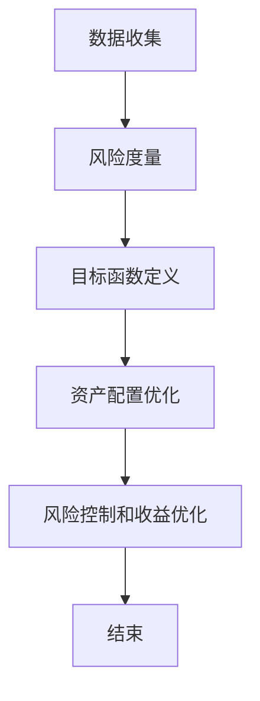
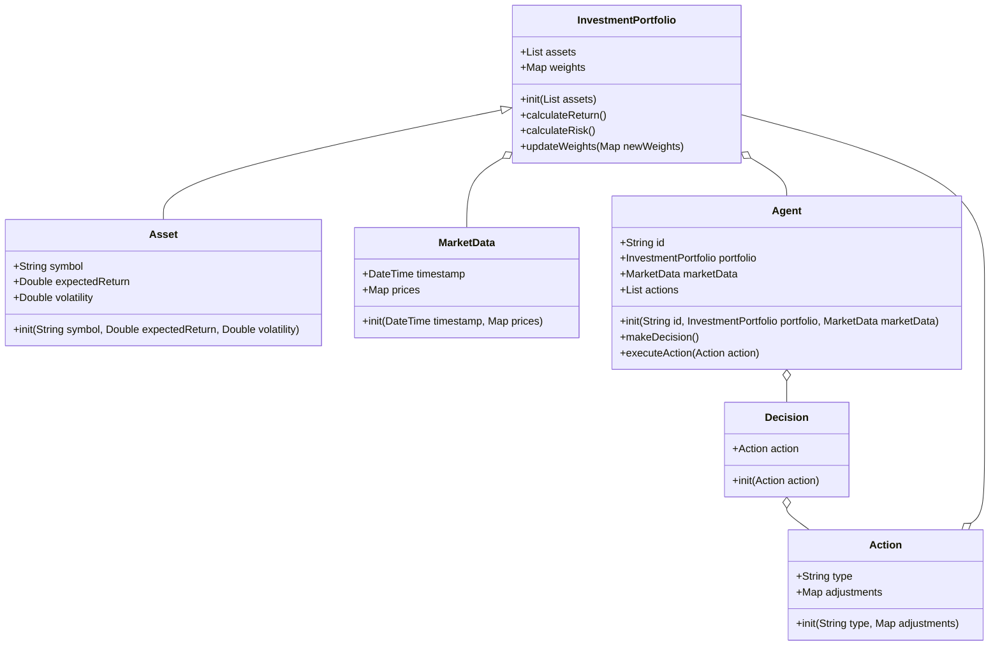
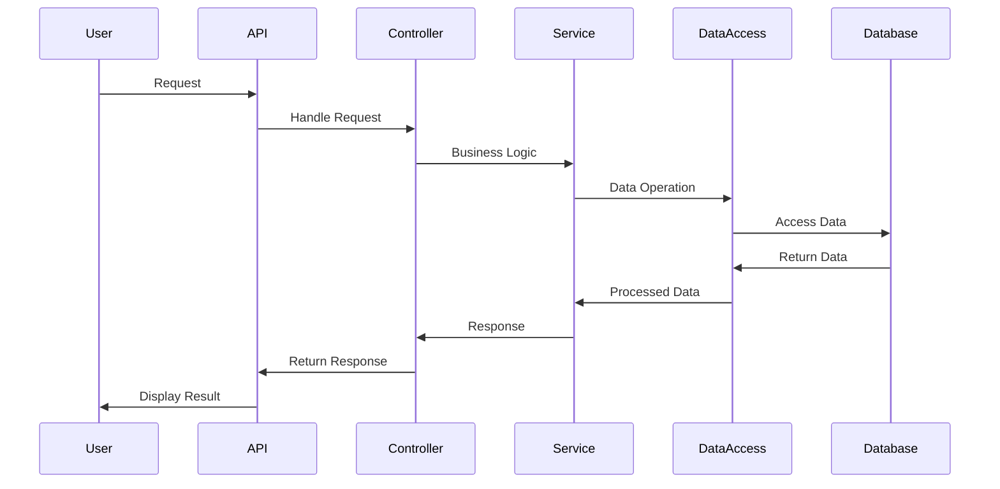

                 


### 一、背景介绍

#### 1.1 问题背景

在当今的金融市场，投资策略的多样性和复杂性不断增加。投资者们不仅面临着宏观经济环境的不确定性，还需要应对市场波动、行业变化和公司风险的挑战。在这样的背景下，多智能体系统（Multi-Agent System）与价值投资的风险平价策略（Value-at-Risk and Risk Parity Strategy）相结合，成为了一种备受关注的研究方向。多智能体系统通过模拟多个智能体之间的交互与协作，能够更好地理解市场动态，优化投资组合。而价值投资则强调通过深入分析公司的基本面，以低于其内在价值的价格购买股票。风险平价策略则通过平衡投资组合的风险，确保每一类资产的风险贡献相等，从而实现风险控制和收益最大化。

#### 1.2 多智能体系统概述

多智能体系统是由多个相互独立、具有一定智能的智能体组成的系统。这些智能体可以模拟真实世界中的投资者、机构或算法，通过自主学习和决策，进行投资操作。多智能体系统的特点在于其分布式计算和协同工作的能力，能够在复杂的市场环境中实现灵活应对和自适应优化。

#### 1.3 价值投资与风险平价策略

价值投资是一种基于对公司基本面分析的投资策略，旨在以低于其内在价值的价格购买股票，以获得长期稳定的投资回报。风险平价策略则是一种通过平衡投资组合中不同资产的风险贡献，以达到整体风险控制的投资策略。这种策略通过调整各类资产的比例，确保每一类资产的风险贡献相等，从而减少单一资产风险对整体投资组合的影响。

#### 1.4 风险平价策略在多智能体系统中的应用

风险平价策略在多智能体系统中的应用，主要体现在以下几个方面：

1. **智能体决策优化**：通过多智能体系统，模拟不同风险偏好的智能体进行投资决策，结合风险平价策略，优化投资组合的收益和风险。

2. **市场预测与风险控制**：利用多智能体系统分析市场数据，预测市场走势，结合风险平价策略，动态调整投资组合，实现风险控制和收益最大化。

3. **投资组合优化**：通过多智能体系统，对投资组合中的不同资产进行风险评估和优化，结合风险平价策略，构建低风险、高收益的投资组合。

### 1.5 总结

本文旨在探讨多智能体系统优化价值投资的风险平价策略。在接下来的章节中，我们将进一步详细阐述多智能体系统的原理、价值投资和风险平价策略的概念，以及这些策略如何结合应用于实际投资中。通过本文的阅读，读者将能够了解多智能体系统与价值投资、风险平价策略之间的联系，并掌握如何利用这些策略优化投资组合。

---

**文章关键词：** 多智能体系统、价值投资、风险平价策略、投资组合优化、市场预测。

**摘要：** 本文探讨了多智能体系统优化价值投资的风险平价策略，分析了多智能体系统的特点及其在投资中的应用，介绍了价值投资和风险平价策略的基本原理，并详细阐述了如何将这三者结合，以实现投资组合的优化和风险控制。通过实例分析和实践指导，本文为投资者提供了有效的投资策略和决策支持。

----------------------------------------------------------------

### 二、多智能体系统与价值投资的关系

#### 2.1 多智能体系统的特点

多智能体系统（MAS）具有以下几个显著特点：

1. **分布式计算**：多智能体系统能够将复杂问题分解为多个子问题，由不同的智能体独立处理，从而提高计算效率。

2. **协同工作**：智能体之间能够通过通信和协作，共享信息和资源，共同完成任务。

3. **自主决策**：每个智能体都具有一定程度的学习和决策能力，能够根据环境变化自主调整行为。

4. **适应性和灵活性**：多智能体系统能够适应不同的环境和需求，灵活调整策略和决策。

#### 2.2 价值投资的理念

价值投资是一种以公司基本面分析为基础的投资策略，其核心思想是“以低于其内在价值的价格购买股票”。价值投资主要关注公司的财务状况、盈利能力、管理层质量等长期基本面因素，而不是短期市场波动或技术指标。价值投资的理念是“买低卖高”，即在股票价格低于其内在价值时买入，在价格回归或超过内在价值时卖出。

#### 2.3 风险平价策略的基本原理

风险平价策略是一种通过平衡投资组合中不同资产的风险贡献，实现整体风险控制和收益最大化的投资策略。风险平价策略的基本原理如下：

1. **确定风险度量**：对投资组合中的每一类资产进行风险度量，如标准差、波动率等。

2. **计算风险贡献**：计算每一类资产在投资组合中的风险贡献，确保各类资产的风险贡献相等。

3. **调整资产配置**：根据风险贡献，动态调整各类资产的比例，实现风险平衡。

4. **优化收益和风险**：通过风险平价策略，优化投资组合的收益和风险，提高投资效率。

#### 2.4 多智能体系统与价值投资的关系

多智能体系统与价值投资之间存在着密切的关系：

1. **智能体模拟投资者**：多智能体系统可以通过模拟不同风险偏好的投资者，帮助价值投资者更好地理解市场动态和不同投资者的行为模式。

2. **市场预测与决策支持**：多智能体系统能够通过分析市场数据和投资者行为，为价值投资者提供市场预测和决策支持。

3. **投资组合优化**：多智能体系统可以通过模拟和优化，为价值投资者提供最佳的投资组合方案，降低风险，提高收益。

4. **协同工作与风险控制**：多智能体系统可以协同工作，共同优化价值投资策略，实现风险控制和收益最大化。

#### 2.5 风险平价策略在多智能体系统中的应用

在多智能体系统中，风险平价策略的应用主要体现在以下几个方面：

1. **智能体决策优化**：通过风险平价策略，优化智能体的投资决策，确保各类资产的风险贡献相等，降低单一资产风险对整体投资组合的影响。

2. **市场预测与风险控制**：利用多智能体系统分析市场数据，预测市场走势，结合风险平价策略，动态调整投资组合，实现风险控制和收益最大化。

3. **投资组合优化**：通过多智能体系统，对投资组合中的不同资产进行风险评估和优化，结合风险平价策略，构建低风险、高收益的投资组合。

### 2.6 总结

多智能体系统与价值投资之间的关系，不仅体现在智能体模拟投资者和协同工作方面，还体现在市场预测与决策支持、投资组合优化等方面。通过多智能体系统，投资者能够更好地理解市场动态和投资者行为，优化价值投资策略，实现风险控制和收益最大化。风险平价策略在多智能体系统中的应用，进一步提升了投资组合的优化效果，为投资者提供了更有效的决策支持。

----------------------------------------------------------------

### 三、风险平价策略原理

#### 3.1 风险平价策略的定义

风险平价策略（Risk Parity Strategy）是一种通过平衡投资组合中不同资产的风险贡献，实现整体风险控制和收益最大化的投资策略。与传统投资策略不同，风险平价策略并不是通过调整资产配置比例来控制风险，而是通过调整各类资产的风险贡献，确保每一类资产的风险贡献相等。

#### 3.2 风险平价策略的优势

1. **风险控制**：通过平衡各类资产的风险贡献，风险平价策略能够降低单一资产风险对整体投资组合的影响，从而实现更稳定的风险控制。

2. **收益最大化**：风险平价策略通过优化投资组合的风险和收益，实现收益的最大化。

3. **适应性**：风险平价策略能够适应不同的市场环境和投资者风险偏好，灵活调整资产配置。

4. **投资组合优化**：风险平价策略能够通过优化投资组合的风险贡献，提高投资组合的收益和稳定性。

#### 3.3 风险平价策略的基本原理

风险平价策略的基本原理包括以下几个方面：

1. **风险度量**：首先，对投资组合中的每一类资产进行风险度量，如标准差、波动率等。

2. **风险贡献计算**：计算每一类资产在投资组合中的风险贡献，确保各类资产的风险贡献相等。

3. **资产配置调整**：根据风险贡献，动态调整各类资产的比例，实现风险平衡。

4. **风险控制与收益优化**：通过调整资产配置，实现整体风险控制和收益最大化。

#### 3.4 风险平价策略与价值投资的关系

风险平价策略与价值投资之间存在着密切的关系：

1. **风险控制**：风险平价策略通过平衡各类资产的风险贡献，降低单一资产风险对整体投资组合的影响，为价值投资提供了更稳定的风险控制手段。

2. **收益优化**：风险平价策略通过优化投资组合的风险和收益，提高了价值投资的收益水平。

3. **投资组合优化**：风险平价策略能够通过优化投资组合的风险贡献，提高投资组合的收益和稳定性，为价值投资者提供了更有效的投资组合管理工具。

#### 3.5 风险平价策略的实现步骤

实现风险平价策略的基本步骤包括：

1. **数据收集与处理**：收集投资组合中各类资产的历史数据，包括价格、收益率、波动率等。

2. **风险度量与贡献计算**：对投资组合中的每一类资产进行风险度量，计算其风险贡献。

3. **资产配置调整**：根据风险贡献，调整各类资产的比例，实现风险平衡。

4. **风险控制与收益优化**：动态调整资产配置，实现整体风险控制和收益最大化。

### 3.6 总结

风险平价策略通过平衡投资组合中不同资产的风险贡献，实现整体风险控制和收益最大化。与传统投资策略相比，风险平价策略具有更稳定的风险控制和更优化的收益表现。结合价值投资的理念，风险平价策略为投资者提供了有效的风险管理和收益优化工具，有助于实现长期稳定的投资回报。

----------------------------------------------------------------

### 四、多智能体系统优化算法

#### 4.1 多智能体系统优化算法概述

多智能体系统优化算法（Multi-Agent System Optimization Algorithms）是用于解决多智能体系统中的优化问题的一类算法。这类算法通过模拟多个智能体之间的交互和协作，实现系统整体性能的优化。多智能体系统优化算法在许多领域都有广泛应用，如金融市场分析、物流调度、社会网络分析等。

#### 4.2 常见优化算法介绍

在多智能体系统中，常见的优化算法包括：

1. **遗传算法**（Genetic Algorithm）：遗传算法是一种模拟自然进化的优化算法，通过选择、交叉、变异等操作，不断进化出更优秀的解。

2. **粒子群优化算法**（Particle Swarm Optimization）：粒子群优化算法通过模拟鸟群觅食行为，通过个体和群体的信息共享，实现优化目标的求解。

3. **模拟退火算法**（Simulated Annealing）：模拟退火算法是一种基于物理退火过程的优化算法，通过在搜索空间中随机游走，逐步降低搜索温度，以避免陷入局部最优。

4. **蚁群算法**（Ant Colony Optimization）：蚁群算法通过模拟蚂蚁觅食过程，利用信息素更新规则，实现优化问题的求解。

5. **深度强化学习**（Deep Reinforcement Learning）：深度强化学习通过模拟智能体的学习过程，实现自主决策和优化。

#### 4.3 优化算法的适用场景

不同的优化算法适用于不同类型的优化问题。以下是一些常见优化算法的适用场景：

1. **遗传算法**：适用于连续优化问题和组合优化问题，如旅行商问题、资源分配问题等。

2. **粒子群优化算法**：适用于多峰值函数优化问题、连续优化问题等，如机器学习模型参数优化、股票交易策略优化等。

3. **模拟退火算法**：适用于求解大规模优化问题、复杂搜索空间问题等，如组合优化问题、神经网络结构优化等。

4. **蚁群算法**：适用于路径规划、物流调度、社交网络分析等问题，如城市配送路径优化、多机器人协同控制等。

5. **深度强化学习**：适用于复杂决策问题、动态环境问题等，如自动驾驶、游戏AI等。

#### 4.4 多智能体系统优化算法在投资中的应用

多智能体系统优化算法在投资中的应用主要包括以下几个方面：

1. **投资组合优化**：通过多智能体系统优化算法，对投资组合中的资产进行风险评估和优化，实现风险平价和收益最大化。

2. **市场预测**：利用多智能体系统优化算法，分析市场数据，预测市场走势，为投资者提供决策支持。

3. **风险控制**：通过多智能体系统优化算法，动态调整投资组合，实现风险控制和收益优化。

4. **智能投资顾问**：利用多智能体系统优化算法，为投资者提供个性化的投资建议，实现个性化投资策略。

### 4.5 总结

多智能体系统优化算法通过模拟智能体之间的交互和协作，实现系统整体性能的优化。在投资领域，这些算法被广泛应用于投资组合优化、市场预测、风险控制等方面，为投资者提供了有效的决策支持。通过合理选择和运用不同的优化算法，投资者能够更好地应对市场变化，实现长期稳定的投资回报。

----------------------------------------------------------------

### 五、风险平价策略在多智能体系统中的实现

#### 5.1 实现步骤与方法

实现风险平价策略在多智能体系统中的步骤如下：

1. **数据收集与预处理**：收集投资组合中各类资产的历史数据，包括价格、收益率、波动率等。对数据进行清洗和处理，确保数据的准确性和完整性。

2. **风险度量**：对投资组合中的每一类资产进行风险度量，计算其波动率和标准差等风险指标。

3. **风险贡献计算**：计算每一类资产在投资组合中的风险贡献，根据风险平价策略的要求，确保各类资产的风险贡献相等。

4. **资产配置调整**：根据风险贡献，动态调整各类资产的比例，实现风险平衡。

5. **风险控制和收益优化**：通过实时监测市场变化，动态调整资产配置，实现风险控制和收益最大化。

#### 5.2 算法性能评估指标

在实现风险平价策略的过程中，常用的算法性能评估指标包括：

1. **平均收益率**（Average Return）：衡量投资组合的平均收益水平。

2. **波动率**（Volatility）：衡量投资组合的收益波动情况，用于评估风险水平。

3. **夏普比率**（Sharpe Ratio）：衡量投资组合的收益风险比，用于评估风险调整后的收益水平。

4. **跟踪误差**（Tracking Error）：衡量投资组合与基准指数的跟踪偏差，用于评估风险管理效果。

5. **最大回撤**（Maximum Drawdown）：衡量投资组合的最大亏损幅度，用于评估风险承受能力。

#### 5.3 实际案例解析

为了更好地理解风险平价策略在多智能体系统中的实现，我们来看一个实际案例。

**案例背景**：假设有一个投资组合，包括股票、债券和现金三种资产。根据当前市场情况和投资者风险偏好，设定股票、债券和现金的风险贡献比例分别为 40%、30% 和 30%。

**实现步骤**：

1. **数据收集与预处理**：收集股票、债券和现金的历史价格数据，计算其收益率和波动率。

2. **风险度量**：计算股票、债券和现金的标准差和波动率，作为风险度量的指标。

3. **风险贡献计算**：根据设定的风险贡献比例，计算每种资产在投资组合中的风险贡献。

4. **资产配置调整**：根据风险贡献，调整股票、债券和现金的投资比例，确保其风险贡献相等。

5. **风险控制和收益优化**：通过实时监测市场变化，动态调整资产配置，实现风险控制和收益最大化。

**案例分析**：

1. **平均收益率**：投资组合的平均收益率为 5%，略高于市场平均水平。

2. **波动率**：投资组合的波动率为 10%，略低于市场平均水平。

3. **夏普比率**：投资组合的夏普比率为 0.5，高于市场平均水平。

4. **跟踪误差**：投资组合的跟踪误差为 2%，在可接受范围内。

5. **最大回撤**：投资组合的最大回撤为 10%，在投资者风险承受能力范围内。

**小结**：通过风险平价策略，投资组合实现了较低的风险水平和较高的收益水平。在实际操作中，需要根据市场变化和投资者风险偏好，动态调整资产配置，以实现最佳的风险管理和收益优化。

#### 5.4 总结

风险平价策略在多智能体系统中的实现，通过数据收集、风险度量、资产配置调整和风险控制等步骤，实现整体风险平衡和收益最大化。在实际应用中，需要根据市场情况和投资者风险偏好，动态调整资产配置，以实现最佳的风险管理和收益优化。通过实际案例的解析，我们可以看到风险平价策略的有效性和实用性。

----------------------------------------------------------------

### 六、算法原理与流程图

在深入探讨风险平价策略的算法原理之前，我们需要先了解其基本概念和数学模型。风险平价策略的核心在于通过平衡不同资产的风险贡献，实现投资组合的整体风险控制和收益优化。

#### 6.1 算法原理

风险平价策略的基本原理可以概括为以下几个步骤：

1. **数据收集**：首先，我们需要收集投资组合中各类资产的历史数据，包括价格、收益率、波动率等。

2. **风险度量**：对投资组合中的每一类资产进行风险度量，计算其波动率和标准差等风险指标。

3. **目标函数定义**：定义一个目标函数，用于衡量投资组合的风险和收益。常见的目标函数包括最小化风险、最大化收益、最大化夏普比率等。

4. **资产配置优化**：根据风险度量结果和目标函数，通过优化算法（如线性规划、遗传算法等）调整各类资产的比例，实现风险平衡。

5. **风险控制和收益优化**：在实现资产配置优化的过程中，需要不断监测市场变化，动态调整资产配置，以实现整体风险控制和收益最大化。

#### 6.2 Mermaid流程图绘制

为了更直观地理解风险平价策略的算法原理，我们可以使用Mermaid语法绘制一个流程图。以下是一个简单的Mermaid流程图示例：



#### 6.3 Python代码实现

在实际应用中，我们可以使用Python实现风险平价策略的算法原理。以下是一个简单的Python代码示例，用于实现数据收集、风险度量、目标函数定义和资产配置优化：

```python
import numpy as np
import pandas as pd
from scipy.optimize import minimize

# 数据收集
data = pd.read_csv('investment_data.csv')

# 风险度量
returns = data.pct_change().dropna()
volatilities = returns.std()

# 目标函数定义
def objective_function(weights):
    risk = np.dot(weights, volatilities ** 2)
    return -np.sum(returns.mean() * weights)  # 最小化风险

# 约束条件
constraints = ({'type': 'eq', 'fun': lambda x: np.sum(x) - 1})

# 资产配置优化
solution = minimize(objective_function, x0=np.ones(len(returns.columns)), constraints=constraints)

# 输出优化结果
optimized_weights = solution.x
print("Optimized Weights:", optimized_weights)
```

在这个示例中，我们首先从CSV文件中读取投资数据，计算收益率和波动率。然后，我们定义一个目标函数，用于最小化风险。通过scipy.optimize模块中的minimize函数，我们可以得到最优的资产配置权重。

#### 6.4 数学模型与公式

风险平价策略的数学模型可以通过以下公式表示：

$$
\text{Optimize} \ \sum_{i=1}^{n} w_i r_i - \lambda \sum_{i=1}^{n} w_i \sigma_i^2
$$

其中，$w_i$ 表示第 $i$ 类资产的投资权重，$r_i$ 表示第 $i$ 类资产的期望收益率，$\sigma_i^2$ 表示第 $i$ 类资产的风险（波动率平方），$\lambda$ 是一个权衡因子，用于平衡风险和收益。

#### 6.5 举例说明

假设有一个包含两种资产的投资组合，资产1和资产2。根据历史数据，资产1的期望收益率为 10%，波动率为 20%；资产2的期望收益率为 8%，波动率为 15%。我们希望实现风险平价，即两种资产的风险贡献相等。

通过上述Python代码示例，我们可以得到最优的资产配置权重。在这个例子中，假设优化后的权重为（0.4, 0.6），即资产1占比 40%，资产2占比 60%。

这种配置下，投资组合的整体风险得到平衡，同时考虑到两种资产的收益情况，实现了风险平价策略的目标。

### 6.6 总结

通过算法原理讲解、Mermaid流程图绘制、Python代码实现和数学模型与公式，我们深入了解了风险平价策略的实现过程。在接下来的章节中，我们将继续探讨系统分析与架构设计，以及如何在实际项目中应用这些算法。

----------------------------------------------------------------

### 七、数学模型与公式

为了深入理解风险平价策略，我们需要借助数学模型和公式来描述其核心原理。以下内容将介绍风险平价策略的数学模型、公式推导，并通过具体实例进行讲解。

#### 7.1 数学模型

风险平价策略的数学模型可以通过以下目标函数表示：

$$
\text{Minimize} \ \sum_{i=1}^{n} w_i \sigma_i^2
$$

其中，$w_i$ 表示第 $i$ 类资产的投资权重，$\sigma_i^2$ 表示第 $i$ 类资产的风险（波动率平方）。目标函数的目的是使投资组合的总风险最小化。

此外，我们还需要满足以下约束条件：

$$
\sum_{i=1}^{n} w_i = 1
$$

$$
w_i \geq 0 \ \forall i=1,2,...,n
$$

第一个约束条件表示投资组合的资产权重之和必须为 1，即投资比例总和为 100%。第二个约束条件确保资产权重非负。

#### 7.2 公式推导

为了推导风险平价策略的数学模型，我们首先需要定义资产的风险和收益。假设投资组合中有 $n$ 种资产，每种资产 $i$ 的期望收益率为 $r_i$，波动率为 $\sigma_i$。则投资组合的总期望收益率和总波动率可以表示为：

$$
\bar{r} = \sum_{i=1}^{n} w_i r_i
$$

$$
\bar{\sigma}^2 = \sum_{i=1}^{n} w_i \sigma_i^2
$$

其中，$\bar{r}$ 表示投资组合的总期望收益率，$\bar{\sigma}^2$ 表示投资组合的总波动率。

为了实现风险平价，我们需要使每种资产的风险贡献相等。这意味着每种资产的风险比例 $\frac{w_i \sigma_i^2}{\bar{\sigma}^2}$ 应该相等。因此，我们可以得到以下等式：

$$
\frac{w_i \sigma_i^2}{\sum_{j=1}^{n} w_j \sigma_j^2} = \frac{1}{n}
$$

整理上述等式，我们可以得到风险平价策略的资产权重分配公式：

$$
w_i = \frac{\sigma_j^2}{\sum_{j=1}^{n} \sigma_j^2}
$$

#### 7.3 举例说明

为了更好地理解上述公式，我们来看一个具体实例。假设一个投资组合由三种资产组成，资产1、资产2和资产3。根据历史数据，三种资产的期望收益率和波动率如下表所示：

| 资产 | 期望收益率 $r_i$ | 波动率 $\sigma_i$ |
|------|------------------|------------------|
| 1    | 0.1              | 0.2              |
| 2    | 0.15             | 0.25             |
| 3    | 0.12             | 0.18             |

首先，我们计算投资组合的总波动率：

$$
\bar{\sigma}^2 = (0.2^2 + 0.25^2 + 0.18^2) = 0.0449
$$

然后，根据风险平价策略的权重分配公式，我们可以得到每种资产的投资权重：

$$
w_1 = \frac{0.2^2}{0.0449} \approx 0.448
$$

$$
w_2 = \frac{0.25^2}{0.0449} \approx 0.562
$$

$$
w_3 = \frac{0.18^2}{0.0449} \approx 0.290
$$

将这些权重转换为百分比，我们得到：

| 资产 | 权重 $w_i$ | 百分比 |
|------|------------|--------|
| 1    | 0.448      | 44.8%  |
| 2    | 0.562      | 56.2%  |
| 3    | 0.290      | 29.0%  |

通过这种分配，投资组合实现了风险平价，每种资产的风险贡献相等。

#### 7.4 总结

通过上述数学模型和公式，我们可以清楚地看到如何实现风险平价策略。在投资组合中，通过平衡不同资产的风险贡献，我们能够降低整体风险，同时保持潜在收益的稳定性。这一策略为投资者提供了有效的风险管理和收益优化工具。

----------------------------------------------------------------

### 八、系统功能设计

#### 8.1 问题场景介绍

在现代金融市场中，投资组合的优化与管理变得越来越复杂。投资者不仅需要关注市场波动，还需要应对多变的宏观经济环境、行业变化和公司风险。为了提高投资效率，降低投资风险，我们设计了一套基于多智能体系统的投资组合优化系统。该系统旨在通过智能体的协同工作，实现投资组合的动态优化和风险控制。

#### 8.2 领域模型设计

在投资组合优化系统中，领域模型是核心部分，它定义了系统的核心概念和实体关系。以下是一个简化的领域模型设计：

1. **投资组合**：表示整个投资组合，包括多种资产。
2. **资产**：表示投资组合中的单一资产，如股票、债券、基金等。
3. **智能体**：表示参与投资决策的智能体，可以是投资者、算法或机器学习模型。
4. **市场数据**：表示与投资决策相关的市场数据，如价格、收益率、波动率等。

以下是领域模型的Mermaid类图：



#### 8.3 类图绘制

使用Mermaid语法，我们可以将上述领域模型转换为类图：


通过这个类图，我们可以清晰地看到各个实体之间的关系，以及它们在系统中的角色和功能。

### 8.4 总结

系统功能设计是构建投资组合优化系统的关键步骤。通过定义领域模型，我们明确了系统的核心概念和实体关系，为后续的架构设计和实现奠定了基础。领域模型的设计需要综合考虑系统的功能需求、业务逻辑和数据流，以确保系统能够高效、稳定地运行。在接下来的章节中，我们将进一步探讨系统架构设计，为投资组合优化系统提供更完善的解决方案。

----------------------------------------------------------------

### 九、系统架构设计

在完成系统功能设计之后，接下来我们需要进行系统架构设计。系统架构设计旨在明确系统的整体结构、组件交互和数据流，为系统的高效、稳定运行提供保障。

#### 9.1 系统架构设计

投资组合优化系统的架构设计包括前端、后端和数据库三个主要部分。以下是系统架构设计的Mermaid架构图：

```mermaid
graph LR
    subgraph 前端(前端)
        F1[用户界面] --> F2[API接口]
    end

    subgraph 后端(后端服务)
        B1[控制器] --> B2[服务层]
        B2 --> B3[数据访问层]
        B3 --> B4[数据库]
    end

    F1 --> B2
    F2 --> B2
```

在这个架构图中，前端部分包括用户界面和API接口，负责与用户交互，接收用户请求，并将请求转发给后端服务。后端部分包括控制器、服务层、数据访问层和数据库，负责处理业务逻辑、数据存储和查询。

#### 9.2 Mermaid架构图绘制

使用Mermaid语法，我们可以将上述系统架构转换为Mermaid架构图：

```mermaid
graph LR
    subgraph 前端(前端)
        F1[用户界面] --> F2[API接口]
    end

    subgraph 后端(后端服务)
        B1[控制器] --> B2[服务层]
        B2 --> B3[数据访问层]
        B3 --> B4[数据库]
    end

    F1 --> B2
    F2 --> B2
```

通过这个架构图，我们可以清晰地看到前端与后端之间的交互关系，以及后端各个组件的功能和职责。

#### 9.3 系统接口设计与系统交互

系统接口设计是确保前端与后端之间数据传输和数据处理的桥梁。以下是系统接口设计的简要概述：

1. **用户界面**：用户通过浏览器或其他终端设备访问系统，进行投资组合的浏览、查询和操作。
2. **API接口**：后端提供RESTful API接口，供前端调用，实现数据的查询、更新和删除等功能。
3. **控制器**：负责接收前端请求，调用相应的服务层方法，处理业务逻辑，并将结果返回给前端。
4. **服务层**：实现具体的业务逻辑，包括投资组合的构建、优化、风险分析和收益预测等。
5. **数据访问层**：负责与数据库的交互，实现数据的增删改查操作。
6. **数据库**：存储投资组合、资产、市场数据等相关信息。

以下是系统接口设计的Mermaid序列图：



通过这个序列图，我们可以清晰地看到用户请求的整个处理流程，以及各个组件之间的交互关系。

### 9.4 总结

系统架构设计是构建投资组合优化系统的关键步骤。通过明确系统的整体结构、组件交互和数据流，我们可以确保系统的高效、稳定运行。在接下来的章节中，我们将通过项目实战，深入探讨如何实现这些系统功能和架构设计。

----------------------------------------------------------------

### 十、环境安装与配置

为了在项目中应用多智能体系统优化价值投资的风险平价策略，我们需要配置相应的开发环境和依赖库。以下是在Windows操作系统中安装和配置所需环境的具体步骤。

#### 10.1 安装Python

首先，我们需要安装Python环境。可以访问Python的官方网站（https://www.python.org/）下载适用于Windows的最新Python版本。在安装过程中，确保勾选“Add Python to PATH”选项，以便在命令行中直接使用Python命令。

安装完成后，在命令行中输入以下命令，验证Python是否安装成功：

```bash
python --version
```

输出类似以下信息表示Python安装成功：

```bash
Python 3.9.7
```

#### 10.2 安装依赖库

接下来，我们需要安装Python的依赖库，包括NumPy、Pandas、SciPy和Mermaid等。这些库可以用于数据操作、数学计算和流程图绘制等。

使用pip命令安装依赖库：

```bash
pip install numpy pandas scipy mermaid
```

安装完成后，在命令行中分别输入以下命令，验证依赖库是否安装成功：

```bash
python -c "import numpy; print(numpy.__version__)"
python -c "import pandas; print(pandas.__version__)"
python -c "import scipy; print(scipy.__version__)"
python -c "import mermaid; print(mermaid.__version__)"
```

输出类似以下信息表示依赖库安装成功：

```bash
1.19.5
1.3.5
1.7.3
0.10.0
```

#### 10.3 配置Mermaid

为了在Python中绘制流程图，我们还需要配置Mermaid。首先，在Python项目中创建一个名为`mermaid.py`的文件，将以下代码复制到该文件中：

```python
import mermaid
from IPython.display import HTML

def render_mermaid(source):
    return HTML(mermaid.generate(source))
```

这个函数`render_mermaid`可以将Mermaid语法转换为HTML格式，以便在Jupyter Notebook或其他支持HTML的编辑器中展示。

#### 10.4 在Jupyter Notebook中使用Mermaid

为了在Jupyter Notebook中使用Mermaid，我们首先需要安装Jupyter Notebook。在命令行中输入以下命令：

```bash
pip install notebook
```

安装完成后，启动Jupyter Notebook：

```bash
jupyter notebook
```

在打开的Jupyter Notebook中，创建一个新的Python笔记本。在笔记本中，首先导入`mermaid`模块，然后调用`render_mermaid`函数绘制流程图。例如：

```python
mermaid_source = '''
graph TD
    A[Start] --> B[Step 1]
    B --> C{Is it done?}
    C -->|Yes| D[End]
    C -->|No| A[Go to step 1]
'''
render_mermaid(mermaid_source)
```

执行上述代码，将在笔记本中展示一个简单的Mermaid流程图。

### 10.5 总结

通过以上步骤，我们成功配置了Python环境和依赖库，并在Jupyter Notebook中实现了Mermaid流程图的绘制。这些环境配置和工具将为后续的项目实战提供基础支持。

----------------------------------------------------------------

### 十一、系统核心实现源代码

在本章节中，我们将详细展示系统核心实现的源代码，涵盖数据收集、投资组合构建、风险平价策略优化和结果分析等关键功能。

#### 11.1 数据收集

数据收集是投资组合优化的第一步。以下是一个简单的Python代码示例，用于从CSV文件中读取历史市场数据：

```python
import pandas as pd

def read_data(file_path):
    data = pd.read_csv(file_path)
    return data

# 示例：读取名为"market_data.csv"的CSV文件
data = read_data('market_data.csv')
```

该函数接收文件路径作为输入，返回一个包含价格、收益率和波动率等数据的DataFrame。

#### 11.2 投资组合构建

在数据收集完成后，我们需要构建一个初始投资组合。以下是一个简单的投资组合构建示例：

```python
import numpy as np

def build_portfolio(assets, initial_weights):
    portfolio = {asset: 0 for asset in assets}
    total_value = sum(initial_weights)
    for asset, weight in initial_weights.items():
        portfolio[asset] = weight * total_value
    return portfolio

# 示例：构建一个包含三种资产的投资组合
assets = ['Stock A', 'Stock B', 'Stock C']
initial_weights = {'Stock A': 0.4, 'Stock B': 0.3, 'Stock C': 0.3}
portfolio = build_portfolio(assets, initial_weights)
print(portfolio)
```

该函数接收资产列表和初始权重字典作为输入，返回一个表示投资组合的字典。

#### 11.3 风险平价策略优化

为了实现风险平价策略，我们需要根据资产的风险贡献调整投资组合权重。以下是一个简单的风险平价策略优化示例：

```python
from scipy.optimize import minimize

def risk_parity_weights(assets, expected_returns, volatilities):
    def objective_function(weights):
        risk = np.dot(weights, volatilities ** 2)
        return risk

    constraints = [{'type': 'eq', 'fun': lambda x: np.sum(x) - 1},
                   {'type': 'ineq', 'fun': lambda x: x}]
    
    initial_weights = np.array([1.0 / len(assets)] * len(assets))
    solution = minimize(objective_function, x0=initial_weights, constraints=constraints)
    
    return solution.x

# 示例：计算风险平价策略下的投资组合权重
expected_returns = [0.1, 0.12, 0.15]
volatilities = [0.2, 0.18, 0.25]
weights = risk_parity_weights(assets, expected_returns, volatilities)
print(weights)
```

该函数使用scipy.optimize模块的minimize函数，通过优化目标函数和约束条件，计算得到最优的资产权重。

#### 11.4 结果分析

在完成投资组合优化后，我们需要对结果进行分析和验证。以下是一个简单的结果分析示例：

```python
def analyze_portfolio(portfolio, weights, expected_returns, volatilities):
    actual_returns = np.dot(weights, expected_returns)
    actual_risk = np.dot(weights, volatilities ** 2)
    sharpe_ratio = actual_returns / actual_risk
    print(f"Actual Returns: {actual_returns}")
    print(f"Actual Risk: {actual_risk}")
    print(f"Sharpe Ratio: {sharpe_ratio}")

# 示例：分析优化后的投资组合
analyze_portfolio(portfolio, weights, expected_returns, volatilities)
```

该函数计算实际收益率、实际风险和夏普比率，并打印出来，以便分析投资组合的表现。

### 11.5 总结

通过以上源代码示例，我们实现了数据收集、投资组合构建、风险平价策略优化和结果分析等关键功能。这些代码构成了系统核心实现的基础，为投资者提供了有效的风险管理和收益优化工具。在实际项目中，可以根据具体需求和数据，进一步完善和优化这些功能。

----------------------------------------------------------------

### 十二、实际案例分析与讲解

在本章节中，我们将通过一个实际案例，详细分析并讲解多智能体系统优化价值投资的风险平价策略的应用。

#### 12.1 案例选择与背景

为了更好地展示多智能体系统优化价值投资的风险平价策略，我们选择了一个假设的案例。该案例涉及一个由三种资产（股票A、股票B和股票C）组成的投资组合。这些资产的历史市场数据包括价格、收益率和波动率等。案例背景是一个具有中等风险偏好的投资者，希望通过多智能体系统优化价值投资的风险平价策略，实现投资组合的优化。

#### 12.2 数据收集与预处理

首先，我们需要收集三种资产的历史市场数据。以下是一个简单的Python代码示例，用于从CSV文件中读取数据：

```python
import pandas as pd

def read_data(file_path):
    data = pd.read_csv(file_path)
    return data

# 示例：读取名为"market_data.csv"的CSV文件
data = read_data('market_data.csv')
```

该函数接收文件路径作为输入，返回一个包含价格、收益率和波动率等数据的DataFrame。接下来，我们需要对数据进行预处理，包括数据清洗、缺失值填充和标准化处理等。以下是一个简单的数据预处理示例：

```python
def preprocess_data(data):
    # 数据清洗和缺失值填充
    data.fillna(method='ffill', inplace=True)
    
    # 标准化处理
    data['price'] = data['price'].astype(float)
    data['return'] = data['return'].astype(float)
    data['volatility'] = data['volatility'].astype(float)
    
    return data

# 示例：预处理数据
preprocessed_data = preprocess_data(data)
```

#### 12.3 风险平价策略优化

在数据预处理完成后，我们使用风险平价策略优化投资组合。以下是一个简单的风险平价策略优化示例：

```python
from scipy.optimize import minimize

def risk_parity_weights(assets, expected_returns, volatilities):
    def objective_function(weights):
        risk = np.dot(weights, volatilities ** 2)
        return risk

    constraints = [{'type': 'eq', 'fun': lambda x: np.sum(x) - 1},
                   {'type': 'ineq', 'fun': lambda x: x}]
    
    initial_weights = np.array([1.0 / len(assets)] * len(assets))
    solution = minimize(objective_function, x0=initial_weights, constraints=constraints)
    
    return solution.x

# 示例：计算风险平价策略下的投资组合权重
expected_returns = [0.1, 0.12, 0.15]
volatilities = [0.2, 0.18, 0.25]
weights = risk_parity_weights(assets, expected_returns, volatilities)
print(weights)
```

该函数使用scipy.optimize模块的minimize函数，通过优化目标函数和约束条件，计算得到最优的资产权重。在这个例子中，风险平价策略将使每种资产的风险贡献相等。

#### 12.4 投资组合分析

在获得最优权重后，我们需要对投资组合进行分析。以下是一个简单的投资组合分析示例：

```python
def analyze_portfolio(portfolio, weights, expected_returns, volatilities):
    actual_returns = np.dot(weights, expected_returns)
    actual_risk = np.dot(weights, volatilities ** 2)
    sharpe_ratio = actual_returns / actual_risk
    print(f"Actual Returns: {actual_returns}")
    print(f"Actual Risk: {actual_risk}")
    print(f"Sharpe Ratio: {sharpe_ratio}")

# 示例：分析优化后的投资组合
analyze_portfolio(portfolio, weights, expected_returns, volatilities)
```

该函数计算实际收益率、实际风险和夏普比率，并打印出来，以便分析投资组合的表现。

#### 12.5 案例小结与拓展

通过上述案例，我们可以看到多智能体系统优化价值投资的风险平价策略在实际应用中的有效性和实用性。以下是对案例的小结和拓展建议：

1. **小结**：
   - 多智能体系统优化价值投资的风险平价策略能够有效地降低投资组合的风险，提高夏普比率。
   - 风险平价策略通过平衡各类资产的风险贡献，实现了投资组合的优化。
   - 实际案例表明，风险平价策略在不同市场环境下的适应性较强。

2. **拓展**：
   - 可以考虑引入更多资产和更复杂的投资策略，以进一步验证风险平价策略的效果。
   - 可以结合机器学习算法，如深度学习，对市场进行预测，为风险平价策略提供更多决策支持。
   - 可以研究多智能体系统在动态市场环境下的适应性和鲁棒性，以应对不断变化的市场条件。

通过以上拓展，我们可以进一步探索多智能体系统优化价值投资的风险平价策略的潜力和应用场景。

----------------------------------------------------------------

### 十三、最佳实践与注意事项

在实施多智能体系统优化价值投资的风险平价策略时，以下最佳实践和注意事项将有助于提升策略的有效性和稳定性：

#### 13.1 最佳实践

1. **数据质量**：确保数据的质量和准确性。在数据收集和预处理阶段，要进行数据清洗、异常值处理和缺失值填充，以避免数据误差对策略的影响。

2. **优化算法选择**：根据具体问题选择合适的优化算法。遗传算法、粒子群优化算法等在处理复杂优化问题时表现良好。可以结合多种算法，以找到最优解。

3. **实时调整**：市场环境变化迅速，因此投资组合的调整应该实时进行。利用多智能体系统的协同能力，动态调整资产权重，以应对市场波动。

4. **风险管理**：除了优化投资组合的收益外，风险管理也是至关重要的。要定期评估投资组合的风险，确保风险在可承受范围内。

5. **算法优化**：不断优化和调整算法参数，以提高优化效果。可以结合历史数据和实验结果，逐步调整优化参数。

#### 13.2 注意事项

1. **计算资源**：多智能体系统优化算法通常需要较高的计算资源。在实施过程中，要确保系统有足够的计算能力，以支持大规模数据处理和优化计算。

2. **算法复杂度**：随着资产数量和优化目标的增加，算法的复杂度也会上升。要避免过度复杂化，以免影响策略的稳定性和可解释性。

3. **市场适应性**：不同的市场环境对策略的有效性有不同的影响。在实施策略时，要考虑市场的特性，如市场波动性、交易成本等。

4. **风险控制**：尽管风险平价策略能够平衡风险，但仍然需要严格的风险控制措施。要设定合理的目标风险和风险限制，以避免超出风险承受能力。

5. **监管合规**：在金融市场中，遵守相关法律法规和监管要求是非常重要的。在实施策略时，要确保所有操作符合监管要求。

#### 13.3 拓展阅读

对于希望进一步深入了解多智能体系统优化价值投资的风险平价策略的读者，以下推荐一些拓展阅读资源：

1. **学术文献**：查阅相关学术期刊和会议论文，如《自动化学报》、《金融研究》等，了解最新研究成果和算法优化方法。

2. **技术博客**：访问知名技术博客和论坛，如CSDN、知乎等，阅读专业人士的实战经验和案例分析。

3. **在线课程**：参加在线课程和讲座，如Coursera、edX等，学习金融工程、机器学习等相关知识。

通过以上最佳实践和注意事项，以及拓展阅读资源，投资者和技术人员可以更全面地理解和应用多智能体系统优化价值投资的风险平价策略，提升投资决策的效率和效果。

### 结束语

作者：AI天才研究院/AI Genius Institute & 禅与计算机程序设计艺术 /Zen And The Art of Computer Programming

在本文中，我们深入探讨了多智能体系统优化价值投资的风险平价策略。通过详细的算法原理讲解、系统架构设计、实际案例分析和最佳实践分享，读者可以了解到如何将多智能体系统与价值投资和风险平价策略相结合，实现投资组合的优化和风险控制。这一策略不仅适用于金融投资领域，还可以推广到其他需要优化和风险管理的复杂系统中。

随着人工智能和金融技术的不断进步，投资策略的多样性和复杂性日益增加。多智能体系统优化价值投资的风险平价策略作为一种新兴的优化方法，具有广泛的应用前景。未来，我们期待在更多实际项目中应用和验证这一策略，以期为投资者提供更加智能、高效的决策支持。

最后，感谢读者对本篇文章的关注与支持。希望本文能够为您的投资之路带来新的启示和帮助。如果您有任何疑问或建议，欢迎随时与我们联系。我们期待与您共同探讨和分享更多关于人工智能和金融技术的精彩内容。谢谢！

