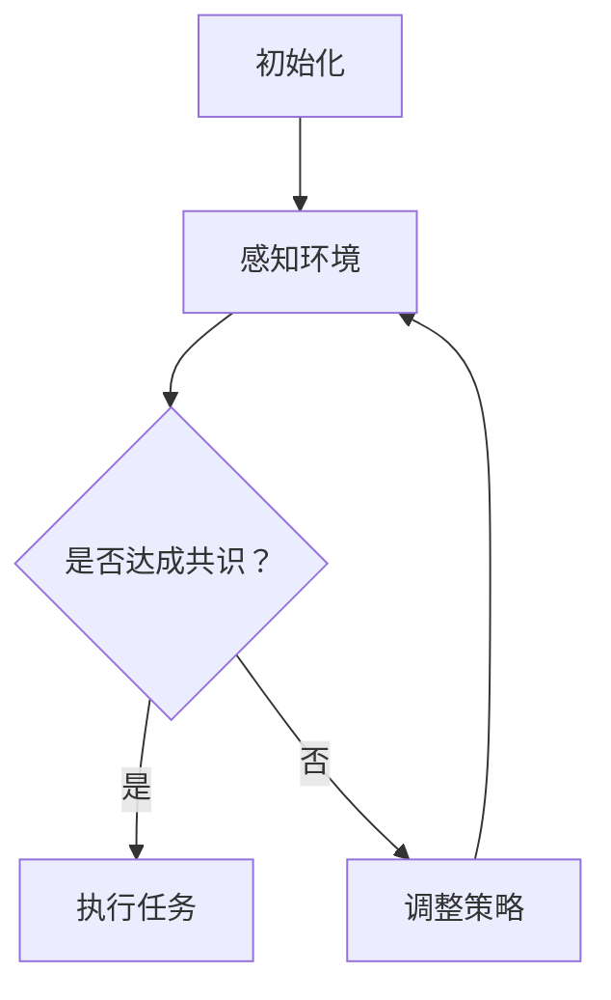
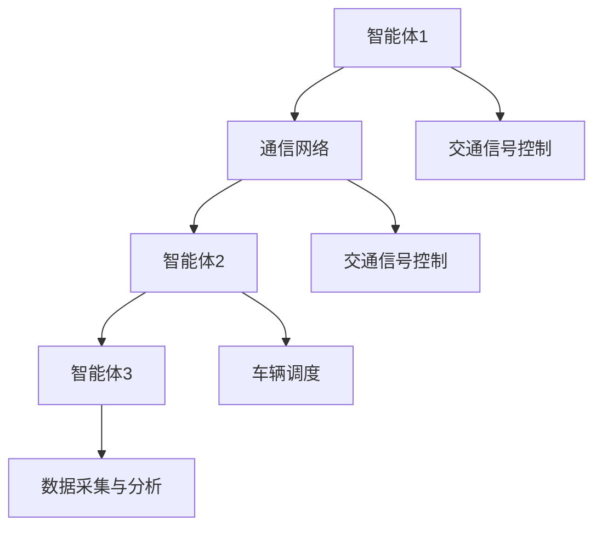
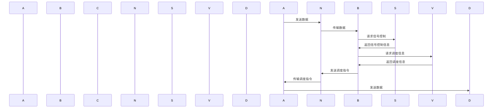

                 

### 多智能体系统分析产业生态系统

关键词：多智能体系统，产业应用，分布式计算，协同任务，动态决策

摘要：本文深入探讨了多智能体系统在产业生态系统中的应用，分析了其核心概念与算法原理，并通过实例说明了其在实际项目中的价值。本文旨在为读者提供一个全面了解多智能体系统在产业中应用的视角。

---

### 第一部分：背景介绍

#### 1. 问题背景

多智能体系统（MAS）作为一种分布式计算系统，近年来在人工智能和复杂系统领域得到了广泛关注。随着物联网、社交网络、智能交通等领域的迅猛发展，多智能体系统在协同完成任务、资源分配、动态决策等方面展现出巨大的潜力。

#### 2. 问题描述

多智能体系统分析产业生态系统的目标是研究多智能体系统在产业中的应用，探讨其技术挑战和商业价值。具体来说，需要分析多智能体系统在不同产业中的应用案例，评估其技术成熟度，并提出相应的解决方案。

#### 3. 问题解决

为了解决上述问题，我们需要从以下几个方面入手：

- **研究多智能体系统的基本原理和核心算法**，包括协商算法、协商协议、协调机制等。
- **分析多智能体系统在各个产业中的应用案例**，总结成功经验和挑战。
- **探讨多智能体系统在产业生态系统中的价值**，为企业和政府提供决策参考。

#### 4. 边界与外延

- **边界**：本书主要关注多智能体系统在产业中的应用，包括物联网、社交网络、智能交通等。
- **外延**：虽然本书主要关注产业应用，但多智能体系统的基本原理和算法在其他领域同样具有广泛的应用价值。

#### 5. 概念结构与核心要素组成

- **概念结构**：多智能体系统、分布式计算、协同任务、资源分配、动态决策等。
- **核心要素组成**：智能体、通信网络、环境、任务目标、协商算法、协调机制等。

---

### 第二部分：核心概念与联系

#### 1. 多智能体系统的定义与特点

多智能体系统（MAS）是由多个智能体组成的分布式系统，智能体之间通过通信网络进行协作，共同完成任务。其特点包括：

- **分布性**：智能体分布在不同位置，通过通信网络进行协同。
- **异质性**：智能体具有不同的能力、目标和行为。
- **自主性**：智能体具有自主决策和行动的能力。

#### 2. 多智能体系统的核心概念

- **智能体**：具有感知、决策和执行能力的实体。
- **通信网络**：智能体之间进行信息交换的渠道。
- **环境**：智能体执行任务的外部条件。
- **任务目标**：智能体需要协同达成的目标。

#### 3. 多智能体系统的核心算法

- **协商算法**：智能体之间进行协商和决策的算法。
- **协调机制**：智能体之间协调行为的机制。

#### 4. 多智能体系统的核心概念对比表格

| 核心概念 | 定义 | 特点 |
| --- | --- | --- |
| 智能体 | 具有感知、决策和执行能力的实体 | 分布性、异质性、自主性 |
| 通信网络 | 智能体之间进行信息交换的渠道 | 可靠、高效、低延迟 |
| 环境 | 智能体执行任务的外部条件 | 动态、不确定、多样性 |
| 任务目标 | 智能体需要协同达成的目标 | 明确、可量化、可实现 |

#### 5. 多智能体系统的ER实体关系图

```mermaid
erDiagram
  智能体 ||--o{ 通信网络 : 通过 }
  通信网络 ||--o{ 环境 : 描述 }
  环境 ||--o{ 智能体 : 执行 }
  环境 ||--o{ 任务目标 : 实现目标 }
```

---

### 第三部分：算法原理讲解

#### 1. 多智能体系统的算法原理

多智能体系统中的算法主要包括协商算法和协调机制。以下以协商算法为例进行讲解。

#### 2. 协商算法的mermaid流程图



#### 3. 协商算法的Python源代码实现

```python
def协商算法(智能体，环境，目标)：
    while True：
        智能体感知环境
        if 智能体达成共识(目标)：
            执行任务
            break
        else：
            调整策略
```

#### 4. 协商算法的数学模型和公式

$$
共识度 = \frac{智能体达成共识的任务数量}{总任务数量}
$$

#### 5. 协商算法的详细讲解和举例说明

协商算法是一种通过智能体之间不断协商和调整策略，以达成共识并完成任务的方法。以下是一个简单的例子：

假设有两个智能体A和B，他们需要共同完成一个任务。在任务开始时，两个智能体的共识度为0。智能体A感知到环境中的障碍，提议调整策略，智能体B同意调整策略。经过一轮协商后，两个智能体的共识度提升到0.5。接着，智能体A再次感知到障碍，提议继续调整策略，智能体B再次同意。如此反复，直到共识度达到1，即两个智能体完全达成共识，任务得以顺利执行。

---

### 第四部分：系统分析与架构设计方案

#### 1. 问题场景介绍

在智能交通领域，多智能体系统被广泛应用于交通信号控制和车辆调度中。本节将以一个智能交通系统的项目为例，介绍多智能体系统在其中的应用。

#### 2. 项目介绍

该项目旨在通过多智能体系统优化城市交通信号控制和车辆调度，提高交通效率，减少交通拥堵。系统包括多个智能体，如交通信号灯、摄像头、车辆等，它们通过协商算法和协调机制协同工作。

#### 3. 系统功能设计

系统功能设计主要包括以下几个部分：

- **交通信号控制**：智能交通信号灯根据实时交通流量数据进行动态调整，优化交通信号周期和绿灯时长。
- **车辆调度**：智能车辆根据交通信号灯的状态和道路状况进行调度，选择最优行驶路径，减少拥堵。
- **数据采集与分析**：系统通过摄像头和传感器实时采集交通数据，进行分析和预测，为智能交通信号控制和车辆调度提供依据。

#### 4. 系统架构设计

系统架构设计采用分布式架构，包括多个智能体节点，每个节点负责处理局部交通数据和任务。智能体节点通过通信网络进行信息交换和协同工作。系统架构设计如下图所示：



#### 5. 系统接口设计和系统交互

系统接口设计和系统交互主要涉及以下几个方面：

- **智能体接口**：智能体节点通过统一的接口与其他节点进行通信和协作。
- **交通信号控制接口**：交通信号灯和摄像头通过接口与系统进行通信，传输实时交通数据。
- **车辆调度接口**：智能车辆通过接口接收交通信号灯和道路状况信息，进行路径规划和调度。

系统交互设计如下图所示：



---

### 第五部分：项目实战

#### 1. 环境安装

在开始项目实战之前，需要安装相关的开发环境和工具。以下是一个基本的安装步骤：

- **安装Python环境**：安装Python 3.8及以上版本。
- **安装Docker**：安装Docker，用于容器化部署智能体节点。
- **安装Mermaid**：安装Mermaid，用于绘制流程图和实体关系图。

#### 2. 系统核心实现源代码

以下是一个简单的多智能体系统实现示例：

```python
# 智能体节点
class Agent:
    def __init__(self, id, environment):
        self.id = id
        self.environment = environment
        self共识度 = 0

    def 感知环境(self):
        # 感知环境信息
        pass

    def 达成共识(self, 目标):
        # 判断是否达成共识
        pass

    def 调整策略(self):
        # 调整策略
        pass

    def 执行任务(self):
        # 执行任务
        pass

# 交通信号控制
class TrafficSignalControl:
    def __init__(self, agents):
        self.agents = agents

    def update_signals(self):
        # 更新交通信号
        pass

# 车辆调度
class VehicleScheduling:
    def __init__(self, agents):
        self.agents = agents

    def schedule_vehicle(self):
        # 调度车辆
        pass

# 数据采集与分析
class DataCollectionAndAnalysis:
    def __init__(self, agents):
        self.agents = agents

    def collect_data(self):
        # 采集数据
        pass

    def analyze_data(self):
        # 分析数据
        pass

# 主程序
if __name__ == "__main__":
    # 初始化智能体
    agents = [Agent(i, environment) for i in range(3)]
    
    # 初始化系统组件
    traffic_signal_control = TrafficSignalControl(agents)
    vehicle_scheduling = VehicleScheduling(agents)
    data_collection_and_analysis = DataCollectionAndAnalysis(agents)

    # 执行任务
    while True:
        traffic_signal_control.update_signals()
        vehicle_scheduling.schedule_vehicle()
        data_collection_and_analysis.collect_data()
        data_collection_and_analysis.analyze_data()
```

#### 3. 代码应用解读与分析

上述代码实现了多智能体系统的基础框架，包括智能体节点、交通信号控制、车辆调度和数据采集与分析等模块。在主程序中，首先初始化智能体节点，然后依次执行交通信号控制、车辆调度和数据采集与分析等任务。

在项目实战中，可以根据实际需求扩展和优化这些模块，如增加更多智能体节点、引入复杂的协商算法和协调机制等。

#### 4. 实际案例分析和详细讲解剖析

以一个实际案例为例，假设在某个城市中，有3个智能体节点负责交通信号控制和车辆调度。以下是一个简单的分析过程：

- **感知环境**：每个智能体节点通过传感器和摄像头实时感知交通流量、道路状况等信息。
- **协商算法**：智能体节点之间通过协商算法，根据交通流量和道路状况调整交通信号灯的时序和绿灯时长。
- **交通信号控制**：交通信号灯根据协商结果更新信号状态，实现交通流量优化。
- **车辆调度**：智能车辆根据交通信号灯状态和道路状况，选择最优行驶路径，减少拥堵。

通过这个案例，可以清楚地看到多智能体系统在智能交通系统中的应用，以及协商算法和协调机制在系统优化中的作用。

#### 5. 项目小结

本部分通过一个实际案例展示了多智能体系统在智能交通系统中的应用。项目实战部分提供了基本的代码框架，读者可以根据实际需求进行扩展和优化。通过这个案例，我们可以看到多智能体系统在分布式计算和协同任务方面的潜力。

---

### 第六部分：最佳实践 tips

- **合理设计协商算法**：协商算法是多智能体系统的核心，其设计直接影响到系统的性能和效率。在实际应用中，需要根据具体场景选择合适的协商算法，并进行优化和调整。
- **确保通信网络稳定**：多智能体系统中的智能体之间通过通信网络进行协作，通信网络的稳定性和可靠性对系统性能至关重要。在实际部署过程中，需要确保通信网络的稳定运行。
- **充分利用历史数据**：多智能体系统可以充分利用历史数据进行分析和预测，提高系统的决策准确性和适应性。在实际应用中，需要建立完善的数据采集和分析机制。

---

### 第七部分：小结

本文系统地分析了多智能体系统在产业生态系统中的应用，介绍了其核心概念、算法原理和实际项目案例。通过本文的探讨，读者可以全面了解多智能体系统在分布式计算和协同任务方面的应用价值。

---

### 第八部分：注意事项

- **系统安全**：在多智能体系统的设计和实现过程中，需要充分考虑系统的安全性，防止恶意攻击和非法入侵。
- **资源优化**：多智能体系统需要合理分配资源，确保系统性能和效率。在实际部署过程中，需要对资源进行动态调度和管理。
- **持续迭代**：多智能体系统是一个不断进化的系统，需要根据实际需求和环境变化进行持续迭代和优化。

---

### 第九部分：拓展阅读

- **《多智能体系统：设计与应用》**：本书详细介绍了多智能体系统的基本概念、算法原理和应用案例，适合对多智能体系统感兴趣的读者。
- **《智能交通系统设计与应用》**：本书重点关注智能交通系统的设计与应用，包括交通信号控制、车辆调度等方面，适合从事智能交通系统研究和开发的读者。

---

### 作者信息

作者：AI天才研究院/AI Genius Institute & 禅与计算机程序设计艺术 /Zen And The Art of Computer Programming

---

通过本文的详细分析，我们深入了解了多智能体系统在产业生态系统中的应用，探讨了其核心概念和算法原理。希望本文能对读者在多智能体系统研究和应用方面提供有价值的参考和启示。

