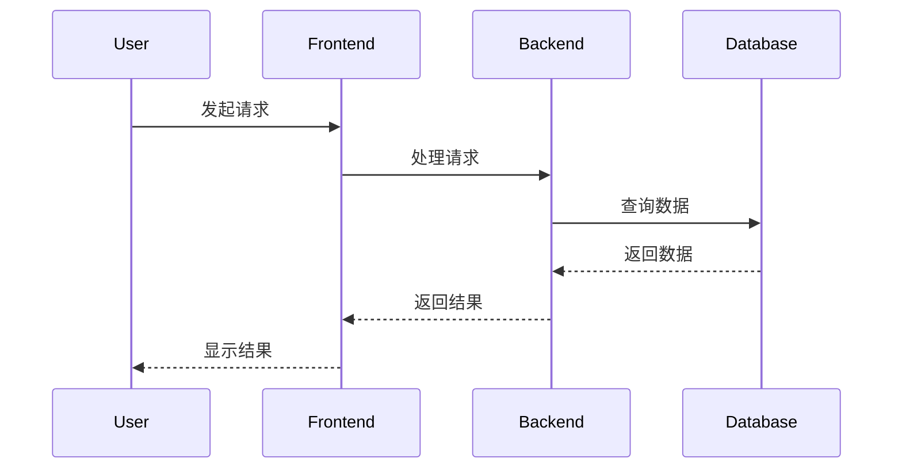
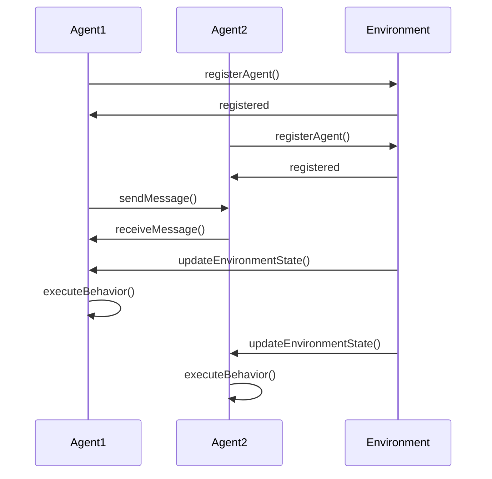

                 

### 基本概念

#### 1.1.1. 多智能体系统的演进

多智能体系统（Multi-Agent System，MAS）的概念最早可以追溯到20世纪80年代，起初多应用于人工智能和分布式系统的研究领域。随着计算能力的提升和网络技术的发展，MAS在经济学、社会科学、工程学等领域得到了广泛应用。

**多智能体系统的定义：**
多智能体系统是指由多个具有自治性、社交性和反应性的智能体组成的系统。这些智能体可以是个体、组织或程序，它们通过局部信息进行交互和合作，以达到共同的目标。

**多智能体系统的特点：**
1. **自治性（Autonomy）：** 每个智能体具有独立决策能力，可以在不依赖全局信息的情况下自主行动。
2. **社交性（Sociality）：** 智能体之间通过通信和协作来实现系统目标。
3. **反应性（Reactivity）：** 智能体根据感知到的环境变化做出快速响应。

#### 1.1.2. 全球经济联系的基本概念

全球经济联系指的是不同国家和地区之间的经济活动相互关联和影响的复杂网络。它包括国际贸易、国际投资、全球金融系统等多个方面。

**全球经济联系的重要性：**
1. **资源配置：** 全球经济联系使得资源可以在全球范围内进行优化配置，提高整体经济效率。
2. **经济增长：** 通过国际贸易和投资，各国可以共享市场和资源，促进经济增长。
3. **经济稳定：** 全球经济联系有助于分散风险，减少单一国家或地区的经济波动对全球经济的冲击。

**全球经济联系的关键因素：**
1. **技术进步：** 提高通信和交通效率，缩短全球市场距离。
2. **全球化政策：** 贸易自由化、投资便利化等政策推动了全球经济联系的深化。
3. **经济制度：** 国际经济组织和贸易协定的作用，如世界贸易组织（WTO）、国际货币基金组织（IMF）等。

#### 1.1.3. 多智能体系统在经济学中的作用

多智能体系统在经济学中的应用主要体现在模拟和分析经济系统的复杂行为。它通过建模经济个体（如企业、消费者、金融机构）的决策行为，揭示出全球经济联系中的潜在规律和问题。

**多智能体系统在经济学中的关键作用：**
1. **微观经济分析：** 通过模拟个体行为，分析市场供需、价格机制等微观经济现象。
2. **宏观经济预测：** 利用MAS可以预测经济危机、通货膨胀等宏观经济波动。
3. **政策评估：** 帮助政府和政策制定者评估不同政策的可能影响。

综上所述，多智能体系统为研究全球经济联系提供了一个新的视角和工具，通过模拟和分析个体决策行为，有助于我们更深入地理解全球经济系统的复杂性和动态性。

### 基本概念

#### 1.2.1. 多智能体系统的定义与特性

多智能体系统（MAS）是一种分布式计算模型，由多个自治的智能体组成，每个智能体都具有自己的目标、决策能力和行为规则。这些智能体通过相互通信和协作，共同实现整体系统的目标。

**定义：**
多智能体系统是由多个相互协作的智能体组成的复杂系统，这些智能体具有自治性、社交性和反应性。它们通过局部信息进行决策和交互，共同完成任务或达成目标。

**特性：**
1. **自治性（Autonomy）：** 每个智能体都有独立决策能力，可以根据自己的感知和内部规则进行行动。
2. **社交性（Sociality）：** 智能体之间通过通信和协作来实现共同目标。
3. **反应性（Reactivity）：** 智能体根据环境变化做出快速响应，调整自身行为。

**关键概念：**
- **智能体（Agent）：** 系统中的基本计算单元，具有自主性、社交性和反应性。
- **环境（Environment）：** 智能体所处的上下文，提供智能体的感知信息。
- **通信（Communication）：** 智能体之间交换信息的方式。
- **协作（Collaboration）：** 智能体通过协作实现共同目标的过程。

#### 1.2.2. 多智能体系统的架构风格与分类

多智能体系统的架构风格决定了系统的组织形式和智能体的交互方式。常见的架构风格包括：

1. **集中式（Centralized）：** 系统由一个中央控制器协调所有智能体的行为。这种方式适用于规模较小、结构相对简单的系统。
2. **分布式（Decentralized）：** 智能体自主决策，相互协作，没有中央控制器。这种方式适用于规模较大、结构复杂、动态变化的系统。
3. **对等式（Peer-to-Peer）：** 智能体之间对等交互，没有固定的中心节点。这种方式适用于去中心化系统，如分布式网络和P2P文件共享。

根据智能体的特性，MAS可以分为：

1. **理性智能体（Rational Agents）：** 具有完全理性和完美信息，总是做出最优决策。
2. **有限理性智能体（Bounded Rational Agents）：** 受限于信息处理能力和认知能力，无法总是做出最优决策，但可以做出满意决策。
3. **社会智能体（Social Agents）：** 关注社会规范和群体利益，倾向于遵守规则和合作。

**架构风格与分类的关系：**
- **集中式架构**：适用于理性智能体，通过中央控制器实现全局最优决策。
- **分布式架构**：适用于有限理性智能体，通过本地信息和局部优化实现整体系统的稳定性。
- **对等式架构**：适用于社会智能体，通过去中心化和协作实现系统的自主性和鲁棒性。

#### 1.2.3. 智能体的通信与交互

智能体的通信与交互是多智能体系统实现协同作用的关键。智能体之间的通信可以基于不同的通信模式，如：

1. **同步通信（Synchronous Communication）：** 所有智能体在同一时间步内进行通信。
2. **异步通信（Asynchronous Communication）：** 智能体之间可以不在同一时间步内进行通信。

智能体的交互可以通过以下方式进行：

1. **直接交互（Direct Interaction）：** 智能体通过直接通信渠道交换信息。
2. **间接交互（Indirect Interaction）：** 智能体通过中介或环境进行信息传递。
3. **协同交互（Collaborative Interaction）：** 智能体通过共同完成任务实现目标。

**通信与交互的关键概念：**
- **通信协议（Communication Protocol）：** 智能体之间的通信规则，包括消息格式、传输机制和同步方式。
- **交互策略（Interaction Strategy）：** 智能体在通信和交互过程中采取的行动和策略。

**示例：**
假设一个智能体系统由多个智能体组成，每个智能体都负责监控某一地区的经济活动。智能体之间通过异步通信共享信息，使用直接交互策略进行协作。每个智能体根据收到的信息调整自己的决策，共同实现地区经济稳定的目标。

通过以上基本概念的介绍，我们理解了多智能体系统的定义、特性、架构风格和通信与交互机制，为后续章节的深入分析奠定了基础。

### 经济联系的原理

#### 1.3.1. 经济联系的理论框架

全球经济联系的理论框架主要包括以下几个方面：

1. **国际贸易理论：** 马克思主义经济学、古典经济学和新古典经济学等不同学派对国际贸易的原因、机制和效应进行了深入探讨。马克思主义经济学认为国际贸易是资本主义生产方式下的必然现象，核心在于资本的全球流动；古典经济学则强调比较优势理论，认为国际贸易基于各国资源禀赋的差异；新古典经济学则从要素价格均等化理论出发，认为国际贸易可以带来效率提升和资源优化配置。

2. **国际金融理论：** 包括货币主权理论、国际收支理论、外汇市场理论和金融全球化理论等。货币主权理论强调国家在货币发行和汇率政策上的自主权；国际收支理论分析国际收支平衡和汇率变动的关系；外汇市场理论探讨汇率的形成机制；金融全球化理论则关注全球金融市场的相互依赖和一体化进程。

3. **发展经济学：** 研究发达国家和发展中国家之间的经济联系，探讨如何通过对外经济关系促进发展中国家的经济增长和减少贫困。包括中心-外围理论、依附理论、新增长理论等。中心-外围理论认为全球经济发展存在不平等，发达国家处于中心地位，发展中国家处于外围；依附理论强调发展中国家在经济上对发达国家的依赖；新增长理论则从技术创新和人力资本积累的角度探讨经济增长的路径。

#### 1.3.2. 影响经济联系的关键因素

全球经济联系受到多种因素的共同影响，以下是一些关键因素：

1. **技术进步：** 技术进步是推动全球经济联系的重要力量。信息通信技术的快速发展降低了跨国交流和贸易的成本，促进了全球市场的整合。互联网、电子商务、移动支付等技术的普及，使得企业可以更加便捷地进行跨国业务，消费者可以更加方便地购买全球产品。

2. **全球化政策：** 全球化政策包括贸易自由化、投资便利化、金融自由化等。贸易自由化通过降低关税和非关税壁垒，促进了国际贸易的增长；投资便利化通过放宽投资限制和提供优惠条件，吸引了更多国际资本流入；金融自由化通过放松金融监管和开放金融市场，提高了资本流动的效率和灵活性。

3. **经济制度：** 经济制度包括国际经济组织和贸易协定等。国际经济组织如世界贸易组织（WTO）、国际货币基金组织（IMF）等，通过制定和执行国际规则，维护全球经济的稳定和公平；贸易协定如北美自由贸易协定（NAFTA）、区域全面经济伙伴关系协定（RCEP）等，通过降低贸易壁垒和促进投资合作，加强了区域和全球经济联系。

4. **国际政治关系：** 国际政治关系对全球经济联系有重要影响。国家之间的政治稳定和合作有利于经济联系的深化和扩展；而政治冲突和紧张关系则可能阻碍经济合作的进展，甚至引发经济危机。

5. **地缘政治因素：** 地缘政治因素包括地理位置、资源分布、政治边界等。地理位置和资源分布决定了国家的经济优势和发展方向；政治边界可能成为经济联系的障碍，但也可能通过跨境经济合作实现互利共赢。

#### 1.3.3. 全球经济联系的现实表现

在全球经济联系中，以下现实表现尤为突出：

1. **国际贸易与投资：** 全球贸易和投资活动持续增长，跨国公司和全球价值链成为全球经济的重要组成部分。各国通过贸易和投资，共享市场、资源和知识，实现经济的互利共赢。

2. **金融全球化：** 金融市场的全球一体化进程加快，资本流动性增强，跨境资金流动频繁。全球金融体系中的金融工具、金融市场和金融机构日益多样化，国际资本流动对全球经济的影响越来越大。

3. **跨国公司：** 跨国公司在全球经济联系中发挥着重要作用。它们通过跨国运营，实现全球资源配置、生产和销售，推动技术创新和产业升级，同时也带来了文化和价值观的交流。

4. **全球供应链：** 全球供应链的复杂性和依赖性日益增加。各国通过供应链合作，实现产品从设计、生产到销售的全球整合，提高了生产效率和竞争力。

5. **数字经济：** 数字经济的快速发展，推动了全球经济联系的深化和拓展。通过互联网和数字技术，企业可以更便捷地进入全球市场，消费者可以更加便捷地购买全球产品，数字经济成为全球经济新的增长点。

通过上述对经济联系原理的探讨，我们理解了全球经济联系的复杂性和多样性，以及影响其发展的关键因素。这为进一步分析多智能体系统在经济学中的应用奠定了基础。

### 当前多智能体系统在经济学研究中的应用

#### 1.4.1. 模拟经济网络

多智能体系统在经济学研究中的一个重要应用是模拟经济网络。经济网络由经济个体（如企业、消费者、金融机构）及其交互关系构成，通过MAS模型可以对这些网络进行模拟，揭示出经济系统的复杂行为和动态特性。

**应用场景：**
- **市场分析：** 通过模拟市场中的个体行为，分析市场价格、供需关系、竞争格局等市场机制。
- **金融分析：** 通过模拟金融市场中个体之间的交易行为，分析金融市场波动、风险传播等金融现象。

**核心方法：**
1. **个体建模：** 根据不同经济个体的行为特征，构建对应的智能体模型。
2. **交互规则：** 设定智能体之间的交互规则，包括交易、合作、竞争等。
3. **仿真实验：** 运行仿真实验，观察系统行为和动态变化。

**案例：**
- **电网负荷预测：** 通过MAS模型模拟电网中不同用户的用电行为，预测电网负荷变化，为电力调度提供依据。
- **金融网络风险分析：** 通过MAS模型模拟金融市场中金融机构的交易行为，分析金融网络中风险的传播和聚集。

#### 1.4.2. 金融市场的分析

多智能体系统在金融市场的分析中具有重要应用，通过建模和分析市场中的个体行为，揭示金融市场的动态特性和潜在风险。

**应用场景：**
- **价格发现：** 分析市场中不同个体的交易行为，揭示市场价格的形成机制。
- **市场波动预测：** 通过模拟市场个体行为，预测市场波动和危机。

**核心方法：**
1. **市场建模：** 构建市场中的智能体模型，包括投资者、金融机构等。
2. **交易策略：** 设定智能体的交易策略，如风险偏好、信息处理方式等。
3. **风险分析：** 通过模拟市场行为，分析风险传播和聚集机制。

**案例：**
- **股市分析：** 通过MAS模型模拟投资者行为，分析股市价格波动和市场情绪。
- **信用风险评估：** 通过MAS模型模拟金融机构之间的借贷行为，分析信用风险的传播和影响。

#### 1.4.3. 国际贸易与供应链管理

多智能体系统在国际贸易和供应链管理中的应用，有助于分析全球价值链中的复杂交互和优化资源配置。

**应用场景：**
- **国际贸易分析：** 通过MAS模型模拟国际贸易中的个体行为，分析贸易流量的变化和影响因素。
- **供应链管理：** 通过MAS模型优化供应链网络，提高供应链的效率和韧性。

**核心方法：**
1. **国际贸易建模：** 构建国际贸易中的智能体模型，包括国家、企业等。
2. **供应链建模：** 构建供应链中的智能体模型，包括制造商、分销商、物流等。
3. **优化策略：** 通过模拟和优化，制定合理的国际贸易政策和供应链管理策略。

**案例：**
- **国际贸易政策分析：** 通过MAS模型模拟不同贸易政策对国际贸易流量的影响，为政策制定提供依据。
- **供应链优化：** 通过MAS模型优化供应链中的库存管理、物流安排，提高供应链的整体效率。

总的来说，多智能体系统在经济学研究中的应用，为分析和理解复杂经济系统提供了新的工具和方法。通过模拟经济网络、分析金融市场和优化国际贸易与供应链管理，MAS为经济学研究带来了新的视角和洞察力。

### 总结与展望

#### 1.5.1. 本章关键内容回顾

在本章中，我们系统探讨了多智能体系统（MAS）在分析全球经济联系中的重要性及其应用。以下是对本章关键内容的回顾：

1. **多智能体系统的基本概念与特性：**
   - 多智能体系统是由多个自治、社交和反应性的智能体组成的复杂系统。
   - 智能体具有自主性、社交性和反应性，通过局部信息进行决策和交互。
   - 介绍了MAS的演进、定义、特性以及不同的架构风格和分类。

2. **全球经济联系的理论框架与关键因素：**
   - 全球经济联系包括国际贸易、国际投资、全球金融系统等多个方面。
   - 分析了国际贸易理论、国际金融理论和发展经济学的理论框架。
   - 探讨了影响全球经济联系的关键因素，如技术进步、全球化政策、经济制度和地缘政治因素。

3. **MAS在经济学研究中的应用：**
   - 模拟经济网络：通过MAS模型模拟经济个体的行为，揭示市场机制和动态特性。
   - 金融市场的分析：通过MAS模型分析市场行为、价格发现和市场波动。
   - 国际贸易与供应链管理：通过MAS模型优化国际贸易政策和供应链管理。

#### 1.5.2. 未来研究方向与展望

基于本章的探讨，我们可以预见未来多智能体系统在经济学研究中的几大发展方向：

1. **智能化与自主性提升：**
   - 随着人工智能技术的发展，未来MAS中的智能体将更加智能化，能够自主学习和适应复杂经济环境。
   - 深度学习和强化学习等技术在MAS中的应用，有望提高智能体的决策能力和适应性。

2. **复杂性与动态性研究：**
   - 经济系统的复杂性日益增加，未来研究需要更加关注MAS在处理动态经济环境中的表现和鲁棒性。
   - 模拟和优化算法的发展，有助于更好地理解和预测经济系统的行为。

3. **跨领域整合与综合应用：**
   - 多智能体系统在经济学中的应用可以与其他领域（如社会学、生态学、计算机科学等）进行整合，形成跨学科的研究视角。
   - 通过多学科的合作，MAS可以提供更加全面和深入的经济分析工具。

4. **政策模拟与评估：**
   - 未来可以更多利用MAS进行经济政策模拟和评估，为政府和政策制定者提供科学依据。
   - 研究如何通过MAS模型优化经济政策，提高政策的有效性和可操作性。

总之，多智能体系统在分析全球经济联系中的潜力巨大。通过不断的技术创新和跨学科合作，MAS将成为经济学研究中的一个重要工具，为全球经济治理提供新的思路和方法。

### 基本概念

#### 2.1.1. Agent-Based Modeling 与其他方法的对比

Agent-Based Modeling（ABM）是一种模拟复杂系统行为的计算模型，它通过个体（Agent）的行为和交互来揭示系统整体的动态特性。与其他方法（如系统动力学、统计模型等）相比，ABM具有独特的优势和局限性。

**与系统动力学的对比：**
- **系统动力学（System Dynamics）** 是一种基于反馈环和因果关系的方法，通过建立系统的存量流图（Stock and Flow Diagrams）来模拟系统的动态行为。它强调系统的整体结构和因果关系，通常适用于长期、稳定和连续系统的分析。
- **Agent-Based Modeling** 则侧重于个体行为和交互对整体系统的影响。它通过模拟大量个体的局部决策和行为，来揭示系统整体的非线性、复杂性和动态性。与系统动力学相比，ABM更适用于短期、突发性和非线性系统的分析。

**与统计模型的对比：**
- **统计模型** 如线性回归、时间序列分析等，主要用于分析变量之间的关系和预测未来的趋势。这些模型基于一定的假设和统计方法，对数据进行建模和预测。
- **Agent-Based Modeling** 则不依赖于统计数据和假设，而是通过个体行为和规则来模拟系统的动态行为。它能够处理大量不确定性和复杂性，特别是在个体行为具有高度异质性和动态变化的情况下。

**优势：**
- **高灵活性：** ABM可以灵活地定义个体的行为规则和交互机制，适用于各种复杂系统。
- **微观基础：** ABM基于个体行为的微观基础，能够揭示出系统行为的微观机制。
- **自适应性和鲁棒性：** ABM能够模拟个体在动态环境下的适应和演化过程，具有较高的鲁棒性。

**局限性：**
- **计算成本高：** 由于需要模拟大量个体及其交互，ABM的计算成本相对较高，对计算资源和时间要求较大。
- **模型假设：** 即使在模型设计上尽可能贴近现实，ABM仍然依赖于一定的简化假设，可能无法完全反映真实系统的复杂性。
- **数据需求：** ABM需要详细的数据来定义个体行为和规则，数据获取和处理是一个挑战。

通过上述对比，我们可以看到ABM在模拟复杂系统行为方面具有独特的优势和局限性。在具体应用中，根据研究问题的性质和需求，选择合适的方法至关重要。

#### 2.1.2. 代理模型的构成元素

在构建代理模型（Agent-Based Model，ABM）时，需要定义一系列关键组件，这些组件共同作用以模拟真实系统的复杂行为。以下是构建代理模型所需的基本元素：

**1. 智能体（Agent）：**
智能体是代理模型的基本计算单元，具有自主性、社交性和反应性。每个智能体可以代表一个实体，如消费者、企业或政府，其行为由其内部状态和规则决定。

- **属性（Attributes）：** 智能体拥有一系列属性，如位置、财富、需求等，这些属性决定了智能体的状态和行为。
- **行为规则（Behavior Rules）：** 智能体的行为由一组规则定义，这些规则描述了智能体在不同情境下的决策过程，如购买行为、迁徙策略等。

**2. 环境（Environment）：**
环境是智能体行为的背景和上下文，为智能体提供必要的资源和信息。环境可以是一个空间区域，也可以是一个信息空间。

- **资源（Resources）：** 环境中包含智能体所需的资源，如商品、资金、能源等。
- **约束（Constraints）：** 环境对智能体的行为施加一定的约束，如交通限制、法规限制等。

**3. 交互机制（Interaction Mechanisms）：**
智能体之间通过交互来共享信息、协调行动。这些交互机制可以是直接交互（如面对面交流）或间接交互（如通过媒体或网络）。

- **通信协议（Communication Protocols）：** 描述智能体之间如何交换信息和数据。
- **交互规则（Interaction Rules）：** 定义智能体在交互过程中的行为，如价格谈判、合作决策等。

**4. 模拟过程（Simulation Process）：**
模拟过程是代理模型的核心，通过模拟智能体和环境的动态交互，揭示系统行为的演化规律。

- **初始化（Initialization）：** 设置初始状态和初始条件，包括智能体的属性、环境的状态等。
- **迭代（Iteration）：** 通过迭代过程模拟智能体的行为和环境的演化，每次迭代中智能体根据当前状态和规则更新自身状态。
- **输出（Output）：** 收集和分析模拟过程中的数据，用于评估模型的有效性和解释系统行为。

**5. 分析与可视化（Analysis and Visualization）：**
模型运行结束后，需要通过数据分析与可视化工具来解释和展示模拟结果。

- **数据分析（Data Analysis）：** 利用统计方法和数据挖掘技术，分析模拟数据，提取系统行为的特征和规律。
- **可视化（Visualization）：** 通过图形和图表展示系统行为的动态过程和模式，帮助研究人员理解模型结果。

**示例：**
假设一个简单的代理模型，模拟一个城市中的交通系统。智能体代表车辆，每个车辆拥有属性如位置、速度、目的地等。环境包含道路网络和交通信号灯。交互机制包括车辆的行驶规则、碰撞处理和交通信号响应。模拟过程初始化后，车辆在环境中行驶，通过交互机制更新位置和速度。最后，通过数据分析和可视化，研究人员可以了解交通拥堵现象、优化交通信号控制策略。

通过上述基本元素的介绍，我们了解了构建代理模型所需的关键组件及其相互关系，为后续的模型设计和实施提供了基础。

#### 2.1.3. 代理模型开发的步骤

构建代理模型（Agent-Based Model，ABM）是一个系统化的过程，需要遵循一定的步骤和方法。以下是开发代理模型的详细步骤：

**1. 确定研究目标和问题：**
- **明确研究问题：** 定义要研究的问题或现象，如市场动态、交通流、环境污染等。
- **确定研究目标：** 明确希望通过模型实现的目标，如揭示系统行为、预测未来趋势、评估政策影响等。

**2. 文献回顾与需求分析：**
- **文献回顾：** 查阅相关文献，了解已有的代理模型和研究进展。
- **需求分析：** 根据研究目标和问题，分析所需的输入数据、变量和模型组件。

**3. 设计智能体：**
- **智能体定义：** 确定智能体的属性、状态和行为规则。例如，在交通模型中，智能体可以是车辆，其属性包括位置、速度和目的地。
- **行为规则：** 设计智能体的行为规则，如移动规则、决策规则等。这些规则应反映实际系统的行为特征。

**4. 设计环境：**
- **环境构建：** 根据研究场景构建环境，包括空间区域、资源分布和约束条件。例如，在交通模型中，环境可以是一个城市道路网络。
- **交互机制：** 定义智能体之间的交互机制，如通信协议、合作机制等。这些机制应促进智能体的协作和决策。

**5. 编码与实现：**
- **编程语言选择：** 选择合适的编程语言，如Python、Java或C++等。
- **智能体编码：** 编写智能体的代码，实现其行为规则和交互机制。
- **环境编码：** 编写环境的代码，实现智能体的行为场景和约束条件。

**6. 运行模拟：**
- **初始化设置：** 设置初始状态和条件，包括智能体的属性和环境的状态。
- **迭代模拟：** 运行模拟，记录每次迭代中智能体的行为和系统状态的变化。
- **模拟控制：** 调整模拟参数，如迭代次数、步长等，以确保模拟的准确性和有效性。

**7. 数据分析与可视化：**
- **数据分析：** 利用统计方法和数据挖掘技术，分析模拟数据，提取系统行为的特征和规律。
- **可视化：** 通过图表和图形展示模拟结果，帮助研究人员理解模型行为。

**8. 模型验证与评估：**
- **模型验证：** 比较模拟结果与实际数据，验证模型的有效性和准确性。
- **模型评估：** 分析模型的局限性、误差来源和改进方向。

**示例：**
假设我们构建一个简单的市场动态代理模型，研究市场中消费者和企业的交互行为。首先，我们确定研究目标是分析市场供需平衡和价格变化。然后，通过文献回顾和需求分析，了解市场动态的一般规律。接下来，设计智能体，包括消费者和企业的属性、状态和行为规则。设计环境，包括市场空间、商品库存和需求约束。编码实现智能体和环境的代码，设置初始状态和条件进行模拟。最后，通过数据分析和可视化展示市场动态，评估模型的有效性。

通过以上步骤，我们可以系统地开发代理模型，为研究复杂系统行为提供有力工具。

### 代理设计原则与行为模型

#### 2.2.1. 代理设计原则

在设计代理模型中的智能体（Agent）时，需要遵循一系列原则，以确保模型的有效性和鲁棒性。以下是一些关键设计原则：

1. **自治性（Autonomy）：**
   - **定义：** 智能体应具有独立决策能力，能够根据内部状态和外部环境自主行动。
   - **实现：** 智能体应具有明确的决策规则和行为逻辑，不依赖于中心控制器或外部指令。

2. **社交性（Sociality）：**
   - **定义：** 智能体应具备与其他智能体进行通信和协作的能力。
   - **实现：** 智能体之间应通过定义良好的通信协议和交互机制实现信息共享和协作。

3. **反应性（Reactivity）：**
   - **定义：** 智能体应能够对环境变化做出快速响应。
   - **实现：** 智能体应具备感知环境变化的能力，并根据感知结果调整自身行为。

4. **灵活性与适应性（Flexibility and Adaptability）：**
   - **定义：** 智能体应能够适应不同环境和情境。
   - **实现：** 智能体设计应考虑到各种可能的变化和不确定性，提供灵活的调整机制。

5. **透明性与可解释性（Transparency and Interpretability）：**
   - **定义：** 智能体的行为和决策过程应透明且易于解释。
   - **实现：** 通过详细的日志记录和行为描述，确保智能体行为可追溯和可理解。

6. **可扩展性（Scalability）：**
   - **定义：** 智能体设计应支持系统规模的扩展。
   - **实现：** 设计时应考虑模块化，使得智能体可以在不同规模和复杂度的系统中运行。

#### 2.2.2. 行为模型设计方法

行为模型是代理模型中的核心组件，决定了智能体的决策过程和行为模式。以下是几种常见的行为模型设计方法：

1. **规则基础模型（Rule-Based Models）：**
   - **定义：** 行为模型通过一组规则来描述智能体的行为。
   - **实现：** 每个规则包含条件（Condition）和相应的行动（Action）。当条件满足时，智能体执行相应的行动。
   - **优势：** 简单易懂，易于实现和调试。
   - **局限：** 可能难以处理复杂和非线性关系。

2. **决策树模型（Decision Tree Models）：**
   - **定义：** 行为模型通过树形结构来描述智能体的决策过程。
   - **实现：** 每个节点表示一个决策点，分支表示不同决策选项，叶子节点表示决策结果。
   - **优势：** 结构清晰，易于理解和实现。
   - **局限：** 可能导致过拟合，对数据依赖性较强。

3. **贝叶斯网络模型（Bayesian Network Models）：**
   - **定义：** 行为模型通过概率关系来描述智能体的决策过程。
   - **实现：** 每个节点表示一个随机变量，边表示变量之间的依赖关系。
   - **优势：** 能够处理复杂依赖关系，适用于不确定性环境。
   - **局限：** 需要大量数据来训练和优化模型。

4. **模糊逻辑模型（Fuzzy Logic Models）：**
   - **定义：** 行为模型通过模糊集合来描述智能体的行为。
   - **实现：** 使用隶属度函数来表示变量之间的关系，通过模糊推理得出决策结果。
   - **优势：** 能够处理不确定性和模糊性。
   - **局限：** 推理过程可能较为复杂。

5. **遗传算法模型（Genetic Algorithm Models）：**
   - **定义：** 行为模型通过遗传算法来优化智能体的决策过程。
   - **实现：** 使用遗传操作（如选择、交叉和变异）来优化行为规则。
   - **优势：** 能够自适应地调整行为规则，适用于复杂和动态环境。
   - **局限：** 需要大量的计算资源和时间。

通过选择合适的设计原则和模型方法，我们可以构建出有效的代理模型，为复杂系统的研究提供有力的工具。

### 模拟环境和工具

#### 2.3.1. 常见的模拟环境

在代理模型（Agent-Based Model，ABM）的构建过程中，选择合适的模拟环境至关重要。以下是一些常见的模拟环境及其特点：

1. **NetLogo：**
   - **特点：** NetLogo是一个开源的代理模型模拟平台，适合初学者使用。它具有图形界面和易用的编程语言（TurtleKit），支持多种类型的智能体交互。
   - **适用场景：** 适合模拟社会行为、生态系统和经济学模型等。

2. **Repast Suite：**
   - **特点：** Repast Suite是一个可扩展的代理模型框架，支持多种编程语言（如Java、Python等）。它提供了丰富的模拟组件和工具，支持大规模系统的模拟。
   - **适用场景：** 适合模拟复杂系统，如交通流、社会网络和供应链等。

3. **MATLAB/Simulink：**
   - **特点：** MATLAB和Simulink提供了强大的数值计算和可视化工具，支持代理模型的建模和模拟。Simulink提供了一个直观的建模环境，支持与MATLAB的紧密集成。
   - **适用场景：** 适合进行数值分析和复杂的数学模型模拟。

4. ** Mesa：**
   - **特点：** Mesa是一个开源的Python代理模型框架，支持多种智能体交互机制和模拟环境。它具有灵活的架构和强大的扩展性。
   - **适用场景：** 适合进行代理模型的研究和开发，特别是Python编程环境下的模拟。

#### 2.3.2. 模拟工具的选择与优化

选择合适的模拟工具是成功构建和运行代理模型的关键。以下是一些选择和优化模拟工具的建议：

1. **需求分析：**
   - **确定模拟目标：** 明确要模拟的问题或现象，了解所需的功能和性能要求。
   - **分析计算资源：** 评估可用的计算资源和时间限制，选择适合的工具。

2. **工具特性：**
   - **易用性和学习曲线：** 选择易于学习和使用的工具，特别是对于团队成员的技术背景。
   - **扩展性和灵活性：** 选择支持多种编程语言和扩展功能的工具，以便于模型开发和优化。

3. **性能评估：**
   - **运行效率：** 选择运行效率高的工具，确保模拟过程不会因计算瓶颈而受影响。
   - **可扩展性：** 选择支持大规模系统模拟的工具，以便处理复杂的模型和大量数据。

4. **集成与兼容性：**
   - **数据接口：** 确保工具能够与现有的数据接口和第三方库兼容，便于数据导入和导出。
   - **与其他工具的集成：** 选择能够与其他模拟工具和数据分析工具集成的工具，提高工作效率。

5. **社区与支持：**
   - **用户社区：** 选择具有活跃用户社区的工具，便于获取帮助和分享经验。
   - **技术支持：** 选择提供技术支持和文档完善的工具，确保模型开发和问题解决的顺利。

通过以上建议，我们可以选择合适的模拟工具，优化模型开发和运行过程，提高研究效率和质量。

### 代理设计原则与行为模型

#### 2.2.1. 代理设计原则

在设计代理模型中的智能体（Agent）时，需要遵循一系列原则，以确保模型的有效性和鲁棒性。以下是一些关键设计原则：

1. **自治性（Autonomy）：**
   - **定义：** 智能体应具有独立决策能力，能够根据内部状态和外部环境自主行动。
   - **实现：** 智能体应具备明确的决策规则和行为逻辑，不依赖于中心控制器或外部指令。

2. **社交性（Sociality）：**
   - **定义：** 智能体应具备与其他智能体进行通信和协作的能力。
   - **实现：** 智能体之间应通过定义良好的通信协议和交互机制实现信息共享和协作。

3. **反应性（Reactivity）：**
   - **定义：** 智能体应能够对环境变化做出快速响应。
   - **实现：** 智能体应具备感知环境变化的能力，并根据感知结果调整自身行为。

4. **灵活性与适应性（Flexibility and Adaptability）：**
   - **定义：** 智能体应能够适应不同环境和情境。
   - **实现：** 智能体设计应考虑到各种可能的变化和不确定性，提供灵活的调整机制。

5. **透明性与可解释性（Transparency and Interpretability）：**
   - **定义：** 智能体的行为和决策过程应透明且易于解释。
   - **实现：** 通过详细的日志记录和行为描述，确保智能体行为可追溯和可理解。

6. **可扩展性（Scalability）：**
   - **定义：** 智能体设计应支持系统规模的扩展。
   - **实现：** 设计时应考虑模块化，使得智能体可以在不同规模和复杂度的系统中运行。

#### 2.2.2. 行为模型设计方法

行为模型是代理模型中的核心组件，决定了智能体的决策过程和行为模式。以下是几种常见的行为模型设计方法：

1. **规则基础模型（Rule-Based Models）：**
   - **定义：** 行为模型通过一组规则来描述智能体的行为。
   - **实现：** 每个规则包含条件（Condition）和相应的行动（Action）。当条件满足时，智能体执行相应的行动。
   - **优势：** 简单易懂，易于实现和调试。
   - **局限：** 可能难以处理复杂和非线性关系。

2. **决策树模型（Decision Tree Models）：**
   - **定义：** 行为模型通过树形结构来描述智能体的决策过程。
   - **实现：** 每个节点表示一个决策点，分支表示不同决策选项，叶子节点表示决策结果。
   - **优势：** 结构清晰，易于理解和实现。
   - **局限：** 可能导致过拟合，对数据依赖性较强。

3. **贝叶斯网络模型（Bayesian Network Models）：**
   - **定义：** 行为模型通过概率关系来描述智能体的决策过程。
   - **实现：** 每个节点表示一个随机变量，边表示变量之间的依赖关系。
   - **优势：** 能够处理复杂依赖关系，适用于不确定性环境。
   - **局限：** 需要大量数据来训练和优化模型。

4. **模糊逻辑模型（Fuzzy Logic Models）：**
   - **定义：** 行为模型通过模糊集合来描述智能体的行为。
   - **实现：** 使用隶属度函数来表示变量之间的关系，通过模糊推理得出决策结果。
   - **优势：** 能够处理不确定性和模糊性。
   - **局限：** 推理过程可能较为复杂。

5. **遗传算法模型（Genetic Algorithm Models）：**
   - **定义：** 行为模型通过遗传算法来优化智能体的决策过程。
   - **实现：** 使用遗传操作（如选择、交叉和变异）来优化行为规则。
   - **优势：** 能够自适应地调整行为规则，适用于复杂和动态环境。
   - **局限：** 需要大量的计算资源和时间。

通过选择合适的设计原则和模型方法，我们可以构建出有效的代理模型，为复杂系统的研究提供有力的工具。

### 系统功能设计

#### 3.1. 领域模型

在构建多智能体系统（MAS）时，领域模型（Domain Model）是描述系统功能需求和核心概念的重要工具。领域模型通过类图（Class Diagram）展示系统的主要类及其关系，帮助我们理解和设计系统的功能和结构。

**类图定义：**
- **类（Class）：** 代表系统中的实体和概念。
- **属性（Attribute）：** 类的属性描述了类的特征。
- **方法（Method）：** 类的方法描述了类的行为。
- **关系（Relationship）：** 类之间的关系，如关联（Association）、依赖（Dependency）、泛化（Generalization）等。

**领域模型示例：**

```mermaid
classDiagram
    Agent <<class>> {
        +String id
        +Map<String, Attribute> attributes
        +void updateAttribute(String key, Object value)
        +void executeBehavior()
    }

    Environment <<class>> {
        +Map<String, Agent> agents
        +void addAgent(Agent agent)
        +void removeAgent(Agent agent)
        +void simulate()
    }

    Market <<class>> {
        +double price
        +void updatePrice(double price)
        +void trade(Agent buyer, Agent seller)
    }

    Consumer <<class>>, Agent {
        +double budget
        +void buyProduct(Market market)
    }

    Producer <<class>>, Agent {
        +double productionCapacity
        +void produceProduct(Market market)
    }

    classDiagram
    Agent --|> Environment
    Agent --|> Market
    Consumer --|> Agent
    Producer --|> Agent
    Market --|> Consumer
    Market --|> Producer
```

在这个示例中，我们定义了以下类：
- **Agent**：代表系统中的智能体，具有唯一标识、属性和执行行为的能力。
- **Environment**：代表智能体的运行环境，管理智能体的添加和移除，并负责模拟过程。
- **Market**：代表市场，管理商品价格和交易行为。
- **Consumer**：代表消费者，从市场中购买商品。
- **Producer**：代表生产者，向市场提供商品。

通过领域模型，我们可以清晰地看到系统中各个类之间的关系和功能职责，为后续的系统架构设计和实现提供基础。

### 系统架构设计

#### 3.2. 系统架构图

系统架构设计是确保多智能体系统（MAS）高效、可扩展和可维护的关键步骤。架构图通过直观的方式展示系统的各个组件及其关系，帮助我们理解和设计系统的整体结构和运行机制。

**架构图定义：**
- **组件（Component）：** 系统中的主要功能模块。
- **接口（Interface）：** 组件之间的交互接口。
- **依赖（Dependency）：** 组件之间的依赖关系。
- **层次（Layer）：** 系统的分层结构，如表示层、业务逻辑层、数据访问层等。

**系统架构图示例：**



在这个示例中，我们定义了以下组件：
- **User**：代表系统的用户，发起请求。
- **Frontend**：表示系统的前端部分，处理用户请求，与后端交互。
- **Backend**：表示系统的后端部分，负责业务逻辑处理和与数据库的交互。
- **Database**：表示系统的数据库部分，存储数据。

架构图展示了用户请求的处理流程：
1. 用户通过前端发起请求。
2. 前端将请求传递给后端。
3. 后端处理请求，查询数据库获取数据。
4. 后端将处理结果返回给前端。
5. 前端将结果展示给用户。

通过系统架构设计，我们可以确保系统各部分之间的清晰交互和合理分工，提高系统的整体性能和可维护性。

### 系统接口设计与系统交互

#### 3.3. 系统接口设计与交互流程

系统接口设计与交互流程是多智能体系统（MAS）实现的核心部分，它确保了智能体之间以及智能体与环境之间的有效通信和协同工作。以下是一个典型的系统接口设计和交互流程示例：

**接口设计：**
- **智能体接口（Agent Interface）：** 定义智能体与系统交互的统一接口，包括以下方法：
  - `registerAgent()`: 注册新智能体。
  - `removeAgent()`: 删除智能体。
  - `sendMessage()`: 发送消息给其他智能体。
  - `receiveMessage()`: 接收消息并处理。
- **环境接口（Environment Interface）：** 定义环境与智能体之间的交互接口，包括以下方法：
  - `updateEnvironmentState()`: 更新环境状态。
  - `getEnvironmentState()`: 获取环境状态。
  - `notifyAgents()`: 通知智能体环境变化。

**交互流程：**
1. **智能体注册：**
   - 新智能体通过`registerAgent()`接口注册到系统中。
   - 系统更新智能体列表，并通知所有已注册智能体新成员的加入。

2. **消息发送与接收：**
   - 智能体之间通过`sendMessage()`方法发送消息。
   - 接收消息的智能体通过`receiveMessage()`方法接收并处理消息。

3. **环境状态更新：**
   - 环境通过`updateEnvironmentState()`方法更新其状态。
   - 系统通知所有注册智能体环境状态的变化。

4. **智能体行为执行：**
   - 智能体根据接收到的消息和当前环境状态执行相应的行为，通过`executeBehavior()`方法。

5. **系统事件处理：**
   - 系统监听各种事件，如智能体注册、消息发送、环境状态更新等，通过事件队列进行事件处理。

**Mermaid 序列图示例：**



通过上述系统接口设计与交互流程，智能体之间以及智能体与环境的交互得以高效实现，为MAS系统的正常运行提供了保障。使用Mermaid序列图，我们可以直观地展示系统交互过程，有助于理解和优化系统设计。

