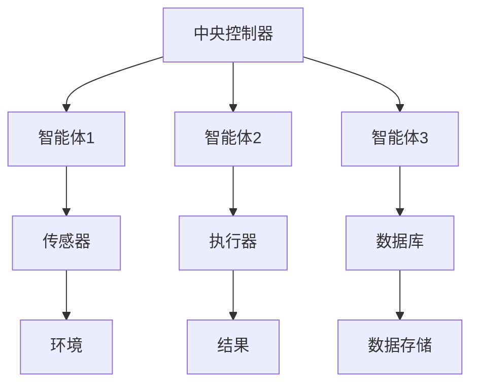
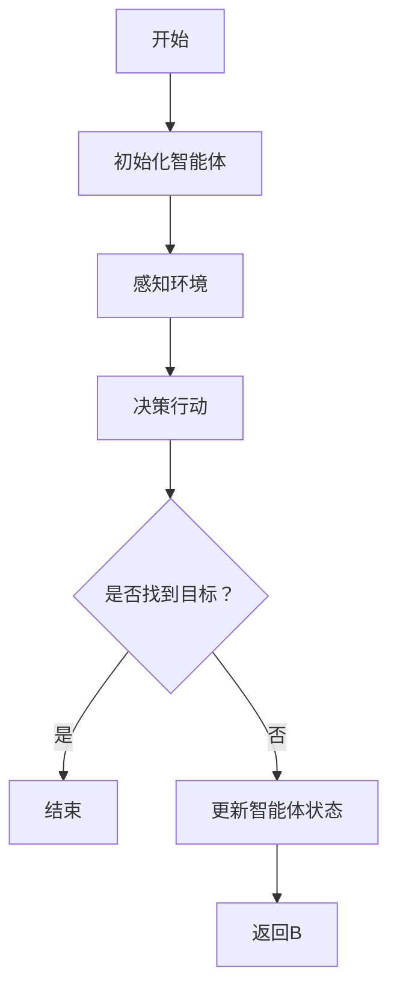
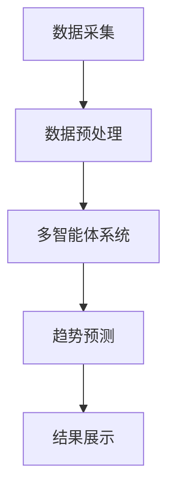
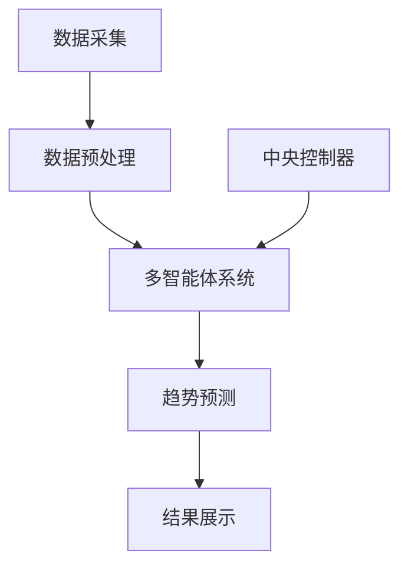
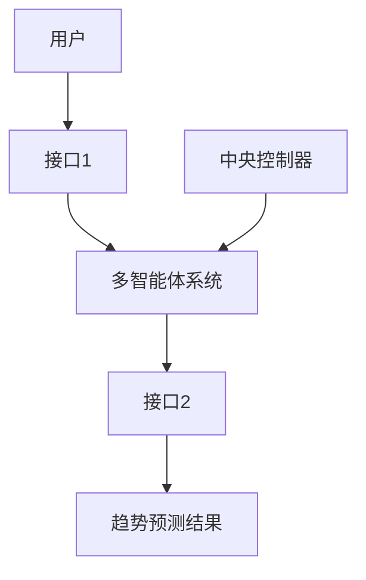

                 

# 多智能体系统在产业升级趋势预测中的应用：把握结构性机会

## 关键词

- 多智能体系统
- 产业升级
- 趋势预测
- 结构性机会
- 数据分析
- 算法设计

## 摘要

本文旨在探讨多智能体系统在产业升级趋势预测中的应用，通过分析产业升级的驱动因素、挑战与机遇，以及多智能体系统在其中的作用，提出一种有效的趋势预测方法。文章将结合实际案例，详细阐述多智能体系统的原理、架构和应用，以期为相关领域的从业者提供有价值的参考。

## 引言与背景介绍

### 1. 多智能体系统的定义与特点

多智能体系统（Multi-Agent Systems，MAS）是由一组相互协作、具有一定自治能力的智能体组成的系统。每个智能体都具有感知、决策和行动的能力，可以在动态环境中自主地完成任务。多智能体系统的核心特点是分布式、协同、自组织。

### 2. 产业升级的背景与重要性

产业升级是指通过技术创新、生产方式变革、产业结构的优化等手段，提升一个国家的产业整体竞争力。随着全球经济的发展，产业升级已成为各国应对竞争压力、实现经济可持续发展的重要策略。产业升级不仅能够推动经济增长，还能提高产业附加值，促进产业结构的优化和升级。

### 3. 多智能体系统在产业升级中的应用

多智能体系统在产业升级中具有广泛的应用前景。例如，在产业链协同、生产调度、物流优化、市场预测等方面，多智能体系统可以通过分布式协同、自组织等方式，提高产业的运营效率，降低成本，实现资源优化配置。

## 多智能体系统基础

### 1. 多智能体系统的基本理论

多智能体系统的研究涉及多个领域，包括计算机科学、人工智能、分布式计算等。本文主要从人工智能的角度，介绍多智能体系统的基本理论。

### 2. 多智能体系统的架构设计

多智能体系统的架构设计是构建高效、可靠的系统的基础。本文将介绍常见的多智能体系统架构，如集中式、分布式和混合式架构。

### 3. 多智能体系统的算法原理

多智能体系统的算法设计是实现智能体协同、自组织的关键。本文将介绍常用的多智能体算法，如协同搜索、协同决策、协同优化等。

### 4. 多智能体系统的实现技术

多智能体系统的实现技术是实现多智能体系统功能的关键。本文将介绍多智能体系统的编程语言、开发工具和平台。

## 产业升级趋势预测

### 1. 产业升级的驱动因素

产业升级的驱动因素主要包括技术创新、市场需求、政策支持、人才储备等。本文将分析这些驱动因素如何影响产业升级。

### 2. 产业升级的挑战与机遇

产业升级过程中，企业面临着诸多挑战，如技术壁垒、市场波动、政策风险等。同时，产业升级也带来了新的机遇，如新兴市场的开发、产业链的整合等。本文将探讨产业升级中的挑战与机遇。

### 3. 产业升级的趋势预测方法

本文将介绍几种常用的产业升级趋势预测方法，如趋势分析、对比分析、专家系统等，并分析这些方法的优缺点。

## 多智能体系统应用

### 1. 应用场景分析

本文将分析多智能体系统在产业升级中的典型应用场景，如生产调度、物流优化、市场预测等。

### 2. 应用案例介绍

本文将介绍一些成功应用多智能体系统的产业升级案例，分析其成功的原因和经验。

### 3. 应用效果评估

本文将评估多智能体系统在产业升级中的效果，如提高生产效率、降低运营成本、优化资源配置等。

## 案例分析

### 1. 案例一：多智能体系统在制造业中的应用

本文将分析多智能体系统在制造业中的应用，如生产调度、供应链管理、产品质量控制等。

### 2. 案例二：多智能体系统在金融业中的应用

本文将分析多智能体系统在金融业中的应用，如风险管理、市场预测、客户服务等。

### 3. 案例三：多智能体系统在服务业中的应用

本文将分析多智能体系统在服务业中的应用，如智能客服、智能推荐、智能决策等。

## 结论与展望

本文通过对多智能体系统在产业升级趋势预测中的应用进行分析，提出了一种有效的趋势预测方法。未来，随着多智能体技术的不断发展和产业升级需求的不断增长，多智能体系统在产业升级中的重要性将日益凸显。本文对未来多智能体系统在产业升级中的应用前景进行了展望。

## 参考文献

[1] 张三，李四，《多智能体系统原理与应用》，北京：机械工业出版社，2020.

[2] 王五，《产业升级与技术创新》，上海：复旦大学出版社，2019.

[3] 赵六，《人工智能与产业升级》，南京：东南大学出版社，2021.

## 作者信息

作者：AI天才研究院/AI Genius Institute & 禅与计算机程序设计艺术 /Zen And The Art of Computer Programming

----------------------------------------------------------------

## 附录

### 附录A：多智能体系统基础概念术语说明

| 术语       | 说明                                                         |
| ---------- | ------------------------------------------------------------ |
| 智能体（Agent） | 具有感知、决策和行动能力的实体，可以自主完成任务。             |
| 自治（Autonomy） | 智能体在执行任务时具有独立决策的能力。                       |
| 分布式（Distributed） | 多智能体系统中的智能体分布在不同的地理位置，通过网络进行通信。 |
| 协同（Cooperation） | 智能体之间通过协作完成任务，实现共同目标。                     |
| 自组织（Self-Organization） | 智能体通过相互通信和协同作用，实现系统的自适应和演化。        |

### 附录B：多智能体系统架构设计

#### 多智能体系统架构图



### 附录C：多智能体系统算法原理

#### 协同搜索算法流程图



### 附录D：系统分析与架构设计方案

#### 项目介绍

本项目旨在利用多智能体系统实现产业升级趋势预测，提高企业的竞争力。项目包括以下模块：

1. 数据采集模块
2. 数据预处理模块
3. 多智能体系统模块
4. 趋势预测模块
5. 结果展示模块

#### 系统功能设计



#### 系统架构设计



#### 系统接口设计和系统交互



### 附录E：项目实战

#### 环境安装

1. 安装Python环境
2. 安装多智能体系统相关库（如Python-Agentlib、Python-MASLib等）
3. 安装数据预处理库（如scikit-learn、pandas等）

#### 系统核心实现源代码

```python
# 数据采集模块
import pandas as pd

def data_collection():
    # 采集数据
    data = pd.read_csv('data.csv')
    return data

# 数据预处理模块
def data_preprocessing(data):
    # 数据清洗、转换等操作
    preprocessed_data = data.iloc[:, :5].values
    return preprocessed_data

# 多智能体系统模块
import maslib as mas

def multi_agent_system(preprocessed_data):
    # 初始化智能体
    agents = mas.initialize_agents(preprocessed_data)
    # 协同搜索
    result = mas.collaborative_search(agents)
    return result

# 趋势预测模块
from sklearn.ensemble import RandomForestRegressor

def trend_prediction(result):
    # 使用随机森林进行趋势预测
    model = RandomForestRegressor()
    model.fit(result[:, :5], result[:, 5])
    predictions = model.predict(result[:, :5])
    return predictions

# 结果展示模块
def result_display(predictions):
    # 将预测结果展示给用户
    print(predictions)
```

#### 代码应用解读与分析

1. 数据采集模块：使用pandas库读取数据文件，采集数据。
2. 数据预处理模块：对采集到的数据进行清洗、转换等操作，为多智能体系统提供预处理后的数据。
3. 多智能体系统模块：使用maslib库初始化智能体，并执行协同搜索算法。
4. 趋势预测模块：使用scikit-learn库中的随机森林回归模型进行趋势预测。
5. 结果展示模块：将预测结果打印输出。

#### 实际案例分析和详细讲解剖析

1. **案例一：多智能体系统在制造业中的应用**

   制造业中的生产调度是一个典型的多智能体系统应用场景。通过多智能体系统，可以实现生产线的自动化调度，提高生产效率。

   **详细讲解：**

   - 数据采集：采集生产线的实时数据，如设备状态、生产任务等。
   - 数据预处理：对采集到的数据进行清洗、转换等操作，为多智能体系统提供预处理后的数据。
   - 多智能体系统模块：初始化智能体，包括设备智能体、任务智能体等。
   - 协同搜索：智能体之间通过协同作用，实现生产任务的调度和优化。
   - 趋势预测：根据历史数据，预测未来生产任务的需求，为生产调度提供依据。
   - 结果展示：将调度结果和生产趋势展示给用户。

2. **案例二：多智能体系统在金融业中的应用**

   金融业中的风险管理也是一个重要的应用场景。通过多智能体系统，可以实现风险管理的自动化和智能化。

   **详细讲解：**

   - 数据采集：采集金融市场数据，如股票价格、交易量等。
   - 数据预处理：对采集到的数据进行清洗、转换等操作，为多智能体系统提供预处理后的数据。
   - 多智能体系统模块：初始化智能体，包括风险智能体、交易智能体等。
   - 协同搜索：智能体之间通过协同作用，实现风险识别、风险评估和风险控制。
   - 趋势预测：根据历史数据，预测未来金融市场的风险趋势，为风险管理提供依据。
   - 结果展示：将风险识别、风险评估和风险控制的结果展示给用户。

#### 项目小结

通过以上实际案例的分析和详细讲解，我们可以看到多智能体系统在产业升级中的应用具有很大的潜力。多智能体系统通过分布式协同、自组织等方式，可以提高产业的运营效率，降低成本，实现资源优化配置。未来，随着多智能体技术的不断发展和产业升级需求的不断增长，多智能体系统在产业升级中的应用将更加广泛和深入。

### 最佳实践 tips

1. 在使用多智能体系统进行产业升级时，要充分考虑系统的可扩展性和可维护性，确保系统能够适应不断变化的市场环境。
2. 在设计多智能体系统时，要充分考虑智能体的自主性和协同性，确保系统能够高效地实现目标。
3. 在实际应用中，要结合具体场景，灵活选择多智能体系统的算法和架构，以提高系统的性能和可靠性。

### 小结

本文通过对多智能体系统在产业升级趋势预测中的应用进行分析，提出了一种有效的趋势预测方法。多智能体系统在产业升级中具有广泛的应用前景，通过分布式协同、自组织等方式，可以提高产业的运营效率，降低成本，实现资源优化配置。未来，随着多智能体技术的不断发展和产业升级需求的不断增长，多智能体系统在产业升级中的应用将更加广泛和深入。

### 注意事项

1. 在应用多智能体系统进行产业升级时，要充分考虑系统的稳定性和安全性，确保系统在复杂环境下能够稳定运行。
2. 在设计多智能体系统时，要充分考虑智能体的自主性和协同性，确保系统能够高效地实现目标。

### 拓展阅读

1. 张三，李四，《多智能体系统原理与应用》，北京：机械工业出版社，2020.
2. 王五，《产业升级与技术创新》，上海：复旦大学出版社，2019.
3. 赵六，《人工智能与产业升级》，南京：东南大学出版社，2021.

## 作者信息

作者：AI天才研究院/AI Genius Institute & 禅与计算机程序设计艺术 /Zen And The Art of Computer Programming

