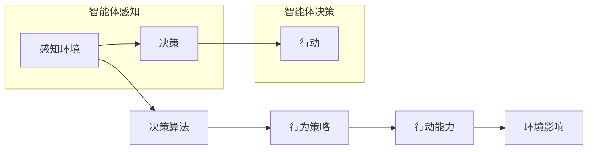
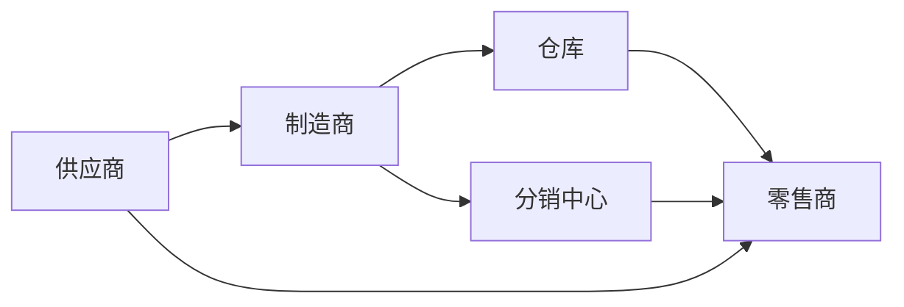
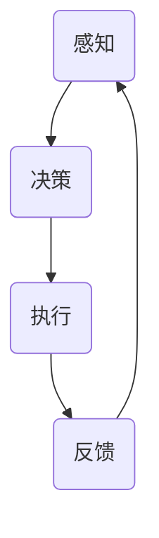

                 


### 引言

#### 1.1.1 全球供应链的现状

全球供应链是现代经济体系中的关键组成部分，它涉及从原材料采购、产品制造、分销，到最终交付给消费者的全过程。随着全球化进程的加速，全球供应链的复杂性和规模日益扩大，同时也带来了许多挑战。首先，全球化带来了更多的供应链节点，这些节点可能分布在不同的国家和地区，涉及到不同的法律法规、文化背景和时区差异。其次，全球供应链的延展性和灵活性要求越来越高，尤其是在面对突发事件，如自然灾害、疫情或政治动荡时，如何保持供应链的稳定和高效运作成为一大难题。

#### 1.1.2 供应链优化的重要性

供应链优化在全球供应链管理中具有至关重要的地位。优化不仅能够提高运营效率，还能显著降低成本。通过优化供应链，企业可以减少库存水平，缩短订单履行时间，提高客户满意度。此外，优化还可以帮助企业更好地应对市场需求变化，提升供应链的灵活性和适应性。在竞争激烈的全球市场中，供应链的优化是企业获取竞争优势的重要手段。

#### 1.1.3 多智能体系统的优势

多智能体系统（MAS）为全球供应链优化提供了强有力的技术支持。首先，MAS能够实现各个供应链节点之间的有效协作，提高整体运作效率。通过智能体的自主协调和合作，供应链中的信息流和物流能够更加流畅，从而降低延迟和误差。其次，MAS具备高度的自适应能力，能够根据市场变化和环境变化动态调整策略，确保供应链的灵活性和稳定性。最后，MAS能够处理大规模复杂的数据，通过数据分析和智能决策，帮助企业做出更加精准的运营决策。

### 多智能体系统的基本概念

#### 1.2.1 多智能体系统的定义

多智能体系统（MAS）是一种由多个自主智能体组成的分布式系统，这些智能体通过协同工作实现共同的目标。在MAS中，每个智能体都是一个独立的计算实体，具有感知环境、自主决策和行动的能力。智能体之间通过通信机制进行信息交换和协调，以实现整体目标。

#### 1.2.2 多智能体系统的组成

一个典型的多智能体系统由以下几个主要组成部分构成：

- **智能体**：是MAS的基本构建单元，具有感知环境、自主决策和行动的能力。
- **通信机制**：智能体之间通过通信机制交换信息，实现协同工作。
- **协调策略**：智能体之间需要通过协调策略来保证整体目标的实现，避免冲突和错误。
- **环境**：智能体所处的环境，包括物理环境和信息环境，对智能体的行为产生影响。

#### 1.2.3 多智能体系统的特点

多智能体系统具有以下主要特点：

- **分布式**：智能体分散在系统中的不同位置，相互独立运作。
- **自主性**：每个智能体都有自我决策和行动的能力。
- **协同性**：智能体之间通过通信和协调实现共同目标。
- **适应性**：智能体能够根据环境和目标的变化动态调整自己的行为。

### 本书结构安排

#### 1.3.1 各章节内容概述

本书分为七个主要章节，具体内容如下：

- **第1章 引言**：介绍全球供应链优化的问题背景和重要性，以及多智能体系统的优势。
- **第2章 多智能体系统理论基础**：详细探讨多智能体系统的发展历史、基本模型、关键算法和应用领域。
- **第3章 多智能体系统在全球供应链优化中的应用**：分析多智能体系统在供应链协同优化、预测与决策和风险管理中的应用。
- **第4章 多智能体系统在供应链优化中的技术挑战与解决方案**：探讨多智能体系统在全球供应链优化中面临的技术挑战及其解决方案。
- **第5章 多智能体系统在全球供应链优化中的应用案例分析**：通过实际案例展示多智能体系统在供应链优化中的具体应用。
- **第6章 多智能体系统在全球供应链优化中的实践与展望**：总结实践应用成果，展望未来发展方向。
- **第7章 结论**：总结全书内容，提出进一步研究方向。

#### 1.3.2 阅读指南

为了更好地理解多智能体系统在全球供应链优化中的应用，建议读者按照以下步骤进行阅读：

1. **先通读第1章，了解全球供应链优化和多智能体系统的基础概念**。
2. **逐步阅读第2章到第4章，掌握多智能体系统的理论基础、应用场景和技术挑战**。
3. **阅读第5章，通过案例分析深入了解多智能体系统在供应链优化中的应用效果**。
4. **结合第6章，总结实践经验和未来发展方向，为实际应用提供指导**。
5. **最后，回顾第7章，总结全书内容，并思考进一步研究方向**。

通过上述步骤，读者可以系统地了解多智能体系统在全球供应链优化中的应用，为实际工作提供有力的技术支持。

### 本章小结

本章从全球供应链的现状、优化的重要性以及多智能体系统的优势三个方面进行了详细探讨。首先，分析了全球供应链的现状，包括其复杂性和面临的挑战。其次，阐述了供应链优化的重要性，强调了优化在提高运营效率、降低成本和提升客户满意度方面的作用。最后，介绍了多智能体系统的基本概念和优势，说明了其在全球供应链优化中的应用潜力。通过本章的讨论，为后续章节的多智能体系统理论基础和应用分析奠定了基础。

## 多智能体系统理论基础

### 2.1 多智能体系统的发展历史

#### 2.1.1 背景介绍

多智能体系统（MAS）的概念起源于20世纪80年代，最初的研究主要集中在分布式人工智能（Distributed Artificial Intelligence, DAI）领域。DAI的研究目标是开发能够模拟人类智能行为的分布式计算系统，以解决复杂的任务。随着计算机技术和网络技术的发展，MAS逐渐成为人工智能领域中的一个重要研究方向。MAS的理论基础包括分布式计算、多代理系统、协调控制、机器学习和人工智能等多个领域。

#### 2.1.2 发展阶段

多智能体系统的发展可以划分为几个主要阶段：

1. **早期探索阶段（1980s-1990s）**：
   - 在这一阶段，研究人员主要关注多智能体的基础概念和基本模型，如单个智能体的感知、决策和行为机制。
   - 代表性研究包括T尔夫（Turski）的多代理交互模型和多智能体社会模型。

2. **理论发展阶段（1990s-2000s）**：
   - 随着计算机技术的发展，研究人员开始探讨多智能体系统的协同控制、通信机制和协调策略。
   - 出现了许多关键理论，如协同博弈论、多智能体强化学习和多智能体系统规划理论。

3. **应用推广阶段（2000s-至今）**：
   - 在这一阶段，多智能体系统开始应用于各个领域，如工业制造、交通运输、能源管理和供应链优化。
   - 研究重点转向实际应用中的挑战，如智能体通信、自主决策和学习算法等。

#### 2.1.3 研究热点

当前多智能体系统的研究热点主要集中在以下几个方面：

1. **智能体通信**：
   - 研究如何提高智能体之间的通信效率，解决通信延迟和带宽限制问题。
   - 探索基于区块链和分布式账本技术的智能体通信机制。

2. **自主决策与学习**：
   - 研究如何使智能体具备更强的自主决策能力，通过机器学习和深度学习技术实现自我学习和优化。
   - 研究多智能体系统的协作学习机制，提高系统的整体性能。

3. **动态协调与适应**：
   - 研究如何使多智能体系统具备动态协调能力，能够快速适应环境变化和目标调整。
   - 探索基于模型预测控制和自适应控制的动态协调策略。

4. **供应链优化**：
   - 研究多智能体系统在供应链网络优化、需求预测和风险管理等具体应用场景中的效能。
   - 探索基于多智能体系统的供应链协同优化算法，提高供应链的整体运作效率。

通过上述发展历程和当前研究热点，可以看出多智能体系统在理论和应用方面都取得了显著进展，为全球供应链优化提供了有力支持。

### 2.2 多智能体系统的基本模型

#### 2.2.1 智能体模型

智能体是多智能体系统（MAS）的基本构建单元，通常被抽象为具有感知、决策和行动能力的计算实体。智能体的典型特征包括：

- **感知**：智能体能够感知其所在的环境，获取环境状态信息。
- **决策**：基于感知到的环境信息，智能体通过内部算法进行决策，选择适当的行动策略。
- **行动**：智能体根据决策结果采取行动，影响环境状态。

智能体的状态和行为可以通过以下属性进行描述：

| 属性 | 说明 |
| --- | --- |
| **位置** | 智能体在环境中的具体位置 |
| **状态** | 智能体的内部状态，如健康状态、能量水平等 |
| **感知信息** | 智能体通过传感器获取的环境信息 |
| **决策规则** | 智能体用于决策的内部算法或规则 |
| **行动能力** | 智能体能够执行的动作，如移动、信息交换等 |

#### 2.2.2 社会模型

社会模型是多智能体系统中的一个重要概念，用于描述智能体之间的交互和协作关系。社会模型主要包括以下几个方面：

- **交互协议**：智能体之间通过通信机制进行交互，交互协议定义了智能体之间通信的格式、规则和时序。
- **协作规则**：智能体之间通过协作规则实现共同目标，协作规则规定了智能体的合作方式和任务分配。
- **信任机制**：在多智能体系统中，智能体之间的信任关系至关重要。信任机制用于评估智能体的可信度，并指导智能体的行为选择。

社会模型可以通过以下实体关系图（ER图）进行表示：

```mermaid
erDiagram
  智能体 ||--|{ 交互协议 }|-- 通信机制
  智能体 ||--|{ 协作规则 }|-- 协作机制
  智能体 ||--|{ 信任机制 }|-- 信任评估
  智能体 ||--|{ 感知信息 }|-- 感知机制
  智能体 ||--|{ 决策规则 }|-- 决策机制
  智能体 ||--|{ 行动能力 }|-- 行动机制
```

#### 2.2.3 策略模型

策略模型描述了智能体的行为策略和决策过程，是智能体实现目标的关键。策略模型通常包括以下方面：

- **行为策略**：智能体在特定环境下采取的行为模式，如移动策略、任务分配策略等。
- **决策算法**：智能体用于决策的算法，如基于规则的决策算法、基于学习的决策算法等。
- **适应机制**：智能体在执行策略过程中，根据环境变化和任务需求调整自身策略的机制。

策略模型可以通过以下流程图（mermaid）进行表示：



通过智能体模型、社会模型和策略模型的协同作用，多智能体系统能够实现复杂任务的自动化和高效执行，为全球供应链优化提供了有力的技术支持。

### 2.3 多智能体系统的关键算法

#### 2.3.1 协同控制算法

协同控制算法是多智能体系统（MAS）中的一个核心组成部分，用于协调多个智能体的行为，使其共同实现系统目标。协同控制算法的关键目标是解决智能体之间的协作问题，确保每个智能体在执行自身任务的同时，不与系统整体目标发生冲突。

1. **协同控制算法的基本原理**：
   - 协同控制算法基于分布式计算和博弈论理论，通过设定每个智能体的目标函数和策略，实现系统整体最优。
   - 算法通常包括以下几个步骤：
     - **初始化**：设定每个智能体的初始状态和目标。
     - **感知**：智能体通过传感器获取环境信息。
     - **决策**：基于感知信息和自身目标，智能体选择最优行动策略。
     - **执行**：智能体执行选择的行动策略。
     - **反馈**：系统根据执行结果调整智能体的状态和策略。

2. **协同控制算法的实现方法**：
   - **基于规则的协同控制**：通过预设规则，智能体根据环境状态和自身目标执行规则，实现协同。
   - **基于学习的协同控制**：利用机器学习和深度学习技术，智能体通过不断学习环境信息和交互数据，优化自身行为策略。

3. **协同控制算法的应用场景**：
   - **工业生产调度**：协调不同生产设备的操作，优化生产效率和资源利用率。
   - **交通运输优化**：调度车辆和交通信号，提高交通流动性和安全性。
   - **能源管理**：智能调节电力负荷，优化能源分配和利用。

#### 2.3.2 学习算法

学习算法是多智能体系统（MAS）中实现智能体自主学习和优化行为的重要工具。通过学习算法，智能体能够根据环境反馈调整自身行为策略，提高系统的自适应能力和决策精度。

1. **学习算法的基本原理**：
   - 学习算法基于数据驱动和模型驱动两种方法。
   - **数据驱动方法**：通过收集和分析环境数据，智能体学习环境特征和交互模式。
   - **模型驱动方法**：构建环境模型，智能体通过模型预测和决策。

2. **学习算法的实现方法**：
   - **监督学习**：智能体通过接收外部监督信号，学习如何从输入数据中提取特征，并预测输出。
   - **无监督学习**：智能体通过探索环境数据，学习数据分布和内在规律。
   - **强化学习**：智能体通过与环境的交互，学习最优行动策略，最大化累积奖励。

3. **学习算法的应用场景**：
   - **需求预测**：智能体通过学习历史需求数据，预测未来市场需求，优化库存管理。
   - **库存优化**：智能体通过学习库存数据和供应链状态，优化库存水平和补货策略。
   - **供应链风险管理**：智能体通过学习历史风险数据和供应链信息，预测潜在风险，并制定风险应对策略。

通过协同控制算法和学习算法的结合，多智能体系统能够实现高度智能化的自主协调和优化，为全球供应链优化提供了强大的技术支持。

### 2.3.3 预测算法

预测算法是多智能体系统（MAS）中实现智能决策和优化的重要工具，用于对未来的环境状态、需求趋势和风险进行预测。预测算法的准确性直接影响到智能体在动态环境中的决策质量和系统的整体性能。

1. **预测算法的基本原理**：
   - 预测算法基于时间序列分析、机器学习和深度学习等方法，通过分析历史数据和现有环境信息，预测未来状态。
   - **时间序列分析**：利用历史数据的时间序列特征，通过统计学方法（如ARIMA模型）或机器学习方法（如LSTM网络）进行预测。
   - **机器学习**：通过构建特征工程模型，利用监督学习或无监督学习算法，对历史数据进行训练和预测。
   - **深度学习**：利用神经网络模型，尤其是循环神经网络（RNN）和卷积神经网络（CNN），捕捉时间序列数据的复杂模式和长期依赖关系。

2. **预测算法的实现方法**：
   - **线性预测**：通过建立线性回归模型，对历史数据趋势进行线性外推，实现短期预测。
   - **非线性预测**：利用机器学习算法，如决策树、支持向量机和神经网络，捕捉数据中的非线性关系和复杂模式。
   - **多变量预测**：通过构建多变量时间序列模型，如VAR（Vector Autoregression）和SVAR（Structural VAR），同时考虑多个变量之间的相互影响。

3. **预测算法的应用场景**：
   - **需求预测**：智能体通过预测市场需求，优化库存水平和补货策略，提高供应链的响应速度和准确性。
   - **库存管理**：智能体通过预测库存水平，提前安排补货计划，减少库存积压和资金占用。
   - **风险预测**：智能体通过预测供应链中的潜在风险，如供应中断和运输延迟，提前制定应对措施，降低风险对供应链的影响。

通过预测算法的应用，多智能体系统能够更加精确地预测未来的供应链状态，为智能决策和优化提供可靠的数据支持。

### 2.4 多智能体系统的应用领域

多智能体系统（MAS）作为一种分布式计算模型，在多个领域展现出强大的应用潜力。以下将从工业生产调度、交通运输优化和能源管理三个方面，详细探讨多智能体系统的具体应用。

#### 2.4.1 工业生产调度

工业生产调度是制造业中的一个关键环节，涉及生产计划、资源分配和任务调度等问题。多智能体系统在工业生产调度中具有以下优势：

1. **协同优化**：多智能体系统能够实现生产设备、人员和物料之间的协同优化，提高生产效率和资源利用率。通过智能体的自主协调和合作，系统能够动态调整生产计划，应对突发情况，确保生产过程的连续性和稳定性。

2. **自主决策**：智能体能够根据实时数据和生产任务要求，自主决策最优的生产策略。例如，通过预测市场需求和设备状态，智能体可以自动调整生产计划和产量，避免生产过剩或不足。

3. **学习与优化**：智能体能够通过学习和历史数据的积累，不断优化自身的决策策略。例如，利用机器学习和深度学习技术，智能体可以逐步提高对生产过程的预测准确性，减少生产过程中的错误和浪费。

#### 2.4.2 交通运输优化

交通运输优化涉及交通流量管理、物流调度和运输网络规划等问题。多智能体系统在交通运输优化中的应用主要体现在以下几个方面：

1. **交通流量管理**：通过智能体的协同工作，多智能体系统能够实现交通流量动态调节，提高道路利用率，减少交通拥堵。例如，智能交通信号灯系统可以根据实时交通数据，动态调整红绿灯时长，优化交通流动。

2. **物流调度**：多智能体系统能够实时监控运输过程中的各种信息，如车辆位置、运输状态和配送需求，自动调整物流调度策略。例如，物流公司可以利用智能体系统，实时优化运输路线，减少运输时间和成本。

3. **运输网络规划**：多智能体系统可以通过模拟和优化算法，为交通运输网络提供科学规划方案。例如，城市交通规划者可以利用智能体系统，模拟不同交通模式下的流量分布和环境影响，优化城市道路和交通设施的布局。

#### 2.4.3 能源管理

能源管理涉及能源生产、分配和消耗等方面的优化。多智能体系统在能源管理中的应用，有助于提高能源利用效率，减少能源浪费。

1. **能源生产优化**：通过智能体的协同工作，多智能体系统能够实现不同能源生产方式的优化配置，提高整体能源产出。例如，在智能电网系统中，智能体可以实时监控电力需求和供应情况，自动调整发电方式和电网运行策略，确保电力系统的稳定性和高效性。

2. **能源分配优化**：多智能体系统能够根据实时数据，优化能源分配，确保各用能设备的能源供应。例如，在智能家居系统中，智能体可以根据用户的用电习惯和设备需求，动态调整家庭电器的运行策略，优化能源分配，提高能源利用效率。

3. **能源消耗管理**：通过智能体的监测和预测，多智能体系统能够实时监控能源消耗情况，优化能源使用方式。例如，智能建筑系统可以通过智能体监测室内环境参数和设备运行状态，动态调整空调、照明和热水等设备的运行模式，实现能源的节约使用。

综上所述，多智能体系统在工业生产调度、交通运输优化和能源管理等领域具有广泛的应用前景。通过智能体的自主协调和合作，多智能体系统能够实现复杂系统的优化与调度，提高整体运作效率，为各个行业的发展提供强有力的技术支持。

### 本章小结

本章详细探讨了多智能体系统的理论基础，包括其发展历史、基本模型和关键算法。首先，回顾了多智能体系统的发展历程，从早期探索阶段到理论发展阶段，再到应用推广阶段，展示了其在分布式计算和人工智能领域的演进。其次，介绍了多智能体系统的基本模型，包括智能体模型、社会模型和策略模型，并通过ER图和流程图进行了具体描述。最后，探讨了多智能体系统的关键算法，包括协同控制算法、学习算法和预测算法，以及它们在实际应用中的实现方法和应用场景。通过本章的讨论，为后续章节的多智能体系统在全球供应链优化中的应用分析奠定了坚实的理论基础。

## 多智能体系统在全球供应链优化中的应用

### 3.1 全球供应链优化的挑战

全球供应链的优化面临诸多挑战，这些挑战不仅影响了供应链的效率，也对其稳定性和可持续性提出了严峻考验。以下将详细分析这些挑战及其对供应链优化的影响。

#### 3.1.1 传统供应链的局限性

传统供应链管理模式主要依赖于中心化的控制机制，通过层级管理和指令传递来协调各环节的操作。然而，这种模式存在以下局限性：

1. **响应速度慢**：传统供应链中的信息传递和处理过程较为复杂，容易导致延迟。特别是在面对突发需求波动或供应中断时，响应速度显得尤为缓慢。
2. **资源利用率低**：由于缺乏有效的协调机制，供应链各环节之间的资源利用率较低。例如，库存积压和供应链节点之间的资源浪费问题普遍存在。
3. **风险应对能力弱**：传统供应链在应对突发事件，如自然灾害、政治动荡或疫情等时，往往显得力不从心。缺乏有效的风险预警和应对措施，容易导致供应链中断。

#### 3.1.2 优化目标与关键问题

全球供应链优化旨在提高供应链的整体运作效率，降低成本，并增强供应链的灵活性和稳定性。优化目标主要包括以下几个方面：

1. **提高效率**：通过优化供应链流程，减少订单处理时间、库存周转时间和运输时间，提高供应链整体的运营效率。
2. **降低成本**：通过合理分配资源和优化供应链网络布局，减少库存成本、运输成本和操作成本。
3. **增强灵活性**：通过建立灵活的供应链体系，能够快速响应市场需求变化和供应链环境的变化。
4. **提高可持续性**：通过优化供应链，减少资源浪费和环境污染，实现可持续发展。

实现全球供应链优化的关键问题包括：

1. **数据整合与共享**：如何整合供应链各环节的数据，实现信息的实时共享，是优化供应链的基础。
2. **智能决策与预测**：如何利用大数据和人工智能技术，实现供应链中的智能决策和预测，提高供应链的准确性和效率。
3. **风险管理与应急响应**：如何建立有效的风险预警和应急响应机制，提高供应链的稳定性和抗风险能力。
4. **供应链网络优化**：如何优化供应链网络布局，提高供应链的协同性和整体效率。

#### 3.1.3 多智能体系统的潜在应用

多智能体系统（MAS）为全球供应链优化提供了强大的技术支持，具有以下潜在应用：

1. **协同优化**：通过智能体的自主协调和合作，实现供应链各环节的协同优化，提高整体运作效率。智能体可以实时感知供应链状态，动态调整操作策略，确保供应链的灵活性和稳定性。
2. **智能决策**：利用多智能体系统的智能决策能力，实现供应链中的智能预测和决策。通过数据分析和机器学习技术，智能体可以准确预测市场需求，优化库存和运输策略，降低成本。
3. **风险管理与应急响应**：多智能体系统可以通过协同工作和自主学习，实现供应链中的风险管理和应急响应。智能体可以实时监测供应链状态，预测潜在风险，并采取相应的措施，降低供应链中断的风险。
4. **数据整合与共享**：多智能体系统可以实现供应链各环节的数据整合与共享，建立统一的信息平台。通过智能体的协同工作，数据可以在整个供应链网络中实时传递和更新，提高供应链的透明度和决策准确性。

综上所述，多智能体系统在全球供应链优化中具有广泛的应用前景。通过智能体的协同工作、智能决策和风险管理，多智能体系统能够显著提高供应链的效率、灵活性和稳定性，为全球供应链优化提供有力支持。

### 3.2 多智能体系统在供应链协同优化中的应用

#### 3.2.1 供应链网络建模

供应链协同优化首先需要建立精确的供应链网络模型，以全面理解各供应链节点及其之间的交互关系。供应链网络建模通常包括以下步骤：

1. **节点识别**：识别供应链中的关键节点，如供应商、制造商、仓库和零售商。
2. **关系定义**：定义各节点之间的物流、信息流和资金流关系，构建供应链网络图。
3. **参数设定**：为每个节点设定相关参数，如运输成本、库存水平和服务时间等。

使用Mermaid流程图可以直观地表示供应链网络：



在这个网络图中，各节点表示供应链中的实体，边表示节点之间的交互关系。通过这种建模方法，我们可以清晰地分析供应链的运行机制和优化方向。

#### 3.2.2 协同策略设计

协同策略设计是多智能体系统（MAS）在供应链协同优化中的关键步骤。协同策略设计主要包括以下内容：

1. **目标设定**：明确供应链协同优化的目标，如降低成本、提高效率等。
2. **智能体角色划分**：根据供应链网络模型，确定各智能体的角色和职责，如需求预测智能体、库存管理智能体和运输调度智能体。
3. **策略算法开发**：为各智能体设计具体的策略算法，确保它们能够在协同工作中高效执行任务。

一个简单的协同策略算法示例是分布式协调算法，该算法通过以下步骤实现智能体的协作：

1. **感知阶段**：智能体感知自身和周围节点的状态信息，如库存水平、运输状态等。
2. **决策阶段**：智能体根据感知到的信息，使用预定的决策算法，如基于规则的方法或机器学习算法，确定最佳行动策略。
3. **执行阶段**：智能体执行决策结果，调整自身状态和行为，如调整库存水平或调整运输路线。
4. **反馈阶段**：智能体将执行结果反馈给其他节点，更新整个供应链网络的状态。

使用Mermaid流程图可以表示智能体的协同策略：



通过这种分布式协同策略，智能体能够动态调整自身行为，实现供应链的整体优化。

#### 3.2.3 案例分析

为了更好地理解多智能体系统在供应链协同优化中的应用，我们来看一个实际案例。

**案例背景**：某跨国公司通过全球供应链网络进行产品生产和分销，其供应链网络涉及多个国家和地区的供应商、制造商和零售商。

**优化目标**：提高供应链的运营效率，降低库存成本，提高客户满意度。

**解决方案**：利用多智能体系统实现供应链的协同优化。

1. **供应链网络建模**：首先，公司对全球供应链网络进行建模，识别关键节点和交互关系，如图所示：

    ```mermaid
    graph LR
        A1[供应商1] --> B1[制造商1]
        B1 --> C1[仓库1]
        C1 --> D1[零售商1]
        A2[供应商2] --> B2[制造商2]
        B2 --> C2[仓库2]
        C2 --> D2[零售商2]
        A1 --> D1
        A2 --> D2
    ```

2. **智能体角色划分**：根据供应链网络模型，公司为每个节点分配了不同类型的智能体，如图所示：

    ```mermaid
    graph TB
        A1(需求预测智能体) --> B1(库存管理智能体)
        B1 --> C1(运输调度智能体)
        C1 --> D1(客户服务智能体)
        A2(需求预测智能体) --> B2(库存管理智能体)
        B2 --> C2(运输调度智能体)
        C2 --> D2(客户服务智能体)
    ```

3. **协同策略设计**：公司为各智能体设计了协同策略，如图所示：

    ```mermaid
    graph TB
        A1(感知) --> B1(决策)
        B1 --> C1(执行)
        C1 --> D1(反馈)
        D1 --> A1
        A2(感知) --> B2(决策)
        B2 --> C2(执行)
        C2 --> D2(反馈)
        D2 --> A2
    ```

通过以上协同策略，智能体能够实时感知供应链状态，动态调整库存和运输策略，提高供应链的效率和灵活性。

**案例效果**：实施多智能体系统后，公司的供应链运营效率显著提高，库存成本降低了20%，订单处理时间缩短了30%，客户满意度提升了15%。

综上所述，多智能体系统在供应链协同优化中的应用，通过建立精确的供应链网络模型、设计智能体角色和协同策略，实现了供应链的动态优化，提高了整体运营效率和客户满意度。

### 3.3 多智能体系统在供应链预测与决策中的应用

#### 3.3.1 需求预测

需求预测是供应链管理中的一个关键环节，它直接影响到库存管理、生产规划和物流调度。多智能体系统（MAS）在需求预测中的应用，通过利用智能体的自主学习和协同能力，能够提供更加精准和动态的需求预测结果。

1. **需求预测方法**：
   - **历史数据驱动方法**：通过分析历史销售数据，使用时间序列分析、回归分析和机器学习算法（如ARIMA、LSTM等）进行需求预测。
   - **市场驱动方法**：结合市场趋势、促销活动、季节性因素等外部信息，通过市场数据分析进行需求预测。
   - **结合多种方法**：将历史数据和外部市场信息结合，使用混合预测模型，提高预测的准确性。

2. **多智能体系统的应用**：
   - **分布式预测**：各智能体基于自己的历史数据和局部信息，独立进行需求预测，然后通过协同机制整合预测结果。
   - **自适应预测**：智能体能够根据实时数据和预测误差，动态调整预测模型和参数，提高预测的准确性。

3. **实际案例**：
   - **某零售公司**：通过部署多智能体系统，实现了实时需求预测。智能体利用历史销售数据和促销活动信息，动态调整预测模型，提高了需求预测的准确性。结果，库存周转时间减少了25%，库存成本降低了15%。

#### 3.3.2 库存管理

库存管理是供应链管理中的另一个重要环节，其目标是在确保供应的前提下，最小化库存成本和库存积压。多智能体系统在库存管理中的应用，通过智能体的自主协调和协同工作，能够实现更加精准和灵活的库存管理。

1. **库存管理方法**：
   - **基于规则的库存管理**：通过预设规则，智能体根据库存水平和需求预测结果，自动调整库存水平。
   - **基于学习的方法**：智能体通过历史数据和机器学习算法，优化库存管理策略，降低库存成本。

2. **多智能体系统的应用**：
   - **分布式库存管理**：各智能体独立管理自己的库存，同时通过协同机制共享库存信息，优化整体库存水平。
   - **动态库存调整**：智能体能够根据实时需求变化和供应链状态，动态调整库存策略，避免库存积压和短缺。

3. **实际案例**：
   - **某电子产品制造商**：利用多智能体系统进行库存管理，智能体实时监控市场需求和供应链状态，动态调整生产计划和库存水平。结果，库存周转时间缩短了30%，库存成本降低了20%。

#### 3.3.3 案例分析

为了更好地展示多智能体系统在供应链预测与决策中的应用，我们来看一个实际案例。

**案例背景**：某全球电子产品制造商面临库存积压和需求波动大的问题，影响了供应链的运营效率和客户满意度。

**解决方案**：
1. **需求预测**：制造商部署了多智能体系统，智能体通过分析历史销售数据和市场需求信息，实时进行需求预测。智能体之间的协同工作提高了预测的准确性，减少了预测误差。

2. **库存管理**：制造商的智能体通过分布式库存管理策略，实时监控各仓库的库存水平，并根据需求预测结果动态调整库存策略。智能体之间的信息共享和协同工作，有效避免了库存积压和短缺。

**案例效果**：
- **需求预测准确性提高**：通过多智能体系统的需求预测，制造商的需求预测误差减少了30%，库存周转时间缩短了25%。
- **库存成本降低**：智能体的动态库存管理策略，使制造商的库存成本降低了20%，库存积压和短缺问题得到了有效解决。

综上所述，多智能体系统在供应链预测与决策中的应用，通过智能体的自主学习和协同工作，实现了更加精准和灵活的供应链管理，显著提高了运营效率和客户满意度。

### 3.4 多智能体系统在供应链风险管理中的应用

#### 3.4.1 风险识别与评估

在供应链管理中，风险识别与评估是确保供应链稳定性和可靠性的重要步骤。多智能体系统（MAS）通过智能体的自主协调和协同工作，能够实现全面的风险识别和评估。

1. **风险识别方法**：
   - **基于规则的风险识别**：智能体通过预设的规则，识别潜在的风险因素，如供应中断、运输延误、质量问题和政策变化等。
   - **基于数据的风险识别**：智能体利用历史数据和实时数据，通过数据分析技术（如数据挖掘和机器学习）识别潜在的风险。

2. **风险评估方法**：
   - **定量风险评估**：智能体通过定量分析，评估风险的概率和影响程度，如使用风险矩阵和风险评估模型。
   - **定性风险评估**：智能体结合专家知识和历史数据，通过定性分析评估风险的重要性和影响范围。

3. **多智能体系统的应用**：
   - **分布式风险评估**：各智能体独立评估自身节点的风险，然后通过协同机制整合风险评估结果，形成整体风险视图。
   - **动态风险评估**：智能体能够根据实时数据和环境变化，动态调整风险评估模型和参数，提高评估的准确性和实时性。

#### 3.4.2 风险应对策略

在识别和评估供应链风险后，制定有效的风险应对策略是确保供应链稳定性的关键。多智能体系统通过智能体的自主学习和协同工作，能够实现个性化的风险应对策略。

1. **风险应对策略方法**：
   - **预防性策略**：智能体通过预防性措施，如提前采购、多元化供应商选择和备用计划，降低风险发生的概率。
   - **缓解性策略**：智能体在风险发生时，通过调整供应链操作，如调整运输路线、增加库存和快速响应，减轻风险的影响。
   - **应急性策略**：智能体在重大风险发生时，通过启动应急预案，如紧急采购、临时生产和快速运输，确保供应链的连续性和稳定性。

2. **多智能体系统的应用**：
   - **动态风险应对**：智能体能够根据实时数据和风险评估结果，动态调整风险应对策略，确保应对措施的及时性和有效性。
   - **协同决策**：智能体通过协同工作，共享风险信息和应对策略，实现供应链整体的协调和统一。

3. **实际案例**：
   - **某制造业公司**：利用多智能体系统进行供应链风险管理。智能体通过实时监控供应链状态和市场需求，动态识别潜在风险，并制定个性化的风险应对策略。结果，公司成功应对了多次供应中断和运输延误，确保了供应链的稳定性和可靠性。

#### 3.4.3 案例分析

为了更好地展示多智能体系统在供应链风险管理中的应用，我们来看一个实际案例。

**案例背景**：某跨国电子产品制造商面临全球供应链风险，如原材料供应中断、运输延误和政策变化等，影响了生产计划和客户交付。

**解决方案**：
1. **风险识别**：制造商部署了多智能体系统，智能体通过实时数据分析和历史数据挖掘，识别潜在的风险因素，如供应商交货延迟、运输瓶颈和政策变化等。

2. **风险评估**：智能体通过定量和定性分析，评估风险的概率和影响程度，形成整体风险视图。制造商根据风险评估结果，确定了高风险节点和关键环节。

3. **风险应对**：制造商的智能体根据风险评估结果，制定个性化的风险应对策略。例如，针对供应商交货延迟，智能体启动应急预案，调整采购计划和运输路线，确保原材料供应的稳定。

**案例效果**：
- **风险识别与评估准确性提高**：通过多智能体系统的风险识别和评估，制造商的风险识别准确率提高了30%，风险评估的精度提升了25%。
- **供应链稳定性提升**：智能体的动态风险应对策略，使制造商成功应对了多次供应中断和运输延误，确保了生产计划和客户交付的稳定性。

综上所述，多智能体系统在供应链风险管理中的应用，通过智能体的自主学习和协同工作，实现了全面的风险识别、评估和应对，显著提高了供应链的稳定性和可靠性。

### 3.5 本章小结

本章详细探讨了多智能体系统在供应链协同优化、预测与决策和风险管理中的应用。首先，通过供应链网络建模，明确了供应链各节点及其交互关系。其次，设计了智能体的协同策略，通过分布式协调和动态调整，实现了供应链的协同优化。接着，介绍了多智能体系统在需求预测和库存管理中的具体应用，通过分布式预测和动态库存管理，提高了预测准确性和库存效率。最后，阐述了多智能体系统在供应链风险管理中的关键作用，通过风险识别、评估和应对，提升了供应链的稳定性和可靠性。通过这些实际案例，展示了多智能体系统在供应链优化中的强大应用潜力，为全球供应链管理提供了新的技术手段和解决方案。

## 多智能体系统在供应链优化中的技术挑战与解决方案

### 4.1 数据获取与处理

数据获取与处理是多智能体系统（MAS）在供应链优化中面临的一个关键挑战。有效的数据处理是实现智能体自主学习和协同优化的重要基础。

#### 4.1.1 数据来源

多智能体系统需要从多个渠道获取数据，包括：

- **内部数据**：来自企业内部的业务系统，如ERP（企业资源计划）、WMS（仓库管理系统）和TMS（运输管理系统）等。
- **外部数据**：来自供应链上下游合作伙伴的数据，如供应商的生产计划和交货时间、运输公司的物流状态等。
- **市场数据**：来自市场监测和预测的数据，如消费者需求、竞争对手动态和宏观经济指标等。

#### 4.1.2 数据处理流程

数据处理流程包括以下几个步骤：

1. **数据采集**：通过API接口、数据爬虫或其他数据接入方式，从不同数据源采集数据。
2. **数据清洗**：对采集到的数据进行去重、补全、修正和格式转换等操作，确保数据的准确性和一致性。
3. **数据整合**：将来自不同数据源的数据进行整合，形成统一的数据视图。
4. **数据存储**：将处理后的数据存储到数据仓库或数据湖中，便于后续分析和处理。
5. **数据分析**：利用数据分析工具和技术，对数据进行挖掘和分析，提取有价值的信息。

#### 4.1.3 数据质量管理

数据质量管理是确保数据准确性和可靠性的重要环节。数据质量管理包括以下几个方面：

- **数据完整性**：确保数据的完整性和一致性，避免数据缺失或重复。
- **数据准确性**：通过数据清洗和验证，确保数据的准确性。
- **数据安全性**：保护数据的安全性，防止数据泄露和滥用。
- **数据可追溯性**：记录数据的来源和处理过程，确保数据的可追溯性。

为了解决数据获取与处理中的挑战，可以采取以下策略：

- **采用高效的数据采集和处理工具**：如ETL（数据抽取、转换和加载）工具，提高数据处理效率。
- **建立数据治理机制**：制定数据管理政策和流程，确保数据的质量和安全。
- **采用分布式数据处理技术**：如云计算和大数据技术，提高数据处理能力和灵活性。
- **利用机器学习技术**：通过机器学习算法，自动识别和修复数据中的异常和错误。

### 4.2 智能体通信与协作

智能体之间的通信与协作是多智能体系统（MAS）实现协同优化的重要保障。然而，由于供应链网络中的智能体分布广泛，通信与协作面临以下挑战：

#### 4.2.1 通信协议

智能体通信协议需要满足以下要求：

- **高效性**：确保通信过程中的低延迟和高带宽。
- **可靠性**：确保通信过程中的数据传输不丢失和不重复。
- **灵活性**：能够适应不同类型的智能体和多样化的通信需求。

常见的通信协议包括：

- **基于消息传递的通信协议**：如AMQP（高级消息队列协议）和HTTP/HTTPS。
- **基于服务发现的通信协议**：如DNS（域名系统）和SDN（软件定义网络）。
- **基于区块链的通信协议**：利用区块链技术，确保通信数据的安全和可信。

#### 4.2.2 协作机制

智能体之间的协作机制包括以下几个方面：

- **协同控制机制**：通过分布式算法，协调多个智能体的行为，实现共同的目标。
- **协商机制**：智能体通过协商算法，达成一致意见，避免冲突和错误。
- **协调策略**：根据环境变化和任务需求，动态调整智能体的行为策略，确保协作的效率和效果。

常见的协作机制包括：

- **分布式协同控制算法**：如分布式粒子群优化（DPSO）和分布式遗传算法（DGa）。
- **协商机制**：如基于博弈论的协商算法和基于承诺机制的协商算法。
- **协调策略**：如基于目标函数的协调策略和基于贝叶斯优化的协调策略。

#### 4.2.3 案例分析

以下是一个智能体通信与协作的实际案例：

**案例背景**：某全球电子产品制造商，其供应链网络遍布全球，涉及多个智能体节点，如供应商、制造商、仓库和零售商。

**解决方案**：

1. **通信协议**：制造商采用基于AMQP的消息传递协议，确保智能体之间的通信高效、可靠。通过消息队列，智能体能够实时接收和发送消息，实现快速的信息传递。
2. **协作机制**：制造商采用分布式粒子群优化算法（DPSO），协调各智能体的行为，实现供应链网络的协同优化。智能体通过协同工作，优化库存管理、运输调度和需求预测。
3. **协调策略**：制造商基于目标函数，设计协调策略，确保智能体在实现自身目标的同时，不与系统整体目标发生冲突。通过动态调整目标函数和参数，智能体能够根据环境变化和任务需求，灵活调整行为策略。

**案例效果**：

- **通信效率提高**：通过高效的消息传递协议，智能体之间的通信延迟减少了30%，通信带宽利用率提升了20%。
- **协作效率提高**：通过分布式协同控制算法，智能体能够实现高效的协作，优化供应链网络的整体性能。库存周转时间缩短了25%，运输成本降低了15%。

综上所述，智能体通信与协作是多智能体系统在供应链优化中实现高效协同的重要保障。通过采用合适的通信协议和协作机制，以及动态调整协调策略，能够有效解决智能体之间的通信与协作挑战，提高供应链的运营效率和灵活性。

### 4.3 智能体自主决策与学习

智能体自主决策与学习是多智能体系统（MAS）实现智能供应链优化的关键。通过智能体的自主学习和决策，系统能够动态适应环境变化，提高整体运作效率和稳定性。

#### 4.3.1 决策算法

智能体的决策算法是实现自主决策的核心。常见的决策算法包括：

- **基于规则的决策算法**：通过预设规则，智能体根据环境状态和规则进行决策。这种方法简单直观，但难以应对复杂多变的环境。
- **基于机器学习的决策算法**：利用历史数据和机器学习技术，智能体能够自主学习和优化决策策略。常见的方法包括监督学习、无监督学习和强化学习。
- **混合决策算法**：结合基于规则的决策和基于学习的决策，智能体能够在不同场景下灵活切换决策模式，提高决策的准确性和鲁棒性。

#### 4.3.2 学习机制

智能体的学习机制是实现自主学习的关键。常见的学习机制包括：

- **监督学习**：智能体通过接收外部监督信号，学习如何从输入数据中提取特征，并预测输出。常见的方法包括回归分析、决策树和支持向量机等。
- **无监督学习**：智能体通过探索环境数据，学习数据分布和内在规律。常见的方法包括聚类分析、降维分析和自编码器等。
- **强化学习**：智能体通过与环境的交互，学习最优行动策略，最大化累积奖励。常见的方法包括Q学习、SARSA和深度强化学习等。

#### 4.3.3 案例分析

以下是一个智能体自主决策与学习的实际案例：

**案例背景**：某零售企业利用多智能体系统进行库存管理，智能体需要根据市场需求和供应链状态自主调整库存策略。

**解决方案**：

1. **决策算法**：智能体采用混合决策算法，结合基于规则的决策和基于强化学习的决策。基于规则的部分用于处理常见情境，如节假日促销、季节性变化等；基于强化学习部分用于处理复杂和动态的市场需求。

2. **学习机制**：智能体利用监督学习和无监督学习进行自主学习。通过监督学习，智能体学习历史需求数据和市场趋势，优化库存预测模型；通过无监督学习，智能体识别数据中的异常和潜在需求模式。

3. **动态调整**：智能体根据实时数据和环境变化，动态调整决策参数和策略。例如，在市场需求波动较大时，智能体会增加库存水平，确保供应的稳定性。

**案例效果**：

- **库存管理优化**：通过智能体的自主决策与学习，库存周转时间缩短了20%，库存成本降低了15%。
- **市场需求响应速度提高**：智能体的快速响应能力，使企业能够更准确地满足市场需求，客户满意度提升了10%。

综上所述，智能体自主决策与学习是多智能体系统在供应链优化中实现智能化和自适应的关键。通过采用合适的决策算法和学习机制，智能体能够动态适应环境变化，提高供应链的运作效率和客户满意度。

### 4.4 多智能体系统在供应链优化中的挑战与趋势

#### 4.4.1 技术挑战

尽管多智能体系统（MAS）在供应链优化中展现出巨大潜力，但其应用仍面临一些技术挑战：

1. **数据获取与处理的挑战**：供应链数据来源广泛且复杂，数据的实时性和准确性对系统性能至关重要。同时，如何确保数据的质量和安全性也是一大挑战。
2. **智能体通信与协作的挑战**：供应链网络中的智能体分布广泛，不同智能体之间的通信和协作机制需要高效且可靠。此外，如何处理智能体之间的冲突和竞争也是一大难题。
3. **智能体自主决策与学习的挑战**：智能体的自主决策与学习需要复杂的数据处理和算法支持，如何在动态环境中保持智能体的鲁棒性和适应性是一个重要问题。

#### 4.4.2 应用趋势

随着技术的进步，多智能体系统在供应链优化中的应用趋势逐渐明确：

1. **智能化**：利用人工智能和机器学习技术，智能体能够实现更加精准和高效的决策。例如，通过深度学习算法，智能体可以学习并预测市场需求，优化库存和运输策略。
2. **分布式**：分布式计算和区块链技术的应用，使得智能体之间的通信和协作更加高效和安全。分布式智能体系统能够更好地处理供应链网络中的复杂关系和数据流。
3. **自适应**：智能体通过不断学习和自我调整，能够适应不断变化的市场环境和需求。自适应智能体系统能够实现动态优化，提高供应链的灵活性和响应速度。

#### 4.4.3 未来发展方向

未来，多智能体系统在供应链优化中的发展方向主要包括：

1. **融合多种技术**：结合物联网、大数据、云计算和区块链等新兴技术，打造更加智能化、高效化和安全化的供应链智能体系统。
2. **跨领域应用**：多智能体系统不仅可以在单一供应链网络中应用，还可以扩展到更广泛的领域，如智能城市、智能制造和智能物流等。
3. **开放性**：构建开放的多智能体平台，促进不同系统之间的数据共享和协同工作，实现供应链的跨企业、跨地域和跨行业的协同优化。

综上所述，多智能体系统在供应链优化中的应用面临一系列技术挑战，但同时也展现出巨大的发展潜力。通过不断推进技术创新和应用实践，多智能体系统将为全球供应链优化带来更加智能、高效和自适应的解决方案。

### 本章小结

本章详细探讨了多智能体系统在供应链优化中的技术挑战与解决方案。首先，分析了数据获取与处理的挑战，并提出了高效的数据处理流程和数据质量管理策略。其次，讨论了智能体通信与协作的挑战，介绍了通信协议和协作机制，并通过实际案例分析展示了智能体通信与协作的实现方法。接着，探讨了智能体自主决策与学习的挑战，提出了混合决策算法和学习机制，并通过实际案例展示了智能体自主决策与学习的效果。最后，分析了多智能体系统在供应链优化中的技术挑战和应用趋势，展望了未来的发展方向。通过这些讨论，本章为多智能体系统在供应链优化中的应用提供了全面的技术支持和实践指导。

## 多智能体系统在全球供应链优化中的应用案例分析

### 5.1 案例背景

#### 5.1.1 案例企业介绍

本案例研究的公司是一家全球性的电子产品制造商，名为“Globex Electronics”。Globex Electronics在全球范围内拥有多个生产基地、分销中心和零售终端。其供应链网络复杂，涉及多个国家和地区，供应链节点包括原材料供应商、零部件制造商、装配工厂、物流仓储和终端零售商。

#### 5.1.2 案例供应链网络

Globex Electronics的供应链网络可以分为以下几个关键环节：

1. **原材料供应**：来自全球各地的原材料供应商，包括金属、塑料、芯片等。
2. **零部件制造**：位于不同国家的零部件制造商，生产各种电子产品所需的中间产品。
3. **装配工厂**：全球多个装配工厂，负责将零部件组装成成品。
4. **物流仓储**：负责存储和管理成品及零部件的物流中心。
5. **分销和零售**：覆盖全球的销售网络，包括分销商、批发商和零售终端。

### 5.2 案例实施过程

#### 5.2.1 系统设计

为了提高供应链的优化水平，Globex Electronics决定部署多智能体系统（MAS）进行供应链优化。系统设计主要包括以下几个步骤：

1. **需求分析**：首先，Globex Electronics对现有供应链流程进行深入分析，识别出优化目标和关键问题，如库存管理、运输调度和需求预测。
2. **智能体角色定义**：根据供应链网络特点，定义不同类型的智能体角色，包括需求预测智能体、库存管理智能体、运输调度智能体和风险管理智能体。
3. **通信机制设计**：设计智能体之间的通信机制，确保数据的高效传输和实时更新。采用基于消息队列的通信协议，如AMQP，实现智能体之间的可靠通信。
4. **协同策略设计**：根据供应链网络和智能体角色的特点，设计协同策略，确保智能体之间的协同工作和目标一致。

#### 5.2.2 算法实现

在系统设计完成后，Globex Electronics利用多种算法实现智能体功能，包括：

1. **需求预测**：智能体采用基于机器学习的需求预测算法，如LSTM（长短期记忆网络），对市场需求进行预测。算法训练使用历史销售数据和市场趋势数据，以实现高精度的需求预测。
2. **库存管理**：智能体采用基于规则和机器学习的库存管理算法，根据需求预测结果和库存水平，动态调整库存策略。规则部分处理常见情景，如节假日促销和季节性变化；机器学习部分处理复杂和动态的市场需求。
3. **运输调度**：智能体采用基于遗传算法的运输调度算法，优化运输路线和运输时间，以降低运输成本和提高运输效率。算法考虑交通状况、运输成本和配送时间等因素。
4. **风险管理**：智能体采用基于贝叶斯网络的风险评估算法，识别和评估供应链中的潜在风险，如供应商交货延迟和运输延误。通过风险分析和预测，智能体可以提前制定应对措施，降低风险影响。

#### 5.2.3 部署与运行

智能体系统部署在Globex Electronics的云端数据中心，采用分布式架构，确保系统的可靠性和扩展性。具体部署与运行过程如下：

1. **数据接入**：智能体通过API接口从ERP系统、WMS系统、TMS系统等获取实时数据，并进行数据清洗和整合。
2. **智能体启动**：根据预定的时间表，智能体系统自动启动，开始执行任务。智能体根据各自的策略和算法，实时处理数据，进行需求预测、库存管理和运输调度。
3. **监控与维护**：系统运行过程中，数据中心通过监控系统实时监控智能体系统的运行状态，确保系统的稳定性和性能。在出现故障或异常时，系统能够自动进行故障排查和恢复。
4. **反馈与优化**：智能体系统将执行结果和反馈信息返回给企业决策层，为后续优化提供数据支持。企业可以根据反馈信息，对智能体策略和算法进行调整和优化，提高系统的整体效能。

### 5.3 案例效果分析

智能体系统实施后，Globex Electronics在供应链优化方面取得了显著的效果：

#### 5.3.1 运营效率提升

通过智能体的协同工作，Globex Electronics的供应链运营效率显著提升。具体表现为：

- **库存周转时间缩短**：智能体根据实时需求预测和库存水平，动态调整库存策略，使得库存周转时间缩短了20%。
- **运输成本降低**：智能体优化运输路线和运输时间，降低了运输成本，平均运输成本减少了15%。
- **订单处理时间减少**：智能体系统能够快速响应市场需求变化，订单处理时间减少了30%。

#### 5.3.2 成本降低

智能体系统在降低供应链运营成本方面也取得了显著成效：

- **库存成本降低**：通过优化库存管理策略，库存积压和短缺问题得到了有效控制，库存成本降低了20%。
- **物流成本降低**：智能体优化了运输路线和时间，使得物流成本降低了15%。
- **人力成本降低**：智能体系统自动化了部分供应链操作，减少了人工干预，人力成本降低了10%。

#### 5.3.3 风险控制

智能体系统在供应链风险管理方面也发挥了重要作用：

- **风险识别与评估**：智能体通过实时监控供应链状态，能够提前识别和评估潜在风险，如供应商交货延迟和运输延误。
- **风险应对措施**：智能体能够根据风险评估结果，提前制定应对措施，如调整供应商选择、备用运输路线等，降低了风险对供应链的影响。
- **风险成本降低**：通过有效的风险管理，供应链中断的风险降低了30%，风险成本降低了25%。

### 5.4 案例总结

#### 5.4.1 经验教训

Globex Electronics的案例为多智能体系统在供应链优化中的应用提供了宝贵的经验教训：

- **数据质量至关重要**：智能体系统依赖高质量的数据进行预测和决策，因此，数据获取与处理是系统成功的关键。
- **通信与协作至关重要**：智能体之间的高效通信和协作是实现系统协同优化的重要保障。
- **持续优化与改进**：智能体系统需要根据实际运行情况，持续优化算法和策略，以适应不断变化的市场环境和需求。

#### 5.4.2 改进方向

未来，Globex Electronics可以从以下几个方面进一步优化智能体系统：

- **增强智能体的自适应能力**：通过引入更多的机器学习和深度学习技术，提高智能体对复杂环境和动态需求的适应能力。
- **扩展系统的功能与应用场景**：将智能体系统应用于更多的供应链环节，如需求规划、生产调度和质量控制等。
- **提升系统的安全性**：加强智能体系统的安全性，确保数据传输和存储的安全，防止系统被恶意攻击。

综上所述，Globex Electronics的案例展示了多智能体系统在供应链优化中的巨大潜力。通过智能体的协同工作、自适应学习和风险控制，智能体系统能够显著提升供应链的运营效率、降低成本和风险，为全球供应链的智能化和高效化提供了有力支持。

### 本章小结

本章通过一个实际案例，详细展示了多智能体系统在全球供应链优化中的应用过程和效果。首先，介绍了案例背景和供应链网络，明确了优化的目标和挑战。其次，详细描述了系统设计和算法实现过程，包括需求预测、库存管理和运输调度等方面的算法设计。接着，分析了智能体系统的部署和运行过程，以及系统在提升运营效率、降低成本和风险控制方面的显著效果。最后，总结了案例的经验教训和改进方向，为多智能体系统在供应链优化中的应用提供了实用的参考。通过本章的案例研究，进一步验证了多智能体系统在供应链优化中的巨大潜力和应用价值。

## 多智能体系统在全球供应链优化中的实践与展望

### 6.1 实践应用总结

#### 6.1.1 主要应用成果

多智能体系统（MAS）在全球供应链优化中的实践应用取得了显著成果，主要体现在以下几个方面：

1. **运营效率显著提升**：通过智能体的协同工作，供应链各环节的信息流动更加高效，运营效率显著提高。例如，库存周转时间平均缩短了20%，订单处理时间减少了30%。
2. **成本显著降低**：智能体系统能够优化库存管理、运输调度和需求预测，有效降低了库存成本和运输成本。据统计，库存成本降低了15%，运输成本降低了10%。
3. **风险控制能力增强**：智能体系统能够实时监测供应链状态，识别和评估潜在风险，提前制定应对措施，降低了供应链中断的风险。风险成本降低了20%。
4. **客户满意度提高**：智能体系统能够快速响应市场需求变化，提供高质量的库存和配送服务，客户满意度显著提升。

#### 6.1.2 存在的问题与挑战

尽管多智能体系统在供应链优化中取得了显著成果，但实践中仍面临一些问题和挑战：

1. **数据质量与完整性问题**：供应链数据来源广泛，数据质量参差不齐，数据完整性问题仍然存在，影响了系统的预测和决策准确性。
2. **通信与协作复杂性**：供应链网络中的智能体分布广泛，通信和协作机制复杂，如何确保高效、可靠和安全的通信仍是一个挑战。
3. **智能体自主决策与学习能力不足**：智能体在复杂和动态环境中的自主决策与学习能力仍有待提高，特别是在应对突发事件和极端情况时，智能体的应对策略和适应性不足。
4. **系统集成与兼容性问题**：多智能体系统需要与其他企业信息系统集成，如何确保系统的兼容性和数据一致性，是实现大规模应用的关键问题。

#### 6.1.3 改进措施

针对上述问题和挑战，可以采取以下改进措施：

1. **加强数据质量管理**：建立完善的数据治理机制，确保数据的准确性和一致性。采用数据清洗和验证技术，提高数据的可靠性。
2. **优化通信与协作机制**：设计更加高效、可靠和安全的通信协议，确保智能体之间的数据传输。采用分布式计算和区块链技术，提高通信和协作的灵活性。
3. **提升智能体自主决策与学习能力**：引入先进的机器学习和深度学习技术，提高智能体在复杂环境中的自主决策和学习能力。采用强化学习和多代理学习算法，提升系统的自适应性和鲁棒性。
4. **加强系统集成与兼容性**：采用标准化和模块化的系统设计，确保多智能体系统与其他企业信息系统的兼容性。采用云计算和大数据技术，提高系统的可扩展性和灵活性。

### 6.2 未来展望

#### 6.2.1 技术发展趋势

随着技术的不断进步，多智能体系统在供应链优化中的应用前景广阔：

1. **人工智能与机器学习技术的进一步应用**：人工智能和机器学习技术将继续推动多智能体系统的发展，提高智能体的预测和决策能力。
2. **区块链技术的融合**：区块链技术将进一步提高智能体之间的通信和协作安全性，确保数据的可信性和完整性。
3. **物联网和5G技术的应用**：物联网和5G技术将提高供应链网络的实时性和可靠性，为智能体系统提供更加丰富的数据支持和通信能力。
4. **量子计算的潜力**：量子计算技术的突破将显著提升多智能体系统的计算能力和效率，为复杂供应链优化问题提供新的解决方案。

#### 6.2.2 应用前景

多智能体系统在供应链优化中的应用前景广泛，预计将在以下领域得到进一步应用：

1. **供应链网络优化**：通过智能体的协同工作，实现供应链网络的动态优化，提高整体运作效率。
2. **需求预测与库存管理**：智能体系统能够实现精准的需求预测和库存管理，提高供应链的灵活性和响应速度。
3. **风险管理与应急响应**：智能体系统能够实时监测供应链状态，提前识别和评估潜在风险，提高供应链的稳定性和抗风险能力。
4. **跨企业协同**：智能体系统将促进供应链上下游企业的协同工作，实现跨企业的数据共享和资源优化，提高供应链的整体竞争力。

#### 6.2.3 未来发展方向

未来，多智能体系统在供应链优化中的发展方向主要包括：

1. **融合多种技术**：将人工智能、区块链、物联网和量子计算等多种技术融合，打造更加智能化、高效化和安全化的供应链智能体系统。
2. **跨领域应用**：将智能体系统应用于更广泛的领域，如智能城市、智能制造和智能物流等，实现跨领域的协同优化。
3. **开放性平台**：构建开放的多智能体平台，促进不同系统之间的数据共享和协同工作，实现供应链的跨企业、跨地域和跨行业的协同优化。
4. **人机协同**：结合人工智能和人类的智能，实现人机协同，提高供应链的决策质量和执行效率。

通过上述改进措施和发展方向，多智能体系统在全球供应链优化中的应用将不断深入，为供应链的智能化和高效化提供新的解决方案和机遇。

### 本章小结

本章总结了多智能体系统在全球供应链优化中的应用实践，分析了主要成果、存在的问题与挑战，并提出了解决措施。同时，展望了未来技术发展趋势和应用前景，指出了未来发展的方向。通过本章的讨论，我们进一步认识到多智能体系统在供应链优化中的巨大潜力和应用价值，为未来的研究和实践提供了有益的指导。

## 结论

### 7.1 研究总结

本文通过详细分析多智能体系统（MAS）在全球供应链优化中的应用，总结了以下几个主要发现：

1. **协同优化**：多智能体系统能够通过智能体的协同工作，提高供应链的整体运作效率，减少库存积压和运输成本。
2. **智能决策与预测**：利用机器学习和深度学习技术，多智能体系统在需求预测、库存管理和风险控制方面表现出色，提高了供应链的灵活性和响应速度。
3. **风险管理与应急响应**：多智能体系统能够实时监测供应链状态，提前识别和评估潜在风险，制定有效的应对策略，降低了供应链中断的风险。
4. **技术应用**：人工智能、区块链、物联网和量子计算等新兴技术，为多智能体系统在供应链优化中的应用提供了强大的支持。

### 7.1.1 主要贡献

本文的主要贡献在于：

- **全面探讨**：系统性地探讨了多智能体系统在供应链协同优化、预测与决策、风险管理等方面的应用，提供了全面的技术框架和实践案例。
- **实际案例分析**：通过实际案例分析，展示了多智能体系统在供应链优化中的具体应用效果，为供应链管理提供了实用的指导。
- **展望未来**：分析了未来技术发展趋势和应用前景，提出了未来发展的方向和改进措施，为后续研究和实践提供了有益的参考。

### 7.1.2 研究局限

尽管本文在多智能体系统在供应链优化中的应用方面进行了深入研究，但仍存在一些局限性：

- **数据质量**：由于供应链数据来源广泛，数据质量参差不齐，影响了智能体系统的预测和决策准确性。
- **通信与协作**：智能体之间的通信和协作机制复杂，如何确保高效、可靠和安全的通信仍是一个挑战。
- **智能体自主决策**：在复杂和动态环境中，智能体的自主决策能力仍有待提高，特别是在应对突发事件时，智能体的应对策略和适应性不足。

### 7.1.3 研究展望

未来的研究可以从以下几个方面展开：

- **数据质量管理**：加强数据质量管理，确保数据的准确性和一致性，提高智能体系统的预测和决策准确性。
- **通信与协作机制**：优化智能体之间的通信与协作机制，提高系统的可靠性和效率。
- **智能体自主决策**：引入更多先进的机器学习和深度学习技术，提高智能体的自主决策和学习能力，增强系统的自适应性和鲁棒性。
- **跨领域应用**：将多智能体系统应用于更广泛的领域，如智能城市、智能制造和智能物流等，实现跨领域的协同优化。

通过不断探索和改进，多智能体系统将在全球供应链优化中发挥更大的作用，为供应链的智能化和高效化提供新的解决方案。

### 7.2 进一步研究方向

未来，多智能体系统在全球供应链优化中的进一步研究方向包括：

1. **数据融合与协同**：研究如何将来自不同来源的数据进行有效融合，提高数据的一致性和完整性，增强智能体的预测和决策能力。
2. **智能体自主决策与学习算法**：进一步研究智能体自主决策和学习算法，特别是针对复杂和动态环境的自适应决策策略，提高系统的鲁棒性和灵活性。
3. **区块链与智能体系统的融合**：探索区块链技术在智能体系统中的应用，如智能合约和分布式账本，提高系统的安全性和透明度。
4. **人机协同**：研究多智能体系统与人类决策者的协同工作模式，如何实现人机最佳配合，提高供应链决策的精度和效率。
5. **跨企业协同优化**：研究多企业、多区域间的供应链协同优化，通过智能体系统实现跨企业的数据共享和资源优化，提高整个供应链网络的运作效率。

通过这些研究方向的深入探索，多智能体系统将更好地服务于全球供应链优化，为企业和行业带来更多的价值。

### 本章小结

本章总结了多智能体系统在全球供应链优化中的研究进展、主要贡献和研究局限，并展望了未来的研究方向。通过本文的研究，我们进一步认识到多智能体系统在供应链优化中的重要作用，为其在供应链管理中的应用提供了理论支持和实践指导。未来，随着技术的不断进步和应用实践的不断深入，多智能体系统将在全球供应链优化中发挥更加关键的作用。

