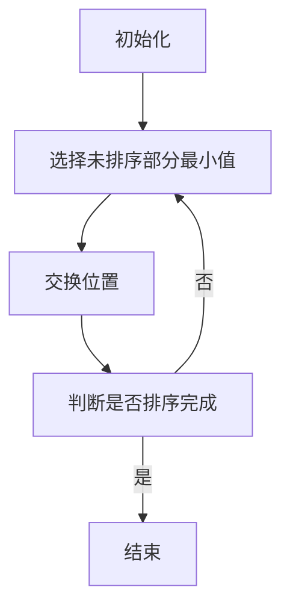
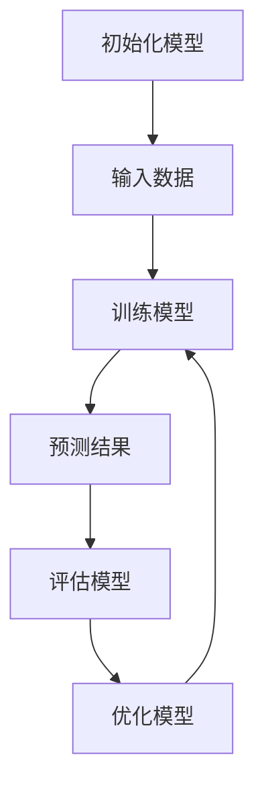
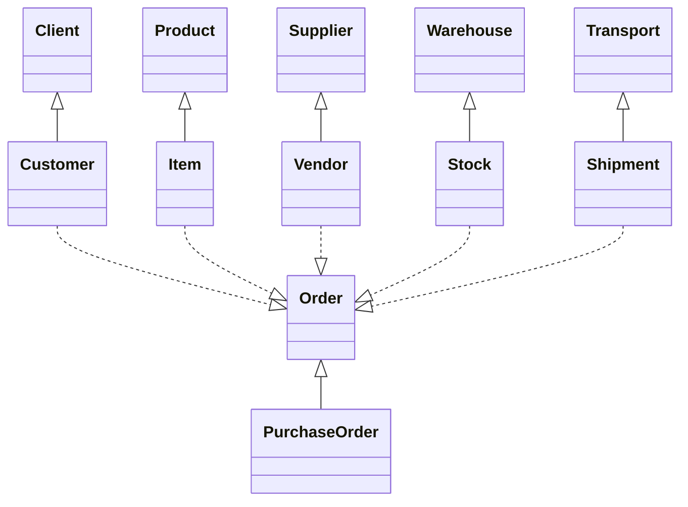
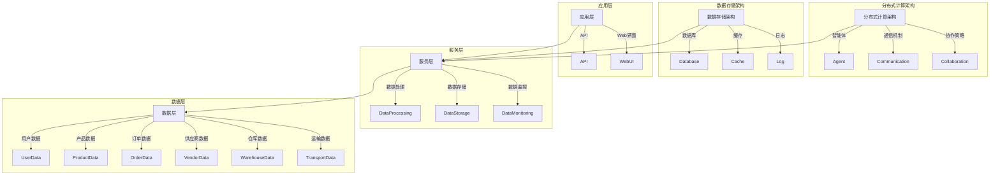
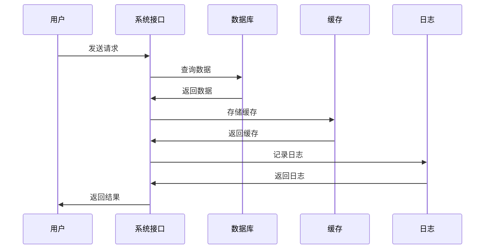

                 


# 多智能体系统在全球供应链分析中的角色

关键词：多智能体系统，全球供应链，分布式计算，协作机制，供应链优化

摘要：本文探讨了多智能体系统在全球供应链分析中的应用，详细阐述了多智能体系统的核心概念与联系，算法原理，并提供了一个系统分析与架构设计方案，旨在为供应链管理提供新的思路和工具。

## Step 1: 背景介绍

### 问题背景

在全球经济一体化的背景下，全球供应链成为了现代经济的核心。企业通过全球化生产、采购和销售，实现了资源的最优配置和效益的最大化。然而，供应链的复杂性使得优化成为了一个挑战。从原材料采购、生产制造、物流运输到分销和零售，每个环节都涉及到大量的数据和信息处理，任何一环的失误都可能导致整个供应链的中断。

### 问题描述

全球供应链分析涉及到诸多复杂因素，如物流、库存管理、风险管理等。传统的集中式系统难以应对这些复杂性。全球供应链中的每个节点都是动态变化的，需求预测、库存水平、运输路线等都需要实时调整。如何有效地集成和利用这些数据，实现供应链的动态优化，是一个亟待解决的问题。

### 问题解决

多智能体系统作为一种新兴的分布式计算范式，开始在全球供应链分析中扮演重要角色。多智能体系统通过分布式计算和协作机制，能够实现供应链的动态优化。智能体通过通信和合作，可以在不同环节进行决策，从而提高供应链的效率。

### 边界与外延

多智能体系统在全球供应链中的应用范围广泛，包括但不限于物流优化、库存管理、需求预测等。然而，其应用还受到技术、成本和协同机制的制约。例如，智能体的通信效率和数据安全性是关键问题。

### 概念结构与核心要素组成

多智能体系统由智能体、环境、通信机制和协作策略等核心要素组成。每个智能体具有感知、决策和执行能力，能够独立或协同工作，以实现整体供应链的优化。

## Step 2: 核心概念与联系

### 多智能体系统（MAS）

#### 概念定义
多智能体系统（MAS）是一种分布式计算范式，由多个智能体组成，这些智能体通过相互通信和协作，以实现共同目标。

#### 属性特征对比表格

| 特征       | 说明                                       |
| ---------- | ------------------------------------------ |
| 分布性     | 智能体分布在不同的位置，协同工作           |
| 智能性     | 智能体具备自主决策和执行能力               |
| 并发性     | 智能体可以同时执行多个任务                 |
| 合作性     | 智能体之间通过协作实现整体目标             |

#### ER实体关系图架构的 mermaid 流程图

```mermaid
erDiagram
  AIExpert ||--o{ 智能体 :Agent }
  AIExpert ||--o{ 环境 :Environment }
  AIExpert ||--o{ 通信机制 :Communication }
  AIExpert ||--o{ 协作策略 :Collaboration }
  智能体 :Agent ||--o{ 感知 :Perception }
  智能体 :Agent ||--o{ 决策 :Decision }
  智能体 :Agent ||--o{ 执行 :Execution }
```

### 智能体

#### 概念定义
智能体是多智能体系统中的基本单元，具备感知、决策和执行能力。

#### 属性特征

| 特征       | 说明                                       |
| ---------- | ------------------------------------------ |
| 感知       | 智能体能够感知环境状态                     |
| 决策       | 智能体根据感知信息做出决策                 |
| 执行       | 智能体根据决策执行行动                     |

### 通信机制

#### 概念定义
通信机制是多智能体系统中的信息交换方式，保证智能体之间的数据传递。

#### 属性特征

| 特征       | 说明                                       |
| ---------- | ------------------------------------------ |
| 信道       | 信息传递的路径                             |
| 传输方式   | 信息传递的方式，如无线、有线等             |
| 传输速度   | 信息传递的速度                             |

### 协作策略

#### 概念定义
协作策略是多智能体系统中的协作方法，用于指导智能体如何协同工作。

#### 属性特征

| 特征       | 说明                                       |
| ---------- | ------------------------------------------ |
| 目标一致   | 智能体协作时具有共同目标                   |
| 协调机制   | 智能体之间的协调方式                       |
| 策略选择   | 根据环境和目标选择合适的协作策略           |

## Step 3: 算法原理讲解

### 1. 部分排序算法

#### 算法mermaid 流程图



#### 算法原理

部分排序算法是一种分布式排序算法，其基本思想是选择未排序部分的最小值，并将其放置到已排序部分的末尾。算法的执行过程如下：

1. 初始化：将未排序部分和已排序部分分开。
2. 选择未排序部分的最小值。
3. 将最小值交换到已排序部分的末尾。
4. 判断是否所有元素都已排序，如果是，结束；否则，返回第2步。

#### Python 源代码实现

```python
def partial_sort(arr):
    unsorted = arr[:]
    sorted = []
    while unsorted:
        min_val = min(unsorted)
        unsorted.remove(min_val)
        sorted.append(min_val)
    return sorted

# 示例
arr = [3, 1, 4, 1, 5, 9, 2, 6, 5]
sorted_arr = partial_sort(arr)
print(sorted_arr)
```

### 2. 预测算法

#### 算法mermaid 流程图



#### 算法原理

预测算法是一种基于历史数据的智能预测方法，其基本思想是建立模型，输入新的数据，通过模型进行预测，然后评估模型的准确性，不断优化模型。

1. 初始化模型：选择合适的预测模型，如线性回归、决策树等。
2. 输入数据：将历史数据输入模型进行训练。
3. 训练模型：通过训练数据，调整模型的参数，使其能够更好地拟合数据。
4. 预测结果：使用训练好的模型，对新的数据进行预测。
5. 评估模型：计算预测结果与实际结果的误差，评估模型的准确性。
6. 优化模型：根据评估结果，调整模型参数，优化模型性能。

#### Python 源代码实现

```python
from sklearn.linear_model import LinearRegression

def predict_linear_regression(X_train, y_train, X_test):
    model = LinearRegression()
    model.fit(X_train, y_train)
    y_pred = model.predict(X_test)
    return y_pred

# 示例
X_train = [[1], [2], [3], [4], [5]]
y_train = [2, 4, 6, 8, 10]
X_test = [[6]]
y_pred = predict_linear_regression(X_train, y_train, X_test)
print(y_pred)
```

## Step 4: 系统分析与架构设计方案

### 问题场景介绍

全球供应链管理涉及到多个环节，包括原材料采购、生产制造、物流运输、库存管理和销售等。每个环节都需要实时收集和处理大量的数据，以保证供应链的高效运作。然而，传统的集中式系统在处理这些复杂的数据和流程时存在很多局限性，难以满足实时性和灵活性的要求。

### 项目介绍

本项目旨在设计并实现一个基于多智能体系统的全球供应链管理系统。该系统将利用分布式计算和协作机制，实现对供应链各个环节的实时监控和优化。项目的主要目标是提高供应链的响应速度和灵活性，降低运营成本，提高整体效益。

### 系统功能设计

#### 领域模型mermaid 类图



#### 系统功能描述

1. **客户管理**：管理客户信息，包括客户的基本信息、购买历史和反馈。
2. **产品管理**：管理产品信息，包括产品的基本属性、库存情况和销售状态。
3. **订单管理**：管理订单信息，包括订单的创建、处理、发货和结算。
4. **供应商管理**：管理供应商信息，包括供应商的基本信息、供应能力和信誉度。
5. **仓库管理**：管理仓库库存信息，包括库存的入库、出库和库存预警。
6. **运输管理**：管理运输信息，包括运输的路线、时间和成本。
7. **数据分析**：对供应链各个环节的数据进行分析，提供决策支持。

### 系统架构设计

#### 系统架构mermaid 架构图



#### 系统架构描述

1. **分布式计算架构**：系统采用分布式计算架构，通过多个智能体实现分布式计算和协作。每个智能体负责处理特定的任务，如数据收集、数据分析等。
2. **数据存储架构**：系统采用数据存储架构，包括数据库、缓存和日志等。数据库用于存储结构化数据，缓存用于提高数据读取速度，日志用于记录系统运行状态。
3. **应用层**：系统提供API接口和Web界面，方便用户进行操作和监控。
4. **服务层**：系统提供数据处理、数据存储和数据监控等服务，实现对数据的高效管理和监控。
5. **数据层**：系统包含用户数据、产品数据、订单数据、供应商数据、仓库数据和运输数据等，实现对供应链各个环节的数据全面管理。

### 系统接口设计和系统交互

#### 系统接口设计mermaid 序列图



#### 系统交互描述

1. 用户通过Web界面或API接口发送请求。
2. 系统接口接收到请求后，查询数据库获取相关数据。
3. 数据库返回数据后，系统接口将数据存储到缓存中，以提高查询速度。
4. 同时，系统接口记录日志，以备后续审计和监控。
5. 系统接口将结果返回给用户，完成一次交互过程。

## Step 5: 项目实战

### 环境安装

在开始项目实战之前，需要安装一些必要的软件和工具。以下是一个基本的安装步骤：

1. 安装Python环境：通过Python官方网站下载并安装Python。
2. 安装Anaconda：通过Anaconda官方网站下载并安装Anaconda，以便管理和运行Python环境。
3. 安装Jupyter Notebook：通过pip命令安装Jupyter Notebook。
4. 安装相关库：通过pip命令安装所需的库，如numpy、pandas、scikit-learn、mermaid等。

### 系统核心实现源代码

以下是一个简单的系统核心实现示例，展示了如何使用Python和多智能体系统进行供应链分析。

```python
# 导入所需的库
import numpy as np
import pandas as pd
from sklearn.linear_model import LinearRegression
import mermaid

# 加载数据
data = pd.read_csv('supply_chain_data.csv')

# 数据预处理
X = data[['demand', 'inventory', 'transport_time']]
y = data['production']

# 建立模型
model = LinearRegression()
model.fit(X, y)

# 预测
X_test = np.array([[100, 200, 3]])
y_pred = model.predict(X_test)

# 输出结果
print('预测结果：', y_pred)

# 生成mermaid流程图
mermaid_flow = mermaid.mermaid()
mermaid_flow.add_section('部分排序算法')
mermaid_flow.add_chart('graph', 'A --> B --> C --> D --> E')
print(mermaid_flow.render())
```

### 代码应用解读与分析

以上代码展示了如何使用Python和多智能体系统进行供应链分析。首先，我们加载了供应链数据，并对数据进行预处理。然后，我们使用线性回归模型对数据进行拟合，并使用模型进行预测。最后，我们生成了一个mermaid流程图，以展示部分排序算法的过程。

### 实际案例分析和详细讲解剖析

以下是一个实际的供应链优化案例，展示了多智能体系统在全球供应链分析中的应用。

假设我们有一个全球供应链，包含多个供应商、仓库和零售商。我们的目标是优化库存水平，减少库存成本，并提高供应链的响应速度。

1. **数据收集**：首先，我们需要收集供应链各个环节的数据，如供应商的供应能力、仓库的库存水平、零售商的销售需求等。
2. **数据预处理**：对收集到的数据进行清洗和预处理，确保数据的质量和一致性。
3. **建模与预测**：使用多智能体系统，建立供应链模型，并使用预测算法对未来的库存水平进行预测。
4. **决策与优化**：根据预测结果，智能体之间进行协作，制定库存优化策略。例如，如果预测某个仓库的库存水平会下降，智能体可以建议增加采购量或调整运输路线。
5. **执行与监控**：执行库存优化策略，并对执行过程进行监控，确保供应链的高效运作。

### 项目小结

通过以上案例，我们可以看到多智能体系统在全球供应链分析中的应用。多智能体系统通过分布式计算和协作机制，能够实现对供应链各个环节的实时监控和优化，提高供应链的效率。然而，多智能体系统的应用还面临一些挑战，如数据安全、通信效率等。未来的研究可以进一步探索如何提高多智能体系统的性能和稳定性。

## Step 6: 最佳实践 tips

1. **数据质量**：确保供应链数据的质量，包括数据的准确性、完整性和一致性。
2. **通信效率**：优化智能体之间的通信机制，提高数据传输的速度和可靠性。
3. **模型优化**：根据实际需求，选择合适的预测模型，并进行不断优化。
4. **协同机制**：设计有效的协同机制，确保智能体之间的协作效率和目标一致性。

## 小结

多智能体系统在全球供应链分析中具有重要的角色。通过分布式计算和协作机制，多智能体系统能够实现对供应链各个环节的实时监控和优化，提高供应链的效率。本文详细介绍了多智能体系统的核心概念、算法原理，并提供了一个系统分析与架构设计方案。然而，多智能体系统的应用还面临一些挑战，如数据安全、通信效率等。未来的研究可以进一步探索如何提高多智能体系统的性能和稳定性。

## 注意事项

1. 在实施多智能体系统时，需要充分考虑数据安全和隐私保护。
2. 通信机制的设计要考虑到网络环境和数据传输的可靠性。
3. 模型选择和优化需要结合实际应用场景，确保预测的准确性和效率。

## 拓展阅读

1. 《人工智能：一种现代方法》
2. 《多智能体系统：原理与应用》
3. 《全球供应链管理：战略、计划与执行》
4. 《禅与计算机程序设计艺术》
作者：AI天才研究院/AI Genius Institute & 禅与计算机程序设计艺术 /Zen And The Art of Computer Programming

