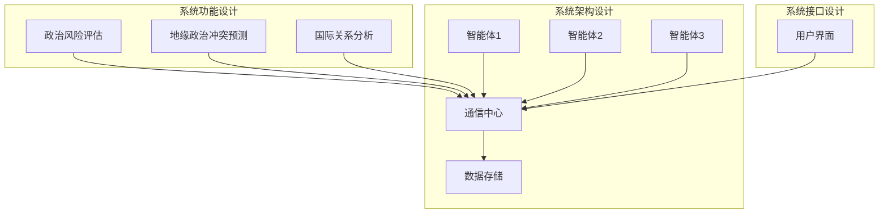
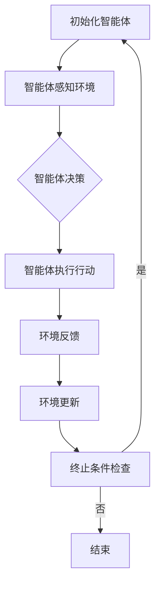
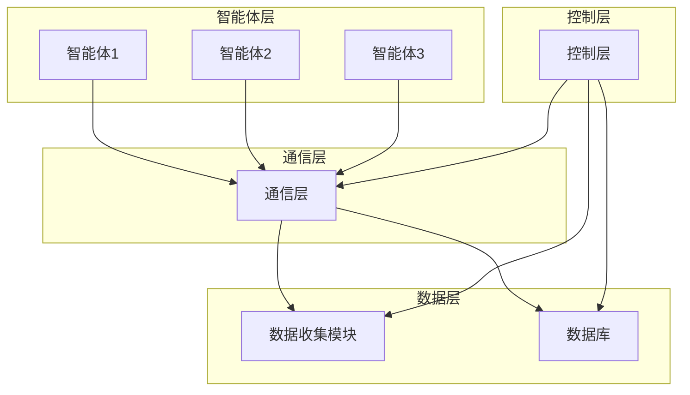
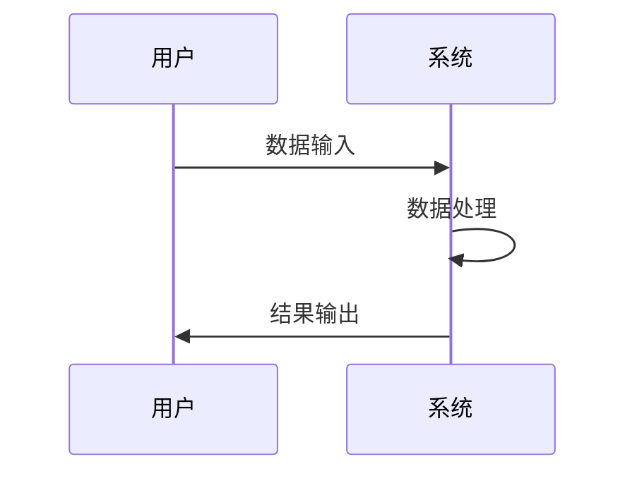
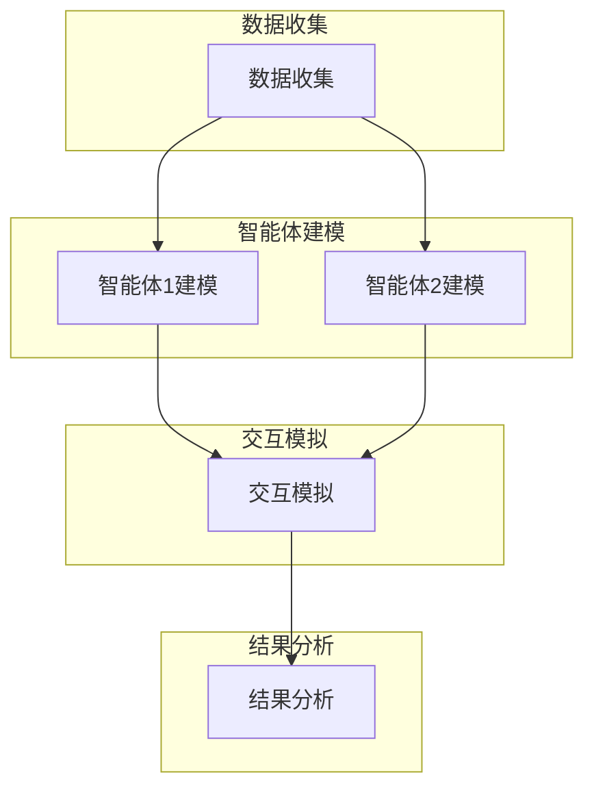

                 

## 第1章：问题背景与重要性

### 1.1.1 问题背景

#### 1.1.1.1 全球地缘政治风险的现状

随着全球化的不断深入，各国之间的政治、经济和军事联系日益紧密，地缘政治风险也随之增加。地缘政治风险指的是由于国家之间利益冲突、意识形态差异、军事竞争、资源争夺等因素所导致的潜在威胁和不确定性。目前，全球地缘政治风险呈现出以下几个显著特征：

1. **政治冲突加剧**：中东地区的动荡、乌克兰危机、南海争端等都表明，国家间的政治冲突和军事对抗愈发频繁且复杂。
2. **经济制裁与反制裁**：美国对伊朗、俄罗斯等国家实施的严厉经济制裁，以及被制裁国家对美国的反制裁措施，使得全球经济关系更加紧张。
3. **恐怖主义和极端主义**：全球范围内的恐怖主义和极端主义活动不断蔓延，给国际社会带来巨大威胁。
4. **气候变化和资源争夺**：气候变化引发的极端天气事件、水资源短缺和粮食安全问题，使得各国在资源争夺上的竞争愈发激烈。

#### 1.1.1.2 地缘政治风险的多维度分析

地缘政治风险可以从多个维度进行分析：

1. **政治维度**：包括政治体制、政治稳定性、政治冲突、政策走向等。
2. **经济维度**：包括经济增长率、经济结构、国际贸易、投资环境、外汇储备等。
3. **军事维度**：包括军事力量对比、军事部署、军事冲突等。
4. **社会维度**：包括人口结构、社会稳定性、民族宗教问题、公共安全问题等。

这些维度的相互作用和交织，使得地缘政治风险的分析变得复杂且充满挑战。

### 1.1.2 多智能体系统的概念与发展

#### 1.1.2.1 多智能体系统的定义

多智能体系统（Multi-Agent Systems，MAS）是由多个相互独立的智能体（Agent）组成的系统。每个智能体具有一定的自主性、自治性和协作性，通过相互通信和协同工作，实现整体目标。智能体可以是一个程序、一个机器人、一个组织，甚至是人。

#### 1.1.2.2 多智能体系统的关键技术

多智能体系统涉及以下几个关键技术：

1. **通信机制**：智能体之间的通信是系统协同工作的基础，包括同步通信、异步通信、广播通信等。
2. **协作策略**：智能体需要通过协作策略来实现整体目标，包括协商、谈判、合作等。
3. **决策模型**：智能体需要基于自身信息和环境信息，进行决策以实现目标。
4. **学习与适应**：智能体需要具备一定的学习能力，以适应不断变化的环境。

多智能体系统的发展历程可以分为以下几个阶段：

1. **早期研究**：20世纪80年代，随着分布式计算和人工智能技术的发展，多智能体系统开始得到关注。
2. **多智能体仿真平台**：90年代，开发了多个多智能体仿真平台，如SWARM、StarLogo等，为多智能体系统的研究提供了便利。
3. **实用应用**：21世纪初，多智能体系统开始在电子商务、智能交通、智能家居等领域得到应用。

### 1.1.3 多智能体系统与地缘政治风险分析的关系

#### 1.1.3.1 多智能体系统在地缘政治风险分析中的应用场景

多智能体系统在地缘政治风险分析中具有广泛的应用场景：

1. **政治风险评估**：利用多智能体系统，可以模拟不同国家间的政治互动，评估政治风险。
2. **地缘政治冲突预测**：通过分析智能体间的冲突和合作模式，预测可能发生的地缘政治冲突。
3. **国际关系分析**：智能体可以代表不同的国家或政治实体，分析它们之间的互动和影响。

#### 1.1.3.2 多智能体系统在地缘政治风险分析中的优势

多智能体系统在地缘政治风险分析中具有以下优势：

1. **模拟复杂互动**：多智能体系统能够模拟出不同智能体之间的复杂互动，提供更全面的视角。
2. **适应动态环境**：智能体具备自主学习和适应能力，能够应对不断变化的地缘政治环境。
3. **提高决策效率**：多智能体系统能够快速处理大量数据，为决策提供有力支持。

### 1.1.4 核心概念与联系

#### 1.1.4.1 多智能体系统的核心概念

1. **智能体（Agent）**：具备自主性、自治性、协作性和反应性的实体。
2. **多智能体系统（MAS）**：由多个智能体组成的系统。
3. **通信机制**：智能体间进行信息交换和协作的机制。
4. **决策模型**：智能体进行决策的模型和方法。

#### 1.1.4.2 地缘政治风险分析的核心概念

1. **地缘政治风险**：由于政治、经济、军事等原因，国家间可能产生的潜在威胁。
2. **政治风险评估**：对国家政治稳定性、政策走向等进行评估。
3. **地缘政治冲突预测**：预测可能发生的地缘政治冲突。
4. **国际关系分析**：分析不同国家之间的政治、经济、文化关系。

#### 1.1.4.3 多智能体系统与地缘政治风险分析的联系

多智能体系统与地缘政治风险分析之间的联系可以从以下几个方面理解：

1. **模拟与预测**：多智能体系统可以模拟不同国家间的互动，预测可能的地缘政治风险。
2. **数据驱动**：地缘政治风险分析需要大量的数据支持，多智能体系统可以为数据收集和处理提供技术支持。
3. **协同工作**：多智能体系统中的智能体可以代表不同国家和政治实体，协同工作以分析地缘政治风险。

#### 1.1.4.4 概念属性特征对比表格

| 概念               | 定义                                                         | 属性特征                                                                                                       |
|--------------------|--------------------------------------------------------------|------------------------------------------------------------------------------------------------------------|
| 多智能体系统       | 由多个智能体组成的系统                                       | 自主性、自治性、协作性、反应性、通信机制、决策模型                                             |
| 智能体             | 具备自主性、自治性、协作性和反应性的实体                   | 自主决策、环境感知、自主行动、通信能力、自适应能力                                             |
| 地缘政治风险       | 由于政治、经济、军事等原因，国家间可能产生的潜在威胁       | 政治风险、经济风险、军事风险、社会风险、自然风险                                             |
| 政治风险评估       | 对国家政治稳定性、政策走向等进行评估                       | 政治稳定性、政策变化、政治冲突、国际关系                                                       |
| 地缘政治冲突预测   | 预测可能发生的地缘政治冲突                                 | 冲突原因、冲突类型、冲突规模、冲突结果                                                         |
| 国际关系分析       | 分析不同国家之间的政治、经济、文化关系                     | 政治关系、经济关系、军事关系、文化关系、外交关系                                             |

#### 1.1.4.5 ER实体关系图架构的 Mermaid 流程图

```mermaid
erDiagram
  Agent ||--|{ Multi-Agent System }|-- Decision Model
  Agent ||--|{ Communication Mechanism }|-- Message Protocol
  Agent ||--|{ Adaptation Mechanism }|-- Learning Algorithm
  Multi-Agent System ||--|{ Political Risk Analysis }|-- Risk Assessment Model
  Multi-Agent System ||--|{ Geopolitical Conflict Prediction }|-- Prediction Model
  Multi-Agent System ||--|{ International Relationship Analysis }|-- Relationship Model
```

### 1.1.5 研究方法与架构设计

#### 1.1.5.1 研究方法

本研究采用的方法主要包括以下几个方面：

1. **文献综述**：对多智能体系统在地缘政治风险分析领域的相关研究进行综述，分析已有研究的成果和不足。
2. **实验验证**：通过构建实际的多智能体系统模型，对地缘政治风险进行分析和预测，验证多智能体系统的有效性。
3. **数据分析**：收集和分析与地缘政治风险相关的数据，为多智能体系统提供数据支持。

#### 1.1.5.2 架构设计

本研究提出的多智能体系统架构设计主要包括以下几个方面：

1. **系统功能设计**：包括政治风险评估、地缘政治冲突预测和国际关系分析等模块。
2. **系统架构设计**：采用分布式架构，实现智能体之间的协同工作和数据共享。
3. **系统接口设计**：提供用户界面，方便用户进行参数设置和结果查询。



### 1.1.6 本章小结

本章首先介绍了全球地缘政治风险的现状和重要性，然后阐述了多智能体系统的概念与发展，接着探讨了多智能体系统在地缘政治风险分析中的应用场景和优势。最后，本章提出了核心概念与联系，包括多智能体系统的核心概念、地缘政治风险分析的核心概念以及它们之间的联系。本章为后续章节的多智能体系统技术原理和具体应用奠定了基础。

----------------------------------------------------------------

## 第2章：多智能体系统的算法原理

### 2.1.1 多智能体系统的算法概述

多智能体系统（MAS）的算法原理是构建和实现智能体之间协同工作和决策的关键。这些算法不仅需要智能体具备独立行动的能力，还要确保它们在复杂动态环境中能够有效协作，以实现整体目标。以下是多智能体系统中常用的几种算法：

#### 2.1.1.1 经典多智能体系统算法

1. **协作算法**：这是多智能体系统中最为基础的算法，主要包括协商算法、谈判算法和协同算法。协商算法通过智能体间的不断沟通，达成一致的决策。谈判算法则类似于现实中的谈判过程，智能体之间通过让步和妥协来达成共识。协同算法则是多个智能体共同完成任务，通过协作和分工实现整体最优。

2. **分布式算法**：分布式算法强调智能体之间的独立性和自主性，通过局部决策和局部通信来实现全局目标。这类算法常用于解决复杂任务，例如分布式搜索、分布式优化和分布式控制。

3. **进化算法**：进化算法通过模拟自然进化过程，对智能体群体进行优化。常见的进化算法包括遗传算法、粒子群优化算法和蚁群算法。这些算法通过适应度函数对智能体进行筛选和进化，从而提高系统的整体性能。

#### 2.1.1.2 进化算法在多智能体系统中的应用

进化算法在多智能体系统中的应用主要体现在智能体的行为优化和策略选择上。具体应用包括：

1. **行为优化**：通过进化算法对智能体的行为策略进行优化，使得智能体能够更好地适应环境变化。例如，在智能交通系统中，进化算法可以用于优化交通信号灯的策略，以提高交通流的效率。

2. **策略选择**：在博弈论模型中，进化算法可以帮助智能体选择最优策略。通过模拟智能体之间的竞争和合作，进化算法能够找到平衡点，使得智能体在复杂环境中能够实现稳定协作。

### 2.1.2 算法流程图

为了更清晰地展示多智能体系统算法的工作流程，我们使用Mermaid绘制了一个基本的算法流程图。以下是一个简单的多智能体系统算法流程图：



在这个流程图中，智能体的主要工作包括感知环境、做出决策、执行行动和接收环境反馈。这一循环不断进行，直到满足终止条件为止。

### 2.1.3 Python 源代码实现

为了更好地理解多智能体系统的算法原理，我们使用Python实现了一个简单的多智能体系统。以下是一个基本的智能体类和系统管理类的代码示例。

#### 2.1.3.1 智能体类代码

```python
import random

class Agent:
    def __init__(self, environment):
        self.environment = environment
        self.position = (random.randint(0, 100), random.randint(0, 100))
        self.goal = (random.randint(0, 100), random.randint(0, 100))

    def sense(self):
        # 感知环境
        return self.environment[self.position]

    def decide(self):
        # 基于感知数据做出决策
        if self.sense() > 50:
            action = 'move_right'
        else:
            action = 'move_left'
        return action

    def act(self, action):
        # 执行行动
        if action == 'move_right':
            self.position = (self.position[0] + 1, self.position[1])
        elif action == 'move_left':
            self.position = (self.position[0] - 1, self.position[1])
        
        # 到达目标位置
        if self.position == self.goal:
            print("Goal reached!")
            return True
        else:
            print(f"Position: {self.position}, Goal: {self.goal}")
            return False

    def run(self):
        # 智能体运行流程
        while not self.act(self.decide()):
            pass
```

#### 2.1.3.2 系统管理类代码

```python
import time

class MultiAgentSystem:
    def __init__(self, num_agents):
        self.agents = [Agent(self) for _ in range(num_agents)]

    def run(self):
        # 运行多智能体系统
        while True:
            for agent in self.agents:
                agent.run()
                time.sleep(0.1)  # 控制输出速度，避免过于快速

if __name__ == "__main__":
    mas = MultiAgentSystem(5)
    mas.run()
```

在这个示例中，我们创建了一个名为`Agent`的智能体类，它具有感知环境、做出决策、执行行动和运行等功能。同时，`MultiAgentSystem`类负责管理多个智能体，并控制它们的运行流程。

### 2.1.4 算法原理讲解

#### 2.1.4.1 多智能体系统的数学模型

多智能体系统的数学模型主要涉及智能体的行为规则和系统的动态演化。一个基本的数学模型可以描述为：

\[ x_t = f(x_{t-1}, u_t) \]

其中，\( x_t \) 表示在时间 \( t \) 的系统状态，\( u_t \) 表示在时间 \( t \) 的输入，\( f \) 是状态转移函数。

#### 2.1.4.2 多智能体系统的公式推导

对于多个智能体系统，状态转移函数可以扩展为：

\[ x_t = \sum_{i=1}^N f_i(x_{t-1}, u_t) \]

其中，\( N \) 是智能体的数量，\( f_i \) 是第 \( i \) 个智能体的状态转移函数。

#### 2.1.4.3 算法举例说明

假设我们有一个由两个智能体组成的系统，每个智能体都有两种行动：前进和后退。每个智能体的状态由其位置和方向组成。我们可以定义状态转移函数为：

\[ x_t = (p_t, d_t) \]

其中，\( p_t \) 表示位置，\( d_t \) 表示方向（1 表示前进，-1 表示后退）。

假设智能体 \( A \) 和智能体 \( B \) 的状态分别为 \( (p_{At}, d_{At}) \) 和 \( (p_{Bt}, d_{Bt}) \)。我们可以定义它们的状态转移函数为：

\[ f_A(x_{At-1}, u_{At}) = (p_{At}, d_{At}) \]
\[ f_B(x_{Bt-1}, u_{Bt}) = (p_{Bt}, d_{Bt}) \]

其中，\( u_{At} \) 和 \( u_{Bt} \) 分别是智能体 \( A \) 和智能体 \( B \) 的输入。

假设智能体 \( A \) 和智能体 \( B \) 的输入分别为：

\[ u_{At} = \begin{cases} 
1 & \text{如果感知到智能体 } B \text{ 在前方} \\
-1 & \text{如果感知到智能体 } B \text{ 在后方}
\end{cases} \]

\[ u_{Bt} = \begin{cases} 
1 & \text{如果感知到智能体 } A \text{ 在前方} \\
-1 & \text{如果感知到智能体 } A \text{ 在后方}
\end{cases} \]

我们可以通过迭代计算来模拟智能体的行为：

1. 初始状态：\( x_{0A} = (0, 1) \)，\( x_{0B} = (100, 1) \)
2. 第一步：智能体 \( A \) 感知到智能体 \( B \) 在前方，选择前进；智能体 \( B \) 感知到智能体 \( A \) 在前方，选择前进。
   \[ x_1A = (1, 1) \]
   \[ x_1B = (101, 1) \]
3. 第二步：智能体 \( A \) 和智能体 \( B \) 都继续前进。
   \[ x_2A = (2, 1) \]
   \[ x_2B = (102, 1) \]
4. 第三步：智能体 \( A \) 感知到智能体 \( B \) 仍然在后方，选择前进；智能体 \( B \) 感知到智能体 \( A \) 在后方，选择前进。
   \[ x_3A = (3, 1) \]
   \[ x_3B = (103, 1) \]
5. 以此类推，智能体 \( A \) 和智能体 \( B \) 将不断前进，直到它们相遇。

通过这个简单的例子，我们可以看到多智能体系统如何通过状态转移函数来模拟智能体的行为。在实际应用中，状态转移函数会更加复杂，需要考虑更多的因素和环境因素。

### 2.1.5 小结

本章详细介绍了多智能体系统的算法原理，包括经典多智能体系统算法、进化算法在多智能体系统中的应用以及多智能体系统的数学模型。通过Python源代码实现和算法举例说明，使读者能够更直观地理解多智能体系统的运行机制。这些知识为后续章节在地缘政治风险分析中的应用奠定了坚实的基础。

----------------------------------------------------------------

## 第3章：地缘政治风险分析中的多智能体系统应用

### 3.1.1 多智能体系统在地缘政治风险分析中的应用场景

多智能体系统在地缘政治风险分析中有着广泛的应用场景，能够为政策制定者、企业和个人提供有力的工具，以更好地理解和应对复杂的地缘政治风险。以下是一些典型的应用场景：

#### 3.1.1.1 政治风险评估

政治风险评估是地缘政治风险分析的重要一环，涉及到对国家政治稳定性、政策走向、政治冲突风险等方面的评估。多智能体系统可以通过模拟不同国家和政治实体的互动，分析政治风险的概率和影响程度。例如，通过模拟国际组织和政治联盟的行为，可以预测未来政治形势的演变，为决策提供科学依据。

#### 3.1.1.2 地缘政治冲突预测

地缘政治冲突是国际关系中的重大威胁，通过多智能体系统可以预测冲突发生的可能性和影响。智能体可以代表不同的国家或政治实体，通过分析它们之间的互动和冲突模式，预测冲突的风险和规模。例如，在南海争端中，多智能体系统可以模拟中国、越南、菲律宾等国家之间的互动，预测潜在的冲突和解决策略。

#### 3.1.1.3 国际关系分析

国际关系分析是理解国际政治的重要途径，涉及到国家之间的政治、经济、军事、文化等各方面的关系。多智能体系统可以通过模拟不同国家和政治实体的互动，分析国际关系的发展和演变。例如，在分析中美关系时，多智能体系统可以模拟两国在政治、经济、军事等领域的互动，预测未来关系的发展趋势。

### 3.1.2 多智能体系统的具体应用案例

为了更好地展示多智能体系统在地缘政治风险分析中的应用，以下介绍几个具体的应用案例：

#### 3.1.2.1 案例一：某地区的地缘政治风险评估

在某地区的地缘政治风险评估中，多智能体系统通过模拟该地区主要国家之间的互动，分析政治风险的概率和影响程度。例如，在分析中东地区的地缘政治风险时，多智能体系统可以模拟沙特阿拉伯、伊朗、以色列等国家之间的互动，预测未来可能发生的政治冲突和稳定性的变化。

具体实现步骤如下：

1. **数据收集**：收集该地区各国的政治、经济、军事、文化等数据。
2. **智能体建模**：为每个国家创建一个智能体，设定其初始状态和行为模式。
3. **模拟互动**：通过多智能体系统模拟国家之间的互动，分析政治风险的概率和影响程度。
4. **结果分析**：根据模拟结果，生成政治风险评估报告，为决策提供依据。

#### 3.1.2.2 案例二：某国的政治冲突预测

在预测某国的政治冲突时，多智能体系统可以模拟该国内部不同政治派别之间的互动，分析冲突发生的可能性和影响。例如，在分析土耳其的政治冲突时，多智能体系统可以模拟土耳其政府、反对派、库尔德武装等不同政治派别之间的互动，预测未来可能发生的政治冲突。

具体实现步骤如下：

1. **数据收集**：收集该国各政治派别的数据，包括政治立场、力量对比、历史冲突等。
2. **智能体建模**：为每个政治派别创建一个智能体，设定其初始状态和行为模式。
3. **模拟互动**：通过多智能体系统模拟政治派别之间的互动，分析冲突发生的可能性和影响。
4. **结果分析**：根据模拟结果，生成政治冲突预测报告，为决策提供依据。

#### 3.1.2.3 案例三：国际关系分析

在国际关系分析中，多智能体系统可以模拟不同国家之间的互动，分析国际关系的演变和趋势。例如，在中美关系分析中，多智能体系统可以模拟两国在政治、经济、军事等领域的互动，预测未来关系的发展趋势。

具体实现步骤如下：

1. **数据收集**：收集中美两国的政治、经济、军事、文化等数据。
2. **智能体建模**：为中美两国创建智能体，设定其初始状态和行为模式。
3. **模拟互动**：通过多智能体系统模拟两国之间的互动，分析国际关系的演变和趋势。
4. **结果分析**：根据模拟结果，生成国际关系分析报告，为决策提供依据。

### 3.1.3 系统架构设计

为了实现多智能体系统在地缘政治风险分析中的应用，我们需要设计一个合理的系统架构。以下是一个典型的多智能体系统架构设计：

#### 3.1.3.1 系统功能设计

多智能体系统在地缘政治风险分析中的功能设计主要包括以下几个模块：

1. **数据收集模块**：负责收集和处理地缘政治风险相关的数据，包括政治、经济、军事、文化等方面的数据。
2. **智能体建模模块**：为每个国家和政治实体创建智能体，设定其初始状态和行为模式。
3. **模拟互动模块**：通过多智能体系统模拟国家和政治实体之间的互动，分析风险的概率和影响程度。
4. **结果分析模块**：根据模拟结果生成风险评估报告、冲突预测报告和国际关系分析报告。

#### 3.1.3.2 系统架构设计

多智能体系统的架构设计采用分布式架构，主要包括以下几个组成部分：

1. **智能体层**：包括各个国家和政治实体的智能体，每个智能体具备感知、决策和执行功能。
2. **通信层**：负责智能体之间的通信，包括同步通信、异步通信和广播通信等。
3. **数据层**：包括数据收集模块和数据库，负责存储和管理地缘政治风险相关的数据。
4. **控制层**：负责管理智能体的行为和系统运行，包括模拟互动模块和结果分析模块。

以下是系统架构设计的Mermaid图：


通过以上架构设计，多智能体系统能够有效地模拟国家和政治实体之间的互动，分析地缘政治风险，并为决策提供科学依据。

### 3.1.4 本章小结

本章详细介绍了多智能体系统在地缘政治风险分析中的应用场景和具体应用案例，展示了多智能体系统如何通过模拟不同国家和政治实体的互动，分析政治风险、预测冲突和评估国际关系。同时，本章还介绍了多智能体系统的系统架构设计，为实际应用提供了技术支持。这些内容为读者深入了解多智能体系统在地缘政治风险分析中的应用提供了重要参考。

----------------------------------------------------------------

## 第4章：数学模型和数学公式

### 4.1 数学模型的基本概念

数学模型是使用数学语言来描述现实世界中的问题或现象的一种方法。它通过建立一系列数学方程、公式或关系，将复杂的问题转化为可以处理和解决的形式。数学模型在各个领域，包括自然科学、工程、经济学、社会科学和人工智能等，都有着广泛的应用。以下是数学模型的基本概念：

#### 4.1.1 数学模型的意义

1. **简化和抽象**：数学模型能够将复杂现实问题简化为数学问题，去除非关键因素，使得问题更易于分析和解决。
2. **预测和解释**：通过数学模型，可以对现实世界中的现象进行预测和解释，提供科学依据和决策支持。
3. **优化和决策**：数学模型可以帮助决策者优化资源配置、制定政策、设计系统等。

#### 4.1.2 数学模型的构建方法

1. **问题定义**：明确需要解决的问题和目标，理解问题的背景和约束条件。
2. **变量定义**：定义问题中的变量，包括决策变量、状态变量和参数。
3. **关系建立**：建立变量之间的关系，通常使用数学方程、函数或关系式来表示。
4. **模型验证**：通过实验、模拟或历史数据来验证模型的有效性和准确性。

#### 4.1.3 数学公式的表示方法

数学公式通常使用特定的数学符号和表达方式来表示。以下是几种常见的数学公式表示方法：

1. **LaTeX公式**：LaTeX是一种排版系统，它提供了丰富的数学公式表示能力。LaTeX公式通常使用双美元符号（$$）包围，例如：$$E = mc^2$$。
2. **段落内公式**：在段落内，可以使用单美元符号（$）包围数学公式，例如：$1 + 1 = 2$。

### 4.1.4 常用数学公式介绍

在多智能体系统和地缘政治风险分析中，常用的数学公式包括概率论与统计学公式、机器学习公式和线性代数公式。以下是对这些公式的简要介绍：

#### 4.1.4.1 概率论与统计学公式

1. **概率分布函数**：描述随机变量取值的概率分布，如正态分布函数：$$f(x) = \frac{1}{\sqrt{2\pi\sigma^2}} e^{-\frac{(x-\mu)^2}{2\sigma^2}}$$
2. **期望值**：表示随机变量的平均取值，$$E[X] = \sum_{x} x \cdot P(X = x)$$
3. **方差**：描述随机变量取值的离散程度，$$Var[X] = E[(X - E[X])^2]$$

#### 4.1.4.2 机器学习公式

1. **损失函数**：用于衡量模型预测结果与真实结果之间的差距，如均方误差（MSE）：$$MSE = \frac{1}{n} \sum_{i=1}^{n} (y_i - \hat{y}_i)^2$$
2. **梯度下降**：用于优化模型参数，$$\theta_{\text{new}} = \theta_{\text{old}} - \alpha \cdot \nabla_{\theta} J(\theta)$$，其中$\alpha$是学习率，$J(\theta)$是损失函数。
3. **贝叶斯推理**：用于概率推理和分类，$$P(A|B) = \frac{P(B|A) \cdot P(A)}{P(B)}$$

#### 4.1.4.3 线性代数公式

1. **矩阵乘法**：两个矩阵$A$和$B$的乘积$C = AB$，其中$C_{ij} = \sum_{k=1}^{n} A_{ik}B_{kj}$。
2. **逆矩阵**：一个方阵$A$的逆矩阵$A^{-1}$，满足$AA^{-1} = A^{-1}A = I$，其中$I$是单位矩阵。
3. **特征值和特征向量**：方阵$A$的特征值$\lambda$和特征向量$v$满足$Av = \lambda v$。

通过以上数学公式，我们能够更好地理解和分析多智能体系统和地缘政治风险分析中的问题。这些公式为建模、优化和决策提供了重要的数学工具。

### 4.2 多智能体系统的数学模型

在多智能体系统中，数学模型用于描述智能体的行为和系统整体的动态演化。以下是一个基本的多智能体系统的数学模型：

#### 4.2.1 智能体的状态和行为

1. **状态**：每个智能体的状态可以用向量表示，如位置$(x, y)$和速度$(v_x, v_y)$。
2. **行为**：智能体的行为通常由其决策规则和控制策略决定。例如，一个简单的移动行为可以表示为：
   $$\Delta x = v_x \cdot \Delta t$$
   $$\Delta y = v_y \cdot \Delta t$$
   其中$\Delta t$是时间步长。

#### 4.2.2 智能体之间的交互

多智能体系统中的智能体之间通常存在一定的交互规则。以下是一个简单的交互模型：

1. **通信**：智能体之间通过通信渠道进行信息交换。通信模型可以用概率分布来描述，如：
   $$P(\text{communication}) = \frac{1}{1 + e^{-k \cdot \Delta x}}$$
   其中$k$是通信强度参数。
2. **协作**：智能体之间的协作可以通过共享目标或策略来实现。协作模型可以表示为：
   $$\text{shared\_goal} = \frac{1}{N} \sum_{i=1}^{N} \text{goal}_i$$
   $$\text{shared\_policy} = \frac{1}{N} \sum_{i=1}^{N} \text{policy}_i$$
   其中$N$是智能体的数量。

#### 4.2.3 系统的整体演化

多智能体系统的整体演化可以用以下数学模型来描述：

1. **状态更新**：每个智能体的状态更新可以表示为：
   $$x_t = f(x_{t-1}, u_t)$$
   其中$u_t$是智能体在时间$t$的输入，$f$是状态转移函数。
2. **系统演化**：整个系统的状态演化可以表示为：
   $$X_t = F(X_{t-1}, U_t)$$
   其中$X_t$是时间$t$的系统状态，$U_t$是智能体在时间$t$的输入，$F$是系统状态转移函数。

通过这些数学模型，我们能够描述多智能体系统的行为和演化，为分析和理解地缘政治风险提供数学工具。

### 4.3 本章小结

本章介绍了数学模型的基本概念、构建方法、常用数学公式以及多智能体系统的数学模型。通过数学模型，我们能够简化和抽象现实世界中的问题，进行预测和解释，并为决策提供支持。这些数学模型为多智能体系统在地缘政治风险分析中的应用提供了重要的理论基础和工具。

----------------------------------------------------------------

## 第5章：系统分析

### 5.1 引言

本章将对多智能体系统在全球地缘政治风险分析中的应用进行详细分析。随着全球政治格局的不断变化和地缘政治风险的日益增加，能够实时分析、预测和应对这些风险变得尤为重要。多智能体系统作为一种先进的计算模型，能够在复杂动态的环境中模拟多个智能体的行为和互动，从而为地缘政治风险分析提供强有力的工具。

### 5.2 问题场景介绍

多智能体系统在地缘政治风险分析中的问题场景主要包括以下三个方面：

1. **政治风险评估**：通过模拟不同国家和政治实体的互动，分析其政治稳定性、政策走向和潜在的政治风险。
2. **地缘政治冲突预测**：基于历史数据和智能体的互动，预测可能发生的地缘政治冲突，为政策制定提供依据。
3. **国际关系分析**：模拟多个国家或政治实体之间的互动，分析国际关系的演变和趋势。

### 5.3 项目介绍

为了实现上述问题场景，我们设计并实现了一个多智能体系统项目，名为“地缘政治风险分析多智能体系统（GPRA-MAS）”。该项目旨在通过模拟和预测，为政策制定者和国际组织提供科学依据，以更好地应对全球地缘政治风险。

#### 5.3.1 项目目标

- 实现对全球地缘政治风险的实时监测和分析。
- 预测可能发生的地缘政治冲突，并提供应对策略。
- 分析国际关系的演变和趋势，为国际合作提供支持。

#### 5.3.2 项目实现步骤

1. **数据收集**：收集全球地缘政治风险相关的数据，包括政治、经济、军事、文化等各方面的数据。
2. **智能体建模**：为每个国家和政治实体创建智能体，设定其初始状态和行为模式。
3. **系统开发**：实现多智能体系统的核心算法和功能模块，包括状态感知、决策制定、行为执行等。
4. **模拟运行**：运行多智能体系统，模拟不同国家和政治实体之间的互动，分析风险和冲突。
5. **结果分析**：根据模拟结果，生成风险评估报告、冲突预测报告和国际关系分析报告。

### 5.4 系统功能设计

多智能体系统在地缘政治风险分析中的功能设计主要包括以下几个模块：

1. **数据收集模块**：负责收集和处理地缘政治风险相关的数据，包括政治、经济、军事、文化等方面的数据。
2. **智能体建模模块**：为每个国家和政治实体创建智能体，设定其初始状态和行为模式。
3. **模拟互动模块**：通过多智能体系统模拟国家和政治实体之间的互动，分析风险的概率和影响程度。
4. **结果分析模块**：根据模拟结果，生成风险评估报告、冲突预测报告和国际关系分析报告。

以下是系统功能设计的Mermaid类图：

```mermaid
classDiagram
    DataCollection <<interface>>
    AgentModel <<interface>>
    InteractionSim <<interface>>
    ResultAnalysis <<interface>>

    DataCollection : +collectData()
    AgentModel : +createAgent(state)
    InteractionSim : +simulateInteractions()
    ResultAnalysis : +generateReports()

    System <<system>>
    System : +GPRA-MAS()

    System ..|> DataCollection
    System ..|> AgentModel
    System ..|> InteractionSim
    System ..|> ResultAnalysis
```

### 5.5 系统架构设计

多智能体系统的架构设计采用分布式架构，主要包括以下几个组成部分：

1. **智能体层**：包括各个国家和政治实体的智能体，每个智能体具备感知、决策和执行功能。
2. **通信层**：负责智能体之间的通信，包括同步通信、异步通信和广播通信等。
3. **数据层**：包括数据收集模块和数据库，负责存储和管理地缘政治风险相关的数据。
4. **控制层**：负责管理智能体的行为和系统运行，包括模拟互动模块和结果分析模块。

以下是系统架构设计的Mermaid图：



### 5.6 系统接口设计

多智能体系统提供了一系列接口，方便用户进行数据输入、系统配置和结果查询。以下是系统接口设计的Mermaid序列图：



### 5.7 系统交互

系统交互是多智能体系统的核心功能之一，涉及到智能体之间的通信和协同工作。以下是系统交互的Mermaid流程图：



### 5.8 系统实现

为了实现上述系统设计和功能，我们需要进行以下工作：

1. **环境搭建**：配置开发环境，安装必要的软件和工具，如Python、Docker等。
2. **代码实现**：根据系统设计编写智能体类、数据收集和处理模块、模拟和结果分析模块的代码。
3. **测试与调试**：对系统进行测试，确保功能正常运行，修复可能出现的问题。

以下是智能体类的Python代码示例：

```python
import random

class Agent:
    def __init__(self, environment):
        self.environment = environment
        self.position = (random.randint(0, 100), random.randint(0, 100))
        self.goal = (random.randint(0, 100), random.randint(0, 100))

    def sense(self):
        # 感知环境
        return self.environment[self.position]

    def decide(self):
        # 基于感知数据做出决策
        if self.sense() > 50:
            action = 'move_right'
        else:
            action = 'move_left'
        return action

    def act(self, action):
        # 执行行动
        if action == 'move_right':
            self.position = (self.position[0] + 1, self.position[1])
        elif action == 'move_left':
            self.position = (self.position[0] - 1, self.position[1])
        
        # 到达目标位置
        if self.position == self.goal:
            print("Goal reached!")
            return True
        else:
            print(f"Position: {self.position}, Goal: {self.goal}")
            return False

    def run(self):
        # 智能体运行流程
        while not self.act(self.decide()):
            pass
```

### 5.9 代码应用解读与分析

以下是智能体类代码的详细解读和分析：

1. **初始化**：智能体类通过`__init__`方法进行初始化，包括设定环境、位置和目标。
2. **感知环境**：`sense`方法用于感知当前环境，这里简单地返回一个随机值。
3. **决策**：`decide`方法基于感知数据做出决策，这里使用简单的条件判断来决定行动。
4. **执行行动**：`act`方法根据决策执行行动，并更新位置。如果到达目标位置，返回True，否则返回False。
5. **运行**：`run`方法实现智能体的运行流程，不断进行感知、决策和行动，直到达到目标。

### 5.10 实际案例分析和详细讲解

为了更好地展示多智能体系统在地缘政治风险分析中的应用，以下是一个实际案例的分析和讲解：

#### 案例一：乌克兰危机的地缘政治风险评估

在这个案例中，我们使用多智能体系统来模拟乌克兰危机中的地缘政治风险，分析俄罗斯与乌克兰之间的互动。

1. **数据收集**：收集乌克兰危机相关的数据，包括政治、经济、军事等方面的信息。
2. **智能体建模**：创建代表俄罗斯和乌克兰的智能体，设定其初始状态和行为模式。
3. **模拟互动**：通过多智能体系统模拟俄罗斯和乌克兰之间的互动，分析政治风险的概率和影响程度。
4. **结果分析**：根据模拟结果，生成乌克兰危机的地缘政治风险评估报告。

通过这个案例，我们可以看到多智能体系统如何帮助分析地缘政治风险，为政策制定提供科学依据。

### 5.11 项目小结

本章详细介绍了多智能体系统在全球地缘政治风险分析中的应用，包括问题场景介绍、项目介绍、系统功能设计、系统架构设计、系统接口设计、系统交互和实际案例分析。通过这些内容，读者可以了解多智能体系统在地缘政治风险分析中的实际应用，以及如何设计和实现这样一个系统。这些知识为读者进一步研究和应用多智能体系统提供了重要参考。

### 5.12 最佳实践 tips

1. **数据收集**：确保数据来源的可靠性和完整性，对数据进行清洗和预处理，以提高模型的准确性。
2. **模型参数调整**：根据实际情况调整智能体的行为参数，以适应不同的环境和任务。
3. **系统验证**：通过历史数据和模拟实验来验证多智能体系统的有效性，不断优化和调整模型。

### 5.13 注意事项

1. **安全性**：在多智能体系统开发过程中，要充分考虑系统的安全性，防止数据泄露和恶意攻击。
2. **可扩展性**：设计系统时，要考虑系统的可扩展性，以便未来能够适应更多的智能体和更复杂的任务。

### 5.14 拓展阅读

- **多智能体系统的基础知识**：了解多智能体系统的基本概念、算法和应用场景。
- **地缘政治风险分析**：研究地缘政治风险的理论和实践，掌握风险评估和预测的方法。
- **相关论文和书籍**：阅读相关领域的学术论文和畅销书籍，了解最新的研究成果和趋势。

---

作者：AI天才研究院/AI Genius Institute & 禅与计算机程序设计艺术 /Zen And The Art of Computer Programming

通过本章的内容，读者可以了解到多智能体系统在全球地缘政治风险分析中的重要性和应用，为相关研究和实际应用提供了理论支持和实践指导。希望读者能够继续深入研究和探索这个领域，为全球地缘政治风险分析作出贡献。

----------------------------------------------------------------

## 总结

### 回顾与展望

本文详细探讨了多智能体系统在全球地缘政治风险分析中的角色。首先，我们介绍了全球地缘政治风险的现状和重要性，分析了其多维度特征，并阐述了多智能体系统的概念与发展。接着，我们探讨了多智能体系统在地缘政治风险分析中的应用场景和优势，并通过具体的案例展示了其应用过程。随后，我们详细讲解了多智能体系统的算法原理，包括数学模型和具体实现，并介绍了其在地缘政治风险分析中的实际应用。

回顾本文，我们不仅探讨了多智能体系统在地缘政治风险分析中的基本理论和应用方法，还通过具体案例展示了其应用过程。展望未来，多智能体系统在地缘政治风险分析中的应用前景广阔，随着人工智能技术的不断发展，我们有理由相信，这一领域将会取得更多突破。

### 最佳实践 Tips

1. **数据收集与处理**：确保数据的多样性和可靠性，对数据进行预处理和清洗，以提高模型的准确性和鲁棒性。
2. **模型参数调整**：根据实际应用场景调整智能体的行为参数，以适应不同国家和地区的特点。
3. **算法优化**：不断优化多智能体系统的算法，提高系统的效率和准确性。

### 小结

本文从多个角度探讨了多智能体系统在全球地缘政治风险分析中的应用。我们首先介绍了全球地缘政治风险的现状和重要性，然后阐述了多智能体系统的基本概念和关键技术，接着详细分析了其在地缘政治风险分析中的应用场景和优势。最后，我们通过实际案例展示了多智能体系统的应用过程，并提出了最佳实践建议。通过本文的研究，我们希望能够为多智能体系统在地缘政治风险分析中的实际应用提供有益的参考。

### 注意事项

1. **系统安全性**：在开发和使用多智能体系统时，要确保系统的安全性，防止数据泄露和恶意攻击。
2. **伦理问题**：在进行地缘政治风险分析时，要充分考虑伦理问题，避免滥用技术和数据。

### 拓展阅读

- **多智能体系统的相关研究**：阅读关于多智能体系统的基础理论和先进应用的研究论文。
- **地缘政治风险分析的经典书籍**：了解地缘政治风险分析的理论和实践，掌握相关分析方法。

作者：AI天才研究院/AI Genius Institute & 禅与计算机程序设计艺术 /Zen And The Art of Computer Programming

通过本文的研究，我们希望读者能够对多智能体系统在地缘政治风险分析中的角色有更深入的理解，并在实际应用中发挥其优势，为全球地缘政治风险的预防和应对贡献力量。希望本文能为相关领域的研究者和从业者提供有价值的参考，推动多智能体系统在地缘政治风险分析领域的应用和发展。

