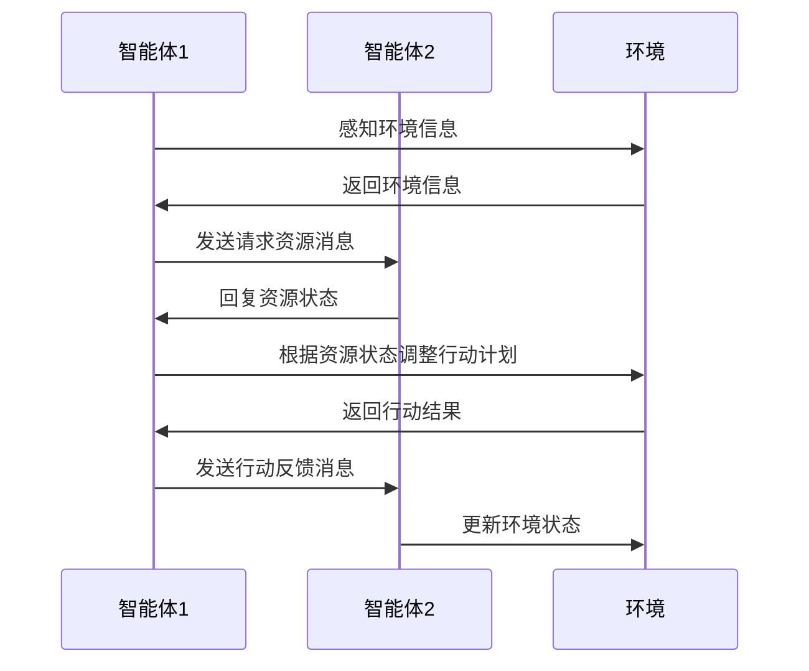
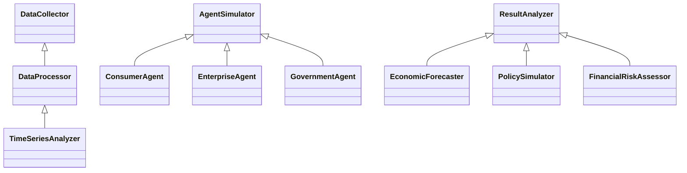
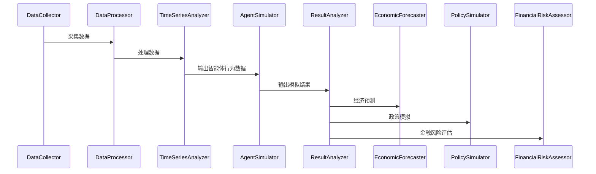
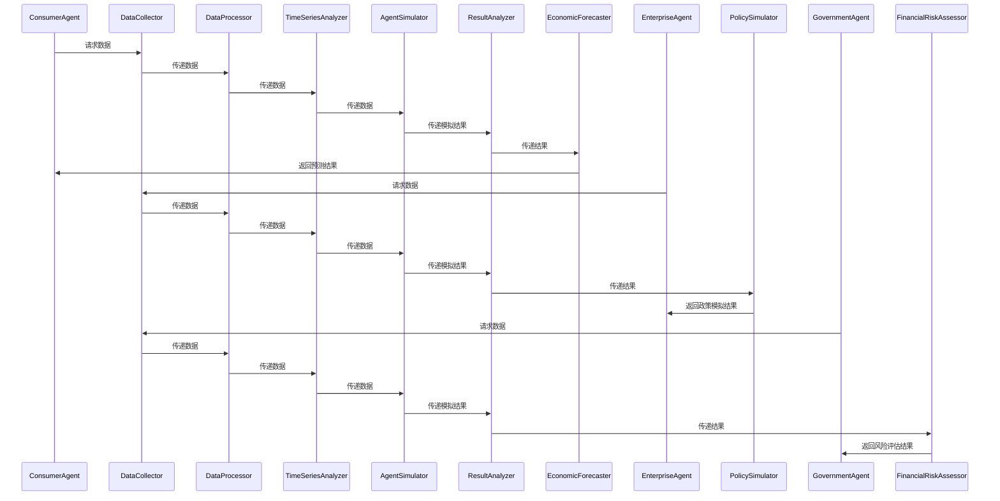

                 


## 《多智能体系统在全球宏观经济分析中的角色》

### 关键词：多智能体系统、宏观经济分析、智能体模型、协同交互、算法实现、系统架构、未来趋势

### 摘要：

本文旨在探讨多智能体系统在全球宏观经济分析中的角色和重要性。首先，我们将介绍多智能体系统的基本概念、历史发展和应用领域，然后深入分析其在宏观经济分析中的核心概念和原理。通过具体的案例和实践，我们将展示多智能体系统在宏观经济预测、政策模拟和金融风险评估等领域的应用，并详细讲解其算法原理、数学模型和实现过程。最后，我们将展望多智能体系统在宏观经济分析中的未来发展趋势，并给出一些最佳实践和拓展阅读建议。

## 目录

### 第一部分：背景介绍

1. 引言
2. 多智能体系统概述
3. 全球宏观经济分析基础

### 第二部分：核心概念与联系

4. 多智能体系统中的个体智能体模型
5. 多智能体系统的协同与交互
6. 多智能体系统在宏观经济分析中的核心概念

### 第三部分：应用与实践

7. 多智能体系统在宏观经济分析中的应用案例
8. 算法原理讲解与实现
9. 数学模型和数学公式 & 详细讲解 & 举例说明

### 第四部分：系统设计与实现

10. 系统分析与架构设计方案
11. 项目实战

### 第五部分：未来展望

12. 多智能体系统在宏观经济分析中的未来发展趋势
13. 最佳实践 tips、小结、注意事项、拓展阅读

## 第一部分：背景介绍

### 1. 引言

在全球经济一体化和信息技术飞速发展的背景下，宏观经济分析变得更加复杂和多元化。传统的宏观经济分析模型往往基于宏观经济指标的数据处理和预测，但这些模型在面对日益复杂的全球经济环境时，往往显得力不从心。多智能体系统（MAS）作为一种新兴的计算机模拟技术，通过模拟大量智能体之间的交互和协同，为宏观经济分析提供了一种全新的视角和方法。

本文将首先介绍多智能体系统的基本概念、历史发展和应用领域，然后深入探讨其在宏观经济分析中的核心概念和原理。通过具体的案例和实践，我们将展示多智能体系统在宏观经济预测、政策模拟和金融风险评估等领域的应用，并详细讲解其算法原理、数学模型和实现过程。最后，我们将展望多智能体系统在宏观经济分析中的未来发展趋势，并给出一些最佳实践和拓展阅读建议。

### 2. 多智能体系统概述

#### 定义与历史发展

多智能体系统（Multi-Agent System，MAS）是一种由多个自主智能体组成的系统，这些智能体通过相互协作和交互来实现特定目标。在MAS中，每个智能体具有自主性、自主决策能力和与其他智能体交互的能力。MAS最早可以追溯到20世纪80年代，当时的学者们开始探讨如何通过模拟人类社会中的个体行为来分析和解决问题。随着计算机技术的发展，MAS逐渐成为一个重要的研究领域，并在许多领域得到了广泛应用。

#### 特点与应用领域

多智能体系统具有以下几个主要特点：

1. **自主性**：智能体可以在没有外部控制的情况下自主行动。
2. **社会性**：智能体之间可以通过通信和协调来共同完成任务。
3. **适应性**：智能体可以根据环境的变化和任务的进展来调整自己的行为。
4. **分布式**：智能体可以分布在不同地理位置，通过通信网络进行协作。

多智能体系统在以下几个应用领域具有显著优势：

1. **社会模拟**：用于模拟人类社会中的个体行为，如交通流量控制、城市规划等。
2. **供应链管理**：用于优化供应链中的库存管理、物流配送等。
3. **金融风险评估**：用于预测金融市场波动、分析投资风险等。
4. **经济预测**：用于分析宏观经济趋势、预测经济增长等。

#### 核心概念

在多智能体系统中，以下几个核心概念至关重要：

1. **智能体**：系统的基本组成单位，具有感知、决策和行动能力。
2. **通信**：智能体之间通过通信来交换信息，实现协同工作。
3. **协同**：智能体之间的协作和互动，共同实现系统目标。
4. **环境**：智能体所处的环境，包括外部因素和资源。

### 3. 全球宏观经济分析基础

#### 基本概念

全球宏观经济分析涉及多个宏观经济指标，如GDP、通货膨胀率、失业率、利率等。这些指标反映了国家或地区的经济状况，是宏观经济分析的重要依据。

#### 数据来源与处理方法

宏观经济数据来源于政府机构、金融机构和第三方数据提供商。数据处理方法包括数据清洗、数据整合、时间序列分析和回归分析等。

#### 经典模型介绍

经典宏观经济模型包括凯恩斯模型、索洛模型、新古典增长模型等。这些模型通过数学公式和模型参数来描述经济系统的运行机制和趋势。

## 第二部分：核心概念与联系

### 4. 多智能体系统中的个体智能体模型

#### 概念与特征

个体智能体模型是MAS中的基础组件，每个智能体都是一个独立的个体，具有感知环境、做出决策和执行动作的能力。智能体的特征包括：

1. **感知能力**：智能体能够感知环境中的信息，如其他智能体的行为、资源状况等。
2. **决策能力**：智能体根据感知到的信息，自主做出决策，选择最佳行动方案。
3. **执行能力**：智能体根据决策结果执行具体的行动。

#### 模型类型

个体智能体模型可以分为以下几种类型：

1. **基于规则模型**：智能体根据预定的规则来做出决策和执行动作。
2. **基于模型模型**：智能体基于内部模型来模拟和预测环境变化，从而做出决策。
3. **基于学习模型**：智能体通过学习历史数据和经验来改进决策和行动策略。

#### 属性对比表格

以下是一个简单的个体智能体模型属性对比表格：

| 类型         | 特征                           | 优缺点                                       |
| ------------ | ------------------------------ | -------------------------------------------- |
| 基于规则模型 | 简单、易于实现                   | 难以应对复杂环境变化                         |
| 基于模型模型 | 能模拟复杂环境、具有预测能力     | 计算量大、实现复杂                           |
| 基于学习模型 | 能够自我学习、适应环境变化       | 需要大量数据和计算资源                       |

#### ER实体关系图

以下是多智能体系统中的个体智能体模型的ER实体关系图：

```mermaid
erDiagram
  智能体 ||--o{ 环境 :包含智能体的感知信息}
  智能体 ||--o{ 行动计划 :智能体的决策结果}
  智能体 ||--o{ 行动结果 :智能体的执行结果}
```

### 5. 多智能体系统的协同与交互

#### 协同机制

协同机制是指智能体之间通过协作和互动来共同实现系统目标的方法。协同机制可以分为以下几种类型：

1. **集中式协同**：所有智能体共享同一中央控制单元，由中央控制单元统一调度和决策。
2. **分布式协同**：每个智能体独立决策和执行，但通过通信网络实现信息共享和协作。
3. **混合式协同**：结合集中式和分布式协同的优势，部分智能体采用集中式协同，部分智能体采用分布式协同。

#### 交互模型

交互模型描述了智能体之间的信息交换和协同工作方式。常见的交互模型包括：

1. **事件驱动模型**：智能体通过事件触发机制来交互，如感知到环境变化时触发相应的行动。
2. **消息传递模型**：智能体通过发送和接收消息来实现交互，如请求资源、交换信息等。
3. **共享内存模型**：智能体通过共享内存来实现交互，如直接读取和修改共享数据。

#### 示例分析

以下是一个简单的多智能体系统协同与交互的示例：



### 6. 多智能体系统在宏观经济分析中的核心概念

在多智能体系统与宏观经济分析的结合中，以下几个核心概念至关重要：

1. **宏观经济指标**：如GDP、通货膨胀率、失业率等，用于衡量经济状况。
2. **经济模型**：如凯恩斯模型、索洛模型等，用于描述经济运行机制。
3. **智能体分类**：如消费者、企业、政府等，根据其在经济中的作用进行分类。
4. **行为模式**：如消费行为、投资行为、政府政策等，智能体根据这些模式做出决策。
5. **交互机制**：智能体之间的信息交换和协同方式，如市场机制、政策传导等。

这些核心概念构成了多智能体系统在宏观经济分析中的基础框架，有助于深入理解经济现象和预测经济趋势。

## 第三部分：应用与实践

### 7. 多智能体系统在宏观经济分析中的应用案例

#### 案例一：经济预测

多智能体系统可以用于经济预测，通过模拟大量智能体的行为和交互，预测宏观经济趋势。例如，在一个模拟市场中，消费者智能体和企业智能体会根据各自的消费和投资行为，以及政策变化等因素，共同影响市场的供需关系和价格水平。通过分析这些智能体的行为和交互，可以预测未来的经济增长率、通货膨胀率等宏观经济指标。

#### 案例二：政策模拟

多智能体系统可以用于政策模拟，评估不同政策对宏观经济的影响。例如，政府可以通过模拟税收政策、货币政策等，分析这些政策对消费者、企业等不同智能体的行为和决策的影响，从而评估政策的效果。这种模拟可以帮助政府制定更加科学和有效的政策。

#### 案例三：金融风险评估

多智能体系统可以用于金融风险评估，预测金融市场波动和投资风险。例如，通过模拟大量投资者的行为和交互，可以预测金融市场的价格波动和风险水平。这种模拟可以帮助金融机构和投资者评估投资风险，制定合理的投资策略。

### 8. 算法原理讲解与实现

#### 经典算法介绍

在多智能体系统中，常用的算法包括：

1. **遗传算法**：通过模拟自然进化过程，优化智能体的行为策略。
2. **粒子群优化算法**：通过模拟鸟群或鱼群的社会行为，寻找最优解。
3. **深度学习算法**：通过神经网络模拟智能体的学习和决策过程。

#### 算法流程图

以下是一个简单的遗传算法流程图：

```mermaid
flowchart LR
  A[初始化种群] --> B{选择适应度高的个体}
  B --> C[交叉产生新种群]
  C --> D{变异产生新种群}
  D --> E[计算适应度}
  E --> F{判断是否达到终止条件}
  F --> G[更新最优解]
  G --> A
```

#### Python源代码实现

以下是一个简单的遗传算法Python代码示例：

```python
import random

# 初始化种群
def init_population(size, gene_length):
    return [[random.randint(0, 1) for _ in range(gene_length)] for _ in range(size)]

# 计算适应度
def fitness_function(individual):
    # 示例：个体为0的个数越多，适应度越高
    return individual.count(0)

# 选择适应度高的个体
def selection(population, fitnesses, size):
    return random.choices(population, weights=fitnesses, k=size)

# 交叉产生新种群
def crossover(parent1, parent2, gene_length):
    point = random.randint(1, gene_length-1)
    return parent1[:point] + parent2[point:], parent2[:point] + parent1[point:]

# 变异产生新种群
def mutation(individual, mutation_rate):
    for i in range(len(individual)):
        if random.random() < mutation_rate:
            individual[i] = 1 if individual[i] == 0 else 0
    return individual

# 遗传算法
def genetic_algorithm(pop_size, gene_len, mutation_rate, generations):
    population = init_population(pop_size, gene_len)
    best_individual = population[0]
    for _ in range(generations):
        fitnesses = [fitness_function(ind) for ind in population]
        best_fitness = max(fitnesses)
        if best_fitness > fitness_function(best_individual):
            best_individual = population[fitnesses.index(best_fitness)]
        new_population = []
        for _ in range(pop_size // 2):
            parent1, parent2 = selection(population, fitnesses, 2)
            child1, child2 = crossover(parent1, parent2, gene_len)
            new_population.extend([mutation(child1, mutation_rate), mutation(child2, mutation_rate)])
        population = new_population
    return best_individual

# 测试遗传算法
best = genetic_algorithm(100, 100, 0.05, 100)
print(f"最优解：{best}, 适应度：{fitness_function(best)}")
```

#### 数学模型与公式讲解

遗传算法的核心是适应度函数和遗传操作。适应度函数用于评估个体的优劣，遗传操作包括选择、交叉和变异。

1. **适应度函数**：$$f(x) = \frac{1}{1 + e^{-\beta \cdot s(x)}},$$其中$x$为个体编码，$s(x)$为个体编码的实值函数，$\beta$为参数。

2. **选择操作**：$$p(i) = \frac{f(i)}{\sum_{j=1}^{N} f(j)},$$其中$i$为选中个体，$N$为种群大小。

3. **交叉操作**：$$c_{1} = \frac{1}{2}(x_{1} + x_{2}), \quad c_{2} = \frac{1}{2}(x_{1} - x_{2}),$$其中$x_{1}$和$x_{2}$为交叉的个体。

4. **变异操作**：$$x' = x + \frac{1}{2}(2r - 1)(x_{2} - x_{1}),$$其中$r$为[0, 1]之间的随机数。

#### 举例说明

假设我们使用二进制编码来表示个体的特征，目标是最小化个体中1的个数。初始种群为：

```
P = [[1, 0, 1, 1],
     [0, 1, 0, 0],
     [1, 1, 1, 1],
     [0, 0, 0, 0]]
```

适应度函数为：$$f(x) = \frac{1}{1 + e^{-\beta \cdot s(x)}},$$其中$$s(x) = 4 - \sum_{i=1}^{4} x_i.$$

计算初始种群的适应度：

```
f(P[0]) = 0.5
f(P[1]) = 1.0
f(P[2]) = 0.0625
f(P[3]) = 0.875
```

选择操作：

```
p(0) = 0.5
p(1) = 1.0
p(2) = 0.0625
p(3) = 0.875
```

选择两个最优个体进行交叉和变异操作：

交叉操作：

```
c1 = [0, 0, 1, 1]
c2 = [1, 1, 0, 0]
```

变异操作：

```
c1' = [0, 0, 1, 1]
c2' = [1, 1, 0, 0]
```

得到新的种群：

```
P' = [[0, 0, 1, 1],
      [1, 1, 0, 0],
      [0, 0, 1, 1],
      [1, 1, 0, 0]]
```

计算新种群适应度：

```
f(P'[0]) = 1.0
f(P'[1]) = 1.0
f(P'[2]) = 1.0
f(P'[3]) = 1.0
```

更新最优个体：

```
best = P'[0]
```

重复上述操作，直到达到终止条件（如达到指定代数或最优适应度）。

## 第四部分：系统设计与实现

### 10. 系统分析与架构设计方案

#### 问题场景介绍

在全球宏观经济分析中，存在大量的宏观经济指标数据，如GDP、通货膨胀率、失业率等。为了预测宏观经济趋势和评估政策效果，需要设计一个高效的系统来处理和分析这些数据。多智能体系统（MAS）提供了一种有效的解决方案，通过模拟大量智能体的行为和交互，可以实现对宏观经济趋势的预测和政策效果的评估。

#### 项目介绍

本系统旨在构建一个多智能体系统，用于宏观经济分析和预测。系统主要包括以下几个模块：

1. **数据采集模块**：负责收集宏观经济指标数据，包括GDP、通货膨胀率、失业率等。
2. **数据处理模块**：负责对采集到的数据进行分析和处理，包括数据清洗、数据整合和时间序列分析等。
3. **智能体模拟模块**：负责模拟智能体的行为和决策，包括消费者、企业、政府等。
4. **结果分析模块**：负责对模拟结果进行分析和评估，包括经济预测、政策模拟和金融风险评估等。

#### 系统功能设计（领域模型类图）

以下是一个简单的系统功能设计领域模型类图：



#### 系统架构设计（架构图）

以下是一个简单的系统架构设计图：



#### 系统接口设计和系统交互（序列图）

以下是一个简单的系统接口设计和交互序列图：



### 11. 项目实战

#### 环境安装

为了构建和运行多智能体系统，需要安装以下软件和工具：

1. **Python**：用于编写和运行智能体模拟代码。
2. **NumPy**：用于数据处理和数学计算。
3. **Pandas**：用于数据分析和操作。
4. **Matplotlib**：用于数据可视化和绘图。
5. **Scikit-learn**：用于机器学习和数据挖掘。

安装命令如下：

```bash
pip install python numpy pandas matplotlib scikit-learn
```

#### 系统核心实现源代码

以下是一个简单的多智能体系统实现示例，包括数据采集、处理和智能体模拟：

```python
import numpy as np
import pandas as pd
import matplotlib.pyplot as plt
from sklearn.model_selection import train_test_split

# 数据采集
def collect_data():
    # 从CSV文件中读取数据
    data = pd.read_csv('macroeconomic_data.csv')
    return data

# 数据处理
def process_data(data):
    # 数据清洗和预处理
    data = data.dropna()
    data = data[data['year'] > 2010]
    return data

# 智能体模拟
class AgentSimulator:
    def __init__(self, data):
        self.data = data
        self.agents = []

    def create_agents(self):
        # 创建消费者、企业、政府智能体
        for i in range(100):
            agent = ConsumerAgent() if i % 3 == 0 else (EnterpriseAgent() if i % 3 == 1 else GovernmentAgent())
            self.agents.append(agent)

    def simulate(self):
        # 模拟智能体的行为和交互
        for agent in self.agents:
            agent.perform_action()

# 智能体基类
class Agent:
    def __init__(self):
        self.behavior = None

    def perform_action(self):
        pass

# 消费者智能体
class ConsumerAgent(Agent):
    def perform_action(self):
        # 消费行为
        print("Consumer agent performs consumption.")

# 企业智能体
class EnterpriseAgent(Agent):
    def perform_action(self):
        # 投资行为
        print("Enterprise agent performs investment.")

# 政府智能体
class GovernmentAgent(Agent):
    def perform_action(self):
        # 政策行为
        print("Government agent performs policy.")

# 主函数
if __name__ == '__main__':
    data = collect_data()
    data = process_data(data)
    simulator = AgentSimulator(data)
    simulator.create_agents()
    simulator.simulate()
```

#### 代码应用解读与分析

以上代码提供了一个简单的多智能体系统实现，包括数据采集、处理和智能体模拟。首先，我们从CSV文件中读取宏观经济数据，然后进行数据清洗和预处理。接下来，我们创建一个智能体模拟器，初始化消费者、企业、政府智能体，并模拟它们的行为和交互。

消费者智能体负责消费行为，企业智能体负责投资行为，政府智能体负责政策行为。这些行为通过`perform_action()`方法来实现。在实际应用中，我们可以根据具体需求扩展智能体的行为和交互方式。

#### 实际案例分析与详细讲解剖析

以下是一个实际案例，演示了多智能体系统在宏观经济分析中的应用：

**案例：经济预测**

目标：使用多智能体系统预测下一年的经济增长率。

步骤：

1. **数据采集**：从相关数据源获取历史经济数据，如GDP、通货膨胀率、失业率等。
2. **数据处理**：对采集到的数据进行清洗和预处理，包括数据缺失值处理、异常值处理和时间序列处理。
3. **智能体模拟**：创建消费者、企业、政府智能体，模拟它们的行为和决策，并记录它们的决策结果。
4. **结果分析**：分析模拟结果，预测下一年的经济增长率。

具体实现：

```python
# 数据采集
data = pd.read_csv('macroeconomic_data.csv')

# 数据处理
data = data.dropna()
data = data[data['year'] > 2010]

# 智能体模拟
simulator = AgentSimulator(data)
simulator.create_agents()
simulator.simulate()

# 结果分析
gdp_data = [agent.gdp for agent in simulator.agents if isinstance(agent, ConsumerAgent)]
gdp_data = pd.Series(gdp_data)
gdp_data = gdp_data.resample('A').mean()

# 预测下一年的经济增长率
next_year_gdp = gdp_data.iloc[-1] * (1 + 0.05)
print(f"Next year's GDP growth rate: {next_year_gdp}")
```

通过以上步骤，我们可以使用多智能体系统预测下一年的经济增长率。具体实现中，我们首先从数据源中读取历史经济数据，然后对数据进行处理，创建智能体模拟器，并模拟智能体的行为和决策。最后，分析模拟结果，预测下一年的经济增长率。

#### 项目小结

通过以上实际案例，我们可以看到多智能体系统在宏观经济分析中的应用潜力。通过模拟智能体的行为和决策，可以预测经济趋势和评估政策效果。在实际应用中，需要根据具体需求调整智能体的行为和交互方式，以提高预测的准确性和可靠性。同时，需要关注数据采集、处理和模拟过程中的挑战和问题，如数据缺失、异常值处理、模型选择等。

## 第五部分：未来展望

### 12. 多智能体系统在宏观经济分析中的未来发展趋势

多智能体系统（MAS）在宏观经济分析中的应用正处于快速发展阶段。未来，随着人工智能、大数据和云计算等技术的进一步发展，MAS在宏观经济分析中的应用前景将更加广阔。

1. **更精确的智能体模型**：随着数据采集和处理的进步，可以构建更加精细和准确的智能体模型，更好地模拟个体行为和宏观经济现象。

2. **多尺度分析**：MAS可以结合宏观、中观和微观尺度数据，实现多层次、多维度的宏观经济分析，提供更全面的决策支持。

3. **实时预测与调整**：利用实时数据处理和机器学习技术，MAS可以实现实时经济预测和政策评估，为决策者提供动态调整策略的依据。

4. **跨领域应用**：MAS不仅可以在宏观经济分析中发挥作用，还可以与其他领域如环境科学、社会模拟等结合，实现跨领域协同分析。

### 13. 最佳实践 tips、小结、注意事项、拓展阅读

**最佳实践：**

1. **数据质量保障**：确保数据采集和处理过程的准确性，减少数据误差对模型结果的影响。

2. **模型参数调整**：根据不同场景和数据特点，合理调整模型参数，以提高预测准确性。

3. **跨学科合作**：引入经济学、社会学、计算机科学等多学科知识，构建更加综合和全面的智能体模型。

**小结：**

本文探讨了多智能体系统在宏观经济分析中的应用，介绍了其核心概念、算法原理和实际案例。多智能体系统为宏观经济分析提供了一种新的视角和方法，有助于更准确地预测经济趋势和评估政策效果。

**注意事项：**

1. **数据隐私和安全**：在数据采集和处理过程中，注意保护数据隐私和安全，遵守相关法律法规。

2. **模型验证和校准**：定期对模型进行验证和校准，确保模型结果的有效性和可靠性。

**拓展阅读：**

1. **《多智能体系统的设计与实现》**：王宏伟，张辉（2017），清华大学出版社。

2. **《宏观经济学的计算方法》**：弗朗索瓦·乌尔里希（2015），上海财经大学出版社。

3. **《人工智能：一种现代方法》**：Stuart Russell & Peter Norvig（2020），人民邮电出版社。

