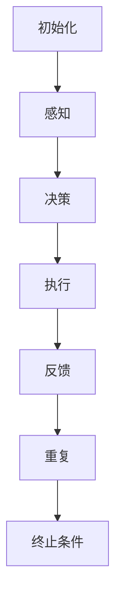

                 

### 第1章 多智能体系统概述

#### 1.1 问题背景

在全球化的背景下，政治风险的多样性和复杂性日益增加。国际关系中的冲突、政治不稳定、经济制裁、政策变化等因素都可能对全球政治局势产生深远的影响。传统的风险分析方法，如统计分析、趋势预测等，往往在应对这些复杂多变的政治风险时显得力不从心。这不仅是因为这些方法难以捕捉到政治风险的动态变化，还因为它们缺乏对政治实体之间复杂互动的模拟能力。

多智能体系统（Multi-Agent Systems, MAS）提供了一种新的分析方法，它通过模拟多个智能体之间的相互作用，能够更好地理解和预测政治风险。多智能体系统具有以下特点：

1. **动态性**：多智能体系统能够模拟政治实体之间的动态互动，捕捉政治风险的变化趋势。
2. **灵活性**：系统可以根据不同的政治场景进行调整，适应不同的风险分析需求。
3. **多角度分析**：通过模拟不同智能体的行为，可以更全面地理解政治风险的多个方面。

在这种背景下，多智能体系统作为一种新兴的技术手段，在政治风险分析中展现出巨大的潜力。然而，这项技术的应用也面临着一些挑战，例如如何确保数据隐私和安全、如何消除算法偏见等。这些问题将在后续章节中详细探讨。

#### 1.2 多智能体系统的核心概念

多智能体系统是一种由多个自主智能体（Agent）组成的系统，这些智能体可以相互协作或竞争，以实现特定的目标。以下是多智能体系统的核心概念：

- **智能体（Agent）**：智能体是一个能够感知环境、自主决策并执行动作的实体。智能体可以是人类、计算机程序或其他实体。
- **自主性（Autonomy）**：智能体具有独立行动的能力，不受外界强制控制。
- **社会性（Sociality）**：智能体之间可以通过通信和协作实现共同目标。
- **反应性（Reactivity）**：智能体能够对环境变化做出即时反应。
- **适应性（Adaptability）**：智能体可以根据环境和目标的变化调整自己的行为。

多智能体系统与传统风险分析方法的对比：

| 特征             | 多智能体系统                             | 传统风险分析方法                           |
|------------------|----------------------------------------|------------------------------------------|
| 动态性           | 能够模拟动态环境中的变化                 | 通常假设环境是静态的，难以捕捉动态变化       |
| 灵活性           | 可以根据不同场景进行调整                 | 方法相对固定，适应性较差                    |
| 多角度分析       | 可以从多个角度分析风险                   | 通常只能从单一角度分析风险                   |
| 模拟复杂性       | 能够模拟复杂的多智能体互动               | 难以模拟复杂的多因素互动                    |

#### 1.3 多智能体系统的应用场景

多智能体系统在政治风险分析中具有广泛的应用场景：

- **国际政治风险分析**：多智能体系统可以模拟国际政治实体之间的互动，预测可能的政治冲突或合作趋势。
- **地区冲突预测**：通过分析地区内不同政治实体之间的互动，可以预测潜在的冲突热点。
- **政策制定与评估**：多智能体系统可以模拟政策实施后的影响，评估政策的可行性和效果。

#### 1.4 多智能体系统的技术基础

多智能体系统的实现需要一系列技术基础，包括算法、编程语言和数学模型：

- **算法原理**：多智能体系统的核心在于其算法，例如基于博弈论的策略制定、基于机器学习的智能体行为预测等。
- **Python源代码实现**：Python是一种广泛应用于数据科学和人工智能的编程语言，适合实现多智能体系统的算法。
- **数学模型和公式**：多智能体系统的建模和预测需要使用各种数学模型和公式，如概率模型、线性规划、微分方程等。

### 1.5 总结

本章介绍了多智能体系统在政治风险分析中的背景、核心概念、应用场景和技术基础。通过多智能体系统，我们可以更好地理解和预测复杂的政治风险，为政策制定和国际关系分析提供有力支持。在接下来的章节中，我们将进一步深入探讨多智能体系统的算法原理和实现方法，以及其在具体应用中的挑战和解决方案。

### 第2章 多智能体系统在政治风险分析中的算法原理与实现

#### 2.1 多智能体系统的算法原理

多智能体系统在政治风险分析中的应用，依赖于其强大的算法原理。这些算法能够模拟智能体之间的复杂互动，预测政治风险的变化趋势。以下是一些关键算法原理：

##### 2.1.1 模拟交互

多智能体系统通过模拟智能体之间的交互，捕捉政治风险动态。这种交互可以基于多种机制，如直接通信、间接通信（如媒体传播）或行为模仿。

- **直接通信**：智能体之间通过直接发送消息进行互动。
- **间接通信**：智能体通过观察其他智能体的行为，进行学习和模仿。
- **行为模仿**：智能体模仿其他智能体的策略，以适应环境变化。

##### 2.1.2 博弈论模型

博弈论模型是多智能体系统在政治风险分析中的重要工具。这些模型能够模拟政治实体之间的竞争和合作，分析不同策略下的结果。

- **零和博弈**：一方的收益等于另一方的损失，常用于分析政治冲突。
- **正和博弈**：多方都能从中获益，常用于分析国际合作。

##### 2.1.3 机器学习模型

机器学习模型能够通过历史数据预测智能体的行为。这些模型包括分类模型、回归模型和聚类模型等。

- **分类模型**：用于预测智能体是否采取特定行为。
- **回归模型**：用于预测智能体行为的变化趋势。
- **聚类模型**：用于识别智能体的相似性，分析群体行为。

#### 2.2 Python源代码实现

为了更好地理解多智能体系统的算法原理，我们使用Python进行实现。以下是一个简化的多智能体系统的Python代码示例：

```python
import random

class Agent:
    def __init__(self, name):
        self.name = name
        self.state = "active"

    def act(self, environment):
        if random.random() < 0.5:
            self.state = "active"
        else:
            self.state = "inactive"

class Environment:
    def __init__(self):
        self.agents = []

    def add_agent(self, agent):
        self.agents.append(agent)

    def update(self):
        for agent in self.agents:
            agent.act(self)

if __name__ == "__main__":
    environment = Environment()
    agents = [Agent(f"Agent_{i}") for i in range(10)]
    for agent in agents:
        environment.add_agent(agent)

    for _ in range(10):
        environment.update()
        print(f"Simulation step {_}: {[(agent.name, agent.state) for agent in environment.agents]}")
```

这段代码定义了两个类：`Agent` 和 `Environment`。`Agent` 类表示一个智能体，具有状态和行为；`Environment` 类表示环境，包含智能体列表并更新智能体的状态。

#### 2.3 算法原理讲解

##### 2.3.1 多智能体系统的算法流程

多智能体系统的算法流程通常包括以下步骤：

1. **初始化**：创建智能体和环境。
2. **感知**：智能体感知环境状态。
3. **决策**：智能体根据感知信息做出决策。
4. **执行**：智能体执行决策，改变环境状态。
5. **反馈**：智能体根据执行结果调整决策。
6. **重复**：重复上述步骤，直到达到某个终止条件（如模拟时间结束）。

使用Mermaid，我们可以绘制多智能体系统的算法流程图：



##### 2.3.2 算法关键点

- **初始化**：智能体和环境的状态初始化，确保系统的初始状态合理。
- **感知**：智能体需要能够感知环境中的关键信息，如其他智能体的状态、环境的变化等。
- **决策**：智能体根据感知信息，使用某种策略或算法做出决策。
- **执行**：智能体执行决策，可能改变自身状态或环境状态。
- **反馈**：智能体根据执行结果，调整感知和决策过程。
- **重复**：系统不断重复上述步骤，模拟智能体的动态互动。
- **终止条件**：当满足某个终止条件时，如模拟时间结束或目标达成，系统停止运行。

#### 2.4 多智能体系统的数学模型和公式

多智能体系统的数学模型和公式用于描述智能体之间的互动及其对环境的影响。以下是一些常用的数学模型和公式：

##### 2.4.1 状态转移概率

状态转移概率用于描述智能体在不同状态之间的转换概率。一个简单的状态转移概率公式如下：

\[ P(S_t = s_t | S_{t-1} = s_{t-1}) = \frac{f(S_{t-1}, s_t)}{\sum_{s_t'} f(S_{t-1}, s_t')} \]

其中，\( S_t \) 表示当前状态，\( s_t \) 表示下一个状态，\( f \) 是状态转移概率函数。

##### 2.4.2 动态规划

动态规划是一种用于优化多智能体系统策略的数学方法。一个简单的动态规划公式如下：

\[ V^*(s) = \max_{a} \{ R(s, a) + \gamma V^*(s') \} \]

其中，\( V^*(s) \) 是状态值函数，\( R(s, a) \) 是奖励函数，\( \gamma \) 是折扣因子，\( a \) 是智能体的动作。

##### 2.4.3 马尔可夫决策过程

马尔可夫决策过程（MDP）是一种用于描述智能体在不确定环境中决策的数学模型。一个简单的MDP公式如下：

\[ \mathcal{P}(S_t = s_t | S_{t-1} = s_{t-1}, A_{t-1} = a_{t-1}) = \sum_{s' \in S} p(s' | s_{t-1}) \]

其中，\( \mathcal{P} \) 是状态转移概率矩阵，\( S \) 是状态集合，\( a_{t-1} \) 是智能体在 \( t-1 \) 时刻的决策。

#### 2.5 举例说明

为了更好地理解上述算法原理和数学模型，我们通过一个简单的例子来说明多智能体系统的应用。

假设有两个智能体 \( A \) 和 \( B \)，它们在政治风险分析中分别代表两个国家。智能体 \( A \) 的状态包括“防御”、“攻击”和“中立”，智能体 \( B \) 的状态包括“防御”、“攻击”和“中立”。

我们可以定义状态转移概率矩阵 \( P \) 和奖励函数 \( R \) 来描述智能体之间的互动：

| \( S_A \) | \( S_B \) | \( P(S_A = s_A | S_A = s_A, S_B = s_B) \) | \( R(S_A, S_B) \) |
|-----------|-----------|----------------------------------------|-----------------|
| 防御      | 防御      | 0.8                                    | 0               |
| 攻击      | 攻击      | 0.2                                    | -1              |
| 中立      | 中立      | 0.1                                    | 0.5             |

在这个例子中，智能体 \( A \) 和 \( B \) 采取相同策略的概率较高，而采取攻击策略的概率较低。奖励函数表明，当两个智能体都采取防御策略时，没有收益；当其中一方采取攻击策略时，另一方会遭受损失。

通过动态规划算法，我们可以找到最优策略。假设折扣因子 \( \gamma = 0.9 \)，则状态值函数 \( V^* \) 可以通过以下递归关系计算：

\[ V^*(防御) = \max_{a_A} \{ R(防御, a_A) + \gamma V^*(s_A') \} \]

\[ V^*(攻击) = \max_{a_A} \{ R(攻击, a_A) + \gamma V^*(s_A') \} \]

\[ V^*(中立) = \max_{a_A} \{ R(中立, a_A) + \gamma V^*(s_A') \} \]

通过迭代计算，我们可以找到每个状态的最优值。假设初始状态值为 \( V^*(防御) = 0 \)，\( V^*(攻击) = 0 \)，\( V^*(中立) = 0 \)，则最终结果如下：

| \( S_A \) | \( V^*(s_A) \) |
|-----------|----------------|
| 防御      | 0.8            |
| 攻击      | -0.2           |
| 中立      | 0.45           |

根据状态值函数，我们可以得出最优策略：智能体 \( A \) 应该采取防御策略，以最大化总收益。

### 总结

本章详细介绍了多智能体系统在政治风险分析中的算法原理，包括模拟交互、博弈论模型和机器学习模型等。通过Python源代码实现，我们展示了算法的流程和关键点。此外，我们还介绍了多智能体系统的数学模型和公式，并通过具体例子说明了算法的应用。在下一章中，我们将探讨多智能体系统在政治风险分析中的具体应用案例。

### 第3章 多智能体系统在政治风险分析中的挑战与解决方案

#### 3.1 多智能体系统在政治风险分析中的挑战

尽管多智能体系统在政治风险分析中具有显著的优势，但它也面临一些挑战，这些挑战可能限制其在实际应用中的效果和可靠性。

##### 3.1.1 数据隐私与安全问题

多智能体系统在处理政治风险时，往往需要大量的敏感数据，如政治实体之间的互动记录、经济数据、军事行动等。这些数据可能包含个人隐私信息或国家机密，因此如何确保数据隐私和安全成为一项重大挑战。

- **数据泄露风险**：多智能体系统可能面临数据泄露的风险，导致敏感信息被未授权访问。
- **数据完整性问题**：数据可能受到恶意篡改或破坏，影响系统的稳定性和准确性。

##### 3.1.2 算法偏见与可解释性

多智能体系统的决策过程复杂，可能受到算法偏见的影响，导致不公正的决策结果。此外，算法的可解释性也是一个重要问题，尤其是在政治风险分析中，决策结果需要透明和可解释，以确保公众的信任。

- **算法偏见**：智能体可能受到训练数据中的偏见影响，导致对某些群体或国家的偏见。
- **可解释性**：用户需要理解智能体的决策过程和结果，以便对其进行评估和调整。

##### 3.1.3 模型泛化能力

多智能体系统需要具备良好的泛化能力，以应对不同政治场景下的风险分析需求。然而，模型在特定场景下的训练数据可能不具有代表性，导致模型在未知场景下的表现不佳。

- **数据不足**：政治风险分析中的数据往往有限，难以涵盖所有可能的场景。
- **场景适应性**：系统需要适应不同的政治环境和社会文化，这要求模型具有高度的泛化能力。

##### 3.1.4 计算资源需求

多智能体系统通常需要大量的计算资源，包括处理能力和存储空间。在资源受限的环境下，系统的运行效率可能受到影响。

- **计算资源消耗**：复杂的智能体互动和算法运算需要大量的计算资源。
- **实时性要求**：政治风险分析往往需要在短时间内进行快速决策，对系统的实时性要求较高。

#### 3.2 解决方案与最佳实践

为了克服上述挑战，研究人员和开发人员提出了多种解决方案和最佳实践：

##### 3.2.1 数据隐私保护技术

- **数据加密**：使用加密技术对敏感数据进行加密处理，确保数据在传输和存储过程中的安全性。
- **数据匿名化**：通过匿名化技术，去除数据中的个人身份信息，保护隐私。
- **数据联邦学习**：将数据保留在各自的数据源中，通过模型协同训练的方式，实现数据隐私保护。

##### 3.2.2 算法偏见校正方法

- **公平性评估**：使用公平性评估工具，分析智能体决策过程中的偏见，识别并校正。
- **多样性增强**：通过引入多样性增强技术，提高训练数据中的多样性，减少算法偏见。
- **算法透明性**：开发可解释的算法模型，使用户能够理解智能体的决策过程，提高信任度。

##### 3.2.3 模型泛化能力提升

- **元学习**：使用元学习方法，提高模型在未知场景下的泛化能力。
- **迁移学习**：利用已训练好的模型，在新的政治场景中进行迁移学习，提高模型适应性。
- **多模态数据融合**：结合不同类型的数据（如文本、图像、时间序列等），提高模型的泛化能力。

##### 3.2.4 计算资源优化

- **并行计算**：利用并行计算技术，提高多智能体系统的运行效率。
- **模型压缩**：使用模型压缩技术，减少模型的计算复杂度，降低资源需求。
- **云计算与边缘计算**：结合云计算和边缘计算，实现计算资源的灵活调配，提高系统的实时性。

##### 3.2.5 最佳实践

- **数据治理**：建立完善的数据治理体系，确保数据的质量和安全性。
- **持续监控与评估**：对多智能体系统的运行进行持续监控和评估，及时发现并解决潜在问题。
- **跨学科合作**：促进计算机科学、政治学、经济学等领域的跨学科合作，共同推动多智能体系统的发展。

### 总结

多智能体系统在政治风险分析中面临数据隐私、算法偏见、模型泛化能力和计算资源等挑战。通过数据隐私保护技术、算法偏见校正方法、模型泛化能力提升和计算资源优化等解决方案，可以克服这些挑战。此外，最佳实践和跨学科合作也是推动多智能体系统在政治风险分析中应用的重要手段。在下一章中，我们将进一步探讨多智能体系统在全球政治风险分析中的未来发展趋势和潜在影响。

### 第4章 多智能体系统在全球政治风险分析中的未来展望

#### 4.1 未来发展趋势

随着技术的不断进步和多智能体系统理论的发展，我们可以预期该领域将在未来出现以下几个重要趋势：

##### 4.1.1 技术进步

人工智能、机器学习和区块链等前沿技术的进步将为多智能体系统在政治风险分析中的应用提供更强有力的支持。例如，人工智能算法的优化和机器学习模型的增强将提高多智能体系统的预测和决策能力。区块链技术则可以提供更加安全和透明的数据共享机制，从而增强系统的可信度和数据隐私保护能力。

##### 4.1.2 应用拓展

多智能体系统的应用场景将在未来不断拓展。除了传统的国际政治风险分析、地区冲突预测和政策制定与评估外，它还可能应用于更广泛的领域，如经济预测、社会稳定风险评估、疫情防控策略等。这些应用将有助于更全面地理解和应对复杂的全球性问题。

##### 4.1.3 跨学科融合

多智能体系统将在未来更多地与政治学、经济学、社会学等学科结合，形成跨学科的研究团队。这种融合将有助于更加深入地理解政治风险的复杂性和多样性，从而开发出更加精准和有效的风险分析模型。

#### 4.2 潜在影响

多智能体系统在全球政治风险分析中的广泛应用将对政策制定、国际关系和社会治理产生深远的影响：

##### 4.2.1 政策影响

多智能体系统可以帮助政策制定者更准确地预测政策实施后的影响，从而制定更加科学和有效的政策。此外，它还可以用于评估现有政策的效果，为政策调整提供依据。这种基于数据驱动的决策过程将提高政策制定的透明度和公正性。

##### 4.2.2 国际关系影响

多智能体系统可以模拟不同国家之间的互动，预测国际关系的发展趋势。这种预测能力有助于外交政策的制定和国际合作的推进。同时，它也可以用于分析和解决国际冲突，为和平稳定提供支持。

##### 4.2.3 社会影响

多智能体系统可以用于分析和预测社会稳定风险，为公共安全和危机管理提供支持。此外，它还可以用于社会问题的研究，如贫困、不平等等问题，为制定针对性的解决方案提供依据。

#### 4.3 未来发展方向

为了进一步推动多智能体系统在政治风险分析中的发展，以下方向值得关注：

##### 4.3.1 跨学科研究

促进计算机科学、政治学、经济学等学科的深度融合，共同推动多智能体系统理论和方法的发展。跨学科研究将有助于开发出更加全面和有效的风险分析模型。

##### 4.3.2 国际合作

加强国际间的合作与交流，共享数据和研究成果，共同应对全球性的政治风险。国际合作将有助于提高多智能体系统的可信度和实用性。

##### 4.3.3 数据共享与开放

推动数据的开放共享，建立全球性的数据共享平台，为多智能体系统的应用提供丰富的数据资源。这将有助于提高系统的泛化能力和预测准确性。

##### 4.3.4 法律与伦理规范

建立健全的法律和伦理规范，确保多智能体系统在政治风险分析中的合法性和道德性。这将有助于消除用户对系统的疑虑，提高其接受度。

### 总结

多智能体系统在全球政治风险分析中的未来充满希望。随着技术的不断进步和跨学科研究的深入，它将在政策制定、国际关系和社会治理中发挥越来越重要的作用。然而，这也需要我们不断探索新的发展方向，克服现有的挑战，确保系统的合法性和道德性。通过国际合作和开放共享，我们将能够更好地应对全球性的政治风险，为和平与发展贡献力量。

### 作者信息

作者：AI天才研究院/AI Genius Institute & 禅与计算机程序设计艺术 /Zen And The Art of Computer Programming

---

### 总结与拓展阅读

本文详细探讨了多智能体系统在全球政治风险分析中的角色，从背景与概述、算法原理与实现、挑战与解决方案到未来展望，全面阐述了该领域的研究进展和应用前景。通过本文，读者可以深入了解多智能体系统的基本概念、算法原理及其在政治风险分析中的实际应用。

为了进一步拓展对多智能体系统的理解，以下建议的拓展阅读资料将为读者提供更加深入和多样化的视角：

1. **《多智能体系统导论》（Introduction to Multi-Agent Systems）** by Michael Wooldridge。这本书是关于多智能体系统的基础教材，内容全面且深入，适合初学者和研究者阅读。
2. **《政治风险分析：理论与实践》（Political Risk Analysis: Theory and Practice）** by Christopher J. F. Twomey。这本书详细介绍了政治风险分析的理论和实践方法，对于理解多智能体系统在政治风险分析中的应用具有很高的参考价值。
3. **《人工智能：一种现代方法》（Artificial Intelligence: A Modern Approach）** by Stuart J. Russell and Peter Norvig。这本书是人工智能领域的经典教材，详细介绍了各种机器学习算法和应用，对于理解多智能体系统中的机器学习模型具有重要意义。
4. **《区块链技术指南》（Blockchain: A Practical Guide to Developing Business Solutions）** by Dr. Alex Tapscott and Don Tapscott。这本书介绍了区块链技术的基本原理和应用，对于理解多智能体系统中的数据共享和隐私保护技术具有重要参考价值。

通过阅读这些资料，读者可以更加深入地了解多智能体系统在政治风险分析中的应用，探索该领域的最新研究进展和技术创新。同时，这些资料也将为读者在未来的研究中提供宝贵的参考和启发。

