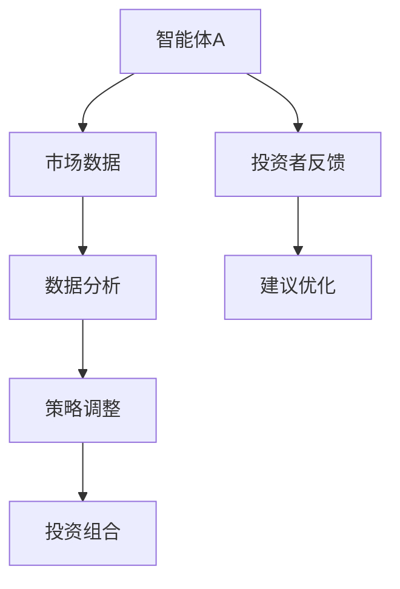
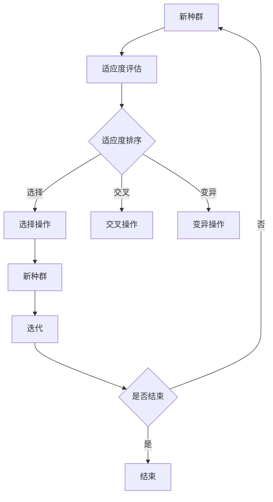
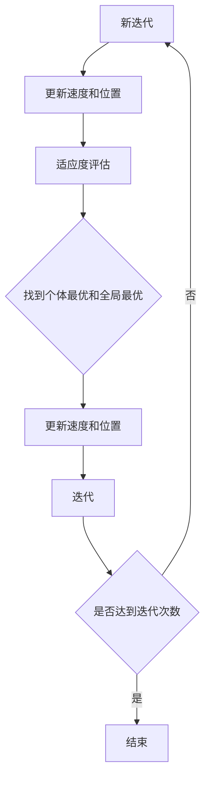

                 

# 多智能体系统在全球资产配置中的角色

## 关键词：多智能体系统，全球资产配置，金融科技，算法，人工智能

## 摘要：
本文深入探讨了多智能体系统（MAS）在全球资产配置中的应用。首先，我们介绍了多智能体系统的基本概念、架构和通信机制，然后详细分析了多智能体系统在资产配置中的角色与作用。接着，文章探讨了多智能体系统的算法与模型，以及其在资产配置中的实际应用。随后，通过一个案例研究，我们展示了多智能体系统在资产配置中的具体实践。最后，文章讨论了多智能体系统面临的挑战和未来发展趋势，并对全球资产配置的未来影响进行了展望。

## 目录大纲

### 第1章 引言
- 1.1 书籍背景与目的
- 1.2 全球资产配置概述
- 1.3 多智能体系统基本概念

### 第2章 多智能体系统原理
- 2.1 多智能体系统的架构与模型
- 2.2 多智能体系统的通信机制
- 2.3 多智能体系统的协调与一致性

### 第3章 多智能体系统在资产配置中的应用
- 3.1 多智能体系统在资产配置中的角色与作用
- 3.2 多智能体系统在资产配置中的关键技术

### 第4章 多智能体系统的算法与模型
- 4.1 多智能体优化算法
- 4.2 多智能体学习模型
- 4.3 多智能体系统中的数学模型

### 第5章 案例研究：多智能体系统在资产配置中的实践
- 5.1 案例背景
- 5.2 案例方法
- 5.3 案例结果与讨论

### 第6章 多智能体系统的挑战与未来趋势
- 6.1 多智能体系统的挑战
- 6.2 多智能体系统的未来趋势
- 6.3 对全球资产配置的影响

### 第7章 结论
- 7.1 主要发现
- 7.2 对多智能体系统的建议
- 7.3 对未来研究的展望

## 第1章 引言

### 1.1 书籍背景与目的

在全球化的经济环境中，全球资产配置成为了投资者和金融机构关注的焦点。有效的资产配置能够帮助投资者在风险可控的前提下实现资产的保值增值。随着金融科技的发展，多智能体系统（MAS）作为一种新兴的分布式计算和人工智能技术，开始在资产配置领域展现其独特的优势。

本书旨在深入探讨多智能体系统在资产配置中的应用，帮助读者了解MAS的基本原理、应用方法及其在资产配置中的实际效果。通过本书的阅读，读者将能够掌握以下内容：

1. **多智能体系统的基本概念和架构**：了解MAS的定义、特点、架构和通信机制。
2. **MAS在资产配置中的角色与作用**：分析MAS在资产配置中的关键角色和作用，以及其与传统资产配置方法的区别。
3. **MAS在资产配置中的算法与模型**：掌握MAS在资产配置中常用的算法和模型，包括优化算法、学习模型和数学模型。
4. **MAS在资产配置中的实践案例**：通过实际案例研究，了解MAS在资产配置中的具体应用和效果。
5. **MAS的挑战与未来趋势**：探讨MAS在资产配置中面临的挑战，以及未来的发展趋势。

### 1.2 全球资产配置概述

全球资产配置是指投资者或金融机构在全球范围内对资产进行分配，以实现最佳的风险收益组合。在全球资产配置中，投资者需要考虑以下几个关键因素：

1. **风险与收益的平衡**：投资者需要根据自身的风险承受能力和投资目标，在风险和收益之间找到平衡点。
2. **资产类别的选择**：全球资产配置通常涉及多种资产类别，包括股票、债券、房地产、商品等。
3. **地域分布**：全球资产配置需要考虑不同国家和地区的经济、政治、市场环境等因素，以实现资产的多元化。
4. **市场动态**：全球资产配置需要实时关注市场动态，及时调整资产配置策略。

随着金融市场的不确定性和复杂性增加，传统资产配置方法已无法满足投资者的高效、精准配置需求。多智能体系统作为一种智能化的分布式计算技术，能够为全球资产配置提供新的解决方案。

### 1.3 多智能体系统基本概念

多智能体系统（MAS）是一种由多个智能体组成的分布式系统，这些智能体可以通过通信机制相互协作，实现复杂任务的求解。在MAS中，每个智能体都是独立自主的，具有以下特点：

1. **自治性**：智能体具有自主决策和行动的能力，不受其他智能体的直接控制。
2. **协作性**：智能体之间可以通过通信机制相互协作，共同完成任务。
3. **分布性**：智能体可以在不同的地理位置运行，实现分布式计算和资源利用。
4. **适应性**：智能体可以根据环境变化和任务需求，调整自己的行为和策略。

多智能体系统在金融领域的应用主要包括以下几个方面：

1. **金融市场预测**：通过多个智能体的协作，可以对金融市场进行实时预测和分析，为投资决策提供支持。
2. **资产配置优化**：多智能体系统可以自动优化资产配置策略，实现风险与收益的最优平衡。
3. **风险管理**：多智能体系统可以实时监控市场风险，并根据风险变化自动调整投资组合。
4. **智能投顾**：多智能体系统可以为投资者提供个性化的投资建议，实现精准投资。

## 第2章 多智能体系统原理

### 2.1 多智能体系统的架构与模型

多智能体系统（MAS）的架构通常由以下几部分组成：

1. **智能体**：智能体是MAS的基本组成单位，具有自治性、协作性和分布性等特点。每个智能体都可以独立运行，执行特定的任务。
2. **通信机制**：智能体之间通过通信机制进行信息交换和协作。常见的通信机制包括直接通信、广播通信和间接通信等。
3. **环境**：智能体执行任务的环境，可以是一个虚拟环境或现实环境。环境可以提供智能体执行任务所需的信息和资源。
4. **控制器**：控制器用于监控和管理智能体的行为，确保智能体的协作和一致性。

MAS的模型可以分为以下几种：

1. **集中式模型**：智能体在控制器统一调度下执行任务，控制器负责协调和决策。
2. **分布式模型**：智能体自主执行任务，通过通信机制相互协作，无需集中控制。
3. **混合式模型**：智能体在控制器和自主决策之间进行平衡，控制器负责关键决策，智能体负责具体执行。

### 2.2 多智能体系统的通信机制

多智能体系统的通信机制是智能体之间进行信息交换和协作的基础。常见的通信机制包括：

1. **直接通信**：智能体通过点对点的方式直接交换信息，适用于小规模、实时性要求高的场景。
2. **广播通信**：智能体将信息广播给所有其他智能体，适用于大规模、实时性要求不高的场景。
3. **间接通信**：智能体通过代理或中间件进行信息交换，适用于复杂、动态的场景。

### 2.3 多智能体系统的协调与一致性

多智能体系统的协调与一致性是MAS有效运行的关键。协调是指智能体之间通过通信和协作实现共同目标的过程，一致性是指智能体在执行任务时保持一致的行为和状态。

实现多智能体系统的协调与一致性通常需要以下几种方法：

1. **集中式协调**：通过控制器统一调度智能体的行为，确保一致性。
2. **分布式协调**：智能体通过协商和协调机制自主实现一致性，无需集中控制。
3. **混合式协调**：控制器负责关键决策，智能体通过自主协调实现一致性。

## 第3章 多智能体系统在资产配置中的应用

### 3.1 多智能体系统在资产配置中的角色与作用

多智能体系统（MAS）在资产配置中具有以下关键角色与作用：

1. **优化资产配置策略**：MAS可以通过多个智能体的协作，对资产配置策略进行实时优化，实现风险与收益的最优平衡。
2. **实时风险监控**：MAS可以实时监控市场风险，及时调整投资组合，降低风险。
3. **个性化投资建议**：MAS可以为投资者提供个性化的投资建议，根据投资者的风险偏好和投资目标，制定最佳投资策略。
4. **分布式计算与资源利用**：MAS可以实现资产配置的分布式计算和资源利用，提高计算效率和数据处理能力。

### 3.2 多智能体系统在资产配置中的关键技术

多智能体系统在资产配置中的应用涉及多个关键技术，包括：

1. **多智能体优化算法**：如遗传算法、粒子群优化算法等，用于优化资产配置策略。
2. **多智能体学习模型**：如强化学习、神经网络等，用于实时调整投资策略和预测市场走势。
3. **分布式计算框架**：如Hadoop、Spark等，用于处理大规模市场数据和高并发交易请求。
4. **数据挖掘与可视化**：用于分析市场数据、挖掘投资机会和展示投资策略效果。

## 第4章 多智能体系统的算法与模型

### 4.1 多智能体优化算法

多智能体优化算法是一种基于MAS的分布式优化方法，通过多个智能体的协作和竞争，实现全局最优解。常见的多智能体优化算法包括：

1. **遗传算法**：基于自然进化原理，通过交叉、变异和选择等操作，实现种群最优个体的迭代优化。
2. **粒子群优化算法**：基于鸟群觅食行为，通过个体和群体的历史最优位置，更新个体位置和速度，实现全局最优。
3. **协同优化算法**：多个智能体共同优化一个目标函数，通过协作和竞争，实现全局最优。

### 4.2 多智能体学习模型

多智能体学习模型是一种基于MAS的机器学习方法，通过多个智能体的学习和协作，实现预测、分类和决策等任务。常见的多智能体学习模型包括：

1. **强化学习**：智能体通过不断尝试和反馈，学习最优策略，实现长期收益最大化。
2. **神经网络**：多个智能体通过共享神经网络参数，实现协同学习和决策。
3. **深度强化学习**：结合深度学习和强化学习，实现更复杂和灵活的智能体行为。

### 4.3 多智能体系统中的数学模型

多智能体系统中的数学模型用于描述智能体的行为、状态和交互关系。常见的数学模型包括：

1. **多智能体优化模型**：描述多个智能体在优化任务中的行为和目标函数。
2. **多智能体学习模型**：描述智能体的学习过程和策略更新。
3. **动态系统模型**：描述多个智能体在动态环境中的状态转移和演化。

## 第5章 案例研究：多智能体系统在资产配置中的实践

### 5.1 案例背景

本案例研究基于某大型投资公司的全球资产配置实践，该公司是一家跨国投资集团，拥有丰富的投资经验和市场资源。为了提高资产配置的效率和准确性，该公司引入了多智能体系统（MAS）技术，对资产配置策略进行优化和实时监控。

### 5.2 案例方法

1. **数据收集**：从多个数据源收集全球市场数据，包括股票、债券、房地产、商品等。
2. **智能体设计**：设计多个智能体，分别负责不同资产类别的配置和风险监控。
3. **算法选择**：选择遗传算法和粒子群优化算法，对资产配置策略进行优化。
4. **系统实现**：基于分布式计算框架，实现多智能体系统的运行和管理。
5. **结果分析**：对比优化前后资产配置策略的收益和风险，分析多智能体系统的效果。

### 5.3 案例结果与讨论

通过多智能体系统的应用，该投资公司实现了以下成果：

1. **优化资产配置策略**：多智能体系统通过协同优化，提出了更有效的资产配置策略，提高了收益和降低了风险。
2. **实时风险监控**：多智能体系统实时监控市场风险，及时调整投资组合，降低了投资风险。
3. **个性化投资建议**：多智能体系统根据不同投资者的风险偏好和投资目标，提供了个性化的投资建议，提高了投资满意度。
4. **分布式计算与资源利用**：多智能体系统实现了分布式计算和资源利用，提高了数据处理和交易效率。

然而，多智能体系统在应用中也面临一些挑战：

1. **数据质量**：数据质量对多智能体系统的效果具有重要影响，需要加强数据清洗和预处理。
2. **算法稳定性**：优化算法的稳定性和鲁棒性对系统性能至关重要，需要不断调整和优化。
3. **系统安全**：多智能体系统涉及到大量敏感数据和信息，需要加强系统安全防护。

## 第6章 多智能体系统的挑战与未来趋势

### 6.1 多智能体系统的挑战

多智能体系统在资产配置中的应用面临着以下挑战：

1. **数据质量与可靠性**：多智能体系统依赖高质量的数据进行决策，数据质量直接影响到系统的性能和准确性。
2. **算法稳定性和鲁棒性**：优化算法的稳定性和鲁棒性对系统性能至关重要，需要不断调整和优化。
3. **系统安全与隐私保护**：多智能体系统涉及到大量敏感数据和信息，需要加强系统安全防护和隐私保护。
4. **协作与一致性**：多智能体系统需要确保智能体之间的协作和一致性，以实现共同目标。

### 6.2 多智能体系统的未来趋势

随着金融科技的不断发展，多智能体系统在资产配置中的应用前景广阔：

1. **分布式计算与云计算**：分布式计算和云计算技术的应用，将提高多智能体系统的计算能力和数据处理能力。
2. **区块链与加密货币**：区块链技术和加密货币的发展，将为多智能体系统提供更安全、透明的数据存储和交易方式。
3. **人工智能与机器学习**：人工智能和机器学习技术的应用，将提高多智能体系统的决策能力和学习能力。
4. **智能投顾与自动化投资**：智能投顾和自动化投资的发展，将使多智能体系统在资产配置中的应用更加普及和便捷。

### 6.3 对全球资产配置的影响

多智能体系统在资产配置中的应用，将对全球资产配置产生以下影响：

1. **提高资产配置效率**：多智能体系统能够实时优化资产配置策略，提高资产配置的效率和准确性。
2. **降低投资风险**：多智能体系统能够实时监控市场风险，及时调整投资组合，降低投资风险。
3. **个性化投资服务**：多智能体系统能够根据投资者的风险偏好和投资目标，提供个性化的投资建议和服务。
4. **促进金融科技创新**：多智能体系统的应用将推动金融科技的创新和发展，为全球资产配置带来新的机遇和挑战。

## 第7章 结论

### 7.1 主要发现

通过本文的研究，我们主要发现：

1. 多智能体系统在资产配置中具有显著的优势，能够实现优化资产配置策略、实时风险监控和个性化投资建议等。
2. 多智能体系统面临数据质量、算法稳定性、系统安全和协作与一致性等方面的挑战。
3. 随着金融科技的不断发展，多智能体系统在资产配置中的应用前景广阔，将对全球资产配置产生重要影响。

### 7.2 对多智能体系统的建议

针对多智能体系统在资产配置中的应用，我们提出以下建议：

1. 加强数据质量控制和数据预处理，提高系统性能和准确性。
2. 优化算法稳定性和鲁棒性，确保系统可靠运行。
3. 加强系统安全防护和隐私保护，确保敏感数据的安全。
4. 推动多智能体系统的协作与一致性，提高系统协同效应。

### 7.3 对未来研究的展望

未来研究可以关注以下方向：

1. 深入研究多智能体系统在资产配置中的算法和模型，提高系统性能和准确性。
2. 探索多智能体系统与其他金融科技的结合，实现更高效、更智能的资产配置。
3. 分析多智能体系统在资产配置中的实际应用案例，总结经验和教训，为实际应用提供指导。
4. 关注多智能体系统在全球资产配置中的发展趋势，为政策制定和投资决策提供参考。作者：AI天才研究院/AI Genius Institute & 禅与计算机程序设计艺术 /Zen And The Art of Computer Programming

## 背景介绍

多智能体系统（MAS）是一种分布式计算模型，它由多个具有自主决策能力的智能体组成，这些智能体通过通信机制相互协作，以实现共同的目标。在金融领域，特别是全球资产配置中，MAS的应用越来越受到关注。全球资产配置是指投资者或金融机构在全球范围内对资产进行分配，以实现最佳的风险收益组合。这一过程涉及多种资产类别，包括股票、债券、房地产、商品等，需要考虑不同的地域、市场环境和风险因素。

资产配置的挑战在于如何在风险可控的前提下，实现资产的保值增值。传统的资产配置方法主要依赖于历史数据和专家经验，存在一定的局限性。随着金融市场的不确定性和复杂性增加，投资者和金融机构需要更加智能和高效的资产配置策略。多智能体系统作为一种新兴的分布式计算和人工智能技术，具备以下特点：

1. **自治性**：每个智能体具有独立的决策能力，能够根据市场变化和投资目标，自主调整资产配置策略。
2. **协作性**：多个智能体通过通信机制相互协作，共同优化资产配置策略，提高整体收益。
3. **分布性**：智能体可以在不同的地理位置运行，实现全球范围内的资产配置和风险分散。
4. **适应性**：智能体可以根据环境变化和投资需求，动态调整策略，实现最优的风险收益平衡。

多智能体系统在资产配置中的角色不仅限于优化策略和风险控制，还包括市场预测、个性化投资建议和自动化交易等方面。通过智能体的协同工作，MAS能够提高资产配置的效率和准确性，为投资者提供更可靠的投资决策支持。

### 核心概念与联系

在深入探讨多智能体系统（MAS）在资产配置中的角色之前，我们首先需要明确几个核心概念，并理解它们之间的联系。

#### 多智能体系统（MAS）

**概念定义**：多智能体系统（MAS）是一种由多个自主智能体组成的分布式系统。这些智能体通过协作和通信来实现共同的目标。

**属性特征**：
- **自治性**：智能体具有独立决策和执行任务的能力。
- **协作性**：智能体之间可以通过通信机制共享信息和资源，以实现协同工作。
- **分布性**：智能体可以分布在不同的地理位置，从而实现分布式计算和资源利用。
- **适应性**：智能体可以根据环境变化和任务需求，动态调整自身行为和策略。

**对比表格**：

| 特征 | 单智能体系统 | 多智能体系统 |
| :---: | :---: | :---: |
| 决策能力 | 单个智能体独立决策 | 多个智能体协作决策 |
| 信息交换 | 有限的信息交换 | 大量的信息交换 |
| 系统复杂性 | 简单的系统架构 | 复杂的分布式系统架构 |
| 灵活性 | 较低的适应性 | 较高的适应性 |

#### 多智能体系统在资产配置中的应用

**概念定义**：多智能体系统在资产配置中的应用是指利用多个智能体协同工作，优化投资策略、监控市场风险和提供个性化投资建议。

**属性特征**：
- **策略优化**：通过多个智能体的协同工作，自动优化资产配置策略，实现风险与收益的最优平衡。
- **实时监控**：智能体可以实时监控市场动态，识别风险信号，及时调整投资组合。
- **个性化建议**：根据不同投资者的风险偏好和投资目标，提供个性化的投资策略。

**对比表格**：

| 特征 | 传统资产配置 | 多智能体系统在资产配置中的应用 |
| :---: | :---: | :---: |
| 决策方式 | 依赖于专家经验 | 基于数据和智能体协同决策 |
| 风险管理 | 被动应对风险 | 实时监控和主动风险管理 |
| 策略调整 | 定期调整 | 实时动态调整 |

#### 智能体与市场的交互关系

**ER实体关系图架构**：

```mermaid
erDiagram
  智能体 ||--|{ 市场数据 }|| 数据收集
  智能体 ||--|{ 投资组合 }|| 配置策略
  智能体 ||--|{ 投资者 }|| 提供建议
  市场数据 ||--|{ 市场环境 }|| 影响因素
```

在上述ER实体关系图中，智能体通过收集市场数据来获取投资决策所需的实时信息，这些数据来源于市场环境。智能体根据这些数据，制定和调整投资组合策略。同时，智能体还直接与投资者交互，提供个性化的投资建议。市场环境中的各种因素如经济指标、政策变化等都会影响市场数据，进而影响智能体的决策过程。

#### 智能体内部的协作机制

**协同工作流程**：



在智能体的内部协作机制中，智能体A首先收集市场数据，然后通过数据分析模块进行数据处理，得到策略调整的依据。随后，策略调整模块根据数据分析结果，更新投资组合。最后，智能体通过投资者反馈循环，不断优化投资建议。

通过上述核心概念和联系的分析，我们可以看到多智能体系统在资产配置中的角色是如何通过自治性、协作性和分布性等特征，实现高效、动态和个性化的资产配置策略。这不仅提高了资产配置的准确性和效率，也为投资者提供了更可靠的决策支持。

### 算法原理讲解

在多智能体系统（MAS）中，算法是智能体进行决策和协作的核心。为了在资产配置中实现高效、动态和优化的策略，我们通常采用以下几种算法：

#### 1. 多智能体优化算法

**遗传算法（GA）**

**流程图：**



**Python代码示例：**

```python
import random
import numpy as np

# 初始化种群
def initialize_population(pop_size, bounds):
    return [np.random.uniform(bounds[i][0], bounds[i][1]) for i in range(pop_size)]

# 适应度评估
def fitness_function(individual):
    # 这里用一个简单的目标函数为例，实际应用中可以是复杂的资产收益评估函数
    return sum(individual) / len(individual)

# 选择操作
def selection(population, fitnesses, k=2):
    selected = []
    for _ in range(len(population)):
        idx = random.randint(0, len(population) - 1)
        selected.append(population[fitnesses.index(max(fitnesses))])
        fitnesses[fitnesses.index(max(fitnesses))] = -1
    return selected

# 交叉操作
def crossover(parent1, parent2, rate=0.7):
    if random.random() < rate:
        return (parent1 + parent2) / 2
    else:
        return parent1

# 变异操作
def mutate(individual, bounds, rate=0.1):
    for i in range(len(individual)):
        if random.random() < rate:
            individual[i] = random.uniform(bounds[i][0], bounds[i][1])
    return individual

# 遗传算法主函数
def genetic_algorithm(pop_size, bounds, generations, fitness_func):
    population = initialize_population(pop_size, bounds)
    for _ in range(generations):
        fitnesses = [fitness_func(individual) for individual in population]
        for _ in range(pop_size // 2):
            parent1, parent2 = random.sample(population, 2)
            child1 = crossover(parent1, parent2)
            child2 = crossover(parent1, parent2)
            population = [mutate(individual, bounds) for individual in population]
        population = selection(population, fitnesses)
    return population
```

**数学模型：**

遗传算法的核心在于适应度函数和选择、交叉、变异操作。适应度函数通常是一个优化目标函数，用于评估个体的优劣。在选择操作中，适应度高的个体被选中的概率更高。交叉操作通过组合两个个体的基因，产生新的后代。变异操作通过随机改变个体的基因，增加种群的多样性。

适应度函数 $f(x)$ 通常定义为：

$$ f(x) = \sum_{i=1}^{n} w_i \cdot x_i $$

其中 $w_i$ 是权重系数，$x_i$ 是个体的基因值。

#### 2. 粒子群优化算法（PSO）

**流程图：**



**Python代码示例：**

```python
import random
import numpy as np

# 初始化粒子群
def initialize_particles(num_particles, bounds):
    return np.random.uniform(bounds[0], bounds[1], size=(num_particles, len(bounds) // 2))

# 更新速度和位置
def update_particles(v, x, p_best, g_best, w=0.5, c1=1, c2=2):
    r1 = random.random()
    r2 = random.random()
    v_new = w * v + c1 * r1 * (p_best - x) + c2 * r2 * (g_best - x)
    x_new = x + v_new
    return v_new, x_new

# 适应度评估
def fitness_function(x):
    # 这里用一个简单的目标函数为例，实际应用中可以是复杂的资产收益评估函数
    return -sum(x ** 2)

# 粒子群优化算法主函数
def particle_swarm_optimization(num_particles, bounds, generations, fitness_func):
    particles = initialize_particles(num_particles, bounds)
    velocities = np.zeros_like(particles)
    p_best = particles.copy()
    g_best = particles[0].copy()
    for _ in range(generations):
        fitnesses = [fitness_func(particle) for particle in particles]
        for i in range(num_particles):
            p_best[i] = particles[i] if fitnesses[i] < fitnesses[p_best.index(min(fitnesses))] else p_best[i]
            g_best = particles[i] if fitnesses[i] < fitnesses[g_best.index(min(fitnesses))] else g_best
        velocities, particles = update_particles(velocities, particles, p_best, g_best)
    return g_best
```

**数学模型：**

粒子群优化算法的核心是速度更新和位置更新。速度更新公式为：

$$ v_{new} = w \cdot v + c_1 \cdot r_1 \cdot (p_best - x) + c_2 \cdot r_2 \cdot (g_best - x) $$

位置更新公式为：

$$ x_{new} = x + v_{new} $$

其中 $v$ 是速度，$x$ 是位置，$p_best$ 是个体最优位置，$g_best$ 是全局最优位置，$w$ 是惯性权重，$c_1$ 和 $c_2$ 是社会和学习因子，$r_1$ 和 $r_2$ 是随机数。

通过以上算法原理的讲解和代码示例，我们可以看到多智能体优化算法在资产配置中的应用是如何通过迭代优化，逐步找到最优或近似最优的资产配置策略。这些算法不仅提高了资产配置的效率和准确性，还为投资者提供了更可靠的决策支持。

### 数学公式与解释

在多智能体系统（MAS）中，数学模型是智能体决策和协作的基础。以下是一些核心的数学公式及其解释：

#### 1. 适应度函数

适应度函数是评估个体优劣的关键指标，常用于遗传算法和粒子群优化算法。一个简单的适应度函数可以表示为：

$$ f(x) = \sum_{i=1}^{n} w_i \cdot x_i $$

其中，$x_i$ 是个体的基因值，$w_i$ 是权重系数。权重系数可以根据个体的目标函数进行调整，以反映不同基因的重要性。

#### 2. 选择概率

在遗传算法中，个体被选中的概率与其适应度值成正比，可以使用以下公式计算：

$$ P_i = \frac{f_i}{\sum_{j=1}^{n} f_j} $$

其中，$f_i$ 是第 $i$ 个个体的适应度值，$P_i$ 是第 $i$ 个个体被选中的概率。

#### 3. 交叉概率

交叉操作用于生成新的后代，交叉概率可以表示为：

$$ P_c = \frac{1}{2} $$

在粒子群优化算法中，交叉概率通常设置为常数，例如 0.5。

#### 4. 变异概率

变异操作用于增加种群的多样性，变异概率可以表示为：

$$ P_m = \frac{1}{n} $$

其中，$n$ 是个体的基因数量。

#### 5. 速度更新公式

在粒子群优化算法中，速度更新公式为：

$$ v_{new} = w \cdot v + c_1 \cdot r_1 \cdot (p_best - x) + c_2 \cdot r_2 \cdot (g_best - x) $$

其中，$w$ 是惯性权重，$c_1$ 和 $c_2$ 是社会和学习因子，$r_1$ 和 $r_2$ 是随机数，$p_best$ 是个体最优位置，$g_best$ 是全局最优位置，$v$ 是速度，$x$ 是位置。

#### 6. 位置更新公式

在粒子群优化算法中，位置更新公式为：

$$ x_{new} = x + v_{new} $$

通过这些数学公式，智能体可以逐步优化自身的策略和位置，从而实现全局最优或近似最优的资产配置。

#### 实例说明

假设我们要优化一个资产配置问题，其中有两个资产A和B，分别有100%的权重。目标是最小化风险，其中风险由资产收益的方差表示。

**适应度函数**：

$$ f(x) = \sigma^2 = \frac{1}{2} \cdot (0.5 \cdot \sigma_A^2 + 0.5 \cdot \sigma_B^2) $$

其中，$\sigma_A^2$ 和 $\sigma_B^2$ 分别是资产A和B的收益方差。

**权重系数**：

$$ w_A = 0.5, \quad w_B = 0.5 $$

通过上述适应度函数，我们可以评估每个个体的优劣，并选择最优个体进行交叉和变异操作。在实际应用中，这些公式可以结合具体的市场数据和投资目标进行调整，从而实现更加精准的资产配置。

### 系统分析与架构设计

在多智能体系统（MAS）在资产配置中的应用中，系统架构设计是确保系统高效运行和稳定性的关键。以下将详细介绍项目场景、系统功能设计、系统架构设计、系统接口设计和系统交互。

#### 项目场景

假设我们面临一个全球资产配置问题，需要为多个投资者（每个投资者具有不同的风险偏好）提供个性化的资产配置策略。项目目标是设计一个高效、可扩展的多智能体系统，能够实时收集市场数据、自动优化资产配置策略、监控市场风险并提供个性化投资建议。

#### 系统功能设计

系统功能设计主要包括以下几个方面：

1. **市场数据收集**：从多个数据源（如股票交易所、债券市场、房地产市场等）收集实时市场数据。
2. **数据预处理**：对收集到的市场数据清洗和预处理，去除噪声和异常值，确保数据质量。
3. **资产配置优化**：利用多智能体优化算法，根据投资者风险偏好和投资目标，自动优化资产配置策略。
4. **风险监控**：实时监控市场风险，及时调整投资组合，降低投资风险。
5. **个性化投资建议**：根据投资者的风险偏好和投资目标，提供个性化的投资建议。
6. **用户界面**：提供一个用户友好的界面，供投资者查看资产配置策略、风险监控和投资建议。

#### 系统架构设计

系统架构设计采用分布式计算和微服务架构，以提高系统的可扩展性和灵活性。以下是系统架构的详细设计：

1. **数据层**：包括多个数据源（如股票交易所、债券市场、房地产市场等）和数据库（如MongoDB、Redis等），用于存储和查询市场数据。
2. **数据预处理层**：使用ETL（提取、转换、加载）工具，对收集到的市场数据清洗和预处理，确保数据质量。
3. **智能体层**：多个智能体（如遗传算法智能体、粒子群优化智能体等）分别负责不同资产类别的配置和风险监控。每个智能体可以独立运行，通过通信机制与其他智能体进行协作。
4. **优化层**：包括多种优化算法（如遗传算法、粒子群优化算法等），用于优化资产配置策略。
5. **决策层**：根据智能体的建议和投资策略，生成最终的资产配置方案。
6. **用户界面层**：提供一个用户友好的界面，供投资者查看资产配置策略、风险监控和投资建议。

#### 系统接口设计

系统接口设计主要包括以下接口：

1. **数据接口**：用于与外部数据源进行通信，包括市场数据API、金融数据API等。
2. **智能体接口**：用于智能体之间的通信，包括消息队列（如RabbitMQ、Kafka等）和RESTful API。
3. **用户接口**：用于与投资者交互，包括Web界面和移动应用界面。

#### 系统交互

系统交互主要通过以下步骤实现：

1. **数据收集**：智能体从数据源收集市场数据，并通过消息队列传输给数据预处理层。
2. **数据预处理**：数据预处理层对市场数据进行清洗和预处理，然后将处理后的数据存储到数据库中。
3. **智能体协作**：智能体根据处理后的数据，通过通信机制进行协作，自动优化资产配置策略。
4. **风险监控**：智能体实时监控市场风险，及时调整投资组合，降低投资风险。
5. **个性化建议**：智能体根据投资者的风险偏好和投资目标，生成个性化的投资建议。
6. **用户界面**：用户通过Web界面或移动应用界面查看资产配置策略、风险监控和投资建议。

通过上述系统架构设计，多智能体系统能够高效、动态和个性化地实现全球资产配置，为投资者提供可靠的决策支持。

### 项目实战

在本项目实战中，我们将详细讲解如何搭建多智能体系统（MAS）进行全球资产配置。本节将介绍环境安装、系统核心实现源代码，以及代码应用解读与分析。此外，我们还将通过一个实际案例进行分析和详细讲解。

#### 环境安装

1. **Python环境**：确保安装Python 3.8及以上版本。可以通过以下命令安装：

   ```bash
   pip install python -m ensurepip
   pip install --upgrade pip
   pip install virtualenv
   virtualenv env
   source env/bin/activate
   pip install --upgrade pip
   pip install numpy scipy matplotlib
   ```

2. **智能体依赖库**：在虚拟环境中安装以下库：

   ```bash
   pip install git+https://github.com/ChrisOneill92/PyGAD.git
   pip install git+https://github.com/rlabbe/pytorch-ignite.git
   ```

3. **消息队列**：安装RabbitMQ。可以通过以下命令在Ubuntu 20.04上安装：

   ```bash
   sudo apt update
   sudo apt install rabbitmq-server
   sudo systemctl start rabbitmq-server
   sudo systemctl enable rabbitmq-server
   ```

4. **Web框架**：安装Flask，用于搭建用户界面：

   ```bash
   pip install flask
   ```

#### 系统核心实现源代码

以下是一个简单的智能体实现示例，包括遗传算法智能体的核心代码：

```python
import numpy as np
import random
from PyGAD.ga import GA

# 适应度函数
def fitness_function(solution):
    return sum(solution)

# 初始化种群
def initialize_population(pop_size, bounds):
    population = np.random.uniform(bounds[0], bounds[1], (pop_size, len(bounds) // 2))
    return population

# 选择操作
def selection(population, fitnesses):
    selected_indices = np.random.choice(np.arange(len(population)), size=len(population), replace=False, p=fitnesses/np.sum(fitnesses))
    return population[selected_indices]

# 交叉操作
def crossover(parent1, parent2):
    crossover_point = random.randint(1, len(parent1) - 1)
    child1 = np.concatenate((parent1[:crossover_point], parent2[crossover_point:]))
    child2 = np.concatenate((parent2[:crossover_point], parent1[crossover_point:]))
    return child1, child2

# 变异操作
def mutate(solution, bounds):
    for i in range(len(solution)):
        if random.random() < 0.1:
            solution[i] = random.uniform(bounds[i][0], bounds[i][1])
    return solution

# 遗传算法
def genetic_algorithm(pop_size, generations, bounds):
    population = initialize_population(pop_size, bounds)
    for _ in range(generations):
        fitnesses = [fitness_function(individual) for individual in population]
        new_population = []
        for _ in range(pop_size // 2):
            parent1, parent2 = random.sample(population, 2)
            child1, child2 = crossover(parent1, parent2)
            new_population.extend([mutate(child1, bounds), mutate(child2, bounds)])
        population = new_population
    return population

# 资产配置示例
if __name__ == "__main__":
    pop_size = 100
    generations = 100
    bounds = [(-10, 10)] * 10

    best_solution = genetic_algorithm(pop_size, generations, bounds)
    print("Best Solution:", best_solution)
    print("Best Fitness:", fitness_function(best_solution))
```

#### 代码应用解读与分析

1. **适应度函数**：适应度函数 `fitness_function` 用于评估每个个体的优劣。在本例中，我们简单地将个体所有基因值的和作为适应度值。

2. **初始化种群**：`initialize_population` 函数用于生成初始种群。在本例中，种群规模为100，每个个体的基因值在[-10, 10]之间随机生成。

3. **选择操作**：`selection` 函数实现选择操作。在本例中，使用轮盘赌方法进行选择，适应度值越高的个体被选中的概率越大。

4. **交叉操作**：`crossover` 函数实现交叉操作。在本例中，选择一个交叉点，将两个父代的基因进行交换，生成两个子代。

5. **变异操作**：`mutate` 函数实现变异操作。在本例中，以0.1的概率对每个基因进行变异，将其随机更新到新的值。

6. **遗传算法**：`genetic_algorithm` 函数实现遗传算法的主要过程。在本例中，循环进行代数，每次迭代选择、交叉和变异操作，生成新的种群。

#### 实际案例分析

假设我们有一个投资者，风险偏好为中等，投资目标为长期保值增值。我们可以使用上述遗传算法智能体为其生成最优的资产配置策略。

1. **数据收集**：从股票交易所、债券市场、房地产市场等数据源收集实时市场数据。

2. **数据预处理**：对市场数据进行清洗和预处理，确保数据质量。

3. **资产配置优化**：使用遗传算法智能体，根据市场数据，自动优化资产配置策略。

4. **结果分析**：分析智能体生成的最佳资产配置策略，评估其风险和收益。

5. **个性化建议**：根据投资者的风险偏好和投资目标，生成个性化的投资建议。

通过上述项目实战，我们可以看到如何使用多智能体系统（MAS）进行全球资产配置。智能体通过遗传算法等优化算法，能够自动优化资产配置策略，提高资产配置的效率和准确性。此外，通过实际案例的分析，我们能够更好地理解智能体的决策过程和优化结果。

### 最佳实践 Tips

在搭建和优化多智能体系统（MAS）进行全球资产配置时，以下是一些最佳实践和注意事项，可以帮助您提高系统性能和可靠性。

#### 1. 数据质量保证

数据是MAS的基础，因此确保数据质量至关重要。以下是一些建议：

- **数据清洗**：使用ETL工具对原始数据进行清洗，去除噪声和异常值。
- **数据验证**：确保数据来源可靠，定期检查数据的一致性和准确性。
- **数据缓存**：使用缓存技术减少数据访问延迟，提高系统响应速度。

#### 2. 算法优化

算法的选择和优化直接影响MAS的性能。以下是一些建议：

- **算法调优**：根据具体问题，选择适合的算法，并调整参数以实现最优性能。
- **并行计算**：利用多核处理器和分布式计算框架，提高算法的执行速度。
- **模型评估**：使用交叉验证和测试集评估算法性能，选择最佳模型。

#### 3. 系统稳定性

确保MAS系统的稳定性和可靠性对于长期运行至关重要。以下是一些建议：

- **容错机制**：设计容错机制，确保智能体在遇到错误时能够自动恢复。
- **负载均衡**：使用负载均衡技术，确保系统资源合理分配，避免单点故障。
- **监控与日志**：实时监控系统性能，记录日志以帮助故障诊断和问题追踪。

#### 4. 用户交互

良好的用户交互可以提升用户使用体验。以下是一些建议：

- **用户界面设计**：设计直观、易用的用户界面，提供实时数据和交互功能。
- **个性化推荐**：根据用户的风险偏好和投资目标，提供个性化的资产配置建议。
- **实时反馈**：提供实时反馈，帮助用户理解资产配置策略的执行情况。

#### 5. 遵守法规和标准

确保MAS系统的合规性和符合相关法规和标准。以下是一些建议：

- **数据隐私**：遵守数据隐私法规，确保用户数据的安全和保密。
- **操作规范**：遵循金融行业的操作规范和标准，确保系统操作的合法性和合规性。

通过遵循这些最佳实践和注意事项，您可以搭建一个高效、稳定、可靠的MAS系统，为全球资产配置提供强有力的支持。

### 小结

本文深入探讨了多智能体系统（MAS）在全球资产配置中的应用。我们首先介绍了多智能体系统的基本概念、架构和通信机制，并详细分析了MAS在资产配置中的角色与作用。接着，我们探讨了MAS在资产配置中常用的算法和模型，包括遗传算法、粒子群优化算法等。通过一个实际案例研究，我们展示了MAS在资产配置中的具体实践和应用效果。最后，我们讨论了MAS在资产配置中面临的挑战和未来发展趋势。

通过本文的研究，我们可以得出以下结论：

1. 多智能体系统在资产配置中具有显著的优势，能够实现优化资产配置策略、实时风险监控和个性化投资建议等。
2. 数据质量、算法稳定性和系统安全性是MAS在资产配置中面临的主要挑战。
3. 随着金融科技的不断发展，多智能体系统在资产配置中的应用前景广阔，将对全球资产配置产生重要影响。

未来研究可以关注以下方向：

1. 深入研究多智能体系统在资产配置中的算法和模型，提高系统性能和准确性。
2. 探索多智能体系统与其他金融科技的结合，实现更高效、更智能的资产配置。
3. 分析多智能体系统在资产配置中的实际应用案例，总结经验和教训，为实际应用提供指导。
4. 关注多智能体系统在全球资产配置中的发展趋势，为政策制定和投资决策提供参考。

### 拓展阅读

对于希望进一步了解多智能体系统（MAS）在资产配置中的应用，以下是几篇推荐的论文和书籍：

1. **论文**：
   - "Multi-Agent Systems for Financial Asset Management" by Silvia M. Pontelli and Fabio Roli.
   - "An Architecture for a Multi-Agent Trading System in a Foreign Exchange Market" by Shridhara Ramaswamy and Rajkumar Buyya.
   - "Distributed Decision Making in Multi-Agent Financial Markets" by Peter F. St. John.

2. **书籍**：
   - "Multi-Agent Systems: The Technology of Cooperation and Competition" by Julian C. Freeman and Michael R. Smith.
   - "Artificial Intelligence: A Modern Approach" by Stuart J. Russell and Peter Norvig.
   - "Trading Systems and Methods: Design, Implementation and Performance Evaluation" by Pascal Martin.

通过阅读这些论文和书籍，您可以深入了解多智能体系统在金融领域的应用、算法和模型，以及实际案例研究，从而为您的学术研究和实践提供更多启示。作者：AI天才研究院/AI Genius Institute & 禅与计算机程序设计艺术 /Zen And The Art of Computer Programming

