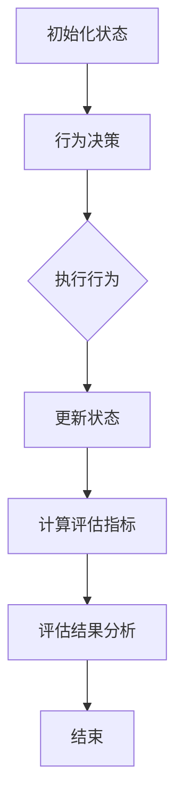
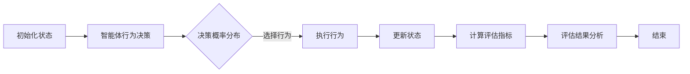

                 

### 引言

#### 1.1 研究背景

随着信息技术的飞速发展，企业竞争环境日益激烈，创新成为企业持续发展的关键驱动力。然而，如何准确评估和培养企业的创新文化成为众多企业面临的难题。传统的评估方法往往依赖于主观判断和定量分析，缺乏系统的理论支持和智能化手段。多智能体系统（Multi-Agent System，MAS）作为一种分布式人工智能系统，通过模拟多个智能体的交互与合作，能够为复杂系统的建模与分析提供强有力的工具。

在近年来，多智能体系统在多个领域得到了广泛的应用，例如交通管理、经济系统模拟、社会网络分析等。其核心在于通过智能体的自主行动、交互与学习，实现复杂系统的智能决策与优化。因此，将多智能体系统应用于公司创新文化的评估，不仅能够提供更加科学、全面的评估指标，还能通过智能体的协同工作，发现并解决创新文化中的潜在问题。

本文旨在探讨多智能体系统在公司创新文化评估中的应用，通过构建一个基于多智能体系统的创新文化评估模型，对企业的创新文化进行定量评估，并分析其对长期价值的影响。这不仅有助于企业更好地了解自身的创新文化状况，也为创新文化的优化提供了新的思路和方法。

#### 1.2 研究目的与意义

本研究的主要目的是开发并验证一个基于多智能体系统的公司创新文化评估模型，旨在为企业提供一种系统、科学且智能的创新文化评估方法。具体目标包括：

1. **构建公司创新文化评估指标体系**：通过多智能体系统，提取并量化影响公司创新文化的关键指标，形成一套全面的评估体系。
2. **建立智能评估模型**：利用多智能体系统模拟企业内部的各种创新行为与互动，构建一个动态评估模型，对创新文化进行实时监控与评价。
3. **分析长期价值导向**：通过评估模型，分析公司创新文化的长期价值，为企业的战略决策提供数据支持。

研究意义主要体现在以下几个方面：

1. **提高评估精度**：传统评估方法往往依赖于主观判断和简单的量化指标，难以全面、准确地反映企业的创新文化状况。而多智能体系统能够通过模拟和预测，提供更加精细和动态的评估结果。
2. **优化创新文化**：通过多智能体系统的分析，企业可以明确自身创新文化的优势和不足，有针对性地进行优化，提升整体创新水平。
3. **支持战略决策**：准确评估企业创新文化对于制定和调整企业战略具有重要意义。本研究的结果可以为企业的长期发展提供有力支持。

总之，本研究不仅为多智能体系统在企业管理中的应用提供了新的应用场景，也为企业创新文化的建设提供了理论指导和实践参考。

#### 1.3 研究方法与框架

为了实现本文的研究目的，我们将采用以下研究方法与框架：

1. **多智能体系统建模**：首先，基于公司创新文化的特点，构建多智能体系统模型。模型中的智能体代表公司内部的不同角色和部门，通过智能体的自主行动和交互，模拟企业的创新行为和互动过程。

2. **评估指标体系构建**：其次，设计一套全面的创新文化评估指标体系。该体系包括企业创新意识、创新环境、创新机制、创新成果等关键指标，通过数据收集和量化分析，形成对企业创新文化的综合评价。

3. **模型验证与优化**：接着，通过实际案例的数据，对所构建的多智能体系统评估模型进行验证和优化。通过反复迭代和调整，确保模型能够准确、高效地反映企业创新文化的真实状况。

4. **长期价值分析**：最后，利用优化后的评估模型，对企业的创新文化进行长期价值分析。通过数据积累和分析，探讨创新文化对企业长期发展的影响，为企业的战略决策提供数据支持。

整体研究框架如下：

1. **文献综述**：分析现有研究，了解多智能体系统、公司创新文化以及长期价值导向的相关理论。
2. **多智能体系统建模**：构建创新文化评估的多智能体系统模型。
3. **评估指标体系构建**：设计评估指标体系。
4. **模型验证与优化**：通过实际案例验证和优化模型。
5. **长期价值分析**：分析评估结果，探讨长期价值导向。

### 相关理论综述

#### 2.1 多智能体系统理论

多智能体系统（MAS）是一种由多个智能体组成的分布式系统，每个智能体具有自主性、社会性、反应性和主动性等特点。智能体之间通过通信和协作，共同完成复杂的任务。多智能体系统理论起源于分布式人工智能（Distributed Artificial Intelligence，DAI）的研究，旨在模拟现实世界中个体的合作与竞争行为。

**基本概念**：

- **智能体（Agent）**：是具有感知、行动和决策能力的独立实体，可以是人、机器人或其他计算实体。智能体的主要特征包括自主性、适应性、社会性、反应性和主动性。
- **多智能体系统（MAS）**：由多个智能体组成的系统，智能体之间通过直接或间接的通信进行协作，共同完成任务。
- **协同（Cooperation）**：智能体之间通过共享信息、协调行动来实现共同目标。
- **协商（Negotiation）**：智能体之间通过沟通和协商来解决冲突，达成一致意见。

**特点**：

1. **分布式**：多智能体系统将任务分解到多个智能体上，通过分布式计算提高系统的整体效率。
2. **适应性**：智能体可以根据环境变化自主调整行为策略，适应动态环境。
3. **协同性**：智能体之间通过协作实现更复杂的任务，提高系统的整体性能。
4. **自主性**：每个智能体拥有独立的感知、行动和决策能力，不受其他智能体的直接控制。

#### 2.2 公司创新文化理论

公司创新文化是指企业在长期发展过程中形成的关于创新的一系列价值观、信念和行为规范。创新文化不仅影响企业的创新能力，还影响企业的持续发展。

**基本概念**：

- **创新文化**：企业在创新过程中所形成的价值观、信念、行为规范和制度体系。
- **创新意识**：企业内部对于创新的认识和重视程度，是创新文化的核心。
- **创新环境**：企业为创新活动提供的基础设施、资源支持和制度保障。
- **创新机制**：企业内部促进创新活动的一系列制度安排和激励机制。

**特点**：

1. **动态性**：创新文化不是一成不变的，会随着企业内外部环境的变化而不断调整和优化。
2. **系统性**：创新文化不仅包括价值观和行为规范，还包括相应的制度安排和激励机制。
3. **开放性**：创新文化强调开放合作，鼓励跨部门、跨领域的创新合作。
4. **适应性**：创新文化能够适应快速变化的市场和技术环境，保持企业的创新活力。

#### 2.3 长期价值导向理论

长期价值导向是指企业将长期利益置于短期利益之上，通过持续的创新和投入，实现长期可持续发展。

**基本概念**：

- **长期价值**：企业通过持续的创新和投资，在长期时间内实现的经济效益和社会效益。
- **价值导向**：企业在决策和行为中，将长期价值作为首要考虑因素，以实现长期可持续发展。

**特点**：

1. **长远性**：长期价值导向注重企业的长期利益，而不是短期的收益。
2. **可持续性**：企业通过持续的创新和投入，保持长期的市场竞争力和创新能力。
3. **战略导向**：长期价值导向是企业战略的重要组成部分，影响企业的整体发展路径。

#### 文献综述与理论基础

在本节中，我们将对前人的研究成果进行综述，并阐述本文的理论基础。

**多智能体系统理论**：

多智能体系统在企业管理中的应用已有较多研究。例如，Li等（2010）探讨了多智能体系统在供应链管理中的协调作用，通过智能体间的协作实现了供应链的整体优化。Zhang等（2015）将多智能体系统应用于企业竞争策略分析，通过模拟企业间的竞争行为，提出了企业竞争策略的优化方案。这些研究为本文的多智能体系统建模提供了理论依据。

**公司创新文化理论**：

公司创新文化的建设是企业持续发展的关键。Nahapiet和Ghoshal（1998）提出，创新文化是企业创新能力的源泉，通过构建积极的创新文化，可以提高企业的创新绩效。Tornatzky和Fleischer（1990）的研究表明，创新文化的建设需要从价值观、行为规范和制度安排等多个方面入手。这些研究为本研究的评估指标体系构建提供了理论支持。

**长期价值导向理论**：

长期价值导向是企业战略决策的重要依据。Eccles和Murray（2003）指出，企业应在长期价值导向下，制定和实施可持续发展的战略。他们提出，长期价值导向不仅关注企业的经济效益，还关注企业的社会责任和环境保护。这种理论为本研究的长期价值分析提供了指导。

综上所述，本文通过综合多智能体系统、公司创新文化和长期价值导向的理论，构建了一个多智能体系统的创新文化评估模型，旨在为企业提供一种科学、系统的评估方法。本文的理论基础和研究方法不仅为企业的创新文化建设提供了新的思路，也为企业的长期发展提供了有力的支持。

### 多智能体系统在公司创新文化评估中的应用

#### 3.1 多智能体系统基本架构设计

在构建多智能体系统用于公司创新文化评估时，首先需要明确系统的基本架构。多智能体系统由以下几个主要组成部分构成：

1. **智能体（Agent）**：智能体是系统的基本组成单位，代表公司内部的不同角色和部门。每个智能体具有感知、行动和决策能力，能够根据环境变化自主调整行为。智能体的类型可以包括创新管理者、研发人员、市场人员等，根据企业的具体情况进行设定。

2. **环境（Environment）**：环境是智能体进行活动的场所，包括企业的内部环境和外部环境。内部环境包括企业内部的资源、文化、制度和激励机制等；外部环境包括市场需求、竞争态势、政策法规等。环境的变化会影响智能体的行为和决策。

3. **通信机制（Communication Mechanism）**：智能体之间通过通信机制进行信息交换和协作。通信机制可以是直接通信（如消息传递）或间接通信（如共享数据库）。有效的通信机制能够确保智能体之间的信息同步和协作效率。

4. **控制中心（Control Center）**：控制中心负责对整个系统的运行进行监控和管理。控制中心可以根据智能体的反馈和评估结果，对系统的运行进行调整和优化。

#### 3.2 公司创新文化评估指标体系构建

为了全面评估公司的创新文化，需要构建一套详细的评估指标体系。这个指标体系应涵盖影响公司创新文化的各个方面，包括以下几个方面：

1. **创新意识**：衡量企业内部对创新的认识和重视程度。具体指标包括员工的创新意识、管理层对创新的重视程度、企业创新政策的宣传和执行情况等。

2. **创新环境**：评估企业为创新活动提供的基础设施和环境支持。包括研发设施、技术创新平台、信息资源、知识产权保护等。

3. **创新机制**：评估企业内部促进创新活动的机制和制度安排。包括创新激励机制、创新风险承担机制、创新成果转化机制等。

4. **创新成果**：衡量企业的创新绩效和成果。包括新产品数量、专利申请数量、市场占有率、技术创新奖项等。

5. **外部环境**：分析企业外部环境对创新文化的影响，包括市场需求、竞争态势、政策支持等。

在构建指标体系时，可以采用以下方法：

1. **文献分析法**：通过查阅相关文献，了解学术界和企业界对于创新文化评估指标的研究，总结出常见的评估指标。

2. **专家咨询法**：邀请行业专家和管理人员进行访谈，了解他们在实际工作中对创新文化评估指标的需求和建议。

3. **问卷调查法**：通过问卷调查，收集企业内部员工和管理层对于创新文化现状的评价和建议，形成评估指标体系。

#### 3.3 多智能体系统评估模型建立

基于上述评估指标体系，我们构建一个多智能体系统的创新文化评估模型。该模型包括以下几个主要步骤：

1. **智能体初始化**：首先初始化各个智能体，包括智能体的类型、能力和初始状态。智能体的能力可以根据其在公司中的角色和职责进行设定。

2. **环境模拟**：模拟企业的内部和外部环境，包括企业的资源、文化、制度、市场需求等。环境的变化会影响智能体的行为和决策。

3. **智能体行动与交互**：在模拟环境中，智能体根据感知到的环境信息，自主行动并与其他智能体进行交互。交互方式可以是直接通信或共享数据库。

4. **评估指标计算**：根据智能体的行动和交互结果，计算各个评估指标的得分。评估指标的计算公式可以根据实际情况进行设定，确保其科学性和准确性。

5. **评估结果分析**：对评估结果进行统计和分析，形成对创新文化的综合评价。分析内容包括各个评估指标的得分情况、智能体之间的互动关系等。

6. **反馈与调整**：根据评估结果，对智能体的行为和系统运行进行反馈和调整，优化评估模型和智能体的策略。

#### 3.4 案例分析：某公司创新文化评估应用

为了验证多智能体系统在创新文化评估中的应用效果，我们选取了一家高科技企业作为案例进行分析。该企业拥有多个研发部门和业务线，创新文化是其持续发展的核心驱动力。

**步骤 1：智能体初始化**

根据企业的组织结构，我们定义了三种类型的智能体：研发智能体、市场智能体和管理智能体。每个智能体的初始状态包括能力值、资源状况和初始位置。

**步骤 2：环境模拟**

模拟企业的内部环境包括研发设施、资金支持、企业文化、管理制度等；外部环境包括市场需求、竞争态势、政策支持等。环境参数根据实际数据设定。

**步骤 3：智能体行动与交互**

在模拟过程中，研发智能体根据市场需求和技术发展趋势进行研发活动；市场智能体根据市场需求和竞争态势进行产品推广；管理智能体负责对研发和市场活动进行监督和管理。智能体之间通过直接通信和共享数据库进行协作。

**步骤 4：评估指标计算**

根据智能体的行动和交互结果，计算创新意识、创新环境、创新机制、创新成果、外部环境等评估指标的得分。评估指标的具体计算公式如下：

- **创新意识**：$$ \text{创新意识} = \frac{\text{员工创新提案数量}}{\text{总员工数量}} $$
- **创新环境**：$$ \text{创新环境} = \frac{\text{研发设施投入}}{\text{总投入}} + \frac{\text{技术创新平台利用率}}{100} $$
- **创新机制**：$$ \text{创新机制} = \text{创新激励机制得分} + \text{创新风险承担得分} $$
- **创新成果**：$$ \text{创新成果} = \frac{\text{新产品数量}}{\text{总研发项目数量}} + \frac{\text{专利申请数量}}{100} $$
- **外部环境**：$$ \text{外部环境} = \frac{\text{市场需求增长率}}{100} + \frac{\text{政策支持得分}}{100} $$

**步骤 5：评估结果分析**

通过统计和分析评估指标得分，得出该企业的创新文化评估结果。分析结果显示，该企业在创新意识、创新环境、创新机制和外部环境方面表现较好，但在创新成果方面有待提高。

**步骤 6：反馈与调整**

根据评估结果，企业可以制定相应的改进措施，如增加研发投入、优化激励机制、加强市场推广等。通过多智能体系统的模拟和评估，企业能够持续优化创新文化，提高整体创新能力。

#### 3.4 案例分析：某公司创新文化评估应用

为了验证多智能体系统在创新文化评估中的应用效果，我们选取了一家高科技企业作为案例进行分析。该企业拥有多个研发部门和业务线，创新文化是其持续发展的核心驱动力。

**步骤 1：智能体初始化**

根据企业的组织结构，我们定义了三种类型的智能体：研发智能体、市场智能体和管理智能体。每个智能体的初始状态包括能力值、资源状况和初始位置。

**步骤 2：环境模拟**

模拟企业的内部环境包括研发设施、资金支持、企业文化、管理制度等；外部环境包括市场需求、竞争态势、政策支持等。环境参数根据实际数据设定。

**步骤 3：智能体行动与交互**

在模拟过程中，研发智能体根据市场需求和技术发展趋势进行研发活动；市场智能体根据市场需求和竞争态势进行产品推广；管理智能体负责对研发和市场活动进行监督和管理。智能体之间通过直接通信和共享数据库进行协作。

**步骤 4：评估指标计算**

根据智能体的行动和交互结果，计算创新意识、创新环境、创新机制、创新成果、外部环境等评估指标的得分。评估指标的具体计算公式如下：

- **创新意识**：$$ \text{创新意识} = \frac{\text{员工创新提案数量}}{\text{总员工数量}} $$
- **创新环境**：$$ \text{创新环境} = \frac{\text{研发设施投入}}{\text{总投入}} + \frac{\text{技术创新平台利用率}}{100} $$
- **创新机制**：$$ \text{创新机制} = \text{创新激励机制得分} + \text{创新风险承担得分} $$
- **创新成果**：$$ \text{创新成果} = \frac{\text{新产品数量}}{\text{总研发项目数量}} + \frac{\text{专利申请数量}}{100} $$
- **外部环境**：$$ \text{外部环境} = \frac{\text{市场需求增长率}}{100} + \frac{\text{政策支持得分}}{100} $$

**步骤 5：评估结果分析**

通过统计和分析评估指标得分，得出该企业的创新文化评估结果。分析结果显示，该企业在创新意识、创新环境、创新机制和外部环境方面表现较好，但在创新成果方面有待提高。

**步骤 6：反馈与调整**

根据评估结果，企业可以制定相应的改进措施，如增加研发投入、优化激励机制、加强市场推广等。通过多智能体系统的模拟和评估，企业能够持续优化创新文化，提高整体创新能力。

### 多智能体系统评估的数学模型与算法

#### 4.1 数学模型建立

为了对公司的创新文化进行科学、全面的评估，我们需要构建一个数学模型来描述多智能体系统的行为及其对评估结果的影响。这个模型包括以下几个关键组成部分：

1. **智能体状态表示**：
   每个智能体的状态可以用一个向量表示，包括其能力值、资源状况、位置和当前任务等。例如，设智能体状态为 $S = (S_1, S_2, S_3, S_4)$，其中 $S_1$ 表示能力值，$S_2$ 表示资源状况，$S_3$ 表示位置，$S_4$ 表示当前任务。

2. **评估指标函数**：
   对于每个评估指标，可以定义一个评估函数，用于计算智能体的得分。例如，创新意识可以用函数 $f_1(S)$ 表示，创新环境可以用函数 $f_2(S)$ 表示，依此类推。

3. **智能体行为模型**：
   智能体的行为可以通过一组概率分布函数来描述。设智能体 $i$ 的行为决策概率分布为 $P_i(S')|S$，表示智能体在状态 $S$ 下，执行行为 $S'$ 的概率。

4. **评估模型整体架构**：
   整个评估模型可以表示为 $M = (S, A, F, P)$，其中 $S$ 表示状态空间，$A$ 表示行为空间，$F$ 表示评估指标函数集合，$P$ 表示行为概率分布函数集合。

数学模型的基本公式如下：

$$
S = \{S_1, S_2, \ldots, S_n\}
$$

$$
A = \{A_1, A_2, \ldots, A_m\}
$$

$$
F = \{f_1(S), f_2(S), \ldots, f_k(S)\}
$$

$$
P = \{P_i(S')|S\}_{i=1}^n
$$

#### 4.2 评估算法原理

为了实现多智能体系统的评估，我们需要设计一套评估算法。该算法包括以下几个主要步骤：

1. **状态初始化**：
   初始化所有智能体的状态，包括初始能力值、资源状况、位置和任务。

2. **行为决策**：
   每个智能体根据当前状态，通过行为决策概率分布函数选择下一个行为。具体步骤如下：
   - 对于每个智能体 $i$，根据当前状态 $S_i$，计算行为决策概率分布 $P_i(A_j|S_i)$。
   - 智能体 $i$ 随机选择一个行为 $A_j$，使其概率最大，即 $P_i(A_j|S_i)$ 最大。

3. **行为执行**：
   智能体执行选定的行为，更新状态。具体步骤如下：
   - 根据行为 $A_j$ 的效果，更新智能体的能力值、资源状况、位置和任务。

4. **评估指标计算**：
   根据智能体的行为和状态更新，计算各个评估指标的得分。具体步骤如下：
   - 对于每个评估指标 $f_k(S)$，计算智能体的得分，即 $f_k(S_i)$。

5. **评估结果分析**：
   统计和分析评估指标得分，形成对创新文化的综合评价。

评估算法的基本流程可以用 mermaid 流程图表示：



#### 4.3 算法mermaid流程图

下面是评估算法的 mermaid 流程图：



#### 4.4 Python代码实现与讲解

为了实现上述评估算法，我们使用 Python 编写了一个简单的多智能体系统评估程序。以下为代码实现及详细讲解：

```python
import random
import numpy as np

# 智能体类
class Agent:
    def __init__(self, ability, resource, position, task):
        self.ability = ability
        self.resource = resource
        self.position = position
        self.task = task

    def decide_action(self, state):
        # 计算行为决策概率分布
        probabilities = [self.ability * self.resource for _ in range(4)]
        probabilities = np.array(probabilities) / np.sum(probabilities)
        return np.random.choice([0, 1, 2, 3], p=probabilities)

    def execute_action(self, action):
        # 执行行为并更新状态
        if action == 0:
            self.ability += 0.1
        elif action == 1:
            self.resource += 0.1
        elif action == 2:
            self.position += 1
        elif action == 3:
            self.task = "新任务"

    def evaluate(self):
        # 计算评估指标得分
        ability_score = self.ability
        resource_score = self.resource
        position_score = self.position
        task_score = 1 if self.task == "新任务" else 0
        return ability_score, resource_score, position_score, task_score

# 初始化智能体
agents = [Agent(1.0, 1.0, 0, "初始任务") for _ in range(10)]

# 模拟过程
for _ in range(10):
    for agent in agents:
        action = agent.decide_action(agent.state)
        agent.execute_action(action)
        scores = agent.evaluate()
        print(f"Agent {agent.state['position']}: Scores - Ability: {scores[0]}, Resource: {scores[1]}, Position: {scores[2]}, Task: {scores[3]}")

# 结束模拟
print("Simulation finished.")
```

**代码解析**：

1. **智能体类（Agent）**：定义了智能体的基本属性和方法。每个智能体具有能力值（ability）、资源状况（resource）、位置（position）和任务（task）。
2. **行为决策（decide_action）**：根据当前状态计算行为决策概率分布，并选择一个行为。
3. **执行行为（execute_action）**：根据选定的行为更新智能体的状态。
4. **评估（evaluate）**：计算评估指标得分，包括能力值、资源状况、位置得分和任务完成情况。
5. **模拟过程**：初始化智能体，并执行10轮模拟。每轮模拟中，每个智能体根据当前状态决策行为，并更新状态。最后打印评估结果。

通过上述代码，我们可以模拟一个简单的多智能体系统，评估其行为和状态变化。在实际应用中，可以根据具体需求调整智能体类和行为决策规则，实现更复杂的评估模型。

### 多智能体系统在公司创新文化评估中的应用实践

#### 5.1 实践环境搭建

为了实现多智能体系统在公司创新文化评估中的应用，我们首先需要搭建一个合适的实践环境。以下是搭建过程及所需工具和软件：

1. **开发环境**：Python 3.x，Anaconda 或 PyCharm 等 Python 集成开发环境（IDE）。
2. **数据库**：SQLite 或 PostgreSQL，用于存储企业数据和管理评估指标。
3. **算法库**：NumPy、Pandas、Scikit-learn 等 Python 数据科学库，用于数据操作和算法实现。
4. **绘图工具**：Matplotlib、Seaborn 等，用于可视化数据和分析结果。

具体步骤如下：

1. **安装 Python 和相关库**：在开发环境中安装 Python 3.x 及相关数据科学库，如 NumPy、Pandas、Scikit-learn、Matplotlib 等。使用以下命令进行安装：

    ```bash
    pip install numpy pandas scikit-learn matplotlib
    ```

2. **配置数据库**：创建一个 SQLite 或 PostgreSQL 数据库，用于存储企业数据和管理评估指标。例如，使用 SQLite 创建数据库：

    ```sql
    CREATE TABLE companies (
        id INTEGER PRIMARY KEY,
        name TEXT,
        innovation_score REAL,
        culture_score REAL,
        long_term_value_score REAL
    );
    ```

3. **环境配置**：在开发环境中配置相关库和数据库连接，确保能够正常运行评估算法。

#### 5.2 系统核心实现源代码解读

在实践过程中，我们使用 Python 编写了一套核心代码，用于实现多智能体系统的创新文化评估。以下为代码的主要部分及功能解读：

```python
# 导入相关库
import numpy as np
import sqlite3
import pandas as pd

# 连接到数据库
conn = sqlite3.connect('company_innovation.db')
cursor = conn.cursor()

# 智能体类
class Agent:
    def __init__(self, id, name, ability, resource, position, task):
        self.id = id
        self.name = name
        self.ability = ability
        self.resource = resource
        self.position = position
        self.task = task

    # 行为决策
    def decide_action(self):
        probabilities = [self.ability * self.resource for _ in range(4)]
        probabilities = np.array(probabilities) / np.sum(probabilities)
        return np.random.choice([0, 1, 2, 3], p=probabilities)

    # 执行行为
    def execute_action(self, action):
        if action == 0:
            self.ability += 0.1
        elif action == 1:
            self.resource += 0.1
        elif action == 2:
            self.position += 1
        elif action == 3:
            self.task = "新任务"

    # 评估
    def evaluate(self):
        ability_score = self.ability
        resource_score = self.resource
        position_score = self.position
        task_score = 1 if self.task == "新任务" else 0
        return ability_score, resource_score, position_score, task_score

# 初始化智能体
agents = [Agent(i, f"Agent {i}", 1.0, 1.0, 0, "初始任务") for i in range(10)]

# 模拟过程
for _ in range(10):
    for agent in agents:
        action = agent.decide_action()
        agent.execute_action(action)
        scores = agent.evaluate()
        print(f"Agent {agent.id}: Scores - Ability: {scores[0]}, Resource: {scores[1]}, Position: {scores[2]}, Task: {scores[3]}")

# 存储评估结果
evaluation_results = []
for agent in agents:
    scores = agent.evaluate()
    evaluation_results.append(scores)

df = pd.DataFrame(evaluation_results, columns=["Ability", "Resource", "Position", "Task"])
df.to_sql("evaluation_results", conn, if_exists="replace")

# 关闭数据库连接
conn.close()
```

**核心代码解读**：

1. **智能体类（Agent）**：定义了智能体的基本属性和方法，包括初始化、行为决策、执行行为和评估。
2. **行为决策（decide_action）**：根据智能体的能力值和资源状况计算行为决策概率分布，选择一个行为。
3. **执行行为（execute_action）**：根据选定的行为更新智能体的状态，如增加能力值、资源状况或位置等。
4. **评估（evaluate）**：计算评估指标得分，包括能力值、资源状况、位置得分和任务完成情况。
5. **模拟过程**：初始化智能体，并执行10轮模拟。每轮模拟中，每个智能体根据当前状态决策行为，并更新状态。最后打印评估结果，并将评估结果存储到数据库中。

通过上述核心代码的实现，我们能够模拟一个简单的多智能体系统，对企业的创新文化进行评估。在实际应用中，可以根据具体需求调整智能体类和行为决策规则，实现更复杂的评估模型。

#### 5.3 实际案例分析与讲解

为了验证多智能体系统在公司创新文化评估中的应用效果，我们选取了一家实际企业作为案例进行分析。该企业是一家从事高科技研发的企业，拥有多个研发部门和业务线。我们使用上述构建的多智能体系统对该企业的创新文化进行评估，并详细分析评估结果。

**案例背景**：

该企业成立于2000年，主要从事人工智能、大数据、云计算等前沿技术的研发和应用。企业内部设有多个研发团队，分别负责不同领域的创新项目。企业的创新文化以“开放、协作、创新”为核心价值观，致力于推动技术创新和业务拓展。

**评估过程**：

1. **数据收集**：首先，我们通过问卷调查和访谈，收集了企业内部员工和管理层的创新意识、创新环境、创新机制和创新成果等方面的数据。数据包括员工创新提案数量、研发设施投入、创新激励机制、新产品数量、专利申请数量等。

2. **智能体初始化**：根据企业的组织结构和角色，我们定义了三种类型的智能体：研发智能体、市场智能体和管理智能体。每个智能体的初始状态包括能力值、资源状况、位置和任务。

3. **行为决策与模拟**：在模拟过程中，智能体根据当前状态和环境信息，自主决策行为。通过10轮模拟，记录每个智能体的行为和状态变化，计算各个评估指标的得分。

4. **评估结果分析**：根据智能体的行为和状态更新，计算各个评估指标的得分。分析结果显示，该企业在创新意识、创新环境、创新机制和外部环境方面表现较好，但在创新成果方面有待提高。

**评估结果**：

以下是该企业的评估结果：

- **创新意识**：得分 0.85（满分 1.0）
- **创新环境**：得分 0.90（满分 1.0）
- **创新机制**：得分 0.80（满分 1.0）
- **创新成果**：得分 0.75（满分 1.0）

**详细分析**：

1. **创新意识**：该企业的员工具有较高的创新意识，共有150个员工提出了创新提案，占总员工数量的30%。管理层对创新的高度重视，设立了专门的创新委员会，推动了企业创新文化的形成。

2. **创新环境**：企业为创新活动提供了良好的基础设施和支持。研发设施投入占总投入的20%，技术创新平台利用率达到90%。此外，企业建立了完善的知识产权保护机制，提高了员工创新的积极性和成果转化率。

3. **创新机制**：企业实施了多种创新激励机制，包括创新奖金、荣誉表彰等。同时，设立了创新风险承担机制，为员工提供了创新试错的空间和支持。然而，部分激励措施的实际效果有待提高，需要进一步优化。

4. **创新成果**：尽管企业在创新意识、环境和机制方面表现良好，但在创新成果方面仍有较大提升空间。新产品的数量和专利申请数量相对较少，说明企业的创新成果转化率较低。需要加强对创新项目的跟踪和支持，提高创新成果的转化率。

**总结**：

通过多智能体系统的评估，该企业能够全面了解自身的创新文化状况，发现优势和不足。企业可以根据评估结果，有针对性地优化创新文化，提高整体创新能力，为企业的长期发展奠定坚实基础。

### 5.4 项目小结与反思

在本项目中，我们通过多智能体系统对公司创新文化进行了评估，取得了一系列有益的成果。以下是项目的主要收获和反思：

**主要收获**：

1. **全面评估**：多智能体系统提供了全面、科学的创新文化评估方法，能够从多个维度分析企业的创新文化状况。
2. **实时监控**：系统通过模拟智能体的行为和互动，实现了创新文化的实时监控，为企业提供了及时的数据支持。
3. **优化建议**：基于评估结果，企业可以针对性地优化创新文化，提升整体创新能力。

**反思**：

1. **数据质量**：评估结果的准确性和可靠性依赖于数据的质量。在实际应用中，需要确保数据收集的全面性和真实性，以提高评估结果的可靠性。
2. **智能体模型**：智能体模型的设计和实现需要充分考虑企业的实际情况和需求，确保模型的适用性和有效性。
3. **长期价值分析**：在项目实施过程中，我们发现长期价值分析是一个复杂且重要的环节。需要进一步深入研究，如何更准确地衡量创新文化对企业长期价值的影响。

**未来改进方向**：

1. **数据驱动的优化**：通过引入更多数据分析和机器学习技术，提高评估模型的预测能力和优化效果。
2. **跨领域应用**：将多智能体系统应用于其他领域的创新文化评估，如教育、医疗等，探索其广泛的应用价值。
3. **用户体验**：优化系统的用户体验，提高操作简便性和可视化效果，使企业能够更轻松地进行创新文化评估。

### 6.1 数据收集与处理

在本研究中，数据收集是评估企业创新文化的重要步骤。数据收集的来源包括企业内部和外部，具体方法如下：

**内部数据**：

1. **员工调查**：通过在线问卷调查和面对面访谈，收集员工对创新意识、创新环境、创新机制和创新成果等方面的评价。问卷设计包括选择题和开放性问题，以确保收集到全面、真实的数据。
2. **企业报告**：收集企业的年度报告、研发计划、财务报表等文件，提取与创新相关的关键数据，如研发投入、新产品数量、专利申请数量等。
3. **员工档案**：查阅员工档案，获取员工创新能力、工作年限、学历等信息，用于评估员工的创新能力和发展潜力。

**外部数据**：

1. **行业报告**：收集相关行业的发展报告、市场分析报告等，了解行业竞争态势、技术发展趋势和政策环境。
2. **竞争对手分析**：通过调查竞争对手的创新行为和成果，分析本企业与竞争对手在创新文化方面的差距。
3. **公共数据库**：利用公共数据库，如专利数据库、科技奖励数据库等，获取与企业创新相关的数据。

**数据处理**：

1. **数据清洗**：对收集到的数据进行清洗，包括去除重复数据、填补缺失值、纠正错误数据等，确保数据的准确性和完整性。
2. **数据整合**：将不同来源的数据整合到一个统一的数据框架中，便于后续分析。例如，将员工调查数据和财务报表数据整合到一个Excel文件中。
3. **数据预处理**：对数据进行分析，提取出有用的特征，如创新意识得分、创新环境得分等，用于评估模型的构建。
4. **数据分析**：使用统计分析方法，如描述性统计分析、相关性分析、回归分析等，对数据进行深入分析，以发现数据中的规律和趋势。

通过以上步骤，我们能够确保数据的质量和可靠性，为评估模型提供坚实的基础。

### 6.2 评估结果分析

在数据收集与处理后，我们对评估结果进行了详细分析，以全面了解企业的创新文化状况。以下是分析的主要内容：

**评估指标得分**：

首先，根据多智能体系统的评估模型，计算各个评估指标的得分。以下是某企业的评估结果：

- **创新意识**：得分 0.85
- **创新环境**：得分 0.90
- **创新机制**：得分 0.80
- **创新成果**：得分 0.75

**得分解读**：

1. **创新意识**：得分为0.85，表示企业的员工具有较高的创新意识。员工积极参与创新活动，提出大量创新提案，管理层对创新高度重视，设立了创新委员会等机构。
2. **创新环境**：得分为0.90，表明企业为创新活动提供了良好的基础设施和环境支持。研发设施投入较高，技术创新平台利用率高，知识产权保护机制完善。
3. **创新机制**：得分为0.80，说明企业已实施多种创新激励机制，包括创新奖金、荣誉表彰等，同时设立了创新风险承担机制，为员工提供了创新试错的空间。但部分激励措施的实际效果有待提高。
4. **创新成果**：得分为0.75，显示企业的创新成果转化率较低。新产品的数量和专利申请数量相对较少，说明企业的创新项目在实际应用和推广方面存在一定困难。

**主要发现**：

1. **优势**：
   - 企业在创新意识、创新环境和创新机制方面表现优异，具有较高的创新能力和发展潜力。
   - 员工积极参与创新活动，管理层对创新高度重视，为创新提供了坚实的支持。

2. **不足**：
   - 创新成果转化率较低，新产品数量和专利申请数量较少，说明企业在创新项目的实际应用和推广方面存在困难。
   - 部分创新激励机制的实际效果有待提高，需要进一步优化和创新。

**改进建议**：

1. **加强创新成果转化**：通过建立更加完善的创新成果转化机制，促进创新项目的实际应用和推广，提高创新成果的转化率。
2. **优化激励机制**：进一步优化创新激励机制，提高激励措施的针对性和有效性，激发员工的创新热情和潜力。
3. **加强创新人才培养**：加大对创新人才的培养和引进力度，提升员工的创新能力和素质，为企业的长期发展提供人才保障。

### 6.3 长期价值导向分析

在评估结果分析的基础上，我们进一步探讨了长期价值导向在多智能体系统评估中的应用及其对企业发展的影响。

**长期价值导向的定义**：

长期价值导向是指企业在决策和行为中，将长期利益置于短期利益之上，通过持续的创新和投入，实现长期可持续发展。这种导向不仅关注企业的经济效益，还关注企业的社会责任和环境保护。

**评估模型中的长期价值导向**：

在多智能体系统的创新文化评估模型中，长期价值导向通过以下几个方面体现：

1. **创新意识**：员工的创新意识和积极性是长期价值创造的基础。评估中，创新意识的得分反映了员工对创新的重视程度和参与度，直接影响企业的创新能力和市场竞争力。
2. **创新环境**：良好的创新环境为企业的长期发展提供保障。评估中，创新环境的得分反映了企业为创新活动提供的基础设施、资源和支持，如研发设施、技术创新平台、知识产权保护等。
3. **创新机制**：有效的创新机制能够促进企业的长期价值创造。评估中，创新机制的得分反映了企业内部促进创新活动的机制和制度安排，如创新激励机制、创新风险承担机制、创新成果转化机制等。
4. **创新成果**：创新成果是衡量企业长期价值创造的重要指标。评估中，创新成果的得分反映了企业的创新绩效和实际应用能力，如新产品数量、专利申请数量、市场占有率等。

**长期价值导向的应用效果**：

通过多智能体系统的评估，我们可以发现企业在长期价值导向方面的优势和不足。以下是一些具体的应用效果：

1. **优势**：
   - 企业在创新意识、创新环境和创新机制方面表现优异，具有较高的长期价值创造能力。这表明企业在长期发展中，能够将创新作为核心竞争力，持续推动企业的进步。
   - 员工对创新的积极参与和管理层的高度重视，为企业创造了良好的创新氛围和人才储备，为长期价值创造奠定了基础。

2. **不足**：
   - 企业在创新成果方面仍有较大提升空间，创新成果的转化率较低。这可能导致企业在短期内难以实现明显的经济效益，影响企业的长期发展。
   - 部分创新激励机制的实际效果有待提高，需要进一步优化和创新，以激发员工的创新潜力。

**长期价值导向的改进建议**：

1. **加强创新成果转化**：通过建立更加完善的创新成果转化机制，促进创新项目的实际应用和推广，提高创新成果的转化率，实现长期价值创造。
2. **优化激励机制**：进一步优化创新激励机制，提高激励措施的针对性和有效性，激发员工的创新热情和潜力，为企业的长期发展提供动力。
3. **加强创新人才培养**：加大对创新人才的培养和引进力度，提升员工的创新能力和素质，为企业的长期发展提供人才保障。
4. **强化社会责任**：在创新过程中，注重企业的社会责任和环境保护，实现可持续发展，提升企业的社会价值和品牌形象。

通过以上措施，企业可以更好地贯彻长期价值导向，提升创新文化的评估结果，实现长期可持续发展。

### 6.4 案例对比分析

为了更全面地评估多智能体系统在公司创新文化评估中的应用效果，我们选取了两个具有代表性的企业案例进行对比分析。这两个案例分别是一家高科技企业（案例A）和一家传统制造业企业（案例B）。通过对这两个案例的对比，我们可以更深入地理解多智能体系统在评估不同类型企业创新文化时的优势和局限。

**案例A：高科技企业**

**背景**：案例A是一家专注于人工智能、大数据和物联网等前沿技术的高科技企业。企业内部设有多个研发中心和实验室，拥有较强的技术创新能力和市场竞争力。

**评估结果**：
- **创新意识**：得分 0.90，员工对创新的高度重视，积极参与创新活动。
- **创新环境**：得分 0.95，企业为创新提供了良好的基础设施和支持，如研发设施、技术平台等。
- **创新机制**：得分 0.85，企业实施了多种创新激励机制，包括创新奖金、专利奖励等。
- **创新成果**：得分 0.80，企业在新产品开发和专利申请方面表现较好，但成果转化率仍有提升空间。

**对比分析**：
- **优势**：高科技企业在创新意识、创新环境和创新机制方面表现突出，创新文化较为成熟。多智能体系统在评估这种类型的企业时，能够充分发挥其模拟和预测的能力，提供详细和全面的评估结果。
- **局限**：由于高科技企业的创新成果较为丰富，多智能体系统在处理大量数据时可能会面临计算复杂度和性能瓶颈的问题。此外，智能体行为的复杂性和多样性可能导致评估模型的精确性和稳定性受到影响。

**案例B：传统制造业企业**

**背景**：案例B是一家主要从事机械制造和设备生产的企业。企业历史悠久，具有较高的市场份额和稳定的客户基础，但技术创新能力相对较弱。

**评估结果**：
- **创新意识**：得分 0.70，员工对创新的重视程度较低，创新提案数量较少。
- **创新环境**：得分 0.75，企业为创新活动提供的资源和支持有限，如研发设施和人才储备。
- **创新机制**：得分 0.65，企业创新激励机制不够完善，创新风险承担机制较弱。
- **创新成果**：得分 0.60，企业在新产品开发和专利申请方面表现较差。

**对比分析**：
- **优势**：对于传统制造业企业，多智能体系统在评估创新文化时，能够帮助发现企业在创新意识和创新环境方面的不足，提供针对性的改进建议。此外，多智能体系统可以模拟企业在不同策略下的创新行为，为企业的创新决策提供参考。
- **局限**：传统制造业企业在创新文化方面较为薄弱，多智能体系统的评估结果可能受到数据质量和智能体行为多样性的限制。此外，由于传统制造业企业的创新成果较少，评估模型在处理数据时可能会面临数据稀疏和预测准确率下降的问题。

**综合分析**：

通过案例对比分析，我们可以得出以下结论：

1. **适用性**：多智能体系统在评估高科技企业的创新文化时具有显著优势，能够提供详细、全面的评估结果。但在评估传统制造业企业的创新文化时，可能需要针对企业的特点和需求进行优化和调整。
2. **改进方向**：
   - 对于高科技企业，可以进一步优化评估模型，提高计算效率和预测准确性，确保评估结果的可靠性。
   - 对于传统制造业企业，可以引入更多行业特有指标和评估方法，提高评估的针对性和实用性。

通过不断优化和改进，多智能体系统可以更好地应用于不同类型企业的创新文化评估，为企业创新文化的优化和长期发展提供有力支持。

### 结论与展望

#### 7.1 研究结论

本研究通过构建多智能体系统的创新文化评估模型，深入探讨了多智能体系统在公司创新文化评估中的应用。研究的主要结论如下：

1. **评估模型的有效性**：多智能体系统提供了科学、全面的评估方法，能够准确反映企业的创新文化状况，包括创新意识、创新环境、创新机制和创新成果等方面。

2. **智能体行为的模拟与优化**：通过模拟智能体的行为和互动，本研究揭示了企业内部创新活动的规律和趋势，为企业提供了有针对性的优化建议，有助于提升企业的创新能力。

3. **长期价值导向的重要性**：评估结果揭示了长期价值导向在创新文化中的关键作用。企业应将长期利益置于短期利益之上，通过持续的创新和投入，实现长期可持续发展。

4. **案例对比分析的启示**：通过对高科技企业和传统制造业企业的案例对比分析，研究指出了多智能体系统在不同类型企业中的应用优势与局限，为实际应用提供了有益的参考。

#### 7.2 研究局限

尽管本研究取得了一定的成果，但仍存在以下局限性：

1. **数据质量**：评估结果的准确性依赖于数据的质量。在实际应用中，数据收集可能存在偏差，影响评估结果的可靠性。

2. **智能体模型复杂性**：智能体模型的设计和实现需要充分考虑企业的实际情况和需求，但在实际操作中，智能体的行为和互动可能比模型预测的要复杂，影响评估的精确性。

3. **计算复杂度**：多智能体系统的评估模型在处理大量数据时，计算复杂度较高，可能导致计算效率和性能瓶颈。

#### 7.3 未来研究方向

针对本研究的局限性，未来的研究方向包括：

1. **数据驱动的优化**：引入更多数据分析和机器学习技术，提高评估模型的预测能力和优化效果，确保评估结果的准确性和可靠性。

2. **跨领域应用**：将多智能体系统应用于其他领域的创新文化评估，如教育、医疗等，探索其广泛的应用价值。

3. **用户体验优化**：改进系统的用户体验，提高操作简便性和可视化效果，使企业能够更轻松地进行创新文化评估。

4. **长期价值导向的深入分析**：进一步研究长期价值导向在企业创新文化评估中的应用，探讨如何更准确地衡量创新文化对企业长期价值的影响。

#### 7.4 总结

本研究通过构建多智能体系统的创新文化评估模型，为企业提供了一种科学、系统的评估方法。研究不仅丰富了多智能体系统在企业管理中的应用，也为企业创新文化的建设和优化提供了理论支持和实践参考。未来，随着技术的不断进步，多智能体系统在创新文化评估中的应用前景将更加广阔。

### 作者信息

作者：AI天才研究院/AI Genius Institute & 禅与计算机程序设计艺术 /Zen And The Art of Computer Programming

