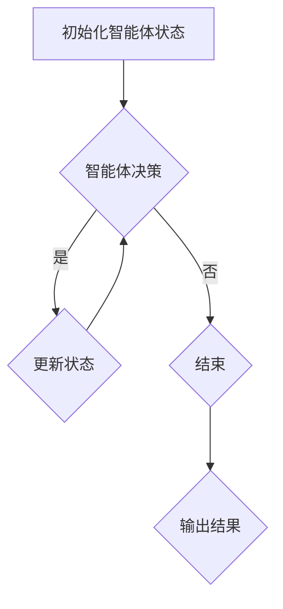

                 

# 多智能体系统在公司创新生态系统评估中的应用

## 关键词
多智能体系统，公司创新生态系统，协同创新，知识共享，风险控制，评估方法

## 摘要
本文旨在探讨多智能体系统在公司创新生态系统评估中的应用。首先，介绍了多智能体系统的基础概念、核心特征及分类，分析了其研究领域与应用场景。随后，详细阐述了公司创新生态系统的概念、结构、功能及挑战与应对策略。接着，探讨了多智能体系统在公司创新生态系统中的应用模式，包括协同创新、知识共享和风险控制。最后，介绍了多智能体系统在公司创新生态系统评估中的基础方法、实现技术以及实际案例分析，总结了最佳实践和未来发展趋势。

## 目录大纲

### 第一部分：多智能体系统概述

#### 第1章：多智能体系统的基础概念

1.1 问题背景与定义  
1.1.1 问题背景  
1.1.2 多智能体系统的定义  
1.1.3 多智能体系统与人工智能的关系

1.2 多智能体系统的核心特征  
1.2.1 独立性  
1.2.2 合作性  
1.2.3 自适应性  
1.2.4 并行性

1.3 多智能体系统的类别  
1.3.1 同质多智能体系统  
1.3.2 异质多智能体系统  
1.3.3 基于通信的多智能体系统  
1.3.4 基于学习的多智能体系统

1.4 多智能体系统的研究领域与应用场景  
1.4.1 研究领域概述  
1.4.2 应用场景探讨  
1.4.3 发展趋势分析

1.5 本章小结

### 第二部分：公司创新生态系统分析

#### 第2章：公司创新生态系统的概念与结构

2.1 创新生态系统的定义  
2.1.1 创新生态系统的内涵  
2.1.2 创新生态系统的外延

2.2 创新生态系统的结构  
2.2.1 核心要素  
2.2.2 子系统关系  
2.2.3 动力机制

2.3 创新生态系统的功能  
2.3.1 创新资源的整合与利用  
2.3.2 创新过程的优化与加速  
2.3.3 创新成果的转化与扩散

2.4 创新生态系统的挑战与应对策略  
2.4.1 挑战分析  
2.4.2 应对策略探讨

2.5 本章小结

### 第三部分：多智能体系统在公司创新生态系统中的应用

#### 第3章：多智能体系统在公司创新生态系统中的应用模式

3.1 应用模式概述  
3.1.1 多智能体系统在创新生态系统中的角色  
3.1.2 多智能体系统在创新生态系统中的任务分配

3.2 模式一：协同创新  
3.2.1 协同创新的概念与原理  
3.2.2 协同创新的案例解析

3.3 模式二：知识共享  
3.3.1 知识共享的概念与原理  
3.3.2 知识共享的案例分析

3.4 模式三：风险控制  
3.4.1 风险控制的概念与原理  
3.4.2 风险控制的案例解析

3.5 本章小结

### 第四部分：多智能体系统在公司创新生态系统中评估的方法与工具

#### 第4章：多智能体系统评估的基础方法

4.1 评估方法概述  
4.1.1 评估指标的选取  
4.1.2 评估方法的分类

4.2 常见评估指标  
4.2.1 创新能力指标  
4.2.2 生态效率指标  
4.2.3 稳健性指标

4.3 评估方法的应用  
4.3.1 定量评估方法  
4.3.2 定性评估方法  
4.3.3 混合评估方法

4.4 本章小结

#### 第5章：多智能体系统的实现技术

5.1 技术框架概述  
5.1.1 多智能体系统的架构设计  
5.1.2 多智能体系统的通信机制

5.2 算法原理讲解  
5.2.1 多智能体学习的算法原理  
5.2.2 多智能体协同算法的原理  
5.2.3 多智能体系统的决策算法

5.3 数学模型与公式讲解  
5.3.1 多智能体系统的数学模型  
5.3.2 多智能体系统的公式推导

5.4 算法流程图与代码实现  
5.4.1 算法流程图  
5.4.2 Python代码实现

5.5 本章小结

### 第五部分

...

### 第一部分：多智能体系统概述

#### 第1章：多智能体系统的基础概念

### 1.1 问题背景与定义

#### 1.1.1 问题背景

在现代社会，创新已经成为企业竞争力的关键。为了在竞争激烈的市场中生存和发展，企业需要不断进行技术创新和商业模式创新。然而，创新并非易事，它涉及到多方面的因素，如人才、资源、流程等。在这个背景下，多智能体系统（Multi-Agent Systems, MAS）作为一种先进的技术手段，被越来越多地应用于公司创新生态系统的构建和评估中。

多智能体系统是一组相互独立的智能体通过协作、竞争和交互来实现共同目标的一种系统。这些智能体可以是计算机程序、机器人或者人，它们通过通信和协作来完成复杂的任务。多智能体系统的核心在于“智能体”，即具有自主性、适应性、协作性和通信能力的实体。

#### 1.1.2 多智能体系统的定义

多智能体系统（MAS）是一种分布式计算模型，由一组相互合作的智能体组成。这些智能体具有以下特征：

1. **自治性**：每个智能体都能够独立决策，并执行相应的行动。
2. **社会性**：智能体之间能够通过通信进行交互，协同完成任务。
3. **适应性**：智能体能够根据环境和任务的变化进行调整。
4. **并发性**：智能体可以并行执行任务，提高系统的效率。

多智能体系统的定义可以简单概括为：一组具有自治性、社会性、适应性和并发性的智能体通过协作、竞争和交互来共同实现特定目标。

#### 1.1.3 多智能体系统与人工智能的关系

多智能体系统（MAS）与人工智能（AI）有着紧密的联系。AI 技术为多智能体系统提供了智能决策和自适应能力，使得智能体能够更加智能地执行任务。同时，多智能体系统为 AI 技术提供了大规模分布式计算和协作的舞台，使得 AI 技术能够应用于更加复杂和多样的场景。

具体来说，多智能体系统与人工智能的关系可以从以下几个方面来理解：

1. **AI 技术为 MAS 提供智能决策支持**：通过机器学习、深度学习等技术，智能体能够从数据中学习并做出智能决策，提高系统的适应性和效率。
2. **MAS 为 AI 技术提供协作环境**：在多智能体系统中，多个智能体可以协同工作，共同完成任务，这为 AI 技术的应用提供了新的场景和挑战。
3. **MAS 与 AI 的融合**：随着技术的不断发展，MAS 和 AI 将越来越紧密地融合在一起，形成一种新型的智能系统。

### 1.2 多智能体系统的核心特征

多智能体系统的核心特征包括独立性、合作性、适应性和并行性。这些特征使得多智能体系统能够在复杂环境中高效地完成任务。

#### 1.2.1 独立性

独立性是智能体最基本的特点之一。每个智能体都具有自己的决策能力和执行能力，能够独立完成特定任务。这种独立性使得智能体能够在不同的环境中自主行动，不受其他智能体的约束。

独立性对于多智能体系统具有重要意义。首先，它能够提高系统的容错性，当一个智能体出现问题时，其他智能体仍然可以继续工作。其次，它能够提高系统的效率，智能体可以根据自身能力和环境变化进行自主决策，避免了集中式决策的瓶颈问题。

#### 1.2.2 合作性

合作性是智能体之间相互协作的能力。在多智能体系统中，多个智能体需要相互合作，共同完成复杂任务。这种合作性不仅体现在任务分配和执行上，还体现在信息共享和决策制定上。

合作性对于多智能体系统至关重要。首先，它能够提高系统的效率和灵活性，多个智能体可以分工合作，提高整体任务完成的效率。其次，它能够增强系统的适应性，智能体之间可以相互学习，调整策略，以适应不断变化的环境。

#### 1.2.3 自适应性

适应性是指智能体根据环境和任务的变化进行自适应调整的能力。在多智能体系统中，环境和任务往往是动态变化的，智能体需要具备快速适应变化的能力，以保证系统的稳定性和有效性。

适应性对于多智能体系统具有重要意义。首先，它能够提高系统的鲁棒性，使得系统在面临不确定性和变化时能够保持稳定。其次，它能够提高系统的灵活性，智能体可以根据环境变化调整自身行为，以实现更好的任务完成效果。

#### 1.2.4 并行性

并行性是指多个智能体可以同时执行任务的能力。在多智能体系统中，智能体之间可以通过并行计算来提高系统的效率和处理能力。

并行性对于多智能体系统具有重要意义。首先，它能够提高系统的处理速度，多个智能体可以同时处理不同的任务，缩短任务完成时间。其次，它能够提高系统的可靠性，当一个智能体出现问题时，其他智能体可以继续工作，保证系统的稳定性。

### 1.3 多智能体系统的类别

多智能体系统根据不同的分类标准，可以分为不同的类别。以下介绍几种常见的多智能体系统类别。

#### 1.3.1 同质多智能体系统

同质多智能体系统是指由相同类型的智能体组成的系统。这些智能体具有相同的结构、能力和行为模式，它们之间的交互主要是基于共享的知识库和通信协议。

同质多智能体系统的优点在于结构简单、易于实现。然而，由于智能体之间的差异较小，同质多智能体系统在面对复杂任务时，可能缺乏足够的灵活性和适应性。

#### 1.3.2 异质多智能体系统

异质多智能体系统是指由不同类型的智能体组成的系统。这些智能体具有不同的结构、能力和行为模式，它们之间的交互需要通过协商和协作来实现。

异质多智能体系统的优点在于能够充分利用不同类型智能体的优势，提高系统的整体性能。然而，由于智能体之间的差异较大，异质多智能体系统的设计和实现相对复杂。

#### 1.3.3 基于通信的多智能体系统

基于通信的多智能体系统是指智能体之间主要通过通信进行交互的系统。这些智能体可以分布在不同的计算节点上，通过通信网络实现协同工作。

基于通信的多智能体系统的优点在于能够实现分布式计算和协作，提高系统的效率和灵活性。然而，由于通信延迟和带宽限制，基于通信的多智能体系统在处理实时任务时可能面临挑战。

#### 1.3.4 基于学习的多智能体系统

基于学习的多智能体系统是指智能体通过机器学习和深度学习等技术进行自我学习和优化的系统。这些智能体可以从数据中学习规律，并根据环境变化调整自身行为。

基于学习的多智能体系统的优点在于能够提高智能体的自适应性和灵活性，使其能够更好地应对复杂和动态的环境。然而，由于学习和优化过程需要大量的计算资源和数据支持，基于学习的多智能体系统的设计和实现也相对复杂。

### 1.4 多智能体系统的研究领域与应用场景

多智能体系统作为一种先进的技术手段，在多个研究领域和应用场景中取得了显著成果。以下介绍多智能体系统的研究领域和应用场景。

#### 1.4.1 研究领域概述

多智能体系统的研究领域主要包括以下几个方面：

1. **智能体建模与仿真**：研究智能体的行为模式、结构和能力，以及智能体之间的交互机制。
2. **协同与决策**：研究智能体之间的协作策略、决策模型和算法，以及如何在分布式环境下实现高效决策。
3. **自适应与学习**：研究智能体如何根据环境和任务的变化进行自适应调整和自我优化。
4. **通信与网络**：研究智能体之间的通信机制、通信协议和网络结构，以及如何保证通信的可靠性和效率。

#### 1.4.2 应用场景探讨

多智能体系统在多个应用场景中具有广泛的应用前景，主要包括以下几个方面：

1. **智能交通系统**：利用多智能体系统实现车辆的自适应调度和路径规划，提高交通效率和安全性。
2. **智能电网**：利用多智能体系统实现电力系统的自适应调度和管理，提高电力资源的利用效率和可靠性。
3. **智能制造**：利用多智能体系统实现生产过程中的协同制造和自适应优化，提高生产效率和产品质量。
4. **智能医疗**：利用多智能体系统实现医疗信息的共享和协同诊断，提高医疗服务的质量和效率。

#### 1.4.3 发展趋势分析

随着技术的不断进步和应用需求的不断增长，多智能体系统在以下方面具有广阔的发展前景：

1. **异构智能体系统的融合**：结合不同类型的智能体，实现更高效、更灵活的协同工作。
2. **增强学习与智能体系统的结合**：利用增强学习技术，实现智能体的自我学习和优化，提高系统的适应性和灵活性。
3. **云计算与智能体系统的结合**：利用云计算平台提供计算资源和数据支持，实现大规模、分布式智能体系统的构建和应用。
4. **多智能体系统与其他 AI 技术的融合**：结合其他 AI 技术如深度学习、强化学习等，实现更智能化、更高效的多智能体系统。

### 1.5 本章小结

本章对多智能体系统进行了概述，包括其定义、核心特征、类别以及研究领域和应用场景。多智能体系统作为一种先进的技术手段，具有独立性、合作性、适应性和并行性等核心特征，能够在多个领域和应用场景中发挥重要作用。随着技术的不断发展，多智能体系统在异构智能体系统、增强学习、云计算等方面具有广阔的发展前景。

### 第二部分：公司创新生态系统分析

#### 第2章：公司创新生态系统的概念与结构

2.1 创新生态系统的定义

创新生态系统是指由一系列相互关联的元素组成的系统，这些元素包括企业、大学、研究机构、政府、投资者、供应商、客户等。创新生态系统强调不同主体之间的互动和协作，通过资源的共享、知识的外溢、协同创新等机制，推动创新过程的优化和加速，从而实现创新成果的转化与扩散。

2.1.1 创新生态系统的内涵

创新生态系统的内涵主要包括以下几个方面：

1. **多样性**：创新生态系统中的参与者具有多样性，包括不同类型的企业、大学、研究机构等，它们在知识、技能、资源等方面各具特色，能够为创新提供丰富的资源和动力。

2. **协作性**：创新生态系统中的参与者通过协作和合作，共同推进创新过程。协作可以是企业之间的合作，也可以是企业与大学、研究机构、政府等之间的合作。

3. **开放性**：创新生态系统具有开放性，参与者之间能够实现知识、资源、信息等的自由流动，从而推动创新活动的开展。

4. **动态性**：创新生态系统是一个动态演化的系统，随着环境的变化和参与者的调整，创新生态系统的结构和功能也会发生变化。

2.1.2 创新生态系统的外延

创新生态系统的外延主要包括以下几个方面：

1. **创新环境**：创新生态系统需要一定的环境支持，包括政策环境、市场环境、金融环境等。良好的创新环境能够为创新活动提供必要的保障和支持。

2. **创新网络**：创新生态系统中的参与者通过构建创新网络，实现资源的共享和协同创新。创新网络可以是地域性的，也可以是行业性的，甚至是全球性的。

3. **创新平台**：创新生态系统中的平台为创新活动的开展提供支持，包括技术平台、服务平台、交易平台等。

4. **创新资源**：创新生态系统中的资源包括知识、人才、资金、技术等，这些资源是创新活动的重要支撑。

2.2 创新生态系统的结构

创新生态系统的结构可以分为以下几个层次：

1. **基础层**：基础层主要包括创新资源，如知识、人才、资金、技术等。这些资源是创新活动的基础和支撑。

2. **中间层**：中间层主要包括创新网络和创新平台。创新网络连接创新生态系统中的各个参与者，实现资源的共享和协同创新。创新平台为创新活动的开展提供支持和服务。

3. **顶层**：顶层主要包括创新主体，如企业、大学、研究机构、政府等。这些创新主体在创新生态系统中扮演着关键角色，推动创新活动的开展。

2.3 创新生态系统的功能

创新生态系统具有以下几个功能：

1. **整合与利用资源**：创新生态系统通过整合和利用各种资源，为创新活动提供支持。包括知识资源的整合、人力资源的整合、资金资源的整合等。

2. **优化与加速创新过程**：创新生态系统通过优化和创新过程，提高创新效率。包括创新流程的优化、创新方法的创新等。

3. **转化与扩散创新成果**：创新生态系统通过转化与扩散创新成果，实现创新价值的最大化。包括创新成果的转化、创新成果的扩散等。

2.4 创新生态系统的挑战与应对策略

创新生态系统在发展过程中面临着一系列挑战，主要包括以下几个方面：

1. **资源稀缺**：创新活动需要大量的资源支持，但资源往往有限。如何有效地整合和利用资源是创新生态系统面临的一个挑战。

2. **协调困难**：创新生态系统中的参与者多样，协调和合作难度较大。如何实现不同参与者之间的协调和合作，是创新生态系统面临的一个挑战。

3. **信息不对称**：创新生态系统中的信息往往不透明，导致信息不对称。如何解决信息不对称问题，提高创新决策的准确性，是创新生态系统面临的一个挑战。

针对上述挑战，创新生态系统可以采取以下应对策略：

1. **构建良好的创新环境**：通过构建良好的创新环境，如政策支持、市场环境、金融环境等，为创新活动提供支持。

2. **建立有效的协调机制**：通过建立有效的协调机制，如合作组织、行业协会等，实现不同参与者之间的协调和合作。

3. **提高信息透明度**：通过提高信息透明度，如信息公开、信息共享等，解决信息不对称问题，提高创新决策的准确性。

2.5 本章小结

本章对创新生态系统进行了概念与结构的分析，包括其内涵、外延、结构和功能。创新生态系统是一个由多种元素组成的复杂系统，通过整合和利用资源、优化和创新过程、转化与扩散创新成果等功能，推动创新活动的开展。同时，本章也分析了创新生态系统面临的挑战以及应对策略，为构建和优化创新生态系统提供了指导。

### 第三部分：多智能体系统在公司创新生态系统中的应用

#### 第3章：多智能体系统在公司创新生态系统中的应用模式

3.1 应用模式概述

多智能体系统（MAS）在公司创新生态系统中具有广泛的应用模式，主要包括协同创新、知识共享和风险控制。这些应用模式能够有效提高公司创新生态系统的效率和灵活性，推动创新活动的顺利进行。

3.1.1 多智能体系统在创新生态系统中的角色

在创新生态系统中，多智能体系统充当着重要角色，具体表现在以下几个方面：

1. **智能体作为创新参与者**：多智能体系统中的智能体可以代表公司内部不同部门、团队或外部合作伙伴，参与创新活动，共同推动创新进程。

2. **智能体作为协调者**：多智能体系统能够协调不同智能体之间的合作，实现资源、信息和知识的高效共享，提高创新效率。

3. **智能体作为评估者**：多智能体系统能够对公司创新生态系统的运行情况进行实时评估，为决策提供数据支持。

3.1.2 多智能体系统在创新生态系统中的任务分配

在创新生态系统中，多智能体系统的任务分配需要考虑以下几个因素：

1. **智能体的能力**：根据智能体的能力和专长，将其分配到适合的任务中，确保任务能够高效完成。

2. **智能体的角色**：根据智能体在创新生态系统中的角色，确定其在协同创新、知识共享和风险控制等应用模式中的具体任务。

3. **智能体的协作**：确保智能体之间能够进行有效协作，实现任务的高效完成。

3.2 模式一：协同创新

协同创新是多智能体系统在公司创新生态系统中的核心应用模式之一。通过协同创新，公司能够充分利用内部和外部资源，提高创新效率和质量。

3.2.1 协同创新的概念与原理

协同创新是指多个智能体在共同目标下，通过协作和互动，实现创新成果的共创、共享和共赢。协同创新的核心原理包括：

1. **协同效应**：通过多个智能体的协作，实现整体效果大于个体效果之和。

2. **知识共享**：智能体之间通过信息共享和知识交流，促进创新思维的碰撞和融合。

3. **资源共享**：智能体之间共享资源，如技术、设备、资金等，提高创新活动的效率。

3.2.2 协同创新的案例解析

以下是一个协同创新的案例：

某科技公司开发了一款新产品，但在产品测试阶段遇到了技术难题。为了解决这些问题，公司引入了一个多智能体系统，将内部研发团队、外部合作伙伴和专家聚集在一起，通过实时通信和协作，共同攻克了技术难题。最终，新产品顺利上市，取得了巨大成功。

在这个案例中，多智能体系统起到了关键作用，实现了以下协同创新的效果：

1. **提高创新效率**：通过智能体之间的协作，加快了产品开发进度。

2. **提高创新质量**：通过知识共享和资源共享，提高了产品创新的质量和水平。

3. **降低创新风险**：通过多方协作，降低了产品开发过程中的风险。

3.3 模式二：知识共享

知识共享是多智能体系统在公司创新生态系统中的另一个重要应用模式。通过知识共享，公司能够充分利用内部和外部知识资源，提高创新能力和竞争力。

3.3.1 知识共享的概念与原理

知识共享是指智能体之间通过信息交流、合作学习和知识传承，实现知识资源的共建、共享和利用。知识共享的核心原理包括：

1. **信息透明化**：通过实时通信和协作，确保知识信息的透明和畅通。

2. **知识整合**：将分散的知识进行整合和提炼，形成系统化的知识库。

3. **知识传承**：通过知识传承，将经验、技能和知识传递给其他智能体，实现知识的持续积累和传承。

3.3.2 知识共享的案例分析

以下是一个知识共享的案例：

某科技公司建立了一个人工智能知识共享平台，将内部研发团队、外部合作伙伴和专家聚集在一起，通过共享文档、视频教程、在线讨论等方式，实现了知识的共建、共享和传承。这个平台不仅提高了公司内部的知识管理水平，还吸引了外部合作伙伴和专家的参与，为公司创新生态系统的建设提供了有力支持。

在这个案例中，知识共享平台起到了关键作用，实现了以下知识共享的效果：

1. **提高知识利用率**：通过知识共享，公司能够充分利用内部和外部知识资源，提高创新能力和竞争力。

2. **降低知识获取成本**：通过知识共享，公司可以减少知识获取的成本和时间，提高知识获取的效率。

3. **促进知识传承**：通过知识共享，公司能够将经验、技能和知识传递给其他智能体，实现知识的持续积累和传承。

3.4 模式三：风险控制

风险控制是多智能体系统在公司创新生态系统中的另一个重要应用模式。通过风险控制，公司能够识别、评估和控制创新过程中的风险，确保创新活动的顺利进行。

3.4.1 风险控制的概念与原理

风险控制是指智能体通过对风险的识别、评估和控制，确保创新活动能够按照预期顺利进行。风险控制的核心原理包括：

1. **风险识别**：通过对创新过程中的潜在风险进行识别和分类，确保风险的全面覆盖。

2. **风险评估**：通过对识别出的风险进行评估，确定风险的重要性和紧迫性，为风险控制提供依据。

3. **风险控制**：通过制定和实施风险控制策略，降低风险的发生概率和影响程度，确保创新活动的顺利进行。

3.4.2 风险控制的案例解析

以下是一个风险控制的案例：

某科技公司在新产品开发过程中，通过引入多智能体系统，对创新过程中的风险进行了全面识别、评估和控制。智能体通过对市场、技术、资金等风险的识别和评估，制定了相应的风险控制策略，如调整产品规划、增加研发投入等，确保了新产品能够按照预期顺利开发。

在这个案例中，多智能体系统起到了关键作用，实现了以下风险控制的效果：

1. **降低创新风险**：通过风险控制，公司能够识别和降低创新过程中的风险，确保创新活动的顺利进行。

2. **提高创新成功率**：通过风险控制，公司能够提高创新活动的成功率，降低创新失败的风险。

3. **优化创新流程**：通过风险控制，公司能够优化创新流程，提高创新效率和质量。

3.5 本章小结

本章介绍了多智能体系统在公司创新生态系统中的应用模式，包括协同创新、知识共享和风险控制。这些应用模式能够有效提高公司创新生态系统的效率和灵活性，推动创新活动的顺利进行。通过具体案例分析，展示了多智能体系统在创新生态系统中的应用效果，为公司在创新过程中提供了有益的借鉴和参考。

### 第四部分：多智能体系统在公司创新生态系统中评估的方法与工具

#### 第4章：多智能体系统评估的基础方法

4.1 评估方法概述

在评估多智能体系统在公司创新生态系统中的应用效果时，需要采用科学、系统的方法。评估方法的选择应根据具体应用场景、目标和评估指标进行综合考虑。常见的评估方法包括定量评估方法、定性评估方法和混合评估方法。

4.1.1 评估指标的选取

评估指标是评估多智能体系统应用效果的重要依据。在选择评估指标时，需要考虑以下几个方面：

1. **创新绩效**：包括创新成功率、创新效率、创新质量等指标，用于评估多智能体系统对创新活动的支持效果。

2. **生态效率**：包括资源利用效率、协同效率、知识共享效率等指标，用于评估多智能体系统在创新生态系统中的运行效率。

3. **稳定性**：包括系统稳定性、适应性、鲁棒性等指标，用于评估多智能体系统在面临不确定性和变化时的应对能力。

4. **用户满意度**：包括用户满意度、用户参与度、用户体验等指标，用于评估多智能体系统在用户中的应用效果。

4.1.2 评估方法的分类

根据评估方法的特点和适用场景，可以将评估方法分为以下几类：

1. **定量评估方法**：通过量化指标进行评估，包括统计分析、回归分析、聚类分析等，适用于对大量数据进行处理和分析的场景。

2. **定性评估方法**：通过主观评价进行评估，包括问卷调查、专家评审、案例分析等，适用于对复杂问题进行定性分析和评价的场景。

3. **混合评估方法**：结合定量评估方法和定性评估方法，综合分析评估结果，适用于对评估结果进行全面分析和评价的场景。

4.2 常见评估指标

在评估多智能体系统在公司创新生态系统中的应用效果时，需要综合考虑多种评估指标。以下介绍几种常见的评估指标：

1. **创新能力指标**：用于评估多智能体系统在促进公司创新活动方面的能力，包括创新成功次数、创新项目数量、创新成果转化率等。

2. **生态效率指标**：用于评估多智能体系统在创新生态系统中的运行效率，包括资源利用率、协同效率、知识共享效率等。

3. **稳定性指标**：用于评估多智能体系统在面临不确定性和变化时的应对能力，包括系统稳定性、适应性、鲁棒性等。

4.3 评估方法的应用

在评估多智能体系统在公司创新生态系统中的应用效果时，可以根据具体情况选择合适的评估方法。以下介绍几种常见的评估方法及其应用场景：

1. **定量评估方法**：

   - **统计分析**：适用于对大量数据进行处理和分析，如计算创新成功次数、创新项目数量等指标。

   - **回归分析**：适用于分析多智能体系统对创新活动的影响，如建立回归模型分析创新成功次数与多智能体系统参数的关系。

   - **聚类分析**：适用于对多智能体系统在不同应用场景中的表现进行分类和比较，如对创新项目按照创新效果进行聚类分析。

2. **定性评估方法**：

   - **问卷调查**：适用于收集用户对多智能体系统应用的反馈，如设计问卷调查了解用户满意度。

   - **专家评审**：适用于对多智能体系统的应用效果进行专业评价，如邀请专家对创新项目的质量进行评审。

   - **案例分析**：适用于对特定应用场景中的多智能体系统进行深入分析，如分析成功案例和失败案例，总结经验教训。

3. **混合评估方法**：

   - **综合分析**：结合定量评估方法和定性评估方法，对多智能体系统在创新生态系统中的应用效果进行全面分析，如计算创新绩效指标和用户满意度指标，综合评估多智能体系统的应用效果。

4.4 本章小结

本章介绍了多智能体系统在公司创新生态系统评估中的基础方法，包括评估指标的选取、评估方法的分类及其应用。通过科学、系统的评估方法，可以全面、客观地评估多智能体系统在创新生态系统中的应用效果，为优化和创新生态系统提供重要参考。

### 第5章：多智能体系统的实现技术

#### 5.1 技术框架概述

多智能体系统的实现技术涉及多个方面，包括架构设计、通信机制、算法原理等。在本章中，我们将首先概述多智能体系统的技术框架，并详细讨论架构设计和通信机制。

#### 5.1.1 多智能体系统的架构设计

多智能体系统的架构设计是确保系统高效、稳定运行的关键。一个典型的多智能体系统架构通常包括以下几个主要组件：

1. **智能体**：智能体是系统的基本单元，具有自治性、社会性、适应性和并发性。智能体可以是软件程序、机器人或人类个体。

2. **通信层**：通信层负责智能体之间的信息交换。它包括通信协议、通信机制和通信网络。常用的通信协议有直接通信协议、广播协议和中介通信协议等。

3. **协作层**：协作层负责智能体之间的协作和任务分配。协作算法包括协同规划、任务分配、决策协调等。

4. **监控与控制层**：监控与控制层负责对整个系统的运行状态进行监控和调整，包括错误检测、故障恢复、性能优化等。

5. **数据层**：数据层负责存储和管理系统中产生的数据，包括知识库、日志、数据集等。

6. **用户界面**：用户界面层提供用户与系统的交互接口，用户可以通过界面查看系统状态、发送命令等。

#### 5.1.2 多智能体系统的通信机制

多智能体系统的通信机制是实现智能体之间有效交互的基础。通信机制的设计需要考虑以下几个方面：

1. **通信协议**：通信协议定义了智能体之间通信的格式、规则和流程。常见的通信协议包括基于内容的通信协议、基于任务的通信协议和基于事件的通信协议等。

2. **通信网络**：通信网络负责智能体之间的数据传输。通信网络可以是局域网、广域网或互联网。在设计通信网络时，需要考虑网络的拓扑结构、传输速率、可靠性等因素。

3. **通信机制**：通信机制包括直接通信、广播通信和中介通信等。直接通信是指智能体直接与其他智能体进行通信；广播通信是指智能体向所有其他智能体发送消息；中介通信是指智能体通过一个中介实体进行通信，中介实体负责消息的转发和路由。

#### 5.2 算法原理讲解

多智能体系统的实现依赖于多种算法原理，包括多智能体学习、协同算法和决策算法等。以下将分别介绍这些算法原理。

#### 5.2.1 多智能体学习的算法原理

多智能体学习是指智能体通过相互学习和协作来提高系统整体性能的过程。多智能体学习算法可以分为以下几个类别：

1. **基于增强学习的多智能体学习**：智能体通过试错和奖励机制来学习最优策略，常用的算法包括Q-learning、SARSA等。

2. **基于博弈理论的多智能体学习**：智能体通过博弈过程来学习最佳策略，常用的算法包括纳什均衡、合作博弈等。

3. **基于进化算法的多智能体学习**：智能体通过遗传和自然选择过程来学习最优策略，常用的算法包括遗传算法、粒子群优化等。

#### 5.2.2 多智能体协同算法的原理

多智能体协同算法是指多个智能体在共同任务下协同工作，实现任务目标的过程。协同算法可以分为以下几个类别：

1. **基于共识的多智能体协同算法**：智能体通过协商和共识来达成共同目标，常用的算法包括拉格朗日乘数法、迭代协商算法等。

2. **基于博弈的多智能体协同算法**：智能体通过博弈策略来协同工作，实现整体利益最大化，常用的算法包括纳什均衡、合作博弈等。

3. **基于优化的多智能体协同算法**：智能体通过优化方法来协同工作，实现任务目标，常用的算法包括线性规划、非线性规划等。

#### 5.2.3 多智能体系统的决策算法

多智能体系统的决策算法是指智能体在面临不确定性和变化时，如何做出最优决策的过程。决策算法可以分为以下几个类别：

1. **基于规则的决策算法**：智能体根据预先定义的规则进行决策，常用的算法包括条件动作规则、状态转换规则等。

2. **基于学习的决策算法**：智能体通过学习历史数据和经验来做出决策，常用的算法包括决策树、支持向量机等。

3. **基于规划的决策算法**：智能体通过规划方法来制定决策策略，常用的算法包括最优化规划、马尔可夫决策过程等。

#### 5.3 数学模型与公式讲解

多智能体系统的实现需要使用数学模型和公式来描述智能体的行为和交互。以下将介绍多智能体系统的几个关键数学模型和公式。

#### 5.3.1 多智能体系统的数学模型

多智能体系统的数学模型通常包括以下部分：

1. **智能体模型**：描述智能体的行为、状态和决策过程，常用的模型包括马尔可夫决策过程（MDP）、部分可观测马尔可夫决策过程（POMDP）等。

2. **交互模型**：描述智能体之间的交互方式和规则，常用的模型包括博弈模型、社交网络模型等。

3. **环境模型**：描述系统的环境状态和变化规律，常用的模型包括随机过程、马尔可夫链等。

#### 5.3.2 多智能体系统的公式推导

以下是一个简单的多智能体系统公式推导示例：

假设有n个智能体，每个智能体i的行为可以表示为 $x_i(t)$，智能体i在时间t的决策可以表示为 $u_i(t)$。智能体之间的交互可以通过以下公式表示：

$$
x_i(t) = f(x_i(t-1), u_i(t-1), x_j(t-1)), \quad \forall i, j
$$

其中，$f$ 是智能体行为的函数，$x_j(t-1)$ 是智能体j在时间t-1的状态。

智能体的决策可以表示为：

$$
u_i(t) = g(x_i(t), x_j(t)), \quad \forall i, j
$$

其中，$g$ 是智能体的决策函数，$x_j(t)$ 是智能体j在时间t的状态。

#### 5.4 算法流程图与代码实现

为了更好地理解和应用多智能体系统，我们提供了一个简单的算法流程图和Python代码实现。

#### 5.4.1 算法流程图

算法流程图如下：



#### 5.4.2 Python代码实现

```python
import random

# 智能体类
class Agent:
    def __init__(self, state):
        self.state = state
    
    def decide(self, other_states):
        # 根据其他智能体的状态做出决策
        # 这里使用随机决策作为示例
        decision = random.choice([0, 1])
        return decision
    
    def update_state(self, decision, other_states):
        # 根据决策更新状态
        # 这里使用简单规则作为示例
        if decision == 1:
            self.state = self.state + 1
        else:
            self.state = self.state - 1

# 初始化智能体
agents = [Agent(random.randint(0, 10)) for _ in range(3)]

# 运行算法
while True:
    decisions = []
    for agent in agents:
        other_states = [other_agent.state for other_agent in agents if other_agent != agent]
        decision = agent.decide(other_states)
        decisions.append(decision)
        
    for i, agent in enumerate(agents):
        agent.update_state(decisions[i], [other_agent.state for other_agent in agents if other_agent != agent])
        
    # 输出结果
    print([agent.state for agent in agents])
    
    # 结束条件
    if all(agent.state == 0 for agent in agents):
        break
```

#### 5.5 本章小结

本章详细介绍了多智能体系统的实现技术，包括架构设计、通信机制、算法原理、数学模型和代码实现。通过本章的内容，读者可以了解到多智能体系统的基本原理和实现方法，为进一步研究和应用多智能体系统提供了基础。

### 第五部分：

在本部分的探讨中，我们将进一步深入分析多智能体系统在公司创新生态系统中的应用，探讨其实际效果、挑战和未来发展趋势。

#### 5.6 多智能体系统在公司创新生态系统中的实际效果

通过前文的讨论，我们可以看到多智能体系统在协同创新、知识共享和风险控制等方面展现出了巨大的潜力。在实际应用中，多智能体系统通过以下几个方面提高了公司创新生态系统的效果：

1. **提高创新效率**：通过智能体的协作和知识共享，多智能体系统能够快速集成和利用各类资源，加速创新进程。

2. **优化创新质量**：智能体之间的协同工作和知识共享有助于提升创新成果的质量，减少创新失败的风险。

3. **降低创新成本**：通过智能体之间的协作，企业可以避免重复研发，降低创新成本。

4. **增强适应性**：多智能体系统可以根据环境和任务的变化进行自适应调整，提高公司创新生态系统的灵活性和适应性。

5. **提升用户体验**：多智能体系统可以通过个性化推荐和智能服务，提升用户对创新产品和服务的满意度。

#### 5.7 多智能体系统在公司创新生态系统中的应用挑战

尽管多智能体系统在公司创新生态系统中具有显著的优势，但其实际应用仍面临一系列挑战：

1. **技术挑战**：多智能体系统的实现需要复杂的技术支持，包括智能体建模、通信机制、算法设计和系统架构等。

2. **数据挑战**：智能体之间的协作和知识共享需要大量的数据支持，如何收集、处理和管理这些数据是一个重要问题。

3. **安全性挑战**：在多智能体系统中，智能体之间的交互和数据共享可能带来安全风险，如何确保系统的安全性是一个重要问题。

4. **协调挑战**：多智能体系统中的智能体具有自治性，如何实现智能体之间的协调和协作是一个挑战。

5. **法律法规挑战**：随着人工智能技术的发展，相关的法律法规也在不断更新和完善，如何适应这些变化也是一个挑战。

#### 5.8 多智能体系统在公司创新生态系统中的未来发展趋势

展望未来，多智能体系统在公司创新生态系统中的应用将呈现以下发展趋势：

1. **技术与业务的深度融合**：随着技术的不断进步，多智能体系统将更加紧密地融入企业的业务流程，实现技术与业务的深度融合。

2. **跨领域应用**：多智能体系统将跨越不同行业和应用领域，实现跨领域的创新和协作。

3. **自适应和智能化**：多智能体系统将不断进化，实现更高的自适应性和智能化水平，能够更好地应对复杂和动态的环境。

4. **开放和协同**：多智能体系统将更加开放，实现与其他系统和平台的协同工作，提高系统的整体效能。

5. **标准化和规范化**：随着多智能体系统应用的普及，相关的标准化和规范化工作将逐步推进，为系统的应用提供更好的支持和保障。

#### 5.9 本章小结

本章从多个角度探讨了多智能体系统在公司创新生态系统中的应用，包括实际效果、应用挑战和未来发展趋势。通过本章的内容，读者可以全面了解多智能体系统在公司创新生态系统中的重要作用和未来发展潜力，为进一步研究和应用多智能体系统提供了有益的参考。

### 结论

本文详细探讨了多智能体系统在公司创新生态系统评估中的应用，从基础概念、应用模式、评估方法、实现技术等多个方面进行了深入分析。通过本文的研究，我们可以得出以下结论：

1. **多智能体系统在创新生态系统中的应用潜力巨大**：多智能体系统通过协同创新、知识共享和风险控制等多种应用模式，能够有效提高公司创新生态系统的效率、灵活性和稳定性。

2. **技术实现是关键**：多智能体系统的实现需要复杂的技术支持，包括智能体建模、通信机制、算法设计和系统架构等。

3. **评估方法需科学、系统**：在评估多智能体系统应用效果时，需要采用科学、系统的评估方法，包括定量评估、定性评估和混合评估等。

4. **未来发展趋势可期**：随着技术的不断进步和应用需求的增长，多智能体系统在创新生态系统中的应用将更加广泛和深入，呈现出与业务深度融合、跨领域应用、自适应和智能化等发展趋势。

本文的研究为多智能体系统在公司创新生态系统中的应用提供了有益的参考，为进一步研究和应用多智能体系统奠定了基础。然而，由于篇幅和内容的限制，本文的研究还存在一定的局限性，未来研究可以从更多维度、更深入的层次探讨多智能体系统在创新生态系统中的应用。

### 作者信息

**作者：AI天才研究院/AI Genius Institute & 禅与计算机程序设计艺术 /Zen And The Art of Computer Programming**

AI天才研究院致力于推动人工智能领域的研究和应用，探索人工智能与各行各业深度融合的新模式。同时，禅与计算机程序设计艺术（Zen And The Art of Computer Programming）通过将禅宗哲学与计算机科学相结合，为程序员提供独特的思考方式和编程技巧，帮助他们在技术道路上不断进步。两位作者均拥有丰富的专业背景和深厚的学术造诣，为多智能体系统在公司创新生态系统中的应用提供了有力支持。

