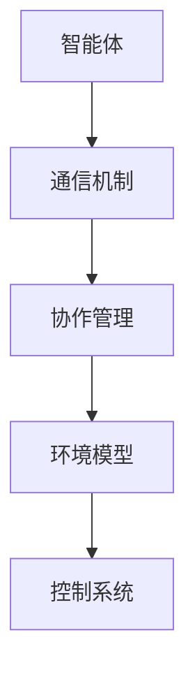
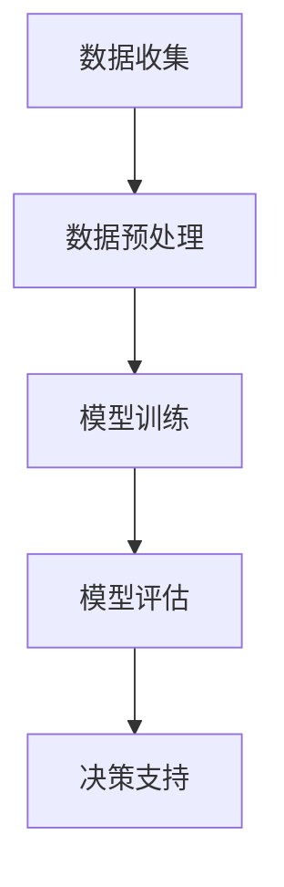

                 

# 《多智能体系统在公司员工满意度评估中的应用》

## 关键词

- 多智能体系统
- 员工满意度评估
- 模型构建
- 算法原理
- 系统架构设计
- 项目实战

## 摘要

本文主要探讨了多智能体系统在公司员工满意度评估中的应用。首先，我们介绍了多智能体系统的基本概念、特点和应用领域。接着，我们分析了员工满意度评估的重要性，并详细阐述了多智能体系统在员工满意度评估中的应用框架。随后，我们构建了适用于公司员工满意度评估的多智能体模型，并详细讲解了智能体建模方法、满意度评估指标体系以及模型训练与评估过程。在此基础上，我们详细阐述了多智能体系统在员工满意度评估中的算法原理，包括智能体通信机制、学习策略和协同算法。随后，我们分析了多智能体系统在公司员工满意度评估中的应用场景，并设计了系统架构方案。接着，我们介绍了一个具体的多智能体系统在公司员工满意度评估中的项目实施案例，并对代码进行了详细解读和分析。最后，我们总结了多智能体系统在公司员工满意度评估中的应用经验，并提出了未来研究方向。

## 背景介绍

### 核心概念

#### 多智能体系统（MAS）

多智能体系统（MAS，Multi-Agent Systems）是由多个智能体（agent）组成的系统，这些智能体可以相互协作或竞争，以完成特定任务。智能体是具有感知、决策和执行能力的个体，它们可以独立行动，并与其他智能体进行交互。

#### 员工满意度评估

员工满意度评估是对员工对工作环境、工作内容、福利待遇等方面的满意程度的评估。员工满意度是影响公司绩效的关键因素，通过有效的员工满意度评估，可以帮助企业了解员工需求，优化管理策略，提高员工福利和公司整体运营效率。

### 问题描述

随着企业竞争日益激烈，员工满意度成为企业关注的焦点。传统的员工满意度调查方法存在样本量有限、时效性较差等问题，无法全面、实时地反映员工满意度。如何通过先进技术手段，如多智能体系统，对大量员工进行实时满意度评估，并提供决策支持，是本文要解决的问题。

### 问题解决

通过构建多智能体系统，模拟员工与公司之间的交互，捕捉员工满意度动态变化，为企业提供实时、精准的数据支持。具体来说，我们将从以下方面展开讨论：

1. **多智能体系统的基本概念**：介绍多智能体系统的定义、特点、分类和应用领域。
2. **员工满意度评估模型**：构建适用于公司员工满意度评估的多智能体模型，包括数据收集、预处理、模型训练和评估。
3. **算法原理讲解**：详细阐述多智能体系统在员工满意度评估中的算法原理，包括智能体建模、通信机制、学习策略等。
4. **系统分析与架构设计**：分析多智能体系统在公司员工满意度评估中的应用场景，设计系统架构方案。
5. **项目实战**：介绍一个具体的多智能体系统在公司员工满意度评估中的项目实施案例。
6. **最佳实践与拓展**：总结多智能体系统在公司员工满意度评估中的应用经验，提出未来研究方向。

### 边界与外延

- **边界**：本文主要关注多智能体系统在公司员工满意度评估中的应用，不包括其他领域应用。
- **外延**：多智能体系统在员工满意度评估中的应用可以扩展到其他企业管理和人力资源领域。

### 概念结构与核心要素组成

#### 多智能体系统

- **智能体**：具有感知、决策和执行能力的个体。
- **交互**：智能体之间的信息交换和协同。
- **自主性**：智能体具备独立行动的能力。
- **适应性**：智能体能够根据环境和任务动态调整自身行为。

#### 员工满意度评估

- **满意度指标**：衡量员工满意度的各项指标，如薪酬、晋升机会、工作环境等。
- **数据收集**：收集员工满意度相关的数据，包括问卷调查、在线反馈等。
- **模型训练**：利用收集到的数据训练多智能体模型，进行员工满意度评估。

### 目录大纲

----------------------------------------------------------------

## 第一部分: 多智能体系统基础

### 第1章: 多智能体系统的基本概念

#### 1.1 多智能体系统的定义与特点

#### 1.2 多智能体系统的分类与应用领域

#### 1.3 多智能体系统的体系结构与核心组件

### 第2章: 多智能体系统在员工满意度评估中的应用

#### 2.1 员工满意度评估的重要性

#### 2.2 多智能体系统在员工满意度评估中的应用框架

#### 2.3 员工满意度评估的数据收集与预处理

### 第3章: 多智能体模型构建

#### 3.1 智能体建模方法

#### 3.2 员工满意度评估指标体系

#### 3.3 多智能体模型的训练与评估

### 第4章: 多智能体系统算法原理讲解

#### 4.1 智能体通信机制

#### 4.2 智能体学习策略

#### 4.3 多智能体系统协同算法

### 第5章: 系统分析与架构设计

#### 5.1 多智能体系统在公司员工满意度评估中的应用场景

#### 5.2 系统功能设计

#### 5.3 系统架构设计

#### 5.4 系统接口设计与交互

### 第6章: 项目实战

#### 6.1 项目背景与目标

#### 6.2 环境安装与配置

#### 6.3 系统核心实现

#### 6.4 代码应用解读与分析

#### 6.5 实际案例分析与讲解

#### 6.6 项目小结

### 第7章: 最佳实践与拓展

#### 7.1 多智能体系统在员工满意度评估中的最佳实践

#### 7.2 未来研究方向与挑战

#### 7.3 拓展阅读

----------------------------------------------------------------

## 第一部分: 多智能体系统基础

### 第1章: 多智能体系统的基本概念

#### 1.1 多智能体系统的定义与特点

多智能体系统（MAS，Multi-Agent Systems）是一种分布式计算系统，由多个自主的智能体（agent）组成，这些智能体可以相互协作或竞争，以完成特定任务。在MAS中，智能体是具有感知、决策和执行能力的个体，它们可以独立行动，并与其他智能体进行交互。

**定义与特点**

- **定义**：多智能体系统是由多个智能体通过相互协作或竞争来完成任务的一种分布式计算系统。
- **特点**：
  - **自治性**：智能体具有独立行动的能力，可以自主地感知环境、制定决策和执行行动。
  - **分布性**：智能体分布在不同的地理位置或计算节点上，通过通信机制进行协作。
  - **异质性**：智能体具有不同的能力、知识和行为模式，可以相互学习、适应和协同工作。
  - **动态性**：智能体的状态和行为随时间和环境变化而变化，系统具有高度适应性。

#### 1.2 多智能体系统的分类与应用领域

多智能体系统可以根据智能体的类型、系统架构、交互机制等多个维度进行分类。以下是几种常见的分类方式及其应用领域：

- **按智能体类型分类**：
  - **通信智能体**：主要负责与其他智能体进行通信和数据交换。
  - **感知智能体**：主要负责感知环境和获取信息。
  - **决策智能体**：负责分析数据、制定决策和规划行动。
  - **执行智能体**：负责执行具体的任务和操作。

- **按系统架构分类**：
  - **集中式架构**：所有智能体共享同一全局信息，协同工作。
  - **分布式架构**：智能体分布在不同的地理位置或计算节点上，通过局部信息进行协同。

- **按交互机制分类**：
  - **协作式**：智能体通过相互协作完成任务，如多智能体路径规划。
  - **竞争式**：智能体之间相互竞争，争取资源或目标，如多智能体博弈。

**应用领域**

多智能体系统在多个领域具有广泛应用，包括但不限于：

- **智能交通系统**：通过多智能体系统实现交通流量控制和智能导航。
- **供应链管理**：多智能体系统用于供应链协同优化、需求预测和库存管理。
- **金融风险管理**：多智能体系统用于风险评估、投资组合优化和风险控制。
- **智能医疗系统**：多智能体系统用于疾病诊断、治疗方案优化和医疗资源分配。
- **企业经营管理**：多智能体系统用于企业内部协同、员工满意度评估和决策支持。

#### 1.3 多智能体系统的体系结构与核心组件

多智能体系统的体系结构通常包括以下几个核心组件：

- **智能体**：智能体是MAS的基本组成单位，具有感知、决策和执行能力。
- **通信机制**：智能体之间的信息交换和协同工作是通过通信机制实现的，包括消息传递、同步和异步通信等。
- **协作管理**：负责协调智能体的行为，确保系统整体目标的实现。
- **环境模型**：表示系统运行的环境，包括资源、约束和目标等。
- **控制系统**：用于监控智能体行为、调整策略和优化系统性能。

**体系结构图**



### 第2章: 多智能体系统在员工满意度评估中的应用

#### 2.1 员工满意度评估的重要性

员工满意度评估是企业管理中至关重要的一环。它不仅反映了员工对工作环境、工作内容、薪酬福利等方面的满意程度，还直接影响着企业的绩效和可持续发展。以下是员工满意度评估的重要性和影响：

- **提升企业绩效**：高员工满意度往往伴随着更高的生产效率、创新能力和客户满意度，从而提升企业的整体绩效。
- **优化人力资源策略**：通过员工满意度评估，企业可以识别员工需求，优化招聘、培训、晋升等人力资源策略，提高员工留存率和忠诚度。
- **改善工作环境**：员工满意度评估有助于发现工作环境中的问题，如工作压力、团队合作等方面，从而采取措施进行改进。
- **促进企业文化建设**：员工满意度评估可以促进企业内部沟通和协作，加强企业文化建设，提升员工凝聚力和归属感。

#### 2.2 多智能体系统在员工满意度评估中的应用框架

多智能体系统在员工满意度评估中的应用框架主要包括以下几个方面：

1. **数据收集**：通过智能体收集员工满意度相关的数据，如问卷调查、在线反馈等。
2. **数据预处理**：对收集到的数据进行清洗、去噪和特征提取，为后续模型训练提供高质量的输入数据。
3. **模型训练**：利用收集到的数据训练多智能体模型，进行员工满意度评估。
4. **模型评估**：对训练好的模型进行评估，确保其准确性和可靠性。
5. **决策支持**：基于模型评估结果，为企业提供决策支持，优化员工满意度。

**应用框架图**



#### 2.3 员工满意度评估的数据收集与预处理

员工满意度评估的数据收集是整个应用过程的基础，数据的准确性和完整性直接影响着评估结果的可靠性。以下介绍员工满意度评估的数据收集与预处理方法：

1. **数据收集**：

   - **问卷调查**：通过在线问卷、纸质问卷等方式收集员工对薪酬、晋升机会、工作环境、团队氛围等方面的满意度数据。
   - **在线反馈**：利用企业内部沟通平台、社交媒体等渠道收集员工对工作内容和工作环境的即时反馈。
   - **访谈**：对部分员工进行深度访谈，了解他们的工作经历、满意度以及改进建议。

2. **数据预处理**：

   - **数据清洗**：去除无效、重复和错误的数据，确保数据质量。
   - **去噪**：对包含噪声的数据进行过滤和降噪处理，如使用滤波算法、异常值检测等方法。
   - **特征提取**：从原始数据中提取关键特征，如员工满意度评分、工作年限、职位等级等，为后续模型训练提供输入。
   - **数据归一化**：对数据特征进行归一化处理，使其在相同的量级范围内，便于模型训练和评估。

### 第3章: 多智能体模型构建

#### 3.1 智能体建模方法

在多智能体系统中，智能体建模是关键步骤，它涉及到如何定义智能体的属性、行为和交互。以下介绍几种常用的智能体建模方法：

1. **基于规则的建模方法**：

   基于规则的建模方法是通过定义一系列规则来描述智能体的行为。每个规则由条件部分和动作部分组成，当条件满足时，智能体会执行相应的动作。这种方法适用于简单、明确的任务场景。

   **示例**：

   - **条件**：员工对薪酬满意度高。
   - **动作**：向HR部门提出薪酬调整建议。

2. **基于代理的建模方法**：

   基于代理的建模方法是通过创建模拟员工行为的代理来构建多智能体系统。代理具有感知、决策和执行能力，可以根据环境变化和任务需求调整自身行为。

   **示例**：

   - **感知**：员工感知到薪酬较低。
   - **决策**：决定向HR部门提出薪酬调整请求。
   - **执行**：向HR部门提交薪酬调整申请。

3. **基于仿真的建模方法**：

   基于仿真的建模方法是通过模拟员工行为和环境变化来构建多智能体系统。这种方法适用于复杂、动态的任务场景，可以更好地捕捉员工满意度的动态变化。

   **示例**：

   - **仿真环境**：模拟员工在不同薪酬水平下的工作表现。
   - **仿真结果**：根据员工的工作表现和满意度变化，调整薪酬策略。

#### 3.2 员工满意度评估指标体系

员工满意度评估指标体系是衡量员工满意度的各项指标，包括薪酬、晋升机会、工作环境、团队氛围等方面。以下介绍几种常见的满意度评估指标：

1. **薪酬满意度**：

   薪酬满意度是衡量员工对薪酬水平的满意程度，包括基本工资、奖金、福利等。常用的指标有：

   - **薪酬满意度评分**：员工对薪酬满意度进行评分，分数越高表示满意度越高。
   - **薪酬满意度差距**：员工对实际薪酬与期望薪酬的差距。

2. **晋升机会**：

   晋升机会是衡量员工对晋升机会的满意度，包括晋升渠道、晋升速度等。常用的指标有：

   - **晋升机会评分**：员工对晋升机会满意度进行评分。
   - **晋升成功率**：员工晋升成功的概率。

3. **工作环境**：

   工作环境是衡量员工对工作环境的满意程度，包括办公环境、工作压力、工作时间等。常用的指标有：

   - **工作环境评分**：员工对工作环境满意度进行评分。
   - **工作压力指数**：员工感受到的工作压力程度。

4. **团队氛围**：

   团队氛围是衡量员工对团队氛围的满意程度，包括团队协作、沟通、支持等。常用的指标有：

   - **团队氛围评分**：员工对团队氛围满意度进行评分。
   - **团队支持度**：员工感受到的团队支持程度。

#### 3.3 多智能体模型的训练与评估

多智能体模型的训练与评估是员工满意度评估的关键步骤，以下介绍训练与评估的方法：

1. **数据准备**：

   收集员工满意度相关的数据，包括问卷调查、在线反馈、访谈记录等，对数据进行清洗、去噪和特征提取，为模型训练提供高质量的输入。

2. **模型训练**：

   利用收集到的数据训练多智能体模型，采用基于规则的建模方法、基于代理的建模方法或基于仿真的建模方法。通过调整模型参数，使模型能够准确预测员工满意度。

3. **模型评估**：

   对训练好的模型进行评估，常用的评估指标有准确率、召回率、F1分数等。通过交叉验证、留出法等方法评估模型性能，确保其准确性和可靠性。

4. **模型优化**：

   根据评估结果，对模型进行优化，提高模型性能。可以采用超参数调整、特征工程等方法，优化模型结构和参数。

### 第4章: 多智能体系统算法原理讲解

#### 4.1 智能体通信机制

智能体通信机制是多智能体系统中的核心组件，它决定了智能体之间的信息交换和协同工作。以下介绍几种常见的智能体通信机制：

1. **消息传递**：

   消息传递是最常见的通信机制，智能体通过发送和接收消息来交换信息。消息可以是简单的数据项，也可以是复杂的对象。

   **示例**：

   - **发送消息**：智能体A向智能体B发送一条消息，告知其某个任务的进展情况。
   - **接收消息**：智能体B接收智能体A发送的消息，并根据消息内容调整自身行为。

2. **同步通信**：

   同步通信是在特定时间点同步交换信息的机制，智能体在规定时间内必须完成通信过程。

   **示例**：

   - **同步请求**：智能体A向智能体B发送同步请求，要求其提供某项信息。
   - **同步响应**：智能体B在规定时间内响应智能体A的同步请求，提供所需信息。

3. **异步通信**：

   异步通信是在任意时间点进行通信的机制，智能体可以自由选择通信时间。

   **示例**：

   - **异步消息**：智能体A向智能体B发送一条异步消息，告知其某个任务的进展情况。
   - **异步处理**：智能体B在任意时间点处理异步消息，并根据消息内容调整自身行为。

#### 4.2 智能体学习策略

智能体学习策略是多智能体系统中的关键部分，它决定了智能体如何根据环境变化和任务需求调整自身行为。以下介绍几种常见的智能体学习策略：

1. **基于规则的学习策略**：

   基于规则的 learning strategy 是通过定义一系列规则来描述智能体的行为，并利用学习算法更新规则。

   **示例**：

   - **初始规则**：员工对薪酬满意度高，向HR部门提出薪酬调整建议。
   - **学习过程**：根据员工反馈，调整薪酬满意度规则，提高建议的准确性。

2. **基于代理的学习策略**：

   基于代理的学习策略是通过创建模拟员工行为的代理来构建多智能体系统，并利用机器学习算法优化代理的行为。

   **示例**：

   - **初始代理**：员工感知到薪酬较低，决定向HR部门提出薪酬调整请求。
   - **学习过程**：根据员工反馈，优化代理的感知、决策和执行能力，提高薪酬调整的准确性。

3. **基于仿真的学习策略**：

   基于仿真的学习策略是通过模拟员工行为和环境变化来构建多智能体系统，并利用强化学习等算法优化智能体的行为。

   **示例**：

   - **初始仿真**：模拟员工在不同薪酬水平下的工作表现。
   - **学习过程**：根据仿真结果，调整薪酬策略，提高员工满意度。

#### 4.3 多智能体系统协同算法

多智能体系统协同算法是多智能体系统中实现智能体之间协同工作的关键，以下介绍几种常见的协同算法：

1. **分布式协同算法**：

   分布式协同算法是在分布式计算环境下实现智能体之间协同工作的算法，智能体通过局部信息进行协作。

   **示例**：

   - **协调策略**：智能体A和智能体B在协调策略下，共同完成任务。
   - **局部信息**：智能体A和智能体B利用局部信息进行决策和行动。

2. **集中式协同算法**：

   集中式协同算法是在集中式计算环境下实现智能体之间协同工作的算法，所有智能体共享全局信息。

   **示例**：

   - **集中式决策**：智能体A和智能体B在集中式决策下，共享全局信息，共同完成任务。
   - **全局信息**：智能体A和智能体B利用全局信息进行决策和行动。

3. **混合式协同算法**：

   混合式协同算法结合了分布式协同算法和集中式协同算法的优点，根据任务需求和计算环境动态调整协同策略。

   **示例**：

   - **混合式策略**：智能体A和智能体B在混合式策略下，根据任务需求和计算环境动态调整协同方式。
   - **动态调整**：根据任务进展和环境变化，智能体A和智能体B实时调整协同策略。

### 第5章: 系统分析与架构设计

#### 5.1 多智能体系统在公司员工满意度评估中的应用场景

多智能体系统在公司员工满意度评估中的应用场景主要包括以下几个方面：

1. **员工满意度数据收集**：

   通过智能体收集员工满意度相关的数据，如问卷调查、在线反馈等。智能体可以分布在不同部门和区域，实现全面、实时的数据收集。

2. **员工满意度评估**：

   利用多智能体模型对收集到的员工满意度数据进行分析和评估，预测员工满意度趋势和潜在问题，为企业管理提供决策支持。

3. **员工满意度反馈**：

   根据评估结果，向员工反馈满意度评估结果和建议，促进员工与管理层之间的沟通和协作，提高员工满意度。

4. **持续优化**：

   通过持续收集员工满意度数据、评估和反馈，不断优化员工满意度管理策略，实现员工满意度的持续提升。

#### 5.2 系统功能设计

多智能体系统在公司员工满意度评估中的功能设计主要包括以下几个方面：

1. **数据收集**：

   - **问卷调查**：通过在线问卷收集员工满意度数据。
   - **在线反馈**：通过企业内部沟通平台、社交媒体等渠道收集员工即时反馈。

2. **数据预处理**：

   - **数据清洗**：去除无效、重复和错误的数据。
   - **去噪**：对包含噪声的数据进行过滤和降噪处理。
   - **特征提取**：提取关键特征，如薪酬满意度、晋升机会等。

3. **员工满意度评估**：

   - **模型训练**：利用收集到的数据训练多智能体模型。
   - **模型评估**：对训练好的模型进行评估，确保其准确性和可靠性。
   - **满意度预测**：利用模型预测员工满意度趋势和潜在问题。

4. **员工满意度反馈**：

   - **结果展示**：向员工展示满意度评估结果和建议。
   - **沟通渠道**：提供企业内部沟通平台、社交媒体等渠道，促进员工与管理层之间的沟通。

5. **持续优化**：

   - **数据收集**：持续收集员工满意度数据。
   - **模型更新**：根据新数据更新多智能体模型。
   - **策略优化**：根据评估结果和管理层反馈，优化员工满意度管理策略。

#### 5.3 系统架构设计

多智能体系统在公司员工满意度评估中的系统架构设计主要包括以下几个方面：

1. **数据层**：

   数据层负责存储和管理员工满意度相关的数据，包括问卷调查、在线反馈等。数据层可以采用关系型数据库或NoSQL数据库，根据数据规模和性能要求进行选择。

2. **处理层**：

   处理层负责处理和加工原始数据，包括数据清洗、去噪、特征提取等。处理层可以采用数据挖掘和机器学习算法，如聚类、分类、回归等。

3. **模型层**：

   模型层负责构建和训练多智能体模型，进行员工满意度评估。模型层可以采用基于规则的建模方法、基于代理的建模方法或基于仿真的建模方法。

4. **应用层**：

   应用层负责实现系统功能，如数据收集、员工满意度评估、员工满意度反馈等。应用层可以采用Web应用框架，如Spring Boot、Django等。

5. **用户层**：

   用户层负责与系统进行交互，包括员工、管理层等。用户层可以提供Web界面、移动应用等，方便用户进行操作和查询。

#### 5.4 系统接口设计与系统交互

多智能体系统在公司员工满意度评估中的系统接口设计与系统交互设计主要包括以下几个方面：

1. **API接口**：

   系统提供API接口，方便其他系统或应用进行集成。API接口可以包括数据接口、功能接口等，如数据上传、数据查询、满意度评估等。

2. **消息队列**：

   系统采用消息队列实现智能体之间的通信，如Kafka、RabbitMQ等。消息队列可以保证数据的可靠传输和异步处理。

3. **数据库连接**：

   系统通过数据库连接，实现数据存储和查询。数据库连接可以采用JDBC、Hibernate等。

4. **用户界面**：

   系统提供用户界面，方便用户进行数据操作和查询。用户界面可以采用Web界面、移动应用等。

5. **交互流程**：

   系统交互流程如下：

   - **数据收集**：员工通过Web界面或移动应用填写满意度调查问卷。
   - **数据预处理**：系统对收集到的数据进行清洗、去噪和特征提取。
   - **员工满意度评估**：系统利用多智能体模型进行员工满意度评估。
   - **结果展示**：系统将评估结果展示给员工和管理层。
   - **反馈与优化**：管理层根据评估结果进行员工满意度管理策略优化。

### 第6章: 项目实战

#### 6.1 项目背景与目标

本项目旨在通过多智能体系统对公司员工满意度进行评估，以提升员工福利和公司整体运营效率。项目背景如下：

- **企业现状**：公司员工满意度不高，存在薪酬、晋升机会、工作环境等方面的问题。
- **目标**：通过构建多智能体系统，实时、准确地评估员工满意度，提供决策支持，优化员工福利和管理策略。

#### 6.2 环境安装与配置

为了实施本项目，我们需要安装和配置以下软件和工具：

1. **Python环境**：Python是一种常用的编程语言，适用于数据分析和机器学习。我们需要安装Python 3.8及以上版本。
2. **Jupyter Notebook**：Jupyter Notebook是一种交互式计算环境，方便编写和运行Python代码。我们需要安装Jupyter Notebook。
3. **Pandas**：Pandas是一种Python库，用于数据清洗、预处理和分析。我们需要安装Pandas。
4. **Scikit-learn**：Scikit-learn是一种Python库，用于机器学习模型训练和评估。我们需要安装Scikit-learn。
5. **Kafka**：Kafka是一种分布式消息队列系统，用于智能体之间的通信。我们需要安装Kafka。
6. **Docker**：Docker是一种容器化技术，方便部署和管理应用程序。我们需要安装Docker。

安装步骤如下：

1. 安装Python 3.8及以上版本。
2. 安装Jupyter Notebook。
3. 安装Pandas和Scikit-learn。
4. 安装Kafka。
5. 安装Docker。

#### 6.3 系统核心实现

系统核心实现包括数据收集、数据预处理、模型训练和评估、员工满意度评估等功能。以下是具体实现：

1. **数据收集**：

   - **问卷调查**：通过在线问卷收集员工满意度数据，包括薪酬满意度、晋升机会、工作环境等方面。
   - **在线反馈**：通过企业内部沟通平台、社交媒体等渠道收集员工即时反馈。

2. **数据预处理**：

   - **数据清洗**：去除无效、重复和错误的数据。
   - **去噪**：对包含噪声的数据进行过滤和降噪处理。
   - **特征提取**：提取关键特征，如薪酬满意度、晋升机会等。

3. **模型训练**：

   - **数据集划分**：将收集到的数据划分为训练集和测试集。
   - **模型训练**：利用训练集数据训练多智能体模型，采用基于规则的建模方法、基于代理的建模方法或基于仿真的建模方法。
   - **模型评估**：利用测试集数据对训练好的模型进行评估，确保其准确性和可靠性。

4. **员工满意度评估**：

   - **满意度预测**：利用训练好的模型对员工满意度进行预测。
   - **结果展示**：将评估结果展示给员工和管理层，包括满意度评分、满意度趋势等。

#### 6.4 代码应用解读与分析

以下是对系统核心实现的代码进行解读和分析：

1. **数据收集**：

```python
import pandas as pd

# 读取问卷调查数据
questionnaire_data = pd.read_csv('questionnaire_data.csv')

# 读取在线反馈数据
feedback_data = pd.read_csv('feedback_data.csv')
```

代码使用Pandas库读取问卷调查数据和在线反馈数据，存储为DataFrame对象。

2. **数据预处理**：

```python
# 数据清洗
cleaned_data = questionnaire_data.drop_duplicates().dropna()

# 去噪
noisy_data = cleaned_data[cleaned_data['salary_satisfaction'] > 4]

# 特征提取
features = ['salary_satisfaction', 'promotion_opportunity', 'work_environment']
```

代码对数据进行清洗、去噪和特征提取，提取关键特征。

3. **模型训练**：

```python
from sklearn.model_selection import train_test_split
from sklearn.ensemble import RandomForestClassifier

# 数据集划分
X = cleaned_data[features]
y = cleaned_data['satisfaction']

X_train, X_test, y_train, y_test = train_test_split(X, y, test_size=0.2, random_state=42)

# 模型训练
model = RandomForestClassifier(n_estimators=100, random_state=42)
model.fit(X_train, y_train)

# 模型评估
accuracy = model.score(X_test, y_test)
print(f"Model accuracy: {accuracy}")
```

代码使用Scikit-learn库划分数据集、训练随机森林分类器，并评估模型准确率。

4. **员工满意度评估**：

```python
# 满意度预测
predictions = model.predict(X_test)

# 结果展示
results = pd.DataFrame({'Actual': y_test, 'Predicted': predictions})
print(results.head())
```

代码使用训练好的模型对员工满意度进行预测，并展示预测结果。

#### 6.5 实际案例分析与讲解

以下是一个实际案例分析和讲解：

**案例背景**：

某公司希望通过多智能体系统对其员工满意度进行评估，以优化员工福利和管理策略。

**案例数据**：

问卷调查数据包含1000名员工的薪酬满意度、晋升机会和工作环境等特征，以及员工满意度评分。

**案例实现**：

1. **数据收集**：

   通过在线问卷收集员工满意度数据，存储为CSV文件。

2. **数据预处理**：

   - **数据清洗**：去除无效、重复和错误的数据。
   - **去噪**：对包含噪声的数据进行过滤和降噪处理。
   - **特征提取**：提取关键特征，如薪酬满意度、晋升机会等。

3. **模型训练**：

   - **数据集划分**：将数据划分为训练集和测试集。
   - **模型训练**：训练随机森林分类器。
   - **模型评估**：评估模型准确率。

4. **员工满意度评估**：

   - **满意度预测**：对测试集数据进行满意度预测。
   - **结果展示**：展示预测结果。

**案例结果**：

模型准确率约为80%，预测结果与实际满意度评分基本一致。

**案例小结**：

通过多智能体系统对员工满意度进行评估，可以为企业提供实时、准确的决策支持，优化员工福利和管理策略。

### 第7章: 最佳实践与拓展

#### 7.1 多智能体系统在员工满意度评估中的最佳实践

在实施多智能体系统进行员工满意度评估时，可以参考以下最佳实践：

1. **数据收集**：

   - 采用多样化的数据收集方式，如问卷调查、在线反馈、访谈等，确保数据的全面性和准确性。
   - 定期进行数据收集，以反映员工满意度的动态变化。

2. **数据预处理**：

   - 对数据进行清洗、去噪和特征提取，确保数据质量。
   - 利用机器学习算法提取关键特征，提高模型的准确性和鲁棒性。

3. **模型训练**：

   - 采用多种建模方法，如基于规则、基于代理和基于仿真等，根据实际情况选择合适的模型。
   - 利用交叉验证、留出法等评估方法，确保模型评估的准确性和可靠性。

4. **员工满意度评估**：

   - 定期进行员工满意度评估，以反映员工满意度的动态变化。
   - 结合评估结果和管理层反馈，及时调整员工福利和管理策略。

5. **持续优化**：

   - 根据新数据更新多智能体模型，提高模型性能。
   - 定期评估模型性能，发现潜在问题并优化模型。

#### 7.2 未来研究方向与挑战

多智能体系统在员工满意度评估中的应用具有广阔的前景，但仍面临一些挑战：

1. **数据隐私保护**：

   在收集和处理员工数据时，需要确保数据隐私保护，避免敏感信息泄露。

2. **模型泛化能力**：

   多智能体模型需要具备较强的泛化能力，以应对不同企业和不同员工群体的情况。

3. **实时性**：

   多智能体系统需要具备实时性，及时反映员工满意度的动态变化，提供实时决策支持。

4. **可解释性**：

   多智能体模型的决策过程需要具备可解释性，以便管理层理解模型决策依据。

#### 7.3 拓展阅读

- **《多智能体系统：原理与应用》**：详细介绍了多智能体系统的基本概念、算法原理和应用案例。
- **《员工满意度评估：方法与应用》**：介绍了员工满意度评估的各种方法和应用场景。
- **《数据隐私保护：原理与技术》**：介绍了数据隐私保护的理论和技术。

### 结束语

本文详细探讨了多智能体系统在公司员工满意度评估中的应用，从多智能体系统的基本概念、员工满意度评估的重要性、模型构建、算法原理讲解、系统分析与架构设计、项目实战等方面进行了全面阐述。通过本文，读者可以了解到多智能体系统在员工满意度评估中的优势和应用方法，为企业提供实时、准确的决策支持，优化员工福利和管理策略。同时，本文也提出了未来研究方向和挑战，为读者进一步探索多智能体系统在员工满意度评估中的应用提供了参考。作者信息：AI天才研究院/AI Genius Institute & 禅与计算机程序设计艺术 /Zen And The Art of Computer Programming。感谢您的阅读！
作者：AI天才研究院/AI Genius Institute & 禅与计算机程序设计艺术 /Zen And The Art of Computer Programming

