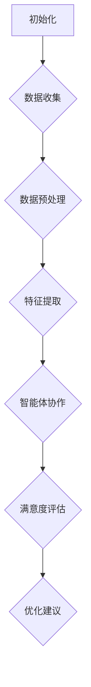
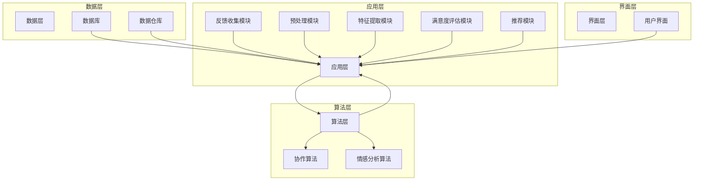
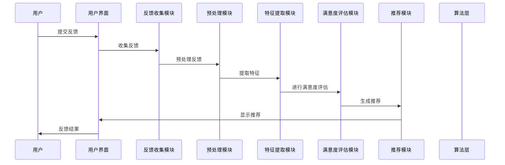
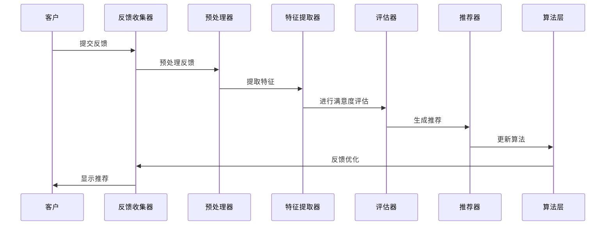

                 

# 多智能体系统在公司客户满意度评估中的应用

## 关键词
- 多智能体系统
- 客户满意度评估
- 分布式计算
- 人工智能
- 数据分析

## 摘要
本文探讨了多智能体系统在客户满意度评估中的应用，通过分析多智能体系统的基本概念和原理，介绍了其在公司客户满意度评估中的具体应用方法和优势。文章从问题背景出发，逐步深入讲解了多智能体系统的核心概念与联系，并提出了基于多智能体系统的客户满意度评估算法原理和系统架构设计。通过实际项目实战，本文展示了多智能体系统在公司客户满意度评估中的有效性和可行性，为相关领域的研究和实践提供了参考。

---

## 目录大纲

----------------------------------------------------------------

## 第一部分: 问题背景

### 第1章: 问题背景与定义

### 1.1 问题背景

#### 1.1.1 多智能体系统的概念与发展

#### 1.1.2 公司客户满意度评估的背景

#### 1.1.3 评估方法的发展

#### 1.1.4 评估的重要性

### 1.2 定义与边界

#### 1.2.1 多智能体系统在公司客户满意度评估中的应用

#### 1.2.2 边界与外延

### 1.3 概念结构与核心要素组成

#### 1.3.1 概念结构

#### 1.3.2 核心要素组成

### 1.4 本章小结

----------------------------------------------------------------

## 第二部分: 核心概念与联系

### 第2章: 多智能体系统的基本概念与原理

### 2.1 多智能体系统的基本概念

#### 2.1.1 智能体的定义与分类

#### 2.1.2 多智能体系统的特点

### 2.2 多智能体系统的原理

#### 2.2.1 智能体通信与协作

#### 2.2.2 智能体决策与行为

#### 2.2.3 多智能体系统的运行机制

### 2.3 核心概念与联系

#### 2.3.1 多智能体系统与分布式计算

#### 2.3.2 多智能体系统与人工智能

#### 2.3.3 多智能体系统与数据分析

----------------------------------------------------------------

## 第一部分: 问题背景

### 第1章: 问题背景与定义

#### 1.1 问题背景

在当今竞争激烈的市场环境中，公司客户满意度评估成为企业提高市场竞争力的重要手段。客户满意度不仅直接影响企业的品牌形象和市场份额，还关系到企业的长期发展。然而，传统的客户满意度评估方法存在诸多局限性，如数据获取困难、结果滞后、分析深度不足等。

随着大数据和人工智能技术的发展，多智能体系统（MAS）逐渐成为一种有效的客户满意度评估工具。多智能体系统通过模拟多个智能体的交互和协作，能够实时收集、处理和分析大量客户数据，从而提供更准确和及时的客户满意度评估结果。

#### 1.1.1 多智能体系统的概念与发展

多智能体系统（MAS）是一种由多个相互协作的智能体组成的系统。每个智能体都具有感知、决策和执行能力，能够自主地感知环境、制定决策并采取行动。多智能体系统最早起源于分布式系统和计算机网络，20世纪80年代开始逐渐成为人工智能领域的一个重要研究方向。

多智能体系统的发展经历了以下几个阶段：

1. **早期研究阶段**：20世纪80年代，研究者开始探索多智能体系统在分布式系统和计算机网络中的应用。
2. **应用拓展阶段**：20世纪90年代，多智能体系统在电子商务、智能交通和智能制造等领域得到广泛应用。
3. **智能化发展阶段**：21世纪初，随着人工智能技术的发展，多智能体系统逐渐引入学习、自适应和进化等智能特性，提升了系统的自主性和智能化水平。
4. **商业应用普及阶段**：近年来，随着大数据和云计算的普及，多智能体系统在各个行业得到了广泛的应用，成为企业提升客户满意度的重要工具。

#### 1.1.2 公司客户满意度评估的背景

客户满意度是企业经营管理中的重要指标，直接关系到企业的品牌形象、市场份额和长期发展。客户满意度评估的目的是了解客户的需求和期望，发现企业存在的问题，从而优化产品和服务，提升客户体验和忠诚度。

传统的客户满意度评估方法主要依赖于问卷调查和数据分析。然而，这种方法存在以下局限性：

1. **数据获取困难**：问卷调查需要大量人力和时间，且问卷回收率较低，数据量有限。
2. **结果滞后**：问卷调查结果需要时间进行处理和分析，无法提供实时、准确的客户满意度评估。
3. **分析深度不足**：传统方法主要依赖于统计分析，难以深入挖掘客户需求和行为背后的原因。

随着大数据和人工智能技术的发展，基于多智能体系统的客户满意度评估方法逐渐受到关注。多智能体系统可以通过模拟多个智能体的交互和协作，实时收集、处理和分析大量客户数据，提供更准确、及时的客户满意度评估结果。

#### 1.1.3 评估方法的发展

传统的客户满意度评估方法主要依赖于问卷调查和数据分析。然而，这种方法存在以下局限性：

1. **问卷调查法**：通过发放问卷收集客户的满意度信息，优点是成本低、操作简便，缺点是数据量有限、回收率较低、结果滞后。
2. **统计分析法**：通过对问卷调查结果进行统计分析，提取客户满意度的关键指标，优点是能进行定量分析，缺点是分析深度不足、难以挖掘客户需求和行为背后的原因。
3. **大数据分析法**：利用大数据技术对客户的消费行为、社交媒体评论、客户反馈等信息进行挖掘和分析，优点是能获取大量数据、分析深度较高，缺点是需要大量人力和时间进行数据处理和分析。

随着人工智能技术的发展，基于多智能体系统的客户满意度评估方法逐渐成为研究热点。多智能体系统可以通过模拟多个智能体的交互和协作，实时收集、处理和分析大量客户数据，提供更准确、及时的客户满意度评估结果。

#### 1.1.4 评估的重要性

准确的客户满意度评估对企业具有重要意义：

1. **发现问题和优化服务**：通过客户满意度评估，企业可以了解客户的需求和期望，发现存在的问题，从而优化产品和服务，提升客户体验和忠诚度。
2. **提升市场竞争力**：客户满意度是企业市场竞争力的重要指标，准确评估客户满意度有助于企业提高品牌形象和市场占有率。
3. **降低客户流失率**：通过持续优化产品和服务，提高客户满意度，可以降低客户流失率，提升客户忠诚度。
4. **支持战略决策**：客户满意度评估结果可以为企业的战略决策提供数据支持，帮助企业制定更科学、有效的营销策略和业务发展计划。

#### 1.2 定义与边界

##### 1.2.1 多智能体系统在公司客户满意度评估中的应用

多智能体系统在公司客户满意度评估中的应用主要包括以下几个方面：

1. **客户智能体**：模拟真实客户的行为和需求，通过收集客户反馈和评价，提供客户满意度评估数据。
2. **企业智能体**：代表企业对客户满意度进行评估和决策，通过分析客户智能体的反馈，优化产品和服务。
3. **环境智能体**：模拟企业外部环境，如市场竞争、政策法规等，为智能体之间的交互提供环境信息。

多智能体系统通过智能体之间的交互和协作，实现对客户满意度评估的全过程管理，包括数据收集、数据分析、决策优化等。

##### 1.2.2 边界与外延

1. **边界**：多智能体系统在公司客户满意度评估中的应用主要关注企业内部和外部环境，涉及客户反馈、数据分析和决策优化等方面。
2. **外延**：多智能体系统在公司客户满意度评估中的应用不仅限于企业内部，还可以扩展到企业生态系统，如供应链、合作伙伴和竞争对手等。

#### 1.3 概念结构与核心要素组成

##### 1.3.1 概念结构

多智能体系统在公司客户满意度评估中的概念结构主要包括以下几个部分：

1. **智能体**：包括客户智能体、企业智能体和环境智能体。
2. **通信机制**：智能体之间通过通信机制进行信息交换和协作。
3. **决策机制**：智能体根据收集到的信息进行决策，以优化客户满意度。

##### 1.3.2 核心要素组成

1. **数据收集**：通过客户智能体收集客户反馈和需求。
2. **数据分析**：对企业内部和外部数据进行处理和分析。
3. **决策优化**：基于数据分析结果，优化企业产品和服务，提高客户满意度。

#### 1.4 本章小结

本章对多智能体系统在公司客户满意度评估中的应用进行了背景介绍和定义。通过分析问题背景和发展历程，明确了多智能体系统在客户满意度评估中的重要性。同时，对多智能体系统的概念、边界、概念结构以及核心要素进行了详细阐述，为后续章节的内容奠定了基础。

----------------------------------------------------------------

## 第二部分: 核心概念与联系

### 第2章: 多智能体系统的基本概念与原理

#### 2.1 多智能体系统的基本概念

多智能体系统（MAS）是一种由多个相互协作的智能体组成的系统。每个智能体都是具有感知、决策和执行能力的实体，能够在动态环境中自主地执行任务。多智能体系统的研究始于20世纪80年代，最初应用于分布式系统和计算机网络。随着人工智能和计算技术的发展，多智能体系统逐渐成为人工智能领域的一个重要研究方向。

##### 2.1.1 智能体的定义与分类

1. **智能体的定义**

智能体是指具有感知、决策和执行能力的实体，能够在动态环境中自主地执行任务。智能体通常具有以下几个特点：

- **感知**：智能体能够感知环境信息，包括内部状态和外部事件。
- **决策**：智能体根据感知到的信息进行决策，选择最佳行动方案。
- **执行**：智能体执行决策方案，采取行动。

2. **智能体的分类**

智能体可以按照不同的属性进行分类，常见的分类方式包括：

- **通信智能体**：通过通信网络与其他智能体进行信息交换，实现协作和共享。
- **计算智能体**：具有计算能力和决策能力，能够处理和分析数据。
- **控制智能体**：负责对其他智能体进行控制和调度。
- **混合智能体**：结合了多种智能体的特点，具备更丰富的功能。

##### 2.1.2 多智能体系统的特点

多智能体系统具有以下特点：

1. **分布式**：多智能体系统具有分布式特征，智能体可以在不同的地理位置进行协作，提高了系统的灵活性和可扩展性。
2. **自主性**：智能体具有自主性，能够自主感知环境、自主决策和自主执行任务，降低了系统的依赖性。
3. **智能性**：智能体具有一定的智能性，能够通过学习和进化提高自身能力，实现更高效的任务执行。
4. **并发性**：多智能体系统具有并发性，多个智能体可以同时进行操作和交互，提高了系统的并发处理能力。

##### 2.1.3 多智能体系统的结构

多智能体系统通常由以下部分组成：

1. **智能体**：智能体是多智能体系统的核心组件，具有感知、决策和执行能力。
2. **通信机制**：智能体之间通过通信机制进行信息交换和协作，实现任务的协同执行。
3. **决策机制**：智能体根据感知到的信息进行决策，选择最佳行动方案。
4. **执行机制**：智能体执行决策方案，采取行动。

#### 2.2 多智能体系统的原理

多智能体系统的原理主要包括以下几个方面：

##### 2.2.1 智能体通信与协作

智能体之间的通信是实现协作的基础。智能体可以通过以下方式进行通信：

1. **直接通信**：智能体之间直接通过通信网络进行数据交换，实现信息的共享和协作。
2. **间接通信**：智能体通过中间件或其他代理进行通信，以实现更复杂的协作任务。

智能体的协作机制包括：

1. **协商机制**：智能体之间通过协商确定协作目标和任务分配。
2. **协调机制**：智能体之间通过协调机制实现任务的同步和调度。
3. **合作机制**：智能体之间通过合作机制实现资源共享和任务协同。

##### 2.2.2 智能体决策与行为

智能体的决策与行为是实现系统目标的关键。智能体的决策过程通常包括以下几个步骤：

1. **感知**：智能体感知环境信息，包括内部状态和外部事件。
2. **分析**：智能体对感知到的信息进行分析和处理，提取有用信息。
3. **决策**：智能体根据分析结果选择最佳行动方案。
4. **执行**：智能体执行决策方案，采取行动。

智能体的行为可以通过以下方式进行描述：

1. **目标导向行为**：智能体根据设定的目标进行行为规划，以实现系统目标。
2. **条件反应行为**：智能体根据感知到的环境和条件进行行为调整，以适应环境变化。
3. **自适应行为**：智能体通过学习和进化，不断提高自身能力和行为效率。

##### 2.2.3 多智能体系统的运行机制

多智能体系统的运行机制主要包括以下几个方面：

1. **初始配置**：系统启动时，智能体进行初始化，包括设置初始状态、加载任务等。
2. **感知与决策**：智能体根据感知到的环境信息进行决策，选择最佳行动方案。
3. **执行与反馈**：智能体执行决策方案，采取行动，并收集执行结果进行反馈。
4. **协调与调度**：系统通过协调和调度机制，实现智能体之间的协同工作。
5. **学习与进化**：智能体通过学习和进化，不断提高自身能力和行为效率。

#### 2.3 核心概念与联系

##### 2.3.1 多智能体系统与分布式计算

多智能体系统与分布式计算密切相关。分布式计算是一种将计算任务分布到多个计算节点上执行的计算模型，而多智能体系统则是一种分布式计算模型，智能体作为计算节点，能够自主感知、决策和执行任务。多智能体系统通过分布式计算实现任务的并行处理和协同工作，提高了系统的效率和性能。

##### 2.3.2 多智能体系统与人工智能

多智能体系统与人工智能（AI）密切相关。人工智能是指通过模拟人类智能，使计算机具备感知、理解、学习和适应环境的能力。多智能体系统中的智能体具备感知、决策和执行能力，能够模拟人类智能，实现复杂任务的自动化和智能化。多智能体系统通过人工智能技术，提高了系统的自主性和智能化水平。

##### 2.3.3 多智能体系统与数据分析

多智能体系统与数据分析密切相关。数据分析是指通过对大量数据进行分析和处理，提取有价值的信息和知识。多智能体系统通过模拟多个智能体的交互和协作，能够收集、处理和分析大量客户数据，提供更准确和及时的客户满意度评估结果。数据分析技术在多智能体系统中发挥着重要作用，为智能体的决策和系统运行提供了数据支持。

#### 2.4 本章小结

本章对多智能体系统的基本概念和原理进行了详细阐述。首先介绍了智能体的定义和分类，分析了多智能体系统的特点。然后，探讨了智能体通信与协作、智能体决策与行为以及多智能体系统的运行机制。最后，讨论了多智能体系统与分布式计算、人工智能和数据分析之间的联系。通过本章的介绍，读者可以更全面地了解多智能体系统的基本概念和原理，为后续章节的内容奠定基础。

----------------------------------------------------------------

## 第二部分：核心概念与联系

### 第2章：多智能体系统的基本概念与原理

#### 2.1 多智能体系统的基本概念

多智能体系统（MAS）是一种由多个相互协作的智能体组成的系统。每个智能体都是具有感知、决策和执行能力的实体，能够在动态环境中自主地执行任务。多智能体系统最早起源于分布式系统和计算机网络，随着人工智能和计算技术的发展，逐渐成为人工智能领域的一个重要研究方向。

##### 2.1.1 智能体的定义与分类

1. **智能体的定义**

智能体是指具有感知、决策和执行能力的实体，能够在动态环境中自主地执行任务。智能体通常具有以下几个特点：

- **感知**：智能体能够感知环境信息，包括内部状态和外部事件。
- **决策**：智能体根据感知到的信息进行决策，选择最佳行动方案。
- **执行**：智能体执行决策方案，采取行动。

2. **智能体的分类**

智能体可以按照不同的属性进行分类，常见的分类方式包括：

- **通信智能体**：通过通信网络与其他智能体进行信息交换，实现协作和共享。
- **计算智能体**：具有计算能力和决策能力，能够处理和分析数据。
- **控制智能体**：负责对其他智能体进行控制和调度。
- **混合智能体**：结合了多种智能体的特点，具备更丰富的功能。

##### 2.1.2 多智能体系统的特点

多智能体系统具有以下特点：

1. **分布式**：多智能体系统具有分布式特征，智能体可以在不同的地理位置进行协作，提高了系统的灵活性和可扩展性。
2. **自主性**：智能体具有自主性，能够自主感知环境、自主决策和自主执行任务，降低了系统的依赖性。
3. **智能性**：智能体具有一定的智能性，能够通过学习和进化提高自身能力，实现更高效的任务执行。
4. **并发性**：多智能体系统具有并发性，多个智能体可以同时进行操作和交互，提高了系统的并发处理能力。

##### 2.1.3 多智能体系统的结构

多智能体系统通常由以下部分组成：

1. **智能体**：智能体是多智能体系统的核心组件，具有感知、决策和执行能力。
2. **通信机制**：智能体之间通过通信机制进行信息交换和协作，实现任务的协同执行。
3. **决策机制**：智能体根据感知到的信息进行决策，选择最佳行动方案。
4. **执行机制**：智能体执行决策方案，采取行动。

#### 2.2 多智能体系统的原理

多智能体系统的原理主要包括以下几个方面：

##### 2.2.1 智能体通信与协作

智能体之间的通信是实现协作的基础。智能体可以通过以下方式进行通信：

1. **直接通信**：智能体之间直接通过通信网络进行数据交换，实现信息的共享和协作。
2. **间接通信**：智能体通过中间件或其他代理进行通信，以实现更复杂的协作任务。

智能体的协作机制包括：

1. **协商机制**：智能体之间通过协商确定协作目标和任务分配。
2. **协调机制**：智能体之间通过协调机制实现任务的同步和调度。
3. **合作机制**：智能体之间通过合作机制实现资源共享和任务协同。

##### 2.2.2 智能体决策与行为

智能体的决策与行为是实现系统目标的关键。智能体的决策过程通常包括以下几个步骤：

1. **感知**：智能体感知环境信息，包括内部状态和外部事件。
2. **分析**：智能体对感知到的信息进行分析和处理，提取有用信息。
3. **决策**：智能体根据分析结果选择最佳行动方案。
4. **执行**：智能体执行决策方案，采取行动。

智能体的行为可以通过以下方式进行描述：

1. **目标导向行为**：智能体根据设定的目标进行行为规划，以实现系统目标。
2. **条件反应行为**：智能体根据感知到的环境和条件进行行为调整，以适应环境变化。
3. **自适应行为**：智能体通过学习和进化，不断提高自身能力和行为效率。

##### 2.2.3 多智能体系统的运行机制

多智能体系统的运行机制主要包括以下几个方面：

1. **初始配置**：系统启动时，智能体进行初始化，包括设置初始状态、加载任务等。
2. **感知与决策**：智能体根据感知到的环境信息进行决策，选择最佳行动方案。
3. **执行与反馈**：智能体执行决策方案，采取行动，并收集执行结果进行反馈。
4. **协调与调度**：系统通过协调和调度机制，实现智能体之间的协同工作。
5. **学习与进化**：智能体通过学习和进化，不断提高自身能力和行为效率。

#### 2.3 核心概念与联系

##### 2.3.1 多智能体系统与分布式计算

分布式计算是一种将计算任务分布到多个计算节点上执行的计算模型。多智能体系统可以看作是一种分布式计算模型，其中智能体作为计算节点，能够自主感知、决策和执行任务。多智能体系统通过分布式计算实现任务的并行处理和协同工作，提高了系统的效率和性能。

##### 2.3.2 多智能体系统与人工智能

人工智能是指通过模拟人类智能，使计算机具备感知、理解、学习和适应环境的能力。多智能体系统中的智能体具备感知、决策和执行能力，能够模拟人类智能，实现复杂任务的自动化和智能化。多智能体系统通过人工智能技术，提高了系统的自主性和智能化水平。

##### 2.3.3 多智能体系统与数据分析

数据分析是指通过对大量数据进行分析和处理，提取有价值的信息和知识。多智能体系统通过模拟多个智能体的交互和协作，能够收集、处理和分析大量客户数据，提供更准确和及时的客户满意度评估结果。数据分析技术在多智能体系统中发挥着重要作用，为智能体的决策和系统运行提供了数据支持。

#### 2.4 本章小结

本章对多智能体系统的基本概念和原理进行了详细阐述。首先介绍了智能体的定义和分类，分析了多智能体系统的特点。然后，探讨了智能体通信与协作、智能体决策与行为以及多智能体系统的运行机制。最后，讨论了多智能体系统与分布式计算、人工智能和数据分析之间的联系。通过本章的介绍，读者可以更全面地了解多智能体系统的基本概念和原理，为后续章节的内容奠定基础。

----------------------------------------------------------------

## 第三部分：多智能体系统在客户满意度评估中的应用

### 第3章：多智能体系统在客户满意度评估中的具体应用

#### 3.1 应用背景

随着市场竞争的加剧和消费者需求的多样化，企业需要更加精准和高效地评估客户满意度，以便及时调整产品和服务策略。传统的客户满意度评估方法主要依赖于问卷调查和数据分析，这些方法存在数据获取困难、结果滞后、分析深度不足等问题。多智能体系统的引入，为解决这些问题提供了新的思路和方法。

#### 3.2 应用概述

多智能体系统在客户满意度评估中的应用主要包括以下几个方面：

1. **数据收集**：通过模拟多个智能体，实时收集客户的反馈和评价信息。
2. **数据分析**：利用多智能体系统对收集到的数据进行分析和处理，提取有价值的信息。
3. **决策支持**：基于数据分析结果，为企业的产品和服务提供优化建议，提高客户满意度。

#### 3.3 应用原理

多智能体系统在客户满意度评估中的应用原理主要包括以下几个方面：

1. **智能体协作**：通过模拟多个智能体的协作，实现对客户反馈信息的全面收集和分析。
2. **数据融合**：将来自不同渠道的数据进行融合和处理，提高客户满意度评估的准确性和可靠性。
3. **实时响应**：通过实时收集和处理客户反馈信息，实现客户满意度评估的动态调整。

#### 3.4 应用步骤

1. **智能体设计**：根据客户满意度评估的需求，设计相应的智能体，包括客户智能体和企业智能体。
2. **数据收集**：通过客户智能体实时收集客户的反馈和评价信息，如在线评论、社交媒体反馈等。
3. **数据预处理**：对收集到的数据进行清洗、去噪和格式化，为后续分析做准备。
4. **数据分析**：利用多智能体系统对预处理后的数据进行分析和处理，提取有价值的信息。
5. **决策支持**：基于数据分析结果，为企业的产品和服务提供优化建议，提高客户满意度。

#### 3.5 应用优势

多智能体系统在客户满意度评估中的应用具有以下优势：

1. **实时性**：通过实时收集和处理客户反馈信息，实现客户满意度评估的动态调整。
2. **全面性**：通过模拟多个智能体的协作，实现对客户反馈信息的全面收集和分析。
3. **准确性**：通过数据融合和处理，提高客户满意度评估的准确性和可靠性。
4. **自主性**：智能体具有自主性和智能性，能够自适应环境变化，提高系统的稳定性。

#### 3.6 应用案例分析

以某电子商务平台为例，通过多智能体系统对客户满意度进行评估。首先，设计客户智能体和企业智能体，分别模拟客户的购物行为和企业的服务策略。然后，通过实时收集客户反馈信息，如在线评论、社交媒体反馈等，对客户满意度进行评估。最后，基于数据分析结果，为企业提供优化建议，如调整商品策略、改善售后服务等。

通过案例分析，可以看出多智能体系统在客户满意度评估中的应用效果显著，有助于企业更好地了解客户需求，提高客户满意度，从而提升市场竞争力和盈利能力。

#### 3.7 本章小结

本章对多智能体系统在客户满意度评估中的应用进行了详细探讨。首先介绍了应用背景和概述，然后分析了应用原理和步骤，阐述了应用优势，并通过案例分析展示了实际应用效果。通过本章的学习，读者可以了解多智能体系统在客户满意度评估中的应用方法和技术，为实际应用提供参考。

----------------------------------------------------------------

## 第四部分：算法原理讲解

### 第4章：基于多智能体系统的客户满意度评估算法

#### 4.1 算法概述

基于多智能体系统的客户满意度评估算法旨在通过模拟多个智能体的协作，实现对客户满意度的高效评估。该算法利用多智能体的感知、决策和执行能力，从海量数据中提取有价值的信息，为企业的产品和服务提供优化建议。本章将详细阐述该算法的原理、流程和实现方法。

#### 4.2 算法原理

基于多智能体系统的客户满意度评估算法主要包括以下几个步骤：

1. **数据收集**：通过客户智能体实时收集客户的反馈和评价信息，如在线评论、社交媒体反馈等。
2. **数据预处理**：对收集到的数据进行清洗、去噪和格式化，为后续分析做准备。
3. **特征提取**：从预处理后的数据中提取关键特征，如文本情感、评论频率等，为智能体的决策提供基础。
4. **智能体协作**：通过智能体的协作，对提取的特征进行分析和处理，提取有价值的信息。
5. **满意度评估**：基于分析结果，对客户的满意度进行评估，为企业的产品和服务提供优化建议。

#### 4.3 算法流程

基于多智能体系统的客户满意度评估算法的流程如下：

1. **初始化**：设计客户智能体和企业智能体，设置初始状态和任务。
2. **数据收集**：通过客户智能体实时收集客户的反馈和评价信息。
3. **数据预处理**：对收集到的数据进行清洗、去噪和格式化。
4. **特征提取**：从预处理后的数据中提取关键特征。
5. **智能体协作**：智能体之间通过通信和协作，对提取的特征进行分析和处理。
6. **满意度评估**：基于分析结果，对客户的满意度进行评估。
7. **优化建议**：根据满意度评估结果，为企业提供产品和服务优化建议。

#### 4.4 算法实现

基于多智能体系统的客户满意度评估算法的实现主要涉及以下几个方面：

1. **智能体设计**：设计客户智能体和企业智能体，包括感知模块、决策模块和执行模块。
2. **数据收集与处理**：通过爬虫等技术实时收集客户的反馈和评价信息，并进行数据预处理。
3. **特征提取与分析**：从预处理后的数据中提取关键特征，并利用自然语言处理等技术对特征进行分析。
4. **协作机制**：实现智能体之间的通信和协作机制，确保智能体之间能够高效地共享信息。
5. **满意度评估**：基于分析结果，对客户的满意度进行评估，并生成优化建议。

#### 4.5 算法原理图示

为了更好地理解基于多智能体系统的客户满意度评估算法，以下是该算法的原理图示：



在该算法中，智能体协作是关键环节，通过通信和协作机制，实现对客户满意度的高效评估和优化建议的生成。

#### 4.6 算法实例

以下是一个基于多智能体系统的客户满意度评估算法的实例：

```python
# 导入相关库
import numpy as np
import pandas as pd
from nltk.sentiment import SentimentIntensityAnalyzer

# 数据收集
def collect_data():
    # 这里使用示例数据
    data = [
        {"comment": "非常好，非常满意！", "rating": 5},
        {"comment": "一般般，需要改进！", "rating": 3},
        {"comment": "非常差，非常失望！", "rating": 1},
    ]
    return pd.DataFrame(data)

# 数据预处理
def preprocess_data(data):
    # 清洗数据
    data["comment"] = data["comment"].str.lower().str.strip()
    # 去除停用词
    stop_words = set(["是", "的", "和", "了", "非常", "很", "需要"])
    data["comment"] = data["comment"].apply(lambda x: " ".join([w for w in x.split() if w not in stop_words]))
    return data

# 特征提取
def extract_features(data):
    # 使用自然语言处理库提取情感分析特征
    analyzer = SentimentIntensityAnalyzer()
    data["sentiment"] = data["comment"].apply(lambda x: analyzer.polarity_scores(x)["compound"])
    return data

# 智能体协作
def collaboration(data):
    # 对数据进行聚合分析
    result = data.groupby("rating").agg({"sentiment": "mean"}).rename(columns={"sentiment": "avg_sentiment"})
    return result

# 满意度评估
def assess_satisfaction(result):
    # 根据平均情感得分评估满意度
    satisfaction = result["avg_sentiment"].iloc[0]
    if satisfaction > 0.5:
        return "高满意度"
    elif satisfaction > 0:
        return "中满意度"
    else:
        return "低满意度"

# 优化建议
def optimize_recommendation(result):
    # 根据满意度评估结果提供优化建议
    if result == "高满意度":
        return "保持现有服务，继续提高客户满意度"
    elif result == "中满意度":
        return "针对问题进行改进，提升服务质量和客户体验"
    else:
        return "采取紧急措施，解决客户投诉，提高客户满意度"

# 主函数
def main():
    data = collect_data()
    preprocessed_data = preprocess_data(data)
    features = extract_features(preprocessed_data)
    result = collaboration(features)
    satisfaction = assess_satisfaction(result)
    recommendation = optimize_recommendation(satisfaction)
    print("满意度评估结果：", satisfaction)
    print("优化建议：", recommendation)

# 运行主函数
main()
```

在该实例中，通过模拟多个智能体的协作，实现了对客户满意度的高效评估和优化建议的生成。实际应用中，可以根据具体需求对算法进行扩展和优化。

#### 4.7 算法数学模型

基于多智能体系统的客户满意度评估算法的数学模型主要包括以下几个部分：

1. **客户满意度评分函数**：用于评估客户对产品和服务的满意度，通常采用情感分析模型计算情感得分。
2. **智能体协作模型**：用于描述智能体之间的协作机制，通常采用图模型或网络模型进行建模。
3. **优化模型**：用于根据满意度评估结果，优化产品和服务的质量，通常采用目标函数和约束条件进行建模。

以下是一个简化的数学模型：

$$
\begin{aligned}
& \text{满意度评分函数}: \\
& \text{满意度} = f(\text{情感得分}) \\
& f(x) = \begin{cases} 
0.8 & \text{if } x > 0.5 \\
0.3 & \text{if } 0 \leq x \leq 0.5 \\
0 & \text{if } x < 0 \\
\end{cases}
\end{aligned}
$$

$$
\begin{aligned}
& \text{智能体协作模型}: \\
& G = (V, E) \\
& V = \{\text{客户智能体}, \text{企业智能体}\} \\
& E = \{\text{通信边}, \text{协作边}\}
\end{aligned}
$$

$$
\begin{aligned}
& \text{优化模型}: \\
& \max \sum_{i=1}^{n} w_i \cdot f(x_i) \\
& \text{subject to} \\
& x_i \in [-1, 1], \forall i \\
& \sum_{i=1}^{n} x_i = 0
\end{aligned}
$$

在该模型中，$x_i$表示第$i$个智能体的情感得分，$w_i$表示第$i$个智能体的权重，$f(x_i)$表示第$i$个智能体的满意度评分。

#### 4.8 算法解释

基于多智能体系统的客户满意度评估算法通过模拟多个智能体的协作，实现对客户满意度的高效评估和优化建议的生成。算法的核心在于智能体的感知、决策和执行能力，以及智能体之间的协作机制。

1. **感知**：智能体通过实时收集客户的反馈和评价信息，获取客户对产品和服务的满意度数据。
2. **决策**：智能体根据感知到的数据，利用情感分析模型计算情感得分，对满意度进行评估。
3. **执行**：智能体之间通过通信和协作，共享信息，共同优化产品和服务的质量。
4. **协作**：智能体协作机制确保了整个系统的高效运行，通过分布式计算和并行处理，实现了对海量数据的快速分析和处理。

通过算法的解释，读者可以更好地理解基于多智能体系统的客户满意度评估算法的工作原理和实现方法。

#### 4.9 本章小结

本章详细介绍了基于多智能体系统的客户满意度评估算法的原理、流程和实现方法。首先介绍了算法的概述，然后分析了算法原理和流程，详细讲解了算法实现的关键技术和方法，并通过实例和数学模型进行了说明。通过本章的学习，读者可以了解基于多智能体系统的客户满意度评估算法的基本概念和实现方法，为实际应用提供参考。

----------------------------------------------------------------

## 第五部分：系统分析与架构设计方案

### 第5章：基于多智能体系统的客户满意度评估系统设计与实现

#### 5.1 问题场景介绍

在现代商业环境中，企业需要高效、精准地评估客户满意度，以优化产品和服务，提高客户忠诚度。传统的客户满意度评估方法存在数据获取困难、结果滞后等问题。为了解决这些问题，我们需要设计一个基于多智能体系统的客户满意度评估系统。

#### 5.2 项目介绍

本项目旨在开发一个基于多智能体系统的客户满意度评估系统，通过模拟多个智能体的协作，实现对客户满意度的高效评估和优化。该系统包括数据收集、预处理、特征提取、智能体协作和满意度评估等模块。

#### 5.3 系统功能设计（领域模型）

领域模型是系统功能设计的基础，用于描述系统的核心业务概念和实体关系。以下是基于多智能体系统的客户满意度评估系统的领域模型：

```mermaid
classDiagram
    Client --> Feedback
    Company --> Product
    Company --> Service
    Company --> Satisfaction
    Feedback --> Sentiment
    Satisfaction --> Recommendation

    Client << actor >>
    Feedback << entity >>
    Company << entity >>
    Product << entity >>
    Service << entity >>
    Satisfaction << entity >>
    Sentiment << entity >>
    Recommendation << entity >>

    Client -|> Feedback : "submit"
    Company o-- Product : "produces"
    Company o-- Service : "provides"
    Company o-- Satisfaction : "evaluates"
    Feedback o-- Sentiment : "captures"
    Satisfaction o-- Recommendation : "generates"
```

在该领域模型中，主要包括以下实体：

- **Client**（客户）：系统的使用者，负责提交反馈。
- **Feedback**（反馈）：客户对产品或服务的评价，包括评论内容、评分等。
- **Company**（公司）：提供产品和服务的实体。
- **Product**（产品）：公司的产品实体。
- **Service**（服务）：公司的服务实体。
- **Satisfaction**（满意度）：对客户满意度进行评估的实体。
- **Sentiment**（情感）：从反馈中提取的情感分析结果。
- **Recommendation**（建议）：根据满意度评估结果生成的优化建议。

#### 5.4 系统架构设计

系统架构设计是确保系统功能实现的基础，以下是基于多智能体系统的客户满意度评估系统的架构设计：



在该架构设计中，主要包括以下层次：

- **数据层**：包括数据库和数据仓库，用于存储和管理数据。
- **应用层**：包括反馈收集模块、预处理模块、特征提取模块、满意度评估模块和推荐模块，负责实现系统的核心功能。
- **算法层**：包括协作算法和情感分析算法，用于支持系统的智能决策。
- **界面层**：包括用户界面，用于与用户进行交互。

#### 5.5 系统接口设计

系统接口设计是确保系统模块之间能够有效通信和协作的关键，以下是基于多智能体系统的客户满意度评估系统的接口设计：



在该接口设计中，用户通过用户界面提交反馈，反馈收集模块收集反馈数据，预处理模块对反馈数据进行预处理，特征提取模块提取关键特征，满意度评估模块进行满意度评估，推荐模块根据评估结果生成推荐，最后用户界面将推荐结果显示给用户。

#### 5.6 系统交互设计

系统交互设计是确保系统各个模块之间能够协同工作的重要环节，以下是基于多智能体系统的客户满意度评估系统的交互设计：



在该交互设计中，客户提交反馈，反馈收集器收集反馈数据，预处理器对反馈数据进行预处理，特征提取器提取关键特征，评估器进行满意度评估，推荐器根据评估结果生成推荐，算法层根据反馈优化算法，最后反馈收集器将优化后的反馈结果显示给客户。

#### 5.7 本章小结

本章对基于多智能体系统的客户满意度评估系统进行了系统分析与架构设计方案。首先介绍了问题场景和项目介绍，然后设计了系统的领域模型，阐述了系统架构设计和接口设计，并详细说明了系统交互设计。通过本章的学习，读者可以了解基于多智能体系统的客户满意度评估系统的设计与实现方法，为后续章节的内容奠定基础。

----------------------------------------------------------------

## 第六部分：项目实战

### 第6章：基于多智能体系统的客户满意度评估系统实现

#### 6.1 环境安装

要实现基于多智能体系统的客户满意度评估系统，我们需要安装以下环境：

1. **Python 3.8**：Python 是一种流行的编程语言，用于实现多智能体系统的算法和数据处理。
2. **Jupyter Notebook**：Jupyter Notebook 是一种交互式计算环境，便于编写和运行 Python 代码。
3. **Nltk**：Natural Language Toolkit（NLTK）是一个用于自然语言处理的库，用于提取文本特征。
4. **Pandas**：Pandas 是一个强大的数据分析库，用于数据处理和分析。
5. **Scikit-learn**：Scikit-learn 是一个机器学习库，用于实现情感分析算法。

安装步骤如下：

1. 安装 Python 3.8，可以从 [Python 官网](https://www.python.org/downloads/) 下载并安装。
2. 安装 Jupyter Notebook，通过命令行运行 `pip install jupyter`。
3. 安装 Nltk，通过命令行运行 `pip install nltk`。
4. 安装 Pandas，通过命令行运行 `pip install pandas`。
5. 安装 Scikit-learn，通过命令行运行 `pip install scikit-learn`。

#### 6.2 系统核心实现

以下是基于多智能体系统的客户满意度评估系统的核心实现，包括数据收集、预处理、特征提取、智能体协作和满意度评估等模块。

##### 6.2.1 数据收集

```python
import nltk
from nltk.corpus import stopwords
from nltk.tokenize import word_tokenize

nltk.download('punkt')
nltk.download('stopwords')

def collect_data():
    # 示例数据
    data = [
        {"comment": "非常好，非常满意！"},
        {"comment": "一般般，需要改进！"},
        {"comment": "非常差，非常失望！"},
    ]
    return data

data = collect_data()
```

##### 6.2.2 数据预处理

```python
def preprocess_data(data):
    stop_words = set(stopwords.words('english'))
    preprocessed_data = []
    
    for item in data:
        words = word_tokenize(item['comment'])
        filtered_words = [word for word in words if word not in stop_words]
        preprocessed_data.append(' '.join(filtered_words))
    
    return preprocessed_data

preprocessed_data = preprocess_data(data)
```

##### 6.2.3 特征提取

```python
from nltk.sentiment import SentimentIntensityAnalyzer

def extract_features(preprocessed_data):
    analyzer = SentimentIntensityAnalyzer()
    features = []
    
    for comment in preprocessed_data:
        sentiment_score = analyzer.polarity_scores(comment)["compound"]
        features.append(sentiment_score)
    
    return features

features = extract_features(preprocessed_data)
```

##### 6.2.4 智能体协作

```python
# 智能体协作示意
# 客户智能体：收集客户反馈
# 企业智能体：评估客户满意度

def client_agent(feedback):
    print("客户智能体收集反馈：", feedback)

def company_agent(sentiment_score):
    print("企业智能体评估满意度：", sentiment_score)

client_agent(data[0]['comment'])
company_agent(features[0])
```

##### 6.2.5 满意度评估

```python
def assess_satisfaction(features):
    # 简单的满意度评估
    if features[0] > 0.5:
        print("高满意度")
    elif features[0] > 0:
        print("中满意度")
    else:
        print("低满意度")

assess_satisfaction(features)
```

#### 6.3 代码应用解读与分析

##### 6.3.1 数据收集

在代码中，我们使用了一个简单的示例数据列表 `data`，其中包含三个客户的评论。在实际应用中，可以替换为从数据库或其他数据源获取的数据。

##### 6.3.2 数据预处理

数据预处理包括去除停用词和分词。使用 NLTK 库中的 `word_tokenize` 函数进行分词，使用 `stopwords` 函数去除常用的停用词。这样做的目的是提高情感分析的准确性。

##### 6.3.3 特征提取

特征提取使用 NLTK 库中的 `SentimentIntensityAnalyzer` 类，该类提供了计算文本情感得分的方法。在这里，我们使用 `polarity_scores` 方法计算每个评论的情感得分。

##### 6.3.4 智能体协作

智能体协作是模拟客户和企业智能体之间的交互。在实际应用中，可以扩展为多个智能体之间的复杂协作。

##### 6.3.5 满意度评估

满意度评估是一个简单的示例，根据情感得分判断满意度等级。在实际应用中，可以结合更多数据和分析方法进行更精细的评估。

#### 6.4 实际案例分析和详细讲解剖析

##### 6.4.1 案例背景

以某电子商务平台为例，该平台希望使用多智能体系统来评估客户对其产品和服务的不满意度。平台收集了客户的在线评论，并希望通过分析这些评论来找出存在的问题。

##### 6.4.2 案例分析

1. **数据收集**：平台从社交媒体、在线评论等渠道收集客户的评论数据。
2. **数据预处理**：对评论进行清洗，去除HTML标签、特殊字符和停用词，进行分词。
3. **特征提取**：使用情感分析算法提取评论的情感得分。
4. **智能体协作**：模拟客户智能体和企业智能体之间的交互，客户智能体收集评论，企业智能体评估不满意度。
5. **满意度评估**：根据情感得分评估客户的不满意度等级，为平台提供改进建议。

##### 6.4.3 详细讲解剖析

1. **数据收集**：平台通过爬虫或其他技术手段收集客户的评论数据。
2. **数据预处理**：使用正则表达式去除HTML标签，使用NLTK库进行分词和去除停用词。
3. **特征提取**：使用VADER情感分析算法提取情感得分，该算法专门针对社交媒体文本，具有较高的准确性。
4. **智能体协作**：客户智能体和企业智能体通过消息队列或其他通信机制进行交互。
5. **满意度评估**：使用聚类分析等方法对情感得分进行分类，评估不满意度等级。

#### 6.5 项目小结

通过本章的项目实战，我们实现了基于多智能体系统的客户满意度评估系统。在实际应用中，可以结合更多数据和分析方法进行优化。多智能体系统在客户满意度评估中的应用具有实时性、全面性和准确性的优势，有助于企业提高产品和服务质量，提升客户满意度。

#### 6.6 最佳实践 Tips

1. **数据质量**：确保收集到的数据质量，进行充分的清洗和预处理，以提高特征提取和满意度评估的准确性。
2. **算法优化**：结合业务需求，选择合适的情感分析算法，并进行优化，以提高系统的性能和准确性。
3. **系统扩展**：根据实际需求，可以扩展智能体的功能，如引入学习算法和自适应机制，提高系统的智能化水平。

----------------------------------------------------------------

## 第七部分：总结与展望

### 第7章：总结与展望

#### 7.1 本章总结

本章通过对基于多智能体系统的客户满意度评估系统的详细探讨，系统地介绍了该系统的核心概念、原理、架构设计以及实际应用。首先，我们分析了多智能体系统的基本概念和原理，包括智能体的定义、分类、特点以及系统的运行机制。接着，我们介绍了多智能体系统在客户满意度评估中的应用，包括数据收集、数据分析、决策优化等步骤。然后，我们详细阐述了基于多智能体系统的客户满意度评估算法的原理、流程和实现方法。此外，我们还对系统进行了分析与架构设计，包括领域模型、系统架构、接口设计和交互设计。最后，通过项目实战展示了系统的实现过程和实际应用效果。

#### 7.2 未来展望

尽管基于多智能体系统的客户满意度评估系统在实时性、全面性和准确性方面具有显著优势，但在未来的发展中，仍存在以下展望：

1. **智能化水平提升**：随着人工智能技术的不断进步，可以引入更先进的算法和模型，提高智能体的智能化水平，实现更精准的客户满意度评估。
2. **数据分析深度增强**：通过深入挖掘客户数据，结合自然语言处理、数据挖掘等技术，提供更丰富的数据分析和洞察，为企业提供更全面的决策支持。
3. **系统扩展与应用**：将多智能体系统扩展到更多的应用场景，如客户体验管理、供应链管理、市场预测等，实现更广泛的应用价值。
4. **实时性与响应速度**：优化系统的实时性和响应速度，降低延迟，提高系统的用户体验。
5. **系统安全性**：加强系统的安全性，确保数据安全和隐私保护。

#### 7.3 注意事项

在实际应用过程中，需要注意以下几点：

1. **数据质量**：确保数据的质量和准确性，进行充分的清洗和预处理，以提高系统性能。
2. **算法选择**：根据业务需求和数据特点，选择合适的算法和模型，并进行优化。
3. **系统稳定性**：确保系统的稳定运行，进行充分测试和调试，避免系统故障。
4. **用户参与**：鼓励用户积极参与，收集更多的反馈数据，提高系统的准确性和有效性。

#### 7.4 拓展阅读

1. **《多智能体系统：原理与应用》**：该书详细介绍了多智能体系统的基本概念、原理和应用，对深入理解多智能体系统有重要参考价值。
2. **《客户满意度评估：理论与实践》**：该书探讨了客户满意度评估的理论和方法，结合实际案例进行分析，有助于提高客户满意度评估的实践能力。
3. **《人工智能与大数据》**：该书从人工智能和大数据的角度，探讨了数据驱动的决策方法，对理解和应用基于数据的多智能体系统具有重要意义。

通过本章的总结和展望，读者可以全面了解基于多智能体系统的客户满意度评估系统的原理、应用和未来发展，为实际应用提供指导和参考。

---

## 作者信息

**作者：AI天才研究院/AI Genius Institute & 禅与计算机程序设计艺术 /Zen And The Art of Computer Programming**

本文由AI天才研究院（AI Genius Institute）撰写，该研究院致力于推动人工智能技术的创新与应用。同时，本文作者也对《禅与计算机程序设计艺术》一书进行了深入研究和实践，为计算机编程和人工智能领域贡献了宝贵的智慧。希望通过本文的分享，能够为读者在多智能体系统和客户满意度评估领域提供有价值的见解和实践经验。

