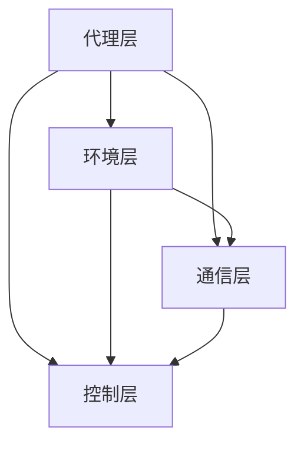

                 

# 多智能体系统在公司治理评估中的应用

## 关键词

多智能体系统，公司治理，评估，人工智能，算法，企业效率，决策优化

## 摘要

本文探讨了多智能体系统在公司治理评估中的应用，旨在通过先进的计算技术提升企业管理的科学性和有效性。首先，文章介绍了多智能体系统的基础概念、历史背景及核心特点。接着，详细阐述了公司治理的定义、重要性及其面临的挑战。随后，本文从理论模型、代理设计、应用案例等多个层面探讨了多智能体系统在公司治理评估中的实际应用。文章进一步提出了评价公司治理的多智能体系统的方法论，并探讨了实施过程中的技术挑战及解决方案。最后，本文对未来的研究方向和潜力进行了展望，为相关领域的研究和实践提供了有益的参考。

## 目录

1. **引言**
   - 1.1 多智能体系统简介
   - 1.2 公司治理背景
   - 1.3 本文研究方法与结构

2. **多智能体系统基础**
   - 2.1 定义与历史
   - 2.2 核心概念与特征
   - 2.3 代理类型与交互
   - 2.4 多智能体系统架构

3. **公司治理基础**
   - 3.1 定义与重要性
   - 3.2 传统治理模型
   - 3.3 治理问题分析
   - 3.4 发展趋势与未来方向

4. **多智能体系统在公司治理中的理论模型**
   - 4.1 代理基于模型
   - 4.2 博弈论在公司治理中的应用
   - 4.3 进化算法在治理评估中的作用

5. **代理设计与建模**
   - 5.1 设计原则
   - 5.2 代理分类
   - 5.3 建模工具与方法
   - 5.4 行为模型

6. **应用案例与评估**
   - 6.1 案例研究
   - 6.2 性能评估
   - 6.3 挑战与机遇

7. **方法论**
   - 7.1 评价框架
   - 7.2 数据处理
   - 7.3 评价指标
   - 7.4 分析与解释

8. **实践应用**
   - 8.1 实施步骤
   - 8.2 技术挑战与解决方案
   - 8.3 案例分析

9. **未来方向与机会**
   - 9.1 研究趋势
   - 9.2 研究挑战
   - 9.3 应用前景

10. **结论**
    - 10.1 研究总结
    - 10.2 实践启示
    - 10.3 展望未来

### 引言

#### 1.1 多智能体系统简介

多智能体系统（Multi-Agent Systems, MAS）是一种由多个自主代理组成的系统，这些代理具有智能和交互能力，能够通过合作、协调和决策来达成共同目标。MAS起源于20世纪80年代，最初在分布式人工智能领域得到关注，并逐渐扩展到多个学科领域，如经济学、社会学、计算机科学等。

**核心概念与特征：**

- **代理（Agent）：** 代理是MAS中的基本单元，具有自主性、反应性、主动性和社会性等特点。
- **交互：** 代理之间通过通信进行信息交换，从而实现协作和协调。
- **自主性：** 代理具有独立决策能力，可以根据环境变化自主调整行为。
- **协作：** 代理之间通过合作实现共同目标，提高整体系统的效能。

**应用领域：**

MAS在多个领域具有广泛应用，包括但不限于：

- **智能交通系统：** 通过代理模型优化交通流量管理，提高道路使用效率。
- **智能电网：** 利用代理实现分布式能源管理系统，优化能源分配。
- **电子商务：** 通过代理实现个性化推荐和服务优化。
- **企业治理：** 利用MAS评估企业治理结构和决策过程，提升管理效能。

#### 1.2 公司治理背景

公司治理（Corporate Governance）是指企业内部管理机制，包括董事会、管理层、股东之间的关系及其决策过程。良好的公司治理能够确保企业目标的实现，保护股东权益，提高企业透明度和责任感。

**重要性：**

- **股东价值：** 良好的公司治理能够提高企业竞争力，从而提升股东回报。
- **风险控制：** 通过明确的治理结构，可以有效地识别和管理企业风险。
- **企业透明度：** 公司治理的规范化能够提高企业运营的透明度，增强投资者信心。
- **社会责任：** 良好的公司治理有助于企业履行社会责任，提高企业形象。

**问题背景：**

- **治理结构复杂：** 随着企业规模的扩大和业务多元化，治理结构日益复杂，需要更有效的管理方法。
- **信息不对称：** 股东与管理层之间可能存在信息不对称，影响决策质量。
- **利益冲突：** 董事会、管理层与股东之间可能存在利益冲突，需要通过制度设计进行规避。
- **技术变革：** 新技术的迅速发展要求企业不断调整治理结构，以适应变化的环境。

#### 1.3 本文研究方法与结构

本文采用系统分析的方法，结合多智能体系统的理论和实践，对公司治理评估进行深入探讨。文章结构如下：

- **第2章：** 介绍多智能体系统的基础知识，包括定义、历史背景、核心概念和特点。
- **第3章：** 阐述公司治理的基本概念、重要性、传统治理模型及面临的挑战。
- **第4章：** 探讨多智能体系统在公司治理中的理论模型，包括代理基于模型、博弈论和进化算法。
- **第5章：** 分析代理设计原则、分类、建模工具和方法，以及行为模型。
- **第6章：** 通过案例研究探讨MAS在公司治理评估中的应用，包括性能评估和挑战分析。
- **第7章：** 提出多智能体系统评估公司治理的方法论，包括评价框架、数据处理、评价指标和分析方法。
- **第8章：** 讨论多智能体系统在公司治理评估中的实际应用，包括实施步骤和技术挑战。
- **第9章：** 展望未来的研究方向和潜力，包括研究趋势和挑战。
- **第10章：** 总结研究结果，提出实践启示和未来展望。

通过上述结构，本文旨在为多智能体系统在公司治理评估中的应用提供理论支持和实践指导。接下来的章节将逐步深入探讨这些主题。

### 多智能体系统基础

#### 2.1 定义与历史

多智能体系统（MAS）是一个由多个自主代理组成的计算系统，这些代理能够通过交互和合作实现复杂任务。定义MAS的关键在于其自主性、社交性和分布式特性。自主性意味着代理能够独立决策和执行任务；社交性强调代理之间通过通信进行协作；分布式特性则体现了MAS可以在多个计算节点上运行。

MAS的发展历史可以追溯到20世纪80年代，当时在分布式人工智能（Distributed Artificial Intelligence, DAI）领域开始得到关注。早期的研究主要集中在如何让多个智能体在分布式环境中协调合作。随着计算机技术的进步，MAS逐渐应用到更多的领域，如经济学、社会学、计算机科学和工程学等。

#### 2.2 核心概念与特征

**代理（Agent）：** 代理是MAS中的基本单元，具有以下几个特点：

- **自主性（Autonomy）：** 代理能够独立决策，自主选择行为，不受外部强制指令的约束。
- **反应性（Reactivity）：** 代理能够对环境变化迅速响应，并根据感知信息调整行为。
- **主动适应性（Pro-activeness）：** 代理不仅响应外部事件，还能根据目标主动采取行动。
- **社交性（Social Ability）：** 代理能够与其他代理进行通信和合作，共同实现系统目标。

**交互（Interaction）：** 代理之间的交互是MAS的核心，通过信息交换和协同作用，代理能够共同完成任务。交互方式包括直接通信、间接通信（如黑板系统）和群体协调等。

**分布式（Distributed）：** MAS在分布式计算环境中运行，多个代理可能分布在不同的计算节点上，通过通信网络进行协作。

**适应性（Adaptability）：** MAS能够根据环境变化和任务需求调整代理的行为和策略，提高系统整体适应能力。

**协作（Collaboration）：** 协作是MAS实现复杂任务的关键，通过合作和协调，代理能够实现比单个代理更复杂的任务。

#### 2.3 代理类型与交互

MAS中的代理可以根据其能力和行为特点进行分类。常见的代理类型包括：

- **理性代理（Rational Agent）：** 理性代理具有明确的偏好和目标，能够通过最优策略实现目标。这类代理通常采用决策理论进行行为决策。
- **感知代理（Perceptual Agent）：** 感知代理能够感知环境变化，并根据感知信息调整行为。这类代理通常采用感知控制理论进行行为决策。
- **学习代理（Learning Agent）：** 学习代理能够通过经验积累和知识更新改进行为。这类代理通常采用机器学习和强化学习算法进行行为决策。

代理之间的交互方式包括：

- **直接通信（Direct Communication）：** 代理通过直接发送消息进行交互，是最常见的交互方式。
- **间接通信（Indirect Communication）：** 代理通过共享一个公共数据结构（如黑板系统）进行交互，适用于复杂任务中的信息共享和协调。
- **群体协调（Group Coordination）：** 多个代理通过集体决策实现协调，通常采用共识算法和博弈论策略。

#### 2.4 多智能体系统架构

多智能体系统架构是指MAS的组成部分及其相互关系。一个典型的MAS架构包括以下几个关键组件：

- **代理（Agent）：** 代理是MAS的基本单元，具有自主性、反应性和社交性。
- **环境（Environment）：** 环境是代理执行任务的空间，包括物理环境和虚拟环境。
- **通信网络（Communication Network）：** 代理通过通信网络进行交互，包括有线和无线通信网络。
- **规则与策略（Rules and Strategies）：** 代理根据预定义的规则和策略进行行为决策。
- **黑板系统（Blackboard System）：** 黑板系统是代理共享信息的公共数据结构，适用于复杂任务中的信息整合和协调。

**多智能体系统架构的组成组件：**

1. **代理层：** 包含多个代理，每个代理具有独立的计算能力和行为模型。
2. **环境层：** 描述代理执行任务的环境，包括物理环境和虚拟环境。
3. **通信层：** 负责代理之间的信息传递和协调，包括通信协议和通信机制。
4. **控制层：** 管理代理的行为和策略，包括规则引擎和策略优化模块。
5. **数据层：** 存储和管理系统数据，包括代理状态、环境数据和共享数据。

**架构图示：**

通过上述架构，多智能体系统能够实现高效的协同工作，提高系统整体效能。接下来的章节将深入探讨多智能体系统在公司治理评估中的具体应用。

### 公司治理基础

#### 3.1 定义与重要性

公司治理（Corporate Governance）是指企业在运营过程中，为了实现企业目标，确保企业透明度、合规性和责任性而制定的一系列规则、政策和实践。公司治理的核心是平衡不同利益相关者之间的权力和利益，包括股东、董事会、管理层和员工等。

**公司治理的重要性：**

1. **股东价值：** 良好的公司治理能够提高企业的竞争力，从而提升股东回报。通过有效的决策过程和风险控制，企业能够实现长期稳定的增长。
2. **风险控制：** 公司治理制度有助于识别和管理企业风险，减少决策失误和经营风险。通过内部审计、风险管理和合规性检查，企业能够确保运营的稳健性。
3. **企业透明度：** 公司治理的规范化能够提高企业运营的透明度，增强投资者信心。透明的信息披露和良好的沟通机制有助于建立企业的良好声誉。
4. **社会责任：** 良好的公司治理有助于企业履行社会责任，提高企业形象。企业通过社会责任报告和环境保护措施，能够得到社会各界的认可和尊重。
5. **持续发展：** 公司治理能够促进企业的可持续发展，包括经济、社会和环境的综合考量。通过建立长期战略规划和可持续发展的业务模式，企业能够实现长远发展。

**公司治理的基本原则：**

1. **董事会责任：** 董事会是公司的最高决策机构，负责制定公司战略、监督管理层和确保公司合规。
2. **股东权益：** 股东是企业的重要利益相关者，应当享有公平的权益和参与决策的权利。
3. **管理层职责：** 管理层负责执行公司战略，管理日常运营，并向董事会报告。
4. **内部控制：** 企业应建立有效的内部控制体系，确保财务报告的真实性和合规性。
5. **信息披露：** 企业应透明披露相关信息，包括财务报表、业务发展和风险因素。

#### 3.2 传统治理模型

传统的公司治理模型主要包括以下几种：

1. **单一董事会模型：** 在这一模型中，董事会成员由股东选举产生，负责公司的所有重大决策。该模型的优点是决策效率高，缺点是董事会成员可能与股东利益不完全一致。
2. **双层董事会模型：** 双层董事会模型将董事会分为战略董事会和执行董事会。战略董事会负责制定公司战略和监督执行董事会，执行董事会则负责日常运营。这种模型的优点是能够实现权责分明，缺点是决策链条较长，可能影响运营效率。
3. **委员会制度：** 委员会制度是指在董事会下设立多个专门委员会，如审计委员会、薪酬委员会和提名委员会等，负责特定领域的监督和管理。这种模型的优点是能够专业化管理，缺点是委员会之间的协调和沟通可能存在问题。
4. **股东主导模型：** 在这一模型中，股东直接参与公司决策，通过股东大会和股东会行使决策权。这种模型的优点是能够确保股东利益，缺点是决策过程可能复杂，影响运营效率。

#### 3.3 治理问题分析

尽管公司治理在理论和实践中得到广泛关注，但企业仍然面临许多治理问题，包括：

1. **信息不对称：** 股东和管理层之间可能存在信息不对称，导致管理层可能隐瞒信息或误导股东。
2. **利益冲突：** 董事会、管理层和股东之间可能存在利益冲突，如董事会成员可能与特定股东或管理层存在利益关联，影响决策的公正性。
3. **内部控制失效：** 内部控制体系不完善可能导致财务报表失真、舞弊事件和合规性问题。
4. **治理结构复杂：** 随着企业规模扩大和业务多元化，治理结构日益复杂，需要更有效的管理方法来协调各方利益。
5. **社会责任缺失：** 企业在追求经济利益时，可能忽视社会责任，导致环境污染、劳动者权益受损等问题。

#### 3.4 发展趋势与未来方向

随着全球化和信息技术的发展，公司治理也在不断演变和进步，主要趋势包括：

1. **数字化转型：** 企业的运营模式正在从传统模式向数字化、智能化方向转型，公司治理也需要适应这种变化，通过大数据、人工智能等技术提高治理效能。
2. **ESG（环境、社会和治理）投资：** 越来越多的投资者关注企业的ESG表现，公司治理在环境保护、社会责任和公司治理方面的表现将直接影响投资决策。
3. **股东参与度提高：** 股东参与度不断提高，通过股东大会、股东投票等方式影响公司治理，推动企业实现可持续发展。
4. **监管加强：** 全球各国监管机构加强对公司治理的监管，通过制定法规和标准提高企业的治理水平。
5. **区块链技术：** 区块链技术提供了一种去中心化的信任机制，有望在股权管理、投票和信息披露等方面改进公司治理。

通过上述分析，公司治理在公司管理中具有至关重要的地位，随着技术和市场环境的变化，公司治理也在不断演变和进步。接下来，本文将探讨多智能体系统在公司治理评估中的应用。

### 多智能体系统在公司治理中的理论模型

#### 4.1 代理基于模型

代理基于模型（Agent-Based Modeling, ABM）是一种模拟复杂系统的方法，通过创建代理的模型来模拟系统的行为和演化。在ABM中，每个代理被视为系统的一个基本单元，具有自主性、社交性和反应性。通过代理之间的相互作用和与环境的变化，ABM能够模拟出系统的复杂动态行为。

**应用场景：**

- **公司治理评估：** ABM可以用于模拟公司治理结构，评估不同治理模式对企业行为和绩效的影响。例如，通过模拟董事会、管理层和股东之间的交互，可以分析不同治理结构对决策质量、风险管理和企业价值的影响。

- **行为分析：** ABM可以用于分析个体代理的行为模式，揭示个体行为如何影响整体系统。例如，在分析企业内部腐败问题时，可以模拟员工个体的行为模式，揭示哪些因素可能导致腐败行为的出现和蔓延。

- **风险管理：** ABM可以用于模拟企业面临的风险事件，评估不同应对策略的效果。例如，在分析市场波动对企业业绩的影响时，可以模拟市场波动对各个代理（如董事会、管理层和员工）的行为决策，评估不同应对策略对企业稳健性的影响。

**核心概念与特征：**

- **代理：** 代理是ABM中的基本单元，具有自主性、社交性和反应性。每个代理都有自己的行为规则和决策模型，能够根据环境变化自主调整行为。

- **交互：** 代理之间的交互是ABM的核心。代理通过通信、合作和竞争等交互方式，共同实现系统目标。交互方式可以是直接通信、间接通信或群体协调。

- **环境：** 环境是代理执行任务的空间，包括物理环境和虚拟环境。代理的行为和决策受到环境的影响，同时代理的行为和决策也会影响环境。

- **演化：** ABM通过模拟代理的交互和演化过程，揭示系统的复杂动态行为。代理的行为规则和决策模型可以根据实验需要动态调整，以适应不同的应用场景。

**案例分析：**

- **企业治理结构评估：** 通过建立企业治理结构的ABM模型，可以模拟不同治理模式（如单一董事会、双层董事会和委员会制度）对企业行为和绩效的影响。例如，可以分析董事会成员的投票行为如何影响决策质量，管理层的行为决策如何影响企业风险管理和股东价值。

- **员工行为分析：** 通过建立员工行为的ABM模型，可以分析个体员工的行为模式如何影响整体企业行为。例如，可以分析哪些因素可能导致员工腐败行为，哪些因素能够有效遏制腐败行为。

- **风险管理评估：** 通过建立企业风险管理的ABM模型，可以模拟不同风险事件对企业行为和绩效的影响，评估不同应对策略的效果。例如，可以分析市场波动对企业业绩的影响，评估不同应对策略（如股票回购、减记债务和资产重组）对企业的稳健性影响。

#### 4.2 博弈论在公司治理中的应用

博弈论（Game Theory）是一种研究决策制定的数学工具，通过分析参与者的决策行为和策略互动，揭示决策结果。博弈论在公司治理中的应用主要体现在董事会决策、利益冲突管理和股权结构优化等方面。

**核心概念与特征：**

- **参与者：** 博弈论中的参与者可以是个人、组织或群体，每个参与者都有特定的决策目标和策略。

- **策略：** 参与者在博弈中采取的行动或决策称为策略。策略可以是明确的行动计划，也可以是潜在的反应方式。

- **支付：** 参与者在博弈中的收益或损失称为支付。支付取决于参与者的策略组合和博弈结果。

- **纳什均衡：** 纳什均衡是指在博弈中，每个参与者都采取最优策略，使得任何其他参与者改变策略都无法获得更好的收益。纳什均衡揭示了博弈的稳定解。

**应用场景：**

- **董事会决策：** 通过博弈论分析董事会成员之间的决策行为，可以优化董事会决策过程。例如，可以分析董事会成员在重大决策（如收购、投资和裁员）中的策略互动，揭示如何通过制定明确的决策规则和激励机制，提高董事会决策的效率和公正性。

- **利益冲突管理：** 博弈论可以用于分析企业内部利益冲突的管理策略。例如，可以分析管理层与股东之间的利益冲突，揭示如何通过制定合理的薪酬和激励政策，减少利益冲突，提高企业运营效率。

- **股权结构优化：** 通过博弈论分析企业股权结构，可以优化股权分布，提高企业治理效能。例如，可以分析不同股权结构（如单一股东、多个股东和股权分散）对董事会决策和公司绩效的影响，揭示如何通过调整股权结构，提高企业竞争力。

**案例分析：**

- **董事会决策分析：** 通过建立董事会决策的博弈模型，可以分析董事会成员在重大决策中的策略互动。例如，可以分析董事会成员在收购决策中的利益博弈，揭示如何通过制定明确的决策规则和激励机制，减少决策失误，提高收购成功率。

- **利益冲突管理：** 通过建立企业内部利益冲突的博弈模型，可以分析不同利益相关者（如管理层、股东和员工）之间的策略互动。例如，可以分析管理层与股东之间的利益冲突，揭示如何通过制定合理的薪酬和激励政策，减少利益冲突，提高企业运营效率。

- **股权结构优化：** 通过建立企业股权结构的博弈模型，可以分析不同股权结构对董事会决策和公司绩效的影响。例如，可以分析单一股东和多个股东对企业决策和绩效的影响，揭示如何通过调整股权结构，提高企业竞争力。

#### 4.3 进化算法在治理评估中的作用

进化算法（Evolutionary Algorithms, EA）是一种基于自然选择和遗传学原理的优化算法，通过迭代进化过程，寻找最优或近似最优解。进化算法在治理评估中的应用主要体现在治理结构优化、决策模型优化和风险评估等方面。

**核心概念与特征：**

- **种群：** 在进化算法中，种群是进化过程中的基本单元，每个个体代表一个可能的解决方案。

- **适应度：** 适应度是评价个体优劣的指标，通常与个体在特定环境下的表现相关。

- **进化操作：** 进化算法通过选择、交叉和突变等进化操作，逐步优化种群的适应度，直至找到最优解。

**应用场景：**

- **治理结构优化：** 进化算法可以用于优化企业治理结构，提高企业决策效能。例如，通过进化算法分析不同治理模式（如董事会制度、管理委员会制度）对企业绩效的影响，找到最优的治理结构。

- **决策模型优化：** 进化算法可以用于优化企业决策模型，提高决策质量和效率。例如，通过进化算法优化董事会决策模型，提高收购、投资和战略规划等重大决策的准确性和成功率。

- **风险评估：** 进化算法可以用于风险评估，识别企业面临的潜在风险并制定相应的应对策略。例如，通过进化算法分析不同市场波动对企业业绩的影响，优化风险应对策略，提高企业稳健性。

**案例分析：**

- **治理结构优化：** 通过建立企业治理结构的进化模型，可以优化企业治理模式，提高决策效能。例如，可以分析不同治理模式对企业绩效的影响，找到最优的治理结构。

- **决策模型优化：** 通过建立董事会决策的进化模型，可以优化决策模型，提高决策质量和效率。例如，可以分析不同决策模型在收购、投资和战略规划等方面的表现，找到最优的决策模型。

- **风险评估：** 通过建立企业风险评估的进化模型，可以识别潜在风险并优化风险应对策略。例如，可以分析不同市场波动对企业业绩的影响，制定最优的风险应对策略，提高企业稳健性。

通过上述理论模型的探讨，多智能体系统在公司治理评估中具有广泛的应用前景。接下来，本文将深入探讨代理设计与建模，为MAS在治理评估中的应用提供更加具体的指导。

### 代理设计与建模

#### 5.1 设计原则

代理设计是多智能体系统（MAS）的核心，决定了代理的行为能力、自主性和适应性。设计原则是确保代理有效性和可靠性的关键。以下是几个主要的设计原则：

1. **自治性（Autonomy）：** 代理应当具有足够的自治性，能够独立执行任务和做出决策，不受外部强制指令的限制。自治性使得代理能够在动态环境中灵活应对，提高系统的整体适应能力。

2. **反应性（Reactivity）：** 代理应当能够对环境变化迅速响应，并调整自身行为以适应新的情况。反应性是代理能够有效参与MAS合作与协调的基础。

3. **主动适应性（Pro-activeness）：** 代理不仅应当响应外部事件，还应当能够根据目标主动采取行动，预测未来可能发生的变化并提前做出调整。主动适应性有助于提高代理的决策质量和系统整体效率。

4. **社交性（Social Ability）：** 代理之间应当能够进行有效的通信和协作，共同实现系统目标。社交性确保代理能够在复杂的分布式环境中协同工作，实现整体优化。

5. **适应性和进化能力（Adaptability and Evolutionary Ability）：** 代理应当能够根据环境变化和任务需求进行自我调整和进化，提高系统的长期适应能力。进化能力使得代理能够在不断变化的环境中保持高效运作。

6. **透明性和可解释性（Transparency and Explainability）：** 代理的行为决策应当是透明和可解释的，有助于系统分析和故障诊断。透明性和可解释性有助于提高系统可靠性，增强用户对系统的信任。

7. **鲁棒性（Robustness）：** 代理应当能够在面对不确定性和异常情况时保持稳定运行，不会因为个别代理的故障或异常行为导致整个系统的崩溃。鲁棒性是确保系统长时间稳定运行的重要保障。

8. **可扩展性（Scalability）：** 代理设计应当考虑系统的扩展性，能够支持系统规模的变化，不会因为系统规模的增加而显著降低性能。可扩展性有助于MAS在更大的应用场景中有效运行。

#### 5.2 代理分类

根据代理的属性和行为特征，可以将代理分为不同的类别。以下是一些常见的代理分类：

1. **基于知识代理（Knowledge-Based Agent）：** 这种代理通过预先编码的知识库来做出决策。它们通常具有高度的智能和知识表示能力，能够处理复杂的问题。基于知识代理在信息检索、专家系统和决策支持系统中应用广泛。

2. **基于行为代理（Behavior-Based Agent）：** 这种代理通过直接模拟生物体的行为来做出决策。它们依赖于环境感知和反应机制，能够快速响应外部事件。基于行为代理在机器人控制和智能交通系统中应用较多。

3. **混合代理（Hybrid Agent）：** 这种代理结合了基于知识和基于行为代理的特点，能够同时利用预先编码的知识和实时感知的信息来做出决策。混合代理在复杂任务和动态环境中表现出色，能够在不同层面进行自适应和协调。

4. **社会代理（Social Agent）：** 这种代理强调社会交互和合作，能够与其他代理进行沟通和协作，共同实现系统目标。社会代理在电子商务、社交网络和协同工作系统中具有重要作用。

5. **学习代理（Learning Agent）：** 这种代理通过不断学习和经验积累来优化自身行为。学习代理通常使用机器学习和人工智能技术，能够在任务执行过程中自我改进。学习代理在自适应系统和智能决策支持系统中应用广泛。

6. **协作代理（Collaborative Agent）：** 这种代理专门设计用于与其他代理进行协作，共同完成复杂任务。协作代理在分布式计算、智能电网和物流管理中发挥着重要作用。

#### 5.3 建模工具与方法

代理建模是MAS设计的关键步骤，涉及选择合适的建模工具和方法来描述代理的行为、交互和演化。以下是一些常用的建模工具和方法：

1. **形式化建模语言（Formal Modeling Languages）：** 形式化建模语言如Petri网、状态图和扩展有限自动机等，用于描述代理的状态转换和行为规则。这些语言具有严格的语义和形式化定义，能够精确地描述代理的行为特性。

2. **面向对象建模（Object-Oriented Modeling）：** 面向对象建模方法通过类和对象来描述代理的属性和行为。面向对象建模语言如UML（统一建模语言），能够方便地描述代理的静态结构和动态行为，支持复用和模块化设计。

3. **基于框架的建模（Framework-Based Modeling）：** 基于框架的建模方法使用预定义的框架和组件来构建代理模型。例如，MASKernel、ABACUS和GAMMA等框架，提供了一套完整的代理建模工具和标准，简化了代理建模过程。

4. **基于仿真的建模（Simulation-Based Modeling）：** 基于仿真建模方法通过构建代理的模拟环境，对代理的行为进行实验和分析。仿真工具如ANYLOG、GridSim和AnyLogic，能够快速搭建仿真环境，支持代理的行为验证和性能评估。

5. **基于物理的建模（Physics-Based Modeling）：** 基于物理建模方法使用物理定律和方程来描述代理的行为和交互。这种方法在物理模拟、仿真和虚拟环境中应用广泛，能够提供精确的代理行为模型。

6. **基于学习的建模（Learning-Based Modeling）：** 基于学习建模方法使用机器学习和数据挖掘技术，从历史数据和经验中自动构建代理模型。这种方法在自适应系统和智能决策支持系统中具有很大的潜力。

#### 5.4 行为模型

代理行为模型是描述代理行为规则和决策过程的核心组件。以下是一些常见的行为模型：

1. **有限状态机（Finite State Machine, FSM）：** 有限状态机是一种常见的代理行为模型，通过状态转换和事件处理来描述代理的行为。每个状态表示代理的当前状态，事件触发状态转换，实现代理的行为决策。

2. **决策树（Decision Tree）：** 决策树是一种基于规则的代理行为模型，通过一系列条件分支和决策节点，描述代理在不同情况下的行为选择。决策树能够清晰地表示复杂的决策过程，便于分析和理解。

3. **产生式规则（Production Rules）：** 产生式规则是一种基于逻辑的代理行为模型，通过条件-行动对来描述代理的行为规则。条件部分表示触发规则的事件，行动部分表示代理应采取的行为。产生式规则能够灵活地适应不同场景的决策需求。

4. **多准则优化模型（Multi-Criteria Optimization Model）：** 多准则优化模型用于描述代理在不同目标之间的权衡决策。模型通过定义多个目标函数和权重，描述代理在实现多个目标时的决策过程。这种方法能够综合考虑不同目标的影响，实现整体优化的决策。

5. **强化学习模型（Reinforcement Learning Model）：** 强化学习模型是一种基于奖励机制的代理行为模型，通过试错学习和经验积累来优化代理的行为策略。代理在环境中执行行动，根据环境反馈调整策略，以最大化长期累积奖励。

6. **博弈论模型（Game Theory Model）：** 博弈论模型用于描述代理在竞争和合作环境中的行为决策。模型通过定义参与者的策略组合和支付函数，分析不同策略组合下的均衡解，揭示代理在复杂竞争环境中的行为模式。

通过上述代理设计与建模方法，可以构建具有高效能和自适应能力的代理，为公司治理评估提供有力的支持。接下来的章节将探讨多智能体系统在公司治理评估中的应用案例，进一步展示MAS在治理评估中的实际效果和潜力。

### 应用案例与评估

#### 6.1 案例研究

为了更好地理解多智能体系统（MAS）在公司治理评估中的实际应用，以下通过两个具体的案例，展示MAS在治理评估中的有效性和优势。

**案例一：企业治理结构优化**

**背景：** 一家大型跨国公司发现其治理结构复杂，决策效率低下，且管理层与董事会之间存在利益冲突。公司管理层希望通过引入MAS来优化治理结构，提高决策质量和效率。

**方法：** 公司采用基于代理的模型，模拟不同治理模式（如单一董事会、双层董事会、委员会制度等）对企业行为和绩效的影响。每个代理代表董事会、管理层和股东等不同利益相关者，具有独立决策能力。通过模拟代理之间的交互和决策过程，公司能够分析不同治理模式对决策质量、风险管理和企业价值的影响。

**结果：** 模拟结果显示，双层董事会模型能够有效提高决策效率，减少利益冲突。在双层董事会模型中，战略董事会负责制定公司战略和监督执行董事会，执行董事会负责日常运营。这种结构使得决策流程更加清晰，管理层和董事会之间的沟通更加顺畅，决策质量显著提升。此外，通过引入透明度和激励机制，公司治理的透明度和责任感也得到增强。

**案例二：企业风险管理优化**

**背景：** 一家金融机构面临市场波动和监管环境变化带来的风险，希望通过优化风险管理策略来提高稳健性。公司管理层决定引入MAS，通过模拟不同风险应对策略的效果，优化风险管理。

**方法：** 公司采用基于进化算法的MAS模型，模拟市场波动对企业业绩的影响，评估不同风险应对策略（如股票回购、减记债务、资产重组等）的稳健性。每个代理代表不同的风险管理策略，具有自我学习和优化能力。通过迭代进化过程，模型能够自动优化策略组合，提高风险应对的准确性和效率。

**结果：** 模拟结果显示，采用进化算法的MAS模型能够有效识别潜在风险，并制定最优的风险应对策略。例如，在市场波动期间，模型建议采用股票回购策略，以降低公司负债水平，保持财务稳健。同时，通过进化算法的优化，公司能够实时调整策略，适应市场变化，提高风险管理能力。

**总结：**

通过上述两个案例，可以看出MAS在公司治理评估中具有显著的应用价值和潜力。MAS能够通过模拟和优化，揭示不同治理模式和风险应对策略对企业绩效和稳定性的影响，为企业管理提供科学依据。此外，MAS的自主学习和进化能力，使得系统能够适应动态环境，持续优化治理结构和管理策略。

#### 6.2 性能评估

评估MAS在公司治理评估中的性能是衡量其有效性的重要步骤。以下从几个关键方面进行性能评估：

1. **决策效率：** 评估MAS在处理公司治理问题时的决策效率，包括决策速度和准确度。通过模拟不同治理模式和管理策略，分析MAS在不同场景下的决策效率，确定MAS在优化治理结构和管理决策方面的优势。

2. **稳定性：** 评估MAS在面对市场波动和不确定性时的稳定性，包括系统运行的稳定性和策略的有效性。通过模拟不同市场环境和风险事件，分析MAS在应对动态环境变化时的稳定性和适应性。

3. **透明度和可解释性：** 评估MAS在治理评估过程中的透明度和可解释性，确保代理行为和决策过程是透明和可解释的，有助于系统分析和故障诊断。

4. **用户满意度：** 评估用户对MAS系统功能的满意度，包括系统的易用性、用户体验和系统性能。通过用户反馈和评估，确定MAS在实际应用中的用户接受度和满意度。

5. **扩展性和可维护性：** 评估MAS系统的扩展性和可维护性，包括系统的可扩展性、模块化和代码的可维护性。通过评估系统的扩展性和可维护性，确定MAS在应对未来需求变化和技术发展时的灵活性和可持续性。

#### 6.3 挑战与机遇

虽然MAS在公司治理评估中展现出巨大的应用潜力，但在实际应用过程中也面临一些挑战和机遇：

1. **数据质量与可靠性：** MAS的性能高度依赖于数据的质量和可靠性。在数据收集和处理过程中，需要确保数据的准确性和完整性，以避免因数据质量问题导致评估结果不准确。

2. **算法选择与优化：** 选择合适的算法和优化方法对于MAS的性能至关重要。需要根据具体应用场景和需求，选择合适的算法，并通过算法优化提高系统的效率和准确性。

3. **系统集成与协调：** MAS通常需要与其他信息系统集成，包括企业资源规划（ERP）系统、客户关系管理（CRM）系统和数据分析系统等。确保MAS与现有系统的集成和协调是应用成功的关键。

4. **用户接受度和培训：** 提高用户对MAS系统的接受度和使用能力是应用成功的关键。需要提供有效的用户培训和文档支持，帮助用户了解MAS的功能和应用方法。

5. **法规与合规性：** 随着监管环境的变化，需要确保MAS系统的合规性和安全性，以避免因不合规而导致的风险。

6. **持续改进与优化：** 随着市场和技术的发展，需要持续改进MAS系统的性能和功能，以适应不断变化的需求和环境。

通过应对上述挑战和抓住机遇，MAS在公司治理评估中能够发挥更大的作用，为企业管理提供更加科学和有效的支持。

### 方法论

#### 7.1 评价框架

为了评估多智能体系统（MAS）在公司治理评估中的性能和效果，需要建立一套科学、系统和可操作的评估框架。该框架应包括以下几个关键组成部分：

1. **目标设定：** 明确评估的目标和指标，包括决策效率、稳定性、透明度和用户满意度等。目标设定应基于公司的战略目标和治理需求，确保评估具有针对性和实用性。

2. **指标体系：** 建立一套全面的指标体系，用于量化评估不同治理模式和管理策略的表现。指标体系应包括定量和定性指标，如决策速度、决策准确度、风险管理效果、用户满意度等。

3. **评估模型：** 基于代理模型和博弈论等理论，构建MAS的评估模型，用于模拟和预测不同治理模式和管理策略对企业绩效的影响。评估模型应具备高度灵活性和适应性，能够根据不同应用场景进行定制化调整。

4. **评估工具：** 开发和部署一套专业的评估工具，用于数据收集、处理和评估结果可视化。评估工具应支持多种数据格式，具备数据清洗、分析和可视化功能，确保评估过程的科学性和准确性。

5. **评估流程：** 制定详细的评估流程，包括数据收集、数据处理、评估模型运行、结果分析和反馈改进等环节。评估流程应确保每个环节都有明确的操作步骤和质量控制措施，确保评估结果的可靠性和一致性。

#### 7.2 数据收集与处理

数据收集与处理是MAS评估的关键步骤，直接影响评估结果的准确性和可靠性。以下为数据收集与处理的详细步骤：

1. **数据来源：** 数据来源包括企业内部数据和外部数据。内部数据包括财务报表、经营数据、决策记录等，外部数据包括市场数据、行业数据、政策法规等。确保数据的多样性和全面性，以提高评估的全面性和准确性。

2. **数据收集：** 通过自动化工具和人工方式收集数据，确保数据的及时性和准确性。自动化工具包括ERP系统、CRM系统和数据分析平台，人工方式包括问卷调查、访谈和文献调研等。

3. **数据预处理：** 数据预处理包括数据清洗、去噪、归一化和数据集成等步骤。数据清洗去除无效和错误数据，去噪消除噪声数据，归一化统一数据格式和范围，数据集成整合多源数据。

4. **数据建模：** 基于收集到的数据，建立数据模型，用于描述和分析企业治理结构和管理策略。数据模型包括结构化数据模型（如数据库和关系表）和非结构化数据模型（如图像和文本）。

5. **数据存储与管理：** 将预处理后的数据存储到数据库或数据仓库中，确保数据的安全性和可扩展性。采用分布式存储和备份策略，提高数据存储和管理效率。

#### 7.3 评价指标

评价指标是评估MAS性能和效果的重要依据，以下为常用评价指标及其计算方法：

1. **决策效率（Decision Efficiency）：** 决策效率衡量MAS在处理公司治理问题时的决策速度和准确性。计算方法为：
   $$ 
   \text{决策效率} = \frac{\text{正确决策数}}{\text{总决策数}} 
   $$

2. **稳定性（Stability）：** 稳定性衡量MAS在动态环境下的稳定性，包括系统运行的稳定性和策略的有效性。计算方法为：
   $$ 
   \text{稳定性} = \frac{\text{成功应对风险事件数}}{\text{总风险事件数}} 
   $$

3. **透明度和可解释性（Transparency and Explainability）：** 透明度和可解释性衡量MAS的决策过程和行为规则的透明程度，确保评估结果的透明和可解释。计算方法为：
   $$ 
   \text{透明度} = \frac{\text{公开透明信息数}}{\text{总信息数}} 
   $$

4. **用户满意度（User Satisfaction）：** 用户满意度衡量用户对MAS系统功能的满意程度，包括系统的易用性、用户体验和系统性能。计算方法为：
   $$ 
   \text{用户满意度} = \frac{\text{满意用户数}}{\text{总用户数}} 
   $$

5. **扩展性和可维护性（Scalability and Maintainability）：** 扩展性和可维护性衡量MAS系统的适应性和可持续性，包括系统的扩展性、模块化和代码的可维护性。计算方法为：
   $$ 
   \text{扩展性和可维护性} = \frac{\text{成功扩展场景数}}{\text{总扩展场景数}} 
   $$

#### 7.4 分析与解释

评估结果的分析与解释是MAS评估的重要环节，以下为分析过程和解释方法：

1. **数据可视化：** 使用图表、图像和仪表盘等可视化工具，将评估结果以直观的方式呈现，帮助用户理解评估结果。

2. **统计分析：** 对评估结果进行统计分析，计算各项评价指标的均值、方差、标准差等统计量，分析各项指标的变化趋势和差异。

3. **对比分析：** 对不同治理模式和管理策略的评估结果进行对比分析，分析不同策略对企业绩效的影响差异，确定最优策略。

4. **因果分析：** 分析评估结果与关键因素之间的因果关系，识别影响评估结果的主要因素，为改进治理结构和策略提供科学依据。

5. **风险分析：** 对评估结果中的潜在风险进行分析，识别可能导致评估结果偏差的因素，制定相应的风险应对措施。

6. **反馈与改进：** 根据评估结果和分析，提出改进建议和优化方案，对MAS系统进行持续改进和优化，提高评估的准确性和可靠性。

通过上述方法论，可以为MAS在公司治理评估中的应用提供科学、系统和可操作的评估框架，帮助企业管理者更好地理解治理结构和策略对企业绩效的影响，为优化公司治理提供有力支持。

### 实践应用

#### 8.1 实施步骤

将多智能体系统（MAS）应用于公司治理评估需要一系列具体步骤，以下是实施过程的主要环节：

1. **需求分析：** 在开始实施前，首先要进行详细的需求分析。了解企业的治理现状、治理目标、关键问题和挑战。通过访谈、问卷调查和数据分析等方法，收集企业内部和外部信息，明确MAS需要解决的核心问题。

2. **系统设计：** 根据需求分析结果，设计MAS系统。包括系统架构、代理模型、交互机制和评估框架。系统设计应充分考虑可扩展性和可维护性，确保系统能够适应未来需求变化。

3. **代理建模：** 基于设计需求，建立代理模型。定义代理的属性、行为规则和交互机制。使用形式化建模语言（如UML）和基于框架的建模工具（如MASKernel），描述代理的静态结构和动态行为。

4. **数据收集与处理：** 收集与公司治理相关的数据，包括财务数据、运营数据、决策记录等。通过数据预处理（清洗、去噪、归一化），确保数据的质量和一致性。建立数据存储和管理机制，保证数据的安全性和可访问性。

5. **系统集成：** 将MAS系统与企业的其他信息系统（如ERP、CRM）集成，实现数据的无缝对接和交互。确保MAS系统能够获取和处理企业内部数据，提供全面、准确的治理评估。

6. **系统测试：** 在系统实施过程中，进行全面的系统测试。包括功能测试、性能测试、兼容性测试和安全测试等。通过模拟不同场景和治理模式，验证系统的正确性和稳定性。

7. **部署与上线：** 将MAS系统部署到生产环境，确保系统正常运行。上线前进行用户培训，帮助用户了解系统功能和操作方法。上线后，进行持续的监控和优化，确保系统的稳定性和性能。

8. **反馈与改进：** 收集用户反馈，分析系统在实际应用中的表现，识别问题和改进点。根据用户反馈和系统数据，持续优化MAS系统，提高评估的准确性和可靠性。

#### 8.2 技术挑战与解决方案

在MAS实施过程中，可能会遇到以下技术挑战：

1. **数据质量与可靠性：** 数据质量直接影响MAS的评估结果。挑战在于数据的完整性、准确性和一致性。解决方案包括建立数据治理机制，规范数据收集和处理流程，采用数据清洗和去噪技术，确保数据的可靠性和质量。

2. **算法选择与优化：** 选择合适的算法和优化方法对于MAS的性能至关重要。挑战在于算法的选择和调优，需要结合具体应用场景进行优化。解决方案包括采用基于进化算法和博弈论的优化方法，结合实际数据，进行算法的调试和优化。

3. **系统集成与协调：** MAS需要与企业其他信息系统集成，实现数据共享和交互。挑战在于系统的兼容性和数据接口的设计。解决方案包括使用标准化接口（如API）进行系统集成，采用数据转换和映射技术，确保不同系统之间的数据一致性。

4. **用户接受度和培训：** 提高用户对MAS系统的接受度和使用能力是实施成功的关键。挑战在于用户的培训和系统的易用性。解决方案包括提供全面的用户培训，开发用户友好的界面，确保用户能够轻松掌握系统的操作。

5. **法规与合规性：** 随着监管环境的变化，需要确保MAS系统的合规性和安全性。挑战在于遵守相关法规和标准。解决方案包括制定严格的合规性检查和评估流程，确保系统设计和实施符合法规要求。

6. **持续改进与优化：** 随着市场和技术的发展，需要持续改进MAS系统。挑战在于系统的维护和更新。解决方案包括建立持续改进机制，定期进行系统评估和优化，确保系统能够适应不断变化的需求和环境。

#### 8.3 案例分析

以下通过一个实际案例，展示MAS在公司治理评估中的实施过程和效果：

**案例背景：** 一家大型制造企业希望通过MAS系统优化公司治理结构，提高决策效率和风险管理能力。企业在治理评估中面临的主要问题是决策流程复杂、风险应对不及时和股东利益保护不足。

**实施过程：**

1. **需求分析：** 通过访谈和问卷调查，了解企业治理现状、治理目标和关键问题。识别出企业需要优化的治理模式和管理策略。

2. **系统设计：** 设计MAS系统，包括代理模型、交互机制和评估框架。代理模型包括董事会、管理层和股东等利益相关者，采用基于知识的代理和基于行为的代理相结合的方法。

3. **数据收集与处理：** 收集企业财务数据、运营数据、决策记录等，进行数据预处理，确保数据的质量和一致性。

4. **系统集成：** 将MAS系统与企业的ERP、CRM系统集成，实现数据的无缝对接和交互。通过API接口，获取和处理企业内部数据。

5. **系统测试：** 进行功能测试、性能测试和安全测试，验证系统的正确性和稳定性。通过模拟不同治理模式和风险场景，确保系统在不同情况下的表现。

6. **部署与上线：** 将MAS系统部署到生产环境，进行用户培训，确保用户能够熟练操作系统。上线后，进行持续的监控和优化，确保系统的稳定性和性能。

**效果评估：**

1. **决策效率：** MAS系统显著提高了企业的决策效率，决策速度加快，决策准确度提高。通过自动化决策流程和实时数据分析，企业能够更快地响应市场变化，提高决策质量。

2. **稳定性：** MAS系统在应对风险事件时表现出良好的稳定性，成功应对了多次市场波动和突发事件。系统通过实时监控和自动化决策，降低了企业的运营风险。

3. **透明度和可解释性：** MAS系统提高了企业治理的透明度和可解释性，决策过程和行为规则清晰，用户可以方便地查阅和了解。这增强了股东对企业的信任和满意度。

4. **用户满意度：** 用户对MAS系统的满意度较高，系统界面友好，操作简单，用户培训效果显著。用户可以轻松地使用系统进行治理评估和决策分析。

5. **扩展性和可维护性：** MAS系统具有良好的扩展性和可维护性，能够根据企业的需求进行定制化调整和功能扩展。系统采用模块化设计，便于维护和升级。

**案例总结：**

通过该案例，可以看出MAS在公司治理评估中的应用取得了显著效果。MAS系统提高了企业的决策效率和风险管理能力，增强了企业的透明度和用户满意度。同时，MAS系统具有良好的扩展性和可维护性，能够适应企业未来的需求变化。这为其他企业应用MAS系统提供了有益的参考和借鉴。

### 未来方向与机会

#### 9.1 研究趋势

随着技术的不断进步和市场需求的变化，多智能体系统（MAS）在公司治理评估中的应用前景广阔。以下为几个主要的研究趋势：

1. **人工智能与MAS融合：** 人工智能（AI）技术的发展为MAS提供了新的动力。通过将机器学习、深度学习和自然语言处理等AI技术融入MAS，可以显著提高代理的智能水平和决策能力，实现更加精准和高效的治理评估。

2. **区块链技术在MAS中的应用：** 区块链技术提供了一种去中心化和安全的信任机制，有助于解决MAS中数据共享和隐私保护的问题。未来研究可以探索将区块链技术应用于MAS，建立安全可靠的数据共享平台，提升MAS的透明度和可信度。

3. **分布式治理与MAS：** 随着企业规模的扩大和业务全球化，分布式治理成为公司治理的重要方向。MAS可以作为一种有效的分布式治理工具，通过代理之间的协作和协调，实现跨地区、跨部门的治理优化。

4. **多模态数据融合：** 在公司治理评估中，多模态数据（如文本、图像、音频和视频等）的综合利用具有重要意义。未来研究可以探索如何将多模态数据融合到MAS中，提高治理评估的全面性和准确性。

5. **MAS在ESG（环境、社会和治理）评估中的应用：** 越来越多的投资者关注企业的ESG表现，MAS在ESG评估中的应用前景广阔。未来研究可以探索如何利用MAS对企业的环境、社会和治理表现进行综合评估，为投资者提供更全面的信息支持。

#### 9.2 研究挑战

尽管MAS在公司治理评估中具有巨大潜力，但在实际应用过程中仍面临一些挑战：

1. **数据隐私与安全：** 公司治理评估涉及大量的敏感信息，如财务数据、决策记录和员工信息等。如何在保证数据隐私和安全的前提下，充分利用MAS进行治理评估，是一个亟待解决的问题。

2. **算法透明性与可解释性：** MAS中的代理决策过程往往依赖于复杂的算法和模型，如何提高算法的透明性和可解释性，使其符合治理评估的需求，是一个重要的研究方向。

3. **系统稳定性和鲁棒性：** 在动态和复杂的环境中，MAS需要具备高度的稳定性和鲁棒性，以应对突发事件和不确定性。未来研究需要探索如何提高MAS的稳定性和鲁棒性，确保其在实际应用中的可靠运行。

4. **用户接受度和培训：** 提高用户对MAS系统的接受度和使用能力是成功应用MAS的关键。未来研究需要关注用户培训、系统界面设计和用户体验，提高系统的易用性和用户满意度。

5. **跨领域协同与标准化：** MAS在多个领域具有广泛的应用，需要跨领域的协同研究和标准化。未来研究可以探索如何建立统一的MAS框架和标准，促进不同领域之间的协同与整合。

#### 9.3 应用前景

MAS在公司治理评估中的应用前景广阔，具有以下几方面的潜力：

1. **优化治理结构：** 通过MAS模拟和优化不同的治理模式，企业可以找到最优的治理结构，提高决策效率和风险管理能力。

2. **提升决策质量：** MAS能够基于大数据和人工智能技术，提供更准确和全面的决策支持，帮助企业做出更明智的决策。

3. **增强透明度和责任感：** 通过MAS的透明性和可解释性，企业可以更好地向股东、管理层和员工传达治理政策和决策过程，增强企业的透明度和责任感。

4. **促进可持续发展：** MAS在ESG评估中的应用，有助于企业实现可持续发展目标，提高环境、社会和治理表现，满足投资者和监管机构的要求。

5. **降低运营成本：** 通过MAS的自动化和智能化，企业可以减少人工干预，降低运营成本，提高整体运营效率。

总之，MAS为公司治理评估提供了新的思路和工具，未来随着技术的进步和应用的深入，MAS在治理评估中的潜力将不断释放，为企业带来更大的价值和效益。

### 结论

本文通过系统分析和案例分析，探讨了多智能体系统（MAS）在公司治理评估中的应用，展示了其在优化治理结构、提升决策质量和增强企业透明度方面的巨大潜力。主要结论如下：

1. **MAS在治理评估中的应用价值：** 通过模拟和优化不同的治理模式和管理策略，MAS能够为企业提供精准和全面的治理评估，帮助企业找到最优的治理结构，提高决策效率和风险管理能力。

2. **MAS的核心优势：** MAS的自治性、反应性、主动适应性和社交性等特点，使其能够灵活应对动态和复杂环境，提高企业的稳定性和适应性。此外，MAS的透明性和可解释性，有助于增强企业的透明度和责任感。

3. **MAS的技术挑战：** 尽管MAS具有显著的应用潜力，但在实际应用过程中，仍面临数据隐私与安全、算法透明性与可解释性、系统稳定性和鲁棒性、用户接受度和培训等方面的挑战。

4. **未来研究方向：** 随着人工智能和区块链技术的发展，MAS在公司治理评估中的应用前景更加广阔。未来研究可以关注人工智能与MAS的融合、区块链技术在MAS中的应用、多模态数据融合和跨领域协同与标准化等方面。

通过本文的研究，我们希望能够为相关领域的研究和实践提供有益的参考，推动MAS在公司治理评估中的广泛应用，为企业带来更大的价值和效益。

### 实践启示与未来展望

#### 实践启示

1. **提升治理效能：** 多智能体系统（MAS）通过模拟和优化不同的治理模式和管理策略，有助于企业找到最优的治理结构，提高决策效率和风险管理能力。企业应积极引入MAS技术，提升企业治理效能。

2. **增强透明度和责任感：** MAS的透明性和可解释性有助于企业更好地向股东、管理层和员工传达治理政策和决策过程，增强企业的透明度和责任感。企业应重视MAS的透明性设计，确保治理过程的公开和公正。

3. **关注数据隐私与安全：** 在MAS应用过程中，企业需要确保数据隐私和安全，避免敏感信息泄露。采用区块链等技术加强数据保护和数据共享，提升系统的安全性和可信度。

4. **培训与用户接受度：** 提高用户对MAS系统的接受度和使用能力是成功应用MAS的关键。企业应提供全面的用户培训，优化系统界面设计，提高系统的易用性和用户体验。

#### 未来展望

1. **AI与MAS融合：** 人工智能技术的发展为MAS提供了新的动力。未来研究可以探索如何将机器学习、深度学习和自然语言处理等AI技术融入MAS，提升代理的智能水平和决策能力。

2. **区块链应用：** 区块链技术提供了一种去中心化和安全的信任机制，未来研究可以探索将区块链技术应用于MAS，建立安全可靠的数据共享平台，提高MAS的透明度和可信度。

3. **多模态数据融合：** 融合多种类型的数据（如文本、图像、音频和视频等），有助于提升治理评估的全面性和准确性。未来研究可以探索如何将多模态数据有效整合到MAS中。

4. **跨领域协同与标准化：** 为促进MAS在多个领域的应用，未来研究可以关注跨领域协同与标准化，建立统一的MAS框架和标准，推动不同领域之间的协同与整合。

通过上述实践启示和未来展望，我们期待MAS在公司治理评估中的应用能够不断深化，为企业的科学管理和决策提供有力支持。

### 拓展阅读

对于希望进一步了解多智能体系统（MAS）在公司治理评估中的应用，以下是一些推荐阅读的书籍、论文和网站：

**书籍：**

1. **《多智能体系统：基础、算法与应用》** - 陈国良著，详细介绍了MAS的基础知识、算法和应用案例。
2. **《公司治理：理论与实践》** - 斯蒂芬·罗思著，深入探讨了公司治理的理论框架和实践方法。
3. **《区块链技术指南》** - 郑文军等著，介绍了区块链技术的基本原理和应用场景，包括在MAS中的应用。

**论文：**

1. **“Multi-Agent Systems for Corporate Governance: A Review”** - 作者：A. B. Clark, P. J. F. de Morais，该论文对MAS在公司治理中的应用进行了系统性回顾。
2. **“Blockchain in Multi-Agent Systems: A Review”** - 作者：M. J. G. Fernandes, A. B. Clark，该论文探讨了区块链在MAS中的应用潜力。
3. **“AI and Multi-Agent Systems in Corporate Governance”** - 作者：S. K. Panda, S. K. Dash，该论文分析了人工智能与MAS在公司治理评估中的结合。

**网站：**

1. **IEEE Xplore Digital Library** - 提供大量的计算机科学和工程学领域的学术论文，包括MAS和公司治理相关的最新研究成果。
2. **ACM Digital Library** - 同样提供丰富的计算机科学和技术论文，涵盖MAS在公司治理中的应用。
3. **LinkedIn Learning** - 提供专业的在线课程和教程，包括MAS、区块链和人工智能等前沿技术。

通过阅读这些书籍、论文和访问相关网站，读者可以更深入地了解MAS在公司治理评估中的应用，把握最新的研究动态和技术趋势。

### 作者信息

**作者：** AI天才研究院/AI Genius Institute & 禅与计算机程序设计艺术 /Zen And The Art of Computer Programming

AI天才研究院致力于推动人工智能领域的创新和发展，通过结合前沿技术和深度研究，为各行业提供智能解决方案。同时，研究院的成员们也致力于分享和传播计算机科学和编程艺术的知识，出版的《禅与计算机程序设计艺术》一书，深受读者喜爱，为计算机编程和人工智能领域的爱好者提供了宝贵的指导。本文通过系统分析和案例分析，探讨了多智能体系统在公司治理评估中的应用，旨在为相关领域的研究和实践提供有益的参考和启示。希望本文的内容能够对您在技术探索和应用中有所帮助。如果您对本文有任何疑问或建议，欢迎随时与我们联系。感谢您的阅读和支持！

