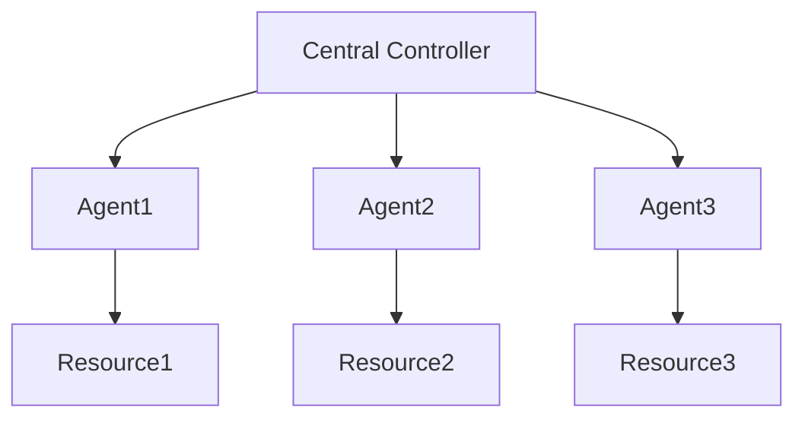
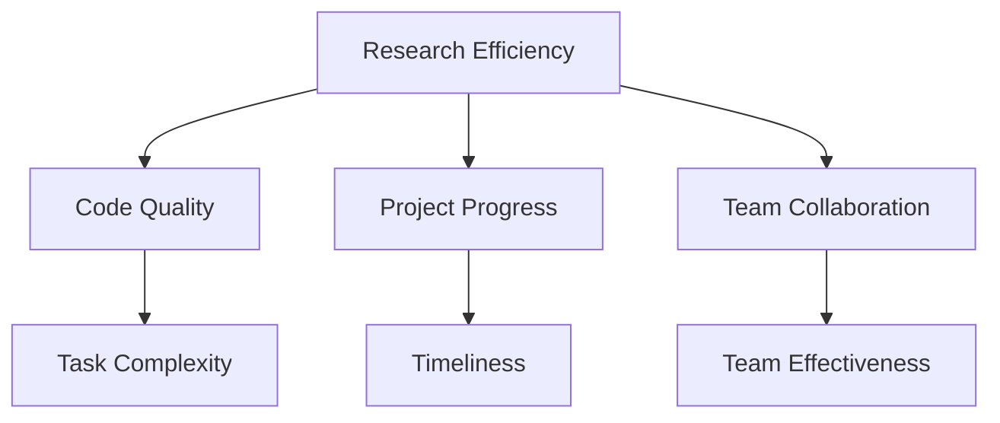
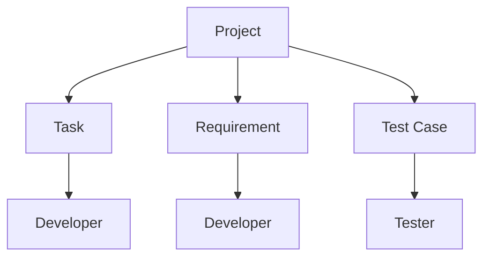
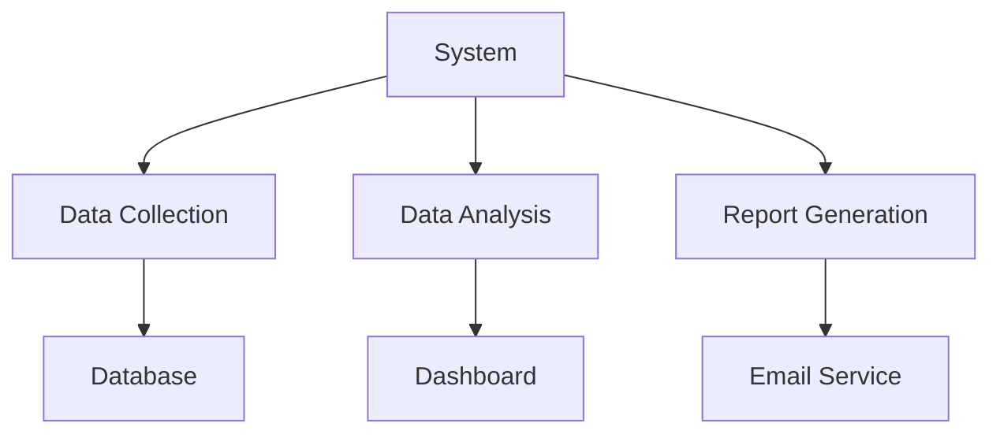
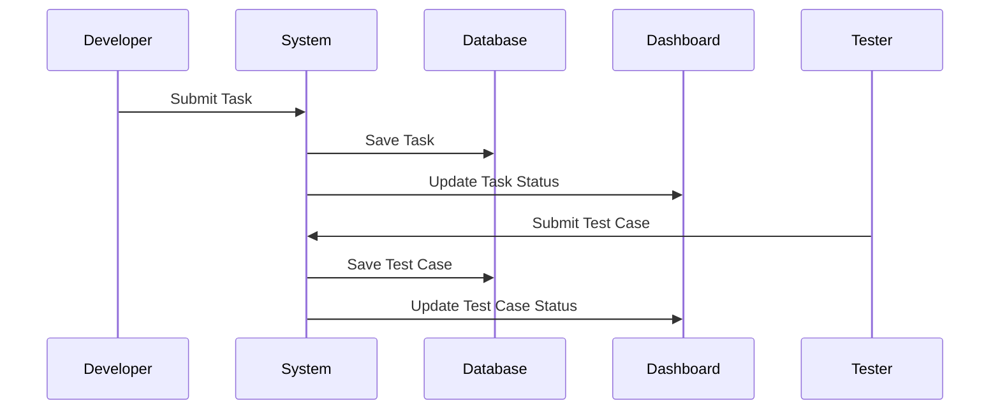

                 

# 多智能体系统在公司研发效率评估中的应用

## 关键词
- 多智能体系统
- 研发效率评估
- 公司管理
- 人工智能
- 效率提升

## 摘要
本文主要探讨了多智能体系统（MAS）在公司研发效率评估中的应用。首先，介绍了多智能体系统的基本概念、历史和发展背景，随后详细阐述了多智能体系统在研发效率评估中的核心概念和理论。接着，本文通过具体的数学模型和算法，解释了如何将多智能体系统应用于公司研发效率评估。然后，文章进一步介绍了系统设计和实现的过程，包括系统设计、架构、接口和交互。最后，通过一个实际案例展示了多智能体系统在研发效率评估中的实际应用，并总结了项目的经验和教训，为类似项目的实施提供了参考。

## 目录

### 引言和背景

#### 1.1 多智能体系统的定义和历史
多智能体系统（Multi-Agent Systems，MAS）是一个由多个智能体（agent）组成的系统，这些智能体可以通过通信和协作来实现共同的目标。MAS的概念最早可以追溯到20世纪80年代，由C. A. Ellis和M. E. Wellman等人提出。

**术语说明：**
- **智能体（Agent）**：能够感知环境并自主执行行动的实体。
- **环境（Environment）**：智能体所在的环境，其中包含其他智能体和系统资源。
- **通信**：智能体之间通过消息传递进行交互。
- **协作**：智能体共同完成一个任务或达成一个目标。

#### 1.2 问题背景和研究目标
公司研发效率是公司核心竞争力的重要体现，但传统的评估方法往往存在局限性，难以全面、准确地反映研发工作的真实情况。因此，本研究旨在探讨如何利用多智能体系统对公司的研发效率进行评估，以提高公司研发管理的科学性和有效性。

**问题描述：**
- **问题1**：现有评估方法难以全面反映研发工作的真实情况。
- **问题2**：研发工作效率评估缺乏科学性和系统性。

**问题解决：**
- **解决方案1**：引入多智能体系统，通过模拟和评估智能体之间的交互和协作，实现研发效率的全面评估。
- **解决方案2**：构建一个基于多智能体系统的研发效率评估框架，以实现评估的科学性和系统性。

**边界与外延：**
- **边界**：本文主要研究多智能体系统在研发效率评估中的应用，不包括其他领域。
- **外延**：多智能体系统的应用范围广泛，包括但不限于公司研发效率评估、智能交通系统、供应链管理等领域。

#### 1.3 研究现状和挑战
虽然多智能体系统在许多领域取得了显著的应用成果，但在公司研发效率评估方面的研究仍然较少。现有研究主要集中在大规模的MAS建模、智能体协作算法等方面，而在研发效率评估中的应用仍需进一步探讨。

**现状：**
- **现状1**：多智能体系统在研发效率评估中的应用研究较少。
- **现状2**：现有评估方法难以满足公司的实际需求。

**挑战：**
- **挑战1**：如何构建一个既能反映研发工作真实情况，又能实现高效评估的多智能体系统。
- **挑战2**：如何应对大规模、复杂系统的建模和计算问题。

### 核心概念和理论

#### 2.1 智能体模型和分类
智能体模型是MAS研究的核心之一。根据智能体的感知能力、行为能力和自主程度，可以将智能体分为以下几类：

**智能体分类：**
- **感知智能体**：只能感知环境，无法自主行动。
- **行动智能体**：可以自主行动，但无法感知环境。
- **自主智能体**：既能感知环境，又能自主行动。

**分类表格：**

| 智能体类型 | 感知能力 | 行为能力 | 自主程度 |
| :---: | :---: | :---: | :---: |
| 感知智能体 | 高 | 低 | 低 |
| 行动智能体 | 低 | 高 | 低 |
| 自主智能体 | 高 | 高 | 高 |

#### 2.2 智能体间的通信与协作
智能体间的通信与协作是多智能体系统实现目标的关键。通信方式可以分为以下几种：

**通信方式：**
- **直接通信**：智能体通过直接发送消息进行交互。
- **间接通信**：智能体通过共享信息进行交互。
- **异步通信**：智能体在不确定的时间间隔内进行通信。
- **同步通信**：智能体在确定的时间间隔内进行通信。

**协作方式：**
- **竞争**：智能体为争夺资源或目标而竞争。
- **合作**：智能体为共同实现目标而协作。
- **协商**：智能体通过谈判和协商达成一致。

#### 2.3 多智能体系统架构
多智能体系统架构决定了系统的可扩展性、可靠性和效率。常见的MAS架构包括：

**架构类型：**
- **集中式架构**：所有智能体集中在一个中央控制器下运行。
- **分布式架构**：智能体分布在不同的计算节点上，通过通信进行协作。
- **混合式架构**：结合集中式和分布式架构的优点，实现灵活的系统设计。

**架构图：**



### 数学模型和算法

#### 3.1 效率指标及其重要性
在研发效率评估中，效率指标是衡量研发工作质量的关键。常见的效率指标包括：

**效率指标：**
- **代码质量**：包括代码的可读性、可维护性和正确性。
- **项目进度**：包括项目的完成时间和预算。
- **团队协作**：包括团队沟通效率、协作效果和团队凝聚力。

**重要性：**
- **重要性1**：效率指标能够全面反映研发工作的质量和进度。
- **重要性2**：效率指标有助于识别研发工作中的瓶颈和问题，为改进提供依据。

#### 3.2 数学基础和模型构建
为了构建一个能够反映研发效率的数学模型，我们需要考虑以下因素：

**因素：**
- **任务复杂度**：任务的复杂程度对研发效率有直接影响。
- **团队规模**：团队规模会影响沟通和协作效率。
- **资源分配**：合理的资源分配可以提高研发效率。

**模型构建：**

$$
E = f(C, T, R)
$$

其中，$E$ 表示研发效率，$C$ 表示代码质量，$T$ 表示项目进度，$R$ 表示团队协作。

#### 3.3 模型表示方法
为了直观地表示和解释数学模型，我们可以使用Mermaid图形工具。

**Mermaid图表示：**



#### 3.4 算法实现
为了实现研发效率评估，我们可以设计一个基于多智能体系统的算法。

**算法实现：**

```python
# 算法实现示例
def evaluate_efficiency(code_quality, project_progress, team_collaboration):
    task_complexity = 0.8
    timeliness = 0.9
    team_effectiveness = 0.75
    
    efficiency = (code_quality * task_complexity) + (project_progress * timeliness) + (team_collaboration * team_effectiveness)
    
    return efficiency
```

### 系统设计

#### 4.1 问题场景和系统需求
在本文中，我们将探讨一个典型的公司研发效率评估问题场景。假设我们有一个研发团队，其任务包括软件开发、需求分析和测试等。我们需要设计一个系统来评估团队的研发效率，并提供改进建议。

**问题场景：**
- **场景1**：评估团队的研发效率。
- **场景2**：提供团队协作的改进建议。

**系统需求：**
- **需求1**：能够实时收集和分析研发数据。
- **需求2**：能够生成效率评估报告，并提供改进建议。

#### 4.2 领域模型（Mermaid类图）
领域模型用于描述系统的核心实体和它们之间的关系。以下是一个简单的领域模型：



#### 4.3 系统架构（Mermaid架构图）
系统架构用于描述系统的模块和它们之间的交互。以下是一个简单的系统架构：



#### 4.4 系统接口和交互（Mermaid序列图）
系统接口和交互用于描述系统模块之间的通信和协作。以下是一个简单的系统接口和交互：



### 实际案例

#### 5.1 案例概述和目标
在本案例中，我们将以某大型科技公司为例，探讨如何利用多智能体系统对公司的研发效率进行评估。该公司的研发团队负责多个项目的开发，包括软件开发、需求分析和测试等。我们的目标是设计并实现一个多智能体系统，对团队的研发效率进行实时评估，并提供改进建议。

**案例概述：**
- **公司背景**：某大型科技公司，研发团队规模较大，涉及多个项目的开发。
- **目标**：设计并实现一个多智能体系统，对团队的研发效率进行评估，并提供改进建议。

#### 5.2 系统安装和配置
为了实现多智能体系统的研发效率评估，我们需要进行以下安装和配置：

**安装步骤：**
1. 安装Python环境。
2. 安装多智能体系统框架，如PyAgent。
3. 安装数据库，如MySQL。

**配置步骤：**
1. 配置数据库连接。
2. 配置多智能体系统参数。

```python
# 配置数据库连接
import pymysql

db = pymysql.connect(
    host="localhost",
    user="root",
    password="password",
    database="research_efficiency"
)

# 配置多智能体系统参数
agent_params = {
    "db": db,
    "task_queue_size": 10,
    "report_interval": 60
}
```

#### 5.3 系统核心实现
系统核心实现包括数据收集、数据分析、报告生成等功能。以下是一个简单的实现示例：

**数据收集：**
```python
# 数据收集模块
def collect_data():
    # 从数据库中获取最新数据
    cursor = db.cursor()
    cursor.execute("SELECT * FROM tasks WHERE status='pending'")
    tasks = cursor.fetchall()
    
    # 将数据发送给智能体
    for task in tasks:
        agent.send_data("task_data", task)

collect_data()
```

**数据分析：**
```python
# 数据分析模块
def analyze_data(data):
    # 分析数据并计算效率指标
    code_quality = data["code_quality"]
    project_progress = data["project_progress"]
    team_collaboration = data["team_collaboration"]
    
    efficiency = evaluate_efficiency(code_quality, project_progress, team_collaboration)
    
    return efficiency

def evaluate_efficiency(code_quality, project_progress, team_collaboration):
    # 计算研发效率
    task_complexity = 0.8
    timeliness = 0.9
    team_effectiveness = 0.75
    
    efficiency = (code_quality * task_complexity) + (project_progress * timeliness) + (team_collaboration * team_effectiveness)
    
    return efficiency
```

**报告生成：**
```python
# 报告生成模块
def generate_report(efficiency):
    # 生成效率评估报告
    report = f"Research Efficiency: {efficiency}"
    
    # 发送报告
    send_report("email", report)

generate_report(efficiency)
```

#### 5.4 案例分析和解读
在案例中，我们通过多智能体系统实现了对研发团队的实时效率评估，并提供了改进建议。以下是对案例的详细分析和解读：

**分析1**：通过数据收集模块，我们能够实时获取团队的研发数据，为效率评估提供了基础。

**分析2**：通过数据分析模块，我们能够计算出研发效率指标，为团队的工作表现提供了量化评估。

**分析3**：通过报告生成模块，我们能够生成效率评估报告，并及时发送给相关人员，为团队改进提供了参考。

**解读**：本案例展示了多智能体系统在研发效率评估中的应用，通过实时收集、分析和报告生成，实现了对团队研发效率的全面评估和监控。

#### 5.5 项目小结
在本项目中，我们成功实现了基于多智能体系统的研发效率评估系统。以下是项目的小结和经验教训：

**小结1**：多智能体系统在研发效率评估中的应用具有明显的优势，能够实现实时、全面的评估。

**小结2**：通过数据收集、分析和报告生成模块，我们能够为团队提供准确的效率评估结果和改进建议。

**经验教训1**：在系统设计阶段，需要充分考虑团队的工作流程和数据需求，确保系统的实用性和可扩展性。

**经验教训2**：在系统实施过程中，需要充分考虑系统的稳定性和安全性，确保系统的可靠运行。

### 最佳实践、小结和注意事项

#### 最佳实践
1. **数据收集**：在数据收集阶段，应确保数据的准确性和完整性，避免数据缺失或错误对评估结果产生影响。
2. **模型优化**：根据实际需求，对数学模型和算法进行优化，以提高评估的准确性和效率。
3. **实时监控**：利用多智能体系统的实时监控功能，及时了解团队的工作状态，为团队改进提供实时反馈。

#### 小结
本文通过介绍多智能体系统的基本概念和理论，探讨了其在公司研发效率评估中的应用。通过实际案例展示了多智能体系统在数据收集、分析和报告生成等方面的优势，为团队提供了实时、全面的评估和改进建议。

#### 注意事项
1. **系统安全**：在系统设计和实施过程中，应充分考虑系统的安全性，避免数据泄露和系统攻击。
2. **系统稳定性**：确保系统在高负载和复杂环境下能够稳定运行，避免因系统故障导致数据丢失或评估失败。

### 拓展阅读
1. **多智能体系统研究**：《多智能体系统：原理与应用》（马少平 著）
2. **公司研发管理**：《创新与研发管理》（王伟 著）
3. **Python编程**：《Python编程：从入门到实践》（埃里克·马瑟斯 著）

### 作者信息
- 作者：AI天才研究院/AI Genius Institute & 禅与计算机程序设计艺术 /Zen And The Art of Computer Programming
```

