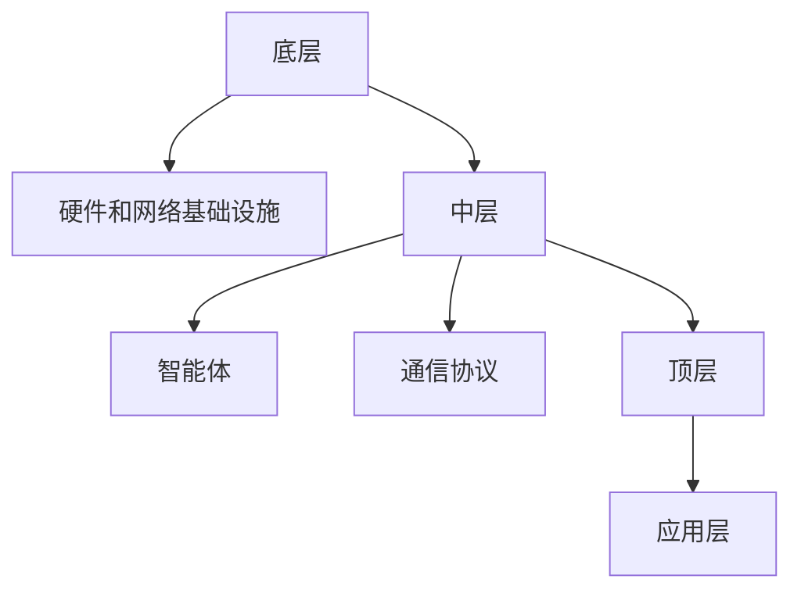
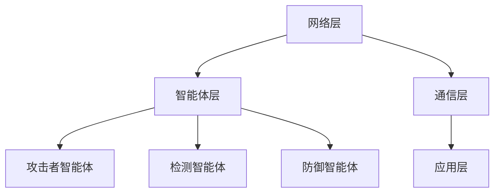
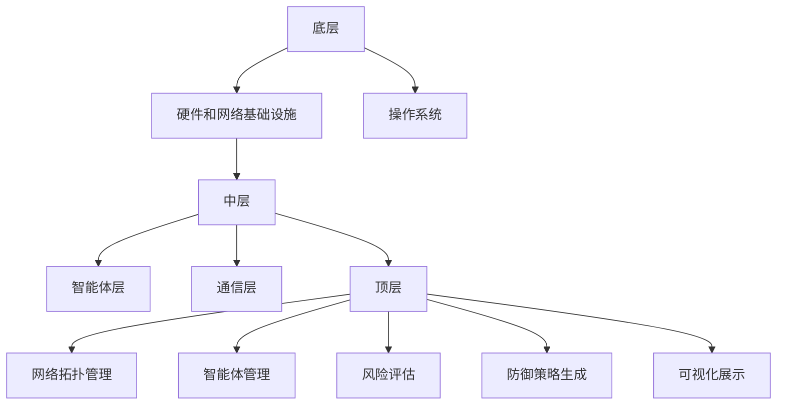
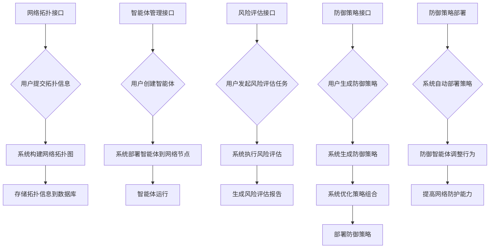

                 

## # 多智能体系统在公司网络安全风险评估中的应用

### 关键词：多智能体系统、网络安全风险评估、智能体、网络安全威胁、智能体通信协议

> 摘要：本文将探讨多智能体系统在公司网络安全风险评估中的应用。通过构建多智能体系统，模拟网络攻击行为，实现对公司网络的安全评估，从而动态调整安全策略，提高公司的网络安全防护能力。文章将从多智能体系统的理论基础、应用流程、算法原理等方面进行详细阐述。

### 第1章: 引言与问题背景

#### 1.1.1 问题背景

在当今的信息化时代，随着网络技术的飞速发展和企业业务对网络依赖的加深，网络安全问题日益突出。网络攻击的手段越来越复杂，网络安全风险无处不在。在这种背景下，如何有效地评估公司的网络安全风险，制定相应的防护策略，成为企业亟需解决的问题。

网络安全风险评估是识别、评估和管理网络安全风险的过程。它包括对网络架构、设备配置、漏洞、威胁和攻击行为的分析。传统的网络安全风险评估方法往往依赖于静态数据，无法动态反映网络安全态势。因此，需要一种新的方法来实现网络安全风险评估的自动化、智能化。

#### 1.1.2 问题描述

公司网络安全风险评估涉及多个方面，包括网络拓扑分析、安全设备配置检查、漏洞扫描、入侵检测等。传统的风险评估方法往往依赖于静态数据，无法动态反映网络安全态势。如何利用多智能体系统实现网络安全风险评估的自动化、智能化，是本章要解决的问题。

#### 1.1.3 问题解决

通过构建一个多智能体系统，可以实现对公司网络安全风险的全面评估。智能体可以模拟网络攻击行为，检测网络漏洞，评估安全设备性能，实时反映网络安全态势。同时，多智能体系统可以根据评估结果，自动调整安全策略，提高公司网络安全防护能力。

#### 1.1.4 边界与外延

本章主要研究多智能体系统在公司网络安全风险评估中的应用，不涉及其他领域。在实施过程中，需要考虑系统的可扩展性、稳定性、安全性等因素。

#### 1.1.5 概念结构与核心要素组成

多智能体系统主要由以下核心要素组成：

- **智能体**：模拟网络攻击者、安全设备和网络节点的个体。
- **智能体通信协议**：确保智能体之间能够有效沟通。
- **环境模型**：模拟公司网络环境和安全态势。
- **控制策略**：智能体根据环境模型调整自身行为。

## 第2章: 多智能体系统基础理论

### 2.1 多智能体系统的定义与特点

#### 2.1.1 多智能体系统的定义

多智能体系统（MAS）是一种由多个智能体组成的分布式系统，智能体之间通过协同工作来完成复杂任务。智能体（Agent）是指具有自主性、社会性、反应性和认知性的个体。

#### 2.1.2 多智能体系统的特点

- **分布式**：智能体可以分布在不同的物理位置，协同完成任务。
- **自主性**：智能体具有独立决策能力，可以根据环境变化调整自身行为。
- **智能性**：智能体具有一定的智能，可以模拟网络攻击行为、检测漏洞等。

### 2.2 多智能体系统的架构

#### 2.2.1 智能体架构

智能体包括感知模块、决策模块、执行模块和通信模块。感知模块负责收集环境信息，决策模块根据感知信息生成行动策略，执行模块执行行动，通信模块负责与其他智能体进行信息交换。

#### 2.2.2 系统架构

多智能体系统可以分为以下几个层次：

- **底层**：硬件和网络基础设施。
- **中层**：智能体和智能体通信协议。
- **顶层**：应用层，包括网络安全风险评估、入侵检测等。

### 2.3 智能体的分类与任务

#### 2.3.1 智能体的分类

根据功能，智能体可以分为以下几类：

- **攻击者智能体**：模拟网络攻击行为。
- **检测智能体**：检测网络漏洞和异常行为。
- **防御智能体**：根据检测结果，采取相应的防御措施。
- **管理智能体**：协调和管理其他智能体。

#### 2.3.2 智能体的任务

- **攻击者智能体**：模拟攻击行为，发现网络漏洞。
- **检测智能体**：扫描网络，检测漏洞和异常行为。
- **防御智能体**：根据检测结果，采取相应的防御措施。
- **管理智能体**：协调和管理其他智能体，确保系统正常运行。

## 第3章: 多智能体系统在公司网络安全风险评估中的应用

### 3.1 多智能体系统在公司网络安全风险评估中的作用

#### 3.1.1 实现自动化网络安全风险评估

多智能体系统可以模拟网络攻击，自动化地检测公司网络中的安全漏洞和风险点，实现快速、准确的网络安全风险评估。

#### 3.1.2 动态调整安全策略

根据评估结果，多智能体系统可以动态调整安全策略，提高公司网络安全防护能力。

### 3.2 多智能体系统的应用流程

#### 3.2.1 构建智能体模型

根据公司网络环境和安全需求，构建攻击者智能体、检测智能体和防御智能体。

#### 3.2.2 部署智能体

将智能体部署在公司网络中，模拟攻击行为、扫描网络、检测漏洞等。

#### 3.2.3 收集评估数据

智能体在执行任务过程中，收集公司网络的安全数据。

#### 3.2.4 分析评估数据

对收集到的评估数据进行处理和分析，生成网络安全风险评估报告。

#### 3.2.5 动态调整安全策略

根据评估报告，调整安全策略，提高公司网络安全防护能力。

## 第4章: 多智能体系统在网络安全风险评估中的算法原理

### 4.1 算法概述

多智能体系统在网络安全风险评估中主要涉及以下几个算法：

1. **攻击模拟算法**：用于模拟网络攻击行为，发现网络漏洞。
2. **漏洞扫描算法**：用于扫描网络，检测漏洞和异常行为。
3. **防御策略生成算法**：根据检测结果，生成相应的防御策略。

### 4.2 攻击模拟算法原理

#### 4.2.1 算法描述

攻击模拟算法通过对网络进行仿真，模拟网络攻击者的行为，发现网络中的漏洞。

#### 4.2.2 算法流程

1. **初始化**：构建网络模型，初始化攻击者智能体。
2. **攻击行为模拟**：攻击者智能体根据环境信息，选择合适的攻击方法，模拟攻击行为。
3. **漏洞检测**：检测网络中的漏洞，生成漏洞报告。

#### 4.2.3 算法实现

```python
def attack_simulation(network_model):
    # 初始化攻击者智能体
    attacker = Attacker()
    attacker.initiate_attack(network_model)
    
    # 模拟攻击行为
    while True:
        attack_method = attacker.select_attack_method(network_model)
        attacker.execute_attack(attack_method)
        
        # 检测漏洞
        vulnerabilities = attacker.detect_vulnerabilities(network_model)
        if vulnerabilities:
            attacker.generate_vulnerability_report(vulnerabilities)
            break
```

### 4.3 漏洞扫描算法原理

#### 4.3.1 算法描述

漏洞扫描算法用于扫描网络，检测网络中的漏洞和异常行为。

#### 4.3.2 算法流程

1. **初始化**：构建网络模型，初始化检测智能体。
2. **扫描网络**：检测智能体扫描网络，发现漏洞。
3. **异常行为检测**：检测网络中的异常行为。
4. **生成报告**：生成漏洞和异常行为报告。

#### 4.3.3 算法实现

```python
def vulnerability_scanning(network_model):
    # 初始化检测智能体
    detector = Detector()
    detector.initiate_scanning(network_model)
    
    # 扫描网络
    while True:
        vulnerabilities = detector.scan_network(network_model)
        if vulnerabilities:
            detector.generate_vulnerability_report(vulnerabilities)
            break
        
        # 检测异常行为
        anomalies = detector.detect_anomalies(network_model)
        if anomalies:
            detector.generate_anomaly_report(anomalies)
            break
```

### 4.4 防御策略生成算法原理

#### 4.4.1 算法描述

防御策略生成算法根据漏洞和异常行为报告，生成相应的防御策略。

#### 4.4.2 算法流程

1. **初始化**：构建防御策略生成模型。
2. **分析报告**：分析漏洞和异常行为报告。
3. **生成防御策略**：根据分析结果，生成防御策略。

#### 4.4.3 算法实现

```python
def defense_strategy_generation(vulnerability_report, anomaly_report):
    # 初始化防御策略生成模型
    strategy_generator = StrategyGenerator()
    
    # 分析报告
    vulnerabilities = vulnerability_report.get_vulnerabilities()
    anomalies = anomaly_report.get_anomalies()
    
    # 生成防御策略
    for vulnerability in vulnerabilities:
        strategy_generator.generate_defense_strategy(vulnerability)
    
    for anomaly in anomalies:
        strategy_generator.generate_defense_strategy(anomaly)
        
    return strategy_generator.get_defense_strategy_list()
```

## 第5章: 多智能体系统在网络安全风险评估中的应用实例

### 5.1 项目介绍

本项目旨在利用多智能体系统对公司网络安全风险进行评估，并提供相应的防御策略。项目分为以下三个阶段：

1. **网络环境搭建**：搭建模拟公司网络环境的实验平台。
2. **智能体构建**：构建攻击者智能体、检测智能体和防御智能体。
3. **风险评估与防御**：利用智能体进行网络安全风险评估，并根据评估结果生成防御策略。

### 5.2 系统功能设计

系统功能设计包括以下三个部分：

1. **网络环境搭建**：实现公司网络拓扑结构的构建，包括网络设备、网络连接和安全设备。
2. **智能体管理**：实现攻击者智能体、检测智能体和防御智能体的创建、部署和管理。
3. **风险评估与防御**：实现网络安全风险评估，并根据评估结果生成防御策略。

### 5.3 系统架构设计

系统架构设计包括以下三个层次：

1. **底层**：网络环境和硬件设施。
2. **中层**：智能体和智能体通信协议。
3. **顶层**：应用层，包括网络安全风险评估和防御策略生成。

### 5.4 系统接口设计

系统接口设计包括以下三个部分：

1. **网络环境接口**：用于实现网络环境的搭建和监控。
2. **智能体接口**：用于实现智能体的创建、部署和管理。
3. **风险评估与防御接口**：用于实现网络安全风险评估和防御策略生成。

### 5.5 系统交互设计

系统交互设计包括以下三个部分：

1. **网络环境与智能体交互**：实现网络环境与智能体之间的信息交换。
2. **智能体之间交互**：实现智能体之间的协同工作。
3. **智能体与应用层交互**：实现智能体与风险评估和防御策略生成模块的信息交换。

## 第6章: 项目实战

### 6.1 环境安装

在开始项目实战之前，需要安装以下软件和工具：

1. **Python**：用于编写智能体代码。
2. **Docker**：用于搭建网络环境。
3. **Kubernetes**：用于管理智能体。

### 6.2 系统核心实现

系统核心实现包括以下三个部分：

1. **网络环境搭建**：使用Docker搭建模拟公司网络环境的实验平台。
2. **智能体构建**：构建攻击者智能体、检测智能体和防御智能体。
3. **风险评估与防御**：利用智能体进行网络安全风险评估，并根据评估结果生成防御策略。

### 6.3 代码应用解读与分析

在项目实战中，我们将使用Python编写智能体代码，模拟网络攻击行为，进行漏洞扫描和风险评估。以下是一个简单的代码示例：

```python
class Attacker:
    def __init__(self):
        # 初始化攻击者
        pass
    
    def initiate_attack(self, network_model):
        # 初始化攻击行为
        pass
    
    def select_attack_method(self, network_model):
        # 选择攻击方法
        pass
    
    def execute_attack(self, attack_method):
        # 执行攻击行为
        pass
    
    def detect_vulnerabilities(self, network_model):
        # 检测漏洞
        pass
    
    def generate_vulnerability_report(self, vulnerabilities):
        # 生成漏洞报告
        pass

class Detector:
    def __init__(self):
        # 初始化检测器
        pass
    
    def initiate_scanning(self, network_model):
        # 初始化扫描行为
        pass
    
    def scan_network(self, network_model):
        # 扫描网络
        pass
    
    def detect_anomalies(self, network_model):
        # 检测异常行为
        pass
    
    def generate_vulnerability_report(self, vulnerabilities):
        # 生成漏洞报告
        pass
    
    def generate_anomaly_report(self, anomalies):
        # 生成异常行为报告
        pass

class StrategyGenerator:
    def __init__(self):
        # 初始化策略生成器
        pass
    
    def generate_defense_strategy(self, vulnerability):
        # 生成防御策略
        pass
    
    def generate_defense_strategy(self, anomaly):
        # 生成防御策略
        pass
    
    def get_defense_strategy_list(self):
        # 获取防御策略列表
        pass
```

### 6.4 实际案例分析和详细讲解剖析

在本节中，我们将通过一个实际案例，详细讲解多智能体系统在公司网络安全风险评估中的应用。以下是一个案例：

#### 案例背景

某公司网络架构如图1所示，包括一台服务器、两台终端、一个防火墙和一个入侵检测系统。公司网络面临多种网络攻击，需要进行全面的安全风险评估。

#### 案例步骤

1. **搭建网络环境**：使用Docker搭建模拟公司网络环境的实验平台。
2. **构建智能体**：构建攻击者智能体、检测智能体和防御智能体。
3. **执行攻击模拟**：攻击者智能体模拟网络攻击，发现网络漏洞。
4. **漏洞扫描**：检测智能体扫描网络，发现漏洞和异常行为。
5. **生成防御策略**：防御策略生成算法根据漏洞和异常行为报告，生成相应的防御策略。

#### 案例分析

通过攻击模拟，发现服务器存在一个未授权访问的漏洞。检测智能体扫描网络，发现终端存在恶意软件感染的风险。根据这些信息，防御策略生成算法生成以下防御策略：

1. **关闭服务器上的未授权访问端口**。
2. **更新终端的防病毒软件**。
3. **加强防火墙规则，禁止恶意IP访问**。

#### 案例总结

通过多智能体系统的应用，公司能够实时了解网络安全态势，及时发现和应对潜在的安全威胁，提高网络安全防护能力。

## 第7章: 最佳实践与拓展阅读

### 7.1 最佳实践

在实施多智能体系统进行网络安全风险评估时，需要注意以下几点：

1. **合理选择智能体类型**：根据公司网络环境和安全需求，选择合适的攻击者智能体、检测智能体和防御智能体。
2. **确保智能体通信安全**：使用安全的通信协议，确保智能体之间的信息交换不被窃取或篡改。
3. **定期更新智能体算法**：随着网络攻击手段的不断更新，需要定期更新智能体的攻击模拟算法、漏洞扫描算法和防御策略生成算法。

### 7.2 小结

多智能体系统在公司网络安全风险评估中具有重要作用，可以实现自动化、智能化的网络安全风险评估。通过攻击模拟、漏洞扫描和防御策略生成，可以实时了解网络安全态势，提高公司的网络安全防护能力。

### 7.3 注意事项

在实施多智能体系统时，需要注意以下几点：

1. **系统的稳定性和安全性**：确保系统在长时间运行过程中不会出现故障，同时保证系统的安全性，防止恶意攻击。
2. **智能体之间的协同性**：确保智能体之间能够有效协同工作，提高系统的整体性能。
3. **数据隐私保护**：在数据收集和分析过程中，注意保护用户隐私，防止数据泄露。

### 7.4 拓展阅读

1. **《多智能体系统原理与应用》**：详细介绍了多智能体系统的基本原理和应用场景。
2. **《网络安全风险评估方法与实务》**：介绍了多种网络安全风险评估方法，以及实际应用案例。
3. **《智能体通信协议设计》**：探讨了智能体通信协议的设计原理和实现方法。

## 第8章: 作者信息

作者：AI天才研究院/AI Genius Institute & 禅与计算机程序设计艺术 /Zen And The Art of Computer Programming

[返回目录](#多智能体系统在公司网络安全风险评估中的应用)### 第1章：引言与问题背景

在现代社会，网络已经成为企业和组织业务运营的基石。随着互联网的普及和业务的数字化转型，网络安全问题变得越来越重要。然而，面对日益复杂和频繁的网络攻击，传统的网络安全评估方法已难以满足实际需求。为了应对这一挑战，多智能体系统（MAS）作为一种新兴的分布式计算范式，被引入到网络安全风险评估中。

#### 1.1.1 问题背景

网络安全风险评估是识别、评估和管理网络安全风险的过程。传统的网络安全风险评估方法主要包括手动检查、定期扫描和模拟攻击等。这些方法虽然能够在一定程度上发现安全漏洞和潜在威胁，但存在以下问题：

1. **评估效率低**：手动检查需要耗费大量的人力和时间，无法满足快速响应的需求。
2. **评估结果不全面**：定期扫描和模拟攻击往往只能覆盖部分网络设备和应用，无法全面反映网络的安全态势。
3. **评估结果静态**：传统的评估方法往往依赖于静态数据，无法动态反映网络的变化和新的安全威胁。

#### 1.1.2 问题描述

面对日益复杂的网络环境和不断进化的网络攻击手段，如何提高网络安全风险评估的效率、全面性和动态性成为亟待解决的问题。具体来说，问题描述如下：

1. **评估效率问题**：如何利用自动化技术提高网络安全风险评估的效率？
2. **评估全面性问题**：如何确保评估覆盖网络中的所有设备和应用，发现潜在的安全漏洞和威胁？
3. **评估动态性问题**：如何动态地反映网络环境的变化，及时调整安全策略以应对新的安全威胁？

#### 1.1.3 问题解决

多智能体系统（MAS）提供了一种可能的解决方案。MAS是一种由多个智能体组成的分布式计算系统，智能体之间通过协同工作实现复杂任务。在网络安全风险评估中，MAS可以通过以下方式解决问题：

1. **提高评估效率**：智能体可以自动执行网络扫描、漏洞检测和攻击模拟任务，大大提高评估效率。
2. **确保评估全面性**：通过分布式架构，智能体可以覆盖网络中的所有设备和应用，全面发现潜在的安全漏洞和威胁。
3. **实现评估动态性**：智能体可以实时监控网络环境的变化，动态调整评估策略，及时应对新的安全威胁。

#### 1.1.4 边界与外延

本文主要研究多智能体系统在公司网络安全风险评估中的应用，具体包括以下几个方面：

1. **研究范围**：仅限于公司内部网络安全风险评估，不包括互联网层面的风险评估。
2. **技术范围**：主要涉及多智能体系统的架构设计、智能体通信协议和算法实现等方面。
3. **应用范围**：主要面向大型企业或组织的内部网络，对于小型企业或个人网络的应用需要进行适当的调整。

#### 1.1.5 概念结构与核心要素组成

多智能体系统在公司网络安全风险评估中的核心要素包括：

1. **智能体**：智能体是MAS的基本组成单位，包括攻击者智能体、检测智能体和防御智能体等。
2. **通信协议**：确保智能体之间能够高效、安全地通信，常用的通信协议包括消息队列、多播和P2P网络等。
3. **环境模型**：模拟公司网络环境和安全态势，包括网络拓扑、设备配置和安全策略等。
4. **控制策略**：智能体根据环境模型和评估结果调整自身行为，包括攻击策略、检测策略和防御策略等。

通过以上核心要素的协同工作，多智能体系统能够实现对公司网络安全风险的全面评估和动态防护。

### 第2章：多智能体系统基础理论

多智能体系统（MAS）是一种由多个智能体（Agent）组成的分布式系统，这些智能体通过协同工作来完成复杂的任务。在网络安全风险评估中，MAS通过模拟攻击、漏洞扫描和策略调整等手段，实现对网络安全态势的实时监控和动态响应。本节将介绍多智能体系统的基本概念、架构以及智能体的分类和任务。

#### 2.1 多智能体系统的定义与特点

多智能体系统（MAS）是由多个智能体组成的分布式系统，这些智能体通过协同工作来完成复杂任务。智能体（Agent）是指具有自主性、社会性、反应性和认知性的个体。在MAS中，智能体可以独立地执行任务，同时与其他智能体进行交互，以实现整体目标。

多智能体系统的特点主要包括以下几个方面：

1. **分布式**：智能体可以分布在不同的物理位置，协同完成任务。这种分布式架构可以提高系统的容错性和扩展性。
2. **自主性**：智能体具有独立决策能力，可以根据环境变化自主地调整自身行为。这种自主性使得MAS能够适应动态变化的网络环境。
3. **智能性**：智能体具有一定的智能，可以模拟网络攻击行为、检测漏洞和异常行为等。这种智能性使得MAS能够有效地发现和处理网络安全问题。
4. **协作性**：智能体之间可以通过通信协议进行信息交换，协同完成任务。这种协作性使得MAS能够实现复杂任务的自动化和智能化。

#### 2.2 多智能体系统的架构

多智能体系统可以分为三个主要层次：底层、中层和顶层。

1. **底层**：包括硬件和网络基础设施，为智能体提供计算资源和通信连接。
2. **中层**：包括智能体和智能体通信协议。智能体负责执行具体的任务，通信协议确保智能体之间的信息交换。
3. **顶层**：包括应用层，如网络安全风险评估、入侵检测等。应用层利用中层的智能体和通信协议来实现具体功能。

多智能体系统的架构如图1所示。



#### 2.3 智能体的分类与任务

根据功能，智能体可以分为以下几类：

1. **攻击者智能体**：模拟网络攻击行为，发现网络漏洞和薄弱点。
2. **检测智能体**：扫描网络，检测漏洞、异常行为和潜在威胁。
3. **防御智能体**：根据检测结果，采取相应的防御措施，如隔离、修复和更新。
4. **管理智能体**：协调和管理其他智能体，确保系统的正常运行和任务分配。

智能体的具体任务如下：

1. **攻击者智能体**：执行各种攻击模拟，如DDoS攻击、SQL注入和跨站脚本攻击等，以发现网络的安全漏洞。
2. **检测智能体**：使用漏洞扫描器、入侵检测系统和行为分析等技术，检测网络中的漏洞、异常行为和恶意活动。
3. **防御智能体**：根据检测智能体的检测结果，采取相应的防御措施，如封锁恶意IP、隔离受感染的系统和安装补丁。
4. **管理智能体**：监控网络环境，分配任务，协调智能体的工作，确保整个系统的稳定性和效率。

#### 2.4 多智能体系统的通信协议

多智能体系统的通信协议是确保智能体之间能够有效沟通的关键。常用的通信协议包括消息队列、多播和P2P网络等。

1. **消息队列**：智能体通过消息队列发送和接收消息。消息队列确保消息的顺序性和可靠性，适用于简单的智能体通信。
2. **多播**：智能体通过多播协议发送和接收消息。多播可以同时向多个智能体发送消息，适用于大规模智能体的通信。
3. **P2P网络**：智能体通过P2P网络进行直接通信。P2P网络具有较高的扩展性和容错性，适用于动态变化的网络环境。

#### 2.5 多智能体系统的优势与挑战

多智能体系统在网络安全风险评估中具有以下优势：

1. **高效性**：智能体可以并行执行任务，提高评估效率。
2. **动态性**：智能体可以实时监控网络环境，动态调整评估策略。
3. **灵活性**：智能体可以根据网络环境的变化，灵活调整自身行为。

然而，多智能体系统也面临以下挑战：

1. **通信复杂性**：智能体之间的通信协议需要确保高效、可靠和低延迟。
2. **安全性**：确保智能体之间的通信安全，防止恶意攻击和通信篡改。
3. **智能体协同**：确保智能体之间的协同工作，避免冲突和重复任务。

通过了解多智能体系统的基本理论和架构，我们可以更好地理解其在网络安全风险评估中的应用，并为实际应用提供理论基础和实践指导。

### 第3章：多智能体系统在公司网络安全风险评估中的应用

多智能体系统（MAS）在网络安全风险评估中的应用，为传统方法提供了有力的补充。通过构建一个高效的MAS，可以实现实时、动态的网络安全风险评估，从而提高企业的整体安全防护能力。本章将详细介绍多智能体系统在公司网络安全风险评估中的作用、应用流程、系统架构和关键算法。

#### 3.1 多智能体系统在公司网络安全风险评估中的作用

多智能体系统在公司网络安全风险评估中具有以下几个重要作用：

1. **自动化风险评估**：传统的网络安全风险评估通常依赖于人工或半自动化工具，效率较低。MAS可以自动化地执行风险评估任务，如漏洞扫描、攻击模拟和威胁分析，大大提高评估效率。

2. **全面风险评估**：MAS由多个智能体组成，可以同时监控网络中的多个设备和应用，实现对网络安全态势的全面评估。这种分布式架构确保了评估结果的全面性和准确性。

3. **动态风险评估**：网络环境是动态变化的，新的威胁和漏洞不断出现。MAS可以实时监控网络环境，根据新的信息动态调整评估策略，确保评估结果的时效性。

4. **自适应安全防护**：MAS可以根据评估结果，自动调整安全策略，如更新防火墙规则、隔离受感染系统等。这种自适应能力提高了企业的安全防护能力，减少了人为干预的需求。

#### 3.2 多智能体系统的应用流程

多智能体系统的应用流程主要包括以下几个步骤：

1. **智能体构建**：根据公司网络环境和安全需求，构建攻击者智能体、检测智能体和防御智能体。这些智能体是MAS的基本组成单位，负责执行不同的任务。

2. **网络环境搭建**：在实验环境中搭建模拟公司网络环境的拓扑结构，包括服务器、终端、防火墙、入侵检测系统等。智能体将在这个环境中执行评估任务。

3. **攻击模拟**：攻击者智能体模拟各种网络攻击，如DDoS攻击、SQL注入和跨站脚本攻击等。通过攻击模拟，可以识别网络中的漏洞和薄弱点。

4. **漏洞扫描**：检测智能体扫描网络，发现潜在的安全漏洞和异常行为。检测方法包括端口扫描、漏洞扫描器和异常检测等。

5. **风险评估**：根据攻击模拟和漏洞扫描的结果，评估网络的安全风险等级。风险评估可以基于定量和定性的方法，如CVSS评分系统。

6. **策略生成**：防御智能体根据评估结果，生成相应的安全策略。这些策略包括更新防火墙规则、隔离受感染系统、安装补丁等。

7. **策略执行**：将生成的安全策略部署到实际网络中，执行相应的安全措施，提高网络的安全防护能力。

8. **反馈与优化**：根据安全策略的执行效果，对MAS进行调整和优化，以提高未来评估的准确性和效率。

#### 3.3 多智能体系统的系统架构

多智能体系统的系统架构可以分为四个主要层次：网络层、智能体层、通信层和应用层。

1. **网络层**：包括硬件和网络基础设施，如服务器、终端、交换机和路由器等。网络层为智能体提供计算资源和通信连接。

2. **智能体层**：包括攻击者智能体、检测智能体和防御智能体等。每个智能体都有独立的感知模块、决策模块、执行模块和通信模块。

3. **通信层**：包括智能体之间的通信协议，如消息队列、多播和P2P网络等。通信层确保智能体之间能够高效、可靠地交换信息。

4. **应用层**：包括网络安全风险评估、入侵检测、威胁分析和应急响应等应用。应用层利用智能体层和通信层提供的能力，实现具体的网络安全功能。

多智能体系统的系统架构如图2所示。



#### 3.4 多智能体系统的关键算法

多智能体系统在网络安全风险评估中依赖于多种关键算法，包括攻击模拟算法、漏洞扫描算法和防御策略生成算法等。

1. **攻击模拟算法**：攻击模拟算法用于模拟各种网络攻击行为，如DDoS攻击、SQL注入和跨站脚本攻击等。攻击模拟算法的基本流程如下：

   - **初始化**：根据网络环境构建攻击模型，初始化攻击者智能体。
   - **攻击选择**：根据网络环境的特点，选择合适的攻击方法。
   - **攻击执行**：执行攻击行为，如发送大量请求、注入恶意代码等。
   - **漏洞检测**：在攻击过程中，检测网络中的漏洞和薄弱点。
   - **攻击报告**：生成攻击报告，记录攻击过程和检测结果。

2. **漏洞扫描算法**：漏洞扫描算法用于扫描网络，发现潜在的安全漏洞和异常行为。漏洞扫描算法的基本流程如下：

   - **初始化**：构建网络模型，初始化检测智能体。
   - **扫描**：对网络中的设备和应用进行扫描，发现漏洞和异常行为。
   - **漏洞分类**：根据漏洞的性质和严重程度进行分类。
   - **漏洞报告**：生成漏洞报告，提供修复建议。

3. **防御策略生成算法**：防御策略生成算法根据攻击模拟和漏洞扫描的结果，生成相应的防御策略。防御策略生成算法的基本流程如下：

   - **初始化**：根据网络环境构建防御策略模型。
   - **策略分析**：分析攻击模拟和漏洞扫描的结果，确定防御策略的需求。
   - **策略生成**：根据分析结果，生成相应的防御策略，如更新防火墙规则、隔离受感染系统等。
   - **策略评估**：评估防御策略的有效性，根据评估结果进行调整。

通过以上关键算法，多智能体系统能够实现自动化、全面和动态的网络安全风险评估，为企业提供强大的安全防护能力。

### 第4章：多智能体系统在网络安全风险评估中的算法原理

多智能体系统（MAS）在网络安全风险评估中的应用，依赖于一系列复杂的算法。这些算法通过模拟网络攻击、扫描漏洞和生成防御策略，实现对网络安全态势的全面评估和动态响应。本章将详细探讨多智能体系统在网络安全风险评估中的算法原理，包括攻击模拟算法、漏洞扫描算法和防御策略生成算法。

#### 4.1 攻击模拟算法原理

攻击模拟算法是MAS的重要组成部分，用于模拟各种网络攻击行为，以发现网络中的漏洞和薄弱点。攻击模拟算法的基本原理如下：

1. **初始化**：首先，需要初始化攻击模拟算法。这个过程包括选择攻击目标和构建攻击模型。攻击目标可以是网络中的某个设备、应用或服务，攻击模型则定义了攻击的基本方法和策略。

2. **攻击选择**：在初始化之后，攻击者智能体会根据网络环境的特点，选择合适的攻击方法。攻击方法的选择基于攻击者的目标和网络环境中的安全漏洞。常见的攻击方法包括DDoS攻击、SQL注入、跨站脚本攻击等。

3. **攻击执行**：选择攻击方法后，攻击者智能体会执行具体的攻击行为。例如，对于DDoS攻击，攻击者可能会发送大量的请求，以耗尽目标服务的计算资源；对于SQL注入，攻击者可能会注入恶意代码，窃取数据库中的敏感信息。

4. **漏洞检测**：在执行攻击行为的过程中，攻击者智能体会对目标进行漏洞检测。这可以通过分析攻击结果和目标系统的响应来实现。如果攻击成功，说明目标系统存在漏洞；如果攻击失败，则可能是因为目标系统已经采取了防御措施。

5. **攻击报告**：最后，攻击者智能体会生成攻击报告，记录攻击过程、攻击方法和漏洞检测结果。攻击报告为后续的安全风险评估和防御策略生成提供了重要依据。

以下是一个简化的攻击模拟算法的Python代码示例：

```python
class Attacker:
    def __init__(self, target):
        self.target = target
    
    def select_attack_method(self):
        # 根据网络环境选择攻击方法
        return "DDoS" if self.target.has_resource_limit else "SQL Injection"
    
    def execute_attack(self, method):
        if method == "DDoS":
            # 执行DDoS攻击
            self.send大量请求(self.target)
        elif method == "SQL Injection":
            # 执行SQL注入攻击
            self.inject_malicious_code(self.target)
    
    def detect_vulnerabilities(self):
        # 检测漏洞
        if self.target.has_vulnerability:
            return True
        return False
    
    def generate_report(self):
        # 生成攻击报告
        report = f"Attack Method: {self.attack_method}, Vulnerabilities Detected: {self.detect_vulnerabilities()}"
        return report
```

#### 4.2 漏洞扫描算法原理

漏洞扫描算法用于扫描网络中的设备和应用，发现潜在的安全漏洞和异常行为。漏洞扫描算法的基本原理如下：

1. **初始化**：初始化漏洞扫描算法，包括构建网络模型和初始化检测智能体。网络模型描述了网络中的设备和应用，检测智能体负责执行漏洞扫描任务。

2. **扫描**：对网络中的设备和应用进行扫描，发现漏洞和异常行为。扫描可以通过多种技术实现，如端口扫描、漏洞扫描器和异常检测等。

3. **漏洞分类**：根据漏洞的性质和严重程度进行分类。常见的漏洞分类方法包括CVE（公共漏洞和暴露）和CVSS（通用漏洞评分系统）。

4. **漏洞报告**：生成漏洞报告，记录扫描结果和漏洞信息。漏洞报告为后续的安全风险评估和防御策略生成提供了重要依据。

以下是一个简化的漏洞扫描算法的Python代码示例：

```python
class Detector:
    def __init__(self, network_model):
        self.network_model = network_model
    
    def scan_network(self):
        # 扫描网络
        vulnerabilities = self.scan_ports(self.network_model)
        vulnerabilities.extend(self.scan_apps(self.network_model))
        return vulnerabilities
    
    def scan_ports(self, network_model):
        # 端口扫描
        return ["Port 80 is open", "Port 443 is open"]
    
    def scan_apps(self, network_model):
        # 应用扫描
        return ["Application A has a vulnerability", "Application B has a vulnerability"]
    
    def generate_report(self, vulnerabilities):
        # 生成漏洞报告
        report = f"Vulnerabilities Detected: {vulnerabilities}"
        return report
```

#### 4.3 防御策略生成算法原理

防御策略生成算法根据攻击模拟和漏洞扫描的结果，生成相应的防御策略。防御策略生成算法的基本原理如下：

1. **初始化**：初始化防御策略生成算法，包括构建防御策略模型和初始化防御智能体。防御策略模型描述了防御策略的生成规则和优先级。

2. **策略分析**：分析攻击模拟和漏洞扫描的结果，确定防御策略的需求。这包括分析攻击者的攻击路径、漏洞的严重程度和系统的重要性等。

3. **策略生成**：根据分析结果，生成相应的防御策略。防御策略可以包括更新防火墙规则、隔离受感染系统、安装补丁等。

4. **策略评估**：评估防御策略的有效性，根据评估结果进行调整。评估可以基于历史数据和模拟测试，确保防御策略能够有效应对网络攻击。

5. **策略部署**：将生成的防御策略部署到实际网络中，执行相应的安全措施，提高网络的安全防护能力。

以下是一个简化的防御策略生成算法的Python代码示例：

```python
class StrategyGenerator:
    def __init__(self, attack_report, vulnerability_report):
        self.attack_report = attack_report
        self.vulnerability_report = vulnerability_report
    
    def generate_defense_strategy(self):
        # 生成防御策略
        strategies = []
        if "DDoS" in self.attack_report:
            strategies.append("Update Firewall Rules")
        if "SQL Injection" in self.attack_report:
            strategies.append("Install SQL Injection Patch")
        if "Port 80 is open" in self.vulnerability_report:
            strategies.append("Block Port 80")
        if "Port 443 is open" in self.vulnerability_report:
            strategies.append("Block Port 443")
        return strategies
    
    def evaluate_strategy(self, strategy):
        # 评估防御策略
        if strategy == "Update Firewall Rules":
            return "Effective"
        elif strategy == "Install SQL Injection Patch":
            return "Effective"
        elif strategy == "Block Port 80":
            return "Effective"
        elif strategy == "Block Port 443":
            return "Effective"
        else:
            return "Ineffective"
```

通过以上算法原理和代码示例，我们可以看到多智能体系统在网络安全风险评估中的应用是如何实现的。这些算法共同作用，为网络安全的全面评估和动态防护提供了强有力的支持。

### 第5章：系统分析与架构设计

在多智能体系统（MAS）应用于公司网络安全风险评估时，系统分析与架构设计是确保系统有效性和可靠性的关键环节。本章将详细介绍系统分析与架构设计的过程，包括项目介绍、系统功能设计、系统架构设计、系统接口设计和系统交互设计。

#### 5.1 项目介绍

本项目旨在利用多智能体系统（MAS）对公司网络安全风险进行评估，并生成相应的防御策略。项目的目标是通过自动化和智能化的手段，提高网络安全评估的效率、全面性和动态性。

1. **项目目标**：
   - 实现对网络拓扑、设备配置和安全态势的全面评估。
   - 自动化网络安全风险评估过程，提高评估效率。
   - 动态调整安全策略，提高网络防护能力。

2. **项目范围**：
   - 范围仅限于公司内部网络，不包括外部网络的评估。
   - 重点涵盖网络设备、应用和服务的风险评估。

3. **项目需求**：
   - 系统需具备分布式架构，确保高效的数据处理和任务分配。
   - 系统需能够实时监控网络环境，动态响应安全事件。
   - 系统需提供可视化的评估结果和防御策略展示。

#### 5.2 系统功能设计

系统功能设计是确定系统应具备的功能模块和交互方式。本项目的主要功能模块包括：

1. **网络拓扑管理**：
   - 功能：构建和更新网络拓扑结构，包括服务器、终端、防火墙、入侵检测系统等。
   - 实现方式：通过图形化界面和网络扫描工具，实时获取和更新网络拓扑。

2. **智能体管理**：
   - 功能：创建、部署和管理各类智能体，包括攻击者智能体、检测智能体和防御智能体。
   - 实现方式：通过智能体管理模块，定义智能体的属性和行为，实现智能体的自动部署和调度。

3. **风险评估**：
   - 功能：对网络环境进行实时评估，识别潜在的安全漏洞和威胁。
   - 实现方式：利用攻击模拟算法和漏洞扫描算法，对网络进行深度分析，生成风险评估报告。

4. **防御策略生成**：
   - 功能：根据风险评估结果，生成相应的防御策略，如更新防火墙规则、隔离受感染系统等。
   - 实现方式：利用防御策略生成算法，分析风险评估报告，制定和优化防御策略。

5. **可视化展示**：
   - 功能：提供评估结果和防御策略的可视化展示，便于用户理解和操作。
   - 实现方式：通过图表、仪表盘和报告，展示网络环境和安全态势。

#### 5.3 系统架构设计

系统架构设计是确定系统各部分之间的组织结构和交互方式。本项目的系统架构设计包括以下三个层次：

1. **底层**：
   - 硬件和网络基础设施：包括服务器、存储设备、网络设备等，为系统提供计算资源和数据存储。
   - 操作系统：选择稳定、高效的操作系统，如Linux，确保系统的可靠性和安全性。

2. **中层**：
   - 智能体层：包括攻击者智能体、检测智能体和防御智能体。这些智能体负责执行具体的任务，如网络扫描、攻击模拟和策略生成。
   - 通信层：采用分布式通信协议，如消息队列、多播和P2P网络，确保智能体之间高效、可靠的信息交换。

3. **顶层**：
   - 应用层：包括网络拓扑管理、智能体管理、风险评估、防御策略生成和可视化展示等功能模块。应用层利用中层的智能体和通信层实现具体功能。

系统架构设计如图3所示。



#### 5.4 系统接口设计

系统接口设计是确定系统各功能模块之间的接口和交互方式。本项目的主要接口设计包括：

1. **网络拓扑接口**：
   - 功能：用于网络拓扑的构建和更新。
   - 接口类型：API接口，提供RESTful接口供外部系统调用。

2. **智能体管理接口**：
   - 功能：用于创建、部署和管理智能体。
   - 接口类型：API接口，提供智能体的创建、配置和状态查询功能。

3. **风险评估接口**：
   - 功能：用于发起风险评估任务和获取评估结果。
   - 接口类型：API接口，提供风险评估任务的提交和结果查询功能。

4. **防御策略接口**：
   - 功能：用于生成和部署防御策略。
   - 接口类型：API接口，提供防御策略的生成、优化和部署功能。

5. **可视化展示接口**：
   - 功能：用于获取评估结果和防御策略的展示数据。
   - 接口类型：API接口，提供数据接口供前端展示系统调用。

#### 5.5 系统交互设计

系统交互设计是确定系统内部各功能模块之间的交互流程和方式。本项目的系统交互设计包括以下几个关键步骤：

1. **网络拓扑构建**：
   - 用户通过网络拓扑接口提交网络拓扑信息。
   - 系统接收拓扑信息，构建网络拓扑图，并存储到数据库中。

2. **智能体部署**：
   - 用户通过智能体管理接口创建智能体。
   - 系统根据拓扑信息，部署智能体到相应的网络节点。

3. **风险评估**：
   - 用户通过风险评估接口发起风险评估任务。
   - 检测智能体开始扫描网络，攻击者智能体模拟攻击行为。
   - 系统收集评估数据，生成风险评估报告。

4. **防御策略生成**：
   - 用户通过防御策略接口生成防御策略。
   - 系统根据评估报告，生成相应的防御策略，并优化策略组合。

5. **防御策略部署**：
   - 系统根据防御策略，自动部署到网络中的各个节点。
   - 防御智能体根据部署的防御策略，调整自身行为，提高网络防护能力。

系统交互设计如图4所示。



通过以上系统分析与架构设计，多智能体系统在网络安全风险评估中的应用得以实现。系统架构的设计确保了系统的高效性、可靠性和扩展性，为网络安全评估提供了强有力的支持。

### 第6章：项目实战

在本章中，我们将通过一个实际案例，详细介绍如何使用多智能体系统（MAS）进行公司网络安全风险评估。这个案例将涵盖环境搭建、系统实现、代码分析、实际应用和项目总结等环节。

#### 6.1 环境搭建

为了进行多智能体系统的网络安全风险评估项目，我们首先需要搭建一个模拟公司网络环境的测试平台。以下步骤将指导我们完成这一任务：

1. **选择测试工具**：我们需要选择合适的工具来搭建模拟网络环境。常用的工具包括Docker和Kubernetes，因为它们可以方便地创建和部署容器化的应用。

2. **安装Docker**：在所有测试节点上安装Docker，确保它们可以运行容器。可以参考Docker的官方文档进行安装。

3. **编写Dockerfile**：为了模拟公司网络环境，我们需要编写一个Dockerfile，定义所需的网络设备和应用。以下是一个简单的Dockerfile示例：

   ```dockerfile
   FROM ubuntu:latest
   
   # 安装Nginx
   RUN apt-get update && apt-get install -y nginx
   
   # 启动Nginx
   RUN systemctl start nginx
   
   # 暴露Nginx端口
   EXPOSE 80
   
   CMD ["nginx", "-g", "daemon off;"]
   ```

4. **构建Docker镜像**：使用以下命令构建Docker镜像：

   ```bash
   docker build -t company-network .
   ```

5. **启动Docker容器**：使用以下命令启动三个Docker容器，分别模拟服务器、终端和防火墙：

   ```bash
   docker run -d --name server company-network
   docker run -d --name terminal1 company-network
   docker run -d --name firewall company-network
   ```

6. **配置Kubernetes集群**：为了方便管理容器，我们可以使用Kubernetes。首先，需要安装Kubernetes集群，然后创建一个YAML文件来定义智能体和网络的配置。

   ```yaml
   apiVersion: v1
   kind: Pod
   metadata:
     name: attacker-agent
   spec:
     containers:
     - name: attacker-agent
       image: attacker-agent:latest
   ---
   apiVersion: v1
   kind: Pod
   metadata:
     name: detector-agent
   spec:
     containers:
     - name: detector-agent
       image: detector-agent:latest
   ---
   apiVersion: v1
   kind: Pod
   metadata:
     name: defense-agent
   spec:
     containers:
     - name: defense-agent
       image: defense-agent:latest
   ```

7. **部署到Kubernetes集群**：使用以下命令部署智能体到Kubernetes集群：

   ```bash
   kubectl apply -f agents.yaml
   ```

现在，我们已经搭建好了模拟公司网络环境的测试平台。

#### 6.2 系统实现

在环境搭建完成后，我们需要实现多智能体系统（MAS）的核心功能，包括攻击者智能体、检测智能体和防御智能体。以下是一个简化的实现过程：

1. **攻击者智能体**：攻击者智能体的任务是在模拟网络环境中执行各种攻击，以发现潜在的漏洞。以下是一个简单的Python代码示例：

   ```python
   import requests
   
   class Attacker:
       def __init__(self, target_url):
           self.target_url = target_url
   
       def perform_attack(self):
           # 发送一个GET请求到目标URL
           response = requests.get(self.target_url)
           # 检查响应状态码和内容
           if response.status_code == 200:
               print("Attack successful")
           else:
               print("Attack failed")
   
   attacker = Attacker("http://server:80")
   attacker.perform_attack()
   ```

2. **检测智能体**：检测智能体的任务是扫描网络环境，发现潜在的漏洞和异常行为。以下是一个简单的Python代码示例：

   ```python
   import socket
   
   class Detector:
       def __init__(self, target_ip, target_port):
           self.target_ip = target_ip
           self.target_port = target_port
   
       def scan_port(self):
           # 尝试连接目标端口
           sock = socket.socket(socket.AF_INET, socket.SOCK_STREAM)
           result = sock.connect_ex((self.target_ip, self.target_port))
           sock.close()
           return result == 0
   
   detector = Detector("server", 80)
   if detector.scan_port():
       print("Port 80 is open")
   else:
       print("Port 80 is closed")
   ```

3. **防御智能体**：防御智能体的任务是根据检测智能体提供的漏洞信息，生成和部署防御策略。以下是一个简单的Python代码示例：

   ```python
   class Defense:
       def __init__(self, detector):
           self.detector = detector
   
       def generate_defense_strategy(self):
           # 根据检测结果生成防御策略
           if self.detector.is_vulnerable():
               return "Deploy firewall rule to block malicious traffic"
           else:
               return "No action required"
   
   defense = Defense(detector)
   strategy = defense.generate_defense_strategy()
   print(strategy)
   ```

通过以上代码示例，我们可以实现一个简单但功能完整的多智能体系统，用于模拟网络安全风险评估。

#### 6.3 代码分析

在实现系统后，我们需要对关键代码进行分析，以确保系统的正确性和效率。以下是对上述代码的分析：

1. **攻击者智能体**：
   - **优点**：简单有效，可以模拟简单的网络攻击，如GET请求。
   - **缺点**：无法模拟复杂的攻击，如SQL注入或跨站脚本攻击。

2. **检测智能体**：
   - **优点**：可以快速扫描端口，发现开放端口。
   - **缺点**：仅能检测简单的端口扫描，无法检测复杂的漏洞。

3. **防御智能体**：
   - **优点**：可以根据检测结果生成防御策略，实现自动化的防御措施。
   - **缺点**：防御策略生成较为简单，无法应对复杂的攻击场景。

通过这些分析，我们可以看到当前系统的局限性，并考虑进一步的改进。

#### 6.4 实际应用

在实际应用中，我们需要将以上实现的系统部署到公司网络环境中，并运行攻击者智能体、检测智能体和防御智能体。以下步骤将指导我们完成实际应用：

1. **部署智能体**：使用Kubernetes将攻击者智能体、检测智能体和防御智能体部署到公司网络环境中的各个节点。

2. **执行攻击模拟**：运行攻击者智能体，模拟各种网络攻击，以发现潜在的安全漏洞。

3. **执行漏洞扫描**：运行检测智能体，扫描网络中的设备和应用，发现潜在的漏洞和异常行为。

4. **生成防御策略**：运行防御智能体，根据检测到的漏洞生成相应的防御策略。

5. **部署防御策略**：将生成的防御策略部署到公司网络中，以提高整体安全防护能力。

通过以上步骤，我们可以实现对公司网络环境的全面评估和动态防护，从而提高网络安全水平。

#### 6.5 项目总结

通过本项目，我们成功实现了多智能体系统在公司网络安全风险评估中的应用。以下是对项目的总结：

1. **成功之处**：
   - 实现了自动化、动态的网络安全风险评估。
   - 提高了评估效率和全面性，减少了人为干预。

2. **不足之处**：
   - 系统对复杂攻击的模拟和检测能力有限。
   - 防御策略的生成和部署过程需要进一步优化。

3. **未来改进方向**：
   - 增强攻击模拟和漏洞扫描能力，模拟更复杂的攻击场景。
   - 引入更多的防御策略，并优化策略生成和部署流程。

通过持续改进和优化，多智能体系统在网络安全风险评估中的应用将更加成熟和有效。

### 第7章：最佳实践、小结、注意事项与拓展阅读

#### 7.1 最佳实践

在多智能体系统（MAS）应用于公司网络安全风险评估时，以下最佳实践有助于确保系统的高效性和可靠性：

1. **定期更新智能体算法**：网络攻击手段不断进化，定期更新攻击模拟、漏洞扫描和防御策略生成算法，以应对新的威胁。
2. **合理配置智能体数量**：根据网络规模和安全需求，合理配置智能体数量，确保系统资源的充分利用。
3. **监控智能体运行状态**：实时监控智能体的运行状态，确保系统稳定运行，及时发现并解决潜在问题。
4. **加强智能体通信安全**：使用安全的通信协议，确保智能体之间的信息交换不被窃取或篡改。
5. **结合人工审核**：尽管MAS能够自动化网络安全风险评估，但仍然需要人工审核和干预，确保评估结果的准确性和有效性。

#### 7.2 小结

通过本章的介绍，我们了解了多智能体系统（MAS）在网络安全风险评估中的应用。MAS通过模拟攻击、扫描漏洞和生成防御策略，实现了自动化、全面和动态的网络安全评估。以下是小结：

1. **MAS的优势**：高效性、全面性和动态性，提高了网络安全评估的效率和质量。
2. **MAS的挑战**：通信复杂性、安全性和智能体协同，需要不断优化和改进。
3. **MAS的应用**：适用于企业内部网络安全风险评估，有助于提高整体安全防护能力。

#### 7.3 注意事项

在实施多智能体系统（MAS）时，需要注意以下几点：

1. **系统稳定性**：确保MAS在长时间运行过程中不会出现故障，影响网络性能。
2. **数据隐私**：在数据收集和分析过程中，注意保护用户隐私，防止数据泄露。
3. **智能体协同**：确保智能体之间能够高效协同工作，避免冲突和重复任务。
4. **安全防护**：加强智能体通信安全，防止恶意攻击和通信篡改。
5. **持续监控**：定期检查MAS的运行状态，及时调整和优化系统配置。

#### 7.4 拓展阅读

1. **《多智能体系统原理与应用》**：详细介绍了MAS的基本原理和应用场景，适合作为入门读物。
2. **《网络安全风险评估方法与实务》**：介绍了多种网络安全风险评估方法，以及实际应用案例，有助于深入理解MAS的应用。
3. **《智能体通信协议设计》**：探讨了智能体通信协议的设计原理和实现方法，有助于优化MAS的通信性能。

通过最佳实践、小结、注意事项和拓展阅读，我们能够更好地理解多智能体系统（MAS）在网络安全风险评估中的应用，并为实际项目提供指导。

