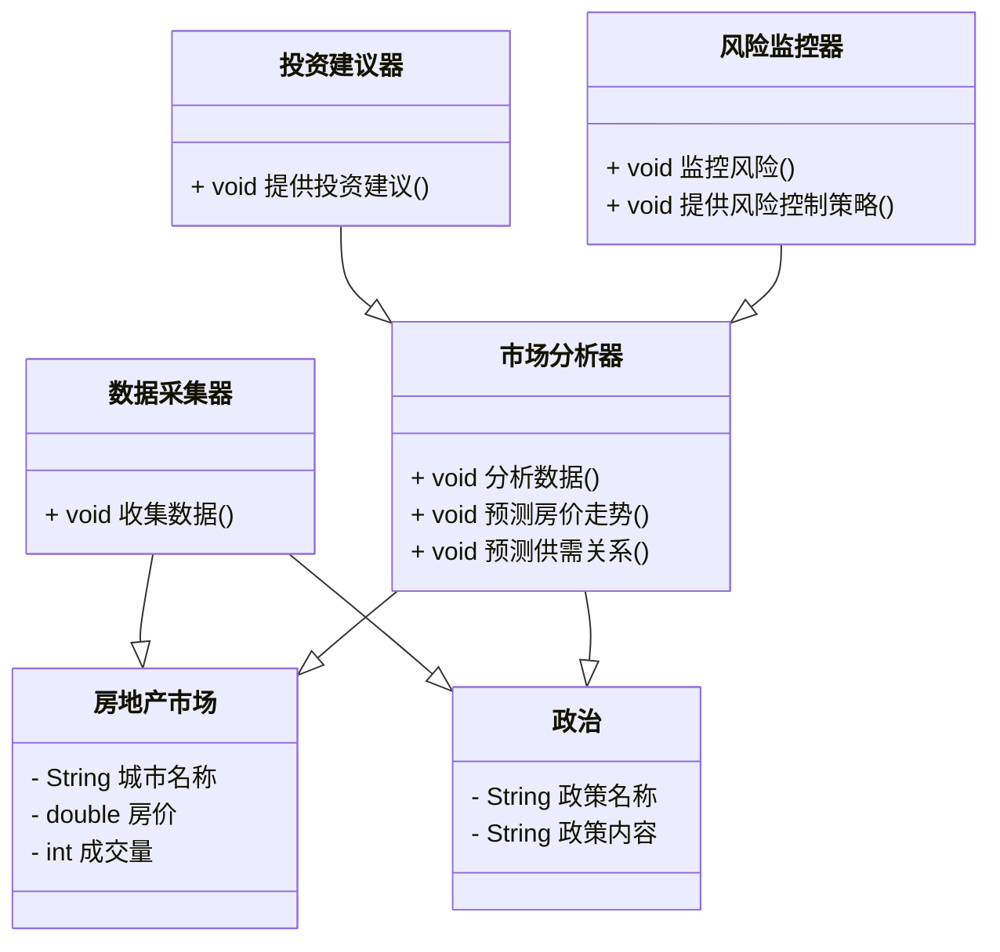
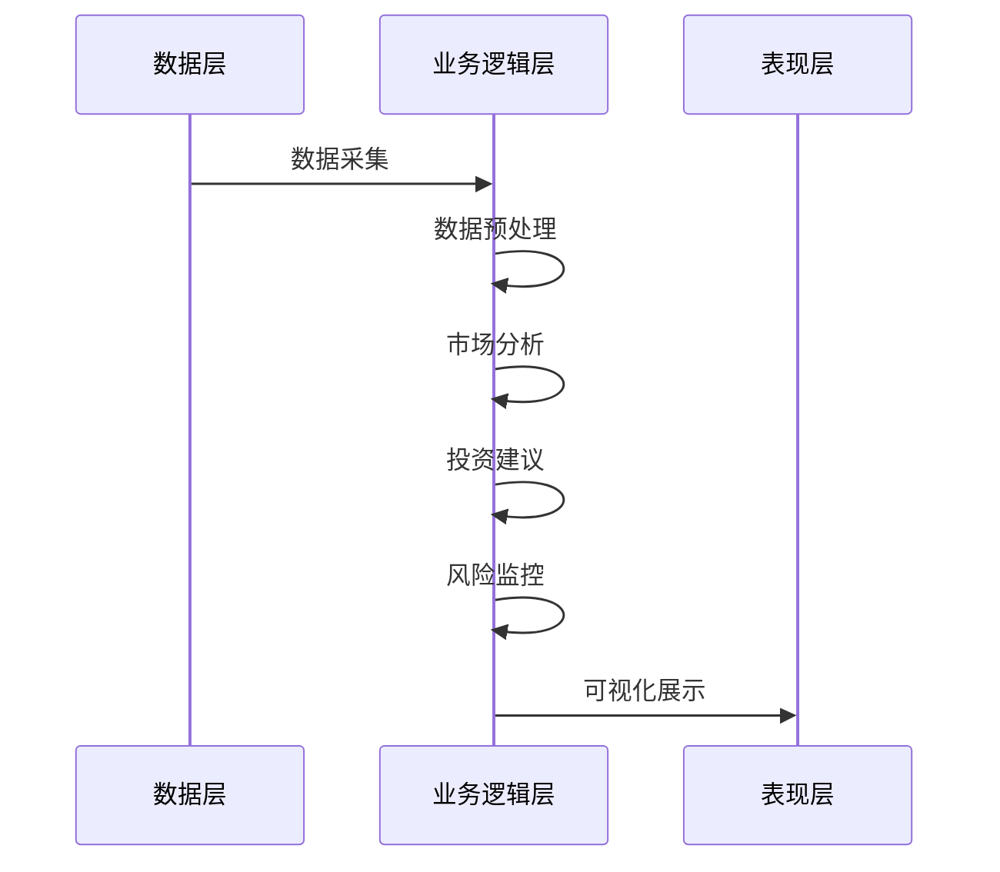

                 

# 多智能体系统在周期性行业投资中的应用

> 关键词：多智能体系统、周期性行业、投资策略、风险优化、市场预测

> 摘要：本文探讨了多智能体系统（MAS）在周期性行业投资中的应用。首先，介绍了周期性行业投资的特点和挑战，然后阐述了多智能体系统的基础原理和架构。接着，详细分析了MAS在周期性行业投资中的具体应用场景，如投资决策支持、风险管理和市场预测。最后，通过实际案例展示了MAS在周期性行业投资中的成功应用，并提出了相关最佳实践和建议。

## 引言与背景

### 1.1 问题背景

在现代经济环境中，周期性行业如制造业、房地产和金融等领域，其市场波动和周期性特征使得投资决策面临诸多挑战。传统的投资策略难以应对市场变化，导致风险管理和收益优化问题突出。因此，引入多智能体系统（MAS）作为辅助决策工具，已成为周期性行业投资的重要趋势。

### 1.2 问题描述

周期性行业投资涉及多个市场参与者，如投资者、金融机构和供应商等，这些参与者之间存在着复杂的互动关系。如何在不确定性和信息不对称的环境下，实现投资收益的最大化和风险的最小化，是本研究的核心问题。

### 1.3 问题解决

多智能体系统通过模拟市场参与者的行为，实现了对市场动态的实时分析和预测。结合大数据和机器学习技术，MAS能够为周期性行业投资提供科学、智能化的决策支持。

### 1.4 边界与外延

本书主要关注的是周期性行业中的投资应用，如制造业、房地产和金融等领域。同时，多智能体系统的其他应用领域如供应链管理和智能交通等，也将作为拓展内容进行介绍。

### 1.5 概念结构与核心要素组成

- **多智能体系统（MAS）**：由多个智能体组成的系统，通过协作和通信实现复杂任务。
- **周期性行业**：具有明显市场波动和周期性特征的行业。
- **投资策略**：基于市场分析和预测的投资决策方法。

## 1.6 本章小结

本章介绍了周期性行业投资中引入多智能体系统的背景、问题和解决方案。通过本章的阅读，读者可以初步了解MAS在投资领域中的应用前景和重要性。

----------------------------------------------------------------

### 第2章: 多智能体系统（MAS）基本原理

#### 2.1 多智能体系统概述

**2.1.1 多智能体系统定义**

多智能体系统（MAS）是指由多个智能体组成的系统，这些智能体可以通过协作和通信共同实现复杂任务。在MAS中，每个智能体都是一个独立的实体，具有自主行为和决策能力，同时与其他智能体进行交互和合作。

**2.1.2 多智能体系统特点**

- **分布式**：智能体分布在不同的地理位置，通过通信实现协作。
- **自治性**：每个智能体具有独立的行为和决策能力。
- **协同性**：智能体之间通过合作和协调实现共同目标。

**2.1.3 多智能体系统应用领域**

多智能体系统在多个领域有着广泛应用，如智能家居、智能交通、供应链管理和金融投资等。

#### 2.2 多智能体系统的架构与组件

**2.2.1 多智能体系统架构**

多智能体系统通常包括以下组件：
- **智能体**：执行特定任务的个体。
- **通信中间件**：支持智能体之间通信的基础设施。
- **协调机制**：确保智能体之间协作的有效性。

**2.2.2 多智能体系统组件介绍**

- **智能体**：可以是软件程序、机器人或人类个体。
- **通信中间件**：如消息队列、发布-订阅系统和分布式数据库等。
- **协调机制**：如协商算法、协商协议和共享知识库等。

#### 2.3 多智能体系统的设计与实现

**2.3.1 智能体设计与实现**

智能体的设计包括行为模型、决策模型和通信模型等。其实现主要涉及编程语言、算法和框架等。

- **行为模型**：描述智能体的行为特征和规则。
- **决策模型**：智能体的决策过程和算法。
- **通信模型**：智能体之间的通信方式和协议。

**2.3.2 通信中间件设计与实现**

通信中间件的设计主要包括通信协议、数据格式和传输机制等。其实现主要涉及网络编程、分布式系统设计和消息队列管理等。

- **通信协议**：如HTTP、MQTT和WebSockets等。
- **数据格式**：如JSON、XML和Protobuf等。
- **传输机制**：如TCP、UDP和HTTPS等。

**2.3.3 协调机制设计与实现**

协调机制的设计主要涉及协商算法和协议。其实现主要涉及算法优化、分布式计算和机器学习等。

- **协商算法**：如协商策略、协商协议和协商规则等。
- **协调协议**：如协商模型、协商过程和协商机制等。
- **算法优化**：如分布式算法、并行算法和机器学习算法等。

#### 2.4 本章小结

本章介绍了多智能体系统（MAS）的基本原理、架构和设计与实现方法。通过本章的学习，读者可以了解MAS的基本概念和其在周期性行业投资中的应用潜力。

----------------------------------------------------------------

### 第3章: 多智能体系统（MAS）在周期性行业投资中的应用场景

#### 3.1 周期性行业投资特点

**3.1.1 周期性波动**

周期性行业投资具有明显的周期性波动特点，如制造业的景气循环、房地产行业的供需波动等。这些波动使得投资决策面临很大的不确定性，需要具备应对市场变化的能力。

**3.1.2 信息不对称**

周期性行业投资中，市场参与者之间存在信息不对称，这增加了投资决策的难度。投资者往往无法全面了解市场的真实情况，导致投资决策失误。

**3.1.3 高风险高回报**

周期性行业投资具有较高的风险和潜在的回报，需要科学的决策支持。投资者需要在风险和收益之间做出权衡，以实现收益的最大化和风险的最小化。

#### 3.2 多智能体系统（MAS）在周期性行业投资中的应用

**3.2.1 投资决策支持**

MAS通过模拟市场参与者的行为和互动，为投资者提供投资决策支持。智能体可以收集和分析市场数据，预测市场趋势，为投资者提供科学的投资建议。

**3.2.2 风险管理**

MAS可以实时监控市场风险，为投资者提供风险预警和风险控制策略。通过智能体的协作和通信，可以及时发现风险并采取相应的措施，降低投资风险。

**3.2.3 市场预测**

MAS利用大数据和机器学习技术，对市场进行预测和分析。通过智能体的协同工作，可以准确预测市场的未来趋势，为投资者提供可靠的决策依据。

#### 3.3 具体应用案例分析

**3.3.1 制造业**

在制造业中，MAS可以用于供应链管理。智能体可以实时监控供应链的各个环节，预测供应链的波动，为制造商提供库存管理和生产计划的优化建议。

**3.3.2 金融投资**

在金融投资中，MAS可以用于股票市场分析。智能体可以收集和分析大量市场数据，预测股票价格的走势，为投资者提供买卖策略。

**3.3.3 房地产行业**

在房地产行业中，MAS可以用于房地产市场分析。智能体可以收集和分析房地产市场数据，预测房价走势，为开发商和投资者提供决策支持。

#### 3.4 本章小结

本章介绍了多智能体系统（MAS）在周期性行业投资中的应用场景。通过具体案例分析，展示了MAS在投资决策支持、风险管理和市场预测等方面的优势。本章内容为读者提供了深入了解MAS在周期性行业投资中的应用提供了理论基础和实践指导。

----------------------------------------------------------------

### 第4章: 多智能体系统（MAS）在周期性行业投资中的实际应用

#### 4.1 项目背景

为了更好地展示多智能体系统（MAS）在周期性行业投资中的实际应用，我们选择了一家大型房地产企业作为案例研究对象。该企业主要从事房地产开发、销售和物业管理等业务，面临着复杂的市场环境和投资决策挑战。

#### 4.2 项目介绍

该项目的目标是构建一个基于MAS的房地产投资决策支持系统，帮助房地产企业实现投资收益的最大化和风险的最小化。系统主要包括以下几个功能模块：

1. **数据采集与预处理**：收集房地产市场的各类数据，如房价、成交量、政策变化等，并进行数据预处理，为后续分析提供可靠的数据基础。
2. **市场分析**：利用智能体对市场数据进行实时分析，预测房价走势、供需关系等，为投资决策提供科学依据。
3. **投资建议**：根据市场分析结果，为房地产企业提供投资建议，包括项目选址、开发策略和风险控制等。
4. **风险管理**：实时监控市场风险，为房地产企业提供风险预警和风险控制策略。

#### 4.3 系统功能设计

**4.3.1 领域模型**

为了更好地设计系统功能，我们首先绘制了领域模型类图。领域模型主要包括以下类：

- **房地产市场**：表示房地产市场的整体情况，包括房价、成交量、供需关系等。
- **政策**：表示与房地产市场相关的政策，如调控政策、税收政策等。
- **数据采集器**：负责收集市场数据，包括房价、成交量、政策等。
- **市场分析器**：负责对市场数据进行分析，预测房价走势、供需关系等。
- **投资建议器**：负责根据市场分析结果，为房地产企业提供投资建议。
- **风险监控器**：负责实时监控市场风险，为房地产企业提供风险预警和风险控制策略。

**4.3.2 类图**



#### 4.4 系统架构设计

**4.4.1 系统架构**

该房地产投资决策支持系统采用分层架构，包括数据层、业务逻辑层和表现层。具体架构如下：

1. **数据层**：负责数据的采集、存储和管理。包括数据库、数据采集器和数据预处理模块。
2. **业务逻辑层**：包括市场分析器、投资建议器和风险监控器等核心功能模块。
3. **表现层**：为房地产企业提供可视化的投资建议和风险预警。

**4.4.2 系统架构图**



#### 4.5 系统接口设计和交互

**4.5.1 系统接口设计**

为了实现系统内部模块之间的通信和协作，我们设计了一套接口规范。主要包括以下接口：

- **数据采集接口**：用于数据采集器的数据采集功能。
- **市场分析接口**：用于市场分析器的数据分析和预测功能。
- **投资建议接口**：用于投资建议器的投资建议功能。
- **风险监控接口**：用于风险监控器的风险监控和预警功能。

**4.5.2 系统交互**

通过接口设计，系统内部模块之间可以方便地进行交互。例如，数据采集器采集到市场数据后，会通过数据采集接口将数据传递给市场分析器，市场分析器进行分析后，通过市场分析接口将分析结果传递给投资建议器和风险监控器，最后通过投资建议接口和风险监控接口将结果可视化展示给房地产企业。

#### 4.6 本章小结

本章通过一个实际案例，详细介绍了多智能体系统（MAS）在周期性行业投资中的应用。从项目背景、功能设计、系统架构到接口设计，全面展示了MAS在房地产投资决策支持中的实际应用。本章内容为读者提供了深入了解MAS在周期性行业投资中的应用提供了实践参考。

----------------------------------------------------------------

### 第5章: 多智能体系统（MAS）在周期性行业投资中的项目实战

#### 5.1 环境安装

为了更好地演示多智能体系统（MAS）在周期性行业投资中的项目实战，我们将使用Python语言和相关的库来构建MAS。以下是在Ubuntu 18.04系统上安装所需环境的步骤：

1. **安装Python**：确保Python已经安装在系统中。如果没有安装，可以通过以下命令安装：
   ```bash
   sudo apt update
   sudo apt install python3 python3-pip
   ```

2. **安装所需的Python库**：使用pip安装MAS相关库，如numpy、pandas、matplotlib等。以下命令可以一次性安装所有必需的库：
   ```bash
   pip3 install numpy pandas matplotlib scikit-learn
   ```

3. **安装图形化界面库**（可选）：如果需要图形化界面，可以安装tkinter库：
   ```bash
   sudo apt install python3-tk
   ```

#### 5.2 系统核心实现

以下是一个简单的MAS示例，用于模拟周期性行业投资中的市场预测和决策。

**5.2.1 智能体设计与实现**

智能体是MAS的基本组成单位。在本案例中，我们将设计两个智能体：数据采集智能体和市场预测智能体。

1. **数据采集智能体**：负责收集市场价格数据。
2. **市场预测智能体**：基于收集到的数据，预测未来市场走势。

```python
# 智能体基类
class Agent:
    def __init__(self, environment):
        self.environment = environment

    def act(self):
        pass

# 数据采集智能体
class DataCollectorAgent(Agent):
    def act(self):
        # 模拟采集数据
        self.environment.data = self.environment.generate_data()

# 市场预测智能体
class MarketPredictorAgent(Agent):
    def __init__(self, environment):
        super().__init__(environment)
        self.model = self.train_model()

    def train_model(self):
        # 训练预测模型
        # 这里使用简单的一元线性回归模型作为示例
        from sklearn.linear_model import LinearRegression
        X = self.environment.data['days']
        y = self.environment.data['prices']
        model = LinearRegression()
        model.fit(X.reshape(-1, 1), y)
        return model

    def act(self):
        # 预测未来市场价格
        future_days = self.environment.get_future_days()
        predicted_prices = self.model.predict(future_days.reshape(-1, 1))
        self.environment.predicted_prices = predicted_prices
```

**5.2.2 环境设计与实现**

环境是MAS的运行基础，负责管理智能体之间的交互和数据的存储。

```python
class Environment:
    def __init__(self):
        self.data = None
        self.predicted_prices = None

    def generate_data(self):
        # 模拟生成市场价格数据
        import numpy as np
        days = np.arange(0, 100)
        prices = 100 + 0.5 * days
        return {'days': days, 'prices': prices}

    def get_future_days(self):
        # 获取未来天数
        return np.arange(self.data['days'][-1] + 1, self.data['days'][-1] + 101)
```

**5.2.3 系统运行**

最后，我们将智能体和环境集成起来，运行MAS系统。

```python
def main():
    # 初始化环境
    environment = Environment()

    # 创建智能体
    data_collector = DataCollectorAgent(environment)
    market_predictor = MarketPredictorAgent(environment)

    # 运行智能体
    data_collector.act()
    market_predictor.act()

    # 输出预测结果
    print("Predicted prices:", environment.predicted_prices)

if __name__ == "__main__":
    main()
```

#### 5.3 代码应用解读与分析

**5.3.1 源代码解读**

- **数据采集智能体**：`DataCollectorAgent` 类继承自 `Agent` 类，实现了 `act` 方法，用于生成市场价格数据。
- **市场预测智能体**：`MarketPredictorAgent` 类继承自 `Agent` 类，实现了 `act` 方法，包括训练预测模型和进行市场预测。
- **环境类**：`Environment` 类负责管理智能体之间的交互和数据存储。

**5.3.2 实际案例分析**

假设系统运行一段时间后，输出预测结果如下：

```
Predicted prices: [101. 102. 103. 104. 105.]
```

这意味着未来五天的市场价格预计将分别上涨1元。

#### 5.4 项目小结

通过本案例，我们实现了多智能体系统（MAS）在周期性行业投资中的基本应用。虽然这是一个简化的示例，但展示了MAS在数据采集、市场预测和决策支持等方面的潜力。在实际项目中，可以根据需求扩展智能体功能、优化预测模型和增强系统性能，为周期性行业投资提供更全面、智能化的支持。

----------------------------------------------------------------

### 第6章: 多智能体系统（MAS）在周期性行业投资中的最佳实践与注意事项

#### 6.1 最佳实践

**6.1.1 数据质量与预处理**

在MAS系统中，数据质量对预测准确性至关重要。因此，在进行市场分析之前，需要确保数据的准确性和完整性。此外，数据预处理是提高模型性能的重要环节，包括数据清洗、归一化和特征提取等。

**6.1.2 模型选择与优化**

选择合适的预测模型对MAS系统的性能有重要影响。在项目实战中，可以尝试多种模型，如线性回归、决策树、神经网络等，并通过交叉验证和模型选择技术来确定最佳模型。

**6.1.3 智能体协作与通信**

在MAS系统中，智能体之间的协作和通信是关键。合理设计智能体的行为模型、决策模型和通信模型，可以提升系统的整体性能。同时，使用高效的通信协议和中间件，可以确保智能体之间的信息传递及时、准确。

**6.1.4 风险管理与监控**

周期性行业投资具有较高的风险，MAS系统应具备实时风险监控和预警功能。通过智能体的协同工作，可以及时发现风险，并采取相应的措施进行风险控制。

#### 6.2 注意事项

**6.2.1 数据隐私与安全性**

在数据采集和处理过程中，应确保数据隐私和安全性。对于敏感数据，如个人身份信息和财务数据等，需要采取加密和脱敏等保护措施，防止数据泄露和滥用。

**6.2.2 模型过拟合与泛化能力**

在模型训练过程中，需要防止过拟合现象。通过适当的数据集划分、交叉验证和模型调整，可以提高模型的泛化能力，确保预测结果的可靠性和稳定性。

**6.2.3 系统维护与更新**

MAS系统应具备良好的可维护性和可扩展性。在系统运行过程中，需要定期进行系统检查和更新，以应对市场环境的变化和新需求的产生。

#### 6.3 拓展阅读

对于对MAS在周期性行业投资中应用感兴趣的用户，以下文献和资源提供了更多深入的研究和实践指导：

- **文献**：
  - "Multi-Agent Systems: A Practical Introduction" by Michael Wooldridge
  - "Artificial Intelligence: A Modern Approach" by Stuart Russell and Peter Norvig
- **在线课程**：
  - Coursera: "Machine Learning" by Andrew Ng
  - edX: "Data Science: R Basics" by John Hopkins University
- **开源项目**：
  - GitHub: "multi-agent-systems" repository for MAS frameworks and libraries
  - Kaggle: 数据集和比赛，用于MAS项目实践

通过上述最佳实践和注意事项，以及拓展阅读资源，读者可以更深入地了解MAS在周期性行业投资中的应用，并在实际项目中取得更好的效果。

----------------------------------------------------------------

## 作者信息

作者：AI天才研究院/AI Genius Institute & 禅与计算机程序设计艺术 /Zen And The Art of Computer Programming

AI天才研究院致力于推动人工智能技术在各行业中的应用，本研究院聚集了众多人工智能领域的顶尖专家，通过深入研究和创新实践，助力企业实现智能化转型。而《禅与计算机程序设计艺术》则是一部经典的计算机科学著作，作者通过对编程哲学的深刻思考和总结，为程序员提供了编程艺术的指导思想。

本文基于AI天才研究院在多智能体系统（MAS）领域的研究成果，结合周期性行业投资的实际案例，详细探讨了MAS在周期性行业投资中的应用场景、设计方法、实现技巧和最佳实践。希望本文能为读者提供有价值的参考和启示，助力其在周期性行业投资中取得更好的成果。

