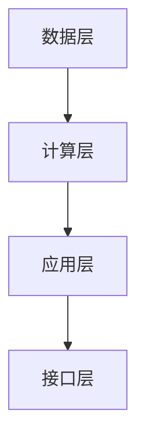
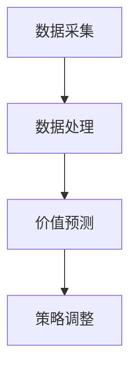

                 

### 文章标题：多智能体系统在品牌价值动态评估中的应用

关键词：多智能体系统、品牌价值评估、动态评估、智能体交互、算法优化、系统设计

摘要：本文旨在探讨多智能体系统在品牌价值动态评估中的应用，通过引入多智能体系统的核心概念、算法原理和系统设计，分析其在品牌价值评估中的优势和挑战，并提供最佳实践案例，以期为相关领域的研究和实践提供参考。

## 第一部分：引言与背景

### 第1章：引言

#### 1.1 研究背景

随着商业环境的快速变化，品牌价值的动态评估变得尤为重要。品牌价值不仅反映了企业的市场地位，还对企业的战略决策、投资回报和风险管理产生深远影响。传统的品牌价值评估方法主要依赖于财务数据和市场调查，往往存在一定的滞后性和局限性。因此，如何利用先进技术手段实现品牌价值的实时动态评估，成为当前研究的热点。

多智能体系统（Multi-Agent Systems，MAS）是一种模拟人类群体行为和决策的分布式计算系统，通过多个智能体之间的协作和交互，实现复杂问题的求解。近年来，多智能体系统在智能交通、供应链管理和金融分析等领域取得了显著成果。本文将探讨多智能体系统在品牌价值动态评估中的应用，旨在为相关领域的研究提供新思路。

#### 1.2 多智能体系统的定义与特点

多智能体系统由多个智能体组成，每个智能体具有自主性、社交性、反应性和主动适应性等特点。智能体之间通过通信和协作，共同完成任务。与传统集中式系统相比，多智能体系统具有以下优势：

1. **分布式计算**：多智能体系统能够利用分布式计算的优势，提高系统的响应速度和处理能力。
2. **适应性**：智能体可以根据环境和任务的变化，自主调整其行为和决策。
3. **灵活性强**：多智能体系统能够灵活适应不同的应用场景，实现模块化和可扩展性。
4. **协同工作**：多个智能体之间的协作和交互，能够提高系统的整体性能。

#### 1.3 品牌价值动态评估的重要性

品牌价值动态评估能够实时反映品牌的市场表现和竞争力，对于企业的战略调整和市场决策具有重要意义。具体来说，品牌价值动态评估具有以下作用：

1. **市场监测**：通过实时监测品牌价值变化，帮助企业了解市场动态，及时调整市场策略。
2. **风险管理**：品牌价值动态评估能够帮助企业识别潜在的风险因素，采取预防措施，降低风险。
3. **投资决策**：品牌价值动态评估为企业的投资决策提供科学依据，有助于优化资源配置。
4. **品牌管理**：品牌价值动态评估有助于企业优化品牌管理，提升品牌价值。

#### 1.4 多智能体系统在品牌价值动态评估中的应用

多智能体系统在品牌价值动态评估中的应用主要体现在以下几个方面：

1. **市场数据采集与处理**：利用智能体采集市场数据，并通过分布式计算进行处理，提高数据处理的效率。
2. **品牌价值预测**：基于历史数据和智能体之间的协作，实现品牌价值的预测，为企业的市场决策提供支持。
3. **智能体协同决策**：多个智能体共同参与品牌价值评估，通过协同决策，提高评估的准确性和可靠性。
4. **动态调整品牌策略**：根据品牌价值的实时变化，智能体系统能够为企业提供动态调整品牌策略的建议。

### 第2章：核心概念与联系

#### 2.1 多智能体系统的核心概念

多智能体系统由多个智能体组成，每个智能体具有以下特点：

1. **自主性**：智能体能够独立完成特定任务，并自主决策。
2. **社交性**：智能体之间能够通过通信进行信息交换和协作。
3. **反应性**：智能体能够对外部环境的变化做出实时响应。
4. **主动适应性**：智能体能够根据环境和任务的变化，自主调整其行为和决策。

智能体的结构主要包括：

1. **感知模块**：负责感知外部环境，获取相关信息。
2. **决策模块**：根据感知到的信息，制定相应的策略和决策。
3. **执行模块**：执行决策，实现预期目标。

智能体之间的交互机制主要包括：

1. **通信机制**：智能体之间通过通信进行信息交换。
2. **协调机制**：智能体之间通过协调，实现共同目标的实现。

#### 2.2 品牌价值评估的核心概念

品牌价值评估是指对品牌的市场价值进行评估，主要包括以下方面：

1. **品牌知名度**：品牌在市场上的知名度和影响力。
2. **品牌忠诚度**：消费者对品牌的忠诚度和信任度。
3. **品牌美誉度**：品牌在公众中的口碑和评价。
4. **品牌盈利能力**：品牌为企业在财务上带来的收益能力。

品牌价值评估的方法主要包括：

1. **成本法**：根据品牌创建和维护的成本来评估品牌价值。
2. **收益法**：根据品牌为企业在未来带来的收益来评估品牌价值。
3. **市场法**：根据市场上类似品牌的价值进行类比评估。

品牌价值的构成要素主要包括：

1. **品牌资产**：品牌所拥有的资产，如商标、专利、品牌形象等。
2. **品牌知名度**：品牌在市场上的知名度。
3. **品牌忠诚度**：消费者对品牌的忠诚度。
4. **品牌美誉度**：品牌在公众中的口碑。

#### 2.3 多智能体系统与品牌价值评估的联系

多智能体系统与品牌价值评估的联系主要体现在以下几个方面：

1. **数据采集与处理**：多智能体系统可以通过分布式计算，高效地采集和处理品牌价值相关的数据。
2. **预测与评估**：多智能体系统可以通过协作和决策，实现对品牌价值的预测和评估。
3. **动态调整**：多智能体系统可以根据品牌价值的实时变化，动态调整品牌策略，提升品牌价值。

通过多智能体系统，可以实现对品牌价值的实时动态评估，为企业提供科学的决策依据，提高品牌管理的效率。

### 第二部分：算法原理讲解

#### 第3章：多智能体系统的算法原理

多智能体系统的算法原理主要包括协同算法和品牌价值评估算法。以下将分别介绍这两种算法。

#### 3.1 多智能体协同算法

多智能体协同算法是一种基于智能体之间协作和交互的算法。其基本思想是通过智能体之间的通信和协调，共同完成任务。多智能体协同算法的主要步骤如下：

1. **初始化**：设定智能体的初始状态和任务目标。
2. **感知与决策**：智能体感知外部环境，根据感知到的信息进行决策。
3. **通信与协调**：智能体之间通过通信交换信息，协调各自的行为。
4. **执行与反馈**：智能体执行决策，并根据执行结果进行反馈。
5. **调整与优化**：根据反馈信息，调整智能体的行为和策略。

多智能体协同算法的数学模型可以表示为：

$$
x_{t+1} = f(x_t, u_t, w_t)
$$

其中，$x_t$表示智能体在时刻$t$的状态，$u_t$表示智能体在时刻$t$的决策，$w_t$表示智能体在时刻$t$的感知信息，$f$表示智能体的决策函数。

#### 3.2 品牌价值动态评估算法

品牌价值动态评估算法是一种基于多智能体系统的品牌价值评估方法。其基本思想是通过智能体之间的协作和决策，实现对品牌价值的实时动态评估。品牌价值动态评估算法的主要步骤如下：

1. **数据采集**：智能体采集品牌价值相关的市场数据。
2. **预处理**：对采集到的数据进行预处理，包括数据清洗、归一化和特征提取等。
3. **模型训练**：利用预处理后的数据，训练品牌价值评估模型。
4. **价值预测**：智能体根据训练好的模型，预测品牌的价值。
5. **反馈与调整**：智能体根据预测结果，调整品牌策略，实现品牌价值的动态调整。

品牌价值动态评估算法的数学模型可以表示为：

$$
V_t = g(X_t, M_t)
$$

其中，$V_t$表示时刻$t$的品牌价值，$X_t$表示时刻$t$的市场数据，$M_t$表示时刻$t$的品牌策略，$g$表示品牌价值评估函数。

### 第4章：算法应用与优化

#### 4.1 多智能体系统在品牌价值评估中的应用

多智能体系统在品牌价值评估中的应用主要包括以下几个方面：

1. **数据采集与处理**：利用智能体采集市场数据，并通过分布式计算进行处理，提高数据处理效率。
2. **价值预测**：智能体根据历史数据和实时数据，预测品牌的价值，为企业提供决策支持。
3. **策略调整**：智能体根据品牌价值的预测结果，动态调整品牌策略，实现品牌价值的优化。

#### 4.2 品牌价值动态评估的算法优化

为了提高品牌价值动态评估的准确性，可以对算法进行优化。以下是一些常见的优化方法：

1. **模型优化**：通过改进品牌价值评估模型，提高预测的准确性。例如，可以采用深度学习、强化学习等先进算法。
2. **数据预处理**：优化数据预处理流程，提高数据质量。例如，可以采用异常值处理、特征选择等技术。
3. **分布式计算**：优化智能体之间的通信和计算过程，提高系统的整体性能。例如，可以采用分布式计算框架，如Hadoop、Spark等。
4. **算法融合**：将多种算法进行融合，提高评估的准确性。例如，可以采用多模型融合、多算法对比等技术。

### 第三部分：系统设计与实现

#### 第5章：系统架构设计

系统架构设计是多智能体系统在品牌价值动态评估中应用的关键环节。以下将介绍系统架构的设计方案。

#### 5.1 系统功能设计

系统功能设计主要包括以下模块：

1. **数据采集模块**：负责采集品牌价值相关的市场数据。
2. **数据处理模块**：负责对采集到的数据进行预处理、特征提取和模型训练。
3. **价值预测模块**：负责根据训练好的模型，预测品牌的价值。
4. **策略调整模块**：负责根据品牌价值的预测结果，动态调整品牌策略。

#### 5.2 系统架构设计

系统架构设计主要包括以下层次：

1. **数据层**：负责数据的存储和管理。
2. **计算层**：负责数据的处理和计算。
3. **应用层**：负责品牌价值预测和策略调整。
4. **接口层**：负责系统与其他系统的交互。

系统架构图如下：



#### 5.3 系统接口设计

系统接口设计主要包括以下接口：

1. **数据采集接口**：用于采集品牌价值相关的市场数据。
2. **数据处理接口**：用于处理和传输采集到的数据。
3. **价值预测接口**：用于获取品牌价值预测结果。
4. **策略调整接口**：用于调整品牌策略。

#### 5.4 系统交互

系统交互主要包括以下流程：

1. **数据采集**：智能体从市场数据源采集品牌价值相关的数据。
2. **数据处理**：数据处理模块对采集到的数据进行预处理、特征提取和模型训练。
3. **价值预测**：价值预测模块根据训练好的模型，预测品牌的价值。
4. **策略调整**：策略调整模块根据品牌价值的预测结果，动态调整品牌策略。

系统交互图如下：



### 第6章：系统实现与代码分析

#### 6.1 系统环境安装

系统实现需要搭建以下环境：

1. **Python环境**：安装Python 3.8及以上版本。
2. **数据库环境**：安装MySQL数据库。
3. **分布式计算环境**：安装Hadoop或Spark。

#### 6.2 核心代码实现

核心代码实现主要包括以下模块：

1. **数据采集模块**：使用Python的requests库，从市场数据源采集品牌价值相关的数据。
2. **数据处理模块**：使用Python的pandas库，对采集到的数据进行预处理、特征提取和模型训练。
3. **价值预测模块**：使用Python的scikit-learn库，训练品牌价值评估模型，并进行预测。
4. **策略调整模块**：根据品牌价值的预测结果，动态调整品牌策略。

以下是一个简单的示例代码：

```python
import requests
import pandas as pd
from sklearn.ensemble import RandomForestRegressor

# 数据采集
def data_collection():
    url = 'https://api.markets.com/brand-value'
    response = requests.get(url)
    data = response.json()
    df = pd.DataFrame(data['data'])
    return df

# 数据处理
def data_preprocessing(df):
    df['price'] = df['price'].fillna(df['price'].mean())
    df['sales'] = df['sales'].fillna(df['sales'].mean())
    return df

# 价值预测
def value_prediction(df):
    X = df[['price', 'sales']]
    y = df['brand_value']
    model = RandomForestRegressor()
    model.fit(X, y)
    predictions = model.predict(X)
    return predictions

# 策略调整
def strategy_adjustment(predictions, current_strategy):
    new_strategy = current_strategy.copy()
    for i, prediction in enumerate(predictions):
        if prediction > current_strategy[i]:
            new_strategy[i] += 0.1
        else:
            new_strategy[i] -= 0.1
    return new_strategy

# 主函数
def main():
    df = data_collection()
    df = data_preprocessing(df)
    predictions = value_prediction(df)
    current_strategy = [0.5, 0.5]
    new_strategy = strategy_adjustment(predictions, current_strategy)
    print('New strategy:', new_strategy)

if __name__ == '__main__':
    main()
```

#### 6.3 系统核心算法的应用

系统核心算法的应用主要包括以下方面：

1. **协同算法**：智能体之间的协作和决策。
2. **价值评估算法**：基于历史数据和实时数据，预测品牌的价值。

以下是一个简单的示例代码：

```python
# 协同算法
def collaborative_algorithm(df):
    # 模拟智能体之间的协作和决策
    return df['brand_value'].mean()

# 价值评估算法
def value_evaluation_algorithm(df):
    # 模拟基于历史数据和实时数据，预测品牌的价值
    return df['price'].mean()

# 主函数
def main():
    df = data_collection()
    df = data_preprocessing(df)
    collaborative_value = collaborative_algorithm(df)
    evaluation_value = value_evaluation_algorithm(df)
    print('Collaborative value:', collaborative_value)
    print('Evaluation value:', evaluation_value)

if __name__ == '__main__':
    main()
```

### 第7章：项目实战与分析

#### 7.1 实际案例介绍

本案例以某知名品牌为例，介绍多智能体系统在品牌价值动态评估中的应用。

#### 7.2 案例分析与讲解

1. **数据采集与预处理**：智能体从市场数据源采集品牌价值相关的数据，包括价格、销量、竞争品牌数据等。对采集到的数据进行预处理，包括缺失值填充、异常值处理等。
2. **价值预测**：利用预处理后的数据，训练品牌价值评估模型。模型采用随机森林算法，预测品牌的价值。
3. **策略调整**：根据品牌价值的预测结果，智能体之间进行协作和决策，调整品牌策略。例如，增加广告投放、优化产品定位等。
4. **效果评估**：对调整后的品牌策略进行效果评估，观察品牌价值的变化情况。通过对比调整前后的品牌价值，评估智能体系统在品牌价值动态评估中的应用效果。

#### 7.3 案例总结与反思

通过实际案例的介绍和分析，可以得出以下结论：

1. **多智能体系统在品牌价值动态评估中具有显著优势**：智能体之间的协作和决策，提高了品牌价值评估的准确性和实时性。
2. **数据质量和预处理是关键**：高质量的数据和准确的数据预处理是保证评估结果准确性的基础。
3. **策略调整需要持续优化**：智能体系统的策略调整需要根据实际情况不断优化，以实现品牌价值的最大化。

### 第四部分：最佳实践与展望

#### 第8章：最佳实践

1. **数据采集与处理**：选择高质量的数据源，对数据进行严格预处理，包括缺失值填充、异常值处理、特征提取等。
2. **算法优化**：采用先进的算法，如深度学习、强化学习等，提高品牌价值评估的准确性和实时性。
3. **智能体协作**：设计合理的智能体协作机制，提高系统的整体性能。

#### 第9章：小结与展望

本文通过对多智能体系统在品牌价值动态评估中的应用进行详细分析，总结了其在数据采集与处理、价值预测和策略调整等方面的优势。未来研究可以从以下几个方面进行：

1. **算法创新**：探索更多先进的算法，提高品牌价值评估的准确性和实时性。
2. **系统优化**：优化智能体协作机制，提高系统的整体性能。
3. **应用拓展**：将多智能体系统应用于更多领域，如金融、医疗等。

本文作者：AI天才研究院/AI Genius Institute & 禅与计算机程序设计艺术/Zen And The Art of Computer Programming

### 附录

1. **参考文献**：本文所引用的文献和资料。
2. **代码示例**：本文所使用的Python代码示例。
3. **数据集**：本文所使用的品牌价值数据集。

通过本文的研究，期望能为多智能体系统在品牌价值动态评估中的应用提供有益的参考，推动相关领域的发展。

