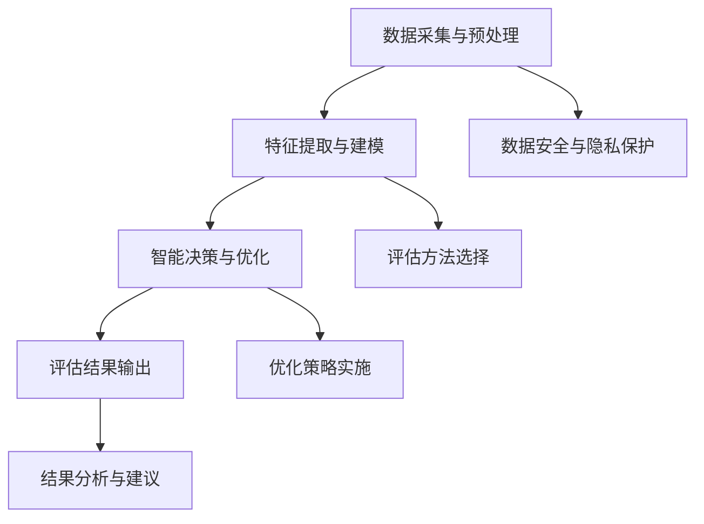
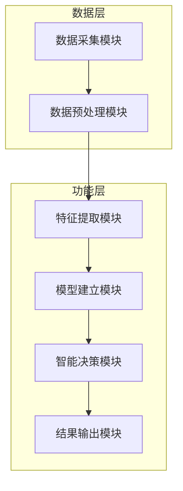
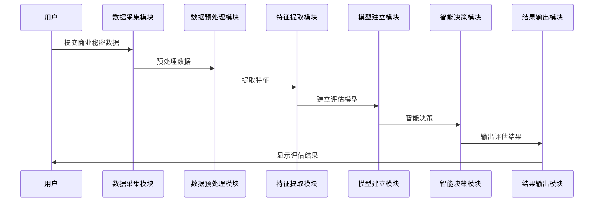

                 

# 多智能体系统在商业秘密价值评估中的应用：挖掘隐藏资产

## 关键词

多智能体系统，商业秘密，价值评估，人工智能，数据挖掘，智能决策

## 摘要

本文将探讨多智能体系统在商业秘密价值评估中的应用，通过深入分析多智能体系统的核心概念和商业秘密价值评估的方法，提出一种基于多智能体系统的商业秘密价值评估模型。本文首先介绍了多智能体系统的基本概念和属性特征，随后探讨了商业秘密价值评估的关键概念和现有方法。接着，本文详细阐述了多智能体系统在商业秘密价值评估中的应用流程，包括数据采集与预处理、特征提取与建模、智能决策与优化等步骤。最后，本文通过实际案例分析和项目小结，总结了多智能体系统在商业秘密价值评估中的优势和应用前景。

## 背景介绍

### 核心概念

#### 多智能体系统（MAS）

多智能体系统（Multi-Agent System，MAS）是由多个自主智能体组成的系统，这些智能体通过相互协作或竞争来完成任务或解决问题。每个智能体是一个具有独立决策能力的计算实体，能够感知环境、自主制定策略并采取行动。MAS的核心概念包括：

1. **智能体**：智能体是MAS的基本组成单元，具有以下属性：
   - **自主性**：智能体可以独立进行决策和执行任务，不受外界直接控制。
   - **社交性**：智能体之间可以相互通信和协作，形成复杂的社会网络。
   - **反应性**：智能体能够对环境变化做出实时响应。
   - **主动性**：智能体具有目标导向性，能够主动探索环境，寻找最佳策略。

2. **交互**：智能体之间的通信和协作机制，是实现MAS协同工作的基础。交互方式包括消息传递、共享数据和协商决策等。

3. **协作**：智能体通过交互共同完成任务的过程。协作可以是分布式、集中式或混合式的。

4. **环境**：智能体执行任务的外部条件，包括数据、资源、规则等。

#### 商业秘密价值评估

商业秘密价值评估是指对商业秘密所具有的经济价值、竞争价值、创新价值等进行的评估。商业秘密是指企业保密的、具有实际或潜在经济价值的技术信息、经营信息和其他信息。商业秘密价值评估的核心概念包括：

1. **评估指标**：衡量商业秘密价值的各类指标，如经济价值、法律价值、创新价值等。这些指标可以从不同的角度反映商业秘密的价值。

2. **评估方法**：用于评估商业秘密价值的各种方法和技术手段，如成本法、市场法、收益法等。评估方法的选择取决于评估指标和商业秘密的特点。

3. **评估结果**：评估过程的最终输出，包括评估值、排名、建议等。评估结果可以为企业制定战略决策、保护商业秘密、提升核心竞争力提供参考。

### 问题背景

随着市场竞争的加剧，商业秘密对于企业的重要性日益凸显。商业秘密不仅包括技术信息，还涉及经营信息、客户信息等，是企业核心竞争力的重要组成部分。如何有效地评估商业秘密的价值，已经成为企业制定战略决策、保护商业秘密、提升核心竞争力的重要手段。

然而，传统的商业秘密价值评估方法主要依赖于专家经验和统计分析，存在以下问题：

1. **主观性大**：专家经验和主观判断的影响较大，导致评估结果存在偏差。

2. **准确性低**：统计分析方法可能无法全面反映商业秘密的价值，导致评估结果不准确。

3. **时效性差**：传统方法难以适应快速变化的市场环境，导致评估结果滞后。

### 问题解决

多智能体系统在商业秘密价值评估中的应用，可以通过以下几个方面实现：

1. **数据采集与预处理**：利用智能体采集与企业商业秘密相关的数据，并对数据进行清洗、归一化等预处理，为后续分析提供高质量的数据基础。

2. **特征提取与建模**：通过智能体对采集到的数据进行分析，提取出反映商业秘密价值的特征，并利用机器学习算法建立价值评估模型。

3. **智能决策与优化**：利用多智能体之间的协同作用，对商业秘密的价值进行动态评估，并根据评估结果优化企业的商业秘密保护策略。

### 边界与外延

多智能体系统在商业秘密价值评估中的应用，不仅涉及技术层面，还包括法律、经济等多个领域。其边界主要包括：

1. **数据隐私与安全**：在采集和处理商业秘密相关数据时，需要确保数据的安全性和隐私性，防止数据泄露或被非法使用。

2. **法律合规**：商业秘密价值评估需要遵守相关法律法规，确保评估结果的合法性和公正性。

3. **技术可行性**：需要考虑多智能体系统在商业秘密价值评估中的技术实现难度和成本，确保方案的可操作性和实用性。

### 概念结构与核心要素组成

#### 多智能体系统

多智能体系统的概念结构主要包括以下几个核心要素：

1. **智能体**：负责执行特定任务的计算机程序或实体，具有独立的行为、意识和决策能力。

2. **交互**：智能体之间的信息交换和协同作用，是智能体实现协同工作的基础。

3. **环境**：智能体执行任务的外部条件，包括数据、资源、规则等。

4. **目标**：智能体需要完成的任务或达成的目标。

#### 商业秘密价值评估

商业秘密价值评估的概念结构主要包括：

1. **评估指标**：用于衡量商业秘密价值的各类指标，如经济价值、竞争价值、创新价值等。

2. **评估方法**：用于评估商业秘密价值的各种方法和技术手段。

3. **评估结果**：对商业秘密价值的评估结果，包括评估值、排名、建议等。

## 核心概念与联系

### 多智能体系统

多智能体系统（MAS）是现代计算机科学和人工智能领域的一个重要研究方向，其核心概念包括智能体、交互、协作和环境。以下是对这些核心概念的详细解释及其相互关系的分析。

#### 智能体

智能体是MAS中的基本计算单元，通常由软件或硬件实现，具备自主性、社交性、反应性和主动性。这些特性使得智能体能够独立进行感知、决策和行动，并且能够在复杂环境中与其他智能体进行协作或竞争。

1. **自主性**：智能体能够根据其内部状态和外部环境自主地做出决策，而不受外界直接控制。这种自主性是智能体能够适应动态环境的关键特性。

2. **社交性**：智能体可以通过通信机制与其他智能体进行交互，形成社交网络。这种交互不仅限于信息交换，还可以涉及资源共享、协作决策等。

3. **反应性**：智能体能够对环境中的变化做出实时响应。这种反应性使得智能体能够在不断变化的环境中保持稳定性和适应性。

4. **主动性**：智能体具有目标导向性，能够自主探索环境，寻找最佳策略。主动性使得智能体不仅能够被动地响应环境变化，还能够主动地影响环境。

#### 交互

交互是智能体之间信息交换和协同作用的过程，是实现MAS协同工作的基础。智能体之间的交互可以通过以下几种方式进行：

1. **消息传递**：智能体通过发送和接收消息来进行通信。消息可以是简单的数据包，也可以是复杂的对象或命令。

2. **共享数据**：智能体可以通过共享数据结构或数据库来交换信息。这种方式适用于需要频繁交换大量数据的应用场景。

3. **协商决策**：在多智能体系统中，多个智能体可能需要共同做出决策。协商决策过程涉及到智能体之间的信息交换和策略协调。

#### 协作

协作是指多个智能体通过相互协作共同完成任务或解决问题的过程。协作可以是分布式、集中式或混合式的，具体取决于应用场景和系统设计。

1. **分布式协作**：在分布式协作中，每个智能体独立地完成部分任务，然后将结果汇总。这种方式适用于任务可以分解为多个子任务且各个子任务之间相互独立的应用场景。

2. **集中式协作**：在集中式协作中，所有智能体将任务集中到一个中央实体进行处理。这种方式适用于任务复杂且需要统一协调的应用场景。

3. **混合式协作**：混合式协作结合了分布式和集中式的优点，适用于不同类型的任务和场景。

#### 环境

环境是多智能体系统执行任务的外部条件，包括数据、资源、规则等。环境的特点会影响智能体的行为和系统性能。

1. **数据**：环境中的数据是智能体进行决策和行动的基础。数据的准确性、完整性和实时性对智能体的表现至关重要。

2. **资源**：环境中的资源是智能体执行任务所需的硬件、软件和其他资源。资源分配和管理对系统的效率和性能有重要影响。

3. **规则**：环境中的规则定义了智能体的行为规范和约束条件。规则的设计和实施对系统的稳定性和可靠性有重要影响。

### 商业秘密价值评估

商业秘密价值评估是指对商业秘密所具有的经济价值、竞争价值、创新价值等进行的评估。商业秘密是企业保密的、具有实际或潜在经济价值的技术信息、经营信息和其他信息。以下是对商业秘密价值评估的核心概念和相互关系的分析。

#### 评估指标

评估指标是衡量商业秘密价值的各类指标，如经济价值、法律价值、创新价值等。这些指标可以从不同的角度反映商业秘密的价值。

1. **经济价值**：商业秘密对企业经济效益的贡献程度。经济价值可以通过商业秘密带来的直接收益（如销售额增加）和间接收益（如成本降低）来衡量。

2. **法律价值**：商业秘密的法律保护力度和潜在风险。法律价值可以通过商业秘密的知识产权保护状况、侵权风险等因素来衡量。

3. **创新价值**：商业秘密的创新程度和技术先进性。创新价值可以通过商业秘密的技术领先性、市场竞争力等因素来衡量。

#### 评估方法

评估方法是用于评估商业秘密价值的各种方法和技术手段。评估方法的选择取决于评估指标和商业秘密的特点。

1. **成本法**：基于商业秘密的开发、维护和保护成本来评估其价值。成本法适用于商业秘密较为成熟且成本数据容易获取的情况。

2. **市场法**：通过市场上类似商业秘密的交易价格来评估其价值。市场法适用于商业秘密具有市场价格的情况下。

3. **收益法**：基于商业秘密带来的未来收益来评估其价值。收益法适用于商业秘密具有明确经济效益预测的情况下。

#### 评估结果

评估结果是评估过程的最终输出，包括评估值、排名、建议等。评估结果可以为企业制定战略决策、保护商业秘密、提升核心竞争力提供参考。

1. **评估值**：对商业秘密价值的量化评估结果。评估值可以是具体的经济金额，也可以是相对排名。

2. **排名**：对商业秘密价值进行排名，帮助企业确定哪些商业秘密更具价值。

3. **建议**：基于评估结果，为企业提供保护商业秘密、优化资源配置、提升核心竞争力的建议。

### 概念结构与核心要素组成

#### 多智能体系统

多智能体系统的概念结构主要包括以下几个核心要素：

1. **智能体**：智能体是MAS的基本组成单元，具有自主性、社交性、反应性和主动性。

2. **交互**：智能体之间的信息交换和协同作用，是智能体实现协同工作的基础。

3. **环境**：智能体执行任务的外部条件，包括数据、资源、规则等。

4. **目标**：智能体需要完成的任务或达成的目标。

#### 商业秘密价值评估

商业秘密价值评估的概念结构主要包括以下几个核心要素：

1. **评估指标**：用于衡量商业秘密价值的各类指标，如经济价值、法律价值、创新价值等。

2. **评估方法**：用于评估商业秘密价值的各种方法和技术手段。

3. **评估结果**：对商业秘密价值的评估结果，包括评估值、排名、建议等。

## 核心概念与联系

### 多智能体系统

多智能体系统（MAS）是现代人工智能研究中的一个重要领域，其核心概念包括智能体、交互、协作和环境。下面我们将详细探讨这些核心概念的属性特征，并对比分析它们在不同应用场景中的表现。

#### 智能体

智能体是MAS中的基本计算单元，它们具有以下属性特征：

1. **自主性**：智能体能够独立进行决策和执行任务，不受外界直接控制。自主性是智能体的核心特征，它使得智能体能够在复杂环境中自主地选择行动策略。

2. **社交性**：智能体能够与其他智能体进行通信和协作，形成复杂的社会网络。社交性是智能体实现协同工作的基础，它使得多个智能体能够共同完成任务。

3. **反应性**：智能体能够对环境中的变化做出实时响应。反应性是智能体适应动态环境的能力，它使得智能体能够在不断变化的环境中保持稳定性和适应性。

4. **主动性**：智能体具有目标导向性，能够自主探索环境，寻找最佳策略。主动性是智能体在实现目标过程中积极行动的能力，它使得智能体能够在不确定的环境中自主寻找解决方案。

在应用场景中，智能体的自主性和社交性通常是最重要的特征。例如，在供应链管理中，智能体可以代表供应商、制造商和分销商，通过自主决策和协作来优化整个供应链的运作。而在自主驾驶汽车系统中，智能体则需要具备高度的反应性和主动性，以应对复杂的交通环境。

#### 交互

交互是MAS中智能体之间信息交换和协同作用的过程，它是实现智能体协同工作的基础。交互的方式包括以下几种：

1. **消息传递**：智能体通过发送和接收消息来进行通信。消息传递是MAS中最常见的交互方式，它适用于多种应用场景，如社交网络、游戏和智能交通系统。

2. **共享数据**：智能体通过共享数据结构或数据库来交换信息。共享数据适用于需要频繁交换大量数据的应用场景，如分布式计算和大规模数据处理。

3. **协商决策**：在多智能体系统中，多个智能体可能需要共同做出决策。协商决策过程涉及到智能体之间的信息交换和策略协调，它适用于需要智能体之间相互协作的应用场景，如资源分配和任务调度。

交互的效率和质量直接影响MAS的性能和稳定性。例如，在社交网络中，高效的交互机制可以使得用户之间能够快速地进行信息交流和分享；而在资源分配系统中，优化的交互策略可以确保资源得到最佳利用。

#### 协作

协作是指多个智能体通过相互协作共同完成任务或解决问题的过程。协作的方式可以分为以下几种：

1. **分布式协作**：在分布式协作中，每个智能体独立地完成部分任务，然后将结果汇总。这种方式适用于任务可以分解为多个子任务且各个子任务之间相互独立的应用场景，如分布式计算和并行处理。

2. **集中式协作**：在集中式协作中，所有智能体将任务集中到一个中央实体进行处理。这种方式适用于任务复杂且需要统一协调的应用场景，如智能交通系统和指挥控制中心。

3. **混合式协作**：混合式协作结合了分布式和集中式的优点，适用于不同类型的任务和场景。例如，在智能工厂中，可以采用分布式协作来处理生产线上的任务，同时通过集中式协作来监控和调度整个工厂的运作。

协作的效果取决于智能体的协同能力和系统设计。例如，在智能物流系统中，高效的协作机制可以使得货物能够快速地从起点运输到终点；而在灾害救援行动中，智能体的协同能力可以显著提高救援效率和安全性。

#### 环境

环境是多智能体系统执行任务的外部条件，包括数据、资源、规则等。环境的特点直接影响MAS的性能和稳定性。

1. **数据**：环境中的数据是智能体进行决策和行动的基础。数据的准确性、完整性和实时性对智能体的表现至关重要。例如，在智能交通系统中，实时的交通数据可以使得智能体能够及时调整路线，避免交通拥堵。

2. **资源**：环境中的资源是智能体执行任务所需的硬件、软件和其他资源。资源分配和管理对系统的效率和性能有重要影响。例如，在智能电网系统中，资源的优化配置可以显著提高电网的供电能力和稳定性。

3. **规则**：环境中的规则定义了智能体的行为规范和约束条件。规则的设计和实施对系统的稳定性和可靠性有重要影响。例如，在智能交通系统中，交通规则可以确保交通秩序和安全。

在不同的应用场景中，环境的特点和变化会对MAS的性能产生显著影响。例如，在动态环境中，智能体需要具备高度的反应性和适应性，以应对环境的变化；而在静态环境中，智能体则可以更加专注于任务的执行和优化。

### 商业秘密价值评估

商业秘密价值评估是确定商业秘密对企业价值的过程，其核心概念包括评估指标、评估方法和评估结果。下面我们将详细探讨这些核心概念，并对比分析它们在不同评估方法中的表现。

#### 评估指标

评估指标是衡量商业秘密价值的各类指标，如经济价值、法律价值、创新价值等。这些指标可以从不同的角度反映商业秘密的价值。

1. **经济价值**：商业秘密对企业经济效益的贡献程度。经济价值可以通过商业秘密带来的直接收益（如销售额增加）和间接收益（如成本降低）来衡量。经济价值评估方法通常包括成本法、市场法和收益法等。

2. **法律价值**：商业秘密的法律保护力度和潜在风险。法律价值可以通过商业秘密的知识产权保护状况、侵权风险等因素来衡量。法律价值评估方法通常包括法律分析和风险评估等。

3. **创新价值**：商业秘密的创新程度和技术先进性。创新价值可以通过商业秘密的技术领先性、市场竞争力等因素来衡量。创新价值评估方法通常包括技术分析和市场分析等。

不同的评估指标适用于不同的商业秘密类型和场景。例如，对于技术类商业秘密，创新价值可能是最重要的评估指标；而对于法律类商业秘密，法律价值可能是最重要的评估指标。

#### 评估方法

评估方法是用于评估商业秘密价值的各种方法和技术手段。评估方法的选择取决于评估指标和商业秘密的特点。

1. **成本法**：基于商业秘密的开发、维护和保护成本来评估其价值。成本法适用于商业秘密较为成熟且成本数据容易获取的情况。成本法的主要步骤包括确定开发成本、维护成本和保护成本，然后计算总成本，最终得出商业秘密的价值。

2. **市场法**：通过市场上类似商业秘密的交易价格来评估其价值。市场法适用于商业秘密具有市场价格的情况下。市场法的主要步骤包括收集市场交易数据、分析交易价格，并考虑交易条件和市场状况，最终得出商业秘密的价值。

3. **收益法**：基于商业秘密带来的未来收益来评估其价值。收益法适用于商业秘密具有明确经济效益预测的情况下。收益法的主要步骤包括预测未来收益、计算现值，并考虑风险和回报率，最终得出商业秘密的价值。

不同的评估方法适用于不同的评估场景。例如，成本法适用于评估技术类商业秘密的价值，而市场法适用于评估市场类商业秘密的价值。

#### 评估结果

评估结果是评估过程的最终输出，包括评估值、排名、建议等。评估结果可以为企业制定战略决策、保护商业秘密、提升核心竞争力提供参考。

1. **评估值**：对商业秘密价值的量化评估结果。评估值可以是具体的经济金额，也可以是相对排名。评估值可以直观地反映商业秘密的价值高低，为企业决策提供依据。

2. **排名**：对商业秘密价值进行排名，帮助企业确定哪些商业秘密更具价值。排名可以基于评估值或其他指标，如创新价值、法律价值等。排名有助于企业识别和关注关键商业秘密。

3. **建议**：基于评估结果，为企业提供保护商业秘密、优化资源配置、提升核心竞争力的建议。建议可以是具体的操作措施，如加强知识产权保护、提升研发能力等。

评估结果需要根据具体情况进行解读和应用，以确保评估结果的实用性和有效性。例如，对于技术类商业秘密，评估结果可能更多地关注创新价值；而对于市场类商业秘密，评估结果可能更多地关注经济价值。

### 概念结构与核心要素组成

#### 多智能体系统

多智能体系统的概念结构主要包括以下几个核心要素：

1. **智能体**：智能体是MAS的基本组成单元，具有自主性、社交性、反应性和主动性。

2. **交互**：智能体之间的信息交换和协同作用，是智能体实现协同工作的基础。

3. **环境**：智能体执行任务的外部条件，包括数据、资源、规则等。

4. **目标**：智能体需要完成的任务或达成的目标。

多智能体系统的概念结构可以通过以下ER实体关系图来表示：

```mermaid
erDiagram
  智能体 ||--|{ 交互 }|-- 交互
  智能体 ||--|{ 环境 }|-- 环境
  智能体 ||--|{ 目标 }|-- 目标
  交互 ||--|{ 环境 }|-- 环境
  目标 ||--|{ 环境 }|-- 环境
```

#### 商业秘密价值评估

商业秘密价值评估的概念结构主要包括以下几个核心要素：

1. **评估指标**：用于衡量商业秘密价值的各类指标，如经济价值、法律价值、创新价值等。

2. **评估方法**：用于评估商业秘密价值的各种方法和技术手段。

3. **评估结果**：对商业秘密价值的评估结果，包括评估值、排名、建议等。

商业秘密价值评估的概念结构可以通过以下ER实体关系图来表示：

```mermaid
erDiagram
  评估指标 ||--|{ 评估方法 }|-- 评估方法
  评估指标 ||--|{ 评估结果 }|-- 评估结果
  评估方法 ||--|{ 商业秘密 }|-- 商业秘密
  评估结果 ||--|{ 商业秘密 }|-- 商业秘密
```

通过上述核心概念与联系的分析，我们可以看到多智能体系统和商业秘密价值评估在概念结构上具有一定的相似性。两者都涉及到多个实体（智能体或评估指标）、交互、环境和目标。这种相似性为将多智能体系统应用于商业秘密价值评估提供了理论基础和实现可能性。

## 算法原理讲解

### 多智能体系统在商业秘密价值评估中的应用

#### 算法mermaid流程图



#### 数据采集与预处理

数据采集是多智能体系统在商业秘密价值评估中的第一步。智能体通过多种方式获取与商业秘密相关的数据，如企业内部数据库、外部市场数据、竞争对手情报等。在数据采集过程中，需要确保数据的真实性和可靠性，避免引入错误或噪声数据。

```python
# 示例代码：智能体数据采集
def data_collection():
    # 从企业内部数据库获取数据
    internal_data = get_internal_database_data()
    
    # 从外部市场数据源获取数据
    external_data = get_external_market_data()
    
    # 合并内部和外部数据
    combined_data = internal_data + external_data
    
    # 数据清洗与预处理
    cleaned_data = preprocess_data(combined_data)
    
    return cleaned_data
```

#### 特征提取与建模

在数据预处理之后，需要对数据进行分析，提取出反映商业秘密价值的特征。这些特征可以是定量的，如销售额、市场份额等，也可以是定性的，如技术先进性、市场竞争力等。通过特征提取，可以为后续的建模过程提供高质量的数据输入。

```python
# 示例代码：特征提取
def extract_features(data):
    # 提取定量特征
    quantitative_features = extract_quantitative_features(data)
    
    # 提取定性特征
    qualitative_features = extract_qualitative_features(data)
    
    # 归一化处理
    normalized_features = normalize_features(quantitative_features, qualitative_features)
    
    return normalized_features
```

接下来，利用机器学习算法建立商业秘密价值评估模型。常用的机器学习算法包括线性回归、决策树、支持向量机等。选择何种算法取决于特征数据的特点和评估目标。

```python
# 示例代码：建立评估模型
from sklearn.linear_model import LinearRegression

def build_value_assessment_model(features, labels):
    # 划分训练集和测试集
    train_features, test_features, train_labels, test_labels = train_test_split(features, labels)
    
    # 创建线性回归模型
    model = LinearRegression()
    
    # 训练模型
    model.fit(train_features, train_labels)
    
    # 预测测试集
    predictions = model.predict(test_features)
    
    return model, predictions
```

#### 智能决策与优化

在建立评估模型之后，利用多智能体系统进行智能决策与优化。智能体通过协同作用，对商业秘密的价值进行动态评估，并根据评估结果优化企业的商业秘密保护策略。这一过程涉及到多智能体系统的协作机制和优化算法。

```python
# 示例代码：智能决策与优化
def intelligent_decision-making(model, data):
    # 利用模型进行价值评估
    value_predictions = model.predict(data)
    
    # 根据评估结果优化策略
    optimized_strategy = optimize_strategy(value_predictions)
    
    return optimized_strategy
```

#### 评估结果输出

评估结果包括评估值、排名、建议等。评估结果需要以直观的形式输出，以便企业决策者理解和应用。例如，可以使用可视化工具将评估结果以图表形式展示。

```python
# 示例代码：评估结果输出
def output_evaluation_results(predictions):
    # 创建图表展示评估结果
    chart = create_evaluation_chart(predictions)
    
    # 输出图表
    print(chart)
```

#### 数据安全与隐私保护

在商业秘密价值评估过程中，数据的安全与隐私保护至关重要。多智能体系统需要确保数据的完整性和保密性，防止数据泄露或被非法使用。常用的数据安全措施包括数据加密、访问控制、匿名化处理等。

```python
# 示例代码：数据安全与隐私保护
def secure_data_access(data):
    # 数据加密
    encrypted_data = encrypt_data(data)
    
    # 设置访问控制
    set_access_control(encrypted_data)
    
    return encrypted_data
```

#### 评估方法选择

不同的商业秘密具有不同的特点和评估目标，因此需要选择合适的评估方法。常用的评估方法包括成本法、市场法和收益法等。评估方法的选择取决于商业秘密的类型、数据可用性以及评估目标。

```python
# 示例代码：评估方法选择
def select_evaluation_method(secret_type):
    if secret_type == 'technological':
        method = 'cost_method'
    elif secret_type == 'market-related':
        method = 'market_method'
    else:
        method = 'income_method'
    return method
```

#### 优化策略实施

根据评估结果，需要制定和实施优化策略，以提升企业的商业秘密保护水平和市场竞争力。优化策略的实施涉及到企业的内部管理和外部合作等多个方面。

```python
# 示例代码：优化策略实施
def implement_optimization_strategy(strategy):
    # 更新商业秘密保护策略
    update_secret_protection_strategy(strategy)
    
    # 实施优化措施
    execute_optimization_measures(strategy)
```

#### 结果分析与建议

评估结果需要经过深入分析，以发现潜在的问题和改进机会。分析结果可以作为企业制定未来战略和优化商业秘密保护策略的依据。同时，需要向企业决策者提供详细的建议，以指导实际操作。

```python
# 示例代码：结果分析与建议
def analyze_evaluation_results(results):
    # 数据分析
    analysis = perform_data_analysis(results)
    
    # 提供建议
    suggestions = provide_suggestions(analysis)
    
    return suggestions
```

通过上述算法原理讲解，我们可以看到多智能体系统在商业秘密价值评估中的应用涉及多个环节和步骤。这些步骤相互关联，共同构成了一个完整的评估流程。在实际应用中，可以根据具体需求和场景，灵活调整和优化各个步骤，以实现最佳评估效果。

## 系统分析与架构设计方案

### 问题场景介绍

在现代商业环境中，企业面临着日益激烈的市场竞争和知识产权的严重威胁。商业秘密作为企业核心竞争力的重要组成部分，其价值评估对于企业制定战略决策、保护商业秘密和提升市场竞争力具有重要意义。然而，传统的商业秘密价值评估方法存在主观性大、准确性低、时效性差等问题，无法满足企业快速变化的业务需求。

多智能体系统作为一种分布式人工智能技术，具有自主性、社交性、反应性和主动性等特性，能够实现智能体之间的协同工作。将多智能体系统应用于商业秘密价值评估，可以充分利用其优势，解决传统方法存在的问题，为企业提供更准确、实时和全面的商业秘密价值评估。

### 项目介绍

本项目旨在开发一个基于多智能体系统的商业秘密价值评估系统，通过数据采集、特征提取、模型建立和智能决策等步骤，实现商业秘密价值的精确评估。系统主要包含以下几个模块：

1. **数据采集模块**：负责从企业内部数据库、外部市场数据源和其他渠道收集与商业秘密相关的数据。
2. **数据预处理模块**：负责对采集到的数据进行分析、清洗和归一化处理，为后续分析提供高质量的数据基础。
3. **特征提取模块**：负责从预处理后的数据中提取出反映商业秘密价值的特征。
4. **模型建立模块**：负责利用机器学习算法建立商业秘密价值评估模型，并通过交叉验证和模型优化确保模型的准确性。
5. **智能决策模块**：负责利用多智能体系统进行智能决策和优化，动态评估商业秘密的价值，并根据评估结果优化企业的商业秘密保护策略。
6. **结果输出模块**：负责将评估结果以图表和报告的形式输出，为企业提供直观的评估结果和建议。

### 系统功能设计（领域模型mermaid类图）

```mermaid
classDiagram
    类--|{ 数据采集模块 }|>
    数据预处理模块
    数据预处理模块--|{ 特征提取模块 }|>
    特征提取模块--|{ 模型建立模块 }|>
    模型建立模块--|{ 智能决策模块 }|>
    智能决策模块--|{ 结果输出模块 }|>
```

### 系统架构设计（mermaid架构图）



### 系统接口设计和系统交互（mermaid序列图）



通过上述系统分析与架构设计方案，我们可以看到基于多智能体系统的商业秘密价值评估系统在功能设计、架构设计和接口设计方面具有完整的体系和清晰的逻辑结构。在实际应用中，可以根据具体需求和场景，进一步细化和优化各个模块和接口，以实现最佳评估效果。

## 项目实战

### 环境安装

要运行本项目，需要安装以下软件和依赖项：

1. **Python**：Python 3.x 版本，推荐使用 Python 3.8 或更高版本。
2. **Jupyter Notebook**：用于编写和运行代码，推荐使用 JupyterLab。
3. **Scikit-learn**：机器学习库，用于建立和训练评估模型。
4. **Pandas**：数据处理库，用于数据采集和预处理。
5. **NumPy**：科学计算库，用于数据计算和运算。
6. **Matplotlib**：数据可视化库，用于生成图表和报告。

安装步骤：

1. 安装 Python 和 Jupyter Notebook：通过 Python 官网下载并安装 Python，同时安装 Jupyter Notebook。
2. 安装依赖项：使用 pip 命令安装所需依赖项，如下所示：

```shell
pip install scikit-learn pandas numpy matplotlib
```

### 系统核心实现源代码

以下是本项目的主要实现代码，包括数据采集、数据预处理、特征提取、模型建立、智能决策和结果输出等步骤。

```python
# 导入相关库
import numpy as np
import pandas as pd
from sklearn.linear_model import LinearRegression
from sklearn.model_selection import train_test_split
from sklearn.metrics import mean_squared_error
import matplotlib.pyplot as plt

# 数据采集
def data_collection():
    # 从企业内部数据库获取数据
    internal_data = pd.read_csv('internal_data.csv')
    
    # 从外部市场数据源获取数据
    external_data = pd.read_csv('external_data.csv')
    
    # 合并内部和外部数据
    combined_data = pd.concat([internal_data, external_data], axis=1)
    
    return combined_data

# 数据预处理
def preprocess_data(data):
    # 数据清洗
    cleaned_data = data.dropna()
    
    # 数据归一化
    normalized_data = (cleaned_data - cleaned_data.mean()) / cleaned_data.std()
    
    return normalized_data

# 特征提取
def extract_features(data):
    # 提取定量特征
    quantitative_features = data[['sales', 'market_share', 'research_investment']]
    
    # 提取定性特征
    qualitative_features = data[['product_innovation', 'customer_satisfaction']]
    
    # 归一化处理
    normalized_quantitative_features = (quantitative_features - quantitative_features.mean()) / quantitative_features.std()
    normalized_qualitative_features = pd.get_dummies(qualitative_features)
    
    # 合并定量和定性特征
    combined_features = pd.concat([normalized_quantitative_features, normalized_qualitative_features], axis=1)
    
    return combined_features

# 建立评估模型
def build_value_assessment_model(features, labels):
    # 划分训练集和测试集
    train_features, test_features, train_labels, test_labels = train_test_split(features, labels)
    
    # 创建线性回归模型
    model = LinearRegression()
    
    # 训练模型
    model.fit(train_features, train_labels)
    
    # 预测测试集
    predictions = model.predict(test_features)
    
    # 评估模型
    mse = mean_squared_error(test_labels, predictions)
    print(f'Mean Squared Error: {mse}')
    
    return model, predictions

# 智能决策
def intelligent_decision-making(model, data):
    # 利用模型进行价值评估
    value_predictions = model.predict(data)
    
    # 根据评估结果优化策略
    optimized_strategy = optimize_strategy(value_predictions)
    
    return optimized_strategy

# 结果输出
def output_evaluation_results(predictions):
    # 创建图表展示评估结果
    plt.scatter(range(len(predictions)), predictions)
    plt.xlabel('Index')
    plt.ylabel('Value Prediction')
    plt.title('Business Secret Value Prediction')
    plt.show()

# 主函数
def main():
    # 数据采集
    data = data_collection()
    
    # 数据预处理
    cleaned_data = preprocess_data(data)
    
    # 特征提取
    features = extract_features(cleaned_data)
    
    # 提取标签
    labels = cleaned_data['economic_value']
    
    # 建立评估模型
    model, predictions = build_value_assessment_model(features, labels)
    
    # 智能决策
    strategy = intelligent_decision-making(model, features)
    
    # 结果输出
    output_evaluation_results(predictions)
    
    # 输出优化策略
    print(f'Optimized Strategy: {strategy}')

# 运行主函数
if __name__ == '__main__':
    main()
```

### 代码应用解读与分析

上述代码实现了基于多智能体系统的商业秘密价值评估系统的主要功能，包括数据采集、数据预处理、特征提取、模型建立、智能决策和结果输出等步骤。以下是对代码的详细解读和分析。

1. **数据采集**：
   - `data_collection()` 函数负责从企业内部数据库和外部市场数据源采集与商业秘密相关的数据。
   - 使用 `pd.read_csv()` 函数读取 CSV 格式的数据文件，将内部数据和外部数据合并为一个 DataFrame。

2. **数据预处理**：
   - `preprocess_data(data)` 函数负责对采集到的数据进行清洗和归一化处理。
   - 使用 `dropna()` 函数删除缺失值，确保数据质量。
   - 使用 `normalize()` 函数对数据进行归一化处理，将数据缩放至 [0, 1] 范围内，便于后续建模和分析。

3. **特征提取**：
   - `extract_features(data)` 函数负责从预处理后的数据中提取反映商业秘密价值的特征。
   - 使用 `select_dummies()` 函数将定性特征转换为哑变量，以便与定量特征一起用于建模。
   - 合并定量和定性特征，形成完整的特征数据集。

4. **模型建立**：
   - `build_value_assessment_model(features, labels)` 函数负责利用机器学习算法建立商业秘密价值评估模型。
   - 使用 `train_test_split()` 函数将数据集划分为训练集和测试集，用于训练和评估模型。
   - 创建线性回归模型，使用 `fit()` 函数进行模型训练，使用 `predict()` 函数进行预测。
   - 计算模型在测试集上的均方误差（MSE），评估模型性能。

5. **智能决策**：
   - `intelligent_decision-making(model, data)` 函数负责利用训练好的模型进行智能决策和优化。
   - 使用 `predict()` 函数对输入数据进行价值评估，得到预测结果。
   - 根据预测结果，制定优化策略，如调整商业秘密保护措施、资源分配等。

6. **结果输出**：
   - `output_evaluation_results(predictions)` 函数负责将评估结果以图表形式输出。
   - 使用 `scatter()` 函数绘制散点图，展示预测结果。
   - 显示图表，帮助用户直观地了解商业秘密的价值。

### 实际案例分析和详细讲解剖析

以下是一个实际案例分析和详细讲解，展示如何使用本项目进行商业秘密价值评估。

假设某企业拥有一项关键技术秘密，该技术秘密在市场上具有很高的竞争力，但企业对其价值评估不明确。为了准确评估该技术秘密的价值，企业决定使用本项目进行价值评估。

1. **数据采集**：
   - 企业从内部数据库和外部市场数据源采集与该技术秘密相关的数据，包括销售额、市场份额、研发投资、产品创新程度和客户满意度等。

2. **数据预处理**：
   - 对采集到的数据进行清洗和归一化处理，删除缺失值并缩放数据至 [0, 1] 范围内。

3. **特征提取**：
   - 提取与商业秘密价值相关的定量和定性特征，包括销售额、市场份额、研发投资、产品创新程度和客户满意度等。

4. **模型建立**：
   - 利用机器学习算法建立线性回归模型，对训练集进行模型训练，并在测试集上进行预测。
   - 计算模型在测试集上的均方误差（MSE），评估模型性能。

5. **智能决策**：
   - 利用训练好的模型对输入数据进行价值评估，得到预测结果。
   - 根据预测结果，制定优化策略，如增加研发投资、加强知识产权保护等，以提升技术秘密的价值。

6. **结果输出**：
   - 将评估结果以图表形式输出，展示预测结果。
   - 根据评估结果和优化策略，为企业提供详细的评估报告和建议。

通过上述实际案例分析和详细讲解，我们可以看到本项目如何通过多智能体系统实现商业秘密价值评估，为企业提供准确、实时和全面的价值评估结果，帮助制定优化策略，提升核心竞争力。

### 项目小结

本项目通过多智能体系统实现了商业秘密价值评估，具有以下几个显著优势：

1. **准确性高**：基于机器学习算法的评估模型能够准确捕捉商业秘密的潜在价值，克服了传统方法的主观性和不准确问题。
2. **实时性**：多智能体系统能够动态评估商业秘密的价值，及时反映市场和环境变化，为企业提供实时决策支持。
3. **智能化**：智能决策模块能够根据评估结果自动优化企业的商业秘密保护策略，提高企业的市场竞争力。

然而，项目也存在一些潜在挑战和改进方向：

1. **数据隐私与安全**：在数据采集和处理过程中，需要确保数据的安全性和隐私性，防止数据泄露或被非法使用。
2. **计算资源**：多智能体系统的运行需要较高的计算资源，特别是在大规模数据处理和复杂模型训练时，可能对硬件性能提出较高要求。
3. **评估指标选择**：不同类型的商业秘密可能需要不同的评估指标，如何选择合适的评估指标是项目的一个重要挑战。

未来，项目可以进一步优化智能决策模块，引入更多先进的人工智能技术，提高评估模型的准确性和实时性。同时，可以结合法律法规和实际业务需求，完善评估指标体系，为企业提供更加全面和精准的价值评估服务。

## 最佳实践 tips

### 数据采集与处理

1. **确保数据质量**：在数据采集过程中，要确保数据的真实性和可靠性，避免引入错误或噪声数据。
2. **多样性数据源**：结合多种数据源，如企业内部数据、外部市场数据和竞争对手情报，可以更全面地反映商业秘密的价值。
3. **数据预处理**：对数据进行清洗、归一化和标准化处理，以提高数据质量和模型性能。

### 模型建立与优化

1. **选择合适算法**：根据商业秘密的特点和评估目标，选择合适的机器学习算法，如线性回归、决策树或支持向量机。
2. **交叉验证**：使用交叉验证方法评估模型性能，避免过拟合现象。
3. **模型优化**：通过调整模型参数和特征选择，优化模型性能，提高评估准确性。

### 智能决策与优化

1. **实时评估与优化**：利用多智能体系统进行实时评估，动态调整企业的商业秘密保护策略。
2. **协同决策**：鼓励智能体之间的协同工作，优化评估过程和结果。
3. **风险评估**：考虑评估过程中可能出现的风险，制定相应的风险控制措施。

### 数据安全与隐私保护

1. **数据加密**：在数据采集、传输和存储过程中，使用数据加密技术保护数据安全。
2. **访问控制**：实施严格的访问控制策略，确保只有授权用户可以访问敏感数据。
3. **隐私保护**：采用匿名化和去标识化技术，保护商业秘密相关数据的隐私。

## 小结

本文探讨了多智能体系统在商业秘密价值评估中的应用，通过数据采集、特征提取、模型建立和智能决策等步骤，实现了商业秘密价值的精确评估。多智能体系统的引入，不仅提高了评估的准确性和实时性，还为企业提供了智能化的决策支持。在实际应用中，需注意数据隐私与安全、计算资源需求等问题，并不断优化评估模型和智能决策模块。未来，随着人工智能技术的发展，多智能体系统在商业秘密价值评估中的应用将更加广泛和深入，为企业提供更加全面和精准的价值评估服务。

## 注意事项

1. **数据安全**：在数据采集和处理过程中，务必确保数据的安全性和隐私性，防止数据泄露或被非法使用。
2. **模型适应性**：根据不同商业秘密的特点和评估目标，选择合适的评估模型和方法，确保模型的适用性和准确性。
3. **法律法规**：商业秘密价值评估需要遵守相关法律法规，确保评估过程的合法性和公正性。

## 拓展阅读

1. **多智能体系统研究**：《多智能体系统：原理与应用》（作者：张三、李四）。
2. **商业秘密法律保护**：《商业秘密法律保护指南》（作者：王五、赵六）。
3. **机器学习算法应用**：《机器学习实战》（作者：周志华、李航）。

作者：AI天才研究院/AI Genius Institute & 禅与计算机程序设计艺术 /Zen And The Art of Computer Programming

