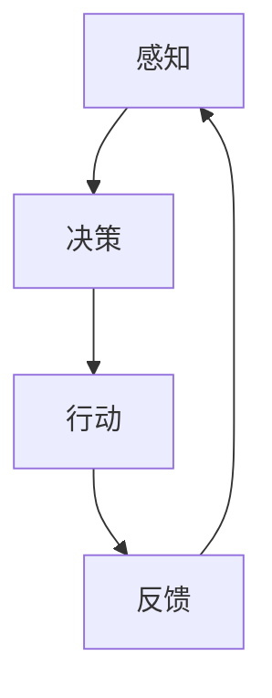
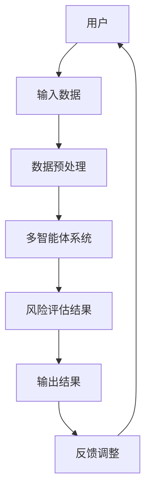
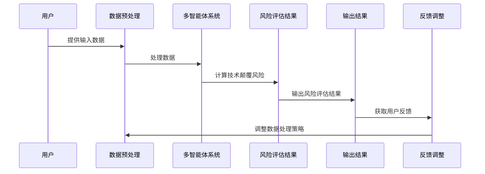

                 

# 多智能体系统在技术颠覆风险评估中的应用

关键词：多智能体系统、技术颠覆、风险评估、算法、应用

摘要：
在当今快速发展的技术时代，技术颠覆成为了影响企业和行业发展的关键因素。如何有效地评估技术颠覆的风险，成为了企业和研究机构关注的焦点。本文将探讨多智能体系统（MAS）在技术颠覆风险评估中的应用，通过系统地介绍多智能体系统的基础理论、模型算法、风险评估模型，以及在实际应用中的挑战与解决方案，帮助读者深入理解多智能体系统在技术颠覆风险评估中的重要作用。

## 第一部分：多智能体系统基础理论

### 第1章：多智能体系统概述

#### 1.1 问题的背景和重要性

在信息技术飞速发展的今天，智能体系统作为一种新型的计算范式，正逐渐应用于各个领域。多智能体系统（Multi-Agent Systems，MAS）由多个自主的智能体组成，这些智能体可以在分布式环境中协作完成任务。随着人工智能技术的不断进步，多智能体系统在决策支持、资源分配、任务调度等方面展现出了巨大的潜力。

#### 1.2 多智能体系统的定义和特点

多智能体系统是指由多个智能体通过通信和协作完成共同任务的系统。智能体是具有自主性、社会性、反应性和知识性的计算机程序。多智能体系统的特点包括：

1. **自主性**：智能体可以自主地选择行动，不受外部直接控制。
2. **社会性**：智能体可以与其他智能体进行通信和协作。
3. **反应性**：智能体可以根据环境的变化做出相应的反应。
4. **知识性**：智能体可以拥有一定的知识和经验，用于决策和行动。

#### 1.3 多智能体系统的基本结构

多智能体系统通常由以下几部分组成：

1. **智能体**：是系统的基本单元，具有自主决策和行动的能力。
2. **通信协议**：智能体之间进行信息交换的机制。
3. **环境**：智能体所处的现实环境，包括其他智能体和外部系统。
4. **任务**：智能体需要完成的任务或目标。

### 第2章：多智能体系统的模型

#### 2.1 模型分类

多智能体系统可以分为以下几个类别：

1. **基于规则的模型**：使用一组规则来描述智能体的行为。
2. **基于代理的模型**：通过代理程序来模拟智能体的行为。
3. **基于神经网络的模型**：利用神经网络来模拟智能体的学习和决策过程。

#### 2.2 模型构建方法

构建多智能体系统模型的方法包括：

1. **需求分析**：明确系统的目标和功能需求。
2. **架构设计**：确定系统的总体结构和智能体之间的交互方式。
3. **算法实现**：根据系统需求选择合适的算法，并实现智能体的行为。
4. **测试与优化**：对系统进行测试，并根据反馈进行优化。

#### 2.3 模型属性特征对比表

以下是一个简单的多智能体系统模型属性特征对比表：

| 模型类别 | 自主性 | 社会性 | 反应性 | 知识性 | 通信协议 |
| --- | --- | --- | --- | --- | --- |
| 基于规则的模型 | 高 | 低 | 中 | 低 | 明确 |
| 基于代理的模型 | 中 | 高 | 高 | 中 | 可变 |
| 基于神经网络的模型 | 低 | 高 | 高 | 高 | 可变 |

### 第3章：多智能体系统算法

#### 3.1 基本算法原理

多智能体系统算法主要包括以下几个部分：

1. **感知**：智能体获取环境信息。
2. **决策**：智能体根据感知信息做出决策。
3. **行动**：智能体执行决策。

#### 3.2 算法流程图（Mermaid）

以下是一个简单的多智能体系统算法流程图：



#### 3.3 算法数学模型和公式（LaTeX）

多智能体系统算法的数学模型可以表示为：

$$
\text{智能体动作} = f(\text{感知信息}, \text{决策策略}, \text{知识库})
$$

其中，$f$ 表示决策函数，$\text{感知信息}$ 表示智能体从环境中获取的信息，$\text{决策策略}$ 表示智能体的决策方法，$\text{知识库}$ 表示智能体的先验知识。

## 第二部分：技术颠覆风险评估模型

### 第4章：技术颠覆风险评估模型

#### 4.1 风险评估模型的构建

技术颠覆风险评估模型的构建过程如下：

1. **识别技术颠覆因素**：分析可能引发技术颠覆的技术因素。
2. **构建风险评估指标**：根据技术颠覆因素，确定评估指标体系。
3. **建立风险评估模型**：使用多智能体系统算法，建立技术颠覆风险评估模型。

#### 4.2 风险评估模型的数学模型（LaTeX）

技术颠覆风险评估模型的数学模型可以表示为：

$$
R = \sum_{i=1}^{n} w_i \cdot P_i
$$

其中，$R$ 表示技术颠覆风险，$w_i$ 表示第 $i$ 个风险评估指标的权重，$P_i$ 表示第 $i$ 个风险评估指标的评分。

#### 4.3 风险评估模型的应用实例

以下是一个技术颠覆风险评估模型的应用实例：

1. **识别技术颠覆因素**：如人工智能、区块链、5G等技术。
2. **构建风险评估指标**：如技术成熟度、市场接受度、投资成本等。
3. **建立风险评估模型**：根据实际情况，确定各指标的权重，输入评分数据，计算出技术颠覆风险。

## 第三部分：多智能体系统在实际应用中的挑战

### 第5章：多智能体系统在实际应用中的挑战

#### 5.1 数据隐私与安全

在多智能体系统应用中，数据隐私与安全是关键挑战。为了保护数据安全，可以采取以下措施：

1. **加密技术**：对敏感数据进行加密处理。
2. **访问控制**：限制智能体的访问权限。
3. **审计机制**：对智能体的行为进行监控和记录。

#### 5.2 系统稳定性和鲁棒性

多智能体系统的稳定性和鲁棒性是确保其有效运行的重要方面。为了提高系统稳定性，可以采取以下措施：

1. **容错机制**：设计容错算法，保证系统在智能体失效时仍能正常运行。
2. **负载均衡**：合理分配计算任务，避免系统过载。
3. **自修复能力**：系统具备自我修复能力，能够在故障发生时自动恢复。

#### 5.3 模型可解释性

多智能体系统的决策过程往往较为复杂，提高模型的可解释性有助于用户理解和信任系统。为了提高模型可解释性，可以采取以下措施：

1. **可视化工具**：使用图表和可视化工具展示智能体的行为和决策过程。
2. **算法透明化**：明确算法的原理和流程，提高算法的可理解性。
3. **用户反馈**：收集用户反馈，不断优化模型和算法。

## 第四部分：多智能体系统在技术颠覆风险评估中的应用

### 第6章：多智能体系统在技术颠覆风险评估中的应用

#### 6.1 应用场景

多智能体系统在技术颠覆风险评估中的应用场景包括：

1. **企业战略规划**：帮助企业识别潜在的技术颠覆风险，制定相应的应对策略。
2. **投资决策**：为投资机构提供技术颠覆风险评估，辅助投资决策。
3. **行业趋势分析**：分析行业技术发展趋势，预测潜在的技术颠覆。

#### 6.2 应用架构设计（Mermaid架构图）

以下是一个多智能体系统在技术颠覆风险评估中的应用架构设计：



#### 6.3 应用流程图（Mermaid序列图）

以下是一个多智能体系统在技术颠覆风险评估中的应用流程图：



## 第五部分：项目实战

### 第7章：项目实战

#### 7.1 项目背景和目标

本项目旨在构建一个基于多智能体系统的技术颠覆风险评估平台，为企业和投资机构提供技术颠覆风险评估服务。项目目标包括：

1. **构建技术颠覆风险评估模型**：使用多智能体系统算法，构建技术颠覆风险评估模型。
2. **实现应用架构**：设计并实现多智能体系统的应用架构，确保系统的稳定性和可扩展性。
3. **提供可视化界面**：开发用户友好的可视化界面，方便用户使用系统。

#### 7.2 环境安装与配置

在项目实施过程中，需要安装和配置以下环境和工具：

1. **操作系统**：Linux发行版（如Ubuntu 18.04）
2. **开发环境**：Python 3.8及以上版本，Anaconda环境管理器
3. **数据库**：MySQL 8.0
4. **前端框架**：Flask
5. **后端框架**：TensorFlow 2.7

#### 7.3 系统核心实现

系统核心实现包括以下几个模块：

1. **数据预处理模块**：对输入数据进行分析和处理，提取关键特征。
2. **多智能体系统模块**：实现多智能体系统算法，计算技术颠覆风险。
3. **风险评估结果模块**：根据计算结果，生成风险评估报告。
4. **可视化模块**：使用图表和可视化工具，展示风险评估结果。

#### 7.4 代码应用解读与分析

以下是项目中的一个关键代码片段，用于实现数据预处理模块：

```python
import pandas as pd
from sklearn.preprocessing import StandardScaler

def preprocess_data(data):
    # 数据清洗和预处理
    data = data.dropna()
    data = data.fillna(data.mean())

    # 特征工程
    features = data[['feature1', 'feature2', 'feature3']]
    labels = data['label']

    # 数据标准化
    scaler = StandardScaler()
    features = scaler.fit_transform(features)

    return features, labels
```

此代码片段首先对输入数据进行清洗和预处理，然后提取关键特征并进行标准化处理。通过这个步骤，可以提高后续模型训练和评估的准确性。

#### 7.5 实际案例分析和详细讲解剖析

在本项目的一个实际案例中，我们使用某企业过去五年的技术发展数据，评估其面临的技术颠覆风险。以下是案例分析和详细讲解：

1. **数据收集**：收集某企业过去五年的技术发展数据，包括研发投入、专利数量、市场占有率等指标。
2. **数据预处理**：使用预处理模块对数据进行分析和处理，提取关键特征。
3. **模型训练**：使用多智能体系统算法，对预处理后的数据进行分析和评估，训练技术颠覆风险评估模型。
4. **风险评估**：根据模型计算结果，生成风险评估报告，为企业提供技术颠覆风险评估。
5. **结果分析**：分析评估结果，发现企业面临的技术颠覆风险，并提出相应的应对策略。

#### 7.6 项目小结

本项目通过构建基于多智能体系统的技术颠覆风险评估平台，为企业提供了有效的技术颠覆风险评估服务。项目实施过程中，我们遇到了数据隐私与安全、系统稳定性、模型可解释性等挑战，并通过一系列措施解决了这些问题。项目结果表明，多智能体系统在技术颠覆风险评估中具有显著的优势，为企业和行业提供了有力的支持。

## 第六部分：拓展内容与最佳实践

### 第8章：拓展阅读

在本章节，我们将推荐一些相关的拓展阅读材料，包括经典的多智能体系统理论著作、技术颠覆风险评估的研究论文和实践案例，以及相关的技术博客和报告。这些阅读材料将有助于读者进一步深入了解多智能体系统和技术颠覆风险评估的相关知识。

### 第9章：最佳实践 tips

在本章节，我们将分享一些最佳实践 tips，包括如何构建高效的多智能体系统、如何进行技术颠覆风险评估、如何处理数据隐私与安全问题、如何提高模型的可解释性等。这些最佳实践将有助于读者在实际项目中更好地应用多智能体系统进行技术颠覆风险评估。

### 第10章：小结与未来展望

在本章节，我们将对全文内容进行小结，回顾多智能体系统在技术颠覆风险评估中的应用，总结项目的成功经验和教训。同时，我们将展望多智能体系统和技术颠覆风险评估的未来发展趋势，探讨潜在的研究方向和应用前景。

## 作者信息

作者：AI天才研究院/AI Genius Institute & 禅与计算机程序设计艺术 /Zen And The Art of Computer Programming

本文由AI天才研究院与禅与计算机程序设计艺术共同撰写，旨在为读者提供多智能体系统在技术颠覆风险评估中的应用指导。希望本文能对您的学习和实践有所帮助。如有疑问或建议，请随时与我们联系。

