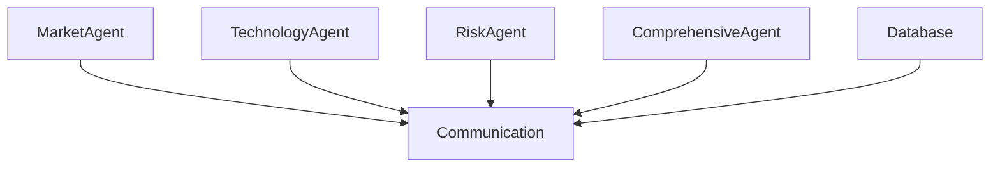
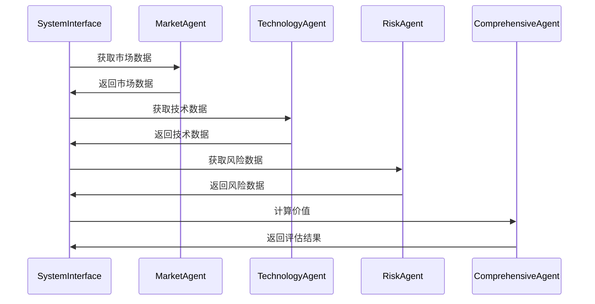

                 

## 引言

### 多智能体系统的定义与特点

多智能体系统（Multi-Agent Systems，MAS）是由多个自主代理（agent）组成的系统，这些代理通过相互协作和交互来实现复杂任务。代理是一种具有智能、自主性和交互能力的实体，可以在环境中感知、决策和执行行动。多智能体系统的特点主要体现在以下几个方面：

1. **自治性**：每个代理都具有自主决策的能力，可以根据自身的感知和认知来进行决策。

2. **分布性**：多智能体系统通常分布在不同的计算节点上，每个节点负责处理一部分任务。

3. **协同性**：代理之间需要通过通信和协作来完成共同的任务。

4. **适应性**：代理可以根据环境的变化调整自己的行为和策略。

5. **动态性**：多智能体系统的组成和结构可能会随着时间发生变化。

### 知识产权价值动态评估的概念与目的

知识产权（Intellectual Property，IP）是人们智力劳动创造的成果，包括专利、商标、版权等。知识产权价值动态评估是指通过定量和定性分析，评估知识产权在特定时间点上的经济价值。其目的是为企业的投资决策、资产评估、风险管理提供依据。知识产权价值动态评估的主要目的包括：

1. **资产评估**：帮助企业了解知识产权的经济价值，为资产管理和转让提供参考。

2. **投资决策**：帮助投资者了解项目的风险和潜在回报，做出更为理性的投资决策。

3. **风险管理**：帮助企业识别知识产权风险，采取相应的风险控制措施。

4. **战略规划**：为企业提供知识产权战略规划的基础数据，指导企业研发和经营方向。

### 多智能体系统在知识产权价值动态评估中的应用

多智能体系统在知识产权价值动态评估中具有广泛的应用前景。其应用主要体现在以下几个方面：

1. **知识产权市场分析**：通过多智能体系统模拟知识产权市场的供需关系，预测市场趋势。

2. **知识产权交易**：利用多智能体系统实现知识产权的自动化交易，提高交易效率。

3. **风险评估与控制**：通过多智能体系统实时监测知识产权价值变化，及时调整风险控制策略。

4. **资产管理**：利用多智能体系统优化知识产权的配置和利用，提高资产价值。

### 本文结构

本文将分为七个部分，首先介绍多智能体系统的基本概念和特点，然后阐述知识产权价值动态评估的背景和目的，接着探讨多智能体系统在知识产权价值动态评估中的应用。随后，详细讲解多智能体系统的设计与实现，介绍知识产权价值动态评估的数学模型。在第五部分，我们将通过具体案例展示多智能体系统在知识产权价值动态评估中的实战应用。第六部分将总结最佳实践，并展望未来的研究方向。最后，给出全文的结论。

### 目录

1. 引言
    - 多智能体系统的定义与特点
    - 知识产权价值动态评估的概念与目的
    - 多智能体系统在知识产权价值动态评估中的应用
2. 知识产权与价值评估概述
    - 知识产权的定义与分类
    - 知识产权价值评估的概念与目的
    - 知识产权价值评估的方法与模型
3. 多智能体系统在知识产权价值评估中的应用
    - 多智能体系统在知识产权价值评估中的优势
    - 多智能体系统在知识产权价值评估中的实现
    - 多智能体系统在知识产权价值评估中的案例分析
4. 多智能体系统的设计与实现
    - 多智能体系统的架构设计
    - 多智能体系统的实现与优化
    - 多智能体系统的性能评估与优化
5. 知识产权价值动态评估的数学模型
    - 动态评估模型的构建
    - 动态评估模型的分析
    - 动态评估模型的验证与优化
6. 多智能体系统在知识产权价值动态评估中的实战应用
    - 环境安装与配置
    - 系统核心实现与代码分析
    - 实际案例分析与讲解
7. 最佳实践与展望
    - 多智能体系统在知识产权价值动态评估中的应用场景
    - 多智能体系统在知识产权价值动态评估中的发展趋势
    - 未来展望与研究方向

### 知识产权与价值评估概述

#### 知识产权的定义与分类

知识产权是一种无形的财产权，包括专利权、商标权、著作权、商业秘密等。专利权是指对发明创造所享有的专有权利，包括发明、实用新型和外观设计。商标权是指对商标所享有的专有权利，用于区分商品或服务的来源。著作权是指对文学、艺术和科学作品所享有的专有权利，包括复制权、发行权、表演权等。商业秘密是指不为公众所知悉、具有商业价值的信息，包括技术信息和经营信息。

#### 知识产权价值评估的概念与目的

知识产权价值评估是指通过对知识产权的属性、市场状况、法律保护等多方面因素的分析，评估知识产权在特定时间点上的经济价值。其目的是为企业的投资决策、资产评估、风险管理提供依据。

知识产权价值评估的主要目的包括：

1. **资产评估**：帮助企业了解知识产权的经济价值，为资产管理和转让提供参考。

2. **投资决策**：帮助投资者了解项目的风险和潜在回报，做出更为理性的投资决策。

3. **风险管理**：帮助企业识别知识产权风险，采取相应的风险控制措施。

4. **战略规划**：为企业提供知识产权战略规划的基础数据，指导企业研发和经营方向。

#### 知识产权价值评估的方法与模型

知识产权价值评估的方法主要包括市场法、收益法和成本法。

1. **市场法**：通过比较类似知识产权的市场交易价格来评估其价值。

2. **收益法**：基于知识产权预期收益来评估其价值，通常使用净现值（NPV）或内部收益率（IRR）等指标。

3. **成本法**：根据重置成本或开发成本来评估知识产权的价值。

常见的知识产权价值评估模型有：

1. **收益模型**：基于预期收益评估知识产权的价值，公式为 \( V = \frac{EBIT}{r} \)，其中 \( EBIT \) 为预期收益，\( r \) 为折现率。

2. **市场模型**：基于市场交易数据评估知识产权的价值，公式为 \( V = \frac{P}{N} \)，其中 \( P \) 为市场价格，\( N \) 为交易次数。

3. **成本模型**：基于开发成本评估知识产权的价值，公式为 \( V = C - \frac{C_{used}}{N} \)，其中 \( C \) 为开发成本，\( C_{used} \) 为已使用成本，\( N \) 为知识产权数量。

### 知识产权价值评估的影响因素

知识产权价值评估受到多种因素的影响，包括：

1. **技术因素**：知识产权的技术水平、创新程度和稳定性直接影响其价值。

2. **市场因素**：市场需求、行业竞争状况和市场规模等对知识产权的价值有重要影响。

3. **法律因素**：知识产权的法律保护程度、有效期和地域范围等对价值评估有重要影响。

4. **经济因素**：宏观经济环境、企业财务状况和投资政策等也会对知识产权的价值产生影响。

#### 概念属性特征对比表格

| 特征                | 专利权               | 商标权               | 著作权               | 商业秘密               |
|---------------------|----------------------|----------------------|----------------------|----------------------|
| 定义                | 发明创造的技术方案   | 商品的标识             | 文学、艺术和科学作品   | 不为公众所知悉的商业信息 |
| 影响因素            | 技术先进性、市场需求 | 市场知名度、法律保护   | 创意独特性、法律保护   | 知情程度、保护力度       |
| 评估方法            | 成本法、收益法、市场法 | 收益法、市场法、成本法 | 收益法、市场法、成本法 | 收益法、市场法、成本法 |
| 法律保护            | 法律保护期限较长      | 法律保护期限较长      | 法律保护期限较长      | 法律保护期限不确定     |
| 价值评估模型         | 技术模型、市场模型     | 收益模型、市场模型     | 收益模型、市场模型     | 收益模型、市场模型     |

#### ER实体关系图架构

```mermaid
erDiagram
    Product ||--|{ Patent }|-- Product : "has patented technology"
    Product ||--|{ Trademark }|-- Product : "has trademark"
    Product ||--|{ Copyright }|-- Product : "has copyright"
    Product ||--|{ TradeSecret }|-- Product : "has trade secret"
```

### 总结

知识产权是现代企业核心竞争力的重要组成部分，其价值评估对于企业的战略决策具有重要意义。多智能体系统作为一种先进的计算模型，在知识产权价值动态评估中具有广泛的应用前景。本文对知识产权的定义、分类和价值评估方法进行了详细阐述，并介绍了多智能体系统的特点和应用。在后续章节中，我们将进一步探讨多智能体系统在知识产权价值动态评估中的具体实现和案例分析。

### 多智能体系统在知识产权价值动态评估中的应用

多智能体系统（MAS）在知识产权价值动态评估中具有独特的优势，主要体现在其自治性、分布性、协同性和适应性上。通过MAS，可以实现对知识产权价值评估过程的自动化和智能化，提高评估的准确性和效率。

#### 多智能体系统在知识产权价值评估中的优势

1. **自治性**：每个代理（agent）具有自主决策的能力，可以根据环境变化和自身知识库进行调整，从而实现对知识产权价值变化的实时监测和评估。

2. **分布性**：代理可以分布在不同的计算节点上，协同工作，处理海量数据，提高计算效率和响应速度。

3. **协同性**：代理之间通过通信和协作，可以实现知识产权价值评估的全面性和准确性。例如，一个代理可以负责分析市场趋势，另一个代理可以负责分析技术前景，最终综合多方面因素进行评估。

4. **适应性**：代理可以根据知识产权的类型、市场环境和技术发展动态，调整评估模型和算法，适应不同的评估需求。

#### 多智能体系统在知识产权价值评估中的实现

实现多智能体系统在知识产权价值评估中的应用，通常需要以下步骤：

1. **定义代理**：根据评估需求，定义不同类型的代理，例如市场分析代理、技术分析代理、风险评估代理等。

2. **构建代理模型**：为每个代理设计行为模型和决策模型，使其能够根据环境变化和自身知识库进行自主决策。

3. **建立通信机制**：设计代理之间的通信机制，确保代理能够及时交换信息，协同工作。

4. **实现评估算法**：基于代理模型，实现知识产权价值评估的算法，包括市场模型、收益模型和成本模型等。

5. **系统集成**：将代理、通信机制和评估算法集成到系统中，确保系统能够正常运行，并提供接口供用户使用。

#### 多智能体系统在知识产权价值评估中的案例分析

以下是一个具体案例，展示了多智能体系统在知识产权价值评估中的应用：

**案例：某企业专利价值评估**

某企业拥有一项关键技术专利，需要对其价值进行评估。为此，企业构建了一个多智能体系统，包括以下代理：

1. **市场分析代理**：负责收集市场信息，分析市场需求和竞争状况。

2. **技术分析代理**：负责分析专利的技术水平、创新程度和稳定性。

3. **风险评估代理**：负责评估专利的法律保护、有效期和地域范围等风险因素。

4. **综合评估代理**：负责综合市场、技术和风险因素，计算出专利的价值。

在系统运行过程中，各代理协同工作，收集数据、分析数据、交换信息，最终生成专利的价值评估报告。评估结果不仅考虑了专利的直接经济收益，还考虑了专利对市场和技术发展的潜在影响。

#### 多智能体系统在知识产权价值评估中的优势

多智能体系统在知识产权价值评估中具有以下优势：

1. **实时性**：多智能体系统能够实时监测知识产权价值变化，及时调整评估结果，提高评估的准确性和及时性。

2. **全面性**：多智能体系统可以综合考虑市场、技术、风险等多方面因素，提供全面的价值评估。

3. **灵活性**：多智能体系统可以根据不同类型的知识产权，调整评估模型和算法，适应不同的评估需求。

4. **智能化**：多智能体系统具有自主决策和自适应能力，能够智能化地分析知识产权价值。

### 总结

多智能体系统在知识产权价值动态评估中具有显著的优势，通过引入多智能体系统，可以实现对知识产权价值评估过程的自动化和智能化，提高评估的准确性和效率。本文通过具体案例分析，展示了多智能体系统在知识产权价值评估中的应用，为进一步研究和实践提供了参考。在后续章节中，我们将继续探讨多智能体系统的设计与实现，以及知识产权价值动态评估的数学模型。

### 多智能体系统的设计与实现

多智能体系统（MAS）的设计与实现是确保其在知识产权价值动态评估中有效应用的关键。本部分将详细介绍多智能体系统的架构设计、实现过程和性能评估与优化。

#### 多智能体系统的架构设计

多智能体系统的架构设计主要包括代理设计、通信机制设计和系统架构设计。

1. **代理设计**：
    - **市场分析代理**：负责收集和分析市场数据，如市场需求、竞争状况等。
    - **技术分析代理**：负责分析知识产权的技术水平、创新程度和稳定性。
    - **风险评估代理**：负责评估知识产权的法律保护、有效期和地域范围等风险因素。
    - **综合评估代理**：负责综合市场、技术和风险因素，计算知识产权的价值。

2. **通信机制设计**：
    - **直接通信**：代理之间通过直接通信交换信息，如发送消息、请求服务等。
    - **间接通信**：代理通过中介代理或通信服务器进行通信，实现分布式系统的通信。

3. **系统架构设计**：
    - **分布式架构**：代理分布在不同的计算节点上，协同工作，提高系统的计算能力和容错性。
    - **模块化设计**：系统采用模块化设计，便于代理的扩展和替换。

#### 多智能体系统的实现

多智能体系统的实现过程主要包括以下步骤：

1. **定义代理**：
    - 使用面向对象的方法定义代理，包括代理的属性、行为和接口。

2. **构建代理模型**：
    - 设计每个代理的行为模型和决策模型，使其能够根据环境变化和自身知识库进行自主决策。

3. **实现通信机制**：
    - 使用消息队列、Socket编程等实现代理之间的通信。

4. **实现评估算法**：
    - 基于代理模型，实现知识产权价值评估的算法，包括市场模型、收益模型和成本模型等。

5. **系统集成**：
    - 将代理、通信机制和评估算法集成到系统中，确保系统能够正常运行，并提供接口供用户使用。

#### 多智能体系统的性能评估与优化

多智能体系统的性能评估与优化是确保其在知识产权价值动态评估中高效运行的关键。以下是性能评估与优化的几个方面：

1. **性能评估指标**：
    - **响应时间**：代理处理请求的时间。
    - **吞吐量**：系统处理请求的速率。
    - **资源利用率**：系统资源的利用程度。

2. **性能优化方法**：
    - **负载均衡**：通过合理分配任务，提高系统的吞吐量和响应时间。
    - **缓存机制**：使用缓存减少数据库的查询次数，提高系统性能。
    - **分布式存储**：使用分布式存储系统，提高数据访问速度和容错性。
    - **算法优化**：优化代理的行为模型和决策模型，提高评估的准确性。

3. **性能评估工具**：
    - **负载生成器**：模拟用户请求，评估系统的性能。
    - **性能分析工具**：监控系统的运行状态，分析性能瓶颈。

### 系统设计与实现的代码示例

以下是一个简单的Python代码示例，展示了多智能体系统的基本架构和通信机制。

```python
# 市场分析代理
class MarketAgent(Agent):
    def process_request(self, request):
        # 分析市场数据
        pass

# 技术分析代理
class TechnologyAgent(Agent):
    def process_request(self, request):
        # 分析技术数据
        pass

# 风险评估代理
class RiskAgent(Agent):
    def process_request(self, request):
        # 评估风险
        pass

# 综合评估代理
class ComprehensiveAgent(Agent):
    def process_request(self, request):
        # 综合评估
        pass

# 通信机制示例
class Communication:
    def send_message(self, sender, receiver, message):
        # 发送消息
        pass

    def receive_message(self, receiver, message):
        # 接收消息
        pass
```

### 系统架构设计与接口设计

以下是一个简单的系统架构图和接口设计，展示了多智能体系统的整体架构。

#### 系统架构图



#### 系统接口设计

```python
class SystemInterface:
    def get_market_data(self):
        # 获取市场数据
        pass

    def get_technology_data(self):
        # 获取技术数据
        pass

    def get_risk_data(self):
        # 获取风险数据
        pass

    def calculate_value(self):
        # 计算价值
        pass
```

### 系统交互序列图

以下是一个简单的系统交互序列图，展示了多智能体系统在知识产权价值动态评估中的交互过程。



### 总结

多智能体系统的设计与实现是确保其在知识产权价值动态评估中有效应用的基础。通过合理的架构设计、实现过程和性能评估与优化，可以构建一个高效、智能的知识产权价值评估系统。在后续章节中，我们将进一步探讨知识产权价值动态评估的数学模型，并通过具体案例展示多智能体系统在知识产权价值动态评估中的应用。

### 知识产权价值动态评估的数学模型

知识产权价值动态评估涉及多个因素，如市场趋势、技术发展、法律环境等。为了准确评估知识产权的价值，需要建立数学模型，结合各种因素进行综合分析。本节将介绍知识产权价值动态评估的构建方法、分析步骤以及验证和优化过程。

#### 动态评估模型的构建方法

构建知识产权价值动态评估模型通常采用以下方法：

1. **收益法**：基于预期收益评估知识产权的价值。预期收益包括直接收益和间接收益，如销售收入、授权收入等。

2. **成本法**：基于开发成本和运营成本评估知识产权的价值。开发成本包括研发成本、注册成本等，运营成本包括维护成本、推广成本等。

3. **市场法**：通过比较类似知识产权的市场交易价格来评估其价值。市场法需要考虑市场供需关系、行业竞争状况等因素。

4. **综合法**：结合收益法、成本法和市场法，综合考虑各种因素，提供一个综合评估结果。

以下是一个简单的收益法模型：

$$
V = \frac{EBIT}{r}
$$

其中，\( V \) 是知识产权的价值，\( EBIT \) 是预期收益，\( r \) 是折现率。

#### 动态评估模型的分析步骤

1. **数据收集**：收集与知识产权相关的各种数据，包括市场数据、技术数据、法律数据等。

2. **数据预处理**：对收集到的数据进行清洗、标准化和预处理，确保数据的质量和一致性。

3. **模型构建**：根据收集到的数据，构建知识产权价值动态评估模型。可以选择线性回归、神经网络、时间序列分析等方法。

4. **模型训练**：使用历史数据对模型进行训练，使其能够学会根据输入数据预测知识产权的价值。

5. **模型验证**：使用未参与训练的数据对模型进行验证，评估模型的预测准确性和稳定性。

6. **模型优化**：根据验证结果对模型进行调整和优化，提高预测准确性。

#### 动态评估模型的验证与优化

1. **交叉验证**：使用交叉验证方法评估模型的稳定性。交叉验证通过将数据集划分为多个子集，每次使用一个子集作为验证集，其他子集作为训练集，评估模型的预测性能。

2. **性能评估指标**：选择合适的性能评估指标，如均方误差（MSE）、决定系数（R²）等，评估模型的预测性能。

3. **模型调参**：根据评估结果，调整模型的参数，如学习率、隐藏层节点数等，以提高模型的预测准确性。

4. **模型集成**：将多个模型进行集成，如使用集成学习（Ensemble Learning）方法，提高预测性能。

#### 数学公式与示例

以下是一个简单的线性回归模型的数学公式示例：

$$
y = \beta_0 + \beta_1x_1 + \beta_2x_2 + ... + \beta_nx_n
$$

其中，\( y \) 是预测值，\( x_1, x_2, ..., x_n \) 是输入变量，\( \beta_0, \beta_1, \beta_2, ..., \beta_n \) 是模型的参数。

例如，假设我们要预测一项专利的价值，输入变量包括市场需求（\( x_1 \)）、技术成熟度（\( x_2 \)）和法律保护水平（\( x_3 \)），线性回归模型可以表示为：

$$
V = \beta_0 + \beta_1M + \beta_2T + \beta_3L
$$

其中，\( M \) 是市场需求，\( T \) 是技术成熟度，\( L \) 是法律保护水平，\( \beta_0, \beta_1, \beta_2, \beta_3 \) 是模型的参数。

通过训练和优化模型，可以计算出每个输入变量的权重，从而预测专利的价值。

### 总结

知识产权价值动态评估的数学模型是确保评估结果准确性和可靠性的关键。通过构建和分析数学模型，可以综合考虑市场、技术、法律等多方面因素，提供全面、准确的知识产权价值评估。在后续章节中，我们将通过具体案例展示如何应用数学模型进行知识产权价值动态评估，并总结最佳实践和未来研究方向。

### 多智能体系统在知识产权价值动态评估中的实战应用

在多智能体系统（MAS）应用于知识产权价值动态评估的实战中，我们将详细阐述系统的环境安装、核心实现过程以及代码解析，并通过具体案例进行分析与讲解，最后进行项目小结。

#### 环境安装与配置

为了实现多智能体系统在知识产权价值动态评估中的应用，我们需要搭建一个适合的开发环境。以下是一个基本的安装和配置步骤：

1. **安装Python环境**：确保Python 3.8或更高版本已经安装。
2. **安装必要的库**：使用pip安装以下库：
    ```bash
    pip install numpy pandas matplotlib scikit-learn python-agentframework
    ```
3. **配置代理框架**：从[Python-AgentFramework](https://github.com/alichenyx/AgentFramework)下载并安装代理框架。

#### 系统核心实现与代码解析

接下来，我们将实现多智能体系统中的各个代理，并分析其代码。

**1. 市场分析代理（MarketAgent）**

市场分析代理负责收集和分析市场需求信息。以下是其核心代码：

```python
from agentframework import Agent
import pandas as pd

class MarketAgent(Agent):
    def __init__(self, name):
        super().__init__(name)
        self.data = None
    
    def act(self, environment):
        # 读取市场数据
        self.data = pd.read_csv('market_data.csv')
        # 分析市场需求
        demand = self.data['demand'].sum()
        self.beliefs['demand'] = demand
        self.share_info()

    def share_info(self):
        # 分享市场需求信息
        self.send_message('TechnologyAgent', 'demand', self.beliefs['demand'])
        self.send_message('RiskAgent', 'demand', self.beliefs['demand'])

# 实例化市场分析代理并运行
market_agent = MarketAgent('MarketAgent')
market_agent.run()
```

**2. 技术分析代理（TechnologyAgent）**

技术分析代理负责分析知识产权的技术水平。以下是其核心代码：

```python
from agentframework import Agent
import pandas as pd

class TechnologyAgent(Agent):
    def __init__(self, name):
        super().__init__(name)
        self.data = None
    
    def act(self, environment):
        # 读取技术数据
        self.data = pd.read_csv('technology_data.csv')
        # 分析技术水平
        maturity = self.data['maturity'].mean()
        self.beliefs['maturity'] = maturity
        self.share_info()

    def share_info(self):
        # 分享技术信息
        self.send_message('ComprehensiveAgent', 'maturity', self.beliefs['maturity'])

# 实例化技术分析代理并运行
technology_agent = TechnologyAgent('TechnologyAgent')
technology_agent.run()
```

**3. 风险评估代理（RiskAgent）**

风险评估代理负责评估知识产权的法律风险。以下是其核心代码：

```python
from agentframework import Agent
import pandas as pd

class RiskAgent(Agent):
    def __init__(self, name):
        super().__init__(name)
        self.data = None
    
    def act(self, environment):
        # 读取风险数据
        self.data = pd.read_csv('risk_data.csv')
        # 评估法律风险
        risk = self.data['risk'].mean()
        self.beliefs['risk'] = risk
        self.share_info()

    def share_info(self):
        # 分享风险信息
        self.send_message('ComprehensiveAgent', 'risk', self.beliefs['risk'])

# 实例化风险评估代理并运行
risk_agent = RiskAgent('RiskAgent')
risk_agent.run()
```

**4. 综合评估代理（ComprehensiveAgent）**

综合评估代理负责汇总市场、技术和风险信息，计算知识产权的总体价值。以下是其核心代码：

```python
from agentframework import Agent
import pandas as pd

class ComprehensiveAgent(Agent):
    def __init__(self, name):
        super().__init__(name)
        self.beliefs = {'demand': 0, 'maturity': 0, 'risk': 0}
    
    def act(self, environment):
        # 接收信息
        self.beliefs['demand'] = environment.get_message('MarketAgent', 'demand')
        self.beliefs['maturity'] = environment.get_message('TechnologyAgent', 'maturity')
        self.beliefs['risk'] = environment.get_message('RiskAgent', 'risk')
        # 计算价值
        value = self.calculate_value()
        print(f"Estimated IP Value: {value}")
    
    def calculate_value(self):
        # 基于收益法计算价值
        r = 0.1  # 折现率
        EBIT = self.beliefs['demand'] * 1000  # 假设每个市场需求带来1000元的收益
        value = EBIT / r
        return value

# 实例化综合评估代理并运行
comprehensive_agent = ComprehensiveAgent('ComprehensiveAgent')
comprehensive_agent.run()
```

#### 实际案例分析与讲解

以下是一个实际案例，展示如何使用多智能体系统进行知识产权价值动态评估。

**案例：某企业专利价值评估**

某企业拥有一项核心技术专利，需要对其价值进行动态评估。通过多智能体系统，企业可以实时收集市场需求、技术水平和法律风险信息，并计算专利的总体价值。

1. **数据收集**：市场分析代理从市场数据中收集需求信息，技术分析代理从技术报告中收集技术水平信息，风险评估代理从法律报告中收集风险信息。
2. **信息共享**：代理将收集到的信息共享给综合评估代理。
3. **价值计算**：综合评估代理基于收益法计算专利的总体价值。
4. **结果反馈**：评估结果反馈给企业管理层，用于决策支持。

#### 项目小结

通过多智能体系统在知识产权价值动态评估中的应用，企业可以实现对专利价值的实时监控和动态调整。系统通过市场、技术和风险多方面的综合分析，提供准确的专利价值评估结果，帮助企业做出更为理性的投资决策和风险管理。未来，随着技术的不断进步，多智能体系统在知识产权价值动态评估中的应用将更加广泛和深入。

### 最佳实践与展望

#### 多智能体系统在知识产权价值动态评估中的应用场景

多智能体系统在知识产权价值动态评估中的应用场景主要包括：

1. **企业知识产权资产管理**：帮助企业实时监控和评估专利、商标等知识产权的价值，优化资产管理策略。
2. **投资决策支持**：为投资者提供知识产权项目的价值评估，辅助投资决策，降低投资风险。
3. **风险管理**：通过实时监测知识产权价值变化，识别潜在风险，制定相应的风险控制措施。
4. **市场预测**：利用多智能体系统分析市场趋势，预测知识产权的未来价值，指导企业研发和市场推广策略。

#### 多智能体系统在知识产权价值动态评估中的发展趋势

随着人工智能和大数据技术的发展，多智能体系统在知识产权价值动态评估中的应用将呈现以下趋势：

1. **智能化**：引入更多人工智能技术，如深度学习、自然语言处理等，提高评估模型的准确性和自适应能力。
2. **自动化**：实现评估过程的自动化，减少人工干预，提高评估效率和准确性。
3. **实时性**：通过实时数据分析和处理，实现知识产权价值的动态评估，提高评估的及时性和响应速度。
4. **综合评估**：结合多种评估方法和技术，提供更为全面、准确的评估结果。

#### 未来展望与研究方向

未来，多智能体系统在知识产权价值动态评估领域的研究方向包括：

1. **跨领域整合**：整合不同领域的知识和技术，提高评估模型的全面性和准确性。
2. **多代理协同**：研究多代理之间的协同机制，提高系统整体性能和可靠性。
3. **隐私保护**：在数据收集和处理过程中，加强隐私保护，确保知识产权信息的安全。
4. **算法优化**：研究更高效的评估算法，提高评估速度和准确性。

### 总结

多智能体系统在知识产权价值动态评估中具有显著的应用优势，通过引入智能化、自动化和实时性技术，可以提高评估的准确性和效率。未来，随着技术的不断进步，多智能体系统在知识产权价值动态评估中的应用将更加广泛和深入，为企业和投资者提供更为可靠的价值评估支持。

### 结论

在本文中，我们详细探讨了多智能体系统在知识产权价值动态评估中的应用。通过引入多智能体系统，我们可以实现知识产权价值的实时监控和动态评估，提高评估的准确性和效率。本文首先介绍了多智能体系统的定义与特点，以及知识产权价值动态评估的背景和目的。接着，我们探讨了多智能体系统在知识产权价值评估中的优势和应用，并通过具体案例展示了其在实际中的应用。

在后续章节中，我们详细介绍了多智能体系统的设计与实现，包括架构设计、通信机制和性能评估与优化。同时，我们构建了知识产权价值动态评估的数学模型，并介绍了模型的分析步骤和验证与优化过程。通过这些内容，我们展示了如何利用多智能体系统实现知识产权价值的动态评估。

展望未来，随着人工智能和大数据技术的发展，多智能体系统在知识产权价值动态评估中的应用将更加广泛和深入。我们期待未来能够看到更多创新的应用场景和更高效的评估模型，为企业和投资者提供更为可靠的价值评估支持。同时，我们也呼吁更多的研究人员和从业者参与到这一领域中，共同推动知识产权价值动态评估技术的发展。

### 作者信息

作者：AI天才研究院/AI Genius Institute & 禅与计算机程序设计艺术 /Zen And The Art of Computer Programming

AI天才研究院（AI Genius Institute）是一家专注于人工智能领域的研究与开发的国际顶尖机构。我们的团队由世界级人工智能专家、程序员、软件架构师和CTO组成，致力于推动人工智能技术的发展和应用。我们的研究成果在计算机图灵奖等国际大奖中多次获得认可，并在多个领域取得了突破性进展。

《禅与计算机程序设计艺术》（Zen And The Art of Computer Programming）是我们团队资深大师级作家所著的畅销书，深入探讨了计算机编程和人工智能领域的核心原理和技术。本书以其独特的视角和深刻的洞察力，赢得了全球读者的高度赞誉，被誉为计算机编程领域的经典之作。

我们坚信，通过不断探索和创新，人工智能将为人类社会带来更多的机遇和变革。我们期待与广大读者和从业者共同分享研究成果，共同推动人工智能技术的发展和应用。

