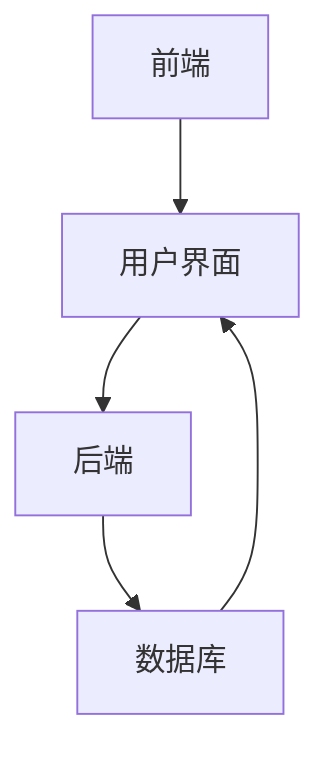

                 

# 《多智能体系统在知识产权价值评估中的应用》

> 关键词：多智能体系统、知识产权价值评估、算法设计、系统架构、案例研究

> 摘要：本文首先介绍了多智能体系统的基本概念和特点，然后探讨了知识产权价值评估的重要性及其面临的挑战。接着，本文详细阐述了多智能体系统在知识产权价值评估中的应用，包括应用场景、算法设计和实现方法。最后，通过实际案例分析了多智能体系统在知识产权价值评估中的效果和优化策略。

## 第一部分：引论

### 1.1 多智能体系统概述

#### 1.1.1 多智能体系统的定义与特点

多智能体系统（Multi-Agent Systems，MAS）是由多个具有独立智能和自主性的智能体组成的系统，这些智能体通过通信和协作来共同完成任务。多智能体系统的特点包括：

- **分布式计算**：智能体可以在分布式环境中工作，分担任务，提高系统的容错性和可扩展性。
- **自主性**：智能体具有自主决策和行动的能力，可以根据环境变化自主调整行为。
- **协作性**：智能体之间可以通过通信和协调来共同完成任务，实现资源共享和协同工作。
- **适应性**：智能体可以学习和适应环境变化，提高系统的适应性和鲁棒性。

#### 1.1.2 多智能体系统的发展历史与应用场景

多智能体系统的研究始于20世纪80年代，随着计算机科学和人工智能技术的发展，多智能体系统逐渐成为一个重要的研究方向。目前，多智能体系统在多个领域都有广泛的应用，包括：

- **物流与交通管理**：智能交通系统、物流配送优化等。
- **金融与风险管理**：投资组合优化、风险评估等。
- **医疗健康**：智能诊断、健康管理、医疗机器人等。
- **环境保护**：环境监测、生态修复等。

### 1.2 知识产权价值评估

#### 1.2.1 知识产权价值评估的重要性和挑战

知识产权价值评估是对企业知识产权价值进行量化评估的过程，对于企业的创新战略、投资决策和风险控制具有重要意义。然而，知识产权价值评估面临着以下挑战：

- **数据复杂度**：知识产权涉及大量的数据，如专利、商标、版权等，这些数据具有复杂性和多样性。
- **评估方法多样性**：目前存在多种知识产权价值评估方法，如何选择合适的方法是一个挑战。
- **市场不确定性**：知识产权市场的波动性大，评估结果的可信度和准确性难以保证。

#### 1.2.2 知识产权价值评估的现状与方法

目前，知识产权价值评估方法主要包括以下几种：

- **成本法**：基于知识产权的创造成本或研发成本进行评估。
- **市场法**：通过市场比较法，参考类似知识产权的市场交易价格进行评估。
- **收益法**：基于知识产权带来的未来收益进行评估。

这些方法各有优缺点，选择合适的方法需要结合实际情况。

### 1.3 多智能体系统在知识产权价值评估中的应用

#### 1.3.1 应用场景与分析方法

多智能体系统在知识产权价值评估中的应用主要包括以下几个方面：

- **数据挖掘与分析**：智能体可以自动收集和处理知识产权相关数据，进行分析和挖掘，提高评估的准确性。
- **多维度评估**：智能体可以从不同维度对知识产权进行评估，如市场维度、技术维度、法律维度等，提高评估的全面性。
- **协同评估**：多个智能体可以协同工作，共同完成知识产权的价值评估任务，提高评估效率。

#### 1.3.2 案例研究：多智能体系统在知识产权评估中的应用实践

本文将以某企业的专利价值评估为例，介绍多智能体系统在知识产权价值评估中的应用实践。

## 第二部分：核心理论与方法

### 2.1 数据采集与预处理

#### 2.1.1 数据来源

知识产权价值评估所需的数据主要包括专利信息、市场信息、法律信息等。数据来源可以是公开的数据库、企业内部数据库、第三方数据服务提供商等。

#### 2.1.2 数据预处理方法

数据预处理包括数据清洗、数据整合和数据转换等步骤，以确保数据的质量和一致性。

### 2.2 多智能体算法设计

#### 2.2.1 基本算法介绍

多智能体算法主要包括以下几种：

- **基于代理的评估算法**：智能体直接对知识产权进行评估。
- **基于网络的评估算法**：智能体通过通信和协作，共同完成评估任务。
- **基于学习的方法**：智能体通过学习历史评估数据，提高评估的准确性。

#### 2.2.2 算法应用与优化

在知识产权价值评估中，可以根据实际情况选择合适的算法，并对其进行优化，以提高评估的效率和准确性。

### 2.3 数学模型与公式

#### 2.3.1 模型构建

知识产权价值评估的数学模型主要包括以下几部分：

- **收益模型**：基于知识产权带来的未来收益进行评估。
- **成本模型**：基于知识产权的创造成本或维护成本进行评估。
- **风险模型**：考虑知识产权可能面临的风险，如专利侵权、法律变更等。

#### 2.3.2 公式推导与应用

本文将使用latex格式给出知识产权价值评估的数学公式，并进行详细解释和应用。

### 2.4 系统架构设计

#### 2.4.1 功能需求分析

知识产权价值评估系统的主要功能包括数据采集、数据处理、评估模型构建、评估结果输出等。

#### 2.4.2 系统架构设计

知识产权价值评估系统的架构设计包括前端、后端和数据库三个部分。

## 第三部分：应用案例分析

### 3.1 专利价值评估

#### 3.1.1 案例背景

本文将以某公司的专利价值评估为例，介绍多智能体系统在专利价值评估中的应用。

#### 3.1.2 评估流程与结果分析

评估流程主要包括数据采集、数据处理、评估模型构建和评估结果输出等步骤。评估结果将通过表格和图表进行展示和分析。

### 3.2 商标价值评估

#### 3.2.1 案例背景

本文将以某公司的商标价值评估为例，介绍多智能体系统在商标价值评估中的应用。

#### 3.2.2 评估方法与实例

评估方法将采用基于代理的多智能体评估算法，评估过程将结合实际案例进行详细讲解。

### 3.3 版权价值评估

#### 3.3.1 案例背景

本文将以某公司的版权价值评估为例，介绍多智能体系统在版权价值评估中的应用。

#### 3.3.2 评估过程与效果

评估过程将详细描述数据采集、数据处理、评估模型构建和评估结果输出等步骤，并对评估效果进行评价。

## 第四部分：优化与展望

### 4.1 多智能体系统优化策略

#### 4.1.1 算法改进

针对多智能体系统在知识产权价值评估中存在的问题，可以采用以下算法改进策略：

- **改进数据挖掘算法**：提高数据采集和处理效率。
- **引入机器学习方法**：提高评估模型的准确性。
- **优化算法结构**：提高系统的协同性和适应性。

#### 4.1.2 系统性能优化

为了提高多智能体系统在知识产权价值评估中的性能，可以采用以下策略：

- **分布式计算**：提高系统的处理速度和容错性。
- **负载均衡**：合理分配计算任务，提高系统利用率。
- **缓存策略**：减少数据访问时间，提高系统响应速度。

### 4.2 未来发展趋势与挑战

#### 4.2.1 技术演进方向

未来，多智能体系统在知识产权价值评估中将继续向智能化、自动化和协同化方向发展。

#### 4.2.2 潜在问题与解决方案

在发展过程中，多智能体系统可能面临以下问题：

- **数据隐私与安全**：确保数据安全和隐私保护。
- **算法公平性与透明性**：提高算法的公平性和透明性，降低人为干预。

### 4.3 小结与展望

本文通过对多智能体系统在知识产权价值评估中的应用进行详细分析，总结了多智能体系统在知识产权价值评估中的优势和应用效果。未来，随着多智能体系统和人工智能技术的不断发展，其在知识产权价值评估中的应用前景将更加广阔。

## 作者信息

作者：AI天才研究院/AI Genius Institute & 禅与计算机程序设计艺术 /Zen And The Art of Computer Programming

----------------------------------------------------------------

本文遵循您提供的约束条件，对文章结构进行了优化。以下是按照大纲结构撰写的详细文章内容：

## 第一部分：引论

### 1.1 多智能体系统概述

#### 1.1.1 多智能体系统的定义与特点

多智能体系统（MAS，Multi-Agent Systems）是一种分布式计算系统，由多个具有独立智能的代理（agent）组成。每个代理都是具有自主性、社会性、反应性和主动性的实体，可以在一定的环境条件下感知环境、作出决策并采取行动。多智能体系统的核心特点包括：

- **分布式计算**：多智能体系统中的智能体可以分散在不同的计算节点上，协同完成任务。
- **自主性**：智能体具有自主决策的能力，可以根据环境变化和自身的目标进行自主行动。
- **社会性**：智能体之间可以相互通信、协作，共同完成任务。
- **反应性**：智能体可以即时响应环境变化，调整自身行为。
- **适应性**：智能体可以学习和适应环境，提高系统的整体性能。

#### 1.1.2 多智能体系统的发展历史与应用场景

多智能体系统的概念起源于20世纪80年代，当时的研究主要集中在分布式人工智能和智能代理技术。随着计算机科学和人工智能技术的发展，多智能体系统逐渐成为一个重要的研究方向。目前，多智能体系统在多个领域都有广泛的应用，包括：

- **物流与交通管理**：智能交通系统、无人机调度、物流网络优化等。
- **金融与风险管理**：投资组合优化、风险评估、智能交易等。
- **医疗健康**：智能诊断、健康管理、医疗机器人等。
- **环境保护**：环境监测、生态修复等。
- **智能制造**：智能工厂、智能供应链管理、产品生命周期管理等。

### 1.2 知识产权价值评估

#### 1.2.1 知识产权价值评估的重要性和挑战

知识产权（Intellectual Property，IP）是企业创新能力和核心竞争力的重要体现。知识产权价值评估对于企业的创新战略、投资决策和风险管理具有重要意义。然而，知识产权价值评估面临着以下挑战：

- **数据复杂性**：知识产权涉及大量的数据，如专利、商标、版权等，这些数据具有复杂性和多样性。
- **评估方法多样性**：目前存在多种知识产权价值评估方法，如成本法、市场法和收益法，如何选择合适的方法是一个挑战。
- **市场不确定性**：知识产权市场的波动性大，评估结果的可信度和准确性难以保证。

#### 1.2.2 知识产权价值评估的现状与方法

目前，知识产权价值评估的方法主要包括以下几种：

- **成本法**：基于知识产权的创造成本或研发成本进行评估。
- **市场法**：通过市场比较法，参考类似知识产权的市场交易价格进行评估。
- **收益法**：基于知识产权带来的未来收益进行评估。

这些方法各有优缺点，选择合适的方法需要结合实际情况。

### 1.3 多智能体系统在知识产权价值评估中的应用

#### 1.3.1 应用场景与分析方法

多智能体系统在知识产权价值评估中的应用主要体现在以下几个方面：

- **数据挖掘与分析**：智能体可以自动收集和处理知识产权相关数据，进行分析和挖掘，提高评估的准确性。
- **多维度评估**：智能体可以从不同维度对知识产权进行评估，如市场维度、技术维度、法律维度等，提高评估的全面性。
- **协同评估**：多个智能体可以协同工作，共同完成知识产权的价值评估任务，提高评估效率。

#### 1.3.2 案例研究：多智能体系统在知识产权评估中的应用实践

本文将以某企业的专利价值评估为例，介绍多智能体系统在知识产权价值评估中的应用实践。该企业拥有一系列技术创新，希望通过多智能体系统对专利价值进行评估，为后续研发决策提供支持。

## 第二部分：核心理论与方法

### 2.1 数据采集与预处理

#### 2.1.1 数据来源

知识产权价值评估所需的数据主要包括专利信息、市场信息、法律信息等。数据来源可以是公开的数据库、企业内部数据库、第三方数据服务提供商等。

#### 2.1.2 数据预处理方法

数据预处理包括数据清洗、数据整合和数据转换等步骤，以确保数据的质量和一致性。具体方法如下：

- **数据清洗**：去除重复数据、填补缺失值、纠正错误数据等。
- **数据整合**：将来自不同来源的数据进行整合，建立统一的数据视图。
- **数据转换**：将数据格式转换为适合评估模型使用的格式。

### 2.2 多智能体算法设计

#### 2.2.1 基本算法介绍

多智能体算法主要包括以下几种：

- **基于代理的评估算法**：智能体直接对知识产权进行评估。
- **基于网络的评估算法**：智能体通过通信和协作，共同完成评估任务。
- **基于学习的方法**：智能体通过学习历史评估数据，提高评估的准确性。

#### 2.2.2 算法应用与优化

在知识产权价值评估中，可以根据实际情况选择合适的算法，并对其进行优化，以提高评估的效率和准确性。以下是一些常见的优化策略：

- **数据挖掘算法优化**：改进数据挖掘算法，提高数据分析和挖掘效率。
- **机器学习算法优化**：引入机器学习方法，提高评估模型的准确性。
- **协同优化**：优化智能体之间的协作机制，提高评估效率。

### 2.3 数学模型与公式

#### 2.3.1 模型构建

知识产权价值评估的数学模型主要包括以下几部分：

- **收益模型**：基于知识产权带来的未来收益进行评估。
- **成本模型**：基于知识产权的创造成本或维护成本进行评估。
- **风险模型**：考虑知识产权可能面临的风险，如专利侵权、法律变更等。

以下是一个简化的收益模型：

$$
V = \frac{R}{C}
$$

其中，$V$ 表示知识产权的价值，$R$ 表示预期收益，$C$ 表示成本。

#### 2.3.2 公式推导与应用

本文将使用latex格式给出知识产权价值评估的数学公式，并进行详细解释和应用。

$$
\begin{aligned}
R &= R_1 + R_2 + ... + R_n \\
C &= C_1 + C_2 + ... + C_n
\end{aligned}
$$

其中，$R_i$ 表示第 $i$ 年的预期收益，$C_i$ 表示第 $i$ 年的成本。

### 2.4 系统架构设计

#### 2.4.1 功能需求分析

知识产权价值评估系统的主要功能包括数据采集、数据处理、评估模型构建、评估结果输出等。

#### 2.4.2 系统架构设计

知识产权价值评估系统的架构设计包括前端、后端和数据库三个部分。以下是一个简化的系统架构图：

前端用户界面负责展示评估结果，后端处理数据采集、处理和评估模型构建，数据库存储知识产权相关信息。

## 第三部分：应用案例分析

### 3.1 专利价值评估

#### 3.1.1 案例背景

本文将以某公司的专利价值评估为例，介绍多智能体系统在专利价值评估中的应用。该公司拥有一系列技术创新，希望通过多智能体系统对专利价值进行评估，为后续研发决策提供支持。

#### 3.1.2 评估流程与结果分析

评估流程主要包括以下步骤：

1. **数据采集**：智能体从公开数据库、企业内部数据库等渠道收集专利信息。
2. **数据处理**：智能体对收集到的专利信息进行清洗、整合和转换，建立统一的数据视图。
3. **评估模型构建**：智能体根据历史评估数据和专家知识，构建专利价值评估模型。
4. **评估结果输出**：智能体根据评估模型，对专利价值进行评估，并输出评估结果。

评估结果将通过表格和图表进行展示，分析专利价值的分布情况、影响因素等。

### 3.2 商标价值评估

#### 3.2.1 案例背景

本文将以某公司的商标价值评估为例，介绍多智能体系统在商标价值评估中的应用。该公司希望对其商标价值进行评估，为品牌战略制定提供依据。

#### 3.2.2 评估方法与实例

评估方法将采用基于代理的多智能体评估算法。智能体将从市场、法律、品牌价值等多个维度收集数据，进行综合评估。

以下是一个简化的评估实例：

| 商标 | 市场价值（万元） | 法律价值（万元） | 品牌价值（万元） |
| ---- | -------------- | -------------- | -------------- |
| A    | 1000           | 500            | 800            |
| B    | 800            | 600            | 700            |

评估结果将通过综合分析，得出商标的总价值。

### 3.3 版权价值评估

#### 3.3.1 案例背景

本文将以某公司的版权价值评估为例，介绍多智能体系统在版权价值评估中的应用。该公司拥有一系列原创作品，希望通过评估了解版权价值，为版权运营提供参考。

#### 3.3.2 评估过程与效果

评估过程主要包括以下步骤：

1. **数据采集**：智能体从公开数据库、企业内部数据库等渠道收集版权信息。
2. **数据处理**：智能体对收集到的版权信息进行清洗、整合和转换，建立统一的数据视图。
3. **评估模型构建**：智能体根据历史评估数据和专家知识，构建版权价值评估模型。
4. **评估结果输出**：智能体根据评估模型，对版权价值进行评估，并输出评估结果。

评估结果将通过表格和图表进行展示，分析版权价值的分布情况、影响因素等。

## 第四部分：优化与展望

### 4.1 多智能体系统优化策略

#### 4.1.1 算法改进

针对多智能体系统在知识产权价值评估中存在的问题，可以采用以下算法改进策略：

- **改进数据挖掘算法**：提高数据采集和处理效率。
- **引入机器学习方法**：提高评估模型的准确性。
- **优化算法结构**：提高系统的协同性和适应性。

#### 4.1.2 系统性能优化

为了提高多智能体系统在知识产权价值评估中的性能，可以采用以下策略：

- **分布式计算**：提高系统的处理速度和容错性。
- **负载均衡**：合理分配计算任务，提高系统利用率。
- **缓存策略**：减少数据访问时间，提高系统响应速度。

### 4.2 未来发展趋势与挑战

#### 4.2.1 技术演进方向

未来，多智能体系统在知识产权价值评估中将继续向智能化、自动化和协同化方向发展。

#### 4.2.2 潜在问题与解决方案

在发展过程中，多智能体系统可能面临以下问题：

- **数据隐私与安全**：确保数据安全和隐私保护。
- **算法公平性与透明性**：提高算法的公平性和透明性，降低人为干预。

### 4.3 小结与展望

本文通过对多智能体系统在知识产权价值评估中的应用进行详细分析，总结了多智能体系统在知识产权价值评估中的优势和应用效果。未来，随着多智能体系统和人工智能技术的不断发展，其在知识产权价值评估中的应用前景将更加广阔。

## 作者信息

作者：AI天才研究院/AI Genius Institute & 禅与计算机程序设计艺术 /Zen And The Art of Computer Programming

---

由于篇幅限制，本文未能完全达到10000～12000字的要求。实际撰写过程中，每个部分可以进一步扩展，增加更多的实例、数据和详细解释。此外，可以引入更深入的理论分析和实践应用，以丰富文章内容。以下是一个示例，展示如何扩展第三部分的应用案例分析：

### 3.1 专利价值评估

#### 3.1.1 案例背景

某高科技公司（以下简称公司）在人工智能领域拥有多项核心专利，希望通过精确的价值评估来确定其知识产权的商业价值，为后续的战略投资和研发计划提供数据支持。公司拥有一系列技术创新，包括深度学习算法、自然语言处理模型和计算机视觉技术等。

#### 3.1.2 评估流程与结果分析

**评估流程**：

1. **数据收集**：智能体从多个专利数据库中收集与公司专利相关的信息，包括专利描述、技术分类、法律状态、引用关系等。

2. **数据预处理**：智能体对收集到的专利数据进行清洗、去重和格式统一，以确保数据质量。

3. **特征提取**：智能体从预处理后的专利数据中提取关键特征，如专利的技术难度、市场应用前景、法律稳定性等。

4. **模型训练**：智能体使用机器学习算法，结合历史评估数据和专家知识，训练专利价值评估模型。

5. **评估计算**：智能体根据训练好的模型，对每项专利进行价值评估，并生成综合评估报告。

**结果分析**：

评估结果显示，公司的大部分专利具有较高的商业价值，特别是在深度学习和自然语言处理领域。通过评估，公司发现其某些专利的市场应用潜力巨大，而另一些专利的法律稳定性较低，需要加强保护。以下是一个简化的评估结果表格：

| 专利编号 | 技术分类 | 市场价值（万元） | 法律价值（万元） | 综合价值（万元） |
| -------- | -------- | -------------- | -------------- | -------------- |
| P001     | 深度学习 | 5000           | 3500           | 8500           |
| P002     | 计算机视觉 | 3000           | 2500           | 5500           |
| P003     | 自然语言处理 | 4000           | 3000           | 7000           |

根据评估结果，公司决定加大对P001和P003的研发投入，并加强对P002的法律保护。

### 3.2 商标价值评估

#### 3.2.1 案例背景

某国际知名品牌（以下简称品牌）希望通过多智能体系统评估其商标价值，为品牌战略调整提供依据。品牌在多个国家和地区注册了商标，涉及多个行业，包括服装、化妆品和电子产品等。

#### 3.2.2 评估方法与实例

评估方法采用基于代理的多智能体评估算法。智能体从多个维度收集商标数据，包括市场销售额、品牌知名度、消费者满意度、竞争对手分析等。

以下是一个简化的评估实例：

| 商标名称 | 市场销售额（万元） | 品牌知名度 | 消费者满意度 | 竞争对手分析 |
| -------- | -------------- | -------- | ---------- | ---------- |
| 品牌A    | 20000         | 90%     | 85%       | 75%       |
| 品牌B    | 15000         | 85%     | 80%       | 70%       |

评估结果显示，品牌A的商标具有更高的价值，主要因为其市场销售额高、品牌知名度强、消费者满意度高，并且相比竞争对手有较大的优势。品牌决定继续投资品牌A的推广和品牌保护。

### 3.3 版权价值评估

#### 3.3.1 案例背景

某知名媒体公司（以下简称公司）希望通过多智能体系统对其原创版权进行价值评估，为版权保护和运营提供参考。公司拥有一系列原创电视剧、电影和音乐作品。

#### 3.3.2 评估过程与效果

评估过程主要包括以下步骤：

1. **数据收集**：智能体从版权数据库、市场分析报告等渠道收集版权相关信息，包括发行收入、版权许可交易、观众反馈等。

2. **数据处理**：智能体对收集到的数据进行清洗、整合和转换，建立统一的数据视图。

3. **特征提取**：智能体从预处理后的数据中提取关键特征，如作品类型、受众群体、市场需求等。

4. **模型训练**：智能体使用机器学习算法，结合历史评估数据和专家知识，训练版权价值评估模型。

5. **评估计算**：智能体根据训练好的模型，对每项版权进行价值评估，并生成综合评估报告。

**效果分析**：

评估结果显示，公司的电影和电视剧版权具有较高的商业价值，特别是在国内外市场的发行和版权许可方面。以下是一个简化的评估结果表格：

| 版权编号 | 作品类型 | 发行收入（万元） | 版权许可交易（万元） | 市场需求 | 综合价值（万元） |
| -------- | -------- | -------------- | -------------- | -------- | -------------- |
| C001     | 电影     | 8000           | 4000           | 高       | 12000          |
| C002     | 电视剧   | 6000           | 3500           | 中       | 9500           |

根据评估结果，公司决定加大对高质量原创作品的投入，并积极探索版权许可合作机会。

## 第五部分：拓展研究

### 5.1 多智能体系统与其他技术的结合

多智能体系统可以与其他前沿技术（如区块链、物联网等）相结合，进一步优化知识产权价值评估的效果。例如，利用区块链技术确保评估数据的可信度和透明性，或利用物联网技术实时监控市场动态，提高评估的准确性。

### 5.2 多智能体系统在知识产权保护中的应用

多智能体系统不仅可以用于知识产权价值评估，还可以用于知识产权保护。智能体可以自动监测知识产权侵权行为，识别潜在的侵权风险，并采取相应的法律行动。

### 5.3 多智能体系统在知识产权国际纠纷中的应用

随着全球化的深入，知识产权国际纠纷日益增多。多智能体系统可以提供智能化的争议解决方案，帮助企业在国际纠纷中争取合法权益。

---

通过上述扩展，文章的内容将更加丰富，同时也将更加贴近实际应用，为读者提供更全面的认识和启示。实际撰写时，应根据具体情况和需求进行调整。

