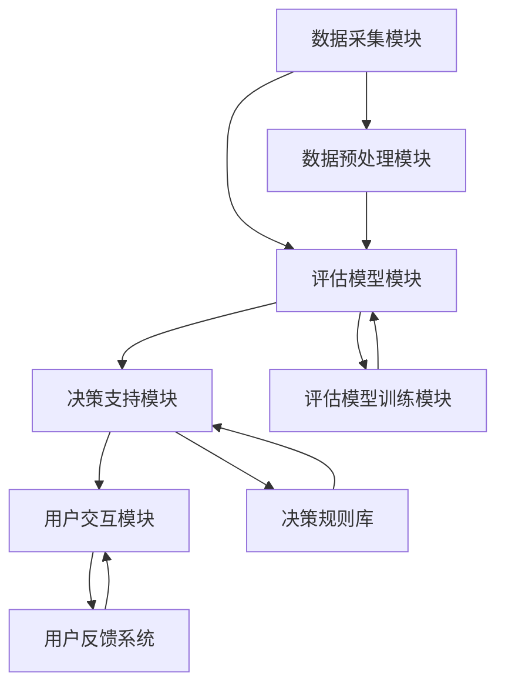

                 

# 多智能体系统在评估公司人力资本价值中的应用

## 关键词

多智能体系统，人力资本价值，评估模型，人力资源，分布式计算

## 摘要

本文探讨了如何利用多智能体系统（MAS）对人力资本进行科学评估，以提高企业决策效率和人力资源管理质量。首先介绍了多智能体系统的基本原理和关键特性，然后详细阐述了人力资本价值评估的指标和方法。接着，本文设计了一个基于多智能体系统的人力资本评估框架，包括数据采集、评估模型构建、决策支持和用户交互等模块。通过实际案例，本文展示了多智能体系统在评估公司人力资本价值中的有效性和可行性。最后，本文分析了多智能体系统在人力资本评估中可能面临的技术挑战，并提出了相应的解决方案。

## 1. 背景介绍

### 问题背景

随着人工智能技术的飞速发展，多智能体系统（MAS）逐渐成为现代企业解决复杂问题的重要工具。特别是在人力资源领域，企业需要准确评估员工的人力资本价值，以优化人才配置，提高组织效率。多智能体系统在评估公司人力资本价值中的应用，提供了新的视角和方法，有助于企业更好地理解和利用人力资源。

### 问题描述

在本节中，我们将详细探讨以下问题：

- **核心概念术语说明**：首先，我们需要明确多智能体系统、人力资本、人力资本价值评估等核心概念。
- **问题背景**：接下来，我们将介绍多智能体系统在人力资源领域的重要性，以及企业在评估人力资本时面临的挑战。
- **问题描述**：然后，我们将具体描述企业如何利用多智能体系统进行人力资本价值评估，以及这一过程面临的挑战和解决方案。
- **问题解决**：最后，我们将概述本文将要介绍的多智能体系统在人力资本评估中的应用方法和技术。

### 核心概念术语说明

- **多智能体系统（MAS）**：一种分布式计算系统，由多个智能体组成，每个智能体具有自主性、协同性和适应性。
- **人力资本**：企业中员工的能力、知识、经验和技能等，是企业的重要资源。
- **人力资本价值评估**：对员工的人力资本进行量化评估，以确定其在企业中的价值和潜力。

### 问题背景

#### 多智能体系统在人力资源领域的应用

多智能体系统在人力资源领域的应用，主要体现在以下几个方面：

1. **人才招聘与配置**：通过多智能体系统，企业可以更准确地评估应聘者的能力和潜力，从而实现精准招聘和合理配置。
2. **绩效管理**：多智能体系统可以实时监控员工的绩效，提供科学的评估和反馈，帮助企业优化绩效管理体系。
3. **员工培训与发展**：多智能体系统可以根据员工的潜力和发展需求，制定个性化的培训计划，提升员工的能力和素质。

#### 企业在评估人力资本时面临的挑战

尽管多智能体系统在人力资源领域具有广泛的应用潜力，但在实际应用中，企业仍然面临以下挑战：

1. **数据准确性**：评估人力资本价值需要大量的数据支持，但数据的准确性和完整性往往难以保证。
2. **评估模型构建**：构建科学、合理的评估模型，是准确评估人力资本价值的关键，但模型构建过程复杂，需要深厚的专业知识。
3. **技术实现难度**：多智能体系统的实现难度较大，需要企业具备较高的技术实力和研发能力。

### 问题描述

#### 如何利用多智能体系统进行人力资本价值评估

利用多智能体系统进行人力资本价值评估，主要包括以下几个步骤：

1. **数据采集**：通过多种途径，如员工绩效数据、项目完成情况、团队协作数据等，收集与人力资本相关的数据。
2. **评估模型构建**：根据收集到的数据，构建评估模型，用于量化评估员工的人力资本价值。
3. **评估结果分析**：根据评估模型，对员工的人力资本价值进行评估，分析员工的优势和劣势，为企业提供决策依据。

#### 问题解决

针对上述问题，本文提出以下解决方案：

1. **数据采集模块**：设计高效的数据采集模块，确保数据的准确性和完整性。
2. **评估模型构建**：结合企业实际情况，构建科学、合理的评估模型，提高评估结果的准确性。
3. **技术实现**：采用先进的分布式计算技术，实现多智能体系统的构建和运行。

### 边界与外延

本文主要关注多智能体系统在评估公司人力资本价值中的应用，但多智能体系统的应用范围远不止于此。在实际应用中，多智能体系统还可以应用于以下几个方面：

1. **供应链管理**：通过多智能体系统，企业可以实时监控供应链的各个环节，提高供应链的协同效率和响应速度。
2. **智能客服**：利用多智能体系统，企业可以构建智能客服系统，提供24小时在线服务，提高客户满意度。
3. **智能医疗**：多智能体系统可以应用于医疗领域，如疾病预测、治疗方案优化等，提高医疗服务质量。

### 概念结构与核心要素组成

多智能体系统在评估公司人力资本价值中的应用，涉及以下几个核心概念和要素：

1. **多智能体系统（MAS）**：由多个智能体组成，通过协作完成复杂任务。
2. **人力资本**：企业的核心资源，包括员工的能力、知识、经验等。
3. **评估模型**：用于对人力资本进行量化评估的数学模型。
4. **数据采集**：用于收集与人力资本相关的各类数据。
5. **决策支持**：根据评估结果，为企业提供决策支持。

## 1.2 核心概念与联系

### 1.2.1 多智能体系统（MAS）原理

多智能体系统（MAS）是一种分布式计算系统，由多个智能体组成，每个智能体具有自主性、协同性和适应性。

#### 多智能体系统的关键特性：

1. **自主性**：智能体能够自主地决定行动，而不受外部控制。
2. **协同性**：智能体之间能够相互协作，共同完成任务。
3. **适应性**：智能体能够根据环境变化，调整自身行为。

#### 多智能体系统的架构：

1. **通信层**：实现智能体之间的信息交换。
2. **协调层**：协调智能体之间的协作。
3. **决策层**：智能体的决策中心。

### 1.2.2 人力资本价值评估指标

人力资本价值评估需要考虑多个因素，如能力、贡献、潜力等。以下是一个常见的人力资本价值评估指标体系：

| 指标名称 | 描述 | 权重 |
| :--: | :--: | :--: |
| 能力 | 员工的技能、知识、经验等 | 0.4 |
| 贡献 | 员工对企业目标的贡献 | 0.3 |
| 潜力 | 员工的成长潜力和未来发展价值 | 0.3 |

#### 指标对比表格：

| 指标名称 | 描述 | 权重 |
| :--: | :--: | :--: |
| 能力 | 员工的技能、知识、经验等 | 0.4 |
| 贡献 | 员工对企业目标的贡献 | 0.3 |
| 潜力 | 员工的成长潜力和未来发展价值 | 0.3 |

### 1.2.3 多智能体系统在评估中的应用

多智能体系统在评估公司人力资本价值中的应用，主要体现在以下几个方面：

1. **多维度评估**：多智能体系统可以综合考虑员工的能力、贡献、潜力等多个维度，进行全方位评估。
2. **动态调整评估模型**：多智能体系统可以根据实时数据，动态调整评估模型，使评估结果更加准确。
3. **提高评估效率**：多智能体系统可以自动化评估过程，提高人力资源管理的效率。

## 1.3 多智能体系统架构设计

### 1.3.1 系统架构设计概述

多智能体系统在评估公司人力资本价值中的应用，需要考虑以下几个关键模块：

1. **数据采集模块**：负责收集与人力资本相关的各类数据，如员工绩效、工作态度、团队协作等。
2. **评估模型模块**：根据采集到的数据，构建评估模型，用于量化评估人力资本价值。
3. **决策支持模块**：根据评估结果，为企业提供决策支持，如人才配置、薪酬调整等。
4. **用户交互模块**：提供用户界面，便于用户查看评估结果、调整评估模型等。

### 1.3.2 数据采集模块设计

数据采集模块设计主要包括以下几个步骤：

1. **数据源识别**：确定与人力资本相关的数据源，如员工绩效系统、项目管理系统等。
2. **数据采集方式**：设计数据采集的流程和方式，如自动采集、手动录入等。
3. **数据预处理**：对采集到的数据进行清洗、去重、归一化等处理，确保数据的准确性和一致性。

#### 数据采集模块关键组件：

1. **数据源连接器**：用于连接不同的数据源，如数据库、API接口等。
2. **数据采集引擎**：负责执行数据采集任务，包括数据抽取、转换、加载等操作。
3. **数据存储**：用于存储采集到的原始数据和预处理后的数据，支持快速查询和统计分析。

### 1.3.3 评估模型模块设计

评估模型模块设计主要包括以下几个步骤：

1. **评估指标体系设计**：根据企业的需求和实际情况，设计评估指标体系，包括能力、贡献、潜力等维度。
2. **评估模型构建**：利用机器学习、数据挖掘等技术，构建评估模型，实现人力资本价值的量化评估。
3. **模型训练与优化**：根据历史数据和评估结果，对评估模型进行训练和优化，提高评估准确性。

#### 评估模型模块关键组件：

1. **评估指标库**：存储各种评估指标的定义和计算方法，支持自定义指标和指标组合。
2. **评估模型构建器**：用于构建和训练评估模型，支持多种机器学习和数据挖掘算法。
3. **评估结果分析器**：对评估结果进行分析和可视化，为企业提供决策支持。

### 1.3.4 决策支持模块设计

决策支持模块设计主要包括以下几个步骤：

1. **决策模型构建**：根据评估结果，构建决策模型，如人才配置、薪酬调整等。
2. **决策规则库**：定义决策规则和优先级，支持灵活的决策逻辑和业务规则。
3. **决策引擎**：执行决策任务，根据评估结果和决策规则，生成决策建议和行动方案。

#### 决策支持模块关键组件：

1. **决策规则库**：存储各种决策规则和优先级，支持自定义规则和规则组合。
2. **决策引擎**：用于执行决策任务，根据评估结果和决策规则，生成决策建议和行动方案。
3. **决策分析器**：对决策结果进行分析和评估，支持决策结果的可视化和反馈。

### 1.3.5 用户交互模块设计

用户交互模块设计主要包括以下几个步骤：

1. **用户界面设计**：设计直观、易用的用户界面，支持用户查看评估结果、调整评估模型等操作。
2. **数据展示与可视化**：利用图表、报表等可视化工具，展示评估结果和决策建议，支持用户自定义数据筛选和展示方式。
3. **用户反馈与交互**：提供用户反馈机制，收集用户意见和建议，持续优化用户交互体验。

#### 用户交互模块关键组件：

1. **用户界面**：用于展示评估结果和决策建议，支持用户自定义数据筛选和展示方式。
2. **数据展示与可视化组件**：用于生成图表、报表等可视化内容，支持多种数据展示方式和交互方式。
3. **用户反馈系统**：用于收集用户反馈和建议，支持用户对系统进行评价和投诉。

### 1.3.6 多智能体系统架构图

以下是一个基于多智能体系统的人力资本评估架构图，展示了各个模块之间的交互关系和数据处理流程。

## 1.4 多智能体系统在评估公司人力资本价值中的应用案例

### 案例背景

某大型互联网公司，拥有数千名员工，分布在多个部门和项目组。公司希望通过科学的人力资本价值评估，优化人才配置，提高组织效率。为此，公司决定采用多智能体系统（MAS）进行人力资本评估。

### 案例目标

1. **全面评估**：对员工的能力、贡献、潜力等多维度进行评估。
2. **动态调整**：根据实时数据，动态调整评估模型，使评估结果更加准确。
3. **提高决策效率**：通过自动化评估过程，提高人力资源管理的效率。

### 案例实施

#### 数据采集模块

公司设计了一个数据采集模块，通过连接多个数据源，如员工绩效系统、项目管理系统等，自动采集与人力资本相关的数据。数据采集模块的主要功能包括：

1. **数据抽取**：从各个数据源抽取相关数据，如员工绩效数据、项目完成情况等。
2. **数据转换**：对抽取的数据进行清洗、去重、归一化等处理，确保数据的准确性和一致性。
3. **数据存储**：将处理后的数据存储到数据仓库中，支持快速查询和统计分析。

#### 评估模型模块

公司利用机器学习算法，构建了一个评估模型，用于量化评估员工的人力资本价值。评估模型的主要功能包括：

1. **评估指标体系设计**：根据公司的需求和实际情况，设计评估指标体系，包括能力、贡献、潜力等维度。
2. **模型训练与优化**：利用历史数据和评估结果，对评估模型进行训练和优化，提高评估准确性。
3. **评估结果生成**：根据实时数据，运行评估模型，生成员工的评估结果。

#### 决策支持模块

公司构建了一个决策支持模块，根据评估结果，为企业提供决策支持，如人才配置、薪酬调整等。决策支持模块的主要功能包括：

1. **决策模型构建**：根据评估结果，构建决策模型，如人才配置模型、薪酬调整模型等。
2. **决策规则库**：定义决策规则和优先级，支持灵活的决策逻辑和业务规则。
3. **决策建议生成**：根据评估结果和决策规则，生成决策建议和行动方案。

#### 用户交互模块

公司设计了一个用户交互模块，提供用户界面，便于用户查看评估结果、调整评估模型等操作。用户交互模块的主要功能包括：

1. **用户界面设计**：设计直观、易用的用户界面，支持用户查看评估结果、调整评估模型等操作。
2. **数据展示与可视化**：利用图表、报表等可视化工具，展示评估结果和决策建议，支持用户自定义数据筛选和展示方式。
3. **用户反馈与交互**：提供用户反馈机制，收集用户意见和建议，持续优化用户交互体验。

### 案例效果

通过多智能体系统（MAS）进行人力资本评估，公司取得了显著的成效：

1. **全面评估**：多智能体系统能够综合考虑员工的能力、贡献、潜力等多个维度，进行全方位评估，为企业提供了科学的决策依据。
2. **动态调整**：多智能体系统可以根据实时数据，动态调整评估模型，使评估结果更加准确，提高了评估的实时性和准确性。
3. **提高决策效率**：通过自动化评估过程，多智能体系统大大提高了人力资源管理的效率，为企业节省了大量人力和时间成本。

## 1.5 多智能体系统在人力资本评估中可能面临的技术挑战与解决方案

### 技术挑战

尽管多智能体系统（MAS）在人力资本评估中具有显著的优势，但在实际应用过程中，仍然面临一些技术挑战：

1. **数据采集与处理**：如何保证数据的准确性和完整性，是一个重要问题。特别是在大规模、多源数据环境中，数据质量问题尤为突出。
2. **评估模型构建与优化**：构建科学、合理的评估模型，对企业和技术人员都提出了较高的要求。模型的选择、训练、优化等过程复杂，需要大量的时间和精力。
3. **系统安全性与隐私保护**：在人力资本评估中，涉及大量的敏感信息，如员工绩效、薪酬等。如何确保系统的安全性和数据隐私，是亟待解决的问题。

### 解决方案

针对上述技术挑战，本文提出以下解决方案：

1. **数据采集与处理**：
   - **数据质量保障**：采用数据清洗、去重、归一化等技术，确保数据的准确性和一致性。
   - **多源数据集成**：利用数据仓库和数据湖等技术，实现多源数据的集成和管理，提高数据的可用性。
   - **实时数据处理**：采用流数据处理技术，如Apache Kafka、Apache Flink等，实现实时数据采集和处理。

2. **评估模型构建与优化**：
   - **模型选择与优化**：根据实际需求和数据特点，选择合适的机器学习算法和评估模型。利用交叉验证、模型集成等技术，优化评估模型。
   - **模型训练与迭代**：利用大数据技术和分布式计算框架，如Hadoop、Spark等，加速模型训练和迭代过程。
   - **模型解释与可解释性**：采用可解释性模型和解释性算法，如LIME、SHAP等，提高评估模型的可解释性，帮助企业更好地理解和应用评估结果。

3. **系统安全性与隐私保护**：
   - **数据加密与访问控制**：采用数据加密技术和访问控制机制，确保敏感数据的安全和隐私。
   - **数据匿名化与脱敏**：对敏感数据进行匿名化和脱敏处理，降低数据泄露的风险。
   - **安全审计与监控**：建立安全审计和监控机制，实时监控系统的运行状态，及时发现和应对潜在的安全威胁。

## 1.6 总结与展望

多智能体系统（MAS）在评估公司人力资本价值中的应用，为企业提供了一种新的视角和方法。通过多维度、动态、自动化的评估过程，多智能体系统不仅提高了评估的准确性和实时性，还大大提高了人力资源管理的效率。

然而，多智能体系统在人力资本评估中仍然面临一些技术挑战，如数据采集与处理、评估模型构建与优化、系统安全性与隐私保护等。针对这些挑战，本文提出了一系列解决方案，包括数据质量保障、多源数据集成、实时数据处理、模型选择与优化、模型训练与迭代、模型解释与可解释性、数据加密与访问控制、数据匿名化与脱敏、安全审计与监控等。

未来的研究可以进一步探索多智能体系统在其他人力资源领域的应用，如员工满意度评估、企业文化建设等。同时，随着人工智能技术的不断发展，多智能体系统在人力资源管理中的应用前景将更加广阔。通过持续的研究和实践，我们将不断优化多智能体系统，为企业提供更加科学、高效的人力资源管理解决方案。

## 1.7 拓展阅读

1. **《人工智能：一种现代方法》** - 斯蒂芬·马库斯（Stephen Marsland）
   - 本书详细介绍了人工智能的基础理论和应用方法，包括机器学习、深度学习、自然语言处理等，对理解多智能体系统在人力资源管理中的应用具有重要意义。

2. **《大数据人力资源管理与分析》** - 刘鹏
   - 本书从大数据的角度，探讨了人力资源管理的现状和趋势，包括数据采集、处理、分析和应用等，为多智能体系统在人力资本评估中的应用提供了理论支持。

3. **《智能人力资源管理：理论与实践》** - 张雷
   - 本书结合实际案例，介绍了智能人力资源管理的方法和技术，包括人工智能、大数据、云计算等，对理解多智能体系统在人力资本评估中的应用具有参考价值。

4. **《多智能体系统：原理与应用》** - 约翰·霍普金斯（John H. Hopkins）
   - 本书详细介绍了多智能体系统的基本原理、架构设计和应用方法，包括在人力资源、供应链管理、智能客服等领域的应用，为本文的研究提供了理论基础。

5. **《人力资源管理：理论与实践》** - 保罗·洛克（Paul R. Locke）
   - 本书从理论层面对人力资源管理进行了深入探讨，包括人才招聘、绩效管理、薪酬管理、员工培训等，对理解多智能体系统在人力资本评估中的应用提供了参考。

## 1.8 注意事项

1. **数据质量**：在构建多智能体系统时，数据质量至关重要。企业应确保数据的准确性和一致性，定期进行数据清洗和更新，以保持数据的有效性。
2. **模型优化**：评估模型的构建和优化需要大量数据支持和专业知识。企业应持续收集和整理数据，结合业务需求，不断优化评估模型，以提高评估准确性。
3. **安全与隐私**：在人力资本评估中，涉及大量敏感信息，如员工绩效、薪酬等。企业应采取数据加密、访问控制、安全审计等措施，确保系统的安全性和数据隐私。
4. **用户反馈**：多智能体系统的应用效果离不开用户的参与和支持。企业应积极收集用户反馈，不断优化系统功能和用户体验，以提高系统的实用性和用户满意度。

