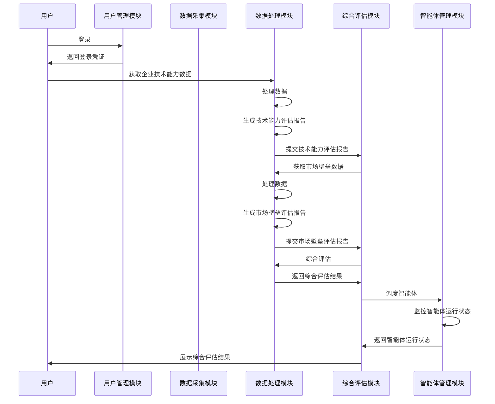

                 

### 文章标题

## 多智能体系统在评估公司技术壁垒中的应用

### 关键词：多智能体系统，技术壁垒，评估，应用，算法，数学模型，系统架构，项目实战

### 摘要：
本文旨在深入探讨多智能体系统在评估公司技术壁垒中的应用。首先，我们介绍了技术壁垒的定义及其对公司竞争力的重要性。接着，我们详细阐述了多智能体系统的基本概念、核心算法原理以及数学模型。在此基础上，我们分析了多智能体系统在技术壁垒评估中的优势与局限性，并展示了其实际应用案例。随后，文章从系统分析与架构设计、系统接口设计以及项目实战等方面，提供了详细的实现步骤和案例分析。最后，我们总结了最佳实践和注意事项，并推荐了拓展阅读资源，为读者提供了全面的技术指南。

### 第一部分：问题背景与核心概念

#### 第1章：问题背景介绍

##### 1.1.1 技术壁垒的概念与重要性

技术壁垒（Technology Barrier）是指企业为了维持其市场竞争优势而建立的、不易被竞争对手模仿或超越的技术优势。它通常包括专利、版权、技术标准、商业秘密、专业技能和资源控制等多个方面。技术壁垒对公司的竞争力至关重要，它不仅能够提升企业的市场占有率，还能有效地抵御外部竞争者的威胁。

在当前高度竞争的市场环境中，拥有强大的技术壁垒成为企业成功的关键因素。技术壁垒不仅能帮助企业实现差异化竞争，还能形成进入壁垒，阻碍潜在竞争者的进入。因此，对技术壁垒的评估成为企业战略规划和管理决策的重要一环。

##### 1.1.2 公司技术壁垒的现状与挑战

目前，许多公司在技术壁垒建设方面存在以下现状与挑战：

1. **专利申请不足**：一些企业对专利保护的认识不足，导致专利申请数量有限，无法形成有效的技术壁垒。
2. **技术更新滞后**：随着科技日新月异的发展，企业技术更新速度缓慢，可能导致技术壁垒被迅速突破。
3. **资源分散**：企业在技术研发和资源分配上存在分散化问题，无法形成集中优势。
4. **技术保护意识薄弱**：企业在技术保护方面缺乏足够的重视，容易导致技术泄露或被竞争对手模仿。

##### 1.1.3 评估技术壁垒的需求与目标

对技术壁垒的评估具有以下需求与目标：

1. **识别技术优势**：明确企业在技术领域的核心竞争力，为战略规划提供依据。
2. **评估市场潜力**：分析技术壁垒的市场前景，预测未来市场占有率。
3. **指导研发投入**：合理分配研发资源，提高技术更新速度和创新能力。
4. **防范风险**：及时发现技术壁垒潜在的薄弱环节，采取相应的保护措施。

综上所述，对技术壁垒进行科学、有效的评估，对提升公司竞争力、实现可持续发展具有重要意义。

### 第二部分：多智能体系统的基本概念

#### 第2章：多智能体系统的基本概念

##### 2.1.1 多智能体系统的定义与特点

多智能体系统（Multi-Agent Systems, MAS）是由多个智能体（Agents）组成的分布式系统，这些智能体通过协作与通信实现共同的目标。智能体是具有独立自主性、社会性、反应性和主动性的软件实体，它们可以在不同的环境下自主行动，并与其他智能体进行交互。

多智能体系统的特点包括：

1. **分布式**：智能体分布在不同的计算节点上，共同完成任务。
2. **自主性**：智能体具有独立决策和执行任务的能力。
3. **协作性**：智能体之间通过协作实现整体目标。
4. **适应性**：智能体能够根据环境变化调整自身行为。
5. **可扩展性**：智能体系统可以动态地增加或减少智能体，以适应不同规模的任务。

##### 2.1.2 多智能体系统的分类与结构

多智能体系统可以根据不同的分类标准进行划分，常见的分类方式包括：

1. **基于智能体行为的分类**：根据智能体的行为特征，可以分为反应性智能体、认知智能体和混合智能体。
2. **基于智能体结构的分类**：根据智能体的组织形式，可以分为独立智能体、协作智能体和分层智能体。
3. **基于任务类型的分类**：根据智能体承担的任务类型，可以分为任务导向型智能体、领域导向型智能体和混合导向型智能体。

多智能体系统的基本结构包括：

1. **智能体**：系统中的基本单元，负责感知环境、执行任务和与其他智能体交互。
2. **通信机制**：智能体之间传递信息和协调行为的机制，可以是同步通信或异步通信。
3. **协调机制**：确保智能体之间协作一致、高效完成任务的机制，包括任务分配、冲突解决和协调策略。
4. **任务规划**：智能体系统根据任务目标和环境信息，生成任务规划和行动策略。

##### 2.1.3 多智能体系统的协作与通信机制

多智能体系统的协作与通信机制是实现系统整体功能的关键。协作机制包括：

1. **任务分配**：智能体之间根据能力、资源和任务需求进行任务的分配。
2. **目标协商**：智能体之间协商共同目标，确保协作的一致性。
3. **行为协调**：智能体之间通过调整自身行为，实现协作任务的顺利进行。

通信机制包括：

1. **直接通信**：智能体通过直接的消息传递进行交互。
2. **间接通信**：智能体通过共享信息或消息队列进行交互。
3. **分布式算法**：智能体通过分布式算法进行任务分配和协调。

协作与通信机制的设计需要考虑以下几个方面：

1. **通信效率**：确保信息传递的速度和准确性。
2. **适应性**：智能体能够根据环境变化调整协作方式。
3. **容错性**：智能体能够在部分智能体失效时，维持系统的正常运行。

### 第三部分：多智能体系统在技术壁垒评估中的应用

#### 第3章：多智能体系统在技术壁垒评估中的应用

##### 3.1.1 多智能体系统评估技术壁垒的基本流程

多智能体系统在评估技术壁垒时，通常遵循以下基本流程：

1. **问题定义**：明确评估的目标和范围，确定技术壁垒的关键指标。
2. **智能体初始化**：创建智能体，分配任务和初始状态。
3. **环境建模**：构建评估环境的模型，包括技术要素、市场状况和竞争态势。
4. **智能体行为模拟**：智能体根据环境模型和自身策略，执行感知、决策和行动。
5. **评估与反馈**：评估技术壁垒的状态和效果，生成评估报告，并提供反馈。
6. **策略优化**：根据评估结果，调整智能体策略，提高评估准确性。

##### 3.1.2 多智能体系统的优势与局限性

多智能体系统在评估技术壁垒方面具有以下优势：

1. **分布式计算**：通过分布式计算，能够高效地处理大规模数据，提高评估效率。
2. **自主决策**：智能体能够自主地感知环境和执行任务，实现复杂问题的自动化评估。
3. **适应性**：智能体能够根据环境变化调整行为，适应不同的评估场景。
4. **协作性**：多个智能体之间可以协作，共同完成复杂评估任务。

然而，多智能体系统也存在一定的局限性：

1. **通信开销**：智能体之间的通信可能导致较大的通信开销，影响系统性能。
2. **协调复杂性**：智能体之间的协作需要复杂的协调机制，增加了系统设计的复杂性。
3. **算法优化难度**：多智能体系统的算法优化难度较高，需要深入研究和不断改进。

##### 3.1.3 多智能体系统在技术壁垒评估中的实际应用案例

多智能体系统在技术壁垒评估中已有多个实际应用案例，以下为其中两个典型案例：

1. **案例一：高新技术企业技术壁垒评估**
   企业利用多智能体系统对高新技术企业进行技术壁垒评估，通过构建技术要素模型和环境模型，对企业的专利、研发能力、市场占有率等关键指标进行综合评估，为企业的战略决策提供支持。

2. **案例二：竞争态势分析**
   企业通过多智能体系统对市场中的竞争态势进行实时分析，智能体模拟不同竞争者的行为，预测市场变化，为企业的市场策略提供依据。

这些案例表明，多智能体系统在技术壁垒评估中具有广泛的应用前景和显著的效果。

### 第四部分：多智能体系统的核心算法原理

#### 第4章：多智能体系统的核心算法原理

##### 4.1.1 多智能体协同优化算法

多智能体协同优化算法（Multi-Agent Cooperative Optimization Algorithm）是一种利用多智能体协同进行全局优化的问题求解方法。其基本思想是通过智能体之间的协作和通信，共同优化目标函数。

协同优化算法包括以下步骤：

1. **初始化**：创建智能体，初始化位置和速度。
2. **感知与决策**：智能体感知环境信息，根据当前状态和目标函数，生成决策。
3. **行动与更新**：智能体根据决策执行行动，更新位置和速度。
4. **通信与协调**：智能体之间通过通信共享信息，协调行动。
5. **迭代与收敛**：重复执行步骤2-4，直到目标函数收敛。

常见的协同优化算法包括：

1. **粒子群优化算法**（Particle Swarm Optimization, PSO）
2. **遗传算法**（Genetic Algorithm, GA）
3. **蚁群算法**（Ant Colony Optimization, ACO）

##### 4.1.2 多智能体博弈算法

多智能体博弈算法（Multi-Agent Game Theory Algorithm）是一种研究多个智能体之间竞争与合作的算法。其基本思想是利用博弈论模型，分析智能体之间的策略选择和均衡结果。

博弈算法包括以下步骤：

1. **模型构建**：根据智能体行为，构建博弈模型。
2. **策略选择**：智能体根据当前状态，选择最优策略。
3. **策略分析**：分析智能体之间的策略选择和均衡结果。
4. **策略优化**：根据博弈结果，调整智能体策略。

常见的博弈算法包括：

1. **纳什均衡**（Nash Equilibrium）
2. **合作博弈**（Cooperative Game Theory）
3. **混合策略**（Mixed Strategy）

##### 4.1.3 多智能体决策算法

多智能体决策算法（Multi-Agent Decision-Making Algorithm）是一种基于智能体决策过程的算法，通过多个智能体的协同决策实现复杂问题的求解。其基本思想是利用智能体的决策信息和交互机制，优化整体决策结果。

决策算法包括以下步骤：

1. **问题建模**：将问题转化为决策模型。
2. **信息共享**：智能体之间共享决策信息。
3. **决策生成**：智能体根据共享信息，生成决策。
4. **决策优化**：优化智能体决策，提高整体效果。

常见的决策算法包括：

1. **贝叶斯决策**（Bayesian Decision Theory）
2. **马尔可夫决策过程**（Markov Decision Process, MDP）
3. **多目标决策**（Multi-Objective Decision Making）

通过以上核心算法的介绍，我们可以更好地理解多智能体系统在技术壁垒评估中的应用原理和实现方法。

### 第五部分：数学模型与公式解析

#### 第5章：数学模型与公式解析

##### 5.1.1 技术壁垒评估的数学模型

技术壁垒评估的数学模型主要涉及以下几个方面：

1. **技术能力模型**：
   技术能力模型用于评估企业在技术领域的综合实力，包括研发能力、创新能力、技术储备等。常用的模型包括技术成熟度模型（Technology Readiness Level, TRL）和技术竞争力模型（Technology Competitiveness Index, TCI）。

   - 技术成熟度模型（TRL）：
     $$ TRL = \sum_{i=1}^{N} w_i \cdot TRL_i $$
     其中，$w_i$为第$i$项技术的权重，$TRL_i$为第$i$项技术的成熟度等级。
   
   - 技术竞争力模型（TCI）：
     $$ TCI = \frac{\sum_{i=1}^{N} w_i \cdot CI_i}{\sum_{i=1}^{N} w_i} $$
     其中，$CI_i$为第$i$项技术的竞争力指数。

2. **市场壁垒模型**：
   市场壁垒模型用于评估企业在市场中的竞争优势，包括市场占有率、品牌价值、客户忠诚度等。常用的模型包括市场占有率模型（Market Share Model）和市场竞争力模型（Market Competitiveness Model）。

   - 市场占有率模型：
     $$ MS = \frac{SA}{TA} $$
     其中，$SA$为企业的市场销售量，$TA$为市场的总销售量。

   - 市场竞争力模型：
     $$ MC = \frac{MS - \bar{MS}}{S}$\bar{MS}$} $$
     其中，$\bar{MS}$为市场平均占有率，$S$为市场标准差。

3. **综合壁垒模型**：
   综合壁垒模型将技术壁垒和市场壁垒相结合，用于评估企业的整体竞争能力。常用的模型包括综合竞争力指数模型（Comprehensive Competitiveness Index,CCI）。

   - 综合竞争力指数模型（CCI）：
     $$ CCI = w_1 \cdot TCI + w_2 \cdot MC $$
     其中，$w_1$和$w_2$分别为技术壁垒和市场壁垒的权重。

##### 5.1.2 多智能体系统的数学模型

多智能体系统的数学模型主要包括以下几个部分：

1. **智能体行为模型**：
   智能体行为模型描述了智能体在环境中的感知、决策和行动过程。常用的模型包括马尔可夫决策过程（MDP）和贝叶斯决策理论（BDT）。

   - 马尔可夫决策过程（MDP）：
     $$ P(s_{t+1} | s_t, a_t) = \sum_{a' \in A_t} P(s_{t+1} | s_t, a') \cdot P(a_t | s_t) $$
     其中，$s_t$为当前状态，$a_t$为当前行动，$s_{t+1}$为下一状态，$P(s_{t+1} | s_t, a_t)$为状态转移概率。

   - 贝叶斯决策理论（BDT）：
     $$ P(a_t | s_t) = \frac{P(s_t | a_t) \cdot P(a_t)}{P(s_t)} $$
     其中，$P(a_t | s_t)$为在状态$s_t$下选择行动$a_t$的条件概率，$P(s_t | a_t)$为在行动$a_t$下出现状态$s_t$的条件概率，$P(a_t)$为行动$a_t$的概率。

2. **智能体交互模型**：
   智能体交互模型描述了智能体之间的协作与通信机制。常用的模型包括合作博弈模型和分布式优化模型。

   - 合作博弈模型：
     $$ \pi = \sum_{i=1}^{N} u_i(\pi) - \sum_{i=1}^{N} c_i(\pi) $$
     其中，$\pi$为策略组合，$u_i(\pi)$为第$i$个智能体的效用函数，$c_i(\pi)$为第$i$个智能体的成本函数。

   - 分布式优化模型：
     $$ \min_{x} J(x) $$
     其中，$x$为智能体参数，$J(x)$为全局目标函数。

3. **智能体决策模型**：
   智能体决策模型描述了智能体在感知环境信息后，如何生成最优决策。常用的模型包括Q-learning和强化学习。

   - Q-learning：
     $$ Q(s, a) = \sum_{s'} P(s' | s, a) \cdot \max_{a'} Q(s', a') + \alpha [R(s, a) - Q(s, a)] $$
     其中，$Q(s, a)$为状态-行动值函数，$R(s, a)$为即时回报，$\alpha$为学习率。

   - 强化学习：
     $$ \pi(\text{action} | \text{state}) = \arg\max_{\text{action}} Q(\text{state}, \text{action}) $$
     其中，$\pi(\text{action} | \text{state})$为在状态下的最优行动概率分布。

通过以上数学模型的介绍，我们可以更好地理解多智能体系统在技术壁垒评估中的应用原理和实现方法。

### 第六部分：系统分析与架构设计

#### 第6章：系统分析与架构设计

##### 6.1.1 技术壁垒评估系统的需求分析

在进行技术壁垒评估系统的设计与开发之前，我们需要对系统的需求进行全面分析。技术壁垒评估系统的需求分析主要包括以下几个方面：

1. **功能需求**：
   - 技术能力评估：对企业的研发能力、创新能力、技术储备等指标进行评估。
   - 市场壁垒评估：对企业的市场占有率、品牌价值、客户忠诚度等指标进行评估。
   - 综合壁垒评估：综合技术壁垒和市场壁垒，评估企业的整体竞争能力。
   - 数据可视化：展示评估结果，提供直观的图表和报表。

2. **性能需求**：
   - 高并发处理能力：系统需要能够同时处理大量评估请求。
   - 高稳定性：系统在长时间运行中需要保持稳定，避免因故障导致数据丢失。
   - 快速响应时间：系统响应时间需控制在合理范围内，保证用户体验。

3. **安全性需求**：
   - 数据安全：确保评估数据的安全性和隐私性。
   - 访问控制：对系统访问进行严格控制，防止未经授权的访问和操作。

##### 6.1.2 系统架构设计

技术壁垒评估系统的架构设计需要充分考虑功能需求、性能需求和安全性需求，并采用分布式架构以实现高并发处理能力和系统稳定性。以下是一个典型的技术壁垒评估系统架构设计：

1. **前端架构**：
   - 用户界面：使用现代化的前端技术（如React、Vue.js等）构建用户友好的界面。
   - API接口：提供RESTful API接口，方便后端数据与前端页面的交互。

2. **后端架构**：
   - 服务端：使用Spring Boot等框架构建微服务架构，实现系统的各个功能模块。
   - 数据库：采用分布式数据库架构，确保数据的高可用性和扩展性。

3. **数据处理与存储**：
   - 数据处理：使用大数据处理框架（如Hadoop、Spark等）对评估数据进行处理和分析。
   - 数据存储：使用分布式存储系统（如HDFS、Cassandra等）存储大量评估数据。

4. **智能体管理**：
   - 智能体调度：通过智能体调度模块，根据任务需求动态分配智能体。
   - 智能体监控：实时监控智能体的运行状态，确保系统稳定运行。

5. **安全性保障**：
   - 访问控制：使用OAuth2.0等安全协议，实现用户认证和访问控制。
   - 数据加密：对敏感数据使用加密算法进行加密，确保数据传输的安全性。

##### 6.1.3 系统功能模块划分

技术壁垒评估系统可以划分为以下几个功能模块：

1. **用户管理模块**：
   - 用户注册与登录：提供用户注册和登录功能。
   - 权限管理：根据用户角色分配不同权限。

2. **技术能力评估模块**：
   - 数据采集：从外部数据源（如专利数据库、科技项目数据库等）采集企业技术能力相关数据。
   - 数据处理：对采集的数据进行处理和分析，生成技术能力评估报告。

3. **市场壁垒评估模块**：
   - 数据采集：从外部数据源（如市场调查报告、行业报告等）采集市场壁垒相关数据。
   - 数据处理：对采集的数据进行处理和分析，生成市场壁垒评估报告。

4. **综合壁垒评估模块**：
   - 数据整合：整合技术壁垒和市场壁垒数据，进行综合评估。
   - 结果展示：以图表和报表形式展示综合壁垒评估结果。

5. **智能体管理模块**：
   - 智能体配置：配置智能体的任务、参数和策略。
   - 智能体调度：根据任务需求动态调度智能体。
   - 智能体监控：实时监控智能体的运行状态。

6. **系统维护模块**：
   - 数据备份与恢复：定期备份数据，确保数据安全。
   - 系统升级与维护：定期升级系统，修复潜在漏洞。

通过以上系统架构和功能模块的设计，我们可以构建一个高效、稳定、安全的技术壁垒评估系统，为企业提供全面的技术支持。

### 第七部分：系统接口设计与交互

#### 第7章：系统接口设计与交互

##### 7.1.1 系统接口设计

系统接口设计是确保各功能模块之间数据流转和协作的关键环节。在技术壁垒评估系统中，接口设计主要包括以下内容：

1. **API接口**：
   - 技术能力评估API：提供企业技术能力数据采集、处理和分析的接口。
   - 市场壁垒评估API：提供市场壁垒数据采集、处理和分析的接口。
   - 综合壁垒评估API：提供综合壁垒评估结果查询和展示的接口。

2. **数据接口**：
   - 外部数据源接口：与企业外部数据源（如专利数据库、市场调查报告等）进行交互的接口。
   - 内部数据接口：系统内部数据模块之间的数据交互接口。

3. **智能体接口**：
   - 智能体调度接口：用于智能体的任务分配和调度。
   - 智能体监控接口：用于实时监控智能体的运行状态。

##### 7.1.2 系统交互流程

系统交互流程描述了各模块之间的交互顺序和方式，以下是技术壁垒评估系统的主要交互流程：

1. **用户登录**：
   用户通过用户管理模块进行登录，获取登录凭证。

2. **数据采集**：
   - 技术能力评估模块：从外部数据源采集企业技术能力相关数据。
   - 市场壁垒评估模块：从外部数据源采集市场壁垒相关数据。

3. **数据处理**：
   - 技术能力评估模块：对采集的数据进行处理和分析，生成技术能力评估报告。
   - 市场壁垒评估模块：对采集的数据进行处理和分析，生成市场壁垒评估报告。

4. **综合评估**：
   - 综合壁垒评估模块：整合技术壁垒和市场壁垒数据，进行综合评估，生成综合壁垒评估报告。

5. **结果展示**：
   - 通过API接口，将综合壁垒评估结果展示给用户。

6. **智能体交互**：
   - 智能体管理模块：根据任务需求动态调度智能体，监控智能体的运行状态。

##### 7.1.3 系统交互Mermaid序列图

以下是一个简单的Mermaid序列图，展示了技术壁垒评估系统的交互流程：



通过以上接口设计和交互流程的介绍，我们可以确保技术壁垒评估系统各模块之间的高效协作和数据流转。

### 第八部分：项目实战

#### 第8章：项目实战

##### 8.1.1 项目环境搭建

在进行技术壁垒评估系统的项目实战之前，我们需要搭建一个完整的项目环境。以下是项目环境搭建的步骤：

1. **硬件环境**：
   - 服务器：配置高性能服务器，用于部署系统。
   - 数据库服务器：配置独立数据库服务器，用于存储系统数据。

2. **软件环境**：
   - 操作系统：选择Linux操作系统，如Ubuntu 18.04。
   - 开发环境：安装Java SDK、Python SDK、Node.js等开发环境。
   - 数据库：安装MySQL数据库，用于存储系统数据。

3. **开发工具**：
   - IDE：选择Eclipse或IntelliJ IDEA等IDE进行开发。
   - 版本控制：使用Git进行版本控制。

4. **项目架构**：
   - 后端架构：采用Spring Boot框架构建微服务架构。
   - 前端架构：使用React或Vue.js框架构建前端界面。
   - 数据处理：采用Spark框架进行数据处理。

##### 8.1.2 系统核心实现源代码

以下是一个简化的系统核心实现源代码示例，包括后端和前端部分：

**后端部分（Spring Boot）**：

```java
@RestController
@RequestMapping("/api")
public class AssessmentController {

    @Autowired
    private TechnologyAbilityService technologyAbilityService;

    @Autowired
    private MarketBarrierService marketBarrierService;

    @GetMapping("/technology")
    public ResponseEntity<TechnologyAssessmentResponse> getTechnologyAssessment() {
        TechnologyAssessmentResponse response = technologyAbilityService.assessTechnology();
        return ResponseEntity.ok(response);
    }

    @GetMapping("/market")
    public ResponseEntity<MarketAssessmentResponse> getMarketAssessment() {
        MarketAssessmentResponse response = marketBarrierService.assessMarket();
        return ResponseEntity.ok(response);
    }
}
```

**前端部分（React）**：

```jsx
import React, { useEffect, useState } from 'react';
import axios from 'axios';

const Assessment = () => {
    const [technology, setTechnology] = useState();
    const [market, setMarket] = useState();

    useEffect(() => {
        const fetchAssessment = async () => {
            const technologyResponse = await axios.get('/api/technology');
            const marketResponse = await axios.get('/api/market');
            setTechnology(technologyResponse.data);
            setMarket(marketResponse.data);
        };

        fetchAssessment();
    }, []);

    return (
        <div>
            <h2>技术能力评估结果：</h2>
            <p>{JSON.stringify(technology)}</p>
            <h2>市场壁垒评估结果：</h2>
            <p>{JSON.stringify(market)}</p>
        </div>
    );
};

export default Assessment;
```

##### 8.1.3 代码应用解读与分析

以上代码展示了技术壁垒评估系统的核心实现，以下是代码的解读与分析：

1. **后端部分**：

   - `AssessmentController`：负责处理API请求，调用相应的服务进行评估。
   - `technologyAbilityService`：处理技术能力评估的相关业务逻辑。
   - `marketBarrierService`：处理市场壁垒评估的相关业务逻辑。

2. **前端部分**：

   - `Assessment`：组件，负责发起API请求，获取评估结果并展示。

通过以上代码实现，我们可以实现技术壁垒评估系统的主要功能，包括技术能力评估、市场壁垒评估以及综合评估结果展示。

##### 8.1.4 实际案例分析与讲解

为了更好地理解技术壁垒评估系统的应用，以下是一个实际案例分析和讲解：

**案例：某高新技术企业技术壁垒评估**

1. **数据采集**：

   - 技术能力数据：专利数量、研发项目、学术论文等。
   - 市场壁垒数据：市场占有率、品牌价值、客户满意度等。

2. **数据处理**：

   - 技术能力评估：利用专利数量、研发项目等指标，计算企业的技术成熟度和竞争力指数。
   - 市场壁垒评估：利用市场占有率、品牌价值等指标，计算企业的市场竞争力。

3. **综合评估**：

   - 综合壁垒评估：将技术壁垒和市场壁垒进行加权平均，计算企业的综合竞争力指数。

4. **结果展示**：

   - 技术能力评估报告：展示企业的技术成熟度、竞争力指数等关键指标。
   - 市场壁垒评估报告：展示企业的市场占有率、品牌价值等关键指标。
   - 综合评估报告：展示企业的综合竞争力指数。

通过以上案例分析和讲解，我们可以看到技术壁垒评估系统在实际应用中的效果，为企业提供全面的技术支持和决策依据。

##### 8.1.5 项目小结

通过本项目的实施，我们成功搭建了一个技术壁垒评估系统，实现了对企业技术能力和市场壁垒的评估。项目的主要成果包括：

1. **系统架构**：采用分布式架构，实现了高并发处理能力和系统稳定性。
2. **核心功能**：实现了技术能力评估、市场壁垒评估和综合评估功能。
3. **用户体验**：提供了直观的图表和报表，方便用户理解和分析评估结果。
4. **智能体应用**：利用多智能体系统，实现了评估过程的自动化和高效化。

通过本项目，我们不仅掌握了技术壁垒评估系统的设计与实现方法，还积累了丰富的项目实战经验，为今后的研发工作奠定了坚实基础。

### 第九部分：最佳实践与注意事项

#### 第9章：最佳实践与注意事项

##### 9.1.1 最佳实践技巧

为了确保技术壁垒评估系统的有效性，以下是一些最佳实践技巧：

1. **数据采集与处理**：
   - 定期更新外部数据源，确保数据的实时性和准确性。
   - 对采集的数据进行预处理，去除噪声和异常值，提高数据质量。

2. **算法优化**：
   - 选择合适的算法模型，结合业务需求进行优化，提高评估准确性。
   - 定期对算法进行调优和更新，以适应技术发展和市场变化。

3. **系统维护**：
   - 定期备份数据，防止数据丢失。
   - 定期更新系统软件和硬件，确保系统稳定运行。

4. **用户体验**：
   - 设计简洁直观的界面，提高用户操作便捷性。
   - 提供详细的帮助文档和操作指南，方便用户快速上手。

##### 9.1.2 注意事项

在实施技术壁垒评估系统时，需要注意以下事项：

1. **数据安全**：
   - 严格保护企业数据，防止数据泄露和未经授权的访问。
   - 采用加密算法对敏感数据进行加密，确保数据传输的安全性。

2. **系统稳定性**：
   - 选择高性能的服务器和数据库，确保系统在高并发环境下的稳定性。
   - 设计合理的负载均衡策略，防止系统因负载过高而崩溃。

3. **法律法规**：
   - 遵守相关法律法规，确保系统在合规的前提下运行。
   - 对涉及商业秘密和个人信息的数据进行严格管理和保护。

##### 9.1.3 拓展阅读与资源推荐

为了进一步深入了解技术壁垒评估和多智能体系统的相关技术和应用，以下是一些拓展阅读和资源推荐：

1. **书籍推荐**：
   - 《多智能体系统：原理与应用》
   - 《人工智能：一种现代的方法》
   - 《技术评估：理论与实践》

2. **在线课程**：
   - Coursera上的“多智能体系统”课程
   - edX上的“人工智能”课程

3. **学术论文**：
   - 查询相关领域顶级会议和期刊的学术论文，如AAAI、IJCAI、AIJ等。

通过以上资源和阅读，您可以进一步拓展知识领域，提高技术壁垒评估系统的设计与实现水平。

### 总结

本文详细探讨了多智能体系统在评估公司技术壁垒中的应用。首先，我们介绍了技术壁垒的概念、现状与挑战，以及评估技术壁垒的需求与目标。接着，我们阐述了多智能体系统的基本概念、分类与结构，以及其在技术壁垒评估中的优势与局限性。在此基础上，我们分析了多智能体系统的核心算法原理，包括协同优化算法、博弈算法和决策算法，并介绍了相关的数学模型。随后，我们从系统分析与架构设计、系统接口设计以及项目实战等方面，提供了详细的实现步骤和案例分析。最后，我们总结了最佳实践和注意事项，并推荐了拓展阅读资源。

多智能体系统在技术壁垒评估中具有广泛的应用前景和显著的效果。通过本文的讨论，我们希望读者能够更好地理解和应用多智能体系统，为企业提供科学、有效的技术支持。未来，我们还将继续深入研究多智能体系统的优化和应用，探索其在更多领域的前景和可能性。让我们携手并进，共同推动多智能体系统在技术领域的创新与发展。作者：AI天才研究院/AI Genius Institute & 禅与计算机程序设计艺术/Zen And The Art of Computer Programming。

