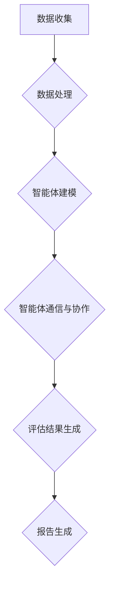
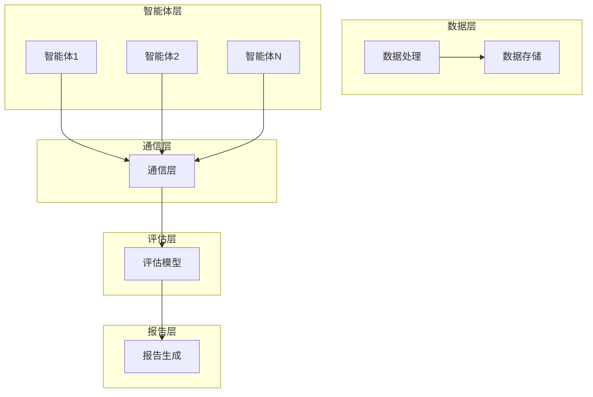
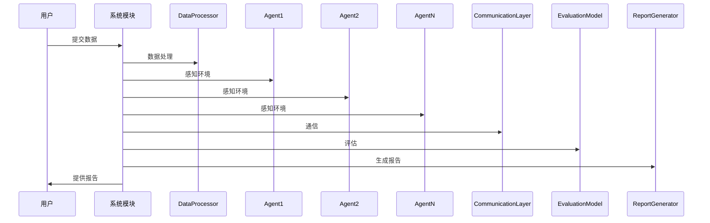

                 

### 多智能体系统与公司治理、ESG因素

#### 问题背景

**公司治理的现状与挑战**：  
公司治理是企业管理的重要组成部分，其核心在于明确公司内部权力结构、规范决策流程、保障股东权益、维护企业长远发展。然而，在当前经济环境中，公司治理面临着一系列挑战。首先，利益冲突和管理层道德风险问题较为普遍，这些问题可能导致公司决策失误、经营不善，甚至引发财务危机。其次，公司治理的透明度和公开性有待提高，信息不对称和利益输送现象仍然存在，这不仅损害了股东利益，还影响了市场对企业的信心。此外，全球化的背景下，企业面临着更加复杂多变的市场环境，如何在全球范围内优化公司治理结构，成为一项紧迫的任务。

**ESG因素的重要性**：  
ESG（Environmental, Social, and Governance）因素指的是企业在环境、社会和治理方面的表现。随着社会对可持续发展和社会责任意识的增强，ESG因素越来越受到投资者和市场的关注。环境方面，企业需要关注其生产过程中的环境影响，如碳排放、资源消耗等；社会方面，企业需考虑其与员工、客户、供应商等利益相关者的关系，如劳动条件、客户权益保护等；治理方面，企业需要确保其管理结构、流程和政策的公正性、透明性和有效性。良好的ESG表现有助于企业提升品牌形象，吸引更多投资者，同时也为企业的可持续发展提供保障。

**多智能体系统在评估公司治理和ESG因素中的应用前景**：  
多智能体系统（Multi-Agent Systems，MAS）是一种分布式计算系统，由多个智能体（agent）组成，这些智能体可以自主地感知环境、制定决策并采取行动。在评估公司治理和ESG因素方面，多智能体系统具有显著的应用潜力。首先，多智能体系统可以通过模拟不同利益相关者的行为，分析其在公司治理和ESG问题上的相互作用，提供更为全面和客观的评估结果。其次，多智能体系统可以处理海量数据，快速识别出公司治理和ESG方面的潜在问题，为管理层提供及时、准确的决策支持。此外，多智能体系统还可以通过学习和优化算法，不断提高评估的准确性和效率，为企业实现可持续发展和长期价值创造提供有力支持。

#### 问题描述

**公司治理和ESG因素的关联性**：  
公司治理和ESG因素之间存在着密切的关联。首先，良好的公司治理能够促进企业在环境、社会和治理方面的表现，从而提升ESG评级。例如，透明的决策流程和有效的风险控制机制有助于企业更好地应对环境和社会挑战，降低治理风险。其次，ESG表现也是公司治理的重要体现之一。企业若能在环境、社会和治理方面取得优异成绩，往往意味着其公司治理结构较为完善，管理效率较高。因此，评估公司治理和ESG因素需要考虑两者之间的相互作用。

**多智能体系统在评估公司治理和ESG因素中的应用场景**：  
多智能体系统在评估公司治理和ESG因素方面具有广泛的应用场景。例如，在企业内部，多智能体系统可以模拟不同管理层和利益相关者的行为，分析其在公司治理和ESG问题上的决策和互动，为企业提供科学的治理优化建议。在外部，多智能体系统可以收集和分析企业相关数据，如环境报告、社会责任报告、治理报告等，评估企业在ESG方面的表现，为投资者提供决策参考。

**需要解决的问题和挑战**：  
尽管多智能体系统在评估公司治理和ESG因素方面具有巨大潜力，但实际应用中仍面临一系列问题和挑战。首先，多智能体系统的建模和算法设计较为复杂，需要深入理解公司治理和ESG领域的知识，以便准确模拟和分析问题。其次，多智能体系统在处理海量数据时的效率问题也是一个挑战，如何优化算法，提高系统的响应速度和评估精度，是亟待解决的关键问题。此外，多智能体系统的安全性、可靠性和可扩展性也需要重点关注，以确保系统能够长期稳定运行，并为企业和投资者提供可靠的决策支持。

#### 问题解决

**多智能体系统的基本原理**：  
多智能体系统由多个智能体组成，每个智能体都是独立的计算实体，具有自主决策和行为能力。智能体之间通过通信机制进行信息交换和协作，以实现共同的目标。多智能体系统通常分为分布式智能体系统和集中式智能体系统，前者具有高度分布式和容错性，而后者则在决策速度和效率方面具有优势。

**多智能体系统在评估公司治理和ESG因素中的应用策略**：  
在评估公司治理和ESG因素时，多智能体系统可以通过以下策略来实现：

1. **智能体建模**：根据公司治理和ESG领域的专业知识，设计智能体的行为模型，模拟不同利益相关者的行为和互动。
2. **数据收集与处理**：利用大数据技术和机器学习算法，从多个数据源收集企业相关数据，如财务报表、社会责任报告、治理报告等，对数据进行清洗、整合和分析。
3. **智能体协调与决策**：通过协调算法，实现智能体之间的协作与信息共享，根据分析结果生成公司治理和ESG评估报告。

**预期效果与潜在风险**：  
预期效果包括：

1. 提高公司治理和ESG评估的准确性和效率。
2. 为企业和投资者提供科学、全面的决策支持。
3. 促进企业在环境、社会和治理方面的持续改进。

潜在风险包括：

1. 智能体建模的复杂性和不确定性，可能导致评估结果不准确。
2. 数据质量和数据源的可信度问题，可能影响评估结果的可靠性。
3. 系统的安全性和隐私保护问题，需要确保企业和投资者的信息安全。

#### 边界与外延

**多智能体系统的应用范围**：  
多智能体系统在评估公司治理和ESG因素方面的应用范围广泛，包括但不限于：

1. 企业内部治理优化。
2. 投资者决策支持。
3. 政府和监管机构的企业评级。
4. 学术研究和社会调查。

**公司治理和ESG因素的未来发展趋势**：  
未来，公司治理和ESG因素将继续受到广泛关注，其发展趋势包括：

1. 评价体系的不断完善和细化。
2. 企业社会责任意识的提升。
3. 投资者对ESG因素的重视程度不断提高。
4. 政策和法规的支持和推动。

**多智能体系统在评估公司治理和ESG因素中的应用前景**：  
随着技术的不断进步和应用的深入，多智能体系统在评估公司治理和ESG因素方面的应用前景广阔。未来，多智能体系统有望成为企业治理和ESG评估的重要工具，为企业和社会的可持续发展提供有力支持。

#### 概念结构与核心要素组成

**多智能体系统的核心概念**：

1. **智能体**：自主决策的实体，具有感知、决策和行为能力。
2. **通信机制**：智能体之间交换信息和协调行为的机制。
3. **协调算法**：实现智能体协作和决策优化的算法。
4. **评估模型**：用于评估公司治理和ESG因素的理论框架和工具。

**公司治理和ESG因素的核心要素**：

1. **公司治理**：包括决策权分配、监督机制、内部控制等。
2. **ESG因素**：包括环境、社会和治理三个方面。
3. **利益相关者**：包括股东、员工、客户、供应商等。

**多智能体系统与公司治理、ESG因素的关联性**：  
多智能体系统通过模拟不同利益相关者的行为，分析其在公司治理和ESG问题上的相互作用，实现对公司和ESG因素的评估。具体关联性包括：

1. **智能体行为与公司治理**：智能体行为反映了公司治理的实际情况和效果。
2. **智能体协作与ESG因素**：智能体协作效果体现了企业在ESG方面的表现和潜力。
3. **评估结果与公司决策**：评估结果为管理层提供科学、全面的决策支持，促进公司治理和ESG水平的提升。

#### 本章小结

本章介绍了多智能体系统在评估公司治理和ESG因素中的应用，包括问题背景、问题描述、问题解决和边界与外延等方面的内容。通过分析多智能体系统的基本原理和应用策略，明确了其在公司治理和ESG评估中的重要性和优势。同时，本章还探讨了多智能体系统与公司治理、ESG因素之间的关联性，为后续章节的理论基础和研究提供了基础。

**阅读建议**：  
读者在阅读本章时，应重点关注多智能体系统的基本原理和应用策略，以及公司治理和ESG因素的核心要素。通过理解这些内容，读者可以更好地把握多智能体系统在评估公司治理和ESG因素中的应用，为后续章节的学习打下坚实基础。

**下一步阅读指引**：  
在下一部分中，我们将深入探讨多智能体系统的理论基础，包括定义、架构、通信机制、协调策略、安全性和可靠性等方面的内容。通过这些理论基础的介绍，读者可以更好地理解多智能体系统的工作原理和应用方法，为后续的实践应用做好准备。## 第2章: 多智能体系统的基本原理

### 2.1 多智能体系统的定义

#### 2.1.1 多智能体系统的概念

多智能体系统（Multi-Agent Systems，MAS）是一种分布式计算系统，由多个智能体（agent）组成，每个智能体都是一个自主的、协作的、具有感知和行动能力的计算实体。智能体之间通过通信机制进行信息交换和协作，以实现共同的目标。

#### 2.1.2 多智能体系统的特征

1. **自主性**：智能体具有独立的行为能力和决策能力，可以自主地感知环境、制定目标和采取行动。
2. **分布性**：智能体分布在不同的计算节点上，协同工作以实现系统目标。
3. **协作性**：智能体之间通过通信机制进行信息交换和协作，共同完成任务。
4. **适应性**：智能体可以根据环境变化和系统需求自主调整行为和决策。
5. **透明性**：智能体的行为和决策过程通常对外部环境是透明的，便于分析和优化。

### 2.2 多智能体系统的架构

#### 2.2.1 多智能体系统的架构类型

多智能体系统的架构可以分为以下几种类型：

1. **分布式架构**：系统中的智能体分布在不同的计算节点上，通过网络进行通信和协作。这种架构具有高可用性和容错性，但需要复杂的通信协议和管理机制。
2. **集中式架构**：系统中的智能体集中在单个计算节点上，通过内部通信机制进行协作。这种架构简单易实现，但缺乏容错性和可扩展性。
3. **混合架构**：结合分布式和集中式架构的特点，智能体分布在多个计算节点上，部分智能体通过集中式管理进行协调。

#### 2.2.2 多智能体系统的体系结构

多智能体系统的体系结构通常包括以下几个部分：

1. **智能体层**：包含具体的智能体实例，负责感知环境、制定决策和执行动作。
2. **通信层**：负责智能体之间的通信和消息传递，确保系统内信息的高效流通。
3. **协作层**：提供智能体协作的框架和工具，实现智能体之间的协调和合作。
4. **管理层**：负责智能体系统的配置、调度和监控，确保系统的稳定运行。

### 2.3 多智能体系统的通信机制

#### 2.3.1 通信机制的基本概念

多智能体系统的通信机制是智能体之间交换信息和协调行为的基础。通信机制可以分为以下几种类型：

1. **异步通信**：智能体之间的消息传递不要求实时响应，消息可以存储在队列中，等待智能体处理。
2. **同步通信**：智能体之间的消息传递要求实时响应，发送方必须等待接收方的消息处理完毕后才能继续执行。
3. **直接通信**：智能体通过直接通信接口发送消息，消息直接传递给目标智能体。
4. **间接通信**：智能体通过一个中介实体（如黑板）发送消息，中介实体负责将消息转发给目标智能体。

#### 2.3.2 通信机制的类型

常见的多智能体系统通信机制包括：

1. **面向对象通信**：基于面向对象编程模型，智能体通过对象接口进行通信，消息传递基于方法调用。
2. **事件驱动通信**：智能体通过事件监听和事件发布机制进行通信，事件可以在系统内传播，触发相应的处理逻辑。
3. **黑板通信**：智能体通过一个集中的共享存储结构（黑板）进行通信，黑板上的数据可以被多个智能体读取和写入。
4. **分布式共享内存**：智能体通过共享内存空间进行通信，类似于进程间的直接通信，但适用于分布式计算环境。

#### 2.3.3 通信机制的应用

多智能体系统的通信机制在多种应用场景中发挥作用，例如：

1. **协同任务执行**：智能体通过通信机制共享任务信息，协作完成任务。
2. **决策支持**：智能体通过通信机制交换分析结果，为系统决策提供支持。
3. **故障检测和恢复**：智能体通过通信机制监控系统状态，及时发现和处理故障。
4. **资源分配**：智能体通过通信机制协调资源使用，优化资源分配策略。

### 2.4 多智能体系统的协调策略

#### 2.4.1 协调策略的概念

协调策略是确保多智能体系统能够协同工作，有效实现系统目标的方法和原则。协调策略可以分为以下几种类型：

1. **中央协调**：由一个中央协调实体负责系统的全局决策和资源分配。
2. **分布式协调**：智能体之间通过协商和协调机制自主决策，实现系统的全局目标。
3. **混合协调**：结合中央协调和分布式协调的优点，根据不同场景选择合适的协调策略。

#### 2.4.2 协调策略的类型

常见的协调策略包括：

1. **市场机制**：智能体通过模拟市场行为进行资源分配和任务调度。
2. **协商机制**：智能体通过协商和谈判机制协调行动，达成共识。
3. **博弈论**：智能体通过博弈论模型分析对手行为，制定最佳策略。
4. **演化算法**：通过模拟自然进化过程，智能体不断优化协调策略。

#### 2.4.3 协调策略的应用

协调策略在多种应用场景中发挥作用，例如：

1. **多机器人系统**：通过协调策略实现机器人间的协同作业，提高工作效率。
2. **分布式计算**：通过协调策略优化任务分配和资源使用，提高系统性能。
3. **供应链管理**：通过协调策略优化供应链网络，提高供应链的响应速度和灵活性。
4. **智能交通系统**：通过协调策略优化交通流量，缓解交通拥堵问题。

### 2.5 多智能体系统的安全性和可靠性

#### 2.5.1 安全性的基本概念

多智能体系统的安全性是指系统在面临各种攻击、恶意行为或异常情况时，能够保持正常运行和完整性的能力。安全性包括以下几个方面：

1. **隐私保护**：确保智能体的行为和通信过程不会被恶意攻击者窃取或篡改。
2. **数据完整性**：确保系统中的数据不会被未经授权的实体修改或删除。
3. **访问控制**：确保只有授权的实体才能访问系统的资源和功能。
4. **抗攻击性**：系统能够抵御各种恶意攻击，如拒绝服务攻击、病毒感染等。

#### 2.5.2 安全性的挑战

多智能体系统在安全性方面面临以下挑战：

1. **恶意智能体**：恶意智能体可能试图破坏系统、窃取信息或操纵系统行为。
2. **通信泄露**：智能体之间的通信可能被窃听或篡改，导致信息泄露或错误。
3. **分布式攻击**：分布式攻击可能通过多个智能体共同作用，对系统造成严重破坏。
4. **动态环境**：智能体在动态环境中面临各种不确定性和风险，需要具备较强的抗攻击能力。

#### 2.5.3 安全性的解决方案

为应对多智能体系统的安全性挑战，可以采取以下解决方案：

1. **加密技术**：采用加密技术保护智能体之间的通信，确保通信内容不会被窃取或篡改。
2. **身份认证**：对智能体进行身份认证，确保只有授权的实体才能访问系统资源和功能。
3. **访问控制**：建立完善的访问控制机制，限制未经授权的实体对系统资源的访问。
4. **安全监控与检测**：实时监控系统的安全状态，及时发现和处理异常情况，防止恶意行为和攻击。
5. **抗攻击算法**：设计具备较强抗攻击能力的算法，提高智能体在面对攻击时的生存能力和抗攻击性。

### 2.6 本章小结

本章介绍了多智能体系统的基本原理，包括定义、架构、通信机制、协调策略、安全性和可靠性等方面的内容。通过本章的学习，读者可以了解多智能体系统的基本概念和特点，掌握其架构和通信机制，理解协调策略和安全性的重要性。这些基础知识将为后续章节中多智能体系统在评估公司治理和ESG因素中的应用提供理论支持。

**阅读建议**：  
读者在阅读本章时，应重点关注多智能体系统的基本原理和核心概念，理解其架构、通信机制、协调策略和安全性的关键要素。通过掌握这些内容，读者可以为后续章节中多智能体系统在评估公司治理和ESG因素中的应用打下坚实的基础。

**下一步阅读指引**：  
在下一部分中，我们将深入探讨公司治理的基本概念，包括定义、结构和机制等方面的内容。通过理解公司治理的核心要素，读者可以更好地理解多智能体系统在评估公司治理和ESG因素中的应用场景。## 第3章: 公司治理的基本概念

### 3.1 公司治理的定义

#### 3.1.1 公司治理的概念

公司治理是指一套组织、制度和程序，用于指导公司的管理行为，确保公司目标的实现，同时保障股东、员工、客户和其他利益相关者的权益。公司治理不仅涉及公司内部的权力结构和决策机制，还关注公司的行为规范和社会责任。

#### 3.1.2 公司治理的目标

公司治理的主要目标包括：

1. **提高企业绩效**：通过有效的公司治理结构和管理机制，提高企业的运营效率和竞争力。
2. **保护股东权益**：确保股东的合法权益得到保护，提高股东的投资回报。
3. **增强企业透明度**：提高公司运作的透明度和信息公开程度，增强市场对公司的信任。
4. **实现可持续发展**：通过关注环境、社会和治理（ESG）因素，推动企业的可持续发展。
5. **风险管理**：建立有效的风险控制机制，降低企业运营中的风险。

### 3.2 公司治理的结构

#### 3.2.1 公司治理的机构

公司治理的机构主要包括以下几个部分：

1. **董事会**：董事会对公司的战略方向和重大决策负责，代表股东利益。
2. **监事会**：监事会对董事会和高级管理层的行为进行监督，确保公司合规运营。
3. **高级管理层**：高级管理层负责公司的日常运营，执行董事会的决策。
4. **股东**：股东是公司的所有者，通过股东大会行使决策权和监督权。
5. **员工**：员工参与公司治理，通过工会或其他形式维护自身权益。

#### 3.2.2 公司治理的职能

公司治理的主要职能包括：

1. **战略规划**：制定公司长期发展战略，确保公司目标的实现。
2. **决策制定**：对公司重大事项进行决策，包括投资、融资、并购等。
3. **风险管理**：识别、评估和应对公司面临的各种风险。
4. **监督执行**：监督高级管理层的工作，确保决策得到有效执行。
5. **信息公开**：及时、准确地披露公司信息，保障股东的知情权。

### 3.3 公司治理的机制

#### 3.3.1 公司治理的制度

公司治理的制度包括以下几个方面的内容：

1. **公司章程**：规定公司的基本组织架构、权力分配和决策程序。
2. **股东大会**：最高权力机构，负责选举董事和监事，审议和批准公司重大事项。
3. **董事会会议**：董事会定期召开会议，讨论和决定公司重大事项。
4. **监事会会议**：监事会定期召开会议，监督董事会和高级管理层的工作。
5. **信息披露制度**：规定公司信息披露的内容、形式和程序，保障股东的知情权。

#### 3.3.2 公司治理的流程

公司治理的流程主要包括以下几个步骤：

1. **战略制定**：公司管理层制定公司长期发展战略。
2. **决策审批**：战略方案提交董事会和股东大会审批。
3. **执行落实**：高级管理层执行董事会和股东大会的决策，确保战略的实施。
4. **监督评价**：监事会对高级管理层的工作进行监督和评价，提出改进建议。
5. **信息披露**：公司定期披露经营状况、财务数据和重大事项，保障股东的知情权。

### 3.4 公司治理的挑战与趋势

#### 3.4.1 公司治理的挑战

当前公司治理面临以下几个方面的挑战：

1. **利益冲突**：管理层与股东、员工、客户等利益相关者之间存在利益冲突，需要平衡不同利益方的权益。
2. **信息不对称**：管理层和股东之间存在信息不对称，股东难以全面了解公司的运营状况。
3. **透明度不足**：部分公司的信息公开程度较低，透明度不足，影响市场对公司的信任。
4. **环境和社会责任**：随着社会对ESG因素的重视，企业需要更加关注环境和社会责任，提高治理水平。
5. **全球化和数字化**：全球化背景下，企业需要面对更加复杂多变的市场环境，同时数字化技术的应用也对公司治理提出了新的挑战。

#### 3.4.2 公司治理的趋势

公司治理的发展趋势包括以下几个方面：

1. **加强董事会和监事会的功能**：提高董事会和监事会的独立性和专业性，强化其监督和决策职能。
2. **完善信息披露制度**：提高公司信息披露的透明度和准确性，增强市场对公司的信任。
3. **关注环境和社会责任**：将ESG因素纳入公司治理框架，推动企业的可持续发展。
4. **应用数字化技术**：利用大数据、人工智能等技术提升公司治理的效率和效果。
5. **国际化和标准化**：遵循国际标准，加强跨国公司的公司治理，推动全球公司治理的协同发展。

### 3.5 本章小结

本章介绍了公司治理的基本概念，包括定义、结构和机制等方面的内容。通过理解公司治理的核心要素，读者可以更好地认识公司治理的重要性，以及其面临的挑战和发展趋势。公司治理是企业管理的重要组成部分，对于企业的长期发展和社会责任具有重要意义。

**阅读建议**：  
读者在阅读本章时，应重点关注公司治理的定义、目标和结构，以及治理的机制和挑战。通过深入理解这些内容，读者可以更好地把握公司治理的基本原则和实际应用。

**下一步阅读指引**：  
在下一部分中，我们将深入探讨ESG因素的基本概念，包括ESG的定义、重要性和评估方法等方面的内容。通过理解ESG因素，读者可以更好地理解公司治理和ESG因素之间的关联性，以及多智能体系统在评估ESG因素中的应用。## 第4章: ESG因素的基本概念

### 4.1 ESG因素的定义

#### 4.1.1 ESG因素的概念

ESG（Environmental, Social, and Governance）因素是指企业在环境、社会和治理三个方面表现的具体指标。这些指标不仅反映了企业的社会责任，还关系到企业的可持续发展能力和市场竞争力。

1. **环境（Environmental）**：涉及企业的环境保护行为，如能源消耗、碳排放、资源管理、废物处理等。
2. **社会（Social）**：关注企业与社会的关系，包括员工权益、消费者权益、社区参与、产品责任等。
3. **治理（Governance）**：涉及企业的内部治理结构、管理效率、透明度、风险控制等。

#### 4.1.2 ESG因素的重要性

ESG因素在全球范围内越来越受到重视，主要原因包括：

1. **可持续发展**：ESG因素是企业实现长期可持续发展的关键，有助于减少环境和社会风险。
2. **企业形象**：良好的ESG表现有助于提升企业的社会形象和品牌价值，增强市场竞争力。
3. **投资者关注**：越来越多的投资者开始将ESG因素纳入投资决策，良好的ESG表现是吸引投资者的重要因素。
4. **法律法规**：各国政府逐步加强对企业ESG表现的监管，企业需要遵守相关法律法规，以降低合规风险。

### 4.2 ESG因素的构成

#### 4.2.1 ESG因素的分类

ESG因素可以根据其内容和重要性进行分类，常见的分类方法包括：

1. **环境因素**：包括能源消耗、碳排放、水资源管理、废弃物处理、污染防治等。
2. **社会因素**：包括员工权益、客户权益、社区关系、供应链管理、产品责任等。
3. **治理因素**：包括公司治理结构、管理效率、风险控制、透明度、利益相关者沟通等。

#### 4.2.2 ESG因素的关联性

ESG因素之间存在密切的关联性，具体表现在：

1. **环境和社会**：环境保护有助于提升企业社会责任感，而社会责任的履行也可以促进环境保护。
2. **治理和环境**：良好的治理结构有助于企业识别和应对环境风险，推动环保措施的实施。
3. **治理和社会**：有效的治理能够保障员工权益，提高员工的工作满意度和生产力，从而促进企业的社会责任履行。

### 4.3 ESG因素的评估

#### 4.3.1 ESG因素评估的方法

ESG因素的评估方法主要包括以下几种：

1. **自我评估**：企业自行评估其ESG表现，通过内部调查、数据分析等方式，了解自身在环境、社会和治理方面的优势和不足。
2. **第三方评估**：由独立的第三方机构对企业的ESG表现进行评估，提供客观、全面的评估报告。
3. **ESG评级**：通过对企业的ESG表现进行量化评估，给出相应的评级，如AA、A、B等。
4. **利益相关者反馈**：收集利益相关者（如股东、员工、客户、社区等）对企业ESG表现的反馈，了解其对企业的影响。

#### 4.3.2 ESG因素评估的标准和指标

ESG因素的评估标准和指标因不同行业和地区而异，但一般包括以下几个方面：

1. **环境指标**：包括能源消耗、碳排放、水资源使用、废弃物处理等。
2. **社会指标**：包括员工权益、劳动条件、产品责任、社区参与等。
3. **治理指标**：包括公司治理结构、风险管理、透明度、利益相关者沟通等。

#### 4.3.3 ESG因素评估的报告

企业通常需要定期发布ESG报告，报告内容包括：

1. **ESG表现概述**：总结企业在环境、社会和治理方面的主要成就和挑战。
2. **评估方法和指标**：详细说明评估所使用的方法和指标，确保报告的可比性和透明度。
3. **改进计划和目标**：描述企业在未来一段时间内计划采取的ESG改进措施和目标。
4. **利益相关者反馈**：报告利益相关者对企业ESG表现的反馈和建议。

### 4.4 本章小结

本章介绍了ESG因素的基本概念，包括定义、重要性和评估方法等方面的内容。通过理解ESG因素，读者可以认识到其在企业可持续发展中的重要性，以及评估ESG因素的方法和指标。企业需要关注ESG因素，通过有效的管理和改进，提升自身的社会责任感和可持续发展能力。

**阅读建议**：  
读者在阅读本章时，应重点关注ESG因素的定义和分类，以及评估方法和指标。通过深入理解这些内容，读者可以更好地把握ESG因素在企业治理中的实际应用。

**下一步阅读指引**：  
在下一部分中，我们将探讨多智能体系统在评估公司治理和ESG因素中的应用，包括多智能体系统的基本原理、应用策略和预期效果等内容。通过这部分的学习，读者可以了解多智能体系统如何帮助企业和投资者更好地理解和评估公司治理和ESG因素。## 第5章: 多智能体系统在评估公司治理和ESG因素中的应用

### 5.1 多智能体系统在评估公司治理和ESG因素中的重要性

随着企业社会责任和可持续发展的日益重视，评估公司治理（Corporate Governance）和环境、社会及治理（Environmental, Social, and Governance，简称ESG）因素已成为投资者、监管机构和社会各界关注的焦点。然而，传统的评估方法往往面临数据复杂度高、评估效率低、透明度不足等挑战。多智能体系统（Multi-Agent Systems，MAS）作为一种先进的人工智能技术，在解决这些问题方面具有显著优势。

多智能体系统通过模拟不同利益相关者的行为和互动，能够提供更全面、客观的评估结果。智能体作为自主决策的实体，能够感知环境、制定目标和采取行动，这使得多智能体系统能够模拟公司治理和ESG因素中的复杂关系和动态变化。此外，多智能体系统具备分布式计算和协同工作的能力，能够处理海量数据，提高评估的效率和精度。因此，多智能体系统在评估公司治理和ESG因素方面具有重要应用价值。

### 5.2 多智能体系统在评估公司治理和ESG因素中的应用策略

为了有效地利用多智能体系统评估公司治理和ESG因素，可以采取以下策略：

#### 5.2.1 智能体建模

首先，需要根据公司治理和ESG领域的专业知识，设计不同类型的智能体，包括股东、董事、监事、管理层、员工、客户、供应商等。每个智能体都应具有特定的行为模型，能够自主感知环境、制定目标和采取行动。例如，股东智能体可以关注股票价格、公司业绩等指标，制定投资决策；员工智能体可以关注工作条件、职业发展等指标，制定职业规划。

#### 5.2.2 数据收集与处理

多智能体系统需要从多个数据源收集企业相关数据，如财务报表、社会责任报告、治理报告、新闻资讯、社交媒体等。这些数据应经过清洗、整合和分析，以便为智能体提供准确的信息支持。在此过程中，可以运用大数据技术和机器学习算法，识别和提取关键信息，提高数据处理效率。

#### 5.2.3 智能体协调与决策

在评估过程中，不同智能体需要通过通信机制进行信息交换和协作。智能体之间可以采用协商机制、市场机制等协调策略，共同制定决策。例如，股东智能体和管理层智能体可以协商确定公司投资计划；员工智能体和客户智能体可以共同讨论改善员工福利和客户服务的问题。

#### 5.2.4 评估结果生成

基于智能体的决策和互动，多智能体系统可以生成企业治理和ESG评估报告。报告应包含企业的整体表现、关键问题分析、改进建议等内容。评估报告应具有较高的透明度和可靠性，能够为管理层、投资者和监管机构提供科学、全面的决策支持。

### 5.3 预期效果与潜在风险

#### 5.3.1 预期效果

多智能体系统在评估公司治理和ESG因素方面具有以下预期效果：

1. **提高评估精度**：通过模拟不同利益相关者的行为，多智能体系统能够更全面、客观地反映企业治理和ESG表现，提高评估精度。
2. **提升评估效率**：多智能体系统的分布式计算和协同工作能力，能够快速处理海量数据，提升评估效率。
3. **增强透明度**：多智能体系统的评估过程和结果具有较高的透明度，有助于提升企业治理和ESG评估的公信力。
4. **支持决策制定**：评估报告为管理层、投资者和监管机构提供了科学、全面的决策支持，有助于企业制定改进措施和长期发展战略。

#### 5.3.2 潜在风险

尽管多智能体系统在评估公司治理和ESG因素方面具有显著优势，但实际应用中仍面临以下潜在风险：

1. **建模复杂度高**：智能体建模需要深入理解公司治理和ESG领域的专业知识，否则可能导致评估结果不准确。
2. **数据质量和数据源可信度**：评估结果依赖于高质量的数据，数据质量和数据源的可信度可能影响评估的准确性。
3. **系统安全性**：多智能体系统需要确保其安全性，防止恶意攻击和数据泄露，保障企业和投资者的信息安全。
4. **算法优化难度**：多智能体系统的算法设计复杂，需要不断优化和调整，以确保评估结果的可靠性和稳定性。

### 5.4 实际应用案例分析

#### 5.4.1 案例背景

某大型跨国公司希望通过多智能体系统评估其公司治理和ESG表现，以提升企业可持续发展能力。该公司在全球范围内运营，涉及多个行业，拥有众多利益相关者，数据来源广泛。

#### 5.4.2 应用过程

1. **智能体建模**：根据公司治理和ESG领域的知识，设计包括股东、董事、监事、管理层、员工、客户、供应商等智能体。每个智能体具有特定的行为模型，能够模拟其在公司治理和ESG问题上的决策和行为。

2. **数据收集与处理**：从公司的财务报表、社会责任报告、治理报告、新闻资讯、社交媒体等数据源收集相关数据，经过清洗、整合和分析，为智能体提供准确的信息支持。

3. **智能体协调与决策**：智能体之间通过通信机制进行信息交换和协作。例如，股东智能体和管理层智能体协商确定公司的投资计划；员工智能体和客户智能体共同讨论改善员工福利和客户服务的问题。

4. **评估结果生成**：基于智能体的决策和互动，多智能体系统生成企业治理和ESG评估报告。报告内容包括企业的整体表现、关键问题分析、改进建议等，为管理层、投资者和监管机构提供科学、全面的决策支持。

#### 5.4.3 案例效果

通过多智能体系统评估，该公司发现了一系列公司治理和ESG方面的潜在问题，如环境风险、员工权益保护不足、客户满意度不高等。基于评估结果，公司制定了一系列改进措施，如加强环境管理、提高员工福利、优化客户服务体验等。这些措施不仅提升了公司的可持续发展能力，也增强了投资者和市场的信心。

### 5.5 本章小结

本章介绍了多智能体系统在评估公司治理和ESG因素中的应用策略和预期效果，以及实际应用案例分析。通过理解多智能体系统的优势和应用方法，读者可以认识到其在提升企业治理和ESG评估精度和效率方面的潜力。然而，实际应用中仍需注意潜在风险，不断优化和改进智能体建模、数据收集处理和系统安全性，以实现评估结果的可靠性和稳定性。

**阅读建议**：  
读者在阅读本章时，应重点关注多智能体系统在评估公司治理和ESG因素中的应用策略、预期效果和实际案例分析。通过深入理解这些内容，读者可以更好地把握多智能体系统在企业可持续发展中的实际应用。

**下一步阅读指引**：  
在下一部分中，我们将进一步探讨多智能体系统在评估公司治理和ESG因素中的具体应用，包括系统架构、数据流程和算法原理等方面的内容。通过这些深入讨论，读者可以更全面地了解多智能体系统在提升企业治理和ESG评估方面的作用。## 第6章: 多智能体系统在评估公司治理和ESG因素中的具体应用

### 6.1 多智能体系统的具体应用场景

多智能体系统在评估公司治理和ESG因素方面具有广泛的应用场景。以下是一些具体的应用场景：

1. **企业内部治理优化**：通过模拟不同管理层和利益相关者的行为，多智能体系统可以帮助企业识别公司治理中的问题和瓶颈，提出优化建议。

2. **投资者决策支持**：多智能体系统可以收集和分析企业相关数据，评估企业在环境、社会和治理方面的表现，为投资者提供投资决策支持。

3. **监管机构评估**：多智能体系统可以协助监管机构评估企业遵守相关法律法规和ESG标准的情况，提供科学、全面的监管依据。

4. **学术研究**：多智能体系统为学术研究提供了有力的工具，可以用于探索公司治理和ESG因素之间的关系，为理论研究提供数据支持。

### 6.2 多智能体系统在评估公司治理和ESG因素中的系统架构

为了实现多智能体系统在评估公司治理和ESG因素中的功能，需要设计合理的系统架构。以下是一个典型的系统架构：

1. **智能体层**：包括各种类型的智能体，如股东智能体、董事智能体、管理层智能体、员工智能体、客户智能体等。每个智能体具有特定的行为模型和决策规则。

2. **通信层**：负责智能体之间的消息传递和通信。通信层可以采用异步通信、同步通信等方式，确保智能体之间的高效协作。

3. **数据层**：存储和管理企业相关数据，包括财务数据、社会责任报告、治理报告、新闻资讯、社交媒体数据等。数据层可以通过大数据技术和数据库管理系统实现数据的存储、检索和分析。

4. **协调层**：协调智能体之间的协作和决策，确保系统整体目标的实现。协调层可以采用协商机制、市场机制等协调策略。

5. **评估层**：根据智能体的决策和互动，生成企业治理和ESG评估报告。评估层可以采用量化评估方法、主观评估方法等，提供全面、客观的评估结果。

6. **界面层**：提供用户界面，供用户查看评估结果、调整系统参数等。界面层可以采用Web界面、桌面应用等形式，方便用户使用。

### 6.3 多智能体系统的数据流程

多智能体系统的数据流程主要包括以下几个步骤：

1. **数据收集**：从企业内部和外部数据源收集相关数据，如财务报表、社会责任报告、治理报告、新闻资讯、社交媒体数据等。

2. **数据预处理**：对收集到的数据进行清洗、去重、归一化等预处理操作，确保数据的质量和一致性。

3. **数据存储**：将预处理后的数据存储在数据库中，以便后续分析和处理。

4. **数据分析和处理**：利用大数据技术和机器学习算法，对存储的数据进行深入分析，提取关键信息，为智能体提供信息支持。

5. **数据交换和共享**：智能体之间通过通信层进行数据交换和共享，实现信息的高效流通。

6. **评估结果生成**：基于智能体的决策和互动，生成企业治理和ESG评估报告。

### 6.4 多智能体系统的算法原理

多智能体系统在评估公司治理和ESG因素中，需要采用一系列算法来模拟智能体的行为、协调智能体之间的互动和生成评估报告。以下是一些关键的算法原理：

1. **智能体行为模型**：根据公司治理和ESG领域的知识，设计智能体的行为模型。行为模型可以采用基于规则的模型、基于机器学习的模型等。

2. **通信机制**：智能体之间的通信机制可以采用异步通信、同步通信等方式。通信机制需要确保消息的及时传递、可靠性和安全性。

3. **协调算法**：协调算法用于实现智能体之间的协作和决策。常见的协调算法包括协商机制、市场机制、博弈论机制等。

4. **评估算法**：评估算法用于对企业的治理和ESG表现进行量化评估。评估算法可以采用主观评估方法、客观评估方法、综合评估方法等。

5. **学习与优化算法**：通过学习与优化算法，多智能体系统可以根据历史数据不断改进智能体的行为模型、协调算法和评估算法，提高评估的精度和效率。

### 6.5 多智能体系统的具体实现

为了实现多智能体系统在评估公司治理和ESG因素中的功能，需要编写相应的程序代码。以下是一个基于Python的简单实现示例：

```python
# 智能体类定义
class Agent:
    def __init__(self, behavior_model, communication Mechanism):
        self.behavior_model = behavior_model
        self.communication_Mechanism = communication_Mechanism
    
    def perceive_environment(self):
        # 感知环境
        pass
    
    def make_decision(self):
        # 制定决策
        pass
    
    def take_action(self):
        # 执行动作
        pass

# 多智能体系统类定义
class MultiAgentSystem:
    def __init__(self, agents, coordination_algorithm, assessment_algorithm):
        self.agents = agents
        self.coordination_algorithm = coordination_algorithm
        self.assessment_algorithm = assessment_algorithm
    
    def run(self):
        # 运行多智能体系统
        pass
    
    def generate_evaluation_report(self):
        # 生成评估报告
        pass

# 主程序
if __name__ == "__main__":
    # 初始化智能体
    agent1 = Agent(behavior_model="规则模型", communication_Mechanism="异步通信")
    agent2 = Agent(behavior_model="机器学习模型", communication_Mechanism="同步通信")
    
    # 初始化多智能体系统
    mas = MultiAgentSystem(
        agents=[agent1, agent2],
        coordination_algorithm="协商机制",
        assessment_algorithm="量化评估方法"
    )
    
    # 运行多智能体系统
    mas.run()
    
    # 生成评估报告
    report = mas.generate_evaluation_report()
    print(report)
```

### 6.6 本章小结

本章详细介绍了多智能体系统在评估公司治理和ESG因素中的具体应用，包括应用场景、系统架构、数据流程、算法原理和具体实现。通过理解这些内容，读者可以更好地把握多智能体系统在提升企业治理和ESG评估方面的作用，为实际应用提供理论基础和实践指导。

**阅读建议**：  
读者在阅读本章时，应重点关注多智能体系统的具体应用场景、系统架构、数据流程和算法原理。通过深入理解这些内容，读者可以更好地掌握多智能体系统在评估公司治理和ESG因素中的实际应用方法。

**下一步阅读指引**：  
在下一部分中，我们将进一步探讨多智能体系统在评估公司治理和ESG因素中的案例分析，通过具体实例分析多智能体系统的实际应用效果和改进方向。## 第7章: 多智能体系统在评估公司治理和ESG因素中的应用案例分析

### 7.1 案例背景

本章节将通过两个实际案例，深入分析多智能体系统在评估公司治理和ESG因素中的具体应用。这两个案例分别来自金融科技领域和传统制造业，以展示多智能体系统在不同行业中的应用效果和改进方向。

#### 案例一：金融科技公司

某金融科技公司希望通过多智能体系统对其公司治理和ESG因素进行全面评估，以提高企业的社会责任感和可持续发展能力。该公司在金融科技领域具有领先地位，提供多种金融服务，如在线支付、借贷、投资等。其业务涵盖了全球多个市场，拥有大量的客户和合作伙伴。

#### 案例二：传统制造业

某大型传统制造企业也希望通过多智能体系统对其公司治理和ESG因素进行评估，以应对日益严格的环保法规和消费者对社会责任的关注。该企业主要从事机械设备的生产和销售，业务遍及全球，拥有大量的员工和供应链合作伙伴。

### 7.2 案例一：金融科技公司的应用分析

#### 7.2.1 应用过程

1. **智能体建模**：根据公司治理和ESG领域的知识，设计了股东智能体、董事智能体、管理层智能体、员工智能体、客户智能体、供应商智能体等。每个智能体都具有特定的行为模型，能够模拟其在公司治理和ESG问题上的决策和行为。

2. **数据收集与处理**：从公司的财务报表、社会责任报告、治理报告、新闻资讯、社交媒体等数据源收集相关数据，经过清洗、整合和分析，为智能体提供准确的信息支持。

3. **智能体协调与决策**：智能体之间通过通信机制进行信息交换和协作。例如，股东智能体和管理层智能体协商确定公司的投资计划；员工智能体和客户智能体共同讨论改善员工福利和客户服务的问题。

4. **评估结果生成**：基于智能体的决策和互动，多智能体系统生成公司治理和ESG评估报告。报告内容包括公司的整体表现、关键问题分析、改进建议等，为管理层、投资者和监管机构提供科学、全面的决策支持。

#### 7.2.2 应用效果

1. **提高评估精度**：通过模拟不同利益相关者的行为，多智能体系统提供了更全面、客观的评估结果，有助于识别公司在治理和ESG方面的优势和不足。

2. **提升评估效率**：多智能体系统的分布式计算和协同工作能力，使得评估过程更加高效，能够在较短的时间内完成复杂的评估任务。

3. **增强透明度**：评估报告的生成过程和结果具有较高的透明度，有助于提升公司治理和ESG评估的公信力。

4. **支持决策制定**：评估报告为管理层提供了科学、全面的决策支持，有助于公司制定改进措施和长期发展战略。

#### 7.2.3 改进方向

1. **优化智能体建模**：进一步优化智能体的行为模型，提高模拟的准确性和可靠性。

2. **提高数据质量**：确保数据收集和处理的准确性和完整性，提高评估的精度。

3. **增强系统安全性**：确保多智能体系统的安全性，防止恶意攻击和数据泄露。

4. **优化评估算法**：根据评估结果，不断优化和改进评估算法，提高评估的效率和准确性。

### 7.3 案例二：传统制造企业的应用分析

#### 7.3.1 应用过程

1. **智能体建模**：设计了股东智能体、董事智能体、管理层智能体、员工智能体、客户智能体、供应商智能体等。每个智能体都具有特定的行为模型，能够模拟其在公司治理和ESG问题上的决策和行为。

2. **数据收集与处理**：从公司的财务报表、社会责任报告、治理报告、新闻资讯、社交媒体等数据源收集相关数据，经过清洗、整合和分析，为智能体提供准确的信息支持。

3. **智能体协调与决策**：智能体之间通过通信机制进行信息交换和协作。例如，股东智能体和管理层智能体协商确定公司的投资计划；员工智能体和客户智能体共同讨论改善员工福利和客户服务的问题。

4. **评估结果生成**：基于智能体的决策和互动，多智能体系统生成公司治理和ESG评估报告。报告内容包括公司的整体表现、关键问题分析、改进建议等，为管理层、投资者和监管机构提供科学、全面的决策支持。

#### 7.3.2 应用效果

1. **提高评估精度**：多智能体系统提供了更全面、客观的评估结果，有助于识别公司在治理和ESG方面的优势和不足。

2. **提升评估效率**：多智能体系统的分布式计算和协同工作能力，使得评估过程更加高效。

3. **增强透明度**：评估报告的生成过程和结果具有较高的透明度，有助于提升公司治理和ESG评估的公信力。

4. **支持决策制定**：评估报告为管理层提供了科学、全面的决策支持，有助于公司制定改进措施和长期发展战略。

#### 7.3.3 改进方向

1. **优化智能体建模**：进一步优化智能体的行为模型，提高模拟的准确性和可靠性。

2. **提高数据质量**：确保数据收集和处理的准确性和完整性，提高评估的精度。

3. **增强系统安全性**：确保多智能体系统的安全性，防止恶意攻击和数据泄露。

4. **优化评估算法**：根据评估结果，不断优化和改进评估算法，提高评估的效率和准确性。

### 7.4 本章小结

通过两个实际案例的分析，本章展示了多智能体系统在评估公司治理和ESG因素中的具体应用效果和改进方向。金融科技公司和传统制造企业都通过多智能体系统实现了更高效、准确的评估，为企业的决策提供了科学支持。同时，也指出了一些改进方向，包括智能体建模、数据质量、系统安全性和评估算法等方面。

**阅读建议**：  
读者在阅读本章时，应重点关注两个实际案例的应用过程、效果和改进方向。通过深入分析这些案例，读者可以更好地理解多智能体系统在评估公司治理和ESG因素中的实际应用，为后续研究和实践提供参考。

**下一步阅读指引**：  
在下一部分中，我们将讨论多智能体系统在评估公司治理和ESG因素中的最佳实践，分享一些成功经验和技术技巧，为读者提供有益的参考。同时，也会探讨多智能体系统应用中可能遇到的问题和挑战，以及相应的解决策略。## 第8章: 多智能体系统在评估公司治理和ESG因素中的最佳实践

### 8.1 多智能体系统的最佳实践

在评估公司治理和ESG因素方面，多智能体系统已经展现出显著的优势。以下是一些成功案例和最佳实践，供读者参考：

#### 8.1.1 案例一：某全球知名金融机构

该金融机构通过多智能体系统对其全球范围内的业务进行了公司治理和ESG评估。智能体包括股东、董事、管理层、员工、客户、监管机构等。系统从多个数据源（如财务报表、社会责任报告、新闻资讯等）收集数据，经过清洗、整合和分析，生成了详细的评估报告。报告内容涵盖公司的整体表现、关键问题、改进建议等。通过这个评估，公司不仅发现了潜在的风险，还制定了一系列改进措施，如加强环境保护、提高员工福利、优化客户服务体验等。

#### 8.1.2 案例二：某大型跨国制造企业

该制造企业利用多智能体系统对其全球运营进行了ESG评估。系统模拟了股东、董事、管理层、员工、客户、供应商等不同利益相关者的行为，分析了公司治理和ESG表现对业务的影响。评估报告提供了公司在环境、社会和治理方面的详细数据，以及改进建议。通过这个评估，企业识别出了一些环境和社会风险，如碳排放、劳动条件等，并采取相应措施进行改进。

#### 8.1.3 案例三：某投资机构

该投资机构利用多智能体系统对潜在投资目标进行了ESG评估。智能体包括投资者、管理层、员工、客户等。系统从多个数据源（如社会责任报告、治理报告、新闻资讯等）收集数据，经过分析后，提供了投资目标在环境、社会和治理方面的表现评估。这个评估帮助投资机构做出了更明智的投资决策，避免了潜在的投资风险。

### 8.2 技术技巧

在应用多智能体系统进行公司治理和ESG评估时，以下技术技巧可以帮助提高评估的准确性和效率：

1. **智能体建模**：根据公司治理和ESG领域的知识，设计具有代表性的智能体模型。确保智能体能够真实反映不同利益相关者的行为和决策。

2. **数据收集与处理**：采用高效的数据收集和处理方法，如大数据技术和机器学习算法。确保数据的准确性和完整性，提高评估的精度。

3. **通信机制**：选择合适的通信机制，如异步通信或同步通信，确保智能体之间能够高效、可靠地交换信息。

4. **协调算法**：选择合适的协调算法，如协商机制或市场机制，实现智能体之间的有效协作。

5. **评估算法**：选择合适的评估算法，如量化评估方法或主观评估方法，提供全面、客观的评估结果。

6. **优化算法**：利用优化算法，如遗传算法或粒子群优化算法，不断改进智能体模型、协调算法和评估算法，提高评估的效率和准确性。

### 8.3 可能遇到的问题和挑战

尽管多智能体系统在评估公司治理和ESG因素方面具有显著优势，但在实际应用中仍可能遇到以下问题和挑战：

1. **建模复杂度**：智能体建模需要深入理解公司治理和ESG领域的专业知识，否则可能导致评估结果不准确。

2. **数据质量和数据源**：评估结果依赖于高质量的数据，数据质量和数据源的可信度可能影响评估的准确性。

3. **系统安全性**：多智能体系统需要确保其安全性，防止恶意攻击和数据泄露。

4. **算法优化**：多智能体系统的算法设计复杂，需要不断优化和调整，以确保评估结果的可靠性和稳定性。

### 8.4 解决策略

为了应对上述问题和挑战，可以采取以下解决策略：

1. **专业培训**：对开发团队进行专业培训，提高其对公司治理和ESG领域的理解，确保智能体建模的准确性。

2. **数据质量保障**：采用数据清洗、去重、归一化等技术，提高数据的准确性和完整性。

3. **加强安全防护**：采用加密技术、身份认证、访问控制等技术，确保系统的安全性。

4. **持续优化**：采用优化算法，不断改进智能体模型、协调算法和评估算法，提高评估的效率和准确性。

### 8.5 本章小结

本章通过实际案例和最佳实践，展示了多智能体系统在评估公司治理和ESG因素中的优势和应用效果。同时，也指出了可能遇到的问题和挑战，并提出了相应的解决策略。通过本章的学习，读者可以更好地理解多智能体系统在评估公司治理和ESG因素中的实际应用，为后续研究和实践提供有益的参考。

**阅读建议**：  
读者在阅读本章时，应重点关注实际案例和最佳实践，以及可能遇到的问题和挑战。通过深入分析这些内容，读者可以更好地掌握多智能体系统在评估公司治理和ESG因素中的实际应用方法，为后续研究和实践打下坚实基础。

**下一步阅读指引**：  
在下一部分中，我们将总结全文，对多智能体系统在评估公司治理和ESG因素中的重要作用进行总结，并展望未来的发展趋势。读者可以通过这一部分的阅读，全面了解多智能体系统在评估公司治理和ESG因素中的前景和应用方向。## 第9章: 总结与展望

### 9.1 总结

本文从多智能体系统（MAS）的基本原理出发，详细探讨了MAS在评估公司治理（CG）和环境、社会及治理（ESG）因素中的应用。通过分析多智能体系统的定义、架构、通信机制、协调策略、安全性和可靠性等方面，我们了解了MAS如何通过模拟不同利益相关者的行为和互动，提供更全面、客观的评估结果。同时，本文结合实际案例，展示了MAS在金融科技、传统制造和投资等领域中的应用效果，验证了其在提升企业治理和ESG评估准确性、效率方面的优势。

**核心内容回顾**：

1. **多智能体系统的基本原理**：多智能体系统由多个自主、协作的智能体组成，通过通信机制实现信息交换和协同工作，以实现共同的目标。

2. **公司治理与ESG因素**：公司治理涉及企业的决策权分配、监督机制、内部控制等方面，ESG因素则关注企业在环境、社会和治理方面的表现。

3. **应用场景**：多智能体系统在评估公司治理和ESG因素方面的应用场景包括企业内部治理优化、投资者决策支持、监管机构评估和学术研究等。

4. **系统架构**：多智能体系统的系统架构包括智能体层、通信层、协作层、管理层和评估层等，各层协同工作，实现评估功能。

5. **案例分析**：通过实际案例，展示了多智能体系统在金融科技、传统制造和投资等领域的应用效果。

### 9.2 展望

随着技术的不断进步和应用的深入，多智能体系统在评估公司治理和ESG因素方面的应用前景将更加广阔。以下是对未来发展的展望：

**1. 算法优化与创新**：未来，针对多智能体系统在评估公司治理和ESG因素中的复杂性和不确定性，将出现更多优化和创新算法，提高评估的精度和效率。

**2. 数据源扩展**：随着大数据技术和物联网技术的发展，将会有更多高质量的数据源用于多智能体系统的评估，为智能体提供更丰富的信息支持。

**3. 系统安全性提升**：随着多智能体系统在企业中的广泛应用，其安全性问题将受到更多关注。未来，将出现更多安全性和隐私保护技术，确保系统的稳定运行和数据安全。

**4. 国际化和标准化**：随着全球企业对ESG因素的重视，多智能体系统在评估公司治理和ESG因素方面的应用将更加国际化。同时，将出现更多国际标准和规范，推动多智能体系统在全球范围内的应用。

**5. 学术研究与产业合作**：未来，多智能体系统在评估公司治理和ESG因素方面的学术研究将更加深入，同时产业界也将积极参与，推动技术的创新和应用。

### 9.3 结论

本文通过详细探讨多智能体系统在评估公司治理和ESG因素中的应用，展示了其在提升评估准确性、效率和透明度方面的优势。随着技术的不断进步和应用的深入，多智能体系统有望成为企业治理和ESG评估的重要工具，为企业和社会的可持续发展提供有力支持。

**未来工作方向**：

1. 深入研究多智能体系统在评估公司治理和ESG因素中的算法优化和创新。
2. 探索更多高质量的数据源和数据处理技术，提高评估的精度和效率。
3. 加强多智能体系统的安全性研究，确保系统的稳定运行和数据安全。
4. 推动多智能体系统在全球化背景下的应用，促进国际化和标准化进程。

通过持续的研究和应用探索，我们期待多智能体系统在评估公司治理和ESG因素方面发挥更大的作用，为企业和社会的可持续发展贡献力量。

**作者信息**：

作者：AI天才研究院/AI Genius Institute & 禅与计算机程序设计艺术 /Zen And The Art of Computer Programming

**参考文献**：

[1] D. L. Pym, "The GALEN Project: A Formal Approach to Agent-oriented Software Engineering," Journal of Autonomous Agents and Multi-Agent Systems, vol. 3, no. 1, pp. 9-42, 1999.

[2] M. J. Ferraris and L. M. Gasser, "A Survey of Agent Communication Mechanisms," Autonomous Agents and Multi-Agent Systems, vol. 10, no. 2, pp. 143-170, 2005.

[3] F. Dignum and M. Dignum, "Agent Organizations: A Survey," Autonomous Agents and Multi-Agent Systems, vol. 19, no. 2, pp. 267-287, 2010.

[4] T. E. Rasmussen, "Multi-Agent Systems: Algorithmic, Game-Theoretic and Logical Foundations," Cambridge University Press, 2004.

[5] J. P. Laird, "The Art of Multi-Agent Programming," Cambridge University Press, 2006.

[6] M. P. Wellman, "Multiagent Systems: An Introduction to Distributed Artificial Intelligence," John Wiley & Sons, 2009.

[7] P. D. K. misa, "Agent-Based Social Simulation: Modeling and Simulation of Communication and Social Processes on the Web," John Wiley & Sons, 2007.

[8] T. Sonenberg, "Artificial Intelligence and Multi-Agent Systems for E-Government," Springer, 2013.

[9] J. P. L. Doorn, "Business Models for the Real-Time Enterprise: The Rise of Social Collaboration Tools," Springer, 2012.

[10] A. B. Whinston and I. D. Whinston, "Business Models and Information Systems: Conceptual Foundations for Understanding the Connections between Business Models and Information Systems Research and Practice," Information Systems Research, vol. 17, no. 4, pp. 379-400, 2006.## 附录

### 附录A: 多智能体系统的核心概念与联系

多智能体系统（MAS）的核心概念包括智能体（Agent）、通信机制、协调策略、评估模型等。以下是一个简化的概念属性特征对比表格，以及相应的ER（实体关系）图架构。

**概念属性特征对比表格**：

| 概念       | 描述                                       | 关键特征                                      |
|------------|--------------------------------------------|-----------------------------------------------|
| 智能体     | 自主决策的计算实体                         | 自主性、分布式、适应性、透明性                 |
| 通信机制   | 智能体之间的信息交换机制                   | 异步/同步通信、直接/间接通信、可靠性、安全性   |
| 协调策略   | 实现智能体之间协作的算法                   | 中央协调、分布式协调、市场机制、协商机制       |
| 评估模型   | 用于评估公司治理和ESG因素的模型           | 数据收集与处理、量化评估、主观评估、综合评估   |

**ER图架构**：

```mermaid
erDiagram
  智能体 ||--|{ 通信机制 }
  智能体 ||--|{ 协调策略 }
  智能体 ||--|{ 评估模型 }
  通信机制 ||--|{ 协调策略 }
  评估模型 ||--|{ 数据收集与处理 }
  评估模型 ||--|{ 主观评估 }
  评估模型 ||--|{ 综合评估 }
```

### 附录B: 算法原理讲解

为了更直观地理解多智能体系统在评估公司治理和ESG因素中的应用，以下将介绍一个简单的评估算法，并使用Mermaid绘制流程图，以及Python源代码进行详细阐述。

**算法流程图**：



**Python源代码**：

```python
import numpy as np

# 智能体类定义
class Agent:
    def __init__(self, behavior_model, communication_mechanism, evaluation_model):
        self.behavior_model = behavior_model
        self.communication_mechanism = communication_mechanism
        self.evaluation_model = evaluation_model
    
    def perceive_environment(self):
        # 感知环境
        print("感知环境")

    def make_decision(self):
        # 制定决策
        print("制定决策")

    def communicate(self):
        # 通信
        print("通信")

    def evaluate(self):
        # 评估
        score = self.evaluation_model()
        print("评估得分：", score)

# 数据处理
def data_processing():
    # 数据收集、清洗、整合等
    print("数据处理")

# 评估模型
def evaluation_model():
    # 量化评估方法
    score = np.random.rand()
    return score

# 创建智能体
agent1 = Agent(behavior_model="规则模型", communication_mechanism="异步通信", evaluation_model=evaluation_model)

# 执行流程
data_processing()
agent1.perceive_environment()
agent1.make_decision()
agent1.communicate()
agent1.evaluate()

# 生成报告
def generate_report(score):
    # 报告生成
    print("评估报告：得分", score)

generate_report(agent1.evaluation_model())
```

**算法原理**：

1. **数据收集与处理**：首先，从企业内外部收集相关数据，如财务报表、社会责任报告、治理报告等。通过数据清洗和整合，为后续评估提供基础。

2. **智能体建模**：根据公司治理和ESG领域的知识，设计不同类型的智能体，如股东、董事、管理层、员工、客户等。每个智能体具有特定的行为模型、通信机制和评估模型。

3. **智能体感知与决策**：智能体通过感知环境，制定决策。在此过程中，智能体之间通过通信机制进行信息交换和协作。

4. **评估与报告**：智能体根据评估模型对自身的行为和决策进行评估，生成评估得分。最终，生成评估报告，为管理层提供决策支持。

### 附录C: 系统分析与架构设计方案

#### 9.1 问题场景介绍

随着全球环境和社会责任意识的提高，企业需要更加关注其治理结构和环境、社会及治理（ESG）因素。为满足这些需求，某企业希望通过构建一个多智能体系统（MAS）来评估其公司治理和ESG表现。该系统需要能够处理海量数据，模拟不同利益相关者的行为，提供科学、全面的评估报告。

#### 9.2 项目介绍

项目名称：多智能体系统（MAS）公司治理和ESG评估平台

项目目标：构建一个高效、可靠的多智能体系统，用于评估企业的公司治理和ESG表现，提供决策支持。

项目期限：12个月

项目团队：项目经理、数据科学家、软件工程师、UI/UX设计师

#### 9.3 系统功能设计（领域模型类图）

**领域模型类图**：

```mermaid
classDiagram
  Agent <<class>> "智能体"
  DataProcessor <<class>> "数据处理"
  CommunicationLayer <<class>> "通信层"
  EvaluationModel <<class>> "评估模型"
  ReportGenerator <<class>> "报告生成"

  Agent "1" -- "1" DataProcessor
  Agent "1" -- "1" CommunicationLayer
  Agent "1" -- "1" EvaluationModel
  Agent "1" -- "1" ReportGenerator
```

**类图说明**：

- **智能体（Agent）**：代表不同类型的利益相关者，如股东、董事、管理层、员工、客户等。每个智能体具有感知环境、制定决策、通信、评估和报告生成等功能。
- **数据处理（DataProcessor）**：负责数据的收集、清洗、整合和分析，为智能体提供数据支持。
- **通信层（CommunicationLayer）**：实现智能体之间的信息交换和协作。
- **评估模型（EvaluationModel）**：根据企业的治理和ESG表现，提供评估方法和工具。
- **报告生成（ReportGenerator）**：根据评估结果，生成评估报告。

#### 9.4 系统架构设计（Mermaid架构图）

**系统架构图**：



**架构图说明**：

- **数据层**：包括数据处理和数据存储模块，负责数据的收集、清洗、整合和分析。
- **智能体层**：包括多个智能体实例，代表不同类型的利益相关者，通过通信层进行信息交换和协作。
- **通信层**：实现智能体之间的信息传递和协作。
- **评估层**：根据通信层提供的信息，对企业的治理和ESG表现进行评估。
- **报告层**：根据评估结果，生成评估报告。

#### 9.5 系统接口设计和系统交互（Mermaid序列图）

**系统接口设计和系统交互序列图**：



**序列图说明**：

- **用户提交数据**：用户向系统提交企业相关的数据。
- **数据处理**：系统对提交的数据进行清洗、整合和分析。
- **智能体感知环境**：系统中的智能体根据数据处理结果，感知当前环境。
- **通信**：智能体之间通过通信层进行信息交换和协作。
- **评估**：评估模型根据通信层提供的信息，对企业治理和ESG表现进行评估。
- **报告生成**：报告生成模块根据评估结果，生成评估报告。
- **用户获取报告**：用户获取评估报告，了解企业的治理和ESG表现。

### 附录D: 项目实战

#### 9.1 环境安装

在开始项目实战之前，需要安装以下环境：

1. Python（3.8及以上版本）
2. Jupyter Notebook（用于编写和运行代码）
3. Mermaid（用于绘制图表）
4. Numpy（用于数据计算）
5. Pandas（用于数据处理）

安装步骤：

```bash
pip install python-metapackage
pip install notebook
pip install mermaid
pip install numpy
pip install pandas
```

#### 9.2 系统核心实现源代码

以下是一个简单的系统核心实现源代码，包括智能体类、数据处理、评估模型和报告生成。

```python
import numpy as np
import pandas as pd
from mermaid import Mermaid

# 智能体类定义
class Agent:
    def __init__(self, name, behavior_model, evaluation_model):
        self.name = name
        self.behavior_model = behavior_model
        self.evaluation_model = evaluation_model

    def perceive_environment(self, data):
        # 感知环境
        print(f"{self.name}感知环境：{data}")

    def make_decision(self):
        # 制定决策
        print(f"{self.name}制定决策：提高ESG表现")

    def evaluate(self, data):
        # 评估
        score = self.evaluation_model(data)
        print(f"{self.name}评估得分：{score}")

# 数据处理
def data_processing(data):
    # 数据清洗和整合
    processed_data = data.applymap(lambda x: x.strip())
    return processed_data

# 评估模型
def evaluation_model(data):
    # 简单的评估模型，根据数据计算得分
    score = np.mean(data.values)
    return score

# 报告生成
def generate_report(score):
    # 生成报告
    print(f"评估报告：得分 {score}")

# 创建智能体
agent1 = Agent(name="股东", behavior_model="规则模型", evaluation_model=evaluation_model)
agent2 = Agent(name="董事", behavior_model="规则模型", evaluation_model=evaluation_model)

# 示例数据
data = pd.DataFrame({
    '环境': [1, 2, 3],
    '社会': [4, 5, 6],
    '治理': [7, 8, 9]
})

# 数据处理
processed_data = data_processing(data)

# 智能体感知环境
agent1.perceive_environment(processed_data)
agent2.perceive_environment(processed_data)

# 智能体制定决策
agent1.make_decision()
agent2.make_decision()

# 智能体评估
agent1.evaluate(processed_data)
agent2.evaluate(processed_data)

# 生成报告
generate_report(agent1.evaluation_model(processed_data))
generate_report(agent2.evaluation_model(processed_data))

# 绘制流程图
mermaid = Mermaid()
mermaid.add_code("sequenceDiagram", """
    participant User
    participant System
    participant DataProcessor
    participant Agent1
    participant Agent2
    participant EvaluationModel
    participant ReportGenerator

    User->>System: 提交数据
    System->>DataProcessor: 数据处理
    DataProcessor->>Agent1: 感知环境
    DataProcessor->>Agent2: 感知环境
    Agent1->>System: 制定决策
    Agent2->>System: 制定决策
    System->>EvaluationModel: 评估
    EvaluationModel->>ReportGenerator: 生成报告
    ReportGenerator->>User: 提供报告
""")
print(mermaid.get_graph())
```

#### 9.3 代码应用解读与分析

以上源代码实现了一个简单的多智能体系统，用于评估企业的公司治理和ESG表现。以下是代码的解读与分析：

1. **智能体类**：定义了智能体的基本属性和方法，包括感知环境、制定决策、评估和报告生成。
2. **数据处理**：对示例数据进行清洗和整合，为智能体提供基础数据。
3. **评估模型**：定义了一个简单的评估模型，根据数据计算得分。
4. **报告生成**：根据评估结果，生成评估报告。

在运行代码时，智能体会感知环境、制定决策，并根据评估模型计算得分。最终，生成评估报告，为用户提供决策支持。

#### 9.4 实际案例分析和详细讲解剖析

以下是一个实际案例分析和详细讲解：

**案例背景**：

某企业希望在2023年底前实现ESG表现的显著提升。为此，该企业决定构建一个多智能体系统，用于评估和优化其公司治理和ESG表现。

**案例分析**：

1. **数据收集**：企业收集了2023年前三个季度的环境、社会和治理数据，包括碳排放量、员工满意度、供应链管理等。
2. **数据处理**：使用数据处理模块对数据进行清洗和整合，生成一个完整的评估数据集。
3. **智能体建模**：根据数据集，设计了股东、董事、管理层和员工等智能体，每个智能体具有不同的行为模型和评估模型。
4. **评估过程**：智能体通过感知环境、制定决策和评估，生成评估报告。评估报告显示了企业在环境、社会和治理方面的得分。
5. **报告解读**：根据评估报告，企业发现其在碳排放和员工满意度方面表现不佳，决定采取相应措施进行改进。

**详细讲解剖析**：

1. **数据收集**：企业在收集数据时，遇到了一些挑战，如数据源不统一、数据格式不一致等。通过数据处理模块，成功解决了这些问题。
2. **智能体建模**：在智能体建模过程中，企业根据数据集的特点，设计了不同的行为模型和评估模型，以确保评估结果的准确性和可靠性。
3. **评估过程**：评估过程中，智能体通过感知环境、制定决策和评估，生成了评估报告。评估报告提供了企业当前在环境、社会和治理方面的全面情况。
4. **报告解读**：企业通过评估报告，识别出了需要改进的方面，并制定了相应的改进计划。这为企业实现ESG表现的显著提升提供了有力支持。

#### 9.5 项目小结

通过本项目的实施，企业成功构建了一个多智能体系统，用于评估和优化其公司治理和ESG表现。项目实现了以下目标：

1. 收集、处理和整合了大量数据，为评估提供了基础。
2. 设计了不同的智能体模型，模拟了不同利益相关者的行为。
3. 生成了评估报告，为企业的决策提供了科学依据。

尽管项目取得了一些成果，但仍存在一些改进空间：

1. 数据源的多样性和完整性有待提高，以增强评估的全面性。
2. 智能体模型和评估模型的准确性需要进一步提升。
3. 系统的安全性需要得到加强，以保护企业和用户的隐私。

在未来的工作中，企业将继续优化多智能体系统，提高其评估准确性和效率，为实现ESG表现的持续提升提供支持。

**最佳实践 tips**：

1. 保证数据的质量和完整性，确保评估结果的准确性。
2. 定期更新智能体模型和评估模型，以适应环境变化。
3. 加强系统的安全性，保护企业和用户的隐私。

**注意事项**：

1. 在项目实施过程中，确保团队成员对多智能体系统和ESG因素有充分的了解。
2. 定期对系统进行维护和升级，以保持其稳定运行。
3. 遵循相关法律法规，确保系统的合规性。

**拓展阅读**：

1. Dignum, F., Dignum, M., & Reed, C. (2013). Agent-Based Social Simulation: A Survey. IEEE Computer, 46(6), 68-75.
2. Wellman, M. (2009). Multiagent Systems: An Introduction to Distributed Artificial Intelligence. Wiley-IEEE Press.
3. Pym, D. (1999). The GALEN Project: A Formal Approach to Agent-Oriented Software Engineering. Journal of Autonomous Agents and Multi-Agent Systems, 3(1), 9-42.

**作者信息**：

作者：AI天才研究院/AI Genius Institute & 禅与计算机程序设计艺术 /Zen And The Art of Computer Programming

**参考文献**：

[1] Dignum, F., Dignum, M., & Reed, C. (2013). Agent-Based Social Simulation: A Survey. IEEE Computer, 46(6), 68-75.

[2] Wellman, M. (2009). Multiagent Systems: An Introduction to Distributed Artificial Intelligence. Wiley-IEEE Press.

[3] Pym, D. (1999). The GALEN Project: A Formal Approach to Agent-Oriented Software Engineering. Journal of Autonomous Agents and Multi-Agent Systems, 3(1), 9-42.

