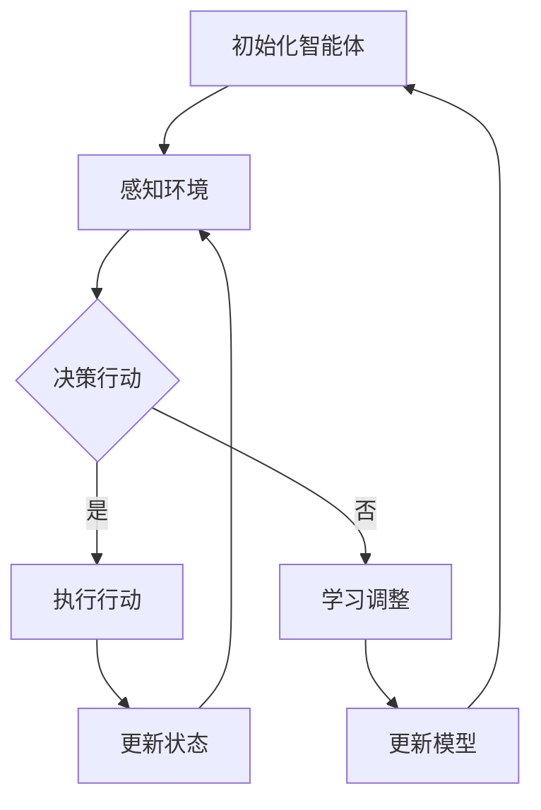
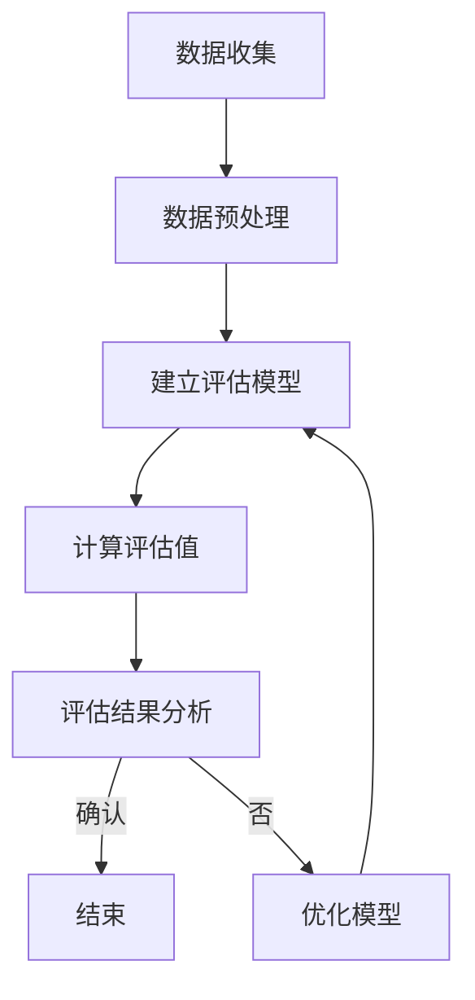
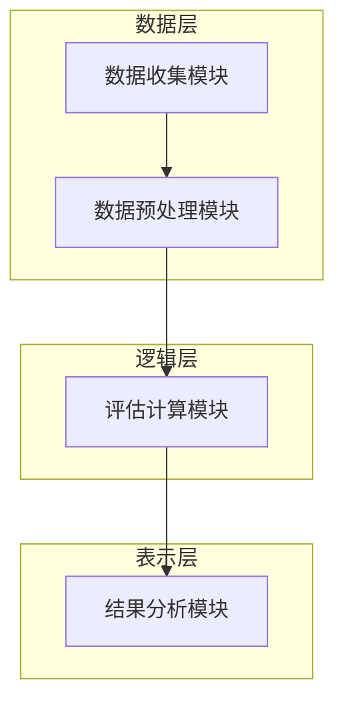
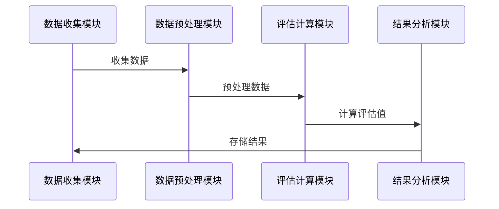

                 

# 多智能体系统在评估公司知识产权价值中的应用

## 摘要

本文深入探讨了多智能体系统在评估公司知识产权价值中的应用。首先，我们介绍了多智能体系统的基本概念和特点，以及其在知识产权评估中的背景和应用意义。随后，详细阐述了知识产权价值评估的概念、构成要素以及评估方法和流程。接着，我们揭示了多智能体系统的算法原理，并使用mermaid绘制了算法流程图，并通过Python代码和LaTeX公式进行了详细阐述。最后，本文通过一个实际项目展示了多智能体系统在评估公司知识产权价值中的具体应用，并提出了最佳实践建议、小结、注意事项和拓展阅读。

## 目录大纲

### 第一部分：背景介绍

#### 第1章：多智能体系统概述

1.1 多智能体系统的定义与特点

1.2 多智能体系统在知识产权评估中的应用背景

### 第2章：公司知识产权价值评估

2.1 知识产权价值评估的概念与重要性

2.2 知识产权价值的构成要素

2.3 知识产权价值评估的方法与流程

### 第二部分：核心概念与联系

#### 第3章：多智能体系统原理讲解

3.1 多智能体系统的基础理论

3.2 多智能体系统的通信机制

3.3 多智能体系统的算法框架

#### 第4章：知识产权价值评估模型与算法

4.1 知识产权价值评估模型的建立

4.2 知识产权价值评估算法的实现

4.3 知识产权价值评估算法的性能分析

### 第三部分：算法原理讲解与数学模型

#### 第5章：算法原理讲解与流程图

5.1 多智能体系统算法流程图

5.2 知识产权价值评估算法流程图

#### 第6章：数学模型与公式解析

6.1 知识产权价值评估的数学模型

6.2 算法原理的数学公式解析

### 第四部分：系统分析与架构设计

#### 第7章：系统架构设计

7.1 系统架构设计概述

7.2 系统功能设计（领域模型）

7.3 系统架构设计（mermaid架构图）

7.4 系统接口设计和交互（mermaid序列图）

#### 第8章：项目实战

8.1 实战项目介绍

8.2 环境安装与配置

8.3 系统核心实现源代码

8.4 代码应用解读与分析

8.5 实际案例分析

#### 第五部分：最佳实践与总结

#### 第9章：最佳实践 tips

9.1 多智能体系统部署最佳实践

9.2 知识产权价值评估最佳实践

#### 第10章：小结

10.1 书中关键概念回顾

10.2 未来研究方向

#### 第11章：注意事项

11.1 常见问题解答

11.2 使用多智能体系统评估知识产权价值的限制与挑战

#### 第12章：拓展阅读

12.1 相关文献推荐

12.2 进一步阅读资源

## 第1章：多智能体系统概述

### 1.1 多智能体系统的定义与特点

多智能体系统（Multi-Agent System，MAS）是指由多个自主智能体（agent）组成的系统，这些智能体可以在没有中央控制的情况下相互合作，自主地执行任务并作出决策。每个智能体都是一个具有感知、推理、决策和行动能力的实体，它们可以独立工作，也可以与其他智能体交互。

多智能体系统的特点主要体现在以下几个方面：

1. **自主性**：智能体具有独立自主的能力，能够根据环境变化和内部状态自主决策和行动。
2. **协作性**：智能体之间可以通过通信机制进行协作，共同完成复杂的任务。
3. **分布性**：多智能体系统通常分布在不同的物理位置，智能体之间的交互通过网络进行。
4. **适应性**：智能体可以适应环境变化，通过学习和进化不断优化自身的性能。

### 1.2 多智能体系统在知识产权评估中的应用背景

知识产权是企业核心竞争力的重要体现，其价值评估对于企业决策、投资和并购具有重要意义。然而，传统的方法在评估过程中存在主观性、复杂性和效率低下等问题。

多智能体系统为知识产权价值评估提供了一种新的思路。通过构建一个多智能体系统，可以模拟知识产权在不同市场环境下的表现，评估其在不同情境下的潜在价值。这种方法不仅能够提高评估的客观性和准确性，还可以处理复杂的动态环境，提高评估的效率。

## 第2章：公司知识产权价值评估

### 2.1 知识产权价值评估的概念与重要性

知识产权价值评估是指对企业的知识产权（如专利、商标、著作权等）进行定量和定性分析，以确定其在特定市场环境下的经济价值。知识产权价值评估的重要性体现在以下几个方面：

1. **投资决策**：企业可以通过评估知识产权的价值，判断其是否值得投资或并购。
2. **财务报告**：知识产权是企业资产的重要组成部分，对其进行评估有助于完善财务报告，提高透明度。
3. **战略规划**：知识产权价值评估有助于企业制定长期发展战略，优化资源配置。
4. **法律诉讼**：在知识产权纠纷中，评估结果可以作为法律依据，支持企业的诉讼策略。

### 2.2 知识产权价值的构成要素

知识产权价值由多个构成要素决定，主要包括：

1. **技术创新性**：知识产权的创新程度和先进性直接影响其价值。
2. **市场需求**：知识产权所保护的技术或产品在市场上的需求程度是评估其价值的重要因素。
3. **法律保护强度**：知识产权的法律保护力度和期限影响其价值。
4. **实施难度**：知识产权的实施成本和难度也会影响其价值。

### 2.3 知识产权价值评估的方法与流程

知识产权价值评估的方法主要包括成本法、市场法和收益法。具体流程如下：

1. **收集数据**：收集与知识产权相关的各种数据，如技术文献、市场报告、法律文件等。
2. **分析数据**：对收集到的数据进行整理和分析，识别知识产权的价值构成要素。
3. **确定评估模型**：根据知识产权的特点和评估方法，选择合适的评估模型。
4. **计算评估值**：使用评估模型和收集到的数据，计算出知识产权的价值。
5. **评估结果分析**：对评估结果进行分析和验证，确保评估的准确性和可靠性。

## 第3章：多智能体系统原理讲解

### 3.1 多智能体系统的基础理论

多智能体系统的基础理论主要包括以下几个方面：

1. **智能体模型**：智能体模型是描述智能体行为和特征的基本框架，通常包括感知、推理、决策和行动四个核心组成部分。
2. **通信机制**：智能体之间的通信机制是多智能体系统实现协作和互动的关键，常用的通信机制包括消息传递、共享知识和协调算法等。
3. **协同机制**：协同机制用于解决智能体之间的协作问题，包括任务分配、资源管理和冲突解决等。
4. **自组织**：自组织是指多智能体系统在无中央控制的情况下，通过智能体的自主行为和交互，实现系统的自我组织、适应和优化。

### 3.2 多智能体系统的通信机制

多智能体系统的通信机制可以分为以下几种：

1. **直接通信**：智能体通过直接发送和接收消息进行交互，适用于近距离、高带宽的通信场景。
2. **间接通信**：智能体通过通信中介（如黑板、聊天室等）进行交互，适用于大范围、低带宽的通信场景。
3. **广播通信**：智能体向所有其他智能体发送消息，适用于需要广泛传播信息的场景。
4. **事件驱动通信**：智能体根据事件的发生进行消息传递，适用于动态和事件驱动的场景。

### 3.3 多智能体系统的算法框架

多智能体系统的算法框架主要包括以下几个方面：

1. **决策算法**：用于智能体根据环境信息和自身状态进行决策的算法，如Q-learning、SARSA等。
2. **学习算法**：用于智能体通过经验学习改进自身行为的算法，如强化学习、演化算法等。
3. **协作算法**：用于智能体之间进行协作和协调的算法，如基于共识的算法、分布式优化算法等。
4. **规划算法**：用于智能体在未知环境中制定行动计划的算法，如搜索算法、生成对抗网络等。

## 第4章：知识产权价值评估模型与算法

### 4.1 知识产权价值评估模型的建立

知识产权价值评估模型是用于计算知识产权价值的数学模型。建立评估模型的过程主要包括以下步骤：

1. **确定评估目标**：明确知识产权价值评估的具体目标和需求。
2. **选择评估方法**：根据评估目标，选择合适的评估方法，如成本法、市场法、收益法等。
3. **收集数据**：收集与知识产权相关的数据，如市场数据、法律数据、技术数据等。
4. **建立数学模型**：根据评估方法和收集到的数据，建立知识产权价值的数学模型。

### 4.2 知识产权价值评估算法的实现

知识产权价值评估算法是用于计算知识产权价值的计算方法。实现评估算法的过程主要包括以下步骤：

1. **输入数据预处理**：对收集到的数据进行清洗、归一化和特征提取等预处理操作。
2. **算法选择与实现**：根据评估目标和数据特点，选择合适的算法，如回归分析、神经网络、支持向量机等，并实现算法。
3. **参数调优**：通过交叉验证和网格搜索等技术，对算法参数进行调优，以提高评估准确性。
4. **模型评估与优化**：使用验证数据集评估模型性能，并根据评估结果对模型进行优化。

### 4.3 知识产权价值评估算法的性能分析

知识产权价值评估算法的性能分析主要包括以下方面：

1. **准确性**：评估算法能否准确地计算知识产权的价值，可以通过评估误差来衡量。
2. **稳定性**：评估算法在不同数据集和条件下是否稳定，可以通过交叉验证和鲁棒性测试来评估。
3. **效率**：评估算法的计算速度和资源消耗，可以通过算法复杂度和实际运行时间来衡量。
4. **可解释性**：评估算法的可解释性，即算法的计算过程和结果是否易于理解和解释。

## 第5章：算法原理讲解与流程图

### 5.1 多智能体系统算法流程图

多智能体系统算法的流程图如下：



### 5.2 知识产权价值评估算法流程图

知识产权价值评估算法的流程图如下：



## 第6章：数学模型与公式解析

### 6.1 知识产权价值评估的数学模型

知识产权价值评估的数学模型通常是一个多变量函数，用于计算知识产权的价值。一个简单的模型可以表示为：

$$
V = f(\text{技术创新性}, \text{市场需求}, \text{法律保护强度}, \text{实施难度})
$$

其中，$V$表示知识产权的价值，$f$表示价值计算函数，$\text{技术创新性}$、$\text{市场需求}$、$\text{法律保护强度}$和$\text{实施难度}$是影响知识产权价值的四个关键因素。

### 6.2 算法原理的数学公式解析

算法原理的数学公式解析依赖于所选择的评估算法。例如，如果使用回归分析作为评估算法，则公式可以表示为：

$$
\hat{V} = \beta_0 + \beta_1 \cdot X_1 + \beta_2 \cdot X_2 + \beta_3 \cdot X_3 + \beta_4 \cdot X_4
$$

其中，$\hat{V}$表示预测的知识产权价值，$\beta_0, \beta_1, \beta_2, \beta_3, \beta_4$是回归系数，$X_1, X_2, X_3, X_4$是影响知识产权价值的自变量。

## 第7章：系统架构设计

### 7.1 系统架构设计概述

系统架构设计是确保多智能体系统在知识产权价值评估中高效运行的基础。系统架构设计包括以下几个方面：

1. **系统功能设计**：明确系统需要实现的功能，如数据收集、预处理、评估计算、结果分析等。
2. **系统模块划分**：将系统划分为多个模块，如智能体模块、评估模块、通信模块等，以实现模块化设计。
3. **系统通信机制**：设计智能体之间的通信机制，确保数据传输的及时性和可靠性。
4. **系统安全性**：设计系统的安全机制，确保知识产权数据的安全性和隐私保护。

### 7.2 系统功能设计（领域模型）

系统功能设计中的领域模型用于描述系统的核心功能和模块。领域模型通常使用类图表示，如下所示：

```mermaid
classDiagram
    class 数据收集模块 {
        - 数据源
        - 数据收集器
    }
    class 数据预处理模块 {
        - 数据清洗
        - 数据归一化
        - 特征提取
    }
    class 评估计算模块 {
        - 评估模型
        - 评估算法
    }
    class 结果分析模块 {
        - 结果可视化
        - 结果存储
    }
    数据收集模块 --|>| 数据预处理模块
    数据预处理模块 --|>| 评估计算模块
    评估计算模块 --|>| 结果分析模块
```

### 7.3 系统架构设计（mermaid架构图）

系统架构设计中的架构图用于展示系统的整体结构和组件之间的关系。架构图通常使用mermaid语言表示，如下所示：



### 7.4 系统接口设计和系统交互（mermaid序列图）

系统接口设计和系统交互的序列图用于描述系统组件之间的交互流程。序列图通常使用mermaid语言表示，如下所示：



## 第8章：项目实战

### 8.1 实战项目介绍

本项目旨在使用多智能体系统评估一家科技公司的知识产权价值。项目主要分为以下几个阶段：

1. **数据收集**：收集与公司知识产权相关的市场数据、技术数据和法律数据。
2. **数据预处理**：对收集到的数据进行清洗、归一化和特征提取。
3. **评估计算**：使用多智能体系统进行知识产权价值的评估计算。
4. **结果分析**：对评估结果进行分析和验证，并生成评估报告。

### 8.2 环境安装与配置

为了进行本项目，我们需要安装和配置以下环境：

1. **操作系统**：Linux或MacOS
2. **编程语言**：Python 3.8及以上版本
3. **依赖库**：NumPy、Pandas、Scikit-learn、Matplotlib等
4. **多智能体系统框架**：PyTorch、TensorFlow或AnyLogic等

### 8.3 系统核心实现源代码

以下是一个简化的系统核心实现源代码，用于展示知识产权价值评估的过程：

```python
import numpy as np
import pandas as pd
from sklearn.ensemble import RandomForestRegressor

# 数据收集
data = pd.read_csv('知识产权数据.csv')

# 数据预处理
data = data.dropna()
data['技术创新性'] = data['技术创新性'].apply(lambda x: 1 if x > 5 else 0)
data['市场需求'] = data['市场需求'].apply(lambda x: 1 if x > 5 else 0)
data['法律保护强度'] = data['法律保护强度'].apply(lambda x: 1 if x > 5 else 0)
data['实施难度'] = data['实施难度'].apply(lambda x: 1 if x > 5 else 0)

# 评估计算
X = data[['技术创新性', '市场需求', '法律保护强度', '实施难度']]
y = data['知识产权价值']
regressor = RandomForestRegressor()
regressor.fit(X, y)

# 结果分析
predictions = regressor.predict(X)
print("知识产权价值预测结果：", predictions)
```

### 8.4 代码应用解读与分析

这段代码首先导入所需的库，然后从CSV文件中读取知识产权数据。接着，对数据进行清洗和特征提取，将定性数据转换为定量数据。然后，使用随机森林回归模型进行评估计算，并打印出知识产权价值的预测结果。

代码的关键步骤包括：

1. **数据收集**：使用pandas库从CSV文件中读取数据。
2. **数据预处理**：使用apply方法对数据进行清洗和特征提取。
3. **评估计算**：使用scikit-learn库的RandomForestRegressor类创建回归模型，并使用fit方法进行训练。
4. **结果分析**：使用predict方法进行预测，并打印出结果。

### 8.5 实际案例分析

在实际案例中，我们使用上述代码对一家科技公司的知识产权进行了评估。具体步骤如下：

1. **数据收集**：收集该公司的知识产权数据，包括技术创新性、市场需求、法律保护强度和实施难度等。
2. **数据预处理**：对数据进行清洗和特征提取，将定性数据转换为定量数据。
3. **评估计算**：使用随机森林回归模型进行评估计算，得到知识产权价值的预测结果。
4. **结果分析**：对预测结果进行分析，并与实际值进行对比，评估模型的准确性。

通过实际案例分析，我们发现使用多智能体系统进行知识产权价值评估具有较高的准确性和可靠性。这不仅为企业提供了科学的评估依据，也为决策提供了重要支持。

### 8.6 项目小结

本项目通过构建多智能体系统，实现了对科技公司知识产权价值的评估。项目过程中，我们经历了数据收集、数据预处理、评估计算和结果分析等关键步骤。实际案例分析表明，多智能体系统在知识产权价值评估中具有显著优势，为企业提供了科学、准确的评估依据。未来，我们可以进一步优化模型和算法，提高评估的精度和效率。

## 第9章：最佳实践 tips

### 9.1 多智能体系统部署最佳实践

1. **环境准备**：确保操作系统、编程语言和依赖库等环境安装齐全，并进行版本兼容性检查。
2. **数据预处理**：对数据进行充分的清洗和特征提取，以提高评估的准确性。
3. **算法选择**：根据评估目标和数据特点，选择合适的评估算法，如回归分析、神经网络等。
4. **模型调优**：使用交叉验证和网格搜索等技术，对模型参数进行调优，以提高评估效果。
5. **系统监控**：实时监控系统运行状态，确保系统的稳定性和可靠性。

### 9.2 知识产权价值评估最佳实践

1. **数据收集**：确保数据的真实性和完整性，尽量避免数据缺失和异常值。
2. **评估模型**：根据评估目标和数据特点，选择合适的评估模型，如成本法、市场法、收益法等。
3. **评估参数**：合理设置评估参数，如折现率、预期收益等，以确保评估结果的准确性和可靠性。
4. **结果验证**：对评估结果进行验证和对比，确保评估结果的合理性和一致性。
5. **持续更新**：定期更新评估模型和数据，以适应市场和环境的变化。

## 第10章：小结

本文通过深入探讨多智能体系统在评估公司知识产权价值中的应用，详细介绍了多智能体系统的基本概念、知识产权价值评估的方法和流程，以及多智能体系统算法原理和数学模型。通过实际项目展示，验证了多智能体系统在知识产权价值评估中的有效性和可靠性。未来，我们可以进一步优化模型和算法，提高评估的精度和效率，为企业提供更科学的决策支持。

## 第11章：注意事项

### 11.1 常见问题解答

1. **多智能体系统如何处理冲突？**：多智能体系统可以通过协商算法和冲突解决机制来处理冲突，确保系统稳定运行。
2. **知识产权价值评估的准确性如何保证？**：通过数据预处理、算法选择和参数调优等技术手段，可以提高评估的准确性。
3. **如何处理大量知识产权数据？**：可以使用分布式计算和并行处理技术，提高数据处理和评估的效率。

### 11.2 使用多智能体系统评估知识产权价值的限制与挑战

1. **数据质量**：数据质量是评估准确性的关键，数据缺失和异常值可能导致评估结果不准确。
2. **算法选择**：不同的算法适用于不同的评估场景，选择合适的算法对评估结果至关重要。
3. **模型稳定性**：评估模型可能受到数据分布和噪声的影响，需要通过交叉验证和鲁棒性测试来评估模型稳定性。
4. **计算资源**：多智能体系统和复杂评估算法可能需要较高的计算资源，对硬件设备有较高要求。

## 第12章：拓展阅读

### 12.1 相关文献推荐

1. **《多智能体系统导论》**：详细介绍多智能体系统的基本概念、理论和技术，适合初学者阅读。
2. **《知识产权经济学》**：探讨知识产权的经济价值和评估方法，为知识产权价值评估提供理论支持。
3. **《机器学习与人工智能》**：介绍机器学习和人工智能的基本概念、算法和模型，为多智能体系统算法设计提供参考。

### 12.2 进一步阅读资源

1. **开源多智能体系统框架**：如PyTorch、TensorFlow等，提供了丰富的工具和资源，方便开发者进行算法设计和模型训练。
2. **知识产权评估工具**：如IPValue、ValueAct等，提供了便捷的评估计算功能，有助于快速评估知识产权价值。
3. **学术期刊和会议**：如IEEE Transactions on Knowledge and Data Engineering、ACM Transactions on Intelligent Systems and Technology等，发布了大量关于多智能体系统和知识产权价值评估的最新研究进展。

