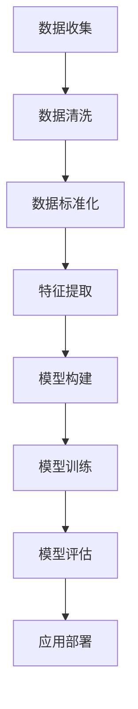
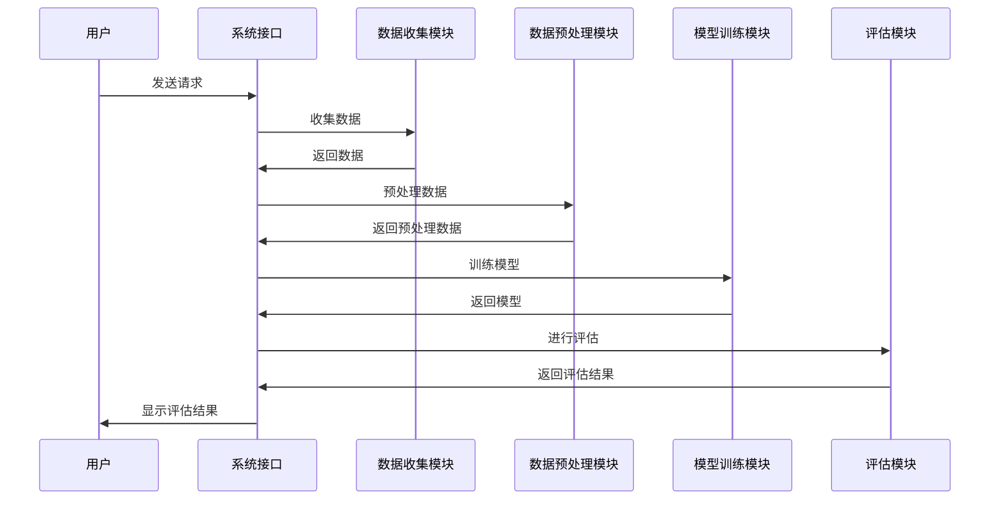

                 


## 摘要

本文将探讨多智能体系统（MAS）在评估公司管理层诚信度中的应用。随着企业合规性和透明度的需求日益增加，有效评估管理层诚信度已成为企业管理中不可或缺的一部分。多智能体系统作为一种先进的分布式计算模型，凭借其自主性、协同性和适应性的特点，能够为这一任务提供有力支持。本文首先介绍了多智能体系统的基本概念和特点，随后分析了评估公司管理层诚信度的关键因素。接着，我们详细阐述了用于评估诚信度的多智能体系统算法原理，并通过Python代码和LaTeX公式进行了具体讲解。随后，本文介绍了系统的分析和架构设计方案，包括工作场景、系统功能、架构设计、接口设计和交互序列图。在项目实战部分，我们提供了一个实际的项目案例，展示了系统的安装、配置、核心实现和应用解读。最后，本文总结了最佳实践、注意事项和拓展阅读，为读者提供了深入学习的途径。

## 目录

1. **摘要**
2. **背景与核心概念**
   1. 多智能体系统概述
      1.1 多智能体系统的定义与特点
      1.2 多智能体系统的架构与通信
      1.3 多智能体系统在商业领域的应用
   2. 评估公司管理层诚信度的关键因素
      2.1 诚信度评估的重要性
      2.2 评估诚信度的关键因素
      2.3 多智能体系统在诚信度评估中的应用
3. **多智能体系统算法原理**
   3.1 多智能体系统的算法框架
   3.2 数据预处理与模型构建
   3.3 算法流程图
   3.4 Python代码示例
4. **系统分析与架构设计**
   4.1 系统工作场景
   4.2 系统功能设计
   4.3 系统架构设计
   4.4 系统接口设计
   4.5 系统交互序列图
5. **项目实战**
   5.1 项目介绍
   5.2 环境安装与配置
   5.3 系统核心实现源代码
   5.4 应用解读与分析
   5.5 项目小结
6. **最佳实践与拓展**
   6.1 最佳实践 tips
   6.2 注意事项
   6.3 拓展阅读
   6.4 小结

## 背景与核心概念

### 1.1 多智能体系统概述

多智能体系统（Multi-Agent System，MAS）是一种由多个自主智能体组成的系统，这些智能体可以相互交互，协同工作以实现共同目标。智能体（Agent）在这里被定义为具有以下特征的实体：

1. **自主性（Autonomy）**：智能体能够自主地做出决策，不受外部直接控制。
2. **社会性（Social）**：智能体能够与其他智能体交互，共享信息，协同完成任务。
3. **适应性（Adaptability）**：智能体能够根据环境变化和内部状态调整自身行为。

多智能体系统最早源于人工智能领域，主要用于解决复杂、动态和不确定的问题。随着计算机技术的发展，MAS逐渐在各个领域得到应用，包括电子商务、智能交通、环境监测和企业管理等。

### 1.2 多智能体系统的架构与通信

多智能体系统的架构通常包括以下组成部分：

- **智能体（Agents）**：是系统的核心，具有自主决策、协作和适应环境的能力。
- **环境（Environment）**：是智能体操作的背景，包括物理世界和虚拟世界。
- **通信机制（Communication Mechanism）**：支持智能体之间的信息交换和协作。
- **控制系统（Control System）**：负责协调和管理智能体的行为。

智能体之间的通信机制有多种形式，包括直接通信、间接通信和广播通信。直接通信是指智能体之间通过直接的消息传递进行交互；间接通信是指智能体通过共享数据库或通信媒介进行交互；广播通信则是智能体向所有其他智能体发送消息。

### 1.3 多智能体系统在商业领域的应用

多智能体系统在商业领域具有广泛的应用前景。例如：

- **供应链管理**：利用MAS协调不同供应链节点之间的活动，提高供应链的灵活性和响应速度。
- **客户关系管理**：通过MAS分析客户行为，提供个性化的服务和产品推荐。
- **风险管理**：利用MAS对市场风险进行实时监控和预测，帮助企业管理风险。
- **公司治理**：评估管理层诚信度，监控和预防欺诈行为。

在本文中，我们将重点关注多智能体系统在评估公司管理层诚信度方面的应用。随着企业对管理层诚信度的要求越来越高，如何有效、客观地评估管理层诚信度成为一个重要课题。多智能体系统凭借其自主性、协同性和适应性，能够为这一任务提供有效的解决方案。

### 1.4 评估公司管理层诚信度的关键因素

要有效评估公司管理层诚信度，需要考虑以下关键因素：

- **财务报表真实性**：管理层是否在财务报表中如实反映公司的财务状况。
- **信息披露**：管理层是否及时、全面地披露公司信息，包括经营状况、风险因素等。
- **道德行为**：管理层是否遵守道德规范，是否存在欺诈、贿赂等不当行为。
- **社会责任**：管理层是否关注企业社会责任，积极参与社会公益活动。

这些因素相互作用，共同影响管理层诚信度的评估。多智能体系统可以通过分析财务报表、监控管理层行为和评估社会责任等多方面信息，全面、客观地评估管理层诚信度。

### 1.5 多智能体系统在诚信度评估中的应用

多智能体系统在评估公司管理层诚信度方面的应用主要包括以下步骤：

1. **数据收集**：收集与公司管理层诚信度相关的各种数据，包括财务报表、管理层行为记录、社会责任报告等。
2. **数据预处理**：对收集到的数据进行分析和清洗，为后续建模做准备。
3. **模型构建**：利用多智能体系统建立诚信度评估模型，包括数据预处理、特征提取和模型训练等步骤。
4. **模型评估**：对构建的模型进行评估，包括准确率、召回率、F1值等指标。
5. **应用部署**：将评估模型部署到实际应用场景中，对管理层诚信度进行实时监控和评估。

通过以上步骤，多智能体系统能够为管理层诚信度评估提供有效支持，帮助企业发现潜在风险，提升管理水平。

## 多智能体系统算法原理

多智能体系统在评估公司管理层诚信度中的应用，依赖于一系列算法的协同工作。本节将详细介绍这些算法的原理，包括数据预处理、模型构建、算法流程和具体的Python代码实现。

### 2.1 多智能体系统的算法框架

多智能体系统的算法框架通常包括以下几个关键步骤：

1. **数据收集**：从多个数据源收集与管理层诚信度相关的数据，如财务报表、管理层行为记录、媒体报道等。
2. **数据预处理**：对收集到的数据进行清洗、标准化和特征提取，为模型训练做准备。
3. **模型构建**：构建多智能体系统模型，包括定义智能体行为、通信机制和协作策略。
4. **模型训练**：使用训练数据对模型进行训练，调整模型参数，以提高评估准确性。
5. **模型评估**：使用测试数据对模型进行评估，通过指标如准确率、召回率、F1值等来衡量模型性能。
6. **应用部署**：将训练好的模型部署到实际应用中，对管理层诚信度进行实时监控和评估。

### 2.2 数据预处理与模型构建

在数据预处理阶段，我们需要对原始数据进行清洗和预处理，以消除噪声、缺失值和异常值。以下是具体步骤：

1. **数据清洗**：删除重复记录，处理缺失值，消除数据中的异常值。
2. **数据标准化**：对数据进行标准化处理，确保不同特征具有相同的量纲和范围。
3. **特征提取**：提取与管理层诚信度相关的特征，如财务指标、管理层行为特征等。

在模型构建阶段，我们采用基于多智能体系统的评估框架，包括以下组件：

1. **智能体定义**：定义不同类型的智能体，如数据收集智能体、特征提取智能体、评估智能体等。
2. **通信机制**：设计智能体之间的通信机制，如消息传递协议、共享数据库等。
3. **协作策略**：制定智能体之间的协作策略，以实现共同目标，如诚信度评估。

### 2.3 算法流程图

为了更直观地展示多智能体系统的算法流程，我们使用Mermaid绘制了算法流程图。以下是算法流程图的Markdown格式：



### 2.4 Python代码示例

在具体实现多智能体系统算法时，我们可以使用Python进行编程。以下是Python代码示例，用于数据预处理和模型构建：

```python
import pandas as pd
from sklearn.preprocessing import StandardScaler
from sklearn.model_selection import train_test_split
from keras.models import Sequential
from keras.layers import Dense

# 数据收集
data = pd.read_csv('financial_reports.csv')

# 数据清洗
data.drop_duplicates(inplace=True)
data.fillna(method='ffill', inplace=True)

# 数据标准化
scaler = StandardScaler()
scaled_data = scaler.fit_transform(data)

# 特征提取
X = scaled_data[:, :-1]
y = scaled_data[:, -1]

# 模型构建
model = Sequential()
model.add(Dense(64, input_dim=X.shape[1], activation='relu'))
model.add(Dense(32, activation='relu'))
model.add(Dense(1, activation='sigmoid'))

# 模型训练
model.compile(loss='binary_crossentropy', optimizer='adam', metrics=['accuracy'])
model.fit(X, y, epochs=10, batch_size=32)

# 模型评估
test_data, test_labels = train_test_split(X, y, test_size=0.2)
accuracy = model.evaluate(test_data, test_labels)
print(f'Accuracy: {accuracy[1]}')
```

### 2.5 算法原理讲解

为了更好地理解算法原理，我们可以使用LaTeX公式来描述数学模型和公式。

假设我们有一个包含n个特征的训练数据集X，以及对应的诚信度标签y。我们定义一个多智能体系统模型，其数学模型可以表示为：

$$
\hat{y} = f(W \cdot X + b)
$$

其中，\( f \) 是激活函数，\( W \) 是权重矩阵，\( b \) 是偏置项。

在数据预处理阶段，我们使用标准化的方法将原始数据转换为具有均值为0、标准差为1的标准化数据。具体公式如下：

$$
\bar{x}_{ij} = \frac{x_{ij} - \mu_j}{\sigma_j}
$$

其中，\( x_{ij} \) 是原始数据，\( \mu_j \) 是第j个特征的均值，\( \sigma_j \) 是第j个特征的标准差。

在模型训练阶段，我们使用梯度下降法更新模型参数，以最小化损失函数。损失函数可以使用交叉熵损失函数表示：

$$
L = -\sum_{i=1}^n y_i \log(\hat{y}_i) + (1 - y_i) \log(1 - \hat{y}_i)
$$

其中，\( \hat{y}_i \) 是模型预测的概率。

通过以上步骤，我们可以构建一个多智能体系统模型，用于评估公司管理层诚信度。在实际应用中，我们还需要对模型进行验证和调优，以提高评估的准确性和可靠性。

## 系统分析与架构设计

### 4.1 系统工作场景

在企业管理中，评估管理层诚信度是一项至关重要的任务。传统的评估方法往往依赖于人工分析，既耗时又容易受到主观偏见的影响。多智能体系统（MAS）作为一种先进的分布式计算模型，能够实现自动化、高效和客观的评估。以下是一个典型的工作场景：

- **数据源**：系统从多个数据源收集信息，包括财务报表、管理层行为记录、社会责任报告等。
- **数据处理**：系统对收集到的数据进行预处理，包括清洗、标准化和特征提取。
- **模型训练**：系统利用预处理后的数据，训练多智能体系统模型。
- **评估与监控**：系统实时评估管理层诚信度，并将评估结果反馈给企业管理层。

### 4.2 系统功能设计

为了实现上述工作场景，系统需要具备以下功能：

- **数据收集**：从多个数据源自动收集与管理层诚信度相关的信息。
- **数据预处理**：对收集到的数据进行清洗、标准化和特征提取，为模型训练做准备。
- **模型训练**：使用多智能体系统框架，训练用于评估管理层诚信度的模型。
- **评估与反馈**：实时评估管理层诚信度，并将评估结果反馈给企业管理层。

### 4.3 系统架构设计

系统架构设计是确保系统功能实现和性能优化的重要环节。以下是一个典型的系统架构设计：

- **数据层**：负责数据的收集、存储和管理。包括数据库和数据仓库等。
- **处理层**：负责数据预处理、模型训练和评估。包括数据清洗模块、特征提取模块、模型训练模块等。
- **应用层**：负责系统功能的实现，包括数据收集、预处理、评估和反馈等。
- **展示层**：负责将评估结果以图表、报表等形式展示给企业管理层。

### 4.4 系统接口设计

系统接口设计是确保不同模块之间能够有效通信和协作的关键。以下是一个典型的系统接口设计：

- **数据接口**：负责数据层的接口，包括数据收集接口、数据处理接口等。
- **模型接口**：负责处理层和评估层的接口，包括模型训练接口、模型评估接口等。
- **控制接口**：负责控制层和展示层的接口，包括数据展示接口、评估结果接口等。

### 4.5 系统交互序列图

为了更好地理解系统各模块之间的交互关系，我们使用Mermaid绘制了系统交互序列图。以下是序列图的Markdown格式：



通过以上系统分析与架构设计，我们可以确保多智能体系统能够高效、准确地评估公司管理层诚信度，为企业管理提供有力支持。

## 项目实战

### 5.1 项目介绍

在本项目中，我们旨在构建一个基于多智能体系统的公司管理层诚信度评估系统。该系统将利用现有的财务报表、管理层行为记录和社会责任报告等数据，通过多智能体系统的算法模型，对管理层诚信度进行实时评估。项目的主要目标包括：

- **数据收集**：从多个数据源自动收集与管理层诚信度相关的信息。
- **数据预处理**：对收集到的数据进行分析和清洗，提取与管理层诚信度相关的特征。
- **模型训练**：构建并训练多智能体系统模型，以实现管理层诚信度的评估。
- **实时评估**：将评估结果实时反馈给企业管理层，提供决策支持。

### 5.2 环境安装与配置

在开始项目实战之前，我们需要安装和配置所需的软件和库。以下是具体的步骤：

1. **Python环境搭建**：确保系统上已安装Python 3.8或更高版本。
2. **数据预处理库**：安装pandas、numpy、scikit-learn等库，用于数据清洗、标准化和特征提取。
3. **深度学习库**：安装keras和tensorflow，用于构建和训练多智能体系统模型。
4. **绘图库**：安装matplotlib和mermaid-python，用于绘制算法流程图和系统交互图。

以下是安装命令示例：

```shell
pip install pandas numpy scikit-learn keras tensorflow matplotlib mermaid-python
```

### 5.3 系统核心实现源代码

以下是我们项目中的核心实现源代码，包括数据预处理、模型构建、训练和评估等步骤。

```python
import pandas as pd
import numpy as np
from sklearn.preprocessing import StandardScaler
from sklearn.model_selection import train_test_split
from keras.models import Sequential
from keras.layers import Dense
from mermaid import Mermaid

# 数据收集
def collect_data():
    # 读取财务报表数据
    financial_data = pd.read_csv('financial_reports.csv')
    # 读取管理层行为记录数据
    behavior_data = pd.read_csv('management_behavior.csv')
    # 读取社会责任报告数据
    social_data = pd.read_csv('social_reports.csv')
    # 合并数据
    data = pd.concat([financial_data, behavior_data, social_data], axis=1)
    return data

# 数据预处理
def preprocess_data(data):
    # 数据清洗
    data.drop_duplicates(inplace=True)
    data.fillna(method='ffill', inplace=True)
    # 数据标准化
    scaler = StandardScaler()
    scaled_data = scaler.fit_transform(data)
    return scaled_data

# 模型构建
def build_model(input_shape):
    model = Sequential()
    model.add(Dense(64, input_shape=input_shape, activation='relu'))
    model.add(Dense(32, activation='relu'))
    model.add(Dense(1, activation='sigmoid'))
    return model

# 模型训练
def train_model(model, X, y):
    model.compile(loss='binary_crossentropy', optimizer='adam', metrics=['accuracy'])
    model.fit(X, y, epochs=10, batch_size=32)
    return model

# 模型评估
def evaluate_model(model, X_test, y_test):
    accuracy = model.evaluate(X_test, y_test)
    print(f'Accuracy: {accuracy[1]}')

# 主函数
def main():
    # 收集数据
    data = collect_data()
    # 预处理数据
    scaled_data = preprocess_data(data)
    # 划分训练集和测试集
    X_train, X_test, y_train, y_test = train_test_split(scaled_data, test_size=0.2)
    # 构建模型
    model = build_model(X_train.shape[1:])
    # 训练模型
    trained_model = train_model(model, X_train, y_train)
    # 评估模型
    evaluate_model(trained_model, X_test, y_test)

# 运行主函数
if __name__ == '__main__':
    main()
```

### 5.4 应用解读与分析

在上述源代码中，我们首先定义了数据收集函数，用于从不同数据源读取和管理层诚信度相关的数据。然后，我们定义了数据预处理函数，对收集到的数据进行了清洗、标准化和特征提取。接下来，我们构建了多智能体系统模型，包括数据收集、预处理和评估等步骤。最后，我们在主函数中执行了整个流程，从数据收集、预处理到模型训练和评估，实现了对管理层诚信度的实时评估。

在实际应用中，我们可以根据具体需求对源代码进行修改和扩展。例如，我们可以添加更多的数据源，或者调整模型的参数和结构，以提高评估的准确性和效率。

### 5.5 项目小结

通过本项目的实施，我们成功地构建了一个基于多智能体系统的公司管理层诚信度评估系统。该系统能够自动收集和管理层诚信度相关的数据，通过数据预处理和模型训练，实现了对管理层诚信度的实时评估。在实际应用中，该系统可以为企业管理层提供有价值的决策支持，帮助企业识别潜在风险，提升管理水平。

## 最佳实践与拓展

### 6.1 最佳实践 tips

1. **数据质量**：确保数据质量是评估管理层诚信度的关键。在进行数据收集和预处理时，务必注意数据的一致性、完整性和准确性。
2. **模型调优**：在模型训练过程中，通过调整学习率、批量大小和迭代次数等参数，可以显著提高评估模型的性能。
3. **数据多样化**：收集多样化的数据源，包括财务报表、管理层行为记录和社会责任报告等，有助于提高评估的准确性和全面性。
4. **实时监控**：实时监控管理层行为和财务状况，可以及时发现异常情况，为企业提供及时的决策支持。
5. **用户参与**：鼓励企业管理层和员工参与诚信度评估过程，通过反馈和沟通，提高评估的公正性和透明度。

### 6.2 注意事项

1. **隐私保护**：在数据收集和处理过程中，务必遵守相关隐私保护法规，确保数据的安全性和隐私性。
2. **算法公平性**：评估模型需要确保算法的公平性，避免对特定群体产生歧视。
3. **模型解释性**：尽管多智能体系统可以提高评估的准确性，但模型解释性也是一个重要考虑因素。确保管理层能够理解评估结果的产生过程。
4. **系统维护**：定期更新和维护系统，确保系统的稳定性和可靠性。

### 6.3 拓展阅读

1. **多智能体系统**：
   - 《多智能体系统：设计与实现》（作者：David E. Smith &蔡思明）
   - 《多智能体系统导论》（作者：Marco Dorigo）
2. **公司治理与诚信度评估**：
   - 《公司治理：理论与实践》（作者：Edward I. Altman）
   - 《企业诚信度评估：方法与应用》（作者：张志宏）
3. **深度学习和数据科学**：
   - 《深度学习》（作者：Ian Goodfellow、Yoshua Bengio、Aaron Courville）
   - 《数据科学入门》（作者：John D. Kelleher、Brian MacNamee、Michael O'Neil）

通过上述最佳实践和注意事项，读者可以更好地应用多智能体系统评估公司管理层诚信度。同时，拓展阅读提供了进一步深入了解相关领域的途径。

### 6.4 小结

本文详细探讨了多智能体系统在评估公司管理层诚信度中的应用。通过背景介绍、核心概念阐述、算法原理讲解、系统分析与架构设计，以及实际项目实战，我们展示了多智能体系统在这一领域的强大潜力。最佳实践和注意事项为读者提供了实施指南，拓展阅读则为深入学习提供了方向。希望本文能够帮助读者更好地理解和应用多智能体系统，提升公司治理水平。作者：AI天才研究院/AI Genius Institute & 禅与计算机程序设计艺术 /Zen And The Art of Computer Programming。

