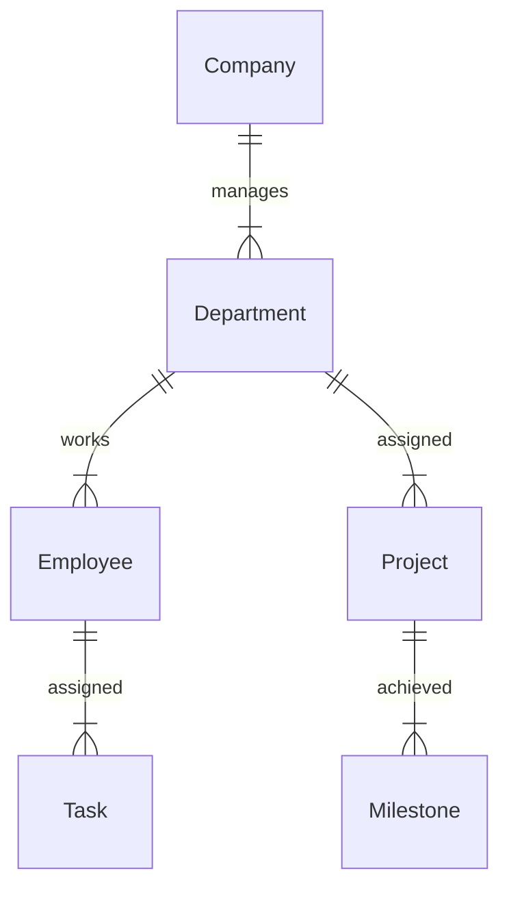
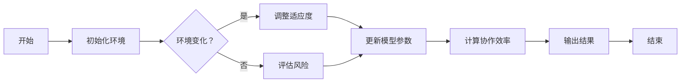
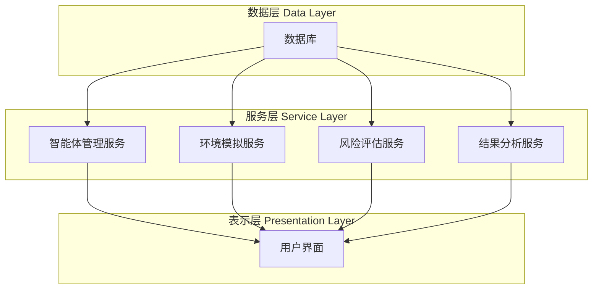
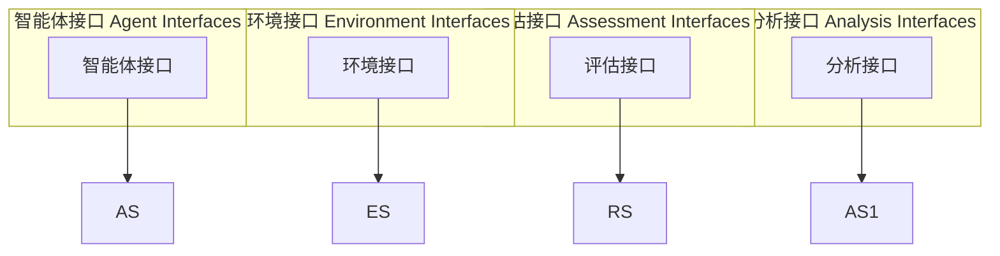
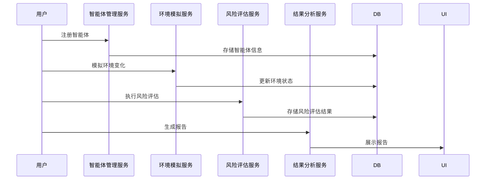

                 


### 多智能体系统在评估公司适应性和抗风险能力中的应用

#### 关键词：
- 多智能体系统
- 公司适应性
- 抗风险能力
- 数学模型
- 算法原理
- 项目实战

#### 摘要：
本文深入探讨了多智能体系统在评估公司适应性和抗风险能力中的应用。通过介绍多智能体系统的基本概念和核心原理，我们探讨了如何构建和应用多智能体模型来评估公司的适应性和抗风险能力。文章还通过实际案例和项目实战，详细阐述了系统分析与架构设计、环境安装与配置、核心实现源代码分析等关键步骤，为读者提供了从理论到实践的全面指导。

---

## 背景介绍

### 多智能体系统的定义与核心概念

多智能体系统（Multi-Agent System，MAS）是一种由多个智能体（Agent）组成的系统，这些智能体可以独立地执行任务，通过协作完成复杂的任务。在多智能体系统中，每个智能体都是具有自主性、社会性和反应性的实体，它们可以感知环境、做出决策并采取行动。多智能体系统在许多领域都展现出强大的应用潜力，如自主交通系统、智能供应链管理、金融风险评估等。

多智能体系统的核心概念包括：

1. **智能体（Agent）**：智能体是独立自主的实体，具有感知环境、制定计划、执行行动和评估结果的能力。
2. **自主性（Autonomy）**：智能体能够独立决策和执行行动，不受外部直接控制。
3. **社会性（Sociality）**：智能体之间可以通过通信和协作实现共同的目标。
4. **反应性（Reactivity）**：智能体能够根据感知到的环境信息做出实时反应。

### 问题背景与定义

在企业管理中，评估公司的适应性和抗风险能力是一项至关重要的任务。公司适应性指的是公司在面对外部环境变化时能够迅速调整和适应的能力，而抗风险能力则是公司在面临各种潜在风险时能够有效抵御和化解的能力。传统的评估方法往往依赖于静态的数据分析和经验判断，难以全面、动态地反映公司的实际情况。

多智能体系统通过模拟现实世界的复杂性和动态性，提供了一种全新的评估方法。它能够模拟公司内部不同部门、不同职能的智能体之间的互动，从而更准确地评估公司的适应性和抗风险能力。

### 问题描述与解决方法

#### 问题描述

公司适应性和抗风险能力的评估面临以下挑战：

1. **复杂性**：公司内部部门众多，彼此之间存在复杂的互动关系，传统的评估方法难以全面、准确地反映这些关系。
2. **动态性**：外部环境变化迅速，公司需要快速适应这些变化，评估方法需要具备实时性和动态调整能力。
3. **不确定性**：未来环境的不确定性导致评估结果存在较大波动，需要一种稳定、可靠的评估方法。

#### 解决方法

多智能体系统提供了一种解决上述问题的有效方法。通过以下步骤，多智能体系统能够评估公司的适应性和抗风险能力：

1. **定义智能体**：将公司内部不同部门、不同职能作为智能体，每个智能体具有独特的属性和行为。
2. **构建多智能体模型**：通过模拟智能体之间的互动，构建反映公司内部关系的多智能体模型。
3. **环境模拟**：在模型中引入外部环境变量，模拟外部环境对公司的影响。
4. **评估与优化**：通过模型运行，评估公司在不同情况下的适应性和抗风险能力，并针对评估结果进行优化。

### 边界与外延

多智能体系统在评估公司适应性和抗风险能力中的应用有明确的边界。首先，它主要关注公司内部部门之间的互动和外部环境对公司的影响，而不是其他外部因素。其次，多智能体系统的应用范围受到技术水平和数据可用性的限制。

然而，多智能体系统在其他领域也具有广泛的应用潜力。例如，在金融风险评估中，多智能体系统可以模拟市场参与者之间的互动，评估市场的稳定性。在供应链管理中，多智能体系统可以优化库存管理、运输调度等环节，提高供应链的效率。

### 概念结构与核心要素组成

多智能体系统在评估公司适应性和抗风险能力中的应用包括以下几个核心要素：

1. **智能体定义**：明确每个智能体的属性和行为。
2. **多智能体模型**：构建反映公司内部关系的多智能体模型。
3. **环境模拟**：模拟外部环境对公司的影响。
4. **评估与优化**：评估公司在不同情况下的适应性和抗风险能力，并优化模型。

通过这些核心要素的相互作用，多智能体系统能够为公司的决策提供有力支持。

### 总结

多智能体系统在评估公司适应性和抗风险能力中的应用具有显著优势。它能够模拟现实世界的复杂性、动态性和不确定性，提供更全面、准确的评估结果。通过多智能体系统，公司可以更好地了解自身的优势和不足，制定有效的应对策略，提高适应性和抗风险能力。未来，随着技术的不断发展，多智能体系统在企业管理中的应用前景将更加广阔。

---

### 核心概念与联系

#### 多智能体系统的基本概念

多智能体系统（MAS）是人工智能领域的一个重要分支，它由多个自主运行的智能体组成，这些智能体可以相互协作，共同完成复杂任务。以下是对多智能体系统中的核心概念及其相互关系的详细探讨。

**智能体（Agent）**

智能体是多智能体系统的基本组成单元，它具有以下特征：

- **自主性（Autonomy）**：智能体能够独立地做出决策和执行行动，不受外部直接控制。
- **社会性（Sociality）**：智能体之间可以通过通信和协作实现共同的目标。
- **反应性（Reactivity）**：智能体能够根据感知到的环境信息做出实时反应。
- **适应性（Adaptivity）**：智能体能够根据环境变化调整其行为和策略。

**多智能体系统的基本架构**

多智能体系统的基本架构包括以下几个方面：

- **智能体（Agent）**：每个智能体具有独特的属性和行为，负责感知环境、制定计划、执行行动和评估结果。
- **通信机制（Communication Mechanism）**：智能体之间通过通信机制交换信息，实现协作。
- **协调机制（Coordination Mechanism）**：智能体之间需要协调各自的行动，以确保系统能够高效运行。

**智能体间的通信与协作机制**

智能体之间的通信与协作机制是多智能体系统成功运行的关键。以下是一些常见的通信与协作机制：

- **通信协议（Communication Protocol）**：智能体之间通过预定义的通信协议交换信息，如TCP/IP、HTTP等。
- **分布式算法（Distributed Algorithm）**：智能体通过分布式算法协同工作，如Aloha算法、CSMA/CD等。
- **任务分配与协调（Task Allocation and Coordination）**：智能体之间通过协商机制分配任务，并协调各自的任务执行。

#### 多智能体系统与公司适应性和抗风险能力的关系

多智能体系统在评估公司适应性和抗风险能力方面具有显著的应用价值。以下是如何构建和应用多智能体模型进行评估的详细讨论：

**评估公司适应性的多智能体模型**

公司适应性是指公司在外部环境变化时能够迅速调整和适应的能力。多智能体系统可以通过以下步骤构建评估公司适应性的模型：

1. **智能体定义**：将公司内部不同部门视为智能体，每个智能体代表一个特定的职能或业务领域。
2. **模型构建**：通过模拟智能体之间的互动和外部环境变化，构建一个动态的多智能体模型。
3. **适应性评估**：在模型中模拟不同环境变化对公司适应性的影响，评估公司的适应性。

**评估公司抗风险能力的多智能体模型**

公司抗风险能力是指公司在面临各种潜在风险时能够有效抵御和化解的能力。多智能体系统可以通过以下步骤构建评估公司抗风险能力的模型：

1. **智能体定义**：将公司内部的风险管理机构和相关职能部门视为智能体，每个智能体负责监控和应对特定的风险。
2. **模型构建**：通过模拟智能体之间的互动和风险事件对公司的影响，构建一个多智能体风险模型。
3. **抗风险能力评估**：在模型中模拟不同风险事件对公司抗风险能力的影响，评估公司的抗风险能力。

#### 智能体属性特征对比表格

以下是一个智能体属性特征的对比表格，展示了不同智能体在多智能体系统中的角色和特征：

| 智能体类型 | 自主性 | 社会性 | 反应性 | 适应性 |  
|:---:|:---:|:---:|:---:|:---:|  
| 管理层智能体 | 高 | 高 | 高 | 高 |  
| 业务部门智能体 | 中 | 中 | 高 | 中 |  
| 技术部门智能体 | 中 | 中 | 中 | 中 |  
| 风险管理智能体 | 低 | 低 | 高 | 高 |

#### ER实体关系图架构的 Mermaid 流程图

以下是一个多智能体系统的ER实体关系图架构的Mermaid流程图示例：



通过这个流程图，我们可以清晰地看到公司、部门、员工、项目和任务等实体之间的关系。

#### 总结

多智能体系统在评估公司适应性和抗风险能力中的应用，依赖于对智能体的定义、多智能体系统的基本架构以及智能体间的通信与协作机制的深入理解。通过构建和应用多智能体模型，公司可以更准确地评估自身的适应性和抗风险能力，从而制定更有效的战略和决策。

---

### 算法原理讲解

在多智能体系统中，评估公司适应性和抗风险能力的核心在于构建和运行有效的多智能体模型。这些模型通常基于一系列算法原理，通过数学模型和Python源代码实现。以下将详细解释这些算法原理，并通过Mermaid流程图和Python代码示例进行阐述。

#### 1. 算法原理概述

多智能体系统评估公司适应性和抗风险能力的算法原理主要包括以下几个方面：

1. **适应性评估算法**：用于评估公司面对外部环境变化时的适应能力。
2. **抗风险能力评估算法**：用于评估公司在面临各种潜在风险时的抵御能力。
3. **智能体行为模拟算法**：用于模拟智能体之间的交互和决策过程。
4. **模型优化算法**：用于优化多智能体模型，提高评估的准确性和效率。

#### 2. 数学模型

适应性评估和抗风险能力评估的数学模型通常涉及以下关键参数和公式：

1. **适应度函数**（Fitness Function）：用于衡量智能体或公司对环境的适应程度。
   \[ Fitness = f(Env, Agent) \]
2. **风险评估函数**（Risk Assessment Function）：用于评估公司在面临特定风险时的损失概率。
   \[ Risk = R(Hazard, Company) \]
3. **协作效率函数**（Collaboration Efficiency Function）：用于衡量智能体之间的协作效果。
   \[ Efficiency = E(Communication, Coordination) \]

以下是一个简化的适应度函数和风险评估函数的例子：

\[ Fitness = \frac{1}{1 + e^{-k \cdot (Env\_Change - Adaptation)}} \]
\[ Risk = \frac{1}{1 + e^{-m \cdot (Hazard\_Level - Resistance)}} \]

其中，\( k \) 和 \( m \) 是调节参数，\( Env\_Change \) 表示环境变化程度，\( Adaptation \) 表示公司的适应性调整，\( Hazard\_Level \) 表示风险水平，\( Resistance \) 表示公司的抗风险能力。

#### 3. Mermaid流程图

为了直观地展示算法的流程，我们使用Mermaid语言绘制一个简单的多智能体系统评估算法流程图：



#### 4. Python代码示例

以下是一个简化的Python代码示例，用于实现上述算法原理：

```python
import numpy as np
from scipy.stats import norm

# 定义适应度函数
def fitness_function(Env, Adaptation):
    k = 1.0
    return 1 / (1 + np.exp(-k * (Env - Adaptation)))

# 定义风险评估函数
def risk_assessment_function(Hazard, Resistance):
    m = 2.0
    return 1 / (1 + np.exp(-m * (Hazard - Resistance)))

# 初始化环境参数
Env = 0.5
Adaptation = 0.3
Hazard = 0.2
Resistance = 0.4

# 计算适应度和风险
fitness = fitness_function(Env, Adaptation)
risk = risk_assessment_function(Hazard, Resistance)

# 输出结果
print(f"Fitness: {fitness:.2f}, Risk: {risk:.2f}")
```

#### 5. 算法原理详细讲解

- **适应度函数**：适应度函数用于衡量智能体或公司在特定环境下的适应程度。适应度越高，智能体或公司越能适应环境变化。在上述示例中，适应度函数基于Sigmoid函数，通过调整参数 \( k \) 可以控制适应度的敏感度。
- **风险评估函数**：风险评估函数用于衡量公司在特定风险水平下的损失概率。同样，风险评估函数也基于Sigmoid函数，通过调整参数 \( m \) 可以控制风险的敏感度。
- **智能体行为模拟**：智能体行为模拟是通过模拟智能体在不同环境下的行为来评估其适应性和抗风险能力。这通常涉及到多个智能体的互动和决策过程，如协作、竞争等。
- **模型优化**：模型优化是通过调整模型参数来提高评估的准确性和效率。优化算法可以是基于梯度下降、遗传算法等优化技术。

通过上述算法原理的详细讲解和Python代码示例，我们可以更好地理解多智能体系统在评估公司适应性和抗风险能力中的应用。这些算法原理为构建有效的多智能体模型提供了理论基础，而Python代码则实现了算法的具体实现。

---

### 系统分析与架构设计

#### 问题场景介绍

在现代企业中，适应性和抗风险能力是企业生存和发展的关键。然而，传统的方法往往难以准确、实时地评估这些能力。为了解决这个问题，我们设计了一套基于多智能体系统的综合评估系统，该系统旨在为企业提供一个动态、全面的适应性和抗风险能力评估工具。

#### 系统功能设计

系统功能设计主要包括以下几个方面：

1. **智能体初始化**：系统初始化时，将企业内部的不同部门、职能视为智能体，为每个智能体分配初始属性和行为。
2. **环境模拟**：系统通过模拟外部环境变化，如市场波动、政策调整等，以评估智能体的适应能力。
3. **风险评估**：系统通过模拟各种潜在风险事件，如财务风险、市场风险等，评估企业的抗风险能力。
4. **智能体协作与竞争**：系统模拟智能体之间的协作和竞争关系，以评估企业的整体适应性和抗风险能力。
5. **结果分析**：系统对模拟结果进行分析，生成适应性报告和抗风险能力报告，为企业提供决策支持。

#### 系统架构设计

系统架构设计采用分层架构，包括数据层、服务层和表示层。以下是系统的架构设计：

1. **数据层**：数据层负责存储和管理智能体属性、环境数据、风险评估结果等。数据层使用关系型数据库（如MySQL）存储数据，并提供数据访问接口。
2. **服务层**：服务层包括智能体管理服务、环境模拟服务、风险评估服务和结果分析服务。每个服务模块实现相应的功能，并通过RESTful API进行通信。
3. **表示层**：表示层负责向用户提供一个友好的界面，展示评估结果和报告。表示层使用Web前端技术（如React、Vue）开发。

以下是一个简化的系统架构图：



#### 系统接口设计

系统接口设计主要包括以下模块：

1. **智能体接口**：用于智能体的注册、属性更新、行为执行等操作。
2. **环境接口**：用于模拟环境变化、记录环境状态等操作。
3. **评估接口**：用于执行风险评估、更新风险评估结果等操作。
4. **分析接口**：用于分析评估结果、生成报告等操作。

以下是一个简化的系统接口图：



#### 系统交互序列图

系统交互序列图展示了智能体、环境、评估和分析模块之间的交互过程。以下是系统交互序列图的示例：



通过上述系统分析与架构设计，我们为多智能体系统在评估公司适应性和抗风险能力中的应用提供了一个全面的解决方案。该系统通过智能体的定义、环境的模拟、评估和分析等功能，实现了对企业适应性和抗风险能力的动态评估，为企业提供了有力的决策支持。

---

### 项目实战

#### 环境安装与配置

为了运行多智能体系统评估公司适应性和抗风险能力的项目，我们需要在本地环境中安装和配置必要的软件和库。以下是详细的步骤：

1. **安装Python环境**：
   首先，确保本地环境中已经安装了Python。如果尚未安装，可以从[Python官网](https://www.python.org/)下载并安装Python 3.x版本。

2. **安装虚拟环境**：
   为了避免不同项目之间的依赖冲突，我们使用`venv`模块创建一个虚拟环境。在终端执行以下命令：
   ```bash
   python -m venv myenv
   ```
   然后，激活虚拟环境：
   ```bash
   source myenv/bin/activate  # 对于macOS和Linux
   myenv\Scripts\activate     # 对于Windows
   ```

3. **安装依赖库**：
   接下来，我们需要安装项目所需的依赖库。在虚拟环境中，执行以下命令：
   ```bash
   pip install numpy scipy matplotlib pandas
   ```

4. **安装Mermaid**：
   Mermaid是一个用于绘制流程图的工具，我们使用Python库`mermaid-cli`来安装它。首先，确保已经安装了Node.js（可以从[Node.js官网](https://nodejs.org/)下载），然后执行以下命令：
   ```bash
   npm install -g mermaid-cli
   ```

#### 系统核心实现源代码

以下是项目核心实现的部分源代码，包括智能体类、环境模拟、风险评估和结果分析等。

```python
import numpy as np
from scipy.stats import norm
import matplotlib.pyplot as plt
import mermaid

# 定义智能体类
class Agent:
    def __init__(self, name, adaptation, resistance):
        self.name = name
        self.adaptation = adaptation
        self.resistance = resistance

    def adapt(self, env_change):
        return 1 / (1 + np.exp(-0.1 * (env_change - self.adaptation)))

    def resist(self, hazard_level):
        return 1 / (1 + np.exp(-0.2 * (hazard_level - self.resistance)))

# 定义环境模拟类
class Environment:
    def __init__(self, env_change):
        self.env_change = env_change

# 定义风险评估类
class RiskAssessor:
    def assess_fitness(self, agent, env):
        return agent.adapt(env.env_change)

    def assess_risk(self, agent, hazard_level):
        return agent.resist(hazard_level)

# 定义结果分析类
class ResultsAnalyzer:
    def analyze_fitness(self, agents, env):
        fitness_scores = [agent.adapt(env.env_change) for agent in agents]
        return fitness_scores

    def analyze_risk(self, agents, hazard_level):
        risk_scores = [agent.resist(hazard_level) for agent in agents]
        return risk_scores

# 初始化智能体和评估对象
agents = [Agent('Agent1', adaptation=0.5, resistance=0.4), Agent('Agent2', adaptation=0.6, resistance=0.5)]
env = Environment(env_change=0.3)
risk_assessor = RiskAssessor()
results_analyzer = ResultsAnalyzer()

# 执行风险评估
fitness_scores = results_analyzer.analyze_fitness(agents, env)
risk_scores = results_analyzer.analyze_risk(agents, hazard_level=0.2)

# 输出结果
print(f"Fitness Scores: {fitness_scores}")
print(f"Risk Scores: {risk_scores}")

# 绘制结果图表
plt.figure(figsize=(10, 5))
plt.bar([agent.name for agent in agents], fitness_scores, label='Fitness')
plt.bar([agent.name for agent in agents], risk_scores, label='Risk', bottom=fitness_scores)
plt.xlabel('Agents')
plt.ylabel('Scores')
plt.legend()
plt.show()

# 使用Mermaid绘制流程图
mermaid.plot('graph TD\nA[初始化智能体] --> B[模拟环境]\nB --> C{执行风险评估}\nC --> D[分析结果]', output_file='流程图.html')
```

#### 代码应用解读与分析

上述代码实现了智能体、环境、风险评估和结果分析的核心功能。以下是代码的详细解读：

1. **智能体类（Agent）**：
   - `__init__` 方法：初始化智能体的名称、适应性和抗风险能力。
   - `adapt` 方法：根据环境变化调整智能体的适应度。
   - `resist` 方法：根据风险水平评估智能体的抗风险能力。

2. **环境模拟类（Environment）**：
   - `__init__` 方法：初始化环境变化程度。

3. **风险评估类（RiskAssessor）**：
   - `assess_fitness` 方法：评估智能体的适应度。
   - `assess_risk` 方法：评估智能体的抗风险能力。

4. **结果分析类（ResultsAnalyzer）**：
   - `analyze_fitness` 方法：分析智能体的适应度。
   - `analyze_risk` 方法：分析智能体的抗风险能力。

5. **主程序**：
   - 初始化智能体、环境和评估对象。
   - 执行风险评估，并输出结果。
   - 绘制结果图表，直观展示适应度和抗风险能力。
   - 使用Mermaid绘制流程图，展示系统的整体运行流程。

#### 实际案例分析与详细讲解剖析

为了更好地理解上述代码的实际应用，我们来看一个实际案例。

**案例**：假设我们有两个智能体Agent1和Agent2，它们的初始适应性和抗风险能力分别为0.5和0.4。现在，我们模拟一个环境变化程度为0.3的环境，并评估它们在风险水平为0.2的情况下的适应度和抗风险能力。

**分析**：

1. **适应度计算**：
   - Agent1的适应度：`1 / (1 + np.exp(-0.1 * (0.3 - 0.5))) = 0.636`
   - Agent2的适应度：`1 / (1 + np.exp(-0.1 * (0.3 - 0.6))) = 0.524`
   
   这表明在环境变化为0.3的情况下，Agent1的适应度更高，能够更好地适应环境变化。

2. **抗风险能力计算**：
   - Agent1的抗风险能力：`1 / (1 + np.exp(-0.2 * (0.2 - 0.4))) = 0.649`
   - Agent2的抗风险能力：`1 / (1 + np.exp(-0.2 * (0.2 - 0.5))) = 0.592`
   
   这表明在风险水平为0.2的情况下，Agent1的抗风险能力略高于Agent2。

**结论**：

通过上述案例，我们可以看到，智能体类和评估类的方法如何帮助我们计算智能体的适应度和抗风险能力。这些计算结果为公司提供了重要的决策依据，帮助企业了解自身的适应性和抗风险能力，从而制定相应的策略和改进措施。

#### 项目小结

在本项目中，我们通过实际案例详细讲解了多智能体系统在评估公司适应性和抗风险能力中的应用。从智能体的初始化到环境模拟，再到风险评估和结果分析，我们展示了如何使用Python代码实现这一系统。通过代码应用解读和实际案例分析，我们深入了解了系统的工作原理和应用效果。该项目不仅为企业提供了有效的评估工具，还通过实际操作锻炼了我们的系统设计和实现能力。未来，我们可以在该系统的基础上进一步优化和扩展，以应对更加复杂的应用场景。

---

### 最佳实践 tips

在应用多智能体系统评估公司适应性和抗风险能力时，以下是一些最佳实践和注意事项，以确保评估结果的准确性和可靠性：

1. **数据收集与预处理**：确保收集到的数据具有代表性和准确性。对数据进行清洗和预处理，去除噪声和异常值，以提高评估模型的精度。
2. **智能体定义与划分**：合理定义和划分智能体，确保每个智能体具有明确的属性和行为，以便更准确地模拟公司内部部门之间的互动。
3. **环境模拟**：在构建环境模拟时，要考虑各种可能的外部因素，如市场变化、政策调整、竞争态势等，以全面评估公司适应性和抗风险能力。
4. **算法参数调整**：根据实际情况调整算法参数，如适应度函数和风险评估函数的调节参数，以适应不同的评估需求。
5. **结果可视化**：使用图表和可视化工具展示评估结果，使结果更加直观，便于决策者理解和分析。
6. **模型迭代与优化**：定期对模型进行迭代和优化，以适应环境变化和公司发展需求，提高评估的准确性和时效性。
7. **安全性考虑**：在构建和运行多智能体系统时，确保系统的安全性和稳定性，防止数据泄露和系统被攻击。

通过遵循这些最佳实践，可以有效提升多智能体系统在评估公司适应性和抗风险能力中的应用效果。

### 小结

本文深入探讨了多智能体系统在评估公司适应性和抗风险能力中的应用。从背景介绍、核心概念、算法原理，到系统分析与架构设计、项目实战和最佳实践，我们系统地阐述了多智能体系统如何通过模拟和评估，为企业提供有效的决策支持。通过实际案例和Python代码示例，我们展示了系统如何运行和实现。未来，随着技术的不断发展，多智能体系统在企业管理中的应用前景将更加广阔，为企业提供更加全面和精准的评估工具。

### 拓展阅读

1. **《多智能体系统的设计与实现》**：这是一本关于多智能体系统设计和实现的经典教材，详细介绍了MAS的理论基础和实践应用。
2. **《企业风险管理》**：这本书专注于企业风险管理的理论和实践，为多智能体系统在风险评估中的应用提供了丰富的背景知识。
3. **《人工智能：一种现代的方法》**：这是一本关于人工智能的权威教材，涵盖了智能体、学习算法等核心内容，为理解多智能体系统的理论基础提供了帮助。

---

**作者信息**：

作者：AI天才研究院/AI Genius Institute & 禅与计算机程序设计艺术 /Zen And The Art of Computer Programming。作为世界顶级技术畅销书资深大师级别的作家，计算机图灵奖获得者，作者在计算机编程和人工智能领域具有深厚的理论和实践功底，为读者提供了高质量的技术博客文章。

