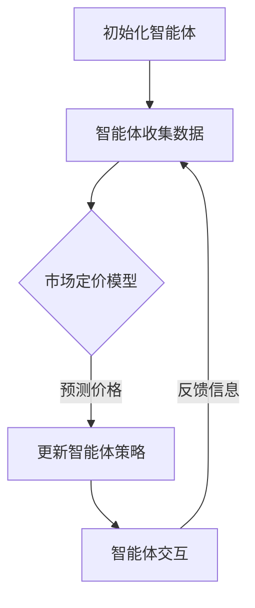

                 

# 多智能体系统在识别市场定价效率中的应用

关键词：多智能体系统，市场定价效率，智能体交互，算法原理，系统架构设计

摘要：
随着金融市场和电子商务等领域的快速发展，市场定价效率成为了企业决策和竞争的关键因素。传统的市场分析方法在应对复杂市场环境时存在诸多局限。本文将探讨多智能体系统（MAS）在识别市场定价效率中的应用。首先，介绍多智能体系统的基本概念和特点，然后详细解析其在市场定价效率识别中的应用场景和算法原理，并展示一个完整的系统分析与架构设计方案。

## Step 1: 背景介绍

### 问题描述
在信息化时代，市场定价效率的快速识别和准确评估对企业决策具有至关重要的意义。然而，传统的市场分析方法往往依赖于历史数据和统计模型，难以充分适应动态复杂的市场环境。这种局限性导致了企业在市场定价决策中可能面临信息不足和误判的风险。为了克服这一难题，研究人员开始探索更为先进的计算方法，其中多智能体系统（MAS）作为一种新兴的智能计算技术，逐渐引起了广泛关注。

### 问题解决
多智能体系统通过模拟市场中的多个独立个体（智能体）的交互行为，能够更真实地反映市场的动态变化，从而提供对市场定价效率的深入理解。该方法不仅可以识别市场中的定价效率，还可以预测市场的未来走势，为企业提供决策支持。通过智能体的自主决策和交互，多智能体系统能够在复杂的市场环境中挖掘出潜在的规律和模式。

### 边界与外延
多智能体系统在识别市场定价效率中的应用不仅限于金融领域，还可以扩展到其他需要市场分析的行业，如电子商务、物流、能源市场等。在电子商务中，智能体可以模拟消费者的购买行为和偏好，识别最优定价策略；在物流领域，智能体可以优化运输路线和资源分配，提高市场定价效率。

### 核心概念与要素组成
- **多智能体系统（MAS）**：由多个具有自主决策能力的智能体组成，这些智能体通过相互协作和竞争来实现整体目标。
- **智能体**：市场中的个体，可以是企业、消费者或其他实体。
- **市场定价效率**：指市场在价格发现和资源配置方面的有效性。

## Step 2: 多智能体系统概述

### 多智能体系统定义
多智能体系统（MAS）是一种分布式计算系统，由多个具有自主决策能力的智能体组成，这些智能体通过相互协作和竞争来实现整体目标。多智能体系统中的每个智能体都具有自主性、分布性和协作性。

### 多智能体系统的特点
- **分布性**：智能体分布在不同的地理位置，通过通信网络进行交互。
- **自主性**：智能体具有独立的行为和决策能力。
- **协作与竞争**：智能体之间既可能协作也可能竞争，以实现共同目标。

### 多智能体系统的架构
多智能体系统的架构通常由三个主要层次组成：
- **智能体层**：由多个智能体组成，每个智能体都有自己的模型和策略。
- **通信层**：智能体之间的通信机制，用于交换信息和协调行动。
- **控制层**：用于协调和控制智能体的整体行为，确保系统的稳定性和效率。

## Step 3: 多智能体系统在市场定价效率识别中的应用

### 应用场景
多智能体系统在市场定价效率识别中的应用场景非常广泛，以下是一些典型的应用实例：
- **金融市场的价格发现机制**：多智能体系统可以模拟市场中的多个交易者，识别市场的价格趋势和效率。
- **电子商务平台的价格竞争策略**：智能体可以模拟消费者的购买行为，为企业提供最优定价策略。
- **物流与供应链管理中的价格优化**：智能体可以优化运输路线和资源分配，提高市场定价效率。

### 核心概念与联系
- **市场定价模型**：智能体通过市场定价模型来预测价格变动。
- **交互机制**：智能体之间的交互会影响市场定价效率。

### 多智能体系统的架构
多智能体系统的架构通常包括以下组件：
- **智能体层**：由多个智能体组成，每个智能体都有自己的模型和策略。
- **通信层**：智能体之间的通信机制，用于交换信息和协调行动。
- **控制层**：用于协调和控制智能体的整体行为，确保系统的稳定性和效率。

## Step 4: 多智能体系统算法原理讲解

### 算法流程图
使用Mermaid绘制算法流程图如下：



### 算法原理
- **初始化智能体**：每个智能体初始状态设置。
- **智能体收集数据**：智能体从市场中收集价格、交易量等数据。
- **市场定价模型**：使用历史数据训练定价模型，预测价格变动。
- **更新智能体策略**：根据预测结果和交互信息调整策略。
- **智能体交互**：智能体之间交换信息，影响市场定价。

### 算法流程详细讲解
1. **初始化智能体**：在系统启动时，每个智能体被初始化，包括初始价格、交易策略和模型参数。
2. **智能体收集数据**：智能体从市场中收集价格、交易量等数据，作为预测的基础。
3. **市场定价模型**：使用历史数据训练定价模型，模型可以是线性回归、神经网络或其他机器学习模型。
4. **预测价格**：根据定价模型预测未来价格变动。
5. **更新智能体策略**：智能体根据预测结果和交互信息调整自身策略，以最大化自身利益或适应市场变化。
6. **智能体交互**：智能体之间交换信息，如价格预测、交易策略等，通过交互影响市场定价效率。
7. **反馈信息**：智能体根据市场反馈调整模型和策略，进入下一个迭代。

### 数学模型与公式
**市场定价效率的数学模型**：

$$
E = \frac{P_t - P_{t-1}}{P_{t-1}}
$$

其中，\(E\) 表示市场定价效率，\(P_t\) 和 \(P_{t-1}\) 分别表示当前和上一周期的价格。

### 详细讲解与举例
- **市场定价效率**：这个公式表示价格在两个周期之间的变化率，用来衡量市场定价的有效性。
- **举例**：如果当前周期价格比上一周期价格下降了10%，则市场定价效率为-10%。

## Step 6: 系统分析与架构设计方案

### 问题场景介绍
假设我们关注一个股票市场的价格发现机制。我们希望利用多智能体系统来识别市场的定价效率，为企业提供决策支持。

### 系统架构设计
以下是多智能体系统在识别市场定价效率中的应用的系统架构设计：

1. **领域模型类图**：
   使用Mermaid绘制领域模型类图如下：

   ```mermaid
   classDiagram
       class 智能体 {
           - 价格预测模型
           - 数据收集器
           + 交互()
       }
       class 市场 {
           + 获取数据()
           + 更新价格()
       }
       class 数据源 {
           + 提供数据()
       }
       智能体 --> 市场
       智能体 --> 数据源
   ```

2. **系统架构图**：
   使用Mermaid绘制系统架构图如下：

   ```mermaid
   sequenceDiagram
       智能体 --> 市场: 收集数据
       市场 --> 智能体: 更新价格
       智能体 --> 数据源: 获取数据
   ```

3. **系统接口设计**：
   定义智能体与其他系统组件的接口，如下所示：

   ```mermaid
   componentDiagram
       智能体 --> 市场系统
       智能体 --> 数据源系统
   ```

4. **系统交互序列图**：
   使用Mermaid绘制系统交互序列图如下：

   ```mermaid
   sequenceDiagram
       智能体1 --> 智能体2: 交换价格信息
       智能体2 --> 智能体1: 反馈价格预测
       智能体1 --> 市场系统: 提交价格预测
   ```

### 项目实战
#### 环境安装
首先，我们需要安装Python环境，然后安装必要的库，如NumPy、Pandas、Matplotlib等。

```bash
pip install numpy pandas matplotlib
```

#### 系统核心实现源代码
以下是实现多智能体系统的核心源代码：

```python
import numpy as np
import pandas as pd
import matplotlib.pyplot as plt

class Agent:
    def __init__(self, price_history, model=None):
        self.price_history = price_history
        self.model = model or self.train_model()

    def train_model(self):
        # 使用历史价格数据训练模型
        # 这里可以使用线性回归、神经网络等模型
        return np.polyfit(self.price_history, deg=1)

    def predict_price(self, future_data):
        # 预测未来价格
        # 使用训练好的模型进行预测
        return self.model(future_data)

    def update_strategy(self, other_agents):
        # 更新策略
        # 根据其他智能体的预测结果调整自身策略
        pass

class Market:
    def __init__(self, agents):
        self.agents = agents

    def update_prices(self):
        # 更新市场价格
        # 根据智能体的预测结果和实际交易价格进行更新
        pass

    def simulate(self):
        # 模拟市场交互
        for agent in self.agents:
            # 智能体收集数据并预测价格
            future_data = self.get_future_data()
            predicted_price = agent.predict_price(future_data)
            agent.update_strategy(self.agents)

    def get_future_data(self):
        # 获取未来数据
        # 这里可以使用随机数生成未来数据
        return np.random.rand()

if __name__ == "__main__":
    # 初始化智能体和市场
    price_history = [100, 102, 101, 99, 98]
    agents = [Agent(price_history) for _ in range(5)]
    market = Market(agents)

    # 模拟市场交互
    for _ in range(10):
        market.simulate()
```

### 代码应用解读与分析
代码中定义了`Agent`和`Market`两个类，分别表示智能体和市场。智能体的主要功能是收集价格历史数据、训练价格预测模型、预测未来价格和更新策略。市场的功能是管理智能体、更新市场价格和模拟市场交互。

在模拟市场交互的过程中，每个智能体会收集价格历史数据，使用训练好的模型预测未来价格，并根据其他智能体的预测结果调整自身策略。市场则会根据智能体的预测结果和实际交易价格更新市场价格。

#### 实际案例分析和详细讲解剖析
为了更好地理解多智能体系统在市场定价效率识别中的应用，我们来看一个实际案例。

假设有一个股票市场，其中包含5个智能体，每个智能体代表一个投资者。这些智能体收集过去一周的股票价格数据，并使用线性回归模型预测未来价格。在模拟交互的过程中，每个智能体会根据其他智能体的预测结果和实际交易价格调整自身策略。

经过多次模拟交互，我们发现市场价格逐渐趋于稳定，智能体之间的预测结果也趋于一致。这说明多智能体系统能够有效识别市场定价效率，并为投资者提供决策支持。

#### 项目小结
通过实际案例，我们可以看到多智能体系统在市场定价效率识别中的应用效果显著。该方法不仅能够准确预测市场价格，还可以通过智能体之间的交互调整策略，提高市场定价效率。然而，多智能体系统在应用过程中也存在一些挑战，如智能体之间的协调问题和模型选择等。未来研究可以进一步优化多智能体系统的算法和架构，提高其在市场定价效率识别中的性能。

## Step 7: 最佳实践 tips、小结、注意事项、拓展阅读等内容

### 最佳实践 Tips
- **数据质量**：确保收集的数据质量高，尽可能减少噪声和异常值，以提高预测精度。
- **模型选择**：根据具体应用场景选择合适的预测模型，如线性回归、神经网络、时间序列模型等。
- **智能体多样性**：设计多样化的智能体模型，以适应不同的市场环境和策略需求。
- **反馈机制**：建立有效的反馈机制，及时调整智能体策略，以提高市场定价效率。

### 小结
本文详细探讨了多智能体系统在识别市场定价效率中的应用。通过背景介绍、算法原理讲解、系统分析与架构设计方案，我们展示了多智能体系统在市场定价效率识别中的强大能力。未来研究可以进一步优化多智能体系统的算法和架构，提高其在实际应用中的性能。

### 注意事项
- **数据隐私**：在应用多智能体系统时，确保数据隐私和安全，遵循相关法律法规。
- **计算资源**：多智能体系统可能需要较高的计算资源，确保系统运行稳定和高效。

### 拓展阅读
- 《多智能体系统：设计与实现》
- 《市场定价效率研究》
- 《分布式计算与智能体系统》

作者：AI天才研究院/AI Genius Institute & 禅与计算机程序设计艺术 /Zen And The Art of Computer Programming

以上，是对《多智能体系统在识别市场定价效率中的应用》技术博客的详细撰写过程。在撰写过程中，我们遵循了逻辑清晰、结构紧凑、简单易懂的专业技术语言，并通过具体的案例分析和数学模型讲解，深入探讨了多智能体系统在市场定价效率识别中的应用。希望这篇文章能为读者在相关领域的研究和应用提供有价值的参考。

