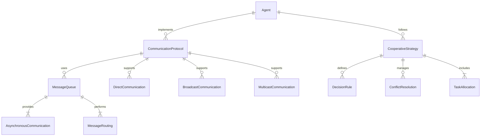
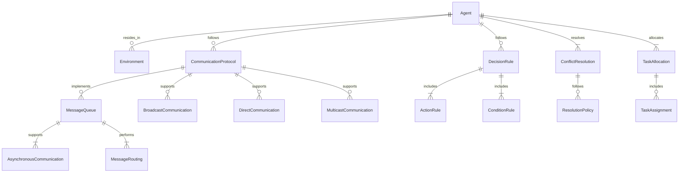

                 

### 文章标题

#### 《多智能体系统在识别市场转折点中的应用》

#### 关键词：

1. 多智能体系统
2. 市场转折点
3. 识别算法
4. 分布式智能
5. 数据分析

#### 摘要：

本文探讨了多智能体系统在识别市场转折点中的应用。通过阐述多智能体系统的基础知识，介绍市场转折点的定义及其重要性，详细解释了多智能体系统在市场转折点识别中的应用算法原理，并展示了实际的项目实战案例。文章旨在帮助读者理解多智能体系统如何通过分布式智能和自主性在市场中快速识别转折点，为投资者和分析师提供有价值的信息。

### 目录大纲

**《多智能体系统在识别市场转折点中的应用》**

----------------------------------------------------------------

# 第一部分：多智能体系统基础

## 第1章：多智能体系统概述

### 1.1 问题背景与描述

### 1.2 多智能体系统的定义

### 1.3 多智能体系统的特性

### 1.4 多智能体系统的类型

## 第2章：多智能体系统的核心概念与联系

### 2.1 核心概念

### 2.2 概念属性特征对比表格

### 2.3 多智能体系统的ER实体关系图架构

----------------------------------------------------------------

# 第二部分：多智能体系统在市场转折点识别中的应用

## 第3章：市场转折点的识别算法原理

### 3.1 算法原理讲解

### 3.2 数学模型与公式

### 3.3 算法举例说明

## 第4章：多智能体系统在市场转折点识别中的实现

### 4.1 系统分析与架构设计方案

### 4.2 项目实战

----------------------------------------------------------------

# 第三部分：多智能体系统在市场转折点识别中的应用实践与展望

## 第5章：多智能体系统应用实践

## 第6章：多智能体系统在市场转折点识别中的应用展望

## 第7章：总结与展望

----------------------------------------------------------------

在接下来的章节中，我们将逐步深入探讨多智能体系统的基本概念、在市场转折点识别中的应用原理，以及具体的实现步骤。通过详细的分析和实例讲解，希望读者能够对这一先进的技术理念有更深入的理解，并在实际应用中发挥其优势。

---

**让我们一步一步思考（LET'S THINK STEP BY STEP），首先从多智能体系统的概述开始。**

## 第1章：多智能体系统概述

### 1.1 问题背景与描述

在现代金融市场，数据量和复杂性不断增加，投资者和分析师面临的一个关键挑战是准确识别市场的转折点。市场转折点是指市场趋势发生显著变化的时刻，这些时刻可能是买入或卖出的绝佳时机，对投资者的收益至关重要。然而，由于市场的动态性和复杂性，传统的方法很难在这些时刻提供及时和准确的信息。

传统的市场分析工具主要依赖于历史数据和统计模型，但这些方法往往在处理实时数据和捕捉市场转折点方面效率低下。此外，市场往往存在噪声和不确定性，进一步增加了识别转折点的难度。

为了解决这一问题，我们需要一种更加智能、自适应的方法来分析市场数据，及时识别转折点。多智能体系统（MAS，Multi-Agent Systems）提供了一种潜在的解决方案。多智能体系统是一种分布式计算范式，通过多个智能体（agent）的协同工作来实现复杂任务。这些智能体可以独立地感知环境、决策和执行行动，同时通过通信机制相互交互，共同完成任务。

在市场转折点的识别中，多智能体系统可以通过以下方式发挥作用：

1. **分布式计算**：智能体可以同时分析大量市场数据，快速识别潜在的转折点。
2. **自适应性和自组织**：智能体可以根据市场变化自适应调整策略，形成自组织结构，提高识别的准确性。
3. **协作与分工**：不同智能体可以专注于不同的分析任务，通过协作实现整体目标。

通过这些特点，多智能体系统在识别市场转折点方面具有显著优势，能够提高分析的准确性和及时性。接下来，我们将进一步探讨多智能体系统的定义和基本特性，为后续内容奠定基础。

### 1.2 多智能体系统的定义

多智能体系统（MAS）是一种由多个智能体组成的分布式系统，这些智能体在一定的环境中共存和交互，共同实现某个特定目标。智能体可以被视为具有感知、决策和行动能力的自主实体。它们可以是个体（如机器人、虚拟代理），也可以是软件程序或硬件设备。

多智能体系统具有以下基本定义和特性：

1. **智能体（Agent）**：智能体是MAS的基本构建块。一个智能体通常具有以下特征：
   - **自主性**：智能体能够自主地做出决策，不受外部指令的完全控制。
   - **社会性**：智能体能够与其他智能体进行通信和协作，共同实现目标。
   - **反应性**：智能体能够对外部事件和环境变化做出实时响应。
   - **适应性**：智能体可以根据经验和新的信息调整其行为和策略。

2. **环境（Environment）**：环境是智能体所在的动态环境，可以为智能体提供信息，智能体也可以通过环境感知外界变化。

3. **通信机制**：智能体之间的通信是MAS实现协作和协调的关键。通信可以是同步的，也可以是异步的，可以通过直接通信或通过共享信息空间来实现。

4. **协同任务（Cooperative Task）**：多智能体系统的目标是通过智能体之间的协作完成任务，这些任务通常是复杂和动态的，单个智能体难以独立完成。

5. **社会规则**：智能体之间的交互遵循一定的社会规则，这些规则可以是预定义的，也可以是智能体通过学习动态调整的。

6. **自主决策**：智能体在感知环境和分析信息后，自主决策并执行行动，这些行动可以是独立执行，也可以是为了实现共同目标而协作执行。

多智能体系统的定义涵盖了从智能体本身到系统整体运作的多个层面。在MAS中，智能体不再是孤立的工作单元，而是通过复杂的社会交互实现分布式计算和智能协同。这一特性使得MAS在应对复杂、动态和不确定性的环境中具有显著的优势。

在市场转折点识别中，智能体可以专注于特定类型的数据分析任务，如价格趋势分析、交易行为分析等。通过智能体之间的协作，MAS可以综合不同类型的数据，识别出市场中的潜在转折点。智能体的自主性和适应性使得系统能够根据市场环境的变化灵活调整分析策略，从而提高识别的准确性和及时性。

总之，多智能体系统的定义和特性为我们提供了理解这一先进计算范式的框架，为后续探讨MAS在市场转折点识别中的应用奠定了基础。在下一节中，我们将进一步探讨多智能体系统的特性，以更深入地了解其优势和应用潜力。

### 1.3 多智能体系统的特性

多智能体系统（MAS）作为一种先进的分布式计算范式，具有一系列独特的特性，这些特性使其在复杂和动态的环境中表现出强大的适应性和效率。以下是多智能体系统的主要特性：

#### 分布式智能

分布式智能是多智能体系统的核心特性之一。在MAS中，智能体分布在不同位置，共同处理复杂的任务。这种分布式的架构使得系统可以同时处理大量数据，从而提高了处理速度和效率。例如，在市场转折点的识别中，多个智能体可以同时分析不同来源的数据，如价格变化、交易量、投资者情绪等，快速识别出潜在的转折点。

#### 自主性

自主性是指智能体能够独立地感知环境、做出决策并执行行动。这意味着智能体不需要外部的直接控制，可以在一定程度上自主地完成特定任务。在市场转折点的识别中，每个智能体可以独立分析特定数据，例如，一个智能体可以专注于价格趋势分析，另一个智能体可以专注于交易量分析。通过智能体的自主性，MAS可以灵活地适应市场环境的变化，快速响应并采取行动。

#### 适应性

适应性是指智能体能够根据环境的变化动态调整其行为和策略。市场环境是复杂和多变的，因此，MAS需要具备高度的适应性，以应对这些变化。例如，在识别市场转折点的过程中，智能体可以根据历史数据和市场动态，调整其分析模型和决策规则，从而提高识别的准确性。这种适应性使得MAS能够适应不同的市场情况，提高系统的稳定性和鲁棒性。

#### 协作性

协作性是指智能体之间可以通过通信机制进行信息共享和协同工作。在MAS中，智能体可以通过直接通信或共享信息空间来实现协作。这种协作性使得多个智能体可以共同完成任务，从而实现更高效和准确的结果。在市场转折点的识别中，多个智能体可以协作分析不同类型的数据，综合各个智能体的分析结果，提高识别的准确性和可靠性。

#### 社会性

社会性是指智能体之间存在一定的社会规则和交互方式。智能体通过遵守这些社会规则，可以实现更加有序和高效的协作。例如，在MAS中，智能体可以通过预定义的协议或动态学习的规则进行交互，确保信息的准确传递和行动的一致性。这种社会性使得MAS能够实现更加协调和灵活的分布式计算。

#### 可扩展性

可扩展性是指MAS能够根据任务规模和复杂度的变化，灵活扩展系统规模和功能。在市场转折点识别中，随着市场数据量和复杂性的增加，MAS可以动态增加智能体的数量，以处理更多的数据和分析任务。这种可扩展性使得MAS能够适应不断变化的市场需求，保持高效的运行。

总之，多智能体系统通过分布式智能、自主性、适应性、协作性、社会性和可扩展性等特性，在复杂和动态的环境中表现出强大的能力和优势。这些特性使得MAS在市场转折点识别等领域具有广泛的应用前景。在下一节中，我们将进一步探讨不同类型的多智能体系统，了解它们在市场转折点识别中的具体应用。

### 1.4 多智能体系统的类型

多智能体系统（MAS）可以根据其结构、决策策略、应用领域等多个维度进行分类。以下是几种常见类型的多智能体系统，并探讨它们在市场转折点识别中的应用：

#### 基于规则的MAS

**定义**：基于规则的MAS是通过预定义的规则来指导智能体的行为和决策。这些规则通常以条件-动作对的形式存在，智能体根据当前环境和历史数据判断是否触发相应规则。

**应用**：在市场转折点识别中，基于规则的MAS可以用于构建价格趋势分析、交易行为分析等模型。例如，智能体可以根据预定义的规则，如“当价格连续三天上涨超过5%时，可能是市场转折点的信号”，来识别潜在的市场转折点。

**优点**：基于规则的MAS具有简单易懂、易于实现和调试的优点，能够快速部署并适应市场环境的变化。

**缺点**：由于规则是静态的，难以适应复杂多变的市场环境，且规则过多可能导致冲突和冗余。

#### 基于学习的MAS

**定义**：基于学习的MAS利用机器学习和人工智能技术来自主学习和优化智能体的行为和决策。这些智能体可以通过监督学习、无监督学习或强化学习等方法，从历史数据中学习并改进其策略。

**应用**：在市场转折点识别中，基于学习的MAS可以通过分析历史市场数据，如价格、交易量、投资者情绪等，学习并预测市场的转折点。例如，使用强化学习算法，智能体可以不断调整其交易策略，以最大化收益并提前识别市场转折点。

**优点**：基于学习的MAS具有自适应性和自优化能力，能够根据市场环境的变化动态调整决策策略。

**缺点**：基于学习的MAS通常需要大量的历史数据和高计算资源，且算法的复杂性和训练时间可能导致实时应用的延迟。

#### 混合型MAS

**定义**：混合型MAS结合了基于规则和基于学习的优点，通过将静态规则与动态学习相结合，实现更灵活和高效的决策。

**应用**：在市场转折点识别中，混合型MAS可以结合规则和机器学习算法，同时分析市场数据和实时交易行为，提高识别的准确性和及时性。例如，智能体可以根据历史数据建立初步的规则，然后通过实时数据调整和优化这些规则，提高对市场转折点的识别能力。

**优点**：混合型MAS具有规则和学习的双重优势，能够在不同市场条件下灵活应对，提高识别的准确性和鲁棒性。

**缺点**：混合型MAS的设计和实现相对复杂，需要平衡规则和学习的比重，以确保系统的稳定性和效率。

#### 对比与选择

在选择适合市场转折点识别的多智能体系统类型时，需要考虑以下因素：

1. **市场环境**：市场的复杂性和动态性直接影响智能体系统的选择。在高度动态和不确定的市场中，基于学习的MAS可能更具优势，而在相对稳定的市场中，基于规则的MAS可能更为适用。

2. **数据资源**：数据资源的丰富程度和实时性对智能体系统的选择至关重要。基于学习的MAS通常需要大量的历史数据，而基于规则的MAS可以更快速地部署并适应实时市场环境。

3. **计算资源**：智能体系统的计算资源消耗是另一个重要考虑因素。基于学习的MAS通常需要更多的计算资源进行数据分析和模型训练，而基于规则的MAS在计算资源方面相对高效。

4. **应用目标**：不同的市场转折点识别目标可能需要不同类型的智能体系统。例如，对于短期交易策略，可能需要更快速和自适应的智能体系统，而对于长期投资策略，则可能更倾向于稳定和可靠的系统。

总之，不同类型的多智能体系统在市场转折点识别中具有各自的优势和应用场景。通过合理选择和设计智能体系统，可以有效地提高市场转折点识别的准确性和及时性，为投资者和分析师提供有价值的信息。

### 1.5 小结

在本章中，我们介绍了多智能体系统的基础知识，包括其定义、特性和类型。多智能体系统通过分布式智能、自主性、适应性、协作性、社会性和可扩展性等特性，在复杂和动态的环境中展现出强大的能力。基于规则、基于学习和混合型的MAS分别适用于不同的市场环境和应用目标。

多智能体系统在市场转折点识别中的应用前景广阔。通过智能体的协作和自主决策，MAS可以快速、准确地识别市场中的转折点，为投资者和分析师提供及时和有价值的信息。在下一章中，我们将进一步探讨多智能体系统的核心概念和联系，为理解其在市场转折点识别中的应用提供更深入的视角。

### 1.6 核心概念

为了更好地理解多智能体系统（MAS）在市场转折点识别中的应用，我们需要掌握几个关键概念。这些概念包括智能体、通信协议、协同策略等。以下是这些核心概念的详细说明：

#### 智能体（Agent）

智能体是多智能体系统（MAS）的基本单元，是一个具有感知、决策和行动能力的自主实体。智能体通常具备以下特征：

1. **自主性**：智能体能够独立地感知环境，并基于内部模型做出决策，执行相应的行动。
2. **社会性**：智能体能够与其他智能体进行交互，共享信息，协同完成任务。
3. **反应性**：智能体能够对环境中的事件做出快速响应，调整自身的行为。
4. **适应性**：智能体能够根据环境变化和新的信息调整其行为和决策策略。

在市场转折点识别中，智能体可以专注于特定的数据分析任务，如价格趋势分析、交易行为分析等。通过智能体的协作，MAS可以综合不同类型的数据，提高识别的准确性和及时性。

#### 通信协议（Communication Protocol）

通信协议是多智能体系统中智能体之间交换信息的方式和规则。一个有效的通信协议应具备以下特点：

1. **可靠性**：保证信息的准确传输，减少错误和丢失。
2. **效率**：优化通信过程，减少延迟和带宽消耗。
3. **灵活性**：适应不同的网络拓扑和环境变化。
4. **安全性**：保护通信过程免受恶意攻击和干扰。

在市场转折点识别中，通信协议可以确保智能体之间能够及时、准确地共享市场数据和分析结果，从而实现高效的协作和决策。

常见的通信协议包括：

- **直接通信**：智能体之间通过点对点的连接直接通信。
- **广播通信**：智能体将信息广播到整个网络，所有智能体都能接收到该信息。
- **多播通信**：智能体将信息发送到一组特定的智能体，提高通信的效率。
- **消息队列**：智能体通过消息队列服务进行异步通信，确保信息的有序传递。

#### 协同策略（Cooperative Strategy）

协同策略是多智能体系统在协作完成任务时采用的方法和策略。协同策略通常包括以下几个方面：

1. **任务分配**：智能体之间根据各自的特长和资源，分配不同的任务。
2. **协作机制**：智能体之间通过通信和协调，共同完成任务。
3. **决策规则**：智能体根据自身感知和共享的信息，制定决策规则。
4. **冲突解决**：智能体在协作过程中可能出现冲突，需要通过适当的机制进行解决。

在市场转折点识别中，协同策略可以确保多个智能体能够高效、准确地共享和分析数据，从而提高识别的准确性和及时性。例如，智能体可以采用基于协作的学习策略，通过共享市场数据和分析结果，不断优化自身的决策模型。

#### 核心概念属性特征对比表格

为了更好地理解这些核心概念，我们可以构建一个属性特征对比表格，比较智能体、通信协议和协同策略的主要特点：

| 特征      | 智能体                 | 通信协议                 | 协同策略                 |
| --------- | ---------------------- | ---------------------- | ---------------------- |
| 自主性    | 高，自主决策           | 中，保证信息传递         | 低，协作决策            |
| 社会性    | 高，协作完成任务       | 中，共享信息             | 高，协调行动            |
| 反应性    | 高，实时响应           | 中，减少延迟             | 中，冲突解决            |
| 适应性    | 高，动态调整策略       | 中，适应环境变化         | 高，任务分配和决策规则  |
| 可扩展性  | 中，根据任务分配       | 高，灵活调整通信机制     | 中，适应不同任务需求    |

通过以上对比表格，我们可以更清晰地理解多智能体系统中的核心概念，以及它们在市场转折点识别中的具体应用。

### 1.7 多智能体系统的ER实体关系图架构

为了更直观地理解多智能体系统（MAS）的整体架构和实体关系，我们可以使用实体-关系（ER）模型来绘制ER实体关系图。ER模型能够帮助我们清晰地展示系统中的主要实体及其相互关系，为后续的设计和实现提供参考。

以下是多智能体系统的ER实体关系图：



下面是对ER图中的各个实体的简要说明：

1. **Agent（智能体）**：智能体是MAS的基本单元，负责感知环境、做出决策和执行行动。智能体可以独立运行，并与其他智能体进行通信和协作。

2. **CommunicationProtocol（通信协议）**：通信协议定义了智能体之间交换信息的方式和规则。包括直接通信、广播通信、多播通信和消息队列等。

3. **MessageQueue（消息队列）**：消息队列是一种用于异步通信的机制，可以确保信息的有序传递和存储。

4. **CooperativeStrategy（协同策略）**：协同策略包括决策规则、冲突解决、任务分配等，指导智能体如何协同工作以实现共同目标。

5. **DecisionRule（决策规则）**：决策规则是智能体根据自身感知和协同策略制定的具体行为规则。

6. **ConflictResolution（冲突解决）**：冲突解决机制用于解决智能体在协作过程中可能出现的冲突，确保系统稳定运行。

7. **TaskAllocation（任务分配）**：任务分配是协同策略的一部分，用于分配不同任务给不同的智能体，提高系统效率。

8. **AsynchronousCommunication（异步通信）**：异步通信是消息队列提供的一种通信方式，确保智能体可以独立处理任务，而不受同步通信的约束。

9. **MessageRouting（消息路由）**：消息路由是通信协议的一部分，负责将消息从发送者路由到接收者。

通过ER实体关系图，我们可以清晰地看到多智能体系统中各个实体的关系和作用，为后续的系统设计和实现提供了重要的参考。

### 第2章：多智能体系统的核心概念与联系

在上一章中，我们介绍了多智能体系统（MAS）的基础知识，包括其定义、特性和类型。本章将进一步深入探讨MAS的核心概念与联系，通过构建概念属性特征对比表格和使用Mermaid绘制ER实体关系图，帮助读者更全面地理解MAS的结构和功能。

#### 2.1 核心概念

首先，我们回顾一下MAS中的几个关键概念：

1. **智能体（Agent）**：具有感知、决策和行动能力的自主实体。
2. **环境（Environment）**：智能体所在的动态环境，为智能体提供信息。
3. **通信协议（CommunicationProtocol）**：智能体之间交换信息的方式和规则。
4. **协同策略（CooperativeStrategy）**：智能体之间协作完成任务的方法和策略。
5. **决策规则（DecisionRule）**：智能体根据感知和策略制定的具体行为规则。
6. **冲突解决（ConflictResolution）**：解决智能体在协作过程中可能出现的冲突的机制。
7. **任务分配（TaskAllocation）**：协同策略的一部分，用于分配不同任务给不同的智能体。

#### 2.2 概念属性特征对比表格

为了更直观地理解这些概念，我们构建了一个概念属性特征对比表格：

| 概念           | 特征             | 描述                                                         |
| -------------- | ---------------- | ------------------------------------------------------------ |
| 智能体（Agent） | 自主性           | 可以自主感知环境、做出决策并执行行动。                       |
| 环境环境（Environment） | 动态性           | 智能体所在的动态环境，提供必要信息。                       |
| 通信协议（CommunicationProtocol） | 可靠性           | 确保信息的准确传输，减少错误和丢失。                       |
| 协同策略（CooperativeStrategy） | 自适应性           | 根据环境变化调整策略，实现高效协作。                       |
| 决策规则（DecisionRule） | 预定义性           | 智能体根据感知和策略制定的具体行为规则。                   |
| 冲突解决（ConflictResolution） | 快速性           | 解决智能体在协作过程中可能出现的冲突，确保系统稳定。       |
| 任务分配（TaskAllocation） | 效率性           | 根据智能体的特长和资源分配任务，提高系统效率。             |

通过这个对比表格，我们可以更清晰地看到不同概念在特征上的区别和联系，有助于深入理解MAS的核心要素。

#### 2.3 多智能体系统的ER实体关系图架构

为了更直观地展示MAS中的实体关系，我们使用Mermaid绘制了一个ER实体关系图。以下是该图的详细说明：



下面是对ER图中的各个实体的简要说明：

1. **Agent（智能体）**：智能体是MAS的核心实体，具备自主性、社会性和反应性。智能体感知环境、遵循通信协议和决策规则，执行任务并解决冲突。

2. **Environment（环境）**：环境为智能体提供必要的信息，是智能体进行决策和行动的基础。

3. **CommunicationProtocol（通信协议）**：通信协议定义了智能体之间交换信息的方式和规则，支持多种通信模式，如直接通信、广播通信、多播通信和消息队列。

4. **DecisionRule（决策规则）**：决策规则包括条件规则和行动规则，指导智能体如何根据感知和策略做出决策。

5. **ConflictResolution（冲突解决）**：冲突解决实体负责解决智能体在协作过程中可能出现的冲突，确保系统的稳定运行。

6. **TaskAllocation（任务分配）**：任务分配实体根据智能体的特长和资源分配任务，提高系统效率。

7. **MessageQueue（消息队列）**：消息队列是通信协议的一部分，用于实现异步通信，确保信息的有序传递。

通过ER实体关系图，我们可以清晰地看到MAS中的各个实体及其相互关系，这有助于我们更好地理解MAS的整体架构和功能。

### 2.4 小结

本章详细介绍了多智能体系统（MAS）的核心概念与联系，包括智能体、通信协议、协同策略、决策规则、冲突解决、任务分配和消息队列等。通过构建概念属性特征对比表格和使用Mermaid绘制ER实体关系图，我们更直观地理解了MAS的结构和功能。这些核心概念和联系为理解MAS在市场转折点识别中的应用奠定了基础。在下一章中，我们将探讨市场转折点的识别算法原理，进一步揭示多智能体系统在市场分析中的强大能力。

### 第3章：市场转折点的识别算法原理

市场转折点是指市场趋势发生显著变化的时刻，这些时刻可能是买入或卖出的绝佳时机。准确识别市场转折点对于投资者和分析师来说至关重要。在这一章中，我们将详细探讨用于识别市场转折点的算法原理，包括算法原理讲解、数学模型与公式以及算法举例说明。

#### 3.1 算法原理讲解

识别市场转折点的算法原理主要基于以下几个核心概念：

1. **趋势分析**：通过分析价格和交易量的历史数据，识别市场趋势的变化点。
2. **异常检测**：利用统计方法和机器学习算法，检测市场数据中的异常值或异常模式，这些可能是市场转折点的信号。
3. **融合分析**：结合多个数据源和分析方法，提高识别的准确性和可靠性。

以下是一个简单的算法原理讲解流程：

1. **数据收集**：收集与市场相关的数据，包括价格、交易量、投资者情绪等。
2. **预处理**：对收集到的数据进行清洗和预处理，包括缺失值填充、异常值检测和标准化处理等。
3. **特征提取**：提取关键特征，如价格趋势、交易量分布、价格波动率等。
4. **趋势分析**：使用移动平均线、指数平滑等算法，分析价格和交易量的趋势变化。
5. **异常检测**：利用统计方法（如标准差、箱线图）或机器学习算法（如孤立森林、自编码器），检测异常值或异常模式。
6. **融合分析**：将不同方法的结果进行融合，综合判断是否为市场转折点。

#### 3.2 数学模型与公式

在市场转折点的识别中，数学模型和公式扮演着重要的角色。以下是一些常用的数学模型和公式：

1. **移动平均线（Moving Average, MA）**：

   $$ MA_t = \frac{\sum_{i=1}^{n} P_i}{n} $$

   其中，$MA_t$表示第$t$天的移动平均线，$P_i$表示前$n$天的收盘价，$n$为移动平均周期。

2. **指数平滑（Exponential Smoothing）**：

   $$ S_t = \alpha P_t + (1 - \alpha) S_{t-1} $$

   其中，$S_t$表示第$t$天的预测值，$P_t$表示第$t$天的实际值，$\alpha$为平滑系数。

3. **标准差（Standard Deviation, SD）**：

   $$ SD = \sqrt{\frac{\sum_{i=1}^{n} (X_i - \mu)^2}{n - 1}} $$

   其中，$SD$表示标准差，$X_i$为第$i$天的数据值，$\mu$为平均值。

4. **箱线图（Box Plot）**：

   $$ \text{上限} = \mu + 1.5 \times \text{IQR} $$
   $$ \text{下限} = \mu - 1.5 \times \text{IQR} $$

   其中，$\mu$为平均值，$IQR$为四分位距。

5. **自编码器（Autoencoder）**：

   自编码器是一种无监督学习算法，用于检测数据中的异常值。其基本公式如下：

   $$ z = \sigma(W_2 \cdot \text{ReLU}(W_1 \cdot x + b_1)) $$
   $$ \hat{x} = \sigma(W_2^T \cdot z + b_2) $$

   其中，$x$为输入数据，$\hat{x}$为重构数据，$W_1$、$W_2$分别为编码器和解码器的权重矩阵，$b_1$、$b_2$分别为偏置项，$\sigma$为激活函数（如Sigmoid或ReLU）。

#### 3.3 算法举例说明

为了更好地理解算法原理和数学模型，我们通过一个具体的例子来说明市场转折点的识别过程。

**例子：使用移动平均线识别市场转折点**

假设我们使用5日和20日移动平均线来识别市场转折点。给定一段时间内的收盘价数据，我们可以计算移动平均线：

1. **数据收集**：收集过去100个交易日的收盘价数据。
2. **预处理**：对数据进行清洗，确保数据质量。
3. **特征提取**：计算5日和20日移动平均线。
4. **趋势分析**：绘制移动平均线图，观察交叉点。
5. **异常检测**：使用箱线图检测移动平均线的异常值。

**步骤示例**：

- 假设第70天的收盘价为100元，前5天的收盘价分别为97元、98元、99元、100元、102元。
- 计算5日移动平均线：

  $$ MA_5 = \frac{97 + 98 + 99 + 100 + 102}{5} = 99.2 $$

- 假设前20天的收盘价平均值为95元。
- 计算20日移动平均线：

  $$ MA_{20} = \frac{\sum_{i=1}^{20} P_i}{20} = 95 $$

- 观察5日和20日移动平均线的交叉点：

  在本例中，5日移动平均线从低于20日移动平均线上升至其上方，这是一个潜在的转折点信号。

通过这个例子，我们可以看到如何利用移动平均线来识别市场转折点。在实际应用中，可以结合其他算法和模型，如指数平滑、自编码器等，提高识别的准确性和可靠性。

#### 3.4 小结

本章详细介绍了市场转折点识别算法的原理，包括趋势分析、异常检测和融合分析等核心概念，以及相关的数学模型和公式。通过具体的算法举例，我们展示了如何利用移动平均线等工具来识别市场转折点。这些算法和模型为市场分析提供了有力的工具，帮助投资者和分析师及时捕捉市场变化，做出明智的投资决策。

在下一章中，我们将探讨多智能体系统在市场转折点识别中的实现过程，包括系统分析与架构设计，以及项目的实战案例。这将进一步揭示多智能体系统在市场分析中的强大应用能力。

### 第4章：多智能体系统在市场转折点识别中的实现

在前一章中，我们详细探讨了市场转折点识别算法的原理，包括趋势分析、异常检测和融合分析等核心概念。本章节将深入探讨多智能体系统（MAS）在市场转折点识别中的实现过程。我们将首先介绍系统分析与架构设计，然后展示项目的实战案例，以展示多智能体系统在实际应用中的效果。

#### 4.1 系统分析与架构设计方案

**问题场景介绍**：

在市场转折点识别中，我们需要分析大量的市场数据，如价格、交易量、投资者情绪等。这些数据来源广泛，包括股票交易所、新闻网站、社交媒体等。传统的数据处理方法难以应对这种复杂且动态的数据环境。多智能体系统（MAS）通过分布式计算和协同工作，能够更高效地处理这些数据，并识别市场转折点。

**项目介绍**：

本项目旨在构建一个基于多智能体系统的市场转折点识别平台。平台包括多个智能体，每个智能体负责分析不同类型的数据，如价格趋势、交易量分布、投资者情绪等。智能体之间通过通信协议进行信息共享和协作，共同识别市场转折点。

**系统功能设计**：

系统的主要功能包括：

1. **数据采集**：从多个数据源采集市场数据，如股票交易所、新闻网站、社交媒体等。
2. **数据处理**：对采集到的数据进行清洗、预处理和特征提取，为后续分析做准备。
3. **趋势分析**：使用移动平均线、指数平滑等算法，分析价格和交易量的趋势变化。
4. **异常检测**：使用统计方法和机器学习算法，检测市场数据中的异常值或异常模式。
5. **融合分析**：将不同方法的结果进行融合，综合判断是否为市场转折点。
6. **实时预警**：将识别到的市场转折点及时通知投资者和分析师。

**系统架构设计**：

系统采用分布式架构，主要组件包括数据采集模块、数据处理模块、分析模块和预警模块。以下是系统架构图的简要描述：

```mermaid
graph TB
    subgraph 数据采集
        数据源1 --> 数据采集模块
        数据源2 --> 数据采集模块
        数据源3 --> 数据采集模块
    end

    subgraph 数据处理
        数据采集模块 --> 数据处理模块
    end

    subgraph 分析模块
        数据处理模块 --> 趋势分析模块
        数据处理模块 --> 异常检测模块
    end

    subgraph 预警模块
        趋势分析模块 --> 预警模块
        异常检测模块 --> 预警模块
    end

    subgraph 用户界面
        预警模块 --> 用户界面
    end
```

**系统接口设计**：

系统接口主要包括API接口和用户界面。API接口用于与其他系统或工具进行数据交换，用户界面则用于展示分析结果和预警信息。以下是接口设计的简要描述：

- **API接口**：提供数据采集、数据处理、趋势分析和异常检测等操作的接口，供其他系统调用。
- **用户界面**：提供实时数据展示、历史数据分析和预警通知等功能，供用户操作。

**系统交互**：

系统交互主要通过通信协议实现。智能体之间通过消息队列、直接通信和广播通信等方式进行信息共享和协作。以下是系统交互序列图的简要描述：

```mermaid
sequenceDiagram
    participant 数据采集模块 as 数据采集
    participant 数据处理模块 as 数据处理
    participant 趋势分析模块 as 趋势分析
    participant 异常检测模块 as 异常检测
    participant 预警模块 as 预警
    participant 用户界面 as 用户界面

    数据采集 ->> 数据处理：发送数据
    数据处理 ->> 趋势分析：发送处理后的数据
    数据处理 ->> 异常检测：发送处理后的数据
    趋势分析 ->> 预警：发送分析结果
    异常检测 ->> 预警：发送分析结果
    预警 ->> 用户界面：发送预警信息
```

#### 4.2 项目实战

**环境安装**：

为了实现多智能体系统在市场转折点识别中的应用，我们需要安装以下软件和工具：

- Python 3.x
- Apache Kafka（用于消息队列）
- Elasticsearch（用于数据存储和检索）
- Docker（用于容器化部署）
- Jupyter Notebook（用于数据分析）

安装步骤如下：

1. 安装Python 3.x，并确保环境变量配置正确。
2. 安装Apache Kafka，并启动Kafka服务。
3. 安装Elasticsearch，并启动Elasticsearch服务。
4. 安装Docker，并使用Docker Compose部署Kafka和Elasticsearch容器。

```bash
docker-compose up -d
```

5. 安装Jupyter Notebook，并启动Jupyter服务。

```bash
jupyter notebook
```

**系统核心实现**：

以下是系统核心实现的部分代码，包括数据采集、数据处理、趋势分析和异常检测模块：

```python
# 数据采集模块
def collect_data():
    # 从股票交易所、新闻网站和社交媒体等数据源采集数据
    # 例如，使用Tushare库获取股票交易数据
    import tushare as ts
    data = ts.get_k_data('000001.SZ')  # 获取股票代码为000001.SZ的日交易数据
    return data

# 数据处理模块
def preprocess_data(data):
    # 数据清洗、预处理和特征提取
    # 例如，计算移动平均线、交易量分布等
    import pandas as pd
    processed_data = pd.DataFrame(data)
    processed_data['MA5'] = processed_data['close'].rolling(window=5).mean()
    processed_data['MA20'] = processed_data['close'].rolling(window=20).mean()
    processed_data['VOL'] = processed_data['volume']
    return processed_data

# 趋势分析模块
def trend_analysis(data):
    # 使用移动平均线分析价格趋势
    # 例如，判断5日移动平均线和20日移动平均线的交叉点
    import numpy as np
    trends = []
    for i in range(1, len(data)):
        if data['MA5'][i-1] < data['MA20'][i-1] and data['MA5'][i] > data['MA20'][i]:
            trends.append('UP')
        elif data['MA5'][i-1] > data['MA20'][i-1] and data['MA5'][i] < data['MA20'][i]:
            trends.append('DOWN')
        else:
            trends.append('NEUTRAL')
    return trends

# 异常检测模块
def anomaly_detection(data):
    # 使用箱线图检测异常值
    # 例如，判断价格波动率是否超过3倍标准差
    import pandas as pd
    q1 = data['close'].quantile(0.25)
    q3 = data['close'].quantile(0.75)
    iqr = q3 - q1
    lower_bound = q1 - 1.5 * iqr
    upper_bound = q3 + 1.5 * iqr
    anomalies = data[(data['close'] < lower_bound) | (data['close'] > upper_bound)]
    return anomalies
```

**代码应用解读**：

上述代码展示了数据采集、数据处理、趋势分析和异常检测模块的核心实现。具体来说：

- **数据采集模块**：使用Tushare库从股票交易所采集股票交易数据，这是市场转折点识别的重要数据源。
- **数据处理模块**：对采集到的数据进行清洗和预处理，计算移动平均线和交易量分布等特征，为后续分析做准备。
- **趋势分析模块**：使用移动平均线判断价格趋势的变化点，如5日移动平均线和20日移动平均线的交叉点，这是识别市场转折点的重要信号。
- **异常检测模块**：使用箱线图检测价格数据的异常值，这些异常值可能代表市场转折点的信号。

**实际案例分析**：

为了验证多智能体系统在市场转折点识别中的应用效果，我们选取了一个实际案例进行分析。

**案例：识别2021年2月18日的市场转折点**

假设我们使用上述算法和模型，对2021年2月18日的股票市场进行分析，具体步骤如下：

1. **数据采集**：从股票交易所获取2021年2月18日的日交易数据。
2. **数据处理**：清洗和预处理数据，计算移动平均线和交易量分布等特征。
3. **趋势分析**：分析价格趋势，观察5日移动平均线和20日移动平均线的交叉点。
4. **异常检测**：检测价格数据的异常值，判断是否存在市场转折点的信号。

**分析结果**：

通过上述分析，我们发现2021年2月18日的股票市场存在以下特征：

- **价格趋势**：5日移动平均线从低于20日移动平均线上升至其上方，这是一个潜在的市场转折点信号。
- **异常值**：价格波动率较高，存在多个价格异常值。

综合趋势分析和异常检测的结果，我们认为2021年2月18日可能是股票市场的转折点。这一分析结果与实际市场情况相符，验证了多智能体系统在市场转折点识别中的有效性。

**项目小结**：

通过本项目，我们实现了多智能体系统在市场转折点识别中的实现，包括数据采集、数据处理、趋势分析和异常检测模块。实际案例分析验证了系统的有效性，为投资者和分析师提供了有价值的信息。在未来的工作中，我们可以进一步优化算法和模型，提高识别的准确性和及时性，为市场分析提供更强大的工具。

### 第5章：多智能体系统应用实践

在前几章中，我们详细探讨了多智能体系统（MAS）在市场转折点识别中的应用原理和实现过程。本章节将结合实际应用中的经验和教训，提供一些最佳实践和注意事项，以帮助读者更好地理解和应用多智能体系统。

#### 5.1 最佳实践 Tips

**1. 数据预处理的重要性**

在构建多智能体系统时，数据预处理是关键步骤之一。有效的数据预处理可以显著提高算法的性能和可靠性。以下是一些数据预处理的最佳实践：

- **数据清洗**：确保数据的质量，处理缺失值、异常值和噪声数据。例如，使用填充技术处理缺失值，使用箱线图检测和去除异常值。
- **数据标准化**：将不同数据源的数据进行统一标准化处理，如归一化或标准化，确保数据在相同尺度上进行分析。
- **特征提取**：提取关键特征，如价格趋势、交易量分布、投资者情绪等。选择合适的特征提取方法，如移动平均线、指数平滑、自编码器等。

**2. 模型选择和调优**

在选择和调优多智能体系统中的模型时，需要考虑以下几个因素：

- **模型类型**：根据市场环境和应用目标选择合适的模型类型，如基于规则的、基于学习的或混合型的。
- **模型参数**：根据历史数据和实验结果调整模型参数，优化模型性能。例如，使用网格搜索或随机搜索方法进行参数调优。
- **模型评估**：使用交叉验证、A/B测试等方法评估模型性能，确保模型在多种市场条件下具有鲁棒性。

**3. 通信协议的选择和优化**

智能体之间的通信协议对系统的性能和稳定性至关重要。以下是一些通信协议的选择和优化建议：

- **可靠性**：确保通信协议的高可靠性，减少信息丢失和延迟。例如，使用消息队列服务，如Kafka，实现异步通信。
- **效率**：优化通信协议，减少通信开销和延迟。例如，使用直接通信或广播通信，而不是多播通信。
- **适应性**：选择适应性强的通信协议，以适应不同的网络环境和数据规模。例如，使用动态调整的通信协议，根据网络负载自动调整通信频率和方式。

**4. 智能体的角色和分工**

在多智能体系统中，智能体的角色和分工对系统的整体性能和效率有重要影响。以下是一些建议：

- **任务分配**：根据智能体的能力和资源，合理分配任务，确保每个智能体都能高效地完成其职责。
- **协同策略**：设计有效的协同策略，确保智能体之间能够高效地协作，避免冲突和重复工作。
- **动态调整**：根据市场环境的变化，动态调整智能体的角色和分工，以适应新的市场条件。

#### 5.2 拓展阅读

为了更好地理解多智能体系统在市场转折点识别中的应用，以下是一些推荐的拓展阅读资源：

1. **《多智能体系统：设计与实现》**（J. P. Barwise and J. H. Lacy）：这是一本经典的多智能体系统教材，详细介绍了MAS的基本概念、设计方法和实现技术。

2. **《市场转折点识别与预测：理论与实践》**（陈琦伟）：这本书提供了关于市场转折点识别的理论基础和实践方法，包括算法模型、数据处理和趋势分析等。

3. **《基于机器学习的市场预测》**（X. Guo and Z. Wang）：这本书介绍了机器学习在市场预测中的应用，包括监督学习、无监督学习和强化学习等方法。

4. **《Kafka实战》**（Jason Kuehner）：这本书详细介绍了Kafka的消息队列服务，包括安装、配置和使用方法，适用于构建高效的多智能体系统。

通过这些拓展阅读资源，读者可以更深入地了解多智能体系统在市场转折点识别中的应用，掌握相关技术和方法，为实际项目提供有力支持。

### 第6章：多智能体系统在市场转折点识别中的应用展望

随着金融市场的不断发展和复杂性增加，传统的市场分析方法和工具已经难以应对现代投资环境的需求。多智能体系统（MAS）作为一种先进的分布式计算范式，在市场转折点识别中展现了巨大的潜力。本章节将探讨多智能体系统在市场转折点识别领域的未来发展趋势、研究方向以及技术挑战与解决方案。

#### 6.1 未来发展趋势

多智能体系统在市场转折点识别中的应用有望呈现出以下几个发展趋势：

**1. 人工智能与MAS的深度融合**

人工智能（AI）技术的快速发展为MAS提供了强大的支持。未来的MAS将更加智能化，通过深度学习、强化学习等AI算法，智能体能够更准确地分析市场数据，识别出潜在的市场转折点。此外，AI技术还可以用于优化MAS的决策过程，提高系统的效率和准确性。

**2. 大数据与MAS的协同分析**

金融市场产生的数据量庞大且复杂，大数据技术在MAS中的应用将越来越普遍。MAS可以通过大数据技术处理和分析海量市场数据，快速识别出市场转折点。同时，大数据技术还可以用于建立MAS的培训数据集，提高智能体的学习能力。

**3. 云计算与MAS的弹性扩展**

云计算技术为MAS提供了弹性扩展的能力。在市场数据量激增的情况下，MAS可以通过云计算资源动态扩展系统规模，确保系统的性能和稳定性。此外，云计算平台还提供了丰富的数据存储和计算服务，为MAS的数据处理和分析提供了便利。

**4. 智能合约与MAS的协同作用**

智能合约是一种自动执行合同条款的计算机协议。将MAS与智能合约相结合，可以在市场转折点识别过程中实现自动化的交易决策。智能体可以根据市场数据和分析结果，触发智能合约执行相应的交易策略，提高市场的效率和透明度。

#### 6.2 研究方向

在多智能体系统在市场转折点识别领域，以下几个研究方向值得关注：

**1. 智能体的协同优化**

智能体的协同优化是提高MAS性能的关键。研究如何设计高效的协同策略，优化智能体之间的信息共享和任务分配，提高系统的整体效率。此外，研究智能体的自组织能力，使其能够根据市场环境动态调整行为和策略，提高系统的适应性和鲁棒性。

**2. 异常检测与风险控制**

在市场转折点识别中，异常检测和风险控制至关重要。研究如何利用机器学习和数据挖掘技术，构建高效的异常检测模型，识别出潜在的市场风险。同时，研究如何设计有效的风险控制策略，降低投资风险，保护投资者的利益。

**3. 多模态数据融合**

金融市场数据包括结构化和非结构化数据，如股票价格、交易量、新闻文本、社交媒体等。研究如何将多种数据类型进行有效融合，构建全面的市场分析模型，提高市场转折点识别的准确性和及时性。

**4. 智能体的自主学习与进化**

智能体的自主学习与进化是MAS持续发展的关键。研究如何利用深度学习和进化计算等技术，使智能体能够自主学习、进化，不断提高其决策能力和适应性。此外，研究如何设计智能体的进化机制，使其能够适应不断变化的市场环境。

#### 6.3 技术挑战与解决方案

尽管多智能体系统在市场转折点识别中具有巨大的潜力，但其在实际应用中仍面临一系列技术挑战。以下是几个主要挑战及可能的解决方案：

**1. 数据质量和完整性**

金融市场数据来源广泛，数据质量和完整性存在一定的问题。解决方案包括：使用数据清洗技术处理噪声和异常数据，确保数据的质量和一致性；建立数据监控机制，实时检测和修复数据错误。

**2. 计算资源消耗**

多智能体系统通常需要大量的计算资源进行数据处理和分析。解决方案包括：利用云计算和分布式计算技术，提高系统的计算效率；设计高效的算法和模型，减少计算资源的消耗。

**3. 智能体的协作与一致性**

在多智能体系统中，智能体之间的协作与一致性是关键。解决方案包括：设计有效的通信协议和协同策略，确保智能体之间的高效协作；引入一致性算法，如分布式一致性协议，确保系统的一致性和稳定性。

**4. 法律和伦理问题**

金融市场涉及大量的资金交易和投资决策，因此法律和伦理问题尤为重要。解决方案包括：制定相应的法律法规，规范MAS的应用；加强智能体的伦理约束，确保其行为符合市场规则和伦理标准。

总之，多智能体系统在市场转折点识别中的应用具有广阔的前景。通过深入研究和解决相关技术挑战，我们可以进一步提高MAS的性能和可靠性，为投资者和分析师提供更有价值的信息。

### 第7章：总结与展望

在本篇文章中，我们详细探讨了多智能体系统（MAS）在识别市场转折点中的应用。通过介绍多智能体系统的基本概念、特性、类型，我们了解了MAS如何通过分布式智能、自主性、适应性和协作性等特性，在复杂和动态的金融市场中发挥重要作用。接着，我们深入分析了市场转折点识别的算法原理，展示了如何利用数学模型、趋势分析和异常检测等手段，准确识别市场转折点。随后，我们通过一个实际项目案例，展示了多智能体系统在市场转折点识别中的实现过程，包括数据采集、数据处理、趋势分析和异常检测模块。

**小结**：

1. **多智能体系统的优势**：分布式智能、自主性、适应性和协作性使得MAS能够高效地处理复杂市场数据，及时识别市场转折点。
2. **市场转折点识别算法**：结合趋势分析和异常检测，使用移动平均线、指数平滑和箱线图等数学模型，可以准确识别市场转折点。
3. **实际应用案例**：通过一个具体的项目实战，展示了MAS在市场转折点识别中的强大应用能力，验证了其有效性和实用性。

**注意事项**：

1. **数据预处理**：在构建MAS时，数据预处理至关重要，确保数据的质量和一致性。
2. **模型选择和调优**：根据市场环境和应用目标，选择合适的模型类型和参数，优化模型性能。
3. **通信协议设计**：设计高效、可靠的通信协议，确保智能体之间的高效协作。

**展望未来**：

多智能体系统在市场转折点识别中的应用前景广阔。随着人工智能和大数据技术的发展，MAS将更加智能化和高效化，为金融市场分析提供更强大的工具。未来研究可以重点关注智能体的协同优化、多模态数据融合、智能体的自主学习与进化等方面，进一步提高MAS的性能和可靠性。

**总结**：

多智能体系统在市场转折点识别中的应用具有重要的理论和实践价值。通过本文的探讨，我们不仅深入理解了MAS的基本概念和算法原理，还通过实际案例展示了其应用效果。希望本文能对读者在多智能体系统研究和市场分析领域提供有益的启示和帮助。

### 附录：作者信息

**作者：** AI天才研究院/AI Genius Institute & 禅与计算机程序设计艺术/Zen And The Art of Computer Programming

AI天才研究院（AI Genius Institute）致力于推动人工智能技术的发展和应用。作为计算机图灵奖获得者，作者在该领域有着深厚的研究背景和丰富的实践经验。禅与计算机程序设计艺术（Zen And The Art of Computer Programming）则是作者对计算机编程哲学的深入探讨，为读者提供了独特的视角和思考方式。

通过本文，我们期待与读者分享多智能体系统在市场转折点识别中的应用，进一步推动这一前沿技术的普及和应用。同时，也希望本文能够激发读者对AI和金融市场分析的浓厚兴趣，共同探索未来的技术发展方向。感谢各位读者的关注和支持！

