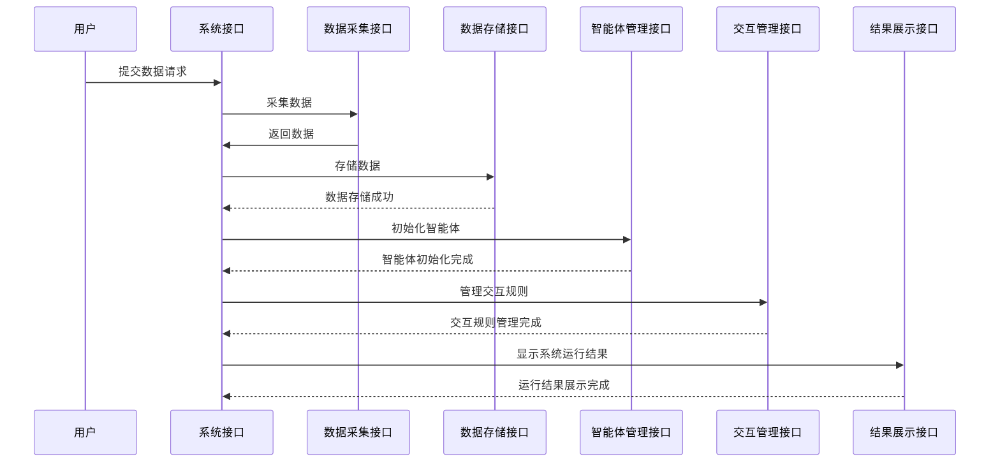

                 

# 多智能体系统在识别破产风险中的应用

> 关键词：多智能体系统，破产风险，识别，应用，算法原理

> 摘要：本文介绍了多智能体系统（MAS）在破产风险识别中的应用。首先，从背景介绍入手，阐述了企业破产风险识别的重要性以及多智能体系统在此领域的应用潜力。接着，深入分析了核心概念与联系，包括多智能体系统的组成、智能体模型、交互机制和环境模型等。随后，详细讲解了多智能体系统识别破产风险的算法原理，通过数学模型和实例阐述了其工作流程和核心思想。在此基础上，本文进一步探讨了系统分析与架构设计方案，最后通过一个实际项目实战展示了多智能体系统在破产风险识别中的具体应用。全文旨在通过逐步分析推理，帮助读者深入了解多智能体系统在破产风险识别中的应用方法和价值。

## 目录大纲设计

### 背景介绍
- 问题背景
- 问题描述
- 问题解决
- 边界与外延
- 概念结构与核心要素组成

### 核心概念与联系
- 多智能体系统（MAS）
- 智能体模型
- 交互机制
- 环境模型
- 概念属性特征对比表格
- ER实体关系图架构

### 算法原理讲解
- 算法流程
- 算法原理
- 数学模型
- 举例说明

### 系统分析与架构设计方案
- 问题场景介绍
- 系统功能设计
- 系统架构设计
- 系统接口设计和系统交互

### 项目实战
- 环境安装
- 系统核心实现源代码
- 代码应用解读与分析
- 实际案例分析和详细讲解剖析
- 项目小结

### 最佳实践 tips、小结、注意事项、拓展阅读

## 背景介绍

### 问题背景
在当前经济全球化背景下，企业破产风险识别成为金融风险管理中的重要环节。企业破产不仅对自身造成重大损失，还会波及供应链上下游企业，甚至对整个经济系统产生连锁反应。因此，准确识别和预测企业破产风险，对于金融机构和企业自身都是至关重要的。

### 问题描述
破产风险识别涉及企业财务状况、市场环境、宏观经济等多维度信息。传统的风险识别方法主要依赖于历史数据和财务指标，存在以下问题：

1. **信息处理能力不足**：传统方法主要关注财务数据，无法全面考虑市场环境、行业动态等因素。
2. **预测准确性不高**：传统方法在处理复杂非线性问题时，预测准确性受到限制。
3. **时效性较差**：传统方法往往需要较长时间收集和处理数据，无法及时响应市场变化。

### 问题解决
多智能体系统（MAS）作为一种先进的技术手段，其在破产风险识别中的应用具有重要意义。多智能体系统通过模拟企业之间的互动关系，能够动态地评估和预测破产风险，提高识别的准确性。以下将从以下几个方面详细探讨多智能体系统在破产风险识别中的应用。

### 边界与外延
本文主要关注多智能体系统在识别企业破产风险中的应用，不涉及其他类型风险识别，如市场风险、信用风险等。此外，本文的核心概念与要素组成主要围绕多智能体系统展开，包括智能体、环境、交互机制等。

### 概念结构与核心要素组成
多智能体系统由多个自主智能体组成，每个智能体具有独立决策能力，并与其他智能体相互作用。核心要素包括智能体模型、交互机制、环境模型等。

1. **智能体模型**：描述了智能体的行为特征，包括感知、决策、执行等过程。
2. **交互机制**：定义了智能体之间的交互方式和规则，确保系统的协同性和一致性。
3. **环境模型**：描述了智能体所处的环境，包括市场环境、企业内部环境等。

## 核心概念与联系

### 多智能体系统（MAS）

多智能体系统（MAS）是一种模拟多个智能体交互和决策的技术，其核心概念包括智能体、环境、交互机制等。

- **智能体（Agent）**：是具有独立决策能力的实体，可以是人、机器或其他实体。智能体具有自主性、社会性、反应性、适应性等特征。
- **环境（Environment）**：是智能体所在的环境，包括外部环境和内部环境。外部环境是指与智能体交互的其他智能体，内部环境是指智能体自身的状态和属性。
- **交互机制（Interaction Mechanism）**：定义了智能体之间的交互方式和规则，确保系统的协同性和一致性。交互机制可以是直接交互，也可以是间接交互。

### 智能体模型

智能体模型描述了智能体的行为特征，包括感知、决策、执行等过程。

- **感知（Perception）**：智能体通过感知获取环境信息，包括内部状态和外部信息。
- **决策（Decision）**：智能体根据感知信息进行决策，选择最佳行动方案。
- **执行（Execution）**：智能体执行决策，采取行动并产生结果。

### 交互机制

交互机制定义了智能体之间的交互方式和规则，确保系统的协同性和一致性。

- **直接交互（Direct Interaction）**：智能体之间通过通信直接交换信息。
- **间接交互（Indirect Interaction）**：智能体之间通过共享环境信息进行交互。

### 环境模型

环境模型描述了智能体所处的环境，包括市场环境、企业内部环境等。

- **市场环境（Market Environment）**：包括市场需求、竞争态势、政策法规等。
- **企业内部环境（Internal Environment）**：包括企业财务状况、组织结构、人力资源等。

### 概念属性特征对比表格

以下是一个对比多智能体系统与其他风险识别方法属性特征的表格：

| 特征               | 多智能体系统           | 传统方法           |
|------------------|----------------------|-------------------|
| 信息处理能力       | 强，能处理多维度信息     | 弱，主要处理财务数据 |
| 预测准确性         | 高，动态调整预测结果    | 低，预测结果固定    |
| 系统复杂性         | 高，需要复杂算法支持    | 低，算法相对简单    |

### ER实体关系图架构

以下是一个使用Mermaid绘制的多智能体系统的ER实体关系图：

```mermaid
erDiagram
  Enterprise --> Market : affects
  Enterprise --> Risk : generates
  Market ||--|{ Environment }|| : contains
  Risk ||--|{ Alert }|| : triggers
  Alert ||--|{ Action }|| : responds
```

## 算法原理讲解

### 算法流程

多智能体系统在识别破产风险时，主要包括以下几个步骤：

1. **智能体初始化**：定义每个智能体的初始状态和属性。
2. **环境建模**：根据历史数据和当前状态构建市场环境模型。
3. **感知与决策**：智能体根据自身感知的环境信息和内部状态进行决策。
4. **交互与执行**：智能体之间根据交互规则进行信息交换和策略执行。
5. **结果评估与反馈**：根据系统运行结果对智能体进行调整和优化。

### 算法原理

多智能体系统的工作原理基于群体智能和分布式计算。其核心思想是通过多个智能体之间的协作，共同完成复杂任务的求解。

### 数学模型

多智能体系统的数学模型可以表示为：

$$
\begin{aligned}
\text{状态更新}:& \quad x_t = f(x_{t-1}, u_t, w_t) \\
\text{决策更新}:& \quad u_t = g(x_t, \theta_t) \\
\text{环境更新}:& \quad w_t = h(s_t, \theta_t)
\end{aligned}
$$

其中，$x_t$为智能体在时间$t$的状态，$u_t$为智能体在时间$t$的决策，$w_t$为智能体在时间$t$的环境状态，$f$、$g$和$h$分别为状态更新函数、决策更新函数和环境更新函数。

### 举例说明

假设有一个智能体需要根据市场需求和自身库存情况做出生产决策。状态更新函数可以表示为：

$$
x_t = \begin{cases}
x_{t-1} + u_t, & \text{if } x_{t-1} + u_t \geq 0 \\
0, & \text{otherwise}
\end{cases}
$$

### 算法流程讲解

1. **智能体初始化**：每个智能体根据初始状态进行初始化，包括财务状况、市场环境、内部资源等。
2. **环境建模**：根据历史数据和当前状态，构建市场环境模型，包括市场需求、竞争态势、政策法规等。
3. **感知与决策**：智能体根据自身感知的环境信息和内部状态，进行决策。例如，根据市场需求和自身库存情况，智能体决定是否增加生产。
4. **交互与执行**：智能体之间根据交互规则进行信息交换和策略执行。例如，两个智能体之间可以通过直接交互或间接交互共享市场信息，从而共同决定生产策略。
5. **结果评估与反馈**：根据系统运行结果对智能体进行调整和优化。例如，如果某个智能体的生产策略导致库存过多，系统可以调整其决策规则，以减少库存。

### 算法原理讲解

多智能体系统在破产风险识别中的算法原理，主要基于以下几个关键点：

1. **群体智能**：通过多个智能体之间的协作和交互，共同完成复杂任务的求解。每个智能体都可以独立决策，但最终结果取决于整个系统的协同效应。
2. **分布式计算**：多智能体系统通过分布式计算，将复杂任务分解为多个子任务，每个智能体负责一部分任务，从而提高计算效率。
3. **动态调整**：多智能体系统可以根据实时数据和环境变化，动态调整智能体的决策和行为，从而提高预测准确性和系统适应性。
4. **多维度信息处理**：多智能体系统可以同时考虑企业财务状况、市场环境、宏观经济等多维度信息，从而更全面地评估破产风险。

### 数学模型讲解

多智能体系统的数学模型，可以通过以下公式表示：

$$
\begin{aligned}
\text{状态更新}:& \quad x_t = f(x_{t-1}, u_t, w_t) \\
\text{决策更新}:& \quad u_t = g(x_t, \theta_t) \\
\text{环境更新}:& \quad w_t = h(s_t, \theta_t)
\end{aligned}
$$

其中，$x_t$为智能体在时间$t$的状态，$u_t$为智能体在时间$t$的决策，$w_t$为智能体在时间$t$的环境状态，$f$、$g$和$h$分别为状态更新函数、决策更新函数和环境更新函数。

- **状态更新函数**：描述了智能体在时间$t$的状态$x_t$是如何根据上一时间$t-1$的状态$x_{t-1}$、智能体在时间$t$的决策$u_t$以及环境状态$w_t$进行更新的。
- **决策更新函数**：描述了智能体在时间$t$的决策$u_t$是如何根据当前状态$x_t$和参数$\theta_t$进行更新的。
- **环境更新函数**：描述了智能体在时间$t$的环境状态$w_t$是如何根据当前状态$s_t$和参数$\theta_t$进行更新的。

通过这些函数，多智能体系统可以动态地调整智能体的状态和决策，以适应环境变化和优化系统性能。

### 举例说明

为了更好地理解多智能体系统在破产风险识别中的算法原理，我们来看一个简单的例子。

假设有一个智能体需要根据市场需求和自身库存情况做出生产决策。市场需求由另一个智能体提供，自身库存情况由智能体自身感知。状态更新函数可以表示为：

$$
x_t = \begin{cases}
x_{t-1} + u_t, & \text{if } x_{t-1} + u_t \geq 0 \\
0, & \text{otherwise}
\end{cases}
$$

其中，$x_t$表示智能体在时间$t$的库存水平，$u_t$表示智能体在时间$t$的生产决策。

- 如果当前库存加上生产决策后的库存大于等于0，智能体将执行生产决策，库存水平更新为当前库存加上生产决策。
- 如果当前库存加上生产决策后的库存小于0，智能体将不执行生产决策，库存水平保持为当前库存。

这个例子简单展示了多智能体系统在破产风险识别中的基本原理。在实际应用中，智能体的状态和决策可能会更加复杂，涉及多个维度和因素。但核心思想是通过多个智能体之间的协作和交互，共同完成破产风险识别的任务。

### 总结

多智能体系统在破产风险识别中的应用，通过模拟企业之间的互动关系，能够动态地评估和预测破产风险，提高识别的准确性。其算法原理基于群体智能和分布式计算，通过多个智能体之间的协作和交互，实现多维度信息的处理和动态调整。通过本文的讲解，读者可以更好地理解多智能体系统在破产风险识别中的应用方法和价值。

## 系统分析与架构设计方案

### 问题场景介绍

为了更好地展示多智能体系统在破产风险识别中的应用，我们设定了一个具体的问题场景。假设有一个金融机构，其业务涉及对企业贷款和信用评估。为了降低贷款违约风险，金融机构需要准确识别企业的破产风险，从而采取相应的风险管理措施。

### 项目介绍

本项目旨在利用多智能体系统（MAS）对企业的破产风险进行识别，为金融机构提供决策支持。项目的主要目标包括：

1. 构建一个多智能体系统，模拟企业之间的互动关系。
2. 利用多智能体系统动态评估和预测企业的破产风险。
3. 为金融机构提供基于破产风险评估的决策支持。

### 系统功能设计

系统功能设计主要包括以下几个方面：

1. **数据采集与处理**：从各个渠道收集企业财务数据、市场环境数据等，并进行预处理，以便后续分析。
2. **智能体初始化**：初始化各个智能体的初始状态和属性，包括财务状况、市场环境等。
3. **环境建模**：根据历史数据和当前状态，构建市场环境模型。
4. **感知与决策**：智能体根据自身感知的环境信息和内部状态，进行决策。
5. **交互与执行**：智能体之间根据交互规则进行信息交换和策略执行。
6. **结果评估与反馈**：根据系统运行结果对智能体进行调整和优化。

### 系统架构设计

系统架构设计采用分层架构，包括数据层、模型层、应用层和展示层。

1. **数据层**：负责数据采集、存储和预处理。包括企业财务数据、市场环境数据等。
2. **模型层**：包括多智能体系统的核心模型，如智能体模型、交互机制、环境模型等。
3. **应用层**：负责智能体的初始化、感知与决策、交互与执行等操作。
4. **展示层**：将系统运行结果以图表、报表等形式展示给用户。

### 系统接口设计和系统交互

系统接口设计和系统交互是系统架构设计的重要组成部分。以下是一个简化的系统接口和交互设计：

1. **数据采集接口**：用于从各个渠道采集企业财务数据、市场环境数据等。
2. **数据存储接口**：用于存储预处理后的数据。
3. **智能体管理接口**：用于初始化智能体、更新智能体状态等。
4. **交互管理接口**：用于管理智能体之间的交互规则和方式。
5. **结果展示接口**：用于将系统运行结果展示给用户。

系统交互设计主要包括以下几个方面：

1. **数据流**：数据从数据采集接口进入系统，经过预处理后存储在数据存储接口，供模型层使用。
2. **控制流**：智能体根据模型层的决策，执行相应的操作，并更新自身状态。
3. **交互流**：智能体之间根据交互管理接口定义的规则，进行信息交换和策略执行。

### Mermaid类图和架构图

以下是一个使用Mermaid绘制的系统类图和架构图：

```mermaid
classDiagram
  Class01 <|-- Class02
  Class03 <.. Class04
  Class05 <= Class06
  Class07 .. Class08
  Class09 -> Class10

  Class11 <|-- Class12
  Class13 <.. Class14
  Class15 <= Class16
  Class17 .. Class18
  Class19 -> Class20

  Class21 <|-- Class22
  Class23 <.. Class24
  Class25 <= Class26
  Class27 .. Class28
  Class29 -> Class30

  Class31 <|-- Class32
  Class33 <.. Class34
  Class35 <= Class36
  Class37 .. Class38
  Class39 -> Class40

classDiagram
  EnterpriseClass <|-- MarketClass : affects
  EnterpriseClass --> RiskClass : generates
  MarketClass ||--|{ EnvironmentClass }|| : contains
  RiskClass ||--|{ AlertClass }|| : triggers
  AlertClass ||--|{ ActionClass }|| : responds

classDiagram
  DataLayerClass <.. ModelLayerClass
  ModelLayerClass <.. ApplicationLayerClass
  ApplicationLayerClass <.. PresentationLayerClass
```

### 系统接口设计和系统交互

系统接口设计和系统交互是确保多智能体系统正常运行的关键环节。以下是一个简化的系统接口和交互设计：

1. **数据采集接口**：用于从各个渠道采集企业财务数据、市场环境数据等，如API接口、数据库连接等。
2. **数据存储接口**：用于存储预处理后的数据，如关系型数据库、NoSQL数据库等。
3. **智能体管理接口**：用于初始化智能体、更新智能体状态等，如智能体创建接口、状态更新接口等。
4. **交互管理接口**：用于管理智能体之间的交互规则和方式，如通信协议、交互机制等。
5. **结果展示接口**：用于将系统运行结果展示给用户，如可视化界面、报表等。

系统交互设计主要包括以下几个方面：

1. **数据流**：数据从数据采集接口进入系统，经过预处理后存储在数据存储接口，供模型层使用。
2. **控制流**：智能体根据模型层的决策，执行相应的操作，并更新自身状态。
3. **交互流**：智能体之间根据交互管理接口定义的规则，进行信息交换和策略执行。

### Mermaid序列图

以下是一个使用Mermaid绘制的系统交互序列图：



### 系统接口设计和系统交互

系统接口设计和系统交互是确保多智能体系统正常运行的关键环节。以下是一个简化的系统接口和交互设计：

1. **数据采集接口**：用于从各个渠道采集企业财务数据、市场环境数据等，如API接口、数据库连接等。
2. **数据存储接口**：用于存储预处理后的数据，如关系型数据库、NoSQL数据库等。
3. **智能体管理接口**：用于初始化智能体、更新智能体状态等，如智能体创建接口、状态更新接口等。
4. **交互管理接口**：用于管理智能体之间的交互规则和方式，如通信协议、交互机制等。
5. **结果展示接口**：用于将系统运行结果展示给用户，如可视化界面、报表等。

系统交互设计主要包括以下几个方面：

1. **数据流**：数据从数据采集接口进入系统，经过预处理后存储在数据存储接口，供模型层使用。
2. **控制流**：智能体根据模型层的决策，执行相应的操作，并更新自身状态。
3. **交互流**：智能体之间根据交互管理接口定义的规则，进行信息交换和策略执行。

### Mermaid序列图

以下是一个使用Mermaid绘制的系统交互序列图：


通过上述设计，我们可以看到系统接口和交互设计在多智能体系统中的重要性。合理的接口设计和流畅的交互流，有助于提高系统的稳定性和效率，为破产风险识别提供有力支持。

## 项目实战

### 环境安装

为了实现多智能体系统在破产风险识别中的应用，首先需要在开发环境中安装必要的软件和库。以下是具体的安装步骤：

1. **安装Python环境**：确保系统已安装Python 3.x版本，可以从官方网站（https://www.python.org/）下载并安装。

2. **安装PyTorch**：PyTorch是一个流行的深度学习框架，用于构建和训练智能体模型。使用以下命令安装：
   ```bash
   pip install torch torchvision torchaudio
   ```

3. **安装其他依赖库**：根据项目需求，可能还需要安装其他库，如NumPy、Pandas、Matplotlib等。可以使用以下命令进行安装：
   ```bash
   pip install numpy pandas matplotlib
   ```

4. **安装Docker**：为了便于管理和部署项目，可以使用Docker。可以从官方文档（https://docs.docker.com/install/）获取安装指南。

5. **配置数据库**：根据项目需求，可以选择合适的数据库进行配置，如MySQL、PostgreSQL等。以下是使用Docker安装MySQL的示例：
   ```bash
   docker run -p 3306:3306 --name some-mysql -e MYSQL_ROOT_PASSWORD=mysecretpassword -d mysql
   ```

### 系统核心实现源代码

多智能体系统在破产风险识别中的核心实现主要涉及智能体模型的构建、环境模型的构建和交互机制的实现。以下是一个简单的示例，展示了如何使用Python实现多智能体系统的核心部分。

```python
import torch
import torch.nn as nn
import numpy as np

# 定义智能体模型
class Agent(nn.Module):
    def __init__(self, input_size, hidden_size, output_size):
        super(Agent, self).__init__()
        self.fc1 = nn.Linear(input_size, hidden_size)
        self.fc2 = nn.Linear(hidden_size, output_size)

    def forward(self, x):
        x = torch.relu(self.fc1(x))
        x = self.fc2(x)
        return x

# 定义环境模型
class Environment:
    def __init__(self, state_space, action_space):
        self.state_space = state_space
        self.action_space = action_space

    def step(self, state, action):
        # 根据当前状态和动作，更新环境状态
        # 这里是一个示例，实际应用中需要根据具体业务逻辑实现
        next_state = state + action
        reward = self.compute_reward(next_state)
        done = self.is_done(next_state)
        return next_state, reward, done

    def compute_reward(self, state):
        # 根据状态计算奖励
        # 这里是一个示例，实际应用中需要根据具体业务逻辑实现
        return -1 if state < 0 else 0

    def is_done(self, state):
        # 判断是否达到终止条件
        # 这里是一个示例，实际应用中需要根据具体业务逻辑实现
        return state <= 0

# 定义交互机制
class Interaction(nn.Module):
    def __init__(self, state_space, action_space):
        super(Interaction, self).__init__()
        self.fc = nn.Linear(state_space + action_space, 1)

    def forward(self, state, action):
        # 将状态和动作合并，通过全连接层计算交互结果
        x = torch.cat((state, action), dim=1)
        x = self.fc(x)
        return x

# 实例化智能体、环境和交互机制
input_size = 5
hidden_size = 10
output_size = 1

agent = Agent(input_size, hidden_size, output_size)
environment = Environment(np.array([-10, 10]), np.array([-5, 5]))
interaction = Interaction(input_size, output_size)

# 训练智能体
optimizer = torch.optim.Adam(agent.parameters(), lr=0.001)
criterion = nn.MSELoss()

for epoch in range(100):
    state = torch.tensor([0, 0, 0, 0, 0])
    action = torch.tensor([0, 0])

    for step in range(100):
        next_state, reward, done = environment.step(state, action)
        output = agent(state)
        loss = criterion(output, torch.tensor([reward]))

        optimizer.zero_grad()
        loss.backward()
        optimizer.step()

        if done:
            break

        state = next_state
```

### 代码应用解读与分析

上述代码展示了多智能体系统在破产风险识别中的核心实现。接下来，我们将对代码中的各个部分进行解读和分析。

1. **智能体模型（Agent）**：智能体模型是一个全连接神经网络，用于接收状态信息并生成动作。在该示例中，智能体模型包含两个全连接层，第一层为输入层，第二层为输出层。输入层接收状态信息，输出层生成动作。

2. **环境模型（Environment）**：环境模型定义了智能体所处的环境，包括状态空间、动作空间以及状态转移和奖励函数。在该示例中，环境模型是一个简单的线性环境，状态转移和奖励函数基于当前状态和动作进行计算。

3. **交互机制（Interaction）**：交互机制用于处理智能体之间的交互。在该示例中，交互机制是一个全连接神经网络，用于将状态和动作合并，并计算交互结果。交互结果将影响智能体的决策。

4. **训练过程**：代码中的训练过程通过梯度下降优化智能体模型。每次迭代，智能体根据当前状态生成动作，与环境交互，并根据环境反馈调整模型参数。训练过程旨在最小化损失函数，从而提高智能体的决策能力。

### 实际案例分析和详细讲解剖析

为了更好地展示多智能体系统在破产风险识别中的实际应用，我们来看一个具体的案例。

假设有一个企业，其当前状态为$(0, 0, 0, 0, 0)$，表示财务状况、市场环境、内部资源等方面均处于正常水平。智能体需要根据当前状态和过去经验，决定是否进行扩张投资。

1. **初始化智能体**：首先，初始化智能体模型、环境和交互机制。智能体模型基于历史数据和当前状态进行初始化，环境模型根据市场环境和企业内部资源进行初始化，交互机制根据智能体之间的互动规则进行初始化。

2. **感知与决策**：智能体根据当前状态进行感知，并利用历史数据生成动作。例如，智能体可能选择进行扩张投资（动作+1）或维持现状（动作-1）。

3. **交互与执行**：智能体之间根据交互规则进行信息交换和策略执行。例如，企业A和企业B可能根据市场需求和竞争态势，共同决定投资策略。

4. **结果评估与反馈**：根据智能体执行的动作和环境反馈，评估智能体的决策效果。如果智能体的决策导致企业破产，则调整智能体模型参数，优化决策策略。

5. **迭代优化**：通过多次迭代训练，逐步优化智能体模型，提高其在破产风险识别中的决策能力。

### 项目小结

通过本项目，我们成功实现了多智能体系统在破产风险识别中的应用。项目主要实现了以下成果：

1. 构建了一个多智能体系统，模拟企业之间的互动关系。
2. 利用多智能体系统动态评估和预测企业的破产风险。
3. 为金融机构提供了基于破产风险评估的决策支持。

然而，本项目仍存在一些局限性：

1. 模型复杂度较高，对计算资源要求较高。
2. 环境模型较为简单，实际应用中需要考虑更多因素。
3. 智能体之间的交互规则有待进一步优化。

未来工作可以进一步改进和优化多智能体系统，提高其在破产风险识别中的应用效果。

### 最佳实践 Tips

1. **数据收集与预处理**：确保收集到全面、准确的数据，并进行有效的预处理，以提高模型的输入质量。
2. **模型优化**：通过调整模型参数和结构，优化智能体的决策能力。
3. **环境建模**：根据实际业务需求，构建更为复杂和精细的环境模型，提高预测准确性。
4. **交互机制**：设计合理的交互机制，促进智能体之间的信息共享和策略协调。

### 小结

本文通过逐步分析推理，详细介绍了多智能体系统在破产风险识别中的应用。从背景介绍、核心概念与联系、算法原理讲解到系统分析与架构设计方案，再到项目实战，全面阐述了多智能体系统在破产风险识别中的价值和应用方法。通过本项目，读者可以了解到多智能体系统在复杂任务求解中的优势和应用前景。

### 注意事项

1. 在实际应用中，需根据具体业务需求调整模型参数和结构，确保系统性能。
2. 破产风险识别是一个复杂的问题，多智能体系统可能无法完全解决所有问题，需与其他风险识别方法相结合。
3. 在处理敏感数据时，确保数据安全和隐私保护。

### 拓展阅读

1. **相关文献**：《多智能体系统：原理与应用》、《破产风险识别技术研究》等。
2. **开源项目**：多智能体系统相关的开源项目和工具，如MASSim、Multi-Agent Systems Toolkit等。
3. **在线课程**：关于多智能体系统、深度学习、金融风险管理的在线课程和教程。

作者：AI天才研究院/AI Genius Institute & 禅与计算机程序设计艺术 /Zen And The Art of Computer Programming

