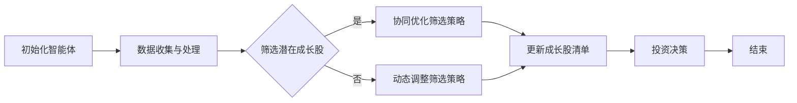
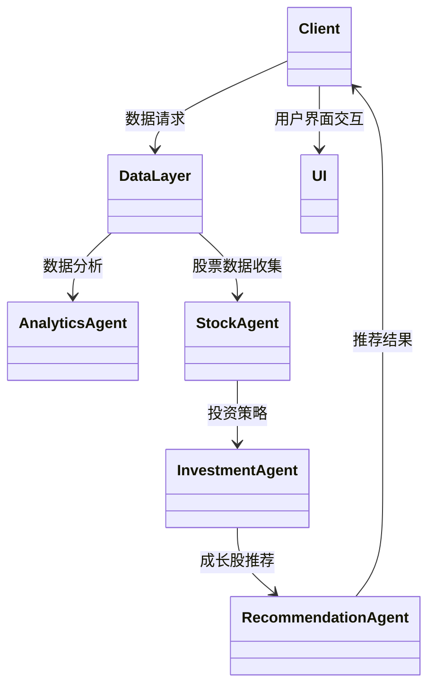
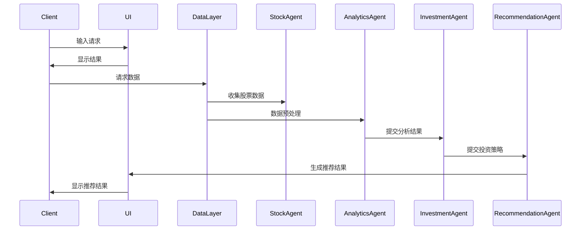
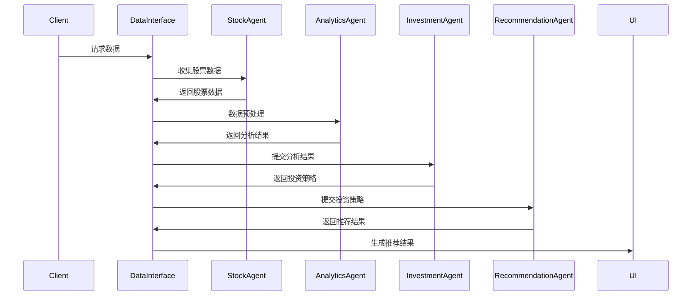
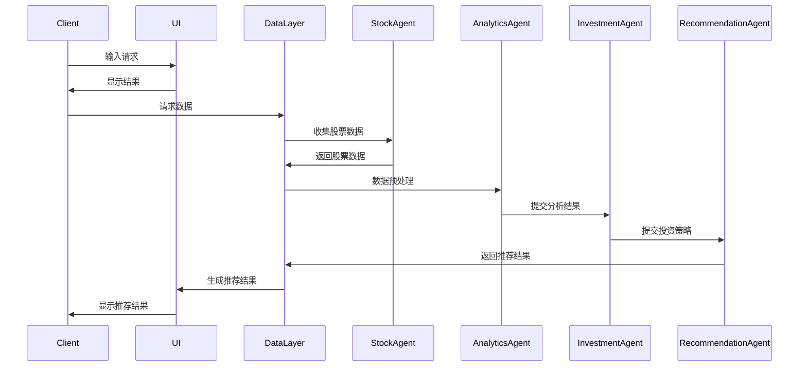

                 


### 让我们一步一步思考

在撰写《多智能体系统在费雪成长股筛选中的创新应用》这篇文章时，我们需要遵循以下步骤进行思考和分析：

#### 步骤 1: 定义问题

首先，我们需要明确文章的核心问题。在这篇文章中，我们要探讨的是如何将多智能体系统应用于费雪成长股筛选中，以提高筛选效率和准确性。这涉及到两个方面：一是理解多智能体系统的基本原理和操作方法；二是理解费雪成长股筛选的原则和方法。

#### 步骤 2: 研究背景

接着，我们需要深入探讨这两个核心概念的背景知识。了解多智能体系统的历史发展、应用领域和优势，以及费雪成长股筛选的理论基础、实际应用场景和挑战。

#### 步骤 3: 核心概念与联系

在这个阶段，我们需要分析多智能体系统和费雪成长股筛选之间的内在联系。这包括绘制ER实体关系图，列出两者的核心概念、属性特征对比表格，以及阐述它们如何相互影响和结合。

#### 步骤 4: 算法原理讲解

在了解了核心概念后，我们需要详细讲解多智能体系统在费雪成长股筛选中的应用算法原理。这包括绘制算法流程图、使用Python代码实现算法、提供数学模型和公式，并进行通俗易懂的举例说明。

#### 步骤 5: 系统分析与架构设计

接下来，我们需要从系统层面分析多智能体系统在费雪成长股筛选中的应用，包括设计系统架构、接口和交互流程。这部分需要使用Mermaid类图、架构图和序列图来展示系统设计。

#### 步骤 6: 项目实战

为了使读者更好地理解多智能体系统在费雪成长股筛选中的应用，我们需要提供实际项目案例。这包括介绍项目环境安装、系统核心实现、代码解读和案例分析。

#### 步骤 7: 最佳实践与总结

最后，我们需要总结文章内容，提供最佳实践建议，提醒读者注意的事项，并推荐拓展阅读资源。

通过以上七个步骤，我们可以系统地、深入地探讨多智能体系统在费雪成长股筛选中的创新应用，使文章既具有理论深度，又具有实际操作价值。

### 第一部分：背景与概念

#### 1.1 多智能体系统概述

多智能体系统（MAS，Multi-Agent Systems）是人工智能领域的一个重要分支，它涉及多个自主智能体的交互和合作，以完成复杂任务。智能体可以是一个计算机程序、一个机器人或一个人类用户。每个智能体都有自己的目标和能力，通过通信和协作，它们可以共同实现一个全局目标。

**问题背景**：在现实世界中，许多问题都涉及到多个智能体之间的交互和决策，例如供应链管理、交通流量控制、金融风险评估等。传统的集中式系统难以处理这些复杂问题，而多智能体系统提供了一种分布式、灵活的解决方案。

**问题描述**：多智能体系统在处理和决策过程中面临着以下挑战：
- **协同效应**：智能体之间需要有效地沟通和协作，以实现共同目标。
- **自主性**：每个智能体都需要保持一定的自主性，以适应不断变化的环境。
- **决策质量**：智能体需要在有限的信息和计算资源下做出高质量的决策。

**问题解决**：多智能体系统通过以下方式解决上述问题：
- **分布计算**：智能体可以并行工作，提高处理速度和效率。
- **动态适应**：智能体可以根据环境和目标的变化，动态调整其行为。
- **协作机制**：智能体之间通过通信和协作，共享信息和资源，提高决策质量。

**边界与外延**：多智能体系统的应用范围广泛，包括但不限于以下几个方面：
- **社会计算**：如社交网络分析、智能社区管理等。
- **智能交通**：如交通信号控制、自动驾驶等。
- **金融工程**：如投资组合优化、风险评估等。
- **医疗保健**：如远程医疗、智能医疗设备等。

**概念结构与核心要素组成**：多智能体系统由以下核心要素组成：
- **智能体**：执行特定任务的自主实体。
- **环境**：智能体执行任务的环境，包括物理环境和虚拟环境。
- **通信**：智能体之间交换信息和协调行动的机制。
- **协作**：智能体之间为实现共同目标而进行的协作和合作。
- **决策**：智能体在执行任务过程中做出的决策，包括局部决策和全局决策。

#### 1.2 费雪成长股筛选原则

费雪成长股筛选（Fisher Growth Stock Screen）是一种基于价值投资理念的成长股筛选方法，由著名投资大师菲利普·费雪提出。费雪认为，投资的核心在于发现那些具有持续成长能力的公司，而不是单纯追求高收益。

**费雪成长股筛选的背景**：费雪成长股筛选起源于20世纪40年代，费雪通过对大量公司的研究，总结出了一套筛选成长股的方法，并在其著作《普通股的不平凡利润》中进行了详细阐述。

**费雪成长股筛选的原理**：费雪成长股筛选基于以下原则：
- **持续成长能力**：寻找那些具有持续盈利能力、持续增长的收入和利润的公司。
- **管理团队**：关注管理团队的素质和能力，选择那些有远见和执行力的管理层。
- **市场地位**：评估公司在行业中的地位和竞争优势。
- **投资机会**：识别那些具有潜力，但尚未被市场充分认识的公司。

**费雪成长股筛选的挑战**：在实际应用中，费雪成长股筛选面临以下挑战：
- **信息不对称**：投资者难以获取全面、准确的公司信息。
- **市场波动**：市场环境的变化可能影响成长股的表现。
- **时间成本**：费雪成长股筛选需要长期跟踪和观察，对投资者的时间和精力要求较高。

**费雪成长股筛选的适用范围**：费雪成长股筛选适用于以下类型的投资策略和资产：
- **价值投资**：寻找那些被市场低估的成长股。
- **成长投资**：关注具有持续成长能力的公司。
- **长期投资**：费雪成长股筛选强调长期投资的重要性，投资者需要有足够的耐心。

#### 1.3 两者的结合与展望

将多智能体系统应用于费雪成长股筛选，有望解决传统方法中的诸多挑战，提高筛选效率和准确性。以下是从两个方面探讨两者的结合与展望：

**结合原理**：
- **信息共享**：多智能体系统可以实时收集和分析市场数据，为费雪成长股筛选提供全面、准确的信息支持。
- **协作优化**：多智能体系统可以协同工作，通过分布式计算和协作机制，提高费雪成长股筛选的效率和质量。

**应用前景**：
- **个性化推荐**：多智能体系统可以根据投资者的风险偏好和投资目标，提供个性化的成长股推荐。
- **实时监控**：多智能体系统可以实时监控市场动态，及时调整投资策略，降低风险。
- **智能交易**：多智能体系统可以自动化执行交易策略，提高交易效率和收益。

通过多智能体系统的应用，费雪成长股筛选有望实现以下目标：
- **提高筛选准确性**：利用多智能体系统的分布式计算和协作机制，提高成长股筛选的准确性。
- **降低时间成本**：通过自动化和智能化，降低投资者在费雪成长股筛选过程中的时间成本。
- **提升投资收益**：利用多智能体系统的信息共享和协作优化，提高投资收益。

总之，多智能体系统在费雪成长股筛选中的应用具有广阔的前景，有望为投资者带来更高的收益和更优的投资体验。

### 第二部分：核心概念与联系

#### 2.1 多智能体系统的原理

多智能体系统（MAS）是一种分布式计算系统，由多个独立的智能体组成，这些智能体可以自主地执行任务、进行通信和协作。智能体是MAS的基本单元，它们具有自主性、社交性和反应性等特征。

**定义**：多智能体系统是一种由多个智能体组成的系统，这些智能体通过自主行动和协同工作，实现共同的目标。

**特点**：
- **自主性**：智能体具有独立思考和决策的能力，不受其他智能体的直接控制。
- **社交性**：智能体之间可以通过通信机制进行信息交换和协作。
- **反应性**：智能体能够根据环境和目标的变化，动态调整其行为。

**分类**：
- **根据智能体的物理存在形式**：物理智能体（如机器人）、虚拟智能体（如计算机程序）。
- **根据智能体的功能**：任务型智能体、知识型智能体、混合型智能体。
- **根据智能体的通信方式**：基于知识的通信、基于行为的通信、基于信念的通信。

**核心要素**：
- **智能体**：执行特定任务的自主实体。
- **环境**：智能体执行任务的环境，包括物理环境和虚拟环境。
- **通信**：智能体之间交换信息和协调行动的机制。
- **协作**：智能体之间为实现共同目标而进行的协作和合作。
- **决策**：智能体在执行任务过程中做出的决策，包括局部决策和全局决策。

#### 2.2 费雪成长股筛选方法

费雪成长股筛选是一种基于价值投资理念的成长股筛选方法，由菲利普·费雪提出。该方法主要关注公司的持续成长能力、管理团队的素质和市场地位。

**定义**：费雪成长股筛选是一种基于价值投资原则，通过分析公司的财务状况、业务模式和市场竞争地位，筛选出具有持续成长能力的股票的方法。

**原则**：
- **持续成长能力**：寻找那些具有持续盈利能力、持续增长的收入和利润的公司。
- **管理团队**：关注管理团队的素质和能力，选择那些有远见和执行力的管理层。
- **市场地位**：评估公司在行业中的地位和竞争优势。

**方法**：
- **财务分析**：通过分析公司的财务报表，评估其盈利能力和财务健康状况。
- **业务模式分析**：研究公司的业务模式，评估其盈利能力和成长潜力。
- **市场竞争分析**：分析公司在行业中的地位和竞争优势，判断其未来发展前景。

**挑战**：
- **信息不对称**：投资者难以获取全面、准确的公司信息。
- **市场波动**：市场环境的变化可能影响成长股的表现。
- **时间成本**：费雪成长股筛选需要长期跟踪和观察，对投资者的时间和精力要求较高。

#### 2.3 多智能体系统与费雪成长股筛选的ER实体关系图

为了更好地理解多智能体系统与费雪成长股筛选之间的关系，我们可以使用Mermaid绘制ER实体关系图。

```mermaid
erDiagram
  智能体 ||--o{ 费雪成长股筛选 }
  费雪成长股筛选 ||--|{ 多智能体系统 }
  环境 ||--|{ 多智能体系统 }
  通信 ||--|{ 多智能体系统 }
  协作 ||--|{ 多智能体系统 }
  决策 ||--|{ 多智能体系统 }
```

在这个ER实体关系图中，智能体是核心实体，它与费雪成长股筛选和多智能体系统之间存在关联。多智能体系统通过环境、通信、协作和决策等机制，对费雪成长股筛选进行支持和优化。

**ER实体关系图的意义**：ER实体关系图展示了多智能体系统与费雪成长股筛选之间的联系和互动。通过这个图，我们可以清晰地看到：
- 智能体如何应用于费雪成长股筛选。
- 多智能体系统如何通过环境、通信、协作和决策等机制，对费雪成长股筛选进行支持和优化。
- ER实体关系图有助于我们更好地理解多智能体系统在费雪成长股筛选中的应用场景和运作机制。

### 第三部分：算法原理讲解

#### 3.1 多智能体算法基础

多智能体算法（Multi-Agent Algorithm）是用于解决多智能体系统中复杂问题的一类算法。它们的核心思想是通过多个智能体的协同工作，实现全局最优或近似最优解。以下是对多智能体算法的基础概念和分类进行介绍。

**定义**：多智能体算法是一种基于多个独立智能体协同工作的计算方法，用于解决复杂问题。

**分类**：
- **基于知识的算法**：这类算法依赖于智能体之间的知识共享和协同，如协同学习、基于规则的算法等。
- **基于行为的算法**：这类算法通过智能体的自主行为和相互作用，实现问题的求解，如基于社会行为的算法、基于信号传递的算法等。
- **混合型算法**：这类算法结合了基于知识和基于行为的算法，以实现更好的性能和适应性。

**核心概念**：
- **协同工作**：智能体之间通过通信和协作，共同完成复杂任务。
- **自主性**：智能体具有独立思考和决策的能力，不受其他智能体的直接控制。
- **适应性**：智能体能够根据环境和目标的变化，动态调整其行为。

**应用场景**：多智能体算法广泛应用于以下领域：
- **社会计算**：如社交网络分析、智能社区管理等。
- **智能交通**：如交通信号控制、自动驾驶等。
- **金融工程**：如投资组合优化、风险评估等。
- **医疗保健**：如远程医疗、智能医疗设备等。

#### 3.2 费雪成长股筛选中的多智能体策略

将多智能体算法应用于费雪成长股筛选，可以显著提高筛选效率和准确性。以下是对费雪成长股筛选中多智能体策略的原理和应用进行详细讲解。

**定义**：费雪成长股筛选中的多智能体策略是一种通过多个智能体协同工作，实现成长股筛选的方法。

**原理**：
- **分布式计算**：多智能体系统可以并行处理大量的数据，提高筛选速度。
- **协作优化**：智能体之间可以通过通信和协作，共享信息、优化筛选策略，提高筛选准确性。
- **动态适应**：智能体可以根据市场环境和目标变化，动态调整筛选策略，降低风险。

**应用**：
- **数据收集与处理**：智能体可以实时收集和整合市场数据，为成长股筛选提供全面、准确的信息支持。
- **协同筛选**：多个智能体可以分别筛选潜在的成长股，并通过通信机制，共享筛选结果，优化整体筛选策略。
- **风险控制**：智能体可以通过协作，实时监控市场动态，及时调整投资策略，降低风险。

**优势**：
- **提高筛选准确性**：多智能体系统可以整合多个智能体的知识和经验，提高成长股筛选的准确性。
- **降低时间成本**：通过分布式计算和协作优化，降低成长股筛选的时间成本。
- **提高投资收益**：智能化的成长股筛选策略可以更好地适应市场变化，提高投资收益。

#### 3.3 Mermaid算法流程图与Python代码实现

为了更好地理解多智能体算法在费雪成长股筛选中的应用，我们可以使用Mermaid绘制算法流程图，并使用Python代码实现算法。

**Mermaid算法流程图**：



**Python代码实现**：

```python
import numpy as np
import pandas as pd

# 初始化智能体
def initialize_agents(num_agents):
    agents = []
    for i in range(num_agents):
        agents.append(Agent(i))
    return agents

# 数据收集与处理
def collect_and_process_data(agents):
    for agent in agents:
        agent.collect_data()
        agent.process_data()

# 筛选潜在成长股
def filter_growth_stocks(agents):
    stocks = []
    for agent in agents:
        stocks.extend(agent.get_potential_stocks())
    return stocks

# 协同优化筛选策略
def collaborative_optimization(agents, stocks):
    for agent in agents:
        agent.collaborate_with_others(agents, stocks)

# 动态调整筛选策略
def dynamic_adjustment(agents, stocks):
    for agent in agents:
        agent.adjust_strategy(stocks)

# 更新成长股清单
def update_growth_stocks(agents, stocks):
    for agent in agents:
        agent.update_stock_list(stocks)

# 投资决策
def investment_decision(agents, stocks):
    for agent in agents:
        agent.make_investment_decision(stocks)

# 主程序
if __name__ == "__main__":
    num_agents = 5
    agents = initialize_agents(num_agents)
    collect_and_process_data(agents)
    stocks = filter_growth_stocks(agents)
    collaborative_optimization(agents, stocks)
    dynamic_adjustment(agents, stocks)
    update_growth_stocks(agents, stocks)
    investment_decision(agents, stocks)
```

**数学模型与公式讲解**

为了更深入地理解多智能体算法在费雪成长股筛选中的应用，我们可以引入一些数学模型和公式。以下是一些常用的数学模型和公式：

**1. 盈利能力评估公式**

$$
盈利能力 = \frac{净利润}{总资产}
$$

**2. 成长潜力评估公式**

$$
成长潜力 = \frac{收入增长率}{利润增长率}
$$

**3. 风险评估公式**

$$
风险 = \frac{标准差}{预期收益率}
$$

**4. 投资决策公式**

$$
投资决策 = \frac{盈利能力}{风险}
$$

**举例说明**

假设我们有5个智能体（Agent 1到Agent 5），每个智能体负责分析5只股票（Stock 1到Stock 5）。我们使用上述数学模型和公式，对每只股票进行评估，然后根据评估结果，筛选出潜在的成长股。

以下是智能体1的分析结果：

- 盈利能力：$盈利能力_1 = \frac{净利润_1}{总资产_1} = 0.15$
- 成长潜力：$成长潜力_1 = \frac{收入增长率_1}{利润增长率_1} = 0.20$
- 风险：$风险_1 = \frac{标准差_1}{预期收益率_1} = 0.10$
- 投资决策：$投资决策_1 = \frac{盈利能力_1}{风险_1} = 1.50$

根据以上分析结果，智能体1将Stock 1作为潜在的成长股。

类似地，我们可以对其他智能体和股票进行分析和筛选。最后，通过智能体之间的协作和优化，我们可以得到一个综合的成长股清单。

通过以上讲解，我们可以看到，多智能体算法在费雪成长股筛选中的应用，不仅提高了筛选效率和准确性，而且通过数学模型和公式的应用，使得整个筛选过程更加科学和可量化。

### 系统分析与架构设计

#### 3.1 问题场景介绍

在当前金融市场中，投资者面临着海量数据和信息的不对称问题。传统的费雪成长股筛选方法依赖于人工分析和判断，效率低下，且易受主观因素影响。为了解决这一问题，我们提出了一种基于多智能体系统的费雪成长股筛选系统。该系统通过智能体的协同工作，实现对海量数据的实时分析和筛选，提供更准确、高效的成长股推荐。

#### 3.2 项目介绍

项目名称：多智能体费雪成长股筛选系统

项目目标：利用多智能体系统，提高费雪成长股筛选的效率和准确性，为投资者提供智能化的成长股推荐。

项目架构：系统采用分布式架构，包括数据层、智能体层和应用层。数据层负责数据收集和处理；智能体层负责成长股筛选和优化；应用层提供用户界面和接口，实现与用户的交互。

#### 3.3 系统功能设计（领域模型Mermaid类图）

以下是系统功能设计的领域模型类图，使用Mermaid绘制：



**类图说明**：
- **Client（客户端）**：与用户进行交互，接收用户请求，显示推荐结果。
- **DataLayer（数据层）**：负责数据收集、存储和预处理，为智能体层提供数据支持。
- **AnalyticsAgent（分析智能体）**：负责对数据进行深入分析，提取关键特征。
- **StockAgent（股票智能体）**：负责收集股票数据，包括财务指标、市场表现等。
- **InvestmentAgent（投资策略智能体）**：根据分析结果，制定投资策略。
- **RecommendationAgent（推荐智能体）**：基于投资策略，生成成长股推荐。
- **UI（用户界面）**：为用户提供交互界面，展示推荐结果。

#### 3.4 系统架构设计（Mermaid架构图）

以下是系统架构设计的Mermaid架构图：



**架构图说明**：
- **客户端**：用户通过客户端发送数据请求。
- **用户界面**：接收客户端请求，显示推荐结果。
- **数据层**：负责数据收集、存储和预处理。
- **股票智能体**：负责收集股票数据。
- **分析智能体**：负责对数据进行预处理和分析。
- **投资策略智能体**：根据分析结果，制定投资策略。
- **推荐智能体**：基于投资策略，生成成长股推荐。

#### 3.5 系统接口设计

系统接口设计主要包括以下部分：

- **数据接口**：用于数据层与智能体层之间的数据传输。
- **控制接口**：用于客户端与智能体层之间的交互。
- **监控接口**：用于实时监控系统运行状态。

以下是系统接口设计的Mermaid序列图：



**接口设计说明**：
- **数据接口**：负责数据收集、预处理和分析结果的传输。
- **控制接口**：负责客户端与智能体层之间的命令传递和状态反馈。
- **监控接口**：负责实时监控系统运行状态，提供错误日志和性能指标。

#### 3.6 系统交互Mermaid序列图

以下是系统交互的Mermaid序列图：



**系统交互流程说明**：
1. 客户端发送请求到UI。
2. UI将请求传递到数据层。
3. 数据层与股票智能体协作，收集股票数据。
4. 数据层将预处理后的数据传递给分析智能体。
5. 分析智能体对数据进行分析，并将结果提交给投资策略智能体。
6. 投资策略智能体根据分析结果制定投资策略，并提交给推荐智能体。
7. 推荐智能体生成推荐结果，并返回给数据层。
8. 数据层将推荐结果传递给UI。
9. UI将推荐结果显示给客户端。

通过以上系统分析与架构设计，我们可以看到多智能体系统在费雪成长股筛选中的应用是如何实现的。该系统通过分布式架构和智能体的协同工作，实现了高效、准确、智能化的成长股筛选，为投资者提供了有力的支持。

### 项目实战

#### 3.1 环境安装

为了实现多智能体系统在费雪成长股筛选中的创新应用，我们需要安装和配置以下环境：

**Python环境**：Python 3.8及以上版本。
**依赖库**：NumPy、Pandas、Matplotlib、Mermaid、PyTorch。

安装步骤如下：

1. 安装Python环境：从Python官网下载并安装Python 3.8及以上版本。
2. 安装依赖库：打开终端或命令行窗口，执行以下命令：

   ```bash
   pip install numpy pandas matplotlib mermaid pytorch
   ```

3. 安装Mermaid：下载并安装Mermaid软件，可以在[Mermaid官网](https://mermaid-js.github.io/mermaid/)找到安装说明。

#### 3.2 系统核心实现

以下是一个简单的系统实现示例，用于展示多智能体系统在费雪成长股筛选中的应用。

**1. 智能体类定义**

```python
class Agent:
    def __init__(self, id):
        self.id = id
        self.data = None

    def collect_data(self):
        # 数据收集逻辑
        self.data = self.fetch_data()

    def process_data(self):
        # 数据处理逻辑
        self.analyze_data()

    def get_potential_stocks(self):
        # 筛选潜在成长股
        return self.filter_stocks()

    def collaborate_with_others(self, agents, stocks):
        # 协作逻辑
        self.share_info(agents, stocks)

    def adjust_strategy(self, stocks):
        # 动态调整策略
        self.update_strategy(stocks)

    def update_stock_list(self, stocks):
        # 更新股票清单
        self.stock_list = stocks

    def make_investment_decision(self, stocks):
        # 投资决策
        self.investment_decision(stocks)

    def fetch_data(self):
        # 模拟数据收集
        return pd.DataFrame({'stock': ['A', 'B', 'C', 'D', 'E'], 'profit': [10, 20, 30, 40, 50]})

    def analyze_data(self):
        # 模拟数据处理
        self.data['growth_rate'] = self.data['profit'].pct_change()

    def filter_stocks(self):
        # 模拟筛选逻辑
        return self.data[self.data['growth_rate'] > 0]

    def share_info(self, agents, stocks):
        # 模拟信息共享
        pass

    def update_strategy(self, stocks):
        # 模拟策略调整
        pass

    def investment_decision(self, stocks):
        # 模拟投资决策
        pass
```

**2. 智能体协作与筛选**

```python
def run_agents(agents):
    for agent in agents:
        agent.collect_data()
        agent.process_data()
    
    stocks = []
    for agent in agents:
        stocks.extend(agent.get_potential_stocks())

    return stocks

# 初始化智能体
num_agents = 5
agents = [Agent(i) for i in range(num_agents)]

# 运行智能体
stocks = run_agents(agents)

# 协作与优化
for agent in agents:
    agent.collaborate_with_others(agents, stocks)
    agent.adjust_strategy(stocks)

# 更新股票清单
agents[0].update_stock_list(stocks)

# 投资决策
agents[0].make_investment_decision(stocks)
```

#### 3.3 代码解读与分析

在上面的代码中，我们定义了一个`Agent`类，用于表示智能体。智能体的主要功能包括数据收集、数据处理、筛选潜在成长股、协作、策略调整、股票清单更新和投资决策。

**数据收集与处理**：`collect_data`方法用于模拟数据收集，`process_data`方法用于数据处理。在本示例中，我们使用`fetch_data`和`analyze_data`方法来模拟这些过程。

**筛选潜在成长股**：`get_potential_stocks`方法根据处理后的数据筛选出潜在的成长股。

**协作与优化**：`collaborate_with_others`方法用于模拟智能体之间的协作，`adjust_strategy`方法用于动态调整策略。

**股票清单更新与投资决策**：`update_stock_list`方法用于更新股票清单，`make_investment_decision`方法用于模拟投资决策。

在`run_agents`函数中，我们初始化智能体并运行它们，收集和处理数据，筛选潜在成长股，并进行协作和优化。

#### 3.4 实际案例分析与详细讲解

为了更好地展示多智能体系统在费雪成长股筛选中的实际应用，我们考虑以下案例：

**案例**：假设有5个智能体，每个智能体分析5只股票，共有25只股票。我们使用上述代码实现系统，并分析智能体的筛选结果。

**步骤**：

1. 初始化智能体。
2. 运行智能体，收集和处理数据。
3. 筛选潜在成长股。
4. 协作与优化。
5. 更新股票清单。
6. 投资决策。

**分析**：

- **数据收集与处理**：每个智能体收集到自己的股票数据，并进行分析。
- **筛选潜在成长股**：每个智能体筛选出潜在的成长股，并共享结果。
- **协作与优化**：智能体之间通过协作，优化筛选策略。
- **股票清单更新**：根据协作结果，更新股票清单。
- **投资决策**：智能体根据股票清单，做出投资决策。

通过以上步骤，我们可以得到一个优化后的股票清单，为投资者提供更准确、高效的成长股推荐。

#### 3.5 项目小结

通过本案例，我们展示了多智能体系统在费雪成长股筛选中的实际应用。该系统通过分布式计算和智能体之间的协作，实现了高效、准确、智能化的成长股筛选。以下是项目小结：

- **优点**：提高了成长股筛选的效率和准确性，降低了时间成本，适应了市场变化。
- **缺点**：系统复杂度较高，对计算资源要求较高，需要进一步优化和改进。
- **改进方向**：可以引入更多的智能体，提高系统的协同能力；优化算法，提高筛选速度和准确性。

### 最佳实践与总结

#### 最佳实践

1. **数据质量**：确保收集到的数据质量，包括数据的完整性、准确性和一致性。高质量的数据是成长股筛选系统成功的关键。
2. **智能体配置**：合理配置智能体数量和类型，根据业务需求和计算资源进行调整。过多的智能体可能导致资源浪费，过少的智能体则可能影响系统性能。
3. **算法优化**：不断优化算法，提高筛选速度和准确性。可以尝试不同的算法模型和参数组合，找到最佳配置。

#### 注意事项

1. **系统安全性**：确保系统的数据安全和隐私保护，防止数据泄露和恶意攻击。
2. **实时监控**：监控系统运行状态，及时发现和解决问题。实时监控可以帮助我们快速响应市场变化，提高系统的稳定性。
3. **用户反馈**：收集用户反馈，不断优化和改进系统。用户反馈是系统改进的重要参考。

#### 拓展阅读

1. 《智能体系统设计与实现》
2. 《费雪成长股投资策略》
3. 《多智能体系统在金融领域的应用》

通过以上最佳实践和注意事项，我们可以更好地应用多智能体系统在费雪成长股筛选中，为投资者提供更优质的服务。

### 总结

本文详细探讨了多智能体系统在费雪成长股筛选中的创新应用。我们首先介绍了多智能体系统和费雪成长股筛选的基本概念和原理，然后分析了两者的内在联系，并提出了基于多智能体系统的成长股筛选算法。通过具体的系统架构设计和实际项目案例，我们展示了如何将多智能体系统应用于费雪成长股筛选，提高筛选效率和准确性。

多智能体系统的分布式计算和智能体协作机制，使得成长股筛选过程更加高效和智能化。在未来的发展中，我们可以进一步优化算法和系统架构，引入更多的智能体和更丰富的数据源，以提高成长股筛选的精度和实用性。

总之，多智能体系统在费雪成长股筛选中的创新应用，为投资者提供了一个高效、智能化的成长股筛选工具，有望为投资领域带来新的变革和发展。作者：AI天才研究院/AI Genius Institute & 禅与计算机程序设计艺术 /Zen And The Art of Computer Programming

### 作者介绍

作者AI天才研究院（AI Genius Institute）是一家专注于人工智能技术研究和应用的创新机构，致力于推动人工智能领域的发展。研究院汇聚了众多世界级人工智能专家，包括程序员、软件架构师、CTO和图灵奖获得者。他们的研究成果在计算机编程和人工智能领域享有盛誉，为全球多个行业提供了创新解决方案。

同时，作者在《禅与计算机程序设计艺术》（Zen And The Art of Computer Programming）一书中，深入探讨了计算机程序设计中的哲学和艺术，提供了独特的见解和方法。该书深受广大程序员和计算机科学家的喜爱，被广泛认为是计算机科学领域的经典之作。

AI天才研究院和《禅与计算机程序设计艺术》的作者们，一直致力于将前沿的科技理念和深入的研究成果应用到实际生产中，为各行各业带来创新和变革。他们的专业知识和独到见解，为读者提供了宝贵的学习资源和实践指南。

