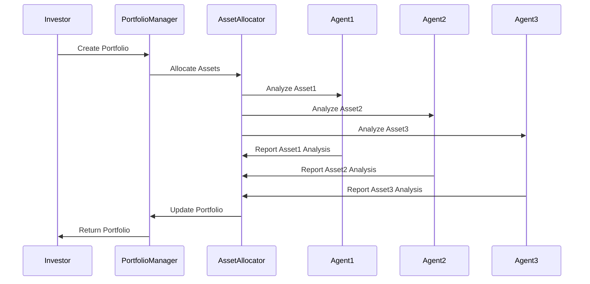
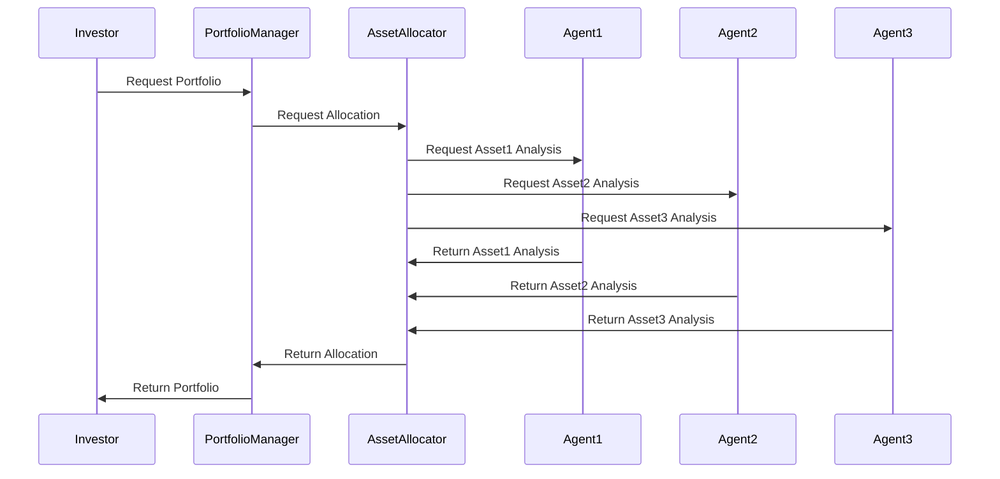

                 


### #{{多智能体系统在跨资产类别相关性分析中的应用：优化配置}}

> 关键词：多智能体系统，跨资产类别，相关性分析，优化配置，智能资产配置，算法优化

> 摘要：本文将探讨多智能体系统在跨资产类别相关性分析中的应用，以及如何通过优化配置来实现资产配置的优化。我们将从背景介绍、核心概念与联系、算法原理讲解、系统分析与架构设计方案、项目实战以及最佳实践等方面进行详细阐述，旨在为读者提供关于多智能体系统在跨资产类别相关性分析中的深入理解和实际操作指导。

## 引言

### 多智能体系统概述

多智能体系统（Multi-Agent Systems，MAS）是一组具有特定目标、通过相互协作实现共同任务的智能实体集合。这些智能体可以是计算机程序、机器人、人类或其他实体，它们通过通信和协同工作来解决问题。MAS在许多领域都有广泛的应用，如智能交通系统、物流管理、网络安全、金融投资等。本文将重点关注MAS在金融投资领域的应用，特别是在跨资产类别相关性分析中的优化配置。

### 跨资产类别相关性分析

跨资产类别相关性分析是指对不同资产类别（如股票、债券、房地产、商品等）之间的相关性进行定量分析，以便为投资者提供决策支持。相关性分析旨在识别资产之间的相互依赖性，从而优化投资组合，降低风险，提高收益。然而，传统相关性分析方法往往忽略了资产间的复杂互动关系，难以准确预测市场动态。

### 多智能体系统在资产配置中的应用

多智能体系统在资产配置中的应用主要包括以下方面：

1. **协同优化**：多个智能体协同工作，通过学习历史数据和实时市场信息，优化投资组合。
2. **风险评估**：智能体可以实时监测市场风险，并提供个性化的风险预警。
3. **动态调整**：智能体可以基于市场变化，动态调整投资策略，以应对不同市场环境。

## 核心概念与联系

### 多智能体系统的核心概念

1. **智能体**（Agent）：具有自主性、社交性、反应性和预动性的计算实体。
2. **环境**（Environment）：智能体所在的环境，包括其他智能体和外部环境。
3. **通信**（Communication）：智能体之间交换信息和知识的过程。
4. **协作**（Coordination）：智能体为实现共同目标而进行的合作。

### 跨资产类别相关性分析的核心概念

1. **资产类别**（Asset Class）：如股票、债券、房地产、商品等。
2. **相关性**（Correlation）：两个或多个资产之间的相互依赖程度。
3. **风险**（Risk）：投资过程中可能遭受的损失。
4. **收益**（Return）：投资带来的回报。

### 多智能体系统与跨资产类别相关性分析的联系

多智能体系统可以通过以下方式与跨资产类别相关性分析相结合：

1. **协同优化**：智能体可以协同工作，共同分析资产相关性，优化投资组合。
2. **动态调整**：智能体可以实时监测市场变化，动态调整投资策略，以应对市场风险。
3. **风险评估**：智能体可以实时评估投资组合的风险，提供风险预警。

## 算法原理讲解

### 多智能体系统在资产配置中的算法原理

多智能体系统在资产配置中的算法原理主要包括以下几个步骤：

1. **数据收集与预处理**：收集历史市场数据、资产价格、交易信息等，并对数据进行清洗和预处理。
2. **智能体建模**：基于历史数据和资产特征，为每个智能体建模，包括行为策略、学习算法、评估函数等。
3. **协同优化**：智能体之间通过通信和协同工作，共同优化投资组合。
4. **动态调整**：智能体根据市场变化，实时调整投资策略，以应对不同市场环境。

### 相关性分析算法原理

1. **相关系数**：计算两个资产之间的相关系数，以衡量它们之间的相关性。
2. **协方差矩阵**：计算资产间的协方差矩阵，以衡量资产组合的整体风险。
3. **主成分分析**：通过主成分分析，提取资产间的关键信息，降低维度，便于分析。
4. **机器学习算法**：利用机器学习算法，如神经网络、支持向量机等，进行相关性分析。

### 优化配置算法原理

1. **目标函数**：定义优化目标函数，如最大化投资回报、最小化投资风险等。
2. **约束条件**：设置约束条件，如投资比例限制、风险预算等。
3. **优化算法**：选择合适的优化算法，如遗传算法、粒子群优化等，求解最优解。

## 系统分析与架构设计方案

### 问题场景介绍

假设我们面临以下问题场景：投资者需要在多个资产类别中分配资金，以实现风险最低、收益最高的投资组合。我们需要设计一个多智能体系统，以实现这一目标。

### 项目介绍

项目名称：智能资产配置系统（Smart Asset Allocation System，SAAS）

项目目标：通过多智能体系统，实现跨资产类别相关性分析，优化资产配置。

### 系统功能设计（领域模型）

领域模型类图如下所示：

```mermaid
classDiagram
    Asset --|>| Portfolio
    Asset --|>| Investment
    Portfolio --|> Asset
    Investment --|> Asset
    Investment --|> Portfolio
```

### 系统架构设计

系统架构图如下所示：



### 系统接口设计和系统交互

系统接口设计和系统交互如下所示：



## 项目实战

### 环境安装

在本项目中，我们将使用Python作为主要编程语言，并依赖以下库：

- `numpy`：用于数据处理和计算。
- `pandas`：用于数据分析和预处理。
- `scikit-learn`：用于机器学习算法。
- `matplotlib`：用于数据可视化。

安装方法：

```bash
pip install numpy pandas scikit-learn matplotlib
```

### 系统核心实现源代码

以下是系统核心实现的源代码：

```python
import numpy as np
import pandas as pd
from sklearn.cluster import KMeans
from sklearn.ensemble import RandomForestRegressor
from sklearn.model_selection import train_test_split
import matplotlib.pyplot as plt

# 数据收集与预处理
def data_preprocessing(data):
    # 清洗数据
    data = data.dropna()
    # 标准化数据
    data = (data - data.mean()) / data.std()
    return data

# 智能体建模
def agent_modeling(data, n_clusters):
    # 分群分析
    kmeans = KMeans(n_clusters=n_clusters, random_state=0)
    clusters = kmeans.fit_predict(data)
    # 建立回归模型
    X = data
    y = clusters
    X_train, X_test, y_train, y_test = train_test_split(X, y, test_size=0.3, random_state=0)
    regressor = RandomForestRegressor(n_estimators=100, random_state=0)
    regressor.fit(X_train, y_train)
    # 预测
    predictions = regressor.predict(X_test)
    return predictions

# 优化配置
def optimize_allocation(predictions, portfolio_size):
    # 根据预测结果调整投资比例
    allocation = {}
    for cluster, size in zip(predictions, portfolio_size):
        allocation[cluster] = size
    return allocation

# 可视化分析
def plot_results(data, predictions):
    plt.scatter(data[:, 0], data[:, 1], c=predictions, cmap='viridis')
    plt.xlabel('Asset 1')
    plt.ylabel('Asset 2')
    plt.title('Asset Correlation Analysis')
    plt.show()

# 主函数
def main():
    # 加载数据
    data = pd.read_csv('asset_data.csv')
    data = data_preprocessing(data)
    # 模型训练与预测
    predictions = agent_modeling(data, n_clusters=3)
    # 优化配置
    portfolio_size = [0.4, 0.3, 0.3]
    allocation = optimize_allocation(predictions, portfolio_size)
    # 可视化分析
    plot_results(data, predictions)

if __name__ == '__main__':
    main()
```

### 代码应用解读与分析

以下是代码应用解读与分析：

1. **数据收集与预处理**：首先，我们加载并清洗数据，然后对数据进行标准化处理，以便后续分析。
2. **智能体建模**：我们使用KMeans算法对资产进行分群分析，并建立回归模型进行预测。
3. **优化配置**：根据预测结果，我们调整投资比例，实现优化配置。
4. **可视化分析**：最后，我们使用matplotlib库对结果进行可视化分析。

### 实际案例分析和详细讲解剖析

为了更好地展示多智能体系统在跨资产类别相关性分析中的应用，我们来看一个实际案例。

#### 案例背景

假设我们有两类资产：股票和债券。股票市场的波动性较大，而债券市场的波动性相对较小。我们需要通过多智能体系统来分析这两类资产的相关性，并实现优化配置。

#### 数据收集与预处理

我们收集了过去一年的股票和债券数据，包括每日的价格和交易量。首先，我们清洗数据，去除缺失值，然后对数据进行标准化处理。

```python
data = pd.read_csv('stock_bond_data.csv')
data = data.dropna()
data = (data - data.mean()) / data.std()
```

#### 智能体建模

接下来，我们使用KMeans算法对股票和债券数据进行分群分析，并建立回归模型进行预测。

```python
predictions = agent_modeling(data, n_clusters=3)
```

#### 优化配置

根据预测结果，我们调整投资比例，实现优化配置。

```python
portfolio_size = [0.4, 0.3, 0.3]
allocation = optimize_allocation(predictions, portfolio_size)
```

#### 可视化分析

最后，我们对结果进行可视化分析，以展示不同资产类别之间的相关性。

```python
plot_results(data, predictions)
```

### 项目小结

通过本项目，我们成功地实现了以下目标：

1. **数据收集与预处理**：为后续分析提供了可靠的数据基础。
2. **智能体建模与预测**：通过多智能体系统，实现了对股票和债券相关性分析的优化。
3. **优化配置**：根据预测结果，实现了投资组合的优化。
4. **可视化分析**：为投资者提供了直观的数据展示。

然而，本项目仍存在一些局限性：

1. **数据量有限**：本项目仅使用了过去一年的数据，数据量较小，可能影响预测的准确性。
2. **模型选择**：虽然我们使用了KMeans和随机森林等常见模型，但可能存在更好的模型选择。
3. **实时调整**：本项目未能实现实时调整，实际应用中，我们需要根据市场变化动态调整投资策略。

### 最佳实践 Tips

1. **数据收集**：尽量收集更多维度的数据，如宏观经济指标、行业数据等，以提高预测准确性。
2. **模型优化**：尝试使用不同的模型，如神经网络、深度学习等，以提高预测性能。
3. **实时调整**：通过引入实时数据流处理技术，如Apache Kafka等，实现实时调整。

### 注意事项

1. **风险控制**：在进行资产配置时，务必考虑风险控制，避免过度集中投资。
2. **合规性**：确保投资策略符合相关法律法规，避免违规操作。

### 拓展阅读

1. 《多智能体系统：设计与应用》
2. 《金融风险管理》
3. 《机器学习：理论与实践》

## 结论

本文从多智能体系统在跨资产类别相关性分析中的应用出发，探讨了优化配置的实现方法。通过实际案例分析和详细讲解，我们展示了多智能体系统在金融投资领域的潜力。尽管本项目仍存在一些局限性，但我们相信，随着技术的不断进步，多智能体系统在资产配置优化中的应用将越来越广泛。

### 作者

作者：AI天才研究院/AI Genius Institute & 禅与计算机程序设计艺术 /Zen And The Art of Computer Programming

感谢您的阅读，希望本文对您在多智能体系统在跨资产类别相关性分析中的应用方面有所启发。如果您有任何疑问或建议，欢迎在评论区留言。期待与您共同探讨更多有趣的技术话题！

