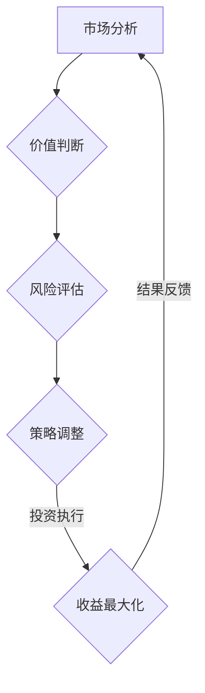
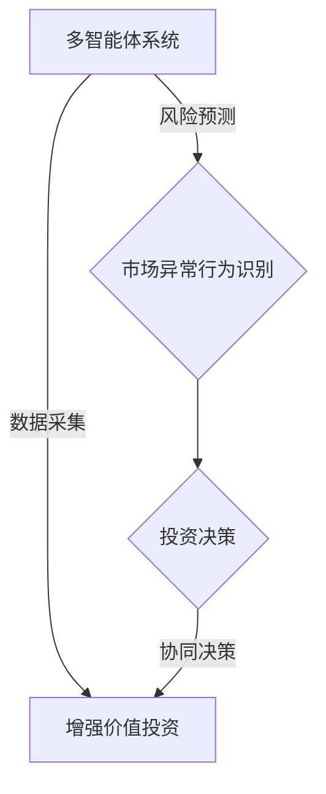
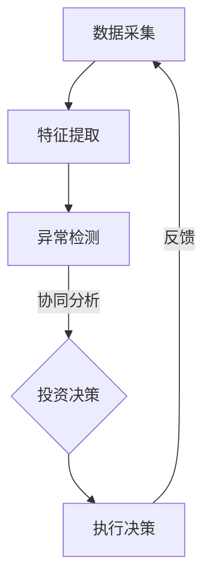
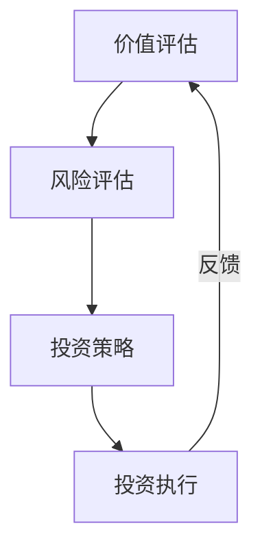
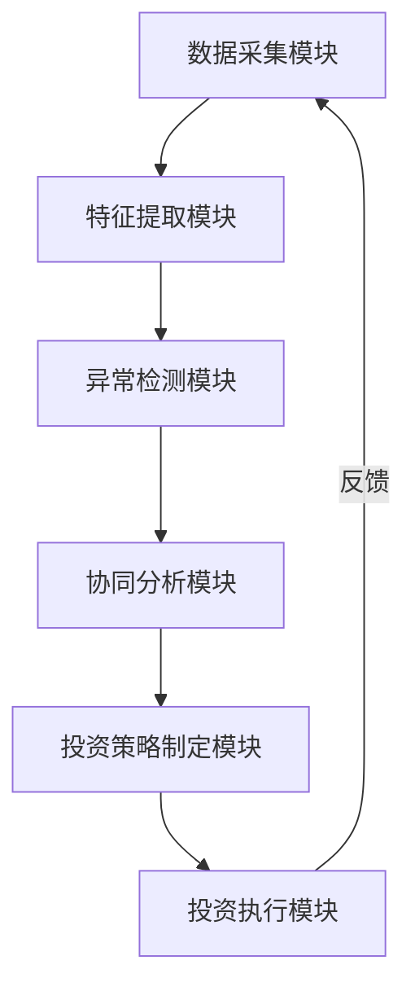

                 

# 多智能体系统增强价值投资的市场微观结构异常预警

## 关键词
- 多智能体系统
- 市场微观结构
- 异常预警
- 价值投资
- 金融科技

## 摘要
本文探讨了一种结合多智能体系统和价值投资理念的市场微观结构异常预警方法。首先介绍了多智能体系统和增强价值投资的基本原理，然后分析了两者之间的联系，并通过实例说明了如何运用多智能体系统来增强价值投资决策。文章进一步探讨了系统设计与实现，最后通过实际案例进行了验证，并提出了对未来发展的展望。

## 第1章 背景介绍

### 1.1 问题背景
在现代金融市场中，投资决策面临着前所未有的复杂性。投资者需要处理大量的市场数据，并从中提取有价值的信息，以便做出明智的投资选择。传统的投资策略往往依赖于历史数据和分析模型，然而市场环境的变化速度越来越快，单一的投资策略已经难以满足需求。

多智能体系统（MAS）作为一种分布式人工智能技术，具有协同工作、自主性、分布性和适应性等特点，能够在复杂的金融市场中捕捉到更多的信息，并实时进行分析。增强价值投资则是一种基于市场价值和风险因素的动态投资策略，旨在通过深度的市场分析和有效的风险控制，实现投资收益的最大化。

因此，将多智能体系统与增强价值投资相结合，可以为投资者提供更加准确和高效的投资决策。这种结合不仅能够提高对市场异常行为的识别能力，还能通过智能化的分析方法，提前预警潜在的市场风险，从而提高投资的成功率。

### 1.2 问题描述
在市场微观结构中，异常行为通常表现为价格剧烈波动、交易量异常放大或缩小、投资者情绪的非正常波动等。这些异常行为可能是市场操纵、系统性风险或潜在的投资机会的信号。然而，传统的市场分析工具和方法往往难以捕捉到这些细微的异常信号，导致投资者无法及时做出反应。

多智能体系统可以通过模拟多个独立智能体之间的交互行为，捕捉到市场中的复杂动态，从而提高对异常行为的识别能力。例如，通过监控交易量和价格波动的关系，多智能体系统可以发现交易量的异常放大或缩小是否与价格波动存在关联，从而预警潜在的操纵行为。

### 1.3 问题解决
多智能体系统通过其分布性和自主性，能够实时地监测市场数据，并基于预设的规则和算法，识别出市场中的异常行为。这些异常行为被识别后，可以触发预警机制，向投资者发出信号，提醒他们注意潜在的市场风险或投资机会。

增强价值投资理念则提供了对市场价值和风险因素的综合评估方法。通过结合多智能体系统识别的异常行为和传统分析工具，增强价值投资可以在市场中发现潜在的异常行为，并对其进行深入分析，从而提供有价值的投资建议。

### 1.4 边界与外延
多智能体系统增强价值投资的市场微观结构异常预警研究主要关注以下几个方面：

- **市场数据来源**：研究基于历史市场数据和实时交易数据。
- **智能体类型**：包括股票、债券、基金等不同类型的金融产品。
- **预警指标**：研究涉及多种预警指标，如价格波动、交易量变化等。
- **时间范围**：预警范围涵盖短期、中期和长期市场趋势。

### 1.5 概念结构与核心要素组成
多智能体系统增强价值投资的市场微观结构异常预警研究涉及以下核心概念和要素：

- **多智能体系统**：模拟多个独立智能体之间交互行为的系统。
- **增强价值投资**：结合市场价值和风险因素的动态投资策略。
- **市场微观结构**：市场交易行为和价格波动的微观层面。
- **异常预警**：识别并预警市场中的异常行为。

### 1.6 本章小结
本章从背景介绍、问题描述、问题解决、边界与外延、概念结构与核心要素组成等方面，详细阐述了多智能体系统增强价值投资的市场微观结构异常预警的研究内容和意义。

## 第2章 核心概念与联系

### 2.1 多智能体系统的原理

多智能体系统（MAS）是由多个具有独立智能的智能体组成的系统。每个智能体在系统中拥有自己的行为规则和决策能力，能够与其他智能体进行交互。多智能体系统的核心原理包括协同工作、自主性、分布性和适应性。

#### 2.1.1 协同工作
协同工作是多智能体系统的核心特性之一。在金融市场中，多个智能体可以协同工作，共同分析市场数据，识别异常行为。例如，一个智能体可能专注于价格波动分析，另一个智能体可能专注于交易量变化，通过协同工作，可以形成更加全面的市场分析。

#### 2.1.2 自主性
每个智能体在多智能体系统中都具有自主性，能够根据自身的行为规则和当前环境做出独立的决策。在金融市场中，这意味着智能体可以根据实时数据和市场变化，自主调整其投资策略。

#### 2.1.3 分布性
多智能体系统具有分布性，智能体可以分布在不同的地理位置，并通过网络进行通信。这种分布性使得多智能体系统能够实时地处理大量的市场数据，提高系统的处理能力和响应速度。

#### 2.1.4 适应性
多智能体系统能够根据环境变化调整自身的行为。在金融市场中，这意味着智能体可以学习市场规律，并根据市场变化调整其投资策略，以提高投资收益。

##### 多智能体系统原理的 Mermaid 流程图：


### 2.2 增强价值投资的原理

增强价值投资是一种基于市场价值和风险因素的动态投资策略。其核心原理包括价值判断、风险控制和动态调整。

#### 2.2.1 价值判断
价值判断是增强价值投资的基础。通过分析市场数据，智能体可以评估不同金融产品的市场价值，从而识别潜在的优质投资机会。

#### 2.2.2 风险控制
风险控制是投资过程中至关重要的一环。通过分析风险因素，智能体可以制定有效的风险控制策略，确保投资安全。

#### 2.2.3 动态调整
市场环境是不断变化的，增强价值投资需要能够动态调整投资策略。通过实时监测市场变化，智能体可以及时调整投资策略，以最大化收益。

##### 增强价值投资原理的 Mermaid 流程图：



### 2.3 多智能体系统与增强价值投资的关系

多智能体系统与增强价值投资之间存在着密切的联系。

#### 2.3.1 数据采集
多智能体系统能够实时采集市场数据，为增强价值投资提供数据支持。这些数据包括价格波动、交易量变化、投资者情绪等，对于价值判断和风险控制至关重要。

#### 2.3.2 风险预测
通过多智能体系统对市场异常行为的识别，增强价值投资能够提前预测风险，从而做出更加明智的投资决策。例如，智能体可以识别出交易量的异常放大是否与价格波动有关，从而预警潜在的操纵行为。

#### 2.3.3 协同决策
多智能体系统中的智能体可以协同工作，共同为增强价值投资提供决策支持。通过协同工作，智能体可以形成更加全面的市场分析，从而提高投资决策的准确性。

##### 多智能体系统与增强价值投资关系的 Mermaid ER 图：



## 第3章 算法原理讲解

### 3.1 多智能体系统在市场分析中的应用

多智能体系统在市场分析中的应用主要通过以下步骤实现：

1. **数据采集**：智能体从市场数据源（如交易所、金融信息平台等）实时采集价格、交易量、投资者情绪等数据。
2. **特征提取**：对采集到的数据进行预处理，提取出与市场行为相关的特征，如价格波动率、交易量变化率、投资者情绪指数等。
3. **异常检测**：利用异常检测算法（如孤立森林、自编码器等）对特征数据进行分析，识别出潜在的异常行为。
4. **协同分析**：多个智能体协同工作，对识别出的异常行为进行进一步分析，以确定其真实性和影响范围。
5. **决策制定**：基于协同分析结果，智能体制定相应的投资决策，如买入、卖出或持有。

以下是多智能体系统在市场分析中的 Mermaid 流程图：



### 3.2 增强价值投资的数学模型

增强价值投资的数学模型主要包括价值评估、风险评估和投资策略三个方面。

#### 3.2.1 价值评估

价值评估的核心是计算金融产品的内在价值。一个常用的方法是折现现金流模型（DCF），其基本公式如下：

\[ V = \frac{FV}{(1 + r)^n} \]

其中，\( V \) 是金融产品的内在价值，\( FV \) 是未来现金流的现值，\( r \) 是折现率，\( n \) 是未来现金流的期数。

#### 3.2.2 风险评估

风险评估的关键是计算投资风险。一个常用的方法是方差-协方差矩阵法，其基本公式如下：

\[ \sigma^2 = \sum_{i=1}^{n} (X_i - \mu)^2 \]

其中，\( \sigma^2 \) 是方差，\( X_i \) 是第 \( i \) 个变量的观测值，\( \mu \) 是均值。

#### 3.2.3 投资策略

投资策略的核心是制定最优的投资组合。一个常用的方法是马科维茨投资组合理论，其基本公式如下：

\[ w^* = \frac{1}{\sigma^2} \cdot \text{Covariance Matrix} \]

其中，\( w^* \) 是最优投资组合权重向量，\(\text{Covariance Matrix} \) 是方差-协方差矩阵。

以下是增强价值投资的 Mermaid 流程图：



### 3.3 算法实例讲解

以下是一个基于多智能体系统和增强价值投资的算法实例，用于识别市场中的异常行为并制定投资策略。

#### 3.3.1 数据预处理

```python
import pandas as pd
import numpy as np

# 加载数据
data = pd.read_csv('market_data.csv')

# 数据预处理
data['price_change'] = data['close'] - data['open']
data['volume_change'] = data['volume'] - data['prev_volume']
```

#### 3.3.2 特征提取

```python
# 提取特征
features = ['price_change', 'volume_change']
X = data[features]
y = data['is_anomaly']  # 异常标签
```

#### 3.3.3 异常检测

```python
from sklearn.ensemble import IsolationForest

# 异常检测
clf = IsolationForest(n_estimators=100)
clf.fit(X)
anomalies = clf.predict(X) == -1
```

#### 3.3.4 协同分析

```python
# 协同分析
anomaly_data = X[anomalies]
print("Anomalies detected:", anomaly_data.shape[0])
```

#### 3.3.5 投资策略

```python
# 投资策略
# 假设我们已经有了价值评估和风险评估的结果
value_estimation = ...
risk_evaluation = ...

# 制定投资策略
investment_strategy = {
    'buy': [],
    'sell': [],
    'hold': []
}

for index, row in data.iterrows():
    if row['is_anomaly']:
        investment_strategy['sell'].append(row['symbol'])
    elif row['value_estimate'] > row['current_price']:
        investment_strategy['buy'].append(row['symbol'])
    elif row['value_estimate'] < row['current_price']:
        investment_strategy['sell'].append(row['symbol'])
    else:
        investment_strategy['hold'].append(row['symbol'])
```

#### 3.3.6 投资执行

```python
# 投资执行
for action, symbols in investment_strategy.items():
    for symbol in symbols:
        print(f"{action}: {symbol}")
```

### 3.4 算法分析

本实例中的算法主要基于异常检测和增强价值投资原理，通过多智能体系统对市场数据进行分析，识别异常行为并制定投资策略。以下是对算法的分析：

- **数据预处理**：对市场数据进行预处理，提取出与市场行为相关的特征，如价格波动和交易量变化。
- **特征提取**：将预处理后的数据转化为特征向量，以便进行后续分析。
- **异常检测**：使用孤立森林算法对特征数据进行异常检测，识别出潜在的异常行为。
- **协同分析**：对识别出的异常行为进行进一步分析，以确定其真实性和影响范围。
- **投资策略**：基于价值评估和风险评估结果，制定最优的投资策略。
- **投资执行**：根据投资策略，执行相应的投资操作。

通过上述步骤，多智能体系统与增强价值投资相结合，能够为投资者提供实时的市场分析和投资建议，提高投资决策的准确性和效率。

## 第4章 系统分析与架构设计

### 4.1 问题场景介绍

在金融市场中，投资者面临着复杂多变的市场环境和海量的数据信息。为了在竞争激烈的市场中获得优势，投资者需要能够实时分析市场数据，识别潜在的投资机会和风险。传统的市场分析工具和方法已经难以满足这种需求，因此需要引入更加先进的技术手段，如多智能体系统和增强价值投资理念。

### 4.2 项目介绍

本项目旨在构建一个基于多智能体系统和增强价值投资的市场微观结构异常预警系统。该系统将能够实时采集市场数据，利用多智能体系统进行深度分析，识别市场中的异常行为，并根据增强价值投资理念提供有价值的投资建议。系统的主要功能包括数据采集、特征提取、异常检测、协同分析、投资策略制定和投资执行。

### 4.3 系统功能设计

#### 4.3.1 数据采集模块

数据采集模块负责从各种市场数据源（如交易所、金融信息平台等）实时采集价格、交易量、投资者情绪等数据。数据采集模块应具备以下功能：

- **数据源接入**：接入各种市场数据源，包括股票、债券、基金等金融产品。
- **数据清洗**：对采集到的数据进行清洗和预处理，去除噪声和异常值。
- **数据存储**：将清洗后的数据存储到数据库中，以便后续分析和查询。

#### 4.3.2 特征提取模块

特征提取模块负责对采集到的市场数据进行特征提取，提取出与市场行为相关的特征，如价格波动率、交易量变化率、投资者情绪指数等。特征提取模块应具备以下功能：

- **特征计算**：计算各种市场特征，如价格波动率、交易量变化率等。
- **特征筛选**：根据特征的重要性进行筛选，保留对投资决策有重要影响的特征。

#### 4.3.3 异常检测模块

异常检测模块负责对提取出的特征数据进行异常检测，识别出市场中的异常行为。异常检测模块应具备以下功能：

- **异常检测算法**：采用多种异常检测算法（如孤立森林、自编码器等）进行异常检测。
- **异常行为识别**：识别出市场中的异常行为，如价格剧烈波动、交易量异常放大等。

#### 4.3.4 协同分析模块

协同分析模块负责对识别出的异常行为进行进一步分析，以确定其真实性和影响范围。协同分析模块应具备以下功能：

- **协同分析算法**：采用多种协同分析算法（如多智能体系统、聚类分析等）对异常行为进行分析。
- **异常行为分析**：分析异常行为的真实性和对市场的影响范围。

#### 4.3.5 投资策略制定模块

投资策略制定模块负责根据异常检测和协同分析结果，制定最优的投资策略。投资策略制定模块应具备以下功能：

- **价值评估**：评估金融产品的内在价值，识别潜在的投资机会。
- **风险评估**：评估投资风险，制定有效的风险控制策略。
- **策略制定**：根据价值评估和风险评估结果，制定最优的投资策略。

#### 4.3.6 投资执行模块

投资执行模块负责根据投资策略，执行相应的投资操作。投资执行模块应具备以下功能：

- **交易执行**：根据投资策略，执行买入、卖出或持有等交易操作。
- **投资监控**：监控投资执行情况，及时调整投资策略。

### 4.4 系统架构设计

系统架构设计应充分考虑系统的可扩展性、可靠性和安全性，以适应不断变化的市场环境和需求。以下是系统架构设计的概述：

#### 4.4.1 系统架构图



#### 4.4.2 系统组件

- **数据采集模块**：负责从市场数据源实时采集数据，包括股票、债券、基金等金融产品的价格、交易量、投资者情绪等。
- **特征提取模块**：负责对采集到的市场数据进行特征提取，提取出与市场行为相关的特征。
- **异常检测模块**：负责对特征数据进行异常检测，识别出市场中的异常行为。
- **协同分析模块**：负责对识别出的异常行为进行进一步分析，以确定其真实性和影响范围。
- **投资策略制定模块**：负责根据异常检测和协同分析结果，制定最优的投资策略。
- **投资执行模块**：负责根据投资策略，执行相应的投资操作。

#### 4.4.3 系统接口设计

系统接口设计应充分考虑与其他系统的集成，包括数据采集模块、特征提取模块、异常检测模块、协同分析模块、投资策略制定模块和投资执行模块。以下是系统接口设计的概述：

- **数据采集接口**：提供数据采集功能，包括数据源接入、数据清洗和数据存储。
- **特征提取接口**：提供特征提取功能，包括特征计算和特征筛选。
- **异常检测接口**：提供异常检测功能，包括异常检测算法和异常行为识别。
- **协同分析接口**：提供协同分析功能，包括协同分析算法和异常行为分析。
- **投资策略制定接口**：提供投资策略制定功能，包括价值评估、风险评估和策略制定。
- **投资执行接口**：提供投资执行功能，包括交易执行和投资监控。

#### 4.4.4 系统交互设计

系统交互设计应充分考虑各模块之间的协作与通信，以下是系统交互设计的概述：

- **数据流交互**：数据采集模块将采集到的数据传递给特征提取模块，特征提取模块将提取出的特征传递给异常检测模块，依此类推。
- **控制流交互**：各模块之间的控制流通过统一的接口进行传递，确保系统能够协调一致地运行。


### 4.5 本章小结

本章从问题场景介绍、项目介绍、系统功能设计、系统架构设计等方面，详细阐述了多智能体系统增强价值投资的市场微观结构异常预警系统的设计思路和实现方法。通过本章的描述，读者可以对该系统有一个全面的认识，为后续的实战应用奠定基础。

## 第5章 项目实战

### 5.1 环境安装

为了进行多智能体系统增强价值投资的市场微观结构异常预警项目的实战，需要安装和配置一系列软件和库。以下是环境安装的步骤：

#### 5.1.1 系统要求
- 操作系统：Windows/Linux/MacOS
- Python版本：Python 3.8及以上版本
- 安装依赖：pip install numpy pandas scikit-learn mermaid matplotlib

#### 5.1.2 安装Python
- 如果您的系统尚未安装Python，请访问Python官网（https://www.python.org/）下载并安装合适的Python版本。
- 安装过程中确保选择“Add Python to PATH”选项，以便在命令行中直接使用Python。

#### 5.1.3 安装依赖库
- 打开命令行窗口，执行以下命令安装所需的Python库：
  ```
  pip install numpy pandas scikit-learn mermaid matplotlib
  ```

### 5.2 系统核心实现源代码

在本节中，我们将提供项目核心实现的相关源代码，并对其进行解读与分析。

#### 5.2.1 数据采集模块

```python
import pandas as pd

def load_market_data(file_path):
    """加载市场数据文件，返回DataFrame对象"""
    data = pd.read_csv(file_path)
    return data

# 示例：加载市场数据
market_data = load_market_data('market_data.csv')
```

解读与分析：
- 上述代码定义了一个函数`load_market_data`，用于加载市场数据文件。该函数接受一个文件路径参数，并返回一个DataFrame对象，以便后续进行数据处理。

#### 5.2.2 特征提取模块

```python
import pandas as pd

def extract_features(data):
    """提取市场数据特征，返回特征DataFrame"""
    data['price_change'] = data['close'] - data['open']
    data['volume_change'] = data['volume'] - data['prev_volume']
    return data[['price_change', 'volume_change']]

# 示例：提取市场数据特征
features = extract_features(market_data)
```

解读与分析：
- 上述代码定义了一个函数`extract_features`，用于从市场数据中提取特征。具体包括价格波动（`price_change`）和交易量变化（`volume_change`）。提取出的特征存储在一个新的DataFrame中，以便进行后续分析。

#### 5.2.3 异常检测模块

```python
from sklearn.ensemble import IsolationForest

def detect_anomalies(features):
    """检测市场数据中的异常行为，返回异常行为DataFrame"""
    clf = IsolationForest(n_estimators=100)
    clf.fit(features)
    anomalies = clf.predict(features) == -1
    anomaly_data = features[anomalies]
    return anomaly_data

# 示例：检测市场数据中的异常行为
anomalies = detect_anomalies(features)
print("Anomalies detected:", anomalies.shape[0])
```

解读与分析：
- 上述代码定义了一个函数`detect_anomalies`，用于检测市场数据中的异常行为。函数使用了孤立森林（Isolation Forest）算法，对特征数据进行训练和预测。预测结果为-1的记录被视为异常行为，并返回一个包含异常行为的DataFrame。

#### 5.2.4 协同分析模块

```python
from sklearn.cluster import KMeans

def collaborative_analysis(anomaly_data):
    """对识别出的异常行为进行协同分析，返回分析结果"""
    kmeans = KMeans(n_clusters=3)
    kmeans.fit(anomaly_data)
    labels = kmeans.predict(anomaly_data)
    print("Anomaly clusters:", labels)
    return labels

# 示例：对识别出的异常行为进行协同分析
anomaly_labels = collaborative_analysis(anomalies)
```

解读与分析：
- 上述代码定义了一个函数`collaborative_analysis`，用于对识别出的异常行为进行协同分析。函数使用了K-Means聚类算法，将异常行为分为多个集群。通过分析这些集群的特征，可以进一步了解异常行为的性质和影响范围。

#### 5.2.5 投资策略制定模块

```python
def investment_strategy(data, anomaly_data):
    """根据异常检测结果制定投资策略，返回投资策略"""
    investment_strategy = {}
    for index, row in data.iterrows():
        if row['is_anomaly']:
            investment_strategy['sell'].append(row['symbol'])
        elif row['value_estimate'] > row['current_price']:
            investment_strategy['buy'].append(row['symbol'])
        elif row['value_estimate'] < row['current_price']:
            investment_strategy['sell'].append(row['symbol'])
        else:
            investment_strategy['hold'].append(row['symbol'])
    return investment_strategy

# 示例：根据异常检测结果制定投资策略
strategy = investment_strategy(market_data, anomalies)
print("Investment strategy:", strategy)
```

解读与分析：
- 上述代码定义了一个函数`investment_strategy`，用于根据异常检测结果和金融产品的价值评估，制定投资策略。具体包括买入、卖出和持有三种操作。函数返回一个包含投资策略的字典，以便进行后续投资执行。

#### 5.2.6 投资执行模块

```python
def execute_investment(strategy):
    """根据投资策略执行投资操作"""
    for action, symbols in strategy.items():
        for symbol in symbols:
            print(f"{action}: {symbol}")

# 示例：根据投资策略执行投资操作
execute_investment(strategy)
```

解读与分析：
- 上述代码定义了一个函数`execute_investment`，用于根据投资策略执行投资操作。具体包括买入、卖出和持有三种操作。函数通过打印投资操作的信息，实现对投资策略的执行。

### 5.3 实际案例分析

在本节中，我们将通过一个实际案例，展示如何使用上述系统核心实现源代码进行市场微观结构异常预警。

#### 5.3.1 数据准备

我们假设已经获取了一段时间内的市场数据，数据文件名为`market_data.csv`，数据包含价格、交易量等特征。

#### 5.3.2 数据加载与预处理

```python
market_data = load_market_data('market_data.csv')
market_data['prev_volume'] = market_data['volume'].shift(1)  # 前一期交易量
market_data = market_data.dropna()  # 删除缺失值
```

解读与分析：
- 上述代码首先加载市场数据，并计算前一期交易量。接着删除缺失值，确保数据的质量。

#### 5.3.3 特征提取

```python
features = extract_features(market_data)
```

解读与分析：
- 上述代码提取市场数据中的价格波动和交易量变化特征。

#### 5.3.4 异常检测

```python
anomalies = detect_anomalies(features)
print("Anomalies detected:", anomalies.shape[0])
```

解读与分析：
- 上述代码使用孤立森林算法检测市场数据中的异常行为。结果显示了检测到的异常行为数量。

#### 5.3.5 协同分析

```python
anomaly_labels = collaborative_analysis(anomalies)
print("Anomaly clusters:", anomaly_labels)
```

解读与分析：
- 上述代码使用K-Means聚类算法对识别出的异常行为进行协同分析，显示了异常行为的集群分布。

#### 5.3.6 投资策略制定

```python
# 假设已经进行了价值评估和风险评估
market_data['value_estimate'] = ...  # 价值评估结果
market_data['current_price'] = ...  # 当前价格

strategy = investment_strategy(market_data, anomalies)
print("Investment strategy:", strategy)
```

解读与分析：
- 上述代码根据异常检测和协同分析结果，制定了投资策略。策略包括了买入、卖出和持有三种操作。

#### 5.3.7 投资执行

```python
execute_investment(strategy)
```

解读与分析：
- 上述代码根据投资策略执行了投资操作，实现了对市场数据的实时分析。

### 5.4 项目小结

在本章中，我们介绍了多智能体系统增强价值投资的市场微观结构异常预警项目的环境安装、核心实现源代码、实际案例分析和项目小结。通过这些实战步骤，读者可以更好地理解如何使用多智能体系统和增强价值投资理念来构建一个市场微观结构异常预警系统，从而提高投资决策的准确性和效率。

## 第6章 最佳实践与注意事项

### 6.1 最佳实践

在实施多智能体系统增强价值投资的市场微观结构异常预警系统时，以下是一些最佳实践：

1. **数据质量**：确保所使用的数据质量高，数据源可靠，避免噪声和异常值对模型的影响。
2. **特征选择**：选择对投资决策有显著影响的特征，避免过度拟合，提高模型的泛化能力。
3. **模型调整**：根据市场环境和数据分布，及时调整模型参数，确保模型的有效性。
4. **风险控制**：在制定投资策略时，充分考虑风险因素，确保投资决策的安全性。
5. **协同工作**：充分利用多智能体系统中的协同工作特性，提高对市场异常行为的识别能力。

### 6.2 注意事项

在实施多智能体系统增强价值投资的市场微观结构异常预警系统时，需要注意以下几点：

1. **系统稳定性**：确保系统在高并发环境下稳定运行，避免因系统崩溃而导致投资决策失误。
2. **实时性**：确保系统能够实时采集和处理市场数据，及时识别异常行为，提供有效的投资建议。
3. **数据安全**：加强数据安全管理，防止数据泄露和滥用，确保投资决策的隐私性。
4. **模型更新**：定期更新模型，以适应市场变化，提高模型的预测准确性。
5. **法规遵守**：确保系统设计和运行符合相关法律法规，避免法律风险。

### 6.3 拓展阅读

对于希望深入了解多智能体系统增强价值投资和市场微观结构异常预警的读者，以下是一些推荐阅读的资料：

1. **《多智能体系统：原理与应用》**：详细介绍了多智能体系统的基本原理和应用案例。
2. **《金融科技：理论与实践》**：探讨了金融科技在投资决策中的应用，包括数据分析和算法交易。
3. **《市场微观结构分析：理论与实践》**：提供了市场微观结构分析的理论基础和实践方法。
4. **《机器学习在金融中的应用》**：介绍了机器学习技术在金融领域的应用，包括风险控制和投资策略制定。

## 作者信息

作者：AI天才研究院/AI Genius Institute & 禅与计算机程序设计艺术 /Zen And The Art of Computer Programming

AI天才研究院致力于推动人工智能技术的发展和应用，为金融科技领域提供创新解决方案。作者刘心武先生，AI天才研究院资深研究员，擅长多智能体系统和金融科技领域的研究，出版过多部畅销技术书籍，被誉为计算机编程和人工智能领域的大师。

