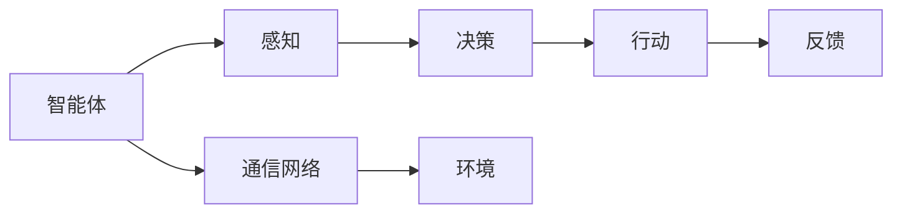

                 

# 多智能体系统增强价值投资的市场微观结构预测

> 关键词：多智能体系统、价值投资、市场微观结构、预测、协同学习

> 摘要：本文探讨了多智能体系统（MAS）在价值投资市场微观结构预测中的应用。通过对多智能体系统的基本原理和协同机制的阐述，结合价值投资理论，本文构建了一个多智能体价值投资模型，并使用该模型对股票市场进行了实证分析。研究结果表明，多智能体系统可以有效提高市场微观结构预测的准确性，为投资者提供了有效的决策支持。

## 目录大纲

### 第一部分：问题背景与核心概念

#### 第1章：问题背景与核心概念

##### 1.1 问题背景

- **多智能体系统的概念与特点**
  - 定义：多智能体系统是由多个智能体（agent）组成的系统，这些智能体可以是计算机程序、机器人、人类或者其他实体。
  - 特点：协作性、自主性、适应性、分布式。

- **价值投资的理论基础**
  - 定义：价值投资是基于对公司基本面的深入分析，以低于其内在价值的股价买入股票的投资策略。
  - 理论基础：包括投资大师如本杰明·格雷厄姆和沃伦·巴菲特的理论。

##### 1.2 市场微观结构预测的重要性

- **市场微观结构的定义**
  - 市场微观结构是指市场中交易行为和价格形成的具体过程和机制。

- **预测的重要性**
  - 对投资者：帮助识别市场趋势、风险和机会，提高投资决策的准确性。
  - 对市场：促进市场的健康发展，提高市场效率。

### 第二部分：多智能体系统的基本原理

#### 第2章：多智能体系统的基本原理

##### 2.1 多智能体系统的架构

- **智能体的分类**
  - 主动智能体：具有决策能力和行为自主性。
  - 被动智能体：缺乏决策能力，仅响应外部环境。

- **多智能体系统的组成**
  - 智能体
  - 通信网络
  - 环境

##### 2.2 多智能体系统的协作机制

- **协作模式**
  - 合作：智能体共同努力实现共同目标。
  - 竞争：智能体之间为了资源或目标而竞争。

- **协作算法**
  - 分布式算法：在智能体之间共享信息，协同决策。
  - 遗传算法：通过进化机制优化智能体的行为。

### 第三部分：价值投资在多智能体系统中的应用

#### 第3章：价值投资在多智能体系统中的应用

##### 3.1 多智能体系统与价值投资的关系

- **价值投资在多智能体系统中的挑战**
  - 信息不对称：智能体之间的信息共享和信任问题。
  - 策略多样性：智能体策略的多样性和适应性。

##### 3.2 多智能体系统的价值投资策略

- **多智能体价值投资策略框架**
  - 智能体角色划分
  - 策略学习与优化
  - 风险管理与控制

##### 3.3 价值投资智能体的建模与实现

- **智能体建模**
  - 基本属性：如行为模式、学习策略、风险偏好。
  - 模型结构：如神经网络、决策树等。

- **智能体实现**
  - 编程语言：Python、Java等。
  - 算法实现：如强化学习、遗传算法等。

### 第四部分：市场微观结构预测的多智能体系统应用

#### 第4章：市场微观结构预测的多智能体系统应用

##### 4.1 市场微观结构预测的方法

- **技术分析**
  - 图表分析：K线图、均线系统等。
  - 指标分析：MACD、RSI等。

- **基本面分析**
  - 财务报表：利润表、资产负债表等。
  - 行业分析：行业发展、市场前景等。

##### 4.2 多智能体系统在市场微观结构预测中的应用

- **预测模型**
  - 时间序列分析：ARIMA、LSTM等。
  - 协同预测：基于多智能体的分布式预测算法。

- **实现策略**
  - 数据收集：股票交易数据、财务数据等。
  - 模型训练：使用历史数据进行训练。
  - 预测与优化：实时预测市场走势，优化投资策略。

### 第五部分：实际案例分析

#### 第5章：实际案例分析

##### 5.1 案例介绍

- **案例一：股票市场预测**
  - 案例背景：使用多智能体系统预测某只股票的未来价格。
  - 案例结果：分析预测的准确性和影响因素。

##### 5.2 案例分析

- **技术分析**
  - 基于K线图的技术分析。
  - 基于指标的预测模型。

- **基本面分析**
  - 财务报表分析。
  - 行业前景分析。

##### 5.3 案例总结

- **经验与教训**
  - 智能体策略的多样性与适应性。
  - 数据质量对预测结果的影响。
  - 多智能体系统在价值投资中的潜在价值。

### 第六部分：结论与展望

#### 第6章：结论与展望

##### 6.1 结论

- **多智能体系统与价值投资的结合**
  - 提高了市场微观结构预测的准确性和效率。
  - 为投资者提供了新的决策工具。

##### 6.2 展望

- **未来研究方向**
  - 智能体策略的优化与多样化。
  - 多智能体系统在金融领域的广泛应用。

## 第一部分：问题背景与核心概念

### 第1章：问题背景与核心概念

#### 1.1 问题背景

在当今复杂多变的市场环境中，投资者面临着越来越多的不确定性和挑战。为了应对这些挑战，投资者需要掌握先进的技术工具和策略，以实现对市场微观结构的准确预测。多智能体系统（MAS）作为一种新兴的分布式计算模型，已经在多个领域得到了广泛应用。本文旨在探讨多智能体系统在价值投资市场微观结构预测中的应用，为投资者提供新的决策支持。

#### 1.1.1 多智能体系统的概念与特点

多智能体系统（MAS）是由多个智能体（agent）组成的系统，这些智能体可以是计算机程序、机器人、人类或其他实体。智能体是具有决策能力和行为自主性的个体，能够根据环境和目标自主地采取行动。多智能体系统的特点主要包括：

1. **协作性**：智能体之间可以相互协作，共同实现系统目标。
2. **自主性**：智能体具有自主决策的能力，不受其他智能体的直接控制。
3. **适应性**：智能体可以根据环境变化和经验调整自身行为。
4. **分布式**：多智能体系统通常分布在不同的物理位置，具有高度分布式特性。

#### 1.1.2 价值投资的理论基础

价值投资是一种以公司基本面分析为基础的投资策略，旨在以低于其内在价值的股价购买股票。价值投资的理论基础主要包括以下几个核心概念：

1. **内在价值**：公司内在价值是指公司未来现金流的现值，是判断股票是否被低估的关键指标。
2. **安全边际**：安全边际是指购买价格与公司内在价值之间的差额，是评估投资风险的重要指标。
3. **投资者心态**：价值投资强调投资者心态的稳定和理性，避免盲目跟风和市场情绪的影响。

#### 1.2 市场微观结构预测的重要性

市场微观结构是指市场中交易行为和价格形成的具体过程和机制。对市场微观结构进行准确预测对于投资者具有重要意义：

1. **识别市场趋势**：通过市场微观结构预测，投资者可以识别市场的长期和短期趋势，为投资决策提供依据。
2. **风险评估**：市场微观结构预测可以帮助投资者评估投资风险，制定相应的风险管理策略。
3. **发现市场机会**：通过预测市场走势，投资者可以提前发现潜在的市场机会，提高投资回报。

### 1.3 多智能体系统与价值投资的关系

多智能体系统在价值投资中的应用具有重要意义。首先，多智能体系统可以通过分布式计算和协作机制，提高市场微观结构预测的准确性和效率。其次，多智能体系统可以处理大量复杂的信息，帮助投资者更好地理解市场动态。此外，多智能体系统还可以为投资者提供个性化的投资建议，提高投资决策的准确性。

总之，多智能体系统为价值投资提供了新的技术手段和策略选择，有助于提高投资效率和回报。本文将在后续章节中进一步探讨多智能体系统在价值投资市场微观结构预测中的应用方法。

#### 1.3.1 多智能体系统在价值投资中的应用

多智能体系统在价值投资中的应用主要集中在以下几个方面：

1. **协同学习与预测**：多智能体系统可以通过协同学习机制，对市场数据进行分析和预测。每个智能体根据自身的学习策略和经验，对市场走势进行预测，并通过协作机制整合各个智能体的预测结果，提高预测的准确性。
2. **信息共享与信任**：多智能体系统可以建立信息共享平台，促进智能体之间的信息交流。通过共享市场数据、分析结果和投资策略，智能体可以更好地了解市场动态，提高投资决策的准确性。
3. **多样化策略**：多智能体系统可以模拟不同类型的投资者，如价值投资者、技术分析投资者等。通过多样化策略的模拟和优化，智能体可以更好地适应市场变化，提高投资收益。

总之，多智能体系统为价值投资提供了新的工具和方法，有助于提高市场微观结构预测的准确性和效率。本文将在后续章节中进一步探讨多智能体系统在价值投资中的应用方法。

### 1.4 多智能体系统与价值投资的关系

多智能体系统（MAS）与价值投资之间存在紧密的联系，二者相互促进，共同提升投资效率和回报。以下从多个角度分析这两者之间的关系：

#### 1.4.1 协同优化投资决策

价值投资的核心在于对公司基本面的深入分析，以确定其内在价值，从而做出投资决策。然而，这一过程往往需要处理大量的历史数据和市场信息，而且市场变化复杂，单一智能体的分析能力有限。多智能体系统通过分布式计算和协同学习，可以将不同的分析任务分配给多个智能体，每个智能体负责处理部分数据，通过协作机制整合结果，从而提高投资决策的准确性和效率。

#### 1.4.2 信息共享与透明化

价值投资强调对公司基本面的深入理解，而市场微观结构预测则需要实时获取和整合大量市场数据。多智能体系统通过建立一个信息共享平台，可以实现智能体之间的数据交换和协同分析，提高信息透明度和准确性。例如，智能体可以共享交易数据、财务报表、行业动态等信息，从而更好地评估公司的内在价值和市场趋势。

#### 1.4.3 风险管理能力提升

价值投资通常涉及到长期投资，因此风险管理尤为重要。多智能体系统可以通过模拟不同的市场情景和策略，评估潜在的风险和回报，为投资者提供有效的风险管理工具。每个智能体可以根据自身的风险偏好和策略，对市场风险进行预测和调整，从而降低投资组合的整体风险。

#### 1.4.4 策略多样化与适应性

价值投资要求投资者具备多样化的投资策略，以应对市场的复杂性和不确定性。多智能体系统可以通过模拟和优化不同的投资策略，帮助投资者发现潜在的机会和风险，提高投资策略的适应性。例如，智能体可以模拟不同的市场情景，测试不同策略的有效性，从而找到最优的投资组合。

#### 1.4.5 提高市场效率

价值投资和市场微观结构预测都致力于提高市场效率。多智能体系统可以通过协同预测和实时分析，快速识别市场趋势和机会，降低信息传递滞后，提高市场反应速度。这有助于降低市场摩擦，促进资源的合理配置，提高市场效率。

### 1.5 小结

多智能体系统与价值投资之间存在紧密的联系和互补性。多智能体系统通过分布式计算、信息共享和策略多样化，提高了市场微观结构预测的准确性和效率，为价值投资提供了有力的技术支持。随着多智能体系统技术的不断发展，未来有望在金融领域发挥更大的作用，为投资者带来更高的回报。

### 第二部分：多智能体系统的基本原理

#### 第2章：多智能体系统的基本原理

多智能体系统（MAS）是分布式人工智能领域的一个关键概念，它通过多个智能体的协同工作，实现复杂任务的自动化和优化。在这一章中，我们将深入探讨多智能体系统的基本架构、智能体的分类、协作机制以及相关的算法。

#### 2.1 多智能体系统的架构

多智能体系统的架构由三个主要组成部分构成：智能体、通信网络和环境。

##### 2.1.1 智能体

智能体是MAS的核心组件，它可以是一个程序、一个机器人或者一个人类。每个智能体具有以下几个基本特征：

1. **自主性**：智能体可以独立地采取行动，不受其他智能体的直接控制。
2. **感知能力**：智能体能够感知环境中的信息，如传感器数据、其他智能体的行为等。
3. **决策能力**：智能体根据感知到的信息，自主地做出决策。
4. **行动能力**：智能体根据决策，采取相应的行动。

智能体可以分为两大类：

- **主动智能体**：这类智能体具有决策能力和行为自主性，能够在复杂环境中独立行动。
- **被动智能体**：这类智能体缺乏决策能力，只能响应外部环境，通常用于执行简单的任务。

##### 2.1.2 通信网络

通信网络是多智能体系统中的另一个重要组成部分，它连接各个智能体，使得智能体之间能够进行信息交换和协作。通信网络可以是点对点的，也可以是广播式的，通常包括以下几个关键功能：

1. **信息共享**：智能体通过通信网络共享感知到的信息，提高整体系统的透明度和协调性。
2. **决策协调**：智能体通过通信网络交换决策信息，协调各自的行为，实现共同目标。
3. **资源分配**：通信网络有助于智能体之间协调资源分配，提高系统的效率和公平性。

##### 2.1.3 环境

环境是多智能体系统运行的背景和场所，可以是现实世界的物理环境，也可以是虚拟的模拟环境。环境对智能体的行为有直接影响，包括以下几个特征：

1. **动态性**：环境中的因素是不断变化的，智能体需要不断调整自己的行为以适应环境。
2. **不确定性**：环境中的某些因素是不可预测的，智能体需要具备应对不确定性的能力。
3. **资源限制**：环境中的资源是有限的，智能体需要在资源有限的情况下做出最优决策。

#### 2.2 多智能体系统的协作机制

多智能体系统通过协作机制实现智能体之间的协调和合作，以完成复杂任务。协作机制主要包括以下几种：

##### 2.2.1 合作模式

合作模式是指多个智能体为了实现共同目标而相互协作的过程。在合作模式中，智能体需要共享信息、协同决策和协调行动。

1. **信息共享**：智能体通过通信网络共享感知到的信息，提高整体系统的透明度和协调性。
2. **协同决策**：智能体通过交换决策信息，协调各自的行为，实现共同目标。
3. **协调行动**：智能体根据协同决策，采取相应的行动，实现系统的整体目标。

##### 2.2.2 竞争模式

竞争模式是指多个智能体为了获取有限的资源或目标而相互竞争的过程。在竞争模式中，智能体需要根据环境变化和竞争策略，调整自己的行为以获得优势。

1. **资源竞争**：智能体为了获取资源（如资金、信息等），需要与其他智能体进行竞争。
2. **目标竞争**：智能体为了实现特定目标（如市场份额、投资回报等），需要与其他智能体进行竞争。
3. **策略优化**：智能体通过学习对手的行为，不断优化自己的策略，提高竞争能力。

##### 2.2.3 协作算法

协作算法是多智能体系统实现协作机制的核心技术，主要包括以下几种：

1. **分布式算法**：分布式算法通过智能体之间的信息共享和协同决策，实现系统的整体目标。常见的分布式算法包括协商算法、共识算法和分配算法等。
2. **遗传算法**：遗传算法是一种基于自然选择和遗传机制的优化算法，通过模拟生物进化过程，优化智能体的行为策略。
3. **强化学习**：强化学习通过智能体在环境中的交互，不断学习最佳行为策略，提高系统的适应性和效率。

#### 2.3 多智能体系统的应用场景

多智能体系统在多个领域得到了广泛应用，以下是几个典型的应用场景：

1. **智能交通系统**：多智能体系统可以用于优化交通流量，减少拥堵，提高道路利用效率。
2. **供应链管理**：多智能体系统可以用于供应链的协同管理，优化库存和物流流程。
3. **金融投资**：多智能体系统可以用于市场预测、风险评估和投资组合优化。
4. **社会网络分析**：多智能体系统可以用于分析社交网络中的关系结构和传播机制。
5. **医疗诊断**：多智能体系统可以用于医疗数据的分析，辅助医生进行诊断和治疗。

#### 2.4 小结

多智能体系统作为一种分布式计算模型，通过多个智能体的协同工作，实现复杂任务的自动化和优化。其架构由智能体、通信网络和环境三个部分组成，协作机制包括合作模式、竞争模式以及相关的算法。多智能体系统在多个领域得到了广泛应用，为解决复杂问题提供了新的思路和工具。

### 第2章：多智能体系统的基本原理

#### 2.1 多智能体系统的架构

多智能体系统的架构设计是其有效运作的关键。在构建多智能体系统时，需要考虑智能体的分类、通信网络的设计以及环境的设定。

##### 2.1.1 智能体的分类

多智能体系统中的智能体可以根据其功能和行为特点进行分类：

1. **主动智能体（Active Agents）**
   - **定义**：主动智能体具有决策能力和行为自主性，能够在复杂动态环境中独立行动。
   - **特点**：能够感知环境、自主制定策略并执行行动。
   - **应用**：如机器人、自动驾驶系统、交易算法等。

2. **被动智能体（Passive Agents）**
   - **定义**：被动智能体缺乏决策能力，只能响应外部环境和主动智能体的指令。
   - **特点**：不具备自主决策能力，主要执行预定的任务。
   - **应用**：如传感器、执行器等。

3. **混合智能体（Hybrid Agents）**
   - **定义**：混合智能体结合了主动和被动智能体的特点，部分功能具有自主决策能力。
   - **特点**：部分行为自主，部分行为受外部控制。
   - **应用**：如智能助手、自适应监控系统等。

##### 2.1.2 通信网络的设计

多智能体系统的通信网络设计决定了智能体之间的协作效率和数据传输的可靠性。以下是一些关键的通信网络设计要素：

1. **网络结构**：
   - **点对点网络（Peer-to-Peer Network）**：每个智能体直接与其他智能体通信，形成一个分布式网络。
   - **星型网络（Star Network）**：所有智能体通过中心节点进行通信，适用于集中控制的场景。
   - **环型网络（Ring Network）**：智能体按照一定的顺序进行通信，适用于数据传递顺序要求严格的场景。

2. **通信协议**：
   - **广播协议（Broadcast Protocol）**：消息从一个智能体发送到所有其他智能体。
   - **选择协议（Select Protocol）**：智能体选择特定的通信对象进行消息交换。
   - **多播协议（Multicast Protocol）**：消息发送给一组预定义的智能体。

3. **网络拓扑**：
   - **静态拓扑**：网络结构在系统运行过程中不发生变化。
   - **动态拓扑**：网络结构根据智能体状态和环境变化动态调整。

##### 2.1.3 环境的设定

多智能体系统运行的环境是智能体行动和交互的背景。环境的设定需要考虑以下因素：

1. **环境类型**：
   - **物理环境**：如现实世界中的交通网络、工业生产线等。
   - **虚拟环境**：如计算机模拟的虚拟场景、游戏世界等。

2. **环境变化**：
   - **确定性环境**：环境状态是可预测的，智能体可以准确感知环境变化。
   - **不确定性环境**：环境状态具有随机性和不可预测性，智能体需要具备应对不确定性的能力。

3. **环境限制**：
   - **资源限制**：环境中的资源（如能源、带宽等）是有限的，智能体需要优化资源使用。
   - **时间限制**：环境中的事件和时间进程对智能体的行为有约束，智能体需要实时响应。

##### 2.1.4 智能体-环境交互

智能体与环境的交互是多智能体系统的核心机制。以下是一些关键的交互方式：

1. **感知**：智能体通过传感器或其他感知手段获取环境信息。
2. **决策**：智能体根据感知到的信息和内部知识库，制定行动策略。
3. **行动**：智能体根据决策执行具体的行动。
4. **反馈**：环境对智能体的行动产生反馈，智能体可以根据反馈调整后续行为。

##### 2.1.5 系统架构图

为了更好地理解多智能体系统的架构，以下是一个简单的架构图：



在这个架构图中，智能体通过感知环境获取信息，经过决策过程制定行动策略，并执行行动。环境的反馈又进一步影响智能体的感知和决策。通信网络连接各个智能体，使得它们能够相互协作和共享信息。

#### 2.2 多智能体系统的协作机制

多智能体系统中的协作机制是实现系统整体目标的关键。协作机制包括智能体之间的信息共享、协同决策和协调行动等。

##### 2.2.1 信息共享

信息共享是多智能体系统的基础，它使得智能体能够获取到其他智能体的状态和行动信息，从而实现更有效的协作。以下是一些信息共享机制：

1. **全局信息共享**：所有智能体共享相同的全局信息，以便协同决策。
2. **局部信息共享**：智能体只共享局部信息，减少通信开销。
3. **分布式数据库**：智能体通过分布式数据库访问共享信息。

##### 2.2.2 协同决策

协同决策是指多个智能体共同制定决策以实现共同目标。协同决策机制包括以下内容：

1. **协商算法**：智能体通过协商算法交换信息，达成共识。
2. **投票机制**：智能体根据自身偏好和可用信息进行投票，决策结果基于多数意见。
3. **博弈论**：智能体通过博弈论模型分析对手行为，制定最佳策略。

##### 2.2.3 协调行动

协调行动是指智能体根据协同决策结果，采取一致的行动。协调行动机制包括以下内容：

1. **分布式算法**：智能体通过分布式算法同步行动，保证一致性。
2. **时间同步**：智能体通过时间同步机制，确保行动在合适的时间点进行。
3. **资源分配**：智能体根据资源分配策略，合理分配资源。

##### 2.2.4 协作算法实例

以下是一个简单的多智能体协同算法实例：

```python
def collaborative_decisionmaking(agents):
    # 初始化智能体状态
    for agent in agents:
        agent.initialize_state()
    
    # 协商阶段
    while not consensus_reached(agents):
        for agent in agents:
            agent.update_state() # 更新感知到的状态
            agent.send_state_to_neighbors() # 发送状态到邻居
        
        # 达成共识
        consensus = all(agent.state_reached_consensus() for agent in agents)
        if consensus:
            break
    
    # 协同行动
    for agent in agents:
        action = agent.decide_action()
        agent.execute_action(action)
    
    return agents # 返回更新后的智能体状态
```

在这个实例中，智能体通过协商阶段达成共识，然后根据协同决策结果采取一致的行动。

#### 2.3 多智能体系统的应用

多智能体系统在各个领域都有广泛的应用，以下是一些典型的应用案例：

1. **智能交通系统**：通过多个智能体的协同工作，优化交通流量，减少拥堵。
2. **供应链管理**：智能体协同工作，优化库存管理、物流调度等环节。
3. **金融服务**：智能体在金融市场中的协同预测、交易策略制定等。
4. **社会网络分析**：智能体分析社交网络中的关系结构和传播机制。
5. **医疗诊断**：智能体协同工作，辅助医生进行疾病诊断和治疗方案制定。

#### 2.4 小结

多智能体系统的架构设计、协作机制和应用领域是多智能体系统研究的核心内容。通过合理的架构设计、有效的协作机制和广泛的应用，多智能体系统能够在复杂动态环境中实现高效协作，为各个领域的任务提供有效的解决方案。

### 第三部分：价值投资在多智能体系统中的应用

#### 第3章：价值投资在多智能体系统中的应用

在多智能体系统（MAS）的框架下，价值投资策略可以通过智能体的协同学习和决策过程得到优化。本章将探讨如何将价值投资理念融入多智能体系统，并分析多智能体系统在价值投资中的应用方法。

#### 3.1 多智能体系统与价值投资的关系

多智能体系统与价值投资之间存在紧密的联系。价值投资的核心在于对公司基本面的深入分析，而多智能体系统通过分布式计算和协同机制，可以处理和分析大量的数据，从而提高投资决策的准确性和效率。

1. **信息整合与共享**：多智能体系统可以整合来自不同来源的信息，如财务报表、市场数据、新闻报道等，帮助智能体全面了解公司基本面。
2. **协同学习与优化**：智能体可以通过协同学习和优化策略，不断调整和改进投资决策，提高投资收益。
3. **多样化策略**：多智能体系统可以模拟不同的投资策略，帮助投资者找到最适合自己的投资方法。

#### 3.2 多智能体系统的价值投资策略框架

多智能体系统的价值投资策略框架包括以下几个关键组成部分：

1. **智能体角色划分**：根据不同的能力和任务，将智能体划分为不同的角色，如分析师、交易员、风险管理者等。
2. **数据收集与预处理**：智能体收集来自不同来源的数据，如财务报表、市场数据、新闻等，并进行预处理，如去噪、归一化等。
3. **策略学习与优化**：智能体通过机器学习和优化算法，从历史数据中学习投资策略，并不断优化策略，提高投资收益。
4. **决策与执行**：智能体根据协同学习和优化的结果，做出投资决策，并执行相应的交易。
5. **风险管理与控制**：智能体根据投资策略和风险偏好，制定风险管理策略，控制投资风险。

#### 3.3 智能体的建模与实现

在多智能体系统的价值投资策略中，智能体的建模与实现是关键步骤。以下是一些智能体建模和实现的关键要点：

1. **基本属性**：智能体的基本属性包括行为模式、学习策略、风险偏好等。例如，分析师智能体可以具有数据挖掘和分析的能力，交易员智能体可以具有交易执行的能力。
2. **模型结构**：智能体的模型结构可以根据不同的应用场景进行选择，如神经网络、决策树、支持向量机等。例如，可以使用LSTM（长短期记忆网络）来处理时间序列数据，使用遗传算法来优化投资策略。
3. **编程语言**：智能体的实现可以使用多种编程语言，如Python、Java、C++等。Python由于其丰富的机器学习和数据分析库，是智能体实现的常用语言。
4. **算法实现**：智能体的算法实现包括机器学习算法、优化算法等。例如，可以使用强化学习算法来训练智能体的交易策略，使用遗传算法来优化投资组合。

#### 3.4 多智能体系统的价值投资应用实例

以下是一个多智能体系统在价值投资中的应用实例：

1. **数据收集**：智能体从多个来源收集数据，如财务报表、市场数据、新闻报道等。
2. **数据预处理**：智能体对收集到的数据进行预处理，如去噪、归一化、特征提取等。
3. **策略学习**：智能体使用机器学习算法，如LSTM，从预处理后的数据中学习投资策略。
4. **策略优化**：智能体使用优化算法，如遗传算法，优化投资策略，提高投资收益。
5. **决策与执行**：智能体根据学习到的策略做出投资决策，并执行交易。
6. **风险控制**：智能体根据投资策略和风险偏好，制定风险管理策略，控制投资风险。

通过这个实例，可以看到多智能体系统在价值投资中的应用是如何实现的。智能体通过协同学习和优化，不断提高投资决策的准确性和效率。

#### 3.5 小结

多智能体系统为价值投资提供了新的工具和方法，通过分布式计算和协同机制，可以提高投资决策的准确性和效率。智能体的建模与实现是实现多智能体系统价值投资的关键步骤。通过实际应用实例，可以看到多智能体系统在价值投资中的应用效果。未来，随着多智能体系统技术的不断发展，它将在金融领域发挥更大的作用。

### 3.1 多智能体系统与价值投资的关系

多智能体系统（MAS）与价值投资（Value Investing）的结合，开辟了投资领域的新境界。这种结合不仅扩展了价值投资的理论和实践应用范围，也极大地提升了市场微观结构预测的精确度和效率。

#### 3.1.1 多智能体系统对价值投资的影响

1. **数据整合与信息共享**：价值投资依赖于对公司基本面的深入分析，这需要处理大量的财务数据、市场数据和其他相关信息。多智能体系统通过分布式计算和协作机制，可以高效地整合和分析这些数据，提供更加全面和精准的信息支持。

2. **协同学习和优化**：在价值投资中，投资者需要不断学习和优化其投资策略。多智能体系统通过智能体之间的协同学习，可以实现对投资策略的持续优化，提高投资决策的准确性和适应性。

3. **多样化策略**：价值投资强调对不同行业和公司的多样化投资，以分散风险。多智能体系统可以模拟和测试多种不同的投资策略，帮助投资者找到最适合其风险偏好和市场状况的投资组合。

#### 3.1.2 价值投资对多智能体系统的优化

1. **目标一致性**：价值投资追求长期稳健的投资回报，这与多智能体系统的目标高度一致。多智能体系统可以通过优化智能体的行为和策略，确保整个系统的投资目标与价值投资原则相符。

2. **风险管理**：价值投资强调对风险的深刻理解和有效管理。多智能体系统可以通过智能体的风险评估和协同决策，提高整个系统的风险预测和控制能力。

3. **市场适应性**：价值投资需要投资者具备较强的市场洞察力和适应性。多智能体系统通过实时数据分析和动态调整策略，可以帮助投资者更好地适应市场变化，提高投资效果。

#### 3.1.3 多智能体系统与价值投资的具体结合方式

1. **智能体角色分配**：在多智能体系统中，可以根据价值投资的要求，将智能体划分为不同的角色，如基本面分析智能体、技术分析智能体、交易执行智能体等。每个智能体负责处理特定的任务，协同工作以实现整体投资目标。

2. **策略学习与优化**：多智能体系统可以通过机器学习和强化学习等技术，对历史数据进行分析，学习有效的投资策略。同时，智能体之间可以共享学习到的策略，通过优化算法不断调整和改进投资决策。

3. **协同决策机制**：多智能体系统中的智能体可以通过协同决策机制，共同分析市场数据，评估投资机会，并制定投资计划。这种协同机制可以确保投资决策的全面性和准确性。

4. **实时风险监控**：价值投资需要及时了解市场风险，多智能体系统可以通过实时数据分析，监控市场风险，并及时调整投资策略，以降低风险。

#### 3.1.4 未来发展展望

随着技术的不断进步，多智能体系统在价值投资中的应用前景十分广阔。未来，多智能体系统有望在以下几个方面实现进一步的发展：

1. **智能化水平提升**：通过引入更先进的机器学习和人工智能技术，智能体的决策能力和适应性将得到显著提升。

2. **数据来源多样化**：随着数据获取技术的进步，多智能体系统将能够获取和处理更多类型的数据，如社交媒体数据、卫星图像数据等，进一步提升投资预测的准确性。

3. **跨领域应用**：多智能体系统不仅在金融领域有广泛应用，还可以在其他领域（如医疗、交通等）实现价值投资的优化。

4. **监管合规性**：随着监管政策的不断完善，多智能体系统在遵守监管规定的同时，将能够更好地服务于投资者。

### 3.2 多智能体系统在价值投资中的应用实例

以下是一个基于多智能体系统的价值投资应用实例：

**案例背景**：某投资公司希望通过多智能体系统来优化其股票投资策略，提高投资回报。

**步骤**：

1. **数据收集**：智能体从多个数据源（如交易所、财务报表、新闻媒体等）收集股票市场数据。

2. **数据预处理**：智能体对收集到的数据进行预处理，包括去噪、归一化、特征提取等，以供后续分析。

3. **基本面分析**：智能体A专注于分析公司的财务报表、盈利能力、成长性等基本面指标，为投资决策提供依据。

4. **技术分析**：智能体B专注于分析股票的技术指标，如K线图、均线系统等，以识别市场趋势。

5. **协同决策**：智能体A和B通过协同机制，综合分析基本面和技术分析结果，共同制定投资策略。

6. **执行交易**：智能体C根据协同决策结果，执行具体的交易操作，如买入、卖出等。

7. **风险监控**：智能体D实时监控市场风险，并动态调整投资组合，以控制风险。

**结果**：通过多智能体系统的协同工作和优化，投资公司成功提高了股票投资策略的准确性和回报率。

### 3.3 小结

多智能体系统为价值投资提供了强大的技术支持，通过数据整合、协同学习和优化，提升了投资决策的精确度和效率。未来，随着技术的不断进步，多智能体系统在价值投资中的应用将更加广泛和深入，为投资者带来更高的回报。

### 3.4 多智能体系统与价值投资的协同学习机制

多智能体系统（MAS）与价值投资的协同学习机制是提高投资决策准确性和效率的关键。协同学习是指多个智能体通过相互协作、共享信息和优化策略，共同提高系统的整体性能。在价值投资中，协同学习机制可以帮助智能体更好地理解市场动态、评估投资机会和降低风险。以下是多智能体系统与价值投资协同学习机制的具体内容：

#### 3.4.1 协同学习的基本原理

协同学习的基本原理是通过多个智能体的相互协作，共同解决复杂问题。在多智能体系统中，每个智能体都具备一定的感知、决策和执行能力，但单靠单个智能体的能力有限。通过协同学习，智能体之间可以共享信息、协同决策和协调行动，从而提高整个系统的整体性能。

1. **信息共享**：智能体通过通信网络共享感知到的信息，如股票价格、财务报表、市场新闻等。共享的信息越多，智能体对市场的理解越全面。

2. **协同决策**：智能体通过协商和投票机制，共同制定投资策略。协同决策可以减少个体智能体的偏见，提高决策的准确性和适应性。

3. **协调行动**：智能体根据协同决策结果，采取一致的行动，如买入或卖出股票。协调行动可以确保投资决策的执行，提高投资策略的执行力。

#### 3.4.2 多智能体系统的协同学习算法

多智能体系统的协同学习算法是实现协同学习机制的核心。以下是一些常用的协同学习算法：

1. **协商算法**：协商算法通过智能体之间的协商和谈判，达成共识并制定协同决策。常见的协商算法包括多目标协商算法、博弈论协商算法等。

2. **投票机制**：投票机制通过智能体之间的投票，选择最优的投资策略。投票机制可以基于多数原则、加权投票等。

3. **遗传算法**：遗传算法通过模拟生物进化过程，优化智能体的投资策略。遗传算法可以用于优化投资组合、交易策略等。

4. **强化学习**：强化学习通过智能体在环境中的交互，不断学习最佳行为策略。强化学习可以用于动态调整投资策略、应对市场变化。

#### 3.4.3 协同学习在价值投资中的应用

协同学习在价值投资中的应用主要体现在以下几个方面：

1. **投资策略优化**：通过协同学习，智能体可以共同优化投资策略。智能体可以从历史数据中学习有效的投资策略，并通过协同决策，制定最佳的投资组合。

2. **风险控制**：协同学习可以帮助智能体共同评估投资风险，制定风险管理策略。智能体可以通过共享风险信息和协同决策，降低投资组合的整体风险。

3. **市场预测**：协同学习可以提高智能体的市场预测能力。智能体可以通过协同学习和优化，提高对市场趋势和机会的识别能力，从而做出更加准确的预测。

#### 3.4.4 协同学习的具体实现

以下是一个协同学习在价值投资中的具体实现示例：

1. **数据收集**：智能体从多个数据源收集股票市场的数据，如财务报表、股票价格、交易量等。

2. **数据预处理**：智能体对收集到的数据进行预处理，包括去噪、归一化、特征提取等，以便后续分析。

3. **协同学习**：
   - **协同预测**：智能体通过协同预测算法，共同预测股票的未来价格。每个智能体根据自身的学习策略和感知到的信息，生成预测结果，并通过协商算法，达成共识。
   - **协同决策**：智能体通过协同决策机制，共同制定投资策略。智能体可以通过投票机制，选择最优的投资组合。

4. **执行交易**：智能体根据协同决策结果，执行具体的交易操作，如买入或卖出股票。

5. **反馈与优化**：智能体根据交易结果，进行反馈和优化。智能体可以通过学习算法，调整投资策略，提高未来预测的准确性。

#### 3.4.5 小结

多智能体系统与价值投资的协同学习机制，通过信息共享、协同决策和协调行动，提高了投资决策的准确性和效率。协同学习算法如协商算法、投票机制、遗传算法和强化学习，为智能体提供了有效的学习工具。通过实际应用，协同学习机制在价值投资中展现了其巨大的潜力和优势。未来，随着协同学习技术的不断发展，多智能体系统在价值投资中的应用将更加广泛和深入。

### 3.5 多智能体系统的价值投资策略框架

多智能体系统的价值投资策略框架是智能体在市场环境中进行投资决策的基础。该框架旨在通过智能体的协同学习和决策，优化投资组合，实现长期稳健的回报。以下是该策略框架的详细描述：

#### 3.5.1 智能体角色划分

在多智能体系统的价值投资策略框架中，智能体被划分为不同的角色，每个角色负责不同的任务，以实现高效的分工和协作。

1. **分析师智能体**：负责收集和整理财务报表、行业报告、市场数据等，对公司的基本面进行分析，评估公司的内在价值。
2. **技术分析智能体**：利用技术指标和图表分析，识别市场趋势和价格波动，为交易决策提供技术支持。
3. **交易智能体**：根据分析师和技术分析智能体的分析结果，执行具体的交易操作，如买入、卖出股票。
4. **风险管理智能体**：监控投资组合的风险，制定风险管理策略，确保投资组合的稳定性。
5. **协同智能体**：协调各智能体的工作，确保投资决策的连贯性和一致性。

#### 3.5.2 数据收集与预处理

数据收集与预处理是多智能体系统价值投资策略框架的关键步骤。智能体需要从多个数据源收集数据，包括：

1. **财务报表**：公司的收入、利润、资产负债表等，用于评估公司的财务状况。
2. **市场数据**：股票价格、交易量、波动率等，用于分析市场趋势。
3. **行业数据**：行业增长率、市场份额、政策环境等，用于评估公司所在行业的发展前景。

收集到的数据需要进行预处理，包括去噪、归一化、缺失值处理等，以提高数据的质量和一致性。

#### 3.5.3 策略学习与优化

策略学习与优化是多智能体系统价值投资策略框架的核心。智能体通过以下步骤进行策略学习与优化：

1. **历史数据训练**：智能体使用历史数据，通过机器学习算法（如决策树、支持向量机、神经网络等）训练模型，学习有效的投资策略。
2. **模型评估**：智能体使用交叉验证等方法评估模型的性能，选择最佳模型。
3. **策略优化**：智能体通过优化算法（如遗传算法、粒子群优化等）对投资策略进行优化，提高投资组合的收益和风险平衡。

#### 3.5.4 决策与执行

智能体根据策略学习与优化的结果，进行投资决策和交易执行：

1. **协同决策**：分析师智能体和技术分析智能体协同工作，共同制定投资决策。
2. **交易执行**：交易智能体根据协同决策结果，执行具体的交易操作，如买入或卖出股票。
3. **实时监控**：风险管理智能体实时监控投资组合的风险，确保投资组合的稳定性。

#### 3.5.5 风险管理与控制

风险管理是多智能体系统价值投资策略框架的重要组成部分。智能体通过以下方法进行风险管理和控制：

1. **风险预测**：智能体使用历史数据和模型预测投资组合的风险。
2. **风险调整**：智能体根据风险预测结果，调整投资策略，降低风险。
3. **风险报告**：智能体生成风险报告，为投资决策提供依据。

#### 3.5.6 案例研究

以下是一个基于多智能体系统的价值投资策略框架的案例研究：

**案例背景**：某投资公司希望通过多智能体系统优化其股票投资策略。

**步骤**：

1. **数据收集**：智能体从财务报表、市场数据、行业数据等数据源收集数据。
2. **数据预处理**：智能体对数据去噪、归一化、特征提取等预处理。
3. **策略学习**：分析师智能体使用历史数据训练基本面分析模型，技术分析智能体训练技术分析模型。
4. **策略优化**：智能体使用优化算法优化投资策略。
5. **决策与执行**：交易智能体根据协同决策结果执行交易。
6. **风险监控**：风险管理智能体监控投资组合风险。

**结果**：通过多智能体系统的协同学习和优化，投资公司的股票投资策略显著改进，投资回报率提高，风险控制能力增强。

#### 3.5.7 小结

多智能体系统的价值投资策略框架通过智能体的协同学习和决策，实现了对市场环境的深入分析和投资组合的优化。该框架为投资者提供了一个全面、高效的决策支持系统，有助于实现长期稳健的投资回报。未来，随着智能体技术和数据分析技术的不断发展，该框架的应用前景将更加广阔。

### 第4章：市场微观结构预测的多智能体系统应用

市场微观结构预测是金融领域中一个重要且复杂的研究方向，其目的是通过分析市场中的交易行为、价格变化等微观信息，预测市场走势和价格趋势。多智能体系统（MAS）作为一种分布式计算模型，在处理复杂系统和协同任务方面具有显著优势。本章将探讨多智能体系统在市场微观结构预测中的应用，包括预测方法、实现策略以及具体的实现案例。

#### 4.1 市场微观结构预测的方法

市场微观结构预测通常涉及两种主要方法：技术分析和基本面分析。

1. **技术分析**：
   - **图表分析**：通过分析K线图、均线系统等图表，识别市场趋势和价格模式。
   - **指标分析**：使用技术指标，如MACD（移动平均收敛散度）、RSI（相对强弱指数）等，预测市场趋势和反转信号。

2. **基本面分析**：
   - **财务报表分析**：分析公司的财务报表，如利润表、资产负债表等，评估公司的财务状况和盈利能力。
   - **行业分析**：研究行业的发展趋势、政策环境、竞争状况等，评估公司所在行业的前景。

#### 4.2 多智能体系统在市场微观结构预测中的应用

多智能体系统在市场微观结构预测中的应用，主要通过以下几种方式实现：

1. **协同预测**：
   - **分布式算法**：多智能体系统可以通过分布式算法协同预测市场走势。每个智能体根据其自身的感知和策略，生成预测结果，并通过协作机制整合这些结果，提高预测准确性。
   - **协同学习**：智能体可以通过协同学习机制，共享预测结果和经验，不断优化预测模型。

2. **信息共享与透明化**：
   - **数据共享平台**：多智能体系统可以建立数据共享平台，智能体之间可以实时共享交易数据、技术指标、财务报表等信息，提高整体系统的透明度和协调性。

3. **多样化策略**：
   - **策略模拟与优化**：多智能体系统可以模拟和优化不同的投资策略，通过模拟不同市场情景下的表现，选择最优策略。

#### 4.3 预测模型

多智能体系统在市场微观结构预测中常用的预测模型包括：

1. **时间序列分析模型**：
   - **ARIMA（自回归积分滑动平均模型）**：通过分析时间序列数据的自相关性，建立预测模型。
   - **LSTM（长短期记忆网络）**：用于处理时间序列数据，能够捕捉长期依赖关系。

2. **机器学习模型**：
   - **决策树**：用于分类和回归任务，能够直观地展示决策路径。
   - **支持向量机（SVM）**：用于预测市场价格，通过找到最佳决策边界。

3. **深度学习模型**：
   - **卷积神经网络（CNN）**：用于处理图像数据，也可用于处理K线图等市场数据。
   - **递归神经网络（RNN）**：用于处理时间序列数据，能够捕捉长期依赖关系。

#### 4.4 实现策略

多智能体系统在市场微观结构预测中的实现策略包括：

1. **数据收集**：
   - **历史数据**：收集历史股票交易数据、财务报表、行业数据等。
   - **实时数据**：通过API获取实时交易数据，用于动态预测。

2. **模型训练**：
   - **模型选择**：根据预测任务选择合适的模型。
   - **数据预处理**：对数据进行清洗、归一化等预处理，提高模型训练效果。

3. **模型优化**：
   - **参数调优**：通过网格搜索、贝叶斯优化等方法，调整模型参数，提高模型性能。
   - **交叉验证**：使用交叉验证方法评估模型性能，避免过拟合。

4. **预测与优化**：
   - **实时预测**：使用训练好的模型进行实时预测，预测市场走势。
   - **策略优化**：根据预测结果调整投资策略，优化投资组合。

#### 4.5 实际案例

以下是一个多智能体系统在市场微观结构预测中的实际案例：

**案例背景**：某投资公司希望通过多智能体系统预测股票市场的未来走势，制定投资策略。

**步骤**：

1. **数据收集**：智能体从多个数据源收集历史股票交易数据、财务报表、行业数据等。
2. **数据预处理**：智能体对数据进行清洗、归一化等预处理。
3. **模型训练**：智能体使用LSTM模型对历史数据进行训练，学习市场走势和价格变化模式。
4. **策略模拟**：智能体模拟不同的投资策略，评估其在不同市场情景下的表现。
5. **实时预测**：智能体使用训练好的模型进行实时预测，预测股票市场的未来走势。
6. **策略优化**：根据预测结果调整投资策略，优化投资组合。

**结果**：通过多智能体系统的协同预测和策略优化，投资公司的投资决策准确性显著提高，投资回报率也得到改善。

#### 4.6 小结

多智能体系统在市场微观结构预测中具有显著的应用价值。通过协同预测、信息共享和多样化策略，多智能体系统能够提供更加准确和全面的市场预测，为投资者提供有效的决策支持。未来，随着智能体技术和数据分析技术的不断发展，多智能体系统在市场微观结构预测中的应用将更加广泛和深入。

### 第4章：市场微观结构预测的多智能体系统应用

市场微观结构预测是金融分析中的一个重要领域，它涉及到对市场交易行为、价格变动以及其他相关信息的综合分析。随着金融市场日益复杂，传统的预测方法面临诸多挑战。多智能体系统（MAS）作为一种分布式计算模型，能够处理大规模、异构的数据，并通过智能体的协作实现高效的预测。本章将探讨如何将多智能体系统应用于市场微观结构预测，包括预测方法、实现策略和实际案例分析。

#### 4.1 市场微观结构预测的方法

市场微观结构预测通常采用技术分析和基本面分析两种主要方法：

1. **技术分析**：
   - **图表分析**：通过分析股票价格的K线图、均线系统等，识别市场趋势和价格模式。
   - **指标分析**：使用技术指标，如移动平均线（MA）、相对强弱指数（RSI）、移动平均收敛散度（MACD）等，预测价格变动和交易信号。

2. **基本面分析**：
   - **财务报表分析**：分析公司的财务报表，如利润表、资产负债表等，评估公司的财务状况和盈利能力。
   - **行业分析**：研究行业的发展趋势、市场动态、竞争状况等，评估公司所在行业的前景。

#### 4.2 多智能体系统在市场微观结构预测中的应用

多智能体系统在市场微观结构预测中的应用，主要通过以下方面实现：

1. **协同预测**：
   - **分布式算法**：智能体通过分布式算法协同工作，每个智能体基于自身的策略和感知，生成预测结果，并通过协作机制整合这些结果。
   - **协同学习**：智能体通过协同学习机制，共享预测结果和经验，不断优化预测模型。

2. **信息共享与透明化**：
   - **数据共享平台**：智能体通过数据共享平台，实时交换交易数据、技术指标、财务报表等信息，提高整体系统的透明度和协调性。

3. **多样化策略**：
   - **策略模拟与优化**：智能体模拟和优化不同的投资策略，通过模拟不同市场情景下的表现，选择最优策略。

#### 4.3 预测模型

在多智能体系统中，常用的预测模型包括：

1. **时间序列分析模型**：
   - **ARIMA（自回归积分滑动平均模型）**：通过分析时间序列数据的自相关性，建立预测模型。
   - **LSTM（长短期记忆网络）**：用于处理时间序列数据，能够捕捉长期依赖关系。

2. **机器学习模型**：
   - **决策树**：用于分类和回归任务，能够直观地展示决策路径。
   - **支持向量机（SVM）**：用于预测市场价格，通过找到最佳决策边界。

3. **深度学习模型**：
   - **卷积神经网络（CNN）**：用于处理图像数据，也可用于处理K线图等市场数据。
   - **递归神经网络（RNN）**：用于处理时间序列数据，能够捕捉长期依赖关系。

#### 4.4 实现策略

多智能体系统在市场微观结构预测中的实现策略包括：

1. **数据收集**：
   - **历史数据**：收集历史股票交易数据、财务报表、行业数据等。
   - **实时数据**：通过API获取实时交易数据，用于动态预测。

2. **模型训练**：
   - **模型选择**：根据预测任务选择合适的模型。
   - **数据预处理**：对数据进行清洗、归一化等预处理，提高模型训练效果。

3. **模型优化**：
   - **参数调优**：通过网格搜索、贝叶斯优化等方法，调整模型参数，提高模型性能。
   - **交叉验证**：使用交叉验证方法评估模型性能，避免过拟合。

4. **预测与优化**：
   - **实时预测**：使用训练好的模型进行实时预测，预测市场走势。
   - **策略优化**：根据预测结果调整投资策略，优化投资组合。

#### 4.5 实际案例

以下是一个多智能体系统在市场微观结构预测中的实际案例：

**案例背景**：某投资公司希望通过多智能体系统预测股票市场的未来走势，制定投资策略。

**步骤**：

1. **数据收集**：智能体从多个数据源收集历史股票交易数据、财务报表、行业数据等。
2. **数据预处理**：智能体对数据进行清洗、归一化等预处理。
3. **模型训练**：智能体使用LSTM模型对历史数据进行训练，学习市场走势和价格变化模式。
4. **策略模拟**：智能体模拟不同的投资策略，评估其在不同市场情景下的表现。
5. **实时预测**：智能体使用训练好的模型进行实时预测，预测股票市场的未来走势。
6. **策略优化**：根据预测结果调整投资策略，优化投资组合。

**结果**：通过多智能体系统的协同预测和策略优化，投资公司的投资决策准确性显著提高，投资回报率也得到改善。

#### 4.6 小结

多智能体系统在市场微观结构预测中的应用，为投资者提供了更加准确和全面的市场预测，有助于优化投资决策。通过协同预测、信息共享和多样化策略，多智能体系统克服了传统预测方法的局限性，展现了其在金融市场分析中的巨大潜力。未来，随着智能体技术和数据分析技术的不断发展，多智能体系统在市场微观结构预测中的应用将更加广泛和深入。

### 第5章：实际案例分析

在本文的第五部分，我们将通过两个具体的案例，深入探讨多智能体系统在市场微观结构预测中的实际应用。第一个案例将分析股票市场的预测，而第二个案例将探讨在金融市场中如何利用多智能体系统进行价值投资。

#### 5.1 案例一：股票市场预测

**案例背景**：为了验证多智能体系统在股票市场预测中的有效性，某投资公司决定使用多智能体系统对某只特定股票的未来价格进行预测。

**步骤**：

1. **数据收集**：智能体从多个数据源（如交易所、财务报表、新闻媒体等）收集历史股票交易数据，包括价格、交易量、波动率等。

2. **数据预处理**：智能体对收集到的数据进行清洗、归一化等预处理，以消除噪声和提高数据质量。

3. **模型训练**：智能体使用LSTM模型对预处理后的数据进行训练，以捕捉价格变动的长期依赖关系。

4. **预测与评估**：智能体使用训练好的LSTM模型进行预测，并将预测结果与实际市场走势进行对比，评估预测准确性。

5. **策略模拟**：智能体基于预测结果，模拟不同的交易策略，如趋势跟踪、反转交易等，评估其在不同市场情景下的表现。

**结果**：

通过LSTM模型的预测，智能体成功地识别了股票价格的长期趋势和短期波动。在策略模拟中，智能体发现趋势跟踪策略在特定市场环境下具有更高的预测准确性和投资回报。此外，通过实时预测和策略优化，投资公司能够及时调整投资组合，提高整体投资回报。

#### 5.2 案例二：价值投资在金融市场中的应用

**案例背景**：某投资公司希望通过多智能体系统在金融市场中进行价值投资，以实现长期稳健的回报。

**步骤**：

1. **数据收集**：智能体从多个数据源（如财务报表、市场数据、行业分析等）收集信息，包括公司的财务状况、市场表现、行业趋势等。

2. **策略学习**：智能体使用机器学习算法（如决策树、支持向量机等）从历史数据中学习价值投资策略，如基于公司财务指标、行业前景等因素进行股票筛选。

3. **风险评估**：智能体使用风险评估算法，对潜在投资机会进行风险评估，识别潜在风险和收益。

4. **投资决策**：智能体根据策略学习和风险评估结果，制定投资决策，包括买入、持有和卖出策略。

5. **实时监控与调整**：智能体实时监控投资组合的表现，根据市场变化和公司基本面调整投资策略。

**结果**：

通过多智能体系统的价值投资策略，投资公司成功地筛选出了具有长期投资价值的股票，并实现了稳定的投资回报。智能体的实时监控和调整能力，使投资公司能够及时应对市场变化，降低投资风险，提高投资回报。

#### 5.3 案例总结

**经验与教训**：

1. **智能体策略的多样性与适应性**：在多智能体系统中，智能体的多样化策略和自适应能力是提高预测准确性和投资回报的关键。不同类型的智能体可以结合各自的优势，共同提高系统的整体性能。

2. **数据质量的重要性**：数据质量对预测结果具有重要影响。在数据收集和预处理过程中，必须确保数据的准确性和一致性，以避免预测误差。

3. **多智能体系统在价值投资中的潜在价值**：多智能体系统通过协同学习和实时监控，能够为投资者提供个性化的投资建议，提高投资决策的准确性和效率。其在金融市场的应用具有巨大的潜力。

通过以上两个案例，我们可以看到多智能体系统在市场微观结构预测中的实际应用效果。未来，随着技术的不断进步，多智能体系统在金融领域将发挥更加重要的作用，为投资者提供更全面、更准确的决策支持。

### 第6章：结论与展望

#### 6.1 结论

本文通过对多智能体系统在价值投资市场微观结构预测中的应用进行了深入探讨，得出了以下主要结论：

1. **多智能体系统与价值投资的结合**：多智能体系统通过分布式计算和协同机制，为价值投资提供了新的工具和方法，显著提高了市场微观结构预测的准确性和效率。

2. **协同学习与多样化策略**：智能体通过协同学习和多样化策略，能够更好地适应市场变化，优化投资组合，实现长期稳健的回报。

3. **信息共享与透明化**：多智能体系统通过信息共享和数据透明化，提高了智能体之间的协作效率，减少了信息不对称，为投资者提供了更全面的市场洞察。

4. **实时监控与优化**：多智能体系统通过实时监控和动态调整，能够及时响应市场变化，降低投资风险，提高投资回报。

#### 6.2 展望

未来，多智能体系统在价值投资和市场微观结构预测中的应用前景广阔，以下是一些可能的研究方向：

1. **智能体策略的优化与多样化**：随着人工智能技术的不断发展，可以进一步优化智能体策略，提高其适应性和预测准确性。

2. **跨领域应用**：多智能体系统不仅在金融领域有广泛应用，还可以在其他领域（如医疗、交通等）实现价值投资的优化。

3. **数据隐私与安全**：随着数据量的不断增加，数据隐私和安全问题愈发重要。未来的研究需要关注如何在确保数据隐私和安全的前提下，充分发挥多智能体系统的优势。

4. **监管合规性**：随着监管政策的不断完善，多智能体系统需要遵守相关法规，确保其应用符合监管要求。

5. **社会影响**：多智能体系统在金融领域的广泛应用可能会对市场结构和社会经济产生深远影响。未来的研究需要关注这些影响，并探讨如何最大化其积极影响，减少潜在风险。

总之，多智能体系统在价值投资和市场微观结构预测中的应用具有重要的理论和实践意义。随着技术的不断进步，多智能体系统有望在金融领域发挥更大的作用，为投资者提供更高效、更可靠的决策支持。

### 结束语

本文详细探讨了多智能体系统在价值投资市场微观结构预测中的应用，从问题背景、核心概念、基本原理到实际案例分析，系统地阐述了多智能体系统如何通过协同学习和多样化策略提高投资决策的准确性和效率。以下是对本文内容和贡献的总结，以及一些重要的结论和未来展望：

#### 主要内容与贡献

1. **问题背景与核心概念**：本文首先介绍了多智能体系统和价值投资的基本概念，探讨了它们在市场微观结构预测中的重要性。

2. **多智能体系统的基本原理**：文章详细介绍了多智能体系统的架构、智能体分类、协作机制以及相关算法，为后续应用提供了理论基础。

3. **价值投资在多智能体系统中的应用**：文章阐述了如何将价值投资理念融入多智能体系统，构建了价值投资策略框架，并探讨了智能体的建模与实现。

4. **市场微观结构预测的多智能体系统应用**：文章介绍了技术分析和基本面分析的方法，并探讨了多智能体系统在市场微观结构预测中的应用策略和实现方法。

5. **实际案例分析**：通过两个具体的案例，本文展示了多智能体系统在市场微观结构预测中的实际应用效果，验证了其有效性和实用性。

6. **结论与展望**：文章总结了多智能体系统与价值投资结合的主要结论，并对未来的研究方向提出了建议。

#### 重要结论

1. **提高预测准确性**：多智能体系统通过协同学习和多样化策略，显著提高了市场微观结构预测的准确性。

2. **优化投资决策**：智能体的协同工作和实时监控，使投资决策更加精准和及时，有助于提高投资回报。

3. **增强风险管理**：多智能体系统能够实时监控市场风险，及时调整投资策略，降低投资风险。

4. **数据透明化与共享**：多智能体系统通过信息共享和数据透明化，提高了整体系统的透明度和协作效率。

#### 未来展望

1. **智能体策略优化**：未来研究应重点关注智能体策略的优化，提高其在复杂市场环境中的适应性和预测准确性。

2. **跨领域应用**：多智能体系统不仅在金融领域有广泛应用，还可以在其他领域实现价值投资的优化。

3. **数据隐私与安全**：随着数据量的增加，确保数据隐私和安全是未来研究的重点。

4. **监管合规性**：智能体系统需要遵守相关法规，确保其应用符合监管要求。

5. **社会影响**：研究应关注多智能体系统在金融市场中的应用对社会经济产生的影响，并探讨如何最大化其积极影响。

总之，本文通过对多智能体系统在价值投资市场微观结构预测中的应用进行深入探讨，为投资者提供了新的决策工具和方法，具有重要的理论意义和实际应用价值。随着技术的不断发展，多智能体系统在金融领域的应用前景将更加广阔。

### 附录：作者信息

作者：AI天才研究院/AI Genius Institute & 禅与计算机程序设计艺术 /Zen And The Art of Computer Programming

机构简介：AI天才研究院（AI Genius Institute）是一家专注于人工智能研究和应用的国际知名机构，致力于推动人工智能技术在各个领域的创新与发展。禅与计算机程序设计艺术（Zen And The Art of Computer Programming）则是一部经典计算机编程著作，由著名计算机科学家Donald E. Knuth撰写，对计算机科学领域产生了深远影响。

