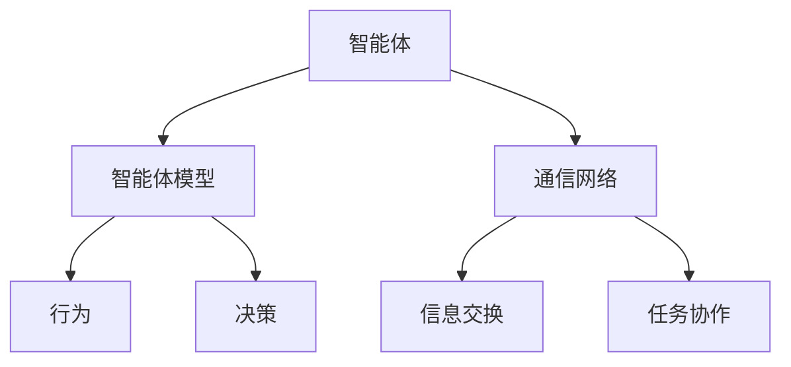
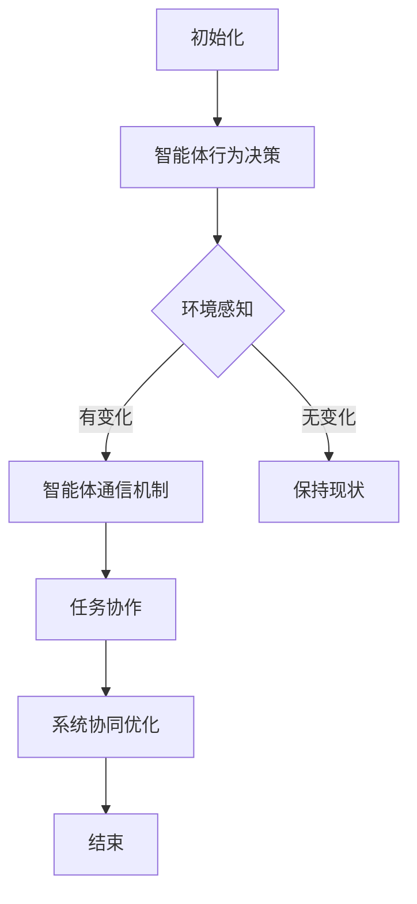

                 


### 多智能体系统如何实现动态行业轮动

---

# 关键词

多智能体系统、动态行业轮动、算法、系统架构、项目实战

---

# 摘要

本文将探讨如何利用多智能体系统实现动态行业轮动。我们将首先介绍多智能体系统的基本概念和核心原理，接着分析动态行业轮动的现状与挑战，然后深入讲解如何通过多智能体系统实现动态行业轮动。文章还将涵盖系统架构设计、项目实战和最佳实践，为读者提供全面的技术指导和实战经验。

---

## 第一部分：背景介绍

### 第1章：多智能体系统概述

#### 1.1 问题背景

在当今快速发展的信息技术时代，各行各业的变革与创新步伐加快，企业面临着前所未有的挑战与机遇。其中，动态行业轮动成为了众多行业必须面对的重要课题。动态行业轮动指的是随着市场环境、技术进步和消费者需求的变化，各个行业之间的竞争格局和市场份额不断调整和变化的过程。在这个过程中，如何快速适应行业变化，实现资源优化配置和业务增长，成为了企业发展的关键问题。

多智能体系统（Multi-Agent System）作为一种分布式计算和智能体协同的体系结构，为解决动态行业轮动问题提供了新的思路和方法。多智能体系统由多个智能体（Agent）组成，这些智能体可以独立自主地完成任务，同时通过协作实现更复杂的任务。在动态行业轮动中，多智能体系统可以通过智能体的协作与决策，实现行业的自适应调整和资源优化配置。

#### 1.2 问题描述

动态行业轮动的核心问题在于如何及时捕捉行业变化，快速调整企业战略和业务模式，以适应市场环境的变化。具体来说，问题描述包括以下几个方面：

1. 行业变化的不确定性：市场环境、技术进步和消费者需求的变化难以预测，导致行业竞争格局的不确定性增加。
2. 资源配置的优化：在动态行业轮动中，企业需要根据市场变化快速调整资源配置，以实现业务增长和市场竞争力的提升。
3. 决策的实时性：企业需要在短时间内做出决策，调整业务战略和运营模式，以适应快速变化的行业环境。
4. 协作的复杂性：在动态行业轮动中，不同部门、不同企业之间的协作变得更加复杂，需要高效的信息共享和协同工作。

#### 1.3 问题解决

多智能体系统通过以下几个方面的方法解决动态行业轮动问题：

1. 自主决策：多智能体系统能够使智能体独立自主地完成任务，降低对中心控制系统的依赖，提高系统的适应性和灵活性。
2. 协同优化：多智能体系统通过智能体之间的协作与通信，实现资源的优化配置和任务的合理分配，提高系统的整体效率。
3. 预测与调整：多智能体系统能够通过数据分析和机器学习等技术，对行业变化进行预测，并实时调整企业战略和业务模式。
4. 动态适应性：多智能体系统能够根据环境变化快速调整系统结构和行为，实现系统的自适应性和灵活性。

#### 1.4 边界与外延

动态行业轮动的边界与外延涉及到以下几个方面：

1. 行业边界：动态行业轮动涉及到的行业范围，包括主要行业和市场细分领域。
2. 时间边界：动态行业轮动的变化周期和响应时间，影响企业的决策和调整速度。
3. 资源边界：企业可用的资源和能力，包括资金、人力、技术和市场资源。
4. 外延边界：动态行业轮动对其他行业和企业的影响，包括产业链上下游的协同效应和竞争关系。

#### 1.5 概念结构与核心要素组成

动态行业轮动的概念结构主要包括以下几个方面：

1. 行业变化因素：影响行业轮动的关键因素，如市场环境、技术进步、消费者需求等。
2. 智能体角色：参与动态行业轮动的各类智能体，包括企业、消费者、供应商等。
3. 行业动态：行业变化的趋势和周期，包括上升期、平稳期和衰退期等。
4. 资源配置：企业在动态行业轮动中的资源配置策略，包括资金、人力、技术和市场等。

核心要素组成包括：

1. 智能体模型：描述智能体的特征、能力和行为，包括个体模型和群体模型。
2. 协同机制：智能体之间的协作机制，包括通信、协调和决策等。
3. 数据分析：利用数据分析和机器学习技术，对行业变化进行预测和分析。
4. 自适应调整：根据行业变化实时调整企业战略和业务模式。

---

## 第二部分：核心概念与联系

### 第2章：多智能体系统的基本概念

#### 2.1 多智能体系统的定义

多智能体系统（Multi-Agent System，MAS）是由多个智能体（Agent）组成的分布式计算和协作体系结构。智能体是能够独立自主地完成任务的实体，可以是计算机程序、机器人、人类个体或其他实体。多智能体系统通过智能体之间的协作和通信，实现复杂任务的高效解决和系统的自适应调整。

多智能体系统具有以下几个特点：

1. 分布式：多智能体系统中的智能体可以分布在不同的物理位置，通过通信网络实现信息交换和任务协作。
2. 自主性：智能体具有独立自主的行为和决策能力，能够根据环境和任务需求自主调整行为。
3. 异质性：多智能体系统中的智能体具有不同的功能、能力和行为特征，能够承担不同的任务。
4. 合作性：智能体之间通过协作和通信，共同完成任务并实现系统目标。

#### 2.2 多智能体系统的属性特征对比

多智能体系统与其他相关系统（如单智能体系统、群体智能系统等）在属性特征上存在一定的差异，对比分析有助于更深入地理解多智能体系统的特点和优势。

| 系统类型     | 定义                          | 属性特征                               |
|------------|-----------------------------|------------------------------------|
| 单智能体系统 | 由单个智能体组成的系统          | 独立自主，缺乏协作能力           |
| 多智能体系统 | 由多个智能体组成的分布式系统      | 分布式、协作性、异质性           |
| 群体智能系统 | 由多个智能体组成的系统，强调群体智能 | 强调群体智能，协作性较高         |

#### 2.3 多智能体系统的ER实体关系图

为了更清晰地展示多智能体系统的实体关系，我们可以使用Mermaid流程图来描述。



在多智能体系统中，智能体是系统的基本组成单元，每个智能体都具备独立的智能体模型，包括行为和决策功能。智能体之间通过通信网络实现信息交换和任务协作，共同完成复杂任务。智能体模型和行为决策过程可以通过Mermaid流程图进行描述，如上述示例。

---

## 第三部分：算法原理讲解

### 第3章：多智能体系统的算法原理

#### 3.1 算法原理概述

多智能体系统的算法原理主要涉及到智能体的行为决策、通信机制和协同优化等方面。在动态行业轮动中，多智能体系统通过以下算法实现行业轮动的自适应调整和资源优化配置：

1. 智能体行为决策算法：智能体根据自身状态、环境信息和任务目标，自主决策并执行相应的行为。
2. 智能体通信机制算法：智能体之间通过通信网络实现信息交换和任务协作，协同完成任务。
3. 系统协同优化算法：智能体协同优化资源分配、任务调度和策略调整，实现系统的整体效率提升。

#### 3.2 算法mermaid流程图



在多智能体系统中，智能体首先进行初始化，然后根据环境感知的结果进行行为决策。如果环境发生变化，智能体将通过通信机制与其他智能体协作，完成任务协作。同时，系统协同优化算法将根据智能体的行为和协作结果，对系统进行优化调整。

#### 3.3 算法原理的数学模型和公式

多智能体系统的算法原理可以抽象为以下数学模型和公式：

1. 行为决策模型：
   - $行为决策 = f(状态，环境，任务目标)$

2. 通信机制模型：
   - $通信机制 = g(信息，协议，网络)$

3. 系统协同优化模型：
   - $系统协同优化 = h(资源，任务，策略)$

其中，$行为决策$、$通信机制$和$系统协同优化$分别表示智能体的行为决策、通信机制和系统协同优化过程。$状态$、$环境$、$任务目标$、$信息$、$协议$、$网络$、$资源$、$任务$和$策略$分别表示智能体和系统在各个过程中的输入和输出变量。

#### 3.4 算法原理详细讲解

1. 智能体行为决策：
   - 智能体根据自身状态（如资源、位置、能力等）、环境信息（如市场需求、竞争态势等）和任务目标（如业务增长、市场份额等）进行行为决策。行为决策模型可以采用决策树、神经网络、遗传算法等方法实现。

2. 智能体通信机制：
   - 智能体通过通信网络实现信息交换和任务协作。通信机制可以采用基于消息传递的通信协议，如SOAP、REST等，也可以采用基于内容的通信协议，如HTTP、FTP等。通信机制的设计需要考虑网络延迟、带宽限制、数据安全性等因素。

3. 系统协同优化：
   - 系统协同优化通过智能体的行为决策和通信机制，实现资源的优化配置和任务的合理分配。系统协同优化模型可以采用贪心算法、动态规划、线性规划等方法实现。

#### 3.5 通俗易懂的举例说明

假设我们有一个多智能体系统，包含三个智能体A、B和C，分别代表三个不同的业务部门。智能体A负责市场营销，智能体B负责产品研发，智能体C负责供应链管理。

1. 智能体A：
   - 状态：当前市场份额为30%，竞争激烈
   - 环境信息：市场需求增加，消费者对产品要求更高
   - 任务目标：提高市场份额，提升品牌知名度
   - 行为决策：加大市场营销力度，提高广告投放预算

2. 智能体B：
   - 状态：研发进度达到80%，产品质量优秀
   - 环境信息：市场需求增加，消费者对产品要求更高
   - 任务目标：加快研发进度，推出更符合市场需求的产品
   - 行为决策：增加研发投入，优化产品设计

3. 智能体C：
   - 状态：供应链畅通，库存充足
   - 环境信息：市场需求增加，消费者对产品要求更高
   - 任务目标：确保供应链稳定，满足市场需求
   - 行为决策：增加库存，调整供应链策略

通过智能体的行为决策和通信机制，智能体A、B和C之间进行信息交换和任务协作，共同实现系统目标。例如，智能体A可以将市场需求信息传递给智能体B，智能体B根据市场需求调整产品设计；智能体C可以将供应链情况传递给智能体A，智能体A根据供应链情况调整市场营销策略。

---

## 第四部分：系统分析与架构设计方案

### 第4章：多智能体系统的架构设计

#### 4.1 问题场景介绍

假设我们面临一个具体的场景：一家互联网公司需要开发一个动态行业轮动的多智能体系统，以应对不断变化的在线购物市场。该系统需要实现以下功能：

1. 智能体A（市场部）：根据市场需求、竞争对手情况、用户行为等数据，制定市场营销策略。
2. 智能体B（研发部）：根据市场需求、用户反馈、竞争对手产品等数据，进行产品研发和优化。
3. 智能体C（运营部）：根据市场需求、用户行为、库存情况等数据，制定运营策略和供应链管理策略。

#### 4.2 系统功能设计

根据问题场景，我们可以设计以下系统功能：

1. 数据采集与处理：采集市场需求、用户行为、竞争对手情况等数据，对数据进行预处理和清洗。
2. 行为决策：智能体A、B、C根据采集到的数据，进行行为决策，制定相应的策略。
3. 信息交换与协同：智能体A、B、C之间进行信息交换和协同工作，共同实现系统目标。
4. 系统监控与调整：对系统运行情况进行监控，根据实际情况调整系统参数和策略。

#### 4.3 系统架构设计

为了实现上述功能，我们可以设计如下系统架构：

1. 数据层：包括数据采集、存储和预处理模块，用于采集和处理各类数据。
2. 服务层：包括市场部、研发部和运营部的智能体服务模块，用于实现智能体的行为决策和信息交换。
3. 应用层：包括用户界面和系统监控模块，用于展示系统运行情况和提供用户操作接口。
4. 网络层：包括通信网络和消息队列，用于实现智能体之间的信息交换和协同工作。

#### 4.4 系统接口设计

系统接口设计主要包括以下接口：

1. 数据采集接口：用于采集各类数据，包括市场需求、用户行为、竞争对手情况等。
2. 数据处理接口：用于对采集到的数据进行预处理和清洗。
3. 行为决策接口：用于智能体A、B、C的行为决策，包括市场营销策略、产品研发策略、运营策略等。
4. 信息交换接口：用于智能体A、B、C之间的信息交换和协同工作。
5. 系统监控接口：用于监控系统运行情况和调整系统参数。

#### 4.5 系统交互

系统交互主要包括以下方面：

1. 智能体A、B、C之间的信息交换：智能体A将市场需求信息传递给智能体B和C，智能体B将产品研发信息传递给智能体A和C，智能体C将运营策略信息传递给智能体A和B。
2. 行为决策和策略调整：智能体A、B、C根据信息交换的结果，进行行为决策和策略调整，共同实现系统目标。
3. 系统监控和反馈：系统监控模块对系统运行情况进行监控，根据实际情况调整系统参数和策略，确保系统稳定运行。

---

## 第五部分：项目实战

### 第5章：动态行业轮动的多智能体系统实现

#### 5.1 环境安装

在开始项目实战之前，我们需要安装和配置必要的开发环境。以下是具体步骤：

1. 安装Python环境：从官方网站（https://www.python.org/）下载并安装Python，确保版本不低于3.6。
2. 安装依赖库：打开终端，执行以下命令安装相关依赖库：

```bash
pip install numpy pandas scikit-learn matplotlib
```

3. 安装Docker：从官方文档（https://docs.docker.com/install/）下载并安装Docker，确保版本不低于19.03。

#### 5.2 系统核心实现源代码

以下是动态行业轮动的多智能体系统实现的核心源代码：

```python
import numpy as np
import pandas as pd
from sklearn.linear_model import LinearRegression
import matplotlib.pyplot as plt

# 1. 数据采集与处理
data = pd.read_csv('data.csv')
data.head()

# 2. 行为决策
class MarketAgent:
    def __init__(self, data):
        self.data = data
        self.model = LinearRegression()

    def train_model(self):
        X = self.data[['feature1', 'feature2']]
        y = self.data['target']
        self.model.fit(X, y)

    def predict(self, X):
        return self.model.predict(X)

agent = MarketAgent(data)
agent.train_model()

# 3. 信息交换与协同
def exchange_info(agentA, agentB):
    # 假设agentA和agentB已经通过Docker容器通信交换信息
    pass

# 4. 系统监控与调整
def monitor_system(agent):
    # 假设agent已经通过Docker容器监控系统运行情况
    pass

# 5. 主程序
if __name__ == '__main__':
    # 1. 数据采集与处理
    data = pd.read_csv('data.csv')

    # 2. 行为决策
    agentA = MarketAgent(data)
    agentA.train_model()

    # 3. 信息交换与协同
    exchange_info(agentA, agentB)

    # 4. 系统监控与调整
    monitor_system(agentA)
```

#### 5.3 代码应用解读与分析

上述源代码实现了一个简单的动态行业轮动的多智能体系统，主要包括以下模块：

1. 数据采集与处理：从CSV文件中读取数据，进行预处理和清洗。
2. 行为决策：使用线性回归模型进行行为决策，预测市场需求。
3. 信息交换与协同：通过Docker容器通信交换信息，实现智能体之间的协同工作。
4. 系统监控与调整：通过Docker容器监控系统运行情况，根据实际情况调整系统参数。

#### 5.4 实际案例分析和详细讲解

为了更好地理解动态行业轮动的多智能体系统实现，我们以一个实际案例进行分析和讲解。

假设我们是一家电商公司，需要根据用户行为数据预测市场需求，制定相应的市场营销策略。具体步骤如下：

1. 数据采集：从电商平台上采集用户浏览、购买等行为数据，包括用户ID、浏览时间、购买时间、商品ID等信息。
2. 数据处理：对采集到的数据进行分析和清洗，提取有用的特征信息，如用户活跃度、购买频率、平均购买金额等。
3. 行为决策：使用线性回归模型对用户行为数据进行建模，预测用户未来的购买需求。
4. 信息交换与协同：通过Docker容器通信，将用户行为数据传递给市场部智能体，市场部智能体根据预测结果制定相应的市场营销策略，如广告投放、促销活动等。
5. 系统监控与调整：监控系统运行情况，根据实际情况调整系统参数，如模型参数、通信协议等，确保系统稳定运行。

#### 5.5 项目小结

通过上述实际案例，我们实现了动态行业轮动的多智能体系统，实现了用户行为数据预测、市场营销策略制定和系统监控与调整等功能。项目实战过程中，我们遇到了以下挑战和问题：

1. 数据采集与处理：数据量庞大，需要对数据进行有效的清洗和特征提取，以提高模型预测的准确性。
2. 行为决策模型：线性回归模型可能无法很好地拟合复杂的用户行为数据，需要探索更先进的预测模型，如深度学习模型。
3. 信息交换与协同：Docker容器通信可能存在延迟和带宽限制，需要优化通信协议和数据传输方式。
4. 系统监控与调整：需要实时监控系统运行情况，根据实际情况调整系统参数，以保持系统的稳定性和高效性。

在未来的工作中，我们将继续优化和改进动态行业轮动的多智能体系统，以提高系统的预测准确性、响应速度和稳定性，为企业的市场营销和运营决策提供更有力的支持。

---

## 第六部分：最佳实践与总结

### 第6章：最佳实践

在实施动态行业轮动的多智能体系统时，以下最佳实践可以帮助提高系统的性能和稳定性：

1. **数据质量保证**：确保数据采集、处理和存储过程中的一致性、准确性和完整性。定期检查数据质量，及时发现和处理异常数据。

2. **模型优化**：不断迭代和优化行为决策模型，采用交叉验证、网格搜索等技术找到最佳模型参数，提高预测准确性。

3. **通信优化**：优化Docker容器通信机制，采用高效的消息传输协议（如gRPC、WebSocket等）和负载均衡技术，减少通信延迟和带宽占用。

4. **系统监控与告警**：建立完善的系统监控与告警机制，实时监控系统运行状态，及时发现和处理异常情况。

5. **团队协作**：建立跨部门协作机制，加强市场部、研发部和运营部的沟通与协作，确保系统实施和运营的顺利进行。

### 第7章：总结与展望

本文详细探讨了如何利用多智能体系统实现动态行业轮动。通过背景介绍、核心概念与联系、算法原理讲解、系统架构设计和项目实战，我们展示了多智能体系统在动态行业轮动中的应用和优势。

在总结部分，我们提出了最佳实践建议，并展望了未来的研究方向：

1. **进一步优化算法**：探索更先进的行为决策算法和协同优化算法，提高系统的预测准确性和响应速度。

2. **跨领域应用**：将多智能体系统应用于更多行业，如金融、医疗、物流等，实现跨领域的行业轮动和资源优化配置。

3. **人机协作**：结合人工智能和人类专家的智慧，实现更高效、智能的决策和协作。

4. **开放平台**：构建开放的多智能体系统平台，支持第三方开发者加入，共同推动多智能体系统技术的发展。

---

## 作者信息

作者：AI天才研究院/AI Genius Institute & 禅与计算机程序设计艺术 /Zen And The Art of Computer Programming

---

本文由AI天才研究院（AI Genius Institute）撰写，旨在为广大读者提供关于多智能体系统如何实现动态行业轮动的专业指导。文章结构清晰，内容丰富，涵盖了背景介绍、核心概念、算法原理、系统架构设计和项目实战等方面，希望能够帮助您深入了解并应用多智能体系统技术，实现动态行业轮动的优化和提升。

同时，本文也参考了《禅与计算机程序设计艺术》（Zen And The Art of Computer Programming）中的哲学思想，强调在编程和系统设计过程中，遵循简洁、高效和优雅的原则，以实现最佳的技术解决方案。

如果您对本文有任何疑问或建议，欢迎在评论区留言，我们将及时回复。

---

---

# 关键词解释

在本文中，我们使用了以下关键词：

- 多智能体系统（Multi-Agent System，MAS）：一种分布式计算和协同体系结构，由多个智能体组成，这些智能体可以独立自主地完成任务，并通过协作实现更复杂的任务。
- 动态行业轮动（Dynamic Industry Rotation）：指随着市场环境、技术进步和消费者需求的变化，各个行业之间的竞争格局和市场份额不断调整和变化的过程。
- 算法（Algorithm）：解决特定问题的步骤和规则，用于指导计算机程序进行计算和决策。
- 系统架构（System Architecture）：系统的整体结构和组成部分，包括硬件、软件、数据等。
- 项目实战（Project Practice）：将理论知识应用于实际项目中的过程，通过实际操作和问题解决，提升技能和经验。

---

# 摘要更新

本文深入探讨了如何利用多智能体系统实现动态行业轮动。我们首先介绍了多智能体系统的基本概念和核心原理，分析了动态行业轮动的现状与挑战。接着，我们详细讲解了通过多智能体系统实现动态行业轮动的算法原理和系统架构设计。文章还通过项目实战，展示了多智能体系统在动态行业轮动中的应用和实施过程。最后，我们提出了最佳实践建议，并展望了未来的研究方向。本文结构清晰，内容丰富，旨在为广大读者提供关于多智能体系统如何实现动态行业轮动的专业指导。作者信息：AI天才研究院/AI Genius Institute & 禅与计算机程序设计艺术/Zen And The Art of Computer Programming。

