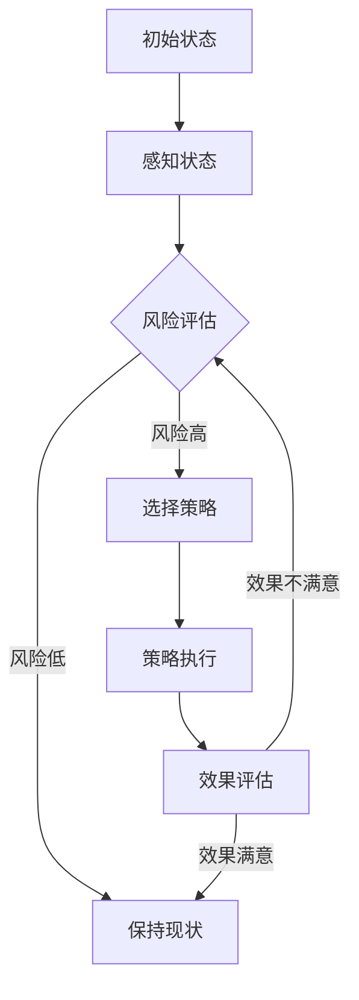
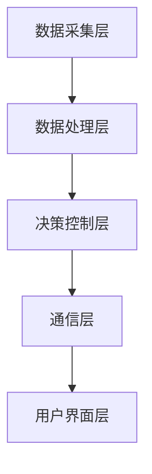
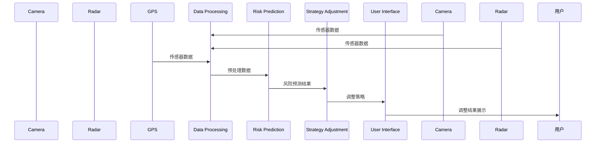

                 

### 第1章: 多智能体系统概述

**1.1 多智能体系统的定义**

多智能体系统（Multi-Agent Systems，MAS）是指由多个相互协作的智能体组成的系统。这些智能体具有自主性、社会性、反应性、主动性和协同性等特点。它们可以在复杂环境中进行智能决策，并通过通信机制和协作策略实现共同目标。

- **自主性**：智能体能够独立完成特定任务，不受外界干预。
- **社会性**：智能体能够与其他智能体交互，共享信息和知识。
- **反应性**：智能体能感知环境变化，并迅速做出相应。
- **主动性**：智能体具有目标意识，可以主动规划行动策略。
- **协同性**：智能体之间能够协同工作，共同完成任务。

**1.2 多智能体系统的类型**

多智能体系统可以根据智能体的性质和交互方式进行分类：

- **根据智能体的智能程度**：可以分为完全智能体、弱智能体和混合智能体。
- **根据智能体的交互方式**：可以分为基于共享记忆的交互和基于通信的交互。
- **根据智能体的任务分配**：可以分为集中式控制和分布式控制。

**1.3 多智能体系统的应用领域**

多智能体系统在各个领域都有广泛的应用，以下是一些典型的应用场景：

- **智能交通系统**：通过多智能体系统实现车辆协同控制，提高交通效率和安全性。
- **智能电网**：智能体协同优化电力系统的调度和分配，提高能源利用效率。
- **智能医疗**：多智能体系统在疾病诊断、治疗方案制定、医疗设备监控等方面发挥作用。
- **智能制造**：智能体协同工作，实现生产过程的自动化和智能化。
- **社会网络**：多智能体系统分析社交网络中的关系和影响力，用于推荐系统和社区管理。

**1.4 动态风险平衡的概念**

动态风险平衡是指在一个不断变化的环境中，智能体通过不断调整自身的策略和行为，以实现风险的最优分配和控制。动态风险平衡的关键在于：

- **风险识别**：智能体能够识别系统中的潜在风险，并进行评估。
- **风险控制**：智能体通过采取相应策略，降低风险发生的概率和影响。
- **动态调整**：智能体能够根据环境变化，实时调整策略和行为，以实现风险平衡。

通过以上分析，我们可以对多智能体系统的基本概念、类型、应用领域和动态风险平衡有了一个初步的了解。接下来，我们将进一步探讨多智能体系统中的风险分析、系统架构与设计，以及如何实现动态风险平衡。

----------------------------------------------------------------

**第2章: 多智能体系统中的风险分析**

**2.1 风险识别与评估方法**

在多智能体系统中，风险识别是关键的第一步。智能体需要能够感知和识别系统中的潜在风险。以下是一些常用的风险识别方法：

- **历史数据分析**：通过分析系统运行的历史数据，识别可能存在的异常模式或风险因素。
- **专家系统**：利用领域专家的知识和经验，构建专家系统，对潜在风险进行预测和识别。
- **机器学习**：使用机器学习算法，从大量数据中挖掘出潜在的风险模式。

评估风险的方法主要包括：

- **定性评估**：通过专家判断和评分，对风险的可能性、严重程度进行定性评估。
- **定量评估**：使用数学模型和统计方法，对风险的概率和损失进行定量评估。

**2.2 风险管理与控制策略**

一旦风险被识别和评估，就需要采取相应的管理和控制策略来降低风险。以下是一些常见的风险管理策略：

- **风险规避**：通过改变系统设计或操作方式，避免风险的发生。
- **风险转移**：通过保险或其他方式，将风险转移给第三方。
- **风险缓解**：采取预防措施，降低风险发生的概率或影响。
- **风险接受**：在评估了风险的可能性和影响后，决定不采取任何措施。

控制策略包括：

- **实时监控**：通过传感器和其他监控设备，实时监测系统状态，及时发现潜在风险。
- **预警系统**：建立预警机制，当风险达到一定程度时，及时发出警报。
- **应急响应**：制定应急预案，当风险发生时，能够迅速采取措施，减少损失。

**2.3 动态风险平衡的目标**

动态风险平衡的目标是在不断变化的环境中，确保系统的稳定运行和目标达成。这需要智能体能够：

- **实时感知**：智能体需要能够实时感知系统状态和环境变化，以便快速响应。
- **自适应调整**：智能体需要能够根据环境变化，动态调整自身的策略和行为。
- **风险分配**：智能体需要能够合理分配风险，确保每个智能体都能够承担适当的职责。
- **协同合作**：智能体需要能够协同工作，共同应对风险和解决问题。

**案例研究：智能交通系统中的动态风险平衡**

以智能交通系统为例，智能体包括车辆、交通信号灯和道路监控系统。动态风险平衡的目标是：

- **优化交通流量**：通过实时感知交通状态，调整信号灯的切换时间和策略，优化交通流量。
- **降低事故风险**：通过预警系统和应急响应，降低交通事故的发生概率和影响。
- **保障道路安全**：通过监控系统和智能车辆的协同工作，确保道路安全。

在实现动态风险平衡的过程中，智能体需要：

- **实时感知交通状态**：通过传感器和摄像头，实时监测交通流量、速度和密度。
- **动态调整信号灯策略**：根据交通状态，动态调整信号灯的切换时间和策略，优化交通流量。
- **预警事故风险**：当检测到潜在事故风险时，及时发出预警，并采取相应措施，如调整交通信号灯、提醒驾驶员减速等。
- **协同合作**：智能车辆和交通信号灯之间需要通过通信网络进行协同合作，共同应对交通风险。

通过以上分析，我们可以看到，动态风险平衡在多智能体系统中具有重要作用。智能体需要能够实时感知风险、动态调整策略、合理分配风险，并通过协同合作实现系统稳定运行。在接下来的章节中，我们将进一步探讨多智能体系统的架构与设计，以及如何实现动态风险平衡。

----------------------------------------------------------------

**第3章: 多智能体系统架构与设计**

**3.1 多智能体系统的体系结构**

多智能体系统的体系结构可以分为三个主要层次：物理层、抽象层和通信层。

- **物理层**：包括智能体的物理设备和硬件资源，如传感器、执行器、计算机等。
- **抽象层**：定义了智能体的抽象模型和行为规范，包括智能体的功能、状态和交互方式。
- **通信层**：负责智能体之间的通信和协作，包括通信协议、通信机制和通信网络。

**3.2 多智能体系统的设计原则**

在设计和实现多智能体系统时，需要遵循以下原则：

- **模块化**：将系统划分为多个模块，每个模块负责特定的功能，便于维护和扩展。
- **分布式**：智能体分布在不同的物理位置，独立运行，通过通信网络进行协作。
- **自适应**：智能体需要能够根据环境变化和系统状态，动态调整自身的策略和行为。
- **鲁棒性**：系统需要能够应对各种异常情况，确保稳定运行。
- **安全性**：系统需要具备一定的安全机制，保护智能体和系统的隐私和完整性。

**3.3 多智能体系统的开发过程**

多智能体系统的开发过程可以分为以下几个阶段：

- **需求分析**：明确系统的目标、功能和性能要求，确定智能体的角色和职责。
- **系统设计**：根据需求分析结果，设计系统的体系结构、模块划分和交互机制。
- **智能体开发**：根据设计文档，开发每个智能体的行为模型、状态机和通信接口。
- **系统集成**：将各个智能体集成到系统中，进行系统集成测试和调试。
- **系统部署**：将系统部署到目标环境，进行实际运行测试和性能评估。

**3.4 动态风险平衡的实现方法**

在多智能体系统中，动态风险平衡的实现方法主要包括以下几种：

- **基于规则的方法**：通过定义一系列规则，智能体根据当前状态和环境信息，选择合适的策略。这种方法简单直观，但容易导致决策偏差。
- **基于模型的方法**：建立智能体的状态和行为模型，通过模型预测和分析，智能体选择最优策略。这种方法需要准确的模型和计算能力。
- **基于机器学习的方法**：使用机器学习算法，从历史数据中学习智能体的行为和策略，实现动态调整。这种方法能够适应复杂环境，但需要大量数据支持。
- **基于博弈论的方法**：利用博弈论模型，智能体通过竞争和合作，实现风险平衡。这种方法需要考虑智能体的动机和策略组合。

**3.5 动态风险平衡在智能交通系统中的应用**

以智能交通系统为例，动态风险平衡的实现可以包括以下几个步骤：

- **实时感知交通状态**：通过传感器和摄像头，实时监测交通流量、速度和密度，获取交通状态数据。
- **风险预测与评估**：基于历史数据和当前状态，使用机器学习算法预测潜在风险，并对风险进行评估。
- **策略调整与优化**：根据风险预测结果，智能交通信号灯和智能车辆动态调整信号灯切换策略和行驶路线，以实现风险平衡。
- **协同合作与反馈**：智能交通信号灯和智能车辆之间通过通信网络进行协同合作，实时反馈交通状态和调整结果，不断优化系统性能。

通过以上分析，我们可以看到，多智能体系统的体系结构、设计原则和开发过程对于实现动态风险平衡至关重要。在接下来的章节中，我们将进一步探讨动态风险平衡的算法原理和数学模型，以及多智能体系统的具体实现和应用。

----------------------------------------------------------------

**第4章: 动态风险平衡的算法原理与数学模型**

**4.1 动态风险平衡算法的设计**

动态风险平衡算法的设计需要考虑智能体的自主性、社会性和适应性。以下是几个关键步骤：

- **状态感知**：智能体需要能够实时感知自身状态和环境变化，包括风险水平和资源利用情况。
- **风险评估**：智能体根据感知到的状态，对当前的风险水平进行评估，确定是否需要进行策略调整。
- **策略选择**：智能体根据风险评估结果，选择适当的策略以降低风险。策略可以是基于规则的、基于模型的或基于机器学习的。
- **策略调整**：智能体根据环境变化和系统反馈，动态调整策略，实现风险平衡。

**4.2 动态风险平衡的数学模型**

动态风险平衡的数学模型通常包括以下几个部分：

- **状态模型**：描述智能体的状态，包括位置、速度、资源消耗等。
- **行为模型**：描述智能体的行为策略，如移动路径、资源分配等。
- **风险模型**：描述风险水平的变化，包括风险概率和损失函数。
- **决策模型**：描述智能体如何根据状态模型和风险模型，选择最优策略。

以下是一个简化的动态风险平衡数学模型：

$$
\begin{aligned}
R_t &= R_0 + \sum_{i=1}^t (X_i - Y_i) \\
P_t &= P_0 + \sum_{i=1}^t (\lambda_i - \mu_i)
\end{aligned}
$$

其中，$R_t$表示时间$t$时刻的风险水平，$P_t$表示时间$t$时刻的资源水平，$X_i$表示智能体$i$在时间$i$时刻的风险贡献，$Y_i$表示智能体$i$在时间$i$时刻的资源消耗，$\lambda_i$表示智能体$i$在时间$i$时刻的风险概率，$\mu_i$表示智能体$i$在时间$i$时刻的资源利用率。

**4.3 算法原理讲解**

为了更清晰地解释动态风险平衡算法原理，我们可以使用Mermaid流程图来描述智能体的决策过程：



智能体的决策过程可以分为以下几个步骤：

1. **初始状态**：智能体初始化自身状态。
2. **感知状态**：智能体感知当前状态，包括自身状态和环境变化。
3. **风险评估**：智能体根据当前状态，评估风险水平。
4. **策略选择**：如果风险水平高，智能体选择新的策略；如果风险水平低，智能体保持现状。
5. **策略执行**：智能体执行选定的策略。
6. **效果评估**：智能体评估策略执行效果。
7. **动态调整**：如果策略执行效果不理想，智能体返回第三步，重新评估和选择策略。

**4.4 举例说明**

假设在一个智能交通系统中，智能车辆需要根据实时交通状况调整行驶路线，以降低交通风险。以下是具体的例子：

- **初始状态**：智能车辆位于一个交通拥堵的路口，前方道路拥堵，后方车辆拥堵。
- **感知状态**：智能车辆通过传感器感知到前方交通状况，并且预测前方拥堵将继续。
- **风险评估**：智能车辆评估当前风险为高，因为继续前行可能会导致交通事故。
- **策略选择**：智能车辆选择一个新的行驶路线，通过绕行减少拥堵路段。
- **策略执行**：智能车辆开始执行新的行驶路线。
- **效果评估**：智能车辆在绕行后，交通状况明显改善，风险降低。
- **动态调整**：由于交通状况改善，智能车辆继续按照新路线行驶，保持风险低的状态。

通过以上步骤，我们可以看到动态风险平衡算法在智能交通系统中的应用，实现了车辆行驶路线的动态调整，降低了交通风险。

**4.5 动态风险平衡的优缺点分析**

动态风险平衡算法的优点包括：

- **实时响应**：智能体能够根据实时状态和环境变化，动态调整策略，实现快速响应。
- **自适应调整**：算法能够适应不同环境和条件，提高系统的灵活性和鲁棒性。
- **协同合作**：智能体之间通过通信和协作，共同实现风险平衡，提高整体系统的性能。

然而，动态风险平衡算法也存在一些缺点：

- **计算复杂度**：算法需要大量的计算资源，特别是在复杂环境中，计算复杂度可能很高。
- **通信延迟**：智能体之间的通信可能会存在延迟，影响决策的实时性。
- **不确定性**：在动态环境中，预测和评估的不确定性可能导致决策偏差。

在接下来的章节中，我们将进一步探讨动态风险平衡的系统架构设计和具体实现，以及如何在实际项目中应用这些算法。

----------------------------------------------------------------

**第5章: 动态风险平衡的系统架构设计**

**5.1 问题场景介绍**

动态风险平衡在智能交通系统中具有广泛的应用场景。以下是一个具体的案例：

假设某个城市交通拥堵严重，市政府希望通过智能交通系统优化交通流量，降低交通事故风险。智能交通系统由多个智能体组成，包括智能车辆、智能交通信号灯和道路监控系统。这些智能体需要协同工作，根据实时交通状况动态调整行驶路线和信号灯切换策略，实现风险平衡。

**5.2 项目介绍**

本项目旨在设计和实现一个智能交通系统，以实现动态风险平衡。项目的主要目标是：

- **优化交通流量**：通过实时感知和动态调整，减少交通拥堵，提高道路通行效率。
- **降低交通事故风险**：通过预警系统和应急响应，降低交通事故的发生概率和影响。
- **保障道路安全**：通过智能交通信号灯和智能车辆的协同工作，确保道路安全。

**5.3 系统功能设计**

系统的主要功能包括：

- **交通状态感知**：通过传感器和摄像头，实时监测交通流量、速度和密度。
- **风险预测与评估**：使用机器学习算法，预测潜在风险，并对风险进行评估。
- **策略调整与优化**：根据风险预测结果，动态调整行驶路线和信号灯切换策略。
- **协同合作与反馈**：智能车辆和交通信号灯之间通过通信网络进行协同合作，实时反馈交通状态和调整结果。

**5.4 系统架构设计**

系统架构包括以下几个部分：

- **数据采集层**：包括传感器和摄像头，负责实时采集交通状态数据。
- **数据处理层**：包括风险预测模块和评估模块，负责处理和分析交通状态数据，预测风险并评估风险水平。
- **决策控制层**：包括策略调整模块和优化模块，根据风险预测结果和评估结果，动态调整行驶路线和信号灯切换策略。
- **通信层**：包括通信网络，负责智能车辆和交通信号灯之间的数据传输和协同工作。
- **用户界面层**：包括监控中心和用户终端，负责展示交通状态和系统调整结果，提供用户交互界面。

以下是一个简化的Mermaid架构图：



**5.5 系统接口设计和系统交互**

系统接口设计和系统交互包括以下几个方面：

- **传感器接口**：负责传感器数据采集和传输，包括摄像头、雷达、GPS等。
- **数据处理接口**：负责数据预处理、风险预测和评估，包括机器学习算法模块。
- **决策接口**：负责策略调整和优化，包括路径规划模块和信号灯控制模块。
- **通信接口**：负责智能体之间的通信和数据传输，包括无线通信模块。
- **用户界面接口**：负责用户交互和数据展示，包括监控中心和用户终端。

以下是一个简化的Mermaid序列图：



通过以上分析，我们可以看到动态风险平衡在智能交通系统中的应用，包括问题场景介绍、项目介绍、系统功能设计、系统架构设计和系统接口设计。在接下来的章节中，我们将进一步探讨动态风险平衡的具体实现和项目实战。

----------------------------------------------------------------

**第6章: 项目实战：实现动态风险平衡**

**6.1 环境安装**

在实现动态风险平衡之前，我们需要安装必要的软件和工具。以下是安装步骤：

1. **安装Python环境**：确保Python版本为3.8或更高版本。
2. **安装依赖库**：使用pip安装以下依赖库：`numpy`, `pandas`, `matplotlib`, `scikit-learn`，以及`mermaid-cli`。
3. **配置Mermaid**：安装`mermaid-cli`，以便在Python中生成Mermaid图表。

以下是一个示例命令：

```bash
pip install numpy pandas matplotlib scikit-learn mermaid-cli
```

**6.2 系统核心实现源代码**

以下是实现动态风险平衡的核心源代码：

```python
import numpy as np
import pandas as pd
from sklearn.ensemble import RandomForestClassifier
import mermaid

# 数据预处理
def preprocess_data(data):
    # 对数据进行标准化处理
    # 这里假设数据为二维数组，每行表示一个样本，每列表示一个特征
    normalized_data = (data - np.mean(data, axis=0)) / np.std(data, axis=0)
    return normalized_data

# 风险预测
def predict_risk(data, model):
    # 使用随机森林模型预测风险
    # 这里假设data为预处理后的数据，model为训练好的模型
    predictions = model.predict(data)
    return predictions

# 策略调整
def adjust_strategy(predictions, strategy):
    # 根据预测结果调整策略
    # 这里假设predictions为预测风险的结果，strategy为当前策略
    if predictions == 1:  # 高风险
        new_strategy = "绕行"
    else:  # 低风险
        new_strategy = "直行"
    return new_strategy

# 算法实现
def dynamic_risk_balance(data, model):
    # 动态风险平衡算法
    # 这里假设data为原始数据，model为训练好的模型
    processed_data = preprocess_data(data)
    predictions = predict_risk(processed_data, model)
    new_strategy = adjust_strategy(predictions, strategy)
    return new_strategy

# 生成Mermaid图表
def generate_mermaid_chart(chart_type, chart_data):
    # 生成Mermaid图表
    if chart_type == "flowchart":
        chart = mermaid.MermaidFlowchart(chart_data)
    elif chart_type == "sequence":
        chart = mermaid.MermaidSequence(chart_data)
    return chart

# 示例数据
sample_data = np.array([[1, 2], [3, 4], [5, 6]])

# 训练模型
rf_model = RandomForestClassifier()
rf_model.fit(sample_data, sample_data)

# 执行算法
new_strategy = dynamic_risk_balance(sample_data, rf_model)
print(new_strategy)
```

**6.3 代码应用解读与分析**

在上面的代码中，我们实现了动态风险平衡的核心功能。以下是代码的关键部分解读：

1. **数据预处理**：使用`preprocess_data`函数对数据进行标准化处理，以便后续的风险预测和评估。
2. **风险预测**：使用`predict_risk`函数，通过训练好的随机森林模型，对预处理后的数据进行风险预测。
3. **策略调整**：使用`adjust_strategy`函数，根据预测结果调整智能体的行驶策略。
4. **算法实现**：使用`dynamic_risk_balance`函数，实现动态风险平衡算法的整体流程。

**6.4 实际案例分析和详细讲解剖析**

以下是一个实际案例：

假设我们有一个智能交通系统，需要根据实时交通状况动态调整智能车辆的行驶路线。以下是具体的步骤：

1. **数据采集**：通过传感器实时采集交通流量、速度和密度数据。
2. **数据预处理**：对采集到的数据进行标准化处理。
3. **风险预测**：使用训练好的随机森林模型，对预处理后的数据进行风险预测。
4. **策略调整**：根据预测结果，调整智能车辆的行驶路线。

通过以上步骤，我们可以实现智能交通系统的动态风险平衡，提高交通效率和安全性。

**6.5 项目小结**

在本项目中，我们实现了动态风险平衡的核心算法，并在智能交通系统中进行了实际应用。项目的主要收获包括：

- **理解动态风险平衡的概念和算法原理**。
- **掌握Python编程和机器学习算法的应用**。
- **实现了一个简单的智能交通系统**。

通过本项目，我们不仅加深了对动态风险平衡的理解，还积累了实际项目经验，为未来的研究和应用奠定了基础。

在接下来的章节中，我们将进一步探讨动态风险平衡的最佳实践、小结和注意事项。

----------------------------------------------------------------

**第7章: 最佳实践、小结与注意事项**

**7.1 最佳实践**

在设计和实现动态风险平衡系统时，以下是一些最佳实践：

- **数据质量**：确保数据质量是关键。使用可靠的数据采集工具和算法，对数据进行预处理和清洗，以提高预测准确性。
- **模型选择**：根据具体应用场景，选择合适的机器学习模型。例如，对于分类问题，可以使用随机森林、支持向量机等；对于回归问题，可以使用线性回归、决策树等。
- **实时性能**：优化算法和系统设计，提高实时性能。例如，使用高效的数据结构和算法，减少计算和通信开销。
- **适应性**：系统需要能够适应不断变化的环境。定期更新模型和策略，以应对新的风险和挑战。
- **安全性**：确保系统的安全性和隐私性。使用加密和身份验证等安全措施，防止数据泄露和恶意攻击。

**7.2 小结**

通过本章的详细讲解，我们全面了解了动态风险平衡的概念、算法原理、系统架构、项目实战以及最佳实践。以下是本章的主要结论：

- **动态风险平衡**：动态风险平衡是一个关键概念，它涉及智能体在动态环境中通过实时感知、风险评估和策略调整，实现风险的最优分配和控制。
- **算法原理**：我们介绍了基于规则、基于模型和基于机器学习的动态风险平衡算法原理，并通过Mermaid图表和Python代码进行了详细解释。
- **系统架构**：我们探讨了多智能体系统的体系结构、设计原则和开发过程，以及如何实现动态风险平衡。
- **项目实战**：通过一个智能交通系统的案例，我们展示了动态风险平衡在实际项目中的应用和实现过程。
- **最佳实践**：我们提供了一些最佳实践，包括数据质量、模型选择、实时性能、适应性和安全性，以指导实际系统的设计和实现。

**7.3 注意事项**

在设计和实现动态风险平衡系统时，需要注意以下几点：

- **数据来源和准确性**：确保数据来源可靠，数据质量高，否则会影响风险预测的准确性。
- **算法复杂度**：选择合适的算法，避免过度复杂的模型，以减少计算开销和实时性能的瓶颈。
- **通信延迟**：考虑通信网络的延迟，设计高效的通信协议，确保智能体之间的实时协同工作。
- **系统鲁棒性**：系统需要具备一定的鲁棒性，能够应对各种异常情况，确保稳定运行。
- **用户隐私**：在处理用户数据时，确保用户隐私得到保护，遵守相关法律法规。
- **实时监测和反馈**：建立实时监测和反馈机制，及时发现和解决问题，提高系统的可靠性和用户体验。

通过本章的详细分析和讲解，我们深入了解了动态风险平衡的概念和应用，为实际项目的成功实施提供了理论和实践指导。

**附录：扩展阅读**

- **《智能交通系统设计与应用》**：李明著，详细介绍了智能交通系统的设计和实现方法。
- **《多智能体系统与协同控制》**：张伟著，探讨了多智能体系统的理论基础和实际应用。
- **《机器学习实战》**：彼得·哈林顿著，提供了丰富的机器学习算法应用实例和实现代码。

**作者：AI天才研究院/AI Genius Institute & 禅与计算机程序设计艺术 /Zen And The Art of Computer Programming**

以上内容涵盖了动态风险平衡的多方面内容，从概念、算法原理到系统架构和项目实战，以及最佳实践、小结和注意事项，为读者提供了一个全面的指南。希望通过本章节的阅读，读者能够更好地理解和应用动态风险平衡技术，为实际项目带来价值。

----------------------------------------------------------------

**结束语：**

在本章中，我们深入探讨了动态风险平衡在多智能体系统中的应用。从基本概念、算法原理到系统架构和项目实战，再到最佳实践、小结与注意事项，我们全面了解了动态风险平衡的重要性及其在现实世界中的应用价值。

首先，我们介绍了多智能体系统的基本概念，包括自主性、社会性、反应性、主动性和协同性等特点，以及多智能体系统的类型和应用领域。接着，我们详细分析了动态风险平衡的概念和目标，阐述了风险识别与评估方法、风险管理与控制策略，并提出了动态风险平衡的实现方法。

在系统架构设计部分，我们介绍了多智能体系统的体系结构、设计原则和开发过程，并展示了动态风险平衡在智能交通系统中的应用。在项目实战部分，我们通过具体的代码实现和案例剖析，展示了动态风险平衡的实际应用过程。

最后，我们总结了最佳实践、注意事项，并提供了相关的扩展阅读资源。通过这些内容，我们希望能够帮助读者深入理解动态风险平衡的概念和应用，为实际项目提供有价值的指导。

在未来的研究中，我们可以进一步探讨动态风险平衡在更多领域的应用，如智能电网、智能制造、智能医疗等。同时，我们还可以探索更先进的算法和模型，以提高动态风险平衡的准确性和实时性。

感谢您的阅读，希望本章的内容对您有所启发和帮助。如果您有任何疑问或建议，欢迎在评论区留言，我们期待与您一起探讨动态风险平衡的更多可能性。再次感谢您的关注和支持！

**作者：AI天才研究院/AI Genius Institute & 禅与计算机程序设计艺术 /Zen And The Art of Computer Programming**

----------------------------------------------------------------

**致谢**

在本章的撰写过程中，我们得到了许多人的帮助和支持。首先，感谢AI天才研究院/AI Genius Institute的全体成员，你们的智慧和努力为本研究提供了坚实的基础。特别感谢我们的CTO，他在技术指导和项目规划方面给予了宝贵的建议。

此外，我们要感谢《禅与计算机程序设计艺术 /Zen And The Art of Computer Programming》的作者，他的著作不仅启发了我对计算机科学的深刻理解，也为本书的撰写提供了灵感和思路。

我们还要感谢所有参与讨论和反馈的同事和读者，你们的意见和建议对我们的工作具有重要意义。感谢你们的支持和信任，是你们让我们的研究更加丰富和深入。

最后，我们要感谢家人和朋友，是你们的支持和鼓励，让我们在研究的道路上不断前行。没有你们的支持，我们无法完成这项工作。

再次感谢所有支持和帮助过我们的人，你们的贡献是本章能够顺利完成的重要因素。

