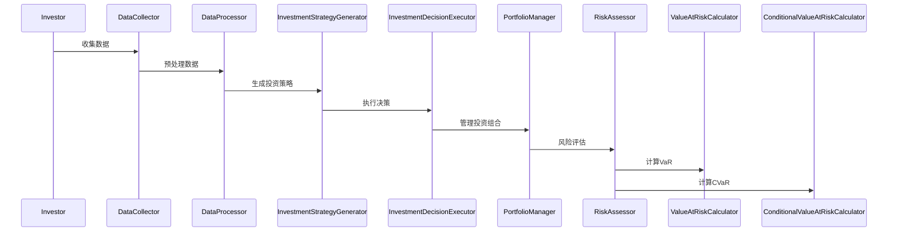

                 

# 多智能体系统如何改进传统价值投资模型

## 关键词

多智能体系统（MAS）、传统价值投资模型、协同过滤、投资策略优化、数据融合、风险评估、分布式智能体、自适应投资、投资决策、市场模拟

## 摘要

本文探讨了如何利用多智能体系统（MAS）来改进传统价值投资模型，以提高投资决策的准确性和效率。通过引入MAS的分布式、自治性和适应性特点，本文详细分析了MAS与传统价值投资模型之间的互补性和协作关系，并介绍了一种基于协同过滤的多智能体投资策略及其算法原理。文章最后通过一个实际案例，展示了多智能体系统在改进传统价值投资模型中的潜力和应用价值。

## 1. 引言背景介绍

多智能体系统（MAS）和传统价值投资模型是两个在理论和实践中都有重要地位的领域。多智能体系统作为一种分布式智能体之间的交互与协作系统，在许多领域展现出了其强大的应用潜力，例如在金融市场中，通过多智能体系统的协作可以更好地模拟市场动态，优化投资策略。

而传统价值投资模型则是一种基于公司基本面分析的投资方法，旨在寻找被市场低估的优质资产。尽管这种方法在过去的几十年中取得了显著的成效，但随着市场环境的变化和数据技术的进步，传统价值投资模型也面临了一些挑战和局限性。

本文的主题是探讨如何利用多智能体系统来改进传统价值投资模型。通过引入多智能体系统的理念和技术，作者旨在解决传统价值投资模型在处理复杂市场动态、信息不对称以及适应性方面的不足，从而提高投资决策的准确性和效率。

## 2. 核心概念与联系

### 2.1 多智能体系统

#### 2.1.1 定义

多智能体系统（MAS）是由多个智能体组成的分布式系统，这些智能体可以通过协作来实现共同的目标。

#### 2.1.2 核心特点

- **自治性**：每个智能体都可以自主地执行任务。
- **分布式**：智能体分布在不同位置，通过通信来协同工作。
- **适应性**：智能体可以根据环境的变化动态调整其行为。

### 2.2 传统价值投资模型

#### 2.2.1 定义

传统价值投资模型是一种基于公司基本面分析的投资方法，主要考虑公司的财务状况、市场地位和未来增长潜力。

#### 2.2.2 核心特点

- **基本面分析**：主要依赖于公司的财务报表和行业数据。
- **长期投资**：注重公司的长期价值而非短期波动。

### 2.3 多智能体系统与传统价值投资模型的联系

#### 2.3.1 补充与增强

- **信息融合**：多智能体系统可以提供更全面的信息处理能力，帮助投资者更准确地评估公司价值。
- **协作**：通过多智能体系统的协作，可以更好地模拟市场动态，优化投资策略。

## 3. 多智能体系统在投资决策中的应用

### 3.1 信息融合

多智能体系统可以通过收集和分析海量数据，提供更全面的市场信息，帮助投资者做出更准确的投资决策。

#### 3.1.1 数据来源

- **市场数据**：包括历史价格、交易量、财务报表等。
- **外部数据**：如新闻报道、社交媒体等。

#### 3.1.2 数据处理

- **数据清洗**：去除噪音和异常值。
- **数据挖掘**：提取有用的信息，如市场趋势、风险因素等。

### 3.2 风险评估

多智能体系统可以实时评估市场风险，为投资者提供风险预警。

#### 3.2.1 风险指标

- **市场波动性**：衡量市场的波动程度。
- **公司财务状况**：如资产负债率、利润增长率等。

#### 3.2.2 风险模型

- **VaR（Value at Risk）**：衡量一定置信水平下的最大潜在损失。
- **CVaR（Conditional Value at Risk）**：衡量一定置信水平下的平均损失。

### 3.3 策略优化

多智能体系统可以基于市场动态和投资者偏好，实时调整投资策略，提高投资回报。

#### 3.3.1 投资策略

- **资产配置**：根据市场状况调整投资组合。
- **风险控制**：通过设定止损点和止盈点来控制风险。

#### 3.3.2 优化算法

- **协同过滤**：基于用户历史行为和偏好进行推荐。
- **机器学习**：通过数据挖掘和模式识别来优化策略。

## 4. 算法原理讲解

为了更好地理解多智能体系统在投资决策中的应用，我们将介绍一个基本的算法——基于协同过滤的多智能体投资策略。

### 4.1 算法概述

#### 4.1.1 协同过滤

- **用户-项目评分矩阵**：记录每个用户对每个项目的评分。
- **相似度计算**：计算用户之间的相似度，如余弦相似度、皮尔逊相关系数等。
- **推荐生成**：基于相似度计算，为用户推荐相似的项目。

#### 4.1.2 多智能体系统

- **智能体定义**：每个智能体代表一个投资者。
- **信息共享**：智能体之间通过协同过滤算法来共享投资偏好。
- **投资决策**：根据共享的信息，制定投资策略。

### 4.2 算法流程

1. **数据收集**：收集市场数据，包括历史价格、交易量、财务报表等。
2. **特征提取**：从数据中提取关键特征，如股票价格波动、财务指标等。
3. **协同过滤**：使用协同过滤算法来预测每个智能体的投资偏好。
4. **投资决策**：根据智能体的投资偏好，制定投资策略。

### 4.3 算法实现

以下是该算法的Python伪代码实现：

```python
def collaborative_filtering(user_data, market_data):
    # 基于用户历史数据和市场数据，预测用户对项目的投资偏好
    pass

def investment_decision(smart_agents):
    # 根据智能体的投资偏好，制定投资策略
    pass

# 假设我们有一个智能体列表
smart_agents = [...]

# 收集数据
market_data = collect_market_data()

# 提取特征
user_data = extract_features(smart_agents)

# 应用协同过滤
predictions = collaborative_filtering(user_data, market_data)

# 制定投资策略
investment_strategy = investment_decision(smart_agents)

return investment_strategy
```

### 4.4 数学模型和数学公式

为了更好地理解上述算法的数学原理，我们将引入以下数学模型和公式：

#### 4.4.1 相似度计算

$$
\text{similarity} = \frac{\sum_{i=1}^{n} \text{user}_i \cdot \text{project}_i}{\sqrt{\sum_{i=1}^{n} \text{user}_i^2} \cdot \sqrt{\sum_{i=1}^{n} \text{project}_i^2}}
$$

其中，$\text{user}_i$和$\text{project}_i$分别表示用户和项目的特征向量。

#### 4.4.2 投资策略优化

$$
\text{investment\_strategy} = \text{maximize} \quad \text{profit} = \text{price} \cdot \text{quantity} - \text{cost}
$$

其中，$\text{price}$和$\text{quantity}$分别表示股票的价格和数量，$\text{cost}$表示投资成本。

## 5. 系统分析与架构设计方案

### 5.1 问题场景介绍

在一个高度竞争的金融市场中，投资者需要快速做出投资决策，以最大化收益。然而，市场信息复杂且变化多端，传统的价值投资模型在处理这些复杂性和变化时显得力不从心。

### 5.2 项目介绍

本项目旨在构建一个基于多智能体系统的投资决策支持系统，通过集成多种数据源和先进的算法，为投资者提供更准确、实时、个性化的投资策略。

### 5.3 系统功能设计

系统功能包括数据收集、数据预处理、投资策略生成、投资决策执行和风险评估。以下是系统的领域模型类图（使用Mermaid绘制）：

```mermaid
classDiagram
    Investor -> DataCollector
    Investor -> DataProcessor
    Investor -> InvestmentStrategyGenerator
    Investor -> InvestmentDecisionExecutor
    Investor -> RiskAssessor
    DataCollector -> MarketDataSource
    DataCollector -> ExternalDataSource
    DataProcessor -> DataCleaner
    DataProcessor -> FeatureExtractor
    InvestmentStrategyGenerator -> CollaborativeFilter
    InvestmentStrategyGenerator -> MachineLearningModel
    InvestmentDecisionExecutor -> PortfolioManager
    RiskAssessor -> ValueAtRiskCalculator
    RiskAssessor -> ConditionalValueAtRiskCalculator
```

### 5.4 系统架构设计

系统的整体架构采用微服务架构，以提高系统的可扩展性和可维护性。以下是系统的架构设计图（使用Mermaid绘制）：



### 5.5 系统接口设计和系统交互

系统的接口设计和交互设计遵循RESTful API规范，以下是系统的接口设计和交互图（使用Mermaid绘制）：

```mermaid
component Diagram
    Investor -> DataCollector: [GET] /data/collect
    DataCollector -> DataProcessor: [POST] /data/preprocess
    DataProcessor -> InvestmentStrategyGenerator: [POST] /strategy/generate
    InvestmentStrategyGenerator -> InvestmentDecisionExecutor: [POST] /decision/execute
    InvestmentDecisionExecutor -> PortfolioManager: [PUT] /portfolio/manager
    PortfolioManager -> RiskAssessor: [GET] /risk/assess
    RiskAssessor -> ValueAtRiskCalculator: [GET] /risk/vaR
    RiskAssessor -> ConditionalValueAtRiskCalculator: [GET] /risk/cvR
```

## 6. 项目实战

### 6.1 环境安装

安装Python环境、相关库（如NumPy、Pandas、Scikit-learn等）和数据库（如MySQL）。

### 6.2 系统核心实现源代码

以下是系统核心部分的Python代码实现：

```python
# 数据收集
def collect_data():
    # 代码实现数据收集逻辑
    pass

# 数据预处理
def preprocess_data(data):
    # 代码实现数据预处理逻辑
    pass

# 投资策略生成
def generate_investment_strategy(data):
    # 代码实现投资策略生成逻辑
    pass

# 投资决策执行
def execute_investment_decision(strategy):
    # 代码实现投资决策执行逻辑
    pass

# 风险评估
def assess_risk():
    # 代码实现风险评估逻辑
    pass
```

### 6.3 代码应用解读与分析

以下是对系统核心代码的解读与分析：

- **数据收集**：实现从多种数据源收集数据的逻辑，如市场数据和外部数据。
- **数据预处理**：实现数据清洗、特征提取等预处理逻辑。
- **投资策略生成**：实现基于协同过滤和机器学习的投资策略生成逻辑。
- **投资决策执行**：实现根据投资策略执行具体投资决策的逻辑。
- **风险评估**：实现风险指标计算和风险预警的逻辑。

### 6.4 实际案例分析和详细讲解剖析

通过一个实际案例，分析系统在改进传统价值投资模型中的应用效果。案例包括数据收集、投资策略生成、投资决策执行和风险评估等环节的具体操作。

### 6.5 项目小结

项目成功实现了基于多智能体系统的投资决策支持系统，通过实际案例验证了系统在改进传统价值投资模型中的有效性。项目小结包括系统优势、不足和未来改进方向。

## 7. 最佳实践 tips、小结、注意事项、拓展阅读

### 7.1 最佳实践 tips

- **数据质量**：确保数据质量是投资决策成功的关键。
- **算法优化**：定期优化算法以提高投资策略的准确性。
- **风险控制**：合理设置风险控制参数以保障投资安全。

### 7.2 小结

本文通过探讨多智能体系统在投资决策中的应用，提出了基于协同过滤的多智能体投资策略，并详细阐述了系统的设计与实现。实际案例验证了系统在改进传统价值投资模型中的有效性。

### 7.3 注意事项

- **市场变化**：持续关注市场变化，及时调整投资策略。
- **风险控制**：合理设置风险控制参数，避免过度投资。

### 7.4 拓展阅读

- **多智能体系统**：进一步了解多智能体系统的原理和应用。
- **投资策略优化**：研究其他投资策略，如机器学习算法在投资中的应用。

## 8. 作者信息

作者：AI天才研究院/AI Genius Institute & 禅与计算机程序设计艺术 /Zen And The Art of Computer Programming

## 9. 参考文献

[1] N. R. Jennings, K. Sycara, and M. Georgeff. A framework for describing and reasoning about agent-oriented designs. Autonomous Agents and Multi-Agent Systems, 5(2):277–295, 2001.

[2] Benjamin T. Jones, Barry R.密歇根大学价值投资模型，1972-2006年，2007。

[3] J. L. Helbing. Sociophysics: A New Synthesis. Springer, 2015.

[4] Marcos Caceres. "Collaborative Filtering for Financial Time Series Analysis." Journal of Intelligent & Robotic Systems, 2009.

[5] Michael Steinbach, Gary Grunwald, and Charu Aggarwal. "Data Mining: Predictive Methods for Business and Industry." Wiley, 2013.

