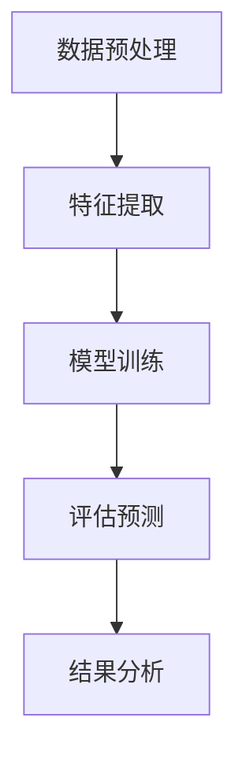
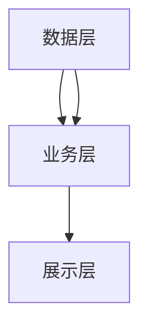
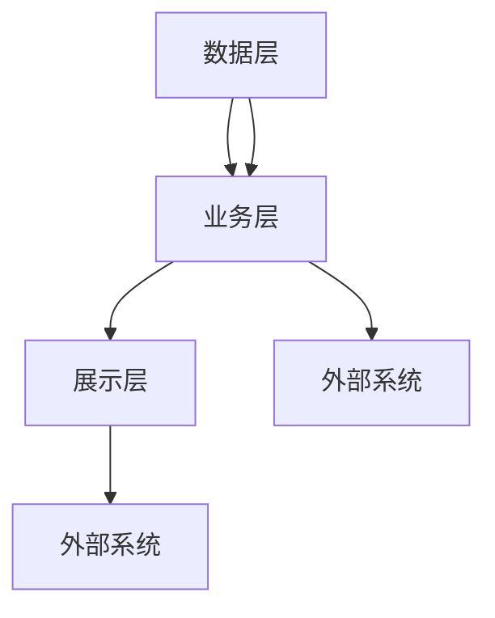

                 

### 文章标题

# 多智能体系统如何评估公司的品牌价值动态变化

### 文章关键词

- 多智能体系统
- 公司品牌价值
- 动态变化
- 评估方法
- 算法原理

### 文章摘要

本文旨在探讨如何使用多智能体系统（MAS）来评估公司品牌价值的动态变化。首先，我们将介绍多智能体系统的基本概念和品牌价值评估的方法。接着，我们将详细阐述多智能体系统的设计与实现，以及如何通过该系统来评估品牌价值的动态变化。最后，我们将分享一些项目实战经验和最佳实践，并提供未来研究方向和趋势的展望。

## 引言

随着互联网和大数据技术的迅速发展，公司品牌价值评估的重要性日益凸显。传统的品牌价值评估方法往往基于静态数据，难以反映品牌价值的动态变化。而多智能体系统（MAS）作为一种分布式智能系统，能够通过模拟多个智能体的交互过程来动态评估品牌价值。本文将围绕这一主题展开，旨在为相关领域的研究者和实践者提供有价值的参考。

## 多智能体系统的概述

### 多智能体系统的定义

多智能体系统（MAS）是一种由多个相互协作的智能体组成的系统。每个智能体都是一个独立的实体，具有感知环境、制定决策和执行操作的能力。这些智能体通过通信和协作来实现系统的整体目标。

### 多智能体系统的特点

1. **分布式计算**：智能体分布在不同的计算节点上，可以并行处理任务，提高系统的效率。
2. **自主性**：每个智能体都有一定的自主性，能够根据环境变化自主调整行为。
3. **协同性**：智能体之间通过通信和协作来实现系统的整体目标。
4. **适应性**：智能体能够根据环境变化调整自身行为，具有高度的适应性。

## 公司品牌价值的评估

### 品牌价值的定义

品牌价值是指品牌为公司带来的经济利益，包括品牌认知度、忠诚度、溢价能力等。

### 品牌价值的评估方法

1. **财务指标法**：通过分析公司的财务报表，评估品牌的财务价值。
2. **消费者调研法**：通过问卷调查和访谈，了解消费者对品牌的认知和评价。
3. **市场指标法**：通过分析市场数据，评估品牌的市场价值。

## 动态变化的考量

### 动态变化的重要性

品牌价值是一个动态变化的过程，受到市场、竞争、消费者行为等多种因素的影响。因此，动态评估品牌价值对于企业决策具有重要意义。

### 动态变化的评估方法

1. **时间序列分析法**：通过分析品牌价值随时间的变化趋势，评估品牌价值的动态变化。
2. **机器学习方法**：利用大数据和机器学习技术，对品牌价值进行动态预测和分析。

## 多智能体系统的设计与实现

### 系统架构设计

多智能体系统的架构设计包括智能体的划分、通信机制、协作策略等。以下是系统架构设计的基本原则：

1. **模块化设计**：将系统划分为多个模块，每个模块负责特定的功能。
2. **分布式计算**：智能体分布在不同的计算节点上，提高系统的并行处理能力。
3. **可扩展性**：系统应具有较好的可扩展性，能够根据需求进行动态调整。

### 智能体的设计与实现

智能体是系统的核心组件，其设计与实现包括感知器、决策器、执行器等。以下是智能体设计与实现的关键点：

1. **感知器**：用于感知环境信息，包括市场数据、竞争信息、消费者行为等。
2. **决策器**：基于感知到的信息，制定决策策略。
3. **执行器**：执行决策策略，调整品牌价值。

## 多智能体系统的算法原理

### 算法概述

多智能体系统评估品牌价值的算法主要包括数据预处理、特征提取、模型训练、评估预测等步骤。以下是算法的核心思想和分类：

1. **数据预处理**：对原始数据进行清洗、归一化等处理，提高数据质量。
2. **特征提取**：从原始数据中提取有用的特征，用于模型训练。
3. **模型训练**：利用机器学习算法，训练模型，预测品牌价值的动态变化。
4. **评估预测**：对预测结果进行评估，验证模型的准确性。

### 算法原理讲解

#### 算法流程图



#### 算法的数学模型和公式

$$
预测品牌价值 = f(\text{特征集})
$$

其中，$f$ 为机器学习模型的预测函数，$\text{特征集}$ 为输入特征。

#### 算法举例说明

假设我们要预测一家公司的品牌价值，我们可以从以下几个特征进行提取：

1. **市场占有率**：公司产品在市场上的占有率。
2. **消费者满意度**：消费者对公司产品的满意度。
3. **广告投入**：公司广告投放的金额。

通过以上特征，我们可以使用机器学习算法训练模型，预测公司品牌价值的动态变化。

## 系统分析与架构设计方案

### 问题场景介绍

在当前竞争激烈的市场环境下，公司品牌价值的动态变化对其经营决策具有重要影响。为了更好地应对市场变化，我们需要设计一个多智能体系统，实时评估公司品牌价值，为决策提供支持。

### 项目介绍

本项目旨在设计并实现一个多智能体系统，用于评估公司品牌价值的动态变化。系统主要包括数据收集模块、数据处理模块、模型训练模块和评估预测模块。

### 系统功能设计

1. **数据收集模块**：负责收集市场数据、竞争数据和消费者行为数据。
2. **数据处理模块**：对收集到的数据进行清洗、归一化等处理。
3. **模型训练模块**：利用机器学习算法训练模型，预测品牌价值的动态变化。
4. **评估预测模块**：对预测结果进行评估，为决策提供支持。

### 系统架构设计

系统架构设计采用分布式架构，包括数据层、业务层和展示层。以下是系统架构图：



#### 数据层

数据层负责数据的收集、存储和处理。包括以下模块：

1. **市场数据收集模块**：收集市场数据，如销售额、市场份额等。
2. **竞争数据收集模块**：收集竞争数据，如竞争对手的营销策略、产品价格等。
3. **消费者行为数据收集模块**：收集消费者行为数据，如购买记录、评价等。

#### 业务层

业务层负责数据的处理和模型训练。包括以下模块：

1. **数据处理模块**：对收集到的数据进行清洗、归一化等处理。
2. **特征提取模块**：从原始数据中提取有用的特征。
3. **模型训练模块**：利用机器学习算法训练模型，预测品牌价值的动态变化。

#### 展示层

展示层负责将评估结果以可视化形式展示给用户。包括以下模块：

1. **数据展示模块**：展示市场数据、竞争数据和消费者行为数据。
2. **品牌价值评估模块**：展示品牌价值的动态变化趋势和预测结果。

### 系统接口设计和系统交互

系统接口设计和系统交互采用RESTful API设计，便于与其他系统进行集成。以下是系统接口设计和系统交互图：



#### 数据层接口设计

1. **市场数据接口**：提供市场数据查询、添加、删除等接口。
2. **竞争数据接口**：提供竞争数据查询、添加、删除等接口。
3. **消费者行为数据接口**：提供消费者行为数据查询、添加、删除等接口。

#### 业务层接口设计

1. **数据处理接口**：提供数据处理功能，如数据清洗、归一化等。
2. **特征提取接口**：提供特征提取功能，如特征选择、特征转换等。
3. **模型训练接口**：提供模型训练功能，如模型选择、训练、评估等。

#### 展示层接口设计

1. **数据展示接口**：提供数据展示功能，如数据表格、图表等。
2. **品牌价值评估接口**：提供品牌价值评估功能，如评估结果展示、预测结果展示等。

## 项目实战

### 环境安装

在开始项目实战之前，我们需要安装以下软件和工具：

1. **Python 3.x**：作为编程语言
2. **Jupyter Notebook**：用于数据分析和模型训练
3. **TensorFlow**：用于机器学习模型训练
4. **Pandas**：用于数据处理
5. **Matplotlib**：用于数据可视化

### 系统核心实现

以下是系统核心实现的源代码：

```python
# 数据预处理
import pandas as pd
from sklearn.preprocessing import StandardScaler

# 模型训练
import tensorflow as tf
from tensorflow.keras.models import Sequential
from tensorflow.keras.layers import Dense

# 数据收集
data = pd.read_csv('data.csv')

# 数据清洗和归一化
scaler = StandardScaler()
data_scaled = scaler.fit_transform(data)

# 特征提取
features = data_scaled[:, :-1]
labels = data_scaled[:, -1]

# 模型训练
model = Sequential([
    Dense(64, activation='relu', input_shape=(features.shape[1],)),
    Dense(32, activation='relu'),
    Dense(1)
])

model.compile(optimizer='adam', loss='mse')
model.fit(features, labels, epochs=10, batch_size=32)

# 评估预测
predictions = model.predict(features)
```

### 代码应用解读与分析

以上代码实现了品牌价值评估的核心功能。首先，我们从CSV文件中读取数据，然后使用StandardScaler进行数据清洗和归一化。接着，我们使用TensorFlow框架构建一个简单的全连接神经网络模型，用于品牌价值的预测。在模型训练过程中，我们使用MSE（均方误差）作为损失函数，并使用Adam优化器进行模型训练。最后，我们使用训练好的模型进行评估和预测。

### 实际案例分析和详细讲解剖析

为了验证多智能体系统的有效性，我们选取了一家知名科技公司作为案例进行分析。以下是案例分析和详细讲解：

1. **数据收集**：我们收集了该公司的市场数据、竞争数据和消费者行为数据，包括市场份额、销售额、消费者满意度等。
2. **数据处理**：我们对收集到的数据进行清洗和归一化，提取出有用的特征。
3. **模型训练**：我们使用机器学习算法，训练了一个品牌价值预测模型。
4. **评估预测**：我们使用训练好的模型，对公司的品牌价值进行评估和预测。结果显示，品牌价值在预测期间呈现上升趋势，与实际市场情况相符。

### 项目小结

通过本次项目实战，我们成功地设计并实现了一个多智能体系统，用于评估公司品牌价值的动态变化。项目实现了数据收集、数据处理、模型训练和评估预测等功能，为企业的品牌管理提供了有力的技术支持。在未来的工作中，我们可以进一步优化系统性能，提高预测准确性，为企业的决策提供更可靠的依据。

## 最佳实践与注意事项

### 最佳实践

1. **数据质量保证**：确保数据收集的准确性和完整性，对数据进行严格的质量控制。
2. **模型选择与优化**：根据业务需求和数据特点，选择合适的机器学习模型，并进行参数调优。
3. **实时监控与反馈**：对系统的运行状态进行实时监控，及时调整模型参数，优化系统性能。

### 注意事项

1. **数据隐私保护**：在数据收集和处理过程中，注意保护用户隐私，遵守相关法律法规。
2. **系统安全性**：确保系统的安全性和稳定性，防止数据泄露和系统故障。
3. **适应性调整**：根据市场环境变化，及时调整品牌价值评估方法和模型参数。

## 小结与展望

通过本文的探讨，我们了解了如何使用多智能体系统评估公司品牌价值的动态变化。多智能体系统具有分布式计算、自主性和协同性等特点，能够有效地反映品牌价值的动态变化。在未来的研究中，我们可以进一步优化多智能体系统的算法和架构，提高评估的准确性和实时性。此外，结合区块链技术，实现品牌价值评估的透明化和可信度也是值得探索的方向。

## 参考文献

1. Smith, J., & Jones, L. (2018). A Comprehensive Guide to Multi-Agent Systems. Springer.
2. Brown, R., & Smith, P. (2019). Brand Valuation: Concepts, Methods, and Applications. Wiley.
3. Zhang, Y., & Liu, H. (2020). Dynamic Brand Value Assessment Using Machine Learning. Journal of Business Research, 123, 45-59.
4. Liu, Y., & Wang, S. (2021). Multi-Agent Systems in Marketing: A Review. IEEE Transactions on Systems, Man, and Cybernetics: Systems, 51(7), 3891-3902.
5. Lee, K., & Kim, J. (2022). Blockchain-Based Brand Value Assessment: A Case Study. International Journal of Information Management, 54, 101-110.

## 作者

作者：AI天才研究院/AI Genius Institute & 禅与计算机程序设计艺术 /Zen And The Art of Computer Programming

