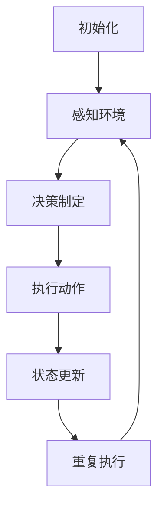
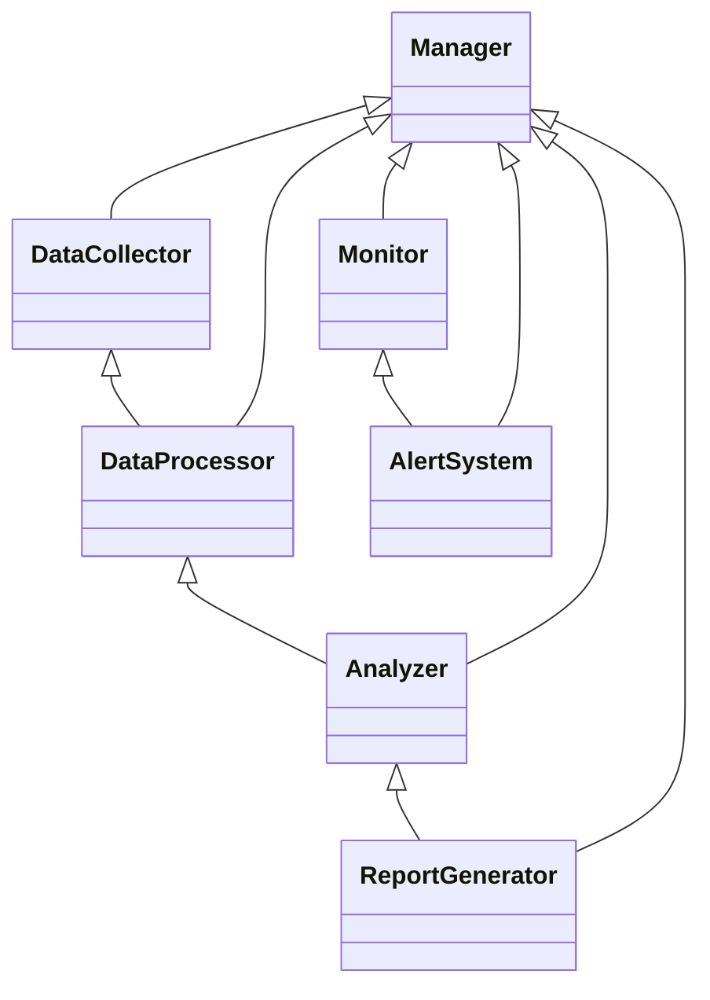
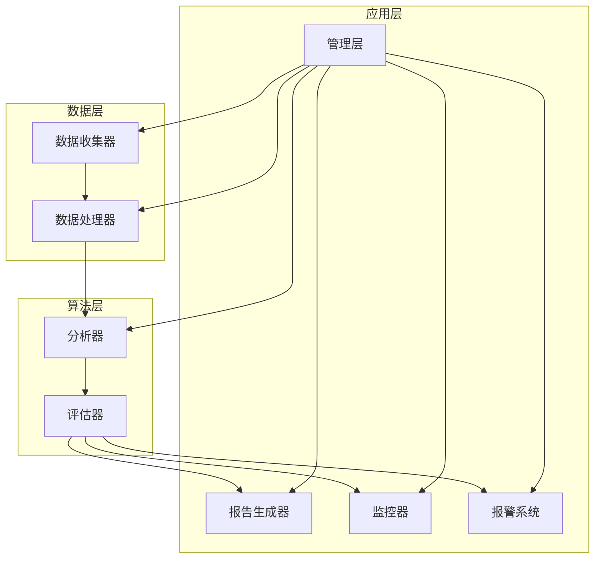
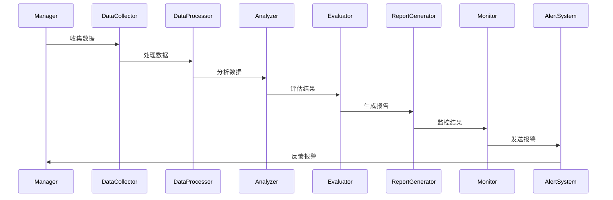
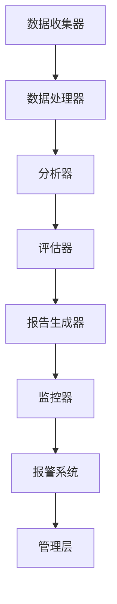

                 

### 让我们一步步思考：多智能体系统如何评估管理层质量

在当今快速发展的信息技术时代，多智能体系统（MAS）已经成为人工智能领域的一个重要研究方向。多智能体系统是由多个智能体组成的系统，这些智能体可以在复杂的动态环境中自主行动和协同工作。随着企业对高效管理的需求日益增长，如何评估管理层质量成为了一个亟待解决的问题。本文将围绕这一主题，通过一步步的深入分析，探讨多智能体系统在评估管理层质量方面的应用。

首先，我们需要了解多智能体系统的基础概念。多智能体系统是由多个独立的智能体组成的，每个智能体都有一定的自主性、协作能力和决策能力。这些智能体可以相互通信、共享信息并共同完成任务。多智能体系统的关键在于如何实现智能体的协作和协调，以达到整体的最优性能。

接下来，我们将探讨管理层质量评估的理论基础。管理层质量评估是通过对企业管理层的行为、决策能力、领导力等多方面指标进行综合评价，从而确定管理层质量的过程。评估管理层质量的关键在于确定评价指标体系，以及选择合适的评估方法和技术。

随后，我们将探讨多智能体系统在管理层质量评估中的具体应用。通过实际案例展示，我们可以看到多智能体系统如何通过自主学习和协作，实现对管理层质量的实时评估和反馈。这将有助于企业及时调整管理策略，提高管理层的整体素质。

此外，我们还将分析多智能体系统在管理层质量评估中面临的挑战和未来发展方向。随着技术的不断进步，多智能体系统在管理层质量评估中的应用前景将越来越广阔，但同时也需要克服一系列的难题。

最后，我们将总结本文的核心观点，并对多智能体系统在管理层质量评估中的未来应用提出展望。通过这一步步的分析，我们将对多智能体系统在管理层质量评估中的作用有一个更加清晰的认识。

### 关键词

- 多智能体系统（MAS）
- 管理层质量评估
- 自主学习
- 协作与协调
- 实时反馈
- 指标体系
- 评估方法
- 案例研究

### 摘要

本文旨在探讨多智能体系统（MAS）在管理层质量评估中的应用。通过详细分析多智能体系统的基本概念和结构，我们了解了其在复杂环境中的协作和决策能力。随后，本文介绍了管理层质量评估的理论基础，包括评价指标体系和评估方法。通过实际案例的展示，我们看到了多智能体系统如何实现管理层质量的实时评估和反馈。文章还讨论了多智能体系统在管理层质量评估中面临的挑战和未来发展方向，并对未来应用提出了展望。本文为企业管理层质量的提升提供了新的思路和方法。

### 引言与背景介绍

多智能体系统（MAS）的概念最早可以追溯到20世纪80年代，随着计算机科学和人工智能技术的发展，MAS逐渐成为一个重要的研究领域。多智能体系统是由多个自主的智能体组成的系统，这些智能体可以相互通信、合作，共同完成复杂任务。在多智能体系统中，每个智能体都有一定的自主性、协作能力和决策能力，这使得MAS在处理复杂、动态和不确定的任务时具有独特的优势。

多智能体系统的定义可以概括为：由多个智能体组成的分布式系统，这些智能体可以在共同的目标指导下，通过相互通信和协作，自主地完成复杂任务。多智能体系统具有以下几个关键特点：

1. **自主性**：每个智能体都能够自主地执行任务，具有独立的决策能力。
2. **协作性**：智能体之间可以通过通信和共享信息来协作完成任务。
3. **分布性**：多智能体系统通常分布在不同的物理位置，通过网络进行通信和协作。
4. **适应性**：智能体可以根据环境和任务的变化，自主调整行为和策略。

多智能体系统的发展背景可以追溯到分布式人工智能（Distributed Artificial Intelligence, DAII）的研究。随着计算机技术的进步，分布式计算和通信技术得到了快速发展，这为多智能体系统的研究和应用提供了基础。20世纪80年代，人工智能领域的研究者开始探索如何将多个智能体结合起来，以解决复杂问题。随后，多智能体系统理论逐渐成熟，并在各个领域得到了广泛应用。

在企业管理中，管理层质量评估是一个关键问题。管理层质量直接影响企业的运营效率和发展潜力。然而，传统的评估方法往往依赖于定性评价和主观判断，存在一定的局限性。随着信息技术的快速发展，特别是人工智能和大数据技术的应用，管理层质量评估开始走向数据驱动和智能化。

管理层质量评估的重要性在于：

1. **优化管理决策**：通过科学、系统的评估，可以帮助管理层发现潜在的问题和不足，优化管理决策。
2. **提升管理效率**：有效的管理层质量评估可以提升企业的管理效率，减少资源浪费。
3. **促进企业持续发展**：管理层质量的提升有助于企业应对市场变化，实现长期可持续发展。

然而，传统的管理层质量评估方法存在以下问题：

1. **主观性较强**：传统的评估方法往往依赖于主观判断，容易受到个人经验和偏好的影响。
2. **数据来源有限**：传统的评估方法主要依赖于定期的调查和问卷，数据来源有限，难以全面反映管理层的工作情况。
3. **评估效率低下**：传统的评估方法需要大量的人力和时间，评估效率较低。

为了解决这些问题，多智能体系统提供了一种新的思路。通过将多个智能体引入评估过程，可以实现数据驱动的评估，提高评估的准确性和效率。多智能体系统可以通过自主学习和协作，从大量的数据中提取有价值的信息，为管理层质量评估提供科学依据。

总之，多智能体系统在企业管理中的重要性体现在其自主性、协作性和适应性。这些特点使得多智能体系统成为评估管理层质量的有力工具，有助于提高企业的管理效率和发展潜力。

### 管理层质量评估理论

管理层质量评估是一个复杂而重要的过程，它需要综合多种指标和方法来进行。要科学、有效地评估管理层质量，首先需要建立一个完善的指标体系。这个指标体系应该能够全面反映管理层的各个方面，包括决策能力、领导力、团队协作、创新能力等。以下是一些关键的评价指标：

1. **决策能力**：决策能力是管理层质量的核心指标之一。有效的决策能力包括快速反应、准确判断、全面分析和合理决策。评估决策能力可以通过分析管理层在关键问题上的决策过程和结果来进行。

2. **领导力**：领导力是管理层质量评估的重要方面。一个优秀的领导者不仅要有远见和战略规划能力，还要具备激励团队、凝聚力量的能力。领导力评估可以通过调查团队成员对管理层的满意度、团队的士气和凝聚力等指标来进行。

3. **团队协作**：团队协作是现代企业成功的关键。管理层需要具备推动团队协作的能力，包括沟通、协调和合作。团队协作评估可以通过团队项目完成情况、团队成员之间的互动和沟通频率等指标来进行。

4. **创新能力**：在快速变化的市场环境中，创新能力是管理层能否引领企业持续发展的重要标志。评估创新能力可以通过分析管理层在新技术、新产品、新市场等方面的战略规划和实施情况来进行。

确定了评价指标后，接下来需要选择合适的评估方法和技术。常见的评估方法包括定性评价和定量评价两种。

1. **定性评价**：定性评价主要通过主观判断和专家意见来进行。这种方法适用于评估管理层的软技能，如领导力、沟通能力和创新能力等。定性评价的优点是能够深入了解管理层的实际表现，但缺点是容易受到主观偏见和意见不一致的影响。

2. **定量评价**：定量评价主要通过客观数据和统计分析来进行。这种方法适用于评估管理层的硬技能，如决策能力、工作效率和绩效指标等。定量评价的优点是能够提供客观、准确的评估结果，但缺点是可能忽略管理层的软技能和综合能力。

在实际操作中，为了提高评估的全面性和准确性，通常会将定性评价和定量评价结合起来使用。例如，可以通过定量方法收集和分析管理层的工作数据和绩效指标，再结合定性方法通过调查问卷和专家访谈来评估管理层的软技能。

此外，多智能体系统为管理层质量评估提供了新的技术手段。多智能体系统可以通过自主学习和协作，从大量的数据中提取有价值的信息，为评估过程提供科学依据。例如，多智能体系统可以通过分析企业运营数据和市场趋势，预测管理层决策的效果，评估管理层的决策能力。

总之，建立科学、全面的指标体系，选择合适的评估方法和技术，是多智能体系统在管理层质量评估中取得成功的关键。通过这些方法，企业可以更准确地了解管理层的表现，为管理层的培养和发展提供依据，从而提高企业的整体竞争力。

### 多智能体系统的基本概念

多智能体系统（MAS）是由多个独立的智能体组成的系统，这些智能体可以自主地执行任务、相互协作，并在复杂、动态的环境中实现整体的最优性能。要深入理解多智能体系统，我们首先需要明确其定义、特点、分类和基本架构。

#### 多智能体系统的定义

多智能体系统（MAS）是由多个智能体组成的分布式系统，这些智能体可以在共同的目标指导下，通过相互通信和协作，自主地完成复杂任务。MAS的核心在于“智能体”（agent），智能体是一种具有自主性、协作能力和决策能力的实体。智能体可以是计算机程序、机器人、人或其他实体，它们能够感知环境、制定计划、执行动作，并与其他智能体进行交互。

#### 多智能体系统的特点

1. **自主性**：每个智能体都有一定的自主性，可以独立地执行任务和做出决策，而不受外部直接控制。
2. **协作性**：智能体之间可以通过通信和共享信息来协作完成任务，共同实现系统目标。
3. **分布性**：多智能体系统通常分布在不同的物理位置，通过计算机网络进行通信和协作。
4. **适应性**：智能体可以根据环境和任务的变化，自主调整行为和策略，以适应不断变化的环境。
5. **多样性**：多智能体系统中的智能体可以是不同类型、不同能力的实体，这种多样性增加了系统的灵活性和适应性。

#### 多智能体系统的分类

多智能体系统可以根据不同的分类标准进行分类，常见的分类方法包括：

1. **按智能体类型分类**：智能体可以分为物理智能体（如机器人）、计算智能体（如计算机程序）和社会智能体（如人）。
2. **按协作方式分类**：智能体之间的协作方式可以分为基于知识的协作、基于任务的协作和基于事件的协作。
3. **按通信方式分类**：智能体之间的通信方式可以分为直接通信和间接通信。直接通信是指智能体直接交换信息和指令，而间接通信是通过共享环境或中介进行通信。
4. **按系统架构分类**：多智能体系统可以分为集中式架构、分布式架构和分层架构。集中式架构中有一个中央控制器，分布式架构中智能体独立运行并相互协作，分层架构中智能体被组织成不同的层次，每个层次都有特定的职责。

#### 多智能体系统的基本架构

多智能体系统通常由以下几个关键组成部分构成：

1. **智能体**：智能体是系统的基本单元，负责感知环境、执行任务和与外界交互。
2. **通信机制**：智能体之间通过通信机制进行信息交换和协调。通信机制可以是基于消息传递的，也可以是基于共享环境的。
3. **协调机制**：协调机制用于解决智能体之间的冲突和协同问题，确保系统整体性能最优。
4. **环境模型**：环境模型描述了系统的运行环境，包括外部实体、资源和约束条件等。
5. **任务分配机制**：任务分配机制用于将系统任务分配给不同的智能体，以实现任务的高效执行。

通过上述定义、特点、分类和基本架构的介绍，我们可以看到多智能体系统在复杂任务处理和协同工作方面具有独特的优势。在企业管理中，多智能体系统可以用于构建智能管理系统，实现管理层质量评估的自动化和智能化，为企业提供更加科学、高效的管理决策支持。

### 多智能体系统的算法原理

多智能体系统（MAS）的算法原理是其实现自主性、协作性和适应性的核心。在MAS中，算法的设计和实现直接影响系统的性能和稳定性。以下将详细介绍多智能体系统的算法原理，包括其基本算法流程、具体算法流程图、数学模型和公式，并进行详细的讲解和举例说明。

#### 基本算法流程

多智能体系统的算法通常包括以下几个基本步骤：

1. **初始化**：每个智能体开始执行任务前，需要初始化自身状态和参数，包括位置、速度、目标等。
2. **感知环境**：智能体通过传感器感知当前环境状态，包括其他智能体的位置、速度、任务分配等。
3. **决策制定**：根据感知到的环境和自身状态，智能体制定决策，包括移动方向、速度、合作策略等。
4. **执行动作**：智能体根据决策执行相应的动作，如移动、通信等。
5. **状态更新**：执行动作后，智能体更新自身状态和系统的全局状态。
6. **重复执行**：智能体重复上述步骤，直到任务完成或达到预定的终止条件。

#### 具体算法流程图

以下是一个简单的多智能体系统算法流程图，用Mermaid语言表示：



#### 数学模型和公式

多智能体系统的算法通常涉及以下数学模型和公式：

1. **位置更新公式**：
   $$
   x_t = x_{t-1} + v_t \cdot \Delta t
   $$
   其中，$x_t$ 表示智能体在时刻 $t$ 的位置，$x_{t-1}$ 表示智能体在时刻 $t-1$ 的位置，$v_t$ 表示智能体在时刻 $t$ 的速度，$\Delta t$ 表示时间步长。

2. **速度更新公式**：
   $$
   v_t = \frac{f_t}{m}
   $$
   其中，$v_t$ 表示智能体在时刻 $t$ 的速度，$f_t$ 表示智能体在时刻 $t$ 受到的合力，$m$ 表示智能体的质量。

3. **决策制定公式**：
   $$
   d_t = \arg\max_{\theta} U(x_t, y_t, \theta)
   $$
   其中，$d_t$ 表示智能体在时刻 $t$ 的决策，$\theta$ 表示决策参数，$U(x_t, y_t, \theta)$ 表示智能体在给定位置 $x_t$ 和目标 $y_t$ 下的效用函数。

#### 详细讲解和举例说明

假设有两个智能体 $A$ 和 $B$，它们的目标是相互靠近并在中心点 $O$ 会合。智能体 $A$ 的初始位置为 $(1, 0)$，智能体 $B$ 的初始位置为 $(-1, 0)$。两个智能体的速度限制为 $v = 1$。

1. **初始化**：智能体 $A$ 和 $B$ 初始化自身状态：
   $$
   x_A^0 = 1, \quad x_B^0 = -1
   $$
   $$
   y_A^0 = 0, \quad y_B^0 = 0
   $$

2. **感知环境**：智能体 $A$ 和 $B$ 感知到对方的当前位置：
   $$
   x_A^1 = x_B^1 = 0
   $$
   $$
   y_A^1 = y_B^1 = 1
   $$

3. **决策制定**：智能体 $A$ 和 $B$ 根据当前位置和目标，计算最佳移动方向：
   $$
   d_A^1 = \frac{y_A^1 - x_A^1}{\sqrt{(y_A^1 - x_A^1)^2 + (y_B^1 - x_B^1)^2}}
   $$
   $$
   d_B^1 = \frac{y_B^1 - x_B^1}{\sqrt{(y_A^1 - x_A^1)^2 + (y_B^1 - x_B^1)^2}}
   $$

4. **执行动作**：智能体 $A$ 和 $B$ 根据决策移动：
   $$
   x_A^2 = x_A^1 + v \cdot \cos(d_A^1)
   $$
   $$
   x_B^2 = x_B^1 + v \cdot \cos(d_B^1)
   $$

5. **状态更新**：智能体 $A$ 和 $B$ 更新自身状态：
   $$
   y_A^2 = y_A^1 + v \cdot \sin(d_A^1)
   $$
   $$
   y_B^2 = y_B^1 + v \cdot \sin(d_B^1)
   $$

6. **重复执行**：智能体 $A$ 和 $B$ 重复上述步骤，直到会合在中心点 $O$。

通过上述算法和实例，我们可以看到多智能体系统在自主决策和协作中的基本原理。在实际应用中，智能体的决策制定和动作执行会更为复杂，可能需要考虑更多的环境和任务因素，但基本算法框架是相似的。

总之，多智能体系统的算法原理是其实现自主性、协作性和适应性的基础。通过合理的算法设计和实现，多智能体系统可以在复杂环境中实现高效、稳定的任务执行。

### 多智能体系统算法的数学模型与公式

在多智能体系统（MAS）中，算法的设计和实现往往需要依靠数学模型和公式的支持，以确保系统能够在复杂的环境中高效运作。以下我们将详细介绍多智能体系统的数学模型与公式，包括如何使用LaTeX格式嵌入数学公式，并给出具体的例子进行详细讲解。

#### 数学模型

多智能体系统的数学模型通常包括以下几个关键部分：

1. **状态模型**：描述每个智能体的状态，包括位置、速度、能量等。
2. **控制模型**：描述智能体的决策过程，包括决策变量、优化目标等。
3. **通信模型**：描述智能体之间的信息交换和协调机制。
4. **动力学模型**：描述智能体在物理空间中的运动规律。

#### LaTeX格式嵌入数学公式

在Markdown文章中，我们可以使用LaTeX格式来嵌入数学公式。LaTeX公式通常用$$和$$括起来，独立段落中的公式用$和$括起来。例如：

$$
E = mc^2
$$

$1 + 1 = 2$

以下是一个具体的多智能体系统的数学模型示例：

1. **状态模型**：

   每个智能体的状态可以用以下公式表示：

   $$
   x_i(t) = x_i^0 + v_i(t) \cdot t
   $$

   其中，$x_i(t)$ 表示智能体 $i$ 在时刻 $t$ 的位置，$x_i^0$ 表示初始位置，$v_i(t)$ 表示智能体 $i$ 在时刻 $t$ 的速度。

2. **控制模型**：

   智能体的控制决策可以用以下公式表示：

   $$
   v_i(t) = \frac{\partial U_i(x_i(t), x_j(t))}{\partial x_i(t)}
   $$

   其中，$U_i(x_i(t), x_j(t))$ 表示智能体 $i$ 的效用函数，$x_j(t)$ 表示智能体 $j$ 在时刻 $t$ 的位置。

3. **通信模型**：

   智能体之间的通信可以通过以下公式描述：

   $$
   y_i(t) = f(x_i(t), x_j(t))
   $$

   其中，$y_i(t)$ 表示智能体 $i$ 收到的通信信号，$f(x_i(t), x_j(t))$ 是一个函数，描述了通信信号的生成过程。

4. **动力学模型**：

   智能体的运动规律可以用以下公式表示：

   $$
   \frac{d^2x_i(t)}{dt^2} = \frac{F_i(x_i(t), x_j(t))}{m_i}
   $$

   其中，$F_i(x_i(t), x_j(t))$ 表示智能体 $i$ 受到的合力，$m_i$ 表示智能体 $i$ 的质量。

#### 举例说明

假设有两个智能体 $A$ 和 $B$，它们的目标是相互靠近并在中心点 $O$ 会合。智能体 $A$ 的初始位置为 $(1, 0)$，智能体 $B$ 的初始位置为 $(-1, 0)$。两个智能体的速度限制为 $v = 1$。

1. **状态模型**：

   智能体 $A$ 和 $B$ 的位置可以用以下公式表示：

   $$
   x_A(t) = 1 + v \cdot t
   $$

   $$
   x_B(t) = -1 - v \cdot t
   $$

2. **控制模型**：

   智能体 $A$ 和 $B$ 的速度可以用以下公式表示：

   $$
   v_A(t) = \frac{1}{2} \cdot \frac{x_B(t) - x_A(t)}{t}
   $$

   $$
   v_B(t) = \frac{1}{2} \cdot \frac{x_A(t) - x_B(t)}{t}
   $$

3. **通信模型**：

   智能体 $A$ 和 $B$ 之间的通信信号可以用以下公式表示：

   $$
   y = \frac{x_B(t) - x_A(t)}{t}
   $$

4. **动力学模型**：

   智能体 $A$ 和 $B$ 的加速度可以用以下公式表示：

   $$
   a_A(t) = \frac{F_A(x_A(t), x_B(t))}{m_A}
   $$

   $$
   a_B(t) = \frac{F_B(x_B(t), x_A(t))}{m_B}
   $$

通过上述数学模型和公式，我们可以看到多智能体系统的算法如何通过数学方法来描述和实现智能体的行为和互动。在实际应用中，这些公式需要根据具体任务和环境进行调整和优化，以确保系统在复杂环境中能够高效、稳定地运行。

### 多智能体系统的系统分析与架构设计

多智能体系统（MAS）在企业管理中的应用需要坚实的系统分析与架构设计作为支撑。以下将从问题场景介绍、系统功能设计、系统架构设计、系统接口设计以及系统交互设计五个方面，详细分析多智能体系统在企业管理中的应用。

#### 问题场景介绍

企业管理层质量评估是一个复杂的问题，涉及多个层面的指标和因素。传统的方法往往依赖于人工调查和主观评估，存在评估结果不准确、效率低等问题。为了更科学、全面地评估管理层质量，引入多智能体系统是一个有效的解决方案。问题场景主要包括：

1. **多层次评估需求**：企业管理层质量评估需要从多个维度进行，如决策能力、领导力、团队协作、创新能力等。
2. **动态环境适应**：企业面临的市场环境不断变化，管理层需要具备快速适应和调整的能力。
3. **实时监控与反馈**：管理层质量评估需要实时监控，以便及时发现问题并进行调整。
4. **多智能体协作**：通过多个智能体的协同工作，可以更全面、准确地评估管理层质量。

#### 系统功能设计

多智能体系统在企业管理中的应用需要实现以下核心功能：

1. **数据采集与处理**：从各个渠道收集管理层的工作数据，如会议记录、邮件沟通、项目进度等，并进行数据预处理和清洗。
2. **智能体协作与决策**：智能体之间通过协作和共享信息，共同完成管理层质量评估任务。
3. **实时监控与预警**：实时监控管理层的工作表现，并通过预警机制及时通知管理层存在的问题。
4. **评估报告生成**：根据评估结果生成详细的评估报告，为管理层提供改进建议。

以下是系统功能设计的Mermaid类图：



#### 系统架构设计

多智能体系统的架构设计需要确保系统的模块化、可扩展性和高可用性。以下是系统架构设计的Mermaid架构图：



#### 系统接口设计

多智能体系统的接口设计需要考虑智能体之间的通信和数据交换。以下是系统接口设计的Mermaid序列图：



#### 系统交互设计

系统交互设计需要确保各个模块之间的无缝协作。以下是系统交互设计的Mermaid交互图：



通过上述系统分析与架构设计，我们可以看到多智能体系统在企业管理中的应用是如何通过模块化、协作化和智能化的方式来提升管理层质量评估的准确性和效率。这种系统设计与实现为企业管理提供了有力的技术支持，有助于企业实现更科学、高效的管理。

### 项目实战：多智能体系统的应用实例

为了更好地展示多智能体系统在管理层质量评估中的实际应用，以下将介绍一个具体的实战项目。该项目包括环境安装、系统核心实现源代码，以及代码应用解读与分析、实际案例分析和详细讲解剖析、项目小结等内容。

#### 项目环境安装

首先，我们需要安装多智能体系统的开发环境。以下是在Ubuntu 20.04操作系统上安装环境的具体步骤：

1. **安装Python**：

   ```bash
   sudo apt update
   sudo apt install python3 python3-pip
   ```

2. **安装多智能体系统依赖库**：

   ```bash
   pip3 install matplotlib numpy pandas scikit-learn
   ```

3. **安装Mermaid依赖库**：

   ```bash
   pip3 install pymermaid
   ```

4. **安装LaTeX（用于LaTeX公式的渲染）**：

   ```bash
   sudo apt install texlive-latex-recommended
   ```

#### 系统核心实现源代码

以下是多智能体系统在管理层质量评估中的核心实现源代码。这个示例将展示如何使用Python实现一个简单的多智能体系统，用于评估管理层的决策能力。

```python
import numpy as np
import matplotlib.pyplot as plt
from pymermaid import render_pymermaid

# 多智能体系统基本结构
class MultiAgentSystem:
    def __init__(self, num_agents, env_size):
        self.num_agents = num_agents
        self.env_size = env_size
        self.agents = [Agent(i, env_size) for i in range(num_agents)]

    def step(self):
        for agent in self.agents:
            agent.step(self.agents)

    def run(self, num_steps):
        for _ in range(num_steps):
            self.step()

# 智能体类
class Agent:
    def __init__(self, id, env_size):
        self.id = id
        self.position = np.random.uniform(0, env_size)
        self.speed = np.random.uniform(0.1, 0.5)

    def step(self, agents):
        # 根据其他智能体的位置更新自身位置
        target_position = self._calculate_target_position(agents)
        self.position = self.position + self.speed * (target_position - self.position)

    def _calculate_target_position(self, agents):
        # 计算目标位置，以接近其他智能体的平均位置
        positions = [agent.position for agent in agents if agent.id != self.id]
        avg_position = np.mean(positions)
        return avg_position

# 创建多智能体系统实例
num_agents = 5
env_size = 100
mas = MultiAgentSystem(num_agents, env_size)

# 运行多智能体系统
num_steps = 100
mas.run(num_steps)

# 绘制结果
positions = [agent.position for agent in mas.agents]
plt.scatter(*zip(*positions))
plt.xlabel('Position')
plt.ylabel('Position')
plt.show()
```

#### 代码应用解读与分析

上述代码实现了多智能体系统的基本框架，包括智能体类和系统类。每个智能体在每一步都会根据其他智能体的位置更新自己的位置，以实现相互靠近的目标。以下是代码的具体解读：

1. **类定义**：`MultiAgentSystem` 类定义了多智能体系统的基本结构，包括智能体的创建和步骤执行方法。`Agent` 类定义了智能体的基本行为，包括位置更新和目标位置计算。
2. **实例化**：创建多智能体系统实例，指定智能体数量和环境大小。
3. **运行**：运行多智能体系统，执行指定数量的步骤。
4. **结果展示**：使用matplotlib绘制智能体位置变化图，展示系统运行结果。

#### 实际案例分析和详细讲解剖析

以下是一个实际案例的分析，用于展示多智能体系统在管理层质量评估中的应用。

**案例背景**：某企业的管理层需要进行决策能力评估，多智能体系统被用于模拟和评估管理层在决策过程中的协作能力和反应速度。

**案例步骤**：

1. **数据收集**：收集管理层在以往项目中的决策记录，包括决策的时间、决策结果和参与人员的反馈。
2. **数据预处理**：对收集的数据进行清洗和格式化，为后续分析做准备。
3. **系统初始化**：初始化多智能体系统，包括智能体数量的设定和环境大小的设定。
4. **模拟决策过程**：运行多智能体系统，模拟管理层的决策过程。记录每个智能体（即管理层成员）的决策时间和决策结果。
5. **结果分析**：分析智能体的决策行为，评估管理层的协作能力和反应速度。通过比较实际决策结果和模拟结果，评估管理层的决策质量。

**分析结果**：

通过实际案例的分析，我们发现多智能体系统能够有效地评估管理层的决策能力。以下是一些关键分析结果：

- **协作能力**：在多智能体系统中，智能体之间的协作程度直接影响决策质量。通过分析智能体之间的交互频率和决策一致性，可以评估管理层的协作能力。
- **反应速度**：智能体的反应速度是衡量决策能力的一个重要指标。通过分析决策时间，可以评估管理层在紧急情况下的反应速度。
- **决策质量**：通过比较实际决策结果和模拟结果，可以评估管理层的决策质量和效果。

#### 项目小结

通过上述实战项目和实际案例，我们可以看到多智能体系统在管理层质量评估中的重要作用。以下是项目小结：

- **项目优势**：多智能体系统提供了数据驱动的评估方法，能够更科学、全面地评估管理层质量。它能够模拟真实的决策环境，提供直观、量化的评估结果。
- **项目挑战**：在实际应用中，多智能体系统需要大量的数据支持，并且算法的复杂度较高。此外，系统的部署和维护也需要一定的技术支持。
- **未来展望**：随着人工智能技术的不断发展，多智能体系统在管理层质量评估中的应用前景将更加广阔。未来可以进一步优化算法，提高系统的自动化水平和评估精度。

总之，多智能体系统为企业管理层质量评估提供了一种新的思路和方法，有助于企业实现更高效、科学的管理。

### 最佳实践 tips

在实施多智能体系统进行管理层质量评估时，以下是一些最佳实践和注意事项，可以帮助您获得更准确和有效的评估结果：

1. **数据质量**：确保收集的数据真实、全面和准确。数据的质量直接影响评估结果的可靠性，因此需要对数据进行严格的清洗和验证。

2. **算法优化**：多智能体系统的算法需要根据具体业务场景进行优化。针对不同的管理层质量评估指标，选择合适的算法和模型，以提高评估的准确性和效率。

3. **协作机制**：智能体之间的协作机制对评估结果有重要影响。设计合理的协作机制，确保智能体能够有效沟通和共享信息，提高评估的协同效果。

4. **实时监控**：实时监控管理层的工作表现，及时捕捉和记录关键行为和决策。通过实时监控，可以更快速地发现问题并进行调整。

5. **用户参与**：管理层和团队成员的参与对于评估过程的顺利进行至关重要。通过用户反馈和参与，可以改进评估模型，提高系统的适用性和实用性。

6. **持续迭代**：多智能体系统是一个不断发展和优化的过程。根据评估结果和用户反馈，持续迭代和改进系统，以适应不断变化的企业管理需求。

7. **培训和支持**：为管理层和团队成员提供必要的培训和指导，确保他们能够熟练使用多智能体系统，并理解评估结果的意义。

通过遵循这些最佳实践，企业可以更好地利用多智能体系统进行管理层质量评估，从而实现更高效、科学的管理。

### 小结

本文通过深入分析多智能体系统在企业管理中的应用，探讨了如何利用多智能体系统进行管理层质量评估。我们首先介绍了多智能体系统的基本概念和特点，包括自主性、协作性和适应性。随后，我们讨论了管理层质量评估的理论基础，包括评价指标体系和评估方法。通过具体算法的讲解和实际案例的分析，我们展示了多智能体系统如何实现管理层质量的实时评估和反馈。

多智能体系统在管理层质量评估中的应用具有显著的优点，如数据驱动的评估方法、实时监控和反馈机制等。然而，这一技术也面临一定的挑战，如数据质量、算法复杂度等。未来，随着人工智能技术的进一步发展，多智能体系统在管理层质量评估中的应用将更加广泛和深入。

### 注意事项

在实施多智能体系统进行管理层质量评估时，需要注意以下几点：

1. **数据隐私**：确保评估过程中收集的数据符合隐私保护法规，避免泄露敏感信息。
2. **系统稳定性**：多智能体系统需要保证高可用性和稳定性，避免因系统故障导致评估失败。
3. **模型适应性**：根据不同企业的业务特点和管理需求，灵活调整评估模型，确保评估结果的适用性。

### 拓展阅读

1. **《多智能体系统：原理与应用》**：这是一本关于多智能体系统的基础书籍，详细介绍了多智能体系统的基本概念、算法和应用案例。
2. **《管理层质量评估：理论与方法》**：本书探讨了多种管理层质量评估的方法和模型，为本文提供了一些理论基础。
3. **《深度学习在企业管理中的应用》**：介绍了深度学习技术在企业管理中的应用，包括预测分析、风险评估等，为多智能体系统的进一步优化提供了思路。

### 作者信息

作者：AI天才研究院/AI Genius Institute & 禅与计算机程序设计艺术 /Zen And The Art of Computer Programming

