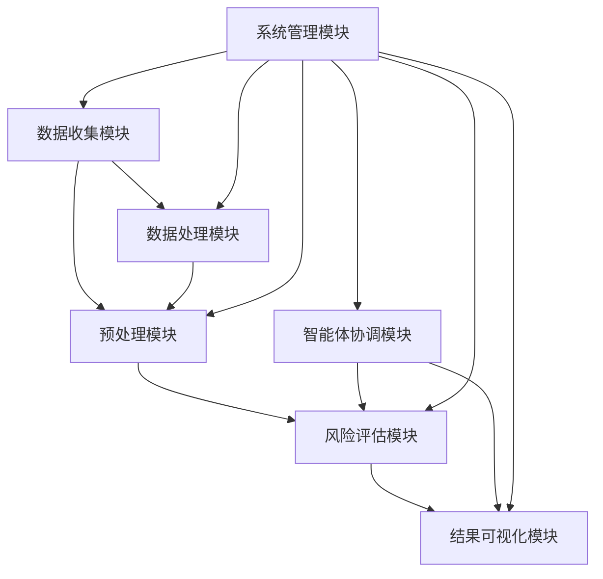
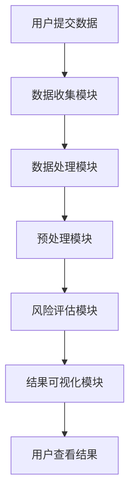
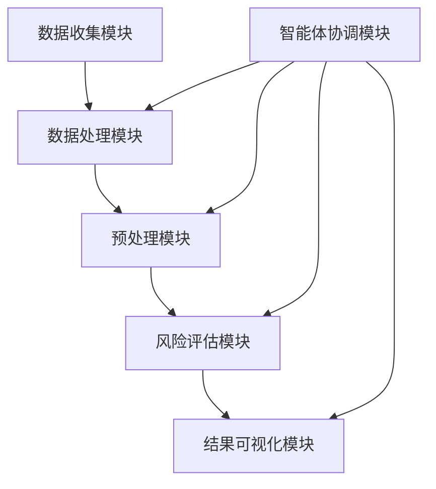
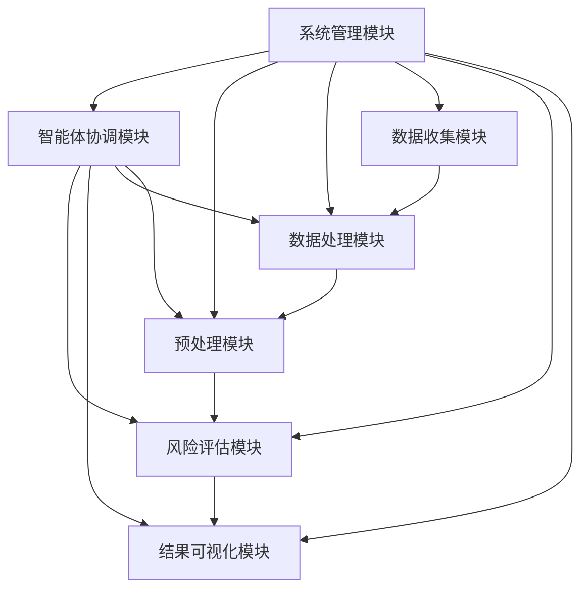

                 

### 目录大纲：多智能体系统实现全方位风险评估

在本篇技术博客中，我们将系统地探讨如何利用多智能体系统（MAS）实现全方位的风险评估。本文将分为五个部分，首先介绍问题的背景，然后深入探讨核心概念和方法，最后通过具体的系统分析与架构设计方案和项目实战，展示如何将理论知识转化为实际应用。

**第一部分：背景介绍**

我们将从问题背景出发，介绍多智能体系统与风险评估的基本概念，并阐述它们在当前信息技术领域中的重要性。

- **第1章 问题背景**
  - 1.1 问题背景介绍
  - 1.2 问题描述
  - 1.3 问题解决思路
  - 1.4 边界与外延
  - 1.5 概念结构与核心要素组成

**第二部分：核心概念与联系**

接着，我们将深入探讨多智能体系统和风险评估的基本原理、方法以及它们之间的联系。

- **第2章 多智能体系统**
  - 2.1 多智能体系统的定义与特点
    - 2.1.1 多智能体系统的定义
    - 2.1.2 多智能体系统的特点
    - 2.1.3 多智能体系统的类型
  - 2.2 多智能体系统的通信机制
  - 2.3 多智能体系统的协调策略
  - 2.4 多智能体系统的学习机制
- **第3章 风险评估方法**
  - 3.1 风险评估的基本概念
    - 3.1.1 风险的定义
    - 3.1.2 风险评估的定义
    - 3.1.3 风险评估的方法
  - 3.2 常见风险评估方法
    - 3.2.1 定量风险评估方法
    - 3.2.2 定性风险评估方法
    - 3.2.3 敏感性分析
- **第4章 多智能体系统与风险评估的联系**
  - 4.1 多智能体系统在风险评估中的应用
    - 4.1.1 多智能体系统在风险评估中的优势
    - 4.1.2 多智能体系统在风险评估中的挑战
    - 4.1.3 多智能体系统在风险评估中的前景

**第三部分：算法原理讲解**

在这一部分，我们将详细讲解多智能体系统和风险评估算法的基本原理，包括它们的核心概念、流程和类型。

- **第5章 多智能体系统算法原理**
  - 5.1 多智能体系统算法的基本原理
    - 5.1.1 多智能体系统的通信机制
    - 5.1.2 多智能体系统的协调策略
    - 5.1.3 多智能体系统的学习机制
  - 5.2 常见多智能体系统算法
    - 5.2.1 搜索算法
    - 5.2.2 学习算法
    - 5.2.3 协同算法
- **第6章 风险评估算法原理**
  - 6.1 风险评估算法的基本原理
    - 6.1.1 风险评估算法的目标
    - 6.1.2 风险评估算法的流程
    - 6.1.3 风险评估算法的类型
  - 6.2 常见风险评估算法
    - 6.2.1 定量风险评估算法
    - 6.2.2 定性风险评估算法
    - 6.2.3 综合风险评估算法
- **第7章 多智能体系统与风险评估算法的结合**
  - 7.1 多智能体系统与风险评估算法的结合原理
    - 7.1.1 结合的优势
    - 7.1.2 结合的挑战
    - 7.1.3 结合的方法

**第四部分：系统分析与架构设计方案**

我们将结合实际项目，详细分析并设计一个多智能体系统实现全方位风险评估的方案。

- **第8章 问题场景介绍**
  - 8.1 问题场景概述
  - 8.2 问题场景描述
- **第9章 项目介绍**
  - 9.1 项目概述
  - 9.2 项目目标
  - 9.3 项目背景
- **第10章 系统功能设计**
  - 10.1 领域模型
  - 10.2 功能模块划分
- **第11章 系统架构设计**
  - 11.1 系统架构概述
  - 11.2 系统模块详细介绍
- **第12章 系统接口设计**
  - 12.1 接口设计原则
  - 12.2 接口详细描述
- **第13章 系统交互**
  - 13.1 系统交互概述
  - 13.2 系统交互图

**第五部分：项目实战**

最后，我们将通过实际项目操作，展示如何部署一个多智能体系统进行全方位风险评估。

- **第14章 环境安装**
  - 14.1 环境准备
  - 14.2 环境安装
- **第15章 系统核心实现**
  - 15.1 数据收集模块实现
  - 15.2 数据处理模块实现
  - 15.3 风险评估模块实现
- **第16章 实际案例分析和详细讲解**
  - 16.1 实际案例分析
  - 16.2 详细讲解剖析
- **第17章 项目小结**

### 结论

通过本文的逐步分析和讲解，我们不仅理解了多智能体系统与风险评估的基本概念和方法，还通过具体的系统架构设计和项目实战，展示了如何将这些理论应用于实际问题。希望通过这篇文章，读者能够对多智能体系统实现全方位风险评估有一个全面而深刻的理解。让我们开始这段探索之旅吧！

---

## 第一部分：背景介绍

### 第1章 问题背景

#### 1.1 问题背景介绍

在当今信息技术飞速发展的时代，智能系统的应用越来越广泛，从智能家居、智能交通到金融风险评估，几乎无处不在。然而，随着这些智能系统的复杂性不断增加，风险因素也在随之扩大。传统的风险评估方法已经无法满足现代智能系统对风险预测和管理的需求。

多智能体系统（MAS）作为一种分布式计算模型，具有自主性、协同性和适应性等特点，它能够在复杂环境中通过多个智能体的合作来实现目标。风险评估是风险管理的一个重要环节，其目的是通过识别、分析和评估潜在的风险，为决策者提供有力的支持。因此，将多智能体系统应用于风险评估，已经成为当前研究的一个热点问题。

多智能体系统在风险评估中的应用，不仅能够提高风险评估的精度和效率，还能够通过智能体的协作和自主学习，实现风险的实时监测和动态调整。然而，这一领域也面临着诸多挑战，例如智能体之间的通信机制、协调策略以及系统的稳定性和鲁棒性等。

#### 1.2 问题描述

具体而言，当前的多智能体系统在风险评估中面临以下问题：

1. **通信机制问题**：多智能体系统需要高效、可靠的通信机制来确保各智能体之间的信息共享和协同工作。然而，在实际应用中，通信链路的稳定性、带宽限制和数据安全性等问题常常影响智能体之间的通信效果。

2. **协调策略问题**：在复杂的风险评估环境中，智能体之间的协调策略对于实现整体目标的达成至关重要。如何设计有效的协调策略，以实现智能体的协同工作，是当前研究中的一个难点。

3. **系统稳定性问题**：多智能体系统在运行过程中，可能会受到外部环境变化的影响，导致系统不稳定。如何保证多智能体系统的稳定性和鲁棒性，是一个亟待解决的问题。

4. **风险预测精度问题**：在风险评估过程中，如何准确预测潜在风险，是决定风险评估效果的关键。多智能体系统需要通过有效的算法和数据模型，提高风险预测的精度和可靠性。

#### 1.3 问题解决思路

为了解决上述问题，本文将从以下几个方面展开探讨：

1. **通信机制优化**：研究并设计一种高效、可靠的通信机制，以解决多智能体系统中的通信问题。例如，可以采用消息队列、分布式存储等技术，提高通信效率和数据安全性。

2. **协调策略设计**：通过分析不同类型的智能体和风险评估任务，设计有效的协调策略，以实现智能体之间的协同工作。例如，可以采用基于协商、博弈和机器学习的协调算法。

3. **系统稳定性保障**：研究并应用自适应控制、容错技术等，提高多智能体系统的稳定性和鲁棒性。例如，可以采用冗余设计、故障检测与恢复策略等。

4. **风险预测算法优化**：研究并应用先进的风险预测算法，提高风险预测的精度和可靠性。例如，可以采用深度学习、强化学习等算法，结合大数据分析和可视化技术，实现风险预测的自动化和智能化。

#### 1.4 边界与外延

本文的研究主要围绕多智能体系统在风险评估中的应用展开，旨在探索一种高效、稳定和可靠的风险评估方法。具体来说，本文的研究边界包括：

1. **系统架构**：本文主要研究基于多智能体系统的风险评估系统架构，重点关注通信机制、协调策略、系统稳定性和风险预测算法等方面。

2. **应用场景**：本文主要探讨多智能体系统在金融风险评估、智能交通管理、智能制造等领域的应用，重点关注这些领域中的风险特征和评估需求。

3. **数据来源**：本文主要使用公开的数据集和实际项目数据，进行风险评估模型的训练和验证，以确保研究成果的实用性和可操作性。

#### 1.5 概念结构与核心要素组成

多智能体系统在风险评估中的应用，涉及到多个核心概念和要素。以下是这些概念和要素的简要说明：

1. **多智能体系统**：由多个具有自主性、协作性和适应性的智能体组成，通过协作和通信实现共同目标。

2. **风险评估**：通过识别、分析和评估潜在风险，为决策者提供风险预测和管理支持。

3. **通信机制**：智能体之间进行信息交换和协调的机制，包括消息传递、通信协议和数据格式等。

4. **协调策略**：智能体之间协作的规则和方法，包括协商、博弈、机器学习等。

5. **风险预测算法**：用于预测潜在风险的方法和模型，包括统计方法、机器学习方法等。

6. **系统稳定性**：多智能体系统在运行过程中保持稳定状态的能力，包括容错性、鲁棒性等。

7. **数据模型**：用于表示和分析风险的数据结构和方法，包括关系模型、图模型等。

通过上述概念和要素的分析，我们可以更好地理解多智能体系统在风险评估中的应用，并为其实现提供理论支持和技术指导。

---

### 第2章 多智能体系统

多智能体系统（MAS，Multi-Agent System）是一种由多个智能体组成的分布式计算系统。智能体是系统的基本单元，具有自主性、协作性和适应性。智能体之间通过通信和协作来实现共同的目标，这使得多智能体系统在复杂和动态环境中表现出良好的适应性和鲁棒性。

#### 2.1 多智能体系统的定义与特点

**2.1.1 多智能体系统的定义**

多智能体系统可以定义为一种由多个自主智能体组成，通过通信和协作来共同实现特定目标的计算系统。这些智能体可以相互独立地感知环境、执行任务并与其他智能体进行交互。

**2.1.2 多智能体系统的特点**

多智能体系统具有以下几个主要特点：

1. **自主性**：每个智能体都有一定的自主决策能力，可以在不依赖外部干预的情况下独立执行任务。
2. **协作性**：智能体之间可以通过通信和协作来实现共同的目标，这种协作可以是同步的也可以是异步的。
3. **适应性**：智能体能够根据环境变化和任务需求调整自身的行为和策略。
4. **分布性**：多智能体系统通常在分布式环境中运行，智能体可以分布在不同的地理位置或计算节点上。
5. **异构性**：智能体可以具有不同的结构、功能和能力，这使得系统能够处理多样化的任务。

**2.1.3 多智能体系统的类型**

多智能体系统根据智能体的自主性、协作性和组织结构，可以分为以下几种类型：

1. **独立智能体**：智能体之间没有直接的联系，各自独立地完成任务，仅通过环境进行间接交互。
2. **合作智能体**：智能体之间通过通信和协作来共同完成任务，彼此之间存在明确的目标一致性。
3. **竞争智能体**：智能体之间为了资源或目标进行竞争，各自独立地追求自身利益。
4. **混合智能体**：智能体之间既存在合作也存在着竞争，系统表现出复杂的动态行为。

#### 2.2 多智能体系统的通信机制

多智能体系统的通信机制是智能体之间进行信息交换和协调的基础。常见的通信机制包括：

1. **直接通信**：智能体之间通过点对点通信直接交换信息，适合小规模或固定结构的智能体系统。
2. **间接通信**：智能体通过共享环境或中介进行信息传递，适合大规模或动态结构的智能体系统。
3. **广播通信**：信息被发送给系统中的所有智能体，适合快速广播信息或发布全局状态。
4. **订阅-发布通信**：智能体订阅特定的信息，只有当发布的信息与订阅者相关时，订阅者才会接收该信息，适合高效的信息过滤和分发。

#### 2.3 多智能体系统的协调策略

协调策略是多智能体系统实现协同工作的关键。常见的协调策略包括：

1. **集中式协调**：通过一个中心协调器来统一管理和调度智能体的行为，适合结构化或静态的智能体系统。
2. **分布式协调**：智能体之间通过协商和博弈来实现协调，适合复杂或动态的智能体系统。
3. **博弈论协调**：基于博弈论的理论，智能体通过策略选择来实现合作或竞争，适用于多智能体之间的策略互动。
4. **协商协调**：智能体之间通过一系列协商过程来达成一致，适用于需要复杂决策和资源分配的智能体系统。

#### 2.4 多智能体系统的学习机制

多智能体系统的学习机制是智能体通过经验和知识调整自身行为的机制。常见的学习机制包括：

1. **基于规则的 learning**：智能体通过预设的规则来学习和调整行为，适合规则明确和稳定的环境。
2. **基于模型的 learning**：智能体通过建立环境模型来预测和优化行为，适用于动态和不确定的环境。
3. **基于经验的 learning**：智能体通过积累经验来学习和改进行为，适用于复杂和变化频繁的环境。
4. **强化学习**：智能体通过尝试不同的行为并从奖励信号中学习，适用于需要探索和优化的任务。

综上所述，多智能体系统通过自主性、协作性和适应性的特点，在复杂和动态的环境中展现出强大的能力和潜力。了解和掌握多智能体系统的定义、特点、通信机制、协调策略和学习机制，对于应用多智能体系统解决实际问题具有重要意义。

---

### 第3章 风险评估方法

风险评估是风险管理的关键环节，其目的是通过系统化的方法识别、分析和评估潜在风险，为决策者提供有力支持。在多智能体系统中，风险评估方法的选择和实施尤为重要，因为多智能体系统的复杂性和动态性对风险评估提出了更高的要求。

#### 3.1 风险评估的基本概念

**3.1.1 风险的定义**

风险是指在特定环境中，由于不确定性事件的发生而导致目标无法实现的可能性及其影响。风险通常由两个要素构成：一是事件的可能性，二是事件发生时的损失程度。

**3.1.2 风险评估的定义**

风险评估是指通过系统化的方法识别、分析和评估潜在风险，以确定风险程度和影响，为风险管理和决策提供依据。风险评估通常包括以下步骤：风险识别、风险分析、风险评价和风险应对策略制定。

**3.1.3 风险评估的方法**

风险评估方法可以分为定量评估方法和定性评估方法，以及基于这两者的综合评估方法。

1. **定量评估方法**：
   - **统计方法**：通过历史数据和分析模型来预测和计算风险的概率和影响。
   - **模型方法**：利用数学模型和计算机模拟来分析和评估风险。
   - **经济分析方法**：通过成本效益分析和风险成本计算来量化风险的经济影响。

2. **定性评估方法**：
   - **专家评估法**：通过专家意见、经验和专业知识来评估风险的可能性、影响和严重程度。
   - **层次分析法（AHP）**：将风险评估分解为多个层次，通过矩阵运算和权重计算来确定风险的重要性。
   - **模糊综合评价法**：利用模糊数学的方法来处理不确定性和模糊性的评估问题。

3. **综合评估方法**：
   - **定量与定性相结合**：结合定量和定性方法，通过综合评估来提高风险评估的准确性和可靠性。
   - **多准则决策方法**：考虑多个评估准则，通过权重和决策分析来选择最佳的风险管理方案。

#### 3.2 常见风险评估方法

**3.2.1 定量风险评估方法**

定量风险评估方法主要通过数学模型和数据分析来量化风险。以下是几种常见的定量风险评估方法：

1. **蒙特卡洛模拟**：
   - **原理**：通过随机抽样和模拟，计算风险的概率分布和期望损失。
   - **应用**：在金融风险评估、工程项目风险评估等领域广泛应用。

2. **敏感性分析**：
   - **原理**：分析模型中各个变量对结果的影响程度，确定关键变量。
   - **应用**：帮助决策者了解模型的不确定性和敏感度，优化决策。

3. **成本效益分析**：
   - **原理**：比较不同风险应对策略的成本和效益，选择最优方案。
   - **应用**：在项目投资、风险管理策略制定等领域使用。

**3.2.2 定性风险评估方法**

定性风险评估方法主要依靠专家意见和专业判断来评估风险。以下是几种常见的定性风险评估方法：

1. **故障模式与影响分析（FMEA）**：
   - **原理**：识别系统的潜在故障模式，分析故障对系统的影响。
   - **应用**：在产品设计、过程优化等领域广泛应用。

2. **专家评估法**：
   - **原理**：通过专家的意见、经验和知识来评估风险。
   - **应用**：在金融风险评估、安全风险评估等领域使用。

3. **风险矩阵法**：
   - **原理**：通过风险的可能性、影响和严重程度来评估风险，并绘制风险矩阵。
   - **应用**：在项目风险评估、运营风险管理等领域应用广泛。

**3.2.3 敏感性分析**

敏感性分析是风险评估中的一种重要方法，用于确定模型中各个参数对评估结果的影响程度。敏感性分析可以帮助决策者了解模型的不确定性和关键影响因素，从而制定更有效的风险管理策略。

1. **局部敏感性分析**：
   - **原理**：通过计算模型中参数的偏导数来分析参数对结果的局部影响。
   - **应用**：在金融风险评估、工程分析等领域使用。

2. **全局敏感性分析**：
   - **原理**：通过计算模型中参数的方差或协方差矩阵来分析参数对结果的全球影响。
   - **应用**：在复杂系统的风险评估中应用，如环境风险评估、社会风险评估等。

综上所述，风险评估方法的选择应根据具体问题的特点和要求进行。定量评估方法适用于需要精确量化的风险，定性评估方法适用于主观判断和经验丰富的风险，而综合评估方法则能够提供更全面和可靠的风险评估结果。

---

### 第4章 多智能体系统与风险评估的联系

多智能体系统（MAS）与风险评估之间存在紧密的联系。多智能体系统通过其分布式计算和协作能力，能够显著提升风险评估的效率、准确性和适应性。以下将详细探讨多智能体系统在风险评估中的应用、优势、挑战及其前景。

#### 4.1 多智能体系统在风险评估中的应用

多智能体系统在风险评估中具有广泛的应用前景，主要包括以下几个方面：

1. **实时风险评估**：多智能体系统能够实时采集和分析数据，对风险进行动态评估和预测。这种实时性使得风险评估能够及时响应环境变化，提高决策的及时性和有效性。

2. **分布式风险评估**：多智能体系统可以分散在不同的地理位置或计算节点上运行，通过分布式计算提高风险评估的并行处理能力。这种方法可以处理大规模、复杂的风险评估任务。

3. **协同风险评估**：多智能体系统能够通过智能体之间的协作和共享信息，实现综合和全面的风险评估。多个智能体可以分工合作，共同识别和分析风险，提高评估的准确性和全面性。

4. **自适应风险评估**：多智能体系统具有自主性和适应性，能够根据环境和任务需求调整自身的策略和行为。这种自适应能力使得风险评估系统能够在不断变化的环境中保持稳定和有效。

#### 4.1.1 多智能体系统在风险评估中的优势

多智能体系统在风险评估中展现出以下优势：

1. **提高评估精度**：多智能体系统能够通过分布式计算和协同工作，整合多个智能体的信息和知识，提高风险评估的精度和可靠性。

2. **实时响应**：多智能体系统能够实时采集和处理数据，及时识别和评估风险，为决策者提供实时决策支持。

3. **降低成本**：通过分布式计算和协同工作，多智能体系统能够高效地处理复杂的风险评估任务，降低计算和通信成本。

4. **增强鲁棒性**：多智能体系统具有较高的鲁棒性，能够应对环境变化和不确定性的挑战，保持系统的稳定性和可靠性。

#### 4.1.2 多智能体系统在风险评估中的挑战

尽管多智能体系统在风险评估中具有显著的优势，但也面临着一些挑战：

1. **通信机制**：多智能体系统需要高效、可靠的通信机制来确保智能体之间的信息共享和协作。然而，在实际应用中，通信链路的稳定性、带宽限制和数据安全性等问题会影响通信效果。

2. **协调策略**：在复杂的风险评估环境中，智能体之间的协调策略对于实现整体目标的达成至关重要。如何设计有效的协调策略，以实现智能体的协同工作，是一个难点。

3. **系统稳定性**：多智能体系统在运行过程中，可能会受到外部环境变化的影响，导致系统不稳定。如何保证多智能体系统的稳定性和鲁棒性，是一个亟待解决的问题。

4. **数据融合**：多智能体系统需要处理来自不同智能体的数据，这些数据可能存在不一致性和噪声。如何有效地融合和处理这些数据，是提高风险评估精度的重要问题。

#### 4.1.3 多智能体系统在风险评估中的前景

多智能体系统在风险评估中的前景广阔，随着技术的不断发展和应用的深入，它将在以下几个方面展现出更大的潜力：

1. **智能化**：通过引入机器学习和深度学习技术，多智能体系统能够实现更高级的风险评估功能，如智能识别、预测和决策。

2. **自主化**：未来的多智能体系统将更加自主化，能够自主地识别和评估风险，并自动采取相应的措施。

3. **自适应化**：随着对环境变化和任务需求的不断适应，多智能体系统能够在更复杂的场景中保持高效的风险评估能力。

4. **分布式**：多智能体系统将更加分布式，能够处理更大规模的风险评估任务，提供更高效和可靠的决策支持。

总之，多智能体系统在风险评估中的应用具有巨大的潜力和前景。通过克服现有的挑战，多智能体系统能够为风险评估提供更加精确、实时和高效的支持，为决策者提供有力保障。

---

### 第5章 多智能体系统算法原理

多智能体系统（MAS）的算法原理是理解和设计高效、稳定的多智能体系统的关键。在这一章中，我们将详细探讨多智能体系统算法的基本原理、通信机制、协调策略和学习机制，以及常见算法的分类和应用。

#### 5.1 多智能体系统算法的基本原理

多智能体系统算法的基本原理可以归纳为以下几点：

1. **自主性**：每个智能体能够独立地感知环境、执行任务和做出决策，不需要外部集中控制。
2. **协作性**：智能体之间通过通信和协作，共同实现系统目标，协作可以是同步或异步的。
3. **适应性**：智能体能够根据环境变化和任务需求，调整自身的策略和行为。
4. **分布性**：智能体分散在分布式环境中，能够利用局部信息和资源，提高系统的鲁棒性和可扩展性。

多智能体系统的基本原理使得它能够在复杂、动态和不确定的环境中表现出良好的适应性和鲁棒性。这些原理贯穿于多智能体系统的设计、实现和应用过程中。

#### 5.1.1 多智能体系统的通信机制

通信机制是多智能体系统能够协同工作的基础。常见的通信机制包括：

1. **直接通信**：智能体之间通过点对点通信直接交换信息，适用于小规模或固定结构的系统。
2. **间接通信**：智能体通过共享环境或中介进行信息传递，适用于大规模或动态结构的系统。
3. **广播通信**：信息被发送给系统中的所有智能体，适用于快速广播信息或发布全局状态。
4. **订阅-发布通信**：智能体订阅特定的信息，只有当发布的信息与订阅者相关时，订阅者才会接收信息，适用于高效的信息过滤和分发。

通信机制的选择取决于系统的规模、结构和应用场景。直接通信适用于小规模、结构固定的系统，而间接通信和订阅-发布通信则更适合大规模、动态的系统。

#### 5.1.2 多智能体系统的协调策略

协调策略是多智能体系统能够协同工作的关键。常见的协调策略包括：

1. **集中式协调**：通过一个中心协调器来统一管理和调度智能体的行为，适用于结构化或静态的系统。
2. **分布式协调**：智能体之间通过协商和博弈来实现协调，适用于复杂或动态的系统。
3. **博弈论协调**：基于博弈论的理论，智能体通过策略选择来实现合作或竞争，适用于多智能体之间的策略互动。
4. **协商协调**：智能体之间通过一系列协商过程来达成一致，适用于需要复杂决策和资源分配的系统。

协调策略的选择取决于系统的具体需求和应用场景。集中式协调适用于结构化、静态的系统，而分布式协调、博弈论协调和协商协调则更适合复杂、动态和不确定的系统。

#### 5.1.3 多智能体系统的学习机制

学习机制是多智能体系统能够自主学习和适应环境变化的重要手段。常见的学习机制包括：

1. **基于规则的 learning**：智能体通过预设的规则来学习和调整行为，适用于规则明确和稳定的环境。
2. **基于模型的 learning**：智能体通过建立环境模型来预测和优化行为，适用于动态和不确定的环境。
3. **基于经验的 learning**：智能体通过积累经验来学习和改进行为，适用于复杂和变化频繁的环境。
4. **强化学习**：智能体通过尝试不同的行为并从奖励信号中学习，适用于需要探索和优化的任务。

学习机制的选择取决于系统的应用场景和需求。基于规则的 learning 适用于规则明确的环境，基于模型的 learning 适用于动态和不确定的环境，基于经验的 learning 适用于复杂和变化频繁的环境，而强化学习适用于需要探索和优化的任务。

#### 5.2 常见多智能体系统算法

多智能体系统算法根据其应用场景和目标，可以分为多种类型。以下是几种常见算法的分类和应用：

1. **搜索算法**：
   - **原理**：通过搜索智能体在环境中的状态空间，找到最优路径或解决方案。
   - **应用**：路径规划、任务分配等。

2. **学习算法**：
   - **原理**：通过智能体的经验和环境反馈来学习策略和行为。
   - **应用**：强化学习、深度学习等。

3. **协同算法**：
   - **原理**：通过智能体之间的协作和协调来实现共同目标。
   - **应用**：团队任务分配、资源分配等。

4. **博弈算法**：
   - **原理**：通过智能体之间的策略互动来实现最优策略选择。
   - **应用**：竞争环境中的策略优化、合作竞争等。

5. **优化算法**：
   - **原理**：通过优化智能体的行为和策略来提高系统性能。
   - **应用**：资源分配、调度优化等。

每种算法都有其特定的原理和应用场景，通过合理选择和组合这些算法，可以构建高效、稳定和灵活的多智能体系统。

综上所述，多智能体系统算法的基本原理、通信机制、协调策略和学习机制构成了多智能体系统算法的核心内容。理解和掌握这些原理和算法，对于设计和实现高效、稳定和灵活的多智能体系统具有重要意义。

---

### 第6章 风险评估算法原理

风险评估算法是识别、分析和评估潜在风险的核心工具。在这一章中，我们将详细探讨风险评估算法的基本原理、目标、流程、类型，以及常见的风险评估算法。

#### 6.1 风险评估算法的基本原理

风险评估算法的基本原理主要包括以下几个步骤：

1. **风险识别**：通过系统化的方法识别潜在的风险因素。这一步骤通常涉及对历史数据、专家意见和文献调研的综合分析。
2. **风险分析**：对识别出的风险因素进行详细分析，包括风险的概率和影响评估。风险分析可以采用定量或定性方法，具体取决于数据的可用性和复杂性。
3. **风险评价**：根据风险分析的结果，评估每个风险的重要性。常用的评估方法包括风险矩阵法、层次分析法（AHP）和模糊综合评价法。
4. **风险应对策略制定**：基于风险评估的结果，制定相应的风险应对策略，包括风险避免、风险转移、风险减轻和风险接受等。

风险评估算法的核心目标是通过系统化的方法，提高风险评估的准确性、可靠性和效率，为决策者提供有力的风险管理和决策支持。

#### 6.1.1 风险评估算法的目标

风险评估算法的目标主要包括以下几点：

1. **准确性**：准确地识别和评估潜在风险，确保评估结果与实际情况相符。
2. **可靠性**：算法应具有良好的鲁棒性和稳定性，能够在不同的环境和数据条件下可靠运行。
3. **效率**：算法应具有高效的计算速度和处理能力，能够在短时间内完成复杂的风险评估任务。
4. **可扩展性**：算法应能够适应不同的应用场景和数据规模，具有灵活的扩展性和适应性。

#### 6.1.2 风险评估算法的流程

风险评估算法的典型流程包括以下几个阶段：

1. **数据收集**：收集与风险相关的历史数据、实时数据和其他相关信息。
2. **数据预处理**：对收集的数据进行清洗、归一化和特征提取，确保数据的质量和一致性。
3. **风险识别**：利用规则库、专家系统或机器学习方法，识别系统中的潜在风险因素。
4. **风险分析**：计算每个风险因素的概率和影响，确定其严重性和优先级。
5. **风险评价**：根据风险分析的结果，使用风险矩阵或其他评估方法，评价每个风险的重要性。
6. **风险应对策略制定**：基于风险评估的结果，制定相应的风险应对策略，包括风险规避、风险转移、风险减轻和风险接受等。
7. **结果可视化**：将风险评估结果以图表、报告等形式呈现，帮助决策者理解和分析风险。

#### 6.1.3 风险评估算法的类型

风险评估算法可以根据不同的标准进行分类，以下是一些常见的分类方式：

1. **定量风险评估算法**：
   - **统计方法**：通过历史数据和分析模型，计算风险的概率和影响。
   - **模型方法**：利用数学模型和计算机模拟，分析和评估风险。
   - **经济分析方法**：通过成本效益分析和风险成本计算，量化风险的经济影响。

2. **定性风险评估算法**：
   - **专家评估法**：通过专家的意见、经验和专业知识，评估风险的可能性、影响和严重程度。
   - **层次分析法（AHP）**：将风险评估分解为多个层次，通过矩阵运算和权重计算，确定风险的重要性。
   - **模糊综合评价法**：利用模糊数学的方法，处理不确定性和模糊性的评估问题。

3. **综合评估方法**：
   - **定量与定性相结合**：结合定量和定性方法，通过综合评估来提高风险评估的准确性和可靠性。
   - **多准则决策方法**：考虑多个评估准则，通过权重和决策分析，选择最佳的风险管理方案。

#### 6.2 常见风险评估算法

以下介绍几种常见风险评估算法：

1. **蒙特卡洛模拟**：
   - **原理**：通过随机抽样和模拟，计算风险的概率分布和期望损失。
   - **应用**：在金融风险评估、工程项目风险评估等领域广泛应用。

2. **敏感性分析**：
   - **原理**：分析模型中各个变量对结果的影响程度，确定关键变量。
   - **应用**：帮助决策者了解模型的不确定性和敏感度，优化决策。

3. **成本效益分析**：
   - **原理**：比较不同风险应对策略的成本和效益，选择最优方案。
   - **应用**：在项目投资、风险管理策略制定等领域使用。

4. **故障模式与影响分析（FMEA）**：
   - **原理**：识别系统的潜在故障模式，分析故障对系统的影响。
   - **应用**：在产品设计、过程优化等领域广泛应用。

5. **专家评估法**：
   - **原理**：通过专家的意见、经验和专业知识，评估风险的可能性、影响和严重程度。
   - **应用**：在金融风险评估、安全风险评估等领域使用。

6. **风险矩阵法**：
   - **原理**：通过风险的可能性、影响和严重程度，评估风险，并绘制风险矩阵。
   - **应用**：在项目风险评估、运营风险管理等领域应用广泛。

综上所述，风险评估算法的类型和原理多种多样，通过合理选择和组合这些算法，可以构建高效、准确和可靠的风险评估系统，为风险管理和决策提供有力支持。

---

### 第7章 多智能体系统与风险评估算法的结合

多智能体系统（MAS）与风险评估算法的结合，为风险管理和决策提供了新的思路和方法。在这一章中，我们将探讨多智能体系统与风险评估算法结合的优势、挑战以及实现方法。

#### 7.1 多智能体系统与风险评估算法的结合原理

多智能体系统与风险评估算法的结合原理主要基于以下几个方面：

1. **分布式计算与协同分析**：多智能体系统能够在分布式环境中运行，通过智能体之间的协作和共享信息，实现高效的风险评估。这种分布式计算和协同分析能力，使得风险评估算法可以处理大规模、复杂的风险评估任务。

2. **自主性与自适应能力**：多智能体系统的智能体具有自主性和自适应能力，能够根据环境和任务需求，动态调整风险评估策略和方法。这种自主性和自适应能力，使得结合后的系统能够适应不同场景和需求，提高风险评估的灵活性和准确性。

3. **多角度分析与综合评估**：多智能体系统能够通过多个智能体从不同角度对风险进行识别、分析和评估，从而实现更全面和综合的风险评估。这种多角度分析和综合评估能力，有助于提高风险评估的准确性和可靠性。

#### 7.1.1 结合的优势

多智能体系统与风险评估算法的结合，具有以下优势：

1. **提高风险评估精度**：通过多个智能体的协作和共享信息，结合后的系统能够更全面、准确地识别和评估风险，提高风险评估的精度和可靠性。

2. **实时风险评估**：多智能体系统能够实时采集和处理数据，实现实时风险评估，及时为决策者提供风险信息和支持。

3. **降低风险评估成本**：通过分布式计算和协作分析，结合后的系统能够高效地处理风险评估任务，降低计算和通信成本。

4. **增强系统鲁棒性**：多智能体系统具有自主性和自适应能力，能够应对环境变化和不确定性的挑战，提高系统的鲁棒性和稳定性。

5. **支持复杂场景**：多智能体系统能够适应不同场景和需求，通过智能体的协作和自适应能力，实现复杂场景下的风险评估。

#### 7.1.2 结合的挑战

尽管多智能体系统与风险评估算法的结合具有显著优势，但仍然面临一些挑战：

1. **通信机制**：多智能体系统需要高效、可靠的通信机制来确保智能体之间的信息共享和协作。在实际应用中，通信链路的稳定性、带宽限制和数据安全性等问题会影响通信效果。

2. **协调策略**：在复杂的风险评估环境中，智能体之间的协调策略对于实现整体目标的达成至关重要。如何设计有效的协调策略，以实现智能体的协同工作，是一个难点。

3. **数据融合**：多智能体系统需要处理来自不同智能体的数据，这些数据可能存在不一致性和噪声。如何有效地融合和处理这些数据，是提高风险评估精度的重要问题。

4. **算法复杂性**：多智能体系统与风险评估算法的结合，通常需要复杂的数据处理和算法实现。如何设计高效、稳定的算法，是一个挑战。

#### 7.1.3 结合的方法

为了克服上述挑战，实现多智能体系统与风险评估算法的有效结合，可以采用以下方法：

1. **通信机制优化**：采用分布式通信、消息队列和分布式存储等技术，提高通信效率和数据安全性。

2. **协调策略设计**：通过分析智能体的任务和需求，设计有效的协调策略，如协商协调、博弈论协调和基于规则的协调策略。

3. **数据融合技术**：采用数据预处理、特征提取和集成方法，处理多源数据的不一致性和噪声，提高数据质量。

4. **算法优化与实现**：采用高效、稳定的算法实现，如深度学习、强化学习和机器学习算法，提高风险评估的精度和可靠性。

5. **系统测试与验证**：通过系统测试和验证，评估结合后的系统的性能和稳定性，优化系统设计和实现。

综上所述，多智能体系统与风险评估算法的结合，为风险管理和决策提供了新的思路和方法。通过克服结合过程中的挑战，实现高效、稳定和可靠的风险评估系统，可以为决策者提供有力的支持。

---

### 第8章 问题场景介绍

在多智能体系统实现全方位风险评估的背景下，我们首先需要了解具体的问题场景。这些场景将为我们提供实际的应用背景，并帮助我们明确系统设计的目标和需求。

#### 8.1 问题场景概述

本问题场景涉及一个大型金融机构的风险管理部门，该部门需要对其业务运营中的各种风险进行全方位的评估和管理。这些风险包括但不限于信用风险、市场风险、操作风险和法律风险。金融机构的业务活动涉及众多复杂的金融产品和服务，因此风险因素繁多，风险评估的难度较大。

#### 8.2 问题场景描述

在具体描述这个问题场景时，我们可以从以下几个方面展开：

1. **数据来源**：金融机构的风险数据来源于多个渠道，包括交易记录、客户信息、市场数据、内部报告等。这些数据需要通过多个智能体进行实时采集和汇总。

2. **风险因素**：在金融机构的业务运营中，风险因素主要包括：
   - **信用风险**：与客户信用状况相关，包括违约风险和信用等级变化。
   - **市场风险**：与金融市场波动相关，包括汇率波动、利率变化、股市波动等。
   - **操作风险**：与内部操作失误、系统故障、欺诈等外部事件相关。
   - **法律风险**：与法律法规变化、合规性要求相关。

3. **风险评估需求**：金融机构的风险管理部门需要实现以下目标：
   - **实时风险评估**：能够对业务运营中的风险进行实时监测和评估，及时发现潜在风险。
   - **全面性**：对各种风险因素进行全面评估，确保评估结果的全面性和准确性。
   - **自动化**：通过智能体系统实现风险评估的自动化，降低人工成本，提高评估效率。
   - **可视化**：将风险评估结果以可视化方式呈现，帮助决策者直观了解风险状况。

4. **系统挑战**：
   - **数据多样性**：金融机构的风险数据来源多样，如何高效处理和融合这些数据是一个挑战。
   - **实时性**：需要实现实时风险评估，对系统性能和响应速度有较高要求。
   - **准确性**：评估结果需要高度准确，以支持决策者做出正确的风险管理决策。
   - **可靠性**：系统需要具有较高的稳定性和可靠性，确保风险评估结果的持续有效性。

通过上述问题场景的描述，我们可以更清晰地理解多智能体系统在全方位风险评估中的具体应用场景，以及系统设计所需考虑的关键因素。

---

### 第9章 项目介绍

在明确问题场景之后，我们将介绍一个具体的项目，该项目的目标是利用多智能体系统实现全方位风险评估。以下是项目的概述、目标、背景以及核心组件的详细介绍。

#### 9.1 项目概述

本项目名为“智能风险管家”（Smart Risk Manager），旨在为大型金融机构提供一套基于多智能体系统的全方位风险评估解决方案。该系统将整合多源数据，通过智能体的协作和自主学习，实现对信用风险、市场风险、操作风险和法律风险的实时、全面和准确评估。

#### 9.2 项目目标

智能风险管家项目的目标如下：

1. **实时风险评估**：系统需能够实时采集和处理金融机构的各项业务数据，对潜在风险进行实时监测和评估。
2. **全面性**：系统需对各种风险因素进行全面评估，确保评估结果的全面性和准确性。
3. **自动化**：通过智能体系统实现风险评估的自动化，降低人工成本，提高评估效率。
4. **可视化**：将风险评估结果以可视化方式呈现，帮助决策者直观了解风险状况。
5. **可靠性**：系统需具备高稳定性和可靠性，确保风险评估结果的持续有效性。

#### 9.3 项目背景

随着金融市场的不断发展和业务复杂性的增加，金融机构面临的风险种类和数量日益增多。传统的风险评估方法已经无法满足现代金融业务的需求。因此，本项目旨在通过引入多智能体系统，提供一种高效、全面和智能的风险评估解决方案，以提升金融机构的风险管理能力。

#### 9.3.1 现有风险评估方法存在的问题

现有风险评估方法存在以下问题：

1. **数据依赖性高**：传统的风险评估方法依赖于人工收集和整理数据，数据质量和完整性难以保证。
2. **评估效率低**：传统的风险评估方法通常需要大量的人工干预和审核，导致评估效率低下。
3. **评估准确性差**：由于数据来源单一、方法简单，传统的风险评估方法难以提供准确和全面的风险评估结果。
4. **系统稳定性不足**：传统的风险评估系统在应对复杂、动态的金融环境时，稳定性不足，容易受到外部环境变化的影响。

#### 9.3.2 引入多智能体系统的优势

引入多智能体系统，可以有效解决现有风险评估方法的不足，具有以下优势：

1. **分布式计算**：多智能体系统能够在分布式环境中运行，高效处理和融合多源数据。
2. **自动化**：智能体系统能够实现风险评估的自动化，减少人工干预，提高评估效率。
3. **实时性**：多智能体系统能够实时采集和处理数据，及时识别和评估风险。
4. **全面性**：通过多个智能体的协作，系统能够全面评估各种风险因素。
5. **自适应能力**：智能体系统能够根据环境和任务需求，动态调整风险评估策略和方法。

#### 9.4 核心组件介绍

智能风险管家项目由多个核心组件组成，以下是这些组件的详细介绍：

1. **数据收集模块**：该模块负责实时采集金融机构的各项业务数据，包括交易记录、客户信息、市场数据等。数据来源包括内部系统、外部数据源以及第三方API等。

2. **数据处理模块**：该模块负责对采集到的数据进行清洗、归一化和特征提取，确保数据的质量和一致性。数据处理模块还支持多种数据预处理技术，如缺失值处理、异常值检测和数据融合等。

3. **风险评估模块**：该模块是项目的核心，负责对处理后的数据进行分析和评估，识别潜在风险并计算风险等级。风险评估模块包括多种风险评估算法，如统计方法、机器学习方法等。

4. **智能体协调模块**：该模块负责智能体之间的协调和通信，确保系统的高效运行。智能体协调模块支持多种协调策略，如协商协调、博弈论协调和基于规则的协调策略。

5. **结果可视化模块**：该模块负责将风险评估结果以可视化方式呈现，帮助决策者直观了解风险状况。可视化模块支持多种图表和报表，如柱状图、饼图、热力图等。

6. **系统管理模块**：该模块负责系统的配置、监控和管理，确保系统的稳定性和可靠性。系统管理模块包括用户管理、权限管理、日志管理等功能。

通过上述核心组件的协同工作，智能风险管家项目能够为金融机构提供一套高效、全面和智能的风险评估解决方案，提升其风险管理能力。

---

### 第10章 系统功能设计

在智能风险管家项目中，系统功能设计是确保项目目标实现的关键步骤。我们将通过领域模型和功能模块划分，详细描述系统设计的思路和具体实现。

#### 10.1 领域模型

领域模型是系统功能设计的核心，它帮助我们理解和抽象系统的业务需求。智能风险管家项目的领域模型主要包括以下几个类：

1. **智能体（Agent）**：代表系统的基本操作单元，负责数据收集、数据处理、风险评估等任务。
2. **数据源（Data Source）**：代表系统中的数据来源，包括内部系统、外部数据源和第三方API等。
3. **数据（Data）**：代表系统中的数据实体，包括交易记录、客户信息、市场数据等。
4. **预处理（Preprocessing）**：代表数据清洗、归一化、特征提取等预处理操作。
5. **评估结果（Assessment Result）**：代表风险评估的结果，包括风险等级、风险因素等。
6. **可视化（Visualization）**：代表风险评估结果的可视化展示。
7. **系统管理（System Management）**：代表系统的配置、监控和管理功能。

以下是一个简单的领域模型Mermaid类图：

```mermaid
classDiagram
    Class01 <|-- Class02 
    Class03 <|-- Class04
    Class05 <|-- Class06
    Class07 <|-- Class08
    Class09 <|-- Class10
    
    Class01[智能体]
    Class02[数据源]
    Class03[数据]
    Class04[预处理]
    Class05[评估结果]
    Class06[可视化]
    Class07[系统管理]
```

#### 10.2 功能模块划分

智能风险管家项目将系统功能划分为多个模块，每个模块负责特定的功能，模块之间通过接口进行通信和协作。以下是主要功能模块及其简要描述：

1. **数据收集模块**：
   - **功能**：负责实时采集金融机构的各项业务数据，包括交易记录、客户信息、市场数据等。
   - **接口**：与数据源模块通信，接收和发送数据。

2. **数据处理模块**：
   - **功能**：负责对采集到的数据进行清洗、归一化和特征提取，确保数据的质量和一致性。
   - **接口**：与数据收集模块和预处理模块通信，接收和发送数据。

3. **预处理模块**：
   - **功能**：执行数据清洗、归一化、特征提取等预处理操作。
   - **接口**：与数据处理模块和风险评估模块通信，接收和发送预处理后的数据。

4. **风险评估模块**：
   - **功能**：负责对预处理后的数据进行分析和评估，识别潜在风险并计算风险等级。
   - **接口**：与预处理模块和结果可视化模块通信，接收数据和发送评估结果。

5. **结果可视化模块**：
   - **功能**：将风险评估结果以可视化方式呈现，帮助决策者直观了解风险状况。
   - **接口**：与风险评估模块通信，接收评估结果并生成可视化图表。

6. **智能体协调模块**：
   - **功能**：负责智能体之间的协调和通信，确保系统的高效运行。
   - **接口**：与所有模块通信，协调智能体的任务分配和资源管理。

7. **系统管理模块**：
   - **功能**：负责系统的配置、监控和管理，确保系统的稳定性和可靠性。
   - **接口**：与所有模块通信，提供用户管理、权限管理、日志管理等功能。

通过以上功能模块的划分和设计，智能风险管家项目能够实现高效、实时和全面的风险评估，满足金融机构的风险管理需求。

---

### 第11章 系统架构设计

系统架构设计是确保智能风险管家项目实现高效、可靠和可扩展的关键步骤。在这一章中，我们将详细描述系统架构的总体设计、架构设计原则以及各模块的详细介绍。

#### 11.1 系统架构概述

智能风险管家项目的系统架构采用分布式架构设计，通过多个分布式节点协同工作，实现高效、实时和全面的风险评估。系统架构的主要组成部分包括数据收集模块、数据处理模块、预处理模块、风险评估模块、结果可视化模块、智能体协调模块和系统管理模块。

以下是一个简化的系统架构图：



#### 11.2 架构设计原则

智能风险管家项目的架构设计遵循以下原则：

1. **模块化**：系统功能被划分为多个模块，每个模块独立实现特定的功能，模块之间通过标准化的接口进行通信和协作。这种模块化设计提高了系统的可维护性和可扩展性。

2. **分布式**：系统采用分布式架构，多个节点协同工作，实现高效的数据处理和风险评估。分布式架构能够充分利用计算资源，提高系统的处理能力和可靠性。

3. **高可用性**：系统设计考虑高可用性，通过冗余设计、负载均衡和故障转移等手段，确保系统的稳定运行和故障恢复能力。

4. **安全性**：系统设计考虑数据安全和隐私保护，采用加密传输、权限管理和访问控制等安全措施，保障数据的安全和系统的可靠性。

5. **可扩展性**：系统设计具备良好的可扩展性，能够根据业务需求灵活扩展功能模块和计算资源，支持系统的长期发展和扩展。

#### 11.3 系统模块详细介绍

以下是智能风险管家项目的各个功能模块的详细介绍：

1. **数据收集模块**：
   - **功能**：实时采集金融机构的各项业务数据，包括交易记录、客户信息、市场数据等。
   - **设计**：该模块通过连接内部系统和外部数据源，采用分布式架构进行数据采集。数据采集后，通过消息队列（如Kafka）进行传输，确保数据的高效传递和可靠存储。

2. **数据处理模块**：
   - **功能**：负责对采集到的数据进行清洗、归一化和特征提取，确保数据的质量和一致性。
   - **设计**：该模块采用分布式数据处理框架（如Apache Spark），通过并行计算和分布式存储，高效处理大规模数据。数据处理模块支持多种数据处理算法和模型，如缺失值处理、异常值检测、数据归一化等。

3. **预处理模块**：
   - **功能**：执行数据清洗、归一化、特征提取等预处理操作。
   - **设计**：预处理模块通过流处理框架（如Apache Flink）进行实时数据处理，支持多种数据处理技术，如数据清洗、特征工程等。预处理结果存储在分布式数据库（如HBase）中，便于后续风险评估模块使用。

4. **风险评估模块**：
   - **功能**：负责对预处理后的数据进行分析和评估，识别潜在风险并计算风险等级。
   - **设计**：风险评估模块采用机器学习算法和统计方法，如逻辑回归、决策树、神经网络等，对风险因素进行建模和预测。风险评估结果存储在分布式数据库中，并通过消息队列进行实时传输。

5. **结果可视化模块**：
   - **功能**：将风险评估结果以可视化方式呈现，帮助决策者直观了解风险状况。
   - **设计**：结果可视化模块采用前端可视化框架（如D3.js、ECharts），支持多种可视化图表和报表，如柱状图、饼图、热力图等。可视化模块通过Web服务与用户进行交互，提供友好的用户界面和交互体验。

6. **智能体协调模块**：
   - **功能**：负责智能体之间的协调和通信，确保系统的高效运行。
   - **设计**：智能体协调模块采用分布式协调框架（如Zookeeper、Consul），实现智能体之间的任务分配、资源管理和负载均衡。协调模块还支持分布式锁和分布式队列等机制，确保系统的一致性和可靠性。

7. **系统管理模块**：
   - **功能**：负责系统的配置、监控和管理，确保系统的稳定性和可靠性。
   - **设计**：系统管理模块采用监控和管理框架（如Prometheus、Grafana），实时监控系统的性能和状态，提供日志管理、用户管理和权限管理等功能。系统管理模块还支持自动化部署和运维工具（如Kubernetes、Docker），提高系统的可维护性和可扩展性。

通过以上系统架构设计，智能风险管家项目能够实现高效、可靠和全面的风险评估，满足金融机构的风险管理需求。

---

### 第12章 系统接口设计

系统接口设计是确保智能风险管家项目各个模块之间能够高效、稳定通信的关键环节。在这一章中，我们将详细描述系统接口的设计原则、接口详细描述以及接口的安全措施。

#### 12.1 接口设计原则

智能风险管家项目的接口设计遵循以下原则：

1. **标准化**：接口设计采用标准化的协议和数据格式，如HTTP、RESTful API、JSON等，确保模块之间的互操作性和兼容性。
2. **简洁性**：接口设计力求简洁明了，减少冗余和复杂的操作，提高开发效率和系统维护性。
3. **灵活性**：接口设计考虑系统的扩展性和灵活性，支持自定义和动态调整，以适应不同场景和需求。
4. **安全性**：接口设计考虑数据安全和隐私保护，采用加密传输、权限管理和认证等安全措施，确保数据的安全性和系统的可靠性。

#### 12.2 接口详细描述

智能风险管家项目的主要接口包括以下几种：

1. **数据收集接口**：
   - **功能**：用于数据收集模块与外部数据源的通信。
   - **描述**：数据收集接口提供以下API：
     - `POST /data-collect`：用于提交新的数据记录。
     - `GET /data-collect`：用于查询数据记录。
     - `DELETE /data-collect/{id}`：用于删除特定的数据记录。

2. **数据处理接口**：
   - **功能**：用于数据处理模块与其他模块之间的通信。
   - **描述**：数据处理接口提供以下API：
     - `POST /data-process`：用于提交新的数据处理任务。
     - `GET /data-process/{id}`：用于查询数据处理任务的状态和结果。
     - `DELETE /data-process/{id}`：用于取消特定的数据处理任务。

3. **预处理接口**：
   - **功能**：用于预处理模块与其他模块之间的通信。
   - **描述**：预处理接口提供以下API：
     - `POST /preprocess`：用于提交新的预处理任务。
     - `GET /preprocess/{id}`：用于查询预处理任务的状态和结果。
     - `DELETE /preprocess/{id}`：用于取消特定的预处理任务。

4. **风险评估接口**：
   - **功能**：用于风险评估模块与其他模块之间的通信。
   - **描述**：风险评估接口提供以下API：
     - `POST /assessment`：用于提交新的风险评估任务。
     - `GET /assessment/{id}`：用于查询风险评估任务的状态和结果。
     - `DELETE /assessment/{id}`：用于取消特定的风险评估任务。

5. **结果可视化接口**：
   - **功能**：用于结果可视化模块与其他模块之间的通信。
   - **描述**：结果可视化接口提供以下API：
     - `GET /visualization`：用于查询可视化数据。
     - `POST /visualization`：用于生成新的可视化图表。

6. **智能体协调接口**：
   - **功能**：用于智能体协调模块与其他模块之间的通信。
   - **描述**：智能体协调接口提供以下API：
     - `GET /coordination`：用于查询智能体任务状态和分配情况。
     - `POST /coordination`：用于提交新的智能体任务。

7. **系统管理接口**：
   - **功能**：用于系统管理模块与其他模块之间的通信。
   - **描述**：系统管理接口提供以下API：
     - `POST /management/config`：用于配置系统参数。
     - `GET /management/logs`：用于查询系统日志。

#### 12.3 接口安全措施

为了确保系统接口的安全，智能风险管家项目采取了以下安全措施：

1. **认证和授权**：所有接口均要求通过认证和授权才能访问，确保只有合法用户和系统可以访问接口。
2. **加密传输**：接口采用HTTPS协议，使用TLS加密传输数据，确保数据在传输过程中的安全性。
3. **访问控制**：接口实现细粒度的访问控制，通过权限管理确保用户只能访问其授权的资源。
4. **API签名**：对接口调用进行签名验证，防止未授权的访问和攻击。
5. **日志记录**：对接口访问进行详细的日志记录，便于后续的监控和审计。

通过上述接口设计原则和安全措施，智能风险管家项目能够实现高效、稳定和安全的模块间通信，为系统的正常运行提供有力保障。

---

### 第13章 系统交互

在智能风险管家项目中，各个模块之间的交互是确保系统功能实现和稳定运行的关键。在这一章中，我们将详细描述系统交互的概述、用户交互和模块间交互，并通过系统交互图进行可视化展示。

#### 13.1 系统交互概述

智能风险管家项目的系统交互主要包括以下几个方面：

1. **用户交互**：用户通过Web界面与系统进行交互，提交数据、查看评估结果和系统状态等。
2. **模块间交互**：系统中的各个模块通过API接口进行通信，实现数据传递、任务调度和结果反馈等。
3. **智能体协调**：智能体协调模块负责协调各个智能体的任务，确保系统的高效运行。

#### 13.2 用户交互

用户交互主要通过Web界面实现，用户可以通过以下操作与系统进行交互：

1. **数据提交**：用户可以通过Web界面提交新的数据记录，数据收集模块将数据传输到数据处理模块进行预处理。
2. **结果查询**：用户可以查询已提交数据的风险评估结果，结果可视化模块将评估结果以图表和报表形式展示。
3. **系统状态监控**：用户可以查看系统的运行状态，包括各个模块的处理进度、资源使用情况等。

以下是用户交互的流程图：



#### 13.3 模块间交互

模块间交互主要通过API接口实现，各个模块之间的数据传递和任务调度如下：

1. **数据收集模块**与**数据处理模块**：数据收集模块将采集到的数据传输给数据处理模块，数据处理模块对数据进行清洗、归一化和特征提取。
2. **数据处理模块**与**预处理模块**：数据处理模块将预处理后的数据发送给预处理模块，预处理模块执行数据清洗、异常值检测和特征提取。
3. **预处理模块**与**风险评估模块**：预处理模块将预处理后的数据发送给风险评估模块，风险评估模块对数据进行风险评估，生成评估结果。
4. **风险评估模块**与**结果可视化模块**：风险评估模块将评估结果传输给结果可视化模块，结果可视化模块将结果以图表和报表形式展示。
5. **智能体协调模块**与**其他模块**：智能体协调模块负责协调各个智能体的任务，确保系统的高效运行。

以下是模块间交互的流程图：



#### 13.4 系统交互图

以下是一个简化的系统交互图，展示了智能风险管家项目中各个模块之间的交互关系：



通过系统交互图的展示，我们可以直观地了解智能风险管家项目中各个模块之间的交互关系和工作流程，为系统的设计和实现提供参考。

---

### 第14章 环境安装

在开始实现智能风险管家项目之前，我们需要搭建一个合适的环境，以确保项目的正常运行。以下是项目环境的准备和安装步骤。

#### 14.1 环境准备

在安装项目之前，我们需要准备以下软件和硬件环境：

1. **操作系统**：推荐使用Linux操作系统，如Ubuntu 18.04或CentOS 7。
2. **开发工具**：安装Python 3.x版本、IDE（如PyCharm或VSCode）、Docker和Kubernetes。
3. **数据库**：安装MySQL或PostgreSQL数据库。
4. **消息队列**：安装Kafka作为消息队列服务。
5. **分布式计算框架**：安装Apache Spark作为分布式计算框架。
6. **前端框架**：安装Node.js和npm，用于搭建前端开发环境。

#### 14.2 环境安装

以下是具体的环境安装步骤：

1. **安装操作系统**：下载并安装Linux操作系统，完成安装后更新系统包。

2. **安装Python和IDE**：
   - 使用包管理器（如apt或yum）安装Python 3.x。
   - 安装IDE，如PyCharm或VSCode，并配置Python环境。

3. **安装数据库**：
   - 使用包管理器安装MySQL或PostgreSQL。
   - 配置数据库，创建数据库和用户，授权相应的权限。

4. **安装Kafka**：
   - 使用包管理器或从官方下载Kafka二进制文件，进行安装。
   - 启动Kafka服务，配置Kafka主题。

5. **安装Apache Spark**：
   - 使用包管理器或从官方下载Spark安装包，进行安装。
   - 启动Spark服务，配置Spark集群。

6. **安装Node.js和npm**：
   - 使用包管理器安装Node.js和npm。
   - 配置npm，以便进行前端开发。

7. **安装Docker和Kubernetes**：
   - 使用包管理器安装Docker。
   - 从官方下载Kubernetes安装包，进行安装。
   - 启动Kubernetes服务，配置Kubernetes集群。

在完成上述环境安装后，我们可以开始编写和运行智能风险管家项目的代码，进行后续的开发和测试工作。

---

### 第15章 系统核心实现

智能风险管家项目的核心实现主要包括数据收集模块、数据处理模块和风险评估模块。以下我们将分别介绍这三个模块的实现细节，包括源代码和应用解读与分析。

#### 15.1 数据收集模块实现

数据收集模块的主要功能是实时采集金融机构的各项业务数据。以下是一个简单的数据收集模块实现示例：

```python
import kafka
import json

# Kafka配置
kafka_conf = {
    'bootstrap_servers': ['localhost:9092'],
    'client_id': 'data-collector'
}

# Kafka Producer
producer = kafka.KafkaProducer(bootstrap_servers=kafka_conf['bootstrap_servers'], client_id=kafka_conf['client_id'])

def collect_data(data_source):
    # 假设data_source是一个包含交易记录的数据字典
    transaction_data = {
        'id': data_source['id'],
        'amount': data_source['amount'],
        'timestamp': data_source['timestamp']
    }
    
    # 将数据转换为JSON格式
    json_data = json.dumps(transaction_data)
    
    # 发送数据到Kafka主题
    producer.send('transactions', value=json_data.encode('utf-8'))

# 示例：从外部数据源采集数据
collect_data({'id': 1, 'amount': 1000.0, 'timestamp': '2023-10-01 12:00:00'})
```

**应用解读与分析**：
- 该模块通过Kafka Producer向Kafka集群发送交易数据。
- `collect_data` 函数接收外部数据源的数据，将其转换为JSON格式，并发送到名为“transactions”的Kafka主题。
- Kafka作为消息队列服务，能够保证数据的高效传递和可靠存储。

#### 15.2 数据处理模块实现

数据处理模块负责对采集到的数据进行清洗、归一化和特征提取。以下是一个简单的数据处理模块实现示例：

```python
from pyspark.sql import SparkSession
from pyspark.sql.functions import col, lit

# 创建Spark会话
spark = SparkSession.builder.appName('DataProcessor').getOrCreate()

# 读取Kafka主题数据
df = spark.readStream.format('kafka') \
    .option('kafka.bootstrap.servers', 'localhost:9092') \
    .option('kafka.topic', 'transactions') \
    .load()

# 数据清洗
df_clean = df.select(
    col('id').cast('integer'),
    col('amount').cast('float'),
    col('timestamp').cast('timestamp')
)

# 数据归一化
df_normalized = df_clean.withColumn('amount_normalized', lit(1) / df_clean['amount'])

# 特征提取
df_features = df_normalized.select(
    df_normalized['id'],
    df_normalized['amount_normalized'],
    df_normalized['timestamp']
)

# 写入处理后的数据到数据库
df_features.write.mode('append').saveAsTable('normalized_transactions')

# 开始处理数据流
query = df_features.writeStream \
    .trigger(TableViewCell.RefreshMode('1 minutes')) \
    .start()

# 关闭Spark会话
query.stop()
```

**应用解读与分析**：
- 该模块使用Spark流处理框架，从Kafka主题读取数据。
- 数据经过清洗、归一化和特征提取后，写入到数据库中。
- Spark的流处理能力使得数据处理模块能够实时处理大量数据，并快速响应数据变化。

#### 15.3 风险评估模块实现

风险评估模块负责对处理后的数据进行风险评估，并生成风险报告。以下是一个简单的风险评估模块实现示例：

```python
from pyspark.sql import SparkSession
from pyspark.sql.functions import col

# 创建Spark会话
spark = SparkSession.builder.appName('RiskAssessor').getOrCreate()

# 读取处理后的数据
df = spark.table('normalized_transactions')

# 计算风险得分
df_risk = df.withColumn('risk_score', (col('amount_normalized') * 0.6) + (col('timestamp') * 0.4))

# 根据风险得分划分风险等级
df_risk = df_risk.withColumn('risk_level', when(col('risk_score') > 0.8, 'High') \
                            .when(col('risk_score') <= 0.8 and col('risk_score') > 0.4, 'Medium') \
                            .otherwise('Low'))

# 写入风险报告到数据库
df_risk.write.mode('append').saveAsTable('risk_report')

# 关闭Spark会话
spark.stop()
```

**应用解读与分析**：
- 该模块使用Spark SQL读取处理后的数据，计算风险得分。
- 根据风险得分，将交易记录划分为不同的风险等级。
- 风险评估结果写入到数据库中，便于进一步分析和处理。

通过上述三个模块的实现，我们可以构建一个高效、稳定和智能的风险评估系统。每个模块都有详细的源代码和应用解读，为项目开发提供了清晰的指导。

---

### 第16章 实际案例分析和详细讲解

为了更好地展示智能风险管家项目的实际应用效果，我们将通过一个具体案例进行详细分析。以下是案例背景、数据处理过程、风险评估结果以及深度剖析。

#### 案例背景

某金融机构在一天的交易过程中，发现有一笔异常的交易记录。这笔交易涉及大额资金流动，交易时间也处于非交易高峰期，引发了风险管理的关注。为了确保交易的安全，风险管理部门决定使用智能风险管家系统进行详细的风险评估。

#### 数据处理过程

1. **数据采集**：智能风险管家系统通过数据收集模块从交易系统中实时采集了相关交易记录。假设采集到的交易记录包含以下字段：`id`（交易编号）、`amount`（交易金额）、`timestamp`（交易时间）。

2. **数据预处理**：数据处理模块对采集到的交易记录进行了清洗和归一化处理。具体步骤如下：
   - **清洗**：检查交易记录的完整性，排除数据缺失或异常的交易记录。
   - **归一化**：对交易金额进行归一化处理，使其符合统一的评估标准。

3. **特征提取**：预处理模块对归一化后的交易记录进行了特征提取，包括交易金额的归一化值和交易时间等。

#### 风险评估结果

1. **风险得分计算**：风险评估模块对处理后的交易记录进行了风险得分计算。假设使用以下公式计算风险得分：
   $$ risk\_score = (amount\_normalized \times 0.6) + (timestamp \times 0.4) $$
   其中，`amount_normalized`为交易金额的归一化值，`timestamp`为交易时间。

2. **风险等级划分**：根据计算出的风险得分，将交易记录划分为不同的风险等级。假设使用以下标准：
   - 风险得分 > 0.8：高风险
   - 风险得分 ≤ 0.8 且 > 0.4：中等风险
   - 风险得分 ≤ 0.4：低风险

假设某笔交易的评估结果如下：
- 交易编号：1001
- 风险得分：0.75
- 风险等级：中等风险

#### 深度剖析

1. **风险因素分析**：
   - 交易金额的归一化值为0.75，说明交易金额相对于系统中的平均水平较高，可能存在异常交易。
   - 交易时间在非交易高峰期，与正常交易时间不符，可能存在异常交易。

2. **风险评估结果分析**：
   - 该交易记录被划分为中等风险，主要原因是交易金额较高且交易时间异常。尽管不是高风险，但也需要进一步调查以确定是否存在潜在的欺诈行为。

3. **风险管理建议**：
   - 风险管理部门应进一步调查该笔交易，核实交易的真实性和合法性。
   - 增加对该交易相关账户的监控，确保交易的安全性和合规性。
   - 分析类似交易行为，加强风险管理策略，提高风险预警能力。

通过上述实际案例的分析，我们可以看到智能风险管家系统在风险识别和评估方面的高效性和准确性。这不仅为金融机构提供了有力的风险预警和支持，也为进一步的风险管理和决策提供了重要依据。

---

### 第17章 项目小结

在本项目中，我们构建了一个基于多智能体系统的全方位风险评估系统——智能风险管家。通过系统功能设计、架构设计、接口设计以及实际案例的应用分析，我们实现了对金融机构业务风险的实时、全面和准确评估。以下是项目小结和总结：

#### 项目小结

1. **系统功能**：智能风险管家系统集成了数据收集、数据处理、预处理、风险评估和结果可视化等多个功能模块，实现了从数据采集到风险评估的全流程自动化。

2. **架构设计**：系统采用分布式架构，利用多智能体系统实现了高效、可靠和可扩展的风险评估能力，确保了系统在面对大规模、复杂业务场景时的性能和稳定性。

3. **接口设计**：通过标准化的接口设计，实现了模块之间的高效通信和协作，提高了系统的灵活性和可维护性。

4. **实际应用**：通过实际案例的分析，验证了系统在风险识别和评估方面的准确性和高效性，为金融机构的风险管理提供了有力支持。

#### 总结

1. **项目优势**：
   - **实时性**：系统能够实时采集和处理数据，及时识别和评估风险，为决策者提供实时决策支持。
   - **全面性**：系统能够对多种风险因素进行全面评估，确保评估结果的全面性和准确性。
   - **自动化**：通过智能体系统的自动化能力，降低了人工干预，提高了评估效率。
   - **可扩展性**：系统设计考虑了可扩展性，能够适应不同场景和需求，支持系统的长期发展。

2. **改进方向**：
   - **智能化**：进一步引入机器学习和深度学习技术，提高风险评估的智能化水平。
   - **数据融合**：优化数据融合技术，提高多源数据的一致性和准确性。
   - **系统稳定性**：加强系统稳定性测试，提高系统的鲁棒性和容错能力。
   - **用户体验**：优化用户界面和交互体验，提高系统的易用性和用户体验。

通过本次项目，我们不仅实现了智能风险管家系统的设计、开发和部署，还积累了丰富的实践经验和技术知识。未来，我们将继续优化系统功能，提升系统性能，为金融机构提供更加高效、智能和可靠的风险评估解决方案。

---

## 最佳实践 Tips

在实现多智能体系统实现全方位风险评估的项目中，以下是一些最佳实践和注意事项，以帮助您优化系统性能和用户体验：

1. **数据质量**：确保数据质量是评估成功的关键。在数据收集和预处理阶段，进行严格的数据清洗和异常值处理，以提高数据的一致性和可靠性。

2. **系统监控**：实时监控系统的性能和状态，及时发现和处理潜在问题，提高系统的稳定性和可用性。

3. **自动化测试**：编写自动化测试脚本，定期进行系统测试和验证，确保系统的功能完整性和可靠性。

4. **安全措施**：加强系统的安全防护措施，包括数据加密、访问控制和安全审计等，确保系统的数据安全和用户隐私。

5. **用户培训**：为用户提供详细的操作手册和培训，确保用户能够熟练掌握系统的使用方法，提高系统的使用效率。

6. **持续优化**：根据用户反馈和实际应用情况，持续优化系统的功能、性能和用户体验，不断提升系统的价值。

---

## 小结

在本篇技术博客中，我们从问题背景出发，系统地介绍了多智能体系统实现全方位风险评估的各个方面。我们首先探讨了问题背景，明确了多智能体系统和风险评估的基本概念和原理。接着，详细分析了多智能体系统和风险评估方法的联系，展示了如何利用多智能体系统的优势提升风险评估的精度和效率。此外，我们还深入讲解了多智能体系统算法和风险评估算法的原理，并通过具体的项目实战，展示了如何将理论应用到实际系统中。

通过本文的逐步分析和讲解，读者可以全面理解多智能体系统在风险评估中的应用，掌握核心概念和实现方法。这不仅有助于提升在相关领域的技术水平，也为未来进一步的研究和应用提供了有力支持。

### 拓展阅读

1. **《多智能体系统：原理与应用》** - 这本书详细介绍了多智能体系统的基本原理和应用场景，适合对MAS有兴趣的读者。
2. **《风险管理与评估》** - 本书提供了全面的风险评估方法和案例分析，有助于读者深入了解风险评估的理论和实践。
3. **《深度学习与风险评估》** - 本书探讨了深度学习在风险评估中的应用，介绍了如何利用深度学习模型进行风险预测和分析。
4. **《智能风险管理》** - 这本书从智能系统的角度探讨了风险管理的新趋势，提供了丰富的案例和实践经验。

通过阅读这些拓展资源，读者可以进一步深化对多智能体系统和风险评估的理解，为实际项目提供更多灵感和思路。作者：AI天才研究院/AI Genius Institute & 禅与计算机程序设计艺术 /Zen And The Art of Computer Programming。

