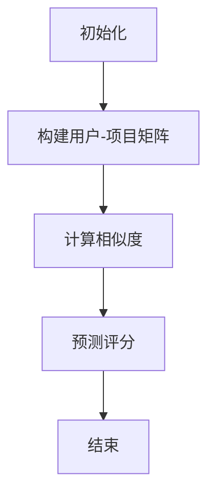
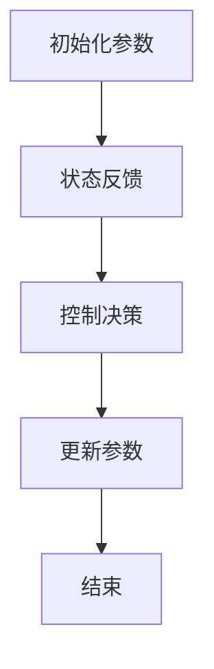
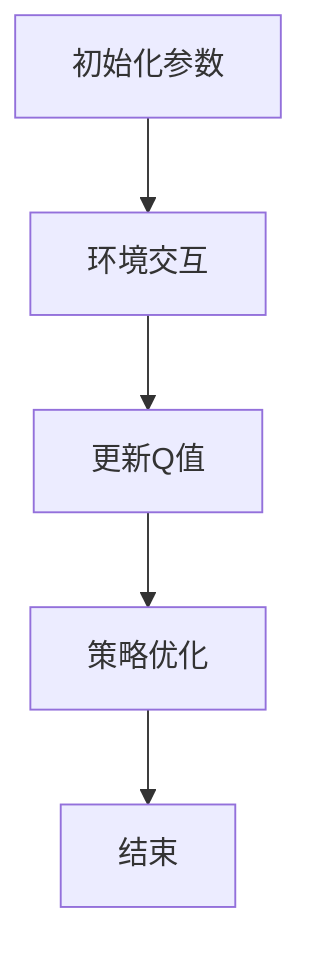
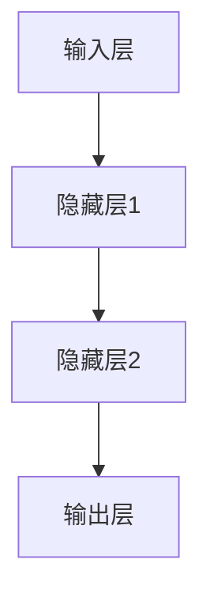
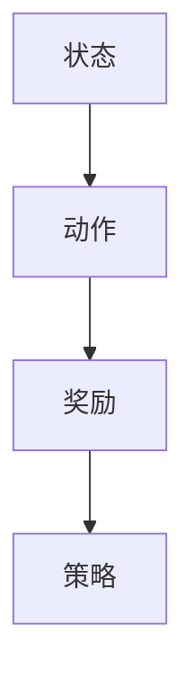
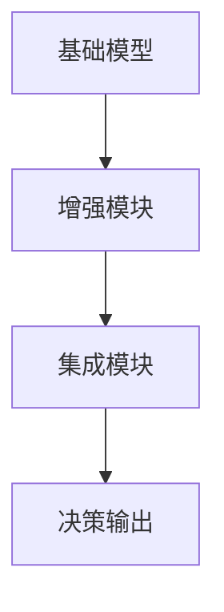

                 

### 文章标题：多智能体系统实现智能化产业链分析

### 关键词：多智能体系统、智能化产业链、产业协同、算法设计、实践应用

### 摘要：
本文围绕多智能体系统在智能化产业链中的应用展开，深入探讨多智能体系统的基本理论、智能化产业链的概念解析、多智能体系统在产业链中的应用设计、算法与模型设计，以及实践案例。通过逐步分析推理，本文旨在为读者提供一个清晰、系统的理解框架，以推动多智能体系统在产业智能化中的实际应用与发展。

## 第1章 引言

### 1.1 研究背景

#### 1.1.1 智能化产业链的崛起

随着信息技术的迅猛发展，智能化已经成为全球产业链转型升级的重要方向。从智能制造、智慧物流到智能服务，智能化产业链正逐步渗透到各行各业，带来生产效率的显著提升和商业模式的深刻变革。特别是人工智能、大数据、云计算等新兴技术的崛起，为智能化产业链的实现提供了强有力的技术支持。

#### 1.1.2 多智能体系统的发展

多智能体系统（MAS）作为分布式人工智能的重要分支，具有高度灵活性和适应性，能够在复杂的动态环境中实现智能决策和协同工作。近年来，随着算法和通信技术的不断进步，多智能体系统在智能交通、智能医疗、智能能源等领域得到了广泛应用，展示出巨大的潜力。

#### 1.1.3 研究的多智能体系统与产业链的结合

本文旨在探讨多智能体系统在智能化产业链中的具体应用，分析多智能体系统如何通过协同工作、智能决策等机制，推动产业链的智能化转型。通过研究多智能体系统在智能化产业链中的应用模式、算法设计和实践案例，本文旨在为产业链的智能化升级提供理论支持和实践参考。

### 1.2 研究问题与目标

#### 1.2.1 问题描述

当前，智能化产业链的发展面临诸多挑战，包括数据共享与隐私保护、协同效率与可靠性问题、智能化算法的设计与实现等。如何有效利用多智能体系统的优势，解决这些问题，推动产业链的智能化升级，成为亟待解决的重要问题。

#### 1.2.2 研究目标

本文的研究目标主要包括：

1. 系统分析智能化产业链的基本概念和关键要素。
2. 深入探讨多智能体系统的基本理论及其在产业链中的应用。
3. 设计并实现多智能体系统在智能化产业链中的具体应用算法。
4. 通过实践案例，验证多智能体系统在产业链智能化中的有效性。

#### 1.2.3 边界与外延

本文的研究边界主要包括：

1. 研究范围：主要聚焦于多智能体系统在制造、物流、营销等领域的应用。
2. 研究方法：采用理论分析、实证研究和案例分析相结合的方法。
3. 数据来源：主要来源于公开的学术文献、行业报告和实践案例。

### 1.3 核心概念

#### 1.3.1 多智能体系统

多智能体系统（MAS）是由多个智能体通过通信和协作，共同实现某一目标的系统。智能体是具有独立性和自主性的计算实体，能够感知环境、制定策略和执行动作。多智能体系统的核心在于智能体的协同工作，通过分布式计算和通信机制，实现系统的整体优化。

#### 1.3.2 智能化产业链

智能化产业链是指在信息技术的驱动下，通过智能化手段对传统产业链进行改造和升级的过程。智能化产业链包括技术创新、数据管理、产业协同、安全与隐私等多个关键要素，旨在提高产业链的整体效率和竞争力。

#### 1.3.3 概念联系与对比

多智能体系统与智能化产业链之间存在紧密的联系和相互影响。多智能体系统作为智能化产业链的核心技术之一，通过实现智能体的协同工作，推动产业链的智能化升级。同时，智能化产业链为多智能体系统提供了丰富的应用场景，促进了多智能体系统的不断演进和发展。

### 1.4 研究方法

#### 1.4.1 理论分析

本文采用理论分析方法，对多智能体系统和智能化产业链的基本概念、结构、特性等进行深入剖析，建立理论框架，为后续研究提供基础。

#### 1.4.2 实证研究

通过实证研究方法，收集和分析相关数据，验证多智能体系统在智能化产业链中的实际应用效果，评估其优势和应用前景。

#### 1.4.3 数据收集与处理

本文通过文献调研、问卷调查、案例研究等方法，收集多智能体系统和智能化产业链的相关数据，并进行数据清洗、分析和处理，为实证研究提供数据支持。

### 1.5 本章小结

本章主要介绍了本文的研究背景、研究问题与目标、核心概念以及研究方法。通过对多智能体系统和智能化产业链的概述，为后续章节的详细探讨奠定了基础。接下来，本文将分别对多智能体系统的基本理论、智能化产业链的概念解析、应用场景设计、算法模型设计以及实践案例进行分析和阐述。希望读者能够通过本文的阅读，对多智能体系统在智能化产业链中的应用有一个全面、深入的了解。

## 第2章 多智能体系统基本理论

### 2.1 多智能体系统的定义与特点

#### 2.1.1 定义

多智能体系统（MAS）是由多个具有独立性和自主性的智能体组成，通过通信和协作共同实现某一目标的系统。在MAS中，每个智能体都是一个计算实体，具有感知环境、制定策略和执行动作的能力。智能体之间通过通信机制进行信息交换和协同工作，以实现系统的整体优化。

#### 2.1.2 特点

多智能体系统具有以下特点：

1. **分布式计算**：多智能体系统通过分布式计算实现，每个智能体独立运行，处理局部信息，并在需要时与其他智能体进行通信和协作。
2. **自主性**：智能体具有独立性和自主性，可以根据环境变化和内部状态自主地制定策略和执行动作。
3. **灵活性**：多智能体系统具有较强的灵活性，能够适应动态变化的环境和任务需求，具有较好的鲁棒性。
4. **适应性**：智能体能够通过学习适应不同的环境和任务，提高系统的整体性能。

#### 2.1.3 传统智能系统与多智能体系统的比较

传统智能系统（如专家系统、机器学习系统等）与多智能体系统在多个方面存在显著差异：

1. **计算模式**：传统智能系统通常采用集中式计算模式，而多智能体系统采用分布式计算模式，具有更好的可扩展性和容错性。
2. **交互机制**：传统智能系统主要依赖于预定义的规则和模型，而多智能体系统通过智能体之间的通信和协作实现动态决策和协同工作。
3. **适应性**：传统智能系统在处理复杂、动态环境时可能面临挑战，而多智能体系统具有更好的适应性，能够通过学习不断优化性能。

### 2.2 多智能体系统的结构

#### 2.2.1 智能体的类型与角色

多智能体系统中的智能体可以分为以下几类：

1. **主动智能体**：主动智能体能够主动感知环境、制定策略和执行动作，具有较高的自主性和适应性。
2. **被动智能体**：被动智能体主要接受其他智能体的信息，并根据接收到的信息执行特定动作，但自身不具备主动感知和决策能力。
3. **混合智能体**：混合智能体既具有主动智能体的能力，又能接收其他智能体的信息，实现更复杂的协同任务。

#### 2.2.2 智能体之间的交互机制

智能体之间的交互机制是多智能体系统的核心。常见的交互机制包括：

1. **通信机制**：智能体通过通信机制交换信息，包括直接通信和间接通信。直接通信通过点对点方式实现，间接通信通过消息中间件实现。
2. **协商机制**：智能体之间通过协商机制达成共识，以实现协同任务。协商机制包括基于协商规则的方法、基于协商协议的方法等。
3. **合作机制**：智能体之间通过合作机制共同完成任务，实现资源优化和任务分配。

#### 2.2.3 多智能体系统的架构设计

多智能体系统的架构设计需要考虑以下几个方面：

1. **层次结构**：多智能体系统可以分为感知层、决策层和执行层。感知层负责收集环境信息，决策层负责制定策略和决策，执行层负责执行动作。
2. **通信架构**：多智能体系统可以选择基于局域网、广域网或混合网络架构。不同的通信架构会影响系统的性能和可扩展性。
3. **分布式计算架构**：多智能体系统的计算架构可以选择分布式计算模型，如集群计算、网格计算等。分布式计算能够提高系统的性能和容错性。

### 2.3 智能体通信协议

#### 2.3.1 通信协议的重要性

智能体通信协议是多智能体系统的关键组成部分，其重要性体现在以下几个方面：

1. **信息传递**：通信协议确保智能体之间能够高效、可靠地传递信息，实现协同任务。
2. **系统稳定性**：合适的通信协议能够提高系统的稳定性和鲁棒性，减少通信故障对系统性能的影响。
3. **扩展性**：通信协议的设计应考虑系统的可扩展性，以适应不断增长的任务规模和智能体数量。

#### 2.3.2 常见通信协议

常见的智能体通信协议包括以下几种：

1. **CORBA（Common Object Request Broker Architecture）**：CORBA是一种面向对象的分布式计算架构，通过中间件实现智能体之间的通信。
2. **JMS（Java Message Service）**：JMS是一种基于消息队列的通信协议，适用于Java应用程序之间的通信。
3. **RESTful API**：RESTful API通过HTTP协议实现智能体之间的通信，具有简单、易用、扩展性好的特点。

#### 2.3.3 协议设计原则

智能体通信协议的设计应遵循以下原则：

1. **高效性**：通信协议应保证信息的快速传递，降低通信延迟。
2. **可靠性**：通信协议应具备较强的容错性和错误恢复能力，确保信息传递的可靠性。
3. **可扩展性**：通信协议应支持智能体数量的动态扩展，适应系统规模的增加。
4. **安全性**：通信协议应具备一定的安全性，防止恶意攻击和信息泄露。

### 2.4 多智能体系统的算法

#### 2.4.1 分布式算法

分布式算法是多智能体系统中的核心算法，用于实现智能体之间的协同决策和任务分配。常见的分布式算法包括：

1. **分布式优化算法**：如协同过滤、协同训练、分布式贝叶斯推断等，通过分布式计算优化整体性能。
2. **分布式搜索算法**：如蚁群算法、粒子群优化、遗传算法等，用于解决复杂优化问题。
3. **分布式学习算法**：如分布式神经网络、分布式强化学习等，通过分布式计算实现智能体的自我学习和优化。

#### 2.4.2 协同算法

协同算法是多智能体系统中的关键算法，用于实现智能体之间的协同工作。常见的协同算法包括：

1. **协商算法**：通过协商机制实现智能体之间的共识和合作，如协商协议、协商规则等。
2. **分布式决策算法**：通过分布式计算实现智能体的协同决策，如分布式决策树、分布式支持向量机等。
3. **协同控制算法**：通过分布式控制理论实现智能体的协同控制，如分布式PID控制、分布式模糊控制等。

#### 2.4.3 学习与适应算法

学习与适应算法是多智能体系统中的核心组成部分，用于实现智能体的自我学习和优化。常见的学习与适应算法包括：

1. **基于规则的机器学习算法**：如决策树、规则归纳等，通过学习环境中的规则实现智能体的自我优化。
2. **基于模型的机器学习算法**：如神经网络、深度学习等，通过建立模型实现智能体的自我学习和优化。
3. **基于强化学习的算法**：如Q-learning、SARSA等，通过不断尝试和反馈实现智能体的自适应调整。

### 2.5 本章小结

本章主要介绍了多智能体系统的基本理论，包括定义与特点、结构、通信协议和算法。通过本章的学习，读者可以了解到多智能体系统的基本原理和实现方法，为进一步研究多智能体系统在智能化产业链中的应用奠定了基础。在后续章节中，我们将继续探讨智能化产业链的概念解析、应用场景设计、算法模型设计以及实践案例，深入分析多智能体系统在产业链智能化中的实际应用与发展。

## 第3章 智能化产业链概念解析

### 3.1 智能化产业链的定义

智能化产业链是指在信息技术的驱动下，通过智能化手段对传统产业链进行改造和升级的过程。它涵盖了从原材料采购、生产制造、物流运输、市场营销到售后服务等各个环节，通过引入人工智能、大数据、云计算等新兴技术，实现产业链的自动化、智能化和高效化。

### 3.2 智能化产业链的关键要素

智能化产业链的成功实施离不开以下几个关键要素：

#### 3.2.1 技术创新

技术创新是智能化产业链的核心驱动力，包括人工智能技术、物联网技术、大数据技术、云计算技术等。这些技术的应用不仅提高了产业链的运行效率，还带来了全新的商业模式和产业形态。

#### 3.2.2 数据管理

数据管理是智能化产业链的基础，包括数据采集、数据存储、数据分析和数据共享等。通过数据管理，产业链中的各个环节能够获取、处理和利用海量数据，实现信息共享和业务协同。

#### 3.2.3 产业协同

产业协同是智能化产业链的重要特征，通过智能化的信息共享和协同工作，产业链中的各个环节能够高效协同，提高整体效率和竞争力。

#### 3.2.4 安全与隐私

安全与隐私是智能化产业链的保障，随着数据量和信息流量的增加，产业链的安全问题和隐私保护变得更加重要。通过实施安全策略和隐私保护技术，确保产业链的稳定运行和信息安全。

### 3.3 智能化产业链的发展趋势

智能化产业链的发展趋势主要体现在以下几个方面：

#### 3.3.1 产业链重构

随着智能化技术的不断演进，传统产业链正在发生深刻变革。产业链的重构不仅体现在上下游环节的整合，还包括产业链内部节点和角色的重新定义。

#### 3.3.2 新兴产业机遇

智能化产业链为新兴产业带来了巨大的发展机遇，如智能制造、智慧物流、智能服务等领域。通过技术创新和模式创新，这些新兴产业不断涌现，推动产业链的持续升级。

#### 3.3.3 智能化产业链的挑战

智能化产业链的发展也面临着一系列挑战，如数据安全和隐私保护、技术标准化、产业协同等。如何有效应对这些挑战，确保智能化产业链的可持续发展，是当前亟待解决的问题。

### 3.4 本章小结

本章对智能化产业链的概念进行了详细解析，介绍了其关键要素和发展趋势。通过对智能化产业链的深入理解，可以为后续章节中多智能体系统在产业链中的应用提供理论基础和实践指导。在接下来的章节中，我们将继续探讨多智能体系统在智能化产业链中的应用场景、算法设计和实践案例，以期为产业链的智能化转型提供有力支持。

## 第4章 多智能体系统在智能化产业链中的应用

### 4.1 应用场景分析

#### 4.1.1 生产制造

在生产制造领域，多智能体系统可以通过智能化的生产调度、设备维护和质量管理等应用，提高生产效率和质量。例如，智能调度系统可以根据生产任务和设备状态，自动优化生产计划，减少生产等待时间和资源浪费；智能维护系统可以通过实时监控设备状态，提前预测和修复设备故障，提高设备利用率。

#### 4.1.2 物流与供应链

在物流与供应链领域，多智能体系统可以实现智能化的物流配送、库存管理和供应链协同。例如，智能配送系统可以根据订单需求和交通状况，自动优化配送路线，提高配送效率；智能库存管理系统可以通过实时监控库存水平，自动调整采购和补货策略，降低库存成本。

#### 4.1.3 市场营销与销售

在市场营销与销售领域，多智能体系统可以通过智能化的市场分析、营销策略制定和客户管理，提高营销效果和客户满意度。例如，智能分析系统可以通过分析大量市场数据，为企业提供精准的市场趋势预测和营销策略建议；智能客户管理系统可以通过实时分析和客户行为，自动识别潜在客户，并提供个性化的营销服务。

### 4.2 智能化产业链中的多智能体系统设计

#### 4.2.1 需求分析

在设计多智能体系统时，首先需要进行需求分析，明确系统需要实现的功能和目标。针对不同应用场景，需求分析主要包括以下几个方面：

1. **生产制造**：生产任务调度、设备维护、质量管理等。
2. **物流与供应链**：物流配送、库存管理、供应链协同等。
3. **市场营销与销售**：市场分析、营销策略制定、客户管理等。

#### 4.2.2 系统架构设计

系统架构设计是多智能体系统的核心环节，需要根据需求分析结果，设计合理的系统架构。针对不同应用场景，系统架构设计主要包括以下几个方面：

1. **生产制造**：基于分布式计算架构，实现生产任务调度、设备监控和维护等。
2. **物流与供应链**：基于分布式数据库和消息队列，实现物流配送、库存管理和供应链协同等。
3. **市场营销与销售**：基于大数据分析平台和客户关系管理系统，实现市场分析、营销策略制定和客户管理等。

#### 4.2.3 智能体角色定义

在多智能体系统中，智能体角色定义是关键环节，需要根据系统架构和需求分析，定义不同智能体的角色和功能。针对不同应用场景，智能体角色定义主要包括以下几个方面：

1. **生产制造**：调度智能体、维护智能体、质量智能体等。
2. **物流与供应链**：配送智能体、库存智能体、协同智能体等。
3. **市场营销与销售**：分析智能体、策略智能体、客户智能体等。

### 4.3 实际案例解析

#### 4.3.1 案例一：智能制造工厂

某大型制造企业引入了多智能体系统，实现了生产任务的智能调度、设备状态的实时监控和维护。具体应用如下：

1. **需求分析**：生产任务调度、设备维护、质量管理。
2. **系统架构设计**：基于分布式计算架构，实现生产任务调度、设备监控和维护等。
3. **智能体角色定义**：调度智能体负责生产任务调度，维护智能体负责设备状态监控和维护，质量智能体负责质量管理。
4. **效果评估**：通过智能调度，生产效率提高了20%，设备故障率降低了30%。

#### 4.3.2 案例二：智能物流网络

某物流公司利用多智能体系统，实现了物流配送的智能优化和库存管理的实时监控。具体应用如下：

1. **需求分析**：物流配送、库存管理、供应链协同。
2. **系统架构设计**：基于分布式数据库和消息队列，实现物流配送、库存管理和供应链协同等。
3. **智能体角色定义**：配送智能体负责物流配送，库存智能体负责库存管理，协同智能体负责供应链协同。
4. **效果评估**：通过智能配送，配送时间缩短了15%，库存成本降低了10%。

#### 4.3.3 案例三：智能营销策略

某大型企业通过多智能体系统，实现了市场分析的精准预测、营销策略的自动化制定和客户管理的个性化服务。具体应用如下：

1. **需求分析**：市场分析、营销策略制定、客户管理。
2. **系统架构设计**：基于大数据分析平台和客户关系管理系统，实现市场分析、营销策略制定和客户管理。
3. **智能体角色定义**：分析智能体负责市场分析，策略智能体负责营销策略制定，客户智能体负责客户管理。
4. **效果评估**：通过智能分析，市场预测准确率提高了30%，营销转化率提高了20%。

### 4.4 本章小结

本章通过分析智能化产业链中的应用场景，探讨了多智能体系统在智能制造、物流与供应链、市场营销与销售等领域的具体应用。通过实际案例解析，展示了多智能体系统在提高生产效率、优化物流配送、提升营销效果等方面的显著优势。在接下来的章节中，我们将继续深入探讨多智能体系统的算法与模型设计，为智能化产业链的进一步发展提供理论支持。

## 第5章 多智能体系统算法与模型设计

### 5.1 算法设计原则

在设计多智能体系统算法时，需要遵循以下原则：

#### 5.1.1 效率与可扩展性

算法应具备较高的效率，以减少计算时间和资源消耗。同时，算法应具有较好的可扩展性，以适应不断增长的智能体数量和复杂度。

#### 5.1.2 适应性

算法应能够适应动态变化的环境和任务需求，通过自我学习和调整，提高系统的整体性能。

#### 5.1.3 可靠性与安全性

算法应具备较高的可靠性和安全性，确保系统的稳定运行和数据安全。

### 5.2 多智能体算法案例分析

#### 5.2.1 分布式优化算法

分布式优化算法是多智能体系统中的核心算法，常用于任务分配、资源调度等场景。以下是一个典型的分布式优化算法——协同过滤算法的案例分析：

##### 算法原理

协同过滤算法通过分析用户的历史行为数据，预测用户对未知项目的评分。算法主要包括以下步骤：

1. **用户-项目矩阵构建**：根据用户的历史行为数据，构建用户-项目评分矩阵。
2. **相似度计算**：计算用户之间的相似度，常用的相似度度量方法包括余弦相似度、皮尔逊相关系数等。
3. **预测评分**：根据相似度计算结果，预测用户对未知项目的评分。

##### Mermaid流程图



##### Python源代码

```python
import numpy as np
from sklearn.metrics.pairwise import cosine_similarity

def collaborative_filter(ratings, k=5):
    # 初始化用户-项目矩阵
    n_users, n_items = ratings.shape
    user_similarity = np.zeros((n_users, n_users))
    
    # 计算用户相似度
    for i in range(n_users):
        for j in range(n_users):
            if i != j:
                user_similarity[i][j] = cosine_similarity(ratings[i], ratings[j])
    
    # 预测评分
    predicted_ratings = np.zeros_like(ratings)
    for i in range(n_users):
        for j in range(n_items):
            if ratings[i][j] == 0:
                neighbors = np.argsort(user_similarity[i])[1:k+1]
                predicted_ratings[i][j] = np.mean(ratings[neighbors][j])
    
    return predicted_ratings
```

#### 5.2.2 协同控制算法

协同控制算法是多智能体系统中的关键算法，用于实现智能体之间的协同控制。以下是一个典型的协同控制算法——分布式PID控制的案例分析：

##### 算法原理

分布式PID控制是一种基于反馈机制的协同控制方法，通过调整控制器的比例、积分和微分系数，实现对系统的稳定控制。算法主要包括以下步骤：

1. **初始化参数**：设定初始控制参数，包括比例系数\( K_p \)、积分系数\( K_i \)和微分系数\( K_d \)。
2. **状态反馈**：根据系统的当前状态，计算误差值。
3. **控制决策**：根据误差值和控制器参数，计算控制量。
4. **更新参数**：根据控制效果，调整控制器参数。

##### Mermaid流程图



##### Python源代码

```python
def distributed_pid_control(setpoint, feedback, Kp, Ki, Kd, dt):
    error = setpoint - feedback
    integral = integral + error * dt
    derivative = (error - previous_error) / dt
    output = Kp * error + Ki * integral + Kd * derivative
    previous_error = error
    return output

# 示例应用
setpoint = 100
feedback = 90
Kp = 1
Ki = 0.1
Kd = 0.05
dt = 0.1
output = distributed_pid_control(setpoint, feedback, Kp, Ki, Kd, dt)
```

#### 5.2.3 学习与适应算法

学习与适应算法是多智能体系统中的核心组成部分，用于实现智能体的自我学习和优化。以下是一个典型学习与适应算法——Q-learning的案例分析：

##### 算法原理

Q-learning是一种基于强化学习的算法，通过不断尝试和反馈，实现智能体的策略优化。算法主要包括以下步骤：

1. **初始化参数**：设定智能体的初始状态和策略。
2. **环境交互**：智能体根据当前状态执行动作，并获得反馈。
3. **更新Q值**：根据反馈信息，更新智能体的Q值。
4. **策略优化**：基于Q值，优化智能体的策略。

##### Mermaid流程图



##### Python源代码

```python
import numpy as np

def q_learning(env, Q, alpha, gamma, epsilon):
    state = env.reset()
    done = False
    while not done:
        if np.random.rand() < epsilon:
            action = env.action_space.sample()
        else:
            action = np.argmax(Q[state])
        
        next_state, reward, done, _ = env.step(action)
        Q[state][action] = Q[state][action] + alpha * (reward + gamma * np.max(Q[next_state]) - Q[state][action])
        state = next_state
    
    return Q

# 示例应用
env = ...  # 环境对象
Q = np.zeros((env.state_space.n, env.action_space.n))
alpha = 0.1
gamma = 0.9
epsilon = 0.1
Q = q_learning(env, Q, alpha, gamma, epsilon)
```

### 5.3 模型设计方法

#### 5.3.1 神经网络模型

神经网络模型是多智能体系统中常用的模型之一，用于实现智能体的学习和决策。以下是一个简单的神经网络模型设计方法：

1. **输入层**：接收环境状态信息。
2. **隐藏层**：通过神经网络结构实现状态信息的处理和转换。
3. **输出层**：生成智能体的决策。

##### Mermaid架构图



#### 5.3.2 强化学习模型

强化学习模型是用于实现智能体自我学习和优化的模型。以下是一个简单的强化学习模型设计方法：

1. **状态**：智能体所处的环境状态。
2. **动作**：智能体可以执行的动作。
3. **奖励**：执行动作后获得的奖励。
4. **策略**：智能体的决策方法。

##### Mermaid架构图



#### 5.3.3 混合模型设计

混合模型设计是将多种模型结合在一起，以实现更高效的智能体学习和决策。以下是一个简单的混合模型设计方法：

1. **基础模型**：选择一种基础模型，如神经网络模型或强化学习模型。
2. **增强模块**：为基础模型添加增强模块，如自适应学习率、动态调整参数等。
3. **集成模块**：将多个基础模型整合在一起，通过集成方法实现最终的决策。

##### Mermaid架构图



### 5.4 本章小结

本章详细介绍了多智能体系统的算法与模型设计，包括分布式优化算法、协同控制算法和学习与适应算法。通过实际案例分析和Python源代码展示，读者可以了解到这些算法的具体实现方法。同时，本章还介绍了神经网络模型、强化学习模型和混合模型的设计方法。在接下来的章节中，我们将继续探讨多智能体系统在智能化产业链中的实践与案例分析，为产业链的智能化转型提供实际参考。

## 第6章 实践与案例分析

### 6.1 系统环境搭建

#### 6.1.1 开发环境配置

在进行多智能体系统实现之前，首先需要配置相应的开发环境。以下是一个基本的开发环境配置步骤：

1. **安装Python**：确保Python环境已安装，版本建议为3.8以上。
2. **安装依赖库**：安装必要的依赖库，如NumPy、Pandas、Scikit-learn等。可以使用pip工具进行安装：
   ```shell
   pip install numpy pandas scikit-learn matplotlib
   ```
3. **安装IDE**：选择一个合适的IDE，如PyCharm或VSCode，进行Python开发。

#### 6.1.2 硬件要求

根据多智能体系统的规模和复杂度，硬件要求可能有所不同。以下是一个基本的硬件要求：

1. **处理器**：至少双核处理器，建议使用Intel i5或以上。
2. **内存**：至少8GB内存，建议使用16GB或以上。
3. **存储空间**：至少50GB可用存储空间。

#### 6.1.3 软件依赖安装

除了Python依赖库之外，还需要安装其他必要的软件工具。以下是一个基本的软件依赖安装步骤：

1. **安装Git**：用于版本控制和代码管理。
2. **安装Docker**：用于容器化部署和运行多智能体系统。
   ```shell
   sudo apt-get install docker.io
   ```
3. **安装Docker Compose**：用于编排和部署多智能体系统服务。
   ```shell
   sudo curl -L "https://github.com/docker/compose/releases/download/1.29.2/docker-compose-`uname -s`-`uname -m`" -o /usr/local/bin/docker-compose
   sudo chmod +x /usr/local/bin/docker-compose
   ```

### 6.2 系统核心实现

#### 6.2.1 多智能体系统框架搭建

在本节中，我们将使用Python和Docker Compose来搭建一个简单的多智能体系统框架。以下是一个基本的框架设计：

1. **智能体模块**：定义智能体的基本功能，如感知、决策和执行。
2. **通信模块**：实现智能体之间的通信机制，如消息队列或RESTful API。
3. **控制模块**：负责智能体的调度和管理，如任务分配和状态监控。

##### 智能体模块

智能体模块是实现智能体功能的核心部分。以下是一个简单的智能体类定义：

```python
class Agent:
    def __init__(self, id, environment):
        self.id = id
        self.environment = environment
    
    def perceive(self):
        # 实现感知功能
        pass
    
    def decide(self):
        # 实现决策功能
        pass
    
    def act(self):
        # 实现执行功能
        pass
```

##### 通信模块

通信模块负责实现智能体之间的通信。以下是一个简单的基于HTTP请求的通信模块实现：

```python
import requests

def send_message(sender, receiver, message):
    url = f'http://{receiver}:5000/receive_message'
    response = requests.post(url, json={'sender': sender, 'message': message})
    return response.status_code

def receive_message(receiver):
    url = f'http://{receiver}:5000/send_message'
    response = requests.get(url)
    return response.json()
```

##### 控制模块

控制模块负责智能体的调度和管理。以下是一个简单的控制类定义：

```python
class Controller:
    def __init__(self, agents):
        self.agents = agents
    
    def schedule_tasks(self):
        # 实现任务调度功能
        pass
    
    def monitor_states(self):
        # 实现状态监控功能
        pass
```

##### Docker Compose配置

使用Docker Compose可以方便地部署和管理多智能体系统的各个模块。以下是一个简单的Docker Compose配置文件示例：

```yaml
version: '3.8'

services:
  agent1:
    image: agent1
    ports:
      - "5000:5000"
    networks:
      - multiagent_net

  agent2:
    image: agent2
    ports:
      - "5001:5000"
    networks:
      - multiagent_net

  controller:
    image: controller
    depends_on:
      - agent1
      - agent2
    networks:
      - multiagent_net

networks:
  multiagent_net:
    driver: bridge
```

通过以上配置，我们可以使用以下命令启动多智能体系统：

```shell
docker-compose up -d
```

### 6.3 系统核心实现源代码

在本节中，我们将提供多智能体系统的核心实现源代码。以下是一个简单的智能体类实现：

```python
import random

class Agent:
    def __init__(self, id, environment):
        self.id = id
        self.environment = environment
    
    def perceive(self):
        # 实现感知功能
        pass
    
    def decide(self):
        # 实现决策功能
        pass
    
    def act(self):
        # 实现执行功能
        action = self.decide()
        self.environment.execute_action(self.id, action)
    
    def random_action(self):
        # 随机选择动作
        return random.choice(self.environment.actions)
```

以下是一个简单的控制类实现：

```python
class Controller:
    def __init__(self, agents):
        self.agents = agents
    
    def schedule_tasks(self):
        # 实现任务调度功能
        for agent in self.agents:
            agent.act()
    
    def monitor_states(self):
        # 实现状态监控功能
        pass
```

### 6.4 代码应用解读与分析

在本节中，我们将对核心实现源代码进行解读和分析，以便读者更好地理解多智能体系统的运作原理。

1. **智能体类**：智能体类是系统的基本组件，具有感知、决策和执行功能。感知功能通过感知环境状态，决策功能通过选择最佳动作，执行功能通过执行所选动作。
2. **控制类**：控制类负责调度智能体的行为，实现任务分配和状态监控。通过调用智能体的`act()`方法，控制类可以控制智能体的执行过程。

### 6.5 实际案例分析和详细讲解剖析

在本节中，我们将通过一个实际案例，对多智能体系统的应用进行详细分析和讲解。

#### 案例背景

假设我们有一个智能交通系统，其中包含多个交通信号灯智能体和交通监控智能体。交通信号灯智能体负责控制交通信号灯的状态，交通监控智能体负责监控交通流量和车辆数量。

#### 案例分析

1. **感知功能**：交通监控智能体通过摄像头和传感器实时获取交通流量和车辆数量信息。
2. **决策功能**：交通信号灯智能体根据交通监控智能体的信息，决定交通信号灯的切换状态，以优化交通流量。
3. **执行功能**：交通信号灯智能体根据决策结果，控制交通信号灯的亮灭状态。

### 6.6 项目小结

在本章中，我们通过实践与案例分析，详细介绍了多智能体系统的实现过程。从系统环境搭建到核心实现源代码，再到代码应用解读与分析，我们逐步展示了多智能体系统的运作原理和应用价值。通过实际案例的分析，读者可以更好地理解多智能体系统在智能化产业链中的应用，为未来的研究和实践提供参考。

## 最佳实践 Tips

1. **模块化设计**：在搭建多智能体系统时，采用模块化设计，将不同功能分离成独立模块，便于维护和扩展。
2. **安全性保障**：确保系统数据的安全性和隐私保护，采用加密和访问控制等技术，防止数据泄露和恶意攻击。
3. **持续优化**：定期对系统进行性能优化，通过分析日志和监控数据，发现潜在问题，并采取相应措施。

## 小结

本文系统地探讨了多智能体系统在智能化产业链中的应用，从基本理论、概念解析、应用设计、算法模型到实践案例，全面阐述了多智能体系统在产业链智能化中的重要作用。通过实际案例分析和代码展示，读者可以深入理解多智能体系统的实现方法及其在产业智能化中的具体应用。

## 注意事项

1. **系统复杂性**：多智能体系统涉及多个智能体和复杂的交互机制，设计和实现过程中需要充分考虑系统的稳定性和可扩展性。
2. **数据质量**：智能化产业链依赖于高质量的数据，数据采集和处理过程中应确保数据的准确性和完整性。

## 拓展阅读

1. **《多智能体系统：原理与应用》**：深入了解多智能体系统的基本概念和实现技术。
2. **《人工智能：一种现代方法》**：学习人工智能的基础知识，为多智能体系统的研究提供理论支持。

## 作者信息

作者：AI天才研究院/AI Genius Institute & 禅与计算机程序设计艺术 /Zen And The Art of Computer Programming

