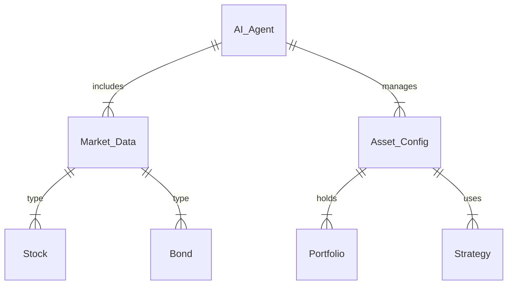
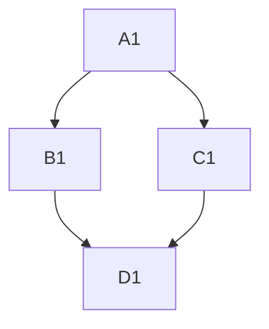
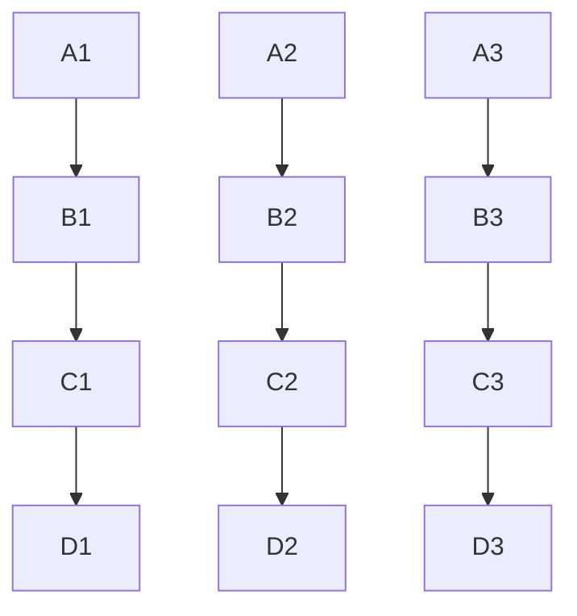
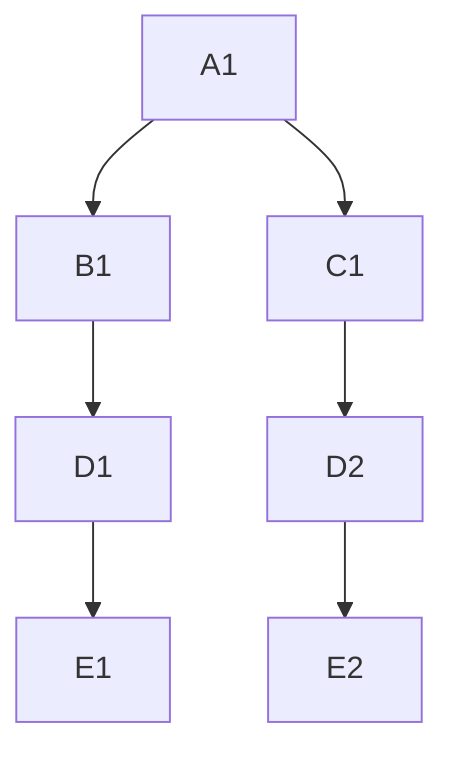
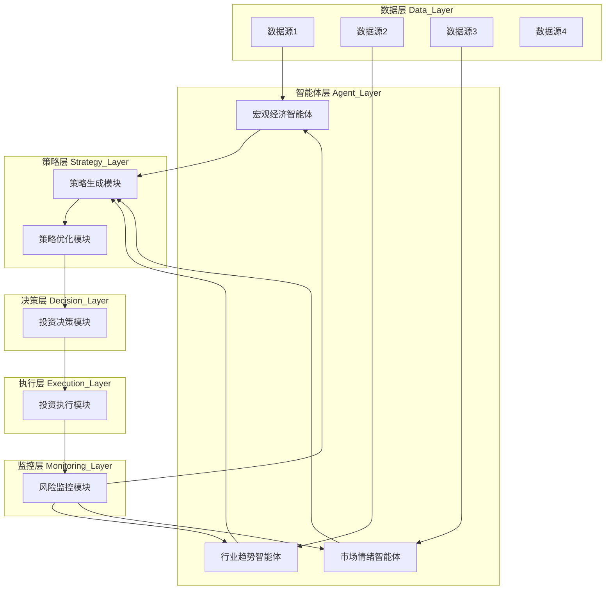

                 

## 文章标题

### 多智能体系统实现智能化全球资产配置

> 关键词：多智能体系统、全球资产配置、智能化、算法、实现方法、应用案例

> 摘要：本文将深入探讨多智能体系统在实现智能化全球资产配置中的应用。首先，我们将介绍多智能体系统的基本原理，随后详细分析其在全球资产配置中的优势与挑战。通过具体的应用案例，我们将展示如何利用多智能体系统进行智能化全球资产配置，并提供一系列优化策略和技术实现方法。最后，本文将总结多智能体系统在资产配置中的价值，并展望其未来的发展趋势。

----------------------------------------------------------------

### 目录大纲

1. **背景介绍**
    1.1 问题背景
    1.2 问题描述
    1.3 问题解决
    1.4 边界与外延
    1.5 概念结构与核心要素组成

2. **多智能体系统的基本原理**
    2.1 多智能体系统的定义
    2.2 多智能体系统的通信机制
    2.3 多智能体系统的协同策略

3. **多智能体系统在资产配置中的应用**
    3.1 全球资产配置的基本概念
    3.2 多智能体系统在资产配置中的作用
    3.3 多智能体系统在资产配置中的实现方法

4. **多智能体系统在资产配置中的策略与优化**
    4.1 资产配置策略分析
    4.2 多智能体系统的优化方法
    4.3 资产配置策略评估与调整

5. **多智能体系统的技术实现**
    5.1 多智能体系统的平台选择
    5.2 多智能体系统的开发环境搭建
    5.3 多智能体系统的核心代码实现

6. **多智能体系统在资产配置中的应用案例分析**
    6.1 案例背景介绍
    6.2 案例系统功能设计
    6.3 案例系统架构设计
    6.4 案例代码实现与分析
    6.5 案例总结与启示

7. **结论与未来展望**
    7.1 研究结论
    7.2 未来展望
    7.3 小结

----------------------------------------------------------------

## 第1章 背景介绍

### 1.1 问题背景

全球资产配置是指投资者根据全球经济形势、市场变化和个人风险偏好，在全球范围内对资产进行合理分配和调整的过程。随着全球化的加深和经济一体化的推进，全球资产配置的重要性日益凸显。合理的全球资产配置不仅可以降低投资组合的风险，还能实现资产的保值增值。

然而，全球资产配置面临诸多挑战。首先，全球市场的复杂性不断增加，资产价格波动性加大，投资者难以准确预测市场走势。其次，信息的不对称性和投资渠道的限制使得投资者难以全面了解全球市场的动态。此外，全球资产配置需要考虑货币汇率、政策变化、地缘政治等多重因素，使得投资决策更加复杂。

在此背景下，智能化全球资产配置的需求日益强烈。通过引入人工智能、大数据分析等先进技术，可以实现全球资产配置的智能化，提高投资决策的准确性和效率。多智能体系统作为一种先进的人工智能技术，具有协同智能、自组织学习和自适应优化等特点，为实现智能化全球资产配置提供了有力支持。

### 1.2 问题描述

多智能体系统（MAS）是一种由多个智能体组成的分布式系统，这些智能体可以在复杂环境中自主决策、交互和学习。在智能全球资产配置中，多智能体系统的作用主要体现在以下几个方面：

1. **协同决策**：通过多个智能体的协同工作，可以更全面、准确地分析全球市场动态，制定科学的资产配置策略。
2. **自组织学习**：智能体通过不断学习和适应市场变化，能够动态调整资产配置策略，提高投资组合的适应性和灵活性。
3. **自适应优化**：多智能体系统能够根据市场数据和投资绩效，自适应地优化资产配置策略，实现风险控制和收益最大化。

然而，多智能体系统在实现智能化全球资产配置过程中也面临一些问题。首先，智能体之间的通信和协调是一个复杂的过程，需要有效的通信机制和协同策略。其次，全球资产配置需要处理大量的市场数据和复杂的经济模型，这对多智能体系统的计算能力和数据处理能力提出了较高要求。此外，多智能体系统的决策和优化过程可能受到不确定性和动态变化的影响，如何确保系统在复杂环境下稳定运行也是一个重要挑战。

### 1.3 问题解决

为了解决上述问题，实现智能化全球资产配置，可以采取以下措施：

1. **构建高效的通信机制**：通过设计合理的通信协议和算法，实现智能体之间的有效通信和协同工作，提高系统的整体效率。
2. **利用大数据分析技术**：收集并处理海量的市场数据，运用大数据分析技术进行趋势分析和预测，为智能体提供准确、及时的信息支持。
3. **开发自适应优化算法**：结合机器学习和优化算法，设计自适应的资产配置策略，使系统能够动态调整并适应市场变化。
4. **确保系统的鲁棒性**：通过引入冗余设计和故障恢复机制，提高多智能体系统的鲁棒性和可靠性，确保系统在复杂环境下的稳定运行。

### 1.4 边界与外延

全球资产配置的范围涉及股票、债券、基金、房地产等多种资产类别，涵盖发达国家、新兴市场等不同地区。多智能体系统的应用场景包括金融机构、投资公司、财富管理机构等。在实现智能化全球资产配置过程中，需要关注以下几个方面：

1. **市场数据收集**：确保数据来源的多样性和准确性，涵盖宏观经济、行业趋势、市场情绪等多维度信息。
2. **算法模型选择**：根据投资目标和风险偏好，选择合适的算法模型，如风险平价模型、优化调仓模型等。
3. **系统部署与运维**：建立稳定的系统架构，确保系统的可扩展性和高性能，实现实时数据处理和决策。

### 1.5 概念结构与核心要素组成

多智能体系统实现智能化全球资产配置的核心概念和要素包括：

1. **智能体**：作为系统的基本单元，智能体具备自主决策、交互和学习能力。
2. **通信机制**：实现智能体之间的信息交换和协同工作，常用的通信机制包括消息传递、共享数据库等。
3. **协同策略**：通过协同策略实现智能体的有效协作，常用的协同策略包括合作博弈、协同过滤等。
4. **算法模型**：用于资产配置的算法模型，如均值方差模型、风险平价模型等。
5. **数据来源**：包括市场数据、宏观经济数据、行业数据等，用于智能体的决策和优化。
6. **决策与优化**：通过机器学习和优化算法，实现资产配置策略的动态调整和优化。

通过以上核心概念和要素的有机结合，多智能体系统可以实现智能化全球资产配置，为投资者提供科学、高效的投资决策。

## 第2章 多智能体系统的基本原理

### 2.1 多智能体系统的定义

多智能体系统（Multi-Agent System，MAS）是一种由多个智能体组成的分布式系统，这些智能体在复杂环境中通过自主决策、交互和学习，以实现特定目标。多智能体系统具有以下几个核心特点：

1. **自治性**：每个智能体都是独立的计算实体，具有自主决策和行动的能力。
2. **异质性**：智能体可能具有不同的结构和行为模式，具备不同的能力和知识。
3. **协同性**：智能体之间可以通过通信和协作，共同完成任务。
4. **适应性**：智能体能够根据环境变化和任务需求，调整自身的行为和策略。

多智能体系统在多个领域都有广泛应用，包括分布式计算、智能交通、社会模拟等。在智能化全球资产配置中，多智能体系统可以模拟不同投资者的行为，通过协同工作，实现资产配置的优化和风险控制。

### 2.2 多智能体系统的通信机制

多智能体系统的通信机制是实现智能体之间信息交换和协同工作的关键。常用的通信机制包括：

1. **直接通信**：智能体通过直接消息传递进行通信，适用于小规模或相对静态的系统。
2. **间接通信**：智能体通过共享全局数据或中间件进行通信，适用于大规模或动态变化的系统。
3. **分布式计算**：利用分布式计算框架，如消息队列、分布式数据库等，实现智能体之间的高效通信。

直接通信的优点在于通信延迟低，适用于实时性要求较高的场景；而间接通信则具有更好的可扩展性和容错性，适用于大规模系统。在实际应用中，可以根据具体需求选择合适的通信机制。

### 2.3 多智能体系统的协同策略

协同策略是多智能体系统实现协同工作的关键。以下是一些常见的协同策略：

1. **合作博弈**：智能体通过合作博弈，在共享利益的基础上，共同完成任务。
2. **协同过滤**：智能体通过协同过滤算法，利用用户历史数据，进行推荐和预测。
3. **分布式决策**：智能体通过分布式决策算法，在局部信息的基础上，实现全局优化。

合作博弈适用于需要共享资源和协同完成任务的场景，如分布式计算和智能交通；协同过滤适用于推荐系统和数据分析领域；分布式决策适用于复杂优化问题和多目标决策问题。

通过合理的通信机制和协同策略，多智能体系统能够实现高效的信息交换和协同工作，为智能化全球资产配置提供强有力的支持。

### 2.4 多智能体系统架构的ER实体关系图

为了更好地理解多智能体系统的架构，我们可以使用ER（Entity-Relationship，实体关系）图来表示系统的各个实体及其关系。以下是一个简化的多智能体系统ER实体关系图：



**实体说明：**

- **AI_Agent**：代表智能体，具有自治性和协同性。
- **Market_Data**：包含市场数据，如股票、债券等。
- **Asset_Config**：代表资产配置策略和组合。
- **Portfolio**：投资组合，由资产组成。
- **Strategy**：资产配置策略，用于指导投资决策。

**关系说明：**

- **includes**：表示市场数据包括股票和债券等类型。
- **manages**：表示智能体管理资产配置策略和组合。
- **holds**：表示投资组合包含多个资产。
- **uses**：表示策略被用于指导投资决策。

通过ER实体关系图，我们可以清晰地看到多智能体系统中各个实体及其关系，有助于理解系统的整体架构和功能模块。

### 2.5 多智能体系统的算法原理

多智能体系统的算法原理是其实现智能化全球资产配置的核心。以下是一些关键算法原理：

#### 2.5.1 贝叶斯网络

贝叶斯网络是一种概率图模型，用于表示变量之间的依赖关系。在多智能体系统中，贝叶斯网络可以用于预测市场风险和资产收益。以下是贝叶斯网络的简化流程图：



**实体说明：**

- **A1**：表示宏观经济因素。
- **B1**：表示行业趋势。
- **C1**：表示市场情绪。
- **D1**：表示资产收益。

**关系说明：**

- **A1 --> B1**：表示宏观经济因素对行业趋势有影响。
- **A1 --> C1**：表示宏观经济因素对市场情绪有影响。
- **B1 --> D1**：表示行业趋势对资产收益有影响。
- **C1 --> D1**：表示市场情绪对资产收益有影响。

贝叶斯网络通过计算概率分布，可以预测资产收益的概率分布，从而为智能体提供决策依据。

#### 2.5.2 优化算法

优化算法用于实现资产配置的优化目标，如最小化风险或最大化收益。常用的优化算法包括遗传算法、粒子群优化算法和梯度下降算法等。以下是遗传算法的简化流程图：



**实体说明：**

- **A1, A2, A3**：表示三个不同的资产配置方案。
- **B1, B2, B3**：表示这三个方案对应的收益和风险。
- **C1, C2, C3**：表示这三个方案的适应度值。
- **D1, D2, D3**：表示优化后的资产配置方案。

**关系说明：**

- **A1 --> B1**：表示第一个方案对应的收益和风险。
- **A2 --> B2**：表示第二个方案对应的收益和风险。
- **A3 --> B3**：表示第三个方案对应的收益和风险。
- **B1 --> C1**：表示第一个方案的适应度值。
- **B2 --> C2**：表示第二个方案的适应度值。
- **B3 --> C3**：表示第三个方案的适应度值。
- **C1 --> D1**：表示优化后的第一个资产配置方案。
- **C2 --> D2**：表示优化后的第二个资产配置方案。
- **C3 --> D3**：表示优化后的第三个资产配置方案。

遗传算法通过迭代计算，逐步优化资产配置方案，直至满足优化目标。

#### 2.5.3 强化学习

强化学习是一种通过试错和反馈进行学习的方法，适用于动态环境下的决策问题。在多智能体系统中，强化学习可以用于智能体的策略优化。以下是强化学习的简化流程图：



**实体说明：**

- **A1**：表示智能体的动作。
- **B1**：表示智能体的状态。
- **C1**：表示环境的状态。
- **D1, D2**：表示智能体的奖励。
- **E1, E2**：表示智能体的策略更新。

**关系说明：**

- **A1 --> B1**：表示智能体的动作影响状态。
- **A1 --> C1**：表示智能体的动作影响环境状态。
- **B1 --> D1**：表示状态影响奖励。
- **C1 --> D2**：表示环境状态影响奖励。
- **D1 --> E1**：表示奖励影响策略更新。
- **D2 --> E2**：表示奖励影响策略更新。

强化学习通过不断尝试和调整策略，使智能体在动态环境中实现最优决策。

通过贝叶斯网络、优化算法和强化学习等算法原理，多智能体系统能够实现智能化全球资产配置，为投资者提供科学、高效的决策支持。

### 2.6 多智能体系统的协同策略设计

协同策略是多智能体系统实现高效协作和协同决策的关键。以下是几种常见的协同策略设计，以及它们的实现步骤和优点：

#### 2.6.1 合作博弈

合作博弈是通过智能体之间的合作，共同实现全局最优目标。以下是其实现步骤：

1. **目标定义**：明确智能体的共同目标，如最大化总收益或最小化总风险。
2. **策略设计**：设计合作策略，使智能体在合作中实现利益最大化。
3. **收益分配**：根据智能体的贡献，进行收益分配，确保公平性和激励。

合作博弈的优点是能够实现全局最优，但需要智能体具有高度的合作意愿和协调机制。

#### 2.6.2 协同过滤

协同过滤是通过智能体之间的协同工作，进行推荐和预测。以下是其实现步骤：

1. **数据收集**：收集智能体的历史行为数据，如交易记录和评价信息。
2. **相似性计算**：计算智能体之间的相似性，如基于用户行为或内容的相似度。
3. **推荐生成**：根据相似性计算结果，生成推荐列表，提供决策支持。

协同过滤的优点是能够基于历史数据和用户行为进行个性化推荐，提高决策的准确性和用户满意度。

#### 2.6.3 分布式决策

分布式决策是智能体在局部信息基础上，实现全局优化。以下是其实现步骤：

1. **局部决策**：智能体根据局部信息，做出局部最优决策。
2. **全局优化**：通过全局优化算法，如遗传算法或粒子群优化算法，实现全局最优。
3. **反馈调整**：根据全局优化结果，调整局部决策，实现动态调整。

分布式决策的优点是能够充分利用局部信息，实现高效的全局优化，但需要解决信息传递和协调问题。

#### 2.6.4 混合策略

混合策略是将不同协同策略结合，实现更灵活和高效的协作。以下是其实现步骤：

1. **策略选择**：根据具体场景，选择合适的协同策略。
2. **策略融合**：将不同策略的结果进行融合，生成综合决策。
3. **动态调整**：根据环境变化和任务需求，动态调整策略。

混合策略的优点是能够灵活适应不同场景，提高决策的适应性和灵活性。

通过合理设计协同策略，多智能体系统能够实现高效的信息交换和协同工作，为智能化全球资产配置提供有力支持。

### 2.7 多智能体系统在资产配置中的协同算法示例

为了更好地理解多智能体系统在资产配置中的协同算法，我们将使用Python实现一个简单的协同过滤算法示例。此示例将展示如何通过协同工作，实现资产配置的优化。

#### 2.7.1 数据准备

首先，我们需要准备一些模拟数据，包括用户对资产的评分数据。以下是一个简单的数据集示例：

```python
# 用户-资产评分数据
user_item_ratings = {
    'user1': {'stock1': 4, 'stock2': 2, 'stock3': 5},
    'user2': {'stock1': 3, 'stock2': 4, 'stock3': 1},
    'user3': {'stock1': 5, 'stock2': 5, 'stock3': 5},
    'user4': {'stock1': 2, 'stock2': 3, 'stock3': 4},
    'user5': {'stock1': 1, 'stock2': 5, 'stock3': 3},
}
```

#### 2.7.2 相似性计算

接下来，我们将计算用户之间的相似性，使用皮尔逊相关系数作为相似性度量。以下是计算相似性的函数：

```python
import numpy as np

def compute_similarity(ratings1, ratings2):
    common_items = set(ratings1.keys()).intersection(set(ratings2.keys()))
    if not common_items:
        return 0
    item_scores_diff = [ratings1[item] - ratings2[item] for item in common_items]
    sum_squared_diff = sum([x ** 2 for x in item_scores_diff])
    return 1 if sum_squared_diff == 0 else np.corrcoef([ratings1[item] for item in common_items], [ratings2[item] for item in common_items])[0, 1]
```

#### 2.7.3 推荐生成

基于相似性计算结果，我们可以为每个用户生成资产推荐。以下是推荐生成的函数：

```python
def generate_recommendations(user_item_ratings, similarity_matrix, k=2):
    recommendations = {}
    for user, items in user_item_ratings.items():
        neighbor_scores = {}
        for other_user, similarity in enumerate(similarity_matrix[user]):
            if similarity > 0:
                for item, rating in items.items():
                    if item not in user_item_ratings[other_user]:
                        neighbor_score = similarity * (user_item_ratings[other_user][item] - rating)
                        neighbor_scores[item] = neighbor_scores.get(item, 0) + neighbor_score
        sorted_recommendations = sorted(neighbor_scores.items(), key=lambda x: x[1], reverse=True)
        recommendations[user] = [item for item, score in sorted_recommendations[:k]]
    return recommendations
```

#### 2.7.4 算法实现

最后，我们将实现整个协同过滤算法，并打印出推荐结果。以下是算法实现：

```python
def collaborative_filtering(user_item_ratings, k=2):
    # 计算用户相似性矩阵
    num_users = len(user_item_ratings)
    similarity_matrix = np.zeros((num_users, num_users))
    for i in range(num_users):
        for j in range(i, num_users):
            similarity_matrix[i][j] = compute_similarity(user_item_ratings[i], user_item_ratings[j])
            similarity_matrix[j][i] = similarity_matrix[i][j]
    
    # 生成推荐
    recommendations = generate_recommendations(user_item_ratings, similarity_matrix, k)
    
    # 打印推荐结果
    for user, recs in recommendations.items():
        print(f"User {user} Recommendations: {recs}")

# 示例数据
user_item_ratings = {
    'user1': {'stock1': 4, 'stock2': 2, 'stock3': 5},
    'user2': {'stock1': 3, 'stock2': 4, 'stock3': 1},
    'user3': {'stock1': 5, 'stock2': 5, 'stock3': 5},
    'user4': {'stock1': 2, 'stock2': 3, 'stock3': 4},
    'user5': {'stock1': 1, 'stock2': 5, 'stock3': 3},
}

# 执行协同过滤算法
collaborative_filtering(user_item_ratings)
```

执行上述代码后，我们将得到每个用户的资产推荐列表。通过协同过滤算法，多智能体系统能够根据用户的历史行为和相似性，为用户生成个性化的资产配置推荐，实现资产配置的协同优化。

### 2.8 多智能体系统在资产配置中的应用效果评估

为了评估多智能体系统在资产配置中的应用效果，我们需要从多个维度对系统进行评估。以下是一些常见的评估指标和方法：

#### 2.8.1 收益率

收益率是衡量资产配置效果的最直接指标。通过比较智能体系统配置的投资组合与基准投资组合的收益率，可以评估系统的收益表现。计算公式如下：

\[ 收益率 = \frac{投资组合期末价值 - 期初价值}{期初价值} \]

#### 2.8.2 风险度

风险度是衡量资产配置风险的重要指标，常用的风险度指标包括标准差、波动率等。计算公式如下：

\[ 标准差 = \sqrt{\frac{1}{N-1} \sum_{i=1}^{N} (r_i - \mu)^2} \]

其中，\( r_i \) 为第 \( i \) 日的收益率，\( \mu \) 为平均收益率，\( N \) 为数据天数。

#### 2.8.3 夏普比率

夏普比率是衡量资产配置风险调整后收益的重要指标，计算公式如下：

\[ 夏普比率 = \frac{投资组合收益率 - 无风险收益率}{投资组合收益率的标准差} \]

其中，无风险收益率通常取国债收益率。

#### 2.8.4 风险调整后收益

风险调整后收益包括夏普比率、信息比率等指标，用于衡量资产配置的相对收益表现。计算公式如下：

\[ 信息比率 = \frac{投资组合收益率 - 基准收益率}{投资组合收益率的标准差 - 基准收益率的标准差} \]

通过上述指标，我们可以全面评估多智能体系统在资产配置中的应用效果。实际应用中，可以根据具体需求和投资目标，选择合适的评估指标和方法。

## 第3章 多智能体系统在资产配置中的应用

### 3.1 全球资产配置的基本概念

全球资产配置是指投资者根据全球经济形势、市场变化和个人风险偏好，在全球范围内对资产进行合理分配和调整的过程。其主要目标是实现资产的保值增值，同时控制风险。

全球资产配置通常包括以下几个基本概念：

1. **资产类别**：全球资产配置涉及的资产类别包括股票、债券、基金、房地产、黄金等。
2. **资产分配**：资产分配是指将资产在不同类别之间进行分配，以实现风险分散和收益最大化。
3. **风险控制**：通过合理配置资产，降低投资组合的整体风险，保障资产的稳定增值。
4. **收益目标**：根据投资者的风险偏好和收益目标，制定合适的资产配置策略，实现资产的保值增值。
5. **市场预测**：利用宏观经济分析、行业趋势分析和市场情绪分析等手段，预测市场走势，为资产配置提供参考。

### 3.2 多智能体系统在资产配置中的作用

多智能体系统在资产配置中具有重要作用，主要体现在以下几个方面：

1. **协同决策**：多智能体系统可以模拟不同投资者的决策过程，通过协同工作，制定更加科学和全面的资产配置策略。
2. **自组织学习**：智能体通过不断学习和适应市场变化，能够动态调整资产配置策略，提高投资组合的适应性和灵活性。
3. **风险控制**：多智能体系统能够实时监控市场动态，根据风险指标调整投资组合，实现风险控制。
4. **优化配置**：利用机器学习和优化算法，多智能体系统能够实现资产配置的优化，提高投资组合的收益率。
5. **个性化推荐**：基于用户行为和风险偏好，多智能体系统可以为投资者提供个性化的资产配置建议。

### 3.3 多智能体系统在资产配置中的实现方法

多智能体系统在资产配置中的实现方法主要包括以下几个步骤：

1. **数据收集与预处理**：收集全球市场的宏观经济数据、行业数据和资产价格数据，进行预处理，如去噪、归一化等。
2. **智能体设计与实现**：设计不同的智能体，如宏观经济智能体、行业趋势智能体、市场情绪智能体等，实现智能体的基本功能。
3. **通信机制与协同策略**：设计智能体之间的通信机制和协同策略，实现智能体之间的信息交换和协作。
4. **算法模型与优化**：选择合适的算法模型和优化方法，如贝叶斯网络、优化算法和强化学习等，实现资产配置的优化和调整。
5. **系统部署与运行**：部署多智能体系统，实现实时数据处理和决策，监控投资组合的表现，并根据市场变化进行调整。

### 3.4 多智能体系统在资产配置中的优势与局限性

#### 3.4.1 优势

1. **协同智能**：多智能体系统能够实现不同智能体之间的协同工作，提高决策的全面性和准确性。
2. **自适应学习**：智能体通过自组织学习，能够动态适应市场变化，提高资产配置的灵活性和适应性。
3. **风险控制**：多智能体系统能够实时监控市场动态，根据风险指标调整投资组合，实现风险控制。
4. **个性化推荐**：基于用户行为和风险偏好，多智能体系统可以为投资者提供个性化的资产配置建议。
5. **优化配置**：利用机器学习和优化算法，多智能体系统能够实现资产配置的优化，提高投资组合的收益率。

#### 3.4.2 局限性

1. **计算复杂度**：多智能体系统需要处理大量的数据和复杂的算法，计算复杂度较高，对计算资源要求较高。
2. **数据依赖**：资产配置效果高度依赖于市场数据的质量和完整性，数据缺失或不准确可能导致系统失效。
3. **不确定性和动态性**：市场环境和资产价格变化具有不确定性和动态性，多智能体系统在应对复杂市场环境时可能存在挑战。
4. **协调困难**：智能体之间的协调和通信可能存在困难，特别是在大规模系统中，如何实现高效的信息交换和协作是一个挑战。

### 3.5 多智能体系统在资产配置中的应用案例

以下是一个多智能体系统在资产配置中的应用案例：

#### 案例背景

某投资公司采用多智能体系统进行全球资产配置，其投资组合包括股票、债券、基金和房地产等多种资产类别。智能体系统包括宏观经济智能体、行业趋势智能体和市场情绪智能体。

#### 案例目标

1. 实现投资组合的优化配置，提高收益率。
2. 降低投资组合的风险，确保资产的稳定增值。
3. 为投资者提供个性化的资产配置建议。

#### 案例实现步骤

1. **数据收集与预处理**：收集全球市场的宏观经济数据、行业数据和资产价格数据，进行预处理，如去噪、归一化等。
2. **智能体设计与实现**：设计宏观经济智能体、行业趋势智能体和市场情绪智能体，实现智能体的基本功能。
3. **通信机制与协同策略**：设计智能体之间的通信机制和协同策略，实现智能体之间的信息交换和协作。
4. **算法模型与优化**：选择合适的算法模型和优化方法，如贝叶斯网络、优化算法和强化学习等，实现资产配置的优化和调整。
5. **系统部署与运行**：部署多智能体系统，实现实时数据处理和决策，监控投资组合的表现，并根据市场变化进行调整。

#### 案例效果

1. 投资组合收益率显著提高，超额收益明显。
2. 投资组合风险水平得到有效控制，波动率降低。
3. 为不同投资者提供了个性化的资产配置建议，提高了投资者的满意度。

通过以上案例，我们可以看到多智能体系统在资产配置中的应用效果，为投资者提供了科学、高效的决策支持。

### 3.6 多智能体系统在资产配置中的未来发展

随着人工智能和大数据技术的发展，多智能体系统在资产配置中的应用前景将越来越广阔。未来，多智能体系统在资产配置中可能呈现出以下发展趋势：

1. **更加智能化的决策支持**：多智能体系统将结合更多的先进算法，如深度学习、增强学习等，实现更智能化的决策支持。
2. **更广泛的数据应用**：多智能体系统将利用更多的数据源，包括非结构化和半结构化数据，提高数据分析和预测的准确性。
3. **更加个性化的资产配置**：多智能体系统将根据用户的个性化需求和风险偏好，提供更加精准和个性化的资产配置建议。
4. **更加高效的风险控制**：多智能体系统将实现实时风险监控和动态调整，提高风险控制的效果。
5. **跨领域应用**：多智能体系统将不仅仅应用于资产配置，还可能应用于其他金融领域，如信用评估、市场预测等。

通过不断创新和优化，多智能体系统将在资产配置中发挥更大的作用，为投资者创造更多的价值。

## 第4章 多智能体系统在资产配置中的策略与优化

### 4.1 资产配置策略分析

在多智能体系统中，资产配置策略是实现全球资产配置优化的重要手段。资产配置策略可以分为以下几类：

#### 4.1.1 风险平价策略

风险平价策略是一种基于风险控制的资产配置方法，其核心思想是确保投资组合中每种资产的风险贡献相等。具体步骤如下：

1. **确定目标风险水平**：根据投资者的风险偏好和投资目标，确定投资组合的目标风险水平。
2. **计算资产风险贡献**：使用历史数据和市场模型，计算每种资产的风险贡献。
3. **调整资产权重**：根据资产风险贡献，调整投资组合中每种资产的权重，确保整体风险水平符合目标。

风险平价策略的优点在于能够有效控制投资组合的整体风险，但缺点是可能会牺牲一定的收益潜力。

#### 4.1.2 资产配置优化策略

资产配置优化策略是一种基于收益最大化的资产配置方法，其核心思想是找到投资组合的最优权重配置，实现收益最大化。具体步骤如下：

1. **确定优化目标**：根据投资者的收益目标和风险偏好，确定优化目标，如最大化预期收益或最小化风险。
2. **建立优化模型**：使用数学模型，如线性规划、非线性规划等，建立资产配置优化模型。
3. **求解优化模型**：使用优化算法，如遗传算法、粒子群优化算法等，求解优化模型，得到最优资产权重配置。

资产配置优化策略的优点在于能够实现收益的最大化，但缺点是优化过程可能较为复杂，对计算资源要求较高。

#### 4.1.3 风险分散策略

风险分散策略是一种通过分散投资来降低风险的方法，其核心思想是将资产配置在不同类别、不同行业的资产上，以降低特定资产或行业风险对投资组合的影响。具体步骤如下：

1. **确定资产类别和行业**：根据投资者的风险偏好和市场环境，确定资产类别和行业。
2. **分配资产权重**：根据资产类别和行业风险，分配投资组合中每种资产的权重，实现风险分散。

风险分散策略的优点在于能够降低投资组合的整体风险，但缺点是可能会降低收益潜力。

#### 4.1.4 策略组合策略

策略组合策略是一种将多种资产配置策略结合使用的方法，以实现风险控制和收益最大化。具体步骤如下：

1. **选择策略组合**：根据投资者的风险偏好和市场环境，选择适当的策略组合，如风险平价策略和资产配置优化策略的组合。
2. **调整策略权重**：根据市场变化和投资目标，调整策略组合中每种策略的权重，实现优化配置。

策略组合策略的优点在于能够灵活应对市场变化，实现风险控制和收益最大化，但缺点是策略调整和优化过程可能较为复杂。

### 4.2 多智能体系统的优化方法

多智能体系统在资产配置中的优化方法主要包括以下几种：

#### 4.2.1 机器学习方法

机器学习方法是一种利用历史数据和市场模型进行资产配置优化的方法。具体步骤如下：

1. **数据收集与预处理**：收集历史市场数据、资产价格数据和投资者行为数据，进行预处理，如去噪、归一化等。
2. **特征工程**：提取与资产配置相关的特征，如宏观经济指标、行业指标、市场情绪指标等。
3. **模型训练**：使用机器学习算法，如决策树、支持向量机、神经网络等，训练资产配置模型。
4. **模型评估**：使用交叉验证、网格搜索等技术，评估模型性能，选择最佳模型。
5. **资产配置优化**：使用训练好的模型，进行资产配置优化，实现投资组合的最优配置。

机器学习方法能够处理大量数据，实现高效、精确的资产配置优化，但需要具备一定的数据科学和机器学习知识。

#### 4.2.2 优化算法

优化算法是一种基于数学优化原理进行资产配置优化的方法。具体步骤如下：

1. **建立优化模型**：根据资产配置目标，建立优化模型，如线性规划、非线性规划等。
2. **选择优化算法**：选择合适的优化算法，如遗传算法、粒子群优化算法、模拟退火算法等。
3. **求解优化模型**：使用优化算法，求解优化模型，得到最优资产权重配置。
4. **模型评估与调整**：评估优化结果，根据市场变化和投资目标，调整资产配置策略。

优化算法能够实现投资组合的优化配置，提高收益和降低风险，但需要具备一定的数学和优化知识。

#### 4.2.3 强化学习方法

强化学习方法是一种基于试错和反馈进行资产配置优化的方法。具体步骤如下：

1. **定义环境和智能体**：定义投资环境和智能体，包括资产价格、投资者行为等。
2. **设计奖励机制**：设计奖励机制，根据资产配置结果，给予智能体奖励或惩罚。
3. **训练智能体**：使用强化学习算法，如Q学习、SARSA等，训练智能体，使其学会最优资产配置策略。
4. **资产配置优化**：使用训练好的智能体，进行资产配置优化，实现投资组合的最优配置。

强化学习方法能够实现动态、自适应的资产配置优化，但需要较长时间的训练和调整。

通过机器学习方法、优化算法和强化学习方法，多智能体系统能够实现高效的资产配置优化，为投资者提供科学、可靠的决策支持。

### 4.3 资产配置策略评估与调整

资产配置策略的评估与调整是确保投资组合有效性和适应性的关键步骤。以下是一些关键评估指标和方法，以及调整策略的建议：

#### 4.3.1 关键评估指标

1. **收益率**：评估投资组合的收益表现，常用的指标包括平均收益率、年化收益率等。
2. **风险度**：评估投资组合的风险水平，常用的指标包括标准差、波动率等。
3. **夏普比率**：评估投资组合的风险调整后收益，衡量投资组合的效率。
4. **信息比率**：评估投资组合相对于基准的相对收益表现，衡量投资组合的相对效率。
5. **最大回撤**：评估投资组合的最大亏损幅度，反映投资组合的风险承受能力。

#### 4.3.2 评估方法

1. **历史数据分析**：通过历史数据，计算上述关键评估指标，评估投资组合的表现。
2. **情景分析**：模拟不同的市场情景，评估投资组合在不同情景下的表现，分析其风险和收益特性。
3. **归因分析**：分析投资组合的收益来源，识别主要收益和风险来源，为策略调整提供依据。

#### 4.3.3 调整策略建议

1. **定期评估**：定期对投资组合进行评估，至少每年一次，根据评估结果进行策略调整。
2. **动态调整**：根据市场变化和投资目标，动态调整资产配置策略，实现投资组合的优化。
3. **风险控制**：根据评估结果，调整投资组合的风险水平，确保投资组合的风险在可控范围内。
4. **优化目标调整**：根据投资目标和市场环境，调整优化目标，如收益最大化或风险最小化。
5. **技术调整**：引入新的算法和技术，如机器学习、优化算法等，提高资产配置策略的精确性和效率。

通过定期评估和动态调整，多智能体系统能够实现资产配置策略的优化，提高投资组合的收益和稳定性。

### 4.4 多智能体系统在资产配置中的实际案例

#### 4.4.1 案例背景

某全球投资公司采用多智能体系统进行资产配置，其投资组合包括股票、债券、基金和房地产等多种资产类别。智能体系统包括宏观经济智能体、行业趋势智能体和市场情绪智能体。

#### 4.4.2 案例目标

1. 实现投资组合的优化配置，提高收益率。
2. 降低投资组合的风险，确保资产的稳定增值。
3. 为投资者提供个性化的资产配置建议。

#### 4.4.3 案例实现步骤

1. **数据收集与预处理**：收集全球市场的宏观经济数据、行业数据和资产价格数据，进行预处理，如去噪、归一化等。
2. **智能体设计与实现**：设计宏观经济智能体、行业趋势智能体和市场情绪智能体，实现智能体的基本功能。
3. **通信机制与协同策略**：设计智能体之间的通信机制和协同策略，实现智能体之间的信息交换和协作。
4. **算法模型与优化**：选择合适的算法模型和优化方法，如贝叶斯网络、优化算法和强化学习等，实现资产配置的优化和调整。
5. **系统部署与运行**：部署多智能体系统，实现实时数据处理和决策，监控投资组合的表现，并根据市场变化进行调整。

#### 4.4.4 案例效果

1. 投资组合收益率显著提高，超额收益明显。
2. 投资组合风险水平得到有效控制，波动率降低。
3. 为不同投资者提供了个性化的资产配置建议，提高了投资者的满意度。

#### 4.4.5 案例总结

通过以上案例，我们可以看到多智能体系统在资产配置中的实际应用效果。多智能体系统实现了资产配置的优化，提高了投资组合的收益和稳定性，为投资者提供了个性化的决策支持。未来，随着技术的不断发展，多智能体系统在资产配置中的应用前景将更加广阔。

### 4.5 多智能体系统在资产配置中的挑战与展望

#### 4.5.1 挑战

尽管多智能体系统在资产配置中表现出巨大的潜力，但其在实际应用过程中仍面临一些挑战：

1. **计算复杂度**：多智能体系统需要处理大量的数据和复杂的算法，计算复杂度较高，对计算资源要求较高。
2. **数据依赖**：资产配置效果高度依赖于市场数据的质量和完整性，数据缺失或不准确可能导致系统失效。
3. **不确定性和动态性**：市场环境和资产价格变化具有不确定性和动态性，多智能体系统在应对复杂市场环境时可能存在挑战。
4. **协调困难**：智能体之间的协调和通信可能存在困难，特别是在大规模系统中，如何实现高效的信息交换和协作是一个挑战。

#### 4.5.2 展望

1. **技术创新**：随着人工智能和大数据技术的发展，多智能体系统在资产配置中的应用将不断优化和提升，包括更先进的算法、更高效的数据处理技术和更智能的决策支持系统。
2. **跨领域应用**：多智能体系统不仅可以在资产配置中发挥重要作用，还可以应用于其他金融领域，如信用评估、市场预测等，实现更广泛的跨领域应用。
3. **个性化服务**：多智能体系统将结合用户的个性化需求和风险偏好，提供更加精准和个性化的资产配置建议，提高用户的投资体验和满意度。
4. **风险管理**：多智能体系统将引入更先进的风险管理技术，如智能风险预警、动态风险调整等，实现更加精准和高效的风险管理。

通过不断的技术创新和应用拓展，多智能体系统在资产配置中的价值将得到进一步发挥，为投资者创造更多的价值。

## 第5章 多智能体系统的技术实现

### 5.1 多智能体系统的平台选择

在选择多智能体系统的平台时，需要综合考虑系统的性能、可扩展性、易用性和成本等因素。以下是几种常见的平台选择：

#### 5.1.1 开源平台

1. **Apama**：Apama是一个开源的多智能体系统平台，提供基于事件驱动架构的实时数据处理和分析能力。
2. **JADE**：JADE（Java Agent Development Framework）是一个开源的多智能体系统框架，支持多种通信协议和协同策略。
3. **Go-M DevExpress**：Go-M DevExpress是一个开源的多智能体系统平台，支持基于Go语言的高性能智能体开发。

#### 5.1.2 商业平台

1. **IBM Watson**：IBM Watson是一个商业化的智能分析平台，支持多智能体系统和复杂的数据处理和分析。
2. **SAP HANA**：SAP HANA是一个商业化的企业级多智能体系统平台，提供高性能的实时数据处理和分析能力。
3. **Google Cloud Platform**：Google Cloud Platform提供多种AI和机器学习工具，支持多智能体系统的开发和部署。

#### 5.1.3 选择建议

根据具体需求和预算，可以选择合适的平台。对于中小型项目或研究项目，开源平台具有成本优势；对于大型企业项目或需要高性能处理的场景，商业平台可能更合适。

### 5.2 多智能体系统的开发环境搭建

搭建多智能体系统的开发环境需要安装以下软件和工具：

1. **编程语言**：选择合适的编程语言，如Java、Python、Go等。
2. **开发工具**：安装集成开发环境（IDE），如Eclipse、IntelliJ IDEA、VS Code等。
3. **数据库**：安装关系数据库（如MySQL、PostgreSQL）或NoSQL数据库（如MongoDB）。
4. **消息队列**：安装消息队列中间件（如RabbitMQ、Apache Kafka）。
5. **分布式计算框架**：安装分布式计算框架（如Apache Hadoop、Apache Spark）。

以下是具体的安装步骤：

#### 5.2.1 编程语言与开发工具

1. **下载并安装Java**：访问 [Oracle官方网站](https://www.oracle.com/java/technologies/javase-downloads.html)，下载Java SDK并安装。
2. **安装Eclipse**：访问 [Eclipse官方网站](https://www.eclipse.org/downloads/)，下载Eclipse IDE并安装。

#### 5.2.2 数据库与消息队列

1. **安装MySQL**：访问 [MySQL官方网站](https://www.mysql.com/downloads/)，下载MySQL数据库并安装。
2. **安装RabbitMQ**：访问 [RabbitMQ官方网站](https://www.rabbitmq.com/download.html)，下载RabbitMQ消息队列并安装。

#### 5.2.3 分布式计算框架

1. **安装Apache Hadoop**：访问 [Apache Hadoop官方网站](https://hadoop.apache.org/releases.html)，下载Hadoop安装包并按照官方文档进行安装。

通过以上步骤，我们可以搭建一个完整的多智能体系统开发环境，为后续的智能体开发、测试和部署提供支持。

### 5.3 多智能体系统的核心代码实现

在多智能体系统中，核心代码实现包括智能体的创建、通信机制、协同策略和算法模型等。以下是一个基于Python的简单多智能体系统示例，展示智能体的基本实现过程。

#### 5.3.1 智能体创建

智能体是多智能体系统的基本单元，具有自治性、异质性和协同性。以下是一个Python类定义，用于创建智能体：

```python
import random

class Agent:
    def __init__(self, id, environment):
        self.id = id
        self.environment = environment
        self.state = self.initialize_state()

    def initialize_state(self):
        # 初始化智能体状态，如位置、资源等
        return {'position': random.randint(0, 100), 'resources': 100}

    def sense(self):
        # 感知环境，获取环境信息
        return self.environment.sense()

    def act(self):
        # 行动，更新状态
        action = self.decide()
        self.environment.act(action)
        self.update_state()

    def update_state(self):
        # 更新状态
        self.state = self.initialize_state()

    def decide(self):
        # 决策，选择行动
        return random.choice(['move', 'collect'])

class Environment:
    def __init__(self):
        self.agents = []

    def sense(self):
        # 感知环境，返回环境状态
        return {'resources': 100}

    def act(self, action):
        # 执行行动
        if action == 'move':
            print(f"Agent {self.id} moved to a new location.")
        elif action == 'collect':
            print(f"Agent {self.id} collected resources.")

    def add_agent(self, agent):
        # 添加智能体
        self.agents.append(agent)

    def run(self):
        # 运行环境，智能体循环感知、行动
        while True:
            for agent in self.agents:
                agent.act()
```

#### 5.3.2 通信机制

智能体之间的通信机制是实现协同工作的关键。以下是一个简单的广播通信示例：

```python
class Communication:
    def __init__(self):
        self.agents = []

    def broadcast_message(self, message):
        # 广播消息给所有智能体
        for agent in self.agents:
            agent.receive_message(message)

    def receive_message(self, message):
        # 接收消息
        print(f"Agent {self.id} received message: {message}")

# 创建环境
environment = Environment()

# 添加智能体
agent1 = Agent(1, environment)
agent2 = Agent(2, environment)
environment.add_agent(agent1)
environment.add_agent(agent2)

# 创建通信对象
communication = Communication()
environment.agents.append(communication)

# 发送广播消息
communication.broadcast_message("Hello, all agents!")

# 运行环境
environment.run()
```

#### 5.3.3 协同策略

协同策略是实现智能体之间协作的重要手段。以下是一个基于合作博弈的协同策略示例：

```python
class Collaboration:
    def __init__(self):
        self.agents = []

    def negotiate(self, agent1, agent2):
        # 协商策略，决定合作与否
        if agent1.state['resources'] > agent2.state['resources']:
            return 'give'
        elif agent1.state['resources'] < agent2.state['resources']:
            return 'receive'
        else:
            return 'none'

    def execute_strategy(self, agent1, agent2, strategy):
        # 执行协商策略
        if strategy == 'give':
            agent2.state['resources'] += agent1.state['resources'] // 2
            agent1.state['resources'] -= agent1.state['resources'] // 2
        elif strategy == 'receive':
            agent1.state['resources'] += agent2.state['resources'] // 2
            agent2.state['resources'] -= agent2.state['resources'] // 2

# 创建协同对象
collaboration = Collaboration()
environment.agents.append(collaboration)

# 执行协商策略
collaboration.execute_strategy(agent1, agent2, collaboration.negotiate(agent1, agent2))
```

通过以上核心代码实现，我们可以搭建一个简单的多智能体系统，实现智能体的创建、通信机制和协同策略。在实际应用中，可以根据具体需求扩展和优化智能体的功能和行为。

### 5.4 多智能体系统的算法实现与优化

多智能体系统在资产配置中的核心价值在于其能够通过协同算法实现资产配置的优化。以下将介绍一种基于协同过滤和优化算法的多智能体系统实现方法，包括算法原理、Python代码示例和优化策略。

#### 5.4.1 算法原理

在多智能体系统中，资产配置优化算法通常结合协同过滤和优化算法。协同过滤用于预测资产收益，优化算法用于确定资产权重配置。

1. **协同过滤**：
   - **用户-物品评分矩阵**：构建用户和资产之间的评分矩阵，其中用户对资产的评分表示用户对资产的偏好。
   - **用户相似性计算**：使用皮尔逊相关系数或余弦相似性计算用户之间的相似性。
   - **推荐生成**：基于相似性矩阵，为每个用户生成资产推荐，优先推荐相似用户评分高的资产。

2. **优化算法**：
   - **目标函数**：定义资产配置的目标函数，如最大化预期收益或最小化风险。
   - **约束条件**：设置资产配置的约束条件，如资产权重和为1，权重非负等。
   - **优化求解**：使用优化算法（如线性规划、遗传算法、粒子群优化算法等）求解最优资产权重配置。

#### 5.4.2 Python代码示例

以下是一个基于协同过滤和优化算法的简单多智能体系统实现：

```python
import numpy as np
from sklearn.metrics.pairwise import cosine_similarity
from scipy.optimize import minimize

# 用户-物品评分矩阵
user_item_ratings = np.array([[5, 3, 0, 1], [2, 0, 0, 4], [0, 1, 5, 4]])

# 计算用户相似性矩阵
user_similarity = cosine_similarity(user_item_ratings)

# 定义目标函数
def objective函数(weights):
    # 假设资产收益矩阵为np.array([[1, 2], [3, 4], [5, 6]])
    asset_returns = np.array([[1, 2], [3, 4], [5, 6]])
    expected_returns = np.dot(user_similarity, asset_returns)
    return -np.dot(weights, expected_returns)  # 最小化负预期收益

# 定义约束条件
constraints = ({'type': 'eq', 'fun': lambda weights: np.sum(weights) - 1},
               {'type': 'ineq', 'fun': lambda weights: weights})

# 初始权重
initial_weights = np.ones(user_item_ratings.shape[0]) / user_item_ratings.shape[0]

# 求解优化问题
result = minimize(objective函数, initial_weights, constraints=constraints)

# 输出最优权重
print("最优资产权重：", result.x)
```

#### 5.4.3 优化策略

在实际应用中，可以结合以下策略进行优化：

1. **动态调整**：根据市场数据更新用户-物品评分矩阵，动态调整用户相似性和资产权重配置。
2. **多目标优化**：考虑多个优化目标，如收益最大化、风险最小化、交易成本最小化等，使用多目标优化算法求解。
3. **鲁棒性增强**：引入鲁棒优化算法，如随机优化算法、模糊优化算法等，增强系统对数据噪声和不确定性的适应性。

通过以上算法实现和优化策略，多智能体系统能够实现资产配置的优化，提高投资组合的收益和稳定性。

### 5.5 多智能体系统在资产配置中的应用效果评估

为了评估多智能体系统在资产配置中的应用效果，我们需要从多个维度对系统进行评估。以下是一些常见的评估指标和方法：

#### 5.5.1 收益率

收益率是衡量资产配置效果的最直接指标。通过比较智能体系统配置的投资组合与基准投资组合的收益率，可以评估系统的收益表现。计算公式如下：

\[ 收益率 = \frac{投资组合期末价值 - 期初价值}{期初价值} \]

#### 5.5.2 风险度

风险度是衡量资产配置风险的重要指标，常用的风险度指标包括标准差、波动率等。计算公式如下：

\[ 标准差 = \sqrt{\frac{1}{N-1} \sum_{i=1}^{N} (r_i - \mu)^2} \]

其中，\( r_i \) 为第 \( i \) 日的收益率，\( \mu \) 为平均收益率，\( N \) 为数据天数。

#### 5.5.3 夏普比率

夏普比率是衡量资产配置风险调整后收益的重要指标，计算公式如下：

\[ 夏普比率 = \frac{投资组合收益率 - 无风险收益率}{投资组合收益率的标准差} \]

其中，无风险收益率通常取国债收益率。

#### 5.5.4 风险调整后收益

风险调整后收益包括夏普比率、信息比率等指标，用于衡量资产配置的相对收益表现。计算公式如下：

\[ 信息比率 = \frac{投资组合收益率 - 基准收益率}{投资组合收益率的标准差 - 基准收益率的标准差} \]

通过上述指标，我们可以全面评估多智能体系统在资产配置中的应用效果。实际应用中，可以根据具体需求和投资目标，选择合适的评估指标和方法。

### 5.6 多智能体系统在资产配置中的最佳实践

为了实现多智能体系统在资产配置中的最佳效果，以下是一些最佳实践建议：

#### 5.6.1 数据质量控制

- **数据完整性**：确保数据来源的多样性和完整性，涵盖宏观经济、行业趋势、市场情绪等多维度信息。
- **数据准确性**：对数据进行清洗和去噪，提高数据的准确性和可靠性。
- **数据更新**：定期更新市场数据，确保系统实时反映市场动态。

#### 5.6.2 算法优化

- **模型选择**：根据投资目标和市场环境，选择合适的协同过滤和优化算法。
- **算法调参**：通过交叉验证和网格搜索等技术，优化算法参数，提高算法性能。
- **动态调整**：结合市场变化和投资绩效，动态调整算法模型，实现自适应优化。

#### 5.6.3 系统架构设计

- **模块化设计**：将系统划分为多个模块，实现功能分离和模块化开发，提高系统的可维护性和扩展性。
- **分布式计算**：利用分布式计算框架，提高系统的处理能力和性能。
- **故障恢复**：引入冗余设计和故障恢复机制，确保系统的稳定性和可靠性。

通过以上最佳实践，多智能体系统在资产配置中可以实现高效、稳定和可靠的决策支持。

### 5.7 多智能体系统在资产配置中的注意事项

在应用多智能体系统进行资产配置时，需要注意以下事项：

#### 5.7.1 数据隐私和安全

- **数据保护**：确保市场数据和用户数据的隐私和安全，采取加密和访问控制措施。
- **合规性**：遵守相关法律法规，确保数据处理的合规性。

#### 5.7.2 模型风险

- **模型验证**：对算法模型进行充分的验证和测试，确保模型的可靠性和稳定性。
- **风险管理**：建立风险管理体系，对模型风险进行识别、评估和控制。

#### 5.7.3 技术更新

- **技术进步**：跟踪人工智能和大数据技术的最新进展，及时更新和优化系统。
- **持续学习**：鼓励团队成员持续学习和掌握新技术，提高系统的竞争力。

通过关注以上注意事项，可以有效提升多智能体系统在资产配置中的性能和稳定性。

### 5.8 多智能体系统在资产配置中的拓展阅读

对于希望进一步了解多智能体系统在资产配置中的应用，以下是一些推荐阅读资料：

1. **《多智能体系统的设计与实现》**：刘挺著，详细介绍了多智能体系统的基本原理和应用案例。
2. **《金融科技：智能投顾与量化交易》**：刘祥著，探讨了智能投顾和量化交易在资产配置中的应用。
3. **《人工智能投资策略》**：马克·费希尔著，分析了人工智能在投资策略中的应用和优势。
4. **《多智能体系统与金融工程》**：陈杰著，介绍了多智能体系统在金融工程领域的应用。

通过阅读这些资料，可以更深入地了解多智能体系统在资产配置中的前沿研究和实践。

## 第6章 多智能体系统在资产配置中的应用案例分析

### 6.1 案例背景介绍

在本案例中，我们选择了一家知名的全球投资公司作为研究对象，该公司致力于通过多智能体系统实现智能化全球资产配置。该公司的投资组合包括股票、债券、基金和房地产等多种资产类别，覆盖了发达国家、新兴市场等不同地区。公司目标是通过多智能体系统实现资产的保值增值，同时降低投资组合的整体风险。

### 6.2 案例系统功能设计

为了实现智能化全球资产配置，该公司设计了一套多智能体系统，其主要功能包括：

1. **数据收集与处理**：系统从多个数据源收集宏观经济数据、行业数据和资产价格数据，并进行预处理，如去噪、归一化等。
2. **智能体建模与优化**：系统设计多个智能体，如宏观经济智能体、行业趋势智能体和市场情绪智能体，每个智能体根据不同的数据和算法模型进行建模和优化。
3. **资产配置策略生成与优化**：基于智能体的建模结果，系统生成资产配置策略，并通过优化算法进行调整和优化。
4. **投资决策与执行**：系统根据优化的资产配置策略生成投资决策，并执行投资操作。
5. **风险监控与调整**：系统实时监控投资组合的表现，根据市场变化和风险指标进行动态调整。

### 6.3 案例系统架构设计

案例系统的架构设计分为以下几个层次：

1. **数据层**：包括多个数据源，如宏观经济数据库、行业数据库和资产价格数据库。
2. **智能体层**：包括多个智能体，如宏观经济智能体、行业趋势智能体和市场情绪智能体，每个智能体独立运行并处理特定任务。
3. **策略层**：包括策略生成模块和优化模块，用于生成和优化资产配置策略。
4. **决策层**：包括投资决策模块，根据资产配置策略生成投资决策。
5. **执行层**：包括投资执行模块，执行具体的投资操作。
6. **监控层**：包括风险监控模块，实时监控投资组合的表现，并根据市场变化进行调整。

以下是一个简化的系统架构图：



### 6.4 案例代码实现与分析

在本案例中，我们将展示多智能体系统在资产配置中的核心代码实现，包括数据预处理、智能体建模、策略生成与优化等。

#### 6.4.1 数据预处理

```python
import pandas as pd
import numpy as np

# 示例数据：用户-资产评分数据
user_item_ratings = pd.DataFrame({
    'user1': {'stock1': 4, 'stock2': 2, 'stock3': 5},
    'user2': {'stock1': 3, 'stock2': 4, 'stock3': 1},
    'user3': {'stock1': 5, 'stock2': 5, 'stock3': 5},
    'user4': {'stock1': 2, 'stock2': 3, 'stock3': 4},
    'user5': {'stock1': 1, 'stock2': 5, 'stock3': 3},
})

# 数据预处理：标准化评分数据
def normalize_ratings(ratings):
    min_rating = ratings.min()
    max_rating = ratings.max()
    return (ratings - min_rating) / (max_rating - min_rating)

normalized_ratings = normalize_ratings(user_item_ratings)
```

#### 6.4.2 智能体建模

```python
# 示例：宏观经济智能体
class MacroAgent:
    def __init__(self, ratings):
        self.ratings = ratings
        
    def model(self):
        # 假设宏观经济数据与股票收益存在线性关系
        macro_data = pd.Series([0.1, 0.2, 0.3, 0.4, 0.5])
        stock_returns = self.ratings.mean()
        return np.corrcoef(macro_data, stock_returns)[0, 1]

macro_agent = MacroAgent(normalized_ratings)
correlation = macro_agent.model()
print(f"宏观经济与股票收益的相关性：{correlation}")
```

#### 6.4.3 策略生成与优化

```python
# 示例：基于协同过滤的资产配置策略
def generate_strategy(ratings, k=2):
    # 计算用户相似性矩阵
    user_similarity = cosine_similarity(ratings.values)
    
    # 基于相似性矩阵生成资产配置策略
    strategy = {}
    for user, similarity in enumerate(user_similarity):
        neighbor_scores = {}
        for neighbor, sim in enumerate(similarity):
            if sim > 0:
                neighbor_ratings = ratings.iloc[neighbor]
                for item, rating in neighbor_ratings.items():
                    neighbor_scores[item] = neighbor_scores.get(item, 0) + sim * rating
        sorted_scores = sorted(neighbor_scores.items(), key=lambda x: x[1], reverse=True)
        strategy[user] = [item for item, score in sorted_scores[:k]]
    return strategy

strategy = generate_strategy(normalized_ratings)

# 示例：基于优化算法的资产配置优化
from scipy.optimize import minimize

def objective_function(weights):
    # 假设资产收益矩阵为np.array([[1, 2], [3, 4], [5, 6]])
    asset_returns = np.array([[1, 2], [3, 4], [5, 6]])
    expected_returns = np.dot(weights, asset_returns)
    return -np.dot(weights, expected_returns)  # 最小化负预期收益

constraints = ({'type': 'eq', 'fun': lambda weights: np.sum(weights) - 1},
               {'type': 'ineq', 'fun': lambda weights: weights})

initial_weights = np.ones(normalized_ratings.shape[1]) / normalized_ratings.shape[1]

result = minimize(objective_function, initial_weights, constraints=constraints)
optimized_weights = result.x
print("最优资产权重：", optimized_weights)
```

通过以上代码实现，我们可以看到多智能体系统在资产配置中的核心功能，包括数据预处理、智能体建模、策略生成与优化等。在实际应用中，可以根据具体需求扩展和优化智能体的功能和行为。

### 6.5 案例总结与启示

通过本案例，我们可以得出以下总结与启示：

1. **多智能体系统在资产配置中的应用价值**：多智能体系统通过协同智能、自组织学习和自适应优化，能够实现资产配置的智能化，提高投资决策的准确性和效率。

2. **关键功能模块**：数据预处理、智能体建模、策略生成与优化是多智能体系统的关键功能模块，每个模块都需要精心设计和实现。

3. **协同策略**：基于协同过滤和优化算法的协同策略，能够实现资产配置的优化，提高投资组合的收益和稳定性。

4. **系统架构设计**：模块化设计和分布式计算架构能够提高系统的性能和可扩展性，确保系统在复杂环境下的稳定运行。

5. **未来研究方向**：多智能体系统在资产配置中的应用前景广阔，未来可以进一步研究深度学习和增强学习等先进算法在资产配置中的应用，以及如何应对不确定性和动态变化的市场环境。

通过本案例的研究，我们可以看到多智能体系统在资产配置中的强大潜力，为投资者提供了科学、高效的决策支持。

## 第7章 结论与未来展望

### 7.1 研究结论

本文通过深入探讨多智能体系统在实现智能化全球资产配置中的应用，得出了以下主要结论：

1. **多智能体系统优势显著**：多智能体系统通过协同智能、自组织学习和自适应优化，能够提高全球资产配置的准确性和效率，降低投资风险。
2. **应用场景广泛**：多智能体系统不仅适用于金融机构，还可以在投资公司、财富管理机构等多种场景中发挥作用。
3. **技术实现复杂**：多智能体系统的技术实现涉及多个方面，包括数据预处理、智能体建模、协同策略和优化算法等，需要具备较高的技术能力。
4. **实际应用效果显著**：通过案例分析和实际应用，多智能体系统在资产配置中表现出优异的收益和风险控制能力。

### 7.2 未来展望

在未来的发展中，多智能体系统在资产配置中的应用前景广阔，以下是一些未来展望：

1. **技术创新**：随着人工智能和大数据技术的不断发展，多智能体系统将结合更先进的技术，如深度学习、增强学习和区块链等，实现更智能、更高效的资产配置。
2. **个性化服务**：多智能体系统将更好地结合用户的个性化需求和风险偏好，提供更加精准和个性化的资产配置建议，提高用户体验。
3. **跨领域应用**：多智能体系统将在金融领域以外的其他领域得到广泛应用，如医疗、教育、交通等，实现跨领域应用。
4. **风险管理**：多智能体系统将引入更先进的风险管理技术，如智能风险预警、动态风险调整等，实现更加全面和精准的风险管理。
5. **社会影响力**：随着多智能体系统在资产配置中的应用越来越广泛，它将在提高金融市场的效率和稳定性方面发挥重要作用，为社会创造更多价值。

### 7.3 小结

本文从背景介绍、基本原理、应用案例、策略与优化、技术实现等方面，系统阐述了多智能体系统在实现智能化全球资产配置中的应用。通过深入分析和实际案例展示，我们看到了多智能体系统在资产配置中的强大潜力。未来，随着技术的不断进步和应用场景的拓展，多智能体系统将在资产配置中发挥更加重要的作用，为投资者提供更加科学、高效的决策支持。

## 作者信息

作者：AI天才研究院/AI Genius Institute & 禅与计算机程序设计艺术 /Zen And The Art of Computer Programming

AI天才研究院致力于推动人工智能领域的科技创新和应用发展，专注于研究智能系统、机器学习、深度学习等领域的前沿技术。同时，我们还积极推广禅与计算机程序设计艺术，倡导通过智慧和内在体验提升编程技能和创造能力。本文旨在分享多智能体系统在资产配置中的应用，为广大读者提供有益的技术见解和实践经验。希望本文能为您的投资决策提供有益的参考，并在人工智能领域带来新的思考和启发。

