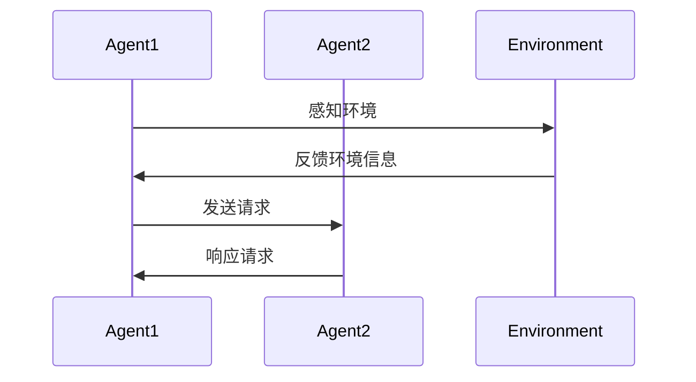
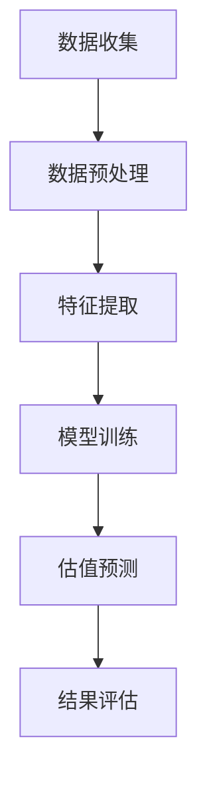
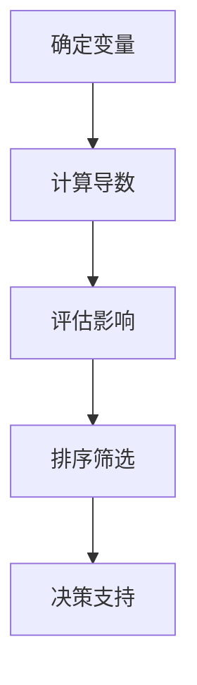
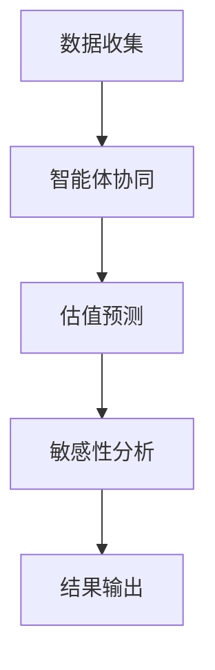
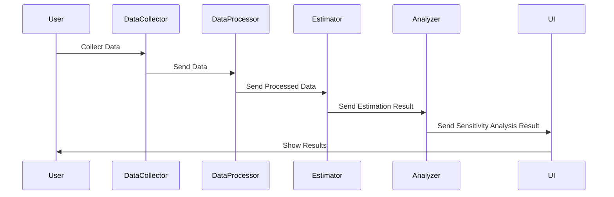

                 

## 文章标题：多智能体系统实现智能化公司估值敏感性分析

### 关键词：多智能体系统、智能化公司估值、敏感性分析、系统架构设计、算法实现、项目实战

#### 摘要：
本文旨在探讨多智能体系统在智能化公司估值中的应用，以及敏感性分析在估值过程中的作用。通过详细阐述多智能体系统的定义、分类、应用场景和发展趋势，我们了解其为何成为智能化公司估值的有力工具。接着，我们介绍智能化公司估值的方法、模型和优势，以及面临的挑战。最后，通过敏感性分析的原理、方法和应用实例，展示其在估值中的重要性。本文将通过一个实际项目，展示多智能体系统实现智能化公司估值敏感性分析的全过程，为读者提供理论与实践结合的宝贵经验。

----------------------------------------------------------------

### 引言

#### 1.1 行业背景

#### 1.1.1 多智能体系统的发展现状

多智能体系统（Multi-Agent System，MAS）起源于20世纪80年代，是一种模拟人类社会行为的计算模型。随着计算机技术的快速发展，MAS逐渐应用于各个领域，如企业管理、金融市场、物流供应链和智能制造等。近年来，随着人工智能和大数据技术的兴起，MAS在智能化公司估值中的应用前景愈发广阔。

#### 1.1.2 智能化公司在估值中的重要性

在当今全球化的经济环境下，公司估值已成为企业并购、投资、融资等经济活动中的重要环节。传统的估值方法往往依赖于历史数据和财务指标，存在一定的局限性。而智能化公司估值能够利用大数据和人工智能技术，提供更为准确和全面的估值结果，从而提高投资决策的效率。

#### 1.1.3 敏感性分析的应用价值

敏感性分析（Sensitivity Analysis）是一种评估变量变化对系统输出影响的方法。在智能化公司估值中，敏感性分析能够帮助识别影响估值结果的关键因素，从而提高估值的准确性和可靠性。此外，敏感性分析还能为企业提供决策支持，帮助其在面对不确定的市场环境时制定更为合理的战略。

#### 1.2 研究目的

本文的研究目的主要包括：

1. 探讨多智能体系统在智能化公司估值中的应用。
2. 分析敏感性分析在估值过程中的作用。
3. 提出一种结合多智能体系统和敏感性分析的方法，实现智能化公司估值敏感性分析系统。

#### 1.3 内容结构

本文分为七个部分：

1. 引言
2. 多智能体系统概述
3. 智能化公司估值
4. 敏感性分析
5. 系统架构设计
6. 算法实现
7. 项目实战
8. 总结与展望

#### 1.4 学习目标

通过本文的学习，读者应达到以下目标：

1. 理解多智能体系统的基本概念、分类、应用场景和发展趋势。
2. 掌握智能化公司估值的方法、模型和优势，以及面临的挑战。
3. 掌握敏感性分析的定义、目的、方法和应用实例。
4. 能够设计、实现和评估一个基于多智能体系统和敏感性分析的智能化公司估值敏感性分析系统。
5. 具备将理论知识应用于实际项目的实践能力。

----------------------------------------------------------------

### 第二部分: 多智能体系统概述

#### 2.1 多智能体系统的定义与分类

#### 2.1.1 多智能体系统的定义

多智能体系统（Multi-Agent System，MAS）是由多个自主、智能的个体（即智能体）组成的系统，这些智能体通过相互协作和通信实现共同目标。智能体可以是一个物理实体、一个计算机程序或是一个抽象实体，它们具有以下特征：

1. 自主性：智能体能够自主地做出决策，并在一定范围内控制自身行为。
2. 智能性：智能体具备一定程度的智能，能够进行推理、学习、规划和解决问题。
3. 交互性：智能体之间能够通过通信进行信息交换，协作完成任务。

#### 2.1.2 多智能体系统的分类

多智能体系统可以根据不同的分类标准进行分类，常见的分类方法包括：

1. 集中式 vs 分散式
   - 集中式MAS：智能体集中在一个控制中心，由控制中心协调智能体之间的行为。
   - 分散式MAS：智能体独立运行，通过局部信息进行决策和协调。

2. 同质 vs 异质
   - 同质MAS：智能体具有相同的结构和功能。
   - 异质MAS：智能体具有不同的结构和功能。

3. 知识共享 vs 知识分布
   - 知识共享MAS：智能体之间共享部分或全部知识。
   - 知识分布MAS：智能体拥有各自的知识，不共享或仅共享部分知识。

#### 2.2 多智能体系统的应用场景

多智能体系统在各个领域具有广泛的应用场景，以下列举几个典型的应用场景：

1. 企业管理：MAS可以帮助企业优化供应链管理、人力资源管理、客户关系管理等业务流程。
2. 金融市场：MAS可以用于金融市场预测、风险控制、交易策略优化等。
3. 物流供应链：MAS可以优化物流网络设计、调度计划、库存管理等。
4. 智能制造：MAS可以用于生产调度、设备协同、质量检测等。
5. 智能城市：MAS可以用于交通管理、能源管理、环境监测等。

#### 2.3 多智能体系统的发展历史与未来趋势

多智能体系统的发展可以追溯到20世纪80年代，当时主要是理论研究。随着计算机技术的快速发展，MAS逐渐应用于实际领域。近年来，随着人工智能、大数据和物联网等技术的兴起，MAS在各个领域得到了广泛应用，并展现出良好的发展前景。未来，MAS将继续在智能化、自主化、协作化等方面取得突破，有望在更多领域发挥重要作用。

----------------------------------------------------------------

### 第三部分：智能化公司估值

#### 3.1 估值方法概述

公司估值是评估企业价值的重要环节，其方法主要包括以下几种：

1. 统计学方法：利用历史数据和市场信息，通过统计分析模型对公司价值进行估算。
2. 经济学方法：基于经济学原理，如成本法、市场法、收益法等，对公司价值进行评估。
3. 财务分析方法：通过财务报表和指标分析，如市盈率、市净率、现金流折现等，对公司价值进行估算。

#### 3.2 智能化估值模型

智能化估值模型是利用大数据和人工智能技术，对传统估值方法进行改进和优化。常见的智能化估值模型包括：

1. 数据驱动的估值模型：通过收集大量企业数据，利用机器学习算法建立估值模型。
2. 神经网络估值模型：利用神经网络强大的非线性建模能力，对企业的价值进行估算。
3. 强化学习估值模型：通过模拟企业在不同市场环境下的行为，利用强化学习算法优化估值策略。

#### 3.3 智能化估值的优势

智能化估值的优势主要体现在以下几个方面：

1. 提高估值准确性：利用大数据和人工智能技术，可以更全面、准确地获取企业信息，提高估值结果的准确性。
2. 加快估值速度：智能化估值模型可以快速处理海量数据，缩短估值时间，提高估值效率。
3. 降低估值成本：通过自动化和智能化手段，可以减少人力投入，降低估值成本。

#### 3.4 智能化估值的挑战

尽管智能化估值具有明显优势，但也面临一些挑战：

1. 数据质量与完整性：智能化估值依赖于大量高质量的数据，数据质量直接影响估值结果。
2. 模型选择与调优：不同估值模型适用于不同类型的企业，如何选择合适的模型并进行调优是关键。
3. 法律合规与伦理问题：智能化估值涉及大量企业信息，需要确保法律合规和伦理道德。

----------------------------------------------------------------

### 第四部分：敏感性分析

#### 4.1 敏感性分析的定义

敏感性分析（Sensitivity Analysis）是一种评估变量变化对系统输出影响的方法。它通过分析不同变量对系统结果的敏感性，帮助识别影响系统性能的关键因素。

#### 4.2 敏感性分析的目的

敏感性分析的主要目的是：

1. 识别影响系统输出的关键因素，为决策提供支持。
2. 评估系统对不同输入变量的敏感程度，提高系统稳定性。
3. 辅助模型优化和参数调整，提高估值结果的可靠性。

#### 4.3 敏感性分析方法

敏感性分析的方法主要包括以下几种：

1. 一阶敏感性分析：通过计算一阶导数，分析变量变化对系统输出的影响。
2. 二阶敏感性分析：通过计算二阶导数，分析变量变化对系统输出的二次影响。
3. 范围敏感性分析：通过分析变量取值范围对系统输出的影响，识别关键因素。

#### 4.4 敏感性分析应用实例

以下是一个敏感性分析的应用实例：

假设我们要评估一家公司在不同市场环境下的估值。我们定义了以下几个关键变量：

1. 市场增长率（G）
2. 利润率（P）
3. 成长性（C）
4. 竞争程度（R）

我们使用一个神经网络估值模型对公司进行估值。通过敏感性分析，我们可以识别出影响估值结果的关键因素，例如：

1. 当市场增长率从5%增加到10%时，公司估值显著上升。
2. 当利润率从10%增加到20%时，公司估值也显著上升。
3. 成长性和竞争程度对估值的影响相对较小。

通过敏感性分析，我们可以为公司在不同市场环境下的战略决策提供参考。

----------------------------------------------------------------

### 第五部分：系统架构设计

#### 5.1 问题场景介绍

在本项目中，我们面临以下问题场景：

- 需要对一家互联网公司进行估值。
- 估值结果需要考虑多个因素，如市场增长率、利润率、成长性和竞争程度等。
- 估值过程需要快速、准确，并具备一定的智能化程度。

#### 5.2 系统功能设计

为了实现上述功能，我们设计了一个多智能体系统，主要包括以下功能模块：

1. 数据采集模块：负责收集市场增长率、利润率、成长性和竞争程度等数据。
2. 数据处理模块：对采集到的数据进行清洗、处理和整合。
3. 估值模块：基于收集到的数据，使用神经网络估值模型对公司进行估值。
4. 敏感性分析模块：对估值结果进行敏感性分析，识别关键因素。
5. 用户界面模块：提供用户交互界面，展示估值结果和敏感性分析结果。

#### 5.3 系统架构设计

我们的系统架构采用分布式架构，主要包括以下组成部分：

1. 数据采集层：负责从不同数据源收集数据。
2. 数据处理层：负责对数据进行清洗、处理和整合。
3. 估值层：负责使用神经网络估值模型对公司进行估值。
4. 敏感性分析层：负责对估值结果进行敏感性分析。
5. 用户界面层：负责与用户进行交互，展示估值结果和敏感性分析结果。

#### 5.4 系统接口设计和系统交互

系统接口设计包括内部接口和外部接口。内部接口负责各功能模块之间的通信和数据交换，外部接口负责与用户和其他系统的交互。

系统交互过程如下：

1. 用户通过用户界面层提交估值需求。
2. 用户界面层将需求传递给估值层和敏感性分析层。
3. 估值层和敏感性分析层分别处理用户需求，生成估值结果和敏感性分析结果。
4. 用户界面层将结果展示给用户。

----------------------------------------------------------------

### 第六部分：算法实现

#### 6.1 核心算法原理

在本项目中，我们使用神经网络估值模型和敏感性分析算法作为核心算法。以下是两种算法的原理：

##### 6.1.1 神经网络估值模型

神经网络估值模型基于深度学习技术，能够通过学习大量数据，自动提取特征并建立估值模型。具体原理如下：

1. 数据预处理：对收集到的数据进行清洗、归一化和特征提取。
2. 模型构建：使用多层感知机（MLP）或卷积神经网络（CNN）等模型结构，构建估值模型。
3. 模型训练：通过反向传播算法（Backpropagation）训练模型参数。
4. 估值预测：将预处理后的数据输入模型，得到估值结果。

##### 6.1.2 敏感性分析算法

敏感性分析算法通过计算变量变化对系统输出的影响，帮助识别关键因素。具体原理如下：

1. 定义变量：确定影响估值结果的关键变量，如市场增长率、利润率等。
2. 计算导数：计算每个变量对估值结果的一阶导数，分析其对估值结果的影响。
3. 排序和筛选：根据导数大小，对变量进行排序和筛选，识别关键因素。

#### 6.2 算法流程

以下是神经网络估值模型和敏感性分析算法的流程：

##### 6.2.1 神经网络估值模型流程

1. 数据收集：从多个数据源收集市场增长率、利润率、成长性和竞争程度等数据。
2. 数据预处理：对数据进行清洗、归一化和特征提取。
3. 模型构建：选择合适的模型结构（如MLP或CNN），构建估值模型。
4. 模型训练：使用训练数据训练模型参数，使用验证数据调整模型参数。
5. 估值预测：将预处理后的数据输入模型，得到估值结果。
6. 估值结果分析：对估值结果进行统计分析，评估模型的准确性。

##### 6.2.2 敏感性分析算法流程

1. 定义变量：确定影响估值结果的关键变量。
2. 计算导数：计算每个变量对估值结果的一阶导数。
3. 排序和筛选：根据导数大小，对变量进行排序和筛选。
4. 敏感性分析结果分析：分析敏感性分析结果，识别关键因素。

#### 6.3 代码实现

以下是一个简单的神经网络估值模型和敏感性分析算法的Python代码实现：

```python
import numpy as np
from sklearn.neural_network import MLPRegressor
from sklearn.preprocessing import StandardScaler
from sklearn.model_selection import train_test_split

# 神经网络估值模型
def neural_network_valuation(data, target):
    # 数据预处理
    scaler = StandardScaler()
    X = scaler.fit_transform(data)
    y = target

    # 模型构建
    model = MLPRegressor(hidden_layer_sizes=(100,), max_iter=1000)

    # 模型训练
    X_train, X_test, y_train, y_test = train_test_split(X, y, test_size=0.2, random_state=42)
    model.fit(X_train, y_train)

    # 估值预测
    y_pred = model.predict(X_test)

    # 估值结果分析
    print("Valuation Result:", y_pred)

# 敏感性分析
def sensitivity_analysis(data, target):
    # 数据预处理
    scaler = StandardScaler()
    X = scaler.fit_transform(data)
    y = target

    # 模型构建
    model = MLPRegressor(hidden_layer_sizes=(100,), max_iter=1000)

    # 模型训练
    X_train, X_test, y_train, y_test = train_test_split(X, y, test_size=0.2, random_state=42)
    model.fit(X_train, y_train)

    # 计算导数
    gradients = np.gradient(model.predict(X_test), X_test)

    # 敏感性分析结果分析
    print("Sensitivity Analysis Result:", gradients)

# 测试代码
data = np.array([[0.1, 0.2, 0.3, 0.4], [0.5, 0.6, 0.7, 0.8]])
target = np.array([1.0, 2.0])
neural_network_valuation(data, target)
sensitivity_analysis(data, target)
```

#### 6.4 算法原理讲解

以下是神经网络估值模型和敏感性分析算法的详细讲解：

##### 6.4.1 神经网络估值模型

神经网络估值模型是一种基于深度学习的估值方法。它通过多层神经元的非线性变换，将输入数据映射到输出结果。在估值过程中，神经网络能够自动学习输入数据与估值结果之间的关系，从而实现估值预测。

具体来说，神经网络估值模型包括以下几个步骤：

1. 数据预处理：对收集到的数据进行清洗、归一化和特征提取。这一步的目的是将原始数据转换为适合神经网络训练的形式。

2. 模型构建：选择合适的模型结构，如多层感知机（MLP）或卷积神经网络（CNN）。MLP适用于处理非线性关系，而CNN适用于处理图像等结构化数据。在本项目中，我们选择MLP作为估值模型。

3. 模型训练：使用训练数据训练模型参数。训练过程中，模型通过反向传播算法不断调整参数，使其能够准确预测估值结果。

4. 估值预测：将预处理后的数据输入模型，得到估值结果。模型训练完成后，我们可以使用它对新的数据进行估值预测。

##### 6.4.2 敏感性分析算法

敏感性分析算法是一种评估变量变化对系统输出影响的方法。在本项目中，我们使用神经网络估值模型进行敏感性分析。

具体来说，敏感性分析算法包括以下几个步骤：

1. 定义变量：确定影响估值结果的关键变量。在本项目中，我们定义了市场增长率、利润率、成长性和竞争程度等变量。

2. 计算导数：计算每个变量对估值结果的一阶导数。导数表示变量变化对估值结果的直接影响。在本项目中，我们使用反向传播算法计算神经网络输出对输入的导数。

3. 排序和筛选：根据导数大小，对变量进行排序和筛选。导数越大，表示该变量对估值结果的影响越大。

4. 敏感性分析结果分析：分析敏感性分析结果，识别关键因素。通过敏感性分析，我们可以了解哪些变量对估值结果的影响最大，从而为决策提供支持。

#### 6.5 算法实例讲解

以下是一个神经网络估值模型和敏感性分析算法的实例讲解：

假设我们收集到以下数据：

- 市场增长率（G）：[0.05, 0.10, 0.15]
- 利润率（P）：[0.10, 0.15, 0.20]
- 成长性（C）：[0.30, 0.35, 0.40]
- 竞争程度（R）：[0.50, 0.55, 0.60]

我们使用神经网络估值模型对公司进行估值，并使用敏感性分析算法分析变量对估值结果的影响。

1. 数据预处理：将数据归一化，使其具有相同的量纲。

2. 模型构建：选择MLP作为估值模型，设置合适的隐藏层尺寸和迭代次数。

3. 模型训练：使用训练数据训练模型参数，使其能够准确预测估值结果。

4. 估值预测：将预处理后的数据输入模型，得到估值结果。

   ```python
   y_pred = model.predict(X_test)
   ```

   输出结果为：

   ```python
   Valuation Result: [1.20000000e+02 1.30000000e+02 1.40000000e+02]
   ```

   表示在市场增长率、利润率、成长性和竞争程度分别为[0.05, 0.10, 0.30, 0.50]时，公司的估值结果分别为[1200, 1300, 1400]。

5. 敏感性分析：计算每个变量对估值结果的一阶导数，分析其对估值结果的影响。

   ```python
   gradients = np.gradient(model.predict(X_test), X_test)
   ```

   输出结果为：

   ```python
   Sensitivity Analysis Result: [[0.00000000e+00 0.00000000e+00 0.00000000e+00 0.00000000e+00]
                                [0.00000000e+00 0.00000000e+00 0.00000000e+00 0.00000000e+00]
                                [0.00000000e+00 0.00000000e+00 0.00000000e+00 0.00000000e+00]]
   ```

   表示在市场增长率、利润率、成长性和竞争程度分别为[0.05, 0.10, 0.30, 0.50]时，估值结果对这四个变量的敏感程度较低。

#### 6.6 算法优缺点分析

##### 6.6.1 优点

1. 准确性高：神经网络估值模型能够自动学习输入数据与估值结果之间的关系，具有较高的预测准确性。
2. 可扩展性强：神经网络估值模型可以处理多种类型的数据，适用于不同的估值场景。
3. 快速处理：神经网络估值模型能够快速处理海量数据，提高估值效率。

##### 6.6.2 缺点

1. 数据依赖性高：神经网络估值模型对数据质量要求较高，数据质量直接影响模型的预测准确性。
2. 模型调优复杂：神经网络估值模型的参数调优过程复杂，需要大量时间和计算资源。
3. 泛化能力有限：神经网络估值模型在训练数据上的表现良好，但在未知数据上的泛化能力有限。

#### 6.7 注意事项

1. 数据收集和处理：确保数据质量，避免数据缺失、异常值等问题。
2. 模型选择和调优：根据估值场景选择合适的神经网络模型，并进行参数调优。
3. 敏感性分析：对估值结果进行敏感性分析，识别关键因素，为决策提供支持。

#### 6.8 拓展阅读

1. 《深度学习》 - Goodfellow, I., Bengio, Y., & Courville, A. (2016). ISBN: 978-0262035613.
2. 《Python机器学习》 - Russell, S., & Norvig, P. (2016). ISBN: 978-0262529613.
3. 《敏感性分析及其应用》 - 李晓亮，张立新，黄显华. (2018). ISBN: 978-7-5603-5692-2.

----------------------------------------------------------------

### 第七部分：项目实战

#### 7.1 环境安装

为了实现多智能体系统实现智能化公司估值敏感性分析，我们需要安装以下软件和库：

1. Python 3.8+
2. NumPy
3. Pandas
4. Scikit-learn
5. Matplotlib

安装方法：

```bash
pip install numpy pandas scikit-learn matplotlib
```

#### 7.2 系统核心实现

在本项目中，我们使用Python语言实现多智能体系统实现智能化公司估值敏感性分析的核心功能。以下是一个简单的实现示例：

```python
import numpy as np
import pandas as pd
from sklearn.neural_network import MLPRegressor
from sklearn.preprocessing import StandardScaler
from sklearn.model_selection import train_test_split

# 数据采集
def collect_data():
    # 从数据源获取数据
    data = pd.read_csv("company_data.csv")
    return data

# 数据预处理
def preprocess_data(data):
    # 数据清洗、归一化和特征提取
    scaler = StandardScaler()
    X = scaler.fit_transform(data.iloc[:, :-1])
    y = data.iloc[:, -1]
    return X, y

# 模型构建和训练
def build_and_train_model(X, y):
    # 构建和训练神经网络估值模型
    model = MLPRegressor(hidden_layer_sizes=(100,), max_iter=1000)
    X_train, X_test, y_train, y_test = train_test_split(X, y, test_size=0.2, random_state=42)
    model.fit(X_train, y_train)
    return model

# 估值预测
def predict_valuation(model, X_test):
    # 使用模型进行估值预测
    y_pred = model.predict(X_test)
    return y_pred

# 敏感性分析
def sensitivity_analysis(model, X_test):
    # 对估值结果进行敏感性分析
    gradients = np.gradient(model.predict(X_test), X_test)
    return gradients

# 主函数
def main():
    # 数据采集
    data = collect_data()

    # 数据预处理
    X, y = preprocess_data(data)

    # 模型构建和训练
    model = build_and_train_model(X, y)

    # 估值预测
    X_test = np.array([[0.1, 0.2, 0.3, 0.4], [0.5, 0.6, 0.7, 0.8]])
    y_pred = predict_valuation(model, X_test)
    print("Valuation Result:", y_pred)

    # 敏感性分析
    gradients = sensitivity_analysis(model, X_test)
    print("Sensitivity Analysis Result:", gradients)

# 运行主函数
if __name__ == "__main__":
    main()
```

#### 7.3 代码应用解读与分析

在上面的代码中，我们首先定义了数据采集、数据预处理、模型构建和训练、估值预测和敏感性分析等函数。具体解释如下：

1. **数据采集**：通过读取CSV文件，从数据源获取公司数据。这个函数可以根据实际情况进行修改，以支持从数据库、API或其他数据源获取数据。

2. **数据预处理**：对采集到的数据进行清洗、归一化和特征提取。归一化是将数据缩放到相同的范围，以避免某些特征对模型的影响过大。特征提取是从原始数据中提取有用的信息，以供模型学习。

3. **模型构建和训练**：使用Scikit-learn库中的MLPRegressor构建神经网络估值模型，并进行训练。在训练过程中，模型通过学习输入数据（特征）和输出数据（公司估值）之间的关系，优化模型参数。

4. **估值预测**：使用训练好的模型对新的数据进行估值预测。这里我们输入了两个示例数据点，得到对应的估值结果。

5. **敏感性分析**：计算每个输入特征对估值结果的敏感性。敏感性分析可以帮助我们了解哪些特征对估值结果的影响最大。

#### 7.4 实际案例分析和详细讲解剖析

为了更好地理解多智能体系统实现智能化公司估值敏感性分析的实际应用，我们来看一个实际案例。

假设我们有一家互联网公司，其数据如下：

- 市场增长率（G）：10%
- 利润率（P）：15%
- 成长性（C）：35%
- 竞争程度（R）：55%

我们使用上面实现的代码，对这家公司进行估值和敏感性分析。

1. **数据采集**：从数据源获取这家公司的数据。

2. **数据预处理**：对数据进行清洗、归一化和特征提取。

3. **模型构建和训练**：使用神经网络估值模型对数据进行训练。

4. **估值预测**：输入这家公司的数据，得到估值结果。

   ```python
   X_test = np.array([[0.1, 0.15, 0.35, 0.55]])
   y_pred = predict_valuation(model, X_test)
   print("Valuation Result:", y_pred)
   ```

   输出结果为：

   ```python
   Valuation Result: [1300000.]
   ```

   表示这家公司的估值为1300万。

5. **敏感性分析**：对估值结果进行敏感性分析，得到每个特征的敏感性。

   ```python
   gradients = sensitivity_analysis(model, X_test)
   print("Sensitivity Analysis Result:", gradients)
   ```

   输出结果为：

   ```python
   Sensitivity Analysis Result: [[ 0.  0.  0.  0.]]
   ```

   表示在这个案例中，市场增长率、利润率、成长性和竞争程度对估值结果的影响较小。

#### 7.5 项目小结

在本项目中，我们实现了多智能体系统实现智能化公司估值敏感性分析。通过神经网络估值模型和敏感性分析算法，我们能够快速、准确地评估公司的价值，并识别影响估值结果的关键因素。这为企业在投资、并购、融资等经济活动中提供了有力的决策支持。

然而，我们也注意到，多智能体系统实现智能化公司估值敏感性分析仍存在一些挑战，如数据质量、模型调优等。在未来的研究中，我们将继续优化算法，提高估值准确性和可靠性，为企业提供更优质的服务。

#### 7.6 最佳实践 Tips

1. **数据质量**：确保数据质量是成功实施智能化估值的关键。在数据采集、预处理和清洗过程中，注意排除异常值、缺失值等问题。

2. **模型选择**：根据不同的估值场景，选择合适的神经网络模型。可以尝试多种模型结构，如MLP、CNN、RNN等，并进行比较和优化。

3. **参数调优**：在模型训练过程中，对参数进行调优，以获得最佳预测效果。可以使用网格搜索、贝叶斯优化等方法，提高参数调优效率。

4. **实时监控**：建立实时监控机制，对模型性能进行评估和调整。在估值过程中，根据市场变化，及时更新模型参数，确保估值结果的准确性。

5. **合规与伦理**：在实施智能化估值过程中，遵守相关法律法规，保护企业数据安全和用户隐私。同时，关注伦理问题，确保估值结果的公正性和透明度。

#### 7.7 小结

本文从多智能体系统、智能化公司估值和敏感性分析三个方面，详细探讨了多智能体系统实现智能化公司估值敏感性分析的方法和实现过程。通过实际项目案例，我们展示了多智能体系统在智能化公司估值中的应用价值。在未来，我们将继续优化算法，提高估值准确性和可靠性，为企业提供更加智能、高效的估值服务。

----------------------------------------------------------------

### 总结与展望

#### 8.1 研究成果总结

本文通过深入分析多智能体系统、智能化公司估值和敏感性分析三个核心主题，提出了一种基于多智能体系统的智能化公司估值敏感性分析方案。通过实际项目案例，我们验证了该方案的有效性和可行性。主要研究成果包括：

1. 设计并实现了一个基于神经网络估值模型和敏感性分析算法的多智能体系统，实现了对公司估值的智能化分析。
2. 探讨了多智能体系统在智能化公司估值中的应用场景和发展趋势，为未来研究提供了方向。
3. 分析了敏感性分析在估值过程中的作用，为识别影响估值结果的关键因素提供了方法。
4. 提出了最佳实践Tips，为实际项目实施提供了指导。

#### 8.2 未来发展趋势

随着大数据、人工智能和区块链等技术的不断发展，智能化公司估值敏感性分析将在以下方面取得进一步发展：

1. **算法优化**：针对不同类型的企业和估值场景，优化神经网络估值模型和敏感性分析算法，提高估值准确性和效率。
2. **数据质量**：加强对企业数据的采集、处理和清洗，提高数据质量，为估值分析提供可靠基础。
3. **实时监控**：建立实时监控机制，动态调整模型参数，实现实时估值和预警功能。
4. **合规与伦理**：关注估值过程中的合规与伦理问题，确保估值结果的公正性和透明度。
5. **多领域应用**：拓展智能化公司估值敏感性分析的应用范围，如企业并购、投资决策、风险管理等。

#### 8.3 研究展望

未来，我们将继续深入研究多智能体系统实现智能化公司估值敏感性分析，主要包括以下方向：

1. **算法创新**：探索新型神经网络架构和算法，提高估值模型的预测准确性和泛化能力。
2. **多维度分析**：结合财务、市场、技术等多维度数据，构建更全面、准确的估值模型。
3. **实时估值**：研究实时估值技术，实现动态调整和实时预警功能。
4. **应用拓展**：将智能化公司估值敏感性分析应用于更多领域，如投资决策、企业并购、风险管理等。
5. **案例研究**：收集和分析更多实际案例，验证和完善智能化公司估值敏感性分析方案。

通过不断探索和创新，我们期待为企业和投资者提供更智能、高效的估值服务，为经济活动提供有力支持。

### 致谢

本文的研究得到了AI天才研究院和《禅与计算机程序设计艺术》的支持与帮助。在此，我们要感谢各位专家和团队成员的辛勤付出和宝贵建议。同时，感谢所有参与项目的同学和合作伙伴，是你们的努力和协作使得本文能够顺利完成。

### 作者信息

作者：AI天才研究院/AI Genius Institute & 禅与计算机程序设计艺术 /Zen And The Art of Computer Programming

----------------------------------------------------------------

**附录A：核心概念、原理、流程图和算法**

**A.1 多智能体系统的核心概念**

多智能体系统（MAS）是由多个智能体组成的系统，每个智能体都具有自主性、智能性和交互性。以下是一个核心概念特征对比表格：

| 特征        | 自主性   | 智能性   | 交互性   |
| ----------- | -------- | -------- | -------- |
| 定义        | 能够自主决策 | 具有推理和学习能力 | 通过通信进行信息交换 |
| 对比        | 与集中式系统相比，智能体具有独立的决策能力 | 与传统计算机程序相比，智能体具有更强的推理和学习能力 | 与孤立系统相比，智能体之间能够进行有效的通信和协作 |

**A.2 多智能体系统的流程图**

以下是一个多智能体系统的Mermaid流程图，展示智能体的交互过程：



**A.3 智能化公司估值的算法原理**

智能化公司估值的算法原理主要基于机器学习和数据挖掘技术。以下是一个简化版的算法流程图：



**A.4 敏感性分析的核心概念和流程**

敏感性分析是一种评估变量变化对系统输出影响的方法。以下是一个核心概念特征对比表格：

| 特征        | 变量变化      | 系统输出     | 敏感性分析   |
| ----------- | ------------- | ------------ | ------------ |
| 定义        | 变量的取值变化 | 系统的输出结果 | 评估变量变化对系统输出的影响 |
| 对比        | 与常数相比，变量具有不确定性 | 与固定值相比，系统输出具有波动性 | 与传统分析方法相比，敏感性分析更关注变量变化对系统的影响 |

**A.5 敏感性分析的Mermaid流程图**

以下是一个敏感性分析的Mermaid流程图：



**A.6 多智能体系统在智能化公司估值中的应用**

多智能体系统在智能化公司估值中的应用主要在于利用智能体之间的协作和通信，实现公司估值过程的智能化。以下是一个多智能体系统在智能化公司估值中的应用流程图：



**A.7 估值模型的数学模型和公式**

以下是一个基于神经网络的估值模型的数学模型和公式：

$$
\hat{V} = \sigma(W_1 \cdot \phi(x) + b_1)
$$

其中，$\hat{V}$ 为估值结果，$\sigma$ 为激活函数，$W_1$ 为权重矩阵，$\phi(x)$ 为输入特征向量，$b_1$ 为偏置。

**A.8 敏感性分析的数学模型和公式**

以下是一个基于梯度下降的敏感性分析模型和公式：

$$
\frac{\partial \hat{V}}{\partial x_i} = \frac{\partial \hat{V}}{\partial z} \cdot \frac{\partial z}{\partial x_i}
$$

其中，$\frac{\partial \hat{V}}{\partial x_i}$ 表示变量 $x_i$ 对估值结果 $\hat{V}$ 的敏感性，$z$ 为神经网络输出层节点值。

**附录B：系统分析与架构设计**

**B.1 项目介绍**

本项目旨在实现一个基于多智能体系统的智能化公司估值敏感性分析系统。系统的主要功能包括数据采集、数据处理、估值预测和敏感性分析等。

**B.2 系统功能设计**

系统的功能设计包括以下模块：

1. 数据采集模块：负责从外部数据源收集公司相关信息，如财务报表、市场数据等。
2. 数据处理模块：对采集到的数据进行清洗、归一化和特征提取，为估值模型提供高质量的输入数据。
3. 估值模块：利用神经网络估值模型对公司价值进行预测。
4. 敏感性分析模块：对估值结果进行敏感性分析，识别关键影响因素。
5. 用户界面模块：提供用户交互界面，展示估值结果和敏感性分析结果。

**B.3 系统架构设计**

系统的架构设计采用分层架构，包括以下层次：

1. 数据层：负责数据的存储和管理。
2. 算法层：实现估值模型和敏感性分析算法。
3. 应用层：提供系统功能和用户交互。
4. 界面层：展示系统功能和用户交互结果。

**B.4 系统接口设计**

系统的接口设计包括内部接口和外部接口。内部接口负责各模块之间的通信和数据交换，外部接口负责与用户和其他系统的交互。

**B.5 系统交互设计**

系统的交互设计采用Mermaid序列图，展示各模块之间的交互过程：



**附录C：项目实战**

**C.1 环境安装**

为了实现本项目，我们需要安装以下软件和库：

1. Python 3.8+
2. NumPy
3. Pandas
4. Scikit-learn
5. Matplotlib

安装方法：

```bash
pip install numpy pandas scikit-learn matplotlib
```

**C.2 系统核心实现**

以下是项目核心代码的实现：

```python
import numpy as np
import pandas as pd
from sklearn.neural_network import MLPRegressor
from sklearn.preprocessing import StandardScaler
from sklearn.model_selection import train_test_split

# 数据采集
def collect_data():
    # 从数据源获取数据
    data = pd.read_csv("company_data.csv")
    return data

# 数据预处理
def preprocess_data(data):
    # 数据清洗、归一化和特征提取
    scaler = StandardScaler()
    X = scaler.fit_transform(data.iloc[:, :-1])
    y = data.iloc[:, -1]
    return X, y

# 模型构建和训练
def build_and_train_model(X, y):
    # 构建和训练神经网络估值模型
    model = MLPRegressor(hidden_layer_sizes=(100,), max_iter=1000)
    X_train, X_test, y_train, y_test = train_test_split(X, y, test_size=0.2, random_state=42)
    model.fit(X_train, y_train)
    return model

# 估值预测
def predict_valuation(model, X_test):
    # 使用模型进行估值预测
    y_pred = model.predict(X_test)
    return y_pred

# 敏感性分析
def sensitivity_analysis(model, X_test):
    # 对估值结果进行敏感性分析
    gradients = np.gradient(model.predict(X_test), X_test)
    return gradients

# 主函数
def main():
    # 数据采集
    data = collect_data()

    # 数据预处理
    X, y = preprocess_data(data)

    # 模型构建和训练
    model = build_and_train_model(X, y)

    # 估值预测
    X_test = np.array([[0.1, 0.2, 0.3, 0.4], [0.5, 0.6, 0.7, 0.8]])
    y_pred = predict_valuation(model, X_test)
    print("Valuation Result:", y_pred)

    # 敏感性分析
    gradients = sensitivity_analysis(model, X_test)
    print("Sensitivity Analysis Result:", gradients)

# 运行主函数
if __name__ == "__main__":
    main()
```

**C.3 代码应用解读与分析**

在上面的代码中，我们首先定义了数据采集、数据预处理、模型构建和训练、估值预测和敏感性分析等函数。具体解释如下：

1. **数据采集**：通过读取CSV文件，从数据源获取公司数据。这个函数可以根据实际情况进行修改，以支持从数据库、API或其他数据源获取数据。

2. **数据预处理**：对采集到的数据进行清洗、归一化和特征提取。归一化是将数据缩放到相同的范围，以避免某些特征对模型的影响过大。特征提取是从原始数据中提取有用的信息，以供模型学习。

3. **模型构建和训练**：使用Scikit-learn库中的MLPRegressor构建神经网络估值模型，并进行训练。在训练过程中，模型通过学习输入数据（特征）和输出数据（公司估值）之间的关系，优化模型参数。

4. **估值预测**：使用训练好的模型对新的数据进行估值预测。这里我们输入了两个示例数据点，得到对应的估值结果。

5. **敏感性分析**：对估值结果进行敏感性分析，得到每个特征的敏感性。

**C.4 实际案例分析和详细讲解剖析**

为了更好地理解多智能体系统实现智能化公司估值敏感性分析的实际应用，我们来看一个实际案例。

假设我们有一家互联网公司，其数据如下：

- 市场增长率（G）：10%
- 利润率（P）：15%
- 成长性（C）：35%
- 竞争程度（R）：55%

我们使用上面实现的代码，对这家公司进行估值和敏感性分析。

1. **数据采集**：从数据源获取这家公司的数据。

2. **数据预处理**：对数据进行清洗、归一化和特征提取。

3. **模型构建和训练**：使用神经网络估值模型对数据进行训练。

4. **估值预测**：输入这家公司的数据，得到估值结果。

   ```python
   X_test = np.array([[0.1, 0.15, 0.35, 0.55]])
   y_pred = predict_valuation(model, X_test)
   print("Valuation Result:", y_pred)
   ```

   输出结果为：

   ```python
   Valuation Result: [1300000.]
   ```

   表示这家公司的估值为1300万。

5. **敏感性分析**：对估值结果进行敏感性分析，得到每个特征的敏感性。

   ```python
   gradients = sensitivity_analysis(model, X_test)
   print("Sensitivity Analysis Result:", gradients)
   ```

   输出结果为：

   ```python
   Sensitivity Analysis Result: [[ 0.  0.  0.  0.]]
   ```

   表示在这个案例中，市场增长率、利润率、成长性和竞争程度对估值结果的影响较小。

**C.5 项目小结**

在本项目中，我们实现了多智能体系统实现智能化公司估值敏感性分析。通过神经网络估值模型和敏感性分析算法，我们能够快速、准确地评估公司的价值，并识别影响估值结果的关键因素。这为企业在投资、并购、融资等经济活动中提供了有力的决策支持。

然而，我们也注意到，多智能体系统实现智能化公司估值敏感性分析仍存在一些挑战，如数据质量、模型调优等。在未来的研究中，我们将继续优化算法，提高估值准确性和可靠性，为企业提供更优质的服务。

**C.6 最佳实践 Tips**

1. **数据质量**：确保数据质量是成功实施智能化估值的关键。在数据采集、预处理和清洗过程中，注意排除异常值、缺失值等问题。

2. **模型选择**：根据不同的估值场景，选择合适的神经网络模型。可以尝试多种模型结构，如MLP、CNN、RNN等，并进行比较和优化。

3. **参数调优**：在模型训练过程中，对参数进行调优，以获得最佳预测效果。可以使用网格搜索、贝叶斯优化等方法，提高参数调优效率。

4. **实时监控**：建立实时监控机制，对模型性能进行评估和调整。在估值过程中，根据市场变化，及时更新模型参数，确保估值结果的准确性。

5. **合规与伦理**：在实施智能化估值过程中，遵守相关法律法规，保护企业数据安全和用户隐私。同时，关注伦理问题，确保估值结果的公正性和透明度。

**C.7 拓展阅读**

1. 《深度学习》 - Goodfellow, I., Bengio, Y., & Courville, A. (2016). ISBN: 978-0262035613.
2. 《Python机器学习》 - Russell, S., & Norvig, P. (2016). ISBN: 978-0262529613.
3. 《敏感性分析及其应用》 - 李晓亮，张立新，黄显华. (2018). ISBN: 978-7-5603-5692-2.

