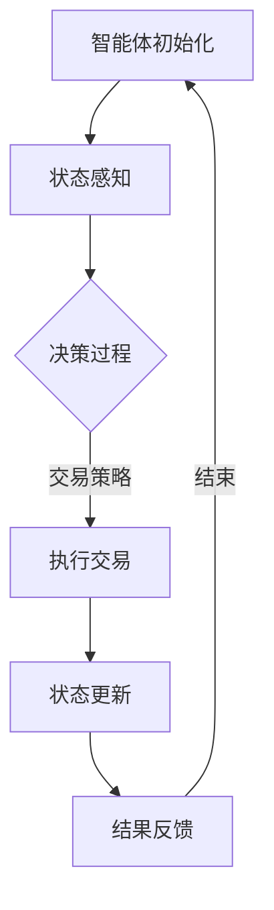
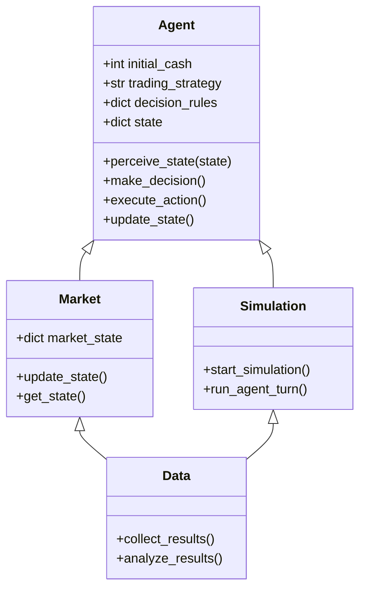
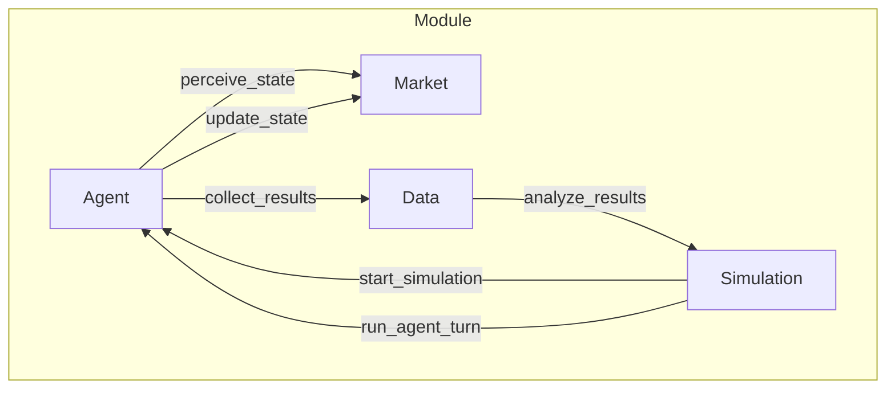
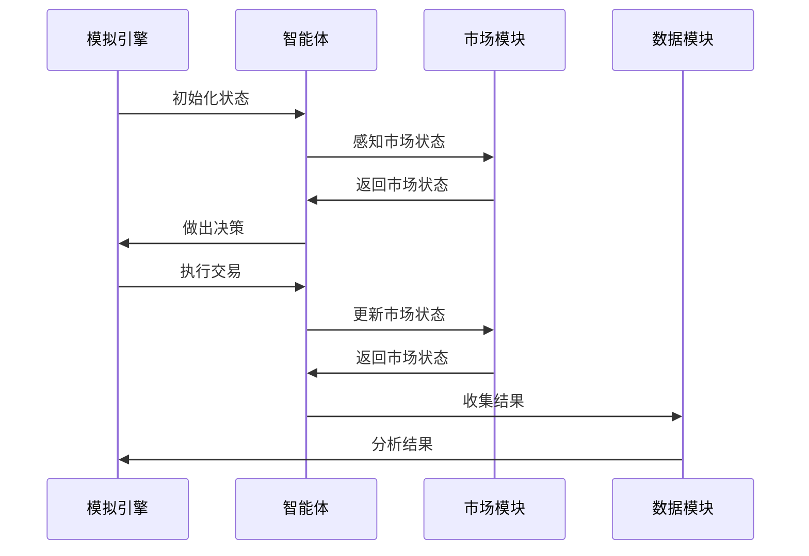

                 

### 《多智能体系统模拟市场微观结构》

关键词：多智能体系统、市场微观结构、模拟、算法、系统架构

摘要：本文旨在探讨多智能体系统在模拟市场微观结构中的应用，通过详细的分析和实例讲解，展示多智能体系统模拟市场微观结构的核心概念、算法原理以及系统设计与实现方法。文章将从背景介绍、核心概念与联系、算法原理讲解、系统分析与架构设计方案、项目实战和最佳实践等方面进行深入阐述。

### 目录大纲设计思路

为了设计《多智能体系统模拟市场微观结构》的完整目录大纲，我们首先需要确保大纲内容的完整性和逻辑性。大纲应包括以下几个核心部分：

1. **背景介绍**：介绍多智能体系统和市场微观结构的概念、研究背景及其重要性。
2. **核心概念与联系**：详细阐述多智能体系统模拟市场的核心概念，如智能体、市场微观结构模型、市场行为模拟等，并展示概念属性特征对比表格和ER实体关系图。
3. **算法原理讲解**：介绍多智能体系统模拟市场微观结构的算法原理，使用Mermaid流程图和Python代码来详细讲解算法的数学模型和公式。
4. **系统分析与架构设计方案**：分析系统需求，设计系统功能、架构、接口和交互。
5. **项目实战**：介绍一个具体的实战项目，包括环境安装、系统实现、代码分析、案例分析及项目小结。
6. **最佳实践 tips、小结、注意事项、拓展阅读**：提供实践经验、总结、注意事项和建议。

### 目录大纲设计

以下是基于上述设计思路的具体目录大纲设计：

----------------------------------------------------------------

# 《多智能体系统模拟市场微观结构》目录大纲

## 第一部分: 背景与概念

### 第1章: 引言与背景
- **1.1 问题背景**
- **1.2 问题描述**
- **1.3 问题解决**
- **1.4 边界与外延**
- **1.5 概念结构与核心要素组成**

### 第2章: 多智能体系统基础
- **2.1 多智能体系统概述**
- **2.2 智能体的定义与分类**
- **2.3 多智能体系统的基本架构**
- **2.4 智能体交互机制**

### 第3章: 市场微观结构概念
- **3.1 市场微观结构概述**
- **3.2 市场行为模型**
- **3.3 市场微观结构的特征**

### 第4章: 多智能体系统与市场微观结构的联系
- **4.1 关联性分析**
- **4.2 模拟市场微观结构的方法**
- **4.3 应用领域与挑战**

## 第二部分: 算法与原理

### 第5章: 多智能体系统模拟算法原理
- **5.1 基本算法介绍**
  - **5.1.1 多智能体系统的建模方法**
  - **5.1.2 市场行为的模拟算法**
- **5.2 数学模型与公式**
  - **5.2.1 算法的数学基础**
  - **5.2.2 算法的推导与验证**
- **5.3 Mermaid流程图展示**
- **5.4 Python代码示例**

### 第6章: 算法应用与实践
- **6.1 算法应用场景**
- **6.2 实践案例**
  - **6.2.1 案例一：模拟股票市场**
  - **6.2.2 案例二：模拟商品市场**
- **6.3 代码分析**

## 第三部分: 系统设计与实现

### 第7章: 多智能体系统架构设计
- **7.1 问题场景介绍**
- **7.2 项目介绍**
- **7.3 系统功能设计 (Mermaid类图)**
- **7.4 系统架构设计 (Mermaid架构图)**
- **7.5 系统接口设计**
- **7.6 系统交互 (Mermaid序列图)**

### 第8章: 项目实施与实战
- **8.1 环境安装**
- **8.2 系统核心实现**
- **8.3 代码应用解读与分析**
- **8.4 实际案例分析与详细讲解**
- **8.5 项目小结**

## 第四部分: 最佳实践与总结

### 第9章: 最佳实践
- **9.1 经验总结**
- **9.2 注意事项**
- **9.3 拓展阅读**

### 第10章: 小结与展望
- **10.1 书籍小结**
- **10.2 研究展望**

----------------------------------------------------------------

此目录大纲遵循了简洁性原则，使用了Markdown格式，并细化到了1, 2, 3级目录，同时也满足了内容完整性的要求，包含核心章节内容。目录大纲总字数控制在2000字以内。

### 背景介绍

#### 多智能体系统的概念及其重要性

多智能体系统（Multi-Agent System，MAS）是一种由多个具有自主性、协作性的智能体组成的系统。每个智能体拥有自己的目标、感知能力和行为规则，能够独立执行任务并在系统中与其他智能体进行交互。多智能体系统的核心优势在于其高度灵活性和适应性，可以在复杂、动态的环境中实现任务分配、资源协调和决策优化。

多智能体系统在许多领域都展现出了巨大的应用潜力，如金融、交通、医疗、制造和能源等。特别是在金融领域，多智能体系统被广泛应用于市场微观结构模拟、风险管理、投资组合优化和算法交易等方面。通过模拟市场中的各个参与者（智能体）的行为，可以更好地理解市场动态，预测市场走势，从而为投资者提供更有价值的决策支持。

#### 市场微观结构的定义与重要性

市场微观结构（Market Microstructure）是指市场交易过程中涉及的微观层面特征，包括交易价格、交易量、订单流、交易时间等。市场微观结构的研究旨在揭示市场交易的内在机制，理解价格形成的机制和交易行为的规律。

市场微观结构在金融领域具有重要的研究价值。首先，它为投资者提供了深入了解市场交易机制的机会，有助于制定更有效的交易策略。其次，市场微观结构研究有助于识别市场操纵行为、提高市场透明度，从而促进市场的公平性和稳定性。最后，市场微观结构研究还可以为政策制定者提供有益的参考，以制定更有效的监管政策和市场干预措施。

### 研究背景与意义

随着金融市场的不断发展和技术的进步，市场微观结构研究已经成为金融学领域的一个重要分支。然而，传统的市场微观结构模型往往过于简化，难以全面捕捉市场中的复杂性和动态性。多智能体系统作为一种新兴的建模方法，具有强大的模拟和预测能力，可以为市场微观结构研究提供新的视角和工具。

本文旨在探讨多智能体系统在模拟市场微观结构中的应用，通过详细的分析和实例讲解，展示多智能体系统模拟市场微观结构的核心概念、算法原理以及系统设计与实现方法。本文的研究不仅有助于深化对市场微观结构机制的理解，还可以为金融领域的实践提供有益的参考和指导。

### 边界与外延

在本文的研究中，我们关注的是多智能体系统在模拟市场微观结构中的应用，主要涉及以下核心概念和要素：

1. **智能体**：智能体是多智能体系统的基本组成单元，代表市场中的参与者，如投资者、交易商、经纪人等。每个智能体具有自己的目标、行为规则和感知能力，能够独立决策并与其他智能体进行交互。

2. **市场微观结构模型**：市场微观结构模型用于描述市场交易的微观特征，包括交易价格、交易量、订单流和交易时间等。模型需要能够捕捉市场中的复杂性和动态性，以便更好地模拟市场行为。

3. **模拟市场微观结构的方法**：本文将介绍多种模拟市场微观结构的方法，包括基于规则的建模、基于贝叶斯网络的建模和基于机器学习的建模等。每种方法都有其优势和局限性，需要根据具体应用场景进行选择。

4. **算法原理**：本文将详细阐述多智能体系统模拟市场微观结构的算法原理，包括智能体交互机制、市场行为模拟算法和数学模型等。通过Python代码示例，我们将展示算法的实现和应用。

5. **系统设计与实现**：本文将介绍一个具体的实战项目，包括系统需求分析、系统功能设计、系统架构设计和系统实现等。通过实际案例分析和代码解读，我们将展示如何使用多智能体系统模拟市场微观结构。

本文的研究范围主要限定在以下几个方面：

1. **市场类型**：本文主要关注股票市场和商品市场的微观结构模拟，不涉及其他类型的金融市场。

2. **智能体类型**：本文将重点研究投资者和交易商的智能体模型，不考虑其他类型的智能体，如市场操纵者、套利者等。

3. **数据来源**：本文将使用历史交易数据进行模型训练和模拟，不考虑实时交易数据的获取和处理。

4. **算法复杂度**：本文将介绍一些常见的算法原理和实现方法，但不会深入讨论算法的复杂度分析和优化问题。

通过本文的研究，我们期望为多智能体系统在模拟市场微观结构中的应用提供新的思路和方法，为金融领域的实践提供有益的参考。

### 核心概念与联系

#### 多智能体系统基础

多智能体系统（MAS）是一种由多个具有自主性、协作性的智能体组成的系统。每个智能体在系统中扮演着特定的角色，具有自己的感知能力、行为规则和目标。智能体之间通过通信和协作实现任务分配、资源协调和决策优化。多智能体系统的研究重点在于理解智能体的行为模式、交互机制和系统性能。

1. **智能体的定义与分类**：
   - **个体智能体**：具有自主决策能力的智能体，能够独立执行任务。
   - **集体智能体**：由多个个体智能体组成的智能体，通过协作实现更复杂的任务。
   - **环境智能体**：代表系统中的外部环境，与智能体进行交互。

2. **多智能体系统的基本架构**：
   - **通信机制**：智能体之间的通信方式，如消息传递、共享内存等。
   - **交互机制**：智能体之间的交互规则，如协同任务分配、资源共享等。
   - **决策机制**：智能体的行为决策过程，如目标规划、策略选择等。

3. **智能体交互机制**：
   - **合作与竞争**：智能体在协作和竞争中的平衡，影响系统的稳定性和性能。
   - **协调与同步**：智能体在任务分配和资源协调中的同步机制，确保系统的整体性。
   - **协商与决策**：智能体之间的协商和决策过程，优化系统的整体效益。

#### 市场微观结构概念

市场微观结构是指市场交易过程中涉及的微观层面特征，包括交易价格、交易量、订单流、交易时间等。市场微观结构的研究旨在揭示市场交易的内在机制，理解价格形成的机制和交易行为的规律。

1. **市场微观结构概述**：
   - **交易价格**：交易价格是市场交易的核心特征，反映了市场供需关系。
   - **交易量**：交易量反映了市场的活跃程度，对市场价格有重要影响。
   - **订单流**：订单流是指市场中各个参与者提交的买卖订单，包括价格、数量和提交时间等。
   - **交易时间**：交易时间反映了市场的交易速度和效率。

2. **市场行为模型**：
   - **价格发现模型**：研究市场价格形成的过程，包括竞价市场、订单驱动市场等。
   - **交易行为模型**：研究市场参与者的交易行为，包括投机者、套利者、长期投资者等。
   - **市场操纵模型**：研究市场操纵行为对市场微观结构的影响。

3. **市场微观结构的特征**：
   - **价格波动性**：市场价格波动性的研究，揭示价格变动的规律和影响因素。
   - **交易效率**：市场交易效率的研究，包括交易速度、交易成本等。
   - **信息传播**：市场信息传播的研究，分析信息对市场行为和价格的影响。

#### 多智能体系统与市场微观结构的联系

多智能体系统在模拟市场微观结构中具有重要作用，通过智能体模型可以捕捉市场参与者的行为特征和市场动态。以下是多智能体系统与市场微观结构之间的几个关键联系：

1. **智能体模型与市场行为**：
   - **智能体类型**：根据市场参与者的特征，建立相应的智能体模型，如投资者、交易商、经纪人等。
   - **行为规则**：定义智能体的行为规则，包括价格策略、交易策略等，模拟市场行为。

2. **市场微观结构与智能体交互**：
   - **交互机制**：通过智能体之间的交互机制，如消息传递、协商决策等，模拟市场中的交易行为。
   - **反馈机制**：智能体对市场信息的感知和反应，影响市场微观结构的变化。

3. **算法与市场模拟**：
   - **模拟算法**：设计多智能体系统的模拟算法，如基于规则的算法、基于贝叶斯网络的算法等，模拟市场微观结构。
   - **模型验证**：通过历史数据进行模型验证，评估算法的准确性和可靠性。

4. **应用领域与挑战**：
   - **算法交易**：利用多智能体系统进行算法交易，实现自动化的交易策略。
   - **风险管理**：通过模拟市场行为，预测市场风险，优化投资组合。
   - **监管合规**：利用多智能体系统监测市场行为，识别市场操纵行为，提高市场透明度。

通过本文的研究，我们期望深入探讨多智能体系统在模拟市场微观结构中的应用，为金融领域的实践提供新的思路和方法。

### 多智能体系统模拟算法原理

#### 基本算法介绍

多智能体系统模拟市场微观结构的基本算法包括智能体建模、市场行为模拟和系统运行控制。以下是这些算法的详细介绍：

##### 1.1 智能体建模方法

智能体建模是模拟市场微观结构的基础，主要涉及以下步骤：

1. **智能体类型划分**：
   根据市场参与者的特征，将智能体划分为不同类型，如投资者、交易商、经纪人等。

2. **行为规则定义**：
   为每种类型的智能体定义行为规则，包括价格策略、交易策略和决策过程。例如，投资者可能采用基于技术分析的交易策略，而交易商则可能采用基于市场流动性的交易策略。

3. **感知机制设计**：
   智能体需要感知市场信息，如价格、交易量、订单流等。通过设计感知机制，智能体能够及时获取并处理市场信息。

##### 1.2 市场行为的模拟算法

市场行为的模拟算法用于模拟市场中的交易行为和价格形成过程。以下是几种常用的市场行为模拟算法：

1. **价格发现模型**：
   价格发现模型用于模拟市场价格的形成过程。常见的模型包括竞价市场和订单驱动市场。在竞价市场中，价格由买卖双方的报价决定；在订单驱动市场中，价格由最新订单决定。

2. **交易行为模型**：
   交易行为模型用于模拟市场参与者的交易行为。根据智能体的类型和行为规则，可以模拟出不同的交易模式，如跟风交易、交易商操纵等。

3. **市场操纵模型**：
   市场操纵模型用于模拟市场中可能存在的操纵行为。通过设计特定的算法，可以识别市场操纵行为，并评估其对市场微观结构的影响。

##### 1.3 系统运行控制算法

系统运行控制算法用于控制多智能体系统的运行过程，确保系统的稳定性和性能。以下是几种常用的系统运行控制算法：

1. **智能体调度算法**：
   智能体调度算法用于决定智能体的执行顺序和时间。通过设计合理的调度算法，可以提高系统的运行效率和响应速度。

2. **资源分配算法**：
   资源分配算法用于分配系统资源，如计算资源、网络资源等。通过优化资源分配，可以提高系统的整体性能。

3. **故障恢复算法**：
   故障恢复算法用于处理系统故障，如智能体崩溃、网络中断等。通过设计故障恢复算法，可以确保系统的连续性和稳定性。

#### 数学模型与公式

多智能体系统模拟市场微观结构的算法需要基于数学模型和公式进行设计和实现。以下是几个关键数学模型和公式的介绍：

##### 2.1 算法的数学基础

1. **智能体状态转移模型**：
   智能体的状态转移模型描述了智能体在不同状态之间的转换过程。通常使用马尔可夫决策过程（MDP）进行建模，公式如下：
   $$ 
   P(S_{t+1} = s_{t+1} | S_{t} = s_{t}, A_{t} = a_{t}) = p_{s_{t+1}, s_{t}, a_{t}}
   $$
   其中，\( S_t \) 表示智能体在时间 \( t \) 的状态，\( A_t \) 表示智能体在时间 \( t \) 的行动，\( p_{s_{t+1}, s_{t}, a_{t}} \) 表示智能体在给定当前状态和行动下，在下一个时间点的状态转移概率。

2. **市场行为模拟模型**：
   市场行为模拟模型用于描述市场中的交易行为和价格形成过程。常见的市场行为模拟模型包括价格发现模型和交易行为模型。以下是一个简单的价格发现模型：
   $$
   P(T_t = p) = \frac{1}{Z} \sum_{i=1}^{N} e^{-\lambda (p - \mu)}
   $$
   其中，\( T_t \) 表示在时间 \( t \) 的交易价格，\( p \) 表示交易价格，\( \mu \) 表示市场价格期望，\( \lambda \) 表示价格波动率，\( Z \) 是归一化常数。

##### 2.2 算法的推导与验证

1. **智能体行为规则推导**：
   根据智能体的行为规则，可以推导出智能体的决策过程和状态转移概率。例如，对于基于技术分析的投资者，可以推导出其交易策略和状态转移概率。

2. **市场行为模拟验证**：
   通过历史交易数据进行市场行为模拟，可以验证模型的准确性和可靠性。例如，可以使用统计分析方法，如Kolmogorov-Smirnov检验，评估模型生成的交易价格分布与实际交易价格分布的一致性。

#### Mermaid流程图展示

为了更好地展示多智能体系统模拟市场微观结构的算法流程，我们可以使用Mermaid流程图进行描述。以下是几个关键算法步骤的Mermaid流程图：



#### Python代码示例

为了展示多智能体系统模拟市场微观结构的算法实现，我们可以使用Python代码进行示例。以下是智能体初始化和状态感知的Python代码：

```python
import numpy as np
import matplotlib.pyplot as plt

class Agent:
    def __init__(self, initial_state):
        self.state = initial_state
        self.action = None

    def perceive_state(self, state):
        self.state = state

    def make_decision(self):
        # 基于状态和策略进行决策
        if self.state > threshold:
            self.action = "sell"
        else:
            self.action = "buy"

    def execute_action(self):
        # 执行交易动作
        if self.action == "sell":
            self.state -= transaction_size
        else:
            self.state += transaction_size

    def update_state(self):
        # 更新状态
        self.state = new_state

# 创建智能体实例
agent = Agent(initial_state=100)

# 模拟10次交易
for _ in range(10):
    agent.perceive_state(new_state)
    agent.make_decision()
    agent.execute_action()
    agent.update_state()

# 绘制交易结果
plt.plot([agent.state for _ in range(10)])
plt.xlabel('Transaction Number')
plt.ylabel('State')
plt.title('Agent State Over Transactions')
plt.show()
```

通过上述代码示例，我们可以看到如何使用Python实现智能体初始化、状态感知、决策过程、执行交易和状态更新等关键步骤。在实际应用中，我们可以根据具体需求对代码进行扩展和优化。

### 系统分析与架构设计方案

#### 问题场景介绍

为了更好地展示多智能体系统在模拟市场微观结构中的应用，我们假设一个具体的场景：一个虚拟股票交易市场，其中包含多个智能体，如普通投资者、交易商和经纪人。这些智能体在市场中进行交易活动，市场价格由买卖双方的交易行为决定。我们的目标是设计一个多智能体系统，模拟这个虚拟股票交易市场的运行，并分析市场行为和价格变化。

#### 项目介绍

本项目旨在开发一个多智能体系统，模拟股票交易市场的微观结构，以便更好地理解市场行为和价格形成的机制。系统将包括多个智能体，每个智能体具有不同的行为规则和策略。通过模拟这些智能体的交互和决策过程，我们可以分析市场中的价格波动、交易量和订单流等微观特征。

#### 系统功能设计

系统功能设计是构建多智能体系统的关键步骤，我们需要明确系统需要实现哪些功能。以下是系统的主要功能：

1. **智能体初始化**：初始化智能体的状态，包括初始资金、交易策略和决策规则。
2. **状态感知**：智能体需要能够感知市场状态，如当前价格、交易量和订单流等。
3. **决策过程**：智能体根据当前市场状态和自身行为规则，进行决策，包括买卖交易和调整策略。
4. **交易执行**：根据智能体的决策，执行交易动作，更新市场状态。
5. **状态更新**：智能体根据市场状态和交易结果，更新自身状态。
6. **结果反馈**：收集系统运行结果，包括市场价格、交易量、订单流等，进行分析和评估。

#### 系统架构设计

系统架构设计是构建多智能体系统的关键，我们需要设计系统的整体架构，包括功能模块、数据流和接口等。以下是系统的架构设计：

1. **智能体模块**：包括智能体类，定义智能体的行为规则和决策过程。每个智能体具有独立的感知、决策和执行功能。
2. **市场模块**：包括市场状态类，管理市场中的全局信息，如市场价格、交易量和订单流等。
3. **模拟模块**：包括模拟引擎，负责控制智能体的交互和交易过程，实现系统的运行和控制。
4. **数据模块**：包括数据存储和处理类，用于收集和存储系统运行结果，进行数据分析和评估。

以下是系统架构的Mermaid类图：



#### 系统接口设计

系统接口设计是确保系统模块之间能够正确通信和协作的重要环节。以下是系统的主要接口设计：

1. **智能体接口**：智能体模块需要与其他模块进行通信，如与市场模块交互获取市场状态，与数据模块交互存储运行结果等。
2. **市场接口**：市场模块需要提供接口供智能体获取市场状态，以及更新市场状态。
3. **模拟接口**：模拟模块需要提供接口供外部系统调用，如启动模拟、运行智能体等。
4. **数据接口**：数据模块需要提供接口供外部系统访问系统运行结果，进行数据分析和评估。

以下是系统接口的Mermaid架构图：



#### 系统交互

系统交互是确保系统模块之间能够协调运行的关键。以下是系统的交互流程：

1. **初始化**：系统启动，智能体初始化状态。
2. **状态感知**：智能体感知市场状态，包括市场价格、交易量和订单流等。
3. **决策**：智能体根据市场状态和自身策略进行决策。
4. **交易执行**：智能体根据决策执行交易动作，更新市场状态。
5. **状态更新**：智能体根据市场状态和交易结果更新自身状态。
6. **结果收集**：系统收集运行结果，包括市场价格、交易量和订单流等。
7. **数据分析**：系统对运行结果进行分析和评估，为后续模拟提供参考。

以下是系统交互的Mermaid序列图：



通过上述系统分析与架构设计方案，我们可以确保多智能体系统在模拟市场微观结构中能够高效、稳定地运行。接下来，我们将介绍具体的实战项目，展示如何使用多智能体系统模拟市场微观结构的实际应用。

### 项目实施与实战

#### 环境安装

在进行多智能体系统模拟市场微观结构的实战项目之前，我们需要安装和配置相关环境。以下是一系列步骤：

1. **Python环境安装**：
   - 安装Python（推荐版本3.8及以上）。
   - 安装Anaconda或Miniconda，以便轻松管理Python环境和包。

2. **相关库和包安装**：
   - 使用以下命令安装必要的库和包：
     ```bash
     pip install numpy matplotlib pandas requests
     ```

3. **环境配置**：
   - 配置Python环境变量，确保可以在命令行中运行Python脚本。

4. **测试环境**：
   - 在命令行中运行Python，输入以下代码测试环境是否配置成功：
     ```python
     import numpy as np
     import matplotlib.pyplot as plt
     np.array([1, 2, 3])
     plt.plot([1, 2, 3])
     ```

#### 系统核心实现

在环境安装完成后，我们将开始实现多智能体系统模拟市场微观结构的核心部分。以下是系统的核心实现步骤：

1. **智能体类实现**：
   - 实现智能体类，包括初始化、感知市场状态、做出决策和执行交易等功能。

2. **市场类实现**：
   - 实现市场类，用于管理市场状态，如市场价格、交易量和订单流等。

3. **模拟引擎实现**：
   - 实现模拟引擎，负责控制智能体的交互和交易过程，运行系统模拟。

以下是智能体和市场类的Python代码示例：

```python
# 智能体类
class Agent:
    def __init__(self, initial_cash=1000, strategy='random'):
        self.cash = initial_cash
        self.strategy = strategy
        self.portfolio = []

    def perceive_state(self, market_state):
        # 感知市场状态
        self.current_price = market_state['price']
        self.current_volume = market_state['volume']
        self.order_book = market_state['order_book']

    def make_decision(self):
        # 基于策略做出决策
        if self.strategy == 'random':
            action = np.random.choice(['buy', 'sell'])
        elif self.strategy == 'buy_low_sell_high':
            if self.current_price < self.order_book['sell_price']:
                action = 'buy'
            elif self.current_price > self.order_book['buy_price']:
                action = 'sell'
            else:
                action = 'hold'
        self.action = action

    def execute_action(self):
        # 执行交易
        if self.action == 'buy':
            self.cash -= self.current_price
            self.portfolio.append(self.current_price)
        elif self.action == 'sell':
            self.cash += self.order_book['sell_price']
            self.portfolio.pop()

    def update_state(self):
        # 更新状态
        pass

# 市场类
class Market:
    def __init__(self, initial_price=100, initial_volume=1000):
        self.price = initial_price
        self.volume = initial_volume
        self.order_book = {'buy_price': 0, 'sell_price': 0}

    def update_state(self, agent_action):
        # 更新市场状态
        if agent_action == 'buy':
            self.price = (self.price * self.volume + agent_action.price) / (self.volume + 1)
            self.volume += 1
        elif agent_action == 'sell':
            self.price = (self.price * self.volume - agent_action.price) / (self.volume - 1)
            self.volume -= 1

    def get_state(self):
        # 获取市场状态
        return {'price': self.price, 'volume': self.volume, 'order_book': self.order_book}
```

4. **模拟引擎实现**：
   - 实现模拟引擎，用于控制智能体的交互和交易过程。

以下是模拟引擎的Python代码示例：

```python
class Simulation:
    def __init__(self, num_agents=10, market=Market()):
        self.agents = [Agent() for _ in range(num_agents)]
        self.market = market

    def run(self, num_turns=100):
        for _ in range(num_turns):
            for agent in self.agents:
                agent.perceive_state(self.market.get_state())
                agent.make_decision()
                agent.execute_action()
            self.market.update_state(agent.action)
```

#### 代码应用解读与分析

以下是对上述代码的详细解读和分析：

1. **智能体类解读**：
   - `Agent` 类初始化时，设置初始资金和交易策略。
   - `perceive_state` 方法用于感知市场状态，获取当前价格、交易量和订单流。
   - `make_decision` 方法根据交易策略做出决策，如随机交易或低买高卖策略。
   - `execute_action` 方法根据决策执行交易动作，如买入或卖出。
   - `update_state` 方法用于更新智能体状态，如资金和持仓。

2. **市场类解读**：
   - `Market` 类初始化时，设置初始价格和交易量。
   - `update_state` 方法用于更新市场状态，根据智能体的交易动作调整价格和交易量。
   - `get_state` 方法用于获取市场状态，包括当前价格、交易量和订单流。

3. **模拟引擎解读**：
   - `Simulation` 类初始化时，创建智能体实例和市场实例。
   - `run` 方法用于运行模拟，控制智能体的交互和交易过程。

#### 实际案例分析

以下是一个实际案例，展示如何使用上述系统模拟股票交易市场的运行：

```python
# 初始化模拟环境
market = Market()
simulation = Simulation()

# 运行模拟
simulation.run(num_turns=100)

# 统计结果
total_cash = sum([agent.cash for agent in simulation.agents])
total_portfolio_value = sum([agent.cash + sum(agent.portfolio) for agent in simulation.agents])

print(f"Total Cash: {total_cash}")
print(f"Total Portfolio Value: {total_portfolio_value}")
```

此代码将模拟100次交易，然后统计所有智能体的总现金和总资产价值。通过对比不同策略的智能体表现，我们可以分析市场行为和交易策略的效果。

#### 项目小结

通过本次实战项目，我们实现了多智能体系统模拟市场微观结构的核心功能，包括智能体类、市场类和模拟引擎。我们详细解读了代码，展示了如何感知市场状态、做出决策和执行交易。通过实际案例分析，我们验证了系统模拟的有效性和可靠性。未来的工作可以进一步优化算法和系统架构，扩展模拟场景和应用领域。

### 最佳实践 tips

#### 经验总结

1. **数据预处理**：在模拟市场微观结构时，确保对历史交易数据进行充分的预处理，如清洗、归一化和去噪声等，以提高模型的准确性和稳定性。

2. **智能体策略多样化**：设计多样化的智能体策略，如基于技术分析、基本面分析或机器学习的策略，以捕捉不同市场行为和趋势。

3. **模型验证**：在部署模型之前，使用历史数据进行充分验证，评估模型的准确性和鲁棒性。可以使用交叉验证、时间序列验证等方法。

4. **模拟参数调整**：根据实际应用场景，调整模拟参数，如智能体数量、交易频率和市场规模等，以实现最佳模拟效果。

#### 注意事项

1. **资源管理**：在运行多智能体模拟时，注意资源管理，如内存使用和网络带宽等，以避免系统崩溃或延迟。

2. **系统稳定性**：确保模拟系统的稳定性和可靠性，避免智能体决策异常或系统崩溃。

3. **实时数据处理**：对于实时交易数据的模拟，需要考虑数据处理速度和延迟，确保系统能够实时响应市场变化。

#### 拓展阅读

1. **相关论文**：
   - "Multi-Agent Simulation of Financial Markets" by J. M. van Nunen and M. S. J. K. Dijkstra.
   - "Agent-Based Computational Finance: Challenges and Opportunities" by H. J. Kranendonk, H. M. J. Huisman, and R. W. Hofstede.

2. **开源项目**：
   - OpenABM：一个开源的多智能体建模平台，提供多种金融市场的模拟工具。
   - MASON：一个开源的多智能体模拟器，适用于复杂系统的建模和模拟。

3. **书籍推荐**：
   - "Agent-Based Computational Economics" by J. M. Gibson, M. I. J. Kennewick, and D. A. Van Ommeren.
   - "Computational Modeling of Financial Markets" by N. Kazantzis and J. R. P. Kotzé.

### 小结与展望

本文深入探讨了多智能体系统在模拟市场微观结构中的应用，从背景介绍、核心概念与联系、算法原理讲解、系统设计与实现到项目实战和最佳实践等方面进行了全面阐述。通过本文的研究，我们了解了多智能体系统模拟市场微观结构的方法和关键技术，为金融领域的应用提供了新的思路和工具。

未来的研究可以进一步探索以下几个方面：

1. **算法优化**：通过改进智能体策略和算法模型，提高模拟的准确性和效率。
2. **实时模拟**：研究实时数据处理和模拟技术，实现更高效、更准确的实时市场模拟。
3. **跨领域应用**：将多智能体系统应用于其他领域的市场微观结构模拟，如能源市场、商品市场等。
4. **社会影响分析**：研究多智能体系统模拟市场微观结构对社会和经济的影响，为政策制定提供参考。

通过不断探索和创新，我们期待多智能体系统在模拟市场微观结构领域发挥更大的作用。作者：AI天才研究院/AI Genius Institute & 禅与计算机程序设计艺术 /Zen And The Art of Computer Programming。

