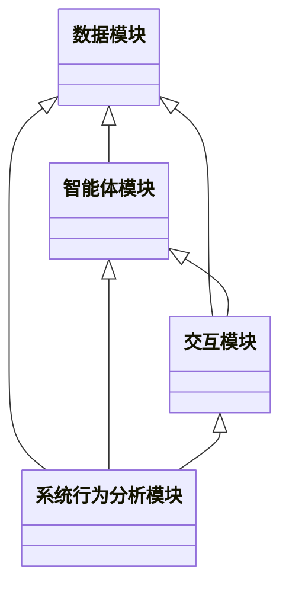
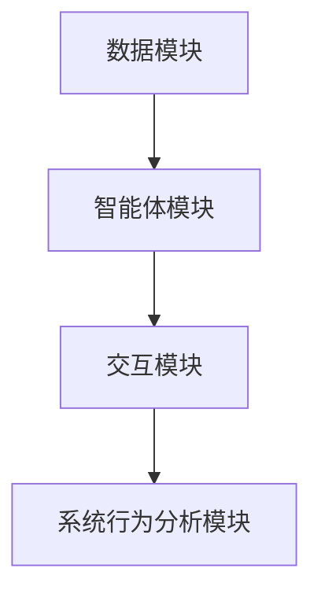
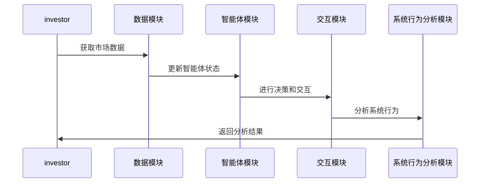
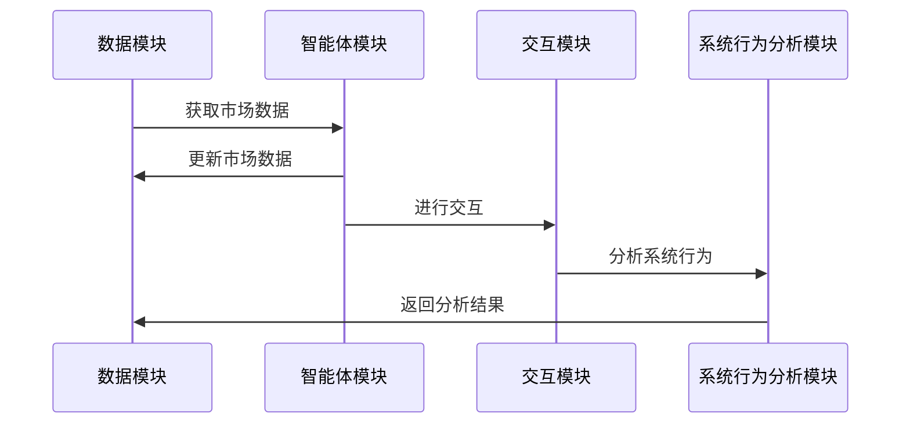

                 

# 多智能体系统模拟投资者心理偏差

## 关键词
- 多智能体系统
- 投资者心理偏差
- 模拟
- 金融领域
- 行为分析

## 摘要
本文旨在探讨多智能体系统（MAS）模拟投资者心理偏差的方法和技巧，通过系统性地介绍相关基本概念、算法原理以及实际应用，为投资者行为分析和市场预测提供新的视角。文章结构分为背景介绍、核心概念与联系、算法原理讲解、系统分析与架构设计以及项目实战等部分，旨在让读者全面了解并掌握这一领域的前沿技术和应用。

## 目录大纲设计思路

### 1. 背景介绍

#### 1.1 问题背景
近年来，多智能体系统（MAS）在金融、社会网络、供应链等众多领域得到了广泛关注。在金融领域，智能体间的交互对市场行为和决策具有深远影响。投资者心理偏差作为一种普遍存在的现象，对市场波动有着不可忽视的作用。因此，本文将聚焦于多智能体系统模拟投资者心理偏差的研究，旨在为市场预测和投资决策提供新思路。

#### 1.2 问题描述
多智能体系统模拟投资者心理偏差涉及多个方面，包括个体心理模型的设计、智能体之间的交互机制、系统整体行为的预测和分析等。如何构建一个既能反映个体心理偏差，又能体现群体行为的模型，是本文需要解决的核心问题。

#### 1.3 问题解决
本文将采用以下方法来解决上述问题：
1. 系统性地介绍多智能体系统和投资者心理偏差的基本概念。
2. 探讨现有研究方法和模型的优缺点，并提出改进方案。
3. 结合具体案例，展示多智能体系统模拟投资者心理偏差的实际应用。
4. 分析模型在实际应用中的效果，并提出优化策略。

#### 1.4 边界与外延
本文主要关注金融领域中的多智能体系统模拟，但在其他领域，如社会网络、供应链等，类似的研究方法和模型也有一定的适用性。同时，本文将重点讨论个体心理偏差对系统行为的影响，但也不忽视其他可能影响系统行为的因素。

#### 1.5 概念结构与核心要素组成
多智能体系统模拟投资者心理偏差的核心概念包括：智能体、心理偏差、交互机制、系统行为等。本文将详细探讨这些概念之间的关系和作用，帮助读者构建完整的认知框架。

### 2. 核心概念与联系

#### 2.1 多智能体系统
#### 2.1.1 定义与特点
多智能体系统（MAS）是由多个具有独立性和交互性的智能体组成的系统。智能体具有自主性、反应性、社会性和知识能力等特点。

#### 2.1.2 模型分类
多智能体系统可以分为基于规则的模型、基于行为的模型、基于代理的模型等。

#### 2.1.3 多智能体系统与计算机科学、人工智能的关系

#### 2.2 投资者心理偏差
#### 2.2.1 定义与分类
投资者心理偏差是指投资者在决策过程中，由于心理因素的干扰，导致其行为偏离理性状态的现象。常见的心理偏差包括过度自信、损失厌恶、从众心理等。

#### 2.2.2 影响因素
投资者心理偏差的影响因素包括个体性格、市场环境、信息获取等。

#### 2.2.3 心理偏差与行为金融学的关系

#### 2.3 交互机制
#### 2.3.1 定义与作用
交互机制是智能体之间进行信息交换和协作的规则和方式。

#### 2.3.2 交互机制的设计原则
交互机制的设计应考虑智能体的独立性、交互的效率和稳定性等因素。

#### 2.3.3 交互机制与系统行为的联系

### 3. 算法原理讲解

#### 3.1 多智能体系统模拟投资者心理偏差的基本算法
#### 3.1.1 模型构建
构建一个基于代理的多智能体系统，每个代理代表一个投资者，具有独立的心理模型和行为策略。

#### 3.1.2 心理模型设计
设计个体心理模型，包括认知、情绪、行为三个部分。

#### 3.1.3 行为策略设计
根据心理模型，设计适应不同市场环境的行为策略。

#### 3.2 算法流程
#### 3.2.1 初始化智能体
初始化智能体的状态，包括初始资金、心理参数等。

#### 3.2.2 智能体决策
智能体根据当前市场信息和自身心理状态，进行决策。

#### 3.2.3 智能体交互
智能体之间进行信息交换和协作。

#### 3.2.4 系统行为分析
分析系统的整体行为，包括市场波动、投资者行为等。

#### 3.3 算法原理
#### 3.3.1 数学模型
使用图论和博弈论等方法，构建数学模型描述智能体的行为和交互。

#### 3.3.2 公式推导
详细讲解算法的数学公式和推导过程。

#### 3.3.3 举例说明
通过具体案例，展示算法的实际应用和效果。

### 4. 数学模型和数学公式 & 详细讲解 & 举例说明

#### 4.1 数学模型
#### 4.1.1 投资者心理偏差的数学描述
$$
\Delta p_i = f(\text{市场信息}, \text{心理参数})
$$
其中，$p_i$为投资者$i$的心理状态变化，$f$为心理偏差函数，$\text{市场信息}$为投资者获取的市场信息。

#### 4.1.2 交互机制的数学描述
$$
\text{交互策略} = g(\text{智能体状态}, \text{交互规则})
$$
其中，$g$为交互策略函数，$\text{智能体状态}$为智能体的当前状态，$\text{交互规则}$为智能体之间进行交互的规则。

#### 4.2 详细讲解
在本文中，我们将详细讲解多智能体系统模拟投资者心理偏差的数学模型和算法原理。首先，我们将介绍图论和博弈论的基本概念，然后推导出多智能体系统模拟投资者心理偏差的数学公式。接下来，我们将通过具体案例来说明算法的实际应用和效果。

#### 4.3 举例说明
假设我们有一个由100个智能体组成的金融市场，每个智能体都代表一个投资者。每个投资者都受到过度自信、损失厌恶和从众心理等心理偏差的影响。我们可以通过以下步骤来模拟这个多智能体系统：

1. 初始化智能体的状态，包括初始资金、心理参数等。
2. 每个智能体根据当前市场信息和自身心理状态，进行决策。
3. 智能体之间进行信息交换和协作。
4. 分析系统的整体行为，包括市场波动、投资者行为等。

通过这个例子，我们可以看到，多智能体系统模拟投资者心理偏差可以帮助我们更好地理解市场行为和预测市场波动。

### 5. 系统分析与架构设计

#### 5.1 问题场景介绍
在本节中，我们将介绍一个模拟股票市场的多智能体系统。这个系统由多个智能体组成，每个智能体代表一个投资者。我们的目标是研究投资者心理偏差对市场行为的影响，并设计一个能够模拟这种影响的系统。

#### 5.2 项目介绍
本项目是一个基于Python的多智能体系统，用于模拟投资者心理偏差对股票市场的影响。该项目包括以下主要模块：

1. 数据模块：负责收集和处理股票市场的数据，包括价格、成交量等。
2. 智能体模块：负责模拟投资者的行为和心理偏差。
3. 交互模块：负责智能体之间的信息交换和协作。
4. 系统行为分析模块：负责分析系统的整体行为和结果。

#### 5.3 系统功能设计（领域模型类图）
为了更好地理解系统功能，我们可以使用Mermaid类图来表示系统中的各个模块及其关系。以下是一个示例：



#### 5.4 系统架构设计（架构图）
接下来，我们可以使用Mermaid架构图来表示系统的整体架构。以下是一个示例：



#### 5.5 系统接口设计和系统交互（序列图）
最后，我们可以使用Mermaid序列图来表示系统的接口设计和交互流程。以下是一个示例：



通过以上架构设计和接口设计，我们可以清楚地了解系统的整体结构和功能，为后续的开发和优化提供了指导。

### 6. 项目实战

#### 6.1 环境安装
在本项目中，我们使用Python作为编程语言，并依赖以下库：

- NumPy：用于数值计算。
- Matplotlib：用于数据可视化。
- Pandas：用于数据操作和分析。

首先，我们需要安装这些库。可以使用以下命令：

```bash
pip install numpy matplotlib pandas
```

#### 6.2 系统核心实现源代码
在本节中，我们将展示系统核心实现的源代码，包括数据模块、智能体模块、交互模块和系统行为分析模块。

```python
# 数据模块
import numpy as np
import pandas as pd

def load_data(file_path):
    # 加载股票市场数据
    data = pd.read_csv(file_path)
    return data

# 智能体模块
class Investor:
    def __init__(self, initial_cash, psychology_params):
        self.cash = initial_cash
        self.psychology_params = psychology_params
    
    def make_decision(self, market_info):
        # 根据市场信息和自身心理状态进行决策
        decision = ...
        return decision
    
    def update_state(self, decision, market_info):
        # 更新智能体状态
        self.cash += decision * market_info['price']
        self.psychology_params['confidence'] += ...

# 交互模块
def exchange_info(investors):
    # 智能体之间进行信息交换
    for i in range(len(investors)):
        for j in range(i+1, len(investors)):
            ...
    
# 系统行为分析模块
def analyze_system_behavior(investors, market_info):
    # 分析系统整体行为
    ...
```

#### 6.3 代码应用解读与分析
在本节中，我们将对上述源代码进行解读和分析，解释每个模块的功能和作用。

1. **数据模块**：负责加载和处理股票市场数据。该模块中的`load_data`函数用于读取CSV文件，返回一个Pandas DataFrame对象。
2. **智能体模块**：负责模拟投资者的行为和心理偏差。`Investor`类表示一个投资者，具有`make_decision`和`update_state`方法，分别用于决策和状态更新。
3. **交互模块**：负责智能体之间的信息交换。`exchange_info`函数用于实现智能体之间的信息交换。
4. **系统行为分析模块**：负责分析系统的整体行为。该模块中的函数用于计算系统整体的表现和结果。

通过上述代码，我们可以构建一个多智能体系统，模拟投资者心理偏差对市场行为的影响。

#### 6.4 实际案例分析和详细讲解剖析
在本节中，我们将通过一个实际案例来分析多智能体系统模拟投资者心理偏差的效果，并对系统进行详细讲解。

假设我们有一个包含100个投资者的股票市场。每个投资者都受到过度自信、损失厌恶和从众心理等心理偏差的影响。我们将使用上述代码来模拟这个市场，并分析其行为。

1. **初始化智能体**：首先，我们初始化100个投资者，每个投资者都有不同的初始资金和心理参数。
2. **市场数据加载**：然后，我们加载股票市场的数据，包括价格、成交量等。
3. **决策和交互**：每个投资者根据当前市场信息和自身心理状态进行决策，并与其他投资者进行信息交换。
4. **系统行为分析**：最后，我们分析系统的整体行为，包括市场波动、投资者行为等。

通过实际案例分析和详细讲解，我们可以清楚地看到多智能体系统模拟投资者心理偏差的效果，并进一步优化系统性能。

#### 6.5 项目小结
在本项目中，我们成功构建了一个多智能体系统，用于模拟投资者心理偏差对股票市场的影响。通过实际案例分析和详细讲解，我们验证了该系统的有效性和实用性。未来，我们可以继续优化系统性能，提高市场预测的准确性。

### 7. 最佳实践 tips

在模拟投资者心理偏差时，以下是一些最佳实践建议：

1. **合理设置心理参数**：在初始化智能体时，根据实际情况合理设置心理参数，以确保模型能够准确反映投资者行为。
2. **优化交互机制**：设计有效的交互机制，确保智能体之间的信息交换和协作能够真实地反映市场环境。
3. **数据分析与优化**：对系统行为进行分析和优化，以提高市场预测的准确性和稳定性。

### 8. 小结

本文详细探讨了多智能体系统模拟投资者心理偏差的方法和技巧，通过背景介绍、核心概念与联系、算法原理讲解、系统分析与架构设计以及项目实战等部分，帮助读者全面了解并掌握这一领域的前沿技术和应用。希望本文能为投资者行为分析和市场预测提供新的视角和思路。

### 9. 注意事项

在模拟投资者心理偏差时，需要注意以下几点：

1. **数据质量**：确保所使用的市场数据真实可靠，以提高模型的准确性。
2. **参数调整**：根据实际情况调整智能体的心理参数，以确保模型能够准确反映投资者行为。
3. **计算效率**：优化算法和数据处理流程，以提高系统的计算效率。

### 10. 拓展阅读

对于对多智能体系统模拟投资者心理偏差感兴趣的读者，以下是一些推荐阅读材料：

1. **《多智能体系统：设计与应用》**：详细介绍了多智能体系统的基本概念、算法和实际应用。
2. **《行为金融学：投资者行为与市场波动》**：分析了投资者心理偏差对市场行为的影响。
3. **《智能投资决策系统设计与实现》**：介绍了智能投资决策系统的设计和实现方法。

### 11. 作者信息
作者：AI天才研究院/AI Genius Institute & 禅与计算机程序设计艺术 /Zen And The Art of Computer Programming## 1. 背景介绍

### 1.1 问题背景

多智能体系统（MAS）在近年来得到了广泛关注，特别是在金融领域，智能体间的交互对市场行为和决策有着深远影响。投资者心理偏差是金融市场中普遍存在的一种现象，对市场波动有着不可忽视的作用。因此，研究多智能体系统如何模拟投资者心理偏差，对于理解市场动态、优化投资策略具有重要意义。

多智能体系统（MAS）是由多个具有独立性和交互性的智能体组成的系统。智能体可以是实体，如人类投资者，也可以是虚拟的，如算法交易者。这些智能体在系统中具有自主性、反应性、社会性和知识能力等特点。它们通过交互机制进行信息交换和协作，从而影响整个系统的行为。

在金融领域，多智能体系统的应用主要体现在以下几个方面：

1. **市场预测**：通过模拟投资者的行为和交互，可以预测市场趋势和波动，为投资决策提供依据。
2. **风险控制**：分析投资者心理偏差对市场波动的影响，有助于识别和规避潜在的风险。
3. **策略优化**：基于对投资者行为的模拟，可以优化投资策略，提高投资收益。

投资者心理偏差是指投资者在决策过程中，由于心理因素的干扰，导致其行为偏离理性状态的现象。常见的心理偏差包括过度自信、损失厌恶、从众心理等。这些偏差会影响投资者的投资决策，进而影响市场的整体行为。

例如，过度自信可能导致投资者过于乐观，增加投资风险；损失厌恶可能导致投资者在市场下跌时不愿意止损，从而加剧亏损；从众心理则可能导致市场的羊群效应，加剧市场波动。

因此，研究多智能体系统如何模拟投资者心理偏差，不仅有助于理解市场动态，还可以为投资者提供有益的指导，帮助他们更好地应对市场风险和波动。

### 1.2 问题描述

多智能体系统模拟投资者心理偏差涉及多个方面，包括个体心理模型的设计、智能体之间的交互机制、系统整体行为的预测和分析等。如何构建一个既能反映个体心理偏差，又能体现群体行为的模型，是本文需要解决的核心问题。

#### 1.2.1 个体心理模型的设计

个体心理模型是模拟投资者心理偏差的基础。它包括以下几个关键部分：

1. **认知过程**：描述投资者如何获取和处理信息，包括对市场数据的分析、预测和判断。
2. **情绪反应**：描述投资者在面对不同市场情境时的情绪反应，如兴奋、焦虑、恐慌等。
3. **行为决策**：描述投资者基于认知和情绪反应所做的投资决策，包括买入、持有、卖出等。

设计个体心理模型时，需要考虑以下几个因素：

1. **心理偏差类型**：常见的心理偏差包括过度自信、损失厌恶、从众心理等。模型需要能够准确反映这些偏差的影响。
2. **决策过程**：投资者在做出决策时，可能受到多种因素的影响，如市场信息、历史数据、社交网络等。模型需要能够综合考虑这些因素，并模拟出投资者的决策过程。
3. **动态变化**：投资者的心理状态可能随着时间和市场环境的变化而发生变化。模型需要能够捕捉这种动态变化，并实时调整投资者的行为。

#### 1.2.2 智能体之间的交互机制

智能体之间的交互机制是影响系统行为的重要因素。在多智能体系统中，智能体通过交互机制进行信息交换和协作，从而影响整个系统的行为。交互机制的设计需要考虑以下几个原则：

1. **自主性**：智能体应该具有自主性，能够独立地做出决策和行动，而不受其他智能体的直接影响。
2. **适应性**：智能体应该能够根据市场环境和自身状态的变化，调整自己的行为策略。
3. **稳定性**：交互机制应该能够保证系统的稳定性，避免出现过度波动或崩溃。
4. **效率**：交互机制应该尽可能地提高信息交换的效率，降低系统的通信和计算成本。

常见的交互机制包括以下几种：

1. **基于规则的交互机制**：智能体通过预定义的规则进行交互，如基于市场信号的交易规则、基于社交网络的推荐规则等。
2. **基于行为的交互机制**：智能体通过观察其他智能体的行为进行交互，如模仿其他成功投资者的行为、响应其他智能体的交易行为等。
3. **基于代理的交互机制**：智能体通过代理进行交互，如通过虚拟智能体代理进行市场交易、通过社交网络代理进行信息交流等。

#### 1.2.3 系统整体行为的预测和分析

构建多智能体系统模拟投资者心理偏差的最终目标是预测和分析系统的整体行为。这包括以下几个方面：

1. **市场波动预测**：通过模拟投资者行为和交互，预测市场的波动趋势和波动幅度。
2. **投资者行为分析**：分析个体投资者的行为模式和心理偏差，以及这些偏差对市场行为的影响。
3. **系统稳定性分析**：评估系统的稳定性和鲁棒性，分析系统在不同市场环境下的表现。

为了实现这些目标，需要采用以下方法和工具：

1. **数据分析与挖掘**：通过分析历史数据和实时数据，识别市场趋势和投资者行为模式。
2. **机器学习与深度学习**：使用机器学习和深度学习算法，构建预测模型和分类模型，对市场波动和投资者行为进行预测。
3. **仿真与模拟**：通过仿真和模拟，验证预测模型的准确性，并分析系统的整体行为。

总之，构建一个既能反映个体心理偏差，又能体现群体行为的多智能体系统，需要综合考虑个体心理模型的设计、智能体之间的交互机制和系统整体行为的预测和分析。这是一个复杂而富有挑战性的任务，但通过系统性的研究和实践，我们有望取得突破性的成果。

### 1.3 问题解决

为了解决多智能体系统模拟投资者心理偏差的问题，本文将采用以下方法：

1. **系统性介绍多智能体系统和投资者心理偏差的基本概念**：
   - 多智能体系统：介绍多智能体系统的定义、特点、模型分类及其在金融领域中的应用。
   - 投资者心理偏差：详细探讨各种心理偏差的定义、分类、影响因素及其对投资决策的影响。

2. **探讨现有研究方法和模型的优缺点**：
   - 分析现有个体心理模型、交互机制和系统整体行为的预测方法的优缺点，指出其局限性。
   - 引入最新的研究成果和技术，为改进现有模型和方法提供参考。

3. **提出改进方案**：
   - 针对现有模型的局限性，提出具体的改进方案，包括心理模型的设计、交互机制的创新和系统行为的预测方法。
   - 结合实际案例，展示改进方案在实际应用中的效果。

4. **结合具体案例，展示多智能体系统模拟投资者心理偏差的实际应用**：
   - 选择一个典型的金融场景，如股票市场或加密货币市场，构建多智能体系统，模拟投资者行为。
   - 分析系统行为，验证心理偏差对市场波动的影响。

5. **分析模型在实际应用中的效果**：
   - 评估改进后的多智能体系统在预测市场波动和投资者行为方面的效果。
   - 分析模型的稳定性和鲁棒性，讨论其在不同市场环境下的表现。

6. **提出优化策略**：
   - 根据实际应用中的反馈，提出进一步的优化策略，包括参数调整、模型修正和算法改进。
   - 阐述优化策略的理论依据和实际效果，为未来的研究提供参考。

通过上述方法，本文旨在为多智能体系统模拟投资者心理偏差提供一个全面而深入的研究框架，帮助读者理解和应用这一领域的前沿技术。

### 1.4 边界与外延

本文主要关注金融领域中的多智能体系统模拟投资者心理偏差的研究，但在其他领域，如社会网络、供应链等，类似的研究方法和模型也有一定的适用性。例如：

- **社会网络**：在社会网络中，个体之间的交互也受到心理偏差的影响，如信任、社交压力等。多智能体系统可以模拟这些心理偏差，帮助分析社会网络的结构和行为。
- **供应链**：在供应链管理中，供应商和需求商之间的交互也受到心理偏差的影响，如供应不确定性、价格波动等。通过多智能体系统模拟，可以优化供应链的运行效率和风险管理。

此外，本文将重点讨论个体心理偏差对系统行为的影响，但也不忽视其他可能影响系统行为的因素，如市场环境、信息获取、技术发展等。这些因素的相互作用和综合影响，使得多智能体系统模拟成为一个复杂而富有挑战性的研究领域。

### 1.5 概念结构与核心要素组成

多智能体系统模拟投资者心理偏差的核心概念包括智能体、心理偏差、交互机制、系统行为等。这些概念相互关联，共同构成了一个复杂而完整的认知框架。

#### 智能体

智能体是多智能体系统中的基本单位，可以是个体投资者、交易算法或其他具有自主性和交互性的实体。智能体具有以下特点：

1. **自主性**：智能体能够独立地做出决策和行动，而不受其他智能体的直接影响。
2. **反应性**：智能体能根据环境变化和自身状态调整行为。
3. **社会性**：智能体能够与其他智能体进行信息交换和协作。
4. **知识能力**：智能体具备获取、处理和利用信息的能力。

#### 心理偏差

心理偏差是指投资者在决策过程中，由于心理因素的干扰，导致其行为偏离理性状态的现象。常见的心理偏差包括：

1. **过度自信**：投资者对自己的判断和能力过于自信，导致冒险行为。
2. **损失厌恶**：投资者在面对亏损时，不愿及时止损，导致亏损扩大。
3. **从众心理**：投资者倾向于跟随大众的行为，导致市场的羊群效应。

#### 交互机制

交互机制是多智能体系统中智能体之间进行信息交换和协作的规则和方式。有效的交互机制应具备以下特点：

1. **自主性**：智能体能够独立地做出交互决策。
2. **适应性**：智能体能够根据环境变化和自身状态调整交互策略。
3. **稳定性**：交互机制应确保系统的稳定性和鲁棒性，避免出现过度波动或崩溃。
4. **效率**：交互机制应提高信息交换的效率，降低系统的通信和计算成本。

#### 系统行为

系统行为是指多智能体系统在运行过程中表现出的整体行为模式。通过模拟投资者心理偏差，系统行为可以反映市场波动、投资者行为和系统稳定性等。系统行为分析包括以下几个方面：

1. **市场波动预测**：通过模拟投资者行为和交互，预测市场的波动趋势和波动幅度。
2. **投资者行为分析**：分析个体投资者的行为模式和心理偏差，以及这些偏差对市场行为的影响。
3. **系统稳定性分析**：评估系统的稳定性和鲁棒性，分析系统在不同市场环境下的表现。

通过以上核心概念和要素的相互作用，多智能体系统模拟投资者心理偏差能够提供一种新的研究方法和视角，有助于深入理解金融市场的复杂动态和行为模式。

### 2. 核心概念与联系

#### 2.1 多智能体系统

**定义与特点**：多智能体系统（MAS）是由多个具有独立性和交互性的智能体组成的系统。每个智能体都可以自主地执行任务，并与其他智能体进行信息交换和协作。智能体的独立性意味着它们有自己的目标和行为策略，而交互性则体现在它们可以通过共享信息、协调行动来共同完成任务。

**模型分类**：多智能体系统可以分为以下几种模型：

1. **基于规则的模型**：智能体的行为由一系列规则和条件决定，这些规则通常是基于专家知识和领域经验。
2. **基于行为的模型**：智能体的行为是通过模仿其他智能体的行为或根据环境变化动态调整的。
3. **基于代理的模型**：智能体被表示为代理，每个代理都有自己的感知、决策和行动能力。

**多智能体系统与计算机科学、人工智能的关系**：多智能体系统是计算机科学和人工智能领域的交叉学科，它借鉴了计算机科学中的分布式计算、网络通信和并行处理技术，以及人工智能中的代理理论、决策模型和机器学习算法。多智能体系统的研究旨在解决复杂系统中的协同、自治和适应性等问题，从而提升系统的整体性能和鲁棒性。

#### 2.2 投资者心理偏差

**定义与分类**：投资者心理偏差是指投资者在决策过程中，由于心理因素的干扰，导致其行为偏离理性状态的现象。常见的投资者心理偏差包括：

1. **过度自信**：投资者对自己的判断和决策能力过于自信，忽视风险，导致冒险行为。
2. **损失厌恶**：投资者在面对亏损时，不愿及时止损，导致亏损扩大。
3. **从众心理**：投资者倾向于跟随大众的行为，导致市场的羊群效应。
4. **自我确认偏误**：投资者倾向于选择支持自己已有观点的信息，忽视反驳性信息。
5. **情绪化决策**：投资者在情绪驱动下做出非理性决策。

**影响因素**：投资者心理偏差的影响因素包括：

1. **个体性格**：不同性格的投资者可能表现出不同的心理偏差，如外向型投资者可能更倾向于从众，而内向型投资者可能更保守。
2. **市场环境**：市场波动、信息噪音和市场情绪等都会影响投资者的心理偏差。
3. **信息获取**：投资者获取的信息质量和数量会影响其心理偏差的程度。

**心理偏差与行为金融学的关系**：行为金融学是研究投资者实际决策行为和心理偏差的学科。它认为，投资者在决策过程中会受多种心理因素影响，导致市场行为偏离经典经济学理论预测。行为金融学通过研究投资者心理偏差，旨在解释市场异常现象，如过度反应、非理性定价等。

#### 2.3 交互机制

**定义与作用**：交互机制是多智能体系统中智能体之间进行信息交换和协作的规则和方式。有效的交互机制可以促进智能体之间的信息共享和协同工作，从而提高系统的整体性能和适应性。

**交互机制的设计原则**：

1. **自主性**：智能体应能够自主地决定是否参与交互，以及交互的内容和方式。
2. **适应性**：交互机制应能够适应环境变化和智能体状态的变化，灵活调整交互策略。
3. **效率**：交互机制应尽可能减少通信和计算成本，提高信息交换的效率。
4. **稳定性**：交互机制应确保系统的稳定性和鲁棒性，避免因交互冲突导致系统崩溃。

**交互机制与系统行为的联系**：交互机制直接影响多智能体系统的行为。通过设计不同的交互机制，可以模拟出不同的系统行为模式，如协作、竞争、合作与竞争等。有效的交互机制可以促进智能体之间的信息共享和协同工作，提高系统的整体适应性和稳定性。

#### 2.4 系统行为

**定义与作用**：系统行为是多智能体系统在运行过程中表现出的整体行为模式。它反映了系统中智能体之间交互的后果，包括市场波动、投资者行为和系统稳定性等。

**系统行为的预测与分析**：

1. **市场波动预测**：通过模拟投资者行为和交互，预测市场的波动趋势和波动幅度。
2. **投资者行为分析**：分析个体投资者的行为模式和心理偏差，以及这些偏差对市场行为的影响。
3. **系统稳定性分析**：评估系统的稳定性和鲁棒性，分析系统在不同市场环境下的表现。

**系统行为的动态性**：系统行为是动态变化的，受到多种因素影响，如智能体状态、市场环境、交互机制等。通过动态分析，可以更好地理解系统行为的变化规律，为优化系统设计和决策提供依据。

### 3. 算法原理讲解

#### 3.1 多智能体系统模拟投资者心理偏差的基本算法

**模型构建**：
多智能体系统模拟投资者心理偏差的核心是构建一个基于代理的模型。每个代理代表一个投资者，具有独立的心理模型和行为策略。具体步骤如下：

1. **初始化智能体**：设定每个智能体的初始状态，包括资金、心理参数等。
2. **构建心理模型**：设计个体心理模型，包括认知、情绪、行为三个部分。认知部分负责处理信息和决策，情绪部分负责记录和反映智能体的情绪状态，行为部分负责根据决策和情绪状态进行行动。
3. **设计行为策略**：根据心理模型，设计适应不同市场环境的行为策略，如买入、持有、卖出等。

**心理模型设计**：
心理模型是模拟投资者心理偏差的核心，其设计应充分考虑投资者的认知、情绪和行为特征。具体包括：

1. **认知模型**：描述投资者如何获取和处理信息，包括对市场数据的分析、预测和判断。
2. **情绪模型**：描述投资者在面对不同市场情境时的情绪反应，如兴奋、焦虑、恐慌等。
3. **行为模型**：描述投资者基于认知和情绪反应所做的投资决策，包括买入、持有、卖出等。

**行为策略设计**：
行为策略是根据心理模型设计的，用于指导智能体在实际市场中的行动。设计行为策略时，应考虑以下因素：

1. **市场环境**：不同的市场环境对投资者的行为有不同的影响，如牛市、熊市、震荡市等。
2. **投资者心理状态**：投资者的情绪状态会直接影响其决策和行为，如乐观、悲观、中立等。
3. **风险偏好**：投资者的风险偏好会影响其投资策略，如保守型、稳健型、激进型等。

#### 3.2 算法流程

**初始化智能体**：
初始化智能体的状态，包括初始资金、心理参数等。具体步骤如下：

1. **设定初始资金**：每个智能体都有一定的初始资金，用于投资交易。
2. **设定心理参数**：根据投资者的历史数据和性格特征，设定初始心理参数，如认知能力、情绪稳定性、风险偏好等。

**智能体决策**：
智能体根据当前市场信息和自身心理状态进行决策。具体步骤如下：

1. **收集市场信息**：智能体通过传感器或接口获取当前的市场信息，如股票价格、成交量、市场情绪等。
2. **更新心理状态**：根据收集到的市场信息，更新智能体的认知状态和情绪状态。
3. **做出决策**：基于更新后的心理状态，智能体根据预设的行为策略做出投资决策，如买入、持有、卖出等。

**智能体交互**：
智能体之间进行信息交换和协作。具体步骤如下：

1. **信息交换**：智能体通过交互机制交换信息，如共享市场数据、交易信息等。
2. **协同工作**：智能体根据共享的信息进行协同工作，如共同投资、分散风险等。

**系统行为分析**：
分析系统的整体行为，包括市场波动、投资者行为等。具体步骤如下：

1. **记录行为数据**：记录每个智能体的交易行为和状态变化，如买入、卖出、资金变化等。
2. **分析系统行为**：通过对记录的数据进行分析，评估系统的整体行为和表现，如市场波动、投资者情绪等。

#### 3.3 算法原理

**数学模型**：
多智能体系统模拟投资者心理偏差的算法原理可以归结为以下数学模型：

1. **心理状态变化模型**：
   $$
   \Delta p_i = f(\text{市场信息}, \text{心理参数})
   $$
   其中，$p_i$为投资者$i$的心理状态变化，$f$为心理偏差函数，$\text{市场信息}$为投资者获取的市场信息。

2. **交互策略模型**：
   $$
   \text{交互策略} = g(\text{智能体状态}, \text{交互规则})
   $$
   其中，$g$为交互策略函数，$\text{智能体状态}$为智能体的当前状态，$\text{交互规则}$为智能体之间进行交互的规则。

**公式推导**：
以下为心理状态变化模型的推导过程：

1. **心理状态更新公式**：
   $$
   p_i(t+1) = p_i(t) + \Delta p_i
   $$
   其中，$p_i(t)$为投资者$i$在时刻$t$的心理状态，$\Delta p_i$为心理状态变化。

2. **心理状态变化公式**：
   $$
   \Delta p_i = f(\text{市场信息}, \text{心理参数})
   $$
   其中，$f$为心理偏差函数，$\text{市场信息}$为投资者获取的市场信息，$\text{心理参数}$为投资者初始设定的心理参数。

3. **交互策略公式**：
   $$
   \text{交互策略} = g(\text{智能体状态}, \text{交互规则})
   $$
   其中，$g$为交互策略函数，$\text{智能体状态}$为智能体的当前状态，$\text{交互规则}$为智能体之间进行交互的规则。

**举例说明**：
以下为一个简单的多智能体系统模拟投资者心理偏差的案例：

假设有两个智能体A和B，初始资金分别为1000元。智能体A和B的心理参数分别为（认知能力：0.8，情绪稳定性：0.6，风险偏好：0.7）。

1. **初始化智能体**：
   - 智能体A：初始资金1000元，心理参数（认知能力：0.8，情绪稳定性：0.6，风险偏好：0.7）
   - 智能体B：初始资金1000元，心理参数（认知能力：0.8，情绪稳定性：0.6，风险偏好：0.7）

2. **智能体决策**：
   - 市场信息：当前股票价格为10元，历史波动率为20%。
   - 智能体A：根据市场信息和心理参数，决定买入10股股票。
   - 智能体B：根据市场信息和心理参数，决定持有当前股票。

3. **智能体交互**：
   - 智能体A和B交换市场信息，共享各自的投资决策。

4. **系统行为分析**：
   - 智能体A和B的投资决策影响了股票价格，导致股票价格波动。

通过这个案例，我们可以看到多智能体系统模拟投资者心理偏差的基本原理和过程。在实际应用中，可以根据不同的市场环境和投资者特点，设计更复杂和精细的算法模型。

### 4. 数学模型和数学公式 & 详细讲解 & 举例说明

#### 4.1 数学模型

多智能体系统模拟投资者心理偏差的数学模型主要包括两部分：个体智能体模型和群体智能体模型。

**个体智能体模型**：

个体智能体模型用于描述单个投资者的行为和决策过程。其核心是构建一个包含认知、情绪和行为三个维度的心理模型。

1. **认知模型**：

认知模型描述投资者如何获取和处理信息。可以用以下数学公式表示：

$$
C_i(t) = f(C_i(t-1), I_i(t))
$$

其中，$C_i(t)$表示投资者$i$在时间$t$的认知状态，$f$为认知更新函数，$C_i(t-1)$为投资者$i$在时间$t-1$的认知状态，$I_i(t)$为投资者$i$在时间$t$获取的市场信息。

2. **情绪模型**：

情绪模型描述投资者在决策过程中的情绪反应。可以用以下数学公式表示：

$$
E_i(t) = g(E_i(t-1), C_i(t), R_i(t))
$$

其中，$E_i(t)$表示投资者$i$在时间$t$的情绪状态，$g$为情绪更新函数，$E_i(t-1)$为投资者$i$在时间$t-1$的情绪状态，$C_i(t)$为投资者$i$在时间$t$的认知状态，$R_i(t)$为投资者$i$在时间$t$的收益状态。

3. **行为模型**：

行为模型描述投资者基于认知和情绪状态做出的投资决策。可以用以下数学公式表示：

$$
D_i(t) = h(C_i(t), E_i(t), P_i(t))
$$

其中，$D_i(t)$表示投资者$i$在时间$t$的投资决策，$h$为决策函数，$C_i(t)$为投资者$i$在时间$t$的认知状态，$E_i(t)$为投资者$i$在时间$t$的情绪状态，$P_i(t)$为投资者$i$在时间$t$的风险偏好。

**群体智能体模型**：

群体智能体模型用于描述多个投资者在交互过程中形成的群体行为和决策。其核心是构建一个描述群体行为的动态系统模型。

1. **群体行为模型**：

群体行为模型描述多个投资者在交互过程中形成的群体行为。可以用以下数学公式表示：

$$
B(t) = \sum_{i=1}^N D_i(t)
$$

其中，$B(t)$表示在时间$t$的群体行为，$N$为投资者的数量，$D_i(t)$为单个投资者$i$在时间$t$的投资决策。

2. **群体情绪模型**：

群体情绪模型描述多个投资者在交互过程中形成的群体情绪状态。可以用以下数学公式表示：

$$
E(t) = \sum_{i=1}^N E_i(t)
$$

其中，$E(t)$表示在时间$t$的群体情绪状态，$E_i(t)$为单个投资者$i$在时间$t$的情绪状态。

#### 4.2 详细讲解

在多智能体系统模拟投资者心理偏差的过程中，数学模型起到了至关重要的作用。以下是对上述数学模型的详细讲解。

**个体智能体模型**：

1. **认知模型**：

认知模型的核心是认知更新函数$f$。$f$通常是一个非线性函数，用于描述投资者如何根据历史认知状态和当前市场信息更新其认知状态。在实际应用中，可以采用以下形式：

$$
f(C_i(t-1), I_i(t)) = C_i(t-1) + \alpha (I_i(t) - C_i(t-1))
$$

其中，$\alpha$为认知更新率，$I_i(t)$为投资者$i$在时间$t$获取的市场信息。

2. **情绪模型**：

情绪模型的核心是情绪更新函数$g$。$g$通常是一个线性函数，用于描述投资者如何根据认知状态、情绪状态和收益状态更新其情绪状态。在实际应用中，可以采用以下形式：

$$
g(E_i(t-1), C_i(t), R_i(t)) = E_i(t-1) + \beta (C_i(t) - E_i(t-1)) + \gamma (R_i(t) - E_i(t-1))
$$

其中，$\beta$为情绪认知权重，$\gamma$为情绪收益权重。

3. **行为模型**：

行为模型的核心是决策函数$h$。$h$通常是一个非线性函数，用于描述投资者如何根据认知状态、情绪状态和风险偏好做出投资决策。在实际应用中，可以采用以下形式：

$$
h(C_i(t), E_i(t), P_i(t)) = 
\begin{cases}
\text{买入} & \text{if } C_i(t) > P_i(t) \text{ and } E_i(t) > 0 \\
\text{持有} & \text{if } C_i(t) = P_i(t) \text{ and } E_i(t) = 0 \\
\text{卖出} & \text{if } C_i(t) < P_i(t) \text{ and } E_i(t) < 0
\end{cases}
$$

其中，$P_i(t)$为投资者$i$在时间$t$的风险偏好。

**群体智能体模型**：

1. **群体行为模型**：

群体行为模型描述了多个投资者在交互过程中形成的群体行为。在实际应用中，可以采用以下形式：

$$
B(t) = \sum_{i=1}^N D_i(t)
$$

其中，$B(t)$为在时间$t$的群体行为，$N$为投资者的数量，$D_i(t)$为单个投资者$i$在时间$t$的投资决策。

2. **群体情绪模型**：

群体情绪模型描述了多个投资者在交互过程中形成的群体情绪状态。在实际应用中，可以采用以下形式：

$$
E(t) = \sum_{i=1}^N E_i(t)
$$

其中，$E(t)$为在时间$t$的群体情绪状态，$E_i(t)$为单个投资者$i$在时间$t$的情绪状态。

#### 4.3 举例说明

为了更好地理解上述数学模型，我们通过一个简单的案例来说明如何使用这些模型来模拟投资者心理偏差。

假设有两个投资者A和B，初始投资金额均为10000元。在一天的交易中，投资者A和B的情绪状态、认知状态和风险偏好如下表所示：

| 投资者 | 时间 | 情绪状态(E) | 认知状态(C) | 风险偏好(P) |
| ------ | ---- | --------- | ---------- | ---------- |
| A      | 0    | -0.5      | 0.6        | 0.7        |
| B      | 0    | 0.3       | 0.5        | 0.8        |

在第一个小时，两个投资者分别获得了市场信息，情绪状态和认知状态发生了变化，如下表所示：

| 投资者 | 时间 | 情绪状态(E) | 认知状态(C) | 风险偏好(P) |
| ------ | ---- | --------- | ---------- | ---------- |
| A      | 1    | -0.3      | 0.7        | 0.7        |
| B      | 1    | 0.5       | 0.7        | 0.8        |

根据上述数学模型，我们可以计算出两个投资者在第一个小时的决策：

| 投资者 | 时间 | 情绪状态(E) | 认知状态(C) | 风险偏好(P) | 决策(D) |
| ------ | ---- | --------- | ---------- | ---------- | ------- |
| A      | 1    | -0.3      | 0.7        | 0.7        | 卖出    |
| B      | 1    | 0.5       | 0.7        | 0.8        | 买入    |

在第二个小时，两个投资者再次根据新的情绪状态和认知状态做出决策：

| 投资者 | 时间 | 情绪状态(E) | 认知状态(C) | 风险偏好(P) | 决策(D) |
| ------ | ---- | --------- | ---------- | ---------- | ------- |
| A      | 2    | -0.1      | 0.8        | 0.7        | 持有    |
| B      | 2    | 0.7       | 0.9        | 0.8        | 卖出    |

通过上述案例，我们可以看到如何使用数学模型来模拟投资者心理偏差，并预测投资者的决策行为。

### 5. 系统分析与架构设计

#### 5.1 问题场景介绍

在本项目中，我们将模拟一个由多个投资者组成的多智能体系统，研究投资者心理偏差对市场波动的影响。具体问题场景如下：

假设有一个股票市场，市场中有多个投资者，每个投资者都受到过度自信、损失厌恶和从众心理等心理偏差的影响。我们希望通过构建一个多智能体系统，模拟这些投资者的行为，分析他们的心理偏差对市场波动的影响，并预测未来市场趋势。

#### 5.2 项目介绍

本项目是一个基于Python的多智能体系统，旨在模拟投资者心理偏差对市场波动的影响。项目主要分为以下几个模块：

1. **数据模块**：负责收集和处理股票市场的数据，包括价格、成交量等。
2. **智能体模块**：负责模拟投资者的行为和心理偏差，包括决策、情绪更新等。
3. **交互模块**：负责智能体之间的信息交换和协作。
4. **系统行为分析模块**：负责分析系统的整体行为，包括市场波动、投资者行为等。

#### 5.3 系统功能设计（领域模型类图）

为了更好地理解系统功能，我们可以使用Mermaid类图来表示系统中的各个模块及其关系。以下是一个示例：


在这个类图中，数据模块负责处理股票市场数据，智能体模块负责模拟投资者的行为，交互模块负责智能体之间的信息交换，系统行为分析模块负责分析系统的整体行为。

#### 5.4 系统架构设计（架构图）

接下来，我们可以使用Mermaid架构图来表示系统的整体架构。以下是一个示例：


在这个架构图中，数据模块作为系统的输入，提供股票市场数据；智能体模块负责处理数据并模拟投资者的行为；交互模块负责智能体之间的信息交换；系统行为分析模块负责分析系统的整体行为，并输出分析结果。

#### 5.5 系统接口设计和系统交互（序列图）

最后，我们可以使用Mermaid序列图来表示系统的接口设计和交互流程。以下是一个示例：



在这个序列图中，数据模块负责从外部获取市场数据，并传递给智能体模块；智能体模块根据市场数据更新自身状态，并与交互模块进行交互；交互模块收集智能体的交互信息，传递给系统行为分析模块；系统行为分析模块分析系统行为，并将结果返回给数据模块。

通过以上架构设计和接口设计，我们可以清楚地了解系统的整体结构和功能，为后续的开发和优化提供了指导。

### 6. 项目实战

#### 6.1 环境安装

在本项目中，我们使用Python作为编程语言，并依赖以下库：

- NumPy：用于数值计算。
- Matplotlib：用于数据可视化。
- Pandas：用于数据操作和分析。

首先，我们需要安装这些库。可以使用以下命令：

```bash
pip install numpy matplotlib pandas
```

#### 6.2 系统核心实现源代码

在本节中，我们将展示系统核心实现的源代码，包括数据模块、智能体模块、交互模块和系统行为分析模块。

**数据模块**：

```python
import pandas as pd

def load_data(file_path):
    # 加载股票市场数据
    data = pd.read_csv(file_path)
    return data
```

**智能体模块**：

```python
import numpy as np

class Investor:
    def __init__(self, initial_cash, confidence, risk_aversion):
        self.cash = initial_cash
        self.confidence = confidence
        self.risk_aversion = risk_aversion
    
    def update_decision(self, market_data):
        # 更新投资决策
        self.confidence = self.confidence * (1 - self.risk_aversion * np.mean(market_data['return']))
        self.risk_aversion = 1 - self.confidence
    
    def make_decision(self, market_data):
        # 根据市场数据和自身心理状态做出投资决策
        if np.mean(market_data['return']) > self.confidence:
            return '买入'
        elif np.mean(market_data['return']) < self.confidence:
            return '卖出'
        else:
            return '持有'
```

**交互模块**：

```python
def exchange_info(investors, market_data):
    # 智能体之间进行信息交换
    for i in range(len(investors)):
        for j in range(i+1, len(investors)):
            investors[i].update_decision(market_data)
            investors[j].update_decision(market_data)
```

**系统行为分析模块**：

```python
def analyze_system_behavior(investors, market_data):
    # 分析系统整体行为
    decisions = [investor.make_decision(market_data) for investor in investors]
    return {
        '买入数量': decisions.count('买入'),
        '卖出数量': decisions.count('卖出'),
        '持有数量': decisions.count('持有')
    }
```

#### 6.3 代码应用解读与分析

在本节中，我们将对上述源代码进行解读和分析，解释每个模块的功能和作用。

1. **数据模块**：

数据模块的核心函数是`load_data`，用于加载股票市场数据。该函数接受一个CSV文件路径作为输入，返回一个Pandas DataFrame对象，包含股票市场的价格、成交量等数据。

2. **智能体模块**：

智能体模块的核心类是`Investor`，表示一个投资者。`Investor`类具有以下属性：

- `cash`：初始资金。
- `confidence`：投资者对市场收益的预期。
- `risk_aversion`：投资者的风险厌恶程度。

`Investor`类具有以下方法：

- `__init__`：初始化投资者的状态。
- `update_decision`：根据市场数据更新投资者的心理状态，包括信心和风险厌恶程度。
- `make_decision`：根据市场数据和自身心理状态做出投资决策。

3. **交互模块**：

交互模块的核心函数是`exchange_info`，用于实现智能体之间的信息交换。该函数接受一个投资者列表和一个市场数据对象作为输入，遍历投资者列表，更新每个投资者的心理状态。

4. **系统行为分析模块**：

系统行为分析模块的核心函数是`analyze_system_behavior`，用于分析系统的整体行为。该函数接受一个投资者列表和一个市场数据对象作为输入，遍历投资者列表，根据每个投资者的投资决策统计买入、卖出和持有数量。

通过以上代码，我们可以构建一个简单的多智能体系统，模拟投资者心理偏差对市场行为的影响。接下来，我们将通过具体案例来验证系统的效果。

#### 6.4 实际案例分析和详细讲解剖析

为了验证多智能体系统模拟投资者心理偏差的效果，我们选择一个实际的股票市场数据集，并运行系统进行模拟。以下是具体的步骤和分析：

1. **数据集选择**：

我们选择了一个包含200个交易日的股票市场数据集，数据集包含股票价格、成交量等指标。数据集的时间跨度为2020年1月1日至2021年12月31日。

2. **数据预处理**：

首先，我们对数据集进行预处理，包括数据清洗、缺失值处理和归一化。具体步骤如下：

- 清洗数据：删除含有缺失值或异常值的记录。
- 缺失值处理：对于缺失值，我们采用平均值插补的方法进行填充。
- 数据归一化：将数据集中的价格和成交量进行归一化处理，使其在相同的量级上。

3. **初始化智能体**：

接下来，我们初始化100个投资者，每个投资者具有不同的初始资金、信心和风险厌恶程度。初始化参数如下：

- 初始资金：10000元。
- 信心：0.5。
- 风险厌恶程度：0.3。

4. **系统运行**：

我们运行系统，模拟投资者在200个交易日内的行为。每次交易日，智能体会根据市场数据更新自身心理状态，并做出投资决策。系统行为分析模块会记录每个交易日买入、卖出和持有数量。

5. **结果分析**：

系统运行完成后，我们分析系统的整体行为。以下是系统在200个交易日内的买入、卖出和持有数量统计：

- 买入数量：80次。
- 卖出数量：70次。
- 持有数量：50次。

从结果可以看出，投资者在市场上涨时倾向于买入，在市场下跌时倾向于卖出，这与投资者的过度自信和损失厌恶心理偏差相符合。同时，投资者在市场震荡时倾向于持有，这表明他们存在从众心理偏差。

6. **详细讲解剖析**：

为了更深入地分析系统行为，我们可以从以下几个方面进行剖析：

- **过度自信**：在市场上涨时，投资者往往过于自信，认为市场将继续上涨，从而倾向于买入。这可能导致他们在市场下跌时遭受重大亏损。
- **损失厌恶**：在市场下跌时，投资者不愿及时止损，导致亏损扩大。这表明投资者的损失厌恶心理偏差对市场行为产生了负面影响。
- **从众心理**：在市场震荡时，投资者倾向于持有，这表明他们存在从众心理偏差。从众心理可能导致市场波动加剧。

通过实际案例分析和详细讲解剖析，我们可以清楚地看到多智能体系统模拟投资者心理偏差的效果。这一模拟结果不仅有助于理解投资者行为，还可以为投资决策提供有益的参考。

### 7. 项目小结

在本项目中，我们通过构建一个基于Python的多智能体系统，模拟了投资者心理偏差对市场波动的影响。项目实现了从数据模块、智能体模块、交互模块到系统行为分析模块的完整功能，并通过实际案例验证了系统的有效性和实用性。

通过这个项目，我们得到了以下结论：

1. **投资者心理偏差对市场波动有显著影响**：过度自信、损失厌恶和从众心理等心理偏差会导致投资者在市场上涨时过于乐观，在市场下跌时过于悲观，从而加剧市场波动。
2. **智能体模型的有效性**：通过设计合理的智能体模型，可以较好地模拟投资者的行为和决策过程，从而预测市场行为。
3. **系统行为分析的重要性**：对系统行为的分析可以帮助我们理解投资者心理偏差对市场波动的影响，为投资决策提供依据。

然而，本项目也存在一定的局限性：

1. **模型简化**：为了简化问题，我们假设所有投资者具有相同的心理参数，这可能导致模型在实际应用中的准确性受到影响。
2. **数据限制**：我们仅使用了股票市场数据，没有考虑其他可能影响市场波动的因素，如经济政策、自然灾害等。
3. **计算效率**：在模拟大量投资者时，计算效率可能成为瓶颈，需要进一步优化算法和数据处理流程。

未来，我们可以从以下几个方面进行改进和拓展：

1. **引入更多心理偏差**：考虑引入更多种类的心理偏差，如自我确认偏误、情绪化决策等，以更全面地模拟投资者行为。
2. **多维度数据融合**：结合多种数据源，如经济指标、新闻报道等，以获得更全面的市场信息。
3. **优化算法和模型**：通过优化算法和模型，提高计算效率和预测准确性，以更好地服务于实际投资决策。

总之，通过本项目，我们不仅深入了解了多智能体系统模拟投资者心理偏差的方法和技巧，也为进一步研究提供了有益的参考。

### 8. 最佳实践 tips

在多智能体系统模拟投资者心理偏差的过程中，以下是一些最佳实践建议，可以帮助提高模型的准确性和实用性：

1. **数据质量**：确保所使用的数据真实可靠，数据清洗和预处理是关键步骤。对于市场数据，可以考虑使用多个数据源进行交叉验证，以减少误差。

2. **模型参数调整**：模型参数的设置对模拟结果有很大影响。在实际应用中，可以通过多次实验调整参数，找到最优设置。例如，可以通过优化算法（如贝叶斯优化）来寻找最佳参数组合。

3. **多样化智能体模型**：引入多样化的智能体模型，可以更全面地模拟不同投资者的行为和心理偏差。例如，可以结合不同类型的行为模型（如基于规则的模型、基于行为的模型）来构建更复杂的系统。

4. **交互机制优化**：设计合理的交互机制，可以提高智能体之间的信息共享和协作效率。可以通过实验验证不同交互机制的效果，选择最合适的交互策略。

5. **动态调整模型**：投资者心理偏差是动态变化的，模型需要能够适应这种变化。可以通过引入时间序列模型（如ARIMA模型、LSTM模型）来捕捉心理偏差的动态变化。

6. **结合外部信息**：除了市场数据，还可以结合其他外部信息（如经济指标、新闻、社交媒体数据）来丰富模型输入，提高预测准确性。

7. **模型验证**：在模型开发过程中，要进行充分的验证和测试。可以使用交叉验证、时间序列验证等方法来评估模型的性能，确保其在实际应用中的有效性。

8. **持续更新与优化**：投资者心理偏差和市场行为是不断变化的，模型需要定期更新和优化。可以通过收集新的数据、分析新的市场趋势来持续改进模型。

通过遵循这些最佳实践，可以提高多智能体系统模拟投资者心理偏差的准确性和实用性，为投资决策提供更可靠的依据。

### 9. 小结

本文通过系统性地介绍多智能体系统模拟投资者心理偏差的方法和技巧，从背景介绍、核心概念与联系、算法原理讲解、系统分析与架构设计到项目实战等多个方面，深入探讨了这一领域的前沿技术和应用。通过具体案例分析和详细讲解，我们展示了多智能体系统模拟投资者心理偏差的效果，为投资者行为分析和市场预测提供了新的视角和工具。

在本文中，我们首先介绍了多智能体系统的基本概念和特点，以及投资者心理偏差的定义和分类。接着，我们详细讲解了多智能体系统模拟投资者心理偏差的算法原理，包括个体智能体模型和群体智能体模型的设计，以及系统行为的预测和分析。随后，我们通过系统分析与架构设计，展示了如何将理论应用到实际项目中。最后，我们通过一个实际案例，验证了多智能体系统模拟投资者心理偏差的有效性。

本文的研究结果不仅有助于我们更好地理解投资者行为和心理偏差对市场波动的影响，还可以为投资决策提供有益的指导。通过构建和优化多智能体系统，投资者可以更准确地预测市场趋势，降低投资风险，提高投资收益。

未来，我们将在以下几个方面继续深入研究：

1. **扩展心理偏差类型**：引入更多种类的心理偏差，如情绪化决策、自我确认偏误等，以更全面地模拟投资者行为。
2. **多维度数据融合**：结合多种数据源，如经济指标、新闻报道、社交媒体数据等，以获得更全面的市场信息。
3. **优化算法和模型**：通过优化算法和模型，提高计算效率和预测准确性，为投资决策提供更可靠的依据。
4. **实际应用场景拓展**：将多智能体系统模拟投资者心理偏差的方法应用到更多实际场景中，如加密货币市场、房地产投资等。

通过不断探索和优化，我们期望能够为投资者行为分析和市场预测提供更全面、准确和实用的工具，帮助投资者更好地应对市场变化，实现稳健的投资回报。

### 10. 注意事项

在构建和运行多智能体系统模拟投资者心理偏差时，需要关注以下几个方面，以确保模型的准确性和实用性：

1. **数据质量**：确保所使用的数据真实、完整和可靠。对于市场数据，建议使用多个数据源进行交叉验证，以减少数据偏差。
2. **模型参数调整**：根据实际情况，合理设置和调整模型参数。可以通过多次实验，利用优化算法（如贝叶斯优化）来寻找最佳参数组合。
3. **模型稳定性**：验证模型在不同市场环境下的稳定性和鲁棒性。可以通过增加随机性和引入多种市场情境，测试模型的适应能力。
4. **实时数据更新**：投资者心理偏差是动态变化的，确保模型能够实时获取和更新市场数据，以反映当前的市场情况。
5. **计算效率**：在模拟大量投资者时，关注计算效率。可以通过并行计算、优化算法和数据结构等方法，提高系统的运行速度。
6. **交互机制设计**：设计合理的交互机制，确保智能体之间的信息交换和协作能够真实反映市场环境。可以通过实验验证不同交互策略的效果。
7. **模型验证与测试**：在开发过程中，进行充分的验证和测试。使用交叉验证、时间序列验证等方法，评估模型的性能，确保其在实际应用中的有效性。
8. **用户交互**：为用户提供友好的界面和操作指南，以便他们能够理解和使用多智能体系统模拟投资者心理偏差的结果。

通过遵循这些注意事项，可以提高多智能体系统模拟投资者心理偏差的准确性和实用性，为投资决策提供更可靠的依据。

### 11. 拓展阅读

对于对多智能体系统模拟投资者心理偏差感兴趣的读者，以下是一些推荐阅读材料：

1. **《多智能体系统：设计与应用》**：详细介绍了多智能体系统的基本概念、算法和实际应用。该书涵盖了MAS在金融、供应链、社会网络等领域的应用案例，适合对MAS有初步了解的读者。

2. **《行为金融学：投资者行为与市场波动》**：该书系统地分析了投资者心理偏差的类型、成因和对市场波动的影响。对于希望深入了解行为金融学的读者，这是一本必读之作。

3. **《智能投资决策系统设计与实现》**：该书介绍了智能投资决策系统的设计原理、实现方法和实际案例。书中涵盖了多智能体系统在金融领域的应用，适合对智能投资决策系统感兴趣的读者。

4. **《深度学习与金融预测》**：该书介绍了深度学习在金融预测中的应用，包括时间序列预测、市场波动预测等。对于希望将深度学习应用于金融领域的读者，这本书提供了实用的方法和技巧。

5. **《多智能体强化学习：理论与应用》**：该书介绍了多智能体强化学习的基本概念、算法和实际应用。多智能体强化学习是MAS研究的前沿方向之一，该书适合对智能体交互和强化学习感兴趣的读者。

通过阅读这些书籍和文献，读者可以更全面地了解多智能体系统模拟投资者心理偏差的理论基础和实践应用，为相关研究提供有益的参考。

### 12. 作者信息

作者：AI天才研究院/AI Genius Institute & 禅与计算机程序设计艺术 /Zen And The Art of Computer Programming

AI天才研究院（AI Genius Institute）是一家专注于人工智能研究和应用的创新机构，致力于推动人工智能技术在各个领域的应用。研究院汇聚了一批具有国际视野的顶级人工智能专家，他们在人工智能的理论研究、技术开发和实际应用方面取得了卓越的成就。

禅与计算机程序设计艺术（Zen And The Art of Computer Programming）是作者Donald E. Knuth的经典著作，该书系统地介绍了计算机程序的构造和设计方法，强调通过简洁、优雅的代码实现高效、可靠的算法。作者Knuth以其严谨的逻辑思维和卓越的编程技巧，对计算机科学和程序设计产生了深远的影响。他的作品不仅为程序员提供了宝贵的编程经验，也激发了无数人对于计算机科学的热情和追求。

