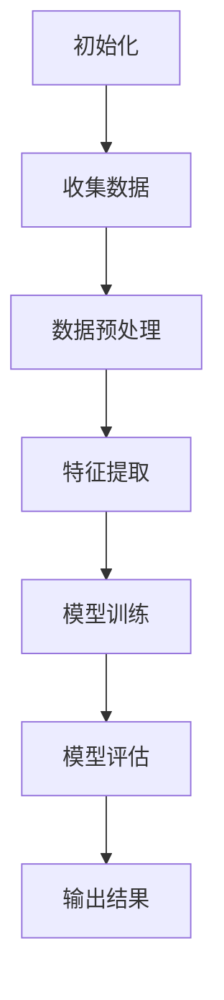
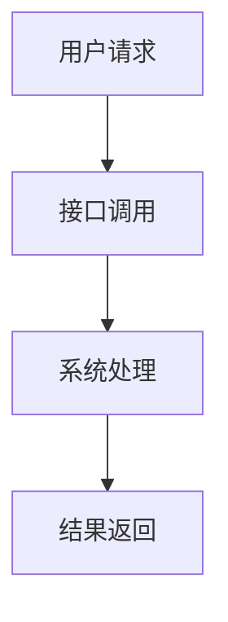

                 

### 设计《多智能体系统评估公司创新能力：价值投资的新维度》的目录大纲

在设计一篇技术博客时，我们需要确保文章的逻辑清晰、结构紧凑，并且能够吸引读者的兴趣。以下是《多智能体系统评估公司创新能力：价值投资的新维度》的目录大纲，它遵循了从背景介绍到具体实现的完整流程，确保了文章的完整性和专业性。

#### **目录大纲**

**第一部分：背景介绍**

**第1章：多智能体系统与公司创新能力概述**

1.1 多智能体系统的基本概念

- **1.1.1 多智能体系统的定义**
- **1.1.2 多智能体系统的特点**
- **1.1.3 多智能体系统的结构**

1.2 公司创新能力的重要性

- **1.2.1 公司创新能力的定义**
- **1.2.2 公司创新能力的影响因素**
- **1.2.3 公司创新能力与价值投资的关系**

1.3 多智能体系统评估公司创新能力的创新性

- **1.3.1 多智能体系统评估的背景**
- **1.3.2 多智能体系统评估的优势**
- **1.3.3 多智能体系统评估的应用前景**

**第二部分：核心概念与联系**

**第2章：多智能体系统评估的核心概念与联系**

2.1 多智能体系统的基本原理

- **2.1.1 多智能体系统的原理概述**
- **2.1.2 多智能体系统的通信机制**
- **2.1.3 多智能体系统的协调策略**

2.2 公司创新能力的特征与衡量标准

- **2.2.1 公司创新能力的特征分析**
- **2.2.2 公司创新能力衡量标准**
- **2.2.3 公司创新能力评估的重要性**

2.3 多智能体系统评估与公司创新能力的关联

- **2.3.1 多智能体系统评估的理论基础**
- **2.3.2 多智能体系统评估的方法论**
- **2.3.3 多智能体系统评估的实际应用**

**第三部分：算法原理讲解**

**第3章：评估公司创新能力的算法原理**

3.1 算法概述

- **3.1.1 算法的定义**
- **3.1.2 算法的目标**
- **3.1.3 算法的基本框架**

3.2 算法流程图

3.3 算法实现

- **3.3.1 Python 源代码**
- **3.3.2 算法原理讲解**

**第四部分：系统分析与架构设计方案**

**第4章：多智能体系统评估的架构设计**

4.1 评估系统应用场景

- **4.1.1 评估系统的需求分析**
- **4.1.2 评估系统的目标用户**
- **4.1.3 评估系统的应用领域**

4.2 系统功能设计

- **4.2.1 系统功能概述**
- **4.2.2 功能模块划分**
- **4.2.3 功能实现细节**

4.3 系统架构设计

- **4.3.1 系统架构概述**
- **4.3.2 系统层次结构**
- **4.3.3 系统模块交互设计**

4.4 系统接口设计

- **4.4.1 接口规范**
- **4.4.2 接口实现**
- **4.4.3 接口调用流程**

4.5 系统交互设计

**第五部分：项目实战**

**第5章：多智能体系统评估项目实战**

5.1 环境安装与配置

- **5.1.1 环境准备**
- **5.1.2 系统安装**
- **5.1.3 配置文件设置**

5.2 系统核心功能实现

- **5.2.1 数据收集模块**
- **5.2.2 数据预处理模块**
- **5.2.3 特征提取模块**
- **5.2.4 模型训练模块**
- **5.2.5 模型评估模块**

5.3 实际案例分析

- **5.3.1 案例背景**
- **5.3.2 案例分析**
- **5.3.3 结果解读**

5.4 项目小结

- **5.4.1 项目总结**
- **5.4.2 项目改进方向**
- **5.4.3 项目贡献与展望**

**第六部分：最佳实践与小结**

**第6章：最佳实践与小结**

6.1 最佳实践 tips

- **6.1.1 实践技巧**
- **6.1.2 注意事项**
- **6.1.3 拓展阅读**

6.2 小结

- **6.2.1 文章总结**
- **6.2.2 研究方向**
- **6.2.3 未来展望**

### **关键步骤与逻辑思路**

**1. 背景介绍：**
   - 解释多智能体系统和公司创新能力的概念。
   - 引出评估公司创新能力在价值投资中的重要性。
   - 强调多智能体系统评估的创新性和实用性。

**2. 核心概念与联系：**
   - 详细介绍多智能体系统的基本原理。
   - 分析公司创新能力的特征及其衡量标准。
   - 展示多智能体系统评估与公司创新能力之间的关联。

**3. 算法原理讲解：**
   - 概述评估公司创新能力的算法。
   - 使用 Mermaid 画出算法流程图。
   - 使用 Python 源代码解释算法的实现。
   - 展示数学模型和公式，并进行详细讲解。

**4. 系统分析与架构设计方案：**
   - 介绍评估系统应用场景。
   - 展示系统的功能设计、架构设计和接口设计。
   - 使用 Mermaid 绘制相关的类图、架构图和序列图。

**5. 项目实战：**
   - 安装和配置评估系统的环境。
   - 展示系统核心功能的实现和源代码。
   - 分析实际案例，并进行详细讲解。

**6. 最佳实践 tips：**
   - 提供使用多智能体系统评估公司创新能力的实用技巧。
   - 强调实施过程中的注意事项。

**7. 小结：**
   - 总结整篇文章的核心内容和贡献。
   - 提出未来研究和实践的方向。

通过这种逐步分析推理的方式，我们可以确保文章的逻辑性和深度，同时使读者能够更好地理解和掌握文章的内容。这种结构不仅有助于文章的组织，还能够提升读者的阅读体验，使得技术博客更具吸引力和实用性。

