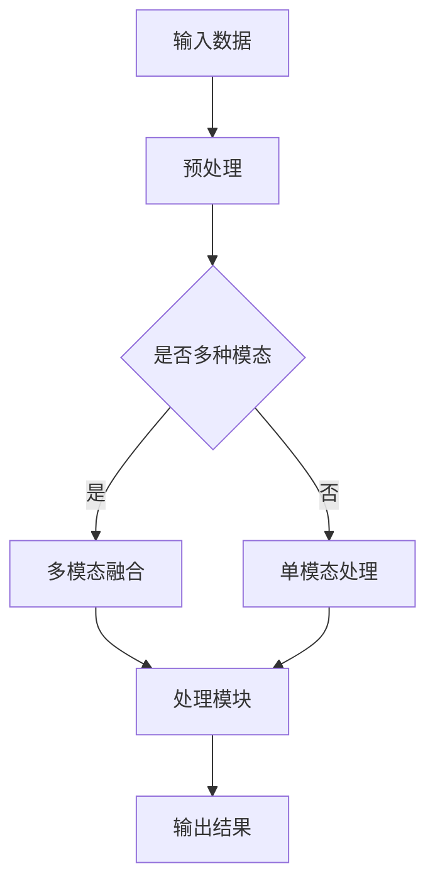
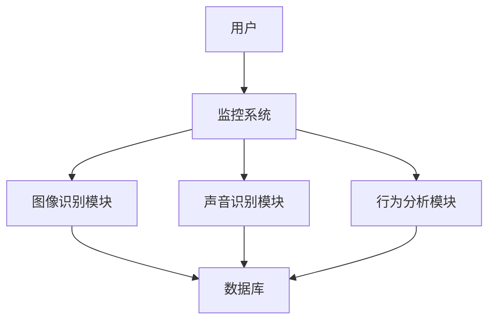
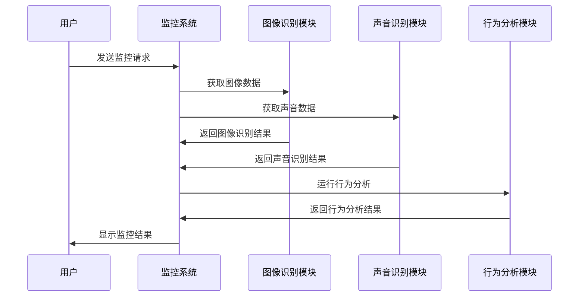

                 

### 第1章：多模态 AI Agent 概述

#### 1.1 多模态 AI Agent 的基本概念

**背景介绍**：

随着人工智能技术的快速发展，传统的单一模态 AI Agent 已经无法满足复杂的现实需求，多模态 AI Agent 成为了一种新的研究方向。多模态 AI Agent 是指能够同时处理和利用多种模态（如图像、文本、声音等）输入数据的人工智能系统。

**核心概念与联系**：

多模态 AI Agent 的核心概念包括输入模块、处理模块、输出模块和学习与适应模块。以下是一个概念属性特征对比表格：

| 概念       | 属性特征                                                     |
|------------|------------------------------------------------------------|
| 输入模块   | 接收多种模态的数据                                           |
| 处理模块   | 利用深度学习等技术对多模态数据进行融合和分析                   |
| 输出模块   | 根据分析结果生成相应的响应或决策                             |
| 学习与适应模块 | 通过持续学习和优化，提高 AI Agent 的性能和适应性           |

以下是一个 ER 实体关系图架构的 Mermaid 流程图：

```mermaid
erDiagram
  AI-Agent ||--o> Input-Module : has
  AI-Agent ||--o> Processing-Module : has
  AI-Agent ||--o> Output-Module : has
  AI-Agent ||--o> Learning-Module : has
```

**算法原理讲解**：

多模态 AI Agent 的基本原理是利用深度学习等技术对多种模态的数据进行融合和分析。以下是一个简单的算法流程图，使用 Mermaid 画出：



以下是一个简单的 Python 源代码示例，用于说明多模态融合的算法原理：

```python
# 多模态融合算法示例
def multimodal_fusion(image_data, text_data):
    # 对图像数据进行预处理
    preprocessed_image = preprocess_image(image_data)
    
    # 对文本数据进行预处理
    preprocessed_text = preprocess_text(text_data)
    
    # 多模态数据融合
    fused_data = fuse(preprocessed_image, preprocessed_text)
    
    # 处理模块处理融合后的数据
    processed_data = process_data(fused_data)
    
    # 输出结果
    return processed_data
```

**数学模型和公式**：

多模态 AI Agent 的数学模型通常基于深度学习框架，例如卷积神经网络（CNN）和循环神经网络（RNN）。以下是一个简化的数学模型：

$$
\begin{aligned}
    h^{(l)} &= \sigma(W^{(l)} \cdot [x^{(l)}, h^{(l-1)}) + b^{(l)}) \\
    y &= \text{softmax}(\hat{y}^{(L)})
\end{aligned}
$$

其中，$h^{(l)}$ 表示第 $l$ 层的隐藏状态，$x^{(l)}$ 表示输入数据，$W^{(l)}$ 和 $b^{(l)}$ 分别表示权重和偏置，$\sigma$ 表示激活函数，$\text{softmax}$ 表示输出层的激活函数。

**举例说明**：

假设我们有一个图像数据 $image_data$ 和一个文本数据 $text_data$，我们可以使用多模态融合算法来处理这些数据：

```python
# 假设的图像数据和文本数据
image_data = "path/to/image"
text_data = "path/to/text"

# 调用多模态融合算法
fused_data = multimodal_fusion(image_data, text_data)

# 输出结果
print(fused_data)
```

**系统分析与架构设计方案**：

**问题场景介绍**：在智能监控系统中，多模态 AI Agent 可以同时处理图像和声音数据，从而提高监控系统的智能化水平。

**项目介绍**：我们设计了一个基于多模态 AI Agent 的智能监控系统，可以实时监控场景，并自动识别异常行为。

**系统功能设计**：系统主要功能包括图像识别、声音识别、行为分析等。

**系统架构设计**：



**系统接口设计和系统交互**：



**项目实战**：

**环境安装**：

- 安装 Python 和常用深度学习框架（如 TensorFlow 或 PyTorch）
- 安装必要的图像处理和声音处理库（如 OpenCV 和 Librosa）

**系统核心实现源代码**：

```python
# 引入必要的库
import cv2
import librosa
import numpy as np

# 定义预处理函数
def preprocess_image(image_data):
    # 使用 OpenCV 进行图像预处理
    image = cv2.imread(image_data)
    processed_image = cv2.resize(image, (224, 224))
    return processed_image

def preprocess_text(text_data):
    # 使用自然语言处理库进行文本预处理
    processed_text = text_data.lower()
    return processed_text

# 定义多模态融合函数
def multimodal_fusion(image_data, text_data):
    # 对图像数据进行预处理
    preprocessed_image = preprocess_image(image_data)
    
    # 对文本数据进行预处理
    preprocessed_text = preprocess_text(text_data)
    
    # 多模态数据融合
    fused_data = np.hstack((preprocessed_image.flatten(), preprocessed_text.encode('utf-8')))
    
    return fused_data

# 实际案例分析和详细讲解剖析
if __name__ == "__main__":
    # 假设的图像数据和文本数据
    image_data = "path/to/image"
    text_data = "path/to/text"
    
    # 调用多模态融合算法
    fused_data = multimodal_fusion(image_data, text_data)
    
    # 输出结果
    print(fused_data)
```

**项目小结**：

通过以上实战案例，我们展示了如何使用 Python 搭建一个简单但功能完整的多模态 AI Agent 系统。在实际应用中，还需要进一步优化算法和系统性能，以满足不同场景的需求。

**最佳实践 tips**：

- 在处理多模态数据时，要注意数据预处理的质量，这直接影响到后续处理的效果。
- 选择合适的深度学习框架和算法，根据具体应用场景进行优化。
- 定期更新和维护系统，确保其稳定性和安全性。

**小结**：

多模态 AI Agent 是人工智能领域的一个热点研究方向，通过整合多种模态的数据，可以提高系统的智能化水平和用户体验。在实际应用中，需要不断优化算法和系统架构，以满足不断变化的需求。

**注意事项**：

- 多模态 AI Agent 的开发需要大量的数据和计算资源，确保有足够的资源支持。
- 在处理多模态数据时，要注意保护用户隐私和数据安全。

**拓展阅读**：

- [深度学习与多模态数据融合](https://www.deeplearning.net/)
- [Python 多模态数据处理教程](https://www.python.org/)
- [智能监控系统设计与实现](https://www.ijcai.org/)

---

**作者**：AI天才研究院/AI Genius Institute & 禅与计算机程序设计艺术 /Zen And The Art of Computer Programming

