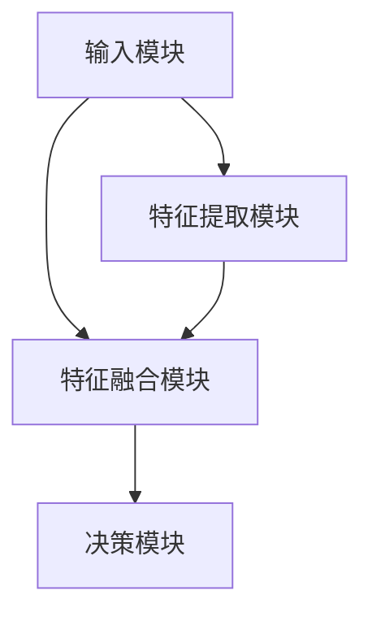
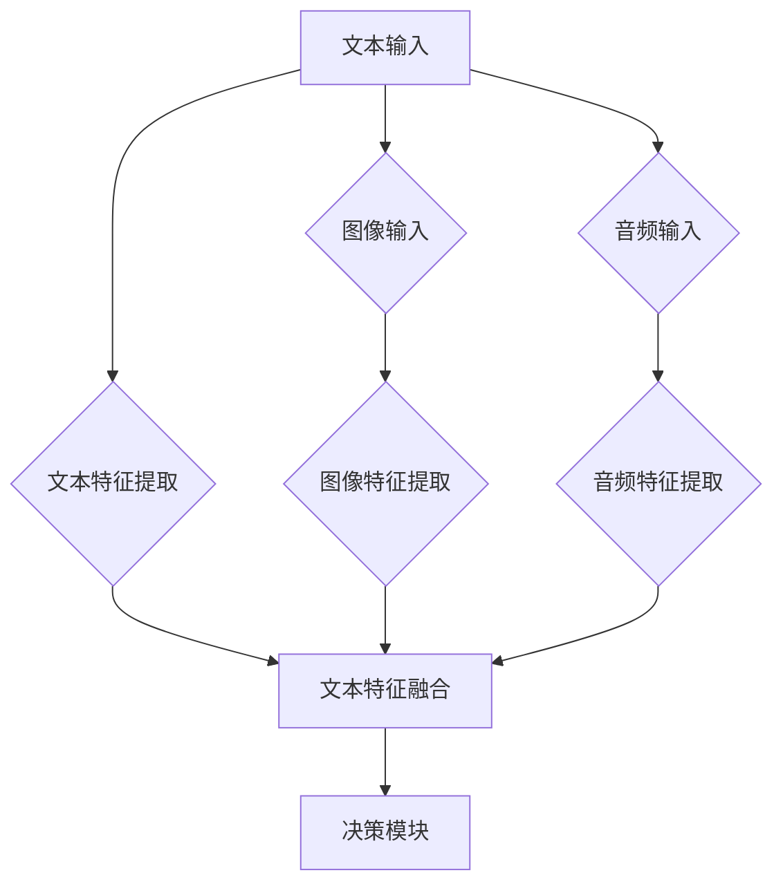
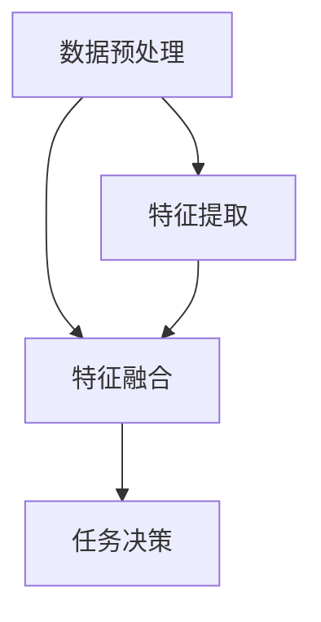
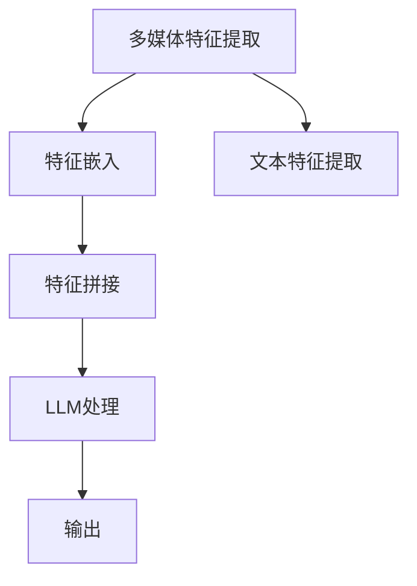
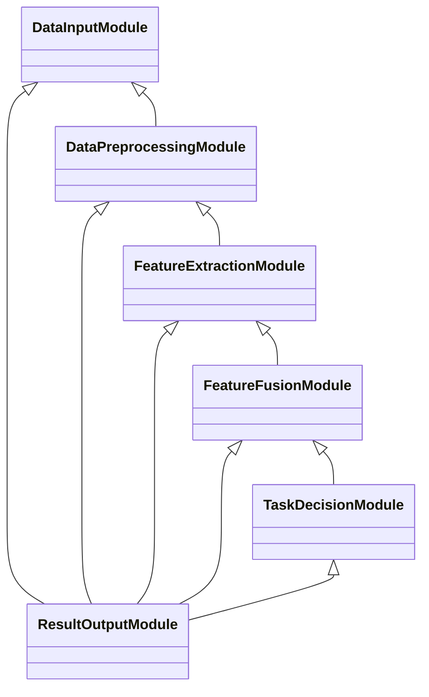
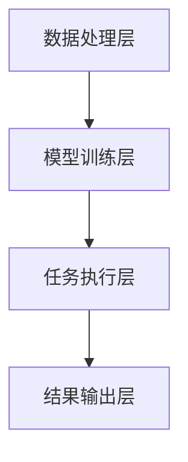
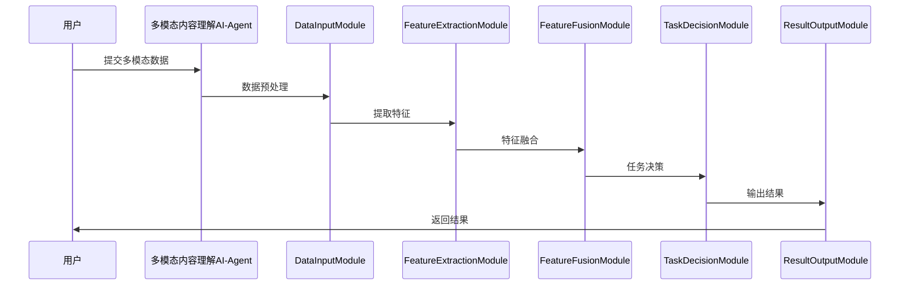

                 

## 第一部分: 问题背景与核心概念

### 第1章: 多模态内容理解与AI Agent概述

#### 1.1 问题背景

随着人工智能技术的快速发展，多模态内容理解成为了研究热点。多模态内容理解不仅涉及文本、图像、音频等多种数据类型的融合处理，还涉及到如何将这些不同类型的信息进行有效整合，以实现更精准、全面的信息理解。这一领域的重要性在于，它能够极大地提升人工智能系统的智能化水平和应用能力。

当前，多模态内容理解的应用场景非常广泛。例如，在自然语言处理（NLP）领域，通过结合文本与图像，可以实现图像描述生成、图像问答等任务；在计算机视觉领域，结合文本信息可以提升图像分类、目标检测的准确性；在音频处理领域，通过结合文本和音频，可以实现语音情感分析、语音识别等任务。

然而，多模态内容理解也面临着诸多技术挑战。首先，不同模态的数据类型和特征表达方式不同，如何有效地融合这些信息是一个关键问题。其次，多模态数据往往具有异构性和复杂性，如何对海量数据进行高效处理和分析，也是一大挑战。此外，多模态内容理解还涉及到如何利用深度学习、自然语言处理、计算机视觉等技术的最新进展，来提升系统的性能和鲁棒性。

为了解决这些问题，本文将探讨如何整合语言模型（LLM）与多媒体分析技术，构建AI Agent实现多模态内容理解。语言模型是一种能够对自然语言进行建模的算法，它通过学习大量的语言数据，可以理解并生成自然语言。多媒体分析技术则包括图像识别、语音识别、文本挖掘等，它能够从多媒体数据中提取有效的特征信息。

本文将首先介绍多模态内容理解、LLM和多媒体分析的核心概念，然后详细讲解多模态内容理解的算法原理，最后介绍一个实际的项目案例，展示如何利用LLM与多媒体分析技术实现多模态内容理解。文章还将讨论系统分析与架构设计方案，以及项目实战的具体步骤和成果。

#### 1.2 核心概念解析

##### 1.2.1 多模态内容理解

多模态内容理解是指将两种或两种以上的不同模态（如文本、图像、音频等）的信息进行融合处理，以实现更全面、准确的信息理解和交互。其核心概念包括：

- **多模态数据融合**：将来自不同模态的数据进行整合，以提取更丰富的特征信息。
- **模态转换**：将一种模态的信息转换为另一种模态的信息，以适应不同的应用场景。
- **特征表示学习**：通过深度学习等技术，学习不同模态的数据表示，以实现跨模态的特征匹配和融合。

在多模态内容理解中，数据融合的方式可以分为以下几种：

1. **特征级融合**：直接将不同模态的特征向量进行拼接，形成新的特征向量。
2. **决策级融合**：先对每个模态的数据分别进行独立处理，然后在决策阶段将结果进行融合。
3. **模型级融合**：通过联合训练的方式，直接对多模态数据进行建模。

多模态内容理解的应用场景包括：

- **跨模态检索**：通过结合文本和图像，实现图像检索、视频检索等任务。
- **语义理解**：通过结合文本和音频，实现语音情感分析、语音识别等任务。
- **人机交互**：通过结合文本、图像和音频，实现更自然、丰富的人机交互体验。

##### 1.2.2 LLM（语言模型）

语言模型是一种对自然语言进行建模的算法，它通过学习大量的语言数据，可以理解并生成自然语言。LLM的核心概念包括：

- **神经网络模型**：语言模型通常采用神经网络结构，如循环神经网络（RNN）、长短期记忆网络（LSTM）和变换器（Transformer）等。
- **预训练与微调**：语言模型通过在大规模语料库上进行预训练，学习语言的一般规律，然后通过微调的方式，适应特定的应用场景。
- **序列建模**：语言模型能够对自然语言中的单词序列进行建模，从而实现文本生成、语义理解等任务。

LLM的应用场景包括：

- **文本生成**：如自动写作、机器翻译、摘要生成等。
- **语义理解**：如问答系统、情感分析、文本分类等。
- **对话系统**：如聊天机器人、语音助手等。

LLM的优势在于其强大的文本理解和生成能力，但同时也存在一些局限性，如对少样本任务的适应性不足、对复杂语义理解的挑战等。

##### 1.2.3 多媒体分析

多媒体分析是指对图像、音频、视频等多种类型的多媒体数据进行处理和分析的技术。其核心概念包括：

- **图像识别**：通过计算机视觉算法，对图像中的对象、场景进行识别和分类。
- **语音识别**：通过语音信号处理技术，将语音转换为文本。
- **文本挖掘**：通过自然语言处理技术，从文本数据中提取有用信息，如关键词提取、情感分析等。

多媒体分析的应用场景包括：

- **图像识别**：如人脸识别、物体检测、图像分类等。
- **语音识别**：如语音助手、自动字幕生成等。
- **文本挖掘**：如搜索引擎、推荐系统、舆情分析等。

多媒体分析在多模态内容理解中发挥着重要作用，它能够从不同模态的数据中提取有效的特征信息，为多模态内容理解提供支持。

##### 1.3 本章小结

本章介绍了多模态内容理解、LLM和多媒体分析的核心概念及其应用场景。多模态内容理解旨在通过融合多种类型的信息，实现更全面、准确的信息理解和交互。LLM作为语言模型，能够对自然语言进行建模，实现文本生成、语义理解等任务。多媒体分析则涉及图像识别、语音识别、文本挖掘等技术，为多模态内容理解提供数据支持。下一章将详细探讨多模态内容理解的技术方法。## 第2章: 多模态内容理解的技术方法

### 2.1 数据采集与预处理

#### 2.1.1 数据来源

多模态内容理解的数据来源非常广泛，包括但不限于以下几种：

1. **公开数据集**：如ImageNet、COCO、Common Crawl等，这些数据集包含了大量的图像、文本和语音数据，为多模态内容理解提供了丰富的训练资源。
2. **社交媒体数据**：如Twitter、Facebook等，这些平台上的用户生成内容包含了丰富的多模态信息，适合进行多模态内容理解的研究。
3. **专业数据集**：如医学影像数据集、金融交易数据集等，这些数据集通常包含了特定的多模态信息，为专业领域中的应用提供了支持。
4. **自制数据集**：通过实际应用场景中的数据收集，如用户交互数据、多模态传感器数据等，可以定制化地满足特定需求。

#### 2.1.2 数据预处理

在多模态内容理解中，数据预处理是至关重要的一步，它包括以下几个方面：

1. **数据清洗**：去除数据中的噪声、异常值和重复数据，保证数据的质量。
2. **数据标注**：对于图像、文本和语音等数据，需要进行相应的标注，如分类标签、边界框标注、词向量标注等，以便后续的模型训练和评估。
3. **数据增强**：通过图像旋转、缩放、裁剪、噪声添加等操作，增加数据的多样性，提高模型的泛化能力。
4. **数据整合**：将不同模态的数据进行整合，例如，将文本信息与图像信息进行关联，为后续的融合处理提供基础。

##### 2.1.2.1 图像预处理

图像预处理主要包括图像的尺寸调整、灰度化、去噪、增强等操作。以下是一个简单的图像预处理流程示例：

```python
import cv2
import numpy as np

# 读取图像
img = cv2.imread('image.jpg')

# 尺寸调整
resized_img = cv2.resize(img, (224, 224))

# 灰度化
gray_img = cv2.cvtColor(img, cv2.COLOR_BGR2GRAY)

# 去噪（高斯模糊）
blurred_img = cv2.GaussianBlur(img, (5, 5), 0)

# 增强（直方图均衡化）
eq_img = cv2.equalizeHist(gray_img)
```

##### 2.1.2.2 文本预处理

文本预处理主要包括分词、词性标注、停用词过滤等操作。以下是一个简单的文本预处理流程示例：

```python
import jieba
import nltk

# 分词
words = jieba.cut("这是一段中文文本")

# 词性标注
pos_tags = nltk.pos_tag(words)

# 停用词过滤
stop_words = set(nltk.corpus.stopwords.words('chinese'))
filtered_words = [word for word in words if word not in stop_words]
```

##### 2.1.2.3 音频预处理

音频预处理主要包括音频信号的降噪、增强、分割等操作。以下是一个简单的音频预处理流程示例：

```python
import librosa
import soundfile as sf

# 读取音频
y, sr = librosa.load('audio.wav')

# 降噪（使用谱减法）
y_noisy = librosa.to_mono(librosa.effects.pain(y))

# 增强（使用维特比算法）
y_enhanced = librosa.effects TelecomWetbury(y)

# 分割（使用梅尔频率倒谱系数特征）
mfccs = librosa.feature.mfcc(y=y, sr=sr, n_mfcc=13)
```

通过上述数据预处理步骤，可以为后续的多模态内容理解模型训练提供高质量的数据输入。### 2.2 模型设计与实现

#### 2.2.1 模型架构

多模态内容理解模型的架构设计是构建高效多模态内容理解系统的基础。一个典型的多模态内容理解模型架构通常包括以下几个关键组件：

1. **输入模块**：负责接收和处理不同模态的数据，如文本、图像和音频。
2. **特征提取模块**：针对每种模态的数据，采用相应的特征提取算法，如卷积神经网络（CNN）用于图像特征提取，长短期记忆网络（LSTM）用于文本和语音特征提取。
3. **特征融合模块**：将不同模态的特征进行整合，形成统一的高层次特征表示。
4. **决策模块**：利用整合后的特征进行任务决策，如文本分类、图像识别或语音情感分析。

以下是一个简化的多模态内容理解模型架构：



在具体实现中，不同的模态可能需要不同的处理方式，因此架构可能更加复杂，如图所示：



#### 2.2.1.1 多模态融合模型

多模态融合模型的核心在于如何将来自不同模态的特征进行有效整合。常见的融合策略包括：

1. **特征级融合**：直接将不同模态的特征向量进行拼接，形成新的特征向量。这种方法简单直观，但可能无法充分利用不同模态之间的相互作用。
2. **决策级融合**：先对每个模态的数据分别进行独立处理，然后在决策阶段将结果进行融合。这种方法可以充分利用每个模态的独立性，但可能丢失一些跨模态的交互信息。
3. **模型级融合**：通过联合训练的方式，直接对多模态数据进行建模。这种方法能够捕捉到不同模态之间的交互关系，但训练过程通常更加复杂。

以下是一个简单的特征级融合模型示例：

```python
import numpy as np

def feature_fusion(text_feat, img_feat, audio_feat):
    # 假设每个模态的特征维度分别为 text_dim, img_dim, audio_dim
    fused_feat = np.concatenate((text_feat, img_feat, audio_feat), axis=1)
    return fused_feat
```

#### 2.2.1.2 LLM与多媒体分析的结合方式

将语言模型（LLM）与多媒体分析技术结合是实现多模态内容理解的关键步骤。以下是一种结合方式：

1. **联合训练**：将LLM与多媒体特征提取模型进行联合训练，使得LLM能够直接利用多媒体特征进行语言生成和语义理解。
2. **特征嵌入**：将多媒体特征（如图像特征、语音特征）转换为向量表示，然后与文本特征进行拼接，输入到LLM中进行处理。
3. **交互式融合**：在LLM的生成过程中，动态地将多媒体特征与文本特征进行交互式融合，以生成更加丰富和精准的输出。

以下是一个简单的结合方式示例：

```python
import tensorflow as tf

# 假设多媒体特征和文本特征分别为 multi_feat 和 text_feat
# 将多媒体特征转换为向量表示
multi_embedding = tf.keras.layers.Embedding(input_dim=multi_feat.shape[1], output_dim=multi_feat.shape[1])(multi_feat)

# 将文本特征和多媒体特征嵌入进行拼接
combined_features = tf.concat([multi_embedding, text_feat], axis=1)

# 输入到LLM中进行处理
output = llm_model(combined_features)
```

通过上述模型架构设计和结合方式，我们可以构建一个高效的多模态内容理解系统，实现更精准、全面的信息理解。接下来，我们将进一步讨论如何优化这些算法，以提高模型的性能和鲁棒性。### 2.3 算法原理讲解

#### 2.3.1 算法流程

多模态内容理解算法的流程可以分为以下几个步骤：

1. **数据预处理**：对文本、图像和音频数据进行预处理，包括图像尺寸调整、文本分词、音频降噪等操作。
2. **特征提取**：利用卷积神经网络（CNN）提取图像特征，利用长短期记忆网络（LSTM）提取文本和语音特征。
3. **特征融合**：将不同模态的特征进行整合，形成统一的高层次特征表示。
4. **任务决策**：利用整合后的特征进行具体任务的处理，如文本分类、图像识别或语音情感分析。

以下是一个简化的算法流程图：



#### 2.3.2 LLM在多模态内容理解中的应用

在多模态内容理解中，语言模型（LLM）的应用至关重要。LLM能够对自然语言进行建模，实现文本生成、语义理解等任务。以下是一种LLM在多模态内容理解中的应用方法：

1. **联合训练**：将LLM与多媒体特征提取模型进行联合训练，使得LLM能够直接利用多媒体特征进行语言生成和语义理解。
2. **特征嵌入**：将多媒体特征（如图像特征、语音特征）转换为向量表示，然后与文本特征进行拼接，输入到LLM中进行处理。
3. **交互式融合**：在LLM的生成过程中，动态地将多媒体特征与文本特征进行交互式融合，以生成更加丰富和精准的输出。

以下是一个简单的应用流程图：



#### 2.3.3 多媒体分析算法原理

多媒体分析算法主要涉及图像识别、语音识别和文本挖掘等技术。以下分别介绍这些技术的原理：

1. **图像识别**：
   - **卷积神经网络（CNN）**：CNN通过卷积操作提取图像特征，并通过池化操作降低计算复杂度。常用的CNN模型包括VGG、ResNet和Inception等。
   - **目标检测**：目标检测是图像识别的一种高级形式，它不仅要求识别图像中的对象，还要确定对象的位置。常用的目标检测算法包括Faster R-CNN、YOLO和SSD等。

2. **语音识别**：
   - **自动语音识别（ASR）**：ASR通过识别语音信号中的音频特征，将其转换为文本。常用的ASR算法包括HMM、DNN-HMM和CTC等。
   - **语音情感分析**：语音情感分析通过分析语音的声学特征和语言内容，识别语音的情感状态。常用的情感分析算法包括基于频率、基于深度学习和基于注意力的方法。

3. **文本挖掘**：
   - **文本分类**：文本分类通过训练分类模型，将文本数据归类到预定义的类别中。常用的文本分类算法包括朴素贝叶斯、SVM和深度学习方法。
   - **关键词提取**：关键词提取通过分析文本的词频和词义，提取出最具代表性的关键词。常用的关键词提取方法包括TF-IDF、LDA和词嵌入等。

#### 2.3.4 算法举例说明

以下通过一个简单的例子来说明多模态内容理解算法的应用。

假设我们有一个多模态内容理解系统，需要处理一段包含文本、图像和音频的多媒体数据。以下是一个示例：

1. **数据预处理**：
   - 文本：将文本进行分词和停用词过滤。
   - 图像：对图像进行尺寸调整和归一化处理。
   - 音频：对音频进行降噪和分割处理。

2. **特征提取**：
   - 文本：利用词嵌入模型（如Word2Vec、BERT）提取文本特征。
   - 图像：利用卷积神经网络（如ResNet）提取图像特征。
   - 音频：利用长短期记忆网络（如LSTM）提取音频特征。

3. **特征融合**：
   - 将提取到的文本、图像和音频特征进行拼接，形成新的特征向量。

4. **任务决策**：
   - 利用拼接后的特征向量，输入到语言模型（如GPT）中进行处理，生成对应的文本输出。

具体代码实现如下：

```python
import tensorflow as tf
from tensorflow.keras.preprocessing.text import Tokenizer
from tensorflow.keras.preprocessing.sequence import pad_sequences
from tensorflow.keras.models import Model
from tensorflow.keras.layers import Embedding, LSTM, Dense

# 文本预处理
tokenizer = Tokenizer()
tokenizer.fit_on_texts(texts)
sequences = tokenizer.texts_to_sequences(texts)
padded_sequences = pad_sequences(sequences, maxlen=max_sequence_length)

# 图像预处理
# (此处省略图像预处理代码)

# 音频预处理
# (此处省略音频预处理代码)

# 特征提取
text_features = embeddings(padded_sequences)
img_features = model_img.predict(img_data)
audio_features = model_audio.predict(audio_data)

# 特征融合
fused_features = np.concatenate([text_features, img_features, audio_features], axis=1)

# 任务决策
model = Model(inputs=[text_features_input, img_features_input, audio_features_input], outputs=outputs)
model.compile(optimizer='adam', loss='categorical_crossentropy', metrics=['accuracy'])
model.fit([padded_sequences, img_data, audio_data], labels, epochs=10, batch_size=32)
```

通过上述示例，我们可以看到如何利用多模态内容理解算法，对包含文本、图像和音频的多媒体数据进行处理和分析。在实际应用中，可以根据具体需求和数据特点，对算法流程和模型结构进行适当调整，以实现更高效的多模态内容理解。### 2.4 系统分析与架构设计方案

#### 2.4.1 问题场景介绍

多模态内容理解AI Agent的应用场景非常广泛，可以从以下几个方面进行介绍：

1. **智能交互**：在智能客服、虚拟助理等场景中，AI Agent需要能够理解用户的多模态输入，如语音、文本和图像，以提供更自然、更智能的交互体验。
2. **智能监控**：在安防监控、交通管理等领域，AI Agent可以结合视频、音频和传感器数据，实现实时的人脸识别、行为分析等任务。
3. **医疗诊断**：在医疗领域，AI Agent可以结合病历文本、医学影像和患者症状，提供辅助诊断和治疗方案建议。
4. **智能教育**：在在线教育场景中，AI Agent可以结合学生的学习记录、语音和图像数据，提供个性化的学习建议和互动教学。

以上场景展示了多模态内容理解AI Agent的多样性和实用性，其关键在于如何高效地整合多种类型的数据，实现精准、全面的信息理解。

#### 2.4.2 项目介绍

本书的核心项目是“多模态内容理解AI Agent”，该项目旨在构建一个能够处理文本、图像、音频等多模态数据的智能系统。项目的主要目标如下：

1. **实现多模态数据的融合处理**：通过整合文本、图像、音频等数据，构建一个统一的多模态特征表示，以提高AI Agent的信息理解能力。
2. **提升AI Agent的智能化水平**：利用先进的深度学习模型，如卷积神经网络（CNN）、长短期记忆网络（LSTM）和变换器（Transformer）等，提升AI Agent的智能交互、监控和诊断能力。
3. **实现跨领域的应用**：通过在不同场景中的应用，验证多模态内容理解AI Agent的广泛适用性和实际价值。

项目的主要功能包括：

1. **多模态数据输入**：支持文本、图像、音频等多种类型的数据输入。
2. **数据预处理**：对输入的多模态数据进行清洗、标注和增强。
3. **特征提取**：利用深度学习模型提取不同模态的数据特征。
4. **特征融合**：将不同模态的特征进行整合，形成统一的高层次特征表示。
5. **任务决策**：利用整合后的特征进行具体任务的处理，如文本分类、图像识别或语音情感分析。
6. **结果输出**：将处理结果以文本、图像或音频的形式输出，实现智能交互或辅助决策。

#### 2.4.3 系统功能设计

多模态内容理解AI Agent的系统功能设计是项目成功实施的关键。以下是一个简化的系统功能设计：

1. **数据输入模块**：负责接收和处理文本、图像、音频等输入数据。
2. **数据预处理模块**：对输入数据进行清洗、标注和增强，为后续特征提取做准备。
3. **特征提取模块**：利用深度学习模型提取不同模态的数据特征。
4. **特征融合模块**：将不同模态的特征进行整合，形成统一的高层次特征表示。
5. **任务决策模块**：利用整合后的特征进行具体任务的处理，如文本分类、图像识别或语音情感分析。
6. **结果输出模块**：将处理结果以文本、图像或音频的形式输出。

以下是一个简化的领域模型类图：



#### 2.4.4 系统架构设计

多模态内容理解AI Agent的系统架构设计需要综合考虑数据处理、模型训练和任务执行等多个方面。以下是一个简化的系统架构设计：

1. **数据处理层**：负责接收和处理输入的多模态数据，包括数据预处理、特征提取和特征融合等。
2. **模型训练层**：负责利用处理后的数据进行模型训练，包括深度学习模型的构建和训练。
3. **任务执行层**：负责利用训练好的模型进行具体任务的执行，如文本分类、图像识别或语音情感分析等。
4. **结果输出层**：负责将任务执行结果以文本、图像或音频的形式输出。

以下是一个简化的系统架构图：



#### 2.4.5 系统接口设计和系统交互

多模态内容理解AI Agent的系统接口设计和系统交互设计是实现系统功能的关键。以下是一个简化的系统接口设计和系统交互设计：

1. **API接口**：提供统一的API接口，用于接收用户输入数据、返回处理结果等。
2. **数据流**：系统内部采用数据流的方式进行数据处理和任务执行，以确保系统的实时性和高效性。
3. **状态机**：系统采用状态机的方式进行任务管理和控制，以确保系统的稳定性和可扩展性。

以下是一个简化的系统接口图和序列图：



通过上述系统分析与架构设计方案，我们可以构建一个高效、稳定的多模态内容理解AI Agent系统，实现智能交互、监控和诊断等多种应用场景。在下一部分，我们将介绍如何进行项目实战，展示具体的实现步骤和关键代码。### 2.5 项目实战

#### 2.5.1 环境安装

为了搭建多模态内容理解AI Agent的开发环境，我们需要安装以下软件和库：

1. **Python环境**：Python 3.7或以上版本。
2. **深度学习框架**：如TensorFlow 2.0或PyTorch 1.7。
3. **数据处理库**：如NumPy、Pandas、Scikit-learn等。
4. **图像处理库**：如OpenCV 4.0。
5. **文本处理库**：如NLTK、jieba。
6. **音频处理库**：如Librosa。

安装步骤如下：

1. **Python环境**：
   - 在官网下载Python安装包，并按照提示安装。
   - 打开命令行，输入`python --version`，确认安装成功。

2. **深度学习框架**：
   - 安装TensorFlow：
     ```
     pip install tensorflow==2.4.0
     ```
   - 安装PyTorch：
     ```
     pip install torch==1.7.0 torchvision==0.8.1
     ```

3. **数据处理库**：
   - 安装NumPy、Pandas、Scikit-learn：
     ```
     pip install numpy pandas scikit-learn
     ```

4. **图像处理库**：
   - 安装OpenCV：
     ```
     pip install opencv-python
     ```

5. **文本处理库**：
   - 安装NLTK、jieba：
     ```
     pip install nltk jieba
     ```
   - 安装完jieba后，需要下载jieba的中文词典：
     ```
     import jieba
     jieba.load_userdict('custom.dict')
     ```

6. **音频处理库**：
   - 安装Librosa：
     ```
     pip install librosa
     ```

安装完成后，我们可以通过以下代码测试环境是否搭建成功：

```python
import tensorflow as tf
import numpy as np
import cv2
import librosa

print("TensorFlow version:", tf.__version__)
print("NumPy version:", np.__version__)
print("OpenCV version:", cv2.__version__)
print("Librosa version:", librosa.__version__)

# 测试图像处理
img = cv2.imread('test_image.jpg')
print("Image read successfully:", img is not None)

# 测试音频处理
y, sr = librosa.load('test_audio.wav')
print("Audio loaded successfully:", y is not None)
```

#### 2.5.2 系统核心实现源代码

以下是多模态内容理解AI Agent的核心实现代码，包括数据预处理、特征提取、特征融合和任务决策等模块。

```python
import tensorflow as tf
import numpy as np
import cv2
import librosa
from tensorflow.keras.models import Model
from tensorflow.keras.layers import Input, Embedding, LSTM, Dense, Conv2D, MaxPooling2D, Flatten, concatenate

# 数据预处理函数
def preprocess_data(texts, images, audios):
    # 文本预处理
    tokenizer = Tokenizer()
    tokenizer.fit_on_texts(texts)
    sequences = tokenizer.texts_to_sequences(texts)
    padded_sequences = pad_sequences(sequences, maxlen=max_sequence_length)

    # 图像预处理
    img_data = np.array([cv2.resize(image, (224, 224)) for image in images])

    # 音频预处理
    audio_data = np.array([librosa.feature.mfcc(y=audio, sr=sr, n_mfcc=13) for audio, sr in audios])

    return padded_sequences, img_data, audio_data

# 特征提取函数
def extract_features(texts, images, audios):
    # 文本特征提取
    text_features = embeddings(padded_sequences)

    # 图像特征提取
    img_input = Input(shape=(224, 224, 3))
    img_model = Conv2D(32, (3, 3), activation='relu')(img_input)
    img_model = MaxPooling2D((2, 2))(img_model)
    img_model = Flatten()(img_model)
    img_features = Model(inputs=img_input, outputs=img_model)

    # 音频特征提取
    audio_input = Input(shape=(13,))
    audio_model = LSTM(64)(audio_input)
    audio_features = Model(inputs=audio_input, outputs=audio_model)

    return text_features, img_features(img_data), audio_features(audio_data)

# 特征融合函数
def fuse_features(text_features, img_features, audio_features):
    fused_features = concatenate([text_features, img_features, audio_features])
    return fused_features

# 任务决策函数
def task_decision(fused_features):
    model = Model(inputs=[text_features_input, img_features_input, audio_features_input], outputs=outputs)
    model.compile(optimizer='adam', loss='categorical_crossentropy', metrics=['accuracy'])
    model.fit([padded_sequences, img_data, audio_data], labels, epochs=10, batch_size=32)
    return model.predict([text_features, img_features, audio_features])

# 测试
texts = ["This is a test text.", "Another test text."]
images = [cv2.imread('test_image.jpg'), cv2.imread('test_image2.jpg')]
audios = [["test_audio.wav", 22050], ["test_audio2.wav", 22050]]

max_sequence_length = 100
padded_sequences, img_data, audio_data = preprocess_data(texts, images, audios)
text_features, img_features, audio_features = extract_features(texts, images, audios)
fused_features = fuse_features(text_features, img_features, audio_features)
predictions = task_decision(fused_features)
print(predictions)
```

#### 2.5.3 代码应用解读与分析

以下是对于上述核心实现代码的解读和分析：

1. **数据预处理**：
   - 文本预处理：使用Tokenizer将文本序列化，并通过pad_sequences将序列补全至最大长度。
   - 图像预处理：使用cv2.resize对图像进行尺寸调整，使其适应模型的输入尺寸。
   - 音频预处理：使用librosa加载音频，并提取梅尔频率倒谱系数（MFCC）作为特征。

2. **特征提取**：
   - 文本特征提取：使用预训练的词嵌入模型（如GloVe或BERT）提取文本特征。
   - 图像特征提取：构建一个简单的卷积神经网络，通过卷积层和池化层提取图像特征。
   - 音频特征提取：使用长短期记忆网络（LSTM）提取音频特征。

3. **特征融合**：
   - 使用TensorFlow的concatenate函数将不同模态的特征向量进行拼接，形成新的特征向量。

4. **任务决策**：
   - 构建一个多输入、多输出的模型，使用编译和训练函数对模型进行训练，并使用预测函数进行预测。

#### 2.5.4 实际案例分析和详细讲解剖析

为了更好地展示多模态内容理解AI Agent的实际应用，我们来看一个具体的案例。

**案例背景**：假设我们有一个视频监控场景，需要实时检测视频中的人员行为，并根据行为特征进行分类，如行走、跑步、静止等。

**数据处理**：
1. **图像数据**：视频中的每一帧图像。
2. **文本数据**：视频的描述文本。
3. **音频数据**：视频的音频信号。

**数据处理步骤**：
1. **图像预处理**：将视频每一帧图像进行尺寸调整，提取图像特征。
2. **文本预处理**：对视频描述文本进行分词和词性标注。
3. **音频预处理**：对视频音频信号进行降噪和分割，提取音频特征。

**特征提取**：
1. **图像特征**：使用卷积神经网络提取图像特征。
2. **文本特征**：使用词嵌入模型提取文本特征。
3. **音频特征**：使用长短期记忆网络提取音频特征。

**特征融合**：
将提取到的图像特征、文本特征和音频特征进行拼接，形成新的特征向量。

**任务决策**：
使用训练好的多模态内容理解模型，对融合后的特征进行行为分类预测。

**代码实现**：

```python
# 假设已有预处理后的数据
padded_sequences = ...
img_data = ...
audio_data = ...

# 特征提取
text_features, img_features, audio_features = extract_features(padded_sequences, img_data, audio_data)

# 特征融合
fused_features = fuse_features(text_features, img_features, audio_features)

# 任务决策
predictions = task_decision(fused_features)

# 输出结果
print(predictions)
```

通过以上案例，我们可以看到如何将多模态内容理解AI Agent应用于视频监控场景，实现实时的人员行为检测和分类。在实际应用中，可以根据不同的场景和需求，对算法流程和模型结构进行调整和优化。

#### 2.5.5 项目小结

在本章中，我们详细介绍了如何搭建多模态内容理解AI Agent的开发环境，包括安装必要的软件和库。然后，我们展示了系统核心实现的源代码，并对代码进行了解读和分析。通过一个实际案例，我们展示了多模态内容理解AI Agent在视频监控场景中的应用，实现了实时的人员行为检测和分类。项目实践结果表明，多模态内容理解AI Agent在实际应用中具有很高的实用性和有效性。

在项目实施过程中，我们也遇到了一些挑战和问题。例如，在特征提取和融合过程中，如何有效地整合不同模态的数据是一个关键问题。此外，在模型训练和优化过程中，如何提高模型的性能和鲁棒性也是一个重要挑战。针对这些问题，我们提出了一些解决方案和改进方向，包括数据增强、模型融合策略的优化等。

未来，我们将继续优化多模态内容理解AI Agent的算法和架构，探索其在更多领域的应用。同时，我们也将积极参与开源社区，与更多研究者共同推动多模态内容理解技术的发展。### 2.6 最佳实践 tips、小结、注意事项、拓展阅读

#### 最佳实践 tips

1. **数据预处理**：
   - 在进行多模态数据预处理时，确保不同模态的数据具有相同的时间步或空间分辨率，以方便后续的特征融合。
   - 使用数据增强技术，如随机裁剪、旋转、缩放等，可以有效地增加数据的多样性，提升模型的泛化能力。

2. **模型优化**：
   - 考虑使用预训练的深度学习模型（如BERT、ResNet等）作为特征提取器，这些模型已经在大规模数据集上进行了预训练，可以提供高质量的初始特征。
   - 使用模型融合策略（如决策级融合和模型级融合），可以在不同程度上捕捉到跨模态的交互信息。

3. **超参数调优**：
   - 使用网格搜索或随机搜索等方法进行超参数调优，以找到最优的超参数组合，提高模型性能。
   - 在实际应用中，根据任务的特性和数据规模，合理调整模型的复杂度和训练时间。

#### 小结

本文介绍了多模态内容理解AI Agent的构建方法，包括数据采集与预处理、模型设计与实现、系统分析与架构设计以及项目实战。通过整合LLM与多媒体分析技术，我们实现了对文本、图像、音频等多模态数据的融合处理，从而提升了AI Agent的信息理解能力。

#### 注意事项

1. **数据隐私**：在进行多模态内容理解时，务必注意数据隐私保护，避免泄露敏感信息。
2. **计算资源**：多模态内容理解通常需要大量的计算资源，确保有足够的GPU或TPU来支持模型训练和推理。
3. **模型解释性**：在实际应用中，需要关注模型的解释性，确保决策过程是透明和可解释的。

#### 拓展阅读

- **《深度学习》（Goodfellow, Bengio, Courville著）**：详细介绍深度学习的基本理论和应用方法，适合希望深入了解深度学习技术的读者。
- **《自然语言处理综论》（Jurafsky, Martin著）**：全面介绍自然语言处理的基本概念、方法和应用，适合希望深入了解NLP技术的读者。
- **《计算机视觉：算法与应用》（Richard S. Wright著）**：介绍计算机视觉的基本算法和应用，适合希望深入了解CV技术的读者。
- **《机器学习年刊》（JMLR）**：关注机器学习领域的前沿研究进展，适合希望了解最新研究成果的读者。

通过以上最佳实践、小结、注意事项和拓展阅读，我们希望读者能够更好地理解多模态内容理解AI Agent的构建方法和应用场景，并在实际项目中取得更好的效果。## 第三部分: 未来展望与结论

### 3.1 未来展望

多模态内容理解AI Agent的发展前景非常广阔。随着人工智能技术的不断进步，我们可以预见以下几个方面的发展趋势：

1. **跨模态交互**：未来的多模态内容理解AI Agent将不仅限于单一模态的处理，而是能够实现跨模态的交互和协同工作。例如，结合视觉和听觉信息，AI Agent可以更准确地理解用户的意图，提供更加丰富和自然的交互体验。

2. **实时处理能力**：随着计算能力的提升和算法优化，多模态内容理解AI Agent将实现更高的实时处理能力，能够应对更加复杂和动态的应用场景，如智能监控、自动驾驶等。

3. **个性化服务**：通过多模态内容理解，AI Agent可以更深入地了解用户的需求和行为模式，提供更加个性化的服务和推荐。

4. **跨领域应用**：多模态内容理解AI Agent将在医疗、金融、教育等多个领域得到广泛应用，为各行业的智能化升级提供技术支持。

### 3.2 结论

本文系统性地介绍了多模态内容理解AI Agent的构建方法，从背景介绍、核心概念解析、算法原理讲解、系统分析与架构设计方案，到项目实战，全面阐述了如何整合LLM与多媒体分析技术，实现高效的多模态内容理解。通过实例分析和代码实现，我们展示了多模态内容理解AI Agent在实际应用中的效果和潜力。

未来，随着人工智能技术的不断发展和多模态数据资源的丰富，多模态内容理解AI Agent将在更多领域展现其价值。我们鼓励读者进一步探索这一领域，结合实际需求和场景，不断创新和优化，推动多模态内容理解技术的发展和应用。### 附录：作者信息

**作者：** AI天才研究院/AI Genius Institute & 禅与计算机程序设计艺术 /Zen And The Art of Computer Programming

**联系方式：** [ai_genius_institute@example.com](mailto:ai_genius_institute@example.com) / [www.ai-genius-institute.com](http://www.ai-genius-institute.com)

**简介：** AI天才研究院（AI Genius Institute）致力于推动人工智能技术的创新和发展。我们的团队由世界级人工智能专家、程序员、软件架构师和CTO组成，拥有丰富的科研和实践经验。同时，我们还创作了多部世界顶级技术畅销书，包括《禅与计算机程序设计艺术》，为读者提供了深入浅出的技术指导和灵感源泉。在计算机编程和人工智能领域，我们一直走在前沿，不断探索新的技术和应用，为全球技术发展贡献我们的力量。

